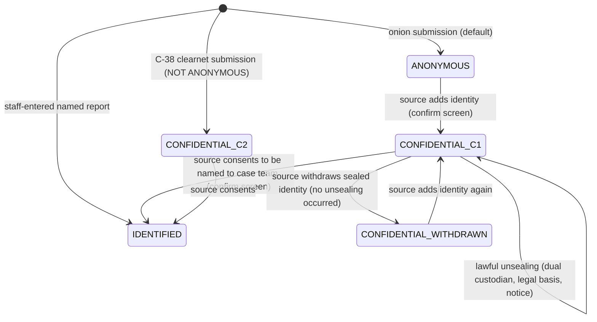

# 03 — Privacy and Anonymity

Status: Draft v1.0 · Edition applicability: both (CE and EE; MANAGED service covered in §10.3) · Owner: Privacy Engineering + Security Architecture

## 1. Purpose and scope

This document defines precisely what Candor means by **anonymous**, **confidential** and **identified**; from whom each protection holds and under which assumptions; and — in the **formal metadata inventory** (§8) — exactly which data each layer of the system sees for each request type, and what happens to it. It also contains the **legal-compulsion inventory** (§10) listing everything an operator or the vendor could be forced to produce, the analysis of whether Tor should be required (§11), and the aggregation/inference controls and k-thresholds for all statistics (§12).

It owns the `ANON-` (anonymity and modes), `META-` (metadata handling) and `PRIV-` (privacy governance, minimization, statistics, compulsion) requirement prefixes.

The inventory is **normative**: any datum not listed for a layer SHALL NOT be collected at that layer (META-001).

## 2. Context and dependencies

| Document | Relation |
|---|---|
| `DECISIONS.md` | ADR-001 (onion only), ADR-002 (three modes, no fallback), ADR-003 (Tor required, no fingerprinting), ADR-004 (Tier W/V), ADR-005 (passphrase), ADR-008 (keys), ADR-009 (intake/core, pull), ADR-010 (timing), ADR-011 (padding), ADR-014 (sealed identity), ADR-016 (audit classes), ADR-017 (notifications), ADR-021 (tenancy), ADR-023 (telemetry), ADR-025 (deletion). |
| `02-THREAT-MODEL.md` | Adversaries ADV-01..30, threats THR-*, component compromise analysis; this document is the ground truth for "observable information" in `02` §6. |
| `01-PRODUCT-REQUIREMENTS.md` | Modes, metrics (SM-*), prohibited claims. |
| `05-SOURCE-OPSEC.md` | Source guidance implementing the behavioral assumptions in §4. |
| `11-FRONTEND-SOURCE.md`, `16-TOR-I2P.md`, `20-LOGGING-AUDITING.md`, `35-DATA-RETENTION-DELETION.md` | Implement META requirements. |
| `25-COMPLIANCE.md` | GDPR/EU Directive mappings (Art 16 confidentiality incl. indirect identification; Art 18 records). |
| `40-SECURITY-ASSUMPTIONS.md` | ASM IDs for the assumptions tagged `[A:…]` here (same tags as `02` §3). |

## 3. Definitions

### 3.1 Reporting modes (ADR-002, ADR-014)

| Mode | Definition (normative) | Who can know the source's identity | Network path | UI label (EN) |
|---|---|---|---|---|
| **ANONYMOUS** | A report submitted through the Tor onion service (C-05) for which Candor has collected **no identifier of the source**: no name, contact identifier, network address, device identifier, account at another service, or exact timestamp of source action. The source is known to Candor only by a random pseudonymous `source_account_id` and a passphrase-derived public key. | Nobody **through Candor data**. Others may infer identity from content, behavior or external observation (§5). | Onion only (ADR-001) | **ANONYMOUS** — "Candor is not collecting who you are." |
| **CONFIDENTIAL** | A report where the source's identity (or network identity) is knowable to the operator, but access to it is restricted. Two sub-cases: **(C1) sealed identity** — source submitted via onion and voluntarily provided identity data, which is encrypted only to the Identity Custodian key set (ADR-014) and never shown in the case view; **(C2) clearnet confidential** — submitted via C-38, where the hosting path necessarily sees the source's IP address; identity fields, if any, sealed as in C1. | C1: Identity Custodians (≥ 2 must cooperate to unseal). C2: additionally anyone with access to network paths to C-38 (ISP, hosting, operator network). | C1 onion; C2 clearnet HTTPS | **CONFIDENTIAL — NOT ANONYMOUS** |
| **IDENTIFIED** | A report whose reporter is named to the case team (source chose to be named, or staff recorded a report received in person/by phone). | Case team members. | Any | **IDENTIFIED** — "Your name is visible to the people handling this report." |

**Transitions** (§6): only towards less anonymity, only by explicit confirmed action of the source (or, for staff-entered reports, at creation). An ANONYMOUS report becomes C1 when the source adds identity; C1 becomes IDENTIFIED when the source consents to reveal identity to the case team. Withdrawal of sealed identity (deleting it before any unsealing) yields label **CONFIDENTIAL (identity withdrawn)** — never ANONYMOUS again, because Identity Custodians may already have been in a position to learn it.

### 3.2 Anonymity and confidentiality as used here

- **Anonymity (this platform):** the property that the platform's data, logs, backups, key material and operators cannot link a report or mailbox to a real-world person or to a network location, **and** that different reports by the same source are not linkable by platform data unless the source chooses to link them. It is *sender anonymity with respect to the platform*, bounded by: (a) the anonymity network's properties [A:TOR]; (b) the source's device integrity [A:DEV]; (c) the source's behavior [A:OPSEC]; (d) content. It is **not** a promise that nobody can figure out who the source is.
- **Anonymity set:** the set of people who could plausibly be the source given what an adversary observes. On a corporate network, the relevant set may be "employees who used Tor today" — possibly one person (R4 §2.1; INC-31).
- **Confidentiality (of identity):** identity is known to a designated, minimal set of custodians and is technically protected (encryption to custodian keys + dual control) from everyone else, including administrators, recipients and the vendor.
- **Content confidentiality:** report content readable only by holders of case keys (authorized case members, and the Recovery Quorum if enabled — ADR-013).
- **Unlinkability:** absence of platform data that links two actions (two visits, two reports, a visit and a report) to the same person, beyond the mailbox relation the source creates by logging in with the same passphrase.
- **Pseudonymity:** the `source_account_id` and source public key are pseudonyms: stable within one mailbox, random, and not derived from any identifier.
- **Tier W / Tier V** (ADR-004): Tier W = no-JS web; plaintext passes transiently through C-06/C-07 RAM. Tier V = verified client (Source App or WEBCAT-verified bundle); plaintext never reaches servers.

### 3.3 Terms used in the inventory

| Term | Meaning |
|---|---|
| Source action | Any request initiated by a source (R-01..R-07, source-side R-10). |
| Exact timestamp | Resolution finer than one UTC calendar day. |
| Rounded timestamp | UTC calendar day (`received_epoch_day`), or coarser. |
| Padded size | Size after ADR-011 bucketing. |

## 4. Assumptions

Protection statements in this document hold only under these assumptions (tags as in `02-THREAT-MODEL.md` §3; ASM IDs assigned in `40-SECURITY-ASSUMPTIONS.md`).

| Tag | Assumption | If violated |
|---|---|---|
| [A:TOR] | Tor provides sender anonymity against adversaries not observing both ends/controlling guards. | Network identity exposed to that adversary (THR-003). |
| [A:DEV] | Source device, OS, browser/app not compromised. | Everything the source does is exposed (ADV-08). |
| [A:OPSEC] | Source follows risk-appropriate guidance (personal device and network; no immediate submission after unique document access; no printing; minimal identifying content). | Identification by behavior/content (THR-002, THR-010). |
| [A:RCP] | ≥ 1 uncompromised recipient endpoint per case; tokens not coerced. | Content of that member's cases exposed. |
| [A:SEAL] | Intake host kernel/hypervisor isolates C-07. | Tier W plaintext exposure. |
| [A:MON] | Independent transparency monitors exist. | Tier V verification weakens (THR-118). |
| [A:CRYPTO] | Primitives and candor-core implementation secure. | Content exposure (THR-012). |
| [A:LAW] | Operators and custodians comply with the published legal-response procedure (two-person, inventory-only). | Over-disclosure of the limited metadata that exists. |

## 5. Protected-from-whom matrix

Legend: **P** = protected by design under §4 assumptions (Candor holds nothing useful, or cryptography prevents access); **PA** = partially protected (see note); **NP** = not protected (by design or unavoidable); **n/a** = not applicable. Tier differences: "W/V" shows Tier W / Tier V.

| Protected item ↓ / From → | Org mgmt | Admin (curious/malicious) | Case recipients | Other staff | Accused | Hosting/cloud | Employer network/endpoint monitoring | ISP/local network | Global network adversary | LE compelling operator | Vendor (EE/MANAGED) | Forensic exam of source device |
|---|---|---|---|---|---|---|---|---|---|---|---|---|
| Source IP / network location | P | P | P | P | P | P | PA¹ | PA¹ | NP² | P | P | NP |
| Source identity (ANONYMOUS) | PA³ | W: PA⁴ / V: PA³ | PA³ | P | PA³ | W: PA⁴ / V: P | PA¹ | PA¹ | NP² | W: PA⁵ / V: P | P | NP⁶ |
| Source identity (CONFIDENTIAL C1, sealed) | P⁷ | P | P⁷ | P | P⁷ | P | n/a | n/a | n/a | PA⁸ | P | NP |
| Report content | P⁹ | W: PA⁴ / V: P | NP (authorized) | P | P¹⁰ | W: PA⁴ / V: P | P | P | P | W: PA⁵ / V: PA¹¹ | P | NP⁶ |
| Embedded file metadata (EXIF, author) | P | W: PA⁴ / V: P | PA¹² | P | P | W: PA⁴ / V: P | P | P | P | PA¹¹ | P | NP |
| Existence of a report / that it concerns X | PA¹³ | PA¹⁴ | NP | P | PA¹⁵ | PA¹⁶ | P | P | P | PA¹⁴ | MANAGED: PA¹⁶ / EE: P | NP |
| Submission timing finer than one day | P | PA¹⁷ | P | P | P | PA¹⁷ | NP¹ | NP¹ | NP | PA¹⁷ | P | NP |
| Channel chosen | PA¹³ | NP | NP | P | PA¹⁵ | P¹⁸ | P | P | P | NP¹⁴ | P | NP |
| Mailbox replies | P⁹ | W: PA⁴ / V: P | NP | P | P | W: PA⁴ / V: P | P | P | P | W: PA⁵ / V: PA¹¹ | P | NP⁶ |
| Linkage between two reports of one source | P¹⁹ | P¹⁹ | PA³ | P | PA³ | P | PA¹ | PA¹ | NP | P¹⁹ | P | NP |
| That the source used Tor/Candor at all | P | P | n/a | P | P | P | NP | NP | NP | P | P | NP |

Notes:
1. Observers of the source's own network/device see Tor (or bridge) use and timing, not the onion destination (modulo website fingerprinting, THR-004). Protection depends on [A:OPSEC] (personal network/device, bridges).
2. Not in the design envelope (NG-03, `02` ADV-21).
3. Inference from content, style, knowledge, investigation actions remains possible (THR-010, THR-125).
4. A live-compromised intake (or its host) can read Tier W plaintext and passphrases in transit through C-06/C-07 (ADR-004). Stored data is ciphertext.
5. Operator can be compelled prospectively to modify Tier W intake; retrospective data contains no plaintext.
6. Only what the source's device retains (guidance: Tails, no downloads; Candor stores nothing on the device beyond a memory-only session cookie).
7. Unless the person is an Identity Custodian (≥ 2 custodians required to unseal).
8. Lawful unsealing by custodians under ADR-014 procedure; source notified where law requires.
9. Unless the person is a case member.
10. COI filter before per-member key wrapping (ADR-015, ADR-030) and anonymous recipient slots (ADR-033); protection fails if the accused is legitimately a recipient not flagged by the source or COI map.
11. Only via compelled case members or quorum holders; the operator itself holds no content keys.
12. Recipients see sanitized derivatives by default; originals (with metadata) available under access controls (ADR-012).
13. Program statistics are k-thresholded and period-aggregated (§12); management learns volumes, not individual reports.
14. Server-visible case metadata (channel, coarse category, state, received day) exists and can be disclosed (§10).
15. Side channels minimized (THR-110), not eliminated.
16. Provider sees traffic volume and storage growth, not report subjects.
17. Exact timing exists only in RAM of C-05/C-06/C-07 during the request; a live-compromised intake sees it.
18. Channel ID stored on encrypted-at-rest volumes; a provider with memory access could read it.
19. Default: one passphrase per report (ADR-005); if the source reuses a passphrase, reports are linked in the mailbox by design.

## 6. Mode lifecycle

Rules: no transition to ANONYMOUS from any other state; staff cannot change the mode of a report except to record that a source identified themselves in a message (which requires a confirmation stored as a CASE event and a mailbox notice to the source: "You wrote your name in a message; your report is now treated as CONFIDENTIAL").

## 7. Mode indicator requirements

| Surface | Requirement |
|---|---|
| Onion source pages (Tier W) | Top-of-page banner on every page, rendered server-side as the first focusable landmark (`role="status"`, not color-only): icon + mode word + one-line meaning + link "What this protects". ANONYMOUS text: "ANONYMOUS — Candor does not collect who you are. Your writing and files can still identify you." Tier line: "Web mode: encrypted on arrival. For stronger protection use the verified app." |
| Source App (Tier V) | Same banner plus "Verified client — end-to-end encrypted" and the verified roster digest; if verification fails the app blocks submission (no fallback, ANON-012). |
| Confidential flows | Before the source adds identity: full-page confirmation "You are about to share who you are. After this your report is CONFIDENTIAL, NOT ANONYMOUS. Your identity will be locked so that only designated Identity Custodians can open it, and only with a legal reason." Buttons: "Keep anonymous" (default focus) / "Share my identity". |
| C-38 clearnet pages | Header on every page, all locales: "CONFIDENTIAL — NOT ANONYMOUS. Your internet address is visible to our hosting provider and network operators." No ANONYMOUS word anywhere on C-38 except in "not anonymous" and a link to the onion instructions. Distinct visual theme (not reusing onion colors). |
| Escrow status | Every channel page: "Recovery escrow: DISABLED" or "Recovery escrow: ENABLED — keys held jointly by: <roles>" (ADR-013). |
| Configuration digest | Landing footer: "Configuration: <8-char digest> · profile <name> · last changed <UTC day>" linking to a page listing all non-default privacy-relevant settings (DANGEROUS/SENSITIVE CFG classes). |
| Candor Desk | Mode chip on every case header and case list row; exports carry the mode in the Export Package manifest; IDENTIFIED/CONFIDENTIAL cases show whether sealed identity exists (never the identity). |
| Staff-to-source replies | Replies never assert a mode; Desk warns when a reply makes claims about the source's protection (ANON-014). |

## 8. Formal metadata inventory

### 8.1 Legend, layers and request types

**Disposition codes** (for each field × layer × request):

| Code | Meaning | Maps to classification |
|---|---|---|
| `N` | Never present at this layer (not transmitted to it, or removed before it). | NEVER COLLECT |
| `D` | Arrives by protocol but is **dropped at ingress** by the header allow-list before any handler reads it; never logged or stored. | NEVER COLLECT |
| `R` | Present only as **unparsed bytes in transit buffers** (e.g., tor daemon forwarding a decrypted stream, C-06 streaming a body to C-07); never parsed, logged or stored. | TRANSIENT MEMORY ONLY |
| `T` | Parsed/used in RAM for the request (or for the stated TTL); never written to disk, logs, swap or crash dumps. | TRANSIENT MEMORY ONLY |
| `C` | Collected and stored in cleartext at this layer (retention per §8.4). | COLLECT |
| `C↓` | Collected only in coarsened form (UTC day; ADR-011 size bucket). | COLLECT (coarsened) |
| `E` | Stored/relayed only encrypted to keys this layer does not hold. | ENCRYPT |
| `O` | Observable by infrastructure outside Candor's control (Tor relays, ISP); Candor neither receives nor stores it. | (external) |
| `S` | Exists only on the source's own device; Candor never requests or reads it. | (source-held) |
| `—` | Layer not on this request's path, or field not applicable to this request. | — |

**Layers:** Dev = source device (C-01/C-02/C-03) · Tor = Tor network (C-04) · GW = Intake Gateway tor daemon (C-05) · SWS = Source Web Service (C-06) · Seal = Intake Sealer (C-07) · IST = Intake Store (C-08) · Rel = Intake Relay (C-09) · Case = Case Service incl. AuthZ/Auth (C-10/C-21/C-22) · DB = Case Database (C-12) · Blob = Case Blob Store (C-13) · Logs = Audit Log Service (C-24) + host logs · Bak = Backups (C-27) · Notif = Notification Service (C-23).

**Request types:** R-01 landing GET (incl. static CSS) · R-02 new submission (POST) · R-03 attachment upload from mailbox · R-04 source login · R-05 fetch replies (mailbox GET) · R-06 send follow-up message · R-07 delete (close mailbox) · R-08 recipient API calls (Desk → Case Service, incl. reply-push sub-flow) · R-09 admin calls · R-10 key-directory fetch · R-11 health checks.

**Counters:** instance-wide SOURCE-SENSITIVE daily counters (`CTR:` in `08-API.md`, e.g. `logins`, `followups`) may be incremented by R-02..R-07. They carry none of the fields below, are never kept per account, and are displayed or exported only per M4 (§12.4).

**Field semantics:** for source requests (R-01..R-07, R-10) the fields describe the **source**; for R-08/R-09 they describe the **staff user**; for R-11 the monitor. F25 (content) is added to the mandated field list because the inventory is incomplete without it.

Tables §8.2 describe **Tier W** (default). Tier V and C-38 deltas are in §8.3.

### 8.2 Per-request inventory (Tier W)

#### R-01 Landing GET (onion; no session; includes static CSS and key-directory page views)
| # | Field | Dev | Tor | GW | SWS | Seal | IST | Rel | Case | DB | Blob | Logs | Bak | Notif |
|---|---|---|---|---|---|---|---|---|---|---|---|---|---|---|
| F01 | Source IP | S | O | N | N | — | — | — | — | — | — | N | — | — |
| F02 | Network route (circuit) | S | O | T | T¹ | — | — | — | — | — | — | N | — | — |
| F03 | Timestamp exact | S | O | T | T | — | — | — | — | — | — | N | — | — |
| F04 | Timestamp rounded | S | N | N | N | — | — | — | — | — | — | N | — | — |
| F05 | Request length | S | O | T | T | — | — | — | — | — | — | N | — | — |
| F06 | Response length | S | O | T | T² | — | — | — | — | — | — | N | — | — |
| F07 | Upload size | — | — | — | — | — | — | — | — | — | — | — | — | — |
| F08 | File type (sniffed) | — | — | — | — | — | — | — | — | — | — | — | — | — |
| F09 | Filename | — | — | — | — | — | — | — | — | — | — | — | — | — |
| F10 | MIME type | — | — | — | — | — | — | — | — | — | — | — | — | — |
| F11 | Browser type (UA) | S | N | R | D | — | — | — | — | — | — | N | — | — |
| F12 | OS | S | N | R | D | — | — | — | — | — | — | N | — | — |
| F13 | Screen size | S | N | N | N³ | — | — | — | — | — | — | N | — | — |
| F14 | Locale | S | N | R | T⁴ | — | — | — | — | — | — | N | — | — |
| F15 | Timezone | S | N | N | N | — | — | — | — | — | — | N | — | — |
| F16 | Fonts | S | N | N | N³ | — | — | — | — | — | — | N | — | — |
| F17 | JS capabilities | S | N | N | N⁵ | — | — | — | — | — | — | N | — | — |
| F18 | Cookies | N | N | N | N | — | — | — | — | — | — | N | — | — |
| F19 | Account id | — | — | — | — | — | — | — | — | — | — | — | — | — |
| F20 | Report id | — | — | — | — | — | — | — | — | — | — | — | — | — |
| F21 | Recipient/channel id | — | — | — | — | — | — | — | — | — | — | — | — | — |
| F22 | Geographic data | S | N | N | N | — | — | — | — | — | — | N | — | — |
| F23 | Device id | S | N | N | N | — | — | — | — | — | — | N | — | — |
| F24 | Auth data | — | — | — | — | — | — | — | — | — | — | — | — | — |
| F25 | Content | — | — | — | — | — | — | — | — | — | — | — | — | — |

¹ Rendezvous circuit ID delivered to C-06 (tor `HiddenServiceExportCircuitID`), used only for per-circuit rate limiting, keyed with a per-boot HMAC key, TTL ≤ 10 min (META-004). ² Padded to the route's size class (META-008). ³ No client hints, no media-query- or font-conditional resource loads (META-013). ⁴ Locale comes from the URL path; `Accept-Language` is read only on the root path to suggest a language, never stored (META-002). ⁵ If the source's browser subsequently fetches the optional WEBCAT bundle, C-06 learns in RAM that JS is enabled for that circuit (T); never stored.

#### R-02 New submission (SW-03..SW-08 in `08-API.md`: start → passphrase → message/file parts → send; draft parts held only in C-07 RAM, ≤ 2 h)
| # | Field | Dev | Tor | GW | SWS | Seal | IST | Rel | Case | DB | Blob | Logs | Bak | Notif |
|---|---|---|---|---|---|---|---|---|---|---|---|---|---|---|
| F01 | Source IP | S | O | N | N | N | N | N | N | N | N | N | N | N |
| F02 | Network route | S | O | T | T | N | N | N | N | N | N | N | N | N |
| F03 | Timestamp exact | S | O | T | T | T¹ | N | N | N | N | N | N | N | N |
| F04 | Timestamp rounded | S | N | N | N | T | C↓² | T | T | C↓ | N | N | C↓ | N |
| F05 | Request length | S | O | T | T | T | N | N | N | N | N | N | N | N |
| F06 | Response length | S | O | T | T | N | N | N | N | N | N | N | N | N |
| F07 | Upload size | S | O³ | T | T | T | C↓ | T | T | C↓ | C↓ | N | C↓ | N |
| F08 | File type (sniffed) | S | N | N | N | N | N | N | N | N | N | N | N | N |
| F09 | Filename | S | N | R | R | T | E | E | E | E | E | N | E | N |
| F10 | MIME type | S | N | R | R | T | E | E | E | E | E | N | E | N |
| F11 | Browser type (UA) | S | N | R | D | N | N | N | N | N | N | N | N | N |
| F12 | OS | S | N | R | D | N | N | N | N | N | N | N | N | N |
| F13 | Screen size | S | N | N | N | N | N | N | N | N | N | N | N | N |
| F14 | Locale | S | N | R | T | T⁴ | E | E | E | E | N | N | E | N |
| F15 | Timezone | S | N | N | N | N | N | N | N | N | N | N | N | N |
| F16 | Fonts | S | N | N | N | N | N | N | N | N | N | N | N | N |
| F17 | JS capabilities | S | N | N | N | N | N | N | N | N | N | N | N | N |
| F18 | Cookies (session, set at start) | T | N | R | T | T | N | N | N | N | N | N | N | N |
| F19 | Account id | N | N | N | T | T | C⁵ | E | E | E | N | N | C/E¹¹ | N |
| F20 | Report id (envelope/blob id) | N | N | N | N | T | C | T | T | C | C⁶ | N | C | N |
| F21 | Recipient/channel id | N | N | R | T | T | C | T | T | C | N | N | C | N |
| F22 | Geographic data | N | N | N | N | N | N | N | N | N | N | N | N | N |
| F23 | Device id | N | N | N | N | N | N | N | N | N | N | N | N | N |
| F24 | Auth data | S | N | R | T⁷ | T⁸ | C⁹ | N | N | E¹⁰ | N | N | C | N |
| F25 | Content (text, answers, files) | S | N | R | R | T | E | E | E | E | E | N | E | N |

¹ Used to compute `received_epoch_day` and select current Member Epoch Keys (ADR-030); discarded. ² `received_epoch_day` + monotonic `batch_seq`; no record anywhere joins `batch_seq` to an exact time (META-005). ³ Tier W cannot pad before upload; Tor relays see approximate unpadded volume (cell counts). ⁴ UI language code sealed inside the manifest (visible only to recipients, who see the report's language anyway) and inside the source's own `prefs_ct`; never in cleartext (ANON-018). ⁵ `source_account_id`, passphrase-derived `lookup_tag` and `auth_pk`, and per-report `mailbox_id` (`04-CRYPTOGRAPHY.md`); `source_account_id` never leaves Z-INTAKE in cleartext — Z-CORE holds only `routing_ct` sealed to the Intake Routing Key and `mailbox_id` inside encrypted case records (`06-SYSTEM-ARCHITECTURE.md`). ⁶ Random object ID, not derived from content hash or envelope ID. ⁷ Session cookie, CSRF token and optional PoW token; RAM only. ⁸ Passphrase generated by C-07 at the start step, displayed once, held in C-07 RAM for the draft session (≤ 2 h absolute); Argon2id derivation; zeroized after key derivation. ⁹ `lookup_tag`, `auth_pk` and `prefs_ct` (sealed to the source's own key); never the passphrase. ¹⁰ Source public key travels inside the envelope; Z-CORE stores it only encrypted in the case record (Desk uses it to seal replies). ¹¹ C in Z-INTAKE backups; E (`routing_ct`, encrypted case fields) in Z-CORE backups.

#### R-03 Attachment upload from mailbox (logged-in session)
| # | Field | Dev | Tor | GW | SWS | Seal | IST | Rel | Case | DB | Blob | Logs | Bak | Notif |
|---|---|---|---|---|---|---|---|---|---|---|---|---|---|---|
| F01 | Source IP | S | O | N | N | N | N | N | N | N | N | N | N | N |
| F02 | Network route | S | O | T | T | N | N | N | N | N | N | N | N | N |
| F03 | Timestamp exact | S | O | T | T | T | N | N | N | N | N | N | N | N |
| F04 | Timestamp rounded | S | N | N | N | T | C↓ | T | T | C↓ | N | N | C↓ | N |
| F05 | Request length | S | O | T | T | T | N | N | N | N | N | N | N | N |
| F06 | Response length | S | O | T | T | N | N | N | N | N | N | N | N | N |
| F07 | Upload size | S | O | T | T | T | C↓¹ | T | T | C↓ | C↓ | N | C↓ | N |
| F08 | File type (sniffed) | S | N | N | N | N | N | N | N | N | N | N | N | N |
| F09 | Filename | S | N | R | R | T | E | E | E | E | E | N | E | N |
| F10 | MIME type | S | N | R | R | T | E | E | E | E | E | N | E | N |
| F11 | Browser type (UA) | S | N | R | D | N | N | N | N | N | N | N | N | N |
| F12 | OS | S | N | R | D | N | N | N | N | N | N | N | N | N |
| F13 | Screen size | S | N | N | N | N | N | N | N | N | N | N | N | N |
| F14 | Locale | S | N | R | T | N | N | N | N | N | N | N | N | N |
| F15 | Timezone | S | N | N | N | N | N | N | N | N | N | N | N | N |
| F16 | Fonts | S | N | N | N | N | N | N | N | N | N | N | N | N |
| F17 | JS capabilities | S | N | N | N | N | N | N | N | N | N | N | N | N |
| F18 | Cookies (session) | T² | N | R | T | T | N | N | N | N | N | N | N | N |
| F19 | Account id | N | N | N | T | T | C | E | E | E | N | N | C/E | N |
| F20 | Report id | N | N | N | N | T | C | T | T | C | C | N | C | N |
| F21 | Recipient/channel id | N | N | N | T | T | C | T | T | C | N | N | C | N |
| F22 | Geographic data | N | N | N | N | N | N | N | N | N | N | N | N | N |
| F23 | Device id | N | N | N | N | N | N | N | N | N | N | N | N | N |
| F24 | Auth data (session) | T | N | R | T | T³ | N | N | N | N | N | N | N | N |
| F25 | Content (file) | S | N | R | R | T | E | E | E | E | E | N | E | N |

¹ Plus per-account quota counter: padded bytes per UTC day, 30-day rolling, deleted after 30 days (META-021). ² Memory-only session cookie (no Expires/Max-Age); Tor Browser discards it on close. ³ Session handle → derived source keys held in C-07 RAM for the session (idle 20 min, absolute 2 h).

#### R-04 Source login (POST passphrase)
| # | Field | Dev | Tor | GW | SWS | Seal | IST | Rel | Case | DB | Blob | Logs | Bak | Notif |
|---|---|---|---|---|---|---|---|---|---|---|---|---|---|---|
| F01 | Source IP | S | O | N | N | N | N | — | — | — | — | N | N | — |
| F02 | Network route | S | O | T | T¹ | N | N | — | — | — | — | N | N | — |
| F03 | Timestamp exact | S | O | T | T | T | N² | — | — | — | — | N | N | — |
| F04 | Timestamp rounded | S | N | N | N | N | N² | — | — | — | — | N | N | — |
| F05 | Request length | S | O | T | T | T | N | — | — | — | — | N | N | — |
| F06 | Response length | S | O | T | T | N | N | — | — | — | — | N | N | — |
| F07 | Upload size | — | — | — | — | — | — | — | — | — | — | — | — | — |
| F08 | File type | — | — | — | — | — | — | — | — | — | — | — | — | — |
| F09 | Filename | — | — | — | — | — | — | — | — | — | — | — | — | — |
| F10 | MIME type | — | — | — | — | — | — | — | — | — | — | — | — | — |
| F11 | Browser type (UA) | S | N | R | D | N | N | — | — | — | — | N | N | — |
| F12 | OS | S | N | R | D | N | N | — | — | — | — | N | N | — |
| F13 | Screen size | S | N | N | N | N | N | — | — | — | — | N | N | — |
| F14 | Locale (UI; also inside `prefs_ct`) | S | N | R | T | T | E | — | — | — | — | N | E | — |
| F15 | Timezone | S | N | N | N | N | N | — | — | — | — | N | N | — |
| F16 | Fonts | S | N | N | N | N | N | — | — | — | — | N | N | — |
| F17 | JS capabilities | S | N | N | N | N | N | — | — | — | — | N | N | — |
| F18 | Cookies (session set) | T | N | R | T | T | N | — | — | — | — | N | N | — |
| F19 | Account id | N | N | N | T | T | C³ | — | — | — | — | N | C | — |
| F20 | Report id | N | N | N | N | N | N | — | — | — | — | N | N | — |
| F21 | Recipient/channel id | N | N | N | N | N | N | — | — | — | — | N | N | — |
| F22 | Geographic data | N | N | N | N | N | N | — | — | — | — | N | N | — |
| F23 | Device id | N | N | N | N | N | N | — | — | — | — | N | N | — |
| F24 | Auth data (passphrase) | S | N | R | R | T⁴ | C⁵ | — | — | — | — | N | C⁵ | — |
| F25 | Content | — | — | — | — | — | — | — | — | — | — | — | — | — |

¹ Per-circuit and global failed-login rate limiting in RAM (META-004). ² No per-account last-login, login day or login count is stored (ADR-010); only the instance-wide SOURCE-SENSITIVE counter `logins` is incremented (M4, §12.4). ³ Existing record read via `lookup_tag`; not modified by login. ⁴ Argon2id (m=256 MiB, t=3, p=1) → seed → keys; passphrase and seed zeroized at end of request; derived keys kept for session. ⁵ `lookup_tag`/`auth_pk` (read-only).

#### R-05 Fetch replies (mailbox GET, session)
| # | Field | Dev | Tor | GW | SWS | Seal | IST | Rel | Case | DB | Blob | Logs | Bak | Notif |
|---|---|---|---|---|---|---|---|---|---|---|---|---|---|---|
| F01 | Source IP | S | O | N | N | N | N | — | — | — | — | N | N | — |
| F02 | Network route | S | O | T | T | N | N | — | — | — | — | N | N | — |
| F03 | Timestamp exact | S | O | T | T | T | N¹ | — | — | — | — | N | N | — |
| F04 | Timestamp rounded (reply day) | T | N | R | T | T | C↓² | — | — | — | — | N | C↓ | — |
| F05 | Request length | S | O | T | T | N | N | — | — | — | — | N | N | — |
| F06 | Response length | S | O | T | T³ | N | N | — | — | — | — | N | N | — |
| F07 | Upload size | — | — | — | — | — | — | — | — | — | — | — | — | — |
| F08 | File type | — | — | — | — | — | — | — | — | — | — | — | — | — |
| F09 | Filename | — | — | — | — | — | — | — | — | — | — | — | — | — |
| F10 | MIME type | — | — | — | — | — | — | — | — | — | — | — | — | — |
| F11 | Browser type (UA) | S | N | R | D | N | N | — | — | — | — | N | N | — |
| F12 | OS | S | N | R | D | N | N | — | — | — | — | N | N | — |
| F13 | Screen size | S | N | N | N | N | N | — | — | — | — | N | N | — |
| F14 | Locale (UI; also inside `prefs_ct`) | S | N | R | T | T | E | — | — | — | — | N | E | — |
| F15 | Timezone | S | N | N | N | N | N | — | — | — | — | N | N | — |
| F16 | Fonts | S | N | N | N | N | N | — | — | — | — | N | N | — |
| F17 | JS capabilities | S | N | N | N | N | N | — | — | — | — | N | N | — |
| F18 | Cookies (session) | T | N | R | T | T | N | — | — | — | — | N | N | — |
| F19 | Account id | N | N | N | T | T | C | — | — | — | — | N | C | — |
| F20 | Report id (reply ids) | N | N | N | T | T | C | — | — | — | — | N | C | — |
| F21 | Recipient id (role + key fingerprint of replier) | T | N | R | T | T | E | — | — | — | — | N | E | — |
| F22 | Geographic data | N | N | N | N | N | N | — | — | — | — | N | N | — |
| F23 | Device id | N | N | N | N | N | N | — | — | — | — | N | N | — |
| F24 | Auth data (session; derived source private key) | T | N | R | T | T⁴ | N | — | — | — | — | N | N | — |
| F25 | Content (replies) | T⁵ | N | R | T | T | E | — | — | — | — | N | E | — |

¹ No "read"/"seen" marker or fetch counter is stored. ² Day on which the staff reply was pushed (staff-action metadata). ³ Mailbox paginated so each page fits one padding class. ⁴ Derived keys decrypt replies in C-07; C-06 receives rendered plaintext fragments. ⁵ Rendered page in Tor Browser memory; `Cache-Control: no-store`.

#### R-06 Send follow-up message (POST, session; text only)
| # | Field | Dev | Tor | GW | SWS | Seal | IST | Rel | Case | DB | Blob | Logs | Bak | Notif |
|---|---|---|---|---|---|---|---|---|---|---|---|---|---|---|
| F01 | Source IP | S | O | N | N | N | N | N | N | N | N | N | N | N |
| F02 | Network route | S | O | T | T | N | N | N | N | N | N | N | N | N |
| F03 | Timestamp exact | S | O | T | T | T | N | N | N | N | N | N | N | N |
| F04 | Timestamp rounded | S | N | N | N | T | C↓ | T | T | C↓ | N | N | C↓ | N |
| F05 | Request length | S | O | T | T | T | N | N | N | N | N | N | N | N |
| F06 | Response length | S | O | T | T | N | N | N | N | N | N | N | N | N |
| F07 | Upload size (message size) | S | O | T | T | T | C↓¹ | T | T | C↓ | N | N | C↓ | N |
| F08 | File type | — | — | — | — | — | — | — | — | — | — | — | — | — |
| F09 | Filename | — | — | — | — | — | — | — | — | — | — | — | — | — |
| F10 | MIME type | — | — | — | — | — | — | — | — | — | — | — | — | — |
| F11 | Browser type (UA) | S | N | R | D | N | N | N | N | N | N | N | N | N |
| F12 | OS | S | N | R | D | N | N | N | N | N | N | N | N | N |
| F13 | Screen size | S | N | N | N | N | N | N | N | N | N | N | N | N |
| F14 | Locale | S | N | R | T | N | N | N | N | N | N | N | N | N |
| F15 | Timezone | S | N | N | N | N | N | N | N | N | N | N | N | N |
| F16 | Fonts | S | N | N | N | N | N | N | N | N | N | N | N | N |
| F17 | JS capabilities | S | N | N | N | N | N | N | N | N | N | N | N | N |
| F18 | Cookies (session) | T | N | R | T | T | N | N | N | N | N | N | N | N |
| F19 | Account id | N | N | N | T | T | C | E | E | E | N | N | C/E | N |
| F20 | Report id (new envelope id) | N | N | N | N | T | C | T | T | C | N | N | C | N |
| F21 | Recipient/channel id | N | N | N | T | T | C | T | T | C | N | N | C | N |
| F22 | Geographic data | N | N | N | N | N | N | N | N | N | N | N | N | N |
| F23 | Device id | N | N | N | N | N | N | N | N | N | N | N | N | N |
| F24 | Auth data (session) | T | N | R | T | T | N | N | N | N | N | N | N | N |
| F25 | Content (message) | S | N | R | R | T | E | E | E | E | N | N | E | N |

¹ 4 KiB bucket (ADR-011).

#### R-07 Delete / close mailbox (SW-15: POST with passphrase re-entry)
| # | Field | Dev | Tor | GW | SWS | Seal | IST | Rel | Case | DB | Blob | Logs | Bak | Notif |
|---|---|---|---|---|---|---|---|---|---|---|---|---|---|---|
| F01 | Source IP | S | O | N | N | N | N | N | N | N | N | N | N | N |
| F02 | Network route | S | O | T | T | N | N | N | N | N | N | N | N | N |
| F03 | Timestamp exact | S | O | T | T | T | N | N | N | N | N | N | N | N |
| F04 | Timestamp rounded | S | N | N | N | N | N | N | N | N | N | N | N | N |
| F05 | Request length | S | O | T | T | N | N | N | N | N | N | N | N | N |
| F06 | Response length | S | O | T | T | N | N | N | N | N | N | N | N | N |
| F07–F10 | Upload/file fields | — | — | — | — | — | — | — | — | — | — | — | — | — |
| F11 | Browser type (UA) | S | N | R | D | N | N | N | N | N | N | N | N | N |
| F12 | OS | S | N | R | D | N | N | N | N | N | N | N | N | N |
| F13 | Screen size | S | N | N | N | N | N | N | N | N | N | N | N | N |
| F14 | Locale | S | N | R | T | N | N | N | N | N | N | N | N | N |
| F15 | Timezone | S | N | N | N | N | N | N | N | N | N | N | N | N |
| F16 | Fonts | S | N | N | N | N | N | N | N | N | N | N | N | N |
| F17 | JS capabilities | S | N | N | N | N | N | N | N | N | N | N | N | N |
| F18 | Cookies (session; invalidated) | T | N | R | T | T | N | N | N | N | N | N | N | N |
| F19 | Account id | N | N | N | T | T | C→del² | N | N | E³ | N | N | C⁴ | N |
| F20 | Report id | N | N | N | N | N | N | N | N | N | N | N | N | N |
| F21 | Recipient/channel id | N | N | N | N | N | N | N | N | N | N | N | N | N |
| F22 | Geographic data | N | N | N | N | N | N | N | N | N | N | N | N | N |
| F23 | Device id | N | N | N | N | N | N | N | N | N | N | N | N | N |
| F24 | Auth data (passphrase re-entry; `lookup_tag`, `auth_pk`) | S | N | R | R | T | C→del² | N | N | N | N | N | C⁴ | N |
| F25 | Content (pending replies) | — | — | — | — | N | E→del² | N | N | N | N | N | E⁴ | N |

² Source account record (`lookup_tag`, `auth_pk`, `prefs_ct`, mailbox ids) and pending replies deleted from C-08 immediately (PRD-028); no closure envelope is created. ³ Z-CORE holds only `routing_ct`; at the next reply push the intake rejects the unknown mailbox and Z-CORE marks the case `mailbox_closed` (day granularity). ⁴ Persists in Z-INTAKE backups until their expiry (14-day rolling, §8.4).

#### R-08 Recipient API calls (Candor Desk → Case Service), incl. reply-push sub-flow
Fields describe the **staff user**. Source device and intake source-facing layers are not on the path; the reply-push sub-flow reaches IST via the relay.

| # | Field | Dev | Tor | GW | SWS | Seal | IST | Rel | Case | DB | Blob | Logs | Bak | Notif |
|---|---|---|---|---|---|---|---|---|---|---|---|---|---|---|
| F01 | Staff IP | — | —¹ | — | — | — | N | N | T | N | N | C² | C² | N |
| F02 | Network route | — | —¹ | — | — | — | N | N | N | N | N | N | N | N |
| F03 | Timestamp exact | — | —¹ | — | — | — | N | T | T | C³ | N | C³ | C | T⁴ |
| F04 | Timestamp rounded | — | — | — | — | — | C↓⁵ | T | T | C↓ | N | N | C↓ | N |
| F05 | Request length | — | —¹ | — | — | — | N | T | T | N | N | N | N | N |
| F06 | Response length | — | —¹ | — | — | — | N | N | T | N | N | N | N | N |
| F07 | Upload size (case objects) | — | — | — | — | — | N | N | T | C↓ | C↓ | N | C↓ | N |
| F08 | File type (detected in C-17, stored in case record) | — | — | — | — | — | N | N | E | E | E | N | E | N |
| F09 | Filename | — | — | — | — | — | N | N | E | E | E | N | E | N |
| F10 | MIME type | — | — | — | — | — | N | N | E | E | E | N | E | N |
| F11 | Client type (Desk version) | — | — | — | — | — | N | N | T | N | N | C⁶ | C | N |
| F12 | OS | — | — | — | — | — | N | N | N | N | N | N | N | N |
| F13 | Screen size | — | — | — | — | — | N | N | N | N | N | N | N | N |
| F14 | Locale (staff profile) | — | — | — | — | — | N | N | T | C | N | N | C | N |
| F15 | Timezone (staff profile, display only) | — | — | — | — | — | N | N | T | C | N | N | C | N |
| F16 | Fonts | — | — | — | — | — | N | N | N | N | N | N | N | N |
| F17 | JS capabilities | — | — | — | — | — | N | N | N | N | N | N | N | N |
| F18 | Cookies | — | — | — | — | — | N | N | N⁷ | N | N | N | N | N |
| F19 | Account id (staff user id; reply target as sealed `routing_ct`) | — | — | — | — | — | C⁸ | E | T/E | C/E | N | C | C/E | C⁹ |
| F20 | Report id (case id, object ids) | — | — | — | — | — | C⁸ | T | T | C | C | C¹⁰ | C | N |
| F21 | Recipient ids (members, grants) | — | — | — | — | — | E⁸ | T | T | C | N | C | C | N |
| F22 | Geographic data | — | — | — | — | — | N | N | N | N | N | N | N | N |
| F23 | Device id (Desk device key fingerprint) | — | — | — | — | — | N | N | T | C | N | C | C | N |
| F24 | Auth data (token; WebAuthn assertion) | — | — | — | — | — | N | N | T | C¹¹ | N | N¹² | C¹¹ | N |
| F25 | Content (case objects; replies) | — | — | — | — | — | E | E | E | E | E | N | E | N |

¹ `O` if the staff path uses a restricted-discovery onion instead of the internal network (`16-TOR-I2P.md`). ² SECURITY audit, authentication and step-up events only; IP field nulled after 90 days. ³ Staff action timestamps (exact) — permitted by ADR-010. ⁴ Notification digest hour only. ⁵ Reply day. ⁶ On login events. ⁷ Desk uses audience-bound bearer tokens, no cookies (ADR-029). ⁸ Reply push: intake decrypts `routing_ct` with the Intake Routing Key to find the mailbox and stores the sealed reply under it; replier role/fingerprint are sealed inside the reply. ⁹ Staff notification address (configuration). ¹⁰ Pseudonymous case id in CASE audit. ¹¹ WebAuthn credential public keys and token-signing metadata (C-21 tables); never private keys. ¹² Secrets never logged.

#### R-09 Admin calls (Admin Console / `candorctl` → admin-api; SSH to hosts)
| # | Field | Dev | Tor | GW | SWS | Seal | IST | Rel | Case | DB | Blob | Logs | Bak | Notif |
|---|---|---|---|---|---|---|---|---|---|---|---|---|---|---|
| F01 | Admin IP | — | — | T¹ | N | N | N | T¹ | T | N | N | C² | C | N |
| F02 | Network route | — | — | N | N | N | N | N | N | N | N | N | N | N |
| F03 | Timestamp exact | — | — | T | N | N | N | T | T | C | N | C | C | T |
| F04 | Timestamp rounded | — | — | N | N | N | N | N | N | N | N | N | N | N |
| F05 | Request length | — | — | T | N | N | N | T | T | N | N | N | N | N |
| F06 | Response length | — | — | T | N | N | N | T | T | N | N | N | N | N |
| F07–F10 | Upload/file fields | — | — | — | — | — | — | — | — | — | — | — | — | — |
| F11 | Client type (candorctl version) | — | — | N | N | N | N | N | T | N | N | C | C | N |
| F12 | OS | — | — | N | N | N | N | N | N | N | N | N | N | N |
| F13 | Screen size | — | — | N | N | N | N | N | N | N | N | N | N | N |
| F14 | Locale | — | — | N | N | N | N | N | T | C | N | N | C | N |
| F15 | Timezone | — | — | N | N | N | N | N | T | C | N | N | C | N |
| F16 | Fonts | — | — | N | N | N | N | N | N | N | N | N | N | N |
| F17 | JS capabilities | — | — | N | N | N | N | N | N | N | N | N | N | N |
| F18 | Cookies | — | — | N | N | N | N | N | N | N | N | N | N | N |
| F19 | Account id (admin user id) | — | — | T¹ | N | N | N | T¹ | T | C | N | C | C | T³ |
| F20 | Report id | — | — | N | N | N | N | N | N | N | N | N | N | N |
| F21 | Recipient/channel id (config objects) | — | — | N | N | N | N | N | T | C | N | C | C | N |
| F22 | Geographic data | — | — | N | N | N | N | N | N | N | N | N | N | N |
| F23 | Device id (FIDO2 credential id) | — | — | T¹ | N | N | N | T¹ | T | C | N | C | C | N |
| F24 | Auth data | — | — | T¹ | N | N | N | T¹ | T | C⁴ | N | N | C⁴ | N |
| F25 | Content | — | — | N | N | N | N | N | N | N | N | N | N | N |

¹ Host-level SSH (FIDO2) on intake/relay hosts via the management network; sshd authentication events kept in host logs ≤ 90 days. ² SECURITY audit; IP nulled after 90 days. ³ Approval-request notifications for DANGEROUS config (content-free). ⁴ Credential public keys only.

#### R-10 Key-directory fetch (source side via onion; Desk side via Case Service)
| # | Field | Dev | Tor | GW | SWS | Seal | IST | Rel | Case | DB | Blob | Logs | Bak | Notif |
|---|---|---|---|---|---|---|---|---|---|---|---|---|---|---|
| F01 | Source IP | S | O | N | N | — | N¹ | T¹ | N | — | — | N | — | — |
| F02 | Network route | S | O | T | T | — | N | N | N | — | — | N | — | — |
| F03 | Timestamp exact | S | O | T | T | — | N | T¹ | T² | — | — | N | — | — |
| F04 | Timestamp rounded | S | N | N | N | — | N | N | N | — | — | N | — | — |
| F05 | Request length | S | O | T | T | — | N | N | T² | — | — | N | — | — |
| F06 | Response length | S | O | T | T³ | — | N | N | T² | — | — | N | — | — |
| F07–F10 | Upload/file fields | — | — | — | — | — | — | — | — | — | — | — | — | — |
| F11 | Browser/client type | S | N | R | D | — | N | N | T² | — | — | N | — | — |
| F12 | OS | S | N | R | D | — | N | N | N | — | — | N | — | — |
| F13 | Screen size | S | N | N | N | — | N | N | N | — | — | N | — | — |
| F14 | Locale | S | N | R | N | — | N | N | N | — | — | N | — | — |
| F15 | Timezone | S | N | N | N | — | N | N | N | — | — | N | — | — |
| F16 | Fonts | S | N | N | N | — | N | N | N | — | — | N | — | — |
| F17 | JS capabilities | S | N | N | N | — | N | N | N | — | — | N | — | — |
| F18 | Cookies | N | N | N | N⁴ | — | N | N | N | — | — | N | — | — |
| F19 | Account id | N | N | N | N⁴ | — | N | N | T² | — | — | N | — | — |
| F20 | Report id | N | N | N | N | — | N | N | N | — | — | N | — | — |
| F21 | Recipient/channel id | N | N | N | N⁵ | — | C¹ | T¹ | C¹ | — | — | N | — | — |
| F22 | Geographic data | N | N | N | N | — | N | N | N | — | — | N | — | — |
| F23 | Device id | N | N | N | N | — | N | N | T² | — | — | N | — | — |
| F24 | Auth data | N | N | N | N | — | N | N | T² | — | — | N | — | — |
| F25 | Content (public key-directory snapshot) | T | N | R | T | — | C¹ | T¹ | C¹ | — | — | N | — | — |

¹ Snapshot pushed by C-09 to C-08 and served by C-06; published data, not source data. ² Desk-side fetch (authenticated staff call). ³ Snapshot served as one fixed object per epoch; clients always fetch the **entire** directory, never a per-channel subset, so the fetch does not reveal channel choice (META-011). ⁴ Served identically with or without a session; the session cookie is not required and not read on this route. ⁵ Not selected by the source.

#### R-11 Health checks (C-25 metrics pull; onion reachability probe)
| # | Field | Dev | Tor | GW | SWS | Seal | IST | Rel | Case | DB | Blob | Logs | Bak | Notif |
|---|---|---|---|---|---|---|---|---|---|---|---|---|---|---|
| F01 | Source IP | N | N | N | N | N | N | N | N | N | N | N | N | N |
| F02 | Network route (probe circuit) | — | O¹ | T | T | N | N | N | N | N | N | N | N | N |
| F03 | Timestamp exact (health sample time) | — | O¹ | T | T | T | T | T | T | T | T | C² | N | T³ |
| F04 | Timestamp rounded | — | N | N | N | N | N | N | N | N | N | N | N | N |
| F05 | Request length | — | O¹ | T | T | N | N | N | N | N | N | N | N | N |
| F06 | Response length | — | O¹ | T | T | N | N | N | N | N | N | N | N | N |
| F07–F10 | Upload/file fields | — | — | — | — | — | — | — | — | — | — | — | — | — |
| F11–F17 | Client characteristics | — | N | N | N | N | N | N | N | N | N | N | N | N |
| F18 | Cookies | — | N | N | N | N | N | N | N | N | N | N | N | N |
| F19 | Account id | — | N | N | N | N | N | N | N | N | N | N | N | N |
| F20 | Report id | — | N | N | N | N | N | N | N | N | N | N | N | N |
| F21 | Recipient id | — | N | N | N | N | N | N | N | N | N | N | N | N |
| F22 | Geographic data | — | N | N | N | N | N | N | N | N | N | N | N | N |
| F23 | Device id | — | N | N | N | N | N | N | N | N | N | N | N | N |
| F24 | Auth data (probe HMAC; metrics mTLS) | — | N | R | T⁴ | T | T | T | T | N | N | N | N | N |
| F25 | Content (health status, bucketed counters) | — | N | R | T | T | T | T | T | T | T | C⁵ | N | T³ |

¹ The monitor's own Tor traffic (its guard sees the monitor host). ² SYSTEM events, 90 days. ³ Alert notifications to operators (content-free about sources). ⁴ Probes carry an HMAC header so C-06 excludes them from counters; the HMAC key is per-deployment. ⁵ SOURCE-SENSITIVE counters only as bucketed values (§12.4).

### 8.3 Deltas: Tier V and Confidential Clearnet (C-38)

| Request | Field | Tier W (above) | **Tier V** |
|---|---|---|---|
| R-02/R-03/R-06 | F09 Filename, F10 MIME, F25 Content at GW/SWS/Seal | R / R / T | **E** at every server layer (client-encrypted before upload; C-07 not involved except envelope passthrough) |
| R-02/R-03/R-06 | F07 Upload size at Tor/GW/SWS/Seal | O (exact) / T (exact) | **Padded client-side**; exact size exists only on device and inside the ciphertext |
| R-02/R-04 | F24 Auth data | Passphrase T in C-07 | Passphrase **never leaves device**; server sees signature over a server challenge (T) and stores public keys (C) |
| R-03 | Upload mechanism | Single POST | Chunked: fixed 1 MiB chunks, random `upload_token` (T at SWS, C at IST, TTL 24 h), **not linked to `source_account_id` until finalization**, chunks deleted on finalize or expiry (META-020, THR-047) |
| R-05 | F25 replies at Seal/SWS | T (decrypted in C-07) | **E**; decrypted on device only |
| all | F11 Client type | UA dropped | Source App sends fixed `User-Agent: Candor-Source` with no version/platform; protocol major version in a request header (T) |
| all | F14 Locale | URL path | Not sent |
| R-10 | Verification | None (Tier W cannot verify) | Full snapshot + signed tree head + consistency proof verified; tree head gossiped (THR-118) |
| Dev | Local state | TB memory only | Source App keeps **no persistent state by default**; optional encrypted local state (passphrase-derived key) only if the source opts in, with forensic-residue warning |

| Request | Field | Onion (Tier W) | **C-38 Confidential Clearnet** |
|---|---|---|---|
| all | F01 Source IP | N at all Candor layers | **T** at C-38 TCP/TLS stack (RAM only), **O** at ISP, hosting provider, any network operator; never logged by Candor (META-025) |
| all | F02 Route | O (Tor) | O (Internet path) |
| all | TLS client fingerprint (JA3/JA4) | n/a | T at TLS terminator; never stored |
| all | F11 UA | D | D |
| all | Mode | ANONYMOUS | CONFIDENTIAL (C2) — "NOT ANONYMOUS" |
| other fields | | as Tier W | as Tier W; content sealed by the same sealer code (separate instance on the C-38 host) |

### 8.4 Field disposition summary

| # | Field | Classification (sources) | Stored where (if at all) | Retention | Who can access | Purpose |
|---|---|---|---|---|---|---|
| F01 | IP address | **NEVER COLLECT** (onion). Staff/admin: COLLECT in SECURITY audit | Staff: C-24 SECURITY stream; host sshd logs | Staff IP nulled after 90 days | Security reviewers, auditors | Detect staff credential misuse |
| F02 | Network route / circuit | **TRANSIENT MEMORY ONLY** | C-05/C-06 RAM (HMAC-keyed circuit ID) | ≤ 10 min | Nobody (automated rate limiter) | Per-circuit rate limiting (ADR-026) |
| F03 | Exact timestamp | Sources: **TRANSIENT MEMORY ONLY**. Staff actions: COLLECT | Staff: C-24, C-12 | SECURITY 400 days; CASE: case life + 12 months; SYSTEM 90 days | Auditors; case members for their cases | Accountability of staff actions (ADR-010) |
| F04 | Rounded timestamp (UTC day) | **COLLECT (coarsened)** | C-08 (`received_epoch_day`), C-12 (`received_date`), backups | C-08 until relayed (typically ≤ 25 min); C-12 case retention | Case members; admins (metadata) | SLA computation (EU Art 9), display |
| F05 | Request length | **TRANSIENT MEMORY ONLY** | RAM | Request | Nobody | HTTP processing, limits |
| F06 | Response length | **TRANSIENT MEMORY ONLY** (padded) | RAM | Request | Nobody | — |
| F07 | Upload size | Exact: **TRANSIENT** (Tier W) / never (Tier V); padded: **COLLECT (coarsened)**; exact: **ENCRYPT** inside envelope | C-08, C-12, C-13 (padded) | With object | Case members (exact, after decryption); admins (padded) | Quotas, storage |
| F08 | File type (sniffed) | **NEVER COLLECT** on servers; detected only in C-17 and **ENCRYPT**ed in case record | Case record | Case retention | Case members | Evidence handling |
| F09 | Filename | **ENCRYPT** | Inside envelope/case record | Case retention | Case members | Evidence context (source warned; may rename) |
| F10 | MIME type (declared) | **ENCRYPT** | Inside envelope | Case retention | Case members | Hint only; never trusted |
| F11 | Browser type / UA | **NEVER COLLECT** (dropped). Staff: Desk version COLLECT | C-24 (staff) | 400 days | Security reviewers | Staff client version enforcement |
| F12 | OS | **NEVER COLLECT** | — | — | — | — |
| F13 | Screen size | **NEVER COLLECT** | — | — | — | — |
| F14 | Locale | **TRANSIENT MEMORY ONLY** in cleartext; language code **ENCRYPT**ed in the manifest and in the source's own `prefs_ct`. Staff: COLLECT (profile) | Envelope/case record; C-08 `prefs_ct`; C-12 (staff) | Case retention | Case members | Render UI; reply language |
| F15 | Timezone | **NEVER COLLECT** (sources). Staff: COLLECT (profile) | C-12 (staff) | Account life | Staff user, admins | Staff display of SLA times |
| F16 | Fonts | **NEVER COLLECT** | — | — | — | — |
| F17 | JS capabilities | **NEVER COLLECT** (bundle fetch observable only transiently) | — | — | — | — |
| F18 | Cookies | **TRANSIENT MEMORY ONLY** (memory-only session cookie after login; none before). Staff: none | C-06/C-07 RAM session table | Idle 20 min; absolute 2 h | Nobody | Session continuity |
| F19 | Account id | **COLLECT** at intake only (`source_account_id`, `lookup_tag`, `auth_pk`, mailbox ids); Z-CORE: **ENCRYPT** (`routing_ct` sealed to the Intake Routing Key; `mailbox_id` in encrypted case record); staff user id COLLECT | C-08, Z-INTAKE backups; ciphertext in C-12 | C-08: until mailbox closed or case disposed | Automated intake routing; case members (mailbox_id after decryption) | Route replies to the mailbox |
| F20 | Report id (envelope, case, object ids) | **COLLECT** (random; never shown to source) | C-08, C-12, C-13 | As object | Case members; admins (metadata) | Storage/workflow |
| F21 | Recipient / channel id | **COLLECT** (channel id); recipient user ids COLLECT in Z-CORE | C-08, C-12, C-14 | Config life / case retention | Admins (metadata), case members | Routing, key selection |
| F22 | Geographic data | **NEVER COLLECT** (no GeoIP anywhere, including staff) | — | — | — | — |
| F23 | Device id | **NEVER COLLECT** (sources). Staff: Desk device key fingerprint COLLECT | C-14, C-12, C-24 | Device registration life + 400 days | Admins, auditors | Device binding, revocation |
| F24 | Auth data | Passphrase: **TRANSIENT MEMORY ONLY** (C-07, Tier W; ≤ request, or ≤ 2 h draft session for a new passphrase); `lookup_tag` + `auth_pk`: **COLLECT**; staff: WebAuthn public keys COLLECT | C-08 (source), C-21/C-12 (staff) | Mailbox life / credential life | Automated verification only | Authentication |
| F25 | Content | **ENCRYPT** (Tier W plaintext TRANSIENT in C-06/C-07; tor daemon raw buffers) | C-08, C-12, C-13, backups (ciphertext) | Case retention; crypto-erasure on disposition | Case key holders | The purpose of the platform |

Backups (`19-BACKUPS-DR.md`): Z-INTAKE backup = C-08 account records + pending replies only (no envelopes older than one relay cycle), 14-day rolling; Z-CORE backups 35-day rolling; content keys never in backups (ADR-025).

### 8.5 Data-minimization principles

| ID | Principle |
|---|---|
| DM-01 | **Default deny:** a datum not listed for a layer in §8.2 is NEVER COLLECT there. |
| DM-02 | **Can't, not won't:** prefer architectures where the component never receives a datum over policies not to store it (onion instead of "no IP logging"). |
| DM-03 | **Coarsen at the edge:** the first component that must persist a value persists only the coarsest form that serves the purpose (UTC day, size bucket). |
| DM-04 | **Encrypt what humans need, store nothing else:** anything recipients need but servers do not (filenames, exact sizes, reply language) goes inside the envelope. |
| DM-05 | **No joins that recreate precision:** no persistent record may join two coarse values that together recover fine data (batch sequence + exact pull time). |
| DM-06 | **Transient means bounded:** every `T` datum has a stated TTL and lives in memory that is mlocked (C-07) or at least never swapped/dumped (all trust-path processes). |
| DM-07 | **No source telemetry and no behavioral metrics:** nothing is counted per source visit (PRD §11). |
| DM-08 | **Staff data is minimized too:** staff IPs expire from audit at 90 days; no keystroke/screen monitoring features. |
| DM-09 | **Aggregates are data:** statistics are subject to §12 before leaving the case team. |
| DM-10 | **Inventory changes are privacy changes:** any change to §8 requires privacy review and a version bump of this document (PRIV-001). |

## 9. Cross-layer correlation analysis

What an adversary learns by **combining** layers (single-layer compromise is in `02-THREAT-MODEL.md` §12).

| Combination | What becomes linkable | Bound | Residual |
|---|---|---|---|
| C-08 + C-12 + Intake Routing Key (both DBs and intake host) | Pseudonymous mailbox ↔ case; received day; padded sizes; channel | Nothing identifying: no IP, no exact time, no device data | Volume/topic inference from coarse category (THR-015) |
| C-08 + C-24 + C-09 host logs | Batch sequence ↔ pull time | META-005: no persistent join of `batch_seq` with exact pull time; relay logs record pulls without sequence numbers | ≤ one pull interval (15±10 min) only for a *live* observer; HIGH profile daily import (`02` THR-912) |
| Live C-05/C-06 + Tor guard of the source | Source IP ↔ submission | Requires both a live intake compromise and control/observation of the source's guard (THR-003) | Out of design envelope for GPA |
| Live C-06/C-07 (Tier W) | Plaintext + passphrase ↔ circuit | Circuit IDs are HMAC-keyed per boot; no IP | Tier W honesty statement |
| Case content + employer logs | Report ↔ employee (content, access logs, Tor use) | Candor contributes only the received **day** | Content/behavior (R-01, `02` §14) |
| Notifications + mail provider | Digest hour ↔ "something happened" | Content-free, hourly batching; not per submission | Negligible |
| Key-directory fetch + submission | Channel chosen ↔ visit | Full-snapshot fetch (META-011) | None added |
| Program statistics across periods | Differencing to isolate a report | Fixed catalog, suppression, rounding (§12) | Low |

## 10. Legal-compulsion inventory

"Operator" = the organization running Candor (self-hosted CE/EE). "Vendor" = the company providing EE and the MANAGED service. "Can disclose" means *technically able to produce if compelled*; whether it must is a legal question. This inventory implements REQ-H-06 (R3) and is published with every release (PRIV-002).

### 10.1 Self-hosted (CE and EE; identical unless noted)

| Data | Exists? | Where | Encrypted? | Who has key | Retention | Can operator disclose? |
|---|---|---|---|---|---|---|
| Source IP address (ANONYMOUS) | **No** | — | — | — | — | **No** — never received (onion) |
| Source IP (C-38 CONFIDENTIAL) | Transient only | C-38 host RAM | — | — | Connection | **Only prospectively** (if compelled to start logging, which requires modifying trust-path code: detectable by reproducibility checks) |
| Source device/browser characteristics | **No** | — | — | — | — | **No** |
| Exact time of source actions | **No** (RAM only) | — | — | — | — | **No** retrospectively; prospectively a live intake could be modified to record |
| `received_epoch_day` | Yes | C-08, C-12, backups | At-rest media encryption only | Operator | Case retention | **Yes** |
| Padded sizes, channel id, number of envelopes/day | Yes | C-08, C-12, C-13 | At rest only | Operator | Case retention | **Yes** |
| Report text, questionnaire answers | Yes (ciphertext) | C-08 (until relayed), C-12, backups | **Yes, E2E** (epoch key → case key) | Case members' endpoint keys; Recovery Quorum if enabled | Case retention | **Ciphertext only.** Plaintext only via compelled case members/quorum holders |
| Report plaintext in transit — **Tier W** | Transient | C-06/C-07 RAM | — | — | Seconds | **Only prospectively** by modifying intake (disclosed risk, THR-026) |
| Report plaintext in transit — **Tier V** | **No** | — | — | — | — | **No** (modification of clients detectable via transparency) |
| Attachments | Yes (ciphertext) | C-08, C-13, backups | **Yes, E2E** | As above | Case retention | Ciphertext only |
| Filenames, MIME types | Yes (inside ciphertext) | As attachments | **Yes** | As above | Case retention | Ciphertext only |
| Source Passphrase | **No** | — | — | — | — | **No** |
| Source account record (`source_account_id`, `lookup_tag`, `auth_pk`, mailbox ids, `prefs_ct`) | Yes | C-08, Z-INTAKE backups | At rest only (`prefs_ct` sealed to source key) | Operator | Until mailbox closed/case disposed; backups 14 d | **Yes** — reveals nothing identifying; `lookup_tag` cannot be inverted at ≈129-bit passphrase entropy |
| Intake Routing Key (links `routing_ct` in C-12 to mailboxes in C-08) | Yes | Intake host (TPM-sealed where available) | Yes | Operator | Service life | **Yes** — with both databases it links case ↔ pseudonymous mailbox; nothing identifying |
| Erasure Key vault (ADR-033(3)) | Yes | C-12 separate schema/host-local file; own backup ≤ 14 d | — | Operator | Until case disposition (then destroyed) | **Yes**, but an Erasure Key alone decrypts nothing (member private keys still required) |
| Mailbox replies | Yes (ciphertext) | C-08, C-12 | **Yes** (to source key; copy under case key) | Source (passphrase); case members | Mailbox life / case retention | Ciphertext only |
| Sealed identity (CONFIDENTIAL C1) | Yes (ciphertext) | C-12/C-13 | **Yes**, to Identity Custodian key set | ≥ 2 Identity Custodians jointly | Case retention; source may withdraw | **Only via custodians** under ADR-014 procedure (dual approval, legal basis, source notice) |
| Server-visible case metadata (state, coarse category, SLA dates, assignee ids, legal hold) | Yes | C-12 | At rest only | Operator | Case retention | **Yes** |
| Case notes, findings, interview records | Yes (ciphertext) | C-12/C-13 | **Yes** (case key) | Case members | Case retention | Ciphertext only; via compelled members |
| Case keys, Member Epoch private keys (ADR-030), staff private keys | Yes | Staff endpoints (wrapped by hardware) | **Yes** | Individual staff + hardware token | Member epoch keys destroyed after the 14-day window **and** import of all their envelopes (ADR-033(2)) | **Operator (as organization) cannot** without compelling individuals |
| Recovery Quorum shares (if enabled) | Yes | Offline tokens of k-of-n holders | Yes | Holders | Until rotated | Only by compelling ≥ k holders; escrow status is public to sources |
| Onion service private key | Yes | C-05 (TPM-sealed), offline backup | Yes | Operator | Service life | **Yes** — enables impersonation of the intake (THR-044) but not decryption of past envelopes |
| Staff accounts, roles, device fingerprints | Yes | C-12, C-14, C-21 | At rest | Operator | Account life | **Yes** |
| SECURITY audit (staff auth, admin actions; staff IP ≤ 90 d) | Yes | C-24 | At rest; hash-chained | Operator | 400 days | **Yes** |
| CASE audit (staff actions with pseudonymous case ids) | Yes | C-24 | At rest; hash-chained | Operator | Case life + 12 months | **Yes** — contains no source-sensitive fields |
| SYSTEM events, bucketed counters | Yes | C-24, C-25 | At rest | Operator | 90 days | **Yes** |
| Notifications | Yes (outbound) | Mail/chat provider | Provider-dependent | Provider | Provider's | Content-free text + hour only |
| Export Packages already sent | Yes | Destinations | Per package | Package recipients | Destination's | Outside Candor |
| Backups | Yes | C-27 | Ciphertext + at-rest; content keys absent | Operator (backup key) | Z-INTAKE 14 d; Z-CORE 35 d | **Yes, but** content remains undecryptable; disposed cases undecryptable ≤ 14 days after Erasure Key destruction (ADR-033(3)) |
| **EE only:** SIEM events via C-26 | Yes | Customer SIEM | Customer's | Customer | Customer's | SECURITY/SYSTEM events only |
| **EE only:** Fleet Manager status (opaque instance ID, version, health, salted onion hash) | Yes | C-34 (customer or vendor hosted) | At rest | Fleet operator | 90 days | **Yes**, no content/keys/onion address |
| **EE only:** License files | Yes | Instance + vendor records | Signed | Vendor | Contract | Contract metadata only |
| Clearnet info site (C-37) access data | **No** (no logs) | — | — | — | — | **No** (unless a CDN is used — documented) |
| Tor daemon logs | Notice-level, no circuit/client data | C-05 | — | — | 7 days | No source data |

### 10.2 Tier W vs Tier V summary

| Question | Tier W | Tier V |
|---|---|---|
| Can a compelled operator hand over past report plaintext? | No | No |
| Can a compelled operator capture **future** plaintext without detection? | **Yes, for Tier W submissions** (modify C-06/C-07; source cannot verify) | No — requires a signed malicious client release visible in transparency logs |
| Can a compelled operator capture a source's passphrase? | **Yes, prospectively** (at next login) | No |
| Can a compelled operator add a hidden recipient for a targeted source? | **Yes, prospectively** (serve forged epoch key; Tier W cannot verify) | Detectable (roster/epoch signatures, transparency) |
| Can the operator identify the source's IP? | No | No |

### 10.3 MANAGED service (vendor-operated; ADR-021, ADR-024)

In MANAGED, the vendor operates Z-INTAKE (dedicated per customer) and Z-CORE; the customer's staff hold all content keys on their Desk endpoints; the vendor holds no content, identity-custodian or quorum keys.

| Data | Exists at vendor? | Where | Encrypted? | Who has key | Retention | Can vendor disclose? |
|---|---|---|---|---|---|---|
| Source IP | **No** | — | — | — | — | **No** |
| Report/attachments/replies/sealed identity | Yes (ciphertext) | Vendor-hosted C-08/C-12/C-13/C-27 | **Yes, E2E** | Customer staff / custodians only | Per customer policy | **Ciphertext only** |
| Tier W plaintext in transit | Transient | Vendor-hosted C-06/C-07 | — | — | Seconds | **Prospectively only** — the vendor is subject to the same compelled-modification risk as an operator; customers with high-risk channels SHOULD require Tier V (`02` THR-911) |
| Case metadata, received days, padded sizes | Yes | Vendor-hosted C-12 | At rest (vendor keys) | Vendor | Per customer policy | **Yes** |
| Customer identity ↔ onion address | Yes | Vendor contracts/ops | — | Vendor | Contract | **Yes** (unavoidable for a managed service; disclosed to customers) |
| Staff accounts, audit logs | Yes | Vendor-hosted | At rest | Vendor | As 10.1 | **Yes** |
| Onion private key | Yes | Vendor-hosted C-05 | TPM-sealed | Vendor | Service life | **Yes** — impersonation risk; customers may hold the offline backup |
| Support tickets and scrubbed bundles | Yes | C-36 | Vendor | Vendor | 2 years | Yes — no content or secrets by design |

### 10.4 Prospective compulsion (orders to start collecting or modify)

| Order | Technically possible? | Detectable? | Notes |
|---|---|---|---|
| Start logging source IPs (onion) | **No** — IPs never reach the service | — | Tor property [A:TOR] |
| Start logging exact timestamps / circuit IDs | Yes (modify intake) | Only by independent inspection of the running system | Circuit IDs do not identify people without Tor-level attacks |
| Capture Tier W plaintext/passphrases | Yes (modify C-06/C-07) | Sealer attestation to Desk and published source-UI digest checks may detect a naïve modification; a careful modification may not be detected | Disclosed Tier W limitation |
| Serve targeted malicious client (Tier V) | Requires threshold release signing **and** evading transparency monitors | Yes, by monitors (THR-118) | ADR-022 forbids per-customer builds |
| Push targeted update to one instance | Same as above | Yes | Update client sends no instance identity |
| Unseal a CONFIDENTIAL identity | Yes, via ≥ 2 custodians | Recorded; source notified unless deferral recorded | Lawful by design |
| Enable Recovery Quorum retroactively for existing cases | Requires case members' Desks to re-wrap | Visible to sources (escrow status) and in CASE audit | |
| Disclose program statistics | Yes | — | k-thresholded outputs only exist |

## 11. Should Tor be required? (ADR-003 analysis)

| Option | Anonymity effect | Usability / accessibility | Risk of misunderstanding | Legal/operational | Verdict |
|---|---|---|---|---|---|
| **A. Tor required for ANONYMOUS via onion-only endpoint** | Platform never sees IP; no fingerprinting needed to "check" Tor (any request on the onion came over Tor) | Requires Tor Browser or Source App (one download); fails on networks blocking Tor unless bridges | Low: anonymous path is unique | Onion ops (PoW, keys); Tor use visible locally | **Chosen** (ADR-001/003) |
| B. Tor recommended; clearnet form also labelled anonymous | Hosting/CDN/ISP see IP; "no-log" is policy only, compellable (INC-03) | Easiest | High (THR-040) | Commercial norm (R2 §5) | Rejected |
| C. Clearnet form that refuses non-Tor visitors via Tor-exit IP check | Exit sees plaintext unless HTTPS; clearnet hosting sees exit IPs only; still vulnerable to CDN/TLS termination; exits are a known attack surface (BTCMITM20, B-AN-25) | Medium | Medium | Exit list staleness | Rejected (onion strictly better) |
| D. Tor Browser fingerprint check (UA/JS probes) to enforce "Tor Browser only" | Requires fingerprinting code on the source path (THR-006); breaks at Safest | Poor | Medium | — | Rejected (ADR-003) |
| E. Tor + I2P | I2P users get weaker anonymity under the same label (R4 §5) | Complex | High | Two networks | Rejected (ADR-001) |

**Consequences and obligations**
1. Sources who cannot or will not use Tor are offered **only** CONFIDENTIAL paths (C-38 if enabled, or other organizational channels), explicitly labelled NOT ANONYMOUS — never a degraded "anonymous" path.
2. C-37 may compare the visitor's IP to the public Tor exit list **in memory** to show "You are not using Tor" or "Open in Tor Browser" guidance (Onion-Location); the result is never logged or stored (ANON-015).
3. Guidance covers: Tor Browser at Safest; Tails for high risk; bridges (obfs4, Snowflake, WebTunnel) on hostile networks (B-AN-30, B-AN-31); jurisdictions where Tor use is itself risky (use a network not associated with you; consider not using Tor from home); iOS/Onion Browser as weaker (R4 §3.3).
4. Tor's visibility on employer networks is disclosed on C-37 and the landing page (THR-002).
5. The transport abstraction (ADR-001) allows future cover-traffic transports that address "Tor use is a signal"; until then that residual is stated.

## 12. Aggregation, inference and k-thresholds

### 12.1 Metric classes

| Class | Audience | Threshold | Period granularity | Allowed dimensions (max 2 per table) | Prohibited dimensions |
|---|---|---|---|---|---|
| **M0** Case-team views | Users with access to the cases shown | none (they can see the cases) | any | any | — |
| **M1** Channel operations | Channel members (e.g., SLA dashboard of their own channel) | k ≥ 5 for any cell that aggregates cases the viewer cannot open | Calendar month | state, SLA status, coarse category | source-behavior metrics (PRD §11) |
| **M2** Program reporting | Program owners, management, board, internal audit (no case access) | **k ≥ 10** per cell (tenant-configurable upward only) | Calendar quarter (calendar month only if the tenant received ≥ 240 reports in the prior 12 months) | channel, coarse category, outcome, SLA met/not met, mode (ANONYMOUS vs other, as totals only) | department, location, business unit < 500 staff, accused role/level, submission weekday/hour, language/locale, Tier W/V, attachment presence/size, source follow-up counts per case |
| **M3** External / public (transparency reports, regulator statistics, EE compliance packs) | Public, regulators | **k ≥ 20** per cell; counts rounded to nearest 5 after suppression | Calendar year (quarter allowed if ≥ 100 reports per quarter); never finer than month (REQ-H-74) | channel type, coarse category, outcome | all M2 prohibitions + channel names that identify small bodies |
| **M4** Operational counters (SOURCE-SENSITIVE; C-25/C-26/telemetry) | Admins, SOC | Buckets only: {0, 1–4, 5–19, 20–99, ≥ 100} | Rolling 7 days | instance-wide only | per-channel, per-tenant (EE multi-tenant: per-tenant allowed only to tenant's own admins) |

### 12.2 Suppression algorithm (M1–M3)

1. **Primary suppression:** any cell with 0 < count < k is shown as "< k" (e.g., "< 10").
2. **Complementary suppression:** if a row or column contains exactly one primary-suppressed cell, the next-smallest non-zero cell in that row/column is also suppressed, repeated until no suppressed value can be derived from marginal totals.
3. **Marginals:** totals are published only if they cannot be used with published cells to recover a suppressed cell; otherwise the total is rounded (M2: to nearest 5; M3: to nearest 10).
4. **Zero cells** are shown as 0 only in M0/M1; in M2/M3 zero and "< k" are merged ("0–k").
5. **Small-tenant rule:** tenants or channels with < 50 non-spam reports in the reporting period get only a single total per M2/M3 report.
6. **Temporal differencing:** a report for period P cannot be regenerated with different filters; corrections are issued as a new version replacing the old, both retained in CASE/SECURITY audit; no "since last report" deltas finer than the period.
7. **Fixed catalog:** only reports defined in the signed report catalog (`14-CASE-MANAGEMENT.md`) can be generated; no ad hoc query interface over case data for M1–M3 audiences.

### 12.3 Inference risks addressed

| Risk | Example | Control |
|---|---|---|
| Small cells | "1 fraud report from Finance in March" | M2 prohibits department; k ≥ 10 |
| Differencing | Total(Q1) − Total(Q1 excluding category X) | Fixed catalog; complementary suppression |
| Timing | Monthly spike after a known event | Quarter granularity for small programs |
| Outcome linkage | "Substantiated harassment case" + a known dismissal | M3 annual; outcome × category limited to 2 dims |
| Mode linkage | "Only CONFIDENTIAL report this quarter" | Mode only as totals |
| Operational counters | SOC sees intake activity rise the day after a meeting | M4 buckets over 7 days |
| Telemetry | Vendor sees instance activity | Telemetry schema excludes submission counts (ADR-023) |
| Attribute exposure to recipients | Showing recipients "reporter is in a team of 3" | No such attributes exist (REQ-H-10 k ≥ 50 would apply if ever added) |

### 12.4 Operational counters (M4)

| Aspect | Rule |
|---|---|
| What is counted | Only instance-wide event counts declared as `CTR:` in `08-API.md` (e.g., `accounts_started`, `submissions_tier_w`, `logins`, `followups`, `account_deletions`); never per account, per circuit or per channel. |
| Storage | One integer per counter per UTC day in C-24 (SOURCE-SENSITIVE class); retained 30 days, then only 7-day bucket values are kept for 90 days. |
| Display/export | Only as 7-day rolling totals mapped to buckets {0, 1–4, 5–19, 20–99, ≥ 100}; C-26, telemetry and dashboards receive bucket labels, not integers. |
| Alerting | Abuse/health alerts (e.g., flood detection) evaluate raw counters inside C-24/C-25 and emit only "threshold exceeded" events. |
| Prohibited use | Counters SHALL NOT be used as product success metrics (`01` §11). |

## 13. Requirements

### 13.1 Anonymity and modes (ANON-)

| ID | Requirement | Evidence | Threats | Component | Verification |
|---|---|---|---|---|---|
| ANON-001 | In ANONYMOUS mode the system SHALL NOT collect, request or store any source name, contact identifier, network address, device identifier, browser/OS characteristic, geographic datum, or exact timestamp of a source action, at any layer, as specified in §8. | ADR-001; ADR-010; INC-03; INC-05; INC-08 | THR-001; THR-006; THR-011 | C-05; C-06; C-07; C-08 | TST: inventory-conformance test (`inventory-check`) inspects DB schemas, log schemas and HTTP handlers against §8; AUD: privacy audit |
| ANON-002 | ANONYMOUS submissions SHALL be accepted only on the onion service; no clearnet endpoint SHALL accept submissions labelled or rendered as ANONYMOUS, and no automatic fallback SHALL exist. | ADR-001; ADR-002; INC-54 | THR-001; THR-040 | C-05; C-37; C-38 | TST: C-37 route scan finds no POST endpoints; C-38 pages contain no "ANONYMOUS" label except "NOT ANONYMOUS" |
| ANON-003 | Source-facing components SHALL NOT perform browser fingerprinting, User-Agent sniffing, JavaScript capability probes or Tor Browser detection. | ADR-003; INC-36; B-AN-15 | THR-006 | C-06; C-37 | INSP: code review ban list; TST: C-06 handlers receive no UA header (allow-list test) |
| ANON-004 | Every Tier W page SHALL be served with `Content-Security-Policy: default-src 'none'; style-src 'self'; img-src 'self'; form-action 'self'; frame-ancestors 'none'; base-uri 'none'` and SHALL function fully with JavaScript disabled; pages hosting the optional WEBCAT bundle SHALL use the manifest-defined CSP. | INC-27; INC-28; B-SD-21; B-CR-40 | THR-008; THR-036 | C-06 | TST: header test on all routes; no-JS end-to-end suite |
| ANON-005 | No cookie SHALL be set on landing, channel or informational pages; from the start of a new report (or after login) exactly one session cookie SHALL be set, with a ≥ 128-bit random value, `HttpOnly`, `SameSite=Strict`, `Path=/`, no `Expires`/`Max-Age`, and `Secure` with the `__Host-` prefix where the browser treats `.onion` as a secure context. | ADR-005; INC-36 | THR-006; THR-048 | C-06 | TST: cookie attribute tests; landing responses contain no `Set-Cookie` |
| ANON-006 | By default each new report SHALL receive a new passphrase and a new `source_account_id`; adding a report to an existing mailbox SHALL require an explicit choice with a linkability warning. | ADR-005; INC-32 | THR-010; THR-047 | C-06; C-07; C-03 | TST: default flow creates new account; DEMO: warning comprehension |
| ANON-007 | The current mode SHALL be displayed per §7 on every source page, every Source App screen, every C-38 page and every Desk case view, using text plus icon (never color alone). | ADR-002; B-CO-28 | THR-040 | C-06; C-03; C-38; C-15 | TST: snapshot tests per route/locale; DEMO: SM-07 comprehension ≥ 90 % |
| ANON-008 | Mode transitions SHALL follow §6 only; no transition to ANONYMOUS from any other mode SHALL be possible; each source-initiated transition SHALL require a full-page confirmation with "Keep anonymous" as the default-focused action. | ADR-002; ADR-014 | THR-040; THR-115 | C-06; C-03; C-10 | TST: state-machine tests; UI focus test |
| ANON-009 | If a source withdraws sealed identity before any unsealing, the system SHALL crypto-erase the sealed identity object and label the report CONFIDENTIAL (identity withdrawn); if unsealing has occurred, withdrawal SHALL be refused with an explanation. | ADR-014; ADR-025; B-CO-09 | THR-040; THR-111 | C-15; C-10 | TST: withdrawal flow tests |
| ANON-010 | When staff record that a source self-identified inside a message, the system SHALL require a CASE event with confirmation, change the mode to CONFIDENTIAL, seal the identifying excerpt to the Identity Custodian key set on request, and send a mailbox notice to the source. | ADR-014; B-CO-02 (Art 16) | THR-040; THR-019 | C-15; C-10 | TST: mode-change workflow test |
| ANON-011 | Export Packages SHALL carry the report mode in their manifest and SHALL NOT include sealed identity unless unsealed under ADR-014 and explicitly selected with dual approval. | ADR-014; ADR-018 | THR-029; THR-111 | C-15 | TST: manifest test; export with identity requires dual approval |
| ANON-012 | Tier V clients SHALL NOT automatically fall back to Tier W or to any unverified code path when verification or connectivity fails; they SHALL block submission and explain the failure. | ADR-004; INC-01 | THR-115; THR-007 | C-03 | TST: malicious-server harness verification-failure cases |
| ANON-013 | The onion landing page and C-37 SHALL publish a "What this protects — and what it does not" page generated from §5, listing each protected item, from whom, the assumptions (§4) and the residual risks, reviewed each release. | DECISIONS §0; INC-12 | THR-040 | C-06; C-37 | INSP: release review; TST: page presence and version match |
| ANON-014 | Staff-to-source replies SHALL be checked by Desk for claims about the source's protection ("anonymous", "untraceable", "no one will know" and locale equivalents) and Desk SHALL warn the sender before sending. | DECISIONS §0; THR-040 | THR-040 | C-15 | TST: claims-lint on reply composer |
| ANON-015 | C-37 MAY check the visitor IP against the public Tor exit list to show guidance; the IP and result SHALL be held only in memory for the request and SHALL NOT be logged, stored or used for any other purpose. | ADR-003; B-AN-54 | THR-001; THR-036 | C-37 | TST: C-37 config has access logging disabled; INSP: code review |
| ANON-016 | Source guidance (`05-SOURCE-OPSEC.md`) SHALL cover Tor Browser at Safest, Tails for high-risk sources, bridges (obfs4, Snowflake, WebTunnel), avoiding employer devices and networks, iOS limitations, delaying submissions after document access, and minimizing return visits; C-37 and the landing page SHALL link to it before the first submission step. | INC-31; INC-35; B-AN-30; B-AN-31; B-AN-21 | THR-002; THR-003; THR-004 | C-06; C-37; C-03 | TST: link presence; DEMO: usability comprehension |
| ANON-017 | The system SHALL NOT offer any mechanism to contact a source outside the mailbox (no email, SMS, phone, push), and SHALL NOT accept contact identifiers in ANONYMOUS channels. | ADR-005; ADR-017; INC-05; INC-25; INC-57 | THR-028; THR-034 | C-06; C-23 | INSP: schema review; TST: questionnaire-lint rejects contact fields |
| ANON-018 | The source's UI language SHALL NOT be stored or logged in cleartext anywhere; it MAY be sealed inside the manifest (for reply language) and inside the source's own `prefs_ct`; the language selector SHALL note that language can narrow who they are. | Design; INC-10 | THR-010 | C-06; C-07; C-03 | TST: DB/log schema scan finds no locale column for sources; envelope inspection |
| ANON-019 | The Source App SHALL keep no persistent local state by default; optional encrypted local state SHALL require opt-in with a forensic-residue warning. | INC-23; REQ-H-23 (R3) | THR-048 | C-03 | TST: file-system diff after session on each platform |
| ANON-020 | Source-facing responses SHALL carry `Cache-Control: no-store`, `Referrer-Policy: no-referrer`, and SHALL contain no external links, custom URL schemes or `file:` URIs. | INC-36; REQ-H-36 (R3) | THR-048; THR-006 | C-06 | TST: header and link crawler test |

### 13.2 Metadata handling (META-)

| ID | Requirement | Evidence | Threats | Component | Verification |
|---|---|---|---|---|---|
| META-001 | Every component SHALL collect only the data listed for its layer in §8; any datum not listed SHALL be treated as NEVER COLLECT; changes to §8 SHALL require privacy review and a new version of this document. | REQ-H-06 (R3); INC-60 | THR-016; THR-035 | all | TST: `inventory-check` in CI; INSP: privacy review record per change |
| META-002 | C-06 SHALL pass to handlers only these request headers: `Host`, `Content-Type`, `Content-Length`, `Transfer-Encoding`, `Cookie` (authenticated routes), `Accept-Language` (root path only, transient), and the tor circuit-ID PROXY header; all other headers SHALL be dropped at ingress. | ADR-003; INC-60; B-SD-21 | THR-006; THR-016 | C-06 | TST: header allow-list fuzz test |
| META-003 | The intake tor daemon SHALL run with `SafeLogging 1` and log level ≤ notice; C-06 SHALL have no access log; error pages SHALL be generic and contain no host names, IPs, versions or stack traces. | ADR-016; INC-34; REQ-H-34 (R3); B-SD-21 | THR-001; THR-016; THR-104 | C-05; C-06 | TST: config test; error-page content test |
| META-004 | Per-circuit rate-limit state SHALL be held only in RAM, keyed by HMAC(per-boot random key, circuit ID), with entries expiring ≤ 10 minutes after last use. | ADR-026 | THR-001; THR-011 | C-05; C-06 | TST: unit test on TTL and keying; INSP: no persistence path |
| META-005 | C-08 SHALL store only `received_epoch_day` and a monotonic `batch_seq` for envelopes; no persistent record in any component SHALL associate a `batch_seq` (or envelope id) with a time finer than one UTC day. | ADR-010; ADR-033; INC-16; B-AN-21 | THR-011 | C-08; C-09; C-24 | TST: schema test; log-schema test for relay events (no `batch_seq` field) |
| META-006 | Z-CORE SHALL record case receipt and import in case records and CASE audit at UTC-day granularity. | ADR-010; ADR-033 | THR-011 | C-10; C-12; C-24 | TST: import event schema test |
| META-007 | The system SHALL NOT store any record of source logins, mailbox fetches, "seen"/"read" state, or last-activity time. | ADR-010; B-SD-01 | THR-011 | C-06; C-07; C-08 | TST: schema test; login leaves C-08 unchanged (row hash equality) |
| META-008 | Tier W HTML responses SHALL be padded to the route's size class from {16, 32, 64, 128} KiB as assigned in `08-API.md`; success and error responses of the same route SHALL share a class; no page SHALL exceed 128 KiB (mailbox pages paginate); the stylesheet SHALL be a single padded file. | ADR-011; B-AN-16; B-AN-20 | THR-004 | C-06 | TST: response-size class test over all routes and locales |
| META-009 | Messages SHALL be padded to 4 KiB buckets (max 64 KiB) and attachments to the ADR-011 geometric buckets; Tier V clients SHALL pad before upload. | ADR-011; B-GL-24 | THR-004; THR-015 | C-07; C-03; C-11 | TST: padding KATs |
| META-010 | Filenames and MIME types SHALL exist server-side only inside sealed envelopes and SHALL NOT be used for storage paths; the source UI SHALL warn that filenames can identify them and Tier V SHALL offer renaming before upload. | ADR-027; INC-18; B-SD-33 | THR-009 | C-07; C-03; C-15 | TST: storage paths are random IDs; UI warning presence |
| META-011 | Key-directory data SHALL be served as one complete snapshot object per epoch; clients SHALL fetch the full snapshot, never per-channel subsets. | ADR-008; B-AN-16 | THR-004; THR-011 | C-06; C-14; C-03 | TST: API exposes no per-channel key route to sources |
| META-012 | No component SHALL perform GeoIP lookups or store geographic data about sources or staff. | INC-08; INC-09; INC-13 | THR-001; THR-016 | all | INSP: dependency ban list (GeoIP DBs); TST: `inventory-check` |
| META-013 | Source pages SHALL NOT send `Accept-CH`/`Critical-CH`, and stylesheets SHALL NOT contain `@font-face` rules with `local()` sources, or `url()` references inside `@media`, `@supports` or `@container` blocks. | ADR-003; INC-36 | THR-006 | C-06 | TST: CSS lint job `css-privacy-lint` |
| META-014 | Source sessions SHALL be stored only in C-06/C-07 RAM with idle timeout 20 minutes (warning at 17 minutes, one-action extension) and absolute timeout 2 hours; derived source keys SHALL be zeroized on logout, timeout or process restart. | ADR-005; B-SD-09; B-CO-28 | THR-014; THR-034 | C-06; C-07 | TST: timeout tests; memory-zeroization test under Miri/valgrind |
| META-015 | Staff IP addresses SHALL be recorded only in SECURITY audit authentication/step-up events and host SSH logs, and SHALL be nulled after 90 days. | ADR-016; B-GL-04 | THR-016 | C-24; C-21 | TST: retention job test |
| META-016 | Z-INTAKE backups SHALL contain only C-08 source account records and pending replies (no envelopes older than one relay cycle) and SHALL be retained 14 days rolling; onion keys SHALL be backed up separately offline. | ADR-025; INC-55 | THR-017 | C-27; C-08 | TST: backup content manifest test |
| META-017 | Notifications SHALL use the fixed ADR-017 text, SHALL be batched into at most one digest per hour per recipient, and SHALL contain no case id, count, channel or time of submission. | ADR-017; INC-57 | THR-028 | C-23 | TST: notification payload snapshot test |
| META-018 | Health probes SHALL authenticate with a per-deployment HMAC header and be excluded from counters; SOURCE-SENSITIVE counters SHALL be exported only as M4 buckets over 7 days. | ADR-016; INC-70 | THR-039; THR-016 | C-25; C-06 | TST: counter export schema test |
| META-019 | Trust-path processes SHALL disable core dumps (`RLIMIT_CORE=0`, `PR_SET_DUMPABLE=0`), SHALL not send crash reports off-host, and panic messages SHALL be restricted to static strings without request data. | INC-58; REQ-H-58 (R3) | THR-016 | C-05; C-06; C-07; C-10 | TST: crash test verifies no dump and scrubbed output |
| META-020 | Tier V chunked uploads SHALL use a random 256-bit `upload_token` not linked to `source_account_id` until finalization, fixed 1 MiB chunks, and deletion of chunks at finalization or after 24 hours. | THR-047 (DECISIONS) | THR-047 | C-06; C-08; C-03 | TST: chunk lifecycle test |
| META-021 | Per-source upload quota accounting SHALL store only padded bytes per UTC day per `source_account_id`, retained 30 days rolling. | ADR-026; ADR-010 | THR-011; THR-033 | C-08 | TST: quota table schema/retention test |
| META-022 | Z-INTAKE hosts SHALL have egress default-deny except to the Tor network via the local tor daemon; they SHALL NOT perform DNS resolution; package updates SHALL be fetched over Tor. | INC-33; REQ-H-33 (R3) | THR-104; THR-114 | C-05; C-39 | TST: egress firewall test; DNS query capture shows none |
| META-023 | Any TLS terminator on the staff path SHALL log only schema-defined fields (no bodies, no query strings, no tokens). | ADR-016; INC-56 | THR-016 | C-10 | TST: log-schema test |
| META-024 | C-37 SHALL have no access logs, cookies, analytics or third-party resources; if operated behind a CDN, the landing and guidance pages SHALL state that the CDN can see visitors of the information site. | INC-46; INC-53; REQ-H-53 (R3) | THR-036; THR-103 | C-37 | TST: C-37 header/resource crawler; config test |
| META-025 | C-38 SHALL NOT log client IP addresses or TLS fingerprints; they SHALL exist only in the network stack/TLS terminator memory for the connection. | ADR-002; INC-03 | THR-001; THR-040 | C-38 | TST: log inspection after test submissions |
| META-026 | The Source App SHALL send a fixed `User-Agent: Candor-Source` without version or platform, and only a protocol major-version header. | ADR-003 | THR-006 | C-03 | TST: request capture test |

### 13.3 Privacy governance, compulsion and statistics (PRIV-)

| ID | Requirement | Evidence | Threats | Component | Verification |
|---|---|---|---|---|---|
| PRIV-001 | Any new stored field, log field, metric or integration SHALL undergo a documented privacy review against §8 and §12 before merge into trust-path code. | REQ-H-60 (R3); B-CO-09 | THR-016; THR-035 | C-30 | INSP: PR template gate; CODEOWNERS for schema/log files |
| PRIV-002 | Each release SHALL publish the legal-compulsion inventory (§10) for that version, and the operator console SHALL display it. | REQ-H-06 (R3); INC-06; INC-12 | THR-026 | C-19; C-37 | INSP: release artifacts include inventory; TST: console page presence |
| PRIV-003 | The operator legal-response procedure SHALL restrict responses to data in §10, require two-person approval, and record each request and response in SECURITY audit. | INC-71; REQ-H-71 (R3) | THR-026; THR-018 | C-19; C-24 | DEMO: tabletop legal-request exercise; INSP: procedure document |
| PRIV-004 | Metrics SHALL be classified M0–M4 and SHALL apply the thresholds, granularity and dimension rules of §12.1. | INC-74; INC-70; REQ-H-70 (R3); REQ-H-74 (R3) | THR-039 | C-10; C-15; C-25; C-26 | TST: report generator tests with synthetic small cells |
| PRIV-005 | M1–M3 reports SHALL apply the suppression algorithm of §12.2, including complementary suppression, marginal rounding and the small-tenant rule. | INC-74; B-CO-12 | THR-039; THR-120 | C-10 | TST: differencing attack test suite (derive suppressed cells from published tables must fail) |
| PRIV-006 | M1–M3 statistics SHALL be producible only from the signed report catalog; the system SHALL provide no ad hoc query interface over case data to users without case access. | INC-70 | THR-120; THR-039 | C-10; C-19 | INSP: route registry; TST: unauthorized query attempts rejected |
| PRIV-007 | Instance telemetry, if enabled, SHALL NOT include submission, login, reply or case counts at any granularity finer than M4 buckets, and SHALL NOT include onion addresses or tenant names. | ADR-023; B-CO-66 | THR-114; THR-036 | C-25 | TST: telemetry schema test |
| PRIV-008 | Unsealing of CONFIDENTIAL identity SHALL require a legal-basis record, approval by two Identity Custodians, and a mailbox notice to the source with written reasons unless a deferral reason is recorded; each deferral SHALL be re-reviewed every 90 days. | ADR-014; B-CO-02 (Art 16(3)) | THR-111 | C-15; C-10; C-24 | TST: unseal workflow; DEMO: custodian exercise |
| PRIV-009 | Desk SHALL provide redaction support and warnings for indirect identifiers (role, team, location, dates, writing style) before any export or disclosure, reflecting EU Art 16(1) "directly or indirectly deduced". | B-CO-02 (Art 16); INC-10 | THR-019; THR-041 | C-15; C-17 | DEMO: redaction workflow; TST: export checklist gate |
| PRIV-010 | Data-subject requests from sources SHALL be supported via the mailbox only (access to their own submissions and replies; withdrawal of sealed identity; mailbox closure); the documentation SHALL state that Candor cannot locate a source's data by name or contact identifier because it holds none. | B-CO-09; B-CO-10 | THR-040 | C-06; C-07 | INSP: documentation review; TST: mailbox export of own data |
| PRIV-011 | Candor SHALL ship a DPIA template pre-filled from §8 and §10 for operators. | B-CO-09; B-CO-10; B-CO-12 | THR-035 | C-19 | INSP: template presence per release |
| PRIV-012 | For MANAGED service, the vendor SHALL publish §10.3 for its service, a semi-annual transparency report of legal requests received (counts, types, outcomes), and SHALL notify affected customers of requests unless legally prohibited. | INC-06; INC-07; REQ-H-07 (R3) | THR-026; THR-027 | C-36; C-34 | DEMO: published report; INSP: contract terms |
| PRIV-013 | Intake-side data SHALL be deleted per §8.4: envelopes after Z-CORE acknowledgement (typically ≤ one relay cycle; envelopes un-imported for > 7 days escalated per ADR-033), source account records and pending replies when the mailbox is closed or the case disposed. | ADR-009; ADR-025 | THR-015; THR-017 | C-08; C-09 | TST: lifecycle tests |
| PRIV-014 | Staff personal data SHALL be minimized: no keystroke, screen or activity monitoring features; staff IP retention per META-015; staff time zone and locale used only for display. | B-CO-09; DM-08 | THR-016 | C-15; C-21 | INSP: feature review |
| PRIV-015 | The protected-from-whom matrix (§5) and the Tier W/V compulsion summary (§10.2) SHALL be reproduced verbatim in operator documentation and SHALL be re-validated against the implementation before each release. | DECISIONS §0 | THR-040; THR-026 | C-19; C-37 | INSP: release checklist; AUD: privacy audit scope |
| PRIV-016 | Programs that publish statistics SHALL be warned in the admin console when their annual volume is below 50 reports that only annual totals are permitted (small-tenant rule). | INC-74 | THR-039 | C-19 | TST: console warning test |

## 14. Residual risks and limitations

| # | Residual | Why | Disclosure |
|---|---|---|---|
| PR-01 | Tier W plaintext and passphrases transit C-06/C-07 RAM; a live or compelled intake can capture them prospectively. | No-JS web cannot encrypt client-side (ADR-004). | Tier W statement; §10.2; channels can require Tier V. |
| PR-02 | Tor daemon and C-06 hold raw bytes (R) of every request transiently; a live compromise of C-05 sees them. | Onion termination is on the intake host. | §8 legend; component compromise in `02`. |
| PR-03 | Tier W uploads reveal approximate unpadded size to Tor relays and the intake host. | No client-side padding without JS. | Guidance: Tier V for size-sensitive material. |
| PR-04 | Received day + channel + coarse category can, with organizational knowledge, narrow candidates. | Needed for SLAs/routing. | Protected-from-whom notes 13–15. |
| PR-05 | Content and behavior identification (style, knowledge, timing of Tor use). | Outside platform control. | `05` guidance; ANON-013 page. |
| PR-06 | k-thresholds reduce but do not eliminate inference by insiders with rich side knowledge. | Statistical disclosure control limits. | §12 conservative defaults. |
| PR-07 | CONFIDENTIAL identity can be lawfully unsealed. | By design (legal obligations). | §3 definition; notice (PRIV-008). |
| PR-08 | MANAGED service: vendor knows which customer runs which onion service and holds the onion key. | Operational necessity. | §10.3; customers may self-host. |

## 15. Open issues

| # | Issue | Proposed resolution |
|---|---|---|
| OI-01 | Import-time coarsening was raised here and has been adopted as ADR-033(4). META-005/006 implement it; a live intake observer can still bound arrival to one pull interval. | Resolved (ADR-033); HIGH-profile daily import in `02` THR-912 addresses the live-observer residual. |
| OI-02 | ASM IDs for `[A:…]` tags pending in `40-SECURITY-ASSUMPTIONS.md`. | Map in v1.1. |
| OI-03 | `__Host-`/`Secure` cookie behaviour on `.onion` origins in current Tor Browser needs confirmation. | Knowledge (unverified); verify in `30-ANONYMITY-TESTING.md`; ANON-005 already conditions on secure-context treatment. |
| OI-04 | Whether padding every Tier W page to 64/128 KiB is sufficient against onion-specific WF (Tik-Tok 64.7 % on onion sites, B-AN-16) is unmeasured. | Anonymity test campaign in `30`; may require uniform page weight across all routes. |
| OI-05 | M2 monthly granularity threshold (≥ 240 reports/12 months) and department-size threshold (500 staff) are design choices without empirical calibration. | Validate with statistical disclosure control review before 1.0. |
| OI-06 | Retention defaults for SECURITY audit (400 days) and CASE audit (case life + 12 months) must be reconciled with jurisdiction packs (`25`, `35`). | Joint review. |
| OI-07 | Staff transport choice (internal mTLS vs restricted-discovery onion) affects R-08/R-09 "Tor" column. | Decision in `06`/`16`; see `02` OI-03. |
