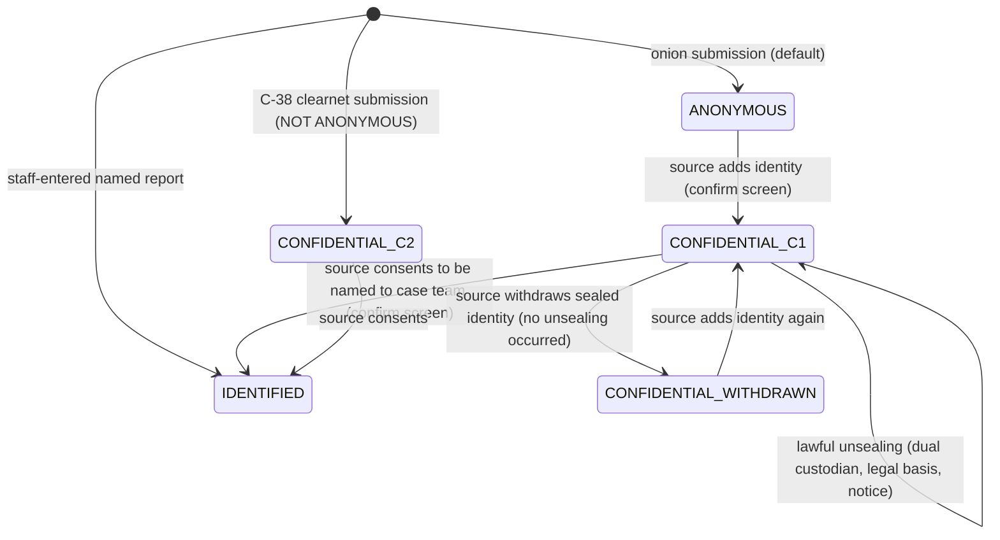

# 03 — Privacy and Anonymity

Status: Draft v1.0 · Edition applicability: both (CE and EE; MANAGED service covered in §10.3) · Owner: Privacy Engineering + Security Architecture

## 1. Purpose and scope

This document defines precisely what Candor means by **anonymous**, **confidential** and **identified**; from whom each protection holds and under which assumptions; and — in the **formal metadata inventory** (§8) — exactly which data each layer of the system sees for each request type, and what happens to it. It also contains the **legal-compulsion inventory** (§10) listing everything an operator or the vendor could be forced to produce, the analysis of whether Tor should be required (§11), and the aggregation/inference controls and k-thresholds for all statistics (§12).

It owns the `ANON-` (anonymity and modes), `META-` (metadata handling) and `PRIV-` (privacy governance, minimization, statistics, compulsion) requirement prefixes.

The inventory is **normative**: any datum not listed for a layer SHALL NOT be collected at that layer (META-001).

## 2. Context and dependencies

| Document | Relation |
|---|---|
| `DECISIONS.md` | ADR-001 (onion only), ADR-002 (three modes, no fallback), ADR-003 (Tor required, no fingerprinting), ADR-004 (Tier W/V), ADR-005 (passphrase), ADR-008 (keys), ADR-009 (intake/core, pull), ADR-010 (timing), ADR-011 (padding), ADR-014 (sealed identity), ADR-016 (audit classes), ADR-017 (notifications), ADR-021 (tenancy), ADR-023 (telemetry), ADR-025 (deletion). |
| `02-THREAT-MODEL.md` | Adversaries ADV-01..30, threats THR-*, component compromise analysis; this document is the ground truth for "observable information" in `02` §6. |
| `01-PRODUCT-REQUIREMENTS.md` | Modes, metrics (SM-*), prohibited claims. |
| `05-SOURCE-OPSEC.md` | Source guidance implementing the behavioral assumptions in §4. |
| `11-FRONTEND-SOURCE.md`, `16-TOR-I2P.md`, `20-LOGGING-AUDITING.md`, `35-DATA-RETENTION-DELETION.md` | Implement META requirements. |
| `25-COMPLIANCE.md` | GDPR/EU Directive mappings (Art 16 confidentiality incl. indirect identification; Art 18 records). |
| `40-SECURITY-ASSUMPTIONS.md` | ASM IDs for the assumptions tagged `[A:…]` here (same tags as `02` §3). |

## 3. Definitions

### 3.1 Reporting modes (ADR-002, ADR-014)

| Mode | Definition (normative) | Who can know the source's identity | Network path | UI label (EN) |
|---|---|---|---|---|
| **ANONYMOUS** | A report submitted through the Tor onion service (C-05) for which Candor has collected **no identifier of the source**: no name, contact identifier, network address, device identifier, account at another service, or exact timestamp of source action. The source is known to Candor only by a random pseudonymous `source_account_id` and a passphrase-derived public key. | Nobody **through Candor data**. Others may infer identity from content, behavior or external observation (§5). | Onion only (ADR-001) | **ANONYMOUS** — "Candor is not collecting who you are." |
| **CONFIDENTIAL** | A report where the source's identity (or network identity) is knowable to the operator, but access to it is restricted. Two sub-cases: **(C1) sealed identity** — source submitted via onion and voluntarily provided identity data, which is encrypted only to the Identity Custodian key set (ADR-014) and never shown in the case view; **(C2) clearnet confidential** — submitted via C-38, where the hosting path necessarily sees the source's IP address; identity fields, if any, sealed as in C1. | C1: Identity Custodians (≥ 2 must cooperate to unseal). C2: additionally anyone with access to network paths to C-38 (ISP, hosting, operator network). | C1 onion; C2 clearnet HTTPS | **CONFIDENTIAL — NOT ANONYMOUS** |
| **IDENTIFIED** | A report whose reporter is named to the case team (source chose to be named, or staff recorded a report received in person/by phone). | Case team members. | Any | **IDENTIFIED** — "Your name is visible to the people handling this report." |

**Transitions** (§6): only towards less anonymity, only by explicit confirmed action of the source (or, for staff-entered reports, at creation). An ANONYMOUS report becomes C1 when the source adds identity; C1 becomes IDENTIFIED when the source consents to reveal identity to the case team. Withdrawal of sealed identity (deleting it before any unsealing) yields label **CONFIDENTIAL (identity withdrawn)** — never ANONYMOUS again, because Identity Custodians may already have been in a position to learn it.

### 3.2 Anonymity and confidentiality as used here

- **Anonymity (this platform):** the property that the platform's data, logs, backups, key material and operators cannot link a report or mailbox to a real-world person or to a network location, **and** that different reports by the same source are not linkable by platform data unless the source chooses to link them. It is *sender anonymity with respect to the platform*, bounded by: (a) the anonymity network's properties [A:TOR]; (b) the source's device integrity [A:DEV]; (c) the source's behavior [A:OPSEC]; (d) content. It is **not** a promise that nobody can figure out who the source is.
- **Anonymity set:** the set of people who could plausibly be the source given what an adversary observes. On a corporate network, the relevant set may be "employees who used Tor today" — possibly one person (R4 §2.1; INC-31).
- **Confidentiality (of identity):** identity is known to a designated, minimal set of custodians and is technically protected (encryption to custodian keys + dual control) from everyone else, including administrators, recipients and the vendor.
- **Content confidentiality:** report content readable only by holders of case keys (authorized case members, and the Recovery Quorum if enabled — ADR-013).
- **Unlinkability:** absence of platform data that links two actions (two visits, two reports, a visit and a report) to the same person, beyond the mailbox relation the source creates by logging in with the same passphrase.
- **Pseudonymity:** the `source_account_id` and source public key are pseudonyms: stable within one mailbox, random, and not derived from any identifier.
- **Tier W / Tier V** (ADR-004): Tier W = no-JS web; plaintext passes transiently through C-06/C-07 RAM. Tier V = verified client (Source App or WEBCAT-verified bundle); plaintext never reaches servers.

### 3.3 Terms used in the inventory

| Term | Meaning |
|---|---|
| Source action | Any request initiated by a source (R-01..R-07, source-side R-10). |
| Exact timestamp | Resolution finer than one UTC calendar day. |
| Rounded timestamp | UTC calendar day (`received_epoch_day`), or coarser. |
| Padded size | Size after ADR-011 bucketing. |

## 4. Assumptions

Protection statements in this document hold only under these assumptions (tags as in `02-THREAT-MODEL.md` §3; ASM IDs assigned in `40-SECURITY-ASSUMPTIONS.md`).

| Tag | Assumption | If violated |
|---|---|---|
| [A:TOR] | Tor provides sender anonymity against adversaries not observing both ends/controlling guards. | Network identity exposed to that adversary (THR-003). |
| [A:DEV] | Source device, OS, browser/app not compromised. | Everything the source does is exposed (ADV-08). |
| [A:OPSEC] | Source follows risk-appropriate guidance (personal device and network; no immediate submission after unique document access; no printing; minimal identifying content). | Identification by behavior/content (THR-002, THR-010). |
| [A:RCP] | ≥ 1 uncompromised recipient endpoint per case; tokens not coerced. | Content of that member's cases exposed. |
| [A:SEAL] | Intake host kernel/hypervisor isolates C-07. | Tier W plaintext exposure. |
| [A:MON] | Independent transparency monitors exist. | Tier V verification weakens (THR-118). |
| [A:CRYPTO] | Primitives and candor-core implementation secure. | Content exposure (THR-012). |
| [A:LAW] | Operators and custodians comply with the published legal-response procedure (two-person, inventory-only). | Over-disclosure of the limited metadata that exists. |

## 5. Protected-from-whom matrix

Legend: **P** = protected by design under §4 assumptions (Candor holds nothing useful, or cryptography prevents access); **PA** = partially protected (see note); **NP** = not protected (by design or unavoidable); **n/a** = not applicable. Tier differences: "W/V" shows Tier W / Tier V.

| Protected item ↓ / From → | Org mgmt | Admin (curious/malicious) | Case recipients | Other staff | Accused | Hosting/cloud | Employer network/endpoint monitoring | ISP/local network | Global network adversary | LE compelling operator | Vendor (EE/MANAGED) | Forensic exam of source device |
|---|---|---|---|---|---|---|---|---|---|---|---|---|
| Source IP / network location | P | P | P | P | P | P | PA¹ | PA¹ | NP² | P | P | NP |
| Source identity (ANONYMOUS) | PA³ | W: PA⁴ / V: PA³ | PA³ | P | PA³ | W: PA⁴ / V: P | PA¹ | PA¹ | NP² | W: PA⁵ / V: P | P | NP⁶ |
| Source identity (CONFIDENTIAL C1, sealed) | P⁷ | P | P⁷ | P | P⁷ | P | n/a | n/a | n/a | PA⁸ | P | NP |
| Report content | P⁹ | W: PA⁴ / V: P | NP (authorized) | P | P¹⁰ | W: PA⁴ / V: P | P | P | P | W: PA⁵ / V: PA¹¹ | P | NP⁶ |
| Embedded file metadata (EXIF, author) | P | W: PA⁴ / V: P | PA¹² | P | P | W: PA⁴ / V: P | P | P | P | PA¹¹ | P | NP |
| Existence of a report / that it concerns X | PA¹³ | PA¹⁴ | NP | P | PA¹⁵ | PA¹⁶ | P | P | P | PA¹⁴ | MANAGED: PA¹⁶ / EE: P | NP |
| Submission timing finer than one day | P | PA¹⁷ | P | P | P | PA¹⁷ | NP¹ | NP¹ | NP | PA¹⁷ | P | NP |
| Channel chosen | PA¹³ | NP | NP | P | PA¹⁵ | P¹⁸ | P | P | P | NP¹⁴ | P | NP |
| Mailbox replies | P⁹ | W: PA⁴ / V: P | NP | P | P | W: PA⁴ / V: P | P | P | P | W: PA⁵ / V: PA¹¹ | P | NP⁶ |
| Linkage between two reports of one source | P¹⁹ | P¹⁹ | PA³ | P | PA³ | P | PA¹ | PA¹ | NP | P¹⁹ | P | NP |
| That the source used Tor/Candor at all | P | P | n/a | P | P | P | NP | NP | NP | P | P | NP |

Notes:
1. Observers of the source's own network/device see Tor (or bridge) use and timing, not the onion destination (modulo website fingerprinting, THR-004). Protection depends on [A:OPSEC] (personal network/device, bridges).
2. Not in the design envelope (NG-03, `02` ADV-21).
3. Inference from content, style, knowledge, investigation actions remains possible (THR-010, THR-125).
4. A live-compromised intake (or its host) can read Tier W plaintext and passphrases in transit through C-06/C-07 (ADR-004). Stored data is ciphertext.
5. Operator can be compelled prospectively to modify Tier W intake; retrospective data contains no plaintext.
6. Only what the source's device retains (guidance: Tails, no downloads; Candor stores nothing on the device beyond a memory-only session cookie).
7. Unless the person is an Identity Custodian (≥ 2 custodians required to unseal).
8. Lawful unsealing by custodians under ADR-014 procedure; source notified where law requires.
9. Unless the person is a case member.
10. COI exclusions before key wrapping (ADR-015); protection fails if the accused is legitimately a recipient not flagged by the source or COI map.
11. Only via compelled case members or quorum holders; the operator itself holds no content keys.
12. Recipients see sanitized derivatives by default; originals (with metadata) available under access controls (ADR-012).
13. Program statistics are k-thresholded and period-aggregated (§12); management learns volumes, not individual reports.
14. Server-visible case metadata (channel, coarse category, state, received day) exists and can be disclosed (§10).
15. Side channels minimized (THR-110), not eliminated.
16. Provider sees traffic volume and storage growth, not report subjects.
17. Exact timing exists only in RAM of C-05/C-06/C-07 during the request; a live-compromised intake sees it.
18. Channel ID stored on encrypted-at-rest volumes; a provider with memory access could read it.
19. Default: one passphrase per report (ADR-005); if the source reuses a passphrase, reports are linked in the mailbox by design.

## 6. Mode lifecycle

Rules: no transition to ANONYMOUS from any other state; staff cannot change the mode of a report except to record that a source identified themselves in a message (which requires a confirmation stored as a CASE event and a mailbox notice to the source: "You wrote your name in a message; your report is now treated as CONFIDENTIAL").

## 7. Mode indicator requirements

| Surface | Requirement |
|---|---|
| Onion source pages (Tier W) | Top-of-page banner on every page, rendered server-side as the first focusable landmark (`role="status"`, not color-only): icon + mode word + one-line meaning + link "What this protects". ANONYMOUS text: "ANONYMOUS — Candor does not collect who you are. Your writing and files can still identify you." Tier line: "Web mode: encrypted on arrival. For stronger protection use the verified app." |
| Source App (Tier V) | Same banner plus "Verified client — end-to-end encrypted" and the verified roster digest; if verification fails the app blocks submission (no fallback, ANON-012). |
| Confidential flows | Before the source adds identity: full-page confirmation "You are about to share who you are. After this your report is CONFIDENTIAL, NOT ANONYMOUS. Your identity will be locked so that only designated Identity Custodians can open it, and only with a legal reason." Buttons: "Keep anonymous" (default focus) / "Share my identity". |
| C-38 clearnet pages | Header on every page, all locales: "CONFIDENTIAL — NOT ANONYMOUS. Your internet address is visible to our hosting provider and network operators." No ANONYMOUS word anywhere on C-38 except in "not anonymous" and a link to the onion instructions. Distinct visual theme (not reusing onion colors). |
| Escrow status | Every channel page: "Recovery escrow: DISABLED" or "Recovery escrow: ENABLED — keys held jointly by: <roles>" (ADR-013). |
| Configuration digest | Landing footer: "Configuration: <8-char digest> · profile <name> · last changed <UTC day>" linking to a page listing all non-default privacy-relevant settings (DANGEROUS/SENSITIVE CFG classes). |
| Candor Desk | Mode chip on every case header and case list row; exports carry the mode in the Export Package manifest; IDENTIFIED/CONFIDENTIAL cases show whether sealed identity exists (never the identity). |
| Staff-to-source replies | Replies never assert a mode; they cannot contain the words "anonymous"/"confidential" as claims about the source's protection without a template reviewed by `claims-lint`. |

