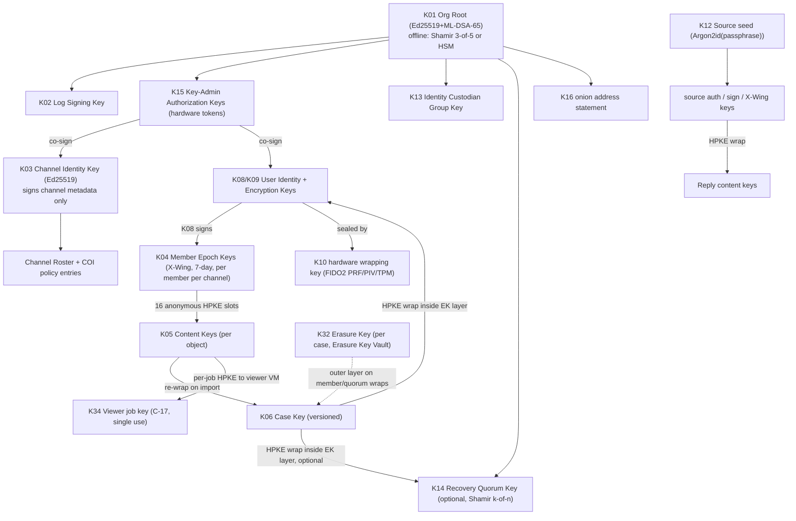

# 04 — Cryptographic Design Specification
Status: Draft v1.0 · Edition applicability: both (CE and EE identical in all trust-path cryptography; EE adds HSM/PKCS#11 options and the FIPS profile) · Owner: Cryptography & Protocols team

## 1. Purpose and scope

This document fixes every cryptographic primitive, parameter, key, wire format and key-lifecycle procedure used by Candor, so that the crypto library (C-11), the intake services (C-06/C-07/C-08), the core services (C-09..C-14, C-24), Candor Desk (C-15), the Candor Source App (C-03), backups (C-27), recovery (C-28) and HSM integration (C-29) can be built by separate teams without inventing cryptographic decisions.

In scope: primitive selection and suites (ADR-006); transport encryption (onion, internal TLS/mTLS); application-layer envelope encryption; at-rest encryption and its limits; AEAD and key commitment; the key hierarchy (ADR-005, ADR-007, ADR-008, ADR-013, ADR-014); KDFs and password hashing; source passphrase scheme; rotation, forward secrecy, recovery, backup encryption, cryptographic erasure (ADR-025); compromise analysis; HSM/TPM; threshold schemes; byte-level wire formats (envelope, STREAM, message, reply, key directory and transparency log); the server-delivered-code problem (ADR-004); sequence diagrams; formal verification, KATs, constant-time, zeroization and RNG requirements.

Out of scope (referenced): authentication protocols and session tokens (15-AUTHENTICATION-AUTHORIZATION.md), Tor configuration (16-TOR-I2P.md), release signing and TUF (33-RELEASE-UPDATE-SECURITY.md), file parsing/sanitization (10-FILE-EVIDENCE-PIPELINE.md), backup operations (19-BACKUPS-DR.md), retention clocks (35-DATA-RETENTION-DELETION.md).

**Protection statement form (DECISIONS §0).** Every claim below names what is protected, from whom, under which assumptions, and the residual risk. Local assumption labels `CA-n` (§3.4) are to be registered as `ASM-*` in 40-SECURITY-ASSUMPTIONS.md.

## 2. Context and dependencies

| Document | Dependency |
|---|---|
| DECISIONS.md | ADR-004/005/006/007/008/009/010/011/013/014/020/022/025/028/030/031/032/033 are binding inputs (ADR-030 per-member epoch keys; ADR-033 anonymous recipient slots, import-gated epoch retirement, Erasure Key vault, viewer-only attachment decryption) |
| 02-THREAT-MODEL.md | THR-007, 012, 013, 014, 015, 017, 018, 026, 030, 031, 034, 043, 044, 046 are the primary threats addressed |
| 03-PRIVACY-ANONYMITY.md | Timing (ADR-010) and size (ADR-011) metadata rules that the formats implement |
| 06-SYSTEM-ARCHITECTURE.md | Zones, Intake/Core separation (ADR-009), Transport Adapter |
| 07-BACKEND.md, 08-API.md, 09-DATABASE.md | Carry the byte formats defined here as opaque blobs; `key_wraps`, `kd_entries` tables |
| 10-FILE-EVIDENCE-PIPELINE.md | Consumes STREAM decryption output inside C-17 only |
| 11-FRONTEND-SOURCE.md | Tier W / Tier V flows, passphrase display, roster display |
| 12-FRONTEND-RECIPIENT.md | Candor Desk key store, import, re-wrap UI, log-monitor alerts |
| 14-CASE-MANAGEMENT.md | Case lifecycle events that trigger key operations |
| 15-AUTHENTICATION-AUTHORIZATION.md | Staff authentication, WebAuthn PRF, COI exclusion before wrapping (ADR-015) |
| 16-TOR-I2P.md | Onion-service key custody (THR-044) |
| 19-BACKUPS-DR.md | Erasure Key Vault own backup (≤ 14 days), backup encryption to K25 |
| 20-LOGGING-AUDITING.md | Audit checkpoint signing key; key-event audit records |
| 29-SECURITY-TESTING.md / 30-ANONYMITY-TESTING.md | Malicious-server harness, crypto test jobs |
| 33-RELEASE-UPDATE-SECURITY.md | Release keys, TUF, WEBCAT manifest keys (K26/K27 below) |
| 35-DATA-RETENTION-DELETION.md | Triggers for cryptographic erasure |

## 3. Design principles and assumptions

### 3.1 Principles
1. **Servers are not trusted with content.** No key that decrypts report content exists on any server in usable form (ADR-007, ADR-008). Tier W is the single, explicitly disclosed exception: plaintext exists transiently in C-07 RAM (ADR-004).
2. **Standard constructions only.** HPKE (RFC 9180) with hybrid PQ KEMs, age-style STREAM, HKDF, Argon2id, Ed25519, ML-DSA. The composition (envelope, directory, roster continuity) is new and is therefore formally modelled and externally reviewed before 1.0 (§22; INC-63).
3. **Hybrid post-quantum confidentiality now.** Leak material is a harvest-now-decrypt-later target (B-CR-03, B-CR-04). PQ authentication is added first for long-lived roots (B-CR-10).
4. **Everything bound to context.** Every encryption binds tenant, channel, epoch, object identity and purpose through HPKE `info`, AEAD AAD and HKDF `info` labels (INC-66, B-CR-24).
5. **Key commitment everywhere.** Every sealed object carries an HMAC commitment to its content key (B-CR-16, B-CR-17).
6. **Crypto-agility without negotiation.** Suites are identified in every header; allowed suites are pinned per tenant in the key directory; there is no in-band negotiation, so no downgrade path.
7. **Fail closed.** Missing, expired or unverifiable keys stop the operation; they never cause fallback to weaker keys, to plaintext or to server-side decryption (INC-06 lesson in R2 Hush Line: server-side fallback created a downgrade path).

### 3.2 Profiles
| Profile | Where | Primitive suite | Module |
|---|---|---|---|
| STD (default) | CE and EE | CANDOR-STD-1 (§4.1) | RustCrypto + `aws-lc-rs` (non-FIPS build) behind C-11 |
| FIPS | EE/GOV opt-in | CANDOR-FIPS-1 (§4.1) | AWS-LC FIPS 3 (CMVP #5314, ML-KEM inside boundary; B-CR-11) via `aws-lc-rs` FIPS feature |
| CNSA-2.0 (reserved) | GOV archive tier, future | CANDOR-CNSA-1 (reserved, not shipped in v1) | TBD |

A tenant's suite is fixed at tenant creation and recorded in the ORG_ROOT directory entry. Mixed-suite tenants are not supported in v1 (migration procedure §15.6).

### 3.3 CNSA 2.0 note
Candor is not a National Security System. CNSA 2.0 (B-CR-10) requires ML-KEM-1024, ML-DSA-87, AES-256, SHA-384/512 and LMS/XMSS for firmware signing, with software/firmware signing "exclusive" by 2030. CANDOR-FIPS-1 already uses ML-KEM-1024 (hybrid with P-384), AES-256 and SHA-384. Gaps to full CNSA 2.0: (a) hybrid rather than pure ML-KEM-1024 key establishment (CNSA permits hybrids during transition — Knowledge (unverified)); (b) Ed25519/ECDSA rather than ML-DSA-87 for message/log signatures; (c) release signing uses Ed25519+ML-DSA-65 (ADR-006), not ML-DSA-87 or LMS. Suite ID `0x0003` CANDOR-CNSA-1 is reserved (ML-KEM-1024 pure or MLKEM1024-P384, AES-256-GCM, HKDF-SHA384, ML-DSA-87 for all signatures, LMS for release roots) for a later ADR.

### 3.4 Cryptographic assumptions (to be registered as ASM-* in 40)
| Label | Assumption |
|---|---|
| CA-1 | At least one of ML-KEM (FIPS 203) and X25519 (resp. ECDH P-384) is IND-CCA-secure as used in the hybrid combiner (B-CR-05, B-CR-06). |
| CA-2 | ChaCha20-Poly1305, XChaCha20-Poly1305, AES-256-GCM are secure AEADs under unique nonces; HMAC-SHA-256/384 is a PRF and collision-resistant as a commitment. |
| CA-3 | Ed25519 (RFC 8032 strict verification) and ML-DSA-65 are EUF-CMA; a hybrid signature is secure if either component is. |
| CA-4 | The OS CSPRNG (`getrandom(2)`) or the FIPS module DRBG produces unpredictable output after boot seeding, including after VM snapshot restore (mitigated §23.4). |
| CA-5 | Recipient endpoints (C-15 on C-16) are not compromised at the time they unwrap keys; hardware wrapping keys (FIDO2/PIV/TPM) resist extraction. |
| CA-6 | C-07 Intake Sealer is not live-compromised during a Tier W submission (Tier W only). |
| CA-7 | For Tier V, at least one configured witness (or the channel members' Desk monitors) is honest, so a split view of the key directory is detected. |
| CA-8 | Source passphrases are generated by the specified CSPRNG path and not chosen or modified by the source. |
| CA-9 | **KEM key privacy (anonymity):** an X-Wing / MLKEM1024-P384 encapsulation and the HPKE ciphertext reveal nothing about which public key they were produced for (ANO-CCA-style); required so that the 16 anonymous recipient slots do not reveal which members received an envelope (ADR-033 item 1). Knowledge (unverified): the formal key-privacy status of the hybrid combiners must be confirmed by the external review (§22). |

## 4. Primitive selection (ADR-006)

### 4.1 Suites
| Function | CANDOR-STD-1 (`0x0001`) | CANDOR-FIPS-1 (`0x0002`) | Rationale / evidence |
|---|---|---|---|
| Public-key encryption | HPKE RFC 9180 `mode_base`, KEM `0x647a` MLKEM768-X25519 (X-Wing) | HPKE `mode_base`, KEM `0x0051` MLKEM1024-P384 | Hybrid PQ; codepoints from draft-ietf-hpke-pq-05 (B-CR-05, B-CR-06, B-CR-07); AWS-LC FIPS 3 has ML-KEM inside boundary (B-CR-11) |
| HPKE KDF | HKDF-SHA256 (`0x0001`) | HKDF-SHA384 (`0x0002`) | RFC 9180 |
| HPKE AEAD | ChaCha20-Poly1305 (`0x0003`) | AES-256-GCM (`0x0002`) | RFC 9180 |
| Payload STREAM AEAD | ChaCha20-Poly1305, 64 KiB chunks (age-style) | AES-256-GCM, 64 KiB chunks, same nonce layout | B-CR-14; per-object derived key makes counter nonces safe |
| Record AEAD (DB fields, wraps) | XChaCha20-Poly1305, random 192-bit nonce | AES-256-GCM, random 96-bit nonce, ≤2^31 encryptions per derived key (counter-enforced) | B-CR-15, B-CR-27; SP 800-38D limit (R5 §A.3) |
| Key commitment / MAC | HMAC-SHA-256 | HMAC-SHA-384 | B-CR-16, B-CR-17 |
| KDF | HKDF-SHA256 (RFC 5869) | HKDF-SHA384 (SP 800-56C r2) | R5 §A.6 |
| Signatures (messages, directory entries, checkpoints, audit) | Ed25519 (RFC 8032, strict) | Ed25519 (FIPS 186-5) if inside the validated boundary of the deployed module, else ECDSA P-384 (UNVERIFIED which applies to AWS-LC FIPS 3; decided at build per certificate) | B-CR-01 context, R5 §A.2 |
| Long-lived root signatures (ORG_ROOT, release roots) | Ed25519 + ML-DSA-65, both REQUIRED | ECDSA P-384 or Ed25519 + ML-DSA-65 (ML-DSA-87 when CNSA profile ships) | ADR-006; B-CR-10 |
| Hash (content IDs, Merkle trees) | SHA-256; evidence hashes SHA-256 + BLAKE3 (ADR-012) | SHA-384 for Merkle trees; evidence SHA-256 + SHA-384 (BLAKE3 recorded but not relied on for FIPS claims) | ADR-012 |
| Source passphrase stretching | Argon2id m=256 MiB (262144 KiB), t=3, p=1, 32-byte output | PBKDF2-HMAC-SHA-512, 600,000 iterations, 32-byte output (see §11.5 and Open Issue OI-3) | ADR-005/006; B-CR-19, B-CR-20, B-CR-27 |
| Staff software-fallback passphrase (CE only) | Argon2id m=256 MiB, t=3, p=4 | PBKDF2-HMAC-SHA-512 ≥600,000 | B-CR-19 |
| Staff server-side password verifier (if passwords used at all, 15) | Argon2id m=64 MiB, t=3, p=4 + HMAC pepper in C-29 | PBKDF2-HMAC-SHA-512 ≥600,000 + HMAC pepper | B-CR-19, B-CR-20; OPAQUE RFC 9807 optional (B-CR-21) |
| Key wrap (symmetric) | XChaCha20-Poly1305 AEAD wrap (not RFC 3394) | AES-256-GCM AEAD wrap (AES-KW RFC 3394 accepted only inside HSM PKCS#11 `CKM_AES_KEY_WRAP_KWP`) | AEAD wrap allows AAD binding (INC-66) |
| Threshold | Shamir over GF(2^8) (offline, reconstruct-on-air-gap); explicit k-of-n multi-signatures; FROST(Ed25519, SHA-512) RFC 9591 optional | Same; FROST not used in FIPS profile | B-CR-29, R5 §A.9 |
| Transport (internal) | TLS 1.3; groups X25519MLKEM768, then X25519 | TLS 1.3; SecP384r1MLKEM1024 (if supported) then SecP256r1MLKEM768 then secp384r1 | B-CR-08 (RFC number UNVERIFIED) |
| RNG | `getrandom(2)` via `rand_core::OsRng` | Module DRBG (SP 800-90A) seeded from OS | INC-50, INC-51 |

### 4.2 Parameter sizes (C-11 constants; verified by KATs)
| Item | STD | FIPS |
|---|---|---|
| HPKE `Nenc` (encapsulated key) | 1120 B | 1665 B (1568 ML-KEM-1024 ct + 97 B uncompressed P-384 point) |
| HPKE `Npk` | 1216 B | 1665 B (1568 + 97) |
| HPKE `Nsk` (stored private seed) | 32 B | 32 B seed (per concrete-hybrid-kems draft; UNVERIFIED — C-11 SHALL take sizes from the KAT-validated implementation, not from this table) |
| AEAD key / tag | 32 B / 16 B | 32 B / 16 B |
| HMAC output | 32 B | 48 B |
| Ed25519 pk / sig | 32 B / 64 B | same (or P-384: 97 B / 96 B raw r‖s) |
| ML-DSA-65 pk / sig | 1952 B / 3309 B | same |
| Content key (CK), Case Key | 32 B | 32 B |

### 4.3 Rejected options
| Option | Reason |
|---|---|
| OpenPGP (SecureDrop classic) | Server-side encryption of plaintext, per-source server-held keys, no PQ in deployed profiles, complex parser surface (R1 §5 item 1; INC-65 Efail) |
| libsodium sealed boxes (GlobaLeaks, CoverDrop) | No PQ, no key commitment in multi-recipient box (B-CR-27; R2 §1.3) |
| HPKE `mode_auth` / `mode_auth_psk` for source→recipient | Would require a source static key visible in the key schedule; KCI noted for AuthPSK (B-CR-24). Source authentication is done by a signature inside the ciphertext instead (§13.4) |
| AES-GCM-SIV | Not key-committing; not FIPS-approved mode (R5 §A.3) |
| Pure ML-KEM | Loses classical security if ML-KEM implementation or analysis fails; hybrid preferred (B-CR-06) |
| Server-side KMS-held content keys | Violates ADR-007; compellable (INC-02 Lavabit, INC-01 Hushmail) |
| Custom AEAD/KDF/stream constructions | INC-63, INC-64 |

## 5. Encryption in transit

### 5.1 Source ↔ Intake Gateway (C-02/C-03 → C-05)
- **Layer 1 — Tor v3 onion service** (details 16-TOR-I2P.md). Client and service authenticate via the self-authenticating ed25519 onion address; the rendezvous circuit gives end-to-end encryption between the Tor client and the tor daemon on C-05. Protects: source IP from Candor and hosting provider (THR-001), content confidentiality against relays. Assumption: Tor circuit cryptography. **Residual: Tor's circuit handshakes are classical (X25519-based; Knowledge (unverified) that no PQ handshake is deployed network-wide as of 2026-09), so Tier W plaintext recorded today on the source's guard link could be exposed to a future quantum adversary who also breaks each onion layer. Tier V content is HPKE-hybrid-encrypted before it enters Tor and is not exposed this way.**
- **Layer 2 — Optional onion HTTPS** (profile setting `onion_tls`, default OFF in CE, SHOULD be ON for HIGH-risk profiles when a CA-issued `.onion` certificate is obtainable): TLS 1.3 terminated in C-06 with PQ hybrid group `X25519MLKEM768` offered first. Purpose: adds PQ confidentiality to Tier W transit when the source's Tor Browser supports the hybrid group (Knowledge (unverified): Firefox ESR-based Tor Browser supports `X25519MLKEM768`). Costs: CA issuance publicly links the organisation to the onion address in CT logs (usually already public for an intake address); CA dependency; certificate renewal. The onion address remains the identity anchor; TLS failure never causes fallback to plain HTTP when `onion_tls` is ON (HSTS on the onion origin).
- **Layer 3 — Application encryption.** Tier V: HPKE to channel epoch key before upload (§9). Tier W: C-07 seals on receipt (§9.6).

### 5.2 Internal links (TLS 1.3 / mTLS)
| Link | Initiator → listener | Protocol | Authentication | Notes |
|---|---|---|---|---|
| Intake Relay pull/push | C-09 (Z-CORE) → C-08 export endpoint (Z-INTAKE, internal NIC only) | TLS 1.3, mTLS | Relay client cert (SPKI pinned in C-08 config); C-08 server cert (SPKI pinned in C-09 config) | ADR-009: Z-INTAKE never initiates; C-08 listener accepts only the pinned relay SPKI and only from the relay host address |
| Z-CORE service mesh | C-10, C-14, C-21, C-23, C-24 ↔ each other and C-12/C-13 | TLS 1.3, mTLS | Internal CA (K18) leaf certs, 7-day lifetime | PostgreSQL `sslmode=verify-full` with client certs; S3-compatible blob store over TLS 1.3 with mTLS or SigV4 over TLS |
| Candor Desk ↔ Z-CORE API | C-15 → C-10 (desk-api) | TLS 1.3 (or over staff onion with client auth, 16) | Server SPKI pinned at Desk enrollment; staff auth per 15 (WebAuthn) | No WebPKI dependency; pin rotation via signed KD entry |
| Admin console ↔ Z-CORE admin API | C-19 → C-10/C-21 | TLS 1.3 | SPKI pin + admin auth (15) | |
| Monitor | C-25 ← metrics pull from hosts | TLS 1.3 mTLS | Internal CA | Pull only; allow-listed counters (20) |
| Backup | C-27 agent → backup store | TLS 1.3 mTLS | Internal CA | Payload already encrypted (§17) |
| SIEM export (EE) | C-26 → customer SIEM | TLS 1.3 | Customer CA | Scrubbed events only (ADR-016) |

TLS parameters (all internal links): TLS 1.3 only; cipher suites `TLS_AES_256_GCM_SHA384`, `TLS_CHACHA20_POLY1305_SHA256` (STD) / `TLS_AES_256_GCM_SHA384` (FIPS); key-exchange groups per §4.1; no PSK resumption across hosts (0-RTT disabled); certificates Ed25519 (STD) or ECDSA P-384 (FIPS); OCSP not used — short lifetimes instead; SNI and ALPN (`h2`, `http/1.1`) fixed. Libraries: `rustls` with `aws-lc-rs` provider.

## 6. Application-layer encryption overview

```
Source (Tier V client or C-07 for Tier W)
  └─ per object: random Content Key CK (256-bit)
       ├─ payload  = STREAM_AEAD(K_pay = HKDF(CK, payload_nonce, "candor/v1/payload"), padded plaintext)
       ├─ slots    = 16 anonymous HPKE slots: one per eligible member (after COI filter, ADR-030) sealed to that
       │             member's current Member Epoch Key (MEK); remaining slots are verifiable dummies; random order
       ├─ commit   = HMAC(K_mac = HKDF(CK, object_id, "candor/v1/header-mac"), CoreHeader incl. H(slot block))
       └─ inside payload: signed Recipient List (real recipient MEK key IDs + directory checkpoint) (ADR-033)
Candor Desk on import (any eligible member; trial-decrypts the 16 slots with its MEK private key)
  └─ CK re-wrapped: AEAD(Case Key v, CK, aad = case/object context)   [blob unchanged]
Case Key v ── HPKE-wrapped to each authorized member's User Encryption Key (+ optional Recovery Quorum Key),
              each such wrap additionally encrypted under the per-case Erasure Key (EK) held in the Erasure Key Vault
User Encryption Key / MEK private ── only on the member's endpoint, sealed by a hardware wrapping key (FIDO2 PRF / PIV / TPM)
Attachments: payload decrypted only inside C-17 with a single-use per-job key (ADR-033 item 5)
Replies: new CK, payload as above, wrap₁ = HPKE to Source X-Wing key, wrap₂ = AEAD under Case Key
```

Only the key wraps change over an object's lifetime; ciphertext blobs are immutable (enables cheap membership changes, rotation and erasure).

## 7. Encryption at rest — and why it is not the content layer

| Layer | Mechanism | Protects | Against | Does NOT protect against |
|---|---|---|---|---|
| L0 Content | Envelope encryption §9 (keys only on endpoints) | Report content, messages, files, case notes, identity data | Server compromise, DB/blob theft, backups, admins, hosting provider, compelled operator (THR-013/014/015/018/026/030) | Compromised recipient endpoint; Tier W live sealer compromise |
| L1 Media | LUKS2 on every server volume (`aes-xts-plain64`, 512-bit key, `--pbkdf argon2id`), unattended unlock via TPM2-sealed keyslot (PCR policy per 17) or Clevis/Tang NBDE; recovery passphrase keyslot held offline | Plaintext infra metadata (workflow fields, account records, logs), onion keys at rest, TLS keys, swap (if any) | Theft of powered-off disks, decommissioned drives (THR-031) | A running/compromised host (keys in kernel memory), hypervisor snapshots of a running VM (THR-030), compelled operator, backups (separate) |
| L2 DB | PostgreSQL TDE or column encryption (optional, EE) keyed from C-29 | Same as L1 for DB files | Storage-array or DB-file theft | Anything with DB credentials |
| L3 Intake Store | Sealed envelopes (L0) + source account records containing only `lookup_tag`, `auth_pk`, mailbox IDs | — | — | — |

**Why disk encryption is not the content layer:** a server that boots unattended must be able to unlock its disks, so the unlock key is available to anyone who controls the running server, its hypervisor, its TPM-measured boot chain or its operator under compulsion (INC-02 Lavabit: the compelled key was a server key). SecureDrop's audit found servers without FDE for exactly this reason (R1 7ASecurity SEC-01-017). Candor therefore treats L1/L2 as defence-in-depth for media and infrastructure metadata only, and no requirement may claim content confidentiality from L1/L2.

## 8. AEAD, nonces and key commitment

- **Nonce policy.** STREAM: per-object key derived from CK and a fresh 16-byte `payload_nonce`, chunk nonce = 11-byte big-endian counter ‖ 1-byte final flag (age, B-CR-14) — counter never repeats under one derived key. Records: XChaCha20-Poly1305 with random 24-byte nonces (safe for random nonces); FIPS AES-256-GCM random 12-byte nonces with a persisted per-derived-key usage counter capped at 2^31 (forces case-key version rotation long before the SP 800-38D 2^32 bound).
- **Key commitment.** Every sealed object has `header_mac = HMAC(K_mac, core_header)` where `K_mac` is derived from CK; the payload key is derived from CK. A ciphertext therefore decrypts under at most one CK (invisible-salamander resistance, B-CR-16/17). Every key-wrap record uses AEAD with AAD including the wrapped object's `object_hash`; after unwrapping, the recipient MUST verify `header_mac` before any payload decryption.
- **Why it matters here:** a malicious source or insider could otherwise craft one submission that shows different content to different recipients, to a malware scanner and to a reviewer, or that yields different evidence hashes (THR-037).
- **Release of plaintext.** No plaintext chunk is released to a consumer before its tag verifies; for files, the consumer (C-17) receives a stream whose final chunk verification failure aborts and discards all output (INC-65 Efail lesson).

## 9. Key hierarchy

### 9.1 Overview


### 9.2 Per-report / per-object keys (K05)
- Every sealed object (submission object, attachment bundle, reply, identity section, case attachment, export package) has its own CK = 32 bytes from the CSPRNG, generated where the plaintext originates (C-03, C-07 or C-15).
- CKs are never stored unwrapped outside RAM; never logged; never sent to any server unwrapped.
- A **submission** = exactly two objects: `SUBMISSION` (manifest + form answers + message; ≤64 KiB padded to 4 KiB buckets) and `ATTACHMENT_BUNDLE` (all files concatenated in one STREAM; minimum bucket 256 KiB; an empty bundle is still sent) so that the stored object count does not reveal whether or how many files were attached (ADR-011). Optional `IDENTITY` object (Confidential mode, ADR-014) is a third object, whose slot block contains one slot for K13 instead of member epoch keys; to avoid revealing mode by object count, Tier V and Tier W always send an `IDENTITY` object — a dummy of the same bucket when no identity is given (dummy content = random bytes under a CK that is wrapped to K13 and flagged `dummy` inside the ciphertext).
- The file list (display names, claimed types, sizes, hashes) travels inside the SUBMISSION object, so Candor Desk can list attachments without decrypting the ATTACHMENT_BUNDLE, whose payload is decrypted only inside C-17 (ADR-033 item 5).

### 9.3 Per-case keys (K06)
- Symmetric 256-bit, generated on Candor Desk at case creation/import. Versioned (`case_key_version` u32, starts at 1).
- Wrapped via HPKE (`CASEKEY` stanza, §13.2) to the User Encryption Key of every member in the case ACL **after** COI exclusions (ADR-015, ADR-030), and optionally to K14. Every such wrap is stored encrypted under the case's **Erasure Key** (K32, §9.10), so that destroying K32 makes every stored and backed-up wrap of the case key unreadable (ADR-033 item 3).
- Used to: re-wrap object CKs (K05) on import; derive record keys for encrypted case fields: `K_rec(table) = HKDF-Expand(HKDF-Extract(salt="candor/v1/case", CaseKey_v), "candor/v1/case/record/" ‖ table_id, 32)`.
- No forward secrecy (§15.3): a case key must decrypt the whole case for its lifetime.
- Rotation to version v+1 on: member removal from case, suspected member-device compromise, 2^31 FIPS record-nonce budget, or annually for cases open >12 months. Old-version object wraps are re-wrapped to v+1 by the rotating Desk (small records only; blobs unchanged); old version is then destroyed (§18).

### 9.4 Per-user keys (K08, K09, K10, K11)
- **User Identity Key** (Ed25519, per staff user): signs the user's KD entries, roster co-signatures, case ACL grants, export approvals.
- **User Encryption Key** (X-Wing / MLKEM1024-P384 per suite): recipient of case-key wraps, CIK wraps and (for custodians) K13 wraps. Member Epoch Keys are separate keys (§9.5).
- Generated on C-15 at enrollment; private parts sealed in the Desk keystore by K11 = `HKDF(K10 output, "candor/v1/desk/keystore")` where K10 is (preference order) FIDO2 `hmac-secret`/WebAuthn PRF, PIV/smartcard decrypt of a keystore key, TPM 2.0 sealed object with PIN and PCR policy; CE software fallback: Argon2id passphrase (§4.1) with a persistent warning banner (ADR-007).
- One active device per user in v1. Additional device = **device-link ceremony**: new Desk generates an ephemeral X-Wing key, shows its fingerprint as a 6-word SAS; old Desk verifies SAS and HPKE-seals K08/K09 private keys to it; new Desk seals under its own K10. Logged as a KD `USER_KEYS` update (device count changes are visible to all channel members).
- Rotation: K09 every 12 months and on suspicion: new keypair, the user's Desk re-wraps all case-key and CIK wraps addressed to the old key, old private key destroyed after re-wrap completes.

### 9.5 Channel identity keys and Member Epoch Keys (K03, K04; ADR-008 as amended by ADR-030/033)
- **Channel Identity Key (CIK)**: Ed25519 per channel. Private key HPKE-wrapped to each roster member with the `channel_admin` capability (default: all roster members, ADR-008). Signs **channel metadata only**: CHANNEL_ROSTER, COI_POLICY and channel configuration entries (ADR-030). It does not sign epoch keys or replies. Certified at creation by 2 Key-Admin Authorization signatures (K15) plus the creating member's K08; rotations additionally require a signature by the **previous** CIK (continuity rule, §14.4).
- **Member Epoch Key (MEK)**: X-Wing (STD) / MLKEM1024-P384 (FIPS) keypair **per roster member, per channel, per epoch** (ADR-030).
  - Epoch length `E = 7 days`; epoch `n` is valid for encryption in `[start_n, start_n + 7d)`, `start_n` a UTC midnight. Decrypt window `W = 14 days` after encryption validity ends.
  - Generated on the member's own Desk; the private key **never leaves that Desk's keystore** (sealed by K11; copied only by the device-link ceremony). No server holds MEK private keys in any form, and none are in backups.
  - Published as a MEMBER_EPOCH directory entry signed by the member's K08, listed under the member's role label for that channel. Each Desk pre-publishes **4 future epochs** (ADR-030) and must be online at least once per epoch; C-25 alerts when a member has < 2 future epochs published.
  - A MEK is usable for sealing only while its owner is in the channel's latest roster with the `read_intake` capability.
  - **Retirement gated on import (ADR-033 item 2):** a MEK private key is destroyed only after BOTH `valid_until + 14 d` has passed AND every envelope stored under that epoch for the channel has been imported by some member or explicitly rejected with dual approval. Envelopes un-imported for more than 7 days raise an escalation to the channel's independent route (e.g., ombudsman / audit committee roster, ADR-015) and to C-25; there is no automatic destruction cap (prevents suppression-by-waiting). Destruction = the Desk zeroizes the private key in its keystore and publishes a content-free `MEK_RETIRED` audit record.
- A new roster member publishes its own MEKs; it has no slot in, and cannot decrypt, envelopes sealed before it joined (no retroactive intake access; case access is via case keys, ADR-015).
- **COI filter (ADR-030):** before sealing, the sealer (Tier V client locally; Tier W C-07 in RAM) removes from the recipient set (1) members whose role labels the source flagged ("my report concerns: …") and (2) members listed in the tenant's COI_POLICY entry for the chosen category. If no eligible MEK remains, intake for that channel shows "temporarily unavailable" and does not seal (fail closed).
- **Slot limit:** each intake envelope has exactly 16 slots (tenant-fixed; 16 default, ADR-030). C-14 rejects a roster whose `read_intake` member count exceeds 16.

### 9.6 Source keys (K12; ADR-005) — see §11.

### 9.7 Identity Custodian Group Key (K13; ADR-014)
X-Wing keypair per tenant, private key HPKE-wrapped to each Identity Custodian's K09; certified by K01 (offline) and logged. `IDENTITY` objects are wrapped to K13, never to epoch or case keys, and never shown in the case view. Unsealing: custodian Desk unwraps, records legal basis + second approver signature (15/14) before decrypting; the unseal event is an audit record and, where law requires, generates a source-visible notice. Rotation: 24 months or on custodian change (re-wrap of stored identity CK wraps by a remaining custodian).

### 9.8 Recovery Quorum Key (K14; ADR-013) — see §16.

### 9.9 Envelope encryption summary
| Wrapped key | Wrapping key | Wrap construction | AAD / info binding |
|---|---|---|---|
| CK (intake) | Each eligible member's MEK (K04) public — anonymous slot | HPKE base | info = `"candor/v1/wrap/member-epoch"` ‖ suite ‖ tenant ‖ channel ‖ u32 epoch; aad = `"candor/v1/slot"` ‖ object_id ‖ payload_nonce (no recipient key ID anywhere in cleartext) |
| CK (identity) | K13 public — anonymous slot | HPKE base | info = `"candor/v1/wrap/custodian"` ‖ suite ‖ tenant; aad as above |
| CK (in case) | Case Key v | Record AEAD | aad = `"candor/v1/wrap/case"` ‖ tenant ‖ case_id ‖ v ‖ object_hash |
| CK (reply to source) | Source X-Wing public | HPKE base | info = `"candor/v1/wrap/reply"` ‖ suite ‖ tenant ‖ channel ‖ mailbox_id; aad = object_hash |
| CK (viewer job) | Viewer VM ephemeral X-Wing public (K34) | HPKE base | info = `"candor/v1/wrap/viewer-job"` ‖ suite ‖ job_id; aad = object_hash |
| Case Key v | K09 public / K14 public, then outer AEAD under Erasure Key K32 | HPKE base inside Record AEAD | inner info = `"candor/v1/wrap/casekey"` ‖ suite ‖ tenant ‖ case_id ‖ v ‖ recipient_key_id; outer aad = `"candor/v1/ek-layer"` ‖ tenant ‖ case_id ‖ v ‖ recipient_key_id |
| CIK private | K09 public | HPKE base | info = `"candor/v1/wrap/channel"` ‖ suite ‖ tenant ‖ channel ‖ key_id_of_wrapped ‖ recipient_key_id |
| K13 private | Custodian K09 | HPKE base | info = `"candor/v1/wrap/custodian-group"` ‖ suite ‖ tenant ‖ recipient_key_id |
| K08/K09/MEK private (on device) | K11 | Record AEAD | aad = `"candor/v1/desk/keystore"` ‖ user_id ‖ device_id ‖ key_id |

`‖` denotes concatenation of fixed-length fields (UUIDs 16 B, epoch u32 BE, key IDs 32 B, suite u16 BE); variable-length fields are prefixed with u16 BE length. Stored case-key wraps may carry `recipient_key_id` in the DB because case ACLs are already known to the authorization engine (C-22); intake slots never do.

### 9.10 Erasure Key and Erasure Key Vault (K32, K33; ADR-033 item 3)
- **Erasure Key (EK)**: 256-bit symmetric key per case, generated by C-10 at case creation and stored only in the **Erasure Key Vault (EKV)** — a separate PostgreSQL schema on a separate volume or a host-local vault file on the C-12 host — encrypted at rest under the EKV master key K33 (TPM-sealed in CE; HSM in EE/GOV).
- Every case-key wrap (to members' K09 and to K14) is stored as `AEAD(EK, nonce, HPKE-wrap, aad = ek-layer context)`. The server can remove the EK layer but still cannot decrypt the case key (it needs K09/K14), so EK gives the server no content access (ADR-007 preserved).
- The EKV is **excluded from routine backups**; it has its own backup with **≤ 14-day retention** (encrypted to K25). Destroying a case's EK (and its entries in EKV backups ageing out within ≤ 14 days) renders every backed-up copy of that case's key wraps unreadable — the documented upper bound of "delete" for backups (§18).
- Desk fetches EK-layered wraps through C-10, which removes the EK layer only for an authenticated, authorized member's request (C-22); DB-only thieves without EKV see only doubly wrapped blobs.

## 10. KDFs and HKDF label registry

All HKDF uses: `HKDF-Extract(salt, IKM)` then `HKDF-Expand(PRK, info, L)`. Labels are ASCII, versioned `candor/v1/...`, registered in `candor-core/src/labels.rs`; CI rejects duplicates and unregistered literals.

| Label (`info`) | IKM | Salt | L | Output |
|---|---|---|---|---|
| `candor/v1/payload` ‖ suite | CK | payload_nonce (16 B) | 32 | STREAM key |
| `candor/v1/header-mac` ‖ suite | CK | object_id (16 B) | 32/48 | header MAC key |
| `candor/v1/dummy-slot` ‖ u8 i | CK | object_id | 64 | seed (32 B throwaway KEM key seed ‖ 32 B encapsulation randomness) for dummy slot i |
| `candor/v1/dummy-slot-pt` ‖ u8 i | CK | object_id | 32 | plaintext sealed in dummy slot i |
| `candor/v1/ek-layer` | K32 (EK) | case_id | 32 | AEAD key for the Erasure-Key layer |
| `candor/v1/ekv/master` | K33 output | host_id | 32 | EKV at-rest key |
| `candor/v1/case/record/` ‖ table_id | Case Key v | `"candor/v1/case"` | 32 | record key per table |
| `candor/v1/desk/keystore` | K10 output | device_id | 32 | K11 |
| `candor/v1/source/lookup-id` | seed | `"candor/v1/source"` | 32 | source lookup id |
| `candor/v1/source/auth-ed25519` | seed | same | 32 | auth key seed |
| `candor/v1/source/sign-ed25519` | seed | same | 32 | signing key seed |
| `candor/v1/source/kem-seed` ‖ suite | seed | same | 32 (STD) / 64 (FIPS) | X-Wing seed / DeriveKeyPair ikm |
| `candor/v1/source/mailbox/` ‖ u32 report_index | seed | same | 32 | mailbox id per report |
| `candor/v1/backup/object` | Backup Generation Key | backup_set_id | 32 | per backup archive key |
| `candor/v1/export/package` | export CK | export_id | 32 | export payload key |
| `candor/v1/session/source-web` | K28 | — | 32 | session MAC key (15 owns semantics) |
| `candor/v1/audit/chain` | — | — | — | domain separator for audit hash chain (20) |

## 11. Source passphrase scheme (ADR-005)

### 11.1 Generation
- 10 words drawn uniformly and independently from the EFF large wordlist (7,776 words; B-GL-27 uses the same list), using rejection sampling on `getrandom` output (no modulo bias). Tier V: generated in C-03 (or WASM bundle). Tier W: generated in C-07.
- Localized lists (11/26) MUST have exactly 7,776 unique entries after NFKC + lowercase normalization, no word a prefix of another is NOT required (entropy is unaffected), and pass the offensive-word filter (R1 notes SecureDrop's list purges).
- Shown once; never stored anywhere by the platform; the UI offers no "copy to clipboard" in Tier W no-JS mode and warns about writing it down (THR-048; 05-SOURCE-OPSEC.md).

### 11.2 Entropy calculation
`H = 10 × log2(7776) = 10 × 12.925 = 129.25 bits`. Offline guessing cost at the Argon2id setting (~0.3–1 s and 256 MiB per guess on commodity hardware): expected 2^128 guesses — infeasible for any adversary, including with Grover-style speed-up (≥ 2^64 sequential memory-hard evaluations). Comparison: GlobaLeaks 16-digit receipt ≈ 53.2 bits (R2 §1.3), SecureDrop 7 words ≈ 89.8 bits (R1 B-SD-18), SecureDrop Protocol BIP39-12 = 128 bits (B-SD-11), CoverDrop 5 EFF words + Argon2 ≈ 64.6 bits (B-GL-27). The Argon2id step is a hedge against generation or transcription faults (e.g., a source writing down only 6 words), not the primary defence.

### 11.3 Normalization and derivation
```
normalize(p) = NFKC(lowercase(p)), split on any whitespace/hyphen/comma, require exactly 10 tokens each in the wordlist, join with 0x20
deployment_salt  = 32 random bytes generated at tenant creation, published in ORG_ROOT KD entry
salt             = SHA-256("candor/v1/source-salt" ‖ deployment_salt ‖ tenant_id)          (32 B)
seed             = Argon2id(password = normalize(p), salt, m = 262144 KiB, t = 3, p = 1, len = 32, version 0x13)
                   [FIPS: seed = PBKDF2-HMAC-SHA-512(normalize(p), salt, 600000, 32)]
PRK              = HKDF-Extract(salt = "candor/v1/source", IKM = seed)
lookup_id        = HKDF-Expand(PRK, "candor/v1/source/lookup-id", 32)
auth_sk_seed     = HKDF-Expand(PRK, "candor/v1/source/auth-ed25519", 32)   → Ed25519 keypair (auth_sk, auth_pk)
sign_sk_seed     = HKDF-Expand(PRK, "candor/v1/source/sign-ed25519", 32)   → Ed25519 keypair (sign_sk, sign_pk)
kem_seed         = HKDF-Expand(PRK, "candor/v1/source/kem-seed" ‖ suite, 32|64) → X-Wing keypair (src_sk, src_pk) [FIPS: DeriveKeyPair]
mailbox_id[i]    = HKDF-Expand(PRK, "candor/v1/source/mailbox/" ‖ u32be(i), 32)  for report index i = 0,1,…
```
Rationale for a per-deployment (not per-source) salt: login must derive the lookup identifier before any account is found, so a per-source salt would need an extra round trip that reveals account existence. Multi-target amortization is irrelevant at 129 bits (compare GlobaLeaks' per-tenant salt at 53 bits, R2 §1.3). The salt is tenant-bound so a passphrase is not portable across deployments.

### 11.4 What each party stores
| Datum | Intake Store (C-08) | Core (C-12) | Source | Candor Desk |
|---|---|---|---|---|
| Passphrase | never | never | memory (source's) | never |
| seed / private keys | never (Tier W: C-07 RAM only during request) | never | derived on demand | never |
| `lookup_tag = SHA-256("candor/v1/lookup-tag" ‖ lookup_id)` | yes (index) | no | — | no |
| `auth_pk` | yes | no | — | no |
| `sign_pk`, `src_pk` | **no** (delivered only inside the encrypted SUBMISSION object) | inside case (encrypted) | — | yes (case data) |
| `mailbox_id[i]` | yes (reply routing) | yes (encrypted case field + routing table) | — | yes |

Storing `src_pk` only inside ciphertext minimizes what a Z-INTAKE compromise reveals (stricter than, and conformant with, ADR-005).

### 11.5 Login and reply access
- **Tier V:** C-03 derives locally; sends `lookup_tag`; server returns a 32-byte challenge bound to audience `source-app`, tenant and a 5-minute expiry; client returns `Ed25519.Sign(auth_sk, "candor/v1/source-auth" ‖ challenge ‖ tenant_id ‖ audience)`. Server verifies against `auth_pk`. Replies are fetched as ciphertext and decrypted locally.
- **Tier W:** passphrase POSTed over the onion to C-06, streamed to C-07 via a local Unix socket; C-07 normalizes, runs Argon2id in an mlocked buffer, derives keys, verifies `lookup_tag`/`auth_pk`, decrypts pending replies for server-side rendering, and zeroizes seed and keys before the response is sent. C-07 limits concurrent Argon2id derivations to `ARGON2_MAX_CONCURRENT = 8` (≈2 GiB) with a FIFO queue of depth 64; excess requests receive the busy page (ADR-026).
- Wrong passphrases are indistinguishable from unknown accounts (same response body/size class and same C-07 work).

### 11.6 Multiple reports under one passphrase
Default: one passphrase per report (ADR-005). If the source chooses to add a report, report index `i+1` yields a new `mailbox_id` and the new SUBMISSION object carries the same `sign_pk` and `src_pk` (recipients can see both reports come from the same source — shown explicitly to the source before confirming).

## 12. Intake sealing and member-epoch operations

### 12.1 Recipient selection (C-03, C-07)
1. Obtain the latest key-directory snapshot (pushed by C-09 to C-06, ADR-009) and verify it (§14.5).
2. `today` = UTC day from the local clock, cross-checked against the snapshot checkpoint time: if `|today − checkpoint_day| > 1`, fail closed (THR-043).
3. Candidate set = members of the channel's latest CHANNEL_ROSTER with capability `read_intake`.
4. **COI filter (ADR-030):** remove members whose role labels the source flagged, and members mapped to the selected report category in the latest COI_POLICY entry. The flags and category are recorded inside the encrypted SUBMISSION (§13.4 keys 14, 17).
5. For each remaining member select the MEMBER_EPOCH entry with `valid_from_day ≤ today < valid_until_day`, signed by that member's current K08, not revoked, with valid public key (§23.3). Members without a valid current MEK are skipped and counted.
6. If the eligible set is empty, fail closed ("temporarily unavailable", ADR-030). If members were skipped for missing MEKs, the Tier V client shows "N recipients currently unreachable" and lets the source proceed or wait; Tier W proceeds and records the count inside the ciphertext.
7. The eligible set has ≤ 16 members (C-14 invariant); the remaining slots are dummies.

### 12.2 Tier V sealing (C-03 / WEBCAT bundle)
Client generates CKs, builds the three objects (§9.2), seals payloads (§13.3), builds the anonymous slot block (§13.2), commits (§13.1), and signs the SUBMISSION inner map — including the Recipient List (key IDs of the MEKs actually used + checkpoint) — with `sign_sk`. Plaintext never leaves the client.

### 12.3 Tier W sealing (C-07)
C-06 parses the HTML form and streams fields and file parts to C-07 over a Unix socket without buffering to disk (C-06 never writes request bodies to disk; tmpfs is forbidden for bodies — in-memory pipes only). C-07 runs the same sealing code as C-03 (same C-11 functions, same KATs), applies the COI filter in RAM, and writes only sealed objects and slot blocks to C-08. The Recipient List is signed with the derived `sign_sk` and additionally with the Intake Sealer key K35 (attesting which sealer built it). Plaintext buffers are mlocked and zeroized after sealing (§23.2). C-07 generates the passphrase for new sources (§11.1).

### 12.4 MEK pre-publication (every roster member's Desk)
On each sync, for every channel with `read_intake`: ensure MEKs for the current and next 4 epochs exist; generate missing ones from the CSPRNG; pairwise-consistency and KAT self-test; seal private keys in the keystore; publish MEMBER_EPOCH entries signed by K08. C-14 accepts only if the signer is in the latest roster with `read_intake` and no MEK exists for (channel, member, epoch).

### 12.5 MEK retirement (ADR-033 item 2)
For each held MEK past `valid_until + 14 d`, the Desk asks C-10 whether any envelope of that channel and epoch is neither imported nor dual-approved-rejected. Only when none remains does the Desk zeroize the private key, compact the keystore file (best-effort on SSD, §18.4) and emit `MEK_RETIRED`. C-10 escalates envelopes un-imported for > 7 days to the channel's independent route and to C-25 (content-free alert).

### 12.6 Fail-closed conditions for intake
Intake (C-06/C-07) SHALL refuse new submissions for a channel and show the outage page (no alternative path, ADR-002) when: the eligible recipient set is empty; the snapshot is older than 72 h; checkpoint signature or consistency fails; roster or COI_POLICY verification fails; suite mismatch; self-test failure of C-11. Source logins and reply display continue if only the recipient condition fails.

## 13. Wire formats

All integers big-endian. `H` = SHA-256 (STD) / SHA-384 (FIPS); wherever a format field is 32 bytes, FIPS values are SHA-384 truncated to 256 bits (SP 800-107 truncation — Knowledge (unverified)). Structured inner data uses deterministic CBOR (RFC 8949 §4.2.1 core deterministic encoding) with integer map keys; decoders reject indefinite lengths, duplicate keys, non-canonical integers, floats, tags, and unknown keys unless the key number is ≥ 1000 (reserved for forward-compatible optional fields). No inner structure is parsed before AEAD verification succeeds.

### 13.1 Sealed Object (immutable blob)
```
SealedObject = CoreHeader (128 B) ‖ header_mac (32 B STD / 48 B FIPS) ‖ Payload (STREAM ciphertext)

CoreHeader:
 off len field
   0  4  magic = 0x43 0x4E 0x44 0x52 ("CNDR")
   4  1  format_version = 0x01
   5  1  object_type   0x01 SUBMISSION | 0x02 ATTACHMENT_BUNDLE | 0x03 IDENTITY | 0x04 REPLY
                       0x05 SOURCE_MESSAGE | 0x06 CASE_ATTACHMENT | 0x07 EXPORT_PACKAGE | 0x08 CASE_DOCUMENT
   6  2  suite_id      0x0001 CANDOR-STD-1 | 0x0002 CANDOR-FIPS-1   (others rejected in v1)
   8  2  flags         MUST be 0x0000 in v1
  10  2  reserved      MUST be 0x0000
  12 16  tenant_id
  28 16  channel_id    (all-zero for CASE_* and EXPORT_PACKAGE)
  44  4  epoch_id      (0 unless sealed to Member Epoch Keys)
  48 32  slot_block_hash  (H(RecipientSlotBlock) for intake-sealed objects; all-zero for REPLY and staff objects)
  80 16  object_id     (random 128-bit, CSPRNG)
  96  4  day_stamp     (0 for source-originated objects — ADR-010; UTC day number for staff-originated objects)
 100  1  chunk_size_log2 = 16
 101  3  reserved = 0
 104  8  padded_plaintext_len
 112 16  payload_nonce (CSPRNG)
header_mac  = HMAC(K_mac, CoreHeader),  K_mac = HKDF(IKM=CK, salt=object_id, info="candor/v1/header-mac" ‖ suite)
(the header MAC therefore also commits to the slot block through slot_block_hash)
object_hash = H(CoreHeader ‖ header_mac)
```
Readers MUST: check magic/version/suite/flags/reserved; check `padded_plaintext_len` is a legal bucket for `object_type` (§13.6); compute expected payload length and reject any mismatch before decryption; verify `header_mac` in constant time before decrypting payload.

### 13.2 Recipient Slot Block (intake) and Wrap Stanzas (stored)

**RecipientSlotBlock** — immutable, travels with every intake-sealed object (SUBMISSION, ATTACHMENT_BUNDLE, IDENTITY, SOURCE_MESSAGE); no recipient key IDs in cleartext (ADR-033 item 1):
```
 off len field
   0  1  block_version = 0x01
   1  1  slot_count = 16            (tenant-fixed; readers reject any other value for the tenant)
   2  2  suite_id
   4  …  16 × Slot, Slot = enc (Nenc: 1120 B STD / 1665 B FIPS) ‖ ct (48 B)
Size: 4 + 16 × 1168 = 18,692 B (STD); 4 + 16 × 1713 = 27,412 B (FIPS)

Real slot for member m:  (enc, ct) = HPKE.SealBase(pk = MEK_m, info = "candor/v1/wrap/member-epoch" ‖ suite ‖ tenant ‖ channel ‖ u32 epoch,
                                                  aad = "candor/v1/slot" ‖ object_id ‖ payload_nonce, pt = CK)
IDENTITY object: one real slot to K13 (info "candor/v1/wrap/custodian" ‖ suite ‖ tenant), 15 dummies.
Dummy slot i:  (kp_seed ‖ r) = HKDF(CK, object_id, "candor/v1/dummy-slot" ‖ u8 i, 64);  pk_d = KEM.DeriveKeyPair(kp_seed).pk
               (enc, ct) = HPKE.SealBase with encapsulation randomness r to pk_d, same info/aad, pt = HKDF(CK, object_id, "candor/v1/dummy-slot-pt" ‖ u8 i, 32)
Order: real and dummy slots are placed in a uniformly random permutation (CSPRNG).
slot_block_hash (CoreHeader offset 48) = H(RecipientSlotBlock)
```
- Recipients trial-decrypt: a Desk runs HPKE.OpenBase with each of its MEK private keys for the envelope's epoch against all 16 slots (≤ 16 decapsulations per held key; constant work regardless of success).
- Dummy slots are real HPKE encryptions to throwaway keys, so they are indistinguishable from real slots to anyone without a MEK private key (CA-9), yet any holder of CK can recompute and **verify** them. The importing Desk verifies that every slot is either a verifiable dummy or corresponds to an entry of the signed Recipient List (count of non-dummy slots = list length), detecting hidden extra recipients produced by a malicious sealer or client release (THR-046).
- C-11 exposes derandomized encapsulation only through the internal dummy-slot function (not a public API) and it is covered by KATs.

**Wrap Stanza** — mutable, stored separately in `key_wraps` (09); used for case copies, replies, case-key and CIK wraps:
```
 off len field
   0  1  stanza_type   0x01 HPKE_BASE | 0x02 CASE_AEAD | 0x03 CASEKEY_EK (HPKE_BASE of a case key inside an Erasure-Key AEAD layer)
   1  1  reserved = 0
   2  2  suite_id
   4 32  recipient_ref (HPKE_BASE: key_id of recipient pk, or all-zero for REPLY; CASE_AEAD: case_id(16) ‖ u32 v ‖ 12 zero bytes;
                        CASEKEY_EK: key_id of the member/K14 key)
  36 32  bound_hash    (object_hash, or H("candor/v1/casekey" ‖ case_id ‖ u32 v), or H("candor/v1/chankey" ‖ channel_id ‖ wrapped_key_id))
  68  2  enc_len       (HPKE: Nenc; CASE_AEAD: 24 STD / 12 FIPS nonce; CASEKEY_EK: nonce length)
  70  …  enc
   …  4  ct_len
   …  …  ct
HPKE_BASE:  ct = HPKE.SealBase(pkR, info = label ‖ context (§9.9), aad = bound_hash, pt = key)
CASE_AEAD:  ct = AEAD(K = HKDF(CaseKey_v, salt="candor/v1/case", info="candor/v1/wrap/case"), nonce = enc,
                      aad = "candor/v1/wrap/case" ‖ tenant_id ‖ case_id ‖ u32 v ‖ object_hash, pt = CK)
CASEKEY_EK: ct = AEAD(K = HKDF(EK_case, salt=case_id, info="candor/v1/ek-layer"), nonce = enc,
                      aad = "candor/v1/ek-layer" ‖ tenant_id ‖ case_id ‖ u32 v ‖ recipient_ref, pt = HPKE_BASE stanza bytes of the case key)
key_id(pk)  = SHA-256("candor/v1/key-id" ‖ u16 suite ‖ u8 key_kind ‖ pk)    key_kind: 1 MEK, 2 user-enc, 3 custodian, 4 quorum, 5 source, 6 viewer-job
```
After import, the intake slot block is retained with the sealed object only until the MEK retirement condition (§12.5) is met, then deleted; thereafter only CASE_AEAD stanzas give access.

### 13.3 Payload STREAM
```
K_pay  = HKDF(IKM=CK, salt=payload_nonce, info="candor/v1/payload" ‖ suite)
chunk i (plaintext P_i, 65536 B except the last, which is 1..65536 B; a zero-length plaintext is one empty final chunk)
nonce_i = u88be(i) ‖ (0x01 if last else 0x00)        (12 B)
C_i     = AEAD_Encrypt(K_pay, nonce_i, P_i, aad = empty)     STD ChaCha20-Poly1305 / FIPS AES-256-GCM
Payload = C_0 ‖ C_1 ‖ … ‖ C_{n-1};  n = max(1, ceil(padded_plaintext_len / 65536))
```
Decryptors verify each chunk; a missing final flag, extra data after the final chunk, or any tag failure aborts with no further output; consumers that must not act on partial data (C-17 viewers, export) buffer to an encrypted scratch area and release only after the final chunk verifies. Random access: chunk i is independently decryptable (seek = i × 65552).

### 13.4 SUBMISSION and SOURCE_MESSAGE inner format (message format)
```
padded_plaintext = u32be(cbor_len) ‖ cbor ‖ 0x00 padding   (length = bucket, §13.6)
SUBMISSION cbor map:
  1: format (=1)                2: report_index (uint)            3: mailbox_id (bstr 32)
  4: src_pk (bstr Npk)          5: sign_pk (bstr 32)              6: roster_entry_hash seen (bstr 32)
  7: checkpoint seen [tree_size uint, root_hash bstr]             8: tier (0 = W, 1 = V-app, 2 = V-web)
  9: mode (0 ANONYMOUS, 1 CONFIDENTIAL, 2 IDENTIFIED)             10: bundle_object_hash (bstr)
 11: identity_object_hash (bstr) 12: form_answers [[field_id uint, value tstr|uint|bool], …]
 13: message (tstr, UTF-8, NFC)  14: concerns_roles [role_label_id…] (source COI flags, ADR-030)
 16: recipient_list = { 1: epoch_id, 2: [MEK key_id …] (real recipients, sorted), 3: skipped_count (members without a current MEK),
                        4: coi_policy_entry_hash, 5: checkpoint [tree_size, root_hash] }   (ADR-033 item 1)
 17: category_id (uint)          18: bundle_manifest = { 1: format, 2: files [{1: display_name tstr ≤ 255 B (metadata only — never a path, ADR-027),
                                     2: claimed_media_type, 3: size u64, 4: sha256, 5: blake3 (STD) / sha384 (FIPS), 6: offset u64}], 3: total_len u64 }
 15: source_sig (bstr 64) = Ed25519(sign_sk, "candor/v1/submission-sig" ‖ H(CoreHeader) ‖ H(cbor of all keys except 15 and 19))
 19: sealer_sig (Tier W only) = Ed25519(K35, "candor/v1/sealer-sig" ‖ H(CoreHeader) ‖ H(cbor of all keys except 15 and 19))
SOURCE_MESSAGE cbor map: 1: format, 2: report_index, 3: mailbox_id, 4: in_reply_to (reply_seq | null), 5: message, 6: source_sig over keys 1–5 (same label scheme "candor/v1/source-message-sig")
```
Signing `H(CoreHeader)` binds the signature to the object and, through `slot_block_hash`, to the slot block. The same Recipient List covers the ATTACHMENT_BUNDLE and IDENTITY objects of the submission via keys 10/11 (their slot blocks are verified with the CKs obtained from them). Desk verifies `source_sig` against `sign_pk` of the first SUBMISSION in the report; a mismatch is shown as "message not from the same source key" and quarantined.

### 13.5 REPLY format (staff → source)
```
SealedObject with object_type = 0x04, channel_id set, epoch_id = 0, slot_block_hash = 0, day_stamp = UTC day
Wrap stanzas: (1) HPKE_BASE to src_pk, recipient_key_id = 0 (hidden), info = "candor/v1/wrap/reply" ‖ suite ‖ tenant ‖ channel ‖ mailbox_id
              (2) CASE_AEAD under current Case Key (staff copy)
Inner cbor: 1: format, 2: mailbox_id, 3: reply_seq (uint, per mailbox monotonic), 4: day (uint), 5: body (tstr ≤ 60 KiB),
            6: sender_user_keys_entry_hash (bstr 32), 7: role_label (tstr, as in roster),
            8: sender_sig = Ed25519(K08 of the replying member, "candor/v1/reply-sig" ‖ H(CoreHeader) ‖ H(cbor keys 1–7))
Intake delivery record (pushed by C-09 to C-08): { mailbox_id, SealedObject, stanza (1) }
```
Replies are signed by the replying member's User Identity Key (the CIK signs channel metadata only, ADR-030); the source sees the member's roster role label, never a name unless the channel's policy publishes names. v1 replies are text-only (no attachments to sources, reducing THR-048 residue). Source client (or C-07 for Tier W) verifies that the signer is in the channel roster valid on the reply's `day`, the signature, and `reply_seq` monotonicity; failures show "reply could not be verified" and do not render the body.

### 13.6 Padding buckets (ADR-011)
| Object type | Legal `padded_plaintext_len` values |
|---|---|
| SUBMISSION, SOURCE_MESSAGE, REPLY | 4096 × k, k = 1..16 (max 65536) |
| IDENTITY | 4096 × k, k = 1..4 (dummy uses the most common bucket, k = 1) |
| ATTACHMENT_BUNDLE, CASE_ATTACHMENT, CASE_DOCUMENT, EXPORT_PACKAGE | b_0 = 262144; b_{j+1} = 65536 × ceil(1.25 × b_j / 65536); max per 10-FILE-EVIDENCE-PIPELINE.md |

Padding bytes are zero and lie inside the AEAD; the real length is inside the encrypted inner structure. Maximum size overhead for files: 25% + 64 KiB.

### 13.7 ATTACHMENT_BUNDLE inner format and viewer jobs
```
padded_plaintext = u32 magic "CBDL" ‖ u32 file_count ‖ file_0 bytes ‖ file_1 bytes ‖ … ‖ zero padding to bucket
(offsets, sizes, names and hashes are in the SUBMISSION bundle_manifest, key 18)
```
**Viewer-only decryption (ADR-033 item 5).** Candor Desk's main process never decrypts ATTACHMENT_BUNDLE, CASE_ATTACHMENT or CASE_DOCUMENT payloads:
1. C-17 starts a disposable VM/DispVM per job; inside it, the viewer agent generates an ephemeral X-Wing keypair (K34) and returns its public key over the VM control channel.
2. Desk unwraps the object's CK and sends `HPKE.SealBase(K34_pk, info = "candor/v1/wrap/viewer-job" ‖ suite ‖ job_id, aad = object_hash, pt = CK ‖ file_index ‖ expected sha256)` plus the ciphertext blob (streamed).
3. The viewer decrypts the STREAM, verifies all chunks and the file hash from the manifest, performs the job (hash-at-import, render, sanitize — 10), and returns only the job output (hashes, sanitized PDF pixels-to-PDF output re-encrypted to the case per 10).
4. The VM and K34 are destroyed at job end; one K34 per job.
Evidence hashes (ADR-012) are computed by a C-17 **import-hash job** and recorded in the encrypted case record; mismatch with the manifest marks the file "integrity failure" (10).

### 13.8 Encrypted record format (case fields, Desk keystore)
```
0x01 (version) ‖ u16 suite ‖ u32 key_version ‖ nonce (24 B STD / 12 B FIPS) ‖ ciphertext ‖ tag
AAD = "candor/v1/rec" ‖ tenant_id ‖ case_id ‖ u16 table_id ‖ u16 column_id ‖ record_id (16) ‖ u32 key_version ‖ u64 row_version
```
`row_version` is also committed in the case event hash chain (14) so a server replaying an older ciphertext for a row is detected by Desk.

### 13.9 Versioning rules
- `format_version` increments only for incompatible layout changes; readers support N and N−1 for ≥ 24 months.
- New suites require an ADR, KATs and a formal-model update before any tenant may select them.
- Unknown `object_type`, `stanza_type`, `suite_id` or non-zero reserved bits → reject (no "best effort" parsing).

## 14. Key Directory and Transparency Log (C-14)

### 14.1 Purpose
C-14 is a per-tenant append-only Merkle log of every public key, roster and policy statement that determines who can decrypt what, plus accepted client release hashes and onion address statements. It prevents silent key substitution and hidden-recipient insertion (THR-046; INC-14 Anom, INC-62 Matrix, INC-67 Nextcloud) by making every change signed, attributable, continuous and visible to members, monitors and Tier V sources.

### 14.2 Entry format
```
KDEntry (deterministic CBOR map):
  1: entry_type    2: format_version (=1)   3: tenant_id (bstr 16)   4: subject_id (bstr 16 or 32)
  5: subject_seq (uint, 1,2,3… per subject)  6: prev_subject_entry_hash (bstr 32 | null when seq = 1)
  7: not_before_day (uint)  8: not_after_day (uint | null)  9: suite_id (uint)  10: body (map, per type)
SignedKDEntry: { 1: entry_bytes (bstr = canonical encoding of KDEntry), 2: [ {1: signer_key_id, 2: alg (1 Ed25519, 2 ML-DSA-65, 3 ECDSA-P384), 3: sig}, … ] }
Signed message: "candor/v1/kd-entry\x00" ‖ entry_bytes
Leaf hash: H(0x00 ‖ SignedKDEntry bytes)       Interior node: H(0x01 ‖ left ‖ right)   (RFC 6962/9162 tree; Knowledge (unverified) RFC 9162 as algorithm reference)
```

| entry_type | Subject | Body fields | Required signatures |
|---|---|---|---|
| 0x01 ORG_ROOT | tenant | Ed25519 pk, ML-DSA-65 pk, allowed suites, deployment_salt, witness list + threshold, policy flags | self (both algs); pinned out-of-band (§14.5 VR-1) |
| 0x02 LOG_KEY | log | Ed25519 pk, log origin string | K01 (both algs) |
| 0x03 KEY_ADMIN | admin user | Ed25519 pk (on token), role label | K01 (both algs) |
| 0x04 USER_KEYS | staff user | K08 pk, K09 pk, key_ids, pseudonymous label, device_count | K08 (self) + 1 K15 |
| 0x05 CHANNEL_IDENTITY | channel | CIK pk, `orphan` flag | seq 1: creator K08 + 2 distinct K15; seq > 1: previous CIK + 1 K15; orphan: K01 + 2 K15 |
| 0x06 CHANNEL_ROSTER | channel | roster_version, members [{user_id, user_keys_entry_hash, role_label, caps ⊆ {read_intake, channel_admin}}] (≤ 16 with read_intake), independent_route (channel/roster for escalations), recovery {enabled, quorum_entry_hash, holder_labels}, custodian_entry_hash, names_published flag | current CIK + 1 K15 |
| 0x07 MEMBER_EPOCH | (channel, member, epoch) | channel_id, user_id, role_label, epoch_id, pk, key_id, valid_from_day, valid_until_day, user_keys_entry_hash | the member's K08 (ADR-030) |
| 0x0F COI_POLICY | channel | policy_version, categories [{category_id, label, excluded_role_label_ids}], source-selectable role list | current CIK + 1 K15 |
| 0x08 CUSTODIAN_GROUP | tenant | pk, key_id, custodian labels, custodian count | K01 (both algs) |
| 0x09 RECOVERY_QUORUM | tenant | enabled flag, pk, key_id, k, n, holder role labels, ceremony date | K01 (both algs) + 2 K15 (DANGEROUS CFG, ADR-013) |
| 0x0A ONION_ADDRESS | tenant | active onion addresses, standby addresses (optional), revoked addresses | K01 (both algs) |
| 0x0B CLIENT_RELEASE | product | product (source-app, web-bundle, desk), version, artifact hash / WEBCAT manifest hash, TUF targets version | 1 K15 (records the tenant's acceptance; release authenticity is by 33) |
| 0x0C REVOCATION | key_id | revoked key_id, reason code, effective_day | signer authorized for the subject type |
| 0x0D SERVER_PIN | service | Z-CORE API SPKI hashes (current, next) for Desk pinning | K01 or 2 K15 |
| 0x0E RECOVERY_PERFORMED | tenant | day, case_count (content-free, §16) | K14-ceremony output signed by 2 K15 |

Role labels are pseudonymous by default (e.g., "Compliance officer A"); real names only if the tenant opts in (13-FRONTEND-ADMIN.md).

### 14.3 Checkpoints (signed tree heads)
Signed-note text (C2SP tlog-checkpoint style; Knowledge (unverified) — exact spec version pinned at implementation):
```
candor-kd/<tenant_id as 32 hex>/v1
<tree_size decimal>
<base64(root_hash)>
issued <YYYY-MM-DDTHH>Z

— candor-log-<tenant short> <base64(key_hash[0..4] ‖ Ed25519 signature)>
— <witness name> <base64(key_hash[0..4] ‖ timestamp u64 ‖ cosignature)>   (0..n lines)
```
- C-14 issues a checkpoint at most every 15 min and at least every 6 h (hour-granularity `issued` line; no finer time).
- Witnesses (configured in ORG_ROOT: list + threshold `w`, default `w = 1` of ≥ 2 when any witness is configured) cosign only checkpoints consistent with the last one they cosigned. Witness candidates: an organisation-internal host operated by an independent role (ombudsman/audit committee), and/or vendor or third-party witnesses (EE). A witness learns only tree size and root hash (no key material).
- C-09 pushes to C-06, with each snapshot: latest checkpoint + cosignatures, all entries (tenant logs are small: O(10^4) entries), and consistency proofs from the last 16 checkpoints.

### 14.4 Continuity rules (enforced by C-14 on append and re-verified by every verifier)
1. `subject_seq` increments by exactly 1; `prev_subject_entry_hash` equals the hash of the previous entry for the subject.
2. CHANNEL_IDENTITY seq > 1 is signed by the CIK of seq − 1 (key continuity) and one K15; `orphan = true` entries require K01 and trigger a mandatory alert to every tenant user and are displayed to sources.
3. CHANNEL_ROSTER is signed by the CIK current at append time and by one K15 whose KEY_ADMIN entry is unrevoked; additions reference a USER_KEYS entry signed by the added user and one K15. The same K15 MUST NOT approve both the USER_KEYS entry and the roster addition of the same user (two distinct key-admins, or a key-admin plus the channel member, see §25.5).
4. MEMBER_EPOCH is accepted only if signed by the K08 of a member who is in the latest roster with `read_intake`; it is usable for sealing only while that remains true (a later roster removing the member implicitly retires it for sealing; an explicit REVOCATION is also appended).
5. At most one unrevoked MEMBER_EPOCH per (channel, member, epoch_id); at most 16 `read_intake` members per roster.
6. RECOVERY_QUORUM and CUSTODIAN_GROUP changes are also reflected in every subsequent roster of affected channels.

### 14.5 Client verification rules (C-03, WEBCAT bundle, C-07, C-15, C-25)
| Rule | Check |
|---|---|
| VR-1 | ORG_ROOT keys are pinned out-of-band: Tier V source app — from the signed onion address statement obtained with the app, or entered/scanned fingerprint from the clearnet info site / printed material; Desk — at enrollment ceremony; C-07 — at install. Any ORG_ROOT change other than a K01-signed rotation (old K01 signs new K01) is fatal. |
| VR-2 | Checkpoint signature by the LOG_KEY (itself signed by K01) verifies; if witnesses are configured, ≥ `w` valid cosignatures from listed witnesses. |
| VR-3 | Consistency: Tier V source app — from the checkpoint embedded in its release (33) or delivered with the pinned address statement, to the current checkpoint; Desk and C-25 — from their last stored checkpoint. Inconsistency = fatal alert ("directory fork"). |
| VR-4 | Every entry used is included (inclusion proof or full-tree recomputation) and satisfies §14.4. |
| VR-5 | Freshness: checkpoint `issued` ≤ 72 h old for sources and intake; ≤ 24 h for Desk; otherwise fail closed with a user-visible reason. |
| VR-6 | Recipient selection per §12.1 (roster, COI_POLICY, MEMBER_EPOCH validity); suite matches ORG_ROOT allowed suites. |
| VR-7 | Reply signatures verify against the K08 of a member in the roster valid on the reply's `day`. |
| VR-8 | Tier V displays the roster summary (role labels, which roles the COI filter will exclude for the chosen category and flags, recovery escrow ENABLED/DISABLED + holder labels, custodians) before the source confirms; the roster hash and the Recipient List are included in the SUBMISSION (§13.4 keys 6, 16). |
| VR-9 | Desk, on import: (a) verifies `source_sig` (and `sealer_sig` for Tier W) over the Recipient List; (b) checks every listed key_id is a valid MEMBER_EPOCH in the directory at the stated checkpoint; (c) recomputes the expected recipient set from roster, COI_POLICY, `concerns_roles` and `category_id` and compares; (d) verifies that each non-listed slot is a valid dummy and that the number of non-dummy slots equals the list length. Any mismatch = alert "intake presented a different directory or recipient set" (possible Z-INTAKE compromise or malicious client). |
| VR-10 | CLIENT_RELEASE: C-25 and Desks fetch the served web bundle manifest hash from the onion and alert if it is not the latest accepted CLIENT_RELEASE (REQ-H-28 pattern). |
| VR-11 | Revoked keys are never used for encryption and signatures by revoked keys dated after `effective_day` are rejected. |
| VR-12 | Parsing of entries is bounded (entry ≤ 64 KiB, log ≤ 10^6 entries per snapshot) to prevent resource exhaustion. |

### 14.6 Hidden-recipient detection and COI confidentiality (THR-046, THR-020)
| Attack | Detection / prevention |
|---|---|
| Server substitutes its own epoch key for a member | Tier V: key not a valid MEMBER_EPOCH (K08 of a roster member) → refused (VR-4/VR-6). Tier W: C-07 is the server; the importing Desk detects the foreign key_id in the Recipient List (VR-9b) or a non-dummy slot not covered by the list (VR-9d). |
| Sealer omits a member it should have included | VR-9c recomputes the expected set; mismatch alerts. |
| Sealer adds a hidden extra slot | VR-9d: every slot must be a verifiable dummy or a listed recipient. |
| Server shows a forked log to one source | Witness cosignatures (VR-2) + embedded-checkpoint consistency (VR-3); without witnesses, detection relies on VR-9 at import — residual (§27). |
| Admin adds a hidden member | Roster requires the CIK (held only by channel members) — impossible without a colluding member; any roster change is logged, shown to all members (non-dismissable Desk notification) and to Tier V sources. |
| Member adds a hidden member | Requires K15 approval; logged; visible to all members and sources. |
| A roster member exfiltrates its own MEK private keys | Not cryptographically detectable (insider); bounded to envelopes where that member was eligible; audit (20). Residual. |
| Recovery quorum silently enabled | RECOVERY_QUORUM entry requires K01 + 2 K15 and propagates to every roster; sources see "Recovery escrow: ENABLED". |
| Vendor-pushed client that adds a recipient (Anom) | Client code integrity (§24, 33); VR-9d at import. |
| **DB thief, admin or server learns which members were excluded** (THR-020) | Slots carry no key IDs and dummies are indistinguishable (CA-9); the Recipient List and COI flags are inside the AEAD payload; the server does not know recipients and lists pending envelopes to every `read_intake` member. |
| **Excluded member learns that an exclusion happened** (THR-020) | **Not preventable with per-member keys:** an excluded member holding its own MEK can observe that it cannot open a pending envelope, which reveals that some exclusion (COI category map, source flag, or missing MEK) applied — not the content, category or flags. Mitigations: Desk UI does not surface undecryptable items; pending-list API fetches are audited (20); tenants SHOULD use category-based COI maps so exclusions are routine, and SHOULD NOT give `read_intake` to roles likely to be accused (executives), routing such categories to independent channels (ADR-015). After import, the case ACL (plaintext for C-22) shows who has access. |

### 14.7 Monitoring
- Every Desk validates the full tenant log on each sync and raises non-dismissable notifications for changes affecting channels the user belongs to (roster, CIK, epoch wrap counts, quorum, custodians, orphan re-key, ORG_ROOT).
- C-25 validates all invariants every 15 min and alerts SOC on any violation (content-free alert).
- Optional external log auditor (EE, or an independent CE role) receives checkpoints and entries read-only.

## 15. Key rotation and forward secrecy

### 15.1 Rotation schedule
| Key | Scheduled rotation | Event-driven rotation | Mechanism |
|---|---|---|---|
| K01 Org Root | 5 years | Suspected compromise; ≥ k share holders replaced | Offline ceremony; new ORG_ROOT entry signed by old and new K01 |
| K02 Log Signing Key | 2 years | Host compromise | New LOG_KEY entry; last checkpoint under old key cosigned by new key |
| K03 Channel Identity Key | 24 months | Removal of a member holding it; member device compromise | §25.6 (continuity-signed) |
| K04 Member Epoch Key | 7 days (automatic, per member) | Member removal (member's MEKs revoked); suspected device compromise (member's future MEKs revoked and regenerated) | §25.7 |
| K05 Content Key | never (immutable object) | — | Re-wrapped, never re-keyed; re-encryption only for suite migration |
| K06 Case Key | 12 months for cases open > 12 months | Member removed from case ACL; member device compromise; FIPS nonce budget | New version, re-wrap of CK stanzas and record re-encryption on write (lazy) + background re-encryption of records within 30 days |
| K08 User Identity Key | 36 months | Device loss/compromise; departure | New USER_KEYS entry (K15-approved) |
| K09 User Encryption Key | 12 months | Device loss/compromise | Re-wrap all wraps addressed to old key, then destroy old key |
| K10 hardware wrap key | Token replacement (≤ 5 years) | Token loss | Re-seal keystore under new token |
| K12 Source keys | never (bound to passphrase) | Source abandons passphrase | New passphrase = new identity (unlinkable by design) |
| K13 Custodian Group | 24 months | Custodian change | New group key; remaining custodian re-wraps identity CKs |
| K14 Recovery Quorum | 36 months | Holder change; suspected share loss | New key, Desks re-wrap case keys; old shares destroyed in a recorded ceremony |
| K15 Key-Admin keys | 36 months | Role change, token loss | REVOCATION + new KEY_ADMIN entry (K01) |
| K16 Onion service key | none scheduled (address stability) | Compromise (THR-044) | 16-TOR-I2P.md §onion key custody |
| K18 Internal CA | root 5 years (offline), intermediate 12 months, leaves 7 days | Host compromise | Automated leaf renewal; intermediate via ceremony |
| K21 Disk (LUKS) | Keyslot passphrases 12 months | Hardware re-provision | `cryptsetup luksChangeKey`; volume key only on reinstall |
| K24 Audit checkpoint key | 2 years | Host compromise | 20-LOGGING-AUDITING.md |
| K25 Backup keys | generation key monthly; master 3 years | Compromise | §17 |
| K28 Session MAC keys | 24 hours | Compromise | 15 |

### 15.2 Forward secrecy provided
| Where | Mechanism | FS window | Conditions |
|---|---|---|---|
| Source ↔ onion service transport | Tor circuit ephemeral keys | Circuit lifetime | Tor assumptions |
| Internal TLS 1.3 | Ephemeral (EC)DHE / hybrid KEM, no resumption across hosts | Connection | — |
| Intake envelopes (both tiers) | Member Epoch Keys retired after window AND import (ADR-030, ADR-033) | ≥ 7 + 14 days; extends until every envelope of the epoch is imported or dual-approved-rejected (no cap) | MEK private keys exist only in members' Desk keystores (never on servers or in backups), so retirement on every holding Desk (including linked devices) completes FS for the intake slots; imported content is thereafter protected by case keys (no FS, §15.3) |
| Tier V source device | Nothing retained after submission (no local state) | Immediate | Source device not compromised during use |

### 15.3 Where forward secrecy is NOT provided (explicit)
| Where | Why | Consequence | Mitigation |
|---|---|---|---|
| Case keys (K06) | A case must remain readable by its members for its lifetime | Theft of a member's unlocked device or K09 exposes every case the member can access, including history | Least privilege (ADR-015), hardware-bound K10, K09 rotation, case-key rotation on removal, crypto-erase at retention end |
| Replies to sources | Source keys derive from a permanent passphrase; sources are stateless (B-CR-24 notes the same asymmetry for SecureDrop Protocol) | Passphrase disclosure (THR-034) exposes all replies still stored at intake | Reply retention limits at intake (35), source-initiated mailbox deletion, no reply attachments |
| Identity sections (K13) | Must be unsealable later under legal process | Custodian key theft exposes all identity sections | Custodian hardware keys, dual approval, rotation |
| Staff keys (K08/K09) | Long-lived identities | — | Hardware binding, rotation |
| Recovery quorum (K14) | Escrow by definition | k shares expose all wrapped cases | Off by default (ADR-013) |

### 15.4 Suite migration
To move a tenant from STD to FIPS (or to a future suite): (1) K01 signs ORG_ROOT allowing both suites; (2) users publish new-suite K09 keys; (3) members publish new-suite MEKs (intake switches at the next epoch); (4) case keys re-wrapped to new-suite K09 keys; (5) optional re-encryption of blobs into new-suite objects by Desk (new object_id, `derived_from` record for evidence; originals kept until verified); (6) ORG_ROOT removes the old suite. Objects are never partially migrated.

## 16. Recovery and escrow (ADR-013)

- **Default: no escrow.** Desk refuses to finalize a case ACL or channel roster with fewer than 2 key holders unless the tenant has exactly one staff user (then a blocking warning, re-shown monthly). Loss of all holders' devices = permanent loss of the affected cases/unimported intake; this is stated in admin onboarding.
- **Optional Recovery Quorum (C-28).** K14 generated on an air-gapped ceremony machine (§21.3), Shamir-split (default 3-of-5, minimum 2-of-3, over GF(2^8), per-share integrity tag) onto hardware tokens held by independent roles; K14 public key logged (RECOVERY_QUORUM); roster displays "Recovery escrow: ENABLED, held by: …" to sources. When enabled, every case-key version is also wrapped to K14 (inside the EK layer, §9.10) by the Desk that creates it; Member Epoch Keys are never wrapped to K14 (preserves intake FS and COI exclusion).
- **Recovery ceremony:** (1) dual-approved recovery request listing case_ids (15/14); (2) C-10 removes the EK layer and exports the relevant K14 wraps as a signed request bundle; (3) k holders assemble at the ceremony machine; shares combined in RAM; (4) machine unwraps only the listed case keys and HPKE-wraps them to the target member's K09; (5) K14 private key zeroized, machine powered off; (6) output bundle imported by C-10; (7) audit record and a content-free KD entry `0x0E RECOVERY_PERFORMED` {day, case_count} (visible to members; sources see the count on the roster page).
- **Implications:** an enabled quorum is a standing ability to decrypt every quorum-wrapped case (historical and current, including copies in backups) by k colluding, coerced or compromised holders (THR-018, THR-026). It does not reach unimported intake, identity sections (K13) or cases created while disabled. Disabling: holders destroy shares in a recorded ceremony, Desks delete K14 stanzas; wraps in backups persist until backup expiry (§18.3).
- **Contrast:** GlobaLeaks' admin escrow lets an administrator read everything and was wiped cross-tenant by CVE-2026-46648 (R2 INC-2); CoverDrop uses k-of-n social recovery for journalist vault backups (B-GL-29).

## 17. Backup encryption

### 17.1 Contents
| Included (C-27) | Excluded |
|---|---|
| C-12 database (workflow metadata, encrypted case records, `key_wraps` for CKs and EK-layered case-key wraps, audit tables) | Erasure Key Vault (own backup, ≤ 14-day retention, §9.10); MEK private keys (endpoint-only, never on servers) |
| C-13 sealed objects | Desk keystores (endpoint-only; users re-enroll or use device link) |
| C-08 intake store (sealed envelopes, lookup tags, `auth_pk`, mailbox routing) | Session keys, K28; TLS leaf keys (re-issued) |
| C-14 KD log (public data) | Onion service keys (separate offline escrow, 16-TOR-I2P.md) |
| Configuration (secrets per ADR-028 manifest classified; secrets excluded unless listed) | Swap, temp, caches |

### 17.2 Format
- Each backup archive: STREAM-encrypted (§13.3 construction) with a random 256-bit Archive Key `AK`; `AK` HPKE-wrapped to the **Backup Master public key** (K25-pub). The backup agent holds only public keys, so a compromised backup host or store cannot read archives.
- Archive manifest (object list, sizes, hashes) signed by the Backup Agent signing key (Ed25519, TPM-sealed on the backup host); manifests hash-chained (19).
- **Backup Master private key**: generated offline; Shamir 2-of-3 (CE) or HSM with dual-control policy (EE/GOV). Restores require its use (§21).
- Report content inside is already end-to-end encrypted; backup encryption protects infrastructure metadata, lookup tags and wrap tables.

### 17.3 Erasure Key Vault backups (ADR-033 item 3)
The Erasure Key Vault (§9.10) is excluded from routine backups. It has its own backup job: daily, STREAM-encrypted to K25 like other archives, stored separately, **retention ≤ 14 days** with verified deletion of expired EKV backup archives. Restoring a routine backup therefore also requires an EKV backup no older than 14 days; case keys of cases erased before that EKV backup's date cannot be recovered from any backup.

## 18. Deletion and cryptographic erasure (ADR-025)

| Operation | Steps | Effective against |
|---|---|---|
| 18.1 Object erase | Delete all stanzas (HPKE and CASE_AEAD) for `object_hash` in C-12 and C-08; delete blob in C-13/C-08; Desks purge caches; audit tombstone (object pseudonym, day) | Live systems immediately |
| 18.2 Case erase | Dual-approved (35); C-10 destroys the case's Erasure Key K32 in the EKV (overwrite + vault compaction; HSM object destroy in EE/GOV); deletes all EK-layered case-key wraps (all versions, all members, K14) and all CK stanzas; deletes blobs; Desks purge case keys and local caches on next sync (Desk refuses to open an erased case); signed deletion receipt `Ed25519(K08 of each approver, "candor/v1/erase" ‖ case_pseudonym ‖ day ‖ counts)` stored in audit (20) | Live systems immediately |
| 18.3 Backups | Routine backups still contain the case's EK-layered wraps, but no copy of K32 exists outside EKV backups, which expire within ≤ 14 days | All backed-up copies unreadable after ≤ 14 days (documented upper bound of "delete" for backups, ADR-033) — even for an adversary holding a member K09 or k quorum shares |
| 18.4 Media | LUKS volume-key destruction on decommission (`cryptsetup erase`) + physical destruction per NIST SP 800-88r2 CE preconditions (B-CR-33) | Disk theft after decommission |
| 18.5 Source mailbox deletion | Source deletes replies: stanza(1) + delivery record deleted in C-08 | Intake only; the organisation's case copy remains (source is told) |

**Not reachable by erasure:** Export Packages and anything a recipient copied, printed or photographed (THR-041); data under legal hold (erase blocked, 35); plaintext that touched swap or journals on a compromised endpoint; epoch-window envelopes already imported (their CKs live on under the case key until case erase).

NIST SP 800-88r2 preconditions (B-CR-33): keys generated in validated modules (FIPS profile), no plaintext stored before encryption (true for content: servers never store content plaintext; Tier W plaintext exists only in C-07 RAM), all key copies destroyed (K32 and its EKV backups within ≤ 14 days).

## 19. Key table (authoritative inventory)

"Recovery" = what happens if the key is **lost** (not stolen). Rotation details §15.1. Placement is enforced by the Secret Placement Manifest (ADR-028): any key found outside its listed location fails deployment.

| ID | Key (alg) | Who possesses | Where stored | Decrypts / signs | Lifetime | Rotation | If stolen | Recovery if lost |
|---|---|---|---|---|---|---|---|---|
| K01 | Org Root (Ed25519 + ML-DSA-65) | No single person; k-of-n share holders (3-of-5) or HSM with dual control | Offline: Shamir shares on smartcards, or offline HSM (C-29) | Signs ORG_ROOT, LOG_KEY, KEY_ADMIN, CUSTODIAN_GROUP, RECOVERY_QUORUM, ONION_ADDRESS, orphan re-keys | 5 y | Ceremony | Cannot decrypt anything. Enables forged KEY_ADMIN/LOG_KEY/ONION_ADDRESS entries → with 2 forged K15 can orphan re-key a channel to attacker keys; all such entries are logged and alert every Desk; Tier V sources see orphan re-key. | Re-establish trust via new root pinned out-of-band at all Desks and source-facing channels (heavy; avoid by 3-of-5 shares in ≥ 2 locations) |
| K02 | Log Signing Key (Ed25519) | C-14 service | C-14 host, TPM-sealed (CE) / HSM (EE) | Signs checkpoints | 2 y | Planned handover | Can sign forked checkpoints (split view) → detected by witnesses (VR-2) and Desk monitors; cannot forge entries (entries carry their own signatures) | Rotate; no data loss |
| K03 | Channel Identity Key (Ed25519) | Roster members with `channel_admin` | Wrapped to those members' K09 in C-14; Desk keystore | Signs channel metadata only: roster, COI_POLICY, channel config (ADR-030) | ≤ 24 months | On removal/compromise, continuity-signed | With one colluding K15: rogue roster/COI entries (logged, visible to all members and Tier V sources). Cannot decrypt; cannot sign replies or epoch keys. | Any other holder; if all lost → orphan re-key (K01 + 2 K15) |
| K04 | Member Epoch Key (X-Wing / MLKEM1024-P384), per member per channel per epoch (ADR-030) | One roster member | Private: only that member's Desk keystore (sealed by K11; linked devices); public: MEMBER_EPOCH entry | Opens that member's slot in envelopes sealed during its epoch | 7 d encrypt + ≥ 14 d decrypt, retained until import (ADR-033) | Automatic weekly | Opens that epoch's un-imported envelopes in which that member was eligible — not envelopes excluding the member, not other epochs | Other eligible members' slots; if all eligible members lose their keys before import, those envelopes are lost |
| K05 | Content Key (256-bit) | Nobody at rest; transiently C-03/C-07/C-15 | Only as wraps (stanzas) | Decrypts one object | Object lifetime | Never (re-wrapped) | Exposes one object | Via any valid wrap |
| K06 | Case Key v (256-bit) | Case ACL members (after COI exclusion); optional K14 | EK-layered HPKE wraps in C-12 `key_wraps`; Desk keystore cache | Unwraps CKs of the case; derives record keys | Case lifetime | Version bump on removal/12 months | Exposes entire case (all versions it wraps) | Any other ACL member; else K14 if enabled; else lost |
| K07 | Case record subkeys (derived) | Same as K06 | Not stored (derived) | Case fields per table | = K06 | With K06 | = K06 for that table | Re-derive |
| K08 | User Identity Key (Ed25519) | One staff user | Desk keystore sealed by K11 | Signs user's KD entries (incl. MEMBER_EPOCH), replies to sources, ACL grants, approvals, erase receipts | 36 months | New USER_KEYS entry | Impersonate the user's approvals (still needs second approver for dual-control ops); cannot decrypt | New key via K15-approved enrollment |
| K09 | User Encryption Key (X-Wing / MLKEM1024-P384) | One staff user | Desk keystore sealed by K11 | Unwraps case keys (after C-10 removes the EK layer), CIK, (custodian K13) addressed to the user | 12 months | Re-wrap then destroy | Everything the user can access now, and (with EKV/backups ≤ 14 days old) wraps of cases the user held — bounded by ACL (THR-013) | Other members re-grant access; K14 if enabled |
| K10 | Hardware wrapping key (FIDO2 PRF / PIV / TPM) | User's token/device | Hardware (non-exportable) | Unseals Desk keystore (via K11) | Token life | Token replacement | Needs the Desk keystore file too; with both → as K08+K09 | New token + device link / re-enrollment |
| K11 | Desk keystore key (derived) | Desk process in RAM while unlocked | Not stored | Seals K08/K09/cached keys | Session | Per unlock | Same as K08+K09 | Re-derive from K10 |
| K12 | Source seed + derived keys (lookup, auth, sign, X-Wing) | The source only (passphrase in memory); C-07 RAM transiently (Tier W) | Nowhere persistent; server stores `lookup_tag`, `auth_pk` | Decrypts replies; signs source messages; authenticates login | Until abandoned | Never | Read stored replies to that source, impersonate the source in the conversation (THR-034) | None by design (no recovery, ADR-005) |
| K13 | Identity Custodian Group Key (X-Wing) | Identity Custodians | Wrapped to custodians' K09 in C-14; custodian Desks | Unwraps IDENTITY objects (ADR-014) | 24 months | On custodian change | Exposes identities of all CONFIDENTIAL sources who provided them | Other custodians; else identities unrecoverable |
| K14 | Recovery Quorum Key (X-Wing) — optional | k-of-n holders jointly | Offline: Shamir shares on tokens | Unwraps every case key wrapped while enabled | 36 months | Ceremony | **Exposes all quorum-wrapped cases, historical and current, including in backups** | Lost shares < k: re-share at next ceremony; ≥ n−k+1 lost: quorum unusable, cases still accessible to members |
| K15 | Key-Admin Authorization Keys (Ed25519 on FIDO2/PIV) | Designated key-admins (not sysadmins by default) | Hardware token | Co-signs USER_KEYS, rosters, CIK rotations | 36 months | REVOCATION + K01 | One K15 alone cannot add a member (needs CIK) or re-key a channel (needs previous CIK, or K01 + 2 K15) | Revoke, new token via K01 |
| K16 | Onion service identity key (ed25519, tor v3) + standby key | C-05 tor daemon (≤ 2 intake hosts, active/passive, in EE-HA/GOV-ONPREM per ADR-032); standby offline | C-05 `HiddenServiceDir` (LUKS, mode 0700); standby: offline escrow | Proves onion address; decrypts intro/rendezvous handshakes | Long-lived | Only on compromise (16) | Impersonation/phishing of sources via the same address (THR-044); does not decrypt stored content; Tier W live traffic could be intercepted if attacker also routes descriptors (MITM) | Restore from offline escrow or switch to standby address |
| K17 | Staff onion client-auth keys (x25519) — if staff onion used | Each Desk; service holds public parts | Desk keystore / staff onion host `authorized_clients/` | Restricted discovery of staff onion | 12 months | Re-issue | Discovery of the staff onion descriptor only; staff auth still required | Re-issue |
| K18 | Internal CA (root offline, intermediate) + K19 leaf keys | Ops (ceremony) / each service | Root: offline; intermediate: Z-CORE HSM/TPM; leaves: service hosts, TPM-sealed where possible | Authenticates internal TLS/mTLS | root 5 y, int 1 y, leaf 7 d | Automatic leaves | MITM internal links → sees sealed objects, workflow metadata, KD traffic; cannot decrypt content (L0) | Re-issue |
| K20 | Clearnet info site TLS key (WebPKI) | C-37 host | C-37 host | TLS for info site | 90 d (ACME) | Automatic | Impersonate info site → publish a false onion address (mitigated by K01-signed address statement, 16) | Re-issue |
| K21 | Disk volume keys (LUKS2) | Each host (kernel), TPM/Tang, offline recovery passphrase | TPM-sealed keyslot / Tang; recovery passphrase offline | Decrypts media | Host life | Keyslot rotation | With powered-off media: infra metadata, sealed objects (still L0-encrypted) | Recovery passphrase keyslot |
| K22 | DB TDE/column keys (optional EE) | DB host | HSM / KMS | DB files | 1 y | Re-key | Same as K21 for DB | HSM backup |
| K24 | Audit checkpoint signing key (Ed25519) | C-24 | TPM/HSM | Signs audit checkpoints | 2 y | Planned | Forge future audit checkpoints (detected by external anchoring/witness, 20) | Rotate |
| K25 | Backup Master Key (X-Wing; private offline) + Backup Agent signing key | Backup custodians (2-of-3) / HSM; agent key on backup host | Offline shares or HSM; agent key TPM-sealed | Decrypts backup archives (infra metadata, EK-layered wrap tables, EKV backups) | 3 y (master) | Ceremony | Infra metadata and wrap tables of all backups and EKV backups ≤ 14 days old; content still needs member K09/K14 | Lost master = backups unrestorable (hence 2-of-3) |
| K26 | Release signing keys (TUF root/targets/snapshot/timestamp; Ed25519 + ML-DSA-65) | Release signers (vendor/project) | Offline tokens/HSM (33) | Sign updates | per 33 | per 33 | Could sign a malicious update (THR-025) — needs threshold + reproducible-build match + transparency log (33) | per 33 |
| K27 | WEBCAT manifest signing keys | Release signers | Hardware tokens / Sigsum keys | Signs web bundle manifest | per 33 | per 33 | Malicious web bundle to Tier V-web sources (needs threshold, logged) | per 33 |
| K28 | Session MAC/encryption keys (source-web, desk-api) | C-06 / C-21 | RAM only (regenerated on restart) | Session tokens | 24 h | Automatic | Session forgery for ≤ 24 h (sources re-login cheaply) | Regenerate (sessions invalidated) |
| K29 | Staff password pepper (if passwords used) | C-21 | HSM/TPM | Keys HMAC before Argon2id storage | long | 3 y with re-hash on login | Offline guessing of staff password hashes becomes possible (still Argon2id-bound) | Regenerate; force password reset |
| K30 | Export Package key (per export) | Exporting Desk; the external recipient | Wrapped to recipient key or passphrase (age-compatible) | One Export Package | Export life | — | Exposes that package | Re-export |
| K32 | Erasure Key (256-bit, per case; ADR-033) | C-10 service (server-held by design) | Erasure Key Vault (separate schema/volume or host-local vault file on C-12 host; HSM objects in EE/GOV), encrypted under K33; own backup ≤ 14 days | Outer AEAD layer on the case's member/quorum case-key wraps | Case lifetime | None (destroyed on erase) | Alone: nothing (inner wraps still need K09/K14). Enables backup-copy recovery of wraps for ≤ 14 days after erase only in combination with K09/K14 | Loss = case keys unrecoverable from DB → treat EKV as critical: EKV backup + HA replica |
| K33 | EKV master key | C-12 host | TPM-sealed (CE) / HSM (EE/GOV) | Encrypts EKV at rest | Host life / 12 months | Re-encrypt vault | EKV readable → as K32 | Rebuild from EKV backup + K25 |
| K34 | Viewer job key (X-Wing, ephemeral) | One disposable C-17 VM | VM RAM only | Receives one object's CK for one job (ADR-033 item 5) | One job | Per job | That one object (viewer compromise already sees its plaintext) | Re-run job |
| K35 | Intake Sealer signing key (Ed25519) | C-07 | Intake host, TPM-sealed | Signs Tier W Recipient Lists (`sealer_sig`) | 12 months | Planned; on intake compromise | Forge Tier W recipient attestations (detected by VR-9c recomputation); cannot decrypt | Re-issue; pinned via KD SERVER_PIN-style entry |
| K31 | Intake batch signing key (Ed25519) | C-08 | Intake host, TPM-sealed | Signs batch manifests pulled by C-09 (origin/integrity; low trust) | 12 months | Planned | Forge batches (ciphertext injection = spam class, THR-033); cannot decrypt | Re-issue via C-09 pin update |

(K23 intentionally unused.)

## 20. "If the master key is stolen today, can historical reports be decrypted?"

There is no single server-side master key for content (ADR-008). Every key that could be called "master" is answered explicitly (assumptions: CA-1..CA-5; "historical" = reports received before the theft).

| "Master" candidate | Answer | Explanation |
|---|---|---|
| K01 Org Root | **No.** | Signing only. Future risk: forged directory entries, all logged and alerting; orphan re-key additionally needs 2 K15. |
| K02 Log Signing Key | **No.** | Signs checkpoints only; split views detectable (VR-2/VR-3). |
| K03 Channel Identity Key | **No.** | Signs channel metadata only. Future risk (with a colluding K15): rogue roster/COI entries, logged and visible. |
| K04 a member's current Member Epoch Key | **Only un-imported envelopes of that epoch in which that member was eligible.** | Not envelopes that excluded the member (COI), not retired epochs (§15.2). Imported content needs case keys. |
| K32 Erasure Key / K33 EKV master | **No.** | Outer layer only; inner case-key wraps still need K09/K14 (§9.10). |
| K09 a member's User Encryption Key (+ device unlock) | **Yes, within that member's scope.** | All cases the member can access (and older case-key wraps in backups until K09 rotation), plus live epoch keys. Not cases outside the member's ACL (ADR-015). |
| K13 Identity Custodian Group Key | **Yes, for identity sections only.** | All stored IDENTITY objects of CONFIDENTIAL reports; not report content. |
| K14 Recovery Quorum Key (if enabled; needs k shares) | **Yes.** | Every case wrapped while the quorum was enabled, historical and current, including copies in backups. Not unimported intake, not identities, not cases from disabled periods. This is why it is off by default and shown to sources. |
| K25 Backup Master Key | **No (content).** | Exposes infrastructure metadata, EK-layered wrap tables and EKV backups ≤ 14 days old; content still requires K09/K14. Combined with a member K09 → as K09 row, limited to cases not erased more than 14 days earlier. |
| K21 Disk / K22 TDE keys | **No.** | Media layer only (§7). |
| K18 Internal CA | **No.** | Enables internal MITM of ciphertext and metadata; Tier W plaintext never crosses TLS links (C-06→C-07 is a local Unix socket). |
| K16 Onion service key | **No.** | Transport identity. Future risk: impersonation of the intake address (THR-044), which could capture future Tier W plaintext from deceived sources. |
| HSM master/wrapping key (EE) | **No.** | HSMs hold signing/infra keys only; recipient private keys never enter server HSMs (ADR-007). |
| K26 Release root keys | **No (directly).** | Future risk: malicious update (THR-025), mitigated by thresholds, reproducible-build matching and transparency (33). |
| A source's passphrase | **Only that source's replies.** | The source cannot decrypt its own submissions (sealed to epoch keys). |

### 20.1 Compromise scenario analysis
| Scenario (adversary) | Content exposed | Metadata exposed | Detection | Response |
|---|---|---|---|---|
| Live root on Z-INTAKE (attacker, THR-014) | Tier W plaintext submitted and replies viewed by Tier W sources **during** compromise (including the COI flags of those submissions); Tier V: none (unless attacker also has a malicious client release) | Lookup tags, `auth_pk`, mailbox routing, day-granularity receipt, size buckets, onion key (K16), K35 | VR-9 at import (roster/checkpoint mismatch), C-25 integrity checks, CLIENT_RELEASE mismatch | 31: rebuild intake, rotate K16 (standby), notify via info site |
| Live root on Z-CORE (THR-014/018) | None directly (no content keys); can withhold/replay ciphertext, attempt rogue KD entries (need CIK/K15) | Workflow metadata, ACL graph, audit | KD monitors, audit chain, VR rules | 31 |
| Theft of DB + blobs (THR-015) | None | Workflow metadata (L1 if media stolen powered-off: nothing) | — | — |
| Theft of backups (THR-017) | None (needs K25 and K09/K14; erased cases need an EKV backup ≤ 14 days old) | With K25: metadata | — | Rotate K25 |
| Stolen locked Desk laptop (THR-031) | None without K10 token + PIN/biometric | Local encrypted cache | User report | Revoke USER_KEYS, rotate case keys the user held |
| Stolen/compromised unlocked Desk (THR-013/041) | Member's scope (§20 K09 row) + un-imported envelopes where the member was eligible (MEKs); attachment plaintext only if the attacker also drives C-17 jobs | Member's case metadata | EDR, anomalous access audit | Revoke USER_KEYS and MEKs, rotate CIK (if held) and affected case keys |
| Malicious sysadmin (THR-018) | None (no case keys; ADR-015) | Infra metadata | Audit | — |
| Malicious key-admin + colluding member (THR-046) | Future intake of the channel (adds hidden member) | — | Roster change visible to all members and Tier V sources | Remove, rotate |
| Compelled operator (THR-026) | Future Tier W plaintext if compelled to modify C-07 (Hushmail/Lavabit class); none historical | As above | CLIENT_RELEASE/reproducible server builds (33); Tier V unaffected | Honest disclosure (ADR-004) |
| Future quantum adversary with recorded traffic | Tier W transit (Tor classical handshakes, §5.1) unless onion HTTPS with PQ group; stored objects protected by ML-KEM hybrid (CA-1) | — | — | Prefer Tier V; onion TLS for HIGH profile |

## 21. HSM / PKCS#11 / TPM, offline roots, split knowledge, thresholds

### 21.1 Placement options
| Key | CE default | EE option | GOV (FIPS) |
|---|---|---|---|
| K01 Org Root | Shamir 3-of-5 on smartcards, offline ceremony machine | Offline HSM (FIPS 140-3 L3) + Shamir backup | Offline HSM L3; ML-DSA component on ceremony machine if HSM lacks ML-DSA |
| K02 Log, K24 Audit, K31 Batch | TPM 2.0 sealed blob (unsealed to RAM at start) | Network HSM via PKCS#11 (`CKM_EDDSA`, PKCS#11 v3.0) | HSM L3 |
| K18 intermediate CA | TPM-sealed | HSM | HSM |
| K22 TDE, K29 pepper, K33 EKV master, K35 sealer | TPM-sealed | HSM/KMS on-prem | HSM |
| K32 Erasure Keys | EKV file/schema under K33 | HSM objects (destroy = `C_DestroyObject`) | HSM |
| K25 Backup Master | Shamir 2-of-3 offline | HSM with dual-control (M-of-N card) policy | HSM |
| K10 staff wrap | FIDO2 PRF / TPM / passphrase fallback | FIDO2 / PIV | PIV (FIPS 201-3) / FIPS-validated FIDO2 |
| K16 onion key | LUKS + file mode 0700 (C-tor cannot use HSM/offline identity keys for onion services — Knowledge (unverified)) | Same | Same |

Rules: recipient/case/epoch private keys never enter server HSMs (ADR-007). TPM "sealed" keys exist in host RAM while in use — HSM residency is required where the threat model includes live-host key extraction (EE/GOV). PKCS#11 integration is via `cryptoki` behind C-11's `Signer` trait; ML-KEM/ML-DSA PKCS#11 mechanisms (v3.2) used only if the HSM's validation covers them (UNVERIFIED availability per vendor, B-CR-30).

### 21.2 Offline master/root keys
K01, K14, K25-private, K18-root and release roots (33) are generated and used only on an **air-gapped ceremony machine**: booted from a reproducibly built, signed, read-only live image (hash verified by two participants), no storage persisting after power-off, no network hardware enabled, RNG health check before key generation, ≥ 2 witnesses plus the required share holders, printed ceremony script, signed ceremony transcript (hashes of outputs) appended to audit (20) and, for public keys, to C-14.

### 21.3 Split knowledge
- Shamir secret sharing (k-of-n over GF(2^8), each share with a 32-byte HMAC tag keyed by a hash of the secret for share-corruption detection) for K01 (3-of-5), K14 (default 3-of-5), K25 (2-of-3).
- Shares stored encrypted on PIN-protected hardware tokens; holders in distinct roles and, for EE/GOV, in ≥ 2 sites/jurisdictions; no person holds ≥ k shares; share inventory audited annually (holder attests possession with a signature over a challenge using a token-bound key, without revealing the share).
- Reconstruction only on the ceremony machine; the reconstructed key is zeroized before power-off.

### 21.4 Threshold signatures
- **Default: explicit k-of-n multi-signatures** (TUF roles, KD entries with multiple signer entries, WEBCAT `threshold`) because each signer is attributable and individually logged (B-CR-40, B-CR-45; R5 §A.9).
- **FROST (RFC 9591, Ed25519-SHA512 ciphersuite)** MAY be used in EE for the Ed25519 component of K01 when an external verifier requires a single ordinary signature and the organisation wants no reconstruction ceremony. There is no standardized threshold ML-DSA; the ML-DSA-65 component of K01 remains Shamir-reconstructed at ceremony. FROST is not used in the FIPS profile.
- Threshold decryption of K14 without reconstruction is not available for ML-KEM; reconstruction on the ceremony machine is the accepted design.

## 22. Formal verification plan, test vectors and KATs

### 22.1 Models (Tamarin primary; ProVerif for equivalence properties)
| Model | Scope | Properties | Tool |
|---|---|---|---|
| FM-1 Intake Tier V | Source client, intake (adversarial), C-14 log abstraction, per-member epoch keys, COI filter, 16 anonymous slots, members | Secrecy of CK/content vs server, network and COI-excluded members; secrecy after MEK retirement (FS) even if long-term keys later leak; Recipient List/roster binding (VR-8/VR-9) | Tamarin |
| FM-2 Replies | Desk, CIK, source keys, intake | Reply confidentiality to the source; reply authenticity (channel) incl. KCI analysis; replay/reorder rejection (`reply_seq`) | Tamarin |
| FM-3 Import / re-wrap / case membership | Desk, case keys, ACL changes, K14 | Only ACL members (and K14 if enabled) can obtain CK; removed members cannot obtain keys for objects created after removal | Tamarin |
| FM-4 Directory & roster continuity | KD entries, K01, K15, CIK continuity, witnesses | No encryption to a key outside the logged roster without either a valid logged entry or a detectable fork; dual-control properties | Tamarin |
| FM-5 Source unlinkability and recipient anonymity | Two sources / two passphrases through intake; envelopes with different recipient sets | Observational equivalence: server cannot link submissions made with different passphrases, and cannot distinguish envelopes differing only in which members are recipients (relies on CA-9) | ProVerif (diff-equivalence) + computational note on KEM key privacy |
| FM-6 Key commitment | Envelope format | No object decrypts under two CKs (computational argument, reviewed by external cryptographer; salamander test vectors) | Pen-and-paper proof + tests |

Schedule: FM-1..FM-4 complete and externally reviewed before 1.0 (ADR-006; INC-63 lesson); FM-5/FM-6 before 1.0 GA. Models live in `formal/` and are re-run in CI job `formal-models` on every change to `candor-core/src/protocol/**` or this document's formats.

### 22.2 Test vectors and KATs
| Set | Source | CI job |
|---|---|---|
| HPKE base mode | RFC 9180 Appendix A; hpke-pq draft vectors for 0x647a / 0x0051 (B-CR-06) | `crypto-kat` |
| X-Wing | draft-connolly-cfrg-xwing-kem vectors (B-CR-05) | `crypto-kat` |
| ML-KEM / ML-DSA | FIPS 203/204 ACVP vectors | `crypto-kat` |
| Ed25519 | RFC 8032 §7.1; Wycheproof EdDSA (Knowledge (unverified): Wycheproof suite names) | `crypto-kat` |
| AEAD, HKDF, HMAC, ECDSA | Wycheproof; NIST CAVP | `crypto-kat` |
| Argon2id | RFC 9106 §5.3 | `crypto-kat` |
| PBKDF2-HMAC-SHA-512 | NIST CAVP | `crypto-kat-fips` |
| STREAM behaviour | age/C2SP test vectors adapted (B-CR-14) | `crypto-kat` |
| Candor formats | `test-vectors/v1/{sealed_object,stanza,stream,submission,reply,passphrase,kd_entry,checkpoint}.json` incl. negative vectors: truncated stream, reordered chunks, missing final flag, trailing data, header tamper, stanza bound to another object, wrong suite, non-canonical CBOR, duplicate keys, oversized manifest, salamander attempt | `crypto-vectors` (native, WASM, FIPS builds must agree) |
| Startup self-tests | C-11 runs KATs for every primitive at process start (C-03, C-06, C-07, C-14, C-15); failure = refuse to start | `crypto-selftest` |

### 22.3 Fuzzing and external review
`cargo-fuzz` targets for every parser (CoreHeader, stanza, CBOR inner maps, KD entries, checkpoints, bundle manifest), ≥ 24 CPU-hours per release and continuous (OSS-Fuzz style); malicious-server harness (ADR-027, 29) replays hostile KD snapshots and objects against C-03 and C-15. External cryptographic review of this document and C-11 before 1.0 (37).

## 23. Implementation requirements

### 23.1 Constant-time
- No secret-dependent branches, memory indices or early exits in C-11 code paths handling keys, CKs, MAC verification, passphrase verification or padding removal of unverified data.
- MAC/tag/verifier comparisons via `subtle::ConstantTimeEq`; secret encodings via constant-time codecs (`base64ct`).
- Tier W login work is identical for unknown and known accounts (Argon2id always runs; lookup performed after derivation).
- dudect-style statistical timing tests (CI job `ct-tests`) for HMAC verify, AEAD open failure path, stanza unwrap failure path, login verification.

### 23.2 Zeroization and memory hygiene
- All key and plaintext buffers use `zeroize`/`secrecy` wrapper types; `Drop` zeroizes; no `Clone`/`Debug`/`Display` for secret types (lint `secret-types`).
- Key-holding and plaintext-holding processes (C-03 core, C-06 request handlers, C-07, C-14, C-15 core): `prctl(PR_SET_DUMPABLE, 0)`, `RLIMIT_CORE = 0`, `mlock` on secret arenas, `MADV_DONTDUMP`, no swap on Z-INTAKE/Z-CORE hosts (or swap encrypted with an ephemeral random key), no off-host crash reporting (INC-58).
- C-07 processes each submission in a fresh arena; plaintext never written to disk, tmpfs or pipes other than the C-06→C-07 socket; arena zeroized on success, error and timeout (≤ 10 min per submission).
- Candor Desk: keys and plaintext handled only in the Rust core; the WebView receives rendered, sanitized text or handles, never key bytes (12).

### 23.3 Key and input validation
- X25519: reject all-zero shared secrets (RFC 7748 §6.1). ML-KEM: encapsulation-key modulus check and decapsulation-key hash check (FIPS 203 input validation). P-384: full point validation. Ed25519: strict RFC 8032 verification (canonical S, reject small-order points).
- Pairwise-consistency test for every generated key pair; weak-key blocklist checks (REQ-H-51; INC-51, INC-61). RSA is not accepted anywhere.
- All lengths checked against §4.2 before use.

### 23.4 Randomness
- Sole source: `getrandom(2)` (blocking until initialized) via `OsRng`; FIPS: module DRBG. No other RNG crate or constant-seeded generator in trust-path code (CI code search; INC-50).
- Startup health check (KAT/DRBG self-test; consecutive outputs non-equal and non-zero).
- VM snapshot/restore hazard: Z-INTAKE and Z-CORE VMs MUST NOT be live-snapshotted or cloned while running (17); hosts use kernels with VM-generation-ID reseeding (Knowledge (unverified)); after any resume event services regenerate cached randomness (nonce pools, session keys).

### 23.5 Library policy
Only C-11 calls cryptographic primitives; all other crates use C-11 APIs. C-11 (`candor-core`) is dual-licensed Apache-2.0 OR MIT for independent reuse (ADR-031) and remains Trust Path code: public, reproducibly built and in audit scope (37). Dependencies pinned and `cargo-vet`-audited (ADR-019; B-CR-27); no `unsafe` in C-11 outside audited dependencies; the same C-11 source builds for native, WASM (Tier V web) and FIPS targets, verified identical by `crypto-vectors`. WASM clients MUST NOT silently lower Argon2id parameters; if 256 MiB cannot be allocated, the client stops and points the source to the Source App or Tier W.

## 24. Server-delivered code analysis (Hushmail class, THR-007; ADR-004)

**Question: can a compromised or compelled server deliver malicious code to sources?** **Yes** for every web path:
- **Tier W (no-JS):** the server does not need malicious code — by design it sees plaintext in C-07 RAM while sealing. A compromised or compelled operator (INC-01 Hushmail, INC-02 Lavabit) can capture submissions and passphrases made during the compromise, and could serve altered HTML (phishing text, fake roster/escrow statements). If a source has JavaScript enabled, a seized server can also serve exploit code (INC-27, INC-28 NIT class).
- **Tier V-web / JS-enabled path without WEBCAT:** the server can serve JavaScript/WASM that exfiltrates the passphrase and plaintext, to one source at one time, undetectably (B-CR-35). SRI does not help because the root HTML is itself server-controlled (R5 §B.1). **Therefore Candor serves no JavaScript at all to sources unless the bundle is WEBCAT-enforced** (CSP `script-src 'none'` otherwise).

### 24.1 Mitigations ranked
| Rank | Mitigation | Strength | Feasibility 2026 | What it achieves / residual | Evidence |
|---|---|---|---|---|---|
| 1 | **Candor Source App (C-03)**: reproducible, threshold-signed, transparency-logged, TUF-updated, pins K01 and verifies the directory (§14.5); embeds Arti | ★★★★★ | Medium (install is a device trace and a signal of intent, THR-048) | Server cannot alter client code per user; content never visible to server; residual: malicious *global* release (mitigated by 33), source endpoint compromise | R5 §B.3 row 1; B-CR-42, B-CR-43; REQ-H-01, REQ-H-15 |
| 2 | **WEBCAT-enforced JS/WASM bundle** in Tor Browser: k-of-n signed manifest, enrollment consensus, transparency, blocking enforcement | ★★★★ | Low today (alpha; Tor Browser integration in progress, B-CR-37/38) → Medium later | Targeted code substitution blocked; split views detectable; residual: WEBCAT alpha maturity, browser exploits | B-CR-37, B-CR-38, B-CR-40 |
| 3 | **No-JS Tier W** (Tor Browser Safest) with isolated, memory-locked sealer (C-07) | ★★★ | High | Removes client code delivery risk and NIT exploit surface via JS; residual: live-compromised sealer reads plaintext (disclosed) | R5 §B.2 (SecureDrop classic); INC-27 |
| 4 | **Transparency of accepted client/web releases + external monitors** (CLIENT_RELEASE entries, VR-10) and reproducible server builds (33) | ★★ | High | Detects broad (non-targeted) substitution; not targeted delivery to one source | INC-28 |
| 5 | Strict CSP, no third-party resources, SRI | ★ | High | Blocks injection by third parties; not the operator | INC-46 (Polyfill.io); R5 §B.3 row 1(e) |
| — | Rejected: server-delivered JS crypto without WEBCAT; browser extension verification (fingerprinting, R5 §B.3 1(d)) | — | — | — | ADR-004 |

Honest source-facing statements (11): Tier W — "A live-compromised intake server could read what you submit while it is being encrypted." Tier V — "Your report is encrypted on your device to keys you can verify; the server cannot read it."

## 25. Sequence diagrams

### 25.1 Submit — Tier W (no-JS)
```mermaid
sequenceDiagram
  autonumber
  participant S as Source (Tor Browser, Safest)
  participant T as C-05 tor daemon (onion)
  participant W as C-06 Source Web Service
  participant X as C-07 Intake Sealer
  participant I as C-08 Intake Store
  S->>T: HTTP over onion circuit (optionally onion TLS)
  T->>W: request via Unix socket (no IP; CircuitToken only)
  W-->>S: form incl. category choice + optional "my report concerns: [role labels]" checklist
  S->>W: POST form + files (multipart, streamed)
  W->>X: stream fields/files over Unix socket (no disk)
  X->>X: verify KD snapshot (VR-1..VR-6); roster, COI_POLICY, MEMBER_EPOCH entries
  X->>X: COI filter in RAM → eligible members; none → fail closed "temporarily unavailable"
  X->>X: new source: passphrase → Argon2id → seed → keys (§11.3)
  X->>X: CKs; SUBMISSION (incl. Recipient List, bundle manifest) / BUNDLE / IDENTITY(dummy) objects; STREAM
  X->>X: 16-slot blocks (real slots to eligible MEKs, verifiable dummies, random order); header MAC
  X->>X: sign SUBMISSION with sign_sk and K35
  X->>I: sealed objects + slot blocks + lookup_tag, auth_pk, mailbox_id (received day only)
  X->>X: zeroize plaintext, seed, keys, COI flags
  X-->>W: passphrase (new source), roster summary
  W-->>S: confirmation page (passphrase shown once), fixed size class
```

### 25.2 Submit — Tier V (Source App or WEBCAT bundle)
```mermaid
sequenceDiagram
  autonumber
  participant A as C-03 Source App (Arti)
  participant W as C-06/C-08 Intake (untrusted)
  A->>A: verify own release/update state (33); pinned K01 from address statement
  A->>W: GET KD snapshot (checkpoint + cosigs + entries + proofs)
  A->>A: VR-1..VR-8; show roster, category, COI checklist, escrow status; source chooses and confirms
  A->>A: COI filter locally → eligible MEKs (none → stop)
  A->>A: generate passphrase (10 EFF words) → Argon2id → keys; generate CKs
  A->>A: build + seal 3 objects; 16-slot blocks; sign SUBMISSION incl. Recipient List + roster hash + checkpoint
  A->>W: register {lookup_tag, auth_pk, mailbox_id}; upload sealed objects + slot blocks (padded)
  W-->>A: ack (no timestamps)
  A->>A: zeroize; show passphrase once; no local state kept
```

### 25.3 Reply (staff → source) and source retrieval
```mermaid
sequenceDiagram
  autonumber
  participant D as C-15 Candor Desk (case member)
  participant C as C-10 Case Service / C-12
  participant R as C-09 Intake Relay
  participant I as C-08 Intake Store
  participant S as Source (C-03 or Tier W via C-07)
  D->>D: compose text; CK; REPLY object; sign inner with own K08 (role label shown to source)
  D->>D: stanza1 = HPKE(src_pk, info binds mailbox_id); stanza2 = CASE_AEAD(Case Key v)
  D->>C: store object + stanza2 (case copy); queue stanza1 + mailbox_id for delivery
  R->>C: pull outbound queue (Z-CORE internal)
  R->>I: push {mailbox_id, SealedObject, stanza1} (mTLS, core-initiated)
  S->>I: login (Tier V: signed challenge; Tier W: passphrase → C-07 derives in RAM)
  I-->>S: replies for mailbox (ciphertext); Tier W: C-07 decrypts, verifies sender K08 ∈ roster, renders, zeroizes
  S->>S: Tier V: decrypt locally, verify sender_sig (VR-7) and reply_seq
```

### 25.4 Case import and re-wrap
```mermaid
sequenceDiagram
  autonumber
  participant R as C-09 Intake Relay
  participant I as C-08 Intake Store
  participant C as C-10/C-12/C-13 Core (+ EKV)
  participant D as C-15 Desk (eligible member)
  participant V as C-17 Viewer VM
  R->>I: pull sealed batch (randomized 15±10 min), verify K31 batch signature
  R->>C: store blobs (C-13) + slot blocks; record received date only (ADR-033 item 4)
  D->>C: list pending envelopes of its channels (all read_intake members see the same list)
  D->>D: trial-decrypt 16 slots with own MEK_n → CK (or no slot → skip silently)
  D->>D: verify header_mac, sizes, source_sig/sealer_sig, Recipient List vs directory (VR-9 a–d)
  D->>D: create case → Case Key v1; apply routing + COI exclusions (ADR-015/030) → case ACL
  D->>C: CASE_AEAD stanza per CK; HPKE wraps of Case Key v1 to ACL members' K09 (+K14)
  C->>C: generate Erasure Key K32 in EKV; store case-key wraps inside EK layer (CASEKEY_EK)
  D->>V: import-hash job: CK sealed to per-job key K34 + bundle ciphertext
  V-->>D: per-file SHA-256 + BLAKE3, manifest match result (no plaintext to Desk)
  D->>C: evidence hashes into encrypted case record; mark imported (date only in audit)
  Note over C: slot blocks deleted once §12.5 retirement condition holds
```

### 25.5 Member add (channel)
```mermaid
sequenceDiagram
  autonumber
  participant N as New member Desk
  participant K as Key-Admin (K15 token)
  participant M as Existing member Desk (holds CIK)
  participant L as C-14 Key Directory
  N->>N: generate K08, K09 on device; seal with K10
  N->>L: USER_KEYS entry signed by K08
  K->>L: co-sign USER_KEYS (key-admin A)
  M->>M: verify USER_KEYS; propose roster v+1 adding N (role label, caps)
  M->>L: CHANNEL_ROSTER v+1 signed by CIK
  K->>L: co-sign roster (key-admin B ≠ A, or rule §14.4.3)
  L->>L: continuity checks; append; new checkpoint
  N->>L: MEMBER_EPOCH entries for current + next 4 epochs (signed by K08)
  opt N gets channel_admin
    M->>L: CIK wrap to N's K09
  end
  L-->>M: all member Desks notified (non-dismissable)
  Note over N: no slots in earlier envelopes; case access only via explicit case grants
```

### 25.6 Member remove (channel and cases)
```mermaid
sequenceDiagram
  autonumber
  participant M as Remaining member Desk (channel_admin)
  participant K as Key-Admin (K15)
  participant L as C-14
  participant C as C-10/C-12 (+ EKV)
  M->>L: CHANNEL_ROSTER v+1 (without removed member) signed by CIK + K15
  M->>L: REVOCATION of the removed member's future MEMBER_EPOCH entries
  opt removed member held the CIK
    M->>M: generate CIK'; CHANNEL_IDENTITY seq+1 signed by old CIK
    K->>L: co-sign CIK rotation; wraps of CIK' to remaining channel_admins
  end
  Note over L: sealers stop including the member at once (roster check, VR-6)
  M->>C: for each case the member was on: Case Key v+1, re-wrap CK stanzas, wrap v+1 to remaining ACL (+K14) inside EK layer
  C->>C: delete old-version wraps; audit record
  Note over M,C: Removed member keeps what it already decrypted, and its MEKs still open un-imported envelopes where it was eligible (residual)
```

### 25.7 Member epoch key rotation (scheduled, per member)
```mermaid
sequenceDiagram
  autonumber
  participant D as Member Desk
  participant L as C-14
  participant C as C-10
  participant X as C-07/C-06 Intake
  D->>L: check own published MEKs for channel (< current + 4?)
  D->>D: generate MEK_{n+4}; validate; seal private in keystore
  D->>L: MEMBER_EPOCH entry signed by K08
  L->>L: verify (member in roster with read_intake), append, checkpoint
  L-->>X: KD snapshot pushed via C-09
  X->>X: at 00:00 UTC of epoch start use MEK_{n+1} of each eligible member
  D->>C: for MEK_{n-3}: any envelope of that epoch not imported / not rejected?
  alt none remaining and window passed
    D->>D: zeroize MEK_{n-3} private; MEK_RETIRED audit record
  else pending > 7 days
    C->>C: escalate to independent route + C-25 (content-free)
  end
```

### 25.8 Cryptographic erasure of a case
```mermaid
sequenceDiagram
  autonumber
  participant A as Approver 1 Desk
  participant B as Approver 2 Desk
  participant C as C-10 / C-12 / C-13
  participant E as Erasure Key Vault (K32 under K33)
  participant O as Other member Desks
  A->>C: erase request (case, legal-hold check, retention basis) signed K08
  B->>C: approval signed K08 (dual control)
  C->>C: verify no legal hold (35)
  C->>E: destroy K32(case) (vault overwrite + compaction / HSM C_DestroyObject)
  C->>C: delete EK-layered case-key wraps (all versions, members, K14), CK stanzas, blobs, slot blocks
  C->>O: erase notice on next sync
  O->>O: purge cached case keys + local caches; refuse reopen
  C->>C: store deletion receipt (approver signatures, counts, day) in audit
  Note over E: EKV backups containing K32 expire ≤ 14 days → all backup copies unreadable (ADR-033)
```

## 26. Requirements

### 26.1 Primitives, formats and implementation (CRYPTO-)
| ID | Requirement | Evidence | Threats | Component | Verification |
|---|---|---|---|---|---|
| CRYPTO-001 | The system SHALL implement suite CANDOR-STD-1 exactly as specified in §4.1 (HPKE base mode, KEM 0x647a X-Wing, HKDF-SHA256, ChaCha20-Poly1305; STREAM ChaCha20-Poly1305; records XChaCha20-Poly1305; HMAC-SHA-256; Ed25519) as the default for every tenant. | ADR-006; B-CR-05; B-CR-06; B-CR-07 | THR-012 | C-11 | TST: `crypto-kat` (RFC 9180 App. A, X-Wing draft vectors); AUD: crypto review |
| CRYPTO-002 | The FIPS profile SHALL implement CANDOR-FIPS-1 (MLKEM1024-P384, HKDF-SHA384, AES-256-GCM, HMAC-SHA-384, PBKDF2-HMAC-SHA-512) using only a FIPS 140-3 validated module operated in its approved mode; the build SHALL record the CMVP certificate number and fail if the module's FIPS self-test fails. | ADR-006; B-CR-11; B-CR-13 | THR-012 | C-11, C-29 | TST: `crypto-kat-fips`; INSP: CMVP certificate check in release checklist |
| CRYPTO-003 | Suites SHALL NOT be negotiated in-band; each tenant's allowed suite(s) SHALL be pinned in the ORG_ROOT entry, and any object, stanza or key with an unlisted `suite_id` SHALL be rejected. | ADR-006; INC-64 | THR-012 | C-11, C-14 | TST: negative vectors `wrong_suite` in `crypto-vectors` |
| CRYPTO-004 | Only the candor-core library (C-11) SHALL invoke cryptographic primitives; no trust-path crate SHALL implement or directly call a primitive, and no home-grown primitive SHALL exist. | ADR-006; INC-63; INC-64 | THR-012 | C-11 | TST: CI dependency/lint rule `crypto-boundary`; INSP: code review |
| CRYPTO-005 | All public-key encryption of content keys and private-key wraps SHALL use a hybrid PQ KEM (X-Wing or MLKEM1024-P384); classical-only KEMs SHALL NOT be accepted. | ADR-006; B-CR-03; B-CR-04 | THR-012 | C-11 | TST: `crypto-vectors` rejects DHKEM-only stanzas |
| CRYPTO-006 | Every HPKE seal SHALL bind the context (label, suite, tenant, channel/case, epoch or version, and the recipient key_id except in anonymous intake slots) in `info` and the object or key-wrap context in `aad` exactly as §9.9/§13.2. | B-CR-24; INC-66 | THR-012; THR-046 | C-11 | TST: vectors with swapped tenant/channel/epoch fail to open; FM-1 model |
| CRYPTO-007 | Payload encryption SHALL use the STREAM construction of §13.3 (64 KiB chunks, 11-byte counter + final flag nonces, per-object derived key) and SHALL reject truncation, reordering, duplication, trailing data and missing final chunk. | B-CR-14; B-CR-15 | THR-012; THR-037 | C-11 | TST: negative vectors `truncated`, `reordered`, `no_final`, `trailing` |
| CRYPTO-008 | Every Sealed Object SHALL carry `header_mac = HMAC(K_mac(CK), CoreHeader)`; readers SHALL verify it in constant time after unwrapping CK and before any payload decryption. | B-CR-16; B-CR-17 | THR-012; THR-037; THR-023 | C-11, C-15 | TST: salamander vector (two CKs) rejected; `ct-tests` |
| CRYPTO-009 | No decrypted plaintext SHALL be released to a consumer before its AEAD tag verifies; consumers that act on whole files SHALL receive output only after the final chunk verifies, and SHALL discard all output on failure. | INC-65 | THR-012; THR-023 | C-11, C-15, C-17 | TST: tampered last chunk yields zero bytes delivered to C-17 |
| CRYPTO-010 | Encrypted records SHALL use the format of §13.8; STD SHALL use XChaCha20-Poly1305 with random 192-bit nonces; FIPS SHALL use AES-256-GCM with random 96-bit nonces and a persisted per-derived-key counter that forces case-key version rotation at 2^31 encryptions. | B-CR-15 | THR-012 | C-11, C-15 | TST: counter-exhaustion test triggers rotation |
| CRYPTO-011 | Every record and wrap AEAD SHALL bind tenant_id, case/channel id, table/column/record ids, key version and row_version in AAD as in §13.8/§13.2. | INC-66 | THR-012; THR-021 | C-11, C-12, C-15 | TST: row moved between cases/tenants fails to decrypt |
| CRYPTO-012 | All HKDF `info` labels SHALL be taken from the registry in §10 (`candor/v1/...`); CI SHALL reject duplicate or unregistered label literals. | ADR-006 | THR-012 | C-11 | TST: CI job `label-registry` |
| CRYPTO-013 | SUBMISSION, SOURCE_MESSAGE and REPLY plaintexts SHALL be padded to 4096-byte multiples up to 65536 bytes; larger content SHALL be rejected (split into further messages). | ADR-011; B-CR-24 | THR-011; THR-015 | C-11, C-03, C-07, C-15 | TST: size-class property test (all ciphertext lengths in allowed set) |
| CRYPTO-014 | File-bearing objects SHALL be padded to the geometric bucket series of §13.6 (b0 = 256 KiB, ratio 1.25, 64 KiB aligned). | ADR-011 | THR-015; THR-039 | C-11 | TST: bucket computation vectors |
| CRYPTO-015 | Every submission SHALL consist of exactly one SUBMISSION, one ATTACHMENT_BUNDLE (empty if no files) and one IDENTITY object (dummy if no identity supplied), in both tiers. | ADR-011; ADR-014 | THR-015; THR-040 | C-03, C-07 | TST: object-count invariance test across submission variants; TST: mode-inference test (30-ANONYMITY-TESTING.md) |
| CRYPTO-016 | Source-originated objects SHALL carry `day_stamp = 0` and no timestamp of any granularity in any format; staff-originated objects SHALL carry at most a UTC day. | ADR-010 | THR-011 | C-11, C-07, C-03 | TST: format lint; INSP: schema review |
| CRYPTO-017 | Inner structures SHALL be deterministic CBOR decoded by a strict decoder (no indefinite lengths, duplicates, floats, tags, unknown keys < 1000) and SHALL be parsed only after authentication succeeds. | INC-65; B-SD-33 | THR-012; THR-023 | C-11, C-15 | TST: `cargo-fuzz` targets; negative vectors `dup_key`, `noncanonical` |
| CRYPTO-018 | Readers SHALL validate CoreHeader magic, version, suite, zero flags/reserved, legal bucket and exact payload length before decrypting. | INC-66 | THR-012; THR-032 | C-11 | TST: negative vectors per field |
| CRYPTO-019 | Replies SHALL be text-only in v1, SHALL be signed with the replying member's User Identity Key over the core header and inner fields, and source clients (C-03, and C-07 for Tier W) SHALL NOT render a reply whose signer is not in the roster valid on its day, whose signature fails, or whose `reply_seq` is not monotonic. | ADR-030; INC-62; INC-64 | THR-019; THR-007 | C-11, C-03, C-07, C-15 | TST: forged/replayed reply rejected; malicious-server suite (29-SECURITY-TESTING.md) |
| CRYPTO-020 | Candor Desk SHALL verify `source_sig` on every SUBMISSION/SOURCE_MESSAGE against the report's `sign_pk` and quarantine mismatches with a visible warning. | INC-62 | THR-033; THR-037 | C-15 | TST: mismatched signature quarantined |
| CRYPTO-021 | In Tier V, all content SHALL be encrypted on the source device before upload; no API SHALL accept plaintext content from a Tier V client. | ADR-004; INC-02 | THR-007; THR-014 | C-03, C-06 | TST: API schema rejects non-SealedObject bodies; TST: intercept test (29-SECURITY-TESTING.md) |
| CRYPTO-022 | C-07 SHALL process Tier W plaintext only in mlocked memory arenas, never write it to disk/tmpfs/logs, zeroize it after sealing, on error and on a 10-minute timeout, and run as a separate process with no network access except its local sockets. | ADR-004; INC-58; INC-60 | THR-014; THR-016 | C-07 | TST: canary plaintext never found on disk/swap/logs after test submissions; INSP: seccomp/systemd unit review |
| CRYPTO-023 | C-06 SHALL stream request bodies to C-07 without buffering them to disk or tmpfs. | ADR-004; B-OS-02 | THR-014; THR-017 | C-06 | TST: filesystem watcher during upload shows no body writes |
| CRYPTO-024 | The source web service SHALL serve no JavaScript or WASM (CSP `script-src 'none'`) unless the bundle is WEBCAT-enforced for the onion origin; JS SHALL never be required for any source function. | ADR-004; B-CR-35; B-CR-37; INC-27 | THR-007; THR-008 | C-06 | TST: CSP scanner; DEMO: full flow at Tor Browser Safest |
| CRYPTO-025 | Source UI SHALL display the tier-specific honest protection statement of §24 before submission. | ADR-004; B-GL-33 | THR-040 | C-06, C-03 | INSP: copy review (11); DEMO: usability test |
| CRYPTO-026 | All internal links SHALL use TLS 1.3 only with the groups and cipher suites of §5.2, mutual authentication by the internal CA, no 0-RTT and no cross-host resumption. | B-CR-08 | THR-030; THR-014 | C-09, C-10, C-12, C-13, C-14, C-21, C-24, C-25, C-27 | TST: TLS scanner in CI deployment test; INSP: config review |
| CRYPTO-027 | The Intake Relay connection SHALL be initiated only by C-09, use mTLS with SPKI pins on both ends, and C-08's listener SHALL accept only the pinned relay certificate from the relay host address. | ADR-009; INC-33 | THR-014 | C-09, C-08 | TST: connection from any other cert/address refused; TST: intake→core initiation blocked (29-SECURITY-TESTING.md) |
| CRYPTO-028 | Candor Desk SHALL pin the Z-CORE API SPKI from the enrollment bundle and SERVER_PIN directory entries and SHALL NOT fall back to WebPKI validation. | INC-02 | THR-022; THR-030 | C-15 | TST: MITM with CA-valid cert rejected |
| CRYPTO-029 | When `onion_tls` is enabled, C-06 SHALL offer `X25519MLKEM768` first, serve HSTS on the onion origin, and SHALL NOT serve plain HTTP content on that onion. | B-CR-08 | THR-003; THR-012 | C-06, C-05 | TST: TLS scan of onion via Tor; INSP |
| CRYPTO-030 | Server volumes SHALL use LUKS2 (`aes-xts-plain64`, 512-bit key, argon2id keyslot KDF) with TPM2 or Tang unattended unlock and an offline recovery keyslot; no document or UI SHALL claim content confidentiality from disk encryption. | B-SD-13; B-CR-33 | THR-031 | C-39, C-05, C-08, C-12, C-13 | INSP: deployment check (18); TST: `cryptsetup luksDump` compliance script |
| CRYPTO-031 | Secret-dependent operations in C-11 SHALL be constant-time; tag/MAC/verifier comparisons SHALL use constant-time equality; CI SHALL run statistical timing tests on MAC verify, AEAD failure, stanza unwrap failure and login verification. | INC-64 | THR-012 | C-11, C-07 | TST: `ct-tests` (dudect-style) |
| CRYPTO-032 | Key- and plaintext-holding processes SHALL disable core dumps (`PR_SET_DUMPABLE=0`, `RLIMIT_CORE=0`), mlock secret memory with `MADV_DONTDUMP`, zeroize on drop, run without swap (or with ephemeral-key encrypted swap), and never send crash reports off-host. | INC-58 | THR-013; THR-016 | C-03, C-06, C-07, C-14, C-15 | TST: SIGSEGV test yields no core; INSP: host config |
| CRYPTO-033 | The only randomness sources SHALL be `getrandom(2)` (STD) or the FIPS module DRBG; any other RNG crate or constant-seeded generator in trust-path code SHALL fail CI. | INC-50; INC-51 | THR-012 | C-11 | TST: CI code search `rng-ban` |
| CRYPTO-034 | Every process using C-11 SHALL run primitive KAT self-tests at startup and refuse to start on failure. | INC-51 | THR-012 | C-11 | TST: fault-injected build fails closed (`crypto-selftest`) |
| CRYPTO-035 | C-11 SHALL perform the input and key validation of §23.3 (X25519 zero-secret check, ML-KEM key checks, point validation, strict Ed25519) and SHALL NOT accept RSA keys anywhere. | INC-61; Knowledge (unverified): RFC 7748 §6.1 | THR-012 | C-11 | TST: invalid-key vectors (Wycheproof) |
| CRYPTO-036 | Generated key pairs SHALL pass a pairwise-consistency test and weak-key blocklist checks before use or publication. | INC-51; INC-61 | THR-012 | C-11, C-14 | TST: seeded-RNG test build detected |
| CRYPTO-037 | CI job `crypto-kat` SHALL run the vector sets of §22.2 on every commit touching C-11, for native, WASM and FIPS builds. | ADR-006 | THR-012 | C-11, C-31 | TST: CI job presence and pass gate |
| CRYPTO-038 | The project SHALL publish Candor format test vectors (positive and negative, §22.2) and all builds SHALL produce identical outputs for deterministic parts. | INC-63 | THR-012 | C-11 | TST: `crypto-vectors` cross-build diff |
| CRYPTO-039 | Every parser of Candor formats SHALL have a fuzz target executed ≥ 24 CPU-hours per release with zero open crashes. | B-SD-28; INC-66 | THR-012; THR-023 | C-11 | TST: fuzz report attached to release (33) |
| CRYPTO-040 | Tamarin models FM-1..FM-4 SHALL be completed, pass, and be externally reviewed before 1.0; CI job `formal-models` SHALL re-run them on protocol changes. | ADR-006; INC-63; B-CR-25; B-SD-38 | THR-012; THR-046 | C-11 | TST: `formal-models`; AUD: external crypto review (37) |
| CRYPTO-041 | ProVerif model FM-5 (source unlinkability) and the key-commitment argument FM-6 SHALL be completed before 1.0 GA. | B-CR-16; B-CR-24 | THR-012 | C-11 | TST: `formal-models`; AUD |
| CRYPTO-042 | C-03 and C-15 SHALL be tested against the malicious-server harness with hostile objects, stanzas, directory snapshots and replies. | ADR-027; INC-66; INC-67 | THR-007; THR-046 | C-03, C-15 | TST: malicious-server suite (29-SECURITY-TESTING.md) |
| CRYPTO-043 | WASM and app clients SHALL NOT lower Argon2id parameters; if memory allocation fails they SHALL stop and direct the source to another tier. | ADR-005; B-GL-27 | THR-034 | C-03, C-06 | TST: low-memory simulation |
| CRYPTO-044 | C-07 SHALL limit concurrent Argon2id derivations to 8 with a bounded queue (64) and return the busy page beyond it. | ADR-026 | THR-032 | C-07 | TST: load test (34) |
| CRYPTO-045 | Tier W login SHALL perform identical work and return identical response size classes for unknown accounts and wrong passphrases as for valid ones. | B-GL-08 | THR-034; THR-011 | C-07, C-06 | TST: timing/size comparison test |
| CRYPTO-046 | Z-INTAKE and Z-CORE VMs SHALL NOT be live-snapshotted or cloned while running; after any resume, services SHALL regenerate cached randomness. | Knowledge (unverified) | THR-030; THR-012 | C-39, C-07, C-14 | INSP: hypervisor policy (17); TST: resume hook test |
| CRYPTO-047 | Readers SHALL support format versions N and N−1 for ≥ 24 months and SHALL reject unknown object types, stanza types and non-zero reserved bits. | — | THR-012 | C-11 | TST: version-matrix tests |
| CRYPTO-048 | Suite migration SHALL follow §15.4 and SHALL never leave an object encrypted under mixed suites. | ADR-006 | THR-012 | C-15, C-14 | TST: migration integration test |
| CRYPTO-049 | Intake SHALL fail closed on every condition in §12.6 and SHALL NOT fall back to any other key, plaintext storage or path. | ADR-002; B-GL-33; B-GL-39 | THR-012; THR-046 | C-06, C-07 | TST: each condition injected → outage page, no stored object |
| CRYPTO-050 | Evidence hashes (SHA-256 + BLAKE3; FIPS: SHA-256 + SHA-384) SHALL be computed over decrypted file bytes by a C-17 import-hash job, compared with the SUBMISSION bundle manifest, and recorded in the encrypted case record. | ADR-012; ADR-033 | THR-037 | C-17, C-15 | TST: manifest-mismatch vector flagged |
| CRYPTO-051 | Export Packages SHALL be Sealed Objects (type EXPORT_PACKAGE) or age-compatible files wrapped to the external recipient's key, never plaintext archives. | ADR-018; B-GL-11 | THR-029; THR-041 | C-15, C-40 | TST: export produces only ciphertext; INSP |
| CRYPTO-052 | Candor Desk SHALL keep keys and decrypted content inside the Rust core; the WebView SHALL receive only sanitized render output or opaque handles. | ADR-007; B-SD-06 | THR-023; THR-013 | C-15 | TST: IPC schema test; TST: renderer compromise test (29-SECURITY-TESTING.md) |
| CRYPTO-053 | Resource bounds of VR-12 and header-declared lengths SHALL be enforced before allocation. | B-CR-52 | THR-032 | C-11 | TST: oversize vectors |
| CRYPTO-054 | Encrypted case records SHALL include `row_version` in AAD and the case event hash chain so that Desk detects server replay of stale ciphertext. | INC-66; INC-64 | THR-037; THR-018 | C-15, C-10 | TST: stale row replay detected |
| CRYPTO-055 | Epoch selection SHALL cross-check local time against the verified checkpoint and fail closed on > 1 day divergence. | — | THR-043 | C-07, C-03 | TST: clock-skew injection |
| CRYPTO-056 | Suite 0x0003 (CNSA-1) and any other suite SHALL NOT be enabled without an ADR, KATs and an updated formal model. | B-CR-10 | THR-012 | C-11 | INSP: release checklist |
| CRYPTO-057 | Source passphrases, seeds, CKs, case keys and private keys SHALL never appear in logs, metrics, traces, crash data or error messages; secret types SHALL NOT implement Debug/Display. | INC-60; ADR-016 | THR-016 | C-11, C-03, C-06, C-07, C-10, C-14, C-15 | TST: `secret-types` lint; canary grep of all log sinks |
| CRYPTO-058 | Every intake-sealed object SHALL carry a RecipientSlotBlock of exactly 16 fixed-size HPKE slots (§13.2) in uniformly random order, with no recipient key IDs or other recipient identifiers in any cleartext field, and SHALL commit to it via `slot_block_hash` in the CoreHeader. | ADR-030; ADR-033 | THR-020; THR-015; THR-046 | C-11, C-03, C-07 | TST: format vectors; statistical test that slot bytes do not reveal recipients; FM-5 |
| CRYPTO-059 | Dummy slots SHALL be real HPKE encryptions to throwaway keys derived from CK per §13.2, so that holders of CK can verify them and others cannot distinguish them from real slots. | ADR-033 | THR-046; THR-020 | C-11 | TST: dummy verification vectors; distinguisher test |
| CRYPTO-060 | Desk trial decryption SHALL attempt all 16 slots with each applicable MEK and perform constant work regardless of success. | ADR-033 | THR-020; THR-012 | C-15, C-11 | TST: `ct-tests` on slot trial path |
| CRYPTO-061 | The SUBMISSION SHALL contain the signed Recipient List (MEK key IDs, skipped count, COI policy hash, checkpoint) inside the AEAD payload, signed by the source signing key and, in Tier W, also by the Intake Sealer key K35. | ADR-033 | THR-046 | C-03, C-07, C-11 | TST: unsigned/altered list rejected at import |
| CRYPTO-062 | Candor Desk's main process SHALL NOT decrypt ATTACHMENT_BUNDLE, CASE_ATTACHMENT or CASE_DOCUMENT payloads; it SHALL deliver the object's CK to C-17 only HPKE-sealed to a per-job ephemeral key (K34) generated inside the disposable viewer, and C-17 SHALL destroy K34 with the VM at job end. | ADR-033; ADR-012; INC-65 | THR-023; THR-013 | C-15, C-17 | TST: Desk process memory scan shows no attachment plaintext; job-key single-use test |

### 26.2 Keys and key management (KEY-)
| ID | Requirement | Evidence | Threats | Component | Verification |
|---|---|---|---|---|---|
| KEY-001 | The key inventory of §19 SHALL be authoritative; each host's Secret Placement Manifest SHALL list exactly the keys permitted there, and post-deploy self-test SHALL fail the deployment if any other key material is found. | ADR-028; B-SD-22 | THR-013; THR-035 | C-25, C-05, C-08, C-12, C-14, C-27 | TST: placement self-test with planted key |
| KEY-002 | No server component (C-05..C-14, C-21..C-24) SHALL hold, in any form it can use, a private key or symmetric key that decrypts report content, case records or identity sections. | ADR-007; ADR-008; INC-01; INC-02 | THR-014; THR-018; THR-026 | C-06, C-07, C-08, C-09, C-10, C-12, C-13, C-14 | AUD: key-flow review; TST: "full server keys + traffic → no plaintext" drill (REQ-H-02) |
| KEY-003 | Content keys SHALL be 256-bit CSPRNG values generated per object at the point of plaintext origin and SHALL exist unwrapped only in RAM. | B-CR-33 | THR-013 | C-03, C-07, C-15 | TST: memory/disk canary scan |
| KEY-004 | Case keys SHALL be generated on Candor Desk and wrapped only to users remaining after COI exclusion (ADR-015, ADR-030), plus K14 only when the quorum is enabled, each wrap stored inside the case's Erasure-Key layer. | ADR-015; ADR-030; ADR-033 | THR-020; THR-018 | C-15, C-22, C-10 | TST: excluded user has no wrap; FM-3 |
| KEY-005 | Case keys SHALL be rotated to a new version on member removal, member device compromise, FIPS nonce budget exhaustion and annually for cases open > 12 months, with CK stanzas re-wrapped and old-version wraps destroyed. | ADR-008 | THR-019; THR-013 | C-15, C-10 | TST: removal triggers v+1; old wraps absent |
| KEY-006 | Desk SHALL refuse to finalize a case ACL or channel roster with fewer than 2 key holders unless the tenant has exactly one staff user, in which case a blocking warning SHALL be shown at setup and monthly. | ADR-013 | THR-042 | C-15 | TST; DEMO: admin onboarding |
| KEY-007 | User Identity and Encryption keys SHALL be generated on C-15 and sealed by a hardware wrapping key (FIDO2 PRF/hmac-secret, PIV or TPM); the CE software-passphrase fallback SHALL use §4.1 parameters and display a persistent warning. | ADR-007 | THR-013; THR-031 | C-15, C-16 | TST: keystore unreadable without token; INSP |
| KEY-008 | User Encryption Keys SHALL be rotated at most every 12 months, with all wraps re-addressed before the old private key is destroyed. | ADR-008 | THR-013; THR-017 | C-15 | TST: rotation job; old key absent from keystore |
| KEY-009 | Additional devices SHALL be linked only by the SAS-verified device-link ceremony of §9.4 and the resulting device count SHALL be logged in USER_KEYS. | INC-62 | THR-046; THR-022 | C-15, C-14 | TST: link without SAS confirmation fails |
| KEY-010 | Each channel SHALL have a Channel Identity Key that signs channel metadata only (roster, COI policy, configuration), whose rotations are signed by the previous CIK and one Key-Admin, except K01-signed orphan re-keys which SHALL alert all users and be shown to sources. | ADR-008; ADR-030; INC-62 | THR-046 | C-14, C-15 | TST: rotation without old-CIK signature rejected; CIK-signed epoch or reply rejected; FM-4 |
| KEY-011 | Each roster member with `read_intake` SHALL have its own Member Epoch Key per channel per 7-day epoch (14-day decrypt window), generated on its Desk, published as a K08-signed MEMBER_EPOCH entry for the current and next 4 epochs; C-25 SHALL alert when a member has fewer than 2 future epochs published. | ADR-030; B-GL-26 | THR-020; THR-013 | C-15, C-14, C-25 | TST: scheduler tests; alert test |
| KEY-012 | A MEK private key SHALL be destroyed only after its decrypt window has passed AND every envelope of that channel and epoch has been imported or rejected with dual approval; envelopes un-imported for more than 7 days SHALL be escalated to the channel's independent route and C-25. | ADR-033; B-CR-33 | THR-013; THR-020 | C-15, C-10, C-25 | TST: retirement blocked while pending; escalation test |
| KEY-013 | MEK private keys SHALL exist only in the owning member's Desk keystore (and linked devices) and SHALL never be sent to, wrapped for, or stored on any server, backup or other member. | ADR-030 | THR-013; THR-017 | C-15 | TST: server/backup inventory scan; code review of keystore export paths |
| KEY-014 | Sealers SHALL use a MEK only while its owner is in the channel's latest roster with `read_intake` and the MEK is valid for the current day and not revoked. | ADR-030 | THR-019; THR-046 | C-03, C-07 | TST: removed member's MEK not used |
| KEY-015 | Removing a roster member SHALL publish a roster without the member, revoke its future MEMBER_EPOCH entries, rotate the CIK if the member held it, and rotate case keys of every case the member held. | INC-62; ADR-030 | THR-019; THR-046 | C-15, C-14 | TST: removed member receives no new slots or case keys; FM-3 |
| KEY-016 | Source passphrases SHALL be 10 words sampled uniformly (rejection sampling on CSPRNG output) from a 7,776-word list, generated by C-03 or C-07 only, shown once and never stored. | ADR-005; INC-32; B-SD-17 | THR-034 | C-03, C-07 | TST: distribution test; code review no persistence |
| KEY-017 | Source key derivation SHALL follow §11.3 exactly (normalization, tenant-bound salt, Argon2id m=262144 KiB t=3 p=1, HKDF labels); FIPS SHALL use PBKDF2-HMAC-SHA-512 with 600,000 iterations. | ADR-005; ADR-006; B-CR-19; B-CR-27 | THR-034 | C-11, C-03, C-07 | TST: passphrase KAT vectors |
| KEY-018 | Intake SHALL store only `lookup_tag`, `auth_pk` and mailbox routing ids per source; `src_pk` and `sign_pk` SHALL be transmitted only inside encrypted SUBMISSION objects. | ADR-005; B-SD-16 | THR-015; THR-014 | C-08, C-07 | INSP: schema (09); TST: DB dump contains no source public keys |
| KEY-019 | No recovery, reset or alternative credential SHALL exist for source passphrases. | ADR-005; INC-05 | THR-034; THR-026 | C-06, C-07 | INSP; TST: no such endpoint in route registry |
| KEY-020 | IDENTITY objects SHALL be wrapped only to the Identity Custodian Group Key; unsealing SHALL require recorded legal basis and a second approver signature before decryption. | ADR-014 | THR-018; THR-019 | C-15, C-14 | TST: case member without custodian key cannot unwrap; audit record present |
| KEY-021 | The Recovery Quorum SHALL be disabled by default; enabling it SHALL require a RECOVERY_QUORUM entry signed by K01 and two Key-Admins and SHALL be reflected in every roster and shown to sources. | ADR-013 | THR-018; THR-026 | C-28, C-14, C-06 | TST: enable without signatures rejected; DEMO: source sees status |
| KEY-022 | Member Epoch Keys SHALL never be wrapped to the Recovery Quorum Key or any other key. | ADR-030; ADR-013 | THR-013; THR-020 | C-15 | TST: stanza audit |
| KEY-023 | Recovery SHALL follow the ceremony of §16 and append a content-free RECOVERY_PERFORMED entry. | ADR-013; B-GL-29 | THR-018 | C-28, C-14 | DEMO: recovery drill; INSP: ceremony transcript |
| KEY-024 | C-14 SHALL implement the entry types, fields and signature requirements of §14.2 and reject any entry that does not satisfy them. | INC-67; INC-14 | THR-046 | C-14 | TST: per-type signature matrix tests |
| KEY-025 | C-14 and every verifier SHALL enforce the continuity rules of §14.4. | INC-62; INC-67 | THR-046 | C-14, C-03, C-07, C-15, C-25 | TST: rule-violation vectors; FM-4 |
| KEY-026 | C-14 SHALL issue checkpoints every 15 min–6 h in the format of §14.3 and SHALL obtain witness cosignatures from the configured witnesses. | B-CR-42 | THR-046 | C-14 | TST: checkpoint cadence; witness integration test |
| KEY-027 | Source App, Tier W sealer, Desk and C-25 SHALL apply verification rules VR-1..VR-12 and fail closed on any failure. | INC-67; INC-14 | THR-046; THR-007 | C-03, C-07, C-15, C-25 | TST: hostile snapshots in malicious-server harness |
| KEY-028 | Every Desk SHALL validate the full tenant log on sync and raise non-dismissable notifications for changes to rosters, CIKs, epoch wrap counts, quorum, custodians, orphan re-keys and ORG_ROOT. | INC-62 | THR-046; THR-018 | C-15 | TST: injected roster change produces notification |
| KEY-029 | C-25 SHALL validate all directory invariants every 15 minutes and emit a content-free alert on violation. | INC-67 | THR-046 | C-25 | TST |
| KEY-030 | Tier V clients SHALL display the roster summary (member count and labels, escrow status and holders, custodians) before submission and include the verified roster hash and checkpoint in the SUBMISSION. | INC-14; INC-21 | THR-046; THR-040 | C-03 | DEMO; TST |
| KEY-031 | On import, Desk SHALL perform VR-9 (a)–(d): verify Recipient List signatures, directory validity of listed MEKs, recomputed expected recipient set (roster, COI policy, flags, category) and slot accounting (dummies verified, non-dummy count = list length), and alert on any mismatch. | ADR-033; INC-28 | THR-046; THR-014 | C-15 | TST: forged list / extra slot / omitted member each raise alert |
| KEY-032 | Desks and C-25 SHALL compare the web bundle served on the onion with the latest CLIENT_RELEASE entry and alert on mismatch. | INC-28 | THR-007; THR-025 | C-25, C-15 | TST: unsigned bundle on staging detected |
| KEY-033 | Backup archives SHALL be encrypted per §17.2 to the Backup Master public key; backup agents SHALL NOT hold any backup decryption key. | B-GL-11; INC-55 | THR-017 | C-27 | TST: restore without K25 fails; INSP |
| KEY-034 | Each case SHALL have an Erasure Key in the Erasure Key Vault that encrypts all stored case-key wraps; the EKV SHALL be excluded from routine backups and have its own backup with ≤ 14-day retention. | ADR-033; INC-55 | THR-017 | C-10, C-12, C-27, C-29 | TST: erase then restore routine backup + EKV backup older than erase → case keys unrecoverable; retention job test |
| KEY-035 | Case erasure SHALL follow §18.2 including dual approval, destruction of the case's Erasure Key, deletion of all wraps, stanzas, slot blocks and blobs, and a signed deletion receipt. | ADR-025; ADR-033; B-CR-33 | THR-017; THR-015 | C-10, C-15, C-24 | TST: post-erase search of DB/EKV/blobs finds no key material for the case |
| KEY-036 | Desks SHALL purge cached keys and decrypted caches for erased cases and refuse to reopen them. | ADR-025 | THR-017 | C-15 | TST |
| KEY-037 | Offline keys (K01, K14, K25-private, K18-root, release roots) SHALL be generated and used only on the air-gapped ceremony machine of §21.2 with a signed ceremony transcript. | B-CR-30; INC-58 | THR-013; THR-024 | C-28, C-29 | INSP: ceremony transcripts; AUD |
| KEY-038 | Shamir-split keys SHALL use the thresholds of §21.3, shares on PIN-protected tokens held by distinct roles, no person holding ≥ k shares, and annual possession attestation. | B-CR-29 | THR-018; THR-031 | C-28 | INSP: share inventory audit |
| KEY-039 | Multi-party authorization SHALL use explicit k-of-n multi-signatures by default; FROST MAY be used only for the Ed25519 component of K01 in EE. | B-CR-29; B-CR-40; B-CR-45 | THR-024 | C-14, C-32 | INSP |
| KEY-040 | In EE/GOV, K02, K18-intermediate, K24, K25 and K29 SHALL reside in an HSM (FIPS 140-3 Level 3 for GOV) accessed via PKCS#11; in CE they SHALL be TPM-sealed. | B-CR-30; INC-58 | THR-013; THR-031 | C-29 | INSP: HSM configuration; TST: key non-exportable |
| KEY-041 | Recipient, case and epoch private keys SHALL never be imported into server-side HSMs or KMS. | ADR-007 | THR-026; THR-014 | C-29 | INSP |
| KEY-042 | Onion service keys SHALL be protected, backed up and rotated per 16-TOR-I2P.md, present on at most 2 intake hosts in EE-HA/GOV-ONPREM (ADR-032) and on exactly one otherwise, and no onion key SHALL exist on hosts outside its placement manifest. | ADR-028; ADR-032; B-SD-22 | THR-044 | C-05 | TST: placement self-test |
| KEY-043 | Scheduled rotations of §15.1 SHALL be tracked by C-25 with alerts when overdue. | — | THR-013 | C-25 | TST |
| KEY-044 | Revoked keys SHALL never be used for encryption and signatures by revoked keys dated after their effective day SHALL be rejected. | INC-67 | THR-046 | C-11, C-14 | TST: revocation vectors |
| KEY-045 | ORG_ROOT keys SHALL be pinned out-of-band at Desk enrollment and delivered to Source App users via the signed onion address statement (16); any non-continuity ORG_ROOT change SHALL be fatal. | INC-52 | THR-046; THR-044 | C-03, C-15 | TST: substituted root rejected |
| KEY-046 | Each key SHALL have exactly one purpose (§19); no key SHALL be used for both signing and encryption or across tenants. | INC-63 | THR-012; THR-045 | C-11 | INSP: key-usage matrix review |
| KEY-047 | Session keys (K28) SHALL exist only in RAM and rotate every 24 hours. | INC-58 | THR-022 | C-06, C-21 | TST |
| KEY-048 | Directory entries SHALL use pseudonymous role labels by default; real names only by explicit tenant opt-in. | ADR-015 | THR-019 | C-14 | INSP; TST: default label format |
| KEY-049 | Before sealing, the sealer (Tier V client locally, C-07 in RAM for Tier W) SHALL remove members flagged by the source and members mapped to the chosen category in the CIK-signed COI_POLICY, and SHALL fail closed ("temporarily unavailable") if no eligible MEK remains. | ADR-030; INC-22 | THR-020 | C-03, C-07 | TST: flagged role receives no slot; empty set fails closed; FM-1 |
| KEY-050 | C-10 SHALL list pending envelopes identically to every `read_intake` member of the channel, and Desk SHALL NOT surface envelopes it cannot open; pending-list fetches SHALL be audited. | ADR-033 | THR-020 | C-10, C-15 | TST: API responses identical across members; UI test |
| KEY-051 | C-14 SHALL reject rosters with more than 16 `read_intake` members and MEMBER_EPOCH entries not signed by the K08 of a current `read_intake` member. | ADR-030 | THR-046 | C-14 | TST: rule-violation vectors |
| KEY-052 | The EKV master key K33 SHALL be TPM-sealed (CE) or HSM-resident (EE/GOV), and Erasure Keys SHALL be HSM objects in EE/GOV. | ADR-033; INC-58 | THR-017; THR-031 | C-12, C-29 | INSP; TST: key non-exportable |

## 27. Residual risks and limitations (honest)

1. **Tier W plaintext exposure.** A live-compromised or compelled intake host (C-06/C-07) reads Tier W submissions (including COI flags) and Tier W reply views during the compromise (ADR-004). Mitigation is isolation and honest disclosure, not prevention.
2. **Harvest-now-decrypt-later on Tor transit** for Tier W, because Tor circuit handshakes are classical (§5.1), unless onion TLS with a PQ group is enabled and supported by the source's browser.
3. **Recipient endpoint compromise** exposes everything in that member's scope (no FS for case keys) plus un-imported envelopes where the member was eligible. Hardware binding reduces key theft but not a live-compromised unlocked Desk.
4. **Insider with legitimate keys** (eligible member) can exfiltrate MEK or case keys undetectably; only audit and least privilege limit this.
5. **Excluded members can learn that an exclusion happened** (they cannot open a pending envelope) — not who reported, the category or the content (§14.6). Inherent to per-member keys (ADR-030).
6. **Removed members** keep their MEK private keys; until those envelopes are imported and the epoch retires, a removed member who was eligible can still open un-imported envelopes of epochs before removal.
7. **Recipient anonymity of slots relies on KEM key privacy (CA-9)**, which must be confirmed for the hybrid combiners by external review.
8. **Admin + member collusion** can add a recipient; visible in the log and to Tier V sources, but Tier W sources and inattentive members may not notice.
9. **Split-view detection needs witnesses.** Without an independent witness, a Z-CORE compromise holding K02 could present a forked directory to a targeted Tier V source; detection then depends on VR-9 at import (which a compromised core could also suppress).
10. **Backup erasure bound.** Erased cases remain recoverable for up to 14 days from EKV backups by an adversary who also holds routine backups, K25 and a member K09 or k quorum shares (ADR-033).
11. **Erasure Key loss** (EKV destroyed with no valid EKV backup) makes case keys unrecoverable from the DB; EKV availability is therefore safety-critical (HA replica, 19/21).
12. **Reply metadata.** The intake server knows which mailbox received replies and how many (no private fetch in v1; SecureDrop Protocol's challenge-based fetch is future work, B-SD-11).
13. **Size/count leakage remains coarse:** bucket sizes, per-report message counts, upload volume on the network.
14. **Draft standards.** X-Wing and HPKE-PQ codepoints are drafts (B-CR-05, B-CR-06); a codepoint or combiner change requires a new suite ID and migration.
15. **Source passphrase compromise** (THR-034): exposes stored replies and allows impersonation; not submissions.
16. **FIPS profile** relies on PBKDF2 (not memory-hard); safe only because passphrase entropy is 129 bits.
17. **Implementation risk** in young PQ libraries (ML-KEM crate audit status UNVERIFIED, R5 §A.5).

## 28. Open issues

| # | Issue | Proposed resolution |
|---|---|---|
| OI-1 | **Open Issue for ADR revision — ADR-030 vs ADR-033.** ADR-030 still says the envelope header lists recipient key IDs; ADR-033 item 1 supersedes this (anonymous slots). This document follows ADR-033. | Edit ADR-030 text to reference ADR-033 to avoid implementers following the superseded sentence. |
| OI-2 | **Open Issue for ADR revision — missing ADR for the key directory.** The task referenced "ADR-046"; no such ADR exists in DECISIONS.md. This document uses THR-046 and defines continuity/dual-control rules (§14.4), COI_POLICY and MEMBER_EPOCH entry semantics, which are major architectural decisions. | Add an ADR "Key Directory continuity, dual control and witness policy". |
| OI-3 | **Open Issue for ADR revision — ADR-006 FIPS source KDF.** ADR-006 names Argon2id for the source passphrase without a FIPS alternative; Argon2id is not FIPS-approved. This document uses PBKDF2-HMAC-SHA-512 (600,000 iterations) in CANDOR-FIPS-1. | Amend ADR-006. |
| OI-4 | **Open Issue for ADR revision — ADR-005/006 Argon2id at 256 MiB server-side (Tier W).** Each Tier W login/submission costs 256 MiB × ~0.5 s on C-07: DoS amplification (bounded here by concurrency limits) and possible OOM on small CE hosts; Tor Browser WASM on mobile may not allocate 256 MiB. | Consider a lower Tier W server-side cost with unchanged 129-bit entropy, or size C-07 RAM ≥ 4 GiB (34). |
| OI-5 | **Open Issue for ADR revision — ADR-033 item 3 wording.** "Each case key is additionally wrapped under a per-case Erasure Key" could be read as a server-decryptable wrap of the case key, which would violate ADR-007. This document implements EK strictly as an outer layer around member/quorum wraps (§9.10). | Clarify ADR-033 wording. |
| OI-6 | **Open Issue for ADR revision — exclusion observability (ADR-030).** Per-member keys let an excluded member observe that some envelope excludes it (§14.6); ADR-030's privacy effect does not mention this. | Add to ADR-030 privacy effect; guidance in 14/21 to route executive-related categories to independent channels. |
| OI-7 | Channel Identity Key holders: ADR-008 gives the CIK to all members; this document introduces a `channel_admin` capability (default all members, conformant) so tenants can restrict it. | Confirm in 14/15. |
| OI-8 | Ed25519 inside the AWS-LC FIPS 3 validated boundary is UNVERIFIED. | Confirm; otherwise ECDSA P-384 in FIPS profile. |
| OI-9 | HPKE-PQ and X-Wing codepoints are drafts; derandomized encapsulation for dummy slots and KEM key privacy of the hybrids need explicit external review. | Pin draft versions + KATs; include in 37 audit scope and FM-5. |
| OI-10 | Tier V via web depends on WEBCAT in Tor Browser (not yet available). | Launch Tier V with the Source App only; web Tier V behind a feature flag. |
| OI-11 | Metadata-private reply fetch (ristretto255 challenge, SecureDrop Protocol) not in v1. | Evaluate for v2; requires fixed-size mailbox model. |
| OI-12 | Onion TLS default (`onion_tls`) for HIGH profile depends on CA `.onion` issuance and Tor Browser PQ-group support (Knowledge (unverified)). | Validate in 30; decide default per profile in 18. |
| OI-13 | Witness availability and privacy for per-tenant logs. | Define witness operators (internal independent role; optional third-party) in 21/22. |
| OI-14 | C-tor cannot keep onion identity keys offline. | Track Arti (16). |
