# 06 — System Architecture

Status: Draft v1.0 · Edition applicability: both (CE and EE; EE-only elements marked **EE**) · Owner: Architecture team

## 1. Purpose and scope

This document fixes the logical and physical architecture of Candor. It covers:
- zones, components and application layers;
- service boundaries and trust boundaries;
- data flows for the source, recipient, admin, monitoring, backup and update paths;
- sequence diagrams for the principal protocols;
- the network segmentation matrix;
- the Transport Adapter abstraction;
- the tenancy model;
- a per-profile topology summary;
- a statement of what each component learns.

It binds 07-BACKEND.md (process-level design), 08-API.md (wire contracts), 09-DATABASE.md (schemas), 16-TOR-I2P.md (onion configuration), 17-INFRASTRUCTURE.md and 18-DEPLOYMENT.md (host and profile detail).

Out of scope, and specified in the named documents:
- cryptographic constructions: 04-CRYPTOGRAPHY.md;
- UI: 11, 12, 13;
- authorization policy language: 15-AUTHENTICATION-AUTHORIZATION.md;
- evidence sanitization internals: 10-FILE-EVIDENCE-PIPELINE.md.

## 2. Context and dependencies

| Depends on | For |
|---|---|
| DECISIONS.md §4 and ADR-001…029 | Component IDs, zones and all baseline decisions (binding) |
| 02-THREAT-MODEL.md | THR-/ADV- definitions |
| 03-PRIVACY-ANONYMITY.md | Metadata budget; this document implements its data-minimization at the architecture level |
| 04-CRYPTOGRAPHY.md | Key hierarchy (ADR-006/008), envelope and STREAM formats, source KDF (ADR-005) |
| 07-BACKEND.md, 08-API.md, 09-DATABASE.md | Refinement of the services, APIs and stores defined here |
| 10-FILE-EVIDENCE-PIPELINE.md | Viewer (C-17) internals |
| 14-CASE-MANAGEMENT.md, 15-AUTHENTICATION-AUTHORIZATION.md | Workflow, routing, COI and break-glass policy semantics |
| 16-TOR-I2P.md | torrc, PoW, vanguards, client authorization, Arti migration |
| 17-INFRASTRUCTURE.md, 18-DEPLOYMENT.md | Hosts, firewalls and profile specifics |
| 19-BACKUPS-DR.md, 20-LOGGING-AUDITING.md, 33-RELEASE-UPDATE-SECURITY.md | Backup, audit and update paths |
| 40-SECURITY-ASSUMPTIONS.md | ASM-* assumptions referenced in §15 |

## 3. Architectural principles (normative summary)

| # | Principle | Source |
|---|---|---|
| P1 | **The server is never the content-protection layer.** Content is protected by keys held on source clients and recipient endpoints (C-03, C-15). Server media encryption only protects against media loss. | ADR-007, ADR-008 |
| P2 | **The intake zone is expendable.** Z-INTAKE compromise yields only what §13 lists. No path leads from Z-INTAKE into Z-CORE, because no connection is ever initiated from Z-INTAKE to Z-CORE. | ADR-009 |
| P3 | **Pull, not push, toward higher trust.** Higher-trust zones initiate connections to lower-trust zones: Z-CORE→Z-INTAKE, Z-CORE→Z-BAK, agents→Z-SOC collector. The only listeners on Z-CORE are the recipient (Desk) and admin endpoints. | ADR-009; B-GL-22 (CoverDrop pull-only CoverNode) |
| P4 | **Identity from transport, never from payload.** Every inter-service call derives the caller's identity from mTLS peer certificate, SO_PEERCRED or onion client-auth key. | INC-103, INC-105 |
| P5 | **Deny by default.** Every route, IPC verb, firewall rule and DB role starts denied. | ADR-029; INC-114 |
| P6 | **Coarse time for source events.** Source events carry a day number and a batch number, never an exact time. | ADR-010 |
| P7 | **No parsing of evidence on servers.** Attachments are opaque ciphertext until they are inside C-15/C-17. | ADR-012 |
| P8 | **Admin ≠ content.** No administrative role or host holds a key that decrypts case content. | ADR-015 |
| P9 | **Secrets have declared homes.** Every secret has a declared host set, verified post-deploy by the Secret Placement Manifest. | ADR-028; INC-106 |
| P10 | **Fail closed on the anonymity path.** No component falls back to a less-protective mode (clearnet, plaintext storage, unverified key) when a dependency fails. | ADR-002 |

## 4. Zones and components

### 4.1 Zone model

| Zone | Trust level (to the source) | Contains | Reachable from | May initiate to |
|---|---|---|---|---|
| Z-SRC | Source-trusted, platform-untrusted | C-01, C-02, C-03 | — | Z-NET only |
| Z-NET | Untrusted transport | C-04 | Z-SRC, Z-INTAKE, Z-RCP (optional), Z-ADM (optional) | — |
| Z-INTAKE | Low (assumed attackable from the Internet via onion) | C-05, C-06, C-07, C-08, plus the intake half of the C-11 library | Z-NET (onion only); Z-CORE relay (C-09) on the relay link; Z-ADM (SSH, management link) | Z-NET (Tor), Z-SOC collector, Z-SOC time server, Z-SUPPLY mirror (via Tor) |
| Z-CORE | High | C-09, C-10, C-12, C-13, C-14, C-21, C-22, C-23, C-24, C-29 (EE) | Z-RCP (Desk API), Z-ADM (Admin API, SSH) | Z-INTAKE (relay link), Z-BAK, Z-SOC, Z-SUPPLY mirror, notification egress, Z-VENDOR fleet (EE), C-40 targets (EE) |
| Z-RCP | High (holds private keys) | C-15, C-16 | — | Z-CORE Desk API; Z-VIEW via local IPC only |
| Z-VIEW | Hostile content, no trust | C-17, C-18 | Z-RCP local IPC only (vsock, qrexec) | nothing (no network) |
| Z-ADM | High for configuration, zero for content | C-19, C-20, C-28 (offline) | — | Z-CORE Admin API, host SSH (management link) |
| Z-SOC | Low–medium (sees SYSTEM/SECURITY class only) | C-25 monitor host, C-26 (EE) | agents (push), Z-CORE audit exporter | NTS upstream, alert egress, customer SIEM (EE) |
| Z-BAK | Low (ciphertext only) | C-27 store | Z-CORE backup agent | nothing |
| Z-SUPPLY | Vendor/project | C-30…C-33 | all hosts (pull) | nothing into customer zones |
| Z-VENDOR | Untrusted by customer | C-34, C-35, C-36 | Z-CORE fleet agent (EE) | nothing into customer zones |
| Internet | Public | C-37 | public | nothing into Candor zones |
| Z-INTAKE-CLEAR | Low; NOT anonymous | C-38 (off by default) | clearnet | Z-SOC; pulled by C-09 like Z-INTAKE |

### 4.2 Component-to-host placement (reference placement; per-profile variations in §12)

| Host role | Components | OS users (see 07-BACKEND.md §4) | Listeners |
|---|---|---|---|
| `intake-gw` | C-05 tor, C-06 `candor-web`, C-07 `candor-sealer`, C-08 `candor-intake-store` plus PostgreSQL (intake) and blob directory; C-25 agent | `debian-tor`, `candor-web`, `candor-sealer`, `candor-istore`, `postgres`, `candor-health` | Onion service → Unix socket `/run/candor/web/http.sock`; relay export on TCP 7443 bound **only** to the relay-link interface; sshd on the management interface only |
| `core` | C-09 `candor-relay`, C-10+C-22 `candor-case`, C-21 `candor-auth`, C-14 `candor-keydir`, C-23 `candor-notify`, C-24 `candor-audit`, `candor-worker`, C-12 PostgreSQL, C-13 blob store (local or S3 on-prem), C-25 agent, C-27 backup agent, core tor instance (optional, for the Desk/Admin onion) | one OS user per service | Desk API (Unix socket behind the core onion **or** TCP 8443 mTLS on the recipient VLAN); Admin API (Unix socket behind a separate onion **or** TCP 9443 mTLS on the management VLAN); sshd on the management interface |
| `monitor` | C-25 collector, time server (chrony serving NTP to Z-INTAKE), alert sender; C-26 (EE) | `candor-monitor`, `chrony` | TCP 8514 mTLS (collector); UDP 123 (NTP, intake and core subnets only) |
| `backup` | C-27 store (append-only object store or SFTP) | store-specific | TCP 443 or 22 from core only |
| Recipient workstation | C-15 Desk, C-16 OS, C-17 viewer (DispVM or microVM), C-29 token | user | none |
| Admin workstation | C-19 (Desk in admin mode plus `candorctl`), C-20 | admin | none |

## 5. Application layers

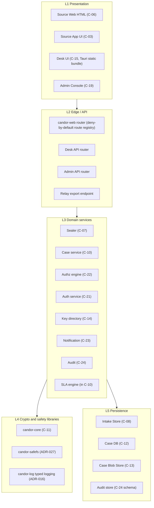

Rules:
- L1 never contains trust decisions. The server re-checks everything.
- L2 performs authentication, audience binding, input schema validation and size limits **before** any handler runs.
- L3 performs authorization via C-22 only. No handler contains ad-hoc role checks.
- L4 is the only layer allowed to touch key material, filesystem paths or log sinks.
- L5 is accessed only through typed repositories with mandatory tenant context (09-DATABASE.md §6).

## 6. Service boundaries

| Service | Owns data | Exposes | Consumes | Must never |
|---|---|---|---|---|
| `candor-web` (C-06) | nothing persistent; in-RAM sessions | Source Web routes, Source App API | sealer IPC, intake-store IPC | write to disk; hold a DB credential; log request data; parse file content |
| `candor-sealer` (C-07) | nothing persistent; RAM-only drafts and derived source keys | sealer IPC (Unix SEQPACKET) | channel epoch public keys (from signed snapshot) | open a network socket; write files; outlive a request with plaintext in RAM (zeroize) |
| `candor-intake-store` (C-08) | intake PostgreSQL DB and ciphertext blob directory | intake-store IPC (to web), relay export endpoint (TCP 7443) | — | initiate any outbound connection; hold any private decryption key except the intake routing key (§8.3) |
| `candor-relay` (C-09) | relay cursor state | none (client only) | relay export endpoint, Case DB | accept inbound connections; transform envelope content |
| `candor-case` (C-10, C-22, SLA) | Case DB (C-12), blob store (C-13) | Desk API, Admin API, Export API (EE connectors) | auth, keydir, audit, notify | hold any content-decryption key |
| `candor-auth` (C-21) | credentials, sessions (Case DB `auth` schema) | internal token service (Unix socket) | HSM/TPM (EE) | issue a token without an audience and tenant claim |
| `candor-keydir` (C-14) | key directory log (Case DB `kd` schema) | KD API (via Desk API and snapshot push) | audit, witnesses (outbound, optional) | rewrite or delete log entries |
| `candor-notify` (C-23) | notification queue | none | SMTP/Matrix/webhook egress (allow-list) | include case ID, count or time in a message (ADR-017) |
| `candor-audit` (C-24) | audit streams (separate DB `candor_audit`) | internal append IPC | checkpoint signer (TPM/HSM) | accept free-text fields |
| `candor-worker` | job table (C-12) | none | all of the above via their APIs | bypass service authorization (it runs jobs with a system principal scoped per job type) |
| Health agent (C-25) | none | local self-test socket | host facts | ship application payloads or anything outside the allow-list |

## 7. Trust boundaries

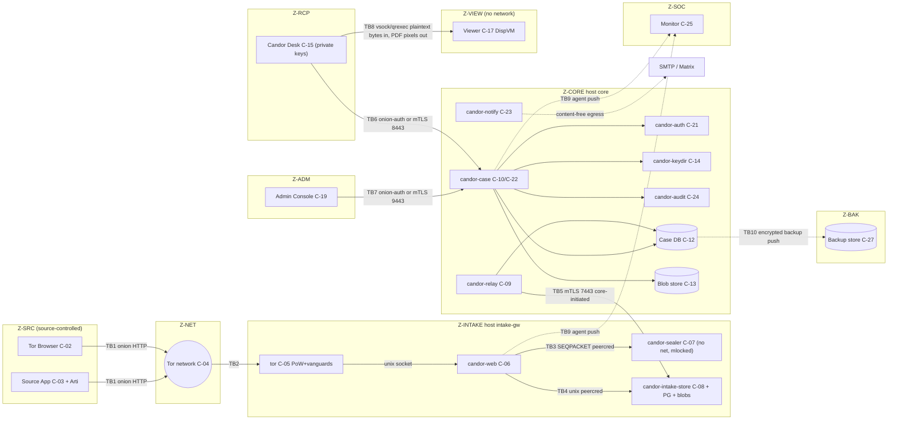

| TB | Boundary | Crossing data | Authentication | Principal risks | Controls |
|---|---|---|---|---|---|
| TB1 | Source device → Tor | Onion HTTP (Tier W plaintext inside Tor, Tier V ciphertext) | none (anonymous) | THR-002/003/004/006/008 | Onion only (ADR-001), no-JS UI, padding (ADR-011), guidance (05-SOURCE-OPSEC.md) |
| TB2 | Tor → intake host | Same | onion service keys | THR-005/032/044 | PoW, vanguards, no clearnet listener, Unix socket backend (16-TOR-I2P.md) |
| TB3 | web → sealer | Tier W plaintext stream, passphrases | SO_PEERCRED uid = `candor-web` | THR-014 | Separate process, no network (`PrivateNetwork=yes`), mlock, no core dumps (07-BACKEND.md §4) |
| TB4 | web → intake-store | Ciphertext envelopes, account public records | SO_PEERCRED | THR-015/021 | Typed IPC, size caps, envelope canonical-format validation |
| TB5 | core relay → intake | Sealed batches (down), sealed replies, signed directory and config (up) | mTLS 1.3, pinned Ed25519 certificates both ways, plus signed request bodies | THR-014 lateral movement | Core-initiated only; intake has no credential usable against core; host firewall |
| TB6 | Desk → core | Ciphertext and workflow metadata | WebAuthn session + device-bound token (desk-api audience) + onion client auth or mTLS client certificate | THR-021/022/019 | ADR-029, per-case ACL, uniform 404 (08-API.md) |
| TB7 | Admin → core | Configuration, users, roles | WebAuthn + admin-api audience + separate listener | THR-018/035 | No content endpoints on the admin router; DANGEROUS config needs dual approval |
| TB8 | Desk ↔ Viewer | Plaintext of one evidence object in; rendered/sanitized output out | Hypervisor channel identity | THR-023 | Disposable VM, no network, no keys in VM (INC-111, ADR-012) |
| TB9 | Hosts → monitor | SYSTEM/SECURITY-class events | mTLS per agent | THR-016/038 | Allow-list schema, no application payloads |
| TB10 | Core → backup | Double-encrypted ciphertext | Append-only credential | THR-017/042 | Backup key offline; write-once retention (19-BACKUPS-DR.md) |

## 8. Data flows

### 8.1 Primary intake flow (source to viewer)

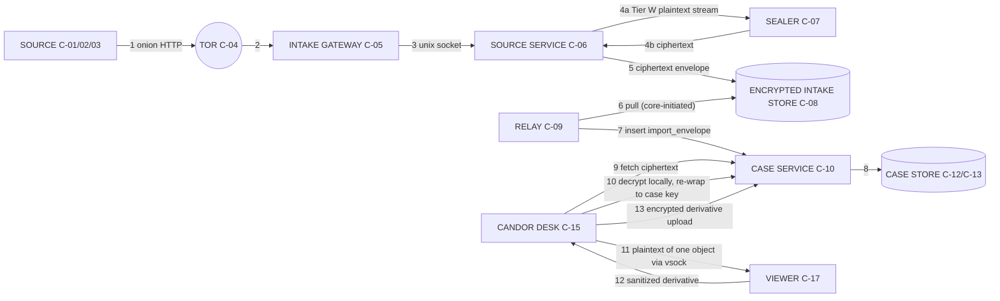

| Step | Data at rest after step | Encryption state | Time metadata |
|---|---|---|---|
| 1–3 | none | Tor circuit encryption. Tier W: HTTP plaintext inside the onion connection. | none |
| 4 | none (RAM only) | Tier W: sealer encrypts to channel epoch key (04-CRYPTOGRAPHY.md envelope). Tier V: client already encrypted. | none |
| 5 | `envelope` and `envelope_part` rows plus blobs in C-08 | HPKE envelope; parts padded (ADR-011) | `received_epoch_day` only |
| 6 | relay claims batch; intake deletes after ack | unchanged ciphertext | `batch_no` |
| 7–8 | `import_envelope` in C-12, blobs in C-13; intake copy deleted | unchanged ciphertext; **new random ID** assigned (intake ID not retained, §14) | `received_epoch_day`, `import_batch_no` |
| 9–10 | case, case key wraps, re-wrapped DEKs | case key wrapped per member (ADR-008) | staff times inside encrypted payload and audit only |
| 11–13 | evidence_derivative (ciphertext) | case key | as above |

### 8.2 Reply flow (recipient → source)

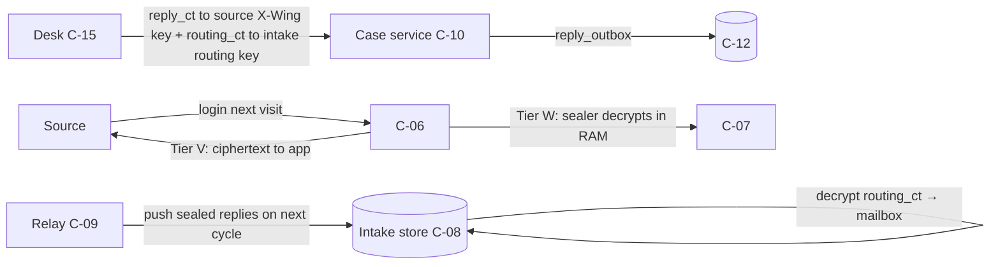

Routing: the Desk encrypts `{mailbox_id}` to the **Intake Routing Key**. This is an X-Wing keypair whose private half exists only on the intake host, sealed to the intake host TPM where available. The Case DB therefore never stores a cleartext source mailbox/account identifier (§14, 09-DATABASE.md §9).

### 8.3 Recipient path
Desk ↔ Desk API only. There is no browser-based recipient UI (ADR-007). Two transport options per profile:

| Option | Mechanism | Default in |
|---|---|---|
| RCP-ONION | Core tor instance publishes a v3 onion with client authorization (restricted discovery). One client-auth key per Desk device, rotated on device re-enrollment. The core host then needs **no inbound listening port**. | CE-SINGLE, CE-HARDENED, MANAGED |
| RCP-LAN | TCP 8443 on a dedicated recipient VLAN or WireGuard, mTLS with per-device client certificates issued at enrollment | EE-ONPREM, EE-HA, GOV-ONPREM, PRIVATE-CLOUD |

AIRGAP-RCP: the Desk runs on an offline workstation. Import and export happen via signed, encrypted transfer bundles carried on removable media between an online "transfer Desk" (ciphertext only; holds no private keys) and the offline Desk (keys). Detail in 18-DEPLOYMENT.md.

### 8.4 Admin path
- **Application administration:** Admin Console → Admin API (separate listener, `admin-api` audience, separate onion or management VLAN). Changes that affect Z-INTAKE are written as a **signed config bundle** to C-12. C-09 pushes it to intake, where `candor-intake-store` verifies it and exposes it to `candor-web`/`candor-sealer` via read-only files.
- **Host administration:** SSH on the management interface only. Authentication uses FIDO2 hardware keys (`sk-ssh-ed25519`), with no passwords, and the jump is the admin workstation. Remote sites use an SSH onion with client authorization. SSH sessions are recorded as SECURITY audit events (who, host, start/stop), not keystrokes.
- There are no admin endpoints on the source onion.

### 8.5 Monitoring path
- A C-25 agent on every host runs self-tests every 5 min ± 60 s jitter:
  - secret placement (ADR-028);
  - config signature;
  - schema lint status;
  - tor health;
  - disk usage;
  - epoch key runway;
  - clock offset;
  - log-suppression checks (access logs absent).
- Each agent **pushes** SYSTEM/SECURITY-class events to the monitor collector (TCP 8514, mTLS).
- The monitor holds no credentials for any other host and initiates no connection into Z-INTAKE or Z-CORE.
- Alerts leave the monitor content-free (ADR-017 wording rules).
- **EE:** C-24 exports allow-listed events to C-26, which forwards to the customer SIEM.

### 8.6 Backup path
- **Core:** `candor-backup` produces the backup artifacts, encrypts them to the **Backup Public Key** (X-Wing, private key offline k-of-n, 19-BACKUPS-DR.md) and pushes them to C-27 with an append-only credential. The artifacts are:
  - PostgreSQL base backup + WAL;
  - C-13 blobs (already ciphertext);
  - audit DB;
  - key directory.
- **Intake:** intake data is transient except source account records and pending replies. `candor-intake-store` produces a nightly snapshot encrypted to the Backup Public Key. **C-09 pulls it** (GET on the relay protocol), so Z-INTAKE never initiates to Z-BAK or Z-CORE. The snapshot is stored with the core backup set.
- The onion service private key is backed up only as part of an **offline** ceremony (sealed to the Backup Key and exported to removable media). It is never included in routine backups (INC-106, B-SD-22).

### 8.7 Update path

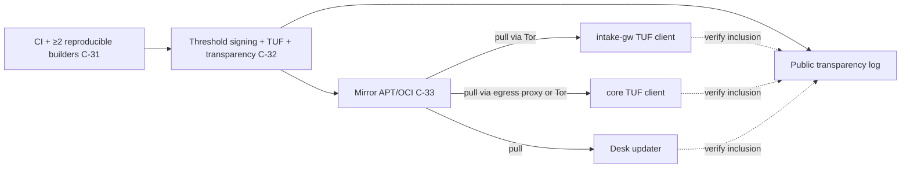

- Every host verifies TUF metadata (ADR-022) and transparency-log inclusion before install.
- Instances never send an instance identifier or onion address to the mirror.
- The intake host fetches exclusively through Tor.
- Staged rollouts are driven locally by the admin through `candorctl update stage` and `candorctl update apply`. Applying trust-path updates is an ADVANCED-class action (step-up authentication). Rollback and kill-switch behavior is specified in 33-RELEASE-UPDATE-SECURITY.md.

## 9. Sequence diagrams

### 9.1 Tier W (no-JS web) submission

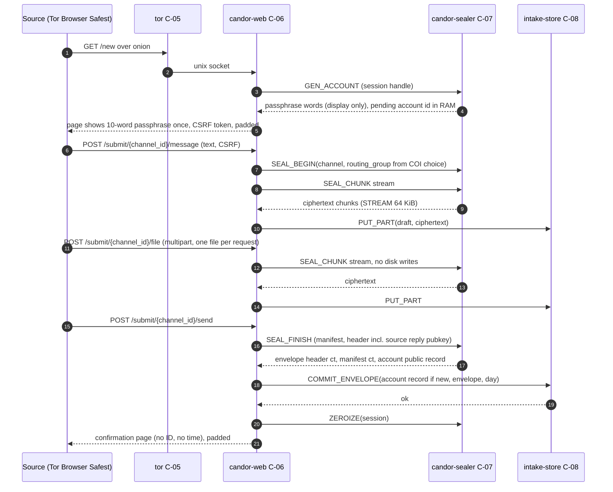

Notes:
- The passphrase is generated by C-07 using `getrandom` (ADR-005).
- The pending account is committed only with the first envelope. Drafts not committed within 2 h are purged from RAM, and their parts are purged from C-08 by `draft_gc`.
- No step writes plaintext to disk. Policy (allowed parts, sizes, counts) is enforced in the streaming parser before any byte reaches the sealer (INC-107).

### 9.2 Tier V (verified client) submission

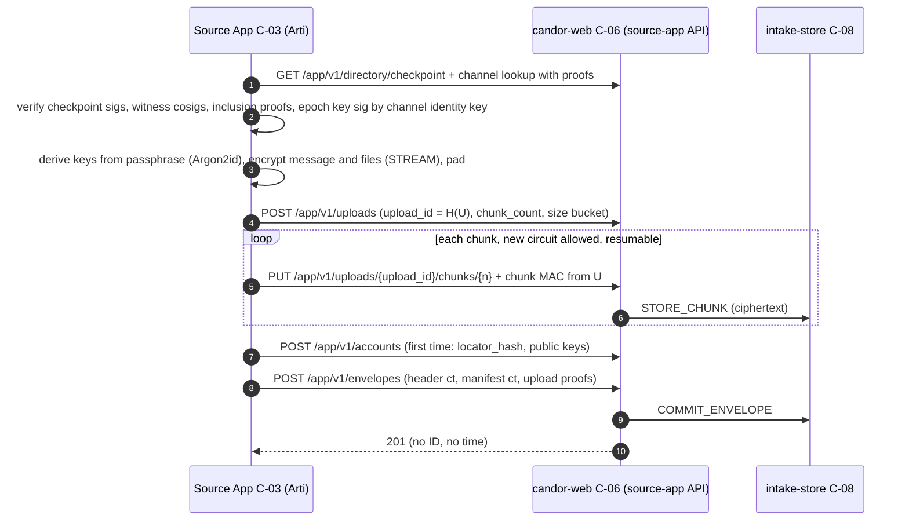

Tier V never sends plaintext and never involves C-07. The server validates only the canonical envelope structure and size buckets, and rejects anything else. It never offers a "server-side encryption" fallback (INC-117).

### 9.3 Source return and reply

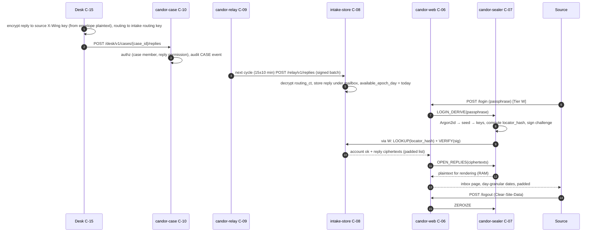

There are no read receipts: fetch or delete by the source is never reported to Z-CORE (ADR-010). For the Tier V flow, the app authenticates via challenge-signature and decrypts locally (08-API.md §5).

### 9.4 Recipient import and triage

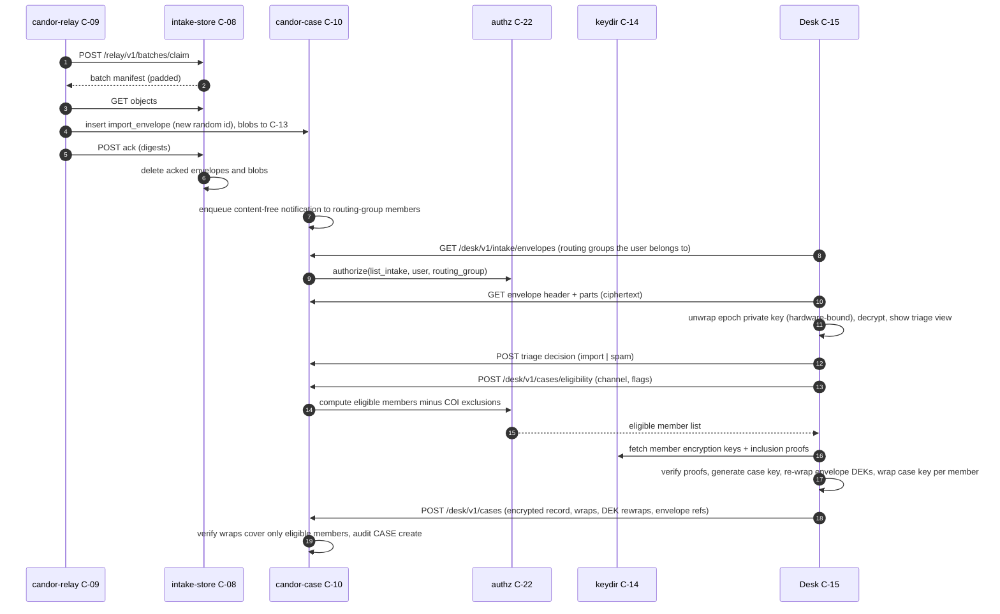

### 9.5 Conflict-of-interest routing

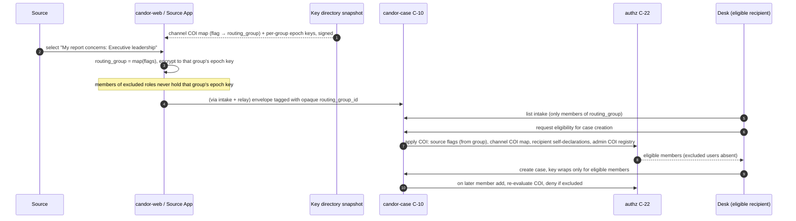

- Excluded users never receive a case key or epoch key (ADR-015).
- The routing-group ID is visible to servers and administrators as an opaque ID. Its meaning is visible to administrators who configure the COI map. See §15, residual risk R-3.

### 9.6 Export package

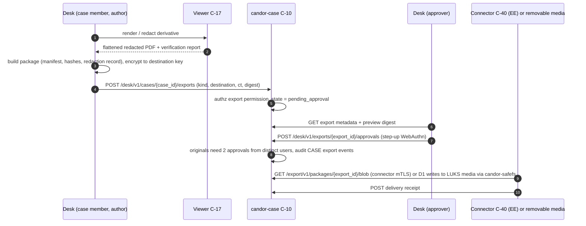

### 9.7 Break-glass

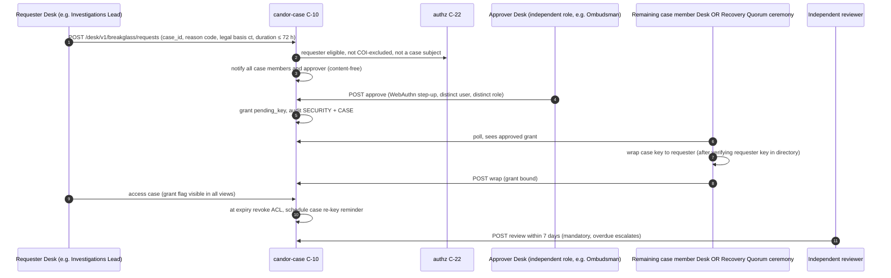

If no case member is available and Recovery Quorum (C-28) is enabled, the wrap is performed at an offline k-of-n ceremony (ADR-013). If neither is available, break-glass **cannot** grant content access. That is by design, not a defect.

## 10. Network segmentation matrix

The initiator is the row and the destination is the column. Empty = **DENY** (enforced at host firewall `nftables` default-drop both directions, plus the network firewall where present). Ports are defaults.

| From \ To | Tor network | intake-gw (Z-INTAKE) | core (Z-CORE) | Case DB / blob (Z-CORE internal) | monitor (Z-SOC) | backup (Z-BAK) | update mirror (Z-SUPPLY) | Desk (Z-RCP) | Viewer (Z-VIEW) | admin WS (Z-ADM) |
|---|---|---|---|---|---|---|---|---|---|---|
| Source (Z-SRC) | any (Tor client) | only as onion via Tor | | | | | | | | |
| intake-gw | TCP any (tor daemon only, uid `debian-tor`) | — (loopback/Unix only) | **DENY (ADR-009)** | **DENY** | TCP 8514 mTLS (agent push); UDP 123 NTP | **DENY** | via Tor SOCKS only | | | |
| core | TCP any, core tor only (RCP-ONION, updates) | TCP 7443 mTLS relay (`candor-relay` uid only) | — | Unix socket or TCP 5432 mTLS (EE-HA); S3 443 (EE) | TCP 8514 mTLS; NTS upstream via own chrony | TCP 443/22 append-only (`candor-backup` uid) | TCP 443 via egress proxy or Tor | | | |
| monitor | | **DENY** | **DENY** | | — | | TCP 443 | | | |
| backup | | | | | TCP 8514 (agent) | — | | | | |
| Desk (Z-RCP) | via Tor (RCP-ONION) | **DENY** | TCP 8443 mTLS (RCP-LAN) or via onion | **DENY** | | | TCP 443 (Desk updater) | — | vsock/qrexec only | |
| Viewer (Z-VIEW) | **DENY** | **DENY** | **DENY** | **DENY** | **DENY** | **DENY** | **DENY** | reply over the same vsock only | — | |
| admin WS (Z-ADM) | via Tor (remote onion admin) | TCP 22 SSH (management interface) | TCP 9443 Admin API; TCP 22 | **DENY** (no direct DB) | TCP 22; HTTPS 443 dashboard (read-only) | TCP 22 (restore only, dual-control) | TCP 443 | | | — |
| C-26 SIEM gw (EE) | | | | | — | | | | | customer SIEM TCP 6514 (outbound) |
| Fleet agent on core → C-34 (EE) | | | | | | | | | | vendor TCP 443 mTLS outbound only |
| Notification egress (core, `candor-notify` uid) | | | | | | | | | | SMTP 465/587 or HTTPS 443 to an allow-listed host |

Additional rules:
- Firewall rules are owner-matched (`meta skuid`) so that only the named service user can use a permitted flow.
- Intake-gw has **no** default route to the Internet except via the tor process (`meta skuid debian-tor`).
- Management interfaces are on a separate VLAN or NIC. The relay link is a dedicated VLAN, point-to-point link or WireGuard tunnel. In CE-SINGLE (VMs on one host), the relay link is a host-only bridge with nftables on both VMs and the hypervisor.
- Clock: the intake host syncs only to the monitor's NTP (or a site GPS/NTP appliance on the management network). The core uses NTS (THR-043).
- **Forbidden on all hosts:**
  - IPMI/BMC on production networks (the BMC must be on the management VLAN or disabled);
  - mDNS, LLMNR, SSDP;
  - IPv6 router advertisements accepted on intake;
  - DNS on the intake host outside Tor (the resolver is disabled, and `/etc/resolv.conf` points to 127.0.0.1 with nothing listening).

## 11. Transport Adapter abstraction

Anonymous-mode reachability is behind a `TransportAdapter` trait (ADR-001). This allows future transports without changes to C-06, C-07 or C-08.

```rust
pub trait TransportAdapter: Send + Sync {
    fn id(&self) -> TransportId;                      // e.g. "tor-onion-v3-ctor", "tor-onion-v3-arti"
    fn provision(&self, cfg: &SignedTransportConfig) -> Result<ServiceBinding, TransportError>;
    fn service_addresses(&self) -> Vec<PublicServiceAddress>; // published via C-14/C-37
    fn backend_socket(&self) -> UnixSocketPath;       // where C-06 listens; never TCP
    fn circuit_token(&self, conn: &ConnMeta) -> Option<EphemeralCircuitToken>; // in-memory only, for rate limiting
    fn dos_state(&self) -> DosState;                  // PoW effort, intro rate
    fn health(&self) -> TransportHealth;              // SYSTEM-class only
    fn rotate_service_key(&self, ceremony: &DualApproval) -> Result<(), TransportError>; // DANGEROUS
}
```

- `EphemeralCircuitToken` is a type that has no `Serialize` implementation and no `Debug` output. It is dropped when the connection closes, which enforces "circuit IDs never persisted" (ADR-026) at compile time.
- v1 implementations:
  - `tor-onion-v3-ctor`: C-tor ≥0.4.8, `HiddenServiceExportCircuitID haproxy`, PoW on, vanguards-lite, plus the full vanguards add-on for HIGH profiles.
  - `tor-onion-v3-arti`: gated off until Arti onion services are declared production-ready (B-AN-47, B-AN-45).
- **Admission criteria** for any new adapter. All are required, and assessment is recorded as a new ADR:
  1. an independent peer-reviewed anonymity analysis;
  2. an anonymity set ≥ Tor's order of magnitude for the target population, or cover traffic that makes usage deniable;
  3. a hardened source client exists (browser or app) that meets 11-FRONTEND-SOURCE.md;
  4. an active maintained upstream with a security-advisory process;
  5. backend delivery via Unix socket with no source network identifier;
  6. passes the 30-ANONYMITY-TESTING.md suite.
- I2P fails criteria 2 and 3 today (ADR-001; B-AN-33, B-AN-54, B-AN-57, B-AN-59).
- Confidential Clearnet Intake (C-38) is **not** a Transport Adapter. It is a separate, separately branded deployment of C-06/C-07/C-08 on a separate host (ADR-002). It never shares a listener, onion key, database or sealer process with anonymous intake.

## 12. Tenancy model (ADR-021) and deployment topology summary

### 12.1 Tenancy

| Aspect | CE | EE shared instance (low/moderate risk, one customer group) | EE dedicated (high risk: IG, internal affairs, intelligence-adjacent, adversary = parent org) | MANAGED |
|---|---|---|---|---|
| Tenants per instance | 1 (fixed `tenant_id`; RLS still active) | N subsidiaries or departments | 1 | 1 per customer (dedicated intake always) |
| Onion service | per channel group (≥1) | **per tenant** (distinct keys) | per instance | per customer |
| Intake processes | 1 set | **per tenant** set of `candor-web`, `candor-sealer`, `candor-intake-store` under distinct OS users | 1 set | per customer |
| Intake DB | 1 | **separate PostgreSQL database per tenant** | 1 | per customer |
| Case DB | 1 | shared DB with RLS on `tenant_id` (FORCE RLS, no BYPASSRLS roles); per-tenant DB is an ADVANCED option | 1 | per customer DB, shared cluster forbidden for high-risk customers |
| Channel and epoch keys | per channel | per tenant channel; never shared | per channel | per channel |
| Blob store | 1 root | per-tenant prefix/bucket with per-tenant credential | 1 | per customer bucket |
| Cross-tenant operations | n/a | only `candorctl root-maint`, audited, dual approval, never via the Admin API | n/a | vendor has no content access |

Tenant context: every request resolves `tenant_id` from the authenticated principal (desk/admin) or from the onion listener binding (source). It is **never** taken from a request field (INC-113).

### 12.2 Deployment topology per profile (summary; normative detail in 17-INFRASTRUCTURE.md and 18-DEPLOYMENT.md)

| Profile | Z-INTAKE | Z-CORE | Z-SOC | Z-BAK | Recipient | Notes |
|---|---|---|---|---|---|---|
| CE-SINGLE | VM on shared host | VM on same host | VM or omitted (agent-only local) | external disk or remote SFTP | Desk (RCP-ONION) | Documented reduced isolation: a hypervisor escape joins zones |
| CE-HARDENED | dedicated physical host | dedicated physical host | dedicated small host | dedicated store | Desk + DispVM viewer; optional AIRGAP | Reference profile for this document |
| EE-ONPREM | dedicated host or VM cluster (not shared with other workloads) | dedicated host(s) | customer SOC via C-26 | customer backup with Candor encryption | Desk (RCP-LAN) | SSO bridge (C-21) optional |
| EE-HA | 2 intake hosts, active/standby, one onion key (manual failover) or distinct onions per host | Kubernetes permitted (ADR-024); PG HA (sync replica) | C-26 | as EE | RCP-LAN | Replicas carry ciphertext only |
| GOV-ONPREM | dedicated hardware; FIPS profile | dedicated; HSM (C-29) for audit checkpoint and relay identity | C-26 | offline media rotation | RCP-LAN; AIRGAP optional | CANDOR-FIPS-1 suite |
| AIRGAP-RCP | any | any | any | any | offline Desk + transfer Desk | Media-bundle import/export |
| PRIVATE-CLOUD | dedicated VMs; provider sees RAM/disk (THR-030) | VMs or K8s | C-26 | provider object store (ciphertext) | RCP-LAN / RCP-ONION | Tier W plaintext exposure to hypervisor documented; Tier V recommended |
| MANAGED | vendor-run dedicated intake per customer | vendor-run core per customer | vendor SOC (SYSTEM class only) | vendor store (ciphertext) | customer Desk; keys never with vendor | Vendor can observe availability, sizes and coarse counts; cannot decrypt |

## 13. What each component learns

"Learns" means data the component can observe in the normal course of operation. "If compromised (live)" means what an attacker with code execution there gains, under ASM-* assumptions in 40-SECURITY-ASSUMPTIONS.md.

| Component | Source IP | Content | Source account linkage | Exact timing | Sizes | Recipient identities | If compromised (live) |
|---|---|---|---|---|---|---|---|
| C-04 Tor network | guard sees IP, not destination | no | no | yes (network timing) | packet sizes | no | Correlation attacks (THR-003); out of our control |
| C-05 tor daemon | no (onion) | no (sees HTTP bytes for Tier W inside TLS-less onion HTTP) | no | yes (in RAM) | yes | no | Tier W plaintext in transit; circuit metadata; onion key → impersonation (THR-044) |
| C-06 candor-web | no | Tier W: yes, transiently (streams); Tier V: no | yes, during session | yes (RAM, never persisted) | yes | no | Tier W plaintext of new submissions and replies rendered during the compromise window; Tier V: ciphertext and metadata only |
| C-07 sealer | no | Tier W: yes, transiently | yes (derives keys at login) | request-level only | yes | no | Tier W plaintext and source passphrases of sources who log in during the window (THR-014) |
| C-08 intake store | no | no (ciphertext) | account ↔ own envelopes until relayed; account ↔ mailbox replies | day only | padded buckets | no | Ciphertext, public keys, locator hashes, day counts; ability to drop or delay (DoS) |
| C-09 relay | no | no | no (routing blobs are opaque) | batch times | padded | no | Delay, drop, or replay attempts (detected by digest acks and the envelope nonce registry) |
| C-10/C-22 case service | no | no | case ↔ envelopes (by new IDs); no source account ID | staff times (audit) | padded | yes | Workflow metadata, ACLs, ciphertext; cannot decrypt; can deny service or attempt key substitution (detected by C-14 transparency, THR-046) |
| C-12/C-13 stores | no | no | as C-10 | day for source events | padded | yes | As C-10 at rest |
| C-14 key directory | no | no | no | entry times | no | public keys | Key substitution attempts become visible in the log; split-view is detected by witnesses and clients |
| C-15 Desk | no | yes (authorized cases only) | as revealed by content | as revealed by content | yes | yes | That member's cases (THR-019); bounded by ACL |
| C-17 viewer | no | one object | no | no | yes | no | That object only; no network to exfiltrate (THR-023) |
| C-19 admin | no | no | no | staff audit | aggregate counters (k ≥ 5) | yes | Config tampering (DANGEROUS needs 2 approvers); no content |
| C-23 notify | no | no | no | digest times | no | recipient contact addresses | Recipient contact list; message text is fixed |
| C-24 audit | no | no | no | staff actions exact | no | pseudonymous staff IDs | Staff activity history; hash chain makes tampering detectable |
| C-25/C-26 monitor/SIEM | no | no | no | system event times | host metrics | admin IDs (SECURITY) | Host health data; no path in (push-only) |
| C-27 backup | no | no | as C-12 (encrypted) | no | yes | encrypted | Nothing without the offline backup key |
| C-34 fleet (EE) | no | no | no | heartbeat times | no | no | Version and health per opaque instance ID; can offer only signed, transparency-logged releases (ADR-022) |

## 14. Linkage minimization across zones

| Identifier | Exists in | Crosses to | Rule |
|---|---|---|---|
| `source_account_id` | C-08 only | nowhere | Never leaves Z-INTAKE in cleartext. Replies are routed via `routing_ct` sealed to the intake routing key. |
| `intake_envelope_id` | C-08 | relay, transiently (manifest) | C-09 assigns a fresh random `import_envelope_id` on insert and does not persist the intake ID (acks are by content digest and batch number). |
| `locator_hash` | C-08 | nowhere | Lookup handle only |
| `routing_group_id` | C-08, C-12, C-14 | yes | Opaque random; meaning known to channel admins |
| `case_id` | C-12, C-15 | Desk only | Never shown to the source; the source sees no ID (ADR-010) |
| `thread_tag` (source-side, inside encrypted envelope) | ciphertext only | — | Lets Desk attach follow-ups to a case without any server-visible link |

## 15. Requirements

| ID | Requirement | Evidence | Threats | Component | Verification |
|---|---|---|---|---|---|
| ARCH-001 | Z-INTAKE and Z-CORE SHALL run on separate hosts in all profiles except CE-SINGLE, where they SHALL run in separate VMs with the documented reduced-isolation warning shown in the admin console. | ADR-009; ADR-024; B-SD-04 | THR-014; THR-015 | C-05; C-10 | INSP: deployment manifests per profile; TST: installer refuses co-location in CE-HARDENED+ (`deploy-topology-check`) |
| ARCH-002 | No network connection SHALL be initiated from any Z-INTAKE host to any Z-CORE address; host and network firewalls SHALL default-drop and log (SYSTEM class, no payload) such attempts. | ADR-009; B-GL-22 | THR-014 | C-05; C-09 | TST: `seg-matrix` probe from every intake uid to every core port expects failure; TST (security, 29): red-team pivot attempt from intake shell |
| ARCH-003 | The relay (C-09) SHALL be the only component exchanging data with Z-INTAKE from Z-CORE. It SHALL use mTLS 1.3 with pinned Ed25519 certificates on both sides plus signed request bodies, and the intake SHALL hold no credential that authenticates to any Z-CORE service. | ADR-009; INC-103 | THR-014; THR-021 | C-09; C-08 | TST: relay link with unpinned/rotated certificate fails; INSP: Secret Placement Manifest for intake-gw lists no core credential |
| ARCH-004 | The intake host SHALL have no network egress except by the `debian-tor` uid to the Tor network, the agent push to the monitor (TCP 8514), and NTP to the monitor. DNS resolution outside Tor SHALL be disabled. | ADR-001; INC-33; INC-34 | THR-001; THR-030 | C-05 | TST: nftables ruleset golden test; TST (security, 29): egress probe per uid expects drop |
| ARCH-005 | Every inter-service call SHALL derive caller identity from the transport (SO_PEERCRED, mTLS SAN, onion client-auth, hypervisor channel) and SHALL ignore identity claims in payloads. | INC-103; B-SD-34 | THR-021 | C-06; C-07; C-08; C-09; C-10; C-24; C-25 | TST: IPC spoofing suite sends payload-claimed identities from every peer and expects rejection |
| ARCH-006 | The source onion service backend SHALL be a Unix socket. `candor-web` SHALL NOT bind any TCP port. | INC-33; INC-34; REQ-H-33 | THR-001 | C-05; C-06 | TST: `ss -ltnp` check in the self-test; INSP: systemd unit `RestrictAddressFamilies=AF_UNIX` |
| ARCH-007 | Tier W plaintext SHALL exist only in RAM of `candor-web` (streaming buffers ≤ 256 KiB per request) and `candor-sealer`. It SHALL never be written to disk, swap, logs or core dumps. | ADR-004; INC-107; B-SD-26 | THR-014; THR-016 | C-06; C-07 | TST: fanotify zero-write test during submissions; TST: swap disabled or encrypted with ephemeral key check; TST (security, 29): core-dump attempt yields none |
| ARCH-008 | Tier V submissions SHALL be accepted only in the canonical envelope format. The server SHALL NOT offer or accept any server-side encryption fallback or client-declared "already encrypted" flag. | INC-117; ADR-004 | THR-007; THR-012 | C-06 | TST: submit plaintext with a forged header → 400 and nothing stored |
| ARCH-009 | The Case DB SHALL NOT contain any cleartext source account identifier, locator hash, or intake envelope identifier. Reply routing SHALL use a routing ciphertext sealed to the Intake Routing Key. | ADR-010; REQ-H-09 | THR-015; THR-018; THR-038 | C-09; C-12 | TST: schema lint forbids such columns; TST: relay integration test asserts intake IDs absent from C-12 after import |
| ARCH-010 | The relay SHALL pull at randomized intervals (default 15 ± 10 min, uniform) and SHALL assign fresh random IDs on import. The intake SHALL delete envelopes and blobs only after a digest-verified ack. | ADR-009; ADR-010 | THR-011; THR-015 | C-09; C-08 | TST: interval distribution test; TST: ack with wrong digest leaves data intact |
| ARCH-011 | Recipient access SHALL be only through Candor Desk via the Desk API over RCP-ONION (client-auth onion) or RCP-LAN (mTLS). No browser-accessible recipient or admin UI SHALL be served by any server. | ADR-007; INC-105 | THR-022; THR-007 | C-10; C-15 | TST: HTTP GET of every core listener without client credentials returns connection refusal or TLS failure; INSP |
| ARCH-012 | The Admin API SHALL be served on a listener separate from the Desk API with a distinct audience, and SHALL expose no endpoint returning case content, case key wraps or evidence blobs. | ADR-015; ADR-029; INC-114 | THR-018; THR-021 | C-10; C-19 | TST: route registry diff test (admin router vs content route list = ∅) |
| ARCH-013 | Evidence decryption SHALL occur in C-15. Parsing and rendering SHALL occur only in C-17, with no network interface and no key material, and each object SHALL be opened in a fresh disposable instance. | ADR-012; INC-111; B-SD-05 | THR-023 | C-15; C-17 | TST (security, 29): weaponized corpus in viewer; TST: viewer VM has no NIC and no key files (self-test) |
| ARCH-014 | Monitoring SHALL be push-only from agents to the collector. The monitor host SHALL hold no credential for, and SHALL initiate no connection to, Z-INTAKE or Z-CORE. | INC-103; INC-106; B-SD-22 | THR-016; THR-014 | C-25 | TST: Secret Placement Manifest check on the monitor; TST: segmentation probe |
| ARCH-015 | Intake backups SHALL be produced encrypted to the Backup Public Key on intake and pulled by C-09. Z-INTAKE SHALL NOT connect to Z-BAK. | ADR-009; INC-55 | THR-017 | C-08; C-27 | TST: restore drill without the offline key yields no readable data; segmentation probe |
| ARCH-016 | The onion service private key SHALL NOT be included in routine backups. Backing it up SHALL be a separate offline, dual-approved ceremony. | INC-106; B-GL-11 | THR-044; THR-017 | C-05; C-27 | INSP: backup manifest; TST: backup content scanner for onion key patterns |
| ARCH-017 | Every host SHALL have a Secret Placement Manifest, verified post-deploy and every 5 min by C-25. Any violation SHALL fail deployment or raise a SECURITY alert. | ADR-028; INC-106 | THR-013; THR-035 | C-25 | TST: plant a stray key on the monitor → alert within 10 min |
| ARCH-018 | All components SHALL fetch updates via TUF with transparency-log inclusion verification. The intake host SHALL fetch only through Tor, and no update request SHALL carry an instance identifier or onion address. | ADR-022; INC-49; INC-38 | THR-025; THR-024 | C-05; C-10; C-15; C-33 | TST: update client packet capture shows no instance ID; TST: unsigned or unlogged update rejected |
| ARCH-019 | Anonymous-mode reachability SHALL be implemented only via a `TransportAdapter` that meets all §11 admission criteria. Adding an adapter SHALL require a new ADR. | ADR-001; B-AN-33; B-AN-57 | THR-003; THR-005 | C-05 | INSP: ADR register; TST: adapter conformance suite |
| ARCH-020 | `EphemeralCircuitToken` (and any transport connection metadata) SHALL NOT implement serialization, `Debug` or `Display`, and SHALL NOT be stored beyond the connection lifetime. | ADR-026 | THR-001; THR-016 | C-05; C-06 | TST: compile-fail test; INSP: code review |
| ARCH-021 | Confidential Clearnet Intake (C-38), when enabled, SHALL run on separate hosts with separate onion/TLS keys, DB, sealer and channels, and SHALL display "NOT ANONYMOUS" on every page. It SHALL NOT share any process or store with anonymous intake. | ADR-002 | THR-040 | C-38 | TST: deploy check; DEMO: usability review of labeling |
| ARCH-022 | Tenant context SHALL be derived from the authenticated principal or the onion listener binding, never from request input. EE shared instances SHALL use per-tenant onion services, per-tenant intake process sets and DBs, and RLS-enforced Case DB tenancy. | ADR-021; INC-113; B-GL-37 | THR-021; THR-045 | C-06; C-10; C-12 | TST: two-tenant isolation harness (tenant B snapshot unchanged after all tenant-A actions) |
| ARCH-023 | High-risk customers (as defined in ADR-021) SHALL be deployed only on dedicated instances. The installer SHALL require an explicit risk classification at tenant creation. | ADR-021 | THR-045; THR-020 | C-10 | INSP: tenant creation flow; TST: `root-maint tenant create` without a risk class fails |
| ARCH-024 | COI exclusions from source flags SHALL be applied at intake encryption time by selecting the routing-group epoch key. Case-level COI SHALL be re-evaluated by C-22 before every key wrap. Excluded users SHALL never receive a wrap. | ADR-015; INC-22 | THR-020 | C-06; C-07; C-22; C-15 | TST: COI scenario suite (excluded user cannot list, fetch, or be added); TST (security, 29): attempt to add excluded member via API |
| ARCH-025 | Break-glass SHALL require a requester and an approver who are distinct users with distinct roles, a time limit ≤ 72 h, notification to all case members, and a post-hoc independent review within 7 days. It SHALL grant content access only via a key wrap by an existing member or the Recovery Quorum. | ADR-015; ADR-013 | THR-018; THR-019 | C-10; C-22; C-15 | TST: break-glass state machine tests; DEMO: tabletop exercise |
| ARCH-026 | Export of report content to any external system SHALL occur only through an Export Package created in C-15. Exports of originals SHALL require approval by two distinct users. | ADR-018; INC-16 | THR-029; THR-041 | C-15; C-10; C-40 | TST: connector cannot fetch unapproved packages; TST: single-approver original export denied |
| ARCH-027 | The segmentation matrix (§10) SHALL be implemented as owner-matched nftables rules generated from one machine-readable policy file, and verified by an automated probe after every deploy. | ADR-028; INC-118 | THR-035 | C-39; C-25 | TST: `seg-matrix` probe CI and post-deploy |
| ARCH-028 | The intake host clock SHALL sync only from the monitor NTP or a site appliance. The core SHALL use NTS. Any component SHALL raise a SYSTEM alert at offset > 2 s and refuse token issuance at offset > 120 s (core). | THR-043 analysis; Knowledge (unverified): onion-service clock-skew fingerprinting | THR-043; THR-005 | C-05; C-21; C-25 | TST: skew injection tests |
| ARCH-029 | No component SHALL fall back to a less protective mode when a dependency fails: no clearnet fallback, no plaintext spool, no unverified-key encryption and no logging enablement (see 07-BACKEND.md §13). | ADR-002; P10 | THR-040; THR-035 | all | TST: fault-injection suite per dependency |
| ARCH-030 | The Case DB, blob store and backups SHALL contain source-derived data only as ciphertext under keys absent from Z-CORE, Z-BAK and Z-SOC. Media encryption (LUKS/TPM) SHALL additionally be enabled on all server volumes. | ADR-008; ADR-025; INC-02 | THR-015; THR-031 | C-12; C-13; C-27 | TST: seized-image analysis (disk image + DB dump contains no plaintext canary); INSP |
| ARCH-031 | EE modules (C-26, C-34, C-40 and other ADR-020 modules) SHALL run only in Z-CORE, Z-SOC, Z-ADM or Z-VENDOR, SHALL interact only via the documented APIs in 08-API.md, and SHALL NOT be loaded into any process listed in §6 as trust path. | ADR-020 | THR-027; THR-029 | C-26; C-34; C-40 | INSP: process/crate dependency graph check in CI (`trust-path-deps`) |
| ARCH-032 | The Fleet Manager (C-34) SHALL be reached only by outbound connections from the customer instance. It SHALL receive only opaque instance IDs, versions and SYSTEM-class health, and SHALL be unable to push unsigned configuration or trust-path code. | ADR-022; ADR-020 | THR-027; THR-025 | C-34 | TST: fleet agent payload schema test; TST (security, 29): malicious fleet server harness |
| ARCH-033 | Every component with a listening socket SHALL be enumerated in a machine-readable listener inventory. Self-test SHALL fail if any unlisted listener exists. | INC-34; REQ-H-34 | THR-035; THR-001 | C-25 | TST: inventory diff in self-test |
| ARCH-034 | The Clearnet Information Site (C-37) SHALL be hosted separately from all Candor zones, SHALL have no network path to them, and SHALL carry no third-party resources. | REQ-H-53; INC-53; INC-118 | THR-036; THR-004 | C-37 | TST: external header/resource probe; INSP |
| ARCH-035 | The AIRGAP-RCP profile SHALL move data only as signed, encrypted transfer bundles processed through `candor-safefs`. The online transfer Desk SHALL hold no private keys. | ADR-027; INC-109; INC-111 | THR-023; THR-013 | C-15; C-18 | TST: malicious bundle fuzzing; INSP: key inventory of the transfer Desk |
| ARCH-036 | Each deployment profile SHALL publish, in the key directory, a machine-readable "protection statement" (tiers enabled, escrow state, clearnet intake state, profile). Sources and the Source App SHALL be able to read it. | ADR-013; ADR-002 | THR-040; THR-035 | C-14; C-06 | TST: directory entry present and signed; DEMO: source UI displays it |

## 16. Residual risks and limitations

| # | Risk | Why it remains | Mitigation / documentation |
|---|---|---|---|
| R-1 | A live-compromised intake host (C-05/C-06/C-07) reads Tier W submissions and the passphrases of Tier W sources who log in during the compromise window. | Inherent to server-rendered no-JS intake (ADR-004). | Tier V recommended for high-risk sources. Honest statement shown on the Tier W page. Intake minimized and monitored. Assumes ASM for intake-host integrity monitoring. |
| R-2 | End-to-end timing correlation by an adversary observing both the source's network and the intake host's Tor traffic (THR-003). | Tor does not defend against a global passive adversary. | Coarse time stored (ADR-010). Relay decoupling. No push. Guidance (05-SOURCE-OPSEC.md). |
| R-3 | Routing-group IDs reveal to server operators that a report was routed with particular COI flags (e.g., "concerns executives"), and when (day granularity). | Server-side routing needs a routing key selector. | Opaque IDs. Counts per group are SOURCE-SENSITIVE aggregates with k-anonymity. Admins who configure COI maps are a distinct role from accused-prone roles. Open issue O-2. |
| R-4 | CE-SINGLE collapses zones onto one hypervisor. | Cost trade-off. | Warning in admin console and protection statement. Tier V still protects content. |
| R-5 | PRIVATE-CLOUD and MANAGED providers can snapshot RAM (Tier W plaintext) and observe traffic volumes. | Provider has physical control (THR-030). | Tier V recommended. Documented in the protection statement. |
| R-6 | A compromised Desk device exposes all cases its user can access. | Keys must be usable where decryption happens (ADR-007). | Hardware-bound unlock, case-scoped ACLs, device revocation (15-AUTHENTICATION-AUTHORIZATION.md). |
| R-7 | Break-glass cannot un-share a case key after expiry. | Keys once delivered cannot be recalled. | Case re-key for new content after expiry; post-hoc review. |
| R-8 | The relay link is a single choke point for availability. | Design choice (one-way pull). | Intake buffers ≥ 7 days at design load (34-PERFORMANCE-SCALABILITY.md); alerts on relay lag > 2 h. |
| R-9 | Monitor push from intake gives an intake attacker a network path to the monitor collector. | Push is chosen to avoid monitor holding credentials into intake. | Collector is minimal (Rust, schema-validating), holds no secrets usable elsewhere (ADR-028). |

## 17. Open issues

| # | Issue | Proposed resolution |
|---|---|---|
| O-1 | ADR-029 lists four token audiences. Machine-to-machine channels (relay, connector, fleet, SIEM gateway, health collector) use mTLS peer identity rather than tokens. | Amend ADR-029 to state that machine channels are identified by mTLS SAN and never accept user tokens (see 08-API.md O-1). |
| O-2 | COI flag privacy (R-3). | Evaluate "dummy multi-group encryption": the envelope key is wrapped to all routing groups' epoch keys, with group-specific decryptability hidden. That needs a crypto design in 04-CRYPTOGRAPHY.md. Record as ADR candidate "COI routing privacy". |
| O-3 | Intake Routing Key is a new key type not named in ADR-008. | Add it to the ADR-008 key hierarchy: X-Wing, generated on intake at install, public key in C-14, used only for reply routing. |
| O-4 | EE-HA intake failover with a single onion key means two hosts hold the onion key. | Prefer distinct onion keys per intake host, both published. Decide in 16-TOR-I2P.md. |

### Open Issues for ADR revision
- **ADR-008:** add the Intake Routing Key and Backup Key to the hierarchy (O-3).
- **ADR-029:** machine audiences (O-1).
- **ADR-015:** the COI routing-group mechanism leaks flag choice at the metadata level (O-2). This document conforms to ADR-015 ("exclusions applied before key wrapping") and records the leakage.
