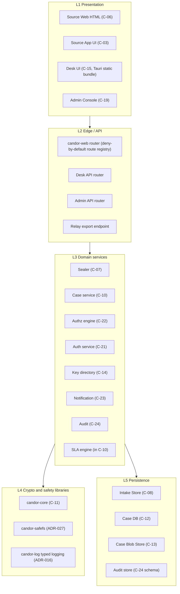
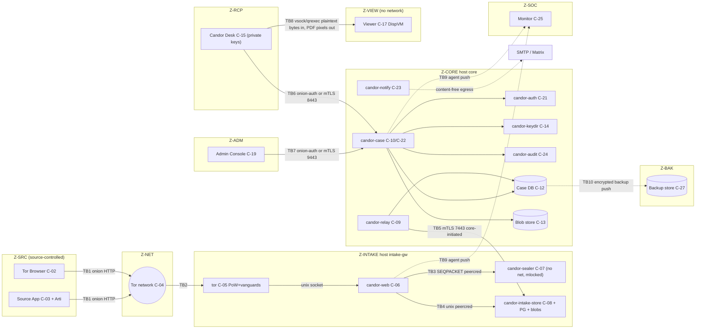
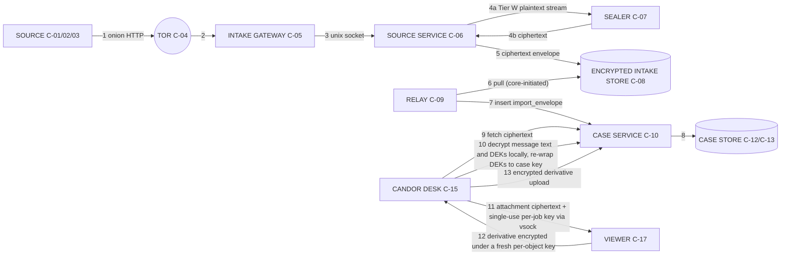
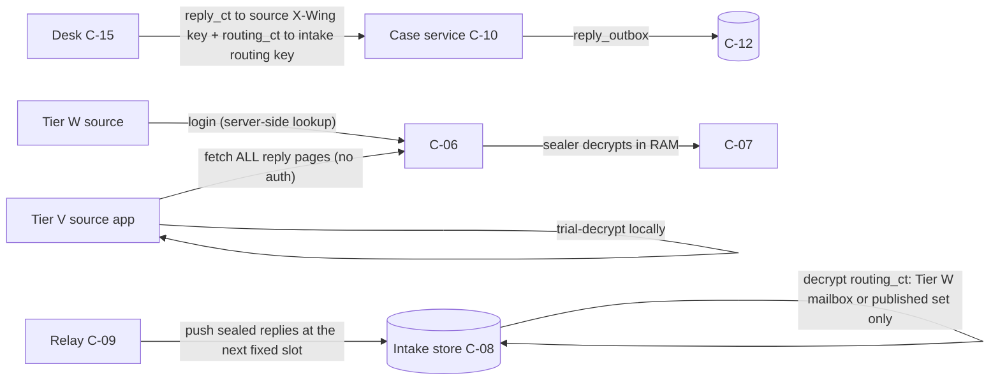
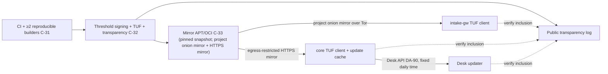
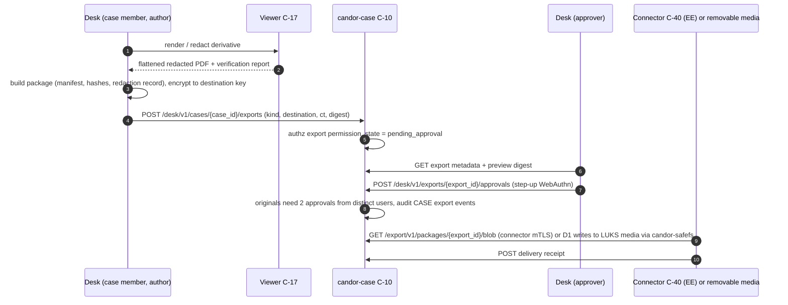

# 06 — System Architecture

Status: Draft v1.2 (round-3 consistency pass: ADR-047; revision round 2: ADR-034..046) · Edition applicability: both (CE and EE; EE-only elements marked **EE**) · Owner: Architecture team

## 1. Purpose and scope

This document fixes the logical and physical architecture of Candor. It covers:
- zones, components and application layers;
- service boundaries and trust boundaries;
- data flows for the source, recipient, admin, monitoring, backup and update paths;
- sequence diagrams for the principal protocols;
- the network segmentation matrix;
- the Transport Adapter abstraction;
- the tenancy model;
- a per-profile topology summary;
- a statement of what each component learns.

It binds 07-BACKEND.md (process-level design), 08-API.md (wire contracts), 09-DATABASE.md (schemas), 16-TOR-I2P.md (onion configuration), 17-INFRASTRUCTURE.md and 18-DEPLOYMENT.md (host and profile detail).

Out of scope, and specified in the named documents:
- cryptographic constructions: 04-CRYPTOGRAPHY.md;
- UI: 11, 12, 13;
- authorization policy language: 15-AUTHENTICATION-AUTHORIZATION.md;
- evidence sanitization internals: 10-FILE-EVIDENCE-PIPELINE.md.

## 2. Context and dependencies

| Depends on | For |
|---|---|
| DECISIONS.md §4 and ADR-001…046 | Component IDs, zones and all baseline decisions (binding). ADR-034..046 supersede conflicting earlier text in this document. |
| 02-THREAT-MODEL.md | THR-/ADV- definitions |
| 03-PRIVACY-ANONYMITY.md | Metadata budget; this document implements its data-minimization at the architecture level |
| 04-CRYPTOGRAPHY.md | Key hierarchy (ADR-006/008), envelope and STREAM formats, source KDF (ADR-005) |
| 07-BACKEND.md, 08-API.md, 09-DATABASE.md | Refinement of the services, APIs and stores defined here |
| 10-FILE-EVIDENCE-PIPELINE.md | Viewer (C-17) internals |
| 14-CASE-MANAGEMENT.md, 15-AUTHENTICATION-AUTHORIZATION.md | Workflow, routing, COI and break-glass policy semantics |
| 16-TOR-I2P.md | torrc, PoW, vanguards, client authorization, Arti migration |
| 17-INFRASTRUCTURE.md, 18-DEPLOYMENT.md | Hosts, firewalls and profile specifics |
| 19-BACKUPS-DR.md, 20-LOGGING-AUDITING.md, 33-RELEASE-UPDATE-SECURITY.md | Backup, audit and update paths |
| 40-SECURITY-ASSUMPTIONS.md | ASM-* assumptions referenced in §15 |

## 3. Architectural principles (normative summary)

| # | Principle | Source |
|---|---|---|
| P1 | **The server is never the content-protection layer.** Content is protected by keys held on source clients and recipient endpoints (C-03, C-15). Server media encryption only protects against media loss. | ADR-007, ADR-008 |
| P2 | **The intake zone is expendable.** Z-INTAKE compromise yields only what §13 lists. No path leads from Z-INTAKE into Z-CORE, because no connection is ever initiated from Z-INTAKE to Z-CORE. | ADR-009 |
| P3 | **Pull, not push, toward higher trust.** Higher-trust zones initiate connections to lower-trust zones: Z-CORE→Z-INTAKE, Z-CORE→Z-BAK, agents→Z-SOC collector. The only listeners on Z-CORE are the recipient (Desk) and admin endpoints. | ADR-009; B-GL-22 (CoverDrop pull-only CoverNode) |
| P4 | **Identity from transport, never from payload.** Every inter-service call derives the caller's identity from mTLS peer certificate, SO_PEERCRED or onion client-auth key. | INC-103, INC-105 |
| P5 | **Deny by default.** Every route, IPC verb, firewall rule and DB role starts denied. | ADR-029; INC-114 |
| P6 | **Coarse time for source events; fixed schedules for everything they trigger.** Source events carry a day number and a batch number, never an exact time. Imports, reply pushes, staff notifications and directory publications run on fixed schedules, never on arrival. | ADR-010; ADR-036(7); ADR-038 |
| P7 | **No parsing of evidence on servers.** Attachments are opaque ciphertext until they are inside C-15/C-17. | ADR-012 |
| P8 | **Admin ≠ content.** No administrative role or host holds a key that decrypts case content. | ADR-015 |
| P9 | **Secrets have declared homes.** Every secret has a declared host set, verified post-deploy by the Secret Placement Manifest. | ADR-028; INC-106 |
| P10 | **Fail closed on the anonymity path.** No component falls back to a less-protective mode (clearnet, plaintext storage, unverified key) when a dependency fails. | ADR-002 |

## 4. Zones and components

### 4.1 Zone model

| Zone | Trust level (to the source) | Contains | Reachable from | May initiate to |
|---|---|---|---|---|
| Z-SRC | Source-trusted, platform-untrusted | C-01, C-02, C-03 | — | Z-NET only |
| Z-NET | Untrusted transport | C-04 | Z-SRC, Z-INTAKE, Z-RCP (optional), Z-ADM (optional) | — |
| Z-INTAKE | Low (assumed attackable from the Internet via onion) | C-05, C-06, C-07, C-08, plus the intake half of the C-11 library | Z-NET (onion only); Z-CORE relay (C-09) on the relay link; Z-ADM (SSH, management link) | Z-NET (Tor, including the project onion update mirror and Roughtime over Tor), Z-SOC collector (dedicated monitoring interface; collector host has no clearnet egress). No NTP from any Candor host (ADR-036(6)). |
| Z-CORE | High | C-09, C-10, C-12, C-13, C-14, C-21, C-22, C-23, C-24, C-29 (EE) | Z-RCP (Desk API), Z-ADM (Admin API, SSH) | Z-INTAKE (relay link), Z-BAK, Z-SOC, Z-SUPPLY mirror (egress-restricted HTTPS, ADR-046(3)), notification egress, Z-VENDOR fleet (EE), C-40 targets (EE), witnesses |
| Z-RCP | High (holds private keys) | C-15, C-16 | — | Z-CORE Desk API; Z-VIEW via local IPC only |
| Z-VIEW | Hostile content, no trust | C-17, C-18 | Z-RCP local IPC only (vsock, qrexec) | nothing (no network) |
| Z-ADM | High for configuration, zero for content | C-19, C-20, C-28 (offline) | — | Z-CORE Admin API, host SSH (management link) |
| Z-SOC | Low–medium (sees SYSTEM/SECURITY class only) | C-25 monitor host, C-26 (EE) | agents (push), Z-CORE audit exporter | NTS upstream, alert egress, customer SIEM (EE) |
| Z-BAK | Low (ciphertext only) | C-27 store | Z-CORE backup agent | nothing |
| Z-SUPPLY | Vendor/project | C-30…C-33 | all hosts (pull) | nothing into customer zones |
| Z-VENDOR | Untrusted by customer | C-34, C-35, C-36 | Z-CORE fleet agent (EE) | nothing into customer zones |
| Internet | Public | C-37 | public | nothing into Candor zones |
| Z-INTAKE-CLEAR | Low; NOT anonymous | C-38 (off by default) | clearnet | Z-SOC; pulled by C-09 like Z-INTAKE |

### 4.2 Component-to-host placement (reference placement; per-profile variations in §12)

| Host role | Components | OS users (see 07-BACKEND.md §4) | Listeners |
|---|---|---|---|
| `intake-gw` | C-05 tor, C-06 `candor-web`, C-07 `candor-sealer`, C-08 `candor-intake-store` plus PostgreSQL (intake), blob directory and the tmpfs staging area `/run/candor/staging` (ADR-034); C-25 agent | `debian-tor`, `candor-web`, `candor-sealer`, `candor-istore`, `postgres`, `candor-health` | Onion service → Unix socket `/run/candor/web/http.sock`; relay export on TCP 7443 bound **only** to the relay-link interface; sshd on the management interface only |
| `core` | C-09 `candor-relay`, C-10+C-22 `candor-case`, Erasure Key Vault `candor-ekv` (part of C-12 per ADR-033), C-21 `candor-auth`, C-14 `candor-keydir`, C-23 `candor-notify`, C-24 `candor-audit`, `candor-worker`, C-12 PostgreSQL, C-13 blob store (local or S3 on-prem), C-25 agent, C-27 backup agent, core tor instance (optional, for the Desk/Admin onion) | one OS user per service | Desk API (Unix socket behind the core onion **or** TCP 8443 mTLS on the recipient VLAN); Admin API (Unix socket behind a separate onion **or** TCP 9443 mTLS on the management VLAN); sshd on the management interface |
| `monitor` | C-25 collector; C-26 (EE). The collector host has **no clearnet egress** (RVW-A-23). | `candor-monitor` | TCP 8514 mTLS (collector) on the dedicated monitoring interface |
| `alert-relay` | Alert sender (mail/webhook) reading from the collector; separate host or VM with no route from intake-gw | `candor-alert` | none (outbound only) |
| `backup` | C-27 store (append-only object store or SFTP) | store-specific | TCP 443 or 22 from core only |
| Recipient workstation | C-15 Desk, C-16 OS, C-17 viewer (DispVM or microVM), C-29 token | user | none |
| Admin workstation | C-19 (Desk in admin mode plus `candorctl`), C-20 | admin | none |

## 5. Application layers



Rules:
- L1 never contains trust decisions. The server re-checks everything.
- L2 performs authentication, audience binding, input schema validation and size limits **before** any handler runs.
- L3 performs authorization via C-22 only. No handler contains ad-hoc role checks.
- L4 is the only layer allowed to touch key material, filesystem paths or log sinks.
- L5 is accessed only through typed repositories with mandatory tenant context (09-DATABASE.md §6).

## 6. Service boundaries

| Service | Owns data | Exposes | Consumes | Must never |
|---|---|---|---|---|
| `candor-web` (C-06) | nothing persistent; in-RAM sessions | Source Web routes, Source App API | sealer IPC, intake-store IPC | write to disk; hold a DB credential; log request data; parse file content |
| `candor-sealer` (C-07) | nothing persistent; RAM-only drafts (text, identity block, COI ticks), per-session part keys, newly generated passphrases until confirmed, derived source keys (ADR-034) | sealer IPC (Unix SEQPACKET) | channel roster, Triage Set, COI map and Member Epoch Keys (from the verified snapshot) | open a network socket; write files; seal to recipients before Submit is finalized; outlive a session with plaintext in RAM (zeroize) |
| `candor-intake-store` (C-08) | intake PostgreSQL DB, ciphertext blob directory, tmpfs staging area (ciphertext only) | intake-store IPC (to web), relay export endpoint (TCP 7443) | — | initiate any outbound connection; hold any private decryption key except the intake routing key (§8.2); acknowledge "received" before `fsync` (ADR-046(1)) |
| `candor-relay` (C-09) | relay cursor state | none (client only) | relay export endpoint, Case DB | accept inbound connections; transform envelope content; import outside a fixed slot (ADR-038(1)) |
| `candor-case` (C-10, C-22, SLA) | Case DB (C-12), blob store (C-13) | Desk API, Admin API, Export API (EE connectors) | auth, keydir, audit, notify | hold any content-decryption key |
| `candor-auth` (C-21) | credentials, sessions (Case DB `auth` schema) | internal token service (Unix socket) | HSM/TPM (EE) | issue a token without an audience and tenant claim |
| `candor-keydir` (C-14) | key directory log (Case DB `kd` schema) | KD API (via Desk API and snapshot push) | audit, witnesses (outbound; ≥ 2 required in EE/GOV/MANAGED) | rewrite or delete log entries; publish epoch keys or time-locked entries outside the weekly slot (ADR-036(7)) |
| `candor-notify` (C-23) | notification queue | none | SMTP/Matrix/webhook egress (allow-list) | include case ID, count or time in a message (ADR-017); send anything triggered by an event (ADR-038(2)) |
| `candor-audit` (C-24) | audit streams (separate DB `candor_audit`) | internal append IPC | checkpoint signer (TPM/HSM) | accept free-text fields |
| `candor-ekv` (C-12 vault) | per-case Erasure Keys (ADR-033(3)) sealed under a TPM/HSM Vault Master Key; signed erasure log (ADR-044(4)) | EKV IPC (Unix socket; peers `candor-case`, `candor-worker`) | TPM/HSM (physical, never vTPM, in HIGH/GOV); DR-site vault (EE-HA replication) | release an Erasure Key outside its process; be included in routine or infrastructure-level backups |
| `candor-worker` | job table (C-12) | none | all of the above via their APIs | bypass service authorization (it runs jobs with a system principal scoped per job type) |
| Health agent (C-25) | none | local self-test socket | host facts | ship application payloads or anything outside the allow-list |

## 7. Trust boundaries



| TB | Boundary | Crossing data | Authentication | Principal risks | Controls |
|---|---|---|---|---|---|
| TB1 | Source device → Tor | Onion HTTP (Tier W plaintext inside Tor, Tier V ciphertext) | none (anonymous) | THR-002/003/004/006/008 | Onion only (ADR-001), no-JS UI, padding (ADR-011), guidance (05-SOURCE-OPSEC.md) |
| TB2 | Tor → intake host | Same | onion service keys | THR-005/032/044 | PoW, vanguards, no clearnet listener, Unix socket backend (16-TOR-I2P.md) |
| TB3 | web → sealer | Tier W plaintext stream, draft text, passphrases | SO_PEERCRED uid = `candor-web` | THR-014 | Separate process, no network (`PrivateNetwork=yes`), mlock, no core dumps; drafts RAM-only (07-BACKEND.md §4, ADR-034) |
| TB4 | web → intake-store | Staged part ciphertext (tmpfs), ciphertext envelopes, Tier W account public records | SO_PEERCRED | THR-015/021 | Typed IPC, size caps, envelope canonical-format validation, `fsync` before "received" |
| TB5 | core relay → intake | Sealed batches (down), sealed replies, signed directory and config (up) | mTLS 1.3, pinned Ed25519 certificates both ways, plus signed request bodies | THR-014 lateral movement | Core-initiated only; intake has no credential usable against core; host firewall |
| TB6 | Desk → core | Ciphertext and workflow metadata | WebAuthn session + device-bound token (desk-api audience) + onion client auth or mTLS client certificate | THR-021/022/019 | ADR-029, per-case ACL, uniform 404 (08-API.md) |
| TB7 | Admin → core | Configuration, users, roles | WebAuthn + admin-api audience + separate listener | THR-018/035 | No content endpoints on the admin router; DANGEROUS config needs dual approval |
| TB8 | Desk ↔ Viewer | Ciphertext of one attachment plus a single-use per-job key in; sanitized derivative (ciphertext under a fresh per-object key, with an OCR text layer produced inside the sandbox for accessibility, ADR-042) and rendered pixels out, labelled "rendering — not evidence" with converter output hash and release digest recorded. The Desk main process never holds attachment plaintext (ADR-033(5)). | Hypervisor channel identity | THR-023 | Disposable VM, no network, no long-term keys in VM (INC-111, ADR-012) |
| TB9 | Hosts → monitor | SYSTEM/SECURITY-class events (source-influenced values only as global daily bands) | mTLS per agent | THR-016/038 | Allow-list schema, no application payloads; dedicated monitoring interface; collector host has no clearnet egress (RVW-A-23) |
| TB10 | Core → backup | Double-encrypted ciphertext | Append-only credential | THR-017/042 | Backup key offline; write-once retention (19-BACKUPS-DR.md) |

### 7.1 Intake integrity evidence (ADR-035, ADR-040; RVW-A-01, RVW-A-13)

Tier W sources cannot verify the intake themselves. The architecture therefore provides **evidence for third parties**, and states its limit honestly: it detects divergence that the operator does not deliberately sign, and it makes a compelled modification a signed, attributable act. It does not prevent a live-compromised or compelled intake from reading Tier W plaintext (ADR-004, ADR-035(5)).

| Mechanism | What it does | Where specified | Limit |
|---|---|---|---|
| Platform Manifest + security floor | OS, tor and PostgreSQL packages on Z-INTAKE and Z-CORE come from a pinned snapshot mirror; the TUF-signed Platform Manifest lists names, versions and hashes; the self-test verifies installed packages; trust-path services refuse to start below the signed security floor; Fleet policies cannot hold an instance below it | ADR-040; 07 BE-067; 33 | An upstream-at-source backdoor is logged, not detected |
| Running manifest | The sealer signs `{release digest, Platform Manifest digest, security floor, static asset and template digests, CSP digest, optional attestation}`; served byte-identically at SW-23/SA-21/KD-09 and logged in C-14 as `SERVER_RELEASE` | ADR-035(1); 08 §7.1; 07 BE-068 | Signed by an operator-controlled key unless a confidential VM binds it |
| External Watchers | ≥ 2 independent organisations (≥ 1 outside the operator's jurisdiction for EE/GOV/MANAGED) fetch the onion over Tor and compare static assets, CSP and the running manifest with the transparency log; mismatches are published | ADR-035(1) | Dynamic pages and selector-targeted modifications are not observable to watchers |
| Operator Statement | Quorum-signed (incl. ≥ 1 independent role), ≤ 30-day cadence, in C-14; its absence produces a source-visible banner (SW-01) | ADR-035(2) | Canaries can be coerced; a signal, not a guarantee |
| Confidential-VM profile (optional, HIGH/GOV) | The sealer runs in SEV-SNP/TDX; the attestation report in the running manifest binds the measurement to a logged release; Desks and watchers verify it. Attestation evidence is refreshed at least every **24 h**; Desks treat older evidence as absent (ADR-047(4); 04 §9.14) | ADR-035(3); ADR-047(4); 40 | TEE side channels; vendor trust (THR-123) |
| Directory freshness | The sealer and Tier V clients refuse to seal to a Key Directory snapshot whose newest checkpoint is older than **7 days** (fail closed, "channel temporarily unavailable"); checkpoints are issued hourly, so > 24 h staleness raises an alert first (ADR-047(4); 04 VR-5) | ADR-036(6); ADR-047(4) | A freeze shorter than 7 days is detected only by alerts, Desk VR-9(e) and witnesses |
| Server state report | Weekly K35-signed `SERVER_STATE` entry (release, ring, security-floor status) compared by watchers with the vendor fleet-policy log (RVW-A-13; 04 §9.14) | 04; 21 ENT-044 | Self-reported outside the Confidential-VM profile |
| IR capture control | Intake memory/packet capture requires an independent-role approval, is encrypted to independent custodians, and publishes an `INCIDENT_NOTICE` entry | ADR-035(4); 31 | Depends on procedural compliance |
| Desk import checks | Desk verifies the signed recipient list against C-14 including `effective_day` time locks (VR-9 in 04) | ADR-036; 04 | Detects slot insertion, not plaintext copying |

## 8. Data flows

### 8.1 Primary intake flow (source to viewer)



| Step | Data at rest after step | Encryption state | Time metadata |
|---|---|---|---|
| 1–3 | none | Tor circuit encryption. Tier W: HTTP plaintext inside the onion connection. | none |
| 4 | Tier W: draft text in sealer RAM; attachment parts as ciphertext under a per-session key in the tmpfs staging area (ADR-034) | Tier W: **only at finalization** (after the 3-word passphrase confirmation), the sealer applies the COI filter to the channel's **Triage Set** (ADR-037(1)) and wraps the envelope content key separately to each eligible triage member's Member Epoch Key, in 16 fixed-size **anonymous** HPKE slots (dummies for the rest, random order, no key IDs). The signed real-recipient list goes inside the AEAD payload (ADR-030, ADR-033(1); envelope format in 04-CRYPTOGRAPHY.md). Tier V: the client did the same before upload. | none |
| 5 | `envelope` and `envelope_part` rows plus blobs in C-08, `fsync`ed before "received" (ADR-046(1)); interleaved with **chaff envelopes** that the sealer writes at a constant Poisson rate (default mean 1 per 2 h per channel), identical in format, size distribution and write path; each real commit cancels the next scheduled chaff event (ADR-047(3); 04 §12.7) | HPKE envelope; parts padded (ADR-011); every row carries `disposition_ct` sealed to the core-held Chaff Disposition Key K41 | `received_date` and optional `release_day` (delayed delivery, ADR-038(4)); disk order and filesystem times reflect the chaff schedule, not submissions |
| 6 | at the next **fixed import slot** the relay claims released envelopes; intake deletes after ack | unchanged ciphertext | `batch_no`, `epoch_index` |
| 7–8 | `import_envelope` in C-12, blobs in C-13; intake copy deleted; chaff deleted by C-10 1–8 slots later after opening `disposition_ct` (ADR-047(3)) | unchanged ciphertext; **new random ID** assigned (intake ID not retained, §14) | `import_date` (slot date) and `import_batch_no` only; rows committed once per slot at a fixed offset; blob mtimes set to slot start; WAL, backups and object metadata reveal only the slot (ADR-038(1); resolves RVW-A-09) |
| 9–10 | case, case key wraps, re-wrapped DEKs; `case_meta` (category class where server-visible, `routing_visible` values, label) encrypted under the EK-derived `K_meta` in the vault (ADR-047(8)) | case key wrapped per member (ADR-008) and layered under the per-case Erasure Key | staff times inside encrypted payload and audit only; `import_date` nulled at import; follow-up dates only inside the encrypted case record, cleartext case row keeps `received_date` and `last_import_month` (ADR-047(2)) |
| 11–13 | evidence_derivative (ciphertext) | Attachment plaintext exists only inside the C-17 sandbox. The derivative key is wrapped under the case key by the Desk. | as above |

### 8.2 Reply flow (recipient → source)



**Fetch-all for Tier V (ADR-039; resolves RVW-A-10):** the intake publishes every reply ciphertext of the last 30 days in fixed-size pages (64 × 70,000 bytes, power-of-two page count). The Source App downloads all pages and trial-decrypts locally, so the intake cannot tell which source checked or when. Tier V needs no intake account and no session. Tier W necessarily performs a server-side lookup after passphrase derivation; that residual is stated to Tier W sources (R-1, R-14).

Routing: the Desk encrypts `routing_ct = {mailbox_id, reply_seq}` to the **Intake Routing Key** (ADR-046(12); format `04` §9.9/§13.5); the intake files the reply under a Tier W mailbox if one matches and always adds it to the published set. This is an X-Wing keypair whose private half exists only on the intake host, sealed to the intake host TPM where available. The Case DB therefore never stores a cleartext source mailbox/account identifier (§14, 09-DATABASE.md §9).

### 8.3 Recipient path
Desk ↔ Desk API only. There is no browser-based recipient UI (ADR-007). Two transport options per profile:

| Option | Mechanism | Default in |
|---|---|---|
| RCP-ONION | Core tor instance publishes a v3 onion with client authorization (restricted discovery). One client-auth key per Desk device, rotated on device re-enrollment. The core host then needs **no inbound listening port**. | CE-SINGLE, CE-HARDENED, MANAGED |
| RCP-LAN | TCP 8443 on a dedicated recipient VLAN or WireGuard, mTLS with per-device client certificates issued at enrollment | EE-ONPREM, EE-HA, GOV-ONPREM, PRIVATE-CLOUD |

AIRGAP-RCP: the Desk runs on an offline workstation. Import and export happen via signed, encrypted transfer bundles carried on removable media between an online "transfer Desk" (ciphertext only; holds no private keys) and the offline Desk (keys). Detail in 18-DEPLOYMENT.md.

### 8.4 Admin path
- **Application administration:** Admin Console → Admin API (separate listener, `admin-api` audience, separate onion or management VLAN). Changes that affect Z-INTAKE are written as a **signed config bundle** to C-12. C-09 pushes it to intake, where `candor-intake-store` verifies it and exposes it to `candor-web`/`candor-sealer` via read-only files.
- **Host administration:** SSH on the management interface only. Authentication uses FIDO2 hardware keys (`sk-ssh-ed25519`), with no passwords, and the jump is the admin workstation. Remote sites use an SSH onion with client authorization. SSH sessions are recorded as SECURITY audit events (who, host, start/stop), not keystrokes.
- There are no admin endpoints on the source onion.

### 8.5 Monitoring path
- A C-25 agent on every host runs self-tests every 5 min ± 60 s jitter:
  - secret placement (ADR-028);
  - config signature;
  - schema lint status;
  - tor health;
  - disk usage;
  - epoch key runway;
  - clock offset against independent sources (§10);
  - Platform Manifest and security floor (ADR-040);
  - log-suppression checks (access logs absent).
- Each agent **pushes** SYSTEM/SECURITY-class events to the monitor collector (TCP 8514, mTLS) over a **dedicated monitoring interface** (flow E3/F4). H-MON has no Internet egress of any kind, no default route and no mail daemon; C-26 (EE) does not run on H-MON; the alert sender runs on a separate `alert-relay` host (H-ALERT) that pulls from the collector and has no route from intake-gw (RVW-A-23). The normative H-INTAKE egress matrix is **17-INFRASTRUCTURE.md §4.3.1 (E1–E5)**, adopted by 16-TOR-I2P.md §14.2; this section and §10 summarize it.
- Source-influenced states (rate limits, Argon2id queue, staging use, relay backlog) leave hosts only as global daily health bands (ADR-038(5), ADR-046(5)).
- The monitor holds no credentials for any other host and initiates no connection into Z-INTAKE or Z-CORE.
- Alerts leave the alert relay content-free (ADR-017 wording rules).
- **EE:** C-24 exports allow-listed events to C-26, which forwards to the customer SIEM.

### 8.6 Backup path
- **Core:** `candor-backup` produces the backup artifacts, encrypts them to the **Backup Public Key** (X-Wing, private key offline k-of-n, 19-BACKUPS-DR.md) and pushes them to C-27 with an append-only credential. The artifacts are:
  - PostgreSQL base backup + WAL;
  - C-13 blobs (already ciphertext);
  - audit DB;
  - key directory.
- **Core timing:** because source-linked writes happen only at fixed import slots and commit at a fixed offset (ADR-038(1)), base backups, archived WAL and blob metadata in C-27 reveal slot times only (resolves RVW-A-09 for backups).
- **Erasure Key Vault:** excluded from routine backups **and from infrastructure-level (hypervisor/SAN) backups**, the latter by recorded attestation of the virtualization owner; without the attestation the protection statement says the 14-day deletion bound does not hold. It has its own encrypted backup stream with ≤ 14-day hard retention, re-encrypted to the Backup Public Key so that it is restorable on new hardware. EE-HA replicates it to the DR site within the HA RPO. Every restore applies the signed erasure log before serving (ADR-044(4); 09-DATABASE.md §5.6). HIGH/GOV: vault key on physical TPM or HSM.
- **Intake:** intake data is transient except Tier W account records. `candor-intake-store` produces a nightly snapshot of `source_account`, the signed **intake deletion list** and `intake_meta` (no envelopes, **no replies**; the core is the source of truth for undelivered replies) encrypted to the Backup Public Key. **C-09 pulls it** (GET on the relay protocol), so Z-INTAKE never initiates to Z-BAK or Z-CORE. The deletion list (K31-signed, hash-chained) is also copied to Z-CORE at every import slot; any intake restore or EE-HA failover applies the newest verified copy (local or pushed back by the relay) **before serving**, and C-09 never re-pushes a listed reply, so source deletions stay deleted (ADR-047(9); RVW-A-28; 08 RL-11/RL-12). The intake database itself is never replicated (ADR-046(1)).
- The onion service private key is backed up only as part of an **offline** ceremony (sealed to the Backup Key and exported to removable media). It is never included in routine backups (INC-106, B-SD-22).

### 8.7 Update path



- Every host verifies TUF metadata (ADR-022) and transparency-log inclusion before install, including the Platform Manifest for OS, tor and PostgreSQL packages (ADR-040).
- Instances never send an instance identifier or onion address to the mirror.
- Update paths (ADR-046(3); resolves RVW-C-08): Z-INTAKE fetches only from the project's onion mirror over Tor; Z-CORE fetches only from an egress-restricted HTTPS mirror (enterprise or project); Desks fetch TUF metadata and targets through the core update cache (08-API.md DA-90) at a fixed daily time independent of Desk start, so the vendor mirror, CDN and corporate proxy do not observe Desk starts (RVW-C-02, RVW-C-13). Direct Desk access to the vendor clearnet mirror is ADVANCED.
- Staged rollouts are driven locally by the admin through `candorctl update stage` and `candorctl update apply`. Applying trust-path updates is an ADVANCED-class action (step-up authentication). Rollback and kill-switch behavior is specified in 33-RELEASE-UPDATE-SECURITY.md.

## 9. Sequence diagrams

### 9.1 Tier W (no-JS web) submission (ADR-034)

```mermaid
sequenceDiagram
  autonumber
  participant S as Source (Tor Browser Safest)
  participant T as tor C-05
  participant W as candor-web C-06
  participant L as candor-sealer C-07
  participant I as intake-store C-08
  S->>T: GET /new over onion
  T->>W: unix socket
  W-->>S: channel page + optional COI checklist (role labels from the verified snapshot; Triage Set named)
  S->>W: POST /new (channel_id, CSRF)
  W->>L: SESSION_OPEN (session handle) — RAM only, per-session part key K_sp
  S->>W: POST /concerns, /q, /identity (ticks, answers, identity block)
  W->>L: DRAFT_SET (RAM only; never disk, including error paths)
  S->>W: POST /files (multipart, one file per request, no resume)
  W->>L: PART_BEGIN + SEAL_CHUNK stream (encrypted under K_sp-derived DEK; no recipient wraps)
  L-->>W: ciphertext chunks (STREAM 64 KiB)
  W->>I: STAGE_PART (padded ciphertext to tmpfs /run/candor/staging)
  S->>W: POST /review ("Continue to send", delayed_delivery)
  W->>L: GEN_ACCOUNT (new source) — passphrase + 3 random positions, RAM only
  W-->>S: S10 Recovery Credential: passphrase (10 words for the default list) shown BEFORE sending
  S->>W: POST /check
  W-->>S: S10c "re-type words #a, #b, #c"
  S->>W: POST /submit (3 words)
  W->>L: CONFIRM_PASSPHRASE
  L->>L: eligible = Triage Set minus ticked roles minus COI-map exclusions for the final category, effective entries only
  Note over L: no eligible triage member → NO_ELIGIBLE_TRIAGE → page naming the alternative independent channel
  W->>L: SEAL_FINISH (parts, delayed_delivery)
  L-->>W: header_ct (16 anonymous slots), manifest_ct, message part ct, account record, release offset
  W->>I: COMMIT_ENVELOPE (account, envelope, staged parts moved to blob dir, fsync)
  I-->>W: ok (only after fsync)
  Note over L,I: the sealer cancels the channel's next scheduled chaff event (ADR-047(3))
  W->>L: ZEROIZE(session draft material)
  W-->>S: "received" page (no ID, no time), padded
```

Notes:
- The passphrase is generated by C-07 using `getrandom` (ADR-005) only at Submit, held only in RAM, never stored, and must be confirmed before the submission is finalized. If the S10 response is lost, nothing was submitted and the source restarts (ADR-034; RVW-B-13).
- No recipient wrap exists before `SEAL_FINISH`, so changing ticks, category or roster during drafting cannot leave slots for excluded members (RVW-A-07).
- A single timer set applies: idle 20 min, absolute 2 h. Expiry, logout or a sealer restart zeroizes the RAM draft and deletes staged parts; restart loses drafts, which the UI states (ADR-034).
- No step writes plaintext to disk. Policy (allowed parts, sizes, counts) is enforced in the streaming parser before any byte reaches the sealer (INC-107).
- Follow-ups by a logged-in source skip S10 and are sealed to the original eligible set ∩ current members (ADR-036(4)).

### 9.2 Tier V (verified client) submission

```mermaid
sequenceDiagram
  autonumber
  participant A as Source App C-03 (Arti)
  participant W as candor-web C-06 (source-app API)
  participant I as intake-store C-08
  A->>W: GET /app/v1/directory/checkpoint + channel lookup with proofs
  A->>A: verify checkpoint sigs, ≥2 witness cosigs (≥1 external where required), consistency with the pinned tree head, inclusion proofs, roster sig by channel identity key, role-label certs, member epoch key sigs; ignore entries before effective_day
  A->>A: show optional COI checklist, compute eligible Triage Set members locally (ADR-030, ADR-037)
  A->>A: encrypt message and files (STREAM), pad
  A->>A: wrap content key to each eligible triage member epoch key into 16 anonymous slots (dummies, random order), sign the real recipient list inside the payload
  A->>W: POST /app/v1/uploads (upload_id = H(U), chunk_count ≤ 512, size bucket)
  loop each 8 MiB chunk, new circuit allowed, resumable within this app session ≤ 24 h
    A->>W: PUT /app/v1/uploads/{upload_id}/chunks/{n} + chunk MAC from U
    W->>I: UPLOAD_CHUNK (ciphertext)
  end
  A->>W: POST /app/v1/envelopes (header ct, manifest ct, upload proofs, delayed_delivery)
  W->>I: COMMIT_ENVELOPE (fsync)
  W-->>A: 201 (no ID, no time)
```

Tier V never sends plaintext and never involves C-07. It has no intake account or session (ADR-039): the reply key and `thread_tag` are inside the ciphertext. The server validates only the canonical envelope structure and size buckets, and rejects anything else. It never offers a "server-side encryption" fallback (INC-117). The upload protocol is canonical in 08-API.md §5.1 (ADR-046(4)).

### 9.3 Source return and reply

```mermaid
sequenceDiagram
  autonumber
  participant D as Desk C-15
  participant C as candor-case C-10
  participant R as candor-relay C-09
  participant I as intake-store C-08
  participant W as candor-web C-06
  participant L as candor-sealer C-07
  participant S as Source
  D->>D: encrypt reply to source X-Wing key (from envelope plaintext), routing to intake routing key
  D->>C: POST /desk/v1/cases/{case_id}/replies
  C->>C: authz (case member, reply permission), audit CASE event
  R->>I: next fixed import slot: POST /relay/v1/replies (signed batch)
  I->>I: decrypt routing_ct; Tier W: file under mailbox; all: add to published set; available_day = today
  S->>W: Tier V: GET /app/v1/replies/index + ALL pages (no auth); trial-decrypt in the app
  S->>W: Tier W: POST /login (passphrase)
  W->>L: LOGIN_DERIVE(passphrase)
  L->>L: Argon2id (64 MiB, t=3, p=1) → seed → keys, compute locator_hash, sign challenge
  L->>I: via W: ACCOUNT_AUTH_CHALLENGE(locator_hash) + VERIFY(sig)
  I-->>W: account ok + reply ciphertexts (padded list of 32)
  W->>L: OPEN_REPLIES(ciphertexts)
  L-->>W: plaintext for rendering (RAM)
  W-->>S: inbox page, day-granular dates, no own-message history, padded
  S->>W: POST /leave (Clear-Site-Data)
  W->>L: ZEROIZE
```

There are no read receipts: fetch or delete by the source is never reported to Z-CORE (ADR-010). A Tier W source may rotate the passphrase from the inbox (ADR-046(7); 08-API.md SW-22).

### 9.4 Recipient import and triage (ADR-037, ADR-038)

```mermaid
sequenceDiagram
  autonumber
  participant R as candor-relay C-09
  participant I as intake-store C-08
  participant C as candor-case C-10
  participant Z as authz C-22
  participant K as keydir C-14
  participant D as Desk C-15 (Triage Set member)
  R->>I: fixed import slot: POST /relay/v1/batches/claim (released envelopes only)
  I-->>R: batch manifest (padded; epoch_index, no arrival day)
  R->>I: GET objects
  R->>C: stage import_envelope rows incl. chaff (new random id, import_date = slot date, disposition_ct), blobs to C-13 (mtime = slot start)
  R->>C: commit all rows of the slot at slot_start + commit offset (one transaction)
  R->>I: POST ack (digests)
  I->>I: delete acked envelopes and blobs
  Note over C: no notification is triggered; staff get the constant daily digest or none (ADR-038(2))
  D->>C: GET /desk/v1/intake/envelopes (active Triage Set members only)
  C->>Z: authorize(intake.list, user, channel, triage)
  D->>C: GET envelope header + parts (ciphertext)
  D->>D: trial-decrypt the 16 slots with own member epoch private keys (hardware-bound), verify the signed recipient list against C-14 (effective_day, epoch), decrypt message text, show triage view
  Note over D: envelopes that open for no local key (chaff or exclusion, indistinguishable) are hidden from the user
  Note over C: at each envelope's derived hold slot C-10 opens disposition_ct (K41) and deletes chaff (ADR-047(3))
  D->>C: POST triage decision (import, or reject with a second approver)
  D->>C: POST /desk/v1/cases/eligibility (channel)
  C->>Z: candidates = channel investigators minus standing COI registry
  Z-->>D: candidate list
  D->>D: remove source-ticked roles and manager-chain conflicts LOCALLY (HR data held outside Candor or by the triage member)
  D->>K: fetch member encryption keys + inclusion proofs
  D->>D: verify proofs, generate case key, re-wrap envelope DEKs, wrap case key per member (≥ min_recipients = 2), compute blinded COI tags padded to 8
  D->>C: POST /desk/v1/cases (encrypted record, wraps, DEK rewraps, envelope refs, coi_excl_tags)
  C->>C: verify wraps ⊆ candidates, ≥ 2 holders, no wrap for a tagged user; audit CASE create
```

### 9.5 Conflict-of-interest routing (triage-first, ADR-037)

```mermaid
sequenceDiagram
  autonumber
  participant S as Source
  participant W as candor-web / Source App
  participant K as Key directory snapshot
  participant C as candor-case C-10
  participant Z as authz C-22
  participant T as Desk (Triage Set member)
  participant D as Desk (investigator)
  K-->>W: signed channel roster (role labels, Triage Set flags, effective_day), role-label certs, COI map, triage member epoch keys
  W-->>S: optional checklist "Is your report about any of these people or roles?" (default none) + ADR-037(4) statement
  S->>W: select role label "CFO" and category "Executive leadership"
  W->>W: eligible = Triage Set minus CFO minus COI-map exclusions for the category
  W->>W: wrap content key to each eligible triage member epoch key, 16 slots incl. dummies (Tier V in app, Tier W in sealer at finalization)
  Note over W: excluded and non-triage members hold no key that opens any slot
  W->>C: (via intake + fixed-slot relay) envelope with 16 anonymous slots, recipient list only inside the AEAD payload
  T->>C: list channel intake and trial-decrypt (excluded triage members open nothing; non-triage members cannot list)
  T->>T: open slot, read source COI selection, assess COI incl. manager chain locally
  T->>C: create case: wraps only for chosen investigators, blinded COI tags (no user IDs, no reasons)
  D->>C: access case with own wrap
  C->>Z: on later member add, blind tag check + standing registry, deny (uniform 404) if excluded
```

- Excluded members never receive an envelope slot or a case key wrap (ADR-015, ADR-030). Non-triage members never list, receive notifications for, or trial-decrypt intake envelopes (ADR-037(2)).
- Envelope headers carry no recipient key IDs (ADR-033(1), ADR-046(10)). Servers, DB thieves and admins cannot tell which members were excluded. Recipients verify the signed recipient list inside the payload against C-14 (THR-046). This relies on the key privacy of X-Wing/ML-KEM (assumption recorded in 40-SECURITY-ASSUMPTIONS.md). See §16, residual risk R-3.
- Case-level COI exclusions are stored only as blinded tags `HMAC(K_case_excl, user_id)` padded to 8 per case (ADR-037(3); 09-DATABASE.md `coi_excl_tag`); audit reason codes do not distinguish COI removals.
- The Triage Set is capped at the slot count (default 16) and has ≥ 2 members (08-API.md AP-11).

### 9.6 Export package



### 9.7 Break-glass

```mermaid
sequenceDiagram
  autonumber
  participant Q as Requester Desk (e.g. Investigations Lead)
  participant C as candor-case C-10
  participant Z as authz C-22
  participant A as Approver Desk (independent role outside the legal/management chain, e.g. Ombudsman; ADR-045)
  participant M as Remaining case member Desk OR Recovery Quorum ceremony
  participant RV as Independent reviewer
  Q->>C: POST /desk/v1/breakglass/requests (case_id, reason code, legal basis ct, duration ≤ 72 h)
  C->>Z: requester eligible, not COI-excluded, not a case subject
  C->>C: notify all case members and approver (content-free)
  A->>C: POST approve (WebAuthn step-up, distinct user, distinct role)
  C->>C: grant pending_key, audit SECURITY + CASE
  M->>C: poll, sees approved grant
  M->>M: wrap case key to requester (after verifying requester key in directory)
  M->>C: POST wrap (grant bound)
  Q->>C: access case (grant flag visible in all views)
  C->>C: at expiry revoke ACL, schedule case re-key reminder
  RV->>C: POST review within 7 days (mandatory, overdue escalates)
```

If no case member is available and Recovery Quorum (C-28) is enabled, the wrap is performed at an offline k-of-n ceremony (ADR-013). If neither is available, break-glass **cannot** grant content access. That is by design, not a defect.

## 10. Network segmentation matrix

The initiator is the row and the destination is the column. Empty = **DENY** (enforced at host firewall `nftables` default-drop both directions, plus the network firewall where present). Ports are defaults.

| From \ To | Tor network | intake-gw (Z-INTAKE) | core (Z-CORE) | Case DB / blob (Z-CORE internal) | monitor (Z-SOC) | backup (Z-BAK) | update mirror (Z-SUPPLY) | Desk (Z-RCP) | Viewer (Z-VIEW) | admin WS (Z-ADM) |
|---|---|---|---|---|---|---|---|---|---|---|
| Source (Z-SRC) | any (Tor client) | only as onion via Tor | | | | | | | | |
| intake-gw | TCP any (tor daemon only, uid `debian-tor`; update-tor client uid for the project onion mirror and Roughtime over Tor) | — (loopback/Unix only) | **DENY (ADR-009)** | **DENY** | TCP 8514 mTLS (agent push, E3); UDP 123/TCP 4460 chrony to H-MON (E4, rate discipline only, bounded by Tor consensus + Roughtime); TCP 7500 Tang in initramfs only (E5); per 17 §4.3.1 | **DENY** | project onion mirror via Tor only (ADR-046(3)) | | | |
| core | TCP any, core tor only (RCP-ONION) | TCP 7443 mTLS relay (`candor-relay` uid only) | — | Unix socket or TCP 5432 mTLS (EE-HA); S3 443 (EE) | TCP 8514 mTLS; NTS upstream via own chrony | TCP 443/22 append-only (`candor-backup` uid) | TCP 443 egress-restricted HTTPS mirror (ADR-046(3)) | | | |
| monitor | | **DENY** | **DENY** | | — | | **DENY** (no clearnet egress; updates via the management path) | | | |
| alert-relay | | **DENY** | **DENY** | | TCP 8514 pull from collector | | TCP 443 | | | |
| backup | | | | | TCP 8514 (agent) | — | | | | |
| Desk (Z-RCP) | via Tor (RCP-ONION) | **DENY** | TCP 8443 mTLS (RCP-LAN) or via onion; updates via DA-90 | **DENY** | | | **DENY** by default; TCP 443 only when `update.desk_direct_vendor_mirror` (ADVANCED) | — | vsock/qrexec only | |
| Viewer (Z-VIEW) | **DENY** | **DENY** | **DENY** | **DENY** | **DENY** | **DENY** | **DENY** | reply over the same vsock only | — | |
| admin WS (Z-ADM) | via Tor (remote onion admin) | TCP 22 SSH (management interface) | TCP 9443 Admin API; TCP 22 | **DENY** (no direct DB) | TCP 22; HTTPS 443 dashboard (read-only) | TCP 22 (restore only, dual-control) | TCP 443 | | | — |
| C-26 SIEM gw (EE) | | | | | — | | | | | customer SIEM TCP 6514 (outbound) |
| Fleet agent on core → C-34 (EE) | | | | | | | | | | vendor TCP 443 mTLS outbound only |
| Notification egress (core, `candor-notify` uid) | | | | | | | | | | SMTP 465/587 or HTTPS 443 to an allow-listed host |

Additional rules:
- Firewall rules are owner-matched (`meta skuid`) so that only the named service user can use a permitted flow.
- Intake-gw has **no** default route to the Internet except via the tor process (`meta skuid debian-tor`).
- Management interfaces are on a separate VLAN or NIC. The relay link is a dedicated VLAN, point-to-point link or WireGuard tunnel. In CE-SINGLE (VMs on one host), the relay link is a host-only bridge with nftables on both VMs and the hypervisor.
- Clock (ADR-036(6); RVW-A-04, RVW-A-23): the intake host's accepted time is bounded by independent sources: the signed Tor consensus `valid-after` as a floor (with `valid-until` + 3 h as a ceiling) and ≥ 2 Roughtime servers queried over Tor; never from Z-CORE. The chrony rate/offset discipline from H-MON (17 §4.3.1 E4) is permitted only inside those bounds and is never trusted alone (ADR-036(6) "not from Z-CORE alone"; aligned with 17 in r3). The core uses NTS (THR-043).
- **Forbidden on all hosts:**
  - IPMI/BMC on production networks (the BMC must be on the management VLAN or disabled);
  - mDNS, LLMNR, SSDP;
  - IPv6 router advertisements accepted on intake;
  - DNS on the intake host outside Tor (the resolver is disabled, and `/etc/resolv.conf` points to 127.0.0.1 with nothing listening).

## 11. Transport Adapter abstraction

Anonymous-mode reachability is behind a `TransportAdapter` trait (ADR-001). This allows future transports without changes to C-06, C-07 or C-08.

```rust
pub trait TransportAdapter: Send + Sync {
    fn id(&self) -> TransportId;                      // e.g. "tor-onion-v3-ctor", "tor-onion-v3-arti"
    fn provision(&self, cfg: &SignedTransportConfig) -> Result<ServiceBinding, TransportError>;
    fn service_addresses(&self) -> Vec<PublicServiceAddress>; // published via C-14/C-37
    fn backend_socket(&self) -> UnixSocketPath;       // where C-06 listens; never TCP
    fn circuit_token(&self, conn: &ConnMeta) -> Option<EphemeralCircuitToken>; // in-memory only, for rate limiting
    fn dos_state(&self) -> DosState;                  // PoW effort, intro rate
    fn health(&self) -> TransportHealth;              // SYSTEM-class only
    fn rotate_service_key(&self, ceremony: &DualApproval) -> Result<(), TransportError>; // DANGEROUS
}
```

- `EphemeralCircuitToken` is a type that has no `Serialize` implementation and no `Debug` output. It is dropped when the connection closes, which enforces "circuit IDs never persisted" (ADR-026) at compile time.
- v1 implementations:
  - `tor-onion-v3-ctor`: C-tor ≥0.4.8, `HiddenServiceExportCircuitID haproxy`, PoW on, vanguards-lite, plus the full vanguards add-on for HIGH profiles.
  - `tor-onion-v3-arti`: gated off until Arti onion services are declared production-ready (B-AN-47, B-AN-45).
- **Admission criteria** for any new adapter. All are required, and assessment is recorded as a new ADR:
  1. an independent peer-reviewed anonymity analysis;
  2. an anonymity set ≥ Tor's order of magnitude for the target population, or cover traffic that makes usage deniable;
  3. a hardened source client exists (browser or app) that meets 11-FRONTEND-SOURCE.md;
  4. an active maintained upstream with a security-advisory process;
  5. backend delivery via Unix socket with no source network identifier;
  6. passes the 30-ANONYMITY-TESTING.md suite.
- I2P fails criteria 2 and 3 today (ADR-001; B-AN-33, B-AN-54, B-AN-57, B-AN-59).
- Confidential Clearnet Intake (C-38) is **not** a Transport Adapter. It is a separate, separately branded deployment of C-06/C-07/C-08 on a separate host (ADR-002). It never shares a listener, onion key, database or sealer process with anonymous intake.

## 12. Tenancy model (ADR-021) and deployment topology summary

### 12.1 Tenancy

| Aspect | CE | EE shared instance (low/moderate risk, one customer group) | EE dedicated (high risk: IG, internal affairs, intelligence-adjacent, adversary = parent org) | MANAGED |
|---|---|---|---|---|
| Tenants per instance | 1 (fixed `tenant_id`; RLS still active) | N subsidiaries or departments | 1 | 1 per customer (dedicated intake always) |
| Onion service | per channel group (≥1) | **per tenant** (distinct keys) | per instance | per customer |
| Intake processes | 1 set | **per tenant** set of `candor-web`, `candor-sealer`, `candor-intake-store` under distinct OS users | 1 set | per customer |
| Intake DB | 1 | **separate PostgreSQL database per tenant** | 1 | per customer |
| Case DB | 1 | shared DB with RLS on `tenant_id` (FORCE RLS, no BYPASSRLS roles); per-tenant DB is an ADVANCED option | 1 | per customer DB, shared cluster forbidden for high-risk customers |
| Channel identity keys / Member Epoch Keys | per channel / per member per channel | per tenant channel; never shared across tenants | same | same |
| Blob store | 1 root | per-tenant prefix/bucket with per-tenant credential | 1 | per customer bucket |
| Cross-tenant operations | n/a | only `candorctl root-maint`, audited, dual approval, never via the Admin API | n/a | vendor has no content access |

Tenant context: every request resolves `tenant_id` from the authenticated principal (desk/admin) or from the onion listener binding (source). It is **never** taken from a request field (INC-113).

### 12.2 Deployment topology per profile (summary; normative detail in 17-INFRASTRUCTURE.md and 18-DEPLOYMENT.md)

| Profile | Z-INTAKE | Z-CORE | Z-SOC | Z-BAK | Recipient | Notes |
|---|---|---|---|---|---|---|
| CE-SINGLE | VM on shared host (default isolation = VMs; container-only isolation is ADVANCED, ADR-046(6)) | VM on same host | VM or omitted (agent-only local) | external disk or remote SFTP | Desk (RCP-ONION) | Documented reduced isolation: a hypervisor escape joins zones. Vault VMK in swtpm is disclosed; the host's image backups must exclude the vault volume |
| CE-HARDENED | dedicated physical host | dedicated physical host | dedicated small host | dedicated store | Desk + DispVM viewer; optional AIRGAP | Reference profile for this document |
| EE-ONPREM | dedicated host or VM cluster (not shared with other workloads) | dedicated host(s) | customer SOC via C-26 | customer backup with Candor encryption | Desk (RCP-LAN) | SSO bridge (C-21) optional |
| EE-HA | 2 intake hosts, active/passive on **shared-nothing** hosts, same onion key on both (≤ 2 hosts, ADR-032), both in the Secret Placement Manifest; **no intake DB replication** (ADR-046(1)): envelopes pending on a failed node are recovered when its disk is recovered | Kubernetes permitted (ADR-024); PG HA (sync replica); Erasure Key Vault replicated to standby and DR site within the HA RPO (ADR-044(4)) | C-26 | as EE | RCP-LAN | Replicas carry ciphertext only |
| GOV-ONPREM | dedicated hardware; FIPS profile | dedicated; HSM (C-29) for audit checkpoint, relay identity and vault key (physical TPM/HSM only, ADR-044(4)); Recovery Quorum enabled by default with independent custodians, disclosed to sources (ADR-044(3)) | C-26 | offline media rotation | RCP-LAN; AIRGAP optional | CANDOR-FIPS-1 suite; 1 import slot per day |
| AIRGAP-RCP | any | any | any | any | offline Desk + transfer Desk | Media-bundle import/export |
| PRIVATE-CLOUD | dedicated VMs; provider sees RAM/disk (THR-030) | VMs or K8s | C-26 | provider object store (ciphertext) | RCP-LAN / RCP-ONION | Tier W plaintext exposure to hypervisor documented; Tier V recommended |
| MANAGED | vendor-run dedicated intake per customer | vendor-run core per customer | vendor SOC (SYSTEM class only) | vendor store (ciphertext) | customer Desk; keys never with vendor | Vendor can observe availability, sizes and coarse counts; cannot decrypt |

## 13. What each component learns

"Learns" means data the component can observe in the normal course of operation. "If compromised (live)" means what an attacker with code execution there gains, under ASM-* assumptions in 40-SECURITY-ASSUMPTIONS.md.

| Component | Source IP | Content | Source account linkage | Exact timing | Sizes | Recipient identities | If compromised (live) |
|---|---|---|---|---|---|---|---|
| C-04 Tor network | guard sees IP, not destination | no | no | yes (network timing) | packet sizes | no | Correlation attacks (THR-003); out of our control |
| C-05 tor daemon | no (onion) | no (sees HTTP bytes for Tier W inside TLS-less onion HTTP) | no | yes (in RAM) | yes | no | Tier W plaintext in transit; circuit metadata; onion key → impersonation (THR-044) |
| C-06 candor-web | no | Tier W: yes, transiently (streams); Tier V: no | yes, during session | yes (RAM, never persisted) | yes | no | Tier W plaintext of new submissions and replies rendered during the compromise window; Tier V: ciphertext and metadata only |
| C-07 sealer | no | Tier W: yes, transiently | yes (derives keys at login) | request-level only | yes | no | Tier W plaintext and source passphrases of sources who log in during the window (THR-014) |
| C-08 intake store | no | no (ciphertext; Tier W staged parts are ciphertext under RAM-only keys) | Tier W account ↔ own envelopes until relayed; Tier W account ↔ mailbox replies; no Tier V accounts (ADR-039) | day only | padded buckets | no | Ciphertext, Tier W public keys, locator hashes, monthly counts; ability to drop or delay (DoS); Tier W mailbox open times (ADR-039 residual) |
| C-09 relay | no | no | no (routing blobs are opaque) | fixed slot times only | padded | no | Delay, drop, or replay attempts (detected by digest acks and the envelope nonce registry) |
| C-10/C-22 case service | no | no (per-case metadata `case_meta` readable via the vault, ADR-047(8)) | case ↔ envelopes (by new IDs); no source account ID; which pending envelopes were chaff (K41, at the hold slot) | staff times (audit); import slot dates of pending envelopes; per case only `received_date` and `last_import_month` (ADR-047(2)) | padded | yes (case members; COI exclusions only as blinded tags) | Workflow metadata, ACLs, ciphertext; cannot decrypt; can deny service or attempt key substitution (detected by C-14 transparency, THR-046) |
| C-12/C-13 stores | no | no | as C-10, without the chaff distinction | `received_date`, `last_import_month`, pending envelopes' slot date; WAL/blob metadata = fixed slot times | padded | yes | As C-10 at rest |
| C-14 key directory | no | no | no | weekly publication slot; removals immediate | no | public keys, role labels, Triage Sets | Key substitution attempts become visible in the log; split-view is detected by ≥ 2 witnesses and clients; time-locked additions are visible before they take effect |
| C-15 Desk | no | yes for message text of authorized cases; attachment plaintext only inside C-17 (ADR-033 §5) | as revealed by content | as revealed by content | yes | yes | That member's cases (THR-019); bounded by ACL |
| C-17 viewer | no | one object | no | no | yes | no | That object only; no network to exfiltrate (THR-023) |
| C-19 admin | no | no | no | staff audit | monthly aggregates per 24 §TEL (k = 10) | yes | Config tampering (DANGEROUS needs 2 approvers); roster additions need an independent approver and a time lock; no content |
| C-23 notify | no | no | no | fixed daily send time, independent of activity | no | staff contact addresses | Staff contact list; message text and schedule are fixed (ADR-038(2)) |
| C-24 audit | no | no | no | staff actions exact | no | pseudonymous staff IDs | Staff activity history; hash chain makes tampering detectable |
| C-25/C-26 monitor/SIEM | no | no | no | system event times; source-influenced states only as global daily bands | host metrics | admin IDs (SECURITY) | Host health data; no path in (push-only); no clearnet egress from the collector |
| C-27 backup | no | no | as C-12 (encrypted) | no | yes | encrypted | Nothing without the offline backup key |
| C-34 fleet (EE) | no | no | no | heartbeat times | no | no | Version and health per opaque instance ID; can offer only signed, transparency-logged releases (ADR-022) |

## 14. Linkage minimization across zones

| Identifier | Exists in | Crosses to | Rule |
|---|---|---|---|
| `source_account_id` | C-08 only | nowhere | Never leaves Z-INTAKE in cleartext. Replies are routed via `routing_ct` sealed to the intake routing key. |
| `intake_envelope_id` | C-08 | relay, transiently (manifest) | C-09 assigns a fresh random `import_envelope_id` on insert and does not persist the intake ID (acks are by content digest and batch number). |
| `locator_hash` | C-08 | nowhere | Lookup handle only |
| Recipient slot key IDs (Member Epoch Key IDs) | C-14, and inside the AEAD payload of envelopes only | no cleartext crossing | Never in cleartext envelope headers or any C-08/C-12 column (ADR-033(1), ADR-046(10)); pseudonymous, rotate per epoch; mapping to role labels is public in C-14 (ADR-030) |
| COI exclusion of a user for a case | C-12 as blinded tag only | nowhere | `HMAC(K_case_excl, user_id)`, padded to 8 per case; no user ID or reason (ADR-037(3)) |
| `header_digest` | C-08 (until ack), C-12 | relay | Nulled after ≤ 24 h in C-12 (ADR-039) |
| Arrival day (`received_date`) | C-08 only | no (relay sends `epoch_index`) | Z-CORE stores only the import slot date (ADR-038(3)) |
| `case_id` | C-12, C-15 | Desk only | Never shown to the source; the source sees no ID (ADR-010) |
| `thread_tag` (source-side, inside encrypted envelope) | ciphertext only | — | Lets Desk attach follow-ups to a case without any server-visible link |

## 15. Requirements

| ID | Requirement | Evidence | Threats | Component | Verification |
|---|---|---|---|---|---|
| ARCH-001 | Z-INTAKE and Z-CORE SHALL run on separate hosts in all profiles except CE-SINGLE, where they SHALL run in separate VMs (container-only isolation is ADVANCED) with the documented reduced-isolation warning shown in the admin console. | ADR-009; ADR-024; ADR-046(6); B-SD-04 | THR-014; THR-015 | C-05; C-10 | INSP: deployment manifests per profile; TST: installer refuses co-location in CE-HARDENED+ (`deploy-topology-check`) |
| ARCH-002 | No network connection SHALL be initiated from any Z-INTAKE host to any Z-CORE address; host and network firewalls SHALL default-drop and log (SYSTEM class, no payload) such attempts. | ADR-009; B-GL-22 | THR-014 | C-05; C-09 | TST: `seg-matrix` probe from every intake uid to every core port expects failure; TST (security, 29): red-team pivot attempt from intake shell |
| ARCH-003 | The relay (C-09) SHALL be the only component exchanging data with Z-INTAKE from Z-CORE. It SHALL use mTLS 1.3 with pinned Ed25519 certificates on both sides plus signed request bodies, and the intake SHALL hold no credential that authenticates to any Z-CORE service. | ADR-009; INC-103 | THR-014; THR-021 | C-09; C-08 | TST: relay link with unpinned/rotated certificate fails; INSP: Secret Placement Manifest for intake-gw lists no core credential |
| ARCH-004 | The intake host SHALL have no network egress except by the `debian-tor` uid (and the update-tor client uid) to the Tor network, and the agent push to the monitor collector (TCP 8514) over the dedicated monitoring interface to a collector host with no clearnet egress. NTP (chrony to H-MON, E4) is permitted only as rate/offset discipline within the independent-time bounds of ARCH-028, and boot-time Tang (E5) only in the initramfs. DNS resolution outside Tor SHALL be disabled. The normative egress matrix is 17-INFRASTRUCTURE.md §4.3.1 (E1–E5), adopted by 16 §14.2 (amended r3). | ADR-001; ADR-036(6); INC-33; INC-34; RVW-A-23 | THR-001; THR-030 | C-05 | TST: nftables ruleset golden test; TST (security, 29): egress probe per uid expects drop; TST: no packet from intake-gw reaches any host with a default route to the Internet except via tor |
| ARCH-005 | Every inter-service call SHALL derive caller identity from the transport (SO_PEERCRED, mTLS SAN, onion client-auth, hypervisor channel) and SHALL ignore identity claims in payloads. | INC-103; B-SD-34 | THR-021 | C-06; C-07; C-08; C-09; C-10; C-24; C-25 | TST: IPC spoofing suite sends payload-claimed identities from every peer and expects rejection |
| ARCH-006 | The source onion service backend SHALL be a Unix socket. `candor-web` SHALL NOT bind any TCP port. | INC-33; INC-34 | THR-001 | C-05; C-06 | TST: `ss -ltnp` check in the self-test; INSP: systemd unit `RestrictAddressFamilies=AF_UNIX` |
| ARCH-007 | Tier W plaintext, draft text, identity blocks and newly generated passphrases SHALL exist only in RAM of `candor-web` (streaming buffers ≤ 256 KiB per request) and `candor-sealer`. They SHALL never be written to disk, swap, tmpfs, logs or core dumps. Staged attachment parts SHALL be only ciphertext under per-session keys held in sealer RAM. | ADR-004; ADR-034; INC-107; INC-58; RVW-A-02 | THR-014; THR-016 | C-06; C-07 | TST: fanotify zero-write test during submissions; TST: swap disabled or encrypted with ephemeral key check; TST (security, 29): core-dump attempt yields none |
| ARCH-008 | Tier V submissions SHALL be accepted only in the canonical envelope format. The server SHALL NOT offer or accept any server-side encryption fallback or client-declared "already encrypted" flag. | INC-117; ADR-004 | THR-007; THR-012 | C-06 | TST: submit plaintext with a forged header → 400 and nothing stored |
| ARCH-009 | The Case DB SHALL NOT contain any cleartext source account identifier, locator hash, or intake envelope identifier. Reply routing SHALL use a routing ciphertext sealed to the Intake Routing Key. | ADR-010; INC-11 | THR-015; THR-018; THR-038 | C-09; C-12 | TST: schema lint forbids such columns; TST: relay integration test asserts intake IDs absent from C-12 after import |
| ARCH-010 | The relay SHALL import only at fixed configured slots (default 4×/day; HIGH/GOV 1×/day; never event-driven) and SHALL assign fresh random IDs on import. The intake SHALL delete envelopes and blobs only after a digest-verified ack. (Amended by ADR-038(1): the v1 randomized 15 ± 10 min interval is withdrawn.) | ADR-009; ADR-010; ADR-038(1) | THR-011; THR-015 | C-09; C-08 | TST: slot schedule test (claims only at slot times); TST: ack with wrong digest leaves data intact |
| ARCH-011 | Recipient access SHALL be only through Candor Desk via the Desk API over RCP-ONION (client-auth onion) or RCP-LAN (mTLS). No browser-accessible recipient or admin UI SHALL be served by any server. | ADR-007; INC-105 | THR-022; THR-007 | C-10; C-15 | TST: HTTP GET of every core listener without client credentials returns connection refusal or TLS failure; INSP |
| ARCH-012 | The Admin API SHALL be served on a listener separate from the Desk API with a distinct audience, and SHALL expose no endpoint returning case content, case key wraps or evidence blobs. | ADR-015; ADR-029; INC-114 | THR-018; THR-021 | C-10; C-19 | TST: route registry diff test (admin router vs content route list = ∅) |
| ARCH-013 | Attachment content SHALL be decrypted only inside C-17, using a single-use per-job key handed in by C-15 over the hypervisor channel. The C-15 main process SHALL never hold attachment plaintext. C-17 SHALL have no network interface and no long-term key material, and each object SHALL be opened in a fresh disposable instance. | ADR-012; ADR-033; INC-111; B-SD-05 | THR-023 | C-15; C-17 | TST (security, 29): weaponized corpus in viewer; TST: Desk process memory scan shows no attachment plaintext canary; TST: viewer VM has no NIC and no key files (self-test) |
| ARCH-014 | Monitoring SHALL be push-only from agents to the collector. The monitor host SHALL hold no credential for, and SHALL initiate no connection to, Z-INTAKE or Z-CORE. | INC-103; INC-106; B-SD-22 | THR-016; THR-014 | C-25 | TST: Secret Placement Manifest check on the monitor; TST: segmentation probe |
| ARCH-015 | Intake backups SHALL be produced encrypted to the Backup Public Key on intake and pulled by C-09, SHALL contain only Tier W account records, the signed intake deletion list and intake metadata (no envelopes, no replies); the newest verified deletion list (local or the Z-CORE copy) SHALL be applied before a restored intake serves (amended r3, ADR-047(9)). Z-INTAKE SHALL NOT connect to Z-BAK. | ADR-009; INC-55; RVW-A-28; RVW-A-03 | THR-017 | C-08; C-27 | TST: restore drill without the offline key yields no readable data; segmentation probe; delete-then-restore drill |
| ARCH-016 | The onion service private key SHALL NOT be included in routine backups. Backing it up SHALL be a separate offline, dual-approved ceremony. | INC-106; B-GL-11 | THR-044; THR-017 | C-05; C-27 | INSP: backup manifest; TST: backup content scanner for onion key patterns |
| ARCH-017 | Every host SHALL have a Secret Placement Manifest, verified post-deploy and every 5 min by C-25. Any violation SHALL fail deployment or raise a SECURITY alert. | ADR-028; INC-106 | THR-013; THR-035 | C-25 | TST: plant a stray key on the monitor → alert within 10 min |
| ARCH-018 | All components SHALL fetch updates via TUF with transparency-log inclusion verification, including the Platform Manifest for OS, tor and PostgreSQL packages. Z-INTAKE SHALL fetch only from the project onion mirror over Tor; Z-CORE only from an egress-restricted HTTPS mirror; Desks only through the core update cache at a fixed daily time (direct vendor mirror = ADVANCED). No update request SHALL carry an instance identifier or onion address. | ADR-022; ADR-040; ADR-046(3); INC-49; INC-38; RVW-C-02; RVW-C-08; RVW-C-13 | THR-025; THR-024 | C-05; C-10; C-15; C-33 | TST: update client packet capture shows no instance ID; TST: unsigned or unlogged update rejected; TST: Desk refresh time independent of Desk start |
| ARCH-019 | Anonymous-mode reachability SHALL be implemented only via a `TransportAdapter` that meets all §11 admission criteria. Adding an adapter SHALL require a new ADR. | ADR-001; B-AN-33; B-AN-57 | THR-003; THR-005 | C-05 | INSP: ADR register; TST: adapter conformance suite |
| ARCH-020 | `EphemeralCircuitToken` (and any transport connection metadata) SHALL NOT implement serialization, `Debug` or `Display`, and SHALL NOT be stored beyond the connection lifetime. | ADR-026 | THR-001; THR-016 | C-05; C-06 | TST: compile-fail test; INSP: code review |
| ARCH-021 | Confidential Clearnet Intake (C-38), when enabled, SHALL run on separate hosts with separate onion/TLS keys, DB, sealer and channels, and SHALL display "NOT ANONYMOUS" on every page. It SHALL NOT share any process or store with anonymous intake. | ADR-002 | THR-040 | C-38 | TST: deploy check; DEMO: usability review of labeling |
| ARCH-022 | Tenant context SHALL be derived from the authenticated principal or the onion listener binding, never from request input. EE shared instances SHALL use per-tenant onion services, per-tenant intake process sets and DBs, and RLS-enforced Case DB tenancy. | ADR-021; INC-113; B-GL-37 | THR-021; THR-045 | C-06; C-10; C-12 | TST: two-tenant isolation harness (tenant B snapshot unchanged after all tenant-A actions) |
| ARCH-023 | High-risk customers (as defined in ADR-021) SHALL be deployed only on dedicated instances. The installer SHALL require an explicit risk classification at tenant creation. | ADR-021 | THR-045; THR-020 | C-10 | INSP: tenant creation flow; TST: `root-maint tenant create` without a risk class fails |
| ARCH-024 | COI exclusions (source-selected role labels and COI-map categories) SHALL be applied before wrapping. Tier V clients SHALL apply them locally and the Tier W sealer in RAM at finalization. The envelope content key SHALL be wrapped only to eligible **Triage Set** members' Member Epoch Keys; further investigators receive only case-key wraps from the Triage Set after its COI assessment. Case-level COI SHALL be enforced before every case key wrap by a blind check of Desk-computed tags (`coi_excl_tag`) and the standing registry. Excluded members SHALL never receive a slot or a wrap. | ADR-015; ADR-030; ADR-037; INC-22; RVW-B-02 | THR-020 | C-06; C-07; C-22; C-15 | TST: COI scenario suite (excluded user cannot list, fetch, or be added); TST (security, 29): attempt to add excluded member via API; AT (30): synthetic report concerning a non-ticked channel member is never decryptable by that member |
| ARCH-025 | Break-glass SHALL require a requester and an approver who are distinct users with distinct roles, the approver holding an independent role outside the legal/management chain, a time limit ≤ 72 h, notification to all case members, and a post-hoc independent review within 7 days. It SHALL grant content access only via a key wrap by an existing member or the Recovery Quorum. Source-facing copy SHALL list break-glass as a way someone outside the listed team can gain access (RVW-B-14). | ADR-015; ADR-013; ADR-045; RVW-B-14 | THR-018; THR-019 | C-10; C-22; C-15 | TST: break-glass state machine tests; DEMO: tabletop exercise |
| ARCH-026 | Export of report content to any external system SHALL occur only through an Export Package created in C-15. Exports of originals SHALL require approval by two distinct users. | ADR-018; INC-16 | THR-029; THR-041 | C-15; C-10; C-40 | TST: connector cannot fetch unapproved packages; TST: single-approver original export denied |
| ARCH-027 | The segmentation matrix (§10) SHALL be implemented as owner-matched nftables rules generated from one machine-readable policy file, and verified by an automated probe after every deploy. | ADR-028; INC-118 | THR-035 | C-39; C-25 | TST: `seg-matrix` probe CI and post-deploy |
| ARCH-028 | The intake host clock SHALL be derived only from the signed Tor consensus window (floor `valid-after`) and ≥ 2 Roughtime sources over Tor, never from Z-CORE. The core SHALL use NTS. Any component SHALL raise a SYSTEM alert at offset > 2 s (core) or on disagreement between intake time sources, and the core SHALL refuse token issuance at offset > 120 s. | ADR-010; ADR-036(6); RVW-A-04; RVW-A-23; Knowledge (unverified): onion-service clock-skew fingerprinting | THR-043; THR-005 | C-05; C-21; C-25 | TST: skew injection from core has no effect on the intake clock; consensus-floor test |
| ARCH-029 | No component SHALL fall back to a less protective mode when a dependency fails: no clearnet fallback, no plaintext spool, no unverified-key encryption and no logging enablement (see 07-BACKEND.md §13). | ADR-002; ADR-004 | THR-040; THR-035 | all | TST: fault-injection suite per dependency |
| ARCH-030 | The Case DB, blob store and backups SHALL contain source-derived data only as ciphertext under keys absent from Z-CORE, Z-BAK and Z-SOC. Media encryption (LUKS/TPM) SHALL additionally be enabled on all server volumes. | ADR-008; ADR-025; INC-02 | THR-015; THR-031 | C-12; C-13; C-27 | TST: seized-image analysis (disk image + DB dump contains no plaintext canary); INSP |
| ARCH-031 | EE modules (C-26, C-34, C-40 and other ADR-020 modules) SHALL run only in Z-CORE, Z-SOC, Z-ADM or Z-VENDOR, SHALL interact only via the documented APIs in 08-API.md, and SHALL NOT be loaded into any process listed in §6 as trust path. | ADR-020 | THR-027; THR-029 | C-26; C-34; C-40 | INSP: process/crate dependency graph check in CI (`trust-path-deps`) |
| ARCH-032 | The Fleet Manager (C-34) SHALL be reached only by outbound connections from the customer instance. It SHALL receive only opaque instance IDs, versions and SYSTEM-class health, SHALL be unable to push unsigned configuration or trust-path code, and SHALL be unable to disable intake, lower the security floor or change routing (rosters, Triage Sets, COI maps, `min_recipients`). | ADR-022; ADR-020; ADR-040; ADR-045; RVW-C-13 | THR-027; THR-025 | C-34 | TST: fleet agent payload schema test; TST (security, 29): malicious fleet server harness attempting each forbidden change |
| ARCH-033 | Every component with a listening socket SHALL be enumerated in a machine-readable listener inventory. Self-test SHALL fail if any unlisted listener exists. | INC-34 | THR-035; THR-001 | C-25 | TST: inventory diff in self-test |
| ARCH-034 | The Clearnet Information Site (C-37) SHALL be hosted separately from all Candor zones, SHALL have no network path to them, and SHALL carry no third-party resources. | INC-53; INC-118 | THR-036; THR-004 | C-37 | TST: external header/resource probe; INSP |
| ARCH-035 | The AIRGAP-RCP profile SHALL move data only as signed, encrypted transfer bundles processed through `candor-safefs`. The online transfer Desk SHALL hold no private keys. | ADR-027; INC-109; INC-111 | THR-023; THR-013 | C-15; C-18 | TST: malicious bundle fuzzing; INSP: key inventory of the transfer Desk |
| ARCH-036 | Each deployment profile SHALL publish, in the key directory, a machine-readable "protection statement" (tiers enabled, escrow state, clearnet intake state, profile). Sources and the Source App SHALL be able to read it. | ADR-013; ADR-002 | THR-040; THR-035 | C-14; C-06 | TST: directory entry present and signed; DEMO: source UI displays it |
| ARCH-037 | If no eligible Triage Set member has a member epoch key valid for today after the COI filter, intake for that selection SHALL fail closed and SHALL direct the source to the channel's alternative independent channel with a specific message. It SHALL NOT encrypt to other or fewer parties or to expired keys. Case creation SHALL require wraps for ≥ `min_recipients` (default 2) distinct members. | ADR-030; ADR-002; ADR-037(1); ADR-044(2); RVW-C-18; RVW-C-03 | THR-020; THR-046 | C-03; C-06; C-07; C-10 | TST: COI selection excluding all triage members yields the redirect page and no stored envelope; TST: expired-key-only Triage Set fails closed; TST: single-holder case creation refused |
| ARCH-038 | Every envelope SHALL carry exactly 16 fixed-size anonymous HPKE recipient slots (not configurable, ADR-033(1); r3 consistency fix) in random order, with no cleartext recipient key IDs. The real recipient list (key IDs + directory tree head) SHALL be inside the AEAD payload, signed by the Tier V client or the sealer, and verified by Desk against C-14. | ADR-030; ADR-033; ADR-011; INC-14 | THR-046; THR-020; THR-011 | C-03; C-07; C-14; C-15 | TST: envelope conformance (slot count, size, no IDs); TST: Desk rejects an envelope whose signed recipient list contains a key absent from the directory; AUD: key-privacy assumption review |
| ARCH-039 | Each Triage Set member's Desk SHALL pre-publish signed Member Epoch Keys ≥ 4 epochs ahead (appended at the weekly publication slot). The health agent SHALL alert when any member's runway is < 14 days, and SHALL alert both the Channel Owner and OVERSIGHT when fewer than 2 Triage Set members would have valid keys within 14 days. | ADR-030; ADR-036(7); ADR-037; RVW-C-18 | THR-032; THR-020 | C-15; C-14; C-25 | TST: runway alert tests |
| ARCH-040 | In EE-HA and GOV-ONPREM, the onion service private key MAY reside on at most 2 intake hosts, both listed in the Secret Placement Manifest and equally monitored. All other profiles SHALL hold exactly one online copy plus one offline encrypted backup. | ADR-032; ADR-028 | THR-044 | C-05; C-25 | TST: manifest check counts onion-key locations per profile |
| ARCH-041 | The Erasure Key Vault SHALL run as a separate process and OS user on the core host, SHALL be excluded from routine and infrastructure-level backups (the latter by recorded attestation, otherwise disclosed in the protection statement), SHALL keep its own backups ≤ 14 days re-encrypted to the Backup Public Key, SHALL be replicated to the DR site within the HA RPO in EE-HA, SHALL use a physical TPM or HSM in HIGH/GOV, and every restore SHALL apply the signed erasure log before serving. Case crypto-erasure SHALL destroy the case's Erasure Key first. | ADR-033; ADR-025; ADR-044(4); INC-55; RVW-C-06; RVW-C-07 | THR-017 | C-12; C-27 | TST: backup manifest check; restore test of an erased case from a routine backup fails after vault rollover; restore-applies-erasure-log drill; DR-site vault failover drill |
| ARCH-042 | Member Epoch Keys SHALL be retired only when their decrypt window has passed and every envelope of that channel and epoch is imported or rejected by two approvers. Pending envelopes older than 7 days SHALL escalate (content-free) to the channel's independent escalation role at most once per channel per 7 days; envelopes pending > 14 days SHALL be offered for dual-approved rejection, after which they are deleted. | ADR-033(2); ADR-038(6); RVW-A-20 | THR-020; THR-033 | C-10; C-14; C-15 | TST: suppression-by-waiting scenario (keys retained, escalation fired); all-dummy flood scenario (one escalation per week; keys retire after dual rejection) |
| ARCH-043 | Relay pull times and intake arrival days SHALL NOT be persisted in the Case DB, audit or job tables; only the import slot date and the monotonic slot number are permitted. | ADR-033(4); ADR-010; ADR-038(1)/(3) | THR-011 | C-09; C-12; C-24 | TST: post-import inspection of DB and audit rows |
| ARCH-044 | Every source-linked write in Z-CORE SHALL occur only in a fixed import slot and SHALL be committed once per slot at a fixed offset, so that Case DB WAL commit records, archived WAL, backups and C-13 object metadata reveal only the slot and not arrival times. | ADR-038(1); RVW-A-09; RVW-B-06 | THR-011; THR-017 | C-09; C-12; C-13; C-27 | TST: `pg_waldump` and backup inspection under Poisson arrivals; AT (30): timing-correlation audit over WAL, backups and object metadata |
| ARCH-045 | Staff notifications SHALL be constant-schedule (one content-free message per subscribed staff member per day at a fixed time, sent regardless of activity) or disabled (HIGH/GOV default). No component SHALL send an event-driven notification. | ADR-038(2); ADR-017; RVW-A-19; RVW-B-05; RVW-C-02 | THR-028; THR-011 | C-23 | TST: send log identical on days with and without imports; AT (30): addressee-set independence test |
| ARCH-046 | Tier W draft state SHALL follow ADR-034: drafts only in sealer RAM, staged parts only as ciphertext under RAM-only per-session keys in tmpfs, sealing to recipients only at finalization, one timer set (20 min idle, 2 h absolute), and a 3-word passphrase confirmation before the submission is finalized. | ADR-034; RVW-A-02; RVW-A-07; RVW-B-12; RVW-B-13 | THR-014; THR-034; THR-017 | C-06; C-07; C-08 | TST: disk image after draft/abandon/error flows contains no draft data; back-navigation COI test; interrupted S10 test |
| ARCH-047 | Each channel SHALL have a Triage Set of ≥ 2 members with independent-body role labels. Only Triage Set members SHALL receive envelope slots, list or trial-decrypt intake, receive intake-related signals, and hold the Channel Identity Key (with OVERSIGHT). | ADR-037(1)/(2); ADR-036(1); RVW-B-02; RVW-B-04 | THR-020; THR-019 | C-10; C-14; C-22; C-15 | TST: non-triage member cannot list, fetch or open envelopes; CIK holder inventory |
| ARCH-048 | Key Directory governance SHALL enforce: time-locked (72 h; GOV/HIGH 7 days), dual-approved additions, label changes and COI loosening with ≥ 1 independent approver; immediate removals; OVERSIGHT-certified role labels; a fixed weekly publication slot; ≥ 2 witnesses (≥ 1 external) in EE/GOV/MANAGED; an intake snapshot high-water mark; and the follow-up rule (original eligible set ∩ current members). | ADR-036; RVW-A-04; RVW-A-05; RVW-A-06; RVW-A-08; RVW-A-29; RVW-C-05 | THR-046; THR-020; THR-043 | C-07; C-08; C-14; C-15 | TST: governance and rollback test matrix (07 BE-059..BE-061, 09 DB-048/DB-049) |
| ARCH-049 | Tier V reply retrieval SHALL be fetch-all over the complete published 30-day reply set with no authentication or per-mailbox state; the intake SHALL hold no Tier V account. | ADR-039; RVW-A-10; RVW-A-26 | THR-011; THR-015 | C-03; C-06; C-08 | TST: 08 API-040 |
| ARCH-050 | The intake SHALL publish a signed running manifest and SHALL refuse to run trust-path services below the signed security floor or with packages outside the Platform Manifest; the design SHALL support ≥ 2 External Watchers comparing the manifest, static assets and CSP with the transparency log. | ADR-035(1); ADR-040; RVW-A-01; RVW-A-12; RVW-A-13 | THR-007; THR-024; THR-025 | C-06; C-07; C-25; C-14 | TST: 07 BE-067/BE-068; DEMO: watcher exercise publishing a detected mismatch |
| ARCH-051 | IdP/SCIM/HR signals SHALL only suspend server-side authorization; case-key wraps SHALL be deleted only after dual control, a 7-day cooling-off and OVERSIGHT notice (except source-requested erasure or retention expiry), and never below 2 holders. Each channel member SHALL enrol ≥ 2 hardware authenticators. | ADR-044(1)/(2); RVW-C-03 | THR-020; THR-032 | C-10; C-21; C-22 | TST: 07 BE-065; 09 DB-050, DB-054 |
| ARCH-052 | The intake database SHALL NOT be replicated in any profile; EE-HA intake failover SHALL be active/passive on shared-nothing hosts, and the source SHALL see "received" only after local `fsync`. | ADR-046(1); RVW-C-08 | THR-017 | C-05; C-08 | TST: `pg_params` on EE-HA; failover drill recovering pending envelopes from the failed node's disk |
| ARCH-053 | Sources SHALL be able to choose delayed delivery (random 1–3 days); the intake SHALL hold such envelopes until their release day. | ADR-038(4); RVW-B-11 | THR-011 | C-06; C-07; C-08; C-03 | TST: 07 BE-062 |
| ARCH-054 | Records, FOIA/ATIP, GDPR and eDiscovery searches SHALL be performed only in the Desk of an authorized member over cases that member can decrypt; Records Custodians SHALL receive only explicit, audited, time-bounded (≤ 90 days) case grants from the Triage Set; no server-side global search SHALL exist. | ADR-044(5); RVW-C-14 | THR-018; THR-019 | C-10; C-15; C-22 | TST: 08 API-045; 09 DB-051 |
| ARCH-055 | Channels of type INDEPENDENT SHALL require independent-custody Desk devices for Triage Set members; enabling such a channel without them SHALL be a DANGEROUS configuration. | ADR-043; RVW-C-01; RVW-A-24 | THR-041; THR-019 | C-15; C-10; C-19 | TST: AP-10 refusal without custody records; INSP: custody status in the Admin UI |
| ARCH-056 | The Intake Sealer SHALL write chaff envelopes at a constant per-channel Poisson rate (default mean 1 per 2 h), format-identical to real envelopes, into the same store and write path; each real commit SHALL cancel the next scheduled chaff event; every envelope SHALL carry a `disposition_ct` sealed to a core-held key, and C-10 SHALL discard chaff at import; Triage Set members SHALL list chaff like any pending envelope. | ADR-047(3); RVW-B-04; RVW-A-09; RVW-A-18 | THR-110; THR-011; THR-020 | C-07; C-08; C-09; C-10 | TST: 04 CRYPTO-069/070; 07 BE-075/076; AT: excluded-member inference and intake disk-timing tests (30) |
| ARCH-057 | The sealer and Tier V clients SHALL refuse to seal to a Key Directory snapshot whose newest checkpoint is older than 7 days, and Confidential-VM attestation evidence SHALL be refreshed at least every 24 h (values from the 39 constants registry). | ADR-047(4); ADR-036(6); ADR-035(3) | THR-102; THR-132; THR-043 | C-07; C-03; C-14; C-15 | TST: 04 CRYPTO-073 (ST-149, ST-156) |
| ARCH-058 | Sensitive server-visible case metadata SHALL be encrypted under a key derived from the case's Erasure Key inside the vault, and every member Desk SHALL keep a hardware-sealed cache of the case keys it is authorized for, honour the erasure log on every sync, and support dual-approved re-creation of outer-layer wraps after a vault restore or loss. | ADR-047(7); ADR-047(8); RVW-C-07; RVW-B-21 | THR-017; THR-042; THR-130 | C-10; C-12; C-15 | TST: 04 KEY-073/KEY-074; 09 DB-057; DEMO: vault-restore drill (19) |
| ARCH-059 | Follow-up import dates SHALL be stored only inside the encrypted case record; the cleartext case row SHALL keep only `received_date` and `last_import_month`. | ADR-047(2); RVW-B-11 | THR-134; THR-011 | C-10; C-12 | TST: 09 DB-056; AT-081 (30) |
| ARCH-060 | The Source App SHALL keep all on-device Candor state (onion addresses, directory pins, passphrase-derived material) only inside a fixed-size encrypted vault created at install whether or not it is used. | ADR-047(1); ADR-041 | THR-048; THR-138 | C-03 | TST: 04 CRYPTO-071 |
| ARCH-061 | In the MANAGED profile, audit exports SHALL be encrypted to a customer-held key that the vendor does not hold. | ADR-047(10); RVW-B-19 | THR-141; THR-027 | C-24; C-26 | TST: 04 KEY-076 |

## 16. Residual risks and limitations

| # | Risk | Why it remains | Mitigation / documentation |
|---|---|---|---|
| R-1 | A live-compromised or compelled intake host (C-05/C-06/C-07) reads Tier W submissions, drafts, and the passphrases, replies and COI ticks of Tier W sources who log in during the compromise window, and can note when a specific Tier W mailbox is opened. | Inherent to server-rendered no-JS intake (ADR-004, ADR-039). | Tier V recommended for high-risk sources. ADR-035(5) honesty statement on the Tier W page. §7.1 evidence (running manifest, External Watchers, operator statement, optional confidential VM, IR capture control) makes careless divergence detectable and deliberate modification a signed act, but does **not** prevent capture. Passphrase rotation (ADR-046(7)) bounds only past captures. |
| R-2 | End-to-end timing correlation by an adversary observing both the source's network and the intake host's Tor traffic (THR-003); Tier W uploads are padded only to size buckets. | Tor does not defend against a global passive adversary. | Coarse time stored (ADR-010). Fixed import slots and optional delayed delivery decouple Z-CORE records from arrival (ADR-038). No push. Guidance (05-SOURCE-OPSEC.md). |
| R-3 | (Reduced by ADR-037 and ADR-047(3).) A **Triage Set** member whom the source ticked sees an envelope it cannot open, but Triage Set members routinely fail to open chaff (≈ 12 per channel per day), so a single failure is uninformative; long-run statistics, a real rate above the chaff rate, or collusion of all other Triage Set members can still indicate an exclusion, and C-10 learns which envelopes were chaff. Non-triage members no longer list envelopes or receive intake signals. Servers do not learn exclusions (ADR-033), and case-level exclusions are blinded tags. | Triage members must list to trial-decrypt, because servers cannot know recipients. | Desk hides unopenable envelopes; Triage Sets are independent-body roles; format-identical chaff envelopes (ADR-047(3), 04 §12.7) make a failed trial decryption routine, so a single failure is uninformative. |
| R-4 | CE-SINGLE collapses zones onto one hypervisor. | Cost trade-off. | Warning in admin console and protection statement. Tier V still protects content. |
| R-5 | PRIVATE-CLOUD and MANAGED providers can snapshot RAM (Tier W plaintext) and observe traffic volumes. | Provider has physical control (THR-030). | Tier V recommended. Documented in the protection statement. |
| R-6 | A compromised Desk device exposes all cases its user can access. | Keys must be usable where decryption happens (ADR-007). | Hardware-bound unlock, case-scoped ACLs, device revocation (15-AUTHENTICATION-AUTHORIZATION.md). |
| R-7 | Break-glass cannot un-share a case key after expiry. | Keys once delivered cannot be recalled. | Case re-key for new content after expiry; post-hoc review. |
| R-8 | The relay link is a single choke point for availability; fixed slots add up to one slot interval (6 h default, 24 h HIGH/GOV) plus any delayed-delivery hold to import latency. | Design choice (one-way pull, ADR-038). | Intake buffers ≥ 7 days at design load (34-PERFORMANCE-SCALABILITY.md); alert after 2 missed slots; auto-acknowledgement at intake covers the 7-day acknowledgement duty (14). |
| R-9 | Monitor push from intake gives an intake attacker a network path to the monitor collector. | Push is chosen to avoid monitor holding credentials into intake. | Dedicated interface; collector has no clearnet egress; alert sender on a separate host; collector is minimal (Rust, schema-validating), holds no secrets usable elsewhere (ADR-028). |
| R-10 | Slot identity remains: Z-CORE records, WAL and backups show in which fixed slot (hours) an envelope was imported, and follow-up slot dates remain visible to case members inside the encrypted case record (intersection over many follow-ups against employer Tor logs, RVW-B-11); the DB and backups show only `received_date` and `last_import_month` (ADR-047(2)). | Staff need dates; imports must happen at some time. | Slots fixed and identical every day; commit at a fixed offset; delayed delivery; HIGH shows ISO weeks; guidance to batch follow-ups (05). |
| R-11 | Removals and revocations are published immediately, so their timing is visible in the public directory (RVW-A-29). | ADR-036(2) requires immediate effect for removals. | Weekly slot for all other entries; removals batched with routine changes where operationally possible. |
| R-12 | Organisation-controlled recipient endpoints (MDM/EDR) can defeat Desk protections (ADR-043 honest residual). | Endpoint control is outside Candor. | Independent-custody devices required for INDEPENDENT channels (ARCH-055); custody status visible. |
| R-13 | Vault exclusion from hypervisor/SAN backups rests on an attestation by the virtualization owner (RVW-C-06); vault replication to the DR site adds a copy to verify. | Candor cannot observe the virtualization layer. | Protection statement discloses a missing attestation; HIGH/GOV physical TPM/HSM; erasure log applied on every restore. |
| R-14 | Staff login and Desk activity after the constant daily digest remain observable to corporate IT and the IdP (RVW-C-02). | Staff reactions are human and outside Candor's control. | Constant schedule removes the arrival signal from notifications; Desk update traffic goes via the core; guidance in 12/21. |

## 17. Open issues

| # | Issue | Proposed resolution |
|---|---|---|
| O-1 | ADR-029 lists four token audiences. Machine-to-machine channels (relay, connector, fleet, SIEM gateway, health collector) use mTLS peer identity rather than tokens. | Amend ADR-029 to state that machine channels are identified by mTLS SAN and never accept user tokens (see 08-API.md O-1). |
| O-2 | Excluded-member inference (R-3). | **Resolved by ADR-037 + ADR-047(3)** (chaff, ARCH-056); residual R-3. |
| O-3 | Resolved by ADR-046(12): the Intake Routing Key (and Connector Key) are recognized in 04. | — |
| O-5 | ADR-038(1) fixes imports to slots but ADR-046(1) requires `fsync` before "received", so committed envelopes wait on the intake disk up to one slot (or longer with delayed delivery); intake-side ctime/WAL residue therefore persists (RVW-A-09 item 2 not adopted). | Accepted; revisit if an ADR allows tmpfs staging of committed envelopes with a battery-backed or replicated alternative. |
| O-4 | Resolved by ADR-032: the onion key may be on ≤ 2 intake hosts in EE-HA and GOV-ONPREM (ARCH-040). | — |

### Open Issues for ADR revision
- **ADR-008:** add the Intake Routing Key and Backup Key to the hierarchy (O-3) — Resolved by ADR-046(12) (routing and connector keys).
- **ADR-029:** machine audiences (O-1).
- **ADR-030/033:** anonymous slots still let excluded roster members infer their exclusion (R-3, O-2) — Resolved by ADR-037 and ADR-047(3) (chaff) to the residual stated in R-3.
