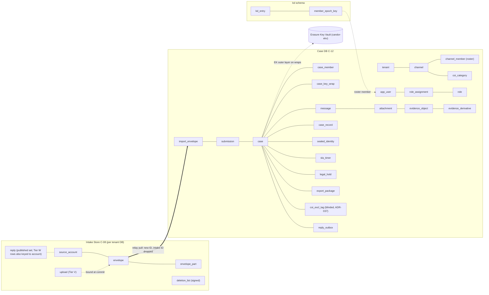

# 09 — Database Design (Intake Store C-08 and Case DB C-12)

Status: Draft v1.2 (round-3 consistency pass: ADR-047; revision round 2: ADR-034..046) · Edition applicability: both (EE-only objects marked **EE**) · Owner: Backend team (data)

## 1. Purpose and scope

This document specifies the persistent data model of Candor for:
- the **Intake Store** (C-08, PostgreSQL on the intake host plus a ciphertext blob directory);
- the **Case Database** (C-12, PostgreSQL in Z-CORE), with its companion schemas `auth` and `kd` and the separate audit database `candor_audit`.

It covers:
- the conceptual and logical schemas, table by table (columns, types, ciphertext flags, classification, readers, retention);
- row-level security (RLS) for tenancy and case ACLs;
- the time-granularity rules and the schema lint that enforces them;
- a record-correlation analysis;
- migrations and hardening.

Blob contents (C-13) are ciphertext objects addressed by `blob_id`. Their formats are in 04-CRYPTOGRAPHY.md and 10-FILE-EVIDENCE-PIPELINE.md.

## 2. Context and dependencies

| Document | Relationship |
|---|---|
| DECISIONS.md ADR-005/008/010/011/013/014/015/016/021/025/030/033, and ADR-034..046 (revision ADRs; they supersede conflicting earlier text) | Binding decisions |
| 24-LICENSING-BUSINESS-MODEL.md §TEL | Single source of truth for the metrics/k-anonymity regime (ADR-046(5)); counters here only store inputs to it |
| 06-SYSTEM-ARCHITECTURE.md §13–14 | What each component may learn; cross-zone identifier rules |
| 07-BACKEND.md | Services, jobs, relay and sealer protocols writing these tables |
| 08-API.md | Endpoints reading and writing these tables |
| 14-CASE-MANAGEMENT.md | Workflow, SLA and routing semantics |
| 15-AUTHENTICATION-AUTHORIZATION.md | Roles, permissions, policy facts |
| 19-BACKUPS-DR.md | Backup of these databases |
| 20-LOGGING-AUDITING.md | Audit event schema (the `candor_audit` DB here is its storage) |
| 35-DATA-RETENTION-DELETION.md | Retention values and deletion procedures referenced in the retention columns |

## 3. Data classification (used in every table)

| Class | Meaning | Examples | Default readers |
|---|---|---|---|
| **SOURCE-SENSITIVE (SS)** | Data about the source or the source's actions that could help identify or link the source, even when it is not content | locator hash, source account public keys, envelope↔account linkage, received date, import slot date, blinded COI tags | Owning service only; never exported or logged |
| **CONTENT (CT)** | Report content and anything derived from it. **Always ciphertext** under keys absent from servers. | envelope ciphertext, case records, evidence, replies, sealed identity | Authorized case members via Desk (decrypt client-side) |
| **WORKFLOW (WF)** | Staff-visible case-management metadata in cleartext | case state, priority, SLA due day, member list | Case members per ACL; admins **only** in aggregate |
| **SECURITY (SEC)** | Authentication, authorization, configuration, keys (public), audit | credentials, role assignments, config bundles, directory entries | Auth/Admin services, auditors |
| **SYSTEM (SYS)** | Operational state with no source or content link | job leases, schema version | Services, operators |

**Ciphertext marker:** the "Ct" column in the tables below means that the stored bytes are ciphertext and the server holds no key to decrypt them. Tables marked "RLS: tenant" enforce tenant isolation. "RLS: tenant+ACL" additionally enforces the case ACL (§6).

## 4. Conceptual model



## 5. Logical schema

Common conventions:
- **IDs:** `uuid` columns hold 128 random bits from the OS CSPRNG (the version/variant bits are not forced, and all 128 bits are random). There are no `serial`/`identity` columns used as public IDs. Internal ordering columns (`seq`, `batch_no`) are never exposed as resource identifiers (08-API.md §3.2).
- **Days:** `*_day` columns are `date` (UTC day). There is no finer time for source-linked rows (§8).
- **Tenancy:** every Case DB table except the global catalogs `permission` and `schema_meta` has `tenant_id uuid NOT NULL` referencing `tenant`.
- **Versions:** every mutable Case DB table has `version bigint NOT NULL DEFAULT 1`, incremented by trigger (optimistic concurrency, 07-BACKEND.md §5.5).
- **Sizes:** sizes are `size_bucket smallint` (index into the ADR-011 bucket series) or `padded_size bigint` (already padded). Raw sizes are never stored.
- **Retention abbreviations:**
  - "until relayed" = deleted after digest-verified relay ack (07-BACKEND.md BE-014);
  - "case lifetime" = until case crypto-erasure per retention policy or approved deletion (35-DATA-RETENTION-DELETION.md).

### 5.1 Intake Store (C-08) — one PostgreSQL database per tenant (`candor_intake_<tenant>`), no RLS needed (single tenant per DB)

Readers for all intake tables: the `candor_istore` PG role (used only by `candor-intake-store`). No other role exists except `candor_intake_migrator` (NOLOGIN outside migrations) and `candor_intake_backup` (read-only, used by the snapshot job inside `candor-intake-store`).

**`intake_meta`** (singleton) — SYS/SEC — Retention: permanent

| Column | Type | Ct | Class | Notes |
|---|---|---|---|---|
| tenant_id | uuid PK | | SYS | |
| schema_hash | bytea(32) | | SYS | Checked at start (BE-050) |
| kdf_salt | bytea(32) | | SEC | Per-deployment Argon2id salt (ADR-005). Public; not a secret. |
| relay_req_counter | bigint | | SEC | Anti-replay (07-BACKEND.md §5.4) |
| last_batch_no | bigint | | SYS | |
| directory_version | bigint | | SEC | Last applied snapshot |
| kd_tree_size_hwm | bigint | | SEC | **Snapshot high-water mark** (ADR-036(6)): largest verified Key Directory tree size ever applied. A snapshot with a smaller tree size, or not consistency-proven from this size, is rejected (rollback protection; RVW-A-04). Monotonic; never decreases, including after restore (restore keeps the higher of the backup value and the value in the running snapshot). |
| kd_checkpoint_day_hwm | date | | SEC | Checkpoint day of the high-water snapshot. A snapshot whose checkpoint day is older is rejected. |
| config_version | bigint | | SEC | Last applied bundle |

**`source_account`** (Tier W accounts only; Tier V needs no intake account because replies are fetched from the published set, ADR-039) — SS — Retention: until the source deletes it (SW-15), or 365 days after the start of the last `activity_month` (`inactive_purge`). Pending accounts are never written: an account row is created only in the same transaction as the first confirmed envelope (ADR-034).

| Column | Type | Ct | Class | Notes |
|---|---|---|---|---|
| account_id | uuid PK | | SS | Never leaves Z-INTAKE (06 §14) |
| locator_hash | bytea(32) UNIQUE | | SS | `SHA-256(locator)`; locator derived from the passphrase seed (04-CRYPTOGRAPHY.md) |
| auth_pk | bytea(32) | | SS | Ed25519 source auth public key (the "verifier") |
| xwing_pk | bytea(1216) | | SS | Reply encryption key |
| prefs_ct | bytea (≤ 4096) | **yes** | SS | AEAD under `K_prefs` (04-CRYPTOGRAPHY.md §11.4): `kdf_version`, per-report `mailbox_id`, the **original eligible set** used by the follow-up sealing rule (ADR-036(4); 07 BE-052), roster version, UI preferences. It SHALL NOT contain the source's COI ticks (RVW-A-03) or the wordlist/UI language (ADR-047(6)). |
| activity_month | date | | SS | First day of the UTC month in which an envelope or reply was last stored for the account (RVW-B-11: coarsened from day to month). Updated only on envelope commit or reply arrival, never on login (ADR-010: no "last seen"). Used for `inactive_purge`. |
| quota_bucket | smallint | | SS | Upload quota consumed **today only**. Reset to 0 by the daily `quota_reset` job; no history is kept (ADR-038(3)). |

WITHDRAWN (ADR-034): columns `state` and `created_day`. Accounts are never stored in a pending state.

**`mailbox_account`** (ADR-057(2); AUD-RM2-IPC-09) — SS — Retention: deleted with its account (SW-15) or its mailbox (SW-15 close mailbox); never outlives either. It maps each per-report mailbox to its owning account so that account and mailbox deletion is complete, restorable and idempotent. It cannot be backfilled later, so it exists from the first intake release.

| Column | Type | Ct | Class | Notes |
|---|---|---|---|---|
| mailbox_id | bytea(32) PK | | SS | The per-report mailbox identifier used in `prefs_ct` and in `deletion_list` kind `mailbox` hashes |
| account_id | uuid FK → source_account ON DELETE CASCADE | | SS | Never leaves Z-INTAKE (06 §14) |

No time-typed column, no read/fetch marker and no per-mailbox history exists (ADR-010, ADR-039). RLS and the grant matrix follow `source_account`.

**`draft_part`** — WITHDRAWN (ADR-034). No draft state exists in the intake database. Tier W draft text and the identity block live only in C-07 mlocked RAM. Attachment parts uploaded during a Tier W session are encrypted under a per-session key held only in C-07 RAM and written as ciphertext to the tmpfs staging area `/run/candor/staging/` (owned by `candor-istore`, `nosuid,nodev,noexec`, size-capped, swap disabled on the host). Staged parts are deleted at session end (logout, 20-min idle, 2-h absolute), on discard, and are lost on restart. There is no per-draft time value anywhere (07-BACKEND.md §5.3).

**`upload`** (Tier V; protocol canonical in 08-API.md §5.1, ADR-046(4)) — SS/SEC — Retention: until commit (then deleted, chunks re-parented to `envelope_part`), or 24 h after creation as tracked by `candor-intake-store` in RAM (monotonic clock; no time stored), or `candor-intake-store` restart (no cross-session resume). Backstop: the daily `upload_gc` deletes every upload whose `created_day` < today − 1.

| Column | Type | Ct | Class | Notes |
|---|---|---|---|---|
| upload_id | bytea(32) PK | | SS | `SHA-256("candor-upload-id" ‖ U)` |
| k_u | bytea(32) | | SEC | Chunk MAC key (08-API.md §5.1); deleted at commit |
| chunk_count | smallint | | SS | ≤ 512 (8 MiB chunks, 4 GiB per file); ≤ 2,048 only in EE profiles (16 GiB) |
| padded_size_bucket | smallint | | SS | |
| received_bitmap | bytea | | SYS | |
| created_day | date | | SS | |

**`upload_chunk`** — CT — Retention: as `upload`

| Column | Type | Ct | Class | Notes |
|---|---|---|---|---|
| upload_id | bytea(32) FK | | SS | |
| n | smallint | | SYS | PK (upload_id, n) |
| blob_id | uuid | **yes** (blob) | CT | |
| sha256 | bytea(32) | | SYS | Digest of the ciphertext chunk |

**`envelope`** — CT/SS — Retention: until relayed. A row and its blobs are written and `fsync`ed before the source is shown "received" (ADR-046(1)).

| Column | Type | Ct | Class | Notes |
|---|---|---|---|---|
| envelope_ref | uuid PK | | SS | Intake-local; dropped by relay (06 §14) |
| channel_id | uuid | | WF | |
| source_account_id | uuid NULL FK | | SS | Tier W only; NULL for all Tier V envelopes (ADR-039) |
| header_ct | bytea (≤ 8 KiB) | **yes** | CT | Contains exactly 16 fixed-size anonymous HPKE recipient slots, randomly ordered, with **no key IDs** (ADR-033 §1). The real recipient list is inside the AEAD payload. |
| manifest_ct | bytea (≤ 64 KiB) | **yes** | CT | |
| header_sha256 | bytea(32) | | SYS | Relay ack digest |
| disposition_ct | bytea (fixed: Nenc + 48 B) | **yes** | CT | Chaff marker (ADR-047(3); 04-CRYPTOGRAPHY.md §12.7): HPKE to the core-held Chaff Disposition Key K41, present on **every** row (real and chaff) with identical size. The intake cannot open it. |
| received_date | date | | SS | ADR-010. Used only to derive the sealing epoch and for intake retention; never sent to Z-CORE (the relay receives `epoch_index`, 08-API.md RL-02) |
| release_day | date | | SS | Optional **delayed delivery** (ADR-038(4)): `received_date` + U{1,2,3} days when the source chose it, else `received_date`. Source signal envelopes (04-CRYPTOGRAPHY.md §13.4 kinds 2/3): C4 "no response" escalation + U{1,2,3} days; mailbox-closed signal + U{3..21} days (14 CASE-017/CASE-035; RVW-B-26). The relay claims only envelopes with `release_day` ≤ today. |
| batch_no | bigint NULL | | SYS | Set at claim |

WITHDRAWN: columns `kind` (RVW-B-11; the Desk learns initial/follow-up from the decrypted manifest) and `tier` (ADR-039; RVW-A-26).

**Chaff rows (ADR-047(3)):** the Intake Sealer inserts chaff envelopes (rows, parts and blobs) at a constant Poisson rate (default mean 1 per 2 h per channel) through the same `COMMIT_ENVELOPE` path, with `source_account_id` NULL, `release_day = received_date` and blob sizes from the fixed chaff distribution. No column, index, sequence gap or counter distinguishes chaff from real rows; `counter_month` counts only real envelopes (incremented in sealer RAM). Chaff is claimed and relayed like any envelope.
| state | enum(sealed, claimed) | | SYS | |

**`envelope_part`** — CT — Retention: until relayed

| Column | Type | Ct | Class | Notes |
|---|---|---|---|---|
| envelope_ref | uuid FK | | SS | |
| part_no | smallint | | SYS | |
| blob_id | uuid | **yes** | CT | |
| padded_size | bigint | | SS | ADR-011 bucket |

**`reply`** — CT/SS — Retention: `intake.reply_retention_days` (default and maximum 30, ADR-039) after `available_day`, or deletion by a Tier W source, or account deletion. All non-expired rows form the **published reply set** served in fixed-size pages to anyone (08-API.md SA-19/SA-20); Tier V clients download the full set and trial-decrypt locally.

| Column | Type | Ct | Class | Notes |
|---|---|---|---|---|
| reply_ref | uuid PK | | SS | |
| source_account_id | uuid NULL FK | | SS | Resolved from `routing_ct` at intake for Tier W mailboxes; NULL for Tier V replies (published set only) |
| reply_ct | bytea (≤ 70,000) | **yes** | CT | Encrypted to the source X-Wing key |
| size_bucket | smallint | | SS | |
| available_day | date | | SS | Day granularity |
| slot | smallint NULL | | SS | Tier W only: position 0–31 in the fixed mailbox (08-API.md §3.8) |

No `fetched`, `read`, `last_accessed`, access count or per-mailbox history column exists (ADR-010, ADR-039). Replies whose routing resolves to an account or mailbox listed in `deletion_list`, or whose hash is listed, account are dropped on arrival.

**`deletion_tombstone`** — WITHDRAWN (ADR-047(9)); superseded by `deletion_list`.

**`deletion_list`** (signed intake deletion list; ADR-047(9); RVW-A-28) — SS — Retention: entries are kept 35 days (longer than the 14-day BS-INTAKE window and the Z-CORE copy's replication lag) and pruned only after the relay has acknowledged them

| Column | Type | Ct | Class | Notes |
|---|---|---|---|---|
| seq | bigint PK | | SYS | Monotonic; gaps are a verification failure |
| kind | enum(account, mailbox, reply) | | SS | |
| del_hash | bytea(32) | | SS | `SHA-256("candor/v1/intake/del" ‖ tenant_id ‖ locator_hash / mailbox_id / reply object_hash)` (04-CRYPTOGRAPHY.md §18.6) |
| del_day | date | | SS | Day of the deletion |
| prev_hash | bytea(32) | | SEC | Hash chain |
| sig | bytea(64) | | SEC | Ed25519 by the intake batch signing key K31 |
| relayed | bool | | SYS | Set when the relay acknowledges the Z-CORE copy |

- Written in the same transaction as the source-initiated deletion (`ACCOUNT_DELETE`, `MAILBOX_DELETE`, reply deletion; 08-API.md SW-15/SA-*).
- Copied to Z-CORE (`core.intake_deletion_list`, §5.2.7) at every import slot; included in every intake snapshot.
- **Restore rule:** any intake restore (BS-INTAKE, EE-HA failover to a recovered node) SHALL obtain the newest list — the Z-CORE copy if newer than the local one — verify the chain and signatures, and delete every listed account, mailbox and reply **before** C-06 serves requests (07 BE-074). Replies whose hash is listed are never re-pushed by C-09 and are dropped on arrival.

**`directory_snapshot`**, **`config_bundle`** — SEC — Retention: current + previous version

| Column | Type | Ct | Class | Notes |
|---|---|---|---|---|
| version | bigint PK | | SEC | |
| body | bytea | | SEC | Signed CBOR |
| signatures | bytea | | SEC | |
| applied_day | date | | SYS | |

**`counter_daily`** — WITHDRAWN (ADR-046(5); RVW-B-07). Replaced by `counter_month`.

**`counter_month`** — SS (aggregate) — Retention: the current calendar month plus the previous month until its export is acknowledged by the relay

| Column | Type | Ct | Class | Notes |
|---|---|---|---|---|
| month | date | | SS | First day of the UTC calendar month |
| channel_id | uuid | | WF | |
| name | enum(submissions_received, accounts_created, account_deletions) | | SYS | No tier, follow-up or login counters |
| value | integer | | SS | Real envelopes only (chaff is never counted, ADR-047(3)). Exported once, after the month closes. Suppression, complementary suppression and the rule for channels with < 3 cases/month follow 24 §TEL (k = 10) |

**`job_local`** — SYS — like the Case DB `job` but **without any timestamp column** (L11): `run_after_day date`, `schedule enum(daily, monthly)`; intraday scheduling is done in RAM. Retention: 7 days after completion.

**Blob directory** `/var/lib/candor/intake/blobs/`:
- filenames = random 128-bit `blob_id` (base32);
- mode 0600;
- file mtime and atime normalized to `00:00 UTC` of `received_date` via `utimensat` at commit;
- mounted `noatime`;
- blobs are written and `fsync`ed before the source sees "received" (ADR-046(1)); inode ctime cannot be normalized (§13).

**Staging area** `/run/candor/staging/` (tmpfs; ADR-034): holds only ciphertext of Tier W parts under per-session keys held in C-07 RAM. It is not a database object, is never backed up, and is emptied on reboot or `candor-intake-store` restart.

### 5.2 Case DB (C-12) — schema `core`

Readers legend (PostgreSQL roles, §10):
- `case` = `candor_case` (Desk router);
- `admin` = `candor_admin` (Admin router);
- `relay` = `candor_relay`;
- `worker` = `candor_worker`;
- `notify` = `candor_notify`;
- `kd` = `candor_kd`;
- `auth` = `candor_auth`;
- `backup` = `candor_backup` (physical backup only).

#### 5.2.1 Tenancy and organization

**`tenant`** — SEC — Readers: case, admin, auth, worker (own row via RLS); Retention: tenant lifetime

| Column | Type | Ct | Class | Notes |
|---|---|---|---|---|
| tenant_id | uuid PK | | SEC | |
| label | text (≤ 64) | | SYS | Instance label used in notifications (ADR-017) |
| risk_class | enum(low, moderate, high) | | SEC | High = dedicated instance only (ADR-021) |
| state | enum(active, suspended) | | SYS | |

**`department`** — WF — Readers: case, admin; Retention: tenant lifetime

| Column | Type | Ct | Class |
|---|---|---|---|
| department_id | uuid PK; tenant_id | | WF |
| label | text (≤ 128) | | WF |
| parent_id | uuid NULL | | WF |

**`channel`** — WF/SEC — Readers: case, admin, relay (id, tenant only), worker; Retention: tenant lifetime (soft-disabled, never reused)

| Column | Type | Ct | Class | Notes |
|---|---|---|---|---|
| channel_id | uuid PK; tenant_id | | WF | Public (appears in onion URLs) |
| public_label_i18n | jsonb | | WF | Shown to sources |
| mode | enum(anonymous, confidential, identified) | | SEC | ADR-002 |
| workflow_def_id | uuid FK | | WF | |
| retention_policy_id | uuid FK | | WF | |
| reply_enabled | bool | | WF | |
| min_recipients | smallint (2–16; 1 only as a DANGEROUS config) | | SEC | Minimum number of distinct members holding a case-key wrap at case creation and after any removal; default **2** (ADR-044(2)) |
| alternative_channel_id | uuid NULL | | SEC | Independent fallback channel shown to the source when no eligible Triage Set member remains (ADR-037(1); RVW-C-18). Required for ANONYMOUS channels. |
| channel_type | enum(standard, independent) | | SEC | INDEPENDENT channels require independent-custody Desk devices for Triage Set members (ADR-043) |
| state | enum(active, disabled) | | SYS | |

**`channel_member`** (roster, ADR-030) — SEC/WF — Readers: case (member's own channels), admin, kd, worker; Retention: tenant lifetime (removed members kept as `removed` for audit reference)

| Column | Type | Ct | Class | Notes |
|---|---|---|---|---|
| channel_id, user_id | uuid PK pair; tenant_id | | SEC | |
| role_label_i18n | jsonb | | SEC | Published in C-14 `CHANNEL_ROSTER` |
| show_name | bool | | SEC | |
| label_index | smallint | | SEC | Stable index used by source COI selections (SW-02) |
| triage | bool | | SEC | Member of the channel's **Triage Set** (ADR-037(1)): ≥ 2 members with independent-body role labels. Only Triage Set members receive envelope slots, list intake and hold the Channel Identity Key (ADR-036(1)). |
| label_cert_leaf | bigint NULL | | SEC | `kd_entry` leaf of the OVERSIGHT-signed `ROLE_LABEL_CERT` (ADR-036(3)) |
| effective_day | date | | SEC | Day from which the entry counts for sealing. Additions and label changes: approval day + 3 days (GOV/HIGH: + 7 days), ADR-036(2) |
| state | enum(pending_timelock, pending_keys, active, suspended, removed) | | SEC | `pending_timelock` until `effective_day`; `pending_keys` until the member publishes Member Epoch Keys; `suspended` by SCIM/HR/IdP signals (server-side authorization only, ADR-044(1)); `removed` takes effect immediately |

**`roster_change`** (time-locked directory governance, ADR-036(2)) — SEC — Readers: admin, case (members and OVERSIGHT of the channel), worker; Retention: tenant lifetime (audit reference)

| Column | Type | Class | Notes |
|---|---|---|---|
| change_id | uuid PK; tenant_id | SEC | |
| channel_id | uuid | SEC | |
| kind | enum(add_member, relabel, coi_loosen, coi_tighten, remove_member, triage_change) | SEC | `remove_member` and `coi_tighten` are effective immediately; all others are time-locked |
| subject_user_id | uuid NULL | SEC | For member changes |
| proposed_by, approved_by | uuid | SEC | CHECK distinct; `approved_by` holds an independent role (ADR-036(2)) and confirms `person_ref` out of band |
| proposed_day, effective_day | date | SEC | `effective_day` = approval day + `kd.roster_timelock_days` (3, or 7 for GOV/HIGH) |
| state | enum(proposed, approved_timelocked, effective, cancelled) | SEC | Any member or OVERSIGHT may object during the time lock; an objection moves the change to `cancelled` unless OVERSIGHT re-approves |

**`coi_category`** — SEC — Readers: case, admin, kd; Retention: tenant lifetime (versioned via C-14)

| Column | Type | Ct | Class |
|---|---|---|---|
| channel_id, category_id | uuid, smallint PK; tenant_id | | SEC |
| label_i18n | jsonb | | SEC |
| excluded_label_indexes | smallint[] | | SEC |

**`coi_registry`** (admin-maintained **standing** exclusions, not tied to any case) — SEC — Readers: admin, and C-22 via `case` role (policy facts only; never returned to Desk); Retention: tenant lifetime + audit. It never records which case an entry was applied to (ADR-037(3)).

| Column | Type | Ct | Class | Notes |
|---|---|---|---|---|
| entry_id | uuid PK; tenant_id | | SEC | |
| user_id | uuid | | SEC | |
| scope_type | enum(tenant, department, channel) | | SEC | |
| scope_id | uuid NULL | | SEC | |
| reason_code | enum | | SEC | No free text; standing reasons only (e.g., `family_relation`, `reporting_line`), never a case reference |

#### 5.2.2 Users, roles, permissions

**`app_user`** — SEC — Readers: case (display fields of co-members), admin, auth; Retention: account lifetime + 1 year after disablement (then pseudonymized: `display_name` replaced, audit pseudonyms stay)

| Column | Type | Ct | Class | Notes |
|---|---|---|---|---|
| user_id | uuid PK; tenant_id | | SEC | |
| username | citext UNIQUE per tenant | | SEC | |
| display_name | text (≤ 128) | | SEC | |
| state | enum(invited, active, disabled) | | SEC | |
| department_id | uuid NULL | | WF | |

**`permission`** (global catalog, no tenant) — SEC — Readers: all app roles; Retention: code-defined

| Column | Type | Class |
|---|---|---|
| permission_id | text PK (e.g., `case.read`) | SEC |
| class | enum(content, workflow, admin, security) | SEC |

**`role`** — SEC — Readers: case, admin, auth

| Column | Type | Class | Notes |
|---|---|---|---|
| role_id | uuid PK; tenant_id | SEC | |
| name | text | SEC | |
| built_in | bool | SEC | Built-in roles immutable |
| permission_ids | text[] | SEC | CHECK: `admin`-class roles contain no `content`-class permission (ADR-015) |

**`role_assignment`** — SEC — Readers: case (C-22 facts), admin, auth; Retention: active + 7 years in audit (row deleted 1 year after end)

| Column | Type | Class | Notes |
|---|---|---|---|
| assignment_id | uuid PK; tenant_id | SEC | |
| user_id, role_id | uuid | SEC | |
| scope_type | enum(tenant, department, channel) | SEC | |
| scope_id | uuid NULL | SEC | |
| valid_from_day, valid_until_day | date | SEC | Time-bounded grants |
| granted_by, approved_by | uuid | SEC | `approved_by` required for privileged roles |

#### 5.2.3 Import (relay output)

**`import_envelope`** — CT/SS — Readers: relay (INSERT, only during a fixed import slot, §8), case (active **Triage Set** members of the envelope's channel only, via RLS §6.3; they trial-decrypt the anonymous slots, ADR-037(2)), worker; Retention: `imported` → row kept for case lifetime with `header_digest` nulled after 24 h (ADR-039), **`import_date` nulled in the same transaction that links the row to a case** (the date is kept only inside the encrypted case record, ADR-047(2)), and part blobs deleted after DEK re-wrap into the case; **chaff** (ADR-047(3)) → row and blobs deleted by C-10 at the derived hold slot (1–8 import slots after import, 04-CRYPTOGRAPHY.md §12.7), with no audit event distinguishing it from other disposals and no chaff count stored; `rejected` (dual-approved) → row and blobs deleted immediately, leaving only the audit event (ADR-038(6)). There is **no automatic expiry**: pending envelopes block retirement of that epoch's keys (ADR-033(2)) until imported or rejected; envelopes pending > 14 days are offered to the Triage Set for dual-approved rejection.

| Column | Type | Ct | Class | Notes |
|---|---|---|---|---|
| import_envelope_id | uuid PK; tenant_id | | SS | **New random ID** (06 §14) |
| channel_id | uuid | | WF | |
| header_ct | bytea | **yes** | CT | 16 anonymous slots; no recipient key IDs anywhere in cleartext (ADR-033) |
| manifest_ct | bytea | **yes** | CT | Signed real-recipient list (key IDs + directory tree head) is inside |
| header_digest | bytea(32) NULL UNIQUE | | SYS | Idempotency; nulled 24 h after insert (ADR-039; BE-013) |
| import_date | date NULL | | SS | UTC date of the **fixed import slot** in which the relay imported the envelope (ADR-038(1)/(3)); needed only while pending (MEK retirement, 14-day rejection). Set to NULL when the envelope is linked to a case (ADR-047(2)). The intake arrival day is never stored in Z-CORE. |
| disposition_ct | bytea (fixed) | **yes** | CT | Copied from the intake (§5.1); opened by C-10 only at the derived hold slot (K41, 04-CRYPTOGRAPHY.md §12.7); nulled at import or deletion |
| epoch_index | int | | SYS | Sealing epoch reported by the intake (08-API.md RL-02); gates Member Epoch Key retirement |
| import_batch_no | bigint | | SYS | Monotonic slot number; no pull time stored (ADR-033(4)) |

WITHDRAWN: `kind` (RVW-B-11) and `received_date` (replaced by `import_date`, ADR-038(3)).
| state | enum(pending, imported, duplicate, rejected) | | WF | `rejected` requires two approvers (08-API.md DA-23) |
| rejected_by | uuid[] NULL | | SEC | Two distinct users |
| escalated_date | date NULL | | WF | Set when pending > 7 days and escalated to the independent channel (ADR-033(2)); escalations are rate-limited to one per channel per 7 days (ADR-038(6)) |

**`import_envelope_part`** — CT — Retention: until rewrapped into the case + 30 days

| Column | Type | Ct | Class |
|---|---|---|---|
| import_envelope_id, part_no | PK; tenant_id | | SYS |
| blob_id | uuid | **yes** | CT |
| padded_size | bigint | | SS |

#### 5.2.4 Cases

**`case`** — WF/CT — Readers: case (tenant+ACL for full row; `case.list` returns only ACL rows), worker, admin **only via the aggregate view** `v_aggregates` (§6.4); Retention: per retention policy (default 365 days after `closed_day`), legal hold overrides

| Column | Type | Ct | Class | Notes |
|---|---|---|---|---|
| case_id | uuid PK; tenant_id | | WF | |
| display_ref | text (8 chars) UNIQUE per tenant | | WF | Random 40-bit code |
| channel_id | uuid | | WF | |
| workflow_def_id, workflow_version | uuid, int | | WF | |
| state | text (FK to workflow state) | | WF | |
| priority | smallint | | WF | |
| received_date | date | | SS | `import_date` of the initial envelope (fixed-slot date, ADR-038); SLA anchor. Shown to staff at day granularity (standard) or ISO week (HIGH), ADR-038(3) |
| last_import_month | date | | SS | First day of the UTC month of the most recent envelope (initial or follow-up) linked to the case (ADR-047(2)); the only cleartext trace of follow-up activity. Follow-up import dates are stored **only inside `record_ct`** (case key). |
| opened_day, closed_day | date | | WF | |
| record_ct | bytea (≤ 256 KiB) | **yes** | CT | Title, summary, labels, staff times (07 §12) |
| key_epoch | int | | SEC | Current case-key epoch |
| retention_policy_id | uuid | | WF | |
| deletion_due_day | date NULL | | WF | |
| legal_hold | bool (derived by trigger from `legal_hold`) | | WF | |
| version | bigint | | SYS | |

**`case_meta`** (per-case metadata under the Erasure Key; ADR-047(8); RVW-B-21 item 2) — WF/CT — Readers: case (ACL), worker (via C-10 only; plaintext obtained from `candor-ekv` `META_OPEN`); Retention: case lifetime; destroyed with the case's Erasure Key

| Column | Type | Ct | Class | Notes |
|---|---|---|---|---|
| case_id, column_id | PK; tenant_id | | WF | `column_id` ∈ {category_class (only where server-visible, 14 §3), routing_visible field n (21 ENT-007), case_label} |
| meta_ct | bytea (256 B buckets, ≤ 4 KiB) | **yes** | CT | Record AEAD under `K_meta = HKDF(EK_case, case_id, "candor/v1/ek-meta")`, computed only inside `candor-ekv` (04-CRYPTOGRAPHY.md §9.10a) |
| row_version | bigint | | SYS | Bound in the AAD |

- No other table holds these values in cleartext (schema-lint L16). This is server-readable by design (C-10 decrypts through the vault for SLA and routing rules); the protection is that DB and backup copies become unreadable when the EK is destroyed and vault backups expire (≤ 14 days).

**`submission`** (import envelope ↔ case) — SS/WF — Readers: case (ACL); Retention: case lifetime

| Column | Type | Class | Notes |
|---|---|---|---|
| case_id, import_envelope_id | uuid PK pair; tenant_id | SS | Only linkage between the source's envelopes and a case (§9) |
| seq | int | WF | Order within the case |

**`case_member`** (ACL) — WF/SEC — Readers: case (members of that case), worker; Retention: case lifetime (history in audit)

| Column | Type | Class | Notes |
|---|---|---|---|
| case_id, user_id | uuid PK pair; tenant_id | WF | |
| access_level | enum(read, contribute, lead, records) | WF | `records` = Records Custodian search grant (ADR-044(5)) |
| via | enum(normal, breakglass, records_grant) | SEC | Break-glass and records grants visible in all views |
| grant_ref | uuid NULL | SEC | → `breakglass_request` |
| valid_until_day | date NULL | WF | Mandatory (≤ 90 days) for `records_grant` |
| state | enum(active, suspended, revoked) | WF | `suspended` = server-side authorization withdrawn (SCIM/HR/IdP signal, member removal, self-declared conflict) while key wraps remain until a `wrap_deletion_request` completes (ADR-044(1)) |

Member removal reasons are **not** stored; the audit event uses a generic reason code that never distinguishes COI removals (ADR-037(3)).

**`case_key_wrap`** — CT/SEC — Readers: case (only the row whose `recipient_user_id` = caller, via RLS), worker (DELETE for crypto-erasure and for executed `wrap_deletion_request`s only); **no** admin grant; Retention: case lifetime. Rows are deleted only by case crypto-erasure (retention expiry or source-requested erasure) or by an executed `wrap_deletion_request` (ADR-044(1)); never directly by SCIM/HR/IdP automation. **Crypto-erasure = destroy the case's Erasure Key in the vault (§5.6) plus delete all rows**. Backups holding rows become unreadable once vault backups roll off (≤ 14 days).

| Column | Type | Ct | Class | Notes |
|---|---|---|---|---|
| case_id, key_epoch, recipient_key_id | PK; tenant_id | | SEC | |
| recipient_user_id | uuid NULL | | SEC | NULL for the Recovery Quorum wrap (ADR-013) |
| wrap_ct | bytea (≤ 2 KiB) | **yes** | CT | `AEAD_EK(inner)`: the member's X-Wing wrap of the case key, encrypted under the case's Erasure Key (ADR-033 §3). AAD = tenant_id ‖ case_id ‖ key_epoch ‖ recipient_key_id. |
| wrapped_by | uuid | | SEC | |

**`coi_exclusion`** — WITHDRAWN (ADR-037(3); RVW-B-01). It stored `user_id` and a `source` enum per case in cleartext, which revealed who a report concerns. Replaced by `coi_excl_tag`.

**`coi_excl_tag`** (blinded case-level COI exclusions, ADR-037(3)) — SS — Readers: C-22 via the definer function `candor.coi_tag_present` only (§6.3), worker (DELETE on erasure); Retention: case lifetime

| Column | Type | Ct | Class | Notes |
|---|---|---|---|---|
| case_id | uuid; tenant_id | | SS | |
| tag | bytea(32) | (blinded) | SS | `HMAC-SHA-256(K_case_excl, user_id)`, `K_case_excl = HKDF(case_key, "candor/coi-excl/v1")`, computed only by member Desks (04-CRYPTOGRAPHY.md). PK (tenant_id, case_id, tag) |

- Each case holds exactly 8 tags, or the next multiple of 8 when more exclusions exist; unused positions are random 32-byte values written by the creating Desk. The server cannot tell real from padding tags.
- There is no `user_id`, source enum, declarer or reason column (schema-lint L14).
- On member add (08-API.md DA-36) the adding Desk submits the target's tag; C-22 rejects the add if the tag is present. Every member Desk recomputes tags on sync and raises a SECURITY alert (`coi_wrap_violation`, no case or user reference in the exported form) if a wrap exists for an excluded user (ADR-037(3)).

**`case_record`** (notes, tasks, decisions) — CT — Readers: case (tenant+ACL); Retention: case lifetime

| Column | Type | Ct | Class | Notes |
|---|---|---|---|---|
| record_id | uuid PK; tenant_id | | WF | |
| case_id | uuid | | WF | |
| kind | enum(note, task, decision, system) | | WF | |
| seq | int | | WF | Per-case order |
| created_day | date | | WF | Staff time is inside `body_ct` |
| author_user_id | uuid NULL | | WF | |
| key_epoch | int | | SEC | |
| body_ct | bytea (≤ 256 KiB) | **yes** | CT | |
| size_bucket | smallint | | WF | |

**`message`** (source ↔ organization messages) — CT/SS — Readers: case (tenant+ACL); Retention: case lifetime

| Column | Type | Ct | Class | Notes |
|---|---|---|---|---|
| message_id | uuid PK; tenant_id | | WF | |
| case_id | uuid | | WF | |
| direction | enum(from_source, to_source) | | SS | |
| import_envelope_id | uuid NULL | | SS | Set for `from_source` |
| day | date NULL | | SS | For `from_source`: **NULL** — the import slot date of a follow-up is stored only inside the encrypted case record (ADR-047(2); RVW-B-11); for `to_source`: reply queued day (staff activity). No cleartext per-case list of source activity days exists |
| blob_id | uuid NULL | **yes** | CT | Imported message stream |
| dek_wrap_ct | bytea NULL | **yes** | CT | Envelope DEK re-wrapped under the case key |
| body_ct | bytea NULL | **yes** | CT | Staff replies (copy for case history) |
| key_epoch | int | | SEC | |
| size_bucket | smallint | | SS | |

**`attachment`** (message → evidence) — SS — Readers: case (ACL); Retention: case lifetime

| Column | Type | Class |
|---|---|---|
| message_id, evidence_id | uuid PK pair; tenant_id | SS |
| position | smallint | SS |

**`evidence_object`** (ORIGINAL evidence, immutable, ADR-012) — CT — Readers: case (ACL + `evidence.read`/`read_original` enforced by C-22); Retention: case lifetime; immutable (UPDATE trigger rejects changes except the `state` column for deletion)

| Column | Type | Ct | Class | Notes |
|---|---|---|---|---|
| evidence_id | uuid PK; tenant_id | | WF | |
| case_id | uuid | | WF | |
| origin | enum(source_attachment, staff_upload) | | WF | |
| blob_id | uuid | **yes** | CT | |
| dek_wrap_ct | bytea | **yes** | CT | |
| meta_ct | bytea | **yes** | CT | Display name, MIME, and SHA-256 + BLAKE3 content hashes recorded at import (inside ciphertext, ADR-012) |
| padded_size | bigint | | WF | |
| key_epoch | int | | SEC | |
| state | enum(active, erased) | | SYS | |

**`evidence_derivative`** (SANITIZED working copy) — CT — Readers: case (ACL); Retention: case lifetime (removable by author)

| Column | Type | Ct | Class | Notes |
|---|---|---|---|---|
| derivative_id | uuid PK; tenant_id | | WF | |
| case_id | uuid | | WF | |
| derived_from | uuid FK → evidence_object or evidence_derivative | | WF | |
| transformation_ct | bytea | **yes** | CT | Tool, version, parameters, output hashes (10-FILE-EVIDENCE-PIPELINE.md) |
| blob_id | uuid | **yes** | CT | |
| dek_wrap_ct, meta_ct | bytea | **yes** | CT | |
| author_user_id | uuid | | WF | |
| created_day | date | | WF | |
| key_epoch | int | | SEC | |

**`sealed_identity`** (ADR-014) — CT (SS) — Readers: case role only for Identity Custodians after an approved request (RLS on `identity_unseal_request.state = approved`); Retention: case lifetime or earlier on legal basis

| Column | Type | Ct | Class | Notes |
|---|---|---|---|---|
| identity_id | uuid PK; tenant_id | | SS | |
| case_id | uuid | | SS | |
| sealed_ct | bytea (≤ 16 KiB) | **yes** | SS | Wrapped to Identity Custodian keys, **not** the case key |

**`identity_unseal_request`** — SEC — Readers: case (requester, custodians); Retention: case lifetime + audit

| Column | Type | Ct | Class |
|---|---|---|---|
| request_id | uuid PK; tenant_id | | SEC |
| case_id, requested_by | uuid | | SEC |
| legal_basis_code | enum | | SEC |
| justification_ct | bytea | **yes** | CT |
| approvals | uuid[] | | SEC |
| state | enum(pending, approved, rejected, used) | | SEC |
| source_notice_due_day | date NULL | | WF |

#### 5.2.5 Workflow, SLA, retention, holds

**`workflow_definition`** — WF — Readers: case, admin; Retention: permanent while referenced

| Column | Type | Class | Notes |
|---|---|---|---|
| workflow_def_id, version | uuid, int PK; tenant_id | WF | |
| definition | jsonb | WF | States, transitions (with required permissions), SLA rules; validated by JSON Schema (14-CASE-MANAGEMENT.md) |
| state | enum(draft, published, retired) | WF | |
| published_by | uuid | SEC | |

**`case_state_history`** — WF — Readers: case (ACL); Retention: case lifetime

| Column | Type | Class | Notes |
|---|---|---|---|
| case_id, seq | PK; tenant_id | WF | |
| from_state, to_state, transition_id | text | WF | |
| actor_user_id | uuid | WF | |
| day | date | WF | Exact time only in the CASE audit event |

**`sla_timer`** — WF — Readers: case (ACL), worker; Retention: case lifetime

| Column | Type | Class | Notes |
|---|---|---|---|
| timer_id | uuid PK; tenant_id | WF | |
| case_id | uuid | WF | |
| kind | enum(acknowledge, feedback, custom) | WF | EU defaults 7 days / 3 months (B-CO-02) |
| anchor_day, due_day | date | WF | Anchor = `case.received_date` (fixed-slot import date) for source-driven timers |
| calendar_id | uuid NULL | WF | Business-day calendar |
| state | enum(running, paused, met, breached, cancelled) | WF | |

**`retention_policy`** — WF — Readers: case, admin, worker

| Column | Type | Class |
|---|---|---|
| retention_policy_id | uuid PK; tenant_id | WF |
| retain_days_after_close | int (30–3650) | WF |
| action | enum(crypto_erase, review) | WF |
| legal_basis_code | enum | WF |

**`legal_hold`** — WF/SEC — Readers: case (ACL + legal role), worker; Retention: until released + audit

| Column | Type | Ct | Class |
|---|---|---|---|
| hold_id | uuid PK; tenant_id | | WF |
| case_id | uuid | | WF |
| reason_ct | bytea | **yes** | CT |
| placed_by, released_by, release_approved_by | uuid | | SEC |
| placed_day, released_day | date | | WF |

**`deletion_request`** — WF/SEC — Readers: case; Retention: 1 year after execution (audit keeps the record)

| Column | Type | Class |
|---|---|---|
| request_id | uuid PK; tenant_id | WF |
| case_id, requested_by, approved_by | uuid | SEC |
| reason_code | enum | WF |
| state | enum(pending, approved, executed, rejected) | WF |

**`wrap_deletion_request`** (key-access continuity, ADR-044(1); RVW-C-03) — SEC — Readers: case (case lead, OVERSIGHT), worker; Retention: 1 year after execution (audit keeps the record)

| Column | Type | Class | Notes |
|---|---|---|---|
| request_id | uuid PK; tenant_id | SEC | |
| case_id, target_user_id | uuid | SEC | No reason column (ADR-037(3)) |
| requested_by, approved_by | uuid | SEC | CHECK distinct (dual control) |
| requested_day | date | SEC | |
| not_before_day | date | SEC | `requested_day` + 7 (cooling-off) |
| oversight_notified_day | date | SEC | Content-free OVERSIGHT notice is mandatory before execution |
| state | enum(pending, approved, executed, cancelled, blocked_min_holders) | SEC | `blocked_min_holders` while execution would leave fewer than `channel.min_recipients` wrap holders (default 2) |

Source-requested erasure and retention expiry use `crypto_erase_case` and bypass this table (ADR-044(1)).

#### 5.2.6 Break-glass

**`breakglass_request`** — SEC — Readers: case (requester, approvers, reviewers, members of the case), worker; Retention: 7 years (legal accountability), row pseudonymized after case erasure

| Column | Type | Ct | Class | Notes |
|---|---|---|---|---|
| request_id | uuid PK; tenant_id | | SEC | |
| case_id | uuid | | SEC | |
| requester_id, approver_id, reviewer_id | uuid | | SEC | CHECK: pairwise distinct |
| reason_code | enum | | SEC | |
| legal_basis_ct | bytea | **yes** | CT | Case key |
| state | enum(requested, approved_pending_wrap, active, expired, rejected, reviewed) | | SEC | |
| expires_at | timestamptz | | SEC | Staff security timer (allow-listed, §8) |
| review_due_day | date | | SEC | |
| review_outcome | enum NULL | | SEC | |

#### 5.2.7 Replies, exports, notifications

**`reply_outbox`** — CT — Readers: case (INSERT), relay (SELECT/UPDATE state), worker; Retention: until `pushed` + 7 days

| Column | Type | Ct | Class | Notes |
|---|---|---|---|---|
| outbox_id | uuid PK; tenant_id | | SYS | |
| routing_ct | bytea (≤ 2 KiB) | **yes** | SS | `{mailbox_id, reply_seq}` sealed to the Intake Routing Key (04 §9.9; 06 §8.2) |
| reply_ct | bytea (≤ 70,000) | **yes** | CT | |
| state | enum(queued, pushed) | | SYS | |
| queued_day | date | | WF | |

**`intake_deletion_list`** (Z-CORE copy of the signed intake deletion list; ADR-047(9)) — SS — Readers: relay (INSERT), worker, backup; Retention: 35 days after `del_day`

| Column | Type | Class | Notes |
|---|---|---|---|
| intake_id, seq | PK; tenant_id | SYS | Same `seq`, `kind`, `del_hash`, `del_day`, `prev_hash`, `sig` as the intake table (§5.1) |
| kind, del_hash, del_day, prev_hash, sig | as §5.1 | SS/SEC | Verified by the relay (chain + K31 signature) before insert |

- Written only during import slots (§8). Pushed back to an intake that restores from BS-INTAKE or fails over (07 BE-074); `reply_outbox` rows whose REPLY hash is listed are deleted instead of pushed.

**`export_package`** — CT/WF — Readers: case (creator, approvers, lead), connector (via the export router: own packages only); Retention: blob deleted on delivery or after 7 days; row case lifetime

| Column | Type | Ct | Class | Notes |
|---|---|---|---|---|
| export_id | uuid PK; tenant_id | | WF | |
| case_id | uuid | | WF | |
| kind | enum(redacted, original) | | WF | |
| destination_type | enum(media, connector) | | WF | |
| connector_id | uuid NULL | | WF | |
| manifest_ct | bytea | **yes** | CT | |
| blob_id | uuid NULL | **yes** | CT | Encrypted to the destination key |
| package_digest | bytea(32) | | WF | |
| created_by | uuid | | SEC | |
| state | enum(pending_approval, approved, rejected, delivered, expired) | | WF | |
| created_day | date | | WF | |

**`export_approval`** — SEC — Readers: as `export_package`

| Column | Type | Class | Notes |
|---|---|---|---|
| export_id, approver_id | PK; tenant_id | SEC | CHECK approver ≠ creator |
| decision | enum(approve, reject) | SEC | |
| digest_confirmed | bytea(32) | SEC | Must equal `package_digest` |
| day | date | SEC | Exact time in audit |

**`notification_target`** — SEC — Readers: notify, case (own row); Retention: account lifetime

| Column | Type | Class | Notes |
|---|---|---|---|
| user_id | uuid PK; tenant_id | SEC | |
| channel_type | enum(smtp, matrix, webhook) | SEC | |
| contact_uri | text (≤ 320) | SEC | Only staff contact data; lint allow-listed (§8) |
| mode | enum(daily_constant, off) | SEC | ADR-038(2): `daily_constant` = one content-free digest at the tenant's fixed daily time **every day, whether or not anything is pending**; `off` = Desk badge only (HIGH default). No event-driven mode exists. |

**`notification_queue`** — SYS — Readers: notify, worker; Retention: 7 days after send

| Column | Type | Class | Notes |
|---|---|---|---|
| notif_id | uuid PK; tenant_id | SYS | |
| user_id | uuid | SYS | |
| template | enum(T1) | SYS | Only template (ADR-017) |
| due_day | date | SYS | Send day; the send time is the tenant-wide fixed time from config, identical for every row and every day |
| state | enum(queued, sent, dropped) | SYS | |

No column references a case, envelope or channel. Rows are created by the daily `notify_daily_digest` job for **every** `daily_constant` target, independent of activity, so neither row existence nor timing depends on imports (RVW-A-19, RVW-B-05, RVW-C-02). WITHDRAWN: `due_at timestamptz`.

#### 5.2.8 Jobs, configuration, idempotency, blobs, counters

**`job`** — SYS — Readers: worker, relay, notify, case (enqueue only); Retention: 7 days after `done`, 30 days after `dead`. **No job is enqueued as a consequence of an import** (ADR-038): imports happen only at fixed slots, and notifications, escalations and SLA evaluation run on fixed schedules. Relay slots are scheduled by an in-process timer and never create job rows.

| Column | Type | Class | Notes |
|---|---|---|---|
| job_id | uuid PK; tenant_id | SYS | |
| kind | text CHECK in the registered kinds (07 §6.2) | SYS | |
| payload | bytea (CBOR ≤ 4 KiB) | SYS | Opaque IDs, enums, days only (BE-020) |
| priority | smallint | SYS | |
| run_after, lease_until | timestamptz | SYS | Allow-listed (job leases, ADR-046(11)) |
| attempts, max_attempts | smallint | SYS | |
| locked_by | text (worker instance) | SYS | |
| state | enum(ready, running, done, dead) | SYS | |

**`config_change`** — SEC — Readers: admin; Retention: 7 years

| Column | Type | Class | Notes |
|---|---|---|---|
| change_id | uuid PK; tenant_id | SEC | |
| items | jsonb | SEC | Validated against the catalog |
| class | enum(safe, advanced, dangerous) | SEC | Server-computed |
| proposed_by | uuid | SEC | |
| signatures | jsonb | SEC | Admin signing-key signatures |
| effective_after | timestamptz | SEC | 72-h cool-off (allow-listed) |
| state | enum(proposed, approved, effective, cancelled) | SEC | |

**`config_bundle`** — SEC — as in the intake (§5.1), plus `tenant_id`.

**`idempotency_key`** (staff Desk/Admin requests only) — SYS — Retention: 24 h

| Column | Type | Class |
|---|---|---|
| user_id, key | uuid, bytea(16) PK; tenant_id | SYS |
| response_status | smallint | SYS |
| resource_id | uuid NULL | SYS |
| expires_at | timestamptz | SYS |

**`blob_object`** — SYS — Readers: case, relay, worker; Retention: until unreferenced + 24 h (`blob_gc`)

| Column | Type | Class | Notes |
|---|---|---|---|
| blob_id | uuid PK; tenant_id | SYS | Random; content-independent name |
| store | enum(fs, s3) | SYS | |
| padded_size | bigint | SYS | |
| ct_sha256 | bytea(32) | SYS | Integrity of the ciphertext |
| refcount | int | SYS | |

**`aggregate_counter`** — SS (aggregate) — Readers: admin via `v_aggregates` only; Retention: 3 years. Regime (k = 10, calendar month minimum, complementary suppression, no medians/ratios/percentiles for cells < k, no per-channel cells for channels with < 3 cases/month) is owned by 24 §TEL (ADR-046(5)); this table stores monthly inputs only.

| Column | Type | Class |
|---|---|---|
| tenant_id, month, channel_group_id, name | PK | SS |
| value_or_suppressed | integer NULL (NULL = suppressed per 24 §TEL) | SS |

WITHDRAWN: `week_start_day` and per-channel keys (RVW-B-07).

### 5.3 Schema `auth` (C-21)

| Table | Key columns (type) | Class | Ct | Readers | Retention |
|---|---|---|---|---|---|
| `webauthn_credential` | credential_id bytea PK; tenant_id; user_id; public_key bytea; sign_count bigint; aaguid uuid; transports text[]; role enum(primary, backup); attestation_ref bytea NULL (ADR-043); created_day date | SEC | | auth | until revoked + 1 year. A channel member cannot become `active` in `channel_member` with fewer than 2 active credentials (primary + stored backup, ADR-044(2)) |
| `device` | device_id uuid PK; tenant_id; user_id; device_key_pk bytea(32); client_cert_spki bytea(32); state enum(pending, active, revoked); enrolled_day date | SEC | | auth, admin, case (own) | revoked + 1 year |
| `enrollment_token` | token_hash bytea(32) PK; tenant_id; user_id; expires_at timestamptz | SEC | | auth | 24 h |
| `session` | token_hash bytea(32) PK; tenant_id; audience enum(desk_api, admin_api); user_id; device_id; auth_strength enum; issued_at, expires_at timestamptz | SEC | | auth | expiry + 1 day |
| `refresh_token` | token_hash PK; family_id uuid; tenant_id; user_id; device_id; expires_at; used bool | SEC | | auth | expiry + 1 day |
| `stepup_proof` | proof_hash PK; tenant_id; user_id; action text; resource_id uuid NULL; expires_at; used bool | SEC | | auth | 1 day |
| `pop_nonce` | nonce bytea(16) PK; seen_at timestamptz | SEC | | auth | 120 s (unlogged table) |

Source sessions are **not** in any database (RAM in C-06, 07-BACKEND.md §5.1).

### 5.4 Schema `kd` (C-14)

| Table | Key columns (type) | Class | Ct | Readers | Retention |
|---|---|---|---|---|---|
| `kd_entry` | leaf_index bigint PK (per tenant log); tenant_id; entry_type enum (08-API.md §7); subject_id uuid; body bytea (canonical CBOR); leaf_hash bytea(32); signer_key_id bytea(32) (full SHA-256 of the signer public key, no truncation; ADR-055(2)); sig bytea(64); appended_day date; effective_day date (time-locked entries, ADR-036(2)) | SEC | | kd (INSERT, SELECT), case, relay (snapshot) | permanent (append-only; UPDATE/DELETE trigger raises) |
| `kd_checkpoint` | tree_size bigint PK; tenant_id; root_hash bytea(32); note bytea (signed); created_day date; slot enum(daily, weekly_publication, removal) | SEC | | kd, case, relay | permanent. WITHDRAWN: `created_at timestamptz` (checkpoints are issued at fixed times, 07 §5.10) |
| `witness_cosignature` | tree_size, witness_key_id PK; sig; external bool | SEC | | kd, case | permanent. EE/GOV/MANAGED checkpoints are valid only with ≥ 2 cosignatures, ≥ 1 with `external = true` (ADR-036(5)) |
| `member_epoch_key` (index over `MEMBER_EPOCH_KEY` entries) | key_id bytea(16) PK; tenant_id; channel_id; user_id; device_id; valid_from_day, valid_until_day, decrypt_until_day date; leaf_index; state enum(active, decrypt_only, destroy_due, destroyed). `destroy_due` only when `decrypt_until_day` has passed **and** no `import_envelope` of the channel with that `epoch_index` is `pending` (ADR-033 §2). | SEC | | kd, case (listing RLS), worker | row kept after destruction (public key only) |
| `user_key` (index over `USER_KEY` entries) | key_id PK; tenant_id; user_id; device_id; identity_pk; xwing_pk; state; leaf_index | SEC | | kd, case | permanent |

No private key material of any kind is stored in the `kd` schema or anywhere in C-12 (ADR-007, ADR-030).

### 5.5 Audit database `candor_audit` (C-24; event schema owned by 20-LOGGING-AUDITING.md)

| Table | Key columns | Class | Readers | Retention |
|---|---|---|---|---|
| `audit_event` | tenant_id; class enum(security, case, system); seq bigint; PK(tenant_id, class, seq); event_type smallint; actor_pseudonym bytea(16); object_pseudonym bytea(16) NULL; payload bytea (canonical CBOR of allow-listed fields); occurred_date date; occurred_at timestamptz NULL (**staff actions only**); prev_hash, hash bytea(32); state enum(pending, committed, aborted) | SEC (SECURITY/CASE/SYSTEM) | `candor_audit_w` INSERT and state update only; `candor_audit_r` SELECT (auditor tools); no DELETE grant | per 20-LOGGING-AUDITING.md (default SECURITY 7 years, CASE = case lifetime + 1 year, SYSTEM 90 days); deletion only by the chain-preserving truncation job |
| `audit_checkpoint` | tenant_id, class, seq PK; hash; sig bytea(64); signed_at timestamptz; witness_ref | SEC | as above | permanent |

**SOURCE-SENSITIVE events do not exist** (ADR-016). Automatic import events (relay insert) are recorded with `occurred_at = NULL` and `occurred_date` (UTC day) only (ADR-033(4), ADR-038(1)). No payload field associates a user identity with a COI exclusion for a specific case, and member-removal reason codes do not distinguish COI removals (ADR-037(3); event schema owned by 20). The table therefore has `occurred_date date NOT NULL`, and `occurred_at timestamptz NULL` is set only for staff actions.

### 5.6 Erasure Key Vault (`candor-ekv`, ADR-033 §3)

**Purpose:** bound "delete" in backups. Every case has a random 256-bit **Erasure Key (EK)**. All `case_key_wrap.wrap_ct` rows (member wraps and the Recovery Quorum wrap) are stored encrypted under the EK. Destroying the EK makes every copy of those rows, including copies in routine backups, unusable. That leaves the case content unrecoverable even for a holder of member private keys who obtains an old backup, once the vault's own backups roll off (≤ 14 days).

The EK is **not** a content key. EK plus DB still requires a member's or quorum's private key to recover the case key, so the server still holds no key that decrypts content (ADR-007, ADR-008).

**Placement:**
- Host-local store on the core host at `/var/lib/candor/ekv/`, on its own volume, owned by the dedicated OS user `candor-ekv`. It is **never** a PostgreSQL schema, so it is never in Patroni/streaming replicas or WAL archives (RVW-C-08).
- Accessed only by `candor-case` and `candor-worker` via Unix socket `/run/candor/ekv/ekv.sock` (SO_PEERCRED).
- EE-HA: replicated synchronously to the standby core host and asynchronously to the DR site's vault (HSM partition in EE/GOV) within the HA RPO (ADR-044(4); RVW-C-07). Never to object storage.
- HIGH/GOV profiles: the Vault Master Key is held on the **physical** host TPM or an HSM, never a vTPM (ADR-044(4); RVW-C-06).
- Infrastructure-level backups (hypervisor images, SAN snapshots) of core hosts MUST exclude the vault volume. The config checker requires a recorded attestation by the virtualization/backup owner; without it the protection statement says that the 14-day deletion bound does not hold (ADR-044(4)).
- Listed in the Secret Placement Manifest (ADR-028).

**Record format** (one file per tenant, an append-only log with periodic compaction, or an embedded key-value store; the storage engine is an implementation choice):

| Field | Type | Class | Notes |
|---|---|---|---|
| tenant_id | uuid | SEC | |
| case_id | uuid | SEC | |
| ek_sealed | bytes(72) | SEC | EK encrypted under the Vault Master Key (VMK) with XChaCha20-Poly1305, AAD = tenant_id ‖ case_id |
| state | enum(active, destroyed) | SEC | Destroyed records keep only the tombstone (case_id, state) |

**Erasure log** (ADR-044(4)): a signed, append-only list of erased `(tenant_id, case_id, erased_day)` entries, kept in the vault store, replicated with it and included in every vault backup. Each entry is signed by the audit checkpoint key. On any restore of the Case DB, blob store or vault, the restore tool first applies the **newest available** erasure log (running vault, replica or newest vault backup, whichever is newest after signature verification): it deletes the listed cases' rows, wraps and blobs **before** services start serving. The log holds no source data.

- The VMK is TPM2-sealed (CE) or held in an HSM (EE/GOV, C-29) and never written to disk in the clear.
- Operations:
  - `CREATE(case_id)` → EK handle;
  - `WRAP(case_id, inner)` and `UNWRAP(case_id, outer)`, where AEAD happens inside `candor-ekv` so the EK never leaves the process;
  - `META_SEAL(case_id, column_id, row_version, pt)` / `META_OPEN(…)`: Record AEAD under `K_meta = HKDF(EK, case_id, "candor/v1/ek-meta")` for `case_meta` (ADR-047(8); 04-CRYPTOGRAPHY.md §9.10a); K_meta never leaves the process;
  - `REKEY_MISSING(case_id)`: after a vault restore or loss, creates a fresh EK for a case marked `ek_missing` so that an authorized Desk can re-create the outer-layer wraps and `case_meta` ciphertexts from its hardware-sealed case-key cache (dual-approved; ADR-047(7); 04-CRYPTOGRAPHY.md §9.10);
  - `DESTROY(case_id)`: overwrite the record, compact, then `fsync`;
  - `EXPORT_BACKUP`: every active EK and the erasure log are re-encrypted under a fresh per-backup data key that is encrypted to the offline Backup Public Key (19-BACKUPS-DR.md). Records are **not** exported sealed under the VMK, so a vault backup is restorable on replacement hardware with the offline backup key quorum (RVW-C-07).

**Backups:**
- **Excluded from routine backups** (19-BACKUPS-DR.md). The vault has its own backup stream, encrypted to the Backup Key, with a hard retention of ≤ 14 days (rolling daily generations; older generations deleted by the backup store's lifecycle rule, verified weekly).
- Restore of a vault backup older than 14 days is impossible by construction. EE-HA replication to the DR site (above) removes site loss as a cause. A disaster that destroys the running vault, its replicas and all vault backups — or a restore from a vault backup older than some cases — loses case access for the affected cases unless an authorized member Desk re-wraps from its case-key cache (ADR-047(7); 04 §9.10; 19-BACKUPS-DR.md owns the drill). Desk caches purge every case in the erasure log on each sync, so re-wrap cannot resurrect an erased case. The design accepts this residual availability risk in favor of erasure.

**Erasure sequence** (`crypto_erase_case`):
1. Check legal hold.
2. Append to the erasure log, then `DESTROY(case_id)` in the vault (this also makes every `case_meta` ciphertext of the case unreadable, including copies in routine backups once vault backups expire).
3. Delete `case_key_wrap` rows.
4. Delete blobs and rows.
5. Append `(tenant_id, case_id, erased_day)` to the erasure log.
6. Emit a CASE audit event (date only for the case, exact time for the staff approver actions).

## 6. Row-level security

### 6.1 Session context (connection wrapper)

Every Case DB transaction issued by a service starts with:
```sql
SET LOCAL candor.tenant_id = '<uuid>';
SET LOCAL candor.user_id   = '<uuid or 00000000-0000-0000-0000-000000000000 for system principals>';
SET LOCAL candor.principal_kind = 'desk' | 'admin' | 'relay' | 'worker:<job_kind>' | 'notify' | 'kd' | 'auth';
```
- The values come from the authenticated principal (08-API.md §3.1), never from request input (ARCH-022).
- The Rust repository layer only exposes a `TenantTx` type created by the wrapper. Raw `PgPool::begin()` is banned by lint in C-10.

Helper functions (in schema `candor`, owned by the migrator, `SECURITY INVOKER`, `STABLE`):
```sql
CREATE FUNCTION candor.tenant() RETURNS uuid LANGUAGE plpgsql STABLE AS $$
DECLARE v text := current_setting('candor.tenant_id', true);
BEGIN
  IF v IS NULL OR v = '' THEN RAISE EXCEPTION 'candor: tenant context missing' USING ERRCODE = '42501'; END IF;
  RETURN v::uuid;
END $$;
CREATE FUNCTION candor.uid() RETURNS uuid ...   -- same pattern for candor.user_id
```

### 6.2 Tenant isolation (all tenant-scoped tables)

```sql
ALTER TABLE core.<t> ENABLE ROW LEVEL SECURITY;
ALTER TABLE core.<t> FORCE ROW LEVEL SECURITY;
CREATE POLICY p_tenant ON core.<t> AS PERMISSIVE FOR ALL TO candor_case, candor_admin, candor_relay, candor_worker, candor_notify, candor_kd, candor_auth
  USING (tenant_id = candor.tenant()) WITH CHECK (tenant_id = candor.tenant());
```
- No application role has `BYPASSRLS`. The table owner is `candor_migrator`, which is `NOLOGIN` except during migrations.
- A missing context raises an error (fail closed; INC-113).

### 6.3 Case ACL (restrictive policies, content-bearing tables)

For `case`, `case_record`, `message`, `attachment`, `evidence_object`, `evidence_derivative`, `submission`, `sla_timer`, `case_state_history`, `legal_hold`, `export_package` and `export_approval`:
```sql
CREATE POLICY p_case_acl ON core.case_record AS RESTRICTIVE FOR ALL TO candor_case
USING (EXISTS (SELECT 1 FROM core.case_member m
               WHERE m.tenant_id = candor.tenant() AND m.case_id = case_record.case_id
                 AND m.user_id = candor.uid() AND m.state = 'active'
                 AND (m.valid_until_day IS NULL OR m.valid_until_day >= (now() AT TIME ZONE 'UTC')::date)));
```

Per-table special policies:
- **`case_key_wrap`:** restrictive `USING (recipient_user_id = candor.uid())`. A member sees only their own wrap.
- **`import_envelope` / `_part`:** restrictive policy for `candor_case` (Triage Set only, ADR-037(2)):
  ```sql
  EXISTS (SELECT 1 FROM core.channel_member m
          WHERE m.tenant_id = candor.tenant() AND m.channel_id = import_envelope.channel_id
            AND m.user_id = candor.uid() AND m.state = 'active' AND m.triage)
  ```
  Headers carry anonymous slots (ADR-033), so the server cannot know which Triage Set members can open an envelope. Every active Triage Set member may fetch the ciphertext and trial-decrypt. Non-triage members never list, fetch or trial-decrypt intake envelopes. COI exclusion is enforced cryptographically: excluded members hold no key that opens any slot.
- **`sealed_identity`:** restrictive policy requiring an `identity_unseal_request` with `state='approved'` whose approvals include a custodian and where `candor.uid()` holds the custodian role.
- **`coi_excl_tag`:** no SELECT for any application role. C-22 calls the `SECURITY DEFINER` function `candor.coi_tag_present(case_id, tag) RETURNS bool` (blind membership check; the caller must already be an active member of the case). **`coi_registry`:** no SELECT for `candor_case` except through `candor.coi_registry_facts(user_id, scope)`, which returns only `excluded bool` for the user being evaluated. Both functions are on the definer-function allow-list and their calls are audited without the tag or user in the exported event.

### 6.4 Admin role has no content grants
- `candor_admin` has **no** privileges (not even SELECT) on:
  - `case_record`, `message`, `attachment`, `evidence_object`, `evidence_derivative`, `case_key_wrap`, `sealed_identity`, `import_envelope*`, `reply_outbox`, `export_package.manifest_ct/blob_id`, `submission`.
- Admin aggregate needs are met only by `v_aggregates`, owned by a restricted definer, which applies the 24 §TEL regime (k = 10, calendar month, complementary suppression). WITHDRAWN (RVW-B-07): `v_case_counts` (per channel, state and week, k ≥ 5); capacity needs are met by SYSTEM-class `sys.capacity` bands.
- A CI test (`db-grant-audit`) asserts this grant matrix (ADR-015; ARCH-012).

### 6.5 Worker scoping
- `candor_worker` runs each job kind under `candor.principal_kind = 'worker:<kind>'`.
- Restrictive policies limit DELETE on content tables to `worker:crypto_erase_case`, `worker:blob_gc` and `worker:export_expire`.
- The worker has no SELECT on `*_ct` columns: column-level grants exclude ciphertext columns except where a job must move blobs.

## 7. Grant matrix (summary)

| Table group | candor_case | candor_admin | candor_relay | candor_worker | candor_notify | candor_kd | candor_auth |
|---|---|---|---|---|---|---|---|
| tenant, department, channel, channel_member, coi_category, roster_change | R (ACL-scoped for members) | RW (roster changes only via the time-locked workflow) | R (channel ids) | R | – | R | R |
| app_user, role, role_assignment, permission | R | RW (SoD checks) | – | R | R (user_id → target) | R | R |
| coi_registry | via definer fn | RW | – | R | – | – | – |
| coi_excl_tag | INSERT (with case create / member add); membership via definer fn only | – | – | D (erase) | – | – | – |
| wrap_deletion_request | RW (policy: dual control) | – | – | R/U (execute after cooling-off) | – | – | – |
| import_envelope* | R (channel-roster RLS), U (state) | – | INSERT | R/U/D | – | – | – |
| case, submission, case_member, case_state_history, sla_timer | RW (ACL) | – (views only) | – | R/U | – | – | – |
| case_key_wrap | R own / INSERT | – | – | D (erase; executed wrap deletion only) | – | – | – |
| case_record, message, attachment, evidence_*, sealed_identity | RW (ACL) | – | – | D (erase) | – | – | – |
| reply_outbox | INSERT | – | R/U | D | – | – | – |
| export_package, export_approval | RW (ACL) | – | – | U/D | – | – | – |
| legal_hold, deletion_request, breakglass_request | RW (policy) | R (breakglass metadata only) | – | R/U | – | – | – |
| notification_target, notification_queue | R/U own target | R | – | INSERT | RW | – | – |
| job | INSERT | INSERT (ops jobs) | R/U own kinds | RW | R/U own kinds | R/U own kinds | R/U own kinds |
| config_change, config_bundle | R bundle | RW | R bundle | R | R | R | R |
| kd.* | R | R | R | R/U (state) | – | INSERT/R | R |
| auth.* | – | R (devices, credentials metadata) | – | D (gc) | – | – | RW |
| candor_audit.* | via audit service only | via audit service (R SECURITY) | – | – | – | – | – |

## 8. Time-granularity rules and schema lint (no exact source timestamps, no IP/UA anywhere)

The `schema-lint` test runs in CI against the migrated schema and at service start (via the schema hash). It fails the build or startup when any of the following holds:

| Rule | Check (information_schema / pg_catalog) |
|---|---|
| L1 No network identity types | No column of type `inet`, `cidr`, `macaddr`, `macaddr8` in any schema |
| L2 No network identity names | No column name matching `(?i)(^\|_)(ip\|ips\|ipaddr\|ip_address\|remote\|client_addr\|peer\|x_forwarded\|forwarded_for\|user_agent\|useragent\|ua\|referer\|referrer\|geo\|geoip\|lat\|lng\|lon\|latitude\|longitude\|circuit\|circuit_id\|onion_circ\|asn\|hostname)($\|_)` |
| L3 Timestamp allow-list (**canonical exact-timestamp table list**, ADR-046(11)) | Columns of type `timestamp`, `timestamptz` or `time` exist **only** in the following SECURITY/SYSTEM control tables, none of which is source-linked: (a) staff sessions and credentials: `auth.session.issued_at/expires_at`, `auth.refresh_token.expires_at`, `auth.stepup_proof.expires_at`, `auth.enrollment_token.expires_at`, `auth.pop_nonce.seen_at`, `core.idempotency_key.expires_at`; (b) job leases: `core.job.run_after/lease_until`; (c) config cool-off: `core.config_change.effective_after`; (d) break-glass expiry: `core.breakglass_request.expires_at`; (e) staff-action audit: `candor_audit.audit_event.occurred_at` (NULL for every system/import event) and `candor_audit.audit_checkpoint.signed_at`. Any other column fails the lint. The intake DB allow-list is **empty**. Removed from the list in this revision: `core.notification_queue.due_at`, `kd.kd_checkpoint.created_at`. |
| L4 No time defaults on source-linked tables | No `DEFAULT now()`/`CURRENT_TIMESTAMP`/`clock_timestamp()` on tables whose rows are SS-classified (classification table `candor.column_class` maintained in migrations) |
| L5 Classification completeness | Every column has an entry in `candor.column_class` with class ∈ {SS, CT, WF, SEC, SYS} and a `ciphertext` flag. Every column named `*_ct` has `ciphertext=true` and type `bytea`. |
| L6 Tenancy | Every table in `core`, `auth`, `kd` except `permission`/`schema_meta` has `tenant_id uuid NOT NULL`, RLS enabled and forced, and a `p_tenant` policy |
| L7 No public sequences | No `serial`/`identity` column is a primary key of a table exposed through 08-API.md DTOs |
| L8 No free-text on audit | `candor_audit.audit_event.payload` is `bytea` (CBOR validated by the service); no `text` columns except enums |
| L9 Contact data exception | Only `core.notification_target.contact_uri` and `core.app_user.username/display_name` may hold person identifiers of staff. L2 exceptions are listed explicitly by fully qualified name. |
| L10 Admin content grants | `candor_admin` has no privilege on CT-classified columns (joins L5 with `information_schema.column_privileges`) |
| L11 Intake DB | No `timestamp`/`timestamptz`/`time` column in any intake table, including `job_local`; no column beyond §5.1; no `tier`, `kind`, `fetched`, `read`, `last_*` or `*_history` columns (ADR-039); `track_commit_timestamp = off`, `wal_level = minimal`, `max_wal_senders = 0`, `archive_mode = off` in **every** profile including EE-HA (ADR-046(1)) (checked via `SHOW`) |
| L12 Anonymous recipients | No column on `envelope`, `import_envelope` or their part tables stores recipient key IDs or user IDs of intended recipients (ADR-033(1), ADR-046(10)). Column names matching `(?i)(slot_key\|recipient_key\|recipients)` are forbidden there. |
| L13 No draft tables | No intake table stores draft text, identity blocks, passphrases or staged parts (ADR-034). Table names matching `(?i)draft` are forbidden in the intake DB. |
| L14 Blinded COI | No table in `core` combines a `case_id` column with a user-reference column and a COI meaning: `coi_excl_tag` has exactly the columns in §5.2.4; column names matching `(?i)coi.*(user\|reason\|source)` are forbidden outside `coi_registry` (ADR-037(3)). |
| L15 No quota or counter history | Intake counters exist only as `counter_month` (current and previous month) and `source_account.quota_bucket` (today only); no per-day counter table exists in the intake DB (ADR-038(3), ADR-046(5)). |
| L16 Metadata erasure | The columns listed for `case_meta` (§5.2.4: server-visible `category_class`, `routing_visible` values, case label) exist in `core` only as `case_meta.meta_ct`; column names matching `(?i)(category\|routing_visible\|custom_field\|title\|label)` with a non-`bytea` type are forbidden in `core` outside catalog tables (`coi_category`, workflow/label catalogs) (ADR-047(8)). |
| L17 No cleartext follow-up dates | `message.day` is NULL for `from_source` rows (CHECK constraint); `import_envelope.import_date` is NULL for every row with `state = imported` (CHECK); no other `core` column stores an envelope date except `case.received_date` and `case.last_import_month` (ADR-047(2)). |
| L18 Chaff indistinguishability | No column, enum value or index on `envelope`, `import_envelope` or their part tables names or encodes chaff (`(?i)(chaff\|decoy\|dummy)` forbidden) (ADR-047(3)). |

Database parameters and write schedules that could record exact times of source-linked writes are fixed:
- `track_commit_timestamp = off` (both DBs).
- **Intake DB (all profiles, ADR-046(1)):** `wal_level = minimal`, `archive_mode = off`, `max_wal_senders = 0`, `max_wal_size = 256MB`. WAL is recycled and never archived or replicated. Residual: WAL segments on disk carry commit records with times until recycled (§13).
- **Core DB — fixed import slots (ADR-038(1); resolves RVW-A-09):** every source-linked write in Z-CORE (`import_envelope`, `import_envelope_part`, `blob_object`, the automatic import audit event) is made **only** by the relay during a fixed import slot (default 4×/day at fixed tenant-configured times; HIGH/GOV 1×/day), never on arrival. The relay stages all rows of a slot and commits them in **one transaction at the fixed commit time** `slot_start + relay.slot_commit_offset` (default 20 min); if processing overruns, it commits immediately afterwards and emits `SYSTEM:relay_slot_overrun`. Therefore:
  - WAL commit records, archived WAL segments and backup contents carry the slot commit time, which is identical every day and independent of source activity;
  - filesystem blob mtime/atime in C-13 are set to `slot_start` via `utimensat`; ctime/btime and S3 `Last-Modified` fall inside the fixed slot window; S3 object versioning is off for C-13;
  - backups (19-BACKUPS-DR.md) therefore reveal only the slot, not arrival time.
  Reply pushes and directory snapshots do not create source-linked rows in Z-CORE.
  Residual: which slot an envelope was imported in (hours, not days) is visible; with delayed delivery (ADR-038(4)) the slot is decoupled from the arrival day as well.

### 8.1 Cleartext field allow-list per envelope and import row (ADR-047; consumed by 30 AT-079 and 03 §10)

Every field not listed below is ciphertext (`*_ct`) or absent. The `schema-lint` compares the migrated schema with this list.

| Row | Cleartext fields (class) | Notes |
|---|---|---|
| Intake `envelope` (real and chaff identical) | `envelope_ref` (SS, random), `channel_id` (WF), `source_account_id` (SS; Tier W real envelopes only, else NULL), `header_sha256` (SYS), `received_date` (SS, day), `release_day` (SS, day), `batch_no` (SYS), `state` (SYS) | `header_ct`, `manifest_ct`, `disposition_ct` ciphertext |
| Intake `envelope_part` | `envelope_ref`, `part_no`, `blob_id`, `padded_size` (bucket) | |
| Intake `reply` | `reply_ref`, `source_account_id` (Tier W mailboxes only), `size_bucket`, `available_day`, `slot` (Tier W) | **Stored reply↔account mapping exists only for Tier W** (server-side inbox, ADR-039). For Tier V there is none: Tier V replies have `source_account_id = NULL` and are identified only inside ciphertext; fetch-all serves every reply to everyone (30 AT-020). |
| Relay wire (RL-02) | `ref`, `channel_id`, `epoch_index`, `padded_size`, `sha256`, `disposition_ct` (opaque) | `received_date` and `release_day` never leave Z-INTAKE |
| Core `import_envelope` | `import_envelope_id` (new random), `channel_id`, `import_date` (NULL once imported), `epoch_index`, `import_batch_no` (slot number, no time), `state`, `rejected_by`, `escalated_date`, `header_digest` (≤ 24 h) | chaff rows identical until deleted |
| Core `import_envelope_part` | ids, `blob_id`, `padded_size` | |
| Core `case` (source-linked subset) | `received_date` (initial slot date), `last_import_month` | follow-up dates only in `record_ct` (ADR-047(2)); category/labels only in `case_meta` (ADR-047(8)) |
| Core `submission` | `case_id`, `import_envelope_id`, `seq` | |
| Core `message` (`from_source`) | `message_id`, `case_id`, `direction`, `import_envelope_id`, `size_bucket`; `day` = NULL | |

## 9. Correlation analysis: can two records be linked?

| Record A | Record B | Linkable by | Where | Why the link exists | Who can use it | Mitigation / residual |
|---|---|---|---|---|---|---|
| `source_account` | `envelope` (intake) | `source_account_id` FK | C-08 | Tier W reply capability and follow-ups | Intake-host attacker, until relayed | Envelope rows deleted after relay at the next fixed slot (≤ 6 h default; ≤ 24 h HIGH; plus any delayed-delivery hold). Tier V envelopes carry no account link (ADR-039). |
| `source_account` | `reply` | FK | C-08 | Tier W mailbox delivery | Intake-host attacker | Replies expire after ≤ 30 days. Tier V replies have no account link; they are in the published set only. |
| `source_account` | Tier V `upload` | none until commit | C-08 | — | — | 08-API.md §5.1; `k_u` deleted at commit |
| `envelope` (intake) | `import_envelope` (core) | `header_sha256` = `header_digest` | both, during the ack window; core keeps the digest ≤ 24 h | Idempotent relay | Attacker holding both DBs within 24 h | Intake deletes after ack. The digest is nulled after 24 h (ADR-039). Intake snapshots contain no envelopes. |
| `import_envelope` | `case` | `submission` | C-12 | Case assembly by staff | Case members; core DB attacker | Necessary. Protected by RLS and ACL. |
| `case` | `source_account` | **no cleartext link.** `reply_outbox.routing_ct` is decryptable only with the Intake Routing Key (intake host). `thread_tag` and the source reply key are inside CT. | C-12 + C-08 | Reply routing | Joint compromise of core DB and intake host (routing key) | Documented. The account holds no identity (ADR-005). |
| Follow-up `import_envelope` | earlier `case` | none in cleartext before import. Desk links via `thread_tag` in the decrypted manifest. | C-15 | Threading | Recipients with access | Server-side guess possible only by same recipient set + day proximity |
| `import_envelope` | channel members / COI exclusions | **none server-side**: anonymous slots, and the recipient list is inside AEAD (ADR-033(1)) | — | — | Only recipients who open a slot | Relies on X-Wing/ML-KEM key privacy (ASM in 40-SECURITY-ASSUMPTIONS.md). Only Triage Set members list envelopes (ADR-037(2)). Residual: a Triage Set member excluded by the source's ticks can notice an envelope it cannot open (§13). |
| `case` | COI-excluded users | `coi_excl_tag` | C-12 | Blind server-side enforcement | Only holders of the case key (member Desks) can compute tags | ADR-037(3): blinded, padded to 8; no user ID or reason stored. A live attacker who also controls a member Desk can test candidate users. |
| Two `import_envelope`s of one source (follow-up sequence) | each other | same `import_date` slot + channel + similar size buckets | C-12 | Not designed; incidental | Core DB attacker; case members (via `message.day`) | Weak. Only fixed-slot dates are stored (ADR-038(3)); HIGH shows ISO weeks; delayed delivery blurs days. Residual intersection over many follow-ups remains (§13). |
| `case` | staff `app_user` | `case_member`, audit pseudonyms | C-12, audit | Accountability | Auditors | Intended (ADR-015) |
| `audit_event` | source | none. Events reference pseudonymous case IDs and staff only. | audit | — | — | L8; no SS events (ADR-016) |
| `aggregate_counter` | individual submissions | small cells | C-12 | Statistics | Admins | 24 §TEL regime: k = 10, calendar month, complementary suppression (THR-039) |
| `notification_queue` | import time | none | C-12 | Notification | — | Rows are created daily for every target regardless of activity (ADR-038(2)) |
| `blob_object` / C-13 metadata | import time | mtime, ctime, S3 `Last-Modified` | C-12, C-13 | Storage | Core attacker, backup holder | Written only in the fixed import slot; mtime set to slot start; residual: slot identity only (§8) |
| Core WAL / backups | import time | commit records | C-12, BS-CORE | Durability | Backup holder | Single commit per slot at a fixed offset (§8) |
| `sealed_identity` | `case` | `case_id` | C-12 | Custodian workflow | Custodians after approval; attacker sees ciphertext only | Key separate from the case key (ADR-014) |
| `breakglass_request` | `case` | `case_id` | C-12 | Accountability | Auditors | Intended |
| Source account | locator across tenants | none | — | Per-tenant intake DB; per-deployment salt | — | ADR-021 |

## 10. Database hardening

| Area | Intake PostgreSQL | Case PostgreSQL |
|---|---|---|
| Version | ≥ 16 (Debian stable package) | ≥ 16 |
| Listen | `listen_addresses = ''` (Unix socket only) | Unix socket (single-node) or TCP 5432 on the core-internal network with `hostssl` + client certificates (EE-HA) |
| Auth (`pg_hba.conf`) | `local candor_intake_<t> candor_istore peer map=candor` only; everything else `reject` | `local` peer for services on the same host; `hostssl … cert clientcert=verify-full` for remote; `reject` last |
| TLS | n/a | `ssl_min_protocol_version = TLSv1.3` |
| Roles | App roles `NOSUPERUSER NOCREATEDB NOCREATEROLE NOBYPASSRLS NOREPLICATION`; per-role `statement_timeout` (30 s app, 10 min worker), `idle_in_transaction_session_timeout = 60s`, `temp_file_limit = 1GB` | same |
| Schema privileges | `REVOKE ALL ON SCHEMA public FROM PUBLIC`; `REVOKE CREATE`; pinned `search_path = candor, core` per role; `ALTER DEFAULT PRIVILEGES` revoke-all | same |
| Functions | No `SECURITY DEFINER` except the allow-list (`candor.coi_facts`, `v_*` owners), each with `SET search_path = pg_catalog, candor, core` and audit review | same |
| Extensions | none | `citext` only. No `pg_stat_statements`, no `plpython`/`plperl`, no `dblink`/`postgres_fdw`, no `adminpack`. |
| Logging | `logging_collector = off`; `log_destination = stderr` (journald volatile); `log_min_messages = warning`; `log_min_error_statement = panic` (SQL text never logged); `log_statement = none`; `log_connections = off`; `log_disconnections = off`; `log_error_verbosity = terse`; `log_line_prefix = '%m %e '` (no user, db or host) | same, except `log_connections = on` for SECURITY visibility (role and socket only, no client address on Unix sockets; for TCP the internal service address is permitted as SYSTEM, not source data) |
| Statistics | `track_activity_query_size = 1024`; `track_commit_timestamp = off`; `track_io_timing = off` | same |
| Durability | `fsync = on`, `full_page_writes = on`, `data_checksums` enabled at initdb | same |
| WAL | `wal_level = minimal`, `archive_mode = off`, `max_wal_senders = 0` in every profile (ADR-046(1)) | `wal_level = replica`; WAL archived only through `candor-backup` encryption (19-BACKUPS-DR.md); source-linked commits occur only at fixed slot commit times (§8) |
| Storage | Data directory on LUKS2 (TPM-sealed key; ARCH-030) | same; blob store on LUKS2 or S3 SSE plus Candor-level ciphertext |
| Deletion | Crypto-erasure is the primary control (ADR-025). Autovacuum aggressive on intake tables (`autovacuum_vacuum_scale_factor = 0.01`); `VACUUM` after bulk deletes. Row versions may persist on disk until page reuse (§12). | same |
| Connection limits | `max_connections = 40` | `max_connections = 200` (EE-HA tuned in 34-PERFORMANCE-SCALABILITY.md) |
| Replication | **none in any profile** (ADR-046(1); RVW-C-08). EE-HA intake failover is active/passive on shared-nothing hosts: envelopes pending on a failed node are recovered when its disk is recovered; the source sees "received" only after local `fsync`. | EE-HA synchronous standby over mTLS. The standby carries the same ciphertext and RLS; no logical replication to non-Candor systems. |
| Backups | Encrypted snapshot pulled by relay (06 §8.6): `source_account`, `deletion_list`, `intake_meta` only; no envelopes, no replies | `pg_basebackup` + WAL via `candor-backup`, encrypted to the Backup Key; the erasure log is applied before serving after any restore (§5.6) |

## 11. Migration strategy

1. **Tooling:** `sqlx` migrations embedded in each release, numbered, **forward-only**. Each migration file is part of the reproducible, signed release artifact (33-RELEASE-UPDATE-SECURITY.md). Services refuse to start when `schema_meta.schema_hash` ≠ the build's expected hash (BE-050).
2. **Execution:** `candorctl migrate` runs as `candor_migrator` (temporarily `LOGIN` for the duration, set back to `NOLOGIN` after). It requires admin step-up and an ADVANCED-class approval. A verified pre-migration backup (≤ 24 h old) must exist or the command refuses.
3. **Expand/contract:** breaking changes take ≥ 2 releases:
   - add a nullable column or new table;
   - dual-write;
   - backfill (server-side only for non-CT data);
   - switch reads;
   - drop in a later release.
   Dropping columns or tables requires a release note and a schema-lint update.
4. **Ciphertext migrations:** the server cannot re-encrypt CT data. Format upgrades (e.g., a new AEAD suite) are performed by Candor Desk clients as background jobs over cases they can access:
   - the case key is re-keyed;
   - records are re-encrypted and uploaded with a new `key_epoch`;
   - the server tracks progress per case in `job`.
   Envelopes that were never imported expire rather than migrate.
5. **Security objects in migrations:** RLS policies, grants, `candor.column_class` entries and triggers (immutability, append-only) are created in the same migration as the table. CI runs `schema-lint` (§8), the two-tenant isolation harness (06 ARCH-022) and `db-grant-audit` on every migration.
6. **Rollback:** by restore from the pre-migration backup, never by down-migrations (they risk data loss and resurrecting erased data).
7. **Intake DB:** migrations run from the intake host's own package and follow the same rules. Because intake data is transient, the intake may be re-initialized on a major schema break once all envelopes are relayed and a signed snapshot of `source_account`, `reply`, `deletion_tombstone` and `intake_meta` (including the directory high-water mark) is taken. The snapshot is restored in the new schema by the migrator. The revision-2 migration drops `draft_part`, `counter_daily`, `envelope.kind`, `envelope.tier`, `source_account.state/created_day/activity_day` (after conversion to `activity_month`).
8. **Multi-tenant (EE):** migrations are applied tenant-agnostically, since RLS covers all tenants in one schema. Per-tenant intake DBs are migrated sequentially with a per-tenant success record. There are no cross-tenant data-moving migrations outside `candorctl root-maint` (ADR-021).

## 12. Requirements

| ID | Requirement | Evidence | Threats | Component | Verification |
|---|---|---|---|---|---|
| DB-001 | Every Case DB table except global catalogs SHALL carry `tenant_id NOT NULL` with RLS enabled and forced, and a tenant policy using `candor.tenant()`, which SHALL raise when the context is missing. | ADR-021; INC-113; B-GL-37 | THR-021; THR-045 | C-12 | TST: `schema-lint` L6; raw-SQL-without-context test expects an error; two-tenant snapshot harness |
| DB-002 | No application database role SHALL have SUPERUSER, BYPASSRLS, CREATEROLE or table ownership. Tables SHALL be owned by a NOLOGIN migrator role. | INC-113 | THR-021; THR-018 | C-12; C-08 | TST: `db-grant-audit` |
| DB-003 | Content-bearing tables SHALL enforce the case ACL through restrictive RLS policies for the Desk role, in addition to C-22 authorization. | ADR-015; INC-115 | THR-021; THR-019 | C-12 | TST: direct SQL as `candor_case` with a non-member `candor.user_id` returns zero rows |
| DB-004 | `case_key_wrap` SHALL be readable only for rows whose `recipient_user_id` equals the session user. | ADR-008 | THR-019; THR-021 | C-12 | TST: RLS test |
| DB-005 | `import_envelope` and its parts SHALL be visible to the Desk role only for active **Triage Set** members of the envelope's channel. No database column SHALL link an envelope to its recipients (anonymous slots). | ADR-030; ADR-033; ADR-037(2); RVW-B-04 | THR-020; THR-021 | C-12 | TST: `schema-lint` L12 (no recipient key-ID columns on envelope tables); RLS test for non-roster and non-triage users returns zero rows |
| DB-006 | `candor_admin` SHALL have no privilege on any CT-classified column or content table. Admin statistics SHALL come only from `v_aggregates`, which SHALL apply the 24 §TEL regime (k = 10, calendar month, complementary suppression). | ADR-015; ADR-016; ADR-046(5); RVW-B-07 | THR-018; THR-039 | C-12 | TST: `schema-lint` L10 + `db-grant-audit`; TST: `v_case_counts` absent; small-cell tests against `v_aggregates` |
| DB-007 | No column in either database SHALL be of type inet/cidr/macaddr/macaddr8 or have a name matching the §8 L2 pattern, except the explicit staff-contact allow-list. | ADR-016; INC-03 | THR-001; THR-016 | C-08; C-12 | TST: `schema-lint` L1, L2, L9 |
| DB-008 | Timestamp-typed columns SHALL exist only in the §8 L3 allow-list. The intake DB SHALL have none. Source-linked tables SHALL use day-granular `date` columns only. | ADR-010 | THR-011; THR-038 | C-08; C-12 | TST: `schema-lint` L3, L4, L11 |
| DB-009 | `track_commit_timestamp` SHALL be off on both databases. The intake DB SHALL run with `wal_level=minimal`, no archiving and no WAL senders in **every** profile, including EE-HA. | ADR-010; ADR-046(1); RVW-C-08 | THR-011; THR-015 | C-08; C-12 | TST: health check `pg_params` on every profile including EE-HA |
| DB-010 | Every column SHALL be registered in `candor.column_class` with classification and ciphertext flag. `*_ct` columns SHALL be `bytea` with `ciphertext=true`. | ADR-016 | THR-015; THR-016 | C-08; C-12 | TST: `schema-lint` L5 |
| DB-011 | The Case DB SHALL NOT contain source account IDs, locator hashes, intake envelope refs or source auth keys in cleartext. | ADR-010; ADR-009 | THR-015; THR-038 | C-12 | TST: column inventory test; relay integration test |
| DB-012 | `import_envelope.header_digest` SHALL be nulled 24 h after insert, and intake envelopes SHALL be deleted after a digest-verified ack. | ADR-009; ADR-025; ADR-039; RVW-A-26 | THR-015; THR-017 | C-08; C-09; C-12 | TST: retention job test (digest NULL at 24 h); intake deletion test |
| DB-013 | `source_account` SHALL NOT store any last-login or last-seen time. `activity_month` SHALL change only on envelope commit or reply arrival and SHALL have month granularity. | ADR-010; B-SD-01; RVW-B-11 | THR-011; THR-034 | C-08 | TST: login does not modify the row (trigger-backed test); column type/value check (first of month) |
| DB-014 | `reply` SHALL have no fetch, read or access state columns. Source reply deletion SHALL NOT be propagated to Z-CORE. | ADR-010 | THR-011 | C-08 | TST: `schema-lint` L11 column list; relay protocol test |
| DB-015 | The source COI selection and the original eligible set SHALL be stored only in `prefs_ct` encrypted to the source's own key. | ADR-030; ADR-036(4) | THR-020; THR-015 | C-08 | TST: intake DB inspection for canary role labels and key IDs after a COI submission |
| DB-016 | `evidence_object` rows SHALL be immutable except for the `state` column. The content hashes SHALL be stored inside `meta_ct`. Derivatives SHALL reference their source via `derived_from`. | ADR-012 | THR-037 | C-12 | TST: UPDATE attempt raises; derivation chain test |
| DB-017 | `kd_entry` SHALL be append-only (UPDATE/DELETE rejected by trigger and absent grants). No private key material SHALL be stored in any Candor database. | ADR-007; ADR-030; INC-14 | THR-046; THR-013 | C-12; C-14 | TST: trigger test; secret-pattern scan of a DB dump |
| DB-018 | Crypto-erasure of a case SHALL first destroy the case's Erasure Key in `candor-ekv`, then delete all `case_key_wrap` rows (including the Recovery Quorum wrap), blobs and rows. It SHALL be blocked while a legal hold exists. | ADR-025; ADR-033; ADR-013 | THR-017 | C-12 | TST: erase job test with and without hold; post-erase decrypt attempt using a pre-erase DB backup and member keys fails once the EK is destroyed |
| DB-019 | `audit_event` SHALL grant only INSERT and state update to the writer role, with no UPDATE of payload or hash and no DELETE except via the chain-preserving truncation job. | ADR-016 | THR-037; THR-018 | C-24 | TST: privilege test; chain verification after truncation |
| DB-020 | Audit payloads SHALL be canonical CBOR of allow-listed fields with no free-text columns. There SHALL be no SOURCE-SENSITIVE event class stored. | ADR-016; INC-60 | THR-038; THR-016 | C-24 | TST: `schema-lint` L8; exporter schema tests |
| DB-021 | PostgreSQL logging SHALL never record SQL text or parameters (`log_statement=none`, `log_min_error_statement=panic`, terse verbosity). The intake DB SHALL log only to volatile journald. | ADR-016; INC-60 | THR-016 | C-08; C-12 | TST: health check `pg_logging`; error-path canary test |
| DB-022 | The intake PostgreSQL SHALL listen only on a Unix socket with peer authentication for `candor-istore`. The case PostgreSQL SHALL accept only Unix peer or TLS 1.3 client-certificate connections. | ADR-009 | THR-014; THR-015 | C-08; C-12 | TST: connection attempts from other users/hosts rejected |
| DB-023 | Only the `citext` extension SHALL be installed on the Case DB, and none on the intake DB. `SECURITY DEFINER` functions SHALL be limited to an audited allow-list with pinned `search_path`. | INC-116 | THR-021; THR-024 | C-08; C-12 | TST: `db-grant-audit` extension and function inventory |
| DB-024 | Database data directories and blob stores SHALL reside on LUKS2 volumes (TPM-sealed where available). Media encryption SHALL NOT be relied on as the content-protection layer. | ADR-008; ADR-025 | THR-031; THR-015 | C-08; C-12; C-13 | INSP: host build; TST: health check `luks_active` |
| DB-025 | Public resource IDs SHALL be 128-bit CSPRNG values stored as uuid. No serial or identity column SHALL be a public identifier. | ADR-029; INC-112 | THR-021; THR-011 | C-12 | TST: `schema-lint` L7 |
| DB-026 | Migrations SHALL be forward-only, signed within the release, run only via `candorctl migrate` with step-up and a verified recent backup, and SHALL include RLS, grants and classification for new tables in the same migration. | ADR-022 | THR-024; THR-035 | C-12; C-08 | TST: CI migration pipeline runs lint, isolation harness and grant audit; INSP |
| DB-027 | Services SHALL refuse to start on a schema hash mismatch. | ADR-028 | THR-035 | C-06..C-14 | TST: startup negative test |
| DB-028 | Intake blob files SHALL be created only via `candor-safefs` with random names and mode 0600, with mtime/atime normalized to the received day, on a `noatime` mount. Core (C-13) blob mtime/atime SHALL be normalized to the import slot start. | ADR-027; ADR-010; ADR-038(1) | THR-011; THR-023 | C-08; C-13 | TST: stat of intake and core blob files after commit |
| DB-029 | Job payloads, notification rows and aggregate tables SHALL contain no case, envelope or channel references beyond the minimal opaque IDs specified. Notification rows SHALL reference no case or channel, SHALL carry only a `due_day`, and SHALL be created daily for every `daily_constant` target independent of activity. | ADR-017; ADR-016; ADR-038(2); RVW-A-19 | THR-028; THR-016 | C-12; C-23 | TST: schema tests on `job.payload` kinds; `notification_queue` column inventory; TST: row count and due values identical on days with and without imports |
| DB-030 | Sealed identity data SHALL be stored wrapped to Identity Custodian keys, separate from case keys, and readable only after an approved unseal request (RLS). | ADR-014 | THR-019; THR-018 | C-12 | TST: RLS test for non-custodian and pre-approval access |
| DB-031 | `breakglass_request` SHALL enforce pairwise-distinct requester, approver and reviewer (CHECK) and a non-null `expires_at` ≤ 72 h after approval. | ADR-015 | THR-018 | C-12 | TST: constraint tests |
| DB-032 | `export_approval` SHALL enforce approver ≠ creator and `digest_confirmed = package_digest`. Original exports SHALL require two approval rows from distinct users before state `approved` (trigger). | ADR-018; ADR-012 | THR-029; THR-041 | C-12 | TST: trigger tests |
| DB-033 | Source accounts SHALL be purged per §5.1 retention (inactive after 365 days from the last `activity_month`; immediately on source deletion, leaving a `deletion_tombstone`), including replies and prefs. No pending account row SHALL ever be written. | ADR-025; ADR-005; ADR-034 | THR-017; THR-034 | C-08 | TST: retention job tests; abandoned-flow test shows no account row |
| DB-034 | Per-tenant intake DBs SHALL be separate PostgreSQL databases with separate roles in EE shared instances. | ADR-021 | THR-045 | C-08 | TST: role and database inventory per tenant |
| DB-035 | Every `case_key_wrap.wrap_ct` SHALL be stored encrypted under the per-case Erasure Key, with the AEAD operation performed inside `candor-ekv`. The EK SHALL never leave the vault process. | ADR-033 | THR-017; THR-015 | C-12 | TST: DB dump contains no inner wrap bytes; vault IPC peer test |
| DB-036 | The Erasure Key Vault SHALL be excluded from routine backups and have its own encrypted backup stream with hard retention ≤ 14 days, verified weekly. It SHALL never be implemented as a database schema. | ADR-033; ADR-025; ADR-044(4); INC-55; RVW-C-08 | THR-017 | C-12; C-27 | TST: backup manifest excludes `/var/lib/candor/ekv`; lifecycle verification job; restore attempt of a 15-day-old vault fails; TST: no `ekv` schema in C-12 |
| DB-037 | A Member Epoch Key SHALL become `destroy_due` only when its decrypt window has passed **and** no `import_envelope` of its channel with the same `epoch_index` is `pending`. Pending envelopes older than 7 days SHALL set `escalated_date` and notify the channel's independent escalation role, at most once per channel per 7 days. | ADR-033(2); ADR-038(6); RVW-A-20 | THR-020; THR-033 | C-12; C-14 | TST: gating tests; escalation job test including rate limit under 100 unopenable envelopes |
| DB-038 | Rejecting an import envelope (spam, invalid or unopenable) SHALL require two distinct approving users recorded in the audit. There SHALL be no automatic expiry state for pending envelopes. Envelopes pending > 14 days SHALL be offered for dual-approved rejection; a rejected envelope's row and blobs SHALL be deleted immediately so its epoch key can retire. | ADR-033(2); ADR-038(6); RVW-A-20 | THR-020; THR-033 | C-12 | TST: single-user rejection stays pending; dual rejection deletes row and blobs and unblocks `epoch_key_destroy` |
| DB-039 | Import-related records (`import_envelope`, `case`, `message`, automatic audit events) SHALL store only the UTC date of the fixed import slot and a monotonic slot number, never an intake arrival day or a relay pull timestamp. | ADR-033(4); ADR-010; ADR-038(1)/(3); RVW-B-06; RVW-B-11 | THR-011 | C-12; C-24 | TST: `schema-lint` L3 + audit event inspection after import; TST: an envelope with a 3-day delayed-delivery hold shows only the slot date |
| DB-040 | Case-level COI exclusions SHALL be stored only as blinded tags `HMAC(K_case_excl, user_id)` in `coi_excl_tag`, padded to a multiple of 8 per case with random tags, with no user ID, source, declarer or reason column. Membership SHALL be checked only via `candor.coi_tag_present`. | ADR-037(3); RVW-B-01; RVW-A-18 | THR-020; THR-038 | C-12; C-22 | TST: `schema-lint` L14; DB dump of a synthetic COI case contains no excluded user ID; tag count ≡ 0 mod 8; AUD: construction review |
| DB-041 | No table, view or export SHALL associate a user identity with a COI exclusion for a specific case. `coi_registry` SHALL hold only standing exclusions without case references, and member-removal records SHALL carry no reason distinguishing COI. | ADR-037(3); RVW-B-01 | THR-020; THR-018 | C-12; C-24 | TST: column inventory and join search over all tables and audit payload schemas; INSP |
| DB-042 | Every source-linked write in Z-CORE (import rows, import blobs, automatic import audit events) SHALL occur only during a fixed import slot and SHALL be committed in one transaction at the fixed slot commit time; S3 versioning for C-13 SHALL be off. | ADR-038(1); RVW-A-09; RVW-B-06 | THR-011; THR-017 | C-09; C-12; C-13 | TST: `pg_waldump` of a test instance with Poisson arrivals shows import commit records only at slot commit times; blob `stat` and S3 `Last-Modified` inside slot windows; AT (30): timing-correlation audit over WAL and backups |
| DB-043 | The intake schema SHALL contain no `tier` or `kind` column, no own-message or per-mailbox access history, and no draft table. | ADR-034; ADR-039; RVW-A-26; RVW-B-11; RVW-B-12 | THR-011; THR-015 | C-08 | TST: `schema-lint` L11, L13 |
| DB-044 | Source quota state SHALL be a single current-day counter per account, reset daily; no quota or counter history SHALL be retained in the intake DB beyond `counter_month`. | ADR-038(3); RVW-A-26; RVW-B-11 | THR-011 | C-08 | TST: `schema-lint` L15; quota reset job test |
| DB-045 | Delayed-delivery envelopes SHALL carry `release_day` = `received_date` + U{1,2,3} and SHALL NOT be claimable by the relay before `release_day`. | ADR-038(4) | THR-011 | C-08; C-09 | TST: claim before and on `release_day`; distribution test of the delay |
| DB-046 | Exact-timestamp columns SHALL exist only in the enumerated §8 L3 list (staff sessions and credentials, job leases, config cool-off, break-glass expiry, staff-action audit). No source-originated event SHALL carry an exact timestamp in any table. | ADR-046(11); ADR-010 | THR-011; THR-038 | C-08; C-12; C-24 | TST: `schema-lint` L3 against the enumerated list |
| DB-047 | The intake database SHALL NOT be replicated in any profile. The source SHALL be shown "received" only after the envelope rows and blobs are `fsync`ed on the local intake host. | ADR-046(1); RVW-C-08 | THR-017; THR-015 | C-08 | TST: `pg_params` on EE-HA intake; fault test killing power after commit acknowledges shows the envelope present on recovery |
| DB-048 | The intake SHALL persist a monotonic Key Directory high-water mark (tree size and checkpoint day) and SHALL reject any snapshot that is older, smaller or not consistency-proven from it, including after restore. | ADR-036(6); RVW-A-04 | THR-043; THR-046 | C-08 | TST: rollback snapshot rejected; restore of an older snapshot keeps the higher mark |
| DB-049 | Roster additions, role-label changes and COI-policy loosening SHALL be recorded in `roster_change` with dual approval by distinct users (≥ 1 independent role) and SHALL become effective for sealing only at `effective_day` (≥ 3 days, GOV/HIGH ≥ 7 days after approval). Removals and tightening SHALL be effective immediately. | ADR-036(2); RVW-A-05; RVW-C-05 | THR-046; THR-020 | C-12; C-14 | TST: constraint and state-machine tests; sealing snapshot excludes a member before `effective_day` |
| DB-050 | `case_key_wrap` rows SHALL be deleted only by case crypto-erasure (retention expiry or source-requested erasure) or by an executed `wrap_deletion_request` with dual control, a 7-day cooling-off and a recorded OVERSIGHT notice. Execution SHALL be blocked while it would leave fewer than `min_recipients` (default 2) wrap holders. SCIM/HR/IdP changes SHALL only set `case_member.state = suspended`. | ADR-044(1)/(2); RVW-C-03 | THR-020; THR-032 | C-12; C-22 | TST: SCIM deactivation leaves wraps intact; deletion before day 7 refused; last-two-holders test |
| DB-051 | Records Custodian access SHALL exist only as `case_member` rows with `via = records_grant`, granted by a Triage Set member, with mandatory `valid_until_day` ≤ 90 days. No server-side cross-case search index or full-text column SHALL exist. | ADR-044(5); RVW-C-14 | THR-018; THR-019 | C-12 | TST: grant without expiry rejected; expiry job revokes; schema has no `tsvector`/search columns |
| DB-052 | The Erasure Key Vault SHALL be replicated to the DR site within the HA RPO (EE-HA), SHALL export backups re-encrypted to the Backup Public Key (not VMK-sealed), SHALL keep a signed erasure log that every restore applies before serving, SHALL be on a physical TPM or HSM in HIGH/GOV profiles, and SHALL be excluded from infrastructure-level backups by recorded attestation. | ADR-044(4); RVW-C-06; RVW-C-07 | THR-017; THR-031 | C-12; C-27; C-29 | TST: restore of a pre-erasure Case DB backup followed by service start shows the erased case absent; vault restore on replacement hardware in a drill; INSP: attestation record; DEMO: DR-site vault failover |
| DB-053 | WITHDRAWN (ADR-047(9)): replaced by DB-058 (signed intake deletion list). Former text: deleted Tier W accounts leave a `deletion_tombstone` for 14 days, applied after restore. | RVW-A-28; ADR-025 | THR-017 | C-08 | — (withdrawn) |
| DB-054 | A channel member SHALL NOT become `active` unless the user has ≥ 2 active hardware authenticators (primary + backup). | ADR-044(2); RVW-C-03 | THR-032; THR-020 | C-12; C-21 | TST: activation with one credential refused |
| DB-055 | Intake SOURCE-SENSITIVE counters SHALL be stored only per calendar month (`counter_month`) and exported once after month close under the 24 §TEL regime. | ADR-046(5); RVW-B-07; RVW-B-09 | THR-039 | C-08; C-09 | TST: no per-day counter table; export before month close refused |
| DB-056 | Follow-up import dates SHALL be stored only inside the encrypted case record: `import_envelope.import_date` SHALL be NULL once the envelope is linked to a case, `message.day` SHALL be NULL for `from_source` rows, and the cleartext case row SHALL carry only `received_date` (initial) and `last_import_month` (lint L17). | ADR-047(2); RVW-B-11 | THR-134; THR-011 | C-12, C-10 | TST: schema-lint L17 and CHECK constraints; DB dump after follow-ups contains no follow-up day; AT-081 (30) |
| DB-057 | Server-visible sensitive case metadata (`category_class`, `routing_visible` values, case label) SHALL be stored only in `case_meta.meta_ct` under `K_meta` derived from the case's Erasure Key inside `candor-ekv` (lint L16). | ADR-047(8); RVW-B-21 | THR-017; THR-130 | C-12, C-10 | TST: lint L16; erase case, restore backup after vault-backup expiry → `meta_ct` undecryptable |
| DB-058 | Source-initiated account, mailbox and reply deletions SHALL be recorded in the signed, hash-chained `deletion_list` in the same transaction, copied to `core.intake_deletion_list` at every import slot, retained 35 days, and applied (newest verified copy) before an intake restore serves requests; listed replies SHALL never be re-pushed. | ADR-047(9); RVW-A-28 | THR-017 | C-08, C-09, C-12 | TST: delete → restore 13-day-old BS-INTAKE → listed account and replies absent before first request; chain gap or bad signature → restore halts |
| DB-059 | Every intake and import envelope row SHALL carry a fixed-size `disposition_ct`; chaff rows SHALL be indistinguishable in schema, sizes and write path from real rows (lint L18), SHALL NOT be counted in `counter_month`, and SHALL be deleted by C-10 at the derived hold slot without a distinguishing audit event. | ADR-047(3); RVW-B-04 | THR-110; THR-011 | C-08, C-12, C-10 | TST: lint L18; classifier over DB dumps without K41 performs at chance; counters exclude chaff |
| DB-060 | The cleartext fields of intake envelope, reply, relay-wire and import rows SHALL be exactly those of §8.1; any other cleartext column SHALL fail `schema-lint`. | ADR-047; ADR-038; ADR-039 | THR-015; THR-011 | C-08, C-12 | TST: `schema-lint` diff against §8.1; AT-079 (30) |
| DB-061 | `prefs_ct` SHALL contain only the fields of 04-CRYPTOGRAPHY.md §11.4 and SHALL NOT contain the source's COI ticks or the wordlist/UI language. | ADR-047(6); ADR-036(4); RVW-A-03 | THR-020; THR-034 | C-08, C-07 | TST: decrypted-vector schema test (04 KEY-061) |

## 13. Residual risks and limitations

- **Live intake disk forensics (partially fixed):** WAL segments (until recycled), filesystem journals and inode ctime can retain approximate write times and deleted ciphertext for envelopes on a seized **running or recently running** intake host, despite the day-granular schema. ADR-046(1) requires `fsync` before "received", so committed envelopes cannot be staged in tmpfs. Mitigations: LUKS; small WAL; mtime normalization; residency until the next fixed slot (≤ 6 h default). Longer residency under fixed slots and delayed delivery means **more** envelopes are on the intake disk at any time; that is accepted because they are ciphertext. ctime cannot be normalized. Tier W drafts are no longer on disk (ADR-034). See 03-PRIVACY-ANONYMITY.md for the metadata budget.
- **PostgreSQL deletes:** PostgreSQL does not securely erase deleted tuples. Deleted ciphertext may persist in pages or backups. Confidentiality relies on crypto-erasure of case keys (ADR-025). Envelopes never imported become undecryptable once Member Epoch Keys are destroyed.
- **Excluded members and envelope listings (partially fixed):** since ADR-037 only Triage Set members list envelopes. A Triage Set member whom the source ticked can still observe an envelope it cannot open and infer that it was excluded from a report on that slot date. Desk hides such envelopes, but a modified client does not. See 06-SYSTEM-ARCHITECTURE.md R-3.
- **Core WAL, blob and backup times (fixed by ADR-038(1)):** import commits occur only at the fixed slot commit time; residual timing is the slot identity (hours). If a slot overruns its commit offset, the commit time reflects processing duration, which correlates weakly with batch volume; overruns are alerted (`relay_slot_overrun`) and the offset is sized per 34-PERFORMANCE-SCALABILITY.md.
- **Follow-up day sequences (fixed for the DB view by ADR-047(2)):** follow-up slot dates exist only inside `record_ct` (case key); a core-DB or backup holder sees only `received_date` and `last_import_month`. Case members still see the dates (day or ISO week, HIGH), so an insider with Tor-usage logs can still attempt an intersection attack (RVW-B-11). Pending envelopes carry `import_date` until import (≤ days).
- **Chaff (ADR-047(3)):** chaff rows reach the Case DB and are deleted 1–8 slots later; C-10 (holder of K41) learns which were chaff. A core-DB snapshot taken between import and discard cannot distinguish them.
- **Metadata erasure (ADR-047(8)):** `case_meta` is server-readable while the case lives; only post-erasure backup copies are protected.
- **Blinded COI tags:** a live Z-CORE attacker who also controls a member Desk (holding the case key) can compute tags for candidate users. Case members legitimately know who the report concerns.
- **Joint compromise:** a joint compromise of the core DB and the intake routing key links cases to source accounts. Source accounts carry no identity, but linkage across a source's cases becomes possible (only if the source reused one passphrase for several reports, which is not the default; ADR-005).
- **RLS limits:** RLS depends on correct context setting in the connection wrapper. A bug there fails closed (error), but a policy bug could over-expose rows. The two-tenant harness and ACL SQL tests reduce but do not eliminate this.
- **Workflow metadata:** WF metadata (state, priority, SLA days, member lists) is cleartext by design for server-side workflow and authorization. A core-DB thief learns case counts, states and staffing, though not content.

- **Vault replication:** replicating the Erasure Key Vault to the DR site (ADR-044(4)) adds a second location whose deletion must be verified; erasure propagates through the replicated erasure log.
- **Infrastructure backups:** exclusion of the vault volume from hypervisor/SAN backups rests on an attestation by the virtualization owner, which may report to the organisation being investigated (RVW-C-06 residual). The protection statement discloses when no attestation exists.

## 14. Open issues

| # | Issue | Proposal |
|---|---|---|
| O-1 | Resolved by ADR-046(11): exact timestamps are permitted only in the enumerated SECURITY/SYSTEM tables of §8 L3 and in staff-action audit events. | — |
| O-2 | Resolved by ADR-038(1): imports run at fixed slots and commit at a fixed offset (§8). | — |
| O-3 | Per-tenant Case DB (instead of shared RLS) for EE high-isolation customers inside a shared instance. | Offer it as an ADVANCED deployment option (06 §12.1). Record in 21-ENTERPRISE.md. |
| O-4 | Staff WebAuthn `sign_count` and `created_day` are security data. `last_used` is intentionally not stored, to reduce staff activity profiling. | Confirm with 15-AUTHENTICATION-AUTHORIZATION.md. |

### Open Issues for ADR revision
- **ADR-010:** allow-listed security/system timestamps (O-1) — Resolved by ADR-046(11).
- **ADR-030:** DB-visible exclusion inference — Resolved by ADR-037 (blinded tags, triage-first listing); residual in §13.
- **ADR-044(1) vs retention:** the 7-day cooling-off for wrap deletion does not apply to retention expiry; a case whose retention expires during a pending `wrap_deletion_request` is erased normally. No ADR change needed; recorded for 35-DATA-RETENTION-DELETION.md.
