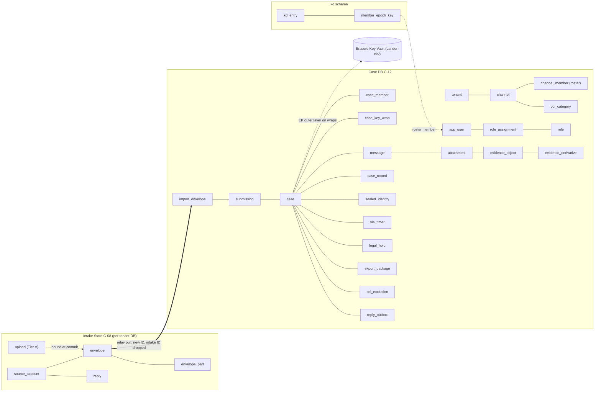

# 09 — Database Design (Intake Store C-08 and Case DB C-12)

Status: Draft v1.0 · Edition applicability: both (EE-only objects marked **EE**) · Owner: Backend team (data)

## 1. Purpose and scope

This document specifies the persistent data model of Candor for:
- the **Intake Store** (C-08, PostgreSQL on the intake host plus a ciphertext blob directory);
- the **Case Database** (C-12, PostgreSQL in Z-CORE), with its companion schemas `auth` and `kd` and the separate audit database `candor_audit`.

It covers:
- the conceptual and logical schemas, table by table (columns, types, ciphertext flags, classification, readers, retention);
- row-level security (RLS) for tenancy and case ACLs;
- the time-granularity rules and the schema lint that enforces them;
- a record-correlation analysis;
- migrations and hardening.

Blob contents (C-13) are ciphertext objects addressed by `blob_id`. Their formats are in 04-CRYPTOGRAPHY.md and 10-FILE-EVIDENCE-PIPELINE.md.

## 2. Context and dependencies

| Document | Relationship |
|---|---|
| DECISIONS.md ADR-005/008/010/011/013/014/015/016/021/025/030 | Binding decisions |
| 06-SYSTEM-ARCHITECTURE.md §13–14 | What each component may learn; cross-zone identifier rules |
| 07-BACKEND.md | Services, jobs, relay and sealer protocols writing these tables |
| 08-API.md | Endpoints reading and writing these tables |
| 14-CASE-MANAGEMENT.md | Workflow, SLA and routing semantics |
| 15-AUTHENTICATION-AUTHORIZATION.md | Roles, permissions, policy facts |
| 19-BACKUPS-DR.md | Backup of these databases |
| 20-LOGGING-AUDITING.md | Audit event schema (the `candor_audit` DB here is its storage) |
| 35-DATA-RETENTION-DELETION.md | Retention values and deletion procedures referenced in the retention columns |

## 3. Data classification (used in every table)

| Class | Meaning | Examples | Default readers |
|---|---|---|---|
| **SOURCE-SENSITIVE (SS)** | Data about the source or the source's actions that could help identify or link the source, even when it is not content | locator hash, source account public keys, envelope↔account linkage, received date, COI selection (encrypted) | Owning service only; never exported or logged |
| **CONTENT (CT)** | Report content and anything derived from it. **Always ciphertext** under keys absent from servers. | envelope ciphertext, case records, evidence, replies, sealed identity | Authorized case members via Desk (decrypt client-side) |
| **WORKFLOW (WF)** | Staff-visible case-management metadata in cleartext | case state, priority, SLA due day, member list | Case members per ACL; admins **only** in aggregate |
| **SECURITY (SEC)** | Authentication, authorization, configuration, keys (public), audit | credentials, role assignments, config bundles, directory entries | Auth/Admin services, auditors |
| **SYSTEM (SYS)** | Operational state with no source or content link | job leases, schema version | Services, operators |

**Ciphertext marker:** the "Ct" column in the tables below means that the stored bytes are ciphertext and the server holds no key to decrypt them. Tables marked "RLS: tenant" enforce tenant isolation. "RLS: tenant+ACL" additionally enforces the case ACL (§6).

## 4. Conceptual model



## 5. Logical schema

Common conventions:
- **IDs:** `uuid` columns hold 128 random bits from the OS CSPRNG (the version/variant bits are not forced, and all 128 bits are random). There are no `serial`/`identity` columns used as public IDs. Internal ordering columns (`seq`, `batch_no`) are never exposed as resource identifiers (08-API.md §3.2).
- **Days:** `*_day` columns are `date` (UTC day). There is no finer time for source-linked rows (§8).
- **Tenancy:** every Case DB table except the global catalogs `permission` and `schema_meta` has `tenant_id uuid NOT NULL` referencing `tenant`.
- **Versions:** every mutable Case DB table has `version bigint NOT NULL DEFAULT 1`, incremented by trigger (optimistic concurrency, 07-BACKEND.md §5.5).
- **Sizes:** sizes are `size_bucket smallint` (index into the ADR-011 bucket series) or `padded_size bigint` (already padded). Raw sizes are never stored.
- **Retention abbreviations:**
  - "until relayed" = deleted after digest-verified relay ack (07-BACKEND.md BE-014);
  - "case lifetime" = until case crypto-erasure per retention policy or approved deletion (35-DATA-RETENTION-DELETION.md).

### 5.1 Intake Store (C-08) — one PostgreSQL database per tenant (`candor_intake_<tenant>`), no RLS needed (single tenant per DB)

Readers for all intake tables: the `candor_istore` PG role (used only by `candor-intake-store`). No other role exists except `candor_intake_migrator` (NOLOGIN outside migrations) and `candor_intake_backup` (read-only, used by the snapshot job inside `candor-intake-store`).

**`intake_meta`** (singleton) — SYS/SEC — Retention: permanent

| Column | Type | Ct | Class | Notes |
|---|---|---|---|---|
| tenant_id | uuid PK | | SYS | |
| schema_hash | bytea(32) | | SYS | Checked at start (BE-050) |
| kdf_salt | bytea(32) | | SEC | Per-deployment Argon2id salt (ADR-005). Public; not a secret. |
| relay_req_counter | bigint | | SEC | Anti-replay (07-BACKEND.md §5.4) |
| last_batch_no | bigint | | SYS | |
| directory_version | bigint | | SEC | Last applied snapshot |
| config_version | bigint | | SEC | Last applied bundle |

**`source_account`** — SS — Retention: until the source deletes it (SW-15/SA-17), or 365 days after the last day on which any envelope or reply existed for it (`inactive_purge`), or 1 epoch day for `pending` accounts

| Column | Type | Ct | Class | Notes |
|---|---|---|---|---|
| account_id | uuid PK | | SS | Never leaves Z-INTAKE (06 §14) |
| locator_hash | bytea(32) UNIQUE | | SS | `SHA-256(locator)`; locator derived from the passphrase seed (04-CRYPTOGRAPHY.md) |
| auth_pk | bytea(32) | | SS | Ed25519 source auth public key (the "verifier") |
| xwing_pk | bytea(1216) | | SS | Reply encryption key |
| prefs_ct | bytea (≤ 4096) | **yes** | SS | COI selection, language; encrypted to `xwing_pk` (ADR-030, BE-052) |
| state | enum(pending, active) | | SS | |
| created_day | date | | SS | For pending purge only |
| activity_day | date | | SS | **Last day an envelope or reply was stored for it.** Updated only on envelope commit or reply arrival, never on login (ADR-010: no "last seen"). Used for `inactive_purge`. |
| quota_bucket | smallint | | SS | Upload quota bucket consumed this epoch day |

**`draft_part`** — CT/SS — Retention: ≤ 3 h (draft_gc) or until commit

| Column | Type | Ct | Class | Notes |
|---|---|---|---|---|
| part_id | uuid PK | | SS | |
| draft_ref | bytea(16) | | SS | Random per sealer draft; not an account ID |
| part_no | smallint | | SS | |
| blob_id | uuid | | SYS | → blob file |
| padded_size | bigint | | SS | |
| draft_generation | integer | | SYS | Hourly counter, not wall time (07 §6.3) |

**`upload`** (Tier V) — SS/SEC — Retention: until commit (then deleted, chunks re-parented to `envelope_part`) or 3 epoch days

| Column | Type | Ct | Class | Notes |
|---|---|---|---|---|
| upload_id | bytea(32) PK | | SS | `SHA-256("candor-upload-id" ‖ U)` |
| k_u | bytea(32) | | SEC | Chunk MAC key (08-API.md §5.1); deleted at commit |
| chunk_count | smallint | | SS | |
| padded_size_bucket | smallint | | SS | |
| received_bitmap | bytea | | SYS | |
| created_day | date | | SS | |

**`upload_chunk`** — CT — Retention: as `upload`

| Column | Type | Ct | Class | Notes |
|---|---|---|---|---|
| upload_id | bytea(32) FK | | SS | |
| n | smallint | | SYS | PK (upload_id, n) |
| blob_id | uuid | **yes** (blob) | CT | |
| sha256 | bytea(32) | | SYS | Digest of the ciphertext chunk |

**`envelope`** — CT/SS — Retention: until relayed

| Column | Type | Ct | Class | Notes |
|---|---|---|---|---|
| envelope_ref | uuid PK | | SS | Intake-local; dropped by relay (06 §14) |
| channel_id | uuid | | WF | |
| kind | enum(initial, followup) | | SS | |
| source_account_id | uuid NULL FK | | SS | NULL for one-shot Tier V submissions |
| header_ct | bytea (≤ 8 KiB) | **yes** | CT | Contains exactly 16 fixed-size anonymous HPKE recipient slots, randomly ordered, with **no key IDs** (ADR-033 §1). The real recipient list is inside the AEAD payload. |
| manifest_ct | bytea (≤ 64 KiB) | **yes** | CT | |
| header_sha256 | bytea(32) | | SYS | Relay ack digest |
| received_date | date | | SS | ADR-010 |
| tier | enum(w, v) | | SS | Needed for counters only |
| batch_no | bigint NULL | | SYS | Set at claim |
| state | enum(sealed, claimed) | | SYS | |

**`envelope_part`** — CT — Retention: until relayed

| Column | Type | Ct | Class | Notes |
|---|---|---|---|---|
| envelope_ref | uuid FK | | SS | |
| part_no | smallint | | SYS | |
| blob_id | uuid | **yes** | CT | |
| padded_size | bigint | | SS | ADR-011 bucket |

**`reply`** — CT/SS — Retention: `intake.reply_retention_days` (default 90) after `available_day`, or deletion by the source, or account deletion

| Column | Type | Ct | Class | Notes |
|---|---|---|---|---|
| reply_ref | uuid PK | | SS | |
| source_account_id | uuid FK | | SS | Resolved from `routing_ct` at intake |
| reply_ct | bytea (≤ 70,000) | **yes** | CT | Encrypted to the source X-Wing key |
| size_bucket | smallint | | SS | |
| available_day | date | | SS | Day granularity |
| slot | smallint | | SS | Position 0–31 in the fixed mailbox (08-API.md §3.8) |

No `fetched`, `read` or `last_accessed` column exists (ADR-010).

**`directory_snapshot`**, **`config_bundle`** — SEC — Retention: current + previous version

| Column | Type | Ct | Class | Notes |
|---|---|---|---|---|
| version | bigint PK | | SEC | |
| body | bytea | | SEC | Signed CBOR |
| signatures | bytea | | SEC | |
| applied_day | date | | SYS | |

**`counter_daily`** — SS (aggregate) — Retention: 30 days (after relay export)

| Column | Type | Ct | Class | Notes |
|---|---|---|---|---|
| day | date | | SS | |
| channel_id | uuid | | WF | |
| name | enum | | SYS | e.g. `submissions_tier_w` |
| value | integer | | SS | Exported only with k ≥ 5 suppression (BE-030) |

**`job_local`** — SYS — same shape as the Case DB `job` (§5.2.14) without `tenant_id`. Retention: 7 days after completion.

**Blob directory** `/var/lib/candor/intake/blobs/`:
- filenames = random 128-bit `blob_id` (base32);
- mode 0600;
- file mtime and atime normalized to `00:00 UTC` of `received_date` via `utimensat` at commit;
- mounted `noatime`.

### 5.2 Case DB (C-12) — schema `core`

Readers legend (PostgreSQL roles, §10):
- `case` = `candor_case` (Desk router);
- `admin` = `candor_admin` (Admin router);
- `relay` = `candor_relay`;
- `worker` = `candor_worker`;
- `notify` = `candor_notify`;
- `kd` = `candor_kd`;
- `auth` = `candor_auth`;
- `backup` = `candor_backup` (physical backup only).

#### 5.2.1 Tenancy and organization

**`tenant`** — SEC — Readers: case, admin, auth, worker (own row via RLS); Retention: tenant lifetime

| Column | Type | Ct | Class | Notes |
|---|---|---|---|---|
| tenant_id | uuid PK | | SEC | |
| label | text (≤ 64) | | SYS | Instance label used in notifications (ADR-017) |
| risk_class | enum(low, moderate, high) | | SEC | High = dedicated instance only (ADR-021) |
| state | enum(active, suspended) | | SYS | |

**`department`** — WF — Readers: case, admin; Retention: tenant lifetime

| Column | Type | Ct | Class |
|---|---|---|---|
| department_id | uuid PK; tenant_id | | WF |
| label | text (≤ 128) | | WF |
| parent_id | uuid NULL | | WF |

**`channel`** — WF/SEC — Readers: case, admin, relay (id, tenant only), worker; Retention: tenant lifetime (soft-disabled, never reused)

| Column | Type | Ct | Class | Notes |
|---|---|---|---|---|
| channel_id | uuid PK; tenant_id | | WF | Public (appears in onion URLs) |
| public_label_i18n | jsonb | | WF | Shown to sources |
| mode | enum(anonymous, confidential, identified) | | SEC | ADR-002 |
| workflow_def_id | uuid FK | | WF | |
| retention_policy_id | uuid FK | | WF | |
| reply_enabled | bool | | WF | |
| min_recipients | smallint (1–16) | | SEC | ADR-030 |
| state | enum(active, disabled) | | SYS | |

**`channel_member`** (roster, ADR-030) — SEC/WF — Readers: case (member's own channels), admin, kd, worker; Retention: tenant lifetime (removed members kept as `removed` for audit reference)

| Column | Type | Ct | Class | Notes |
|---|---|---|---|---|
| channel_id, user_id | uuid PK pair; tenant_id | | SEC | |
| role_label_i18n | jsonb | | SEC | Published in C-14 `CHANNEL_ROSTER` |
| show_name | bool | | SEC | |
| label_index | smallint | | SEC | Stable index used by source COI selections (SW-03) |
| state | enum(pending_keys, active, removed) | | SEC | `pending_keys` until the member publishes Member Epoch Keys |

**`coi_category`** — SEC — Readers: case, admin, kd; Retention: tenant lifetime (versioned via C-14)

| Column | Type | Ct | Class |
|---|---|---|---|
| channel_id, category_id | uuid, smallint PK; tenant_id | | SEC |
| label_i18n | jsonb | | SEC |
| excluded_label_indexes | smallint[] | | SEC |

**`coi_registry`** (admin-maintained standing exclusions) — SEC — Readers: admin, and C-22 via `case` role (policy facts only; never returned to Desk); Retention: tenant lifetime + audit

| Column | Type | Ct | Class | Notes |
|---|---|---|---|---|
| entry_id | uuid PK; tenant_id | | SEC | |
| user_id | uuid | | SEC | |
| scope_type | enum(tenant, department, channel) | | SEC | |
| scope_id | uuid NULL | | SEC | |
| reason_code | enum | | SEC | No free text |

#### 5.2.2 Users, roles, permissions

**`app_user`** — SEC — Readers: case (display fields of co-members), admin, auth; Retention: account lifetime + 1 year after disablement (then pseudonymized: `display_name` replaced, audit pseudonyms stay)

| Column | Type | Ct | Class | Notes |
|---|---|---|---|---|
| user_id | uuid PK; tenant_id | | SEC | |
| username | citext UNIQUE per tenant | | SEC | |
| display_name | text (≤ 128) | | SEC | |
| state | enum(invited, active, disabled) | | SEC | |
| department_id | uuid NULL | | WF | |

**`permission`** (global catalog, no tenant) — SEC — Readers: all app roles; Retention: code-defined

| Column | Type | Class |
|---|---|---|
| permission_id | text PK (e.g., `case.read`) | SEC |
| class | enum(content, workflow, admin, security) | SEC |

**`role`** — SEC — Readers: case, admin, auth

| Column | Type | Class | Notes |
|---|---|---|---|
| role_id | uuid PK; tenant_id | SEC | |
| name | text | SEC | |
| built_in | bool | SEC | Built-in roles immutable |
| permission_ids | text[] | SEC | CHECK: `admin`-class roles contain no `content`-class permission (ADR-015) |

**`role_assignment`** — SEC — Readers: case (C-22 facts), admin, auth; Retention: active + 7 years in audit (row deleted 1 year after end)

| Column | Type | Class | Notes |
|---|---|---|---|
| assignment_id | uuid PK; tenant_id | SEC | |
| user_id, role_id | uuid | SEC | |
| scope_type | enum(tenant, department, channel) | SEC | |
| scope_id | uuid NULL | SEC | |
| valid_from_day, valid_until_day | date | SEC | Time-bounded grants |
| granted_by, approved_by | uuid | SEC | `approved_by` required for privileged roles |

#### 5.2.3 Import (relay output)

**`import_envelope`** — CT/SS — Readers: relay (INSERT), case (active roster members of the envelope's channel, via RLS §6.3; they trial-decrypt the anonymous slots), worker; Retention: `imported` → row kept for case lifetime with `header_digest` nulled after 30 days and part blobs deleted after DEK re-wrap into the case; `rejected` (dual-approved) → 30 days. There is **no automatic expiry**: pending envelopes block retirement of that epoch's keys (ADR-033 §2).

| Column | Type | Ct | Class | Notes |
|---|---|---|---|---|
| import_envelope_id | uuid PK; tenant_id | | SS | **New random ID** (06 §14) |
| channel_id | uuid | | WF | |
| kind | enum(initial, followup) | | SS | |
| header_ct | bytea | **yes** | CT | 16 anonymous slots; no recipient key IDs anywhere in cleartext (ADR-033) |
| manifest_ct | bytea | **yes** | CT | Signed real-recipient list (key IDs + directory tree head) is inside |
| header_digest | bytea(32) NULL UNIQUE | | SYS | Idempotency; nulled after 30 days (BE-013) |
| received_date | date | | SS | UTC day only (ADR-010, ADR-033 §4) |
| epoch_index | int | | SYS | Epoch containing `received_date`; gates Member Epoch Key retirement |
| import_batch_no | bigint | | SYS | Monotonic relay cycle number; no pull time stored (ADR-033 §4) |
| state | enum(pending, imported, duplicate, rejected) | | WF | `rejected` requires two approvers (08-API.md DA-23) |
| rejected_by | uuid[] NULL | | SEC | Two distinct users |
| escalated_date | date NULL | | WF | Set when pending > 7 days and escalated to the independent channel (ADR-033 §2) |

**`import_envelope_part`** — CT — Retention: until rewrapped into the case + 30 days

| Column | Type | Ct | Class |
|---|---|---|---|
| import_envelope_id, part_no | PK; tenant_id | | SYS |
| blob_id | uuid | **yes** | CT |
| padded_size | bigint | | SS |

#### 5.2.4 Cases

**`case`** — WF/CT — Readers: case (tenant+ACL for full row; `case.list` returns only ACL rows), worker, admin **only via the aggregate view** `v_case_counts` (§6.4); Retention: per retention policy (default 365 days after `closed_day`), legal hold overrides

| Column | Type | Ct | Class | Notes |
|---|---|---|---|---|
| case_id | uuid PK; tenant_id | | WF | |
| display_ref | text (8 chars) UNIQUE per tenant | | WF | Random 40-bit code |
| channel_id | uuid | | WF | |
| workflow_def_id, workflow_version | uuid, int | | WF | |
| state | text (FK to workflow state) | | WF | |
| priority | smallint | | WF | |
| received_date | date | | SS | Earliest envelope day; the only import-related date on the case (ADR-033 §4) |
| opened_day, closed_day | date | | WF | |
| record_ct | bytea (≤ 256 KiB) | **yes** | CT | Title, summary, labels, staff times (07 §12) |
| key_epoch | int | | SEC | Current case-key epoch |
| retention_policy_id | uuid | | WF | |
| deletion_due_day | date NULL | | WF | |
| legal_hold | bool (derived by trigger from `legal_hold`) | | WF | |
| version | bigint | | SYS | |

**`submission`** (import envelope ↔ case) — SS/WF — Readers: case (ACL); Retention: case lifetime

| Column | Type | Class | Notes |
|---|---|---|---|
| case_id, import_envelope_id | uuid PK pair; tenant_id | SS | Only linkage between the source's envelopes and a case (§9) |
| seq | int | WF | Order within the case |

**`case_member`** (ACL) — WF/SEC — Readers: case (members of that case), worker; Retention: case lifetime (history in audit)

| Column | Type | Class | Notes |
|---|---|---|---|
| case_id, user_id | uuid PK pair; tenant_id | WF | |
| access_level | enum(read, contribute, lead) | WF | |
| via | enum(normal, breakglass) | SEC | Break-glass visible in all views |
| grant_ref | uuid NULL | SEC | → `breakglass_request` |
| valid_until_day | date NULL | WF | |
| state | enum(active, revoked) | WF | |

**`case_key_wrap`** — CT/SEC — Readers: case (only the row whose `recipient_user_id` = caller, via RLS), worker (DELETE for crypto-erasure); **no** admin grant; Retention: case lifetime. **Crypto-erasure = destroy the case's Erasure Key in the vault (§5.6) plus delete all rows**. Backups holding rows become unreadable once vault backups roll off (≤ 14 days).

| Column | Type | Ct | Class | Notes |
|---|---|---|---|---|
| case_id, key_epoch, recipient_key_id | PK; tenant_id | | SEC | |
| recipient_user_id | uuid NULL | | SEC | NULL for the Recovery Quorum wrap (ADR-013) |
| wrap_ct | bytea (≤ 2 KiB) | **yes** | CT | `AEAD_EK(inner)`: the member's X-Wing wrap of the case key, encrypted under the case's Erasure Key (ADR-033 §3). AAD = tenant_id ‖ case_id ‖ key_epoch ‖ recipient_key_id. |
| wrapped_by | uuid | | SEC | |

**`coi_exclusion`** (case-level, computed and declared) — SEC — Readers: C-22 via case (facts only, never returned); Retention: case lifetime

| Column | Type | Class | Notes |
|---|---|---|---|
| case_id, user_id | PK; tenant_id | SEC | |
| source | enum(source_selection, coi_map, self_declared, admin_registry) | SEC | |
| declared_by | uuid NULL | SEC | |

**`case_record`** (notes, tasks, decisions) — CT — Readers: case (tenant+ACL); Retention: case lifetime

| Column | Type | Ct | Class | Notes |
|---|---|---|---|---|
| record_id | uuid PK; tenant_id | | WF | |
| case_id | uuid | | WF | |
| kind | enum(note, task, decision, system) | | WF | |
| seq | int | | WF | Per-case order |
| created_day | date | | WF | Staff time is inside `body_ct` |
| author_user_id | uuid NULL | | WF | |
| key_epoch | int | | SEC | |
| body_ct | bytea (≤ 256 KiB) | **yes** | CT | |
| size_bucket | smallint | | WF | |

**`message`** (source ↔ organization messages) — CT/SS — Readers: case (tenant+ACL); Retention: case lifetime

| Column | Type | Ct | Class | Notes |
|---|---|---|---|---|
| message_id | uuid PK; tenant_id | | WF | |
| case_id | uuid | | WF | |
| direction | enum(from_source, to_source) | | SS | |
| import_envelope_id | uuid NULL | | SS | Set for `from_source` |
| day | date | | SS | `received_date` or reply queued day |
| blob_id | uuid NULL | **yes** | CT | Imported message stream |
| dek_wrap_ct | bytea NULL | **yes** | CT | Envelope DEK re-wrapped under the case key |
| body_ct | bytea NULL | **yes** | CT | Staff replies (copy for case history) |
| key_epoch | int | | SEC | |
| size_bucket | smallint | | SS | |

**`attachment`** (message → evidence) — SS — Readers: case (ACL); Retention: case lifetime

| Column | Type | Class |
|---|---|---|
| message_id, evidence_id | uuid PK pair; tenant_id | SS |
| position | smallint | SS |

**`evidence_object`** (ORIGINAL evidence, immutable, ADR-012) — CT — Readers: case (ACL + `evidence.read`/`read_original` enforced by C-22); Retention: case lifetime; immutable (UPDATE trigger rejects changes except the `state` column for deletion)

| Column | Type | Ct | Class | Notes |
|---|---|---|---|---|
| evidence_id | uuid PK; tenant_id | | WF | |
| case_id | uuid | | WF | |
| origin | enum(source_attachment, staff_upload) | | WF | |
| blob_id | uuid | **yes** | CT | |
| dek_wrap_ct | bytea | **yes** | CT | |
| meta_ct | bytea | **yes** | CT | Display name, MIME, and SHA-256 + BLAKE3 content hashes recorded at import (inside ciphertext, ADR-012) |
| padded_size | bigint | | WF | |
| key_epoch | int | | SEC | |
| state | enum(active, erased) | | SYS | |

**`evidence_derivative`** (SANITIZED working copy) — CT — Readers: case (ACL); Retention: case lifetime (removable by author)

| Column | Type | Ct | Class | Notes |
|---|---|---|---|---|
| derivative_id | uuid PK; tenant_id | | WF | |
| case_id | uuid | | WF | |
| derived_from | uuid FK → evidence_object or evidence_derivative | | WF | |
| transformation_ct | bytea | **yes** | CT | Tool, version, parameters, output hashes (10-FILE-EVIDENCE-PIPELINE.md) |
| blob_id | uuid | **yes** | CT | |
| dek_wrap_ct, meta_ct | bytea | **yes** | CT | |
| author_user_id | uuid | | WF | |
| created_day | date | | WF | |
| key_epoch | int | | SEC | |

**`sealed_identity`** (ADR-014) — CT (SS) — Readers: case role only for Identity Custodians after an approved request (RLS on `identity_unseal_request.state = approved`); Retention: case lifetime or earlier on legal basis

| Column | Type | Ct | Class | Notes |
|---|---|---|---|---|
| identity_id | uuid PK; tenant_id | | SS | |
| case_id | uuid | | SS | |
| sealed_ct | bytea (≤ 16 KiB) | **yes** | SS | Wrapped to Identity Custodian keys, **not** the case key |

**`identity_unseal_request`** — SEC — Readers: case (requester, custodians); Retention: case lifetime + audit

| Column | Type | Ct | Class |
|---|---|---|---|
| request_id | uuid PK; tenant_id | | SEC |
| case_id, requested_by | uuid | | SEC |
| legal_basis_code | enum | | SEC |
| justification_ct | bytea | **yes** | CT |
| approvals | uuid[] | | SEC |
| state | enum(pending, approved, rejected, used) | | SEC |
| source_notice_due_day | date NULL | | WF |

#### 5.2.5 Workflow, SLA, retention, holds

**`workflow_definition`** — WF — Readers: case, admin; Retention: permanent while referenced

| Column | Type | Class | Notes |
|---|---|---|---|
| workflow_def_id, version | uuid, int PK; tenant_id | WF | |
| definition | jsonb | WF | States, transitions (with required permissions), SLA rules; validated by JSON Schema (14-CASE-MANAGEMENT.md) |
| state | enum(draft, published, retired) | WF | |
| published_by | uuid | SEC | |

**`case_state_history`** — WF — Readers: case (ACL); Retention: case lifetime

| Column | Type | Class | Notes |
|---|---|---|---|
| case_id, seq | PK; tenant_id | WF | |
| from_state, to_state, transition_id | text | WF | |
| actor_user_id | uuid | WF | |
| day | date | WF | Exact time only in the CASE audit event |

**`sla_timer`** — WF — Readers: case (ACL), worker; Retention: case lifetime

| Column | Type | Class | Notes |
|---|---|---|---|
| timer_id | uuid PK; tenant_id | WF | |
| case_id | uuid | WF | |
| kind | enum(acknowledge, feedback, custom) | WF | EU defaults 7 days / 3 months (B-CO-02) |
| anchor_day, due_day | date | WF | Anchor = `received_date` for source-driven timers |
| calendar_id | uuid NULL | WF | Business-day calendar |
| state | enum(running, paused, met, breached, cancelled) | WF | |

**`retention_policy`** — WF — Readers: case, admin, worker

| Column | Type | Class |
|---|---|---|
| retention_policy_id | uuid PK; tenant_id | WF |
| retain_days_after_close | int (30–3650) | WF |
| action | enum(crypto_erase, review) | WF |
| legal_basis_code | enum | WF |

**`legal_hold`** — WF/SEC — Readers: case (ACL + legal role), worker; Retention: until released + audit

| Column | Type | Ct | Class |
|---|---|---|---|
| hold_id | uuid PK; tenant_id | | WF |
| case_id | uuid | | WF |
| reason_ct | bytea | **yes** | CT |
| placed_by, released_by, release_approved_by | uuid | | SEC |
| placed_day, released_day | date | | WF |

**`deletion_request`** — WF/SEC — Readers: case; Retention: 1 year after execution (audit keeps the record)

| Column | Type | Class |
|---|---|---|
| request_id | uuid PK; tenant_id | WF |
| case_id, requested_by, approved_by | uuid | SEC |
| reason_code | enum | WF |
| state | enum(pending, approved, executed, rejected) | WF |

#### 5.2.6 Break-glass

**`breakglass_request`** — SEC — Readers: case (requester, approvers, reviewers, members of the case), worker; Retention: 7 years (legal accountability), row pseudonymized after case erasure

| Column | Type | Ct | Class | Notes |
|---|---|---|---|---|
| request_id | uuid PK; tenant_id | | SEC | |
| case_id | uuid | | SEC | |
| requester_id, approver_id, reviewer_id | uuid | | SEC | CHECK: pairwise distinct |
| reason_code | enum | | SEC | |
| legal_basis_ct | bytea | **yes** | CT | Case key |
| state | enum(requested, approved_pending_wrap, active, expired, rejected, reviewed) | | SEC | |
| expires_at | timestamptz | | SEC | Staff security timer (allow-listed, §8) |
| review_due_day | date | | SEC | |
| review_outcome | enum NULL | | SEC | |

#### 5.2.7 Replies, exports, notifications

**`reply_outbox`** — CT — Readers: case (INSERT), relay (SELECT/UPDATE state), worker; Retention: until `pushed` + 7 days

| Column | Type | Ct | Class | Notes |
|---|---|---|---|---|
| outbox_id | uuid PK; tenant_id | | SYS | |
| routing_ct | bytea (≤ 2 KiB) | **yes** | SS | Mailbox ID sealed to the Intake Routing Key (06 §8.2) |
| reply_ct | bytea (≤ 70,000) | **yes** | CT | |
| state | enum(queued, pushed) | | SYS | |
| queued_day | date | | WF | |

**`export_package`** — CT/WF — Readers: case (creator, approvers, lead), connector (via the export router: own packages only); Retention: blob deleted on delivery or after 7 days; row case lifetime

| Column | Type | Ct | Class | Notes |
|---|---|---|---|---|
| export_id | uuid PK; tenant_id | | WF | |
| case_id | uuid | | WF | |
| kind | enum(redacted, original) | | WF | |
| destination_type | enum(media, connector) | | WF | |
| connector_id | uuid NULL | | WF | |
| manifest_ct | bytea | **yes** | CT | |
| blob_id | uuid NULL | **yes** | CT | Encrypted to the destination key |
| package_digest | bytea(32) | | WF | |
| created_by | uuid | | SEC | |
| state | enum(pending_approval, approved, rejected, delivered, expired) | | WF | |
| created_day | date | | WF | |

**`export_approval`** — SEC — Readers: as `export_package`

| Column | Type | Class | Notes |
|---|---|---|---|
| export_id, approver_id | PK; tenant_id | SEC | CHECK approver ≠ creator |
| decision | enum(approve, reject) | SEC | |
| digest_confirmed | bytea(32) | SEC | Must equal `package_digest` |
| day | date | SEC | Exact time in audit |

**`notification_target`** — SEC — Readers: notify, case (own row); Retention: account lifetime

| Column | Type | Class | Notes |
|---|---|---|---|
| user_id | uuid PK; tenant_id | SEC | |
| channel_type | enum(smtp, matrix, webhook) | SEC | |
| contact_uri | text (≤ 320) | SEC | Only staff contact data; lint allow-listed (§8) |
| mode | enum(digest, daily) | SEC | |

**`notification_queue`** — SYS — Readers: notify, worker; Retention: 7 days after send

| Column | Type | Class | Notes |
|---|---|---|---|
| notif_id | uuid PK; tenant_id | SYS | |
| user_id | uuid | SYS | |
| template | enum(T1) | SYS | Only template (ADR-017) |
| due_at | timestamptz | SYS | Jittered send time (allow-listed) |
| state | enum(queued, sent, dropped) | SYS | |

No column references a case, envelope or channel.

#### 5.2.8 Jobs, configuration, idempotency, blobs, counters

**`job`** — SYS — Readers: worker, relay, notify, case (enqueue only); Retention: 7 days after `done`, 30 days after `dead`. **Exception:** jobs enqueued as a consequence of an import (e.g., `notify_intake_available`) get `run_after` = the next hourly digest slot (not import time + offset) and are deleted immediately on completion (ADR-033 §4). Relay cycles are scheduled by an in-process timer and never create job rows.

| Column | Type | Class | Notes |
|---|---|---|---|
| job_id | uuid PK; tenant_id | SYS | |
| kind | text CHECK in the registered kinds (07 §6.2) | SYS | |
| payload | bytea (CBOR ≤ 4 KiB) | SYS | Opaque IDs, enums, days only (BE-020) |
| priority | smallint | SYS | |
| run_after, lease_until | timestamptz | SYS | Allow-listed |
| attempts, max_attempts | smallint | SYS | |
| locked_by | text (worker instance) | SYS | |
| state | enum(ready, running, done, dead) | SYS | |

**`config_change`** — SEC — Readers: admin; Retention: 7 years

| Column | Type | Class | Notes |
|---|---|---|---|
| change_id | uuid PK; tenant_id | SEC | |
| items | jsonb | SEC | Validated against the catalog |
| class | enum(safe, advanced, dangerous) | SEC | Server-computed |
| proposed_by | uuid | SEC | |
| signatures | jsonb | SEC | Admin signing-key signatures |
| effective_after | timestamptz | SEC | 72-h cool-off (allow-listed) |
| state | enum(proposed, approved, effective, cancelled) | SEC | |

**`config_bundle`** — SEC — as in the intake (§5.1), plus `tenant_id`.

**`idempotency_key`** — SYS — Retention: 24 h

| Column | Type | Class |
|---|---|---|
| user_id, key | uuid, bytea(16) PK; tenant_id | SYS |
| response_status | smallint | SYS |
| resource_id | uuid NULL | SYS |
| expires_at | timestamptz | SYS |

**`blob_object`** — SYS — Readers: case, relay, worker; Retention: until unreferenced + 24 h (`blob_gc`)

| Column | Type | Class | Notes |
|---|---|---|---|
| blob_id | uuid PK; tenant_id | SYS | Random; content-independent name |
| store | enum(fs, s3) | SYS | |
| padded_size | bigint | SYS | |
| ct_sha256 | bytea(32) | SYS | Integrity of the ciphertext |
| refcount | int | SYS | |

**`aggregate_counter`** — SS (aggregate) — Readers: admin via `v_aggregates` only (k ≥ 5, week buckets); Retention: 3 years

| Column | Type | Class |
|---|---|---|
| tenant_id, week_start_day, channel_id, name | PK | SS |
| value_or_suppressed | integer NULL (NULL = `<5`) | SS |

### 5.3 Schema `auth` (C-21)

| Table | Key columns (type) | Class | Ct | Readers | Retention |
|---|---|---|---|---|---|
| `webauthn_credential` | credential_id bytea PK; tenant_id; user_id; public_key bytea; sign_count bigint; aaguid uuid; transports text[]; created_day date | SEC | | auth | until revoked + 1 year |
| `device` | device_id uuid PK; tenant_id; user_id; device_key_pk bytea(32); client_cert_spki bytea(32); state enum(pending, active, revoked); enrolled_day date | SEC | | auth, admin, case (own) | revoked + 1 year |
| `enrollment_token` | token_hash bytea(32) PK; tenant_id; user_id; expires_at timestamptz | SEC | | auth | 24 h |
| `session` | token_hash bytea(32) PK; tenant_id; audience enum(desk_api, admin_api); user_id; device_id; auth_strength enum; issued_at, expires_at timestamptz | SEC | | auth | expiry + 1 day |
| `refresh_token` | token_hash PK; family_id uuid; tenant_id; user_id; device_id; expires_at; used bool | SEC | | auth | expiry + 1 day |
| `stepup_proof` | proof_hash PK; tenant_id; user_id; action text; resource_id uuid NULL; expires_at; used bool | SEC | | auth | 1 day |
| `pop_nonce` | nonce bytea(16) PK; seen_at timestamptz | SEC | | auth | 120 s (unlogged table) |

Source sessions are **not** in any database (RAM in C-06, 07-BACKEND.md §5.1).

### 5.4 Schema `kd` (C-14)

| Table | Key columns (type) | Class | Ct | Readers | Retention |
|---|---|---|---|---|---|
| `kd_entry` | leaf_index bigint PK (per tenant log); tenant_id; entry_type enum (08-API.md §7); subject_id uuid; body bytea (canonical CBOR); leaf_hash bytea(32); signer_key_id bytea(16); sig bytea(64); appended_day date | SEC | | kd (INSERT, SELECT), case, relay (snapshot) | permanent (append-only; UPDATE/DELETE trigger raises) |
| `kd_checkpoint` | tree_size bigint PK; tenant_id; root_hash bytea(32); note bytea (signed); created_at timestamptz | SEC | | kd, case, relay | permanent |
| `witness_cosignature` | tree_size, witness_key_id PK; sig | SEC | | kd, case | permanent |
| `member_epoch_key` (index over `MEMBER_EPOCH_KEY` entries) | key_id bytea(16) PK; tenant_id; channel_id; user_id; device_id; valid_from_day, valid_until_day, decrypt_until_day date; leaf_index; state enum(active, decrypt_only, destroy_due, destroyed). `destroy_due` only when `decrypt_until_day` has passed **and** no `import_envelope` of the channel with that `epoch_index` is `pending` (ADR-033 §2). | SEC | | kd, case (listing RLS), worker | row kept after destruction (public key only) |
| `user_key` (index over `USER_KEY` entries) | key_id PK; tenant_id; user_id; device_id; identity_pk; xwing_pk; state; leaf_index | SEC | | kd, case | permanent |

No private key material of any kind is stored in the `kd` schema or anywhere in C-12 (ADR-007, ADR-030).

### 5.5 Audit database `candor_audit` (C-24; event schema owned by 20-LOGGING-AUDITING.md)

| Table | Key columns | Class | Readers | Retention |
|---|---|---|---|---|
| `audit_event` | tenant_id; class enum(security, case, system); seq bigint; PK(tenant_id, class, seq); event_type smallint; actor_pseudonym bytea(16); object_pseudonym bytea(16) NULL; payload bytea (canonical CBOR of allow-listed fields); occurred_date date; occurred_at timestamptz NULL (**staff actions only**); prev_hash, hash bytea(32); state enum(pending, committed, aborted) | SEC (SECURITY/CASE/SYSTEM) | `candor_audit_w` INSERT and state update only; `candor_audit_r` SELECT (auditor tools); no DELETE grant | per 20-LOGGING-AUDITING.md (default SECURITY 7 years, CASE = case lifetime + 1 year, SYSTEM 90 days); deletion only by the chain-preserving truncation job |
| `audit_checkpoint` | tenant_id, class, seq PK; hash; sig bytea(64); signed_at timestamptz; witness_ref | SEC | as above | permanent |

**SOURCE-SENSITIVE events do not exist** (ADR-016). Automatic import events (relay insert) are recorded with `occurred_at = NULL` and `occurred_date` (UTC day) only (ADR-033 §4). The table therefore has `occurred_date date NOT NULL`, and `occurred_at timestamptz NULL` is set only for staff actions.

### 5.6 Erasure Key Vault (`candor-ekv`, ADR-033 §3)

**Purpose:** bound "delete" in backups. Every case has a random 256-bit **Erasure Key (EK)**. All `case_key_wrap.wrap_ct` rows (member wraps and the Recovery Quorum wrap) are stored encrypted under the EK. Destroying the EK makes every copy of those rows, including copies in routine backups, unusable. That leaves the case content unrecoverable even for a holder of member private keys who obtains an old backup, once the vault's own backups roll off (≤ 14 days).

The EK is **not** a content key. EK plus DB still requires a member's or quorum's private key to recover the case key, so the server still holds no key that decrypts content (ADR-007, ADR-008).

**Placement:**
- Host-local store on the core host at `/var/lib/candor/ekv/`, owned by the dedicated OS user `candor-ekv`.
- Accessed only by `candor-case` and `candor-worker` via Unix socket `/run/candor/ekv/ekv.sock` (SO_PEERCRED).
- In EE-HA, replicated synchronously to the standby core host only (never to object storage).
- Listed in the Secret Placement Manifest (ADR-028).

**Record format** (one file per tenant, an append-only log with periodic compaction, or an embedded key-value store; the storage engine is an implementation choice):

| Field | Type | Class | Notes |
|---|---|---|---|
| tenant_id | uuid | SEC | |
| case_id | uuid | SEC | |
| ek_sealed | bytes(72) | SEC | EK encrypted under the Vault Master Key (VMK) with XChaCha20-Poly1305, AAD = tenant_id ‖ case_id |
| state | enum(active, destroyed) | SEC | Destroyed records keep only the tombstone (case_id, state) |

- The VMK is TPM2-sealed (CE) or held in an HSM (EE/GOV, C-29) and never written to disk in the clear.
- Operations:
  - `CREATE(case_id)` → EK handle;
  - `WRAP(case_id, inner)` and `UNWRAP(case_id, outer)`, where AEAD happens inside `candor-ekv` so the EK never leaves the process;
  - `DESTROY(case_id)`: overwrite the record, compact, then `fsync`;
  - `EXPORT_BACKUP`.

**Backups:**
- **Excluded from routine backups** (19-BACKUPS-DR.md). The vault has its own backup stream, encrypted to the Backup Key, with a hard retention of ≤ 14 days (rolling daily generations; older generations deleted by the backup store's lifecycle rule, verified weekly).
- Restore of a vault older than 14 days is impossible by construction. A disaster older than 14 days loses cases whose EK was created after the newest surviving vault backup. The design accepts this availability risk in favor of erasure (see 19-BACKUPS-DR.md for the DR trade-off).

**Erasure sequence** (`crypto_erase_case`):
1. Check legal hold.
2. `DESTROY(case_id)` in the vault.
3. Delete `case_key_wrap` rows.
4. Delete blobs and rows.
5. Emit a CASE audit event (date only for the case, exact time for the staff approver actions).

## 6. Row-level security

### 6.1 Session context (connection wrapper)

Every Case DB transaction issued by a service starts with:
```sql
SET LOCAL candor.tenant_id = '<uuid>';
SET LOCAL candor.user_id   = '<uuid or 00000000-0000-0000-0000-000000000000 for system principals>';
SET LOCAL candor.principal_kind = 'desk' | 'admin' | 'relay' | 'worker:<job_kind>' | 'notify' | 'kd' | 'auth';
```
- The values come from the authenticated principal (08-API.md §3.1), never from request input (ARCH-022).
- The Rust repository layer only exposes a `TenantTx` type created by the wrapper. Raw `PgPool::begin()` is banned by lint in C-10.

Helper functions (in schema `candor`, owned by the migrator, `SECURITY INVOKER`, `STABLE`):
```sql
CREATE FUNCTION candor.tenant() RETURNS uuid LANGUAGE plpgsql STABLE AS $$
DECLARE v text := current_setting('candor.tenant_id', true);
BEGIN
  IF v IS NULL OR v = '' THEN RAISE EXCEPTION 'candor: tenant context missing' USING ERRCODE = '42501'; END IF;
  RETURN v::uuid;
END $$;
CREATE FUNCTION candor.uid() RETURNS uuid ...   -- same pattern for candor.user_id
```

### 6.2 Tenant isolation (all tenant-scoped tables)

```sql
ALTER TABLE core.<t> ENABLE ROW LEVEL SECURITY;
ALTER TABLE core.<t> FORCE ROW LEVEL SECURITY;
CREATE POLICY p_tenant ON core.<t> AS PERMISSIVE FOR ALL TO candor_case, candor_admin, candor_relay, candor_worker, candor_notify, candor_kd, candor_auth
  USING (tenant_id = candor.tenant()) WITH CHECK (tenant_id = candor.tenant());
```
- No application role has `BYPASSRLS`. The table owner is `candor_migrator`, which is `NOLOGIN` except during migrations.
- A missing context raises an error (fail closed; INC-113).

### 6.3 Case ACL (restrictive policies, content-bearing tables)

For `case`, `case_record`, `message`, `attachment`, `evidence_object`, `evidence_derivative`, `submission`, `sla_timer`, `case_state_history`, `legal_hold`, `export_package` and `export_approval`:
```sql
CREATE POLICY p_case_acl ON core.case_record AS RESTRICTIVE FOR ALL TO candor_case
USING (EXISTS (SELECT 1 FROM core.case_member m
               WHERE m.tenant_id = candor.tenant() AND m.case_id = case_record.case_id
                 AND m.user_id = candor.uid() AND m.state = 'active'
                 AND (m.valid_until_day IS NULL OR m.valid_until_day >= (now() AT TIME ZONE 'UTC')::date)));
```

Per-table special policies:
- **`case_key_wrap`:** restrictive `USING (recipient_user_id = candor.uid())`. A member sees only their own wrap.
- **`import_envelope` / `_part`:** restrictive policy for `candor_case`:
  ```sql
  EXISTS (SELECT 1 FROM core.channel_member m
          WHERE m.tenant_id = candor.tenant() AND m.channel_id = import_envelope.channel_id
            AND m.user_id = candor.uid() AND m.state = 'active')
  ```
  Headers carry anonymous slots (ADR-033), so the server cannot know which members can open an envelope. Every active roster member may fetch the ciphertext and trial-decrypt. COI exclusion is enforced cryptographically: excluded members hold no key that opens any slot.
- **`sealed_identity`:** restrictive policy requiring an `identity_unseal_request` with `state='approved'` whose approvals include a custodian and where `candor.uid()` holds the custodian role.
- **`coi_exclusion`, `coi_registry`:** no SELECT for `candor_case` except through the `SECURITY DEFINER` function `candor.coi_facts(case_id)`, which returns only `(user_id, excluded bool)` for users the caller is evaluating. It is audited and on the definer-function allow-list.

### 6.4 Admin role has no content grants
- `candor_admin` has **no** privileges (not even SELECT) on:
  - `case_record`, `message`, `attachment`, `evidence_object`, `evidence_derivative`, `case_key_wrap`, `sealed_identity`, `import_envelope*`, `reply_outbox`, `export_package.manifest_ct/blob_id`, `submission`.
- Admin aggregate needs are met by views owned by a restricted definer:
  - `v_case_counts`: counts per channel, state and week, with k ≥ 5 suppression;
  - `v_aggregates`.
- A CI test (`db-grant-audit`) asserts this grant matrix (ADR-015; ARCH-012).

### 6.5 Worker scoping
- `candor_worker` runs each job kind under `candor.principal_kind = 'worker:<kind>'`.
- Restrictive policies limit DELETE on content tables to `worker:crypto_erase_case`, `worker:blob_gc` and `worker:export_expire`.
- The worker has no SELECT on `*_ct` columns: column-level grants exclude ciphertext columns except where a job must move blobs.

## 7. Grant matrix (summary)

| Table group | candor_case | candor_admin | candor_relay | candor_worker | candor_notify | candor_kd | candor_auth |
|---|---|---|---|---|---|---|---|
| tenant, department, channel, channel_member, coi_category | R (ACL-scoped for members) | RW | R (channel ids) | R | – | R | R |
| app_user, role, role_assignment, permission | R | RW (SoD checks) | – | R | R (user_id → target) | R | R |
| coi_registry, coi_exclusion | via definer fn | RW (registry) | – | R | – | – | – |
| import_envelope* | R (channel-roster RLS), U (state) | – | INSERT | R/U/D | – | – | – |
| case, submission, case_member, case_state_history, sla_timer | RW (ACL) | – (views only) | – | R/U | – | – | – |
| case_key_wrap | R own / INSERT | – | – | D (erase) | – | – | – |
| case_record, message, attachment, evidence_*, sealed_identity | RW (ACL) | – | – | D (erase) | – | – | – |
| reply_outbox | INSERT | – | R/U | D | – | – | – |
| export_package, export_approval | RW (ACL) | – | – | U/D | – | – | – |
| legal_hold, deletion_request, breakglass_request | RW (policy) | R (breakglass metadata only) | – | R/U | – | – | – |
| notification_target, notification_queue | R/U own target | R | – | INSERT | RW | – | – |
| job | INSERT | INSERT (ops jobs) | R/U own kinds | RW | R/U own kinds | R/U own kinds | R/U own kinds |
| config_change, config_bundle | R bundle | RW | R bundle | R | R | R | R |
| kd.* | R | R | R | R/U (state) | – | INSERT/R | R |
| auth.* | – | R (devices, credentials metadata) | – | D (gc) | – | – | RW |
| candor_audit.* | via audit service only | via audit service (R SECURITY) | – | – | – | – | – |

## 8. Time-granularity rules and schema lint (no exact source timestamps, no IP/UA anywhere)

The `schema-lint` test runs in CI against the migrated schema and at service start (via the schema hash). It fails the build or startup when any of the following holds:

| Rule | Check (information_schema / pg_catalog) |
|---|---|
| L1 No network identity types | No column of type `inet`, `cidr`, `macaddr`, `macaddr8` in any schema |
| L2 No network identity names | No column name matching `(?i)(^\|_)(ip\|ips\|ipaddr\|ip_address\|remote\|client_addr\|peer\|x_forwarded\|forwarded_for\|user_agent\|useragent\|ua\|referer\|referrer\|geo\|geoip\|lat\|lng\|lon\|latitude\|longitude\|circuit\|circuit_id\|onion_circ\|asn\|hostname)($\|_)` |
| L3 Timestamp allow-list | Columns of type `timestamp`, `timestamptz` or `time` exist **only** in: `auth.session`, `auth.refresh_token`, `auth.stepup_proof`, `auth.enrollment_token`, `auth.pop_nonce`, `core.job`, `core.notification_queue`, `core.idempotency_key`, `core.config_change`, `core.breakglass_request.expires_at`, `kd.kd_checkpoint.created_at`, `candor_audit.*`. The intake DB allow-list is **empty**. |
| L4 No time defaults on source-linked tables | No `DEFAULT now()`/`CURRENT_TIMESTAMP`/`clock_timestamp()` on tables whose rows are SS-classified (classification table `candor.column_class` maintained in migrations) |
| L5 Classification completeness | Every column has an entry in `candor.column_class` with class ∈ {SS, CT, WF, SEC, SYS} and a `ciphertext` flag. Every column named `*_ct` has `ciphertext=true` and type `bytea`. |
| L6 Tenancy | Every table in `core`, `auth`, `kd` except `permission`/`schema_meta` has `tenant_id uuid NOT NULL`, RLS enabled and forced, and a `p_tenant` policy |
| L7 No public sequences | No `serial`/`identity` column is a primary key of a table exposed through 08-API.md DTOs |
| L8 No free-text on audit | `candor_audit.audit_event.payload` is `bytea` (CBOR validated by the service); no `text` columns except enums |
| L9 Contact data exception | Only `core.notification_target.contact_uri` and `core.app_user.username/display_name` may hold person identifiers of staff. L2 exceptions are listed explicitly by fully qualified name. |
| L10 Admin content grants | `candor_admin` has no privilege on CT-classified columns (joins L5 with `information_schema.column_privileges`) |
| L11 Intake DB | No `timestamptz`; no column in any intake table beyond §5.1; `track_commit_timestamp = off` (checked via `SHOW`) |
| L12 Anonymous recipients | No column on `envelope`, `import_envelope` or their part tables stores recipient key IDs or user IDs of intended recipients (ADR-033 §1). Column names matching `(?i)(slot_key\|recipient_key\|recipients)` are forbidden there. |

Database parameters that could record exact times of source-linked writes are fixed:
- `track_commit_timestamp = off` (both DBs).
- **Intake DB:** `wal_level = minimal`, `archive_mode = off`, `max_wal_senders = 0`, `max_wal_size = 256MB`. WAL is recycled and never archived. Residual: WAL segments on disk carry commit records with times until recycled (§12).
- **Core DB:** WAL commit records carry relay batch times, not source times. This is accepted.

## 9. Correlation analysis: can two records be linked?

| Record A | Record B | Linkable by | Where | Why the link exists | Who can use it | Mitigation / residual |
|---|---|---|---|---|---|---|
| `source_account` | `envelope` (intake) | `source_account_id` FK | C-08 | Reply capability and follow-ups | Intake-host attacker, until relayed | Envelope rows deleted after relay (≤ ~25 min typical). One-shot mode has no link. |
| `source_account` | `reply` | FK | C-08 | Mailbox delivery | Intake-host attacker | Replies expire (default 90 days). The source can delete them. |
| `source_account` | Tier V `upload` | none until commit | C-08 | — | — | 08-API.md §5.1; `k_u` deleted at commit |
| `envelope` (intake) | `import_envelope` (core) | `header_sha256` = `header_digest` | both, during the ack window; core keeps the digest 30 days | Idempotent relay | Attacker holding both DBs within 30 days, or an intake snapshot backup plus core | Intake deletes after ack. The digest is nulled after 30 days. Intake snapshots are encrypted to the offline Backup Key. |
| `import_envelope` | `case` | `submission` | C-12 | Case assembly by staff | Case members; core DB attacker | Necessary. Protected by RLS and ACL. |
| `case` | `source_account` | **no cleartext link.** `reply_outbox.routing_ct` is decryptable only with the Intake Routing Key (intake host). `thread_tag` and the source reply key are inside CT. | C-12 + C-08 | Reply routing | Joint compromise of core DB and intake host (routing key) | Documented. The account holds no identity (ADR-005). |
| Follow-up `import_envelope` | earlier `case` | none in cleartext before import. Desk links via `thread_tag` in the decrypted manifest. | C-15 | Threading | Recipients with access | Server-side guess possible only by same recipient set + day proximity |
| `import_envelope` | channel members / COI exclusions | **none server-side**: anonymous slots, and the recipient list is inside AEAD (ADR-033 §1) | — | — | Only recipients who open a slot | Relies on X-Wing/ML-KEM key privacy (ASM in 40-SECURITY-ASSUMPTIONS.md). Residual: an excluded roster member who fetches all envelopes can notice one it cannot open (§13). |
| Two `import_envelope`s of one source | each other | same `received_date` + channel + similar size buckets | C-12 | Not designed; incidental | Core DB attacker | Weak. Padding; day granularity. |
| `case` | staff `app_user` | `case_member`, audit pseudonyms | C-12, audit | Accountability | Auditors | Intended (ADR-015) |
| `audit_event` | source | none. Events reference pseudonymous case IDs and staff only. | audit | — | — | L8; no SS events (ADR-016) |
| `aggregate_counter` | individual submissions | small cells | C-12 | Statistics | Admins | k ≥ 5, week buckets (THR-039) |
| `notification_queue` | import time | `due_at` | C-12 | Notification | Core DB attacker | U(0, 60 min) jitter + hourly digest (BE-021) |
| `blob_object` | import or case | `blob_id` references | C-12, C-13 | Storage | Core attacker | Random names; padded sizes; no mtime meaning in the core store (the blob writer sets mtime to the day) |
| `sealed_identity` | `case` | `case_id` | C-12 | Custodian workflow | Custodians after approval; attacker sees ciphertext only | Key separate from the case key (ADR-014) |
| `breakglass_request` | `case` | `case_id` | C-12 | Accountability | Auditors | Intended |
| Source account | locator across tenants | none | — | Per-tenant intake DB; per-deployment salt | — | ADR-021 |

## 10. Database hardening

| Area | Intake PostgreSQL | Case PostgreSQL |
|---|---|---|
| Version | ≥ 16 (Debian stable package) | ≥ 16 |
| Listen | `listen_addresses = ''` (Unix socket only) | Unix socket (single-node) or TCP 5432 on the core-internal network with `hostssl` + client certificates (EE-HA) |
| Auth (`pg_hba.conf`) | `local candor_intake_<t> candor_istore peer map=candor` only; everything else `reject` | `local` peer for services on the same host; `hostssl … cert clientcert=verify-full` for remote; `reject` last |
| TLS | n/a | `ssl_min_protocol_version = TLSv1.3` |
| Roles | App roles `NOSUPERUSER NOCREATEDB NOCREATEROLE NOBYPASSRLS NOREPLICATION`; per-role `statement_timeout` (30 s app, 10 min worker), `idle_in_transaction_session_timeout = 60s`, `temp_file_limit = 1GB` | same |
| Schema privileges | `REVOKE ALL ON SCHEMA public FROM PUBLIC`; `REVOKE CREATE`; pinned `search_path = candor, core` per role; `ALTER DEFAULT PRIVILEGES` revoke-all | same |
| Functions | No `SECURITY DEFINER` except the allow-list (`candor.coi_facts`, `v_*` owners), each with `SET search_path = pg_catalog, candor, core` and audit review | same |
| Extensions | none | `citext` only. No `pg_stat_statements`, no `plpython`/`plperl`, no `dblink`/`postgres_fdw`, no `adminpack`. |
| Logging | `logging_collector = off`; `log_destination = stderr` (journald volatile); `log_min_messages = warning`; `log_min_error_statement = panic` (SQL text never logged); `log_statement = none`; `log_connections = off`; `log_disconnections = off`; `log_error_verbosity = terse`; `log_line_prefix = '%m %e '` (no user, db or host) | same, except `log_connections = on` for SECURITY visibility (role and socket only, no client address on Unix sockets; for TCP the internal service address is permitted as SYSTEM, not source data) |
| Statistics | `track_activity_query_size = 1024`; `track_commit_timestamp = off`; `track_io_timing = off` | same |
| Durability | `fsync = on`, `full_page_writes = on`, `data_checksums` enabled at initdb | same |
| WAL | `wal_level = minimal`, `archive_mode = off`, `max_wal_senders = 0` | `wal_level = replica`; WAL archived only through `candor-backup` encryption (19-BACKUPS-DR.md) |
| Storage | Data directory on LUKS2 (TPM-sealed key; ARCH-030) | same; blob store on LUKS2 or S3 SSE plus Candor-level ciphertext |
| Deletion | Crypto-erasure is the primary control (ADR-025). Autovacuum aggressive on intake tables (`autovacuum_vacuum_scale_factor = 0.01`); `VACUUM` after bulk deletes. Row versions may persist on disk until page reuse (§12). | same |
| Connection limits | `max_connections = 40` | `max_connections = 200` (EE-HA tuned in 34-PERFORMANCE-SCALABILITY.md) |
| Replication | none | EE-HA synchronous standby over mTLS. The standby carries the same ciphertext and RLS; no logical replication to non-Candor systems. |
| Backups | Encrypted snapshot pulled by relay (06 §8.6) | `pg_basebackup` + WAL via `candor-backup`, encrypted to the Backup Key |

## 11. Migration strategy

1. **Tooling:** `sqlx` migrations embedded in each release, numbered, **forward-only**. Each migration file is part of the reproducible, signed release artifact (33-RELEASE-UPDATE-SECURITY.md). Services refuse to start when `schema_meta.schema_hash` ≠ the build's expected hash (BE-050).
2. **Execution:** `candorctl migrate` runs as `candor_migrator` (temporarily `LOGIN` for the duration, set back to `NOLOGIN` after). It requires admin step-up and an ADVANCED-class approval. A verified pre-migration backup (≤ 24 h old) must exist or the command refuses.
3. **Expand/contract:** breaking changes take ≥ 2 releases:
   - add a nullable column or new table;
   - dual-write;
   - backfill (server-side only for non-CT data);
   - switch reads;
   - drop in a later release.
   Dropping columns or tables requires a release note and a schema-lint update.
4. **Ciphertext migrations:** the server cannot re-encrypt CT data. Format upgrades (e.g., a new AEAD suite) are performed by Candor Desk clients as background jobs over cases they can access:
   - the case key is re-keyed;
   - records are re-encrypted and uploaded with a new `key_epoch`;
   - the server tracks progress per case in `job`.
   Envelopes that were never imported expire rather than migrate.
5. **Security objects in migrations:** RLS policies, grants, `candor.column_class` entries and triggers (immutability, append-only) are created in the same migration as the table. CI runs `schema-lint` (§8), the two-tenant isolation harness (06 ARCH-022) and `db-grant-audit` on every migration.
6. **Rollback:** by restore from the pre-migration backup, never by down-migrations (they risk data loss and resurrecting erased data).
7. **Intake DB:** migrations run from the intake host's own package and follow the same rules. Because intake data is transient, the intake may be re-initialized on a major schema break once all envelopes are relayed and a signed snapshot of `source_account` and `reply` is taken. The snapshot is restored in the new schema by the migrator.
8. **Multi-tenant (EE):** migrations are applied tenant-agnostically, since RLS covers all tenants in one schema. Per-tenant intake DBs are migrated sequentially with a per-tenant success record. There are no cross-tenant data-moving migrations outside `candorctl root-maint` (ADR-021).

## 12. Requirements

| ID | Requirement | Evidence | Threats | Component | Verification |
|---|---|---|---|---|---|
| DB-001 | Every Case DB table except global catalogs SHALL carry `tenant_id NOT NULL` with RLS enabled and forced, and a tenant policy using `candor.tenant()`, which SHALL raise when the context is missing. | ADR-021; INC-113; B-GL-37 | THR-021; THR-045 | C-12 | TST: `schema-lint` L6; raw-SQL-without-context test expects an error; two-tenant snapshot harness |
| DB-002 | No application database role SHALL have SUPERUSER, BYPASSRLS, CREATEROLE or table ownership. Tables SHALL be owned by a NOLOGIN migrator role. | INC-113 | THR-021; THR-018 | C-12; C-08 | TST: `db-grant-audit` |
| DB-003 | Content-bearing tables SHALL enforce the case ACL through restrictive RLS policies for the Desk role, in addition to C-22 authorization. | ADR-015; INC-115 | THR-021; THR-019 | C-12 | TST: direct SQL as `candor_case` with a non-member `candor.user_id` returns zero rows |
| DB-004 | `case_key_wrap` SHALL be readable only for rows whose `recipient_user_id` equals the session user. | ADR-008 | THR-019; THR-021 | C-12 | TST: RLS test |
| DB-005 | `import_envelope` and its parts SHALL be visible to the Desk role only for active roster members of the envelope's channel. No database column SHALL link an envelope to its recipients (anonymous slots). | ADR-030; ADR-033 | THR-020; THR-021 | C-12 | TST: `schema-lint` L12 (no recipient key-ID columns on envelope tables); RLS test for non-roster users |
| DB-006 | `candor_admin` SHALL have no privilege on any CT-classified column or content table. Admin statistics SHALL come only from k ≥ 5 suppressed views. | ADR-015; ADR-016 | THR-018; THR-039 | C-12 | TST: `schema-lint` L10 + `db-grant-audit` |
| DB-007 | No column in either database SHALL be of type inet/cidr/macaddr/macaddr8 or have a name matching the §8 L2 pattern, except the explicit staff-contact allow-list. | ADR-016; INC-03 | THR-001; THR-016 | C-08; C-12 | TST: `schema-lint` L1, L2, L9 |
| DB-008 | Timestamp-typed columns SHALL exist only in the §8 L3 allow-list. The intake DB SHALL have none. Source-linked tables SHALL use day-granular `date` columns only. | ADR-010 | THR-011; THR-038 | C-08; C-12 | TST: `schema-lint` L3, L4, L11 |
| DB-009 | `track_commit_timestamp` SHALL be off on both databases. The intake DB SHALL run with `wal_level=minimal`, no archiving and no WAL senders. | ADR-010 | THR-011; THR-015 | C-08; C-12 | TST: health check `pg_params` |
| DB-010 | Every column SHALL be registered in `candor.column_class` with classification and ciphertext flag. `*_ct` columns SHALL be `bytea` with `ciphertext=true`. | ADR-016 | THR-015; THR-016 | C-08; C-12 | TST: `schema-lint` L5 |
| DB-011 | The Case DB SHALL NOT contain source account IDs, locator hashes, intake envelope refs or source auth keys in cleartext. | ADR-010; ADR-009 | THR-015; THR-038 | C-12 | TST: column inventory test; relay integration test |
| DB-012 | `import_envelope.header_digest` SHALL be nulled 30 days after insert, and intake envelopes SHALL be deleted after a digest-verified ack. | ADR-009; ADR-025 | THR-015; THR-017 | C-08; C-09; C-12 | TST: retention job test; intake deletion test |
| DB-013 | `source_account` SHALL NOT store any last-login or last-seen time. `activity_day` SHALL change only on envelope commit or reply arrival. | ADR-010; B-SD-01 | THR-011; THR-034 | C-08 | TST: login does not modify the row (trigger-backed test) |
| DB-014 | `reply` SHALL have no fetch, read or access state columns. Source reply deletion SHALL NOT be propagated to Z-CORE. | ADR-010 | THR-011 | C-08 | TST: `schema-lint` L11 column list; relay protocol test |
| DB-015 | The source COI selection SHALL be stored only as `prefs_ct` encrypted to the source's own key. | ADR-030 | THR-020; THR-015 | C-08 | TST: intake DB inspection for canary role labels after a COI submission |
| DB-016 | `evidence_object` rows SHALL be immutable except for the `state` column. The content hashes SHALL be stored inside `meta_ct`. Derivatives SHALL reference their source via `derived_from`. | ADR-012 | THR-037 | C-12 | TST: UPDATE attempt raises; derivation chain test |
| DB-017 | `kd_entry` SHALL be append-only (UPDATE/DELETE rejected by trigger and absent grants). No private key material SHALL be stored in any Candor database. | ADR-007; ADR-030; INC-14 | THR-046; THR-013 | C-12; C-14 | TST: trigger test; secret-pattern scan of a DB dump |
| DB-018 | Crypto-erasure of a case SHALL first destroy the case's Erasure Key in `candor-ekv`, then delete all `case_key_wrap` rows (including the Recovery Quorum wrap), blobs and rows. It SHALL be blocked while a legal hold exists. | ADR-025; ADR-033; ADR-013 | THR-017 | C-12 | TST: erase job test with and without hold; post-erase decrypt attempt using a pre-erase DB backup and member keys fails once the EK is destroyed |
| DB-019 | `audit_event` SHALL grant only INSERT and state update to the writer role, with no UPDATE of payload or hash and no DELETE except via the chain-preserving truncation job. | ADR-016 | THR-037; THR-018 | C-24 | TST: privilege test; chain verification after truncation |
| DB-020 | Audit payloads SHALL be canonical CBOR of allow-listed fields with no free-text columns. There SHALL be no SOURCE-SENSITIVE event class stored. | ADR-016; INC-60 | THR-038; THR-016 | C-24 | TST: `schema-lint` L8; exporter schema tests |
| DB-021 | PostgreSQL logging SHALL never record SQL text or parameters (`log_statement=none`, `log_min_error_statement=panic`, terse verbosity). The intake DB SHALL log only to volatile journald. | ADR-016; INC-60 | THR-016 | C-08; C-12 | TST: health check `pg_logging`; error-path canary test |
| DB-022 | The intake PostgreSQL SHALL listen only on a Unix socket with peer authentication for `candor-istore`. The case PostgreSQL SHALL accept only Unix peer or TLS 1.3 client-certificate connections. | ADR-009 | THR-014; THR-015 | C-08; C-12 | TST: connection attempts from other users/hosts rejected |
| DB-023 | Only the `citext` extension SHALL be installed on the Case DB, and none on the intake DB. `SECURITY DEFINER` functions SHALL be limited to an audited allow-list with pinned `search_path`. | INC-116 | THR-021; THR-024 | C-08; C-12 | TST: `db-grant-audit` extension and function inventory |
| DB-024 | Database data directories and blob stores SHALL reside on LUKS2 volumes (TPM-sealed where available). Media encryption SHALL NOT be relied on as the content-protection layer. | ADR-008; ADR-025 | THR-031; THR-015 | C-08; C-12; C-13 | INSP: host build; TST: health check `luks_active` |
| DB-025 | Public resource IDs SHALL be 128-bit CSPRNG values stored as uuid. No serial or identity column SHALL be a public identifier. | ADR-029; INC-112 | THR-021; THR-011 | C-12 | TST: `schema-lint` L7 |
| DB-026 | Migrations SHALL be forward-only, signed within the release, run only via `candorctl migrate` with step-up and a verified recent backup, and SHALL include RLS, grants and classification for new tables in the same migration. | ADR-022 | THR-024; THR-035 | C-12; C-08 | TST: CI migration pipeline runs lint, isolation harness and grant audit; INSP |
| DB-027 | Services SHALL refuse to start on a schema hash mismatch. | ADR-028 | THR-035 | C-06..C-14 | TST: startup negative test |
| DB-028 | Intake blob files SHALL be created only via `candor-safefs` with random names and mode 0600, with mtime/atime normalized to the received day, on a `noatime` mount. | ADR-027; ADR-010 | THR-011; THR-023 | C-08 | TST: stat of blob files after commit |
| DB-029 | Job payloads, notification rows and aggregate tables SHALL contain no case, envelope or channel references beyond the minimal opaque IDs specified, and notification rows SHALL reference no case or channel. | ADR-017; ADR-016 | THR-028; THR-016 | C-12; C-23 | TST: schema tests on `job.payload` kinds; `notification_queue` column inventory |
| DB-030 | Sealed identity data SHALL be stored wrapped to Identity Custodian keys, separate from case keys, and readable only after an approved unseal request (RLS). | ADR-014 | THR-019; THR-018 | C-12 | TST: RLS test for non-custodian and pre-approval access |
| DB-031 | `breakglass_request` SHALL enforce pairwise-distinct requester, approver and reviewer (CHECK) and a non-null `expires_at` ≤ 72 h after approval. | ADR-015 | THR-018 | C-12 | TST: constraint tests |
| DB-032 | `export_approval` SHALL enforce approver ≠ creator and `digest_confirmed = package_digest`. Original exports SHALL require two approval rows from distinct users before state `approved` (trigger). | ADR-018; ADR-012 | THR-029; THR-041 | C-12 | TST: trigger tests |
| DB-033 | Source accounts SHALL be purged per §5.1 retention (pending after 1 day; inactive after 365 days; immediately on source deletion), including replies and prefs. | ADR-025; ADR-005 | THR-017; THR-034 | C-08 | TST: retention job tests |
| DB-034 | Per-tenant intake DBs SHALL be separate PostgreSQL databases with separate roles in EE shared instances. | ADR-021 | THR-045 | C-08 | TST: role and database inventory per tenant |
| DB-035 | Every `case_key_wrap.wrap_ct` SHALL be stored encrypted under the per-case Erasure Key, with the AEAD operation performed inside `candor-ekv`. The EK SHALL never leave the vault process. | ADR-033 | THR-017; THR-015 | C-12 | TST: DB dump contains no inner wrap bytes; vault IPC peer test |
| DB-036 | The Erasure Key Vault SHALL be excluded from routine backups and have its own encrypted backup stream with hard retention ≤ 14 days, verified weekly. | ADR-033; ADR-025; INC-55 | THR-017 | C-12; C-27 | TST: backup manifest excludes `/var/lib/candor/ekv`; lifecycle verification job; restore attempt of a 15-day-old vault fails |
| DB-037 | A Member Epoch Key SHALL become `destroy_due` only when its decrypt window has passed **and** no `import_envelope` of its channel with the same `epoch_index` is `pending`. Pending envelopes older than 7 days SHALL set `escalated_date` and notify the channel's independent escalation role. | ADR-033 §2 | THR-020; THR-033 | C-12; C-14 | TST: gating tests; escalation job test |
| DB-038 | Rejecting an import envelope (spam or invalid) SHALL require two distinct approving users recorded in `rejected_by`. There SHALL be no automatic expiry state for pending envelopes. | ADR-033 §2 | THR-020 | C-12 | TST: single-user rejection stays pending; schema enum inventory |
| DB-039 | Import-related records (`import_envelope`, `case`, automatic audit events) SHALL store only the UTC date of receipt and a monotonic batch number, never a relay pull timestamp. | ADR-033 §4; ADR-010 | THR-011 | C-12; C-24 | TST: `schema-lint` L3 + audit event inspection after import |

## 13. Residual risks and limitations

- **Live intake disk forensics:** WAL segments (until recycled), filesystem journals and inode ctime can retain approximate write times and deleted ciphertext for envelopes on a seized **running or recently running** intake host, despite the day-granular schema. Mitigations: LUKS; small WAL; short residency (relay pulls every 5–25 min); mtime normalization. ctime cannot be normalized. See 03-PRIVACY-ANONYMITY.md for the metadata budget.
- **PostgreSQL deletes:** PostgreSQL does not securely erase deleted tuples. Deleted ciphertext may persist in pages or backups. Confidentiality relies on crypto-erasure of case keys (ADR-025). Envelopes never imported become undecryptable once Member Epoch Keys are destroyed.
- **Excluded members and envelope listings:** an excluded roster member can list channel envelopes and observe that one does not open with its key. That reveals *that* it was excluded from a report, but not the content. Desk hides such envelopes, but a modified client does not. See 06-SYSTEM-ARCHITECTURE.md R-3.
- **WAL commit times:** Core-DB WAL commit records (archived in backups) carry the relay insert commit time. That is finer than the day-granular schema (ADR-033 §4). The relay time is randomized and decoupled from submission time. See O-2.
- **Joint compromise:** a joint compromise of the core DB and the intake routing key links cases to source accounts. Source accounts carry no identity, but linkage across a source's cases becomes possible (only if the source reused one passphrase for several reports, which is not the default; ADR-005).
- **RLS limits:** RLS depends on correct context setting in the connection wrapper. A bug there fails closed (error), but a policy bug could over-expose rows. The two-tenant harness and ACL SQL tests reduce but do not eliminate this.
- **Workflow metadata:** WF metadata (state, priority, SLA days, member lists) is cleartext by design for server-side workflow and authorization. A core-DB thief learns case counts, states and staffing, though not content.

## 14. Open issues

| # | Issue | Proposal |
|---|---|---|
| O-1 | ADR-010 says exact timestamps exist "only for staff actions in audit logs". This document additionally allows security-control timestamps (sessions, job leases, config cool-off, break-glass expiry) in allow-listed tables. They are not staff *action* records, and none is source-linked. | Clarify ADR-010 wording to "…and in allow-listed security/system control tables with no source linkage". |
| O-2 | PostgreSQL WAL commit records include commit timestamps that cannot be disabled. For relay inserts these are the pull times, which ADR-033 §4 says are not persisted beyond day granularity. | Accept as a documented residual; relay times are randomized (5–25 min). Alternatively batch relay inserts into a daily import transaction (delays import visibility up to 24 h). Decision needed in ADR review. |
| O-3 | Per-tenant Case DB (instead of shared RLS) for EE high-isolation customers inside a shared instance. | Offer it as an ADVANCED deployment option (06 §12.1). Record in 21-ENTERPRISE.md. |
| O-4 | Staff WebAuthn `sign_count` and `created_day` are security data. `last_used` is intentionally not stored, to reduce staff activity profiling. | Confirm with 15-AUTHENTICATION-AUTHORIZATION.md. |

### Open Issues for ADR revision
- **ADR-010:** allow-listed security/system timestamps (O-1).
- **ADR-030:** DB-visible exclusion inference (see 06-SYSTEM-ARCHITECTURE.md O-2).
