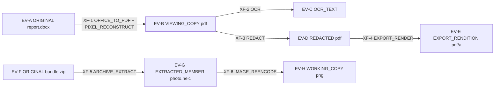

# 10 — File & Evidence Pipeline
Status: Draft v1.1 (revision round 2: ADR-034..ADR-046) · Edition applicability: both (CE and EE identical protections; EE adds L2/L3 fleet tooling only) · Owner: Evidence & Containment team

## 1. Purpose and scope

Defines how submitted files travel from source to investigator and out again as exports, while preserving evidentiary integrity and protecting (a) the source from identification through file content and metadata, and (b) investigators from hostile files. Implements ADR-012 (evidence never parsed on servers; ORIGINAL + SANITIZED derivative) and ADR-027 (single safe-path/archive API).

In scope: evidence object model and IDs, hashing, immutability, derivation graph, transformation records, containment levels L0–L4, the sanitization pipeline and tools, per-format handling, MIME/polyglot handling, resource limits, hostile-content assumptions, watermark/steganography/printer-dot limits, source-side scrubbing in the Tier V app, export rules, and usability/security trade-offs.

Out of scope: file encryption format (see `04-CRYPTOGRAPHY.md`: age-style STREAM, 64 KiB chunks), padding (ADR-011), upload transport (`06-SYSTEM-ARCHITECTURE.md`, `11-FRONTEND-SOURCE.md`), case-level custody workflow (see `14-CASE-MANAGEMENT.md` §10), deletion (see `35-DATA-RETENTION-DELETION.md`).

**Protection statement.**
- WHAT: investigator endpoints (C-15/C-16) and case keys, and the source's identity as carried in file metadata.
- FROM WHOM: a hostile uploader, including the organization under investigation submitting a weaponized or beaconing file; an adversary who later sees exported material.
- ASSUMPTIONS (`40-SECURITY-ASSUMPTIONS.md`): ASM-015 (hypervisor/sandbox isolation), ASM-020 (evidence containment; checked by K-10), ASM-019 (recipient workstation integrity while unlocked), ASM-021 (recipients follow handling procedures), ASM-011 (content not uniquely identifying beyond what the source accepts); sandbox images current (≤30 days, FILE-017). Protections: 40 P-15, P-16.
- RESIDUAL RISK: sandbox escapes (hypervisor/gVisor bugs), content-level fingerprints (canary traps, stylometry, visible watermarks) that no tool removes, and humans photographing screens.

## 2. Context and dependencies

| Depends on | For |
|---|---|
| `DECISIONS.md` ADR-004, 007, 008, 010, 011, 012, 018, 025, 027 | binding decisions |
| `DECISIONS.md` revision ADRs | ADR-034 (Tier W attachment staging under a per-session RAM key; final seal at Submit), ADR-038 (import slots; padded Tier W uploads; day/week display), ADR-042 (Desk platform tiers; hostile-string rendering; "rendering — not evidence"; OCR text layer), ADR-043 (independent-custody devices), ADR-045 (independent approver principle), ADR-046 §4 (upload protocol canonical in 08; per-file cap 4 GiB standard, 16 GiB EE) |
| `04-CRYPTOGRAPHY.md` | STREAM format, per-object DEKs, case-key wrapping, signatures |
| `06-SYSTEM-ARCHITECTURE.md` | zone model Z-VIEW, C-15/C-17/C-18 placement |
| `11-FRONTEND-SOURCE.md` | source upload UX, Tier V scrubbing UI (§11 here specifies behaviour) |
| `12-FRONTEND-RECIPIENT.md` | Desk viewer UI, export dialogs |
| `14-CASE-MANAGEMENT.md` | custody log, case states, dual approvals |
| `15-AUTHENTICATION-AUTHORIZATION.md` | dual-control operations (original export), step-up auth |
| `20-LOGGING-AUDITING.md` | CASE-class evidence events (no filenames/hashes) |
| `28-SUPPLY-CHAIN.md`, `33-RELEASE-UPDATE-SECURITY.md` | sandbox image build/signing/update |
| `29-SECURITY-TESTING.md` | malicious-file corpus, malicious-server harness |
| `35-DATA-RETENTION-DELETION.md` | crypto-erasure of evidence objects |

## 3. Core principle: ORIGINAL EVIDENCE vs SANITIZED WORKING COPY

| Property | ORIGINAL EVIDENCE | SANITIZED WORKING COPY (and other derivatives) |
|---|---|---|
| Created by | Import of a source attachment (C-15 import of an envelope) | A recorded transformation in C-17 (or C-18) |
| Bytes | Exactly as received after decryption; never modified | New bytes; new object |
| Integrity | SHA-256 + BLAKE3 of plaintext, recorded at import inside the encrypted case record, cross-checked with source manifest hash | Hashes of output recorded in the transformation record |
| Parents | none | `derived_from` ≥1 evidence IDs |
| Who may open | Only inside L1+ containment; native-format interactive opening only L2+ | L1 pixel viewer by default; working copy is the default view |
| Export | Dual approval (AUTHZ; `15-AUTHENTICATION-AUTHORIZATION.md`), step-up auth, custody entry | Single approver with Publication Safety Review (§13) |
| Deletion | Crypto-erasure only via case retention/disposal (35) or dual-approved irrelevant-data purge (EU Art 17) | May be deleted by case lead; recreatable from original |

Rule: nothing ever overwrites an evidence object. "Edit", "redact", "OCR", "extract" and "convert" each produce a new DERIVED object.

## 4. Evidence object model

### 4.1 Identifiers

| ID | Format | Scope | Notes |
|---|---|---|---|
| `evid_id` | `EV-` + 26-char Crockford base32 of 128 random bits (e.g., `EV-01J9Z3...`) | per tenant, unique | Random; never derived from content, filename or time. Shown to staff. |
| `xform_id` | `XF-` + 128 random bits base32 | per tenant | Transformation record |
| `blob_ref` | 256-bit random, hex | C-13 object name | Content-addressing by *ciphertext* is forbidden (would allow confirmation via plaintext hash); names are random (ADR-027: never source-provided). |
| `custody_seq` | u64 per evidence object | inside encrypted case record | Custody log sequence (14 §10) |

`evid_id` is stored in C-12 in cleartext (needed for authorization and linking). Hashes, declared names, declared MIME types, detected types, sizes and transformation parameters are stored ONLY inside the encrypted case record (case key, `04-CRYPTOGRAPHY.md`). Rationale: a plaintext hash in a server database lets anyone holding the document (e.g., the reported-on organization) confirm that it was submitted (confirmation attack; THR-010, THR-015).

### 4.2 Evidence record (encrypted case-record payload, canonical CBOR, signed)

| Field | Type | Notes |
|---|---|---|
| `evid_id` | string | |
| `case_id` | string | pseudonymous case ID (14) |
| `kind` | enum ORIGINAL, DERIVED | |
| `role` | enum ORIGINAL, VIEWING_COPY, WORKING_COPY, REDACTED, OCR_TEXT, EXTRACTED_MEMBER, TRANSCRIPT, EXPORT_RENDITION, ANALYST_NOTE_ATTACHMENT | |
| `sha256` | 32 bytes | plaintext hash |
| `blake3` | 32 bytes | plaintext hash (BLAKE3-256) |
| `size_bytes` | u64 | exact plaintext size (encrypted; stored size is padded per ADR-011) |
| `declared_name` | UTF-8 string ≤ 1024 bytes | source-supplied, **display only**, rendered escaped, never used as a path (ADR-027) |
| `declared_mime` | string ≤ 255 | source-supplied, advisory |
| `detected_type` | enum (§8) + `confidence` | from Stage 0 |
| `flags` | set: POLYGLOT, TYPE_MISMATCH, ENCRYPTED_CONTAINER, ACTIVE_CONTENT, EXTERNAL_REFS, OVERSIZE, LIMIT_HIT, PARSE_ERROR, SUSPECT_EXPLOIT | from Stage 0/1 |
| `external_refs` | list of ≤ 256 entries `{kind, value ≤ 2,048 bytes}` | hosts/URLs/UNC paths found by Stage 0/1 (§12 H3); display as inert plain text only; carried into Export Package manifests (§15 E9) |
| `source_manifest_hash` | 32 bytes or null | SHA-256 the source client/sealer computed before encryption (§5.2) |
| `manifest_match` | enum MATCH, MISMATCH, ABSENT | MISMATCH → case alert + evidence flagged `INTEGRITY_FAIL` |
| `received_day` | date (UTC) | The **import slot date** (ADR-038 §1, §3), not a source-action time; for follow-up attachments, only the slot date of that import. Displayed to staff at day granularity (standard) or ISO week (HIGH) (ADR-038 §3) |
| `import_batch` | u64 | import slot number (ADR-010, ADR-038 §1) |
| `derived_from` | list of `evid_id` | empty for ORIGINAL |
| `xform_id` | string or null | null for ORIGINAL |
| `object_key_wrap` | bytes | per-object DEK wrapped under case key |
| `blob_ref` | hex | |
| `min_containment` | L1..L4 | minimum level to open (§6); raised by flags |
| `created_by` | staff user ID | importer or transformer |
| `sig` | Ed25519 | by `created_by`'s Desk identity key over all above |

### 4.3 Transformation record

| Field | Notes |
|---|---|
| `xform_id`, `case_id` | |
| `inputs[]` | `evid_id` + input `sha256` (binds the exact input bytes) |
| `outputs[]` | `evid_id` + output `sha256` + `blake3` |
| `operation` | enum: STAGE0_INGEST, PIXEL_RECONSTRUCT, OCR, METADATA_STRIP, PDF_NORMALIZE, IMAGE_REENCODE, AV_TRANSCODE, OFFICE_TO_PDF, ARCHIVE_EXTRACT, EMAIL_SPLIT, TEXT_NORMALIZE, REDACT, DEDA_ANONYMIZE, CROP, EXPORT_RENDER |
| `tool_chain[]` | per stage: tool name, version, sandbox image digest (sha256 of OCI/rootfs image), TUF target name |
| `params` | canonical CBOR of all options (e.g., DPI, OCR language, mat2 mode, codec) |
| `containment` | L1..L4 + substrate (FIRECRACKER, QUBES_DISPVM, HYPERV_ISOLATED, APPLE_VZ, AIRGAP, SACRIFICIAL) + Desk platform tier (§6.1) |
| `converter_release_digest` | SHA-256 of the signed sandbox image (TUF target) that produced any pixel rendering (ADR-042) |
| `output_hashes` | SHA-256 of every output (rendering, OCR text layer), recorded at production time (ADR-042) |
| `render_check` | for pixel renderings: `SINGLE` or `DUAL_MATCH` / `DUAL_MISMATCH{pages}` (§5.4) |
| `limits_applied` | the limit profile ID and any limit hit |
| `warnings[]` | enumerated codes (e.g., `TEXT_LAYER_LOST`, `HYPERLINKS_LOST`, `DOTS_DETECTED`, `WATERMARK_NOT_REMOVED`) |
| `operator` | staff user ID |
| `ts` | exact UTC timestamp (staff action; ADR-010 permits) |
| `sig` | operator's Desk identity key |

### 4.4 Derivation graph



Invariants (enforced by C-15 on write and by `candorctl evidence verify`):
1. The graph is a DAG; ORIGINAL nodes have in-degree 0; every DERIVED node has exactly one producing `xform_id`.
2. Every `inputs[].sha256` equals the recorded hash of that input.
3. EXTRACTED_MEMBER objects are treated like originals for containment purposes (their bytes are source-controlled) but carry `derived_from` to preserve provenance.
4. Deleting a node deletes (crypto-erases) all descendants unless the descendant is an EXPORT_RENDITION already recorded as exported (custody retains the export record, not the bytes).

## 5. Pipeline overview

### 5.1 End-to-end flow

```mermaid
sequenceDiagram
  participant S as Source (C-02/C-03)
  participant I as Intake (C-06/C-07/C-08)
  participant R as Relay (C-09) / Case Blob (C-13)
  participant D as Candor Desk (C-15)
  participant V0 as Stage0 disposable (C-17)
  participant V1 as Convert disposable (C-17)
  participant V2 as Reconstruct disposable (C-17)
  S->>S: Tier V: optional scrub (§11), compute SHA-256, encrypt STREAM
  S->>I: Tier V: padded ciphertext + sealed manifest. Tier W: plaintext upload stream (no-JS)
  Note over I: Tier W: C-07 hashes, pads (ADR-011), encrypts under per-part DEK wrapped by the per-session RAM key, stages on tmpfs; final HPKE seal only at Submit (ADR-034). Never parses.
  I->>R: pulled by C-09 at the fixed import slot (ADR-009, ADR-038 §1)
  D->>R: fetch ciphertext
  D->>D: unwrap per-object DEK (never plaintext to disk)
  D->>V0: ciphertext + object DEK only (vsock)
  V0->>V0: decrypt, hash SHA-256+BLAKE3, magic sniff, limits pre-check
  V0-->>D: hashes, detected_type, flags (fixed schema)
  D->>D: record ORIGINAL (signed), compare manifest hash
  D->>V1: ciphertext + DEK (fresh VM)
  V1->>V1: convert to PDF (if needed) then rasterize to RGB pixels
  V1-->>V2: raw pixel frames only (bounded, framed)
  V2->>V2: rebuild PDF from pixels, OCR inside the sandbox (text layer + accessible text rendition)
  V2-->>D: sanitized PDF with OCR text layer, accessible text rendition, output hashes
  D->>D: schema-validate + length-bound results, encrypt with new DEK, record DERIVED + XF record (converter release digest, output hashes)
```

### 5.2 Source manifest hash

- Tier V (C-03): client computes SHA-256 of each attachment plaintext (after optional scrubbing) and includes it in the manifest signed with the source Ed25519 key (ADR-005) inside the ciphertext.
- Tier W: C-07 computes SHA-256 while streaming the upload into the sealer, in RAM, keeps it in the RAM session record until Submit, and seals it inside the envelope. It never persists or logs it (ADR-034).
- The Stage 0 hash is compared with the manifest hash. MISMATCH indicates corruption or tampering between sealing and import (THR-037).

### 5.3 Stages

| Stage | Where | Input | Output crossing boundary | Destroyed after |
|---|---|---|---|---|
| 0 Ingest | fresh L1 VM, image `candor-stage0` (no format parsers except magic-byte tables and our Rust container walker) | ciphertext + one DEK | fixed-schema CBOR: hashes, size, detected_type, flags, limit results (max 64 KiB) | each object |
| 1 Convert | fresh L1 VM (or L2), image `candor-convert` (LibreOffice headless, poppler/mupdf, libheif, ffmpeg, mat2, qpdf, Ghostscript only if needed) | ciphertext + DEK | raw pixel frames (RGB8, header: page no, width, height) or decoded PCM/YUV for AV | each object |
| 2 Reconstruct | fresh L1 VM, image `candor-rebuild` (Rust-only PDF writer `candor-pdfgen`, image encoders, Tesseract OCR) | pixel frames only | PDF/A-2b **with an invisible OCR text layer** (ADR-042), PNG, FLAC/Opus, AV1/VP9 WebM; an **accessible text rendition** (UTF-8, reading order, headings/lists/tables inferred from layout, page markers) as a separate OCR_TEXT object; SHA-256 of each output | each job |
| 3 Structural sanitize (optional) | fresh L1 VM, `candor-convert` | original | qpdf-normalized PDF, mat2-cleaned file (kept as WORKING_COPY with `ACTIVE_CONTENT` re-check) | each object |
| 4 Redact | Desk UI over pixel viewer; burn-in performed in Stage 2 VM | viewing copy + redaction boxes | new rasterized PDF + verifier report | each job |

**Stage 2 output validation by the Desk (ADR-042; RVW-A-15 item 4).** Every result crossing from C-17 to C-15 (Stage 0 CBOR, metadata report, OCR text, accessible text rendition, `external_refs`, warnings) is validated against a fixed schema with per-field length bounds (e.g., each string ≤ 2,048 bytes, OCR text ≤ 4 MiB per page-set, ≤ 256 `external_refs`), rejected as a whole on violation (`PARSE_ERROR`, no partial display), and handed to the Desk UI only as plain-text data for text-node rendering (`12-FRONTEND-RECIPIENT.md` §7 SI-17). Nothing from C-17 is ever interpreted as HTML, Markdown, a path or a command.

### 5.4 Rendering integrity (ADR-042; RVW-A-30)

- Every pixel rendering and its OCR layer are **renderings, not evidence**. Their evidence records carry the label `RENDERING_NOT_EVIDENCE`, and every Desk surface that shows them displays "Rendering — not evidence. Verify details against the original before relying on them." (`12` §6).
- The transformation record binds `converter_release_digest` (signed sandbox image) and `output_hashes`, so a rendering can later be reproduced from the ORIGINAL with the same release and compared byte-for-byte where the toolchain is deterministic, or perceptually otherwise.
- **Dual-render check** (`evidence.dual_render`; default ON in the HIGH profile, OFF otherwise, SAFE): Stage 1 is run twice in separate fresh VMs with independent rasterizers (poppler and MuPDF for PDF; LibreOffice→PDF then each rasterizer for Office), and a per-page perceptual hash (pHash, Hamming distance threshold 10/64) is compared. Mismatching pages are flagged `DUAL_MISMATCH` and shown with a warning; the investigator is directed to CL-3 for those pages.
- Residual: a common-mode bug in both renderers, or a malicious original that renders differently by design in all engines, is not detected.

Frame limits at Stage 1→2 boundary: width and height each ≤ 12,000 px; ≤ 100 megapixels per frame; ≤ 5,000 frames per job; total ≤ 16 GiB; any violation aborts the job with `LIMIT_HIT`. The Stage 2 parser for frames is a fixed-header reader of ≤ 200 lines of Rust, fuzzed in CI.

## 6. Containment levels

| Level | Name | Substrate | Network | Persistence | Clipboard | Drag-and-drop | USB / removable | Printer | Audio / camera | GPU | Typical use |
|---|---|---|---|---|---|---|---|---|---|---|---|
| L0 | Metadata-only view | Candor Desk (C-15) process | n/a | n/a | copy of `evid_id` only | disabled | n/a | disabled | n/a | n/a | Listing, triage: shows Stage 0 results and escaped declared name; no preview, no thumbnail |
| L1 | Disposable microVM | Firecracker microVM (KVM) on the recipient host; gVisor `runsc` with `--network=none` where KVM unavailable (reduced isolation, flagged) | no NIC device; gVisor: none | read-only signed rootfs + tmpfs (≤ 8 GiB); no swap; destroyed after job | none (no channel exists) | none | none (no device passthrough) | none | none | none (software rendering) | Stage 0/1/2; pixel viewing of any file; default for all formats |
| L2 | Qubes DispVM | Qubes OS 4.3 disposable from `candor-viewer-dvm` template, `netvm=''`, `default_dispvm ''` | none | none after close | Qubes global clipboard **disabled by qrexec policy** for viewer qubes (deny `qubes.ClipboardPaste` to and from) | disabled | denied (`sys-usb` policy deny) | denied | denied | none | Interactive native-format viewing of originals (LibreOffice, media players), investigator exploration |
| L3 | Air-gapped station (C-18) | dedicated machine, radios physically removed, booted from signed read-only Candor viewing image (amnesic) | physically absent | RAM-only; encrypted transfer medium | local only | local only | only the designated LUKS transfer medium, write-once where possible | local printer allowed ONLY for sanitized renditions; forbidden for originals | disabled in firmware where possible | allowed | Highest-risk originals; operations where a hypervisor escape is in the threat model |
| L4 | Sacrificial hardware | low-cost machine used for one matter then wiped/destroyed; never reconnected to any network or case system | absent | n/a | n/a | n/a | inbound one-way only; no media returns | forbidden | disabled | allowed | Files suspected of targeted exploits (flag `SUSPECT_EXPLOIT`), firmware/driver-exploit suspicion, unknown executables; output leaves only as retyped notes or photographs subsequently treated as new evidence (L1 sanitize) |

Additional L1 controls: vCPU 2, RAM 4 GiB (configurable 1–16 GiB), wall-clock limit 10 min per object (configurable ≤ 60 min), seccomp + no `ptrace`, jailer UID per VM, virtio-vsock with a framed length-prefixed protocol (max frame 64 MiB), no virtio-fs shared directories, no serial console in production, kernel `panic=1`. Host side: VM images verified against TUF target hash before each launch; refuses to launch if image age > 30 days (warns at 14 days).

Minimum containment by default: ORIGINAL objects of every type: L1 (pixels only) for viewing; L2 to open natively. Flags raise minima: `SUSPECT_EXPLOIT` → L3 (recommend L4); `ACTIVE_CONTENT` or `EXTERNAL_REFS` → native opening only at L2+ with network absent; `ENCRYPTED_CONTAINER` → L2+ (password entry inside sandbox only).

Desk side: Desk (C-15) itself never links format parsers. Its "safe viewer" renders only raw RGBA frames produced by an L1 VM (bounded as §5.3). Desk requests OS screen-capture protection for viewer windows where the OS provides it (e.g., display-affinity/sharing flags); this reduces casual capture only.

## 7. Sanitization tools and invariants

| Tool | Use | Where | Version / patch policy | Known limits |
|---|---|---|---|---|
| Dangerzone-style pixel CDR (our Stage 1/2) | Default VIEWING_COPY for documents and images | L1 | Follows Dangerzone design (container+gVisor, pixels crossed out-of-sandbox); we may embed Dangerzone's container image where license and interface allow, pinned by digest | Loses text layer (OCR restores approximately), hyperlinks, vector fidelity; does not remove visible watermarks or printer dots (B-CR-44) |
| mat2 ≥ 0.15.0 | Structural metadata removal for WORKING_COPY when fidelity is needed | L1 only (mat2 0.14.0 removed its bubblewrap sandbox; never run on Desk host) | pinned; image rebuilt on each release | Does not handle steganography, watermarks, non-standard metadata; "no metadata shown ≠ clean" (B-CR-53) |
| qpdf / pikepdf | PDF normalization: drop incremental updates, `/Info`, XMP, `/JavaScript`, `/OpenAction`, `/AA`, `/Launch`, `/EmbeddedFiles`, AcroForm/XFA, `/URI` actions; linearize | L1 | pinned | Structural; hostile parser input |
| LibreOffice headless | Office/ODF/RTF → PDF | L1 (macros disabled: `MacroSecurityLevel=3`, no Java, `--norestore`, no network by construction) | patched ≤ 14 days after upstream security release | Historical macro/link CVEs (B-CR-56 list, descriptions UNVERIFIED) |
| poppler / MuPDF | PDF rasterization | L1 | pinned | Parser exploits assumed |
| Ghostscript | Only for PostScript/EPS inputs | L1 | pinned; disabled by default for PDF | Repeated SAFER bypasses: CVE-2023-36664, CVE-2023-43115, CVE-2024-29510 (B-CR-56) |
| libheif / libavif / libjxl / libwebp / libjpeg-turbo / libpng / libtiff | Image decode to pixels | L1 | pinned | Decoder CVEs assumed |
| FFmpeg (decode only, restricted demuxers/decoders allow-list) | AV decode to raw PCM/YUV; re-encode in Stage 2 | L1 | pinned; GStreamer not used (Dangerzone advisory 2024-12-24) | Codec exploits assumed |
| Tesseract | OCR on pixels | L1 Stage 2 | pinned | OCR errors; language packs |
| DEDA | Detect/anonymize yellow tracking dots in colour scans | L1 | pinned | Requires lossless ≥300 dpi; monochrome/inkjet may have none (B-CR-54) |
| ExifTool | NOT used on originals by default (CVE-2021-22204 history); allowed in L1 for analyst forensic metadata listing only | L1 | pinned ≥ 12.24 | Perl parser surface |

Invariants:
1. No sanitizer or parser runs outside C-17/C-18 (enforced by packaging: Desk and server packages have no dependency on these libraries; CI dependency check).
2. Every tool invocation is a transformation record.
3. Output of structural sanitizers (mat2, qpdf) is re-scanned by Stage 0 and remains subject to L1-only viewing (structural output still contains complex format data); only pixel-reconstructed outputs are marked `SAFE_RENDER=true`.
4. Sandbox image updates are delivered via the Candor TUF repository (ADR-022) with the same threshold signing as trust-path code (`33-RELEASE-UPDATE-SECURITY.md`).

## 8. Per-format handling

Legend: "Pixel" = Stage 1→2 pixel reconstruction; "Struct" = structural sanitize (Stage 3).

| Format (detected) | Principal risks | Default VIEWING_COPY | Optional WORKING_COPY | Metadata of concern (source-identifying) | Native open min. | Export default |
|---|---|---|---|---|---|---|
| PDF | JS, `/OpenAction`, `/Launch`, embedded files, XFA, font/JBIG2/image-codec exploits, incremental updates (hidden prior versions), overlay "redactions" (INC-19), `/URI` beacons | Pixel PDF/A-2b + OCR | Struct: qpdf normalize + mat2 | `/Info` Author/Creator/Producer, XMP, incremental revisions, form field values, annotations, embedded thumbnails, document IDs | L2 | Pixel PDF |
| Office OOXML (docx/xlsx/pptx/docm/xlsm) | VBA macros, DDE, OLE embeds, ActiveX, external templates (`attachedTemplate` remote), external links/images (beacons, UNC→NTLM leak), custom XML | LibreOffice→PDF→Pixel | Struct: mat2 (removes docProps, comments, rsids best-effort) | `docProps/core.xml` creator/lastModifiedBy, `app.xml` company/template, rsids, tracked changes, comments, hidden text, custom XML, printer settings, embedded image EXIF (B-SD-23: MAT missed embedded EXIF) | L2 | Pixel PDF |
| ODF (odt/ods/odp) | Basic macros, embedded objects, external links | LibreOffice→PDF→Pixel | Struct: mat2 | `meta.xml` initial-creator, editing-duration, generator, change tracking | L2 | Pixel PDF |
| Legacy binary Office (doc/xls/ppt), RTF | OLE2 parser exploits, macros, equation-editor-class exploits, RTF object embedding | LibreOffice→PDF→Pixel | none (structural cleaning unreliable) | SummaryInformation (author, last saved by, revision count, template path — cf. INC-18), fast-save residue, deleted text (INC-17) | L2 (L3 if `SUSPECT_EXPLOIT`) | Pixel PDF |
| Images JPEG/PNG/GIF/WebP/TIFF/BMP | Decoder exploits, decompression bombs, ImageTragick-class delegates (not used), polyglots | Decode→pixels→PNG re-encode (EXIF-free) | Struct: mat2 | EXIF (GPS, camera serial, owner, MakerNote), XMP, IPTC, embedded thumbnails (may show uncropped original), ICC profile device info (INC-20) | L2 | PNG re-encoded |
| HEIC/HEIF, AVIF, JPEG XL | Newer decoders (libheif/libavif/libjxl) with smaller audit history; multi-image containers; depth maps | libheif/libavif/libjxl decode → PNG | none | Same as above plus Apple-specific MakerNotes, depth/aux images, Live Photo pairing IDs | L2 | PNG |
| SVG | Script, external refs, XXE | Rasterize via resvg (no script, no external fetch) → PNG | none | `<metadata>`, editor namespaces (Inkscape paths with usernames) | L2 | PNG |
| Audio (mp3, m4a/aac, wav, ogg/opus, flac, amr) | Codec/demuxer exploits | FFmpeg decode → FLAC (archival) + Opus (listening); tags dropped (`-map_metadata -1`) | Transcript (manual or local STT, EE) | ID3/iTunes tags, encoder, device model, GPS in m4a, recording timestamps; **voice itself is biometric** | L2 | Opus/FLAC; voice-distortion option for publication only (warn: best-effort, cf. GlobaLeaks vocoder caveats B-GL-04) |
| Video (mp4/mov/m4v, mkv, webm, avi, 3gp) | Demuxer/codec exploits (GStreamer CVEs B-CR-44 class), subtitle/attachment streams (fonts), huge frame counts | FFmpeg decode → re-encode AV1/VP9 WebM + Opus; drop subtitle, data and attachment streams; optional keyframe contact sheet (pixels) | none | QuickTime `©xyz` GPS, `com.apple.quicktime.*` make/model/software, creation dates, encoder strings, camera serials | L2 | WebM re-encoded |
| Archives (zip, 7z, rar, tar, gz, bz2, xz, zst, iso) | Bombs (Fifield overlapping entries B-CR-52), path traversal (B-SD-28/33/35), symlinks (B-OS: CVE-2026-54706), encrypted archives, nested archives | ARCHIVE_EXTRACT in L1 via `candor-safefs` → each member = EXTRACTED_MEMBER, processed recursively (depth ≤ 3) | none | Archive comments, member timestamps (timezone), uid/gid/user names (tar), creator OS | L2 | Members exported individually as their renditions; archive itself only as ORIGINAL (dual approval) |
| Email .eml / .mbox | HTML body (scripts, remote images = beacons), MIME bombs, malformed headers, attachments | Render headers (selected: From/To/Cc/Date/Subject) + text/plain or sanitized HTML body → pixels; attachments → EXTRACTED_MEMBER | Headers text file | **Received: chain, Message-ID, X-Originating-IP, client User-Agent, DKIM signatures of the forwarder: may identify the source if the source forwarded from their own mailbox** | L2 | Pixel PDF (headers redaction step forced) |
| Outlook .msg (OLE2 CFB) | OLE parser exploits, RTF body, embedded objects | Convert in L1 (msg→eml with a pinned converter) then as .eml | as .eml | as .eml plus MAPI properties (sender SMTP, internet headers, conversation index) | L2 | Pixel PDF |
| Plain text / CSV / JSON / Markdown / source code | Terminal-escape and bidi/zero-width tricks, CSV formula injection, huge lines | TEXT_NORMALIZE: decode to UTF-8 (lossy with replacement marks), render to pixels with control chars visualized | Normalized UTF-8 text (C0/C1 controls escaped, bidi controls visualized); CSV exported with formula-prefix neutralization | Invisible Unicode fingerprints (zero-width, homoglyphs) (B-CR-44/D.2 list) | L1 | Pixel PDF or normalized text |
| HTML / MHTML / webarchive | Script, remote resources (beacons), CSS exfil, forms | Headless render in L1 with JS disabled and no network → pixels | none | Generator meta, comments, tracking pixels (URLs themselves can encode recipient IDs) | L2 | Pixel PDF |
| EPUB | HTML/JS, fonts | Pixel (via converter) | none | OPF metadata (creator, identifiers) | L2 | Pixel PDF |
| Executables/scripts (PE, ELF, Mach-O, .js/.vbs/.ps1/.sh, .lnk, .jar, APK) | Direct execution | none (L0 + text-hex listing in L1) | none | n/a | L4 only for dynamic analysis; L3 static | Never exported except as ORIGINAL with dual approval, inside an encrypted archive labelled MALWARE-SUSPECT |
| Unknown / unrecognized | Anything | L0; hex/strings listing rendered to pixels in L1 on request | none | unknown | L2 (L3 recommended) | ORIGINAL only (dual approval) |

## 9. Type detection, MIME verification and polyglots

1. Declared name, extension and MIME from the source are advisory display metadata. They never select a parser.
2. Stage 0 identifies the type by (a) magic bytes at offset 0, (b) scanning for secondary signatures (`%PDF-` within the first 1024 bytes, ZIP end-of-central-directory at end, `<html`, JPEG SOI/EOI, trailing data after format EOF), (c) a lightweight structural walk by our Rust container walker (ZIP central directory vs local headers, OLE2 FAT, ISO BMFF box tree, PDF xref presence) with strict limits.
3. Outcomes: `detected_type` = most specific consistent type; `TYPE_MISMATCH` if different from declared; `POLYGLOT` if ≥2 formats are structurally valid or significant trailing data (> 4 KiB or > 1% of size) exists after the primary format's end.
4. Polyglot policy: never opened natively below L2; Stage 1 processes it under each plausible interpretation separately (each yields its own VIEWING_COPY, labelled), because a parser differential may be the attack; flags are shown prominently in the Desk.
5. Encrypted containers (password-protected zip/7z/PDF/Office): flagged; password entered only inside the L2 disposable; the decrypted inner content becomes EXTRACTED_MEMBER objects; the password is never stored in the case record unless the investigator explicitly records it as a note.

## 10. Resource limits (decompression and parsing bombs)

Limit profile `LP-DEFAULT` (configurable per tenant within hard ceilings; each limit hit is a warning code and `LIMIT_HIT` flag):

| Limit | Default | Hard ceiling |
|---|---|---|
| Max ORIGINAL plaintext size per attachment (enforced client-side pre-encryption by C-03 and in C-07; chunk-count cap server-side) | 2 GiB | 16 GiB |
| Archive total uncompressed size | 4 GiB | 32 GiB |
| Archive compression ratio (per member and total) | 100:1 | 1000:1 |
| Archive member count | 10,000 | 100,000 |
| Archive nesting depth | 3 | 5 |
| Member path length / component count | 1024 bytes / 32 | same |
| Overlapping ZIP local headers, duplicate names after Unicode NFC normalization, symlinks, hardlinks, device files, absolute paths, `..` | reject member (flag) | not configurable |
| Image decoded pixels | 100 MP | 500 MP |
| Image dimension | 30,000 px | 65,535 px |
| PDF pages | 5,000 | 20,000 |
| Rasterization DPI | 150 (viewing), 300 (OCR/DEDA) | 600 |
| XML: external entities / DTD | disabled | not configurable |
| XML entity expansion depth / count | 0 / 0 | not configurable |
| AV duration processed | 4 h | 24 h |
| Email MIME nesting depth / parts | 10 / 1,000 | 20 / 10,000 |
| Wall-clock per object / per job | 10 min / 60 min | 60 min / 8 h |
| VM memory | 4 GiB | 16 GiB |

Limits are enforced inside the VM (tool flags and our wrappers) AND by the host (cgroups, VM memory, timers). A limit hit never falls back to a less-contained path.

## 11. Source-side metadata warning and Tier V scrubbing

Server components never parse attachments, so any source-side scrubbing happens on the source device.

| Client | Behaviour |
|---|---|
| Tier W (no-JS web, C-06) | Before the upload field: plain-language warning (see `11-FRONTEND-SOURCE.md` for copy) listing: photo GPS/device data, document author/company fields, tracked changes and comments, printer tracking dots on scans, unique copies (canary traps), and "the organization may log who accessed or printed a document" (INC-16). Links to the offline guidance page. No scrubbing is possible. |
| Tier V (C-03 Candor Source App) | Local "Check files" step before encryption. Images (JPEG/PNG/WebP/HEIC/AVIF): decode and re-encode pixels in memory with memory-safe Rust decoders, dropping all metadata; ON by default, shows a before/after list ("Removed: GPS location, camera serial, owner name"). PDF: remove `/Info`, XMP, incremental updates via a memory-safe rewrite; ON by default with list. OOXML/ODF: remove `docProps`/`meta.xml` personal fields, comments, tracked-change authorship; OFF by default, offered with a warning that removal is incomplete (embedded images, hidden text). Other formats: warning only. Source may keep the original instead (choice recorded in the manifest as `scrubbed=true/false`, no list of removed values is sent). All processing is local, no network, no temp files outside the app's encrypted scratch area (see `05-SOURCE-OPSEC.md`). |

Honest statement shown by Tier V: "Removing hidden information reduces risk but cannot remove everything, and cannot hide who had access to a document."

Rationale for scrubbing on the source side: REQ-H-17 and REQ-H-20 (INC-17, INC-20). Trade-off: scrubbed originals lose evidentiary metadata that investigators could use for authentication; the recipient-side ORIGINAL then is the scrubbed file, and the manifest records that.

## 12. Hostile uploader and parser-exploit assumptions

| Assumption | Consequence in design |
|---|---|
| H1. Any submitted file may be crafted by the reported-on organization or a third party to exploit investigators (THR-023), e.g., to plant malware or learn who investigates | No parser on servers or Desk; disposable per-object VMs; no network in any viewer |
| H2. Every parser in C-17 has exploitable bugs (history: ExifTool CVE-2021-22204, ImageTragick CVE-2016-3714, Ghostscript CVE-2023-36664/43115, CVE-2024-29510, GStreamer CVE-2024-47538/47607/47615 — B-CR-56) | Per-object fresh VM; the only thing crossing out of Stage 1 is bounded pixels; Stage 0 hashes computed before any complex parser runs |
| H3. A document may contain beacons (remote template, image URL, UNC path, DNS prefetch, `/URI`) that reveal *when and by whom* it was opened, alerting the organization under investigation | No NIC in L1/L2/L3; `EXTERNAL_REFS` flag lists the referenced hosts (rendered as inert text) as an investigative lead |
| H4. Sandbox escape is possible at low probability | L3/L4 for `SUSPECT_EXPLOIT`; host hardening per `17-INFRASTRUCTURE.md`; case keys never present in L1/L2 (only one object DEK) |
| H5. A compromised Stage 1 VM will try to exploit Stage 2 through the pixel channel | Fixed-header frame format, fuzzed; Stage 2 fresh VM; Stage 2 output re-verified by Desk for format conformance (our own PDF writer only emits a restricted subset; Desk validates the subset without full parsing) |
| H6. A compromised viewer will attempt lateral movement through shared services (cf. SDW sd-log, CVE-2025-24889, B-SD-34) | No shared logging from viewers; viewer emits only the fixed-schema result; the host identifies the VM by channel, never by self-claimed identity |
| H7. The server is malicious and supplies hostile names/paths (B-SD-33, B-SD-35) | ADR-027 `candor-safefs`; names are display-only |

## 13. Steganography, watermarks, canary traps and printer dots

No tool reliably removes content-level fingerprints (B-CR-53 threat model; B-CR-44 limits). The pipeline therefore provides detection aids and a mandatory review, not a guarantee.

| Vector | Pipeline action | Residual |
|---|---|---|
| Yellow printer tracking dots (MIC) in colour scans (INC-16) | DEDA detection on ≥300 dpi Stage 1 frames for image/PDF scans; if detected, warning `DOTS_DETECTED` and offered DEDA_ANONYMIZE or greyscale+threshold export rendition | Monochrome/inkjet, other printer marking schemes, low-res scans |
| Physical handling marks (postmarks, folds, stamps, routing slips) | Publication Safety Review checklist item; crop tool (new DERIVED object) | Human judgement |
| Canary traps (per-recipient wording/spacing/kerning variants) | Guidance: compare multiple copies if available; paraphrase; never publish verbatim; export renditions re-typeset where feasible | Cannot be detected from a single copy |
| Invisible Unicode (zero-width, homoglyphs, bidi) | TEXT_NORMALIZE output variant strips/normalizes; flag count shown | Semantic/spacing watermarks |
| Image micro-perturbation / steganography | Export re-encode + downscale option (≤ 2048 px long edge) + crop margins | Robust watermarks survive |
| Visible watermarks / Bates numbers / user IDs in headers/footers | Checklist item; redaction tool | Human miss |
| Stylometry (INC-73) | Paraphrase guidance; verbatim quote > 50 words requires reviewer sign-off (configurable) | Author style in any shared excerpt |
| Access logs at the source's organization (INC-16) | Cannot be addressed by the platform; warned to sources (§11) | Complete |

Publication Safety Review (PSR): a checklist record (signed by operator and reviewer) required before any export or third-party verification query: metadata check result, dots check, handling marks, watermark scan, verbatim text length, redaction verifier result, "is this sharing a disclosure?" (INC-16 lesson: a verification query to a third party IS a disclosure).

## 14. Redaction

- Redaction is always burn-in on a rasterized page (Stage 2 VM); overlays are not supported (INC-19).
- Redaction verifier (Stage 2 VM): for each redacted region's source text (captured from the OCR/text layer before redaction), check the output with text extraction, decompression of all streams, OCR of the output raster, and absence of incremental updates. Export is blocked until verifier = PASS (REQ-H-19).
- The redacted object is DERIVED with role REDACTED; the redaction boxes and strings are stored in the XF record (encrypted), enabling re-audit.

## 15. Export rules

Exports are the principal path by which evidence leaves the protected environment (THR-041, THR-029; ADR-018).

| Rule | Detail |
|---|---|
| E1 | Export always creates an Export Package: manifest (evid IDs, roles, SHA-256 of exported bytes, XF chain summary, PSR record ID), exported renditions, signature by exporter. Recorded in custody (14 §10) and CASE audit (`evidence.exported`, no filenames/hashes). |
| E2 | Default content: EXPORT_RENDITIONs derived from pixel-reconstructed copies. Native formats are blocked by default (REQ-H-18). |
| E3 | ORIGINAL export (incl. EXTRACTED_MEMBER originals) requires dual approval by two distinct case members with the EXPORT_ORIGINAL permission, neither COI-excluded, plus step-up WebAuthn by both, plus a recorded reason code (LEGAL_PROCEEDINGS, FORENSIC_EXAMINATION, REGULATOR_REFERRAL, EU_ART12_4_FORWARD, OTHER+text). |
| E4 | Destinations: (a) file encrypted to recipient public key(s) (age-compatible X-Wing recipients or organization export key), (b) LUKS2/VeraCrypt removable medium verified by a preflight in a dedicated export VM (L2) or the Desk export helper, (c) Integration Connector (C-40, EE) receiving only an Export Package. Cloud sync folders and unencrypted media are refused where detectable (removable medium not LUKS/VeraCrypt → refuse). |
| E5 | Printing: only EXPORT_RENDITIONs; printing is recorded as an export; printer dots of our own printer are a new identifier on the printout (warn). |
| E6 | Export Package filenames are generated (`candor-export-<pkg-id>/<n>.<ext>`), never source-supplied names (ADR-027); display names go into the manifest only if the exporter ticks "include original names" (warned: names may identify the source). |
| E7 | Referral under EU Art 12(4) ("forward promptly and without modification") uses ORIGINAL export with the reason code `EU_ART12_4_FORWARD`, carrying SHA-256/BLAKE3 in the manifest. |
| E8 | Any transfer of evidence to a third party for verification is an export and requires PSR (INC-16). |

## 16. Usability / security trade-off matrix

| Option | Security vs hostile file | Source-metadata protection | Evidentiary fidelity | Investigator usability | Hardware / ops cost | Default |
|---|---|---|---|---|---|---|
| L0 metadata only | Highest (no parsing) | n/a | none | very low | none | listing |
| L1 pixel viewing copy | High (per-object microVM, pixels only) | High for embedded metadata; not for visible content | Medium (text via OCR; no vectors/links/formulas) | Good (fast, in-Desk) | Requires KVM for Firecracker; gVisor fallback | **Yes** |
| L1 structural (mat2/qpdf) working copy | Medium (output still complex) | Medium (best-effort) | High (editable, searchable) | Good | same | on request |
| L2 Qubes DispVM native | High (Xen, GUI isolation) | none (original) | Full | Medium (Qubes learning curve, 16–32 GB RAM, B-SD-05) | Qubes-capable hardware | recommended for HIGH profile |
| L3 air-gapped station | Very high vs remote exfiltration; sneakernet risks (I-11 in R1: SVS air-gap accepted-risk) | none (original) | Full | Low (manual transfers) | Dedicated hardware + procedures | optional |
| L4 sacrificial | Very high for the organization's systems | none | Full, but output is manual | Very low | Consumable hardware | exceptional |
| Tier V source scrubbing | n/a | High for images/PDF; partial Office | Reduced (metadata lost) | Good for source | none | images/PDF ON |
| Native export of original | Low for downstream recipients | none | Full | High | none | blocked; dual approval |

## 17. Requirements

| ID | Requirement | Evidence | Threats | Component | Verification |
|---|---|---|---|---|---|
| FILE-001 | Server-side components (C-05..C-14, C-21..C-26) SHALL NOT decode, parse, preview, thumbnail, scan or otherwise interpret attachment plaintext; they SHALL handle attachments only as opaque ciphertext. | ADR-012; B-CR-44; R5 D.3 | THR-014; THR-023 | C-06; C-07; C-08; C-13 | INSP: dependency audit shows no format-parsing crates in server packages; TST: `server-no-parse` CI job fails build if any image/pdf/office/media crate is linked |
| FILE-002 | C-07 (Tier W) SHALL stream attachment plaintext directly into STREAM encryption without buffering to disk and SHALL compute only the SHA-256 manifest hash in RAM; no other content inspection is permitted. | ADR-004; ADR-012 | THR-014; THR-016 | C-07 | TST: sealer runs with read-only FS and `RLIMIT_CORE=0`; fs-audit (fanotify) shows zero writes during a 1 GiB upload; INSP: code review |
| FILE-003 | Candor Desk (C-15) SHALL NOT link or invoke any document, image or media parser; it SHALL display file content only as raw RGBA frames produced by a C-17 sandbox, bounded per §5.3. | ADR-012; B-SD-05; R1 §4 principle 7 | THR-023 | C-15 | TST: `desk-no-parser` dependency check in CI; fuzzing of frame decoder (≥ 24 h per release); ST (29): hostile-frame corpus |
| FILE-004 | Every attachment SHALL be imported as an immutable ORIGINAL evidence object with random `evid_id` (128-bit) whose SHA-256 and BLAKE3 plaintext hashes are recorded only inside the encrypted, signed case record. | ADR-012; B-CO-02 (Art 12); INC-16 | THR-037; THR-015 | C-15; C-17; C-12 | TST: import test asserts hashes present in decrypted record and absent from all C-12 plaintext columns and C-24 events (DB and log grep for hash hex) |
| FILE-005 | Plaintext hashes, declared filenames, declared MIME types and exact sizes SHALL NOT be stored in cleartext in any server database, blob name, log or metric. | ADR-016; INC-60 | THR-015; THR-016; THR-038 | C-12; C-13; C-24 | TST: canary filename and canary-content hash injected; grep across DB dump, blob listing, logs, backups = 0 hits |
| FILE-006 | Stage 0 hashing SHALL be performed in a fresh L1 VM before any complex format parser processes the object, and the result SHALL be compared with the source manifest hash; a mismatch SHALL flag the object `INTEGRITY_FAIL` and raise a case alert. | ADR-012; B-CR-44 | THR-037 | C-17; C-15 | TST: tampered-ciphertext and wrong-manifest fixtures produce MISMATCH; TST: hash computed before convert stage (trace ordering assertion) |
| FILE-007 | Evidence objects SHALL never be modified in place; every transformation SHALL create a new DERIVED object linked by `derived_from` and a signed transformation record containing tool versions, sandbox image digests, parameters, containment level, operator and timestamp. | ADR-012 | THR-037 | C-15; C-17 | TST: attempt to overwrite blob of an ORIGINAL is rejected by C-13 write-once policy and by Desk; `candorctl evidence verify` validates DAG invariants on fixture cases |
| FILE-008 | The derivation graph SHALL satisfy the invariants of §4.4 and `candorctl evidence verify` SHALL detect cycles, orphan DERIVED objects, input-hash mismatches and invalid signatures. | ADR-012 | THR-037 | C-15; C-19 | TST: mutation tests on a fixture graph (each invariant violated once) all detected |
| FILE-009 | L1 containment SHALL be a per-object disposable Firecracker microVM (or gVisor with `--network=none` where KVM is unavailable, flagged as reduced isolation) with no network device, no shared filesystem, no device passthrough, no clipboard channel, read-only verified rootfs, tmpfs ≤ 8 GiB, no swap, and destruction after each job. | B-CR-44; R5 D.2; ADR-012 | THR-023 | C-17 | TST: in-VM probe asserts no NIC, no /dev/sd*, no virtiofs mounts; host test asserts VM destroyed and tmpfs freed after job; ST (29): escape-attempt corpus |
| FILE-010 | L2 containment SHALL use Qubes DispVMs with `netvm` empty, `default_dispvm ''`, and qrexec policies denying clipboard paste, file copy and USB attach to and from viewer qubes. | B-SD-05; B-CR-44 (Qubes advisory 2023-10-25) | THR-023; THR-041 | C-17 | TST: Salt/qrexec policy conformance test on a reference Qubes install; INSP: policy file review |
| FILE-011 | L3 stations SHALL have wireless hardware physically removed, boot a signed amnesic Candor viewing image, accept only LUKS2/VeraCrypt transfer media, and forbid printing of ORIGINAL objects. | R1 1.1 (SVS); B-SD-04 | THR-023; THR-041 | C-18 | DEMO: commissioning checklist with photos; TST: viewing image refuses non-LUKS media and refuses print of objects with role ORIGINAL |
| FILE-012 | Objects flagged `SUSPECT_EXPLOIT` SHALL have minimum containment L3, and the Desk SHALL recommend L4; the Desk SHALL refuse to open them at L1 native or L2. | R5 D.1; I-11 (R1) | THR-023 | C-15 | TST: flag set on fixture; open attempts at L1-native/L2 refused |
| FILE-013 | The VIEWING_COPY default for documents and images SHALL be produced by pixel reconstruction: conversion and rasterization in one fresh VM, reconstruction from raw pixel frames only in a second fresh VM. | B-CR-44; ADR-012; R1 §5 item 6 | THR-023; THR-009 | C-17 | TST: corpus with JS, embedded files, OpenAction, macros, external refs: output PDF contains none (qpdf --qdf + grep); ST (29): Stage1-to-Stage2 hostile frame fuzz |
| FILE-014 | The pixel frame channel SHALL enforce: width and height ≤ 12,000 px, ≤ 100 MP per frame, ≤ 5,000 frames, ≤ 16 GiB per job, fixed header format; any violation SHALL abort the job without fallback. | B-CR-52; R5 D.1 | THR-023; THR-032 | C-17 | TST: boundary tests at limit and limit+1; fuzzing of header parser in CI |
| FILE-015 | mat2 SHALL run only inside an L1 VM and never on a host with keys; releases prior to 0.15.0 SHALL NOT be shipped. | B-CR-53 (0.14.0 removed sandbox) | THR-023 | C-17 | INSP: SBOM of `candor-convert` image; TST: packaging check that no mat2 binary exists in C-15/C-16 packages |
| FILE-016 | Ghostscript SHALL be disabled for PDF processing and used only for PostScript/EPS inputs inside L1. | B-CR-56 (CVE-2023-36664, CVE-2023-43115, CVE-2024-29510) | THR-023 | C-17 | TST: PDF pipeline trace shows no gs invocation; INSP: image config |
| FILE-017 | Sandbox images SHALL be distributed via the Candor TUF repository with the same threshold signing as trust-path code, verified before every VM launch; the host SHALL warn at image age 14 days and refuse to launch at 30 days unless an administrator records a dual-approved temporary waiver (≤ 7 days). | ADR-022; B-CR-44 (independent container updates) | THR-024; THR-025; THR-023 | C-17; C-32 | TST: unsigned/modified image refused; clock-advanced test triggers warn/refuse; waiver requires two approvers |
| FILE-018 | Type detection SHALL NOT rely on declared extension or MIME; Stage 0 SHALL compute `detected_type`, `TYPE_MISMATCH` and `POLYGLOT` flags per §9, and polyglots SHALL be processed under each plausible interpretation separately and never opened natively below L2. | R5 D.1 item 3 | THR-023 | C-17; C-15 | TST: polyglot corpus (PDF+ZIP, JPEG+ZIP, PDF+HTML, GIFAR-style) all flagged; separate viewing copies produced |
| FILE-019 | Archive extraction SHALL occur only in L1 through `candor-safefs`, enforce §10 limits, reject overlapping ZIP local headers, symlinks, hardlinks, device files, absolute and parent-relative paths and post-NFC duplicate names, and store members under generated names. | ADR-027; B-CR-52; B-SD-28; B-SD-33; B-SD-35; B-OS-01..04 | THR-023; THR-032 | C-17 | TST: Fifield overlapping zip bomb, 42.zip-style nested bomb, traversal/symlink/abs-path fixtures all rejected; inotify audit shows no write outside VM scratch; ST (29): malicious-archive suite |
| FILE-020 | All §10 limits SHALL be enforced both inside the VM (tool flags/wrappers) and by the host (cgroup memory, VM memory, wall-clock timers), and a limit hit SHALL set `LIMIT_HIT` without falling back to a less-contained path. | B-CR-52 | THR-032; THR-023 | C-17 | TST: decompression-bomb, pixel-bomb (e.g., 65535×65535 PNG), billion-laughs XML and endless-AV fixtures terminate within limit + 10% and set flag |
| FILE-021 | No containment level L1–L3 SHALL provide any network path; `EXTERNAL_REFS` SHALL be detected and the referenced URLs/hosts listed as inert text to investigators. | R5 D.1; INC-16 lesson | THR-023; THR-020 | C-17; C-18 | TST: beacon corpus (remote template, remote image, UNC path, `/URI` auto-action, HTML img) produces zero packets on a host-side capture; flags present |
| FILE-022 | C-17 SHALL expose to C-15 only fixed-schema results (Stage 0 CBOR ≤ 64 KiB) and outputs of Stage 2; the host SHALL identify each VM by its transport channel, never by VM-supplied identity. | B-SD-34 (CVE-2025-24889) | THR-023 | C-17; C-15 | TST: VM claiming another VM's ID in its payload is ignored; schema-violation fuzzing of Stage 0 result |
| FILE-023 | Case keys SHALL NOT be present in any C-17 VM; a VM SHALL receive only the single per-object DEK needed for its job. | ADR-007; ADR-008 | THR-013; THR-023 | C-15; C-17 | TST: memory scan of VM (test build) finds no case key; INSP: protocol review |
| FILE-024 | Per-format processing SHALL follow §8; each format class in §8 SHALL have a regression corpus with metadata canaries, and after sanitization a search for all canaries SHALL return zero hits. | REQ-H-17; INC-17; INC-18; INC-20; B-SD-23 | THR-009 | C-17 | TST: `sanitize-canary` corpus (Office, ODF, legacy, PDF incremental, JPEG/HEIC/PNG EXIF/XMP, MP4 GPS, M4A tags, EML headers, embedded-image EXIF inside DOCX) = 0 canary hits in VIEWING_COPY |
| FILE-025 | For email evidence, the Desk SHALL warn that headers may identify the source when the source forwarded from their own mailbox, and export renditions SHALL require an explicit header-redaction step. | R5 D.1 item 4; INC-24 lesson | THR-009; THR-019 | C-15; C-17 | TST: export of `.eml` evidence without header-redaction record is refused; DEMO: warning text review |
| FILE-026 | Redaction SHALL be burn-in on rasterized pages; export of a REDACTED object SHALL be blocked until the redaction verifier (text extraction, stream decompression, OCR, incremental-update scan) reports zero recoverable redacted strings. | INC-19; REQ-H-19; B-CR-44 | THR-009; THR-019 | C-17; C-15 | TST: canary redaction corpus incl. annotations, overlays, form fields: verifier PASS only when 0 hits; bypass attempt blocked |
| FILE-027 | Colour scans (image or PDF with raster content ≥ 300 dpi equivalent) SHALL be analysed with DEDA in L1; detected dots SHALL produce `DOTS_DETECTED` and block export until an anonymized or greyscale-thresholded rendition is selected or a reviewer overrides with a recorded reason. | INC-16; REQ-H-16; B-CR-54 | THR-010 | C-17; C-15 | TST: synthetic dot-pattern scans detected; export blocked without rendition or override record |
| FILE-028 | Every export and every third-party verification sharing SHALL require a Publication Safety Review record signed by the operator and a second reviewer, covering the §13 checklist. | INC-16; INC-24; REQ-H-24 | THR-010; THR-041 | C-15; C-10 | TST: export API rejects missing/unsigned PSR; DEMO: reviewer workflow |
| FILE-029 | ORIGINAL export SHALL require dual approval by two distinct non-COI-excluded case members with EXPORT_ORIGINAL permission, step-up authentication by both, and a reason code; the export SHALL be recorded in custody and CASE audit. | ADR-012; ADR-018; REQ-H-16 | THR-041; THR-019; THR-020 | C-15; C-10; C-22 | TST: single-approver, same-person-twice, COI-excluded approver and missing step-up each denied; audit event present on success |
| FILE-030 | Export destinations SHALL be limited to recipient-key-encrypted files, verified LUKS2/VeraCrypt media, or EE Integration Connectors receiving Export Packages; unencrypted removable media SHALL be refused. | B-SD-31; ADR-018 | THR-041; THR-029 | C-15; C-40 | TST: FAT32 USB refused; LUKS2 medium accepted after preflight; connector receives only package format |
| FILE-031 | Export Packages SHALL use generated filenames and include a signed manifest with SHA-256 of each exported file, evidence IDs, XF chain summary and PSR ID; source-supplied names SHALL be included only by explicit, warned opt-in. | ADR-027; B-CO-02 (Art 12(4)) | THR-009; THR-037 | C-15 | TST: package inspection; opt-in flag absent → no declared names in any file or manifest |
| FILE-032 | The Tier V Source App SHALL, before encryption, re-encode images and strip PDF metadata by default, offer incomplete Office metadata removal with a warning, show the source what was removed, and record only `scrubbed=true/false` in the manifest. | REQ-H-20; INC-20; INC-17 | THR-009 | C-03 | TST: images with GPS/serial/owner and PDFs with /Info+XMP+incremental uploaded via app: decrypted payload contains none; UI snapshot shows removed list; manifest contains no removed values |
| FILE-033 | Tier W and Tier V upload pages SHALL display the source-side metadata warning of §11 before file selection. | REQ-H-16b; INC-16; INC-17 | THR-009; THR-010 | C-06; C-03 | DEMO: copy review; usability comprehension test ≥ 80% (see `26-ACCESSIBILITY.md` method) |
| FILE-034 | Source-side scrubbing SHALL execute entirely locally without network access and without writing plaintext outside the app's encrypted scratch area, which SHALL be wiped on completion. | REQ-H-23; INC-23 | THR-048 | C-03 | TST: forensic diff of device storage before/after scrubbing; network capture shows no traffic during scrubbing |
| FILE-035 | Viewer windows in C-15 SHALL request OS screen-capture exclusion where available, and printing from viewers SHALL be possible only for EXPORT_RENDITIONs via the export flow. | INC-16; REQ-H-24 | THR-041 | C-15 | TST: platform tests for capture flag; print action absent for ORIGINAL and VIEWING_COPY |
| FILE-036 | Encrypted-container passwords SHALL be entered only inside an L2+ disposable and SHALL NOT be stored in the case record unless explicitly recorded as a note by the investigator. | Design | THR-023 | C-17; C-15 | TST: password flow trace shows no password in Desk process memory dumps (test build) or records |
| EVID-001 | Evidence records and transformation records SHALL be signed by the creating staff member's Desk identity key and verified on every load; verification failure SHALL block opening and raise a CASE alert. | ADR-007; ADR-012 | THR-037; THR-014 | C-15 | TST: tampered record (bit flip in C-12 ciphertext) rejected; alert event emitted |
| EVID-002 | Case Blob Store objects for evidence SHALL be write-once (no overwrite, no append) and addressed by random names unrelated to content. | ADR-012; ADR-027 | THR-037; THR-015 | C-13 | TST: overwrite and rename attempts via API and S3 interface rejected; INSP: naming code |
| EVID-003 | Evidence IDs (`evid_id`) SHALL be generated from 128 bits of CSPRNG output and SHALL NOT encode content, time, sequence or source information. | ADR-010 | THR-011; THR-021 | C-15 | TST: statistical test on 10^6 IDs; INSP: generator code |
| EVID-004 | The evidence record SHALL carry `received_day` (UTC date) and `import_batch` only; no finer timestamp of source activity SHALL be recorded. | ADR-010; INC-16 | THR-011 | C-15; C-12 | TST: schema test; grep of records for time fields |
| EVID-005 | EXTRACTED_MEMBER objects SHALL inherit ORIGINAL containment minima and SHALL be treated as originals for export (dual approval). | ADR-012 | THR-023; THR-041 | C-15 | TST: member export without dual approval denied |
| EVID-006 | Deleting an evidence object SHALL crypto-erase all its non-exported descendants; export records SHALL be retained in custody after byte deletion. | ADR-025 | THR-017; THR-037 | C-15; C-13 | TST: delete fixture ORIGINAL; descendants' DEK wraps absent; custody export record intact |
| EVID-007 | Referral forwarding under EU Directive Art 12(4) SHALL use ORIGINAL bytes unmodified with hashes in the manifest and reason `EU_ART12_4_FORWARD`. | B-CO-02 (Art 12(4)) | THR-037 | C-15 | TST: forwarded package hash equals ORIGINAL hash |
| EVID-008 | All evidence processing events (import, open at level Lx, transform, export, delete) SHALL emit CASE-class audit events containing only `evid_id`, case pseudonym, operation, containment level, actor and outcome, without filenames, hashes, sizes or types. | ADR-016 | THR-038; THR-016 | C-15; C-24 | TST: event schema test; canary filename absent from audit sink |
| EVID-009 | The system SHALL support the full pipeline on the CE reference Desk hardware (x86-64 with KVM, 16 GB RAM) with median VIEWING_COPY time ≤ 30 s for a 20-page office document. | Design | — | C-17 | DEMO: benchmark on reference hardware per release |
| EVID-010 | The sanitization regression corpus (formats, canaries, exploits-as-available, bombs, polyglots, beacons) SHALL run in CI for every sandbox image release, and a release SHALL be blocked on any regression. | R5 D.3 item 7; B-CR-56 | THR-023; THR-009 | C-17; C-31 | TST: CI job `sandbox-corpus`; AUD: annual review of corpus coverage (see `37-SECURITY-AUDIT-PLAN.md`) |

## 18. Residual risks and limitations

1. **Sandbox escape.** Firecracker/gVisor/Xen bugs could let a crafted file escape L1/L2 into the Desk host, where case keys live (THR-023). Mitigated, not eliminated, by per-object VMs, no keys in VMs, fast image patching, and L3/L4 for suspect files. gVisor fallback is weaker than a microVM.
2. **Content fingerprints.** Canary traps, visible watermarks, stylometry, physical handling marks and non-DEDA printer marks survive; the platform can warn and require review, not remove (THR-010).
3. **Organization-side logs.** If the source's organization logs document access or printing, no platform feature helps (INC-16).
4. **Fidelity loss.** Pixel copies lose text layers, formulas, links, vector quality and audio/video exactness; investigators will sometimes need originals at L2+, which reintroduces parser risk.
5. **Source-side scrubbing trade-off.** Scrubbing reduces the source's exposure but destroys authentication metadata; Office scrubbing is incomplete. Tier W sources get no scrubbing.
6. **Human export.** Screenshots, photographs of screens and retyping bypass all export controls.
7. **Metadata of padding.** Exact sizes are hidden from servers by padding (ADR-011) but visible to investigators; size alone may be identifying in small organizations.
8. **Tool maintenance.** mat2, Dangerzone and codec libraries are external projects; abandonment or slow patches affect us (R5 D.2).

## 19. Open issues

1. OI-10-1: Decide whether to embed the upstream Dangerzone container image (licence AGPL-3.0, signed updates since v0.10.0) or maintain our own equivalent image; needs `28-SUPPLY-CHAIN.md` decision.
2. OI-10-2: macOS and Windows Desk hosts lack Firecracker; define the L1 substrate there (Apple Virtualization.framework / Hyper-V isolated VMs) and whether they meet L1 or a reduced "L1-R" level.
3. OI-10-3: Local speech-to-text (EE) for transcripts must run in L1; model supply-chain review pending.
4. OI-10-4: Sandbox-image freshness (FILE-017) is not yet a named assumption in `40-SECURITY-ASSUMPTIONS.md`; propose adding it under ASM-020 monitoring (K-10).

### Open Issues for ADR revision

- **ADR-012 wording ("Decryption and parsing only in C-17").** This spec conforms by performing decryption of attachment bytes in C-17 Stage 0/1 using a single per-object DEK unwrapped by C-15. C-15 still necessarily unwraps the per-object DEK (a decryption operation on key material). Proposed clarification: "Attachment *content* is decrypted and parsed only in C-17; C-15 unwraps per-object DEKs and passes one DEK per disposable job; case keys never enter C-17."
- **ADR-025 interaction.** Evidence DEK wraps are backed up with the case database; erasure propagation to backups depends on the mechanism proposed in `35-DATA-RETENTION-DELETION.md` (Open Issues for ADR revision).
