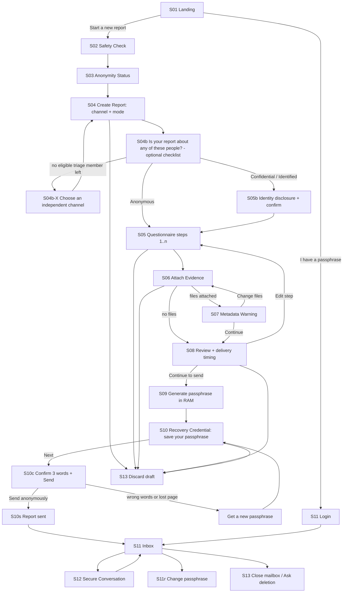

# 11 — Source User Interface Specification
Status: Draft v1.2 (final consistency round: ADR-047) · Edition applicability: both (identical in CE and EE; source UI is Trust Path, AGPL, ADR-020) · Owner: Source Experience team (with Security Architecture and Accessibility review)

## 1. Purpose and scope

This document specifies the source-facing user interface:
- **Tier W** is the server-rendered, no-JS web UI served by C-06 over the onion service C-05. It is the default.
- **Tier V** covers the differences for the Candor Source App (C-03) and the WEBCAT-verified web bundle (ADR-004).

It defines:
- design principles;
- the global page contract: headers, CSP, response size classes, sessions, timeouts, forms and errors;
- the mode banner;
- each screen of the flow Landing → Safety Check → Anonymity Status → Create Report → Questionnaire → Attach Evidence → Metadata Warning → Review → Submit → Recovery Credential → Return Inbox → Secure Conversation → Delete/Abandon;
- anti-dark-pattern rules and the third-party prohibition.

Guidance **content** is owned by `05-SOURCE-OPSEC.md`. Accessibility and i18n process are owned by `26-ACCESSIBILITY.md`. This document owns how that content and those rules are rendered and enforced.

**Protection statement.** The UI is designed so that C-06 learns nothing about the source beyond what the source types or uploads (protections P-01, P-19, P-23 in `40-SECURITY-ASSUMPTIONS.md`):
- no fingerprinting, no third-party resources, no persistent client state, and uniform response sizes.
- It works at Tor Browser "Safest", which removes the JavaScript attack surface exploited in INC-27 and INC-28.
- It reduces mode confusion (THR-040).

Conflict-of-interest exclusion chosen by the source is enforced cryptographically: excluded members receive no key (ADR-030; P-10, P-12).

This assumes:
- Tor Browser is current and not compromised (ASM-004, ASM-008);
- the source reached the genuine onion (ASM-006);
- for Tier W, intake is not under live adversary control during the session (ASM-013; P-05);
- for Tier V, the client is authentic (ASM-012, ASM-040; P-04, P-14);
- the operator deploys the reviewed release (verified via `33-RELEASE-UPDATE-SECURITY.md`).

Residual risks are in §15. Specifically, Tier W cannot protect submission plaintext, or the passphrase at login, from a live-compromised or legally compelled C-06/C-07 (ADR-004, ADR-035 §5).

**Canonical ownership (RVW-A-21).** This document is the single normative source for the Tier W page contract: response size classes (§5.4), the Tier W CSP and response headers (§5.3), the session cookie (§5.6) and session timers (§5.6, ADR-034). `03-PRIVACY-ANONYMITY.md` ANON-004 and `08-API.md` §3 reference this document for those values. `08-API.md` is canonical for the upload protocol (ADR-046 §4); this document only renders it.

## 2. Context and dependencies

| Document | Dependency |
|---|---|
| `DECISIONS.md` | ADR-002, -003, -004, -005, -010, -011, -013, -014, -015, -023, -026, -027, -029, -030 (per-member epoch keys; source "concerns" checklist); **revision ADRs binding on this document:** ADR-034 (RAM-only Tier W drafts, passphrase confirmation), ADR-035 (honesty text, operator statement, INCIDENT_NOTICE), ADR-036 (no Tier W verification affordances; directory pin; follow-up sealing rule), ADR-037 (triage-first routing, COI checklist wording), ADR-038 (fixed import schedule, delayed delivery, padded Tier W uploads), ADR-039 (fetch-all reply retrieval), ADR-041 (app acquisition), ADR-044 (GOV recovery disclosure), ADR-045 (reduced separation of duties disclosure), ADR-046 (uploads, KDF, passphrase rotation, PQ residual); **final round:** ADR-047(1) (Source App encrypted vault), (3) (chaff envelopes; no source-visible effect), (4) (7-day Key Directory freshness bound), (5) (IDENTIFIED over the onion), (6) (per-locale wordlists, NFKC normalization), (9) (intake deletion list) |
| `05-SOURCE-OPSEC.md` | Guidance cards GC-01..GC-43, placement map (§7), assistance features (§8, incl. §8.5a invisible-character check, §8.13 delayed delivery) |
| `03-PRIVACY-ANONYMITY.md` | Metadata minimization, compelled-disclosure inventory |
| `04-CRYPTOGRAPHY.md` | Passphrase derivation (Argon2id m=64 MiB, t=3, p=1; ADR-046 §7), sealing to Member Epoch Keys, source keys, key-change message for rotation |
| `06-SYSTEM-ARCHITECTURE.md`, `07-BACKEND.md`, `08-API.md` | C-06/C-07/C-08 behavior; routes; upload protocol (08 canonical, ADR-046 §4); sealer RAM session store (ADR-034) |
| `10-FILE-EVIDENCE-PIPELINE.md` | Upload limits, sealing of attachments, derivatives |
| `14-CASE-MANAGEMENT.md` | Channels, questionnaire schema, COI map, SLA values, source-visible status |
| `40-SECURITY-ASSUMPTIONS.md` | Protections P-01, P-04, P-05, P-10, P-12, P-14, P-19, P-23; assumptions ASM-004, -006, -008, -012, -013, -040; ASM-112 ("What protects you and what does not" page, implemented by S03) |
| `16-TOR-I2P.md` | Onion service, PoW, rate limiting (ADR-026) |
| `26-ACCESSIBILITY.md` | WCAG 2.2 AA, localization pipeline, AT test matrix |
| `33-RELEASE-UPDATE-SECURITY.md` | Source App updates (TUF), WEBCAT manifest signing |

## 3. Design principles

| # | Principle | Concrete rule |
|---|---|---|
| DP-1 | **Trust through honesty** | Every page shows the mode banner. Claims follow `05-SOURCE-OPSEC.md` GC-01. The UI never shows self-asserted "verified/secure" badges (a page cannot vouch for itself). |
| DP-2 | **Simplicity** | One task per page. ≤ 7 fields per page. Plain language (grade 8). A single primary action per page. |
| DP-3 | **Accessibility** | WCAG 2.2 AA with COGA patterns (`26-ACCESSIBILITY.md`), using native HTML elements only. |
| DP-4 | **Low bandwidth** | One HTTP response per page view, fixed size classes (§5.4), no images except inline decorative SVG, system fonts only. |
| DP-5 | **No-JS first** | Tier W contains zero `<script>`. All interaction is links, forms, `<details>` and CSS. Works at Tor Browser Safest [INC-27; B-SD-15; REQ-H-27]. |
| DP-6 | **Mobile where safe** | Responsive from 320 CSS px. Supported on Tor Browser for Android. iOS/Onion Browser works but is labelled weaker (GC-06). File inputs never use `capture`, so the camera is not opened directly with GPS-tagging defaults. |
| DP-7 | **i18n / RTL** | All strings externalized. CSS logical properties. `dir` per locale. User content isolated with `dir="auto"`. |
| DP-8 | **Keyboard** | Full operation by keyboard. Visible focus. DOM-order tab sequence. Skip link. |
| DP-9 | **Screen readers** | Unique page titles, one `<h1>`, landmarks, labelled controls, errors linked by `aria-describedby`. |
| DP-10 | **Zero third parties** | No third-party scripts, fonts, styles, images, iframes, CDNs, analytics, CAPTCHAs, error reporting, or accessibility overlays [INC-13, INC-46, INC-53; ADR-023; ADR-026]. |
| DP-11 | **Uniform traffic shape** | Every page falls into one of 2 padded size classes. No compression. No conditional sub-resources [B-AN-15, B-AN-16; ADR-011]. |
| DP-12 | **No residue** | No persistent cookies or Web Storage. `no-store`. `Clear-Site-Data` on exit. No downloads offered [REQ-H-23]. |
| DP-13 | **Stable, secret-free URLs** | Paths contain no identifiers, tokens or user data. No query strings carry state. Language is a path prefix. |

## 4. Client tiers

| Aspect | Tier W (default) | Tier V: Source App (C-03) | Tier V: WEBCAT web bundle |
|---|---|---|---|
| Delivery | HTML from C-06 | Signed, reproducible app with TUF updates; embeds Arti. Obtained from the Candor project's onion service or independent mirrors (ADR-041; §8 V-11) | JS/WASM from C-06 under `/v/`, verified by WEBCAT in the browser [B-CR-37, B-CR-38] |
| JavaScript | None | N/A (native UI) | Required (so it cannot run at Safest) |
| Where encryption happens | C-07 on the server, in RAM (ADR-004 honest statement; ADR-035 §5 text) | On device | In browser |
| Recipient key check | None the source can rely on. Recipients are shown "as listed by this site" and no verification affordance is offered (ADR-036 Tier W limit). Verification for Tier W is done by Desk at import and by External Watchers (ADR-035 §1) | Verified against C-14 (inclusion + consistency proofs, ≥ 2 witness cosignatures with ≥ 1 external in EE/GOV/MANAGED); last tree head pinned persistently; warns on member keys < 7 days old (ADR-036 §3, §5) | Verified against C-14; the pin is shown as a short fingerprint the source may note (ADR-036 §5) |
| Routing / COI filter | Envelope wrapped only to the eligible Triage Set after the source's ticks (ADR-037), by C-07 in RAM, **only at Submit** once the recipient set is fixed (ADR-034) | Applied locally before wrapping | Applied locally |
| Metadata cleaning | None; warning only (`05` SOPS-017) | Local clean + findings (`05` §8.4) | Local clean (WASM) |
| Upload padding | C-07 pads each part to the ADR-011 bucket before staging (ADR-038 §5); the request size is still visible to network observers at Tor-cell granularity | Client pads to bucket before upload | Client pads |
| Drafts | Sealer RAM only (mlocked, no swap), keyed by the session handle; attachment parts encrypted under a per-session key held only in sealer RAM and staged on tmpfs (ADR-034; §5.6). Lost on expiry (20 min idle / 2 h absolute) or sealer restart | Memory only; discarded on close | Memory only |
| Resumable uploads | No (ADR-046 §4) | Within one session only, ≤ 24 h, 8 MiB chunks per `08-API.md`; no cross-session resume (THR-047) | Same as App |
| Reply retrieval | Server-side mailbox lookup after passphrase derivation in C-07 (documented residual, ADR-039) | Fetch-all dead-drop: all reply ciphertexts of the last 30 days downloaded and trial-decrypted locally (ADR-039) | Fetch-all dead-drop |
| Delivery timing | "Deliver now" or "Deliver after a random delay of 1–3 days" (ADR-038 §4) | Same, plus "Send later" queueing in the app (§8 V-12) | Same as Tier W |
| Default availability | Enabled | Enabled. The operator's clearnet site (C-37) links to the project distribution and never hosts the app or logs downloads (ADR-041) | **Disabled by default.** An ADVANCED config enabled only when WEBCAT enforcement ships in Tor Browser |

## 5. Global page contract (Tier W)

### 5.1 Page template

```
<html lang="{bcp47}" dir="{ltr|rtl}">
<head> <meta charset="utf-8"> <meta name="viewport" content="width=device-width, initial-scale=1">
       <meta name="referrer" content="no-referrer"> <link rel="icon" href="data:,">
       <title>{Mode} · {Step name} · {Org} secure reporting</title>
       <style>/* single inline stylesheet, hash-pinned in CSP */</style></head>
<body>
 <a class="skip" href="#main">Skip to main content</a>
 <header>  [MODE BANNER §5.2]  {Org label}  [Step n of N]  </header>
 <main id="main" tabindex="-1">  <h1>…</h1>  [error summary if any]  …  </main>
 <footer> [Help & safety guide] [How this site protects you] [Language ▾ list] [Leave] </footer>
 <!-- padding to size class -->
</body></html>
```
- Help links sit in the same place and order on every page (WCAG 3.2.6 Consistent Help).
- "Leave" is a `<form method="post" action="/{lang}/leave">` button (`05` §8.11).
- The Language control is a `<details>` list of links to the same path under another prefix. The draft survives (it is bound to the session handle in sealer RAM, not the language).

### 5.2 Mode banner (ADR-002) and warning banners

The mode sentence of each banner is generated from the normative text in `03-PRIVACY-ANONYMITY.md` §7 (single source; CI diff fails on mismatch, SUI-075). The table shows the EN master as of this revision (RVW-B-14).

| State | When | Banner text (EN master, `sui.mode.*`, `sec:critical tier0`) | Non-color cue |
|---|---|---|---|
| ANONYMOUS | Default. All onion pages until identity is disclosed | **ANONYMOUS** — Candor does not collect who you are. Your writing and files can still identify you. | Solid 4 px border; shield glyph (decorative) |
| CONFIDENTIAL | Identity-disclosure step confirmed (S05b) or later disclosure | **CONFIDENTIAL — NOT ANONYMOUS** — You told us who you are. Your name is locked so that only {custodian_label} can open it, with a recorded reason. The people handling your report can read everything else you write. | Double border + diagonal hatch pattern; text "NOT ANONYMOUS" |
| CONFIDENTIAL (identity seen by case team) | The case team recorded that a message they read contained the source's identity (`03-PRIVACY-ANONYMITY.md` ANON-010; flag delivered with the source-visible status) | **CONFIDENTIAL — NOT ANONYMOUS** — The people handling your report have read a message that said who you are. | As CONFIDENTIAL, plus text "case team knows" |
| IDENTIFIED | Channel allows it and the source chose it (S04/S05b) | **IDENTIFIED — NOT ANONYMOUS** — Your name will be shown to the people handling your report. | Double border + dotted pattern; "NOT ANONYMOUS" |
| CLEARNET (C-38 only) | Every page of the Confidential Clearnet Intake | **NOT ANONYMOUS** — This website can see your internet address. To report anonymously, use Tor Browser: {onion_address_text} | Same as CONFIDENTIAL |

**Tier line** (Tier W, directly under the mode sentence, `sui.tier.w`): "Web mode: encrypted on arrival. [What are my options?]" The link goes to S03 §"How your report is protected". The line is platform-neutral and does not push sources to install an app (RVW-B-16); the trade-offs are explained in `05` GC-38.

Rules:
1. The banner is the first content in `<header>`, is not sticky (so it does not obscure focus, WCAG 2.4.11), and wraps at 400 % zoom.
2. The mode word is also the first word of `<title>`.
3. A mode change is announced by a dedicated confirmation page whose `<h1>` states the new mode.
4. The final send button (S10c) and message send buttons carry the mode in their label: "Send anonymously", "Send confidentially (with my name)", "Send with my name".
5. Banner colors meet 4.5:1 text contrast and 3:1 border contrast in both light and forced-colors modes. Meaning never depends on color.
6. Once CONFIDENTIAL or IDENTIFIED has been submitted, the mode can never revert to ANONYMOUS for that report (an honesty rule).

#### 5.2.1 Warning banners (below the mode banner, every page, `sec:critical tier0`)

| Banner | Condition (evaluated by C-06 from the Key Directory snapshot held by the intake; Tier V evaluates independently, §8 V-14) | Text (EN master) |
|---|---|---|
| WB-1 Operator statement missing or old | No valid quorum-signed OPERATOR_STATEMENT (ADR-035 §2) in the directory, or the newest is older than 30 days + 3 days grace | "Warning: this service's regular public statement (that it has not been secretly changed or ordered to watch users) is missing or out of date. Last statement: {YYYY-MM-DD or "none"}. This may be harmless, or it may mean the service is under legal pressure. If you are at higher risk, don't use this website. Use the Candor app, or wait." |
| WB-2 Incident notice | An INCIDENT_NOTICE entry (ADR-035 §4) newer than 90 days exists for this deployment | "Notice: the operator has declared a security incident affecting this site, dated {YYYY-MM-DD}. What you type on this website may have been exposed during the incident. [Read the notice]" (notice text rendered as plain text, S03) |
| WB-2c Capture performed | An INCIDENT_NOTICE of capture class E-MEM/E-NET (`31-INCIDENT-RESPONSE.md` IR-033), cosigned by the Independent Approver, newer than 90 days | The `capture-performed` text owned by `31-INCIDENT-RESPONSE.md` §capture-performed, verbatim: "Security notice. On {DAY} the operator made an incident-response recording of the submission server's memory or network traffic, approved by {INDEPENDENT_ROLE_LABEL}. If you used the website (no-JavaScript) version on that day, what you typed and your passphrase may be included in that recording. Consider changing your passphrase. The Candor Source App encrypts on your device." Replaces WB-2 while shown |
| WB-3 Recipients changing | A time-locked roster addition, role-label change or COI-policy loosening for a channel offered on this page is pending or took effect within the last 30 days (ADR-036 §2) | "The list of people who receive reports in {channel} is changing on {YYYY-MM-DD} (as listed by this site). [See the change]" |

Honest limit (stated on S03, not in the banner): in Tier W the banners are produced by the same server they describe. A compromised or compelled server can hide them. The Candor app and External Watchers check the statement independently (ADR-035 §1–§2).

### 5.3 HTTP response headers (every C-06 response)

```
Content-Security-Policy: default-src 'none'; style-src 'sha256-{inline_css_hash}'; img-src 'self' data:;
  form-action 'self'; frame-ancestors 'none'; base-uri 'none'; sandbox allow-forms allow-same-origin;
  require-trusted-types-for 'script'
Cache-Control: no-store, max-age=0
Referrer-Policy: no-referrer
X-Content-Type-Options: nosniff
X-Frame-Options: DENY
Cross-Origin-Opener-Policy: same-origin
Cross-Origin-Embedder-Policy: require-corp
Cross-Origin-Resource-Policy: same-origin
Origin-Agent-Cluster: ?1
Permissions-Policy: accelerometer=(), ambient-light-sensor=(), autoplay=(), bluetooth=(), camera=(), clipboard-read=(),
  display-capture=(), encrypted-media=(), fullscreen=(), geolocation=(), gyroscope=(), hid=(), idle-detection=(),
  magnetometer=(), microphone=(), midi=(), payment=(), publickey-credentials-get=(), screen-wake-lock=(), serial=(),
  usb=(), xr-spatial-tracking=(), browsing-topics=()
X-Robots-Tag: noindex, nofollow, noarchive
Content-Language: {bcp47}
```
- **Prohibited headers:** `Server`, `X-Powered-By`, `ETag`, `Last-Modified`, `Set-Cookie` other than §5.6, `Content-Encoding`, `Alt-Svc`, `Report-To`/`NEL` (no reporting endpoints), and any `Link` preload.
- **`Date`:** omitted. This deviates from RFC 9110 and is documented; it avoids exposing onion-host clock skew. Knowledge (unverified): clock-skew fingerprinting of hidden-service hosts is a known research vector. `16-TOR-I2P.md` owns the final decision.
- **Methods:** only GET, HEAD and POST are accepted; others get 405 [B-SD-04 practice].
- **Single CSP (RVW-A-21).** The CSP above is the only Tier W policy. There is no static sub-resource route: `08-API.md` SW-19 (`/static/{sha256}.css|woff2|svg`) is not used by Tier W pages, and no `style-src 'self'` or `font-src` source exists. `03-PRIVACY-ANONYMITY.md` ANON-004 and `08-API.md` §3 reference this section (cross-document request, `process/DISP-G4.md`).
- **Tier V web bundle CSP** (`/v/` only): `default-src 'none'; script-src 'self' 'wasm-unsafe-eval'; style-src 'self'; connect-src 'self'; img-src 'self' data:; form-action 'none'; frame-ancestors 'none'; base-uri 'none'; require-trusted-types-for 'script'; trusted-types candor`. This must equal the CSP in the WEBCAT manifest [B-CR-40].

### 5.4 Response size classes and page-weight budgets (ADR-011; canonical, RVW-A-21)

The class of a response is determined **only by the request method and whether a session cookie is present**, never by page content, message count or answer length. An observer therefore cannot tell from response size whether a source has an ongoing conversation, a long report or a failed login.

| Class | Exact `Content-Length` | Used for | Max unpadded content |
|---|---|---|---|
| P1 | 65,536 bytes | Every **GET without a session cookie**: S01, S02, S03, S11 login form, Leave, S91, S93 | 61,440 bytes (inline CSS ≤ 20,480; inline SVG total ≤ 4,096) |
| P2 | 131,072 bytes | Every **POST response** and every **GET with a session cookie**: S04–S13 including S10, S10c, S10s, wrong-passphrase, inbox, conversation, rotation, and S90/S92/S94 when they answer a POST or a session GET | 129,024 bytes |

There is no larger class. The ≤ 128 KiB ceiling follows `01-PRODUCT-REQUIREMENTS.md` §8. Content limits (§5.7) and pagination guarantee every page fits P2. This adopts the minimum fix of OI-11-3 (all session and POST responses in one class) without doubling the cost of public guidance pages.

Rules:
1. Padding is an HTML comment of ASCII spaces appended before `</body>`, inserted after rendering. Responses are never compressed.
2. S12 paginates so that each page fits P2: at most one maximum-size (64 KiB) message, plus as many smaller messages as fit.
3. HTTP 3xx redirects are not used in the source flow. POST responses render the next page directly (200). Repeated POSTs are made idempotent by the form token (§5.7).
4. Each page view is **exactly one** HTTP request. Favicon requests are suppressed (`href="data:,"`). There are no sub-resources.
5. Performance budget (Tor median-like conditions: 256 kbit/s, 1.5 s RTT, throttled Tor Browser profile in CI): P1 fully rendered in ≤ 4 s; P2 in ≤ 7 s.
6. **Uploads.** No-JS forms cannot pad request bodies. C-07 pads each received part to the ADR-011 bucket before it is written to tmpfs staging (ADR-038 §5), so the stored size is bucketed. The request volume on the wire is still visible to network observers at both ends (§15; S06 honesty text).
7. **Login latency floor.** Every POST `/login` response, successful or not, is released no earlier than `T_LOGIN_FLOOR` after the request was received (default 3 s; SAFE range 2–6 s; must exceed the p99 of Argon2id derivation plus reply decryption and rendering, measured in CI). This removes decryption work as a timing feature (RVW-A-21 item 3). The floor applies equally to S11r rotation.

### 5.5 Routes (Tier W; all under `/{lang}/`)

| Route | Method | Screen |
|---|---|---|
| `/` | GET | S01 Landing |
| `/safety` | GET | S02 Safety Check |
| `/safety/tips` | GET | S02b Safety tips (all tips, both tracks; 11a-SOURCE-SAFETY-TIPS.md; P1) |
| `/status` | GET | S03 Anonymity Status |
| `/new` | GET, POST | S04 Create Report |
| `/concerns` | GET, POST | S04b "Is your report about any of these people?" (ADR-030, ADR-037) |
| `/q` | GET, POST | S05 Questionnaire (step number carried in the form body, not the URL) |
| `/identity` | GET, POST | S05b Identity disclosure |
| `/files` | GET, POST | S06 Attach Evidence |
| `/files/check` | GET, POST | S07 Metadata Warning |
| `/review` | GET, POST | S08 Review; POST "Continue to send" performs S09 and renders S10 |
| `/check` | POST | From S10 to S10c (confirm passphrase) |
| `/newphrase` | POST | Discard the displayed passphrase and show a new one (S10) |
| `/submit` | POST | S10c final send; renders S10s |
| `/saved` | — | WITHDRAWN (ADR-034): no post-submit passphrase re-display exists |
| `/login` | GET, POST | S11 Return Inbox (login) |
| `/inbox` | GET | S11 Inbox |
| `/conversation` | GET, POST | S12 |
| `/rotate` | GET | S11r Change passphrase: explanation and current-passphrase form (ADR-046 §7) |
| `/inbox` (action `rotate-passphrase`) | POST | S11r step 2: re-entry of the current passphrase; renders the S10-style page with the new passphrase (`08-API.md` SW-22) |
| `/rotate/confirm` | POST | S11r confirmation step (3 words, as S10c) |
| `/end` | GET, POST | S13 Delete / Abandon / Close |
| `/leave` | POST | Leave page |
| `/extend` | POST | Session extension |

Routes outside the `/{lang}/` prefix (no session, no cookie, not padded to P1/P2 only where stated):

| Route | Method | Content |
|---|---|---|
| `/.well-known/candor/manifest` | GET | Signed running manifest, byte-exact CBOR (`08-API.md` SW-23, ADR-035(1), ADR-040); exempt from padding (static public document) |
| `/robots.txt` | GET | `Disallow: /` (`08-API.md` SW-20); padded to P1 |

There are no `/keys` or `/verify` routes (final round, DISP-G3): the Tier W directory information is on `/status` (S03, with the fixed `08-API.md` API-049 / `04` VR-13 sentence) and app acquisition and verification guidance is on `/safety` (S02). Fingerprints, checkpoints and witness status are shown only inside Tier V clients.

Route registry is deny-by-default and audience-bound to `source-web` (ADR-029).

### 5.6 Sessions, cookies, timeouts and draft state (ADR-034; supersedes the v1.0 on-disk draft store)

The v1.0 text of this section stored drafts, the identity block and the generated passphrase in C-08 under a cookie-derived key, with an hour-granular expiry. That model is **withdrawn** (ADR-034; RVW-A-02, RVW-A-07, RVW-B-12, RVW-B-13). Nothing the source types, and no passphrase, is ever written to disk on the intake.

**Cookie.** There is at most one cookie at a time: the session cookie `__Host-cs=<base64url(cs)>; Path=/; Secure; HttpOnly; SameSite=Strict`, or, before a session exists, a short-lived pre-session cookie `__Host-cpre` (same attributes, 15 min lifetime, carries only the pre-session CSRF binding for login/Leave; AUD-RM1-SUI-06/15). Neither cookie ever changes a page's size class; the response header block is padded to a constant length whatever cookie is set (AUD-RM1-SUI-05). The name matches `08-API.md` and `03-PRIVACY-ANONYMITY.md` META-014. It has no `Expires` or `Max-Age`, so it is session-only.
- `cs` is 256 random bits generated by C-07 using the OS CSPRNG.
- C-07 derives the session handle `h = HKDF(cs, "candor/src/handle")`. The sealer's in-RAM session table is keyed by `SHA-256(h)`. `cs` is never stored anywhere on the server; C-08 holds no session or draft rows.
- Knowledge (unverified): Tor Browser treats `http://*.onion` as a secure context and accepts `Secure`/`__Host-` cookies. This is verified per release by TST `sui-cookie-onion`; the fallback is `08-API.md` O-3.

**Sealer RAM session record** (mlocked, excluded from swap and core dumps, per `07-BACKEND.md` sealer hardening):

| Field | Content | Lifetime |
|---|---|---|
| draft | Channel, mode, COI ticks, questionnaire answers, identity block (if any), neutral file names and (if opted in) original names, per-file descriptions, delivery-timing choice | Until Submit, Discard, expiry or sealer restart; zeroized on each |
| `K_att` | Per-session 256-bit attachment key (CSPRNG). Never derived from `cs`, never leaves sealer RAM | Same |
| parts | For each uploaded part: random staging name, per-part DEK wrapped under `K_att`, SHA-256 manifest hash, padded size bucket | Same; tmpfs files are deleted with the record |
| credential | After S09: the derived source keys (ADR-005, `04-CRYPTOGRAPHY.md`), and for the 3 challenge positions `HMAC(k_chal, word_i)` with a per-session random `k_chal`. **The passphrase string itself is zeroized immediately after S10 is rendered** | Until Submit or expiry |
| signed-in keys | After S11 login: derived source keys needed to render the inbox and send messages | Zeroized after each response per `04-CRYPTOGRAPHY.md` §11.5, or at the latest at session expiry |
| deadlines | Idle and absolute deadlines as **monotonic-clock values in RAM only**; no wall-clock time and no generation counter is persisted | Same |

**Attachment staging.** Each uploaded part is streamed into C-07, hashed (SHA-256, manifest only), padded to its ADR-011 bucket (ADR-038 §5), encrypted under its per-part DEK and written to a tmpfs staging directory (RAM-backed, `noexec,nodev,nosuid`, mode 0700, excluded from any backup or snapshot). **No member wrap exists before Submit.** At Submit, C-07 fixes the recipient set (eligible Triage Set after the source's ticks, ADR-037; follow-up rule ADR-036 §4) and only then HPKE-wraps the content key and per-part DEKs to those Member Epoch Keys (re-wrap, not re-encryption). If the channel, ticks, category or epoch changed after a part was uploaded, the wraps are simply computed for the final set; nothing was wrapped earlier (RVW-A-07).

**Timers (ADR-034 single timer set; not configurable).**

| Timer | Value | Behavior |
|---|---|---|
| `T_IDLE` | 20 min | Applies to drafting and signed-in sessions alike. A CSS-revealed warning appears at `T_IDLE − 5 min` (§5.6.1) with "Stay" (POST `/extend`), usable any number of times until `T_ABS`. On expiry the record is zeroized and staged parts deleted. |
| `T_ABS` | 2 h from session creation | Cannot be extended (security time limit; accessibility decision recorded in `26-ACCESSIBILITY.md`). A CSS-revealed warning appears at `T_ABS − 10 min`: "This session ends in about 10 minutes. Anything you have not sent will be lost." |

**Draft-preserving re-authentication (RAM only).** If a signed-in POST (for example a reply on S12) arrives after `T_IDLE` or `T_ABS`, C-07 creates a new pre-login session (new `cs`) that holds only the posted text in RAM for at most `T_IDLE`, renders the login page with "You were signed out for safety. Your unsent message is kept for 20 minutes. Enter your passphrase to continue," and restores the text in the form after login (WCAG 2.2.5). Posted **files** are not kept; the page says so.

**Loss cases stated to the source** (S04, S06, S08 and S92; `sui.draft.limits`, `sec:critical`): "Your draft is kept only in the server's memory while this Tor Browser window stays open, for at most 2 hours. It is lost if you close the window, stop for 20 minutes, or the server restarts. Nothing is sent until you choose Send."

**Closing the browser** (or Tor Browser "New Identity") destroys `cs`. The RAM record is then unreachable and is zeroized at `T_IDLE`.

#### 5.6.1 CSS-only timeout warning
Each page rendered within a session includes a `<div class="timeout-warn" role="status">` block. It contains "You will be signed out in about 5 minutes for your safety" and a "Stay" form button. The block is hidden by CSS and revealed by `animation: reveal 0s linear 15min forwards` (`T_IDLE − 5 min`). A second block for the absolute limit is revealed at `T_ABS − 10 min` minus the time already elapsed, which C-06 computes when rendering. This needs no JavaScript. Screen-reader announcement of the reveal is not guaranteed (§15). The static text near the page top therefore also says: "For your safety, this session ends after 20 minutes without activity, and always after 2 hours." If `prefers-reduced-motion` is set, the reveal still occurs (it is not motion).

### 5.7 Forms, validation and errors

- **CSRF and idempotency.** Every form (including pre-session forms such as login and Leave, which use a pre-session token bound to a short-lived pre-session cookie) carries a hidden `csrf` field (ADR-051(4)): a 128-bit single-use token bound to the session, which is also the idempotency key. POSTs must carry a valid `csrf` plus an `Origin` header equal to the onion origin (missing or `null` Origin is rejected; `Sec-Fetch-Site` must be `same-origin` when present). `SameSite=Strict` also applies.
- **Validation is server-side only.** HTML constraint attributes (`required`, `maxlength`) are added for assistance, but the server is authoritative.
- **Error pattern:**
  1. Re-render the same page with the posted values preserved (escaped).
  2. Insert an error summary as the first element of `<main>` after `<h1>`: `<div class="error-summary" tabindex="-1" autofocus aria-labelledby="err-title">`. It contains "There is a problem" and a list of links to each invalid field.
  3. Each invalid field gets `aria-invalid="true"` and an inline message linked via `aria-describedby`.
  4. `<title>` is prefixed with "Error: ".
- **No POST error path may discard text the source typed while the session lives.** If rate limiting or busy state is hit, the posted text is first kept in the sealer RAM session record (§5.6); on session expiry the §5.6 RAM-only re-authentication rule applies. It is never written to disk (ADR-034). The error page says "Your text is kept for now. It is lost if you close Tor Browser or after the session ends."
- **Output encoding:** all user and recipient content is HTML-escaped, rendered as plain text with line breaks preserved (`white-space: pre-wrap`), and never auto-linked. There is no Markdown and no HTML. URLs in replies appear as inert text [B-GL-39 CVE-2024-38521 lesson].
- **Input limits:**

| Field | Limit |
|---|---|
| Short text | 500 chars |
| Long text | 60,000 chars (fits the 64 KiB bucket with UTF-8 headroom per ADR-011; the server rejects more than 65,536 bytes UTF-8) |
| Radio/checkbox values | From an allow-list |
| Total per report (text, all questionnaire fields) | 96 KiB (98,304 bytes UTF-8), so that S08 Review fits P2. Longer material can be attached as a file |

### 5.8 Progress indicator
Text "Step 4 of 8: What happened", plus an ordered list in `<nav aria-label="Report steps">` showing completed, current (`aria-current="step"`) and upcoming steps. Completed steps are links (GET, re-render from draft). There is no percentage bar and no timers.

### 5.9 Busy, error and outage pages

| Page | Status | Content |
|---|---|---|
| S90 Busy | 429 | "This site can't take your request right now. Wait a minute, then choose Try again. Your text is kept for now." Single "Try again" button: a form POST to the same action, which re-submits the RAM-held text, not the lost body. No auto-refresh. The page is identical whatever the cause (per-circuit limit, global limit, PoW) and shows no queue position, wait estimate or load level (ADR-038 §5; RVW-A-27). |
| S91 Not found | 404 | Generic text plus links to Landing, Help and Leave |
| S92 Error | 500 | "Something went wrong. If the server restarted, your draft is lost and you need to start again. Nothing was sent unless you saw the page 'Your report was sent'." No stack traces, IDs or hostnames [INC-34] |
| S93 Maintenance | 503 | "This site is being updated. Try again later. We never offer an anonymous version of this site anywhere else." (GC-11) |
| S94 Signed out | 200 | See §5.6 |

These pages take the class of the request they answer (§5.4): P1 for a GET without a session cookie, P2 otherwise.

## 6. Flow



Draft/session state machine (all state in sealer RAM, ADR-034):

```mermaid
stateDiagram-v2
  [*] --> NoSession
  NoSession --> Drafting: first POST (cookie cs issued; RAM record created)
  Drafting --> Drafting: save (idle deadline reset; absolute unchanged)
  Drafting --> Zeroized: discard / T_IDLE / T_ABS / sealer restart / cs lost
  Drafting --> CredentialShown: POST /review continue (passphrase generated, shown once, string zeroized)
  CredentialShown --> Confirming: POST /check
  Confirming --> CredentialShown: POST /newphrase (old passphrase discarded, never shown again)
  Confirming --> Submitted: POST /submit with 3 correct words (recipient set fixed, final seal, idempotent on ft)
  CredentialShown --> Zeroized: T_IDLE / T_ABS (nothing sent)
  Confirming --> Zeroized: T_IDLE / T_ABS (nothing sent)
  Submitted --> SignedIn: S10s rendered (derived keys only)
  NoSession --> SignedIn: POST /login ok
  SignedIn --> SignedOut: T_IDLE / T_ABS / logout / leave
  SignedOut --> SignedIn: re-login (unsent text restored from RAM, ≤ 20 min)
  SignedIn --> SignedIn: passphrase rotation confirmed (new keys; old verifier deleted)
  SignedIn --> Closed: close mailbox
  Zeroized --> [*]
  Closed --> [*]
```


## 7. Screen specifications

Each screen lists its purpose, content, fields, validation, no-JS behavior, errors, a11y notes and a wireframe. All screens follow §5. "JIT" refers to the `05-SOURCE-OPSEC.md` §7 placement.

### S01 Landing
- **Purpose:** orient the visitor, state the key protections and limits, and branch to a new report or a returning login.
- **Content:**
  - `<h1>` "{Org} secure reporting".
  - A 2-sentence description of the channel purpose.
  - Warning banners WB-1..WB-3 when their conditions hold (§5.2.1).
  - A "Before you start" box with 4 bullets: don't use a work device or work network (GC-04/GC-09); use Tor Browser at Safest (GC-07); the site cannot see your internet address, but it can't protect a monitored device (GC-01); and the ADR-035 §5 honesty sentence (`sui.tier.w.honesty`, `sec:critical tier0`): "If the intake server is compromised or legally compelled while you use the website (no-JavaScript) version, what you type, and your passphrase when you log in, can be captured. For the highest risk, use the Candor Source App."
  - The JS-on warning, CSS-revealed (`05` §8.2).
  - Two equal-size buttons (links): "Start a new report" and "I have a passphrase".
  - Links: "Read the safety guide" and "How this site protects you".
  - Disclosure lines, shown only when true (from the Key Directory snapshot): the recovery statement (ADR-013; enabled by default in the GOV profile, ADR-044 §3): "A backup key held by {quorum_holders} can unlock reports ({k} of them together)"; and "This organization runs this service with reduced separation of duties" (small-organisation mode, ADR-045).
  - If the channel configuration offers C-38 or a staffed hotline: a plain-text line "Can't use Tor Browser? {alternative_label} — this is NOT ANONYMOUS." (no link from the onion; RVW-B-28).
  - GC-03 footer line.
- **Fields:** none. **Validation:** n/a. **No-JS:** fully static.
- **Errors:** n/a.
- **A11y:** the JS warning uses `role="note"`, not an alert. The primary buttons are links styled as buttons with a 44×44 px minimum target.
```
+--------------------------------------------------------------+
| [#] ANONYMOUS - Candor does not collect who you are. Your    |
|     writing and files can still identify you.                |
|     Web mode: encrypted on arrival. [What are my options?]   |
| Acme Corp secure reporting                    Step - of -    |
+--------------------------------------------------------------+
| Report a concern safely                                      |
| Tell the Audit Committee about fraud or misconduct.          |
| .-Before you start-----------------------------------------. |
| | * Don't use a work computer, work phone or work network. | |
| | * Use Tor Browser set to "Safest".                       | |
| | * We can't see your internet address, but we can't       | |
| |   protect a computer your employer watches.              | |
| | * If this server is compromised or compelled while you   | |
| |   use this website, what you type and your passphrase    | |
| |   at login can be captured. For the highest risk, use    | |
| |   the Candor Source App.                                 | |
| '----------------------------------------------------------' |
| [!] JavaScript is on. Set Tor Browser to Safest. (CSS only)  |
|  [ Start a new report ]   [ I have a passphrase ]            |
|  Read the safety guide  |  How this site protects you        |
+--------------------------------------------------------------+
| Help & safety guide | How this site protects you | Language v| Leave |
```

### S02 Safety Check
- **Purpose:** give the NORMAL-RISK essentials and track self-selection without collecting data.
- **Content:**
  - `<h1>` "Check these things first".
  - The 8 essentials (`05` §7.1) as a plain `<ul>`.
  - §4.2 self-selection text.
  - Guidance cards grouped A–I, each card a `<details>` with its normal text. High-risk text is a nested `<details>`.
  - "Continue" link to S03.
  - "Leave now" (the Leave form).
- **Fields:** none (SOPS-042). **Validation:** none.
- **No-JS:** `<details>` is native. Opening them sends no request.
- **Errors:** n/a.
- **A11y:** each `<summary>` is a level-2 or level-3 heading inside the summary. All are closed by default except the essentials. Reading order is essentials → self-selection → cards.
```
| ANONYMOUS - ...                                              |
| Check these things first                                     |
| * I'm on a personal device, not a work device                |
| * I'm not on a work or school network                        |
| * Tor Browser is set to Safest      ... (8 items)            |
| Are you at higher risk? Open the "Higher risk" parts if...   |
| > A. Before you start        > B. Devices and browsers       |
| > C. Networks and places     > D. Research and accounts ...  |
|                         [ Continue ]    [ Leave now ]         |
```

### S03 Anonymity Status
- **Purpose:** show the actual protection state and who will receive the report (REQ-H-21; INC-14), without offering checks a Tier W source cannot rely on (ADR-036 Tier W limit; RVW-A-17).
- **Content** (a definition list `<dl>`):

| Item | Value (Tier W) |
|---|---|
| Connection | "Through Tor (onion address). This site cannot see your internet address." |
| Check the address | The onion address in 4-character groups, with "It should match the address on {info_site_address} or on printed material from {org}. If it doesn't, leave." (anti-phishing; this is not a check of the server's integrity) |
| Browser security | CSS-computed: "JavaScript is off ✓" / "JavaScript is on: set Safest" |
| Mode | Current mode + one-line meaning |
| How your report is protected | ADR-004 honest statement plus the ADR-035 §5 sentence (S01). For HIGH-risk readers (nested `<details>`): "Tor's connection encryption does not yet resist future quantum computers. Someone who records traffic today might read website reports in the future. The Candor app encrypts your report on your device in a way designed to resist this." (ADR-046 §8) |
| Replies on this website | "When you sign in on this website, the server looks up your mailbox. A compromised server could note when you sign in and read your replies." (ADR-039 residual; RVW-A-10) |
| Who first reads your report | Role labels of the channel's **Triage Set** (ADR-037), e.g., "Audit Committee Chair", "External Counsel", labelled "(as listed by this site)". Names only if channel policy publishes them |
| Who may read it later | "The first readers may ask other team members to help: {other role labels} (as listed by this site). They cannot give access to anyone you tick." |
| People kept out | "On the next pages you can tick roles your report is about. They will not get a key to open it." |
| Recent changes to recipients | Pending or recent (≤ 30 days) time-locked changes (ADR-036 §2) with their effective dates, "(as listed by this site)"; "None" otherwise |
| Operator statement | Date of the newest OPERATOR_STATEMENT (ADR-035 §2) and, if present, the INCIDENT_NOTICE text rendered as plain text; "(as reported by this site)". Followed by: "A statement like this is a signal, not a guarantee. It can be missing for harmless reasons, and people can be forced to publish it." |
| Separation of duties | Shown only in small-organisation mode (ADR-045): "This organization has few staff for this service. An outside party ({external_oversight_label}) oversees it, but fewer people check each other than usual." |
| Backup key | ADR-013 recovery statement (GOV default enabled, ADR-044 §3) |
| What protects you and what does not | The ASM-112 list: plain-language consequences of ASM-001, ASM-004..ASM-011 and ASM-013, drawn from `05-SOURCE-OPSEC.md` GC-01 |
| Checking this site | Fixed sentence (`sui.status.noverify`, `sec:critical tier0`): "Checking these values does not protect a report sent from this website; only the Candor app checks them before encrypting." Followed by where to get the app (ADR-041): the project's onion address as plain text, and "The app's own settings show the key fingerprints and log checks." |

- **Not shown in Tier W** (moved to the Tier V view, RVW-A-17): recipient key fingerprints, directory checkpoint, witness status, release hashes. Tier V shows recipients only after C-14 verification, with 16-hex-character fingerprints, "member since YYYY-MM-DD", a warning for member keys < 7 days old, and the pinned tree-head fingerprint (§8 V-3).
- **Fields:** none. **No-JS:** static.
- **A11y:** the `<dl>` has `<dt>`/`<dd>` pairs. The onion address groups are wrapped in `<span>` with `aria-label` giving the whole address, so screen readers do not read each group as a word (and `lang="en"`).
```
| How this site protects you                                   |
| Connection ......... Through Tor. We can't see your IP.      |
| Check the address .. abcd efgh ijkl ... (56 chars) .onion    |
| Browser security ... JavaScript is off  [ok]                 |
| Mode ............... ANONYMOUS                               |
| Protection ......... Locked on our server when it arrives... |
| First read by ...... Audit Committee chair; External counsel |
|                      (as listed by this site)                |
| Operator statement . 2026-09-12 (as reported by this site)   |
| Backup key ......... None.                                   |
| Checking these values does not protect a report sent from    |
| this website; only the Candor app checks them.               |
|                                         [ Continue ]          |
```

### S04 Create Report
- **Purpose:** choose the channel (if more than one) and the mode.
- **Fields:**
  1. **Channel** (radio group, `fieldset`/`legend` "Who should receive your report?"). Each option shows the channel name, the handling body, languages, and allowed modes. If only one channel exists, it is not shown and is recorded implicitly.
  2. **Mode** (radio group "Do you want to tell us who you are?"):
     - "No, stay anonymous (recommended)" — pre-selected (privacy by default);
     - "Yes, but keep my name confidential" — only if the channel allows CONFIDENTIAL;
     - "Yes, show my name to the people handling it" — only if the channel allows IDENTIFIED.
     Each option has a consequence line. The options have equal visual size. The CONFIDENTIAL consequence (`sui.mode.conf.consequence`, `sec:critical tier0`; RVW-B-14 d, f) is: "Your name is locked. Only {custodian_label} can open it, with a recorded reason and two approvals. They work for {organization}. A court or regulator can require them to reveal your name. You will normally be told if that happens, but telling you can be delayed. The people handling your report can read everything else you write."
- **Validation:** the channel must be in the allow-list and active; the mode must be allowed for the channel.
- **Channel availability (ADR-030, ADR-037 fail-closed):** if a channel currently has no Triage Set member with a valid published epoch key, it is shown disabled with "This channel can't accept reports right now. Choose another channel, or try again later." and the independent channels of §S04b-X are listed. A report is never encrypted to fewer or other parties.
- Each channel option also names who reads first: "First read by: {triage_role_labels}" (RVW-B-02).
- **No-JS:** POST `/new` creates the RAM draft and issues the cookie (§5.6). The response is S04b.
- **Errors:** "Choose who should receive your report." "This channel does not accept confidential reports; choose another option."
- **A11y:** the `legend` is the question. Consequence text is linked by `aria-describedby`.
```
| Step 1 of 8: Start                                            |
| Who should receive your report?                               |
| (o) Audit Committee - fraud, accounting (EN, FR)              |
| ( ) Ethics Office - workplace conduct (EN)                    |
| Do you want to tell us who you are?                           |
| (o) No, stay anonymous (recommended)                          |
|     We won't know who you are unless you tell us later.       |
| ( ) Yes, but keep my name confidential                        |
|     Your name is locked; only 2 named custodians can open it. |
|     They work for Acme. A court can make them reveal it. ...  |
| Your draft is kept only in server memory while this window    |
| is open, for at most 2 hours. Nothing is sent until you Send. |
|                                         [ Continue ]          |
```

### S04b "Is your report about any of these people?" (ADR-030, ADR-037)
- **Purpose:** let the source keep people their report concerns away from it, before anything is encrypted (ADR-030, ADR-037, ADR-015; INC-22).
- **Placement:** immediately after channel selection (S04), before the questionnaire.
- **Routing model shown to the source (ADR-037):** the envelope is wrapped **only** to the channel's eligible Triage Set (independent-body role labels). Ticked roles are removed before wrapping. The Triage Set then decides which further investigators receive the Case Key; ticked people are recorded only as blinded COI tags that every Desk checks, so they cannot be given access later.
- **Content:**
  - `<h1>` "Is your report about any of these people?"
  - "Your report is first read by: {triage_role_labels}." (RVW-B-02)
  - The plain explanation (`sui.concerns.explain`, `sec:critical tier0`): "Tick anyone your report is about, or anyone who should not see it. They will not get a key to open your report, now or later. You don't have to tick anything."
  - The ADR-037 §4 statement, verbatim (`sui.concerns.who_sees`, `sec:critical tier0`): "Your answers are encrypted and seen only by the independent triage team, who use them to keep the people involved away from your report. They may still suggest what your report is about."
  - The reporting-line caution (`sui.concerns.team_hint`, `sec:critical`; RVW-B-03): "If you tick your own manager, the triage team will know which team you work in."
  - The role labels come from the chosen channel's member entries in the Key Directory (C-14). One checkbox per role label. Names are shown only if channel policy publishes them. The list offers no relational subjects such as "my direct manager" (14 owns the COI map; RVW-B-03).
  - Tier W labels the list "(as listed by this site)". Tier V shows it only after C-14 verification.
  - A note: "Your organization may also automatically keep out people linked to the type of report you choose. You will see the final list before you send."
- **Fields:** checkbox group (`fieldset`/`legend` = the question). **Default: none ticked.** An empty selection is valid, with no "Are you sure?".
- **Validation:** values must be role IDs from the channel's signed directory snapshot. Unknown values are rejected.
- **Eligibility check:** after POST, C-07 (Tier W, in RAM) or the client (Tier V) computes the eligible first readers: Triage Set members with a valid current Member Epoch Key, minus ticked roles.
  - If ≥ 1 remains, continue to S05, or to S05b for non-anonymous modes.
  - If none remain, show **S04b-X** (ADR-037 §1 fail closed).
  - The same check is repeated at S08 after the tenant COI map for the chosen category is applied, and at Submit, when the recipient set is fixed (ADR-034).
- **Storage:** the ticks exist only in the sealer RAM draft until Submit, and then only inside the sealed envelope (for the Triage Set). They are never written to C-08 in cleartext.
- **S04b-X "No one left to read your report first":**
  - Text: "If these roles are kept out, no one in this channel's first-reading team could open your report. Please use a channel that is independent of them." It then lists the other channels in this deployment that have ≥ 1 eligible Triage Set member, each with its handling-body description (e.g., "Board Audit Committee (independent of management)", "External Ombudsperson"). The designated independent fallback channel (14 `independent_route`) is listed first (RVW-C-18).
  - It also names any external body configured in the jurisdiction pack, as plain text (`05` GC-03; no links).
  - Buttons: "Choose another channel" (back to S04, keeping the ticks where the roles exist there) and "Change who is kept out" (back to S04b).
  - The source is never offered "send anyway", and the system never encrypts to fewer or other parties.
- **No-JS:** POST `/concerns`. The RAM draft is updated.
- **Errors:** "We couldn't load the list of roles for this channel. Try again later." (Fail closed: continuing without the list is not offered.)
- **A11y:**
  - Checkboxes have role labels as accessible names.
  - The explanation and the ADR-037 statement are linked by `aria-describedby`.
  - S04b-X uses `<h1>` for the consequence and a list of channel options.
```
| Step 2 of 8: Who should not see it                            |
| Is your report about any of these people?                     |
| Your report is first read by: Audit Committee Chair,          |
| External Counsel.                                             |
| Tick anyone your report is about, or anyone who should not    |
| see it. They will not get a key to open your report, now or   |
| later. You don't have to tick anything.                       |
| Your answers are encrypted and seen only by the independent   |
| triage team ... They may still suggest what your report is    |
| about.                                                        |
|  [ ] Chief Financial Officer                                  |
|  [ ] Head of Internal Audit                                   |
|  [ ] HR Investigations Lead                                   |
|  (as listed by this site)                                     |
|           [ Back ]                      [ Continue ]          |
+---------------------------------------------------------------+
| No one left to read your report first                         |
| If these roles are kept out, no one in this channel's first-  |
| reading team could open your report. Use a channel that is    |
| independent of them:                                          |
|  * Board Audit Committee (independent of management)          |
|  * External Ombudsperson                                      |
| [ Choose another channel ]   [ Change who is kept out ]       |
```

### S05 Questionnaire (steps 1..n)
- **Purpose:** collect the report content using the channel questionnaire (`14-CASE-MANAGEMENT.md` schema).
- **Default template:**

| Step | Question | Type | Required |
|---|---|---|---|
| 3 | What is this about? | Single choice from channel categories + "Other" | yes |
| 4 | What happened? | Long text | yes |
| 4 | About when? | Month + year selects, "It is still happening" checkbox, "Not sure" | no |
| 4 | Where? (general place, e.g., "Finance department, head office") | Short text | no |
| 5 | Who is involved? (names or roles) | Long text | no |
| 5 | How do you know? | Multiple choice (saw it / was told / have documents / other) | no |
| 6 | About how many people could know these facts? (`05` §8.7) | Single choice | no |
| 6 | Has this been reported before? | Yes / No / Not sure | no |
| 6 | Anything else? | Long text | no |

- **Field types permitted in the builder:** short text, long text, single choice, multiple choice, month-year, yes/no/not-sure.
- **Prohibited in ANONYMOUS channels:** name, email, phone, address, employee ID, exact date-time, file-in-question (SOPS-021).
- **Exact-date input** is available only as month + year. The help text reads "Use general dates if an exact date could point to you" (GC-30).
- **JIT guidance** beside long-text fields: "Keep it short and factual. Don't paste into AI tools, translators or grammar checkers." (SOPS-012). There is also a `<details>` "What details could point to me?" (GC-30).
- **Validation:** required fields; length limits (§5.7); choice values from the allow-list. Month-year cannot be in the future.
- **No-JS:**
  - Each step POSTs `/q` with `step=n` in the body. C-07 updates the RAM draft (§5.6) and renders the next step.
  - "Back" is a submit button with `name=nav value=back`, which also saves.
  - Conditional questions (per channel config) are evaluated server-side on the next render.
- **Errors:** per §5.7, for example "Tell us what happened. This is the only question you must answer."
- **A11y:**
  - Long text is a `<textarea>` with visible label, hint and the maximum length stated in text.
  - Radio groups use `fieldset` and `legend`.
  - Month-year uses two labelled `<select>` elements inside a `fieldset`.
  - Nothing auto-advances and there is no time limit.
```
| Step 4 of 8: What happened                                    |
| What happened? (required)                                     |
| Say what happened and where evidence can be found.            |
| Keep it short and factual. Don't paste into AI tools,         |
| translators or grammar checkers.                              |
| +----------------------------------------------------------+  |
| |                                                          |  |
| +----------------------------------------------------------+  |
| Up to 60,000 characters.                                      |
| > What details could point to me?                             |
| About when?  [Month v] [Year v]  [ ] Still happening          |
|           [ Back ]                      [ Save and continue ] |
```

### S05b Identity disclosure (conditional)
- **Purpose:** explicit, informed conversion to CONFIDENTIAL or IDENTIFIED (ADR-002, ADR-014).
- **Page 1 (fields):**
  - Full name (short text, `autocomplete="name"`);
  - Role or department (optional, `autocomplete="organization-title"`);
  - "How can the team contact you?" (radio: "Only through this secure mailbox (recommended)" / "Also by another way", which reveals a short-text field on the next render with the GC-36 warning).
  - Explanation: "Your name is locked separately. Only {custodian_label} can unlock it, with a recorded reason and two approvals."
- **Page 2 (confirmation):** `<h1>` "You are about to stop being anonymous". Two equal buttons: "Yes, share who I am" and "No, stay anonymous". After confirmation, the banner changes and the `<h1>` of the next page reads "Your report is now CONFIDENTIAL" or "Your report is now IDENTIFIED" (per the chosen mode).
- **IDENTIFIED over the onion (ADR-047(5); amends ADR-002):** a channel MAY offer IDENTIFIED on the onion. The identity block goes to the Sealed Identity Store (ADR-014) exactly as for CONFIDENTIAL; the difference is only the source's recorded choice that the people handling the report may be told the name, which `14-CASE-MANAGEMENT.md` releases to the case team under its identity rules. The mode banner shows IDENTIFIED (§5.2) and never reverts (§5.2 rule 6).
- **Reversal:** before submit, "Remove my name and stay anonymous" appears on S08. It zeroizes the identity block in the RAM draft (nothing was ever written to disk, ADR-034) and returns the mode to ANONYMOUS. After submit, it cannot be reversed.
- **Validation:** a name is required for CONFIDENTIAL and IDENTIFIED. Maximum 200 characters.
- **Sealing:** the identity block is sealed separately to the Identity Custodian key set at submit (ADR-014) and never merged into case content.
- **A11y:** `autocomplete` tokens are used only on this page (WCAG 1.3.5). Confirmation buttons are of equal prominence.

### S06 Attach Evidence
- **Purpose:** optionally attach files.
- **Content:**
  - `<h1>` "Add files (optional)".
  - The GC-22/GC-23 short text "Describe or retype when you can. Files can hold hidden information."
  - The configured limits, shown as text: "{max_files} files, up to {max_file} each, {max_total} in total" (values from `10-FILE-EVIDENCE-PIPELINE.md` §10; per-file cap 4 GiB standard, ADR-046 §4; Tier W has no resume).
  - Time guidance: "Large files can take many minutes over Tor. Keep this page open. If the upload stops, you need to upload that file again."
  - Size honesty (`sui.files.size_visible`, `sec:critical`; RVW-A-22): "Someone watching your internet connection and this site's connection at the same time can recognise a large upload by its size and time. For large or many files, the Candor app is safer, or describe the content in words."
- **Fields:**
  1. `<input type="file" name="f" multiple>`, with **no** `accept` restriction and **no** `capture` attribute;
  2. checkbox "Replace file names with plain names (recommended)", checked by default (SOPS-014);
  3. after upload, a list of attached files, each with a neutral name, a size shown in MB rounded, an optional "Describe this file" short text, and a "Remove" button.
- **Validation:** count and total size are enforced while streaming (C-07 aborts at the limit and returns S06 with an error). Empty files are rejected.
- **No-JS:** POST multipart `/files` (upload protocol per `08-API.md`; Tier W has no resume). The browser shows native upload progress only. The response re-renders S06 with the list. Content is padded and encrypted on arrival under the per-session key in sealer RAM and staged on tmpfs; it is locked to the recipients only when the source sends (§5.6).
- **Errors:** "This file is too large. The limit is {max_file} per file and {max_total} in total." "The upload stopped. Please try again. Files already listed are kept for this session."
- **A11y:** the file input has a visible label. The attached-files list is a `<table>` with a caption. Each "Remove" button's accessible name includes the file name ("Remove file-02.pdf").
```
| Step 7 of 8: Add files (optional)                             |
| Describe or retype when you can. Files can hold hidden info.  |
| Choose files: [ Browse... ]   (up to 20 files, 500 MB total)  |
| [x] Replace file names with plain names (recommended)         |
|                                   [ Upload ]                  |
| Attached:                                                     |
|  file-01.pdf   2 MB   Describe: [__________]   [ Remove ]     |
|  file-02.jpg   3 MB   Describe: [__________]   [ Remove ]     |
|           [ Back ]                      [ Continue ]          |
```

### S07 Metadata Warning
- **Purpose:** just-in-time metadata, canary and watermark warnings (SOPS-015).
- **Content:** a table with one row per file: neutral name, class (by extension; `05` §7.2) and the risks for that class. A shared list of the GC-25/GC-26/GC-27 points follows. Tier W also shows the honest statement ("We can't remove hidden data before your file is locked…").
- **Fields:** two buttons: "Change files" and "Continue with these files". No checkbox.
- **No-JS:** POST `/files/check`.
- **Tier V:** per-file actual findings, plus **Clean (recommended)** / **Send original** / **Remove** (`05` §8.4).
- **A11y:** the table has header cells. Risks are `<ul>` lists inside cells.
```
| Before you send these files                                   |
| We can't remove hidden data on this website. The team views a |
| cleaned copy, but your original is kept as evidence.          |
| file-01.pdf | PDF   | author, software, older versions inside |
| file-02.jpg | Photo | exact location, time, phone model;      |
|             |       | what's in the background                |
| Also: unique copies (canary traps), invisible marks, printer  |
| dots on photos of printed pages.                              |
|        [ Change files ]          [ Continue with these files ]|
```

### S08 Review
- **Purpose:** final check before sending. Surfaces identity hints and style tips. Makes the mode unmistakable. Offers delayed delivery.
- **Content (in order):**
  1. Mode summary box (banner repeated with a "Change" link).
  2. Channel, **"First read by"** (the eligible Triage Set role labels after source ticks and the tenant COI map for the chosen category, ADR-037) and "Others the first readers may ask to help" (channel role labels minus kept-out roles).
  3. "Kept out": the roles the source ticked, plus "and {n} role(s) kept out automatically by your organization's conflict-of-interest rules" (role labels shown where the COI map is published in C-14). If no eligible Triage Set member remains, S04b-X is shown instead of S08.
  4. Answers, each with an "Edit" link to its step.
  5. Files (neutral names, class).
  6. Identity-hint notices (`05` §8.5; non-blocking; each links to the field).
  7. Invisible-character notice (`05` §8.5a; RVW-B-24): "Your text contains {n} invisible or look-alike characters. They can act as a hidden signature from the document you copied. [Remove them] [Keep them]" — "Remove them" is a submit button that normalizes the RAM draft and re-renders S08; it is the first button.
  8. Writing checklist (GC-31).
  9. **Delivery timing** (radio group, `fieldset`/`legend` "When should the team receive it?", ADR-038 §4): "At the next scheduled pickup" / "After a random delay of 1 to 3 days". Equal weight. Help text: "A delay makes it harder to connect the time your report arrives with what you did at work. The team's deadlines start when they receive it." Default: "At the next scheduled pickup"; the HIGH-risk guidance recommends the delay (`05` GC-34).
  10. Timing reminder (GC-34 short).
  11. Primary button "Continue to send" (the mode-labelled Send button is on S10c).
  12. Secondary: "Discard this report".
- **Validation:** re-validates all steps. If any required answer is missing, shows an error summary with links.
- **No-JS:** POST `/review` with `csrf`.
- **A11y:**
  - Sections use `<h2>`. "Edit" link names include the question ("Edit: What happened?").
  - Identity notices are in a `<section aria-labelledby>` headed "Check for details that could point to you".
  - The page is class P2 (§5.4).
```
| Step 8 of 8: Check and send                                   |
| .-Your report will be sent ANONYMOUSLY--------------[Change]-.|
| First read by: Audit Committee Chair, External Counsel        |
|   (as listed by this site)                                    |
| Kept out: Chief Financial Officer (+1 by org rules)           |
| What happened?  "In March the ... "                  [Edit]   |
| Files: file-01.pdf (PDF), file-02.jpg (Photo)        [Edit]   |
| Check for details that could point to you                     |
|  ! "What happened?" line 3 looks like an email address [Edit] |
|  ! 14 invisible characters   [ Remove them ] [ Keep them ]    |
| When should the team receive it?                              |
|  (o) At the next scheduled pickup                             |
|  ( ) After a random delay of 1 to 3 days                      |
|  [ Continue to send ]                  Discard this report    |
```

### S09 Prepare to send (server step, no page of its own)
- **Trigger:** POST `/review` "Continue to send".
- **Behavior (C-07, RAM only; ADR-034, ADR-005, ADR-046 §7):**
  1. Generate the passphrase with the OS CSPRNG from the reviewed wordlist of the page locale (ADR-047(6)); the default and fallback is the EFF large list (7,776 words, 10 words). A locale list is used only if it passed review for unambiguous, non-offensive words; its word count is `n = ceil(128 / log2(list_size))`, so entropy is ≥ 128 bits. The list language is not stored server-side (not in the account record, the envelope metadata or any log). Wherever this document says "10 words" (S10, S11, SUI-029), it means `n` for the list in use; the login page offers the `n`-box layout for each enabled list.
  2. Derive the seed with Argon2id (m = 64 MiB, t = 3, p = 1; FIPS profile PBKDF2-HMAC-SHA-512, 210,000 iterations) under the Tier W derivation semaphore (default 4) and PoW (ADR-046 §7), then the source keys (`04-CRYPTOGRAPHY.md`).
  3. Choose 3 distinct random positions; store `HMAC(k_chal, word_i)` for them in the RAM record.
  4. Render S10, then **zeroize the passphrase string**. It is never written to disk, logs, the draft or any database.
- **Nothing has been sent yet.** No envelope exists and no member wrap exists.

### S10 Recovery Credential (before sending)
- **Purpose:** show the Source Passphrase once and make sure the source has kept it **before** the report is sent (ADR-034; ADR-005; GC-32; RVW-B-13).
- **Content:**
  - `<h1>` "Save your passphrase before you send".
  - "Your report has not been sent yet."
  - `<h2>` "Your passphrase". The `n` words (10 for the default list; ADR-047(6)) as an `<ol>` with `lang` set to the wordlist's language, `dir="ltr"`, and large type.
  - "Write down all the words or none. A partly written passphrase is easier to guess." (`05` GC-32; `04` §11 guessing table)
  - A read-only single-line `<input readonly>` with all 10 words space-separated, for easy select and copy.
  - A `<details>` "Spell out each word" (letters separated by spaces) for screen-reader and dyslexic users.
  - GC-32 normal text, with high-risk in `<details>`.
  - "On the next page you will type 3 of these words to show you have kept them. This page will not be shown again."
  - Buttons: "Next: check my passphrase" (POST `/check`) and "Discard this report" (S13 discard).
- **Prohibited:** download, print, QR, email, "copy to clipboard" script (SOPS-022).
- **Lost page:** if this response never arrives (Tor circuit drop) or the source closes the window, **nothing is sent**. On return within the session the source reaches S10c and can choose "Get a new passphrase"; after the session ends, the source starts again (ADR-034).
- **A11y:**
  - Words are in a list, so screen readers announce "list, 10 items".
  - The read-only field has a label: "All 10 words on one line, to copy".
  - The heading structure lets users jump straight to the passphrase.
```
| Save your passphrase before you send                          |
| Your report has not been sent yet.                            |
| Your passphrase                                               |
|  1. cobalt     2. ripple    3. anthem   4. gravel  5. sonnet  |
|  6. mosaic     7. tundra    8. whistle  9. ember  10. lantern |
| One line: [cobalt ripple anthem gravel sonnet mosaic ... ]    |
| > Spell out each word                                         |
| It is the only way to read replies. No one can reset it.      |
| * Write it on paper, keep it private...  > Higher risk        |
| Next you will type 3 of these words. This page is shown once. |
| [ Next: check my passphrase ]           Discard this report   |
```

### S10c Confirm and send
- **Content:** `<h1>` "Type 3 words from your passphrase"; three labelled text inputs "Word {p1}", "Word {p2}", "Word {p3}" (`autocomplete="off"`, paste allowed, WCAG 3.3.8); the mode-labelled primary button ("Send anonymously" / "Send confidentially (with my name)" / "Send with my name"); secondary buttons "Get a new passphrase" (POST `/newphrase`) and "Discard this report". A note under the button: "If you don't see the page 'Your report was sent' after this, open your mailbox with your passphrase. If it opens, your report was sent."
- **Validation:** each word normalized as at login (§S11). C-07 compares `HMAC(k_chal, input_i)` in constant time. A mismatch shows "One or more words don't match. Check your saved passphrase. If you didn't keep it, choose Get a new passphrase." After 3 failed attempts only "Get a new passphrase" and "Discard" remain.
- **Get a new passphrase:** the old passphrase and its derived keys are discarded (never shown again); S09 runs again and S10 shows new words.
- **On success (POST `/submit`, idempotent on `csrf`):** C-07 re-checks eligibility, fixes the recipient set (eligible Triage Set, ADR-037), performs the final HPKE seal of the content key and part DEKs (ADR-034), seals the identity block (if any) to the Identity Custodian key set (ADR-014), attaches the release date if delayed delivery was chosen (ADR-038 §4), commits the envelope per `07-BACKEND.md`/`08-API.md`, zeroizes the draft and staged-part keys, and renders S10s.
- **Busy (PoW/rate limit):** S90 with "Your report has not been sent yet. Your passphrase is still valid for this report."
- **Errors:** "Your report was not sent. [Try again]" (the RAM draft remains until the session ends).

### S10s Report sent
- **Content:** `<h1>` "Your report was sent"; "Sent: YYYY-MM-DD (UTC)" (ADR-010); with delayed delivery: "It will reach the team after a random delay of 1 to 3 days."; "What happens next: the team aims to confirm receipt within {ack_days} days of receiving it" (channel SLA); "Use your passphrase to open your mailbox later. [Open my mailbox]"; GC-33 short; "Leave".
- **Lost response:** if this page does not arrive, the source cannot tell whether the send completed. The page S10c says in advance: "If you don't see 'Your report was sent', open your mailbox with your passphrase. If it opens, your report was sent." (The passphrase is already in the source's hands, so no server-side re-display is needed, RVW-B-13.) A repeat POST with the same `csrf` in the same session re-renders S10s without creating a duplicate.
- **Timing text:** no clock time is ever shown.
```
| Your report was sent                                          |
| Sent: 2026-09-30 (UTC). The team aims to confirm in 7 days.   |
| Use your passphrase to open your mailbox later.               |
| [ Open my mailbox ]                             [ Leave ]     |
```

### S11 Return Inbox (login and inbox)
- **Login purpose:** authenticate with the passphrase.
- **Login content:**
  - Reminder box: "Tor Browser at Safest, personal device, not a work network. Come back every few days, not every hour. Each day you visit could be compared with who used Tor that day, so check less often and send several things at once." (GC-33 short; RVW-B-11).
  - Honesty line (`sui.login.honesty`, `sec:critical tier0`; ADR-035 §5, ADR-039, RVW-A-10): "On this website your passphrase is checked on the server. A compromised or compelled server could capture it and note when you sign in. The Candor app checks for replies without telling the server which mailbox is yours."
  - Passphrase field: `<input type="text" autocomplete="off" autocapitalize="none" spellcheck="false">`. Paste is allowed (WCAG 3.3.8). The label is "Your 10-word passphrase".
  - Alternative layout: a secondary button "Use 10 separate boxes" (POST `/login` with `layout=ten`, which re-renders without attempting authentication; no query string). It shows 10 labelled inputs "Word 1" … "Word 10", which helps users who track position (`01-PRODUCT-REQUIREMENTS.md` §7.8).
  - Button: "Open my mailbox".
  - Note: "Opening your mailbox can take up to 30 seconds." (Responses are released no earlier than `T_LOGIN_FLOOR`, §5.4 rule 7.)
- **Login validation:**
  - Normalize (ADR-047(6), identical in Tier V and in derivation): Unicode NFKC, lower-case, split on whitespace, hyphens or commas, re-joined with single spaces.
  - The token count must equal `n` of one of the deployment's enabled wordlists (10 for the default list), and each token must be in that list. C-07 checks the enabled lists in a fixed order without recording which one matched (the list language is not stored). Messages: "Enter all 10 words (you entered 9)"; "Word 4 is not in the word list. Check the spelling." The page never echoes words.
  - Authentication failure: "These words did not open a mailbox. Check each word and try again." (generic).
  - **Declared outage or failover window** (operator flag set by `18-DEPLOYMENT.md` FAILOVER / EE-HA switchover and shown for 7 days after it ends; added to **every** failure page equally so it is no oracle; `sui.login.failover`): "This site recently had an outage. If your passphrase worked before, your mailbox may be temporarily unavailable. Do not create a new mailbox unless the notice on {info_site_address} tells you to. Try again in a few days." The same text is shown when the source returns after an outage notice on the Clearnet Information Site.
  - Rate limits (ADR-026) lead to S90.
- **Inbox content:**
  - `<h1>` "Your report".
  - A status line from the source-visible status set (Received, Acknowledged, In progress, Closed; configured in `14-CASE-MANAGEMENT.md`).
  - Messages newest-first, grouped by date "(UTC)". Each message shows the sender label (team or display name) and the text.
  - Reply availability (`sui.inbox.retention`, `sec:critical`): "Replies stay here for 30 days after they arrive. Copy down anything you need before then." (30-day reply window, ADR-039; `35-DATA-RETENTION-DELETION.md`)
  - Actions: "Write a message", "Add files", "Change my passphrase" (S11r), "Close mailbox", "Log out".
  - In the HIGH profile the inbox shows, at every login, an equal-weight offer "Change your passphrase now?" [Change it] [Not now] (RVW-A-03 item 2).
  - If the passphrase has more than one report (optional per ADR-005), a report list is shown first.
  - **Not shown:** unread markers, last-visit time, read receipts, typing or presence (ADR-010; SOPS-031).
- **A11y:** messages are `<article>` elements with a heading "Message from {sender}, {date}". The status line is plain text near the top.
```
| Open your mailbox                                             |
| Tor Browser at Safest, personal device, not a work network.   |
| Your 10-word passphrase                                       |
| [__________________________________________________________]  |
| This can take up to 30 seconds.        [ Open my mailbox ]    |
+---------------------------------------------------------------+
| Your report          Status: Acknowledged                     |
| 2026-10-04 (UTC) - Message from Audit Committee team          |
|   Thank you. We have received your report and ...             |
| [ Write a message ] [ Add files ] [ Close mailbox ] [Log out] |
```

### S11r Change passphrase (ADR-046 §7)
- **Purpose:** let a signed-in source replace the passphrase, so a passphrase seen or captured earlier stops working (RVW-A-03, RVW-A-11).
- **Explanation page** (`sui.rotate.explain`, `sec:critical`): "Changing your passphrase makes the old one stop working. Do it if someone may have seen your passphrase, or from time to time. On this website the server sees both passphrases while you change it, so this does not help if the server is compromised right now."
- **Flow:** POST `/rotate` → C-07 generates a new passphrase and derives new keys exactly as S09 → a page identical in form to S10 ("Save your new passphrase"; "Your old passphrase still works until you finish") → confirmation of 3 words as S10c → POST `/rotate/confirm`. On success C-07, in RAM: registers the new auth verifier and public keys, re-encrypts pending replies to the new source key, queues an authenticated key-change SOURCE_MESSAGE to the case (so staff replies use the new key; format owned by `04-CRYPTOGRAPHY.md`/`08-API.md`), deletes the old verifier, and renders "Your passphrase was changed. Your old passphrase no longer works."
- **Lost response before confirmation:** the old passphrase keeps working; nothing changed. After confirmation, only the new one works; the page before confirmation says so.
- **Tier V:** the same operation is performed locally; the app uploads the new public keys under a signature by the old key.

### S12 Secure Conversation
- **Purpose:** two-way messaging and additional files.
- **Content:**
  - The thread (paginated ≤ P2).
  - GC-36 short: "Only talk about your report here. The team should never ask you to move to email, phone or chat."
  - Who receives your messages (`sui.conv.recipients`; ADR-036 §4): "Your messages go only to people who could read your first report and are still on the team. People who joined later can read them only if the independent triage team gives them access."
  - Reply form: long text (60,000 chars) with the JIT AI warning; optional files (same rules as S06 + S07 when files are present); delivery timing radio (as S08 item 9, ADR-038 §4); "Send message" (the label includes the mode if not anonymous: "Send message (confidential)").
- **After send:** "Your message was sent. The team receives new messages at fixed times each day, so it may take up to a day (or 1 to 3 more days if you chose a delay). Replies appear when you open your mailbox." No time estimate finer than that (ADR-038 §1 fixed import schedule).
- **Follow-up fail-closed** (`14-CASE-MANAGEMENT.md` §8.6; ADR-036 §4): if no member of the original eligible set remains, the send is refused with "The people who received your first report are no longer available. Send a new report or use {independent_route channel label}." Nothing is sealed to anyone else.
- **Identity disclosure later:** the link "I want to tell the team who I am" leads to S05b, applied to the existing report. The banner changes on confirmation.
- **Validation:** non-empty text or ≥ 1 file; limits.
- **Errors:** as §5.7, with draft-preserving re-authentication (§5.6).
- **A11y:** the form follows the thread in DOM order, and a skip link "Skip to reply form" is provided.

### S13 Delete / Abandon / Close
Three variants:
1. **Discard draft** (before submit, including on S10/S10c). "Discard this report? Everything you entered and the files you added will be erased. Nothing has been sent." Buttons of equal prominence: "Discard" / "Keep working". Effect: the RAM draft, `K_att` and derived keys are zeroized, staged tmpfs parts deleted, the session ends, and `Clear-Site-Data` is sent.
2. **Close mailbox** (after submit, signed in). Explains (`sui.close.explain`, `sec:critical tier0`; RVW-B-21, RVW-B-26): "Your passphrase will stop working. You won't be able to read replies or add information. Your report stays with the team. The team will learn that the mailbox was closed, only after a random delay of 3 to 21 days and only to the week. If you close it right after something happens at work, that timing could still point to you. Your login details are deleted from this server now; copies in server backups are deleted within {intake_backup_days} days. If this server is ever restored from a backup, your deletion is applied again before it goes back online." (`{intake_backup_days}` is generated from configuration; where the intake keeps no backups, the last sentence reads "This server keeps no backups of them.") Buttons: "Close my mailbox" / "Keep it open". Effect: the source auth verifier is deleted (`05` §8.12) and the mailbox is added to the signed intake deletion list replicated to Z-CORE via the relay, which every intake restore applies before serving (ADR-047(9); `35-DATA-RETENTION-DELETION.md`).
3. **Ask the team to delete my report.** A structured message to the team: "The source asks that this report be deleted." Honest text: "The team decides according to the law and their rules. They may need to keep some records."

A11y: the confirmation `<h1>` names the consequence. There is no countdown and no "Are you sure you want to lose protection?" style guilt copy.

### Leave page
`<h1>` "You have left". "Now choose **New Identity** in the Tor Browser menu, then close Tor Browser." (GC-07). No links except "Back to start". `Clear-Site-Data` is sent.

## 8. Tier V differences

| # | Area | Tier V behavior |
|---|---|---|
| V-1 | Code integrity | App: TUF-verified, threshold-signed, transparency-logged releases (33). Refuses to run after its end-of-life date (REQ-H-35). Web bundle: runs only under WEBCAT enforcement. The bundle never displays its own "verified" claim; verification is shown by browser or extension chrome only (SOPS-034). |
| V-2 | Transport and reply retrieval | Source App: embedded Arti, onion-only, no clearnet fallback. No background or always-on connections (INC-35; REQ-H-57). Checking for replies is manual only and uses **fetch-all dead-drop retrieval** (ADR-039): the app downloads every reply ciphertext page of the last 30 days and trial-decrypts locally, so reading replies needs no mailbox authentication. |
| V-3 | Key verification and pinning | Before encrypting, the client verifies Member Epoch Keys and the Triage Set against C-14 inclusion and consistency proofs, requires ≥ 2 witness cosignatures on the checkpoint (≥ 1 outside the operating organisation in EE/GOV/MANAGED; ADR-036 §5), fetches a cosigned checkpoint from ≥ 1 witness or monitor endpoint over Tor (not only via the tenant onion; RVW-A-08), and refuses on failure (INC-14, INC-62, INC-67). The Source App embeds the watcher/witness key set from the 36 `watchers` TUF role (RVW-A-08). It **pins the last seen tree head per tenant** (ADR-036 §5) only inside the encrypted vault (V-15; ADR-047(1)); a rollback or fork is a hard stop. The client refuses to seal to a Key Directory snapshot older than 7 days and shows "This channel is temporarily unavailable. Try again later." (ADR-047(4)). S03 shows the recipient list with fingerprints, "member since YYYY-MM-DD", a warning for any member key < 7 days old (ADR-036 §3), certified role labels (OVERSIGHT signature), and a diff of roster changes since the pinned checkpoint that the source must acknowledge before sealing (RVW-C-05 item 3). The web bundle cannot persist a pin; it shows the checkpoint as a short fingerprint the source may note. |
| V-4 | Encryption | Content, files and identity blocks are encrypted on device (04). The server never sees plaintext. |
| V-5 | Metadata | Local analysis and cleaning (`05` §8.4). Identity hints and style highlights run locally. |
| V-6 | Padding and upload | The client pads messages to 4 KiB buckets and files to the ADR-011 geometric buckets before upload. Uploads follow `08-API.md` (canonical, ADR-046 §4): per-upload tokens, 8 MiB chunks, resume within one session only, ≤ 24 h, no cross-session resume. STREAM encryption chunks remain 64 KiB (`04-CRYPTOGRAPHY.md`). |
| V-7 | Drafts | Held in memory only, never written to disk. Closing the app prompts "Discard your draft?". An idle privacy screen appears after 10 min (it covers content and is dismissed by any key; it is not a security boundary). |
| V-8 | Passphrase | Generated locally (ADR-005). The display and 3-word confirmation rules of S10/S10c apply before the first envelope is uploaded. Rotation as S11r, performed locally. The app offers a mask/unmask toggle on login. Clipboard is cleared 60 s after copying the passphrase. |
| V-9 | Platform hygiene | The app sets OS flags to exclude its windows from recents/app-switcher thumbnails and screen capture where supported (Android `FLAG_SECURE`; macOS `NSWindow.sharingType = .none`; Windows `WDA_EXCLUDEFROMCAPTURE`). It disables OS cloud text services on inputs (SOPS-013), writes no logs, and sends no crash reports. |
| V-10 | Accessibility | The same WCAG 2.2 AA target. Native accessibility APIs are tested with NVDA, JAWS, VoiceOver, Orca and TalkBack (26). |
| V-11 | Acquisition and discoverability | The app is one generic, reproducible, signed build for all deployments, named "Candor" with the project icon. Deployment branding (organisation label, channel descriptions) is runtime data taken from the pinned, signed onion-address statement, never a build variant or a tenant-specific store listing (RVW-A-14 item 4). Distribution (ADR-041): the Candor project's onion service and independent mirrors, with TUF-verifiable hashes; the operating organisation's C-37 links to the project's instructions and SHALL NOT host the app or log downloads; app-store distribution is optional and the UI and `05` GC-38 state that it leaves account-linked records. The app's presence on a device is a signal (GC-38); this is not camouflage and no deniability is claimed. |
| V-12 | Send later / delayed delivery | In addition to the ADR-038 §4 intake-held delay, the app can queue a message or report locally and send it at a random time 12–72 h later while the app is next open (RVW-B-11 item 7). The queue lives only in app memory unless the source saves it in the encrypted vault (V-15), with the forensic trade-off shown. |
| V-13 | Honesty text | The app shows the Tier V statement: "This app encrypts your report on this device before sending. The server never sees what you write. It cannot protect you if this device is monitored." |
| V-15 | Encrypted vault (ADR-047(1)) | At install the app creates one fixed-size encrypted vault (CoverDrop-style) that exists and has the same size whether or not it is used. Key Directory pins, the organisation's onion address, any saved queue and any passphrase-derived material live only inside it, unlocked by the passphrase (KDF per `04-CRYPTOGRAPHY.md`). No plaintext organisation identifier, onion address or tenant name is stored anywhere on the device outside the vault. The app's presence itself remains visible (GC-38; residual §15 item 12). |
| V-14 | Operator statement and incident notices | The app verifies the OPERATOR_STATEMENT (quorum signature, ≤ 30 days + 3 days grace) and INCIDENT_NOTICE entries directly from C-14 with proofs, and cross-checks the External Watchers' published results for the deployment (ADR-035 §1–§2, §4). Failures show banners WB-1/WB-2 (§5.2.1); they are not suppressible by the server. |

## 9. Third-party prohibition

The following are prohibited on every source-facing surface (C-06, C-03, C-37, C-38):
- third-party origins of any kind: scripts, styles, fonts, images, frames, beacons, prefetch or DNS-prefetch;
- CDNs and TLS-terminating proxies [INC-54; B-GL-39 CVE-2024-55888];
- analytics and telemetry (ADR-023);
- A/B testing;
- error and crash reporting services;
- CAPTCHAs of any kind (ADR-026; WCAG 3.3.8);
- accessibility overlays (26);
- social widgets;
- web push;
- remote fonts (system font stack only: `font-family: system-ui, -apple-system, "Segoe UI", Roboto, "Noto Sans", sans-serif`);
- external links (SOPS-005);
- `<iframe>`, `<object>`, `<embed>`, `<video>`, `<audio>` (no in-browser preview of submitted files; REQ-H-36).

Build-time enforcement: template lint, a dependency allow-list, and a crawler that fails CI on any absolute URL whose origin is not the onion origin.

C-37 additionally SHALL NOT host Source App binaries or log their downloads; it links to the Candor project's distribution instructions and explains that downloading over Tor is safest (ADR-041).

## 10. Anti-dark-patterns list (normative)

| ID | Prohibited pattern | Rule |
|---|---|---|
| ADP-01 | Pre-selected disclosure | Identity disclosure is never pre-selected or defaulted. ANONYMOUS is the default. |
| ADP-02 | Confirmshaming | No guilt copy such as "No, I don't care about my safety". Decline options are neutral ("No, stay anonymous"). |
| ADP-03 | Unequal choice weight | Choices with different privacy consequences have equal size and styling. Only the primary *navigation* action is emphasized. |
| ADP-04 | False urgency | No countdowns (except the session warning), "limited time" copy, or pressure to submit quickly. |
| ADP-05 | Social proof and metrics | No "N reports this month", no testimonials, no visitor counters (also THR-039 small cells). |
| ADP-06 | Self-asserted security badges | No "Verified" labels, absolute-security claims (the terms banned by DECISIONS §0), lock icons or seals asserted by the page itself (DP-1). |
| ADP-07 | Contact harvesting | No "leave your email for updates", no optional contact fields in ANONYMOUS mode. |
| ADP-08 | Roach motel | Discarding, closing the mailbox and leaving are as easy as starting (≤ 2 actions each). |
| ADP-09 | Nagging | Warnings appear at the defined JIT points. They are not repeated as modal interruptions. There are no repeated "Are you sure?" prompts. |
| ADP-10 | Forced consent checkboxes | No "I agree" checkboxes that gate submission. Informed choice is by explicit buttons (S07, S05b). |
| ADP-11 | Hidden consequences | Every mode option states its consequence inline. The Send button names the mode. |
| ADP-12 | Misleading defaults on files | Filename replacement is ON by default. Nothing is silently uploaded or retained beyond the stated timers. |
| ADP-13 | Auto-advance and auto-submit | Nothing advances without a user action. There is no meta refresh. |
| ADP-14 | Disguised data collection | No hidden fields beyond `csrf`, `part`, `piece` and navigation values. No fingerprinting (ADR-003). |
| ADP-15 | Manipulative color | Red/green are not used to steer mode choice. Warning styling is reserved for actual risks. |

## 11. Content and localization rules

- All strings live in Fluent catalogs (`26-ACCESSIBILITY.md` I18N). Keys: `sui.<screen>.<element>`. Security-critical keys (mode banners, S05b, S07, S10, S13 consequences, GC texts) are tagged `sec:critical`.
- Reading level: grade 8 target (English master, CI-checked).
- Dates are shown as `YYYY-MM-DD (UTC)` or a localized long date at day granularity, with "(UTC)" always shown. Times are never shown.
- The passphrase is always rendered `dir="ltr"` with `lang` set to the language of its wordlist (EN for the default EFF list; per-locale lists ADR-047(6)), inside RTL layouts too.
- User content is wrapped in `<bdi>` or has `dir="auto"`. Layout uses CSS logical properties (`margin-inline-start` etc.). RTL mirroring is verified by the pseudo-locale `ar-XB` (26).

## 12. Accessibility summary (details in `26-ACCESSIBILITY.md`)

- Skip link; landmarks (`header`, `nav` for steps, `main`, `footer`); one `<h1>`; logical heading order.
- Focus indicator: 3 px outline, ≥ 3:1 against adjacent colors. Never removed. Not obscured (no sticky or fixed elements).
- Target size ≥ 44×44 CSS px for primary controls and ≥ 24×24 for all (WCAG 2.5.8).
- Reflow at 320 CSS px / 400 % zoom with no horizontal scroll except the onion-address `<code>`, which wraps with `overflow-wrap: anywhere`.
- Works with `forced-colors: active` (system colors; borders preserved) and with any `prefers-color-scheme`.
- No motion. No sound.
- Help in a consistent location (3.2.6). No redundant entry (3.3.7): answers persist in the draft and Review re-uses them.
- Accessible authentication (3.3.8): passphrase paste allowed, no cognitive test, no CAPTCHA.

## 13. Requirements

| ID | Requirement | Evidence | Threats | Component | Verification |
|---|---|---|---|---|---|
| SUI-001 | The Tier W source UI SHALL be fully functional, from Landing to Delete/Abandon, in Tor Browser at the "Safest" security level with zero `<script>` elements served. | REQ-H-27 (INC-27, INC-28); B-SD-15; ADR-003; ADR-004 | THR-008 | C-06 | TST: e2e suite `sui-e2e-safest` in Tor Browser (current stable) and Tails; TST: template lint `no-script` |
| SUI-002 | Every C-06 response SHALL carry the §5.3 headers exactly, and none of the prohibited headers. | B-GL-04; REQ-H-27, REQ-H-36; INC-34 | THR-006, THR-008, THR-036 | C-06 | TST: header conformance test over all routes and status codes; ST: CSP scanner (no `unsafe-*`, no external origins) |
| SUI-003 | The inline stylesheet SHALL be the only style source and SHALL be pinned by `sha256` in CSP. No `style` attributes SHALL be present. | B-GL-04 | THR-008 | C-06 | TST: build step computes hash; lint `no-style-attr` |
| SUI-004 | Each page view SHALL consist of exactly one HTTP request. No sub-resources SHALL be referenced (favicon `data:,`). | B-AN-15, B-AN-16; ADR-011 | THR-004 | C-06 | TST: HAR capture per screen in e2e = 1 request (+ form POST) |
| SUI-005 | Every C-06 HTML response SHALL be padded to exactly one of the P1/P2 sizes (§5.4), SHALL NOT be compressed, and SHALL meet the unpadded budget of its class. The class SHALL be determined only by request method and presence of the session cookie, never by content (amended, RVW-A-21). | ADR-011; B-AN-16; RVW-A-21 | THR-004 | C-06 | TST: `sui-size-classes` asserts `Content-Length` ∈ {65536, 131072} for all routes incl. errors, and that inbox with 0 vs 20 messages, short vs long review, and right vs wrong passphrase give identical sizes; CI budget check |
| SUI-006 | The source UI SHALL load no resource from, link to, or submit to any origin other than its own onion origin, and SHALL include no third-party component listed in §9. | INC-13, INC-46, INC-53, INC-54; ADR-023 | THR-036, THR-006 | C-06, C-37 | TST: crawler `sui-origin-check`; dependency allow-list in CI; INSP |
| SUI-007 | C-06 SHALL NOT vary responses by User-Agent, Accept-Language or other client headers, and SHALL NOT perform browser fingerprinting. | ADR-003; B-AN-15 | THR-006 | C-06 | TST: response diff across 5 UA/Accept-Language variants = byte-identical (except CSRF tokens) |
| SUI-008 | The UI SHALL use at most one cookie at a time — `__Host-cs`, or before a session the pre-session `__Host-cpre` (CSRF binding only, 15 min) — (session-only, Secure, HttpOnly, SameSite=Strict) carrying a 256-bit client secret. The sealer SHALL key its RAM session table by `SHA-256(HKDF(cs,"candor/src/handle"))`; no session or draft row SHALL exist in C-08 (amended, ADR-034, RVW-A-21 one cookie name). | ADR-005; ADR-034; REQ-H-23; B-SD-02 (cookie prefixes); RVW-A-21 | THR-006, THR-015, THR-048 | C-06, C-07 | TST: cookie attribute test; DB inspection shows no `cs`, session or draft tables; TST `sui-cookie-onion` in Tor Browser |
| SUI-009 | WITHDRAWN (ADR-034): Pre-submission drafts and unsent replies SHALL be stored only as AEAD ciphertext under `k_draft` derived from the client-held cookie secret, SHALL expire `T_DRAFT` (default 24 h, min 20 h) after the last save, and SHALL be deleted on submit or discard. Replaced by SUI-061. | WCAG 2.2.1 [B-CO-28]; R6 §C | THR-015, THR-014 | C-07, C-08 | TST: DB dump contains no draft plaintext canary; expiry job test; discard test |
| SUI-010 | WITHDRAWN (ADR-034; RVW-A-07): Uploaded attachment content SHALL be sealed to the channel epoch key on arrival and SHALL NOT be retrievable by the source or C-06 afterwards. Replaced by SUI-062. | ADR-008; ADR-012 | THR-014, THR-015 | C-07 | TST: no GET route returns attachment bytes; memory canary test (07) |
| SUI-011 | Drafting and signed-in sessions SHALL expire after `T_IDLE` = 20 min idle and `T_ABS` = 2 h absolute (single ADR-034 timer set, not configurable), zeroizing the RAM record on expiry. A CSS-only warning with a "Stay" control SHALL appear 5 min (idle) and 10 min (absolute) before expiry; idle extension SHALL be unlimited within `T_ABS` (amended). | WCAG 2.2.1; B-SD-02 (session lifetimes); ADR-034; RVW-B-33(d) | THR-034 | C-06, C-07 | TST: timer tests; visual test of CSS reveal at accelerated clock; DEMO: SR walkthrough |
| SUI-012 | Any POST received under rate limiting or during busy state SHALL keep the posted text in the sealer RAM session record; a signed-in POST after expiry SHALL keep the posted text in a new RAM-only pre-login session for ≤ `T_IDLE` and restore it after re-authentication. Posted text SHALL never be written to disk on any error path (amended, ADR-034; RVW-A-02). | WCAG 2.2.5 (AAA, adopted); COGA [B-CO-36]; ADR-034 | THR-032, THR-015 | C-06, C-07 | TST: expire session → POST reply → login → form restored with canary text; fs-audit (fanotify) shows zero writes of the canary on C-05..C-08 hosts |
| SUI-013 | Every form SHALL carry a single-use 128-bit token `csrf` (ADR-051(4)) bound to the session (pre-session token for login/Leave). POSTs SHALL be rejected unless `csrf` is valid and `Origin` equals the onion origin. `csrf` SHALL make submission idempotent. | ADR-029; B-GL-37 | THR-021, THR-033 | C-06 | ST: CSRF test suite; TST: double POST /submit → one report |
| SUI-014 | Routes SHALL be as in §5.5, carry no identifiers or user data in paths or query strings, and be registered deny-by-default with audience `source-web`. | ADR-029; B-GL-04 (no URI change) | THR-048, THR-021 | C-06 | TST: route-registry CI check; lint for query-string use |
| SUI-015 | Every source page SHALL display the mode banner (§5.2) as the first header content, with the mode word first in `<title>`, non-color cues, and the specified text per mode. | ADR-002; B-GL-09 | THR-040 | C-06, C-03, C-38 | TST: snapshot per mode; a11y tree check; INSP: forced-colors screenshot |
| SUI-016 | The final send button (S10c) and message send buttons SHALL name the mode ("Send anonymously", "Send confidentially (with my name)", "Send with my name") (amended: send moved to S10c by ADR-034). | ADR-002 | THR-040 | C-06, C-03 | TST: button label per mode |
| SUI-017 | Identity disclosure SHALL require the S05b two-page flow with an explicit "Yes, share who I am" confirmation. Identity data SHALL be sealed separately to Identity Custodian keys, SHALL be removable before submit, and SHALL be irreversible after submit. | ADR-002; ADR-014; REQ-H-05 | THR-040, THR-018, THR-019 | C-06, C-07 | TST: flow tests; envelope inspection shows separate identity envelope |
| SUI-018 | C-38 pages SHALL display the CLEARNET "NOT ANONYMOUS" banner on every page and SHALL NOT offer an ANONYMOUS mode option. | ADR-002 | THR-040, THR-001 | C-38 | TST: C-38 template tests |
| SUI-019 | S03 SHALL display the §7 S03 items. In Tier W, the recipient list SHALL be labelled "as listed by this site" and no verification affordance SHALL be shown (SUI-066). In Tier V, recipients SHALL be shown only after successful C-14 verification, with fingerprints. | REQ-H-14, REQ-H-21 (INC-14, INC-21); ADR-013; ADR-036 | THR-046, THR-040 | C-06, C-03, C-14 | TST: Tier V malicious-server harness injects an extra recipient → client aborts (ADR-027 harness) |
| SUI-020 | The questionnaire builder SHALL permit only the §7 S05 field types and SHALL reject identity field types for ANONYMOUS-capable channels. Date input SHALL be month-year only. | REQ-H-05; ADR-010 | THR-040, THR-011 | C-06, C-19 | TST: builder API negative tests |
| SUI-021 | Immediately after channel selection, the UI SHALL present the optional S04b checklist "Is your report about any of these people?". Role labels SHALL come from the channel's member entries in the Key Directory, and none SHALL be ticked by default. The envelope SHALL be wrapped only to the eligible Triage Set: ticked roles, plus the tenant COI map for the chosen category, SHALL be removed before any wrapping, so that excluded members receive no wrapped key (applied in C-07 RAM at Submit for Tier W, locally for Tier V) (amended, ADR-037). | ADR-030; ADR-015; ADR-037; INC-22; RVW-B-02 | THR-020, THR-046 | C-06, C-07, C-03, C-14 | TST: flagged role member never receives case key (14/15 integration test) |
| SUI-022 | Server-side validation SHALL be authoritative, and error presentation SHALL follow §5.7 (error summary with `autofocus`, field `aria-invalid`, linked messages, "Error:" title prefix, preserved values). | WCAG 3.3.1, 3.3.3; B-CO-28 | — | C-06 | TST: a11y assertions; DEMO: NVDA/Orca error walkthrough |
| SUI-023 | All user and recipient content SHALL be HTML-escaped and rendered as plain text without auto-linking, Markdown or HTML interpretation. | B-GL-39 (CVE-2024-38521); REQ-H-36 | THR-008 | C-06 | ST: XSS corpus against every rendering path; TST |
| SUI-024 | Text inputs SHALL enforce the §5.7 limits server-side. Long text SHALL be ≤ 65,536 bytes UTF-8, and total report text ≤ 98,304 bytes. | ADR-011 | THR-032 | C-06, C-07 | TST: boundary tests |
| SUI-025 | The attach screen SHALL use `<input type="file" multiple>` without `capture` and without type restrictions, SHALL display configured limits as text, SHALL default filename replacement ON, and SHALL enforce limits while streaming. | `05` SOPS-014; REQ-H-08; INC-08; INC-17 | THR-009, THR-032 | C-06, C-07 | TST: template lint; oversized upload aborted at limit |
| SUI-026 | S07 SHALL be shown whenever files are attached, before S08, with per-class warnings, and SHALL require an explicit choice between "Change files" and "Continue with these files". | `05` SOPS-015; REQ-H-17; INC-17 | THR-009, THR-010 | C-06, C-03 | TST: navigation guard test |
| SUI-027 | S08 SHALL present all answers with Edit links, the mode summary, recipients, kept-out roles, files, identity-hint notices (`05` SOPS-018) and the writing checklist, and SHALL re-validate before submit. | REQ-H-05; INC-32; WCAG 3.3.4 | THR-010, THR-040 | C-06 | TST; DEMO |
| SUI-028 | WITHDRAWN (ADR-034; RVW-B-13): Submission SHALL be atomic and idempotent. On success, S10 SHALL be re-displayable for `T_SAVED_CRED` (60 min) or until "I have saved my passphrase", after which the passphrase ciphertext SHALL be deleted. Replaced by SUI-063. | ADR-005 | THR-034 | C-07, C-08 | TST: drop connection after commit → resubmit → S10 shown, one report |
| SUI-029 | S10 SHALL show the 10-word passphrase, before the report is sent, as an ordered list plus a read-only one-line field and a spelled-out `<details>`, and SHALL NOT offer download, print, QR, email or scripted copy. | ADR-005; `05` SOPS-022; WCAG 3.3.8 | THR-034, THR-048 | C-06, C-03 | TST: DOM assertions; forensic-residue test (30) |
| SUI-030 | Dates shown to sources SHALL have day granularity with "(UTC)". The UI SHALL NOT show times, last-visit, unread or presence indicators. | ADR-010; `05` SOPS-031 | THR-011 | C-06, C-03 | TST: render tests; schema has no source last-seen |
| SUI-031 | Login SHALL accept pasted input, normalize whitespace, case and separators, report word-count and not-in-list errors without echoing words, and return a single generic message for authentication failure. | WCAG 3.3.8; ADR-005; B-SD-16 | THR-034 | C-06, C-07 | TST: normalization table tests; response diff between wrong-passphrase variants = identical |
| SUI-032 | Login attempts SHALL be rate-limited per circuit and globally, without persisting circuit identifiers, and SHALL NOT use CAPTCHAs. | ADR-026; B-GL-04 | THR-033, THR-034 | C-05, C-06 | TST: rate-limit test; INSP: no circuit IDs in DB/logs |
| SUI-033 | The inbox and conversation SHALL render recipient messages as plain text, grouped by day, newest first, with sender label. In Tier V, each message's recipient signature SHALL be verified and invalid signatures shown as "Could not be checked — don't trust this message". | INC-62; REQ-H-64 | THR-046, THR-007 | C-06, C-03 | TST: Tier V tampered-signature test |
| SUI-034 | S12 SHALL display the GC-36 side-channel warning and SHALL allow later identity disclosure only via the S05b flow applied to the existing report. | REQ-H-21; ADR-002 | THR-040, THR-019 | C-06 | TST; INSP |
| SUI-035 | S13 SHALL provide Discard (pre-submit), Close mailbox and Ask-to-delete with the specified consequence text (including the closure-timing warning and the configuration-generated backup statement, SUI-080), equal-weight buttons and ≤ 2 actions each. Close SHALL invalidate the source auth verifier and notify the case. | ADR-025; `05` SOPS-032 | THR-034 | C-06, C-07, C-10 | TST: post-close login fails; case event present |
| SUI-036 | Logout, Leave, Discard, Close and submit completion SHALL send `Clear-Site-Data: "cache", "cookies", "storage"`. | REQ-H-23; B-SD-02 | THR-048 | C-06 | TST: header test |
| SUI-037 | The UI SHALL NOT use `localStorage`, `sessionStorage`, IndexedDB, Cache API, Service Workers, Web Push or persistent cookies. | REQ-H-23; REQ-H-57; INC-23; INC-57 | THR-048, THR-028 | C-06, C-03 | TST: lint; forensic diff (30) |
| SUI-038 | Error, busy, maintenance and not-found pages SHALL be generic, in class P1, and contain no stack traces, hostnames, IPs, internal IDs or version strings beyond the published release version. | INC-34; REQ-H-34 | THR-016, THR-044 | C-06 | ST: OnionScan-class scan; TST: forced 500 page inspection |
| SUI-039 | No page SHALL use meta refresh, auto-advance or time-limited interactions other than the §5.6 session timers. | WCAG 2.2.1, 2.2.2; ADP-13; B-CO-28; B-CO-36 | — | C-06 | TST: lint `no-meta-refresh` |
| SUI-040 | The anti-dark-patterns list (§10) SHALL be applied. Each release SHALL pass an ADP checklist review. | ADP list; B-CO-36 | THR-040 | C-06, C-03 | INSP: release ADP checklist signed by UX and privacy leads |
| SUI-041 | Language SHALL be selected via path prefix and deployment default only. The UI SHALL NOT auto-negotiate `Accept-Language`, and switching language SHALL preserve the draft. | ADR-003; DP-13 | THR-006 | C-06 | TST: Accept-Language variation → identical response |
| SUI-042 | RTL locales SHALL render mirrored layouts using logical CSS properties. User content SHALL be isolated with `dir="auto"`/`<bdi>`. The passphrase SHALL render `dir="ltr"` with `lang` of its wordlist (amended, ADR-047(6)). | R6 §C; B-SD-02 (i18n) | — | C-06, C-03 | TST: pseudo-locale `ar-XB` visual tests (26) |
| SUI-043 | Pages SHALL meet the §12 accessibility summary and all WCAG 2.2 AA criteria as specified in `26-ACCESSIBILITY.md`. | B-CO-28, B-CO-34 | — | C-06, C-03 | TST: automated a11y in CI; DEMO: AT matrix per release |
| SUI-044 | The performance budget (P1 ≤ 4 s, P2 ≤ 7 s, rendered at 256 kbit/s + 1.5 s RTT) SHALL be met for every screen. | DP-4; B-AN-16 | THR-032 | C-06 | TST: throttled Tor Browser perf job |
| SUI-045 | Tier V web bundles SHALL be disabled by default. Enabling them SHALL be an ADVANCED configuration requiring WEBCAT enrollment, k-of-n signed manifests, and CSP equality between the manifest and the §5.3 `/v/` policy. | ADR-004; B-CR-37..40; B-SD-12 | THR-007 | C-06, C-32 | TST: config gate test; INSP: manifest CSP diff |
| SUI-046 | Tier V clients SHALL verify recipient and epoch keys against C-14 with inclusion and consistency proofs before encrypting, and SHALL abort on any unverified recipient. | INC-14, INC-62, INC-67; REQ-H-62, REQ-H-67 | THR-046, THR-007 | C-03, C-11, C-14 | TST: malicious-server harness (ADR-027) key-injection and split-view cases |
| SUI-047 | Tier V clients SHALL pad messages and files per ADR-011 before upload and SHALL follow the `08-API.md` upload protocol (8 MiB chunks, per-upload tokens, resume within one session only, ≤ 24 h), with no cross-session resume (amended, ADR-046 §4). | ADR-011; ADR-046; THR-047 | THR-004, THR-047 | C-03 | TST: capture upload sizes = bucket sizes |
| SUI-048 | Tier V clients SHALL hold drafts only in memory, SHALL write no logs or crash reports, SHALL set OS capture-exclusion flags where supported, and SHALL clear the clipboard 60 s after a passphrase copy. | REQ-H-23; REQ-H-58; INC-23; INC-58 | THR-048 | C-03 | TST: forensic diff (30); platform flag tests |
| SUI-049 | The Source App SHALL make no network connections other than via embedded Arti to the configured onion, the TUF update repository (via onion) and the configured witness/monitor endpoints (via Tor, ADR-036 §5), SHALL perform no background polling, and SHALL refuse to run after its end-of-life date. | REQ-H-13, REQ-H-35, REQ-H-57; INC-35 | THR-036, THR-003 | C-03 | TST: network sandbox; EOL clock test |
| SUI-050 | The source UI SHALL NOT include `<iframe>`, `<object>`, `<embed>`, `<audio>`, `<video>` or in-browser previews of submitted files. | REQ-H-36; INC-36 | THR-008, THR-023 | C-06 | TST: template lint |
| SUI-051 | The CSS-only JavaScript-enabled warning (`05` SOPS-006) SHALL appear on S01, S03, S11 (login) and S10. | REQ-H-27; INC-27 | THR-008 | C-06 | TST: e2e at Standard level shows warning |
| SUI-052 | All source-facing strings SHALL be externalized in Fluent catalogs with `sui.*` keys. `sec:critical` strings SHALL follow the translation review process in `26-ACCESSIBILITY.md`. | B-SD-02 (Weblate) | THR-040 | C-06, C-03 | TST: lint for hard-coded strings; locale gate |
| SUI-053 | The UI SHALL show the configured acknowledgment SLA text on S10s and SHALL NOT promise response times finer than the channel SLA. | R6 §0 (SLA clocks); B-CO-02 | — | C-06 | INSP |
| SUI-054 | Source-visible case status SHALL be limited to the configured coarse set and SHALL NOT reveal assignee identities, internal notes or timestamps finer than a day. | ADR-010; INC-09 | THR-011, THR-019 | C-06, C-10 | TST: API contract test (08) diff vs allow-list |
| SUI-055 | `Date`, `ETag`, `Last-Modified` and `Server` headers SHALL be absent from C-06 responses, pending confirmation in `16-TOR-I2P.md`. | INC-34; Knowledge (unverified) clock-skew fingerprinting | THR-005, THR-044 | C-06 | TST: header test |
| SUI-056 | Only GET, HEAD and POST SHALL be accepted. Other methods SHALL receive 405 in class P1. | B-SD-04 | THR-032 | C-06 | TST |
| SUI-057 | If the eligible Triage Set after exclusions is empty (at S04b, at S08 after COI-map application, or at Submit), the UI SHALL show S04b-X (amended, ADR-037 §1). S04b-X SHALL explain the consequence plainly and list independent channels with ≥ 1 eligible member. The system SHALL NOT offer "send anyway" and SHALL NOT encrypt to fewer or other parties. | ADR-030; ADR-015; INC-22 | THR-020, THR-040 | C-06, C-07, C-03 | TST: fixture where ticks exclude all members → S04b-X; sealing-time re-check blocks a race where members changed |
| SUI-058 | A channel with no Triage Set member holding a valid current epoch key SHALL be shown as unavailable ("can't accept reports right now") and SHALL NOT accept submissions (fail closed). | ADR-030 | THR-046, THR-040 | C-06, C-07 | TST: expire all member epoch keys in fixture → channel disabled; submit rejected |
| SUI-059 | S08 SHALL display the final "First read by" Triage Set role list (after source ticks and COI map), the other roles the first readers may involve, and the kept-out roles. Tier V SHALL show it only after verifying each role's member epoch key in C-14. | ADR-030; REQ-H-14, REQ-H-21 | THR-046, THR-040 | C-06, C-03, C-14 | TST: render tests; malicious-server harness adds a hidden member key → Tier V aborts |
| SUI-060 | S03 SHALL include the ASM-112 "What protects you and what does not" section in plain language, without JavaScript. | ASM-112 (40); ADR-004 | THR-040 | C-06 | INSP: content check against ASM-112 list; TST: no-JS render |
| SUI-061 | Tier W draft state (answers, identity block, COI ticks, file names, mode, delivery choice, unsent replies) SHALL exist only in the sealer's mlocked, non-swappable RAM session record keyed by the session handle, SHALL never be written to disk, WAL, logs, backups or crash dumps on any path including errors, SHALL store no wall-clock time or generation counter, and SHALL be zeroized on submit, discard, `T_IDLE`, `T_ABS` or sealer restart. S04, S06, S08 and S92 SHALL state the loss cases (§5.6). | ADR-034; RVW-A-02; RVW-B-12; ADR-010 | THR-015, THR-017, THR-031, THR-048 | C-06, C-07, C-08 | TST (30): image C-08 disk, PostgreSQL heap/WAL, tmpfs-excluded snapshot and any backup after draft, abandon, busy and error flows → no draft canary, identity canary or sub-day timestamp; TST: sealer restart → draft gone, S92 text shown |
| SUI-062 | Tier W attachment parts SHALL be padded to their ADR-011 bucket, encrypted under per-part DEKs wrapped by a per-session key `K_att` that exists only in sealer RAM, and staged only on tmpfs excluded from backups and snapshots. No Member Epoch Key wrap SHALL exist before Submit; at Submit the recipient set SHALL be fixed and the DEKs re-wrapped to it. | ADR-034; ADR-038 §5; RVW-A-07; RVW-A-22 | THR-014, THR-020, THR-015 | C-07 | TST: upload, back-navigate, change ticks and category, submit → no slot for the excluded member in any object (malicious-server harness inspection); TST: stored part sizes ∈ ADR-011 buckets; fs-audit shows no staging writes outside tmpfs |
| SUI-063 | The passphrase SHALL never be stored anywhere. It SHALL be shown once on S10 **before** the report is sent, and the report SHALL be finalized only after the source re-types 3 randomly chosen words (S10c). If S10 is lost or the words do not match, the source SHALL be able to obtain a new passphrase (the old one discarded, never re-shown) within the session; otherwise nothing is sent. | ADR-034; ADR-005; RVW-B-13; RVW-B-27 | THR-034, THR-048 | C-06, C-07 | TST: drop S10 response → no envelope exists; wrong words ×3 → only new-passphrase/discard offered; memory scan of sealer (test build) after S10 render finds no passphrase string; DB/log grep for canary words = 0 |
| SUI-064 | S01, S03 and S11 (login) SHALL display the ADR-035 §5 sentence verbatim in Tier W: "If the intake server is compromised or legally compelled while you use the website (no-JavaScript) version, what you type, and your passphrase when you log in, can be captured. For the highest risk, use the Candor Source App." | ADR-035 §5; RVW-A-01; RVW-A-03 | THR-007, THR-014, THR-040 | C-06 | TST: string presence per screen and locale gate (Tier-0); INSP: text equals ADR wording |
| SUI-065 | S04b SHALL show "Your report is first read by: {triage_role_labels}", the ADR-037 §4 statement verbatim, and the reporting-line caution; it SHALL NOT offer relational subjects such as "my direct manager". | ADR-037 §4; RVW-B-02; RVW-B-03 | THR-019, THR-020, THR-040 | C-06, C-03 | TST: render test; INSP: Tier-0 string review |
| SUI-066 | Tier W pages SHALL NOT present verification affordances: no recipient key fingerprints, directory checkpoints, witness status or release hashes. S03 SHALL carry the fixed sentence "Checking these values does not protect a report sent from this website; only the Candor app checks them before encrypting." | ADR-036 (Tier W limit); RVW-A-17 | THR-007, THR-046, THR-040 | C-06 | TST: template lint for fingerprint/checkpoint/hash fields in Tier W templates = 0; string presence test |
| SUI-067 | S08 and S12 SHALL offer delivery "At the next scheduled pickup" or "After a random delay of 1 to 3 days" with equal weight; the chosen delay SHALL be carried as a release date on the sealed envelope and held by the intake (ADR-038 §4). Tier V SHALL additionally offer local "Send later" (12–72 h). | ADR-038 §4; RVW-B-11 | THR-011, THR-002 | C-06, C-07, C-03 | TST: delayed envelope not exposed to relay before its release date; release dates uniform over 1–3 days (statistical test over 10^4 fixtures) |
| SUI-068 | A signed-in source SHALL be able to change the passphrase (S11r) with the S10/S10c display-and-confirm rules; on confirmation the old verifier SHALL be deleted, pending replies re-encrypted to the new key and an authenticated key-change message queued to the case. The HIGH profile SHALL offer rotation at every login. | ADR-046 §7; RVW-A-03; RVW-A-11 | THR-034 | C-06, C-07, C-03 | TST: rotate → old passphrase fails generically, new succeeds, pending reply readable; lost response before confirm → old passphrase still works |
| SUI-069 | Every source page SHALL show WB-1 when no valid OPERATOR_STATEMENT newer than 33 days exists, WB-2 when an INCIDENT_NOTICE newer than 90 days exists, and WB-3 for pending or recent (≤ 30 days) time-locked roster changes (§5.2.1). Tier V SHALL evaluate WB-1/WB-2 independently from C-14 proofs and External Watcher results. | ADR-035 §1, §2, §4; ADR-036 §2; RVW-C-05 | THR-025, THR-026, THR-046 | C-06, C-03, C-14 | TST: directory fixtures (statement expired, notice present, roster change pending) → banners shown; Tier V with a server that hides the statement → banner still shown |
| SUI-070 | All POST `/login` and `/rotate` responses SHALL be released no earlier than `T_LOGIN_FLOOR` (default 3 s) after receipt, whether authentication succeeds or fails and whatever the number of replies. | RVW-A-21 item 3; B-AN-16 | THR-004, THR-011 | C-06, C-07 | TST: latency distributions of success-with-0, success-with-20-replies and failure differ by < 50 ms at p5–p95 over 1,000 trials |
| SUI-071 | No source-facing page or C-37 SHALL host or link a download of the Source App other than the Candor project's onion service and independent mirrors; the app SHALL be a single generic build with branding from the signed onion-address statement; app-store options SHALL be labelled as leaving account-linked records. | ADR-041; RVW-A-14; RVW-B-16 | THR-002, THR-048 | C-06, C-37, C-03 | INSP: C-37 template and build-variant review; TST: crawler finds no binary hosted on C-37; reproducible-build hash identical across two deployments |
| SUI-072 | Tier V clients SHALL require ≥ 2 witness cosignatures (≥ 1 external in EE/GOV/MANAGED), fetch a cosigned checkpoint over Tor from ≥ 1 witness or monitor, pin the last tree head inside the encrypted vault (Source App; amended, ADR-047(1)) or show its fingerprint (web bundle), warn on member keys < 7 days old, and require acknowledgment of roster changes since the pin before sealing. | ADR-036 §3, §5; RVW-A-08; RVW-C-05 | THR-046, THR-043 | C-03, C-14 | TST: malicious-server harness: forked log, rolled-back checkpoint, new member key (3 days old), silent roster addition → abort/warn/ack as specified |
| SUI-073 | Tier V clients SHALL retrieve replies only by fetch-all dead-drop (all reply pages of the last 30 days, local trial decryption) and SHALL NOT authenticate a mailbox to read replies. | ADR-039; RVW-A-10 | THR-011, THR-003 | C-03 | TST: server log/trace shows identical request sequence for sources with and without replies; no mailbox identifier in read requests |
| SUI-074 | Follow-ups SHALL be sealed only to members who were in the eligible set of the original report and are still members (ADR-036 §4), and S12 SHALL state this rule. | ADR-036 §4; RVW-A-06 | THR-046, THR-020 | C-07, C-03, C-06 | TST: add a member after the original report → follow-up has no slot for them; render test for S12 text |
| SUI-075 | `sui.mode.*` banner strings SHALL be generated from `03-PRIVACY-ANONYMITY.md` §7 (CI diff fails on mismatch), and the CONFIDENTIAL consequence and banner SHALL state that custodians work for the organisation, can be compelled, that notice can be delayed, and that the case team reads the content. | RVW-B-14; RVW-B-15; ADR-002; ADR-014 | THR-040 | C-06, C-03 | TST: CI string diff; INSP: Tier-0 review |
| SUI-076 | S08 SHALL detect Unicode format characters, bidi controls, variation selectors, tag characters, non-standard spaces and mixed-script homoglyphs in source-typed text and offer "Remove them" (first button) or "Keep them" (`05` §8.5a). Results SHALL NOT be stored, logged or sent to recipients. | RVW-B-24; B-CR-44 | THR-010 | C-07, C-03 | TST: fixture with ZWSP/ZWJ/bidi/homoglyphs → notice with correct count; after Remove the envelope text contains none; log grep = 0 |
| SUI-077 | S06 SHALL state that large uploads via the website are recognisable by size to observers at both ends, and S03 SHALL state the Tier W reply-lookup residual and (HIGH `<details>`) the harvest-now-decrypt-later residual. | RVW-A-22; RVW-A-10; RVW-A-11; ADR-039; ADR-046 §8 | THR-003, THR-011, THR-040 | C-06 | INSP: copy review; TST: string presence |
| SUI-078 | S01 and S03 SHALL disclose, from the Key Directory snapshot, an enabled Recovery Quorum (default in GOV, ADR-044 §3) and small-organisation "reduced separation of duties" mode (ADR-045). | ADR-044 §3; ADR-045; ADR-013; RVW-C-09 | THR-040, THR-018 | C-06, C-03, C-14 | TST: fixtures with each flag → text shown; absent → not shown |
| SUI-079 | Where a channel offers C-38 or a staffed hotline, S01 SHALL name it as plain text labelled "NOT ANONYMOUS" for people who cannot use Tor Browser; the onion UI SHALL NOT link to it. | RVW-B-28; ADR-002 | THR-040, THR-001 | C-06 | TST: render with/without alternative; lint no external href |
| SUI-080 | The S13 close-mailbox text SHALL warn that closure timing can point to the source and SHALL state intake backup deletion using the configured intake backup retention (or "no backups"), generated from configuration, never hard-coded. | RVW-B-26; RVW-B-21; ADR-025 | THR-011, THR-017, THR-040 | C-06 | TST: config fixtures (backups on/off, retention n) → matching text |
| SUI-081 | S90 SHALL be identical for per-circuit, global and PoW-related refusals and SHALL show no queue position, wait estimate or load level. | ADR-038 §5; RVW-A-27 | THR-011, THR-039 | C-06 | TST: byte-diff of S90 across the three causes = identical except `csrf` |
| SUI-082 | Passphrases SHALL be generated from the reviewed wordlist of the page locale (default EFF large list) with `n = ceil(128 / log2(list_size))` words (≥ 128 bits); input SHALL be normalized NFKC, lower-case, single-space-joined before validation and derivation, identically in Tier W and Tier V; the wordlist language SHALL NOT be stored server-side. | ADR-047(6); ADR-005; B-SD-16 | THR-034, THR-011 | C-06, C-07, C-03 | TST: per-list entropy check in CI; normalization vectors (full-width, mixed case, double spaces) derive identical keys in Tier W and Tier V; DB/log grep for locale of the list = 0; INSP: wordlist review record per locale (26) |
| SUI-083 | The Source App SHALL create at install one fixed-size encrypted vault unlocked by the passphrase and SHALL store Key Directory pins, the onion address, queued sends and passphrase-derived material only inside it; no plaintext organisation identifier SHALL exist on the device. | ADR-047(1); REQ-H-23; INC-23 | THR-048, THR-002 | C-03 | TST (30): forensic image of a device after install-only vs after use → identical vault size, no onion address, tenant name or pin outside the vault |
| SUI-084 | Tier V clients SHALL refuse to seal to a Key Directory snapshot older than 7 days and SHALL show "This channel is temporarily unavailable. Try again later."; Tier W SHALL show the same text when C-07 refuses for the same reason. | ADR-047(4); ADR-036(6) | THR-043, THR-046 | C-03, C-06, C-07 | TST: snapshot aged 7 days + 1 min → no envelope, text shown (29 ST-149 fixture) |
| SUI-085 | The UI SHALL show: the `31` `capture-performed` text (WB-2c) for ≥ 90 days after a cosigned capture INCIDENT_NOTICE; the 30-day reply availability line in the inbox; the §8.6 follow-up fail-closed text with the independent route; and, during a declared outage/failover window, the `sui.login.failover` text on every login failure page equally. | ADR-035(4); ADR-039; ADR-036(4); RVW-C-19 | THR-040, THR-127, THR-034 | C-06, C-03 | TST: directory fixture with capture notice → WB-2c; failover flag → byte-identical failure pages for existing and non-existing mailboxes; follow-up fixture with empty original set → refusal text |
| SUI-086 | Where a channel allows it, IDENTIFIED SHALL be selectable over the onion via S04/S05b; the identity block SHALL be sealed to the Sealed Identity Store as for CONFIDENTIAL, the banner SHALL show IDENTIFIED, and the mode SHALL never revert to ANONYMOUS for that report. | ADR-047(5); ADR-002 (amended); ADR-014 | THR-040, THR-018 | C-06, C-07, C-03 | TST: IDENTIFIED flow on onion → separate identity envelope, IDENTIFIED banner; channel without IDENTIFIED → option absent |

## 14. Page-weight and size verification matrix

| Screen | Class | Unpadded budget | Notes |
|---|---|---|---|
| S01, S02, S03, S11 login form, Leave, S91, S93 (GET without session cookie) | P1 | ≤ 60 KiB | S02 carries all GC cards collapsed: the largest P1 page; its budget is checked in CI |
| S04–S08, S10, S10c, S10s, S11 inbox and wrong-passphrase, S11r, S12, S13, S90/S92/S94 answering a POST or a session GET, and any P1 route requested with a session cookie | P2 | ≤ 126 KiB | Class fixed by method and session presence (§5.4); pagination keeps S12 ≤ P2 |

## 15. Residual risks and limitations

1. **Tier W plaintext and passphrase exposure:** a live-compromised or compelled C-06/C-07 sees drafts, submissions and, at login and rotation, the passphrase (ADR-004, ADR-035 §5). RAM-only drafts (ADR-034) remove disk residue but not live capture. External Watchers (ADR-035 §1) detect only modifications of static assets and the running manifest, not selector-based memory capture; the optional confidential-VM profile is defense in depth only. Tier V is the only content-protecting path.
2. **Upload volume is visible on the wire.** C-07 pads stored parts (ADR-038 §5), but network observers at both ends see request sizes and times at Tor-cell granularity (THR-003). Stated on S06.
3. **Two size classes:** the *sequence* of classes and inter-request timing still form a trace for website fingerprinting (B-AN-16). Login latency is flattened (SUI-070), but other POSTs are not.
4. **The CSS timeout warning is not reliably announced by screen readers.** Static text states the rule. Tier V gives real announcements.
5. **Tier W drafts are lost** after 20 min idle, 2 h absolute, on browser close or sealer restart. This is an accepted usability cost (ADR-034), stated on S04, S06, S08 and S92, and recorded as an accessibility decision in `26-ACCESSIBILITY.md` (security time limit).
6. **The `Secure` cookie on http onion origins, the `scripting` media query and CSP `sandbox` interplay** depend on browser behavior that must be re-verified per Tor Browser release.
7. **iOS (Onion Browser)** cannot match Tor Browser protections (R4 §3.3).
8. **Mode banners reduce but do not eliminate mode confusion.** Users may not read them (THR-040).
9. **The server-listed recipient list and all warning banners in Tier W are only as trustworthy as the server.** Tier W offers no verification affordance (ADR-036); verification happens at Desk import and by External Watchers, after the fact.
10. **Tier W reply retrieval is per-mailbox.** Each sign-in reveals to a compromised server that this mailbox was used at that time (ADR-039 residual); this can be intersected with employer Tor-use logs (RVW-A-10).
11. **Harvest-now-decrypt-later:** Tor onion circuits use classical key exchange; recorded Tier W sessions (content and passphrases) may be decrypted by a future quantum adversary (ADR-046 §8). Passphrase rotation (S11r) limits the lifetime of a captured passphrase; it does not protect recorded content.
12. **Source App presence:** the directory pin and onion address live only inside the fixed-size encrypted vault (ADR-047(1)), so a searched device shows that the app is installed but not which organisation it was used with unless the passphrase is obtained or coerced (GC-38). The vault's existence is not deniable against a forensic examiner who knows the app.
13. **Passphrase confirmation adds a step** and some sources will restart after failing it; the benefit is that no server-side copy of the passphrase ever exists (ADR-034).

## 16. Open issues

- **OI-11-1:** Confirm with `16-TOR-I2P.md` and `07-BACKEND.md` the omission of the `Date` header and the onion-host clock-skew posture.
- **OI-11-2:** Decide whether S02 should be skippable ("Skip to report" link) for returning-but-new reports. Currently it is a required interstitial with a single Continue.
- **OI-11-3:** Resolved (RVW-A-21): classes are fixed by method and session presence (§5.4). A single P2 class for every page remains an option if measurements show P1/P2 alternation is itself a strong fingerprint.
- **OI-11-6:** Resolved by ADR-034 (drafts only in sealer RAM; PRD wording amended to "never persisted to disk").
- **OI-11-7:** PRD §7.8 suggests linking the word list for spelling checks (per locale, ADR-047(6)). The full EFF list (7,776 words) exceeds P1. Candidate approaches are a paginated static word-list page on the onion, or the Tier V app's local autocomplete.
- **OI-11-4:** Oral and voice reporting (EU Directive Art 9(2); R6 WB-01/WB-13) is not provided in Tier W, because audio recording requires JS and media APIs. Staff-assisted oral intake is handled in `14-CASE-MANAGEMENT.md`. Revisit for Tier V.
- **OI-11-5:** Source-visible case status values need alignment with `14-CASE-MANAGEMENT.md`, including the "identity seen by case team" flag behind the §5.2 banner state (RVW-B-15).
- **OI-11-8:** The key-change SOURCE_MESSAGE for passphrase rotation (S11r) and the intake-held release date for delayed delivery need wire formats in `04-CRYPTOGRAPHY.md`/`08-API.md` (cross-document request).

### Open Issues for ADR revision
- **ADR-002 and IDENTIFIED mode via onion:** Resolved by ADR-047(5) (IDENTIFIED permitted over the onion; identity to the Sealed Identity Store; banner changes accordingly). Applied in S04, S05b and SUI-086.
- **Localized passphrase wordlists (ADR-005):** Resolved by ADR-047(6); applied in S09, S10, S11 and SUI-082.
- **ADR-005 passphrase shown after submit:** Resolved by ADR-034 (passphrase never stored; shown once before finalization with 3-word confirmation; `T_SAVED_CRED` and SUI-028 withdrawn).
