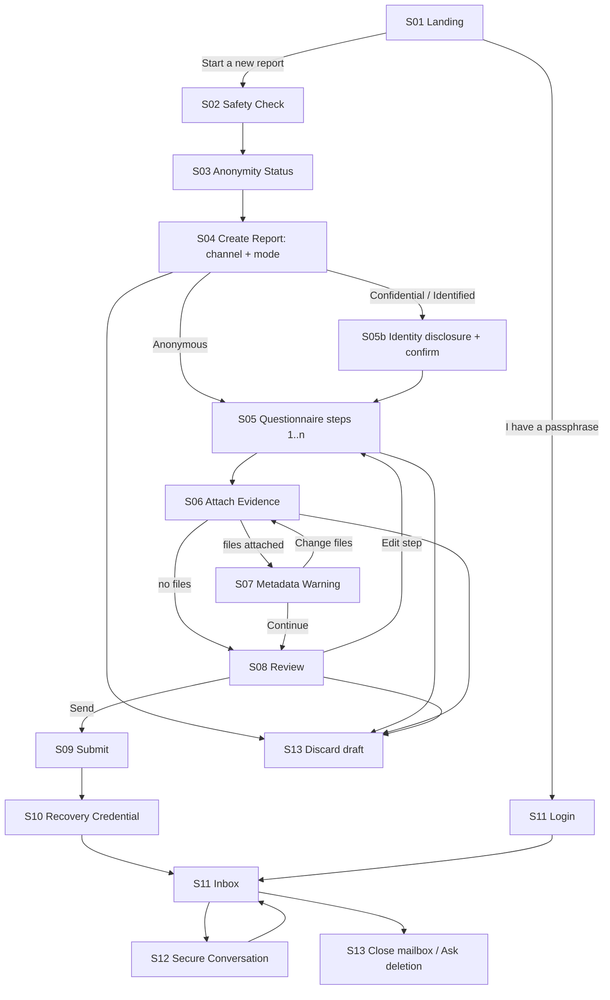
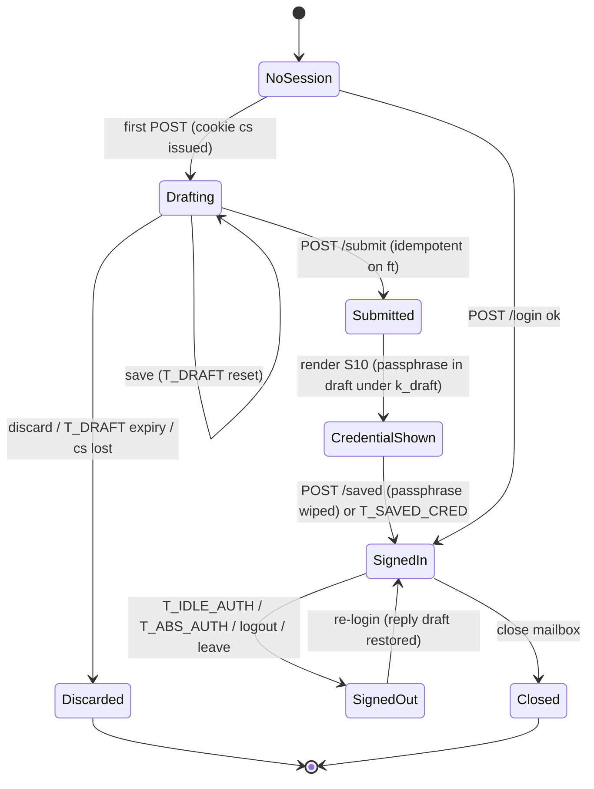

# 11 — Source User Interface Specification
Status: Draft v1.0 · Edition applicability: both (identical in CE and EE; source UI is Trust Path, AGPL, ADR-020) · Owner: Source Experience team (with Security Architecture and Accessibility review)

## 1. Purpose and scope

This document specifies the source-facing user interface:
- **Tier W** is the server-rendered, no-JS web UI served by C-06 over the onion service C-05. It is the default.
- **Tier V** covers the differences for the Candor Source App (C-03) and the WEBCAT-verified web bundle (ADR-004).

It defines:
- design principles;
- the global page contract: headers, CSP, response size classes, sessions, timeouts, forms and errors;
- the mode banner;
- each screen of the flow Landing → Safety Check → Anonymity Status → Create Report → Questionnaire → Attach Evidence → Metadata Warning → Review → Submit → Recovery Credential → Return Inbox → Secure Conversation → Delete/Abandon;
- anti-dark-pattern rules and the third-party prohibition.

Guidance **content** is owned by `05-SOURCE-OPSEC.md`. Accessibility and i18n process are owned by `26-ACCESSIBILITY.md`. This document owns how that content and those rules are rendered and enforced.

**Protection statement.** The UI is designed so that C-06 learns nothing about the source beyond what the source types or uploads:
- no fingerprinting, no third-party resources, no persistent client state, and uniform response sizes.
- It works at Tor Browser "Safest", which removes the JavaScript attack surface exploited in INC-27 and INC-28.
- It reduces mode confusion (THR-040).

This assumes Tor Browser is current and not compromised, and that the operator deploys the reviewed release (verified via `33-RELEASE-UPDATE-SECURITY.md`). Residual risks are in §15. Specifically, Tier W cannot protect submission plaintext from a live-compromised C-06/C-07 (ADR-004).

## 2. Context and dependencies

| Document | Dependency |
|---|---|
| `DECISIONS.md` | ADR-002, -003, -004, -005, -010, -011, -013, -014, -015, -023, -026, -027, -029 |
| `05-SOURCE-OPSEC.md` | Guidance cards GC-01..GC-38, placement map (§7), assistance features (§8) |
| `03-PRIVACY-ANONYMITY.md` | Metadata minimization, compelled-disclosure inventory |
| `04-CRYPTOGRAPHY.md` | Passphrase derivation (Argon2id), sealing to channel epoch keys, source keys |
| `06-SYSTEM-ARCHITECTURE.md`, `07-BACKEND.md`, `08-API.md` | C-06/C-07/C-08 behavior; routes; the draft store |
| `10-FILE-EVIDENCE-PIPELINE.md` | Upload limits, sealing of attachments, derivatives |
| `14-CASE-MANAGEMENT.md` | Channels, questionnaire schema, COI role lists, SLA values, source-visible status |
| `16-TOR-I2P.md` | Onion service, PoW, rate limiting (ADR-026) |
| `26-ACCESSIBILITY.md` | WCAG 2.2 AA, localization pipeline, AT test matrix |
| `33-RELEASE-UPDATE-SECURITY.md` | Source App updates (TUF), WEBCAT manifest signing |

## 3. Design principles

| # | Principle | Concrete rule |
|---|---|---|
| DP-1 | **Trust through honesty** | Every page shows the mode banner. Claims follow `05-SOURCE-OPSEC.md` GC-01. The UI never shows self-asserted "verified/secure" badges (a page cannot vouch for itself). |
| DP-2 | **Simplicity** | One task per page. ≤ 7 fields per page. Plain language (grade 8). A single primary action per page. |
| DP-3 | **Accessibility** | WCAG 2.2 AA with COGA patterns (`26-ACCESSIBILITY.md`), using native HTML elements only. |
| DP-4 | **Low bandwidth** | One HTTP response per page view, fixed size classes (§5.4), no images except inline decorative SVG, system fonts only. |
| DP-5 | **No-JS first** | Tier W contains zero `<script>`. All interaction is links, forms, `<details>` and CSS. Works at Tor Browser Safest [INC-27; B-SD-15; REQ-H-27]. |
| DP-6 | **Mobile where safe** | Responsive from 320 CSS px. Supported on Tor Browser for Android. iOS/Onion Browser works but is labelled weaker (GC-06). File inputs never use `capture`, so the camera is not opened directly with GPS-tagging defaults. |
| DP-7 | **i18n / RTL** | All strings externalized. CSS logical properties. `dir` per locale. User content isolated with `dir="auto"`. |
| DP-8 | **Keyboard** | Full operation by keyboard. Visible focus. DOM-order tab sequence. Skip link. |
| DP-9 | **Screen readers** | Unique page titles, one `<h1>`, landmarks, labelled controls, errors linked by `aria-describedby`. |
| DP-10 | **Zero third parties** | No third-party scripts, fonts, styles, images, iframes, CDNs, analytics, CAPTCHAs, error reporting, or accessibility overlays [INC-13, INC-46, INC-53; ADR-023; ADR-026]. |
| DP-11 | **Uniform traffic shape** | Every page falls into one of 3 padded size classes. No compression. No conditional sub-resources [B-AN-15, B-AN-16; ADR-011]. |
| DP-12 | **No residue** | No persistent cookies or Web Storage. `no-store`. `Clear-Site-Data` on exit. No downloads offered [REQ-H-23]. |
| DP-13 | **Stable, secret-free URLs** | Paths contain no identifiers, tokens or user data. No query strings carry state. Language is a path prefix. |

## 4. Client tiers

| Aspect | Tier W (default) | Tier V: Source App (C-03) | Tier V: WEBCAT web bundle |
|---|---|---|---|
| Delivery | HTML from C-06 | Signed, reproducible app with TUF updates; embeds Arti | JS/WASM from C-06 under `/v/`, verified by WEBCAT in the browser [B-CR-37, B-CR-38] |
| JavaScript | None | N/A (native UI) | Required (so it cannot run at Safest) |
| Where encryption happens | C-07 on the server, in RAM (ADR-004 honest statement) | On device | In browser |
| Recipient key check | Server-listed recipients (labelled "as listed by this site") | Verified against C-14 transparency log; fingerprints shown | Verified against C-14 |
| Metadata cleaning | None; warning only (`05` SOPS-017) | Local clean + findings (`05` §8.4) | Local clean (WASM) |
| Upload padding | Server-side after receipt (ADR-011); request size visible to network observers at Tor-cell granularity | Client pads to bucket before upload | Client pads |
| Drafts | Server-held ciphertext keyed by a client-held cookie secret (§5.6) | Memory only; discarded on close | Memory only |
| Resumable uploads | No | Chunked within one session only; no cross-session resume (THR-047) | Same as App |
| Default availability | Enabled | Enabled when the operator publishes the app download on C-37 | **Disabled by default.** An ADVANCED config enabled only when WEBCAT enforcement ships in Tor Browser |

## 5. Global page contract (Tier W)

### 5.1 Page template

```
<html lang="{bcp47}" dir="{ltr|rtl}">
<head> <meta charset="utf-8"> <meta name="viewport" content="width=device-width, initial-scale=1">
       <meta name="referrer" content="no-referrer"> <link rel="icon" href="data:,">
       <title>{Mode} · {Step name} · {Org} secure reporting</title>
       <style>/* single inline stylesheet, hash-pinned in CSP */</style></head>
<body>
 <a class="skip" href="#main">Skip to main content</a>
 <header>  [MODE BANNER §5.2]  {Org label}  [Step n of N]  </header>
 <main id="main" tabindex="-1">  <h1>…</h1>  [error summary if any]  …  </main>
 <footer> [Help & safety guide] [How this site protects you] [Language ▾ list] [Leave] </footer>
 <!-- padding to size class -->
</body></html>
```
- Help links sit in the same place and order on every page (WCAG 3.2.6 Consistent Help).
- "Leave" is a `<form method="post" action="/{lang}/leave">` button (`05` §8.11).
- The Language control is a `<details>` list of links to the same path under another prefix. The draft survives (it is bound to the cookie, not the language).

### 5.2 Mode banner (ADR-002)

| State | When | Banner text (EN master, `sui.mode.*`, `sec:critical`) | Non-color cue |
|---|---|---|---|
| ANONYMOUS | Default. All onion pages until identity is disclosed | **ANONYMOUS** — You have not told us who you are. This site cannot see your internet address. | Solid 4 px border; shield glyph (decorative) |
| CONFIDENTIAL | Identity-disclosure step confirmed (S05b) or later disclosure | **CONFIDENTIAL — NOT ANONYMOUS** — You told us who you are. Only {custodian_label} can see your name, under strict rules. | Double border + diagonal hatch pattern; text "NOT ANONYMOUS" |
| IDENTIFIED | Channel allows it and the source chose it (S04/S05b) | **IDENTIFIED — NOT ANONYMOUS** — Your name will be shown to the people handling your report. | Double border + dotted pattern; "NOT ANONYMOUS" |
| CLEARNET (C-38 only) | Every page of the Confidential Clearnet Intake | **NOT ANONYMOUS** — This website can see your internet address. To report anonymously, use Tor Browser: {onion_address_text} | Same as CONFIDENTIAL |

Rules:
1. The banner is the first content in `<header>`, is not sticky (so it does not obscure focus, WCAG 2.4.11), and wraps at 400 % zoom.
2. The mode word is also the first word of `<title>`.
3. A mode change is announced by a dedicated confirmation page whose `<h1>` states the new mode.
4. The primary submit/send buttons carry the mode in their label: "Send anonymously", "Send confidentially (with my name)", "Send with my name".
5. Banner colors meet 4.5:1 text contrast and 3:1 border contrast in both light and forced-colors modes. Meaning never depends on color.
6. Once CONFIDENTIAL or IDENTIFIED has been submitted, the mode can never revert to ANONYMOUS for that report (an honesty rule).

### 5.3 HTTP response headers (every C-06 response)

```
Content-Security-Policy: default-src 'none'; style-src 'sha256-{inline_css_hash}'; img-src 'self' data:;
  form-action 'self'; frame-ancestors 'none'; base-uri 'none'; sandbox allow-forms allow-same-origin;
  require-trusted-types-for 'script'
Cache-Control: no-store, max-age=0
Referrer-Policy: no-referrer
X-Content-Type-Options: nosniff
X-Frame-Options: DENY
Cross-Origin-Opener-Policy: same-origin
Cross-Origin-Embedder-Policy: require-corp
Cross-Origin-Resource-Policy: same-origin
Origin-Agent-Cluster: ?1
Permissions-Policy: accelerometer=(), ambient-light-sensor=(), autoplay=(), bluetooth=(), camera=(), clipboard-read=(),
  display-capture=(), encrypted-media=(), fullscreen=(), geolocation=(), gyroscope=(), hid=(), idle-detection=(),
  magnetometer=(), microphone=(), midi=(), payment=(), publickey-credentials-get=(), screen-wake-lock=(), serial=(),
  usb=(), xr-spatial-tracking=(), browsing-topics=()
X-Robots-Tag: noindex, nofollow, noarchive
Content-Language: {bcp47}
```
- **Prohibited headers:** `Server`, `X-Powered-By`, `ETag`, `Last-Modified`, `Set-Cookie` other than §5.6, `Content-Encoding`, `Alt-Svc`, `Report-To`/`NEL` (no reporting endpoints), and any `Link` preload.
- **`Date`:** omitted. This deviates from RFC 9110 and is documented; it avoids exposing onion-host clock skew. Knowledge (unverified): clock-skew fingerprinting of hidden-service hosts is a known research vector. `16-TOR-I2P.md` owns the final decision.
- **Methods:** only GET, HEAD and POST are accepted; others get 405 [B-SD-04 practice].
- **Tier V web bundle CSP** (`/v/` only): `default-src 'none'; script-src 'self' 'wasm-unsafe-eval'; style-src 'self'; connect-src 'self'; img-src 'self' data:; form-action 'none'; frame-ancestors 'none'; base-uri 'none'; require-trusted-types-for 'script'; trusted-types candor`. This must equal the CSP in the WEBCAT manifest [B-CR-40].

### 5.4 Response size classes and page-weight budgets (ADR-011)

| Class | Exact `Content-Length` | Used for | Max unpadded content |
|---|---|---|---|
| P1 | 65,536 bytes | All pages by default, including guidance, forms, errors, busy and leave | 61,440 bytes (inline CSS ≤ 20,480; inline SVG total ≤ 4,096) |
| P2 | 262,144 bytes | Review (S08) and Conversation (S12) when content exceeds P1 | 258,048 bytes |
| P3 | 1,048,576 bytes | Only if S12 cannot paginate below P2 (a single message is ≤ 64 KiB, so this should be unreachable; kept as a safety valve) | 1,044,480 bytes |

Rules:
1. Padding is an HTML comment of ASCII spaces appended before `</body>`, inserted after rendering. Responses are never compressed.
2. S12 paginates at ≤ 3 maximum-size messages per page, or whatever fits P2.
3. HTTP 3xx redirects are not used in the source flow. POST responses render the next page directly (200). Repeated POSTs are made idempotent by the form token (§5.7).
4. Each page view is **exactly one** HTTP request. Favicon requests are suppressed (`href="data:,"`). There are no sub-resources.
5. Performance budget: P1 fully rendered in ≤ 4 s at 256 kbit/s with 1.5 s RTT (Tor median-like conditions), measured in CI with a throttled Tor Browser profile.
6. Request bodies (uploads) are not padded in Tier W (a limitation; see §15).

### 5.5 Routes (Tier W; all under `/{lang}/`)

| Route | Method | Screen |
|---|---|---|
| `/` | GET | S01 Landing |
| `/safety` | GET | S02 Safety Check |
| `/status` | GET | S03 Anonymity Status |
| `/new` | GET, POST | S04 Create Report |
| `/q` | GET, POST | S05 Questionnaire (step number carried in the form body, not the URL) |
| `/identity` | GET, POST | S05b Identity disclosure |
| `/files` | GET, POST | S06 Attach Evidence |
| `/files/check` | GET, POST | S07 Metadata Warning |
| `/review` | GET, POST | S08 Review |
| `/submit` | POST | S09 Submit, which renders S10 |
| `/saved` | POST | S10 confirmation |
| `/login` | GET, POST | S11 Return Inbox (login) |
| `/inbox` | GET | S11 Inbox |
| `/conversation` | GET, POST | S12 |
| `/end` | GET, POST | S13 Delete / Abandon / Close |
| `/leave` | POST | Leave page |
| `/extend` | POST | Session extension |

Route registry is deny-by-default and audience-bound to `source-web` (ADR-029).

### 5.6 Sessions, cookies, timeouts and safe draft preservation

**Cookie.** There is exactly one cookie: `__Host-s=<base64url(cs)>; Path=/; Secure; HttpOnly; SameSite=Strict`. It has no `Expires` or `Max-Age`, so it is session-only.
- `cs` is 256 random bits generated by C-07 using the OS CSPRNG.
- C-07 derives:
  - `h = HKDF(cs, "candor/src/handle")`, used for lookup;
  - `k_draft = HKDF(cs, "candor/src/draft")`;
  - `k_sess = HKDF(cs, "candor/src/sess")`.
- C-08 stores only `SHA-256(h)`. `cs` is never stored server-side.
- Knowledge (unverified): Tor Browser treats `http://*.onion` as a secure context and accepts `Secure`/`__Host-` cookies. This is verified per release by test TST `sui-cookie-onion`.

**Draft store.**
- Everything the source has entered before submission (answers, identity block, file display names, chosen mode, and later the generated passphrase until confirmed) is stored in C-08 as AEAD ciphertext under `k_draft`.
- Attachment *content* is sealed immediately on upload to the channel epoch key (ADR-008). The source can remove a file but cannot re-download it.
- Draft expiry is stored at 1-hour granularity. The draft is deleted on submit, discard, or expiry.

| Timer | Value (default; config SAFE range) | Behavior |
|---|---|---|
| `T_DRAFT` | 24 h after the last save (range 20–48 h) | Draft ciphertext is purged at expiry. The ≥ 20 h lower bound satisfies the WCAG 2.2.1 twenty-hour exception without a warning mechanism. |
| `T_IDLE_AUTH` | 30 min (range 15–60) | After passphrase login, the wrapped source seed held in C-07 RAM (wrapped under `k_sess`) is dropped. The page shows a CSS-revealed warning at `T_IDLE_AUTH − 5 min` (§5.6.1) with a "Stay signed in" button (POST `/extend`), which may be used an unlimited number of times. |
| `T_ABS_AUTH` | 4 h (range 1–8) | Absolute re-login is required. The warning appears at −10 min. |
| `T_SAVED_CRED` | 60 min | The passphrase is re-displayable (S10) until the source confirms "I have saved it" or this timer expires, so an interrupted response does not lose the credential. |

**Draft-preserving re-authentication.** If a POST (for example a reply on S12) arrives after `T_IDLE_AUTH` or `T_ABS_AUTH`, C-07 first stores the posted text and file references as a reply draft under `k_draft`, then renders the login page with "You were signed out for safety. Your unsent message is saved. Enter your passphrase to continue." After login, the draft is restored in the form (WCAG 2.2.5 behavior).

**Closing the browser** (or Tor Browser "New Identity") destroys `cs`. The draft then becomes undecryptable and is purged at `T_DRAFT`. S04 and S06 state this: "Your draft is kept only while this Tor Browser window stays open."

#### 5.6.1 CSS-only timeout warning
Each authenticated page includes a `<div class="timeout-warn" role="status">` block. It contains "You will be signed out in about 5 minutes for your safety" and a "Stay signed in" form button. The block is hidden by CSS and revealed by `animation: reveal 0s linear {T_IDLE_AUTH − 5min} forwards`. This needs no JavaScript. Screen-reader announcement of the reveal is not guaranteed (§15). The static text near the page top therefore also says: "For your safety, you are signed out after 30 minutes without activity." If `prefers-reduced-motion` is set, the reveal still occurs (it is not motion).

### 5.7 Forms, validation and errors

- **CSRF and idempotency.** Every form carries a hidden `ft`: a 128-bit single-use token bound to the session, which is also the idempotency key. POSTs must carry a valid `ft` plus an `Origin` header equal to the onion origin (or `null` is rejected). `SameSite=Strict` also applies.
- **Validation is server-side only.** HTML constraint attributes (`required`, `maxlength`) are added for assistance, but the server is authoritative.
- **Error pattern:**
  1. Re-render the same page with the posted values preserved (escaped).
  2. Insert an error summary as the first element of `<main>` after `<h1>`: `<div class="error-summary" tabindex="-1" autofocus aria-labelledby="err-title">`. It contains "There is a problem" and a list of links to each invalid field.
  3. Each invalid field gets `aria-invalid="true"` and an inline message linked via `aria-describedby`.
  4. `<title>` is prefixed with "Error: ".
- **No POST error path may discard text the source typed.** If rate limiting, busy state or session expiry is hit, the body is first saved to the draft (§5.6). The error page says "Your text is saved."
- **Output encoding:** all user and recipient content is HTML-escaped, rendered as plain text with line breaks preserved (`white-space: pre-wrap`), and never auto-linked. There is no Markdown and no HTML. URLs in replies appear as inert text [B-GL-39 CVE-2024-38521 lesson].
- **Input limits:**

| Field | Limit |
|---|---|
| Short text | 500 chars |
| Long text | 60,000 chars (fits the 64 KiB bucket with UTF-8 headroom per ADR-011; the server rejects more than 65,536 bytes UTF-8) |
| Radio/checkbox values | From an allow-list |
| Total per report (text) | 256 KiB |

### 5.8 Progress indicator
Text "Step 3 of 7: What happened", plus an ordered list in `<nav aria-label="Report steps">` showing completed, current (`aria-current="step"`) and upcoming steps. Completed steps are links (GET, re-render from draft). There is no percentage bar and no timers.

### 5.9 Busy, error and outage pages

| Page | Status | Content |
|---|---|---|
| S90 Busy | 429 | "Many people are using this site right now. Wait a minute, then choose Try again. Your text is saved." Single "Try again" button: a form POST to the same action, which re-submits the saved draft, not the lost body. No auto-refresh. |
| S91 Not found | 404 | Generic text plus links to Landing, Help and Leave |
| S92 Error | 500 | "Something went wrong. Your draft is kept for 24 hours in this browser session." No stack traces, IDs or hostnames [INC-34] |
| S93 Maintenance | 503 | "This site is being updated. Try again later. We never offer an anonymous version of this site anywhere else." (GC-11) |
| S94 Signed out | 200 | See §5.6 |

All of these pages are class P1.

## 6. Flow



Draft/session state machine:


## 7. Screen specifications

Each screen lists its purpose, content, fields, validation, no-JS behavior, errors, a11y notes and a wireframe. All screens follow §5. "JIT" refers to the `05-SOURCE-OPSEC.md` §7 placement.

### S01 Landing
- **Purpose:** orient the visitor, state the key protections and limits, and branch to a new report or a returning login.
- **Content:**
  - `<h1>` "{Org} secure reporting".
  - A 2-sentence description of the channel purpose.
  - A "Before you start" box with 3 bullets: don't use a work device or work network (GC-04/GC-09); use Tor Browser at Safest (GC-07); the site cannot see your internet address, but it can't protect a monitored device (GC-01).
  - The JS-on warning, CSS-revealed (`05` §8.2).
  - Two equal-size buttons (links): "Start a new report" and "I have a passphrase".
  - Links: "Read the safety guide" and "How this site protects you".
  - GC-03 footer line.
- **Fields:** none. **Validation:** n/a. **No-JS:** fully static.
- **Errors:** n/a.
- **A11y:** the JS warning uses `role="note"`, not an alert. The primary buttons are links styled as buttons with a 44×44 px minimum target.
```
+--------------------------------------------------------------+
| [#] ANONYMOUS - You have not told us who you are. This site  |
|     cannot see your internet address.                        |
| Acme Corp secure reporting                    Step - of -    |
+--------------------------------------------------------------+
| Report a concern safely                                      |
| Tell the Audit Committee about fraud or misconduct.          |
| .-Before you start-----------------------------------------. |
| | * Don't use a work computer, work phone or work network. | |
| | * Use Tor Browser set to "Safest".                       | |
| | * We can't see your internet address, but we can't       | |
| |   protect a computer your employer watches.              | |
| '----------------------------------------------------------' |
| [!] JavaScript is on. Set Tor Browser to Safest. (CSS only)  |
|  [ Start a new report ]   [ I have a passphrase ]            |
|  Read the safety guide  |  How this site protects you        |
+--------------------------------------------------------------+
| Help & safety guide | How this site protects you | Language v| Leave |
```

### S02 Safety Check
- **Purpose:** give the NORMAL-RISK essentials and track self-selection without collecting data.
- **Content:**
  - `<h1>` "Check these things first".
  - The 8 essentials (`05` §7.1) as a plain `<ul>`.
  - §4.2 self-selection text.
  - Guidance cards grouped A–I, each card a `<details>` with its normal text. High-risk text is a nested `<details>`.
  - "Continue" link to S03.
  - "Leave now" (the Leave form).
- **Fields:** none (SOPS-042). **Validation:** none.
- **No-JS:** `<details>` is native. Opening them sends no request.
- **Errors:** n/a.
- **A11y:** each `<summary>` is a level-2 or level-3 heading inside the summary. All are closed by default except the essentials. Reading order is essentials → self-selection → cards.
```
| ANONYMOUS - ...                                              |
| Check these things first                                     |
| * I'm on a personal device, not a work device                |
| * I'm not on a work or school network                        |
| * Tor Browser is set to Safest      ... (8 items)            |
| Are you at higher risk? Open the "Higher risk" parts if...   |
| > A. Before you start        > B. Devices and browsers       |
| > C. Networks and places     > D. Research and accounts ...  |
|                         [ Continue ]    [ Leave now ]         |
```

### S03 Anonymity Status
- **Purpose:** show the actual protection state and who will receive the report (REQ-H-21; INC-14).
- **Content** (a definition list `<dl>`):

| Item | Value (Tier W) |
|---|---|
| Connection | "Through Tor (onion address). This site cannot see your internet address." |
| Check the address | The onion address in 4-character groups, with "It should match the address on {info_site_address}. If it doesn't, leave." |
| Browser security | CSS-computed: "JavaScript is off ✓" / "JavaScript is on: set Safest" |
| Mode | Current mode + one-line meaning |
| How your report is protected | Tier W text (ADR-004 honest statement) |
| Who receives reports in this channel | List of recipient roles/names from the signed key directory snapshot, labelled "(as listed by this site)". Tier V: "(checked against the public key log ✓)" plus a 16-hex-character key fingerprint per recipient |
| People kept out | "You can name roles that must not see your report (next steps)." |
| Backup key | ADR-013 escrow statement |
| Software | Version and release hash (for monitors), labelled "as reported by this site" |

- **Fields:** none. **No-JS:** static.
- **A11y:** the `<dl>` has `<dt>`/`<dd>` pairs. The onion address groups are wrapped in `<span>` with `aria-label` giving the whole address, so screen readers do not read each group as a word (and `lang="en"`).
```
| How this site protects you                                   |
| Connection ......... Through Tor. We can't see your IP.      |
| Check the address .. abcd efgh ijkl ... (56 chars) .onion    |
| Browser security ... JavaScript is off  [ok]                 |
| Mode ............... ANONYMOUS                               |
| Protection ......... Locked on our server when it arrives... |
| Recipients ......... Audit Committee chair; External counsel |
|                      (as listed by this site)                |
| Backup key ......... None. No one outside the list can open. |
|                                         [ Continue ]          |
```

### S04 Create Report
- **Purpose:** choose the channel (if more than one) and the mode.
- **Fields:**
  1. **Channel** (radio group, `fieldset`/`legend` "Who should receive your report?"). Each option shows the channel name, the handling body, languages, and allowed modes. If only one channel exists, it is not shown and is recorded implicitly.
  2. **Mode** (radio group "Do you want to tell us who you are?"):
     - "No, stay anonymous (recommended)" — pre-selected (privacy by default);
     - "Yes, but keep my name confidential" — only if the channel allows CONFIDENTIAL;
     - "Yes, show my name to the people handling it" — only if the channel allows IDENTIFIED.
     Each option has a one-line consequence. The options have equal visual size.
- **Validation:** the channel must be in the allow-list and active; the mode must be allowed for the channel.
- **No-JS:** POST `/new` creates the draft and issues the cookie (§5.6). The response is S05 step 1, or S05b for a non-anonymous mode.
- **Errors:** "Choose who should receive your report." "This channel does not accept confidential reports; choose another option."
- **A11y:** the `legend` is the question. Consequence text is linked by `aria-describedby`.
```
| Step 1 of 7: Start                                            |
| Who should receive your report?                               |
| (o) Audit Committee - fraud, accounting (EN, FR)              |
| ( ) Ethics Office - workplace conduct (EN)                    |
| Do you want to tell us who you are?                           |
| (o) No, stay anonymous (recommended)                          |
|     We won't know who you are unless you tell us later.       |
| ( ) Yes, but keep my name confidential                        |
|     Only 2 named custodians can see your name, with approval. |
| Your draft is kept only while this Tor Browser window is open.|
|                                         [ Continue ]          |
```

### S05 Questionnaire (steps 1..n)
- **Purpose:** collect the report content using the channel questionnaire (`14-CASE-MANAGEMENT.md` schema).
- **Default template:**

| Step | Question | Type | Required |
|---|---|---|---|
| 2 | What is this about? | Single choice from channel categories + "Other" | yes |
| 3 | What happened? | Long text | yes |
| 3 | About when? | Month + year selects, "It is still happening" checkbox, "Not sure" | no |
| 3 | Where? (general place, e.g., "Finance department, head office") | Short text | no |
| 4 | Who is involved? (names or roles) | Long text | no |
| 4 | How do you know? | Multiple choice (saw it / was told / have documents / other) | no |
| 5 | About how many people could know these facts? (`05` §8.7) | Single choice | no |
| 5 | Has this been reported before? | Yes / No / Not sure | no |
| 6 | Should anyone be kept out of this report? (COI, ADR-015) | Checkbox list of channel-configured roles, with help text "People in these roles will be kept out before anyone can open your report." | no |
| 6 | Anything else? | Long text | no |

- **Field types permitted in the builder:** short text, long text, single choice, multiple choice, month-year, yes/no/not-sure.
- **Prohibited in ANONYMOUS channels:** name, email, phone, address, employee ID, exact date-time, file-in-question (SOPS-021).
- **Exact-date input** is available only as month + year. The help text reads "Use general dates if an exact date could point to you" (GC-30).
- **JIT guidance** beside long-text fields: "Keep it short and factual. Don't paste into AI tools, translators or grammar checkers." (SOPS-012). There is also a `<details>` "What details could point to me?" (GC-30).
- **Validation:** required fields; length limits (§5.7); choice values from the allow-list. Month-year cannot be in the future.
- **No-JS:**
  - Each step POSTs `/q` with `step=n` in the body. The server saves to the draft and renders the next step.
  - "Back" is a submit button with `name=nav value=back`, which also saves.
  - Conditional questions (per channel config) are evaluated server-side on the next render.
- **Errors:** per §5.7, for example "Tell us what happened. This is the only question you must answer."
- **A11y:**
  - Long text is a `<textarea>` with visible label, hint and the maximum length stated in text.
  - Radio groups use `fieldset` and `legend`.
  - Month-year uses two labelled `<select>` elements inside a `fieldset`.
  - Nothing auto-advances and there is no time limit.
```
| Step 3 of 7: What happened                                    |
| What happened? (required)                                     |
| Say what happened and where evidence can be found.            |
| Keep it short and factual. Don't paste into AI tools,         |
| translators or grammar checkers.                              |
| +----------------------------------------------------------+  |
| |                                                          |  |
| +----------------------------------------------------------+  |
| Up to 60,000 characters.                                      |
| > What details could point to me?                             |
| About when?  [Month v] [Year v]  [ ] Still happening          |
|           [ Back ]                      [ Save and continue ] |
```

### S05b Identity disclosure (conditional)
- **Purpose:** explicit, informed conversion to CONFIDENTIAL or IDENTIFIED (ADR-002, ADR-014).
- **Page 1 (fields):**
  - Full name (short text, `autocomplete="name"`);
  - Role or department (optional, `autocomplete="organization-title"`);
  - "How can the team contact you?" (radio: "Only through this secure mailbox (recommended)" / "Also by another way", which reveals a short-text field on the next render with the GC-36 warning).
  - Explanation: "Your name is locked separately. Only {custodian_label} can unlock it, with a recorded reason and two approvals."
- **Page 2 (confirmation):** `<h1>` "You are about to stop being anonymous". Two equal buttons: "Yes, share who I am" and "No, stay anonymous". After confirmation, the banner changes and the `<h1>` of the next page reads "Your report is now CONFIDENTIAL".
- **Reversal:** before submit, "Remove my name and stay anonymous" appears on S08. It deletes the identity block from the draft and returns the mode to ANONYMOUS. After submit, it cannot be reversed.
- **Validation:** a name is required for CONFIDENTIAL and IDENTIFIED. Maximum 200 characters.
- **Sealing:** the identity block is sealed separately to the Identity Custodian key set at submit (ADR-014) and never merged into case content.
- **A11y:** `autocomplete` tokens are used only on this page (WCAG 1.3.5). Confirmation buttons are of equal prominence.

### S06 Attach Evidence
- **Purpose:** optionally attach files.
- **Content:**
  - `<h1>` "Add files (optional)".
  - The GC-22/GC-23 short text "Describe or retype when you can. Files can hold hidden information."
  - The configured limits, shown as text: "{max_files} files, {max_total} in total" (values from `10-FILE-EVIDENCE-PIPELINE.md`).
  - Time guidance: "Large files can take many minutes over Tor. Keep this page open."
- **Fields:**
  1. `<input type="file" name="f" multiple>`, with **no** `accept` restriction and **no** `capture` attribute;
  2. checkbox "Replace file names with plain names (recommended)", checked by default (SOPS-014);
  3. after upload, a list of attached files, each with a neutral name, a size shown in MB rounded, an optional "Describe this file" short text, and a "Remove" button.
- **Validation:** count and total size are enforced while streaming (C-07 aborts at the limit and returns S06 with an error). Empty files are rejected.
- **No-JS:** POST multipart `/files`. The browser shows native upload progress only. The response re-renders S06 with the list. Content is sealed on arrival (§5.6).
- **Errors:** "This file is too large. The limit is {max_total} in total." "The upload stopped. Please try again. Files already listed are saved."
- **A11y:** the file input has a visible label. The attached-files list is a `<table>` with a caption. Each "Remove" button's accessible name includes the file name ("Remove file-02.pdf").
```
| Step 5 of 7: Add files (optional)                             |
| Describe or retype when you can. Files can hold hidden info.  |
| Choose files: [ Browse... ]   (up to 20 files, 500 MB total)  |
| [x] Replace file names with plain names (recommended)         |
|                                   [ Upload ]                  |
| Attached:                                                     |
|  file-01.pdf   2 MB   Describe: [__________]   [ Remove ]     |
|  file-02.jpg   3 MB   Describe: [__________]   [ Remove ]     |
|           [ Back ]                      [ Continue ]          |
```

### S07 Metadata Warning
- **Purpose:** just-in-time metadata, canary and watermark warnings (SOPS-015).
- **Content:** a table with one row per file: neutral name, class (by extension; `05` §7.2) and the risks for that class. A shared list of the GC-25/GC-26/GC-27 points follows. Tier W also shows the honest statement ("We can't remove hidden data before your file is locked…").
- **Fields:** two buttons: "Change files" and "Continue with these files". No checkbox.
- **No-JS:** POST `/files/check`.
- **Tier V:** per-file actual findings, plus **Clean (recommended)** / **Send original** / **Remove** (`05` §8.4).
- **A11y:** the table has header cells. Risks are `<ul>` lists inside cells.
```
| Before you send these files                                   |
| We can't remove hidden data on this website. The team views a |
| cleaned copy, but your original is kept as evidence.          |
| file-01.pdf | PDF   | author, software, older versions inside |
| file-02.jpg | Photo | exact location, time, phone model;      |
|             |       | what's in the background                |
| Also: unique copies (canary traps), invisible marks, printer  |
| dots on photos of printed pages.                              |
|        [ Change files ]          [ Continue with these files ]|
```

### S08 Review
- **Purpose:** final check before sending. Surfaces identity hints and style tips. Makes the mode unmistakable.
- **Content (in order):**
  1. Mode summary box (banner repeated with a "Change" link).
  2. Channel and recipients.
  3. "People kept out".
  4. Answers, each with an "Edit" link to its step.
  5. Files (neutral names, class).
  6. Identity-hint notices (`05` §8.5; non-blocking; each links to the field).
  7. Writing checklist (GC-31).
  8. Timing reminder (GC-34 short).
  9. Primary button labelled with the mode: "Send anonymously".
  10. Secondary: "Discard this report".
- **Validation:** re-validates all steps. If any required answer is missing, shows an error summary with links.
- **No-JS:** POST `/submit` includes `ft`.
- **A11y:**
  - Sections use `<h2>`. "Edit" link names include the question ("Edit: What happened?").
  - Identity notices are in a `<section aria-labelledby>` headed "Check for details that could point to you".
  - The page may be class P2.
```
| Step 7 of 7: Check and send                                   |
| .-Your report will be sent ANONYMOUSLY--------------[Change]-.|
| To: Audit Committee (as listed by this site)                  |
| Kept out: Chief Financial Officer                             |
| What happened?  "In March the ... "                  [Edit]   |
| Files: file-01.pdf (PDF), file-02.jpg (Photo)        [Edit]   |
| Check for details that could point to you                     |
|  ! "What happened?" line 3 looks like an email address [Edit] |
| Writing check: short? no greetings? no usual phrases?         |
|  [ Send anonymously ]                  Discard this report    |
```

### S09 Submit
- **Purpose:** commit the report atomically.
- **Behavior:**
  1. POST `/submit`.
  2. C-07 generates the passphrase (ADR-005) and derives keys in RAM.
  3. It seals content to the channel epoch key, the identity block (if any) to custodians, and display metadata.
  4. It stores the envelope, stores the passphrase in the draft under `k_draft` until confirmed (`T_SAVED_CRED`), deletes the draft content, and renders S10.
- **Idempotency:** a repeat POST with the same `ft` re-renders S10 from the draft-held passphrase. No duplicate report is created.
- **Busy (PoW/rate limit):** S90 with "Your report is saved, not yet sent."
- **Errors:** "Your report was not sent. Your draft is safe in this browser window for 24 hours. [Try again]".
- **Timing text:** the page never shows a clock time. S10 shows "Received: YYYY-MM-DD (UTC)" (ADR-010).

### S10 Recovery Credential
- **Purpose:** show the Source Passphrase once and ensure it is kept safely (ADR-005; GC-32).
- **Content:**
  - `<h1>` "Your report was sent".
  - "Received: 2026-09-30 (UTC)".
  - "What happens next: the team aims to confirm receipt within {ack_days} days" (from the channel SLA).
  - `<h2>` "Your passphrase". The 10 words as an `<ol>` with `lang="en" dir="ltr"` and large type.
  - A read-only single-line `<input readonly>` with all 10 words space-separated, for easy select and copy.
  - A `<details>` "Spell out each word" (letters separated by spaces) for screen-reader and dyslexic users.
  - GC-32 normal text, with high-risk in `<details>`.
  - Buttons: "I have saved my passphrase" (POST `/saved`) and "Leave" (POST `/leave`).
- **Prohibited:** download, print, QR, email, "copy to clipboard" script (SOPS-022).
- **No-JS:** static.
- **Errors:** if `T_SAVED_CRED` expires before confirmation, the passphrase is wiped. The page says so, and that the report was still delivered.
- **A11y:**
  - Words are in a list, so screen readers announce "list, 10 items".
  - The read-only field has a label: "All 10 words on one line, to copy".
  - The heading structure lets users jump straight to the passphrase.
```
| Your report was sent                                          |
| Received: 2026-09-30 (UTC). The team aims to reply in 7 days. |
| Your passphrase                                               |
|  1. cobalt     2. ripple    3. anthem   4. gravel  5. sonnet  |
|  6. mosaic     7. tundra    8. whistle  9. ember  10. lantern |
| One line: [cobalt ripple anthem gravel sonnet mosaic ... ]    |
| > Spell out each word                                         |
| It is the only way to read replies. No one can reset it.      |
| * Write it on paper, keep it private...  > Higher risk        |
| [ I have saved my passphrase ]               [ Leave ]        |
```

### S11 Return Inbox (login and inbox)
- **Login purpose:** authenticate with the passphrase.
- **Login content:**
  - Reminder box: "Tor Browser at Safest, personal device, not a work network. Come back every few days, not every hour." (GC-33 short).
  - Passphrase field: `<input type="text" autocomplete="off" autocapitalize="none" spellcheck="false">`. Paste is allowed (WCAG 3.3.8). The label is "Your 10-word passphrase".
  - Button: "Open my mailbox".
  - Note: "Opening your mailbox can take up to 30 seconds."
- **Login validation:**
  - Normalize: NFC, lower-case, split on whitespace, hyphens or commas.
  - Exactly 10 tokens; each must be in the wordlist. Messages: "Enter all 10 words (you entered 9)"; "Word 4 is not in the word list. Check the spelling." The page never echoes words.
  - Authentication failure: "These words did not open a mailbox. Check each word and try again." (generic).
  - Rate limits (ADR-026) lead to S90.
- **Inbox content:**
  - `<h1>` "Your report".
  - A status line from the source-visible status set (Received, Acknowledged, In progress, Closed; configured in `14-CASE-MANAGEMENT.md`).
  - Messages newest-first, grouped by date "(UTC)". Each message shows the sender label (team or display name) and the text.
  - Actions: "Write a message", "Add files", "Close mailbox", "Log out".
  - If the passphrase has more than one report (optional per ADR-005), a report list is shown first.
  - **Not shown:** unread markers, last-visit time, read receipts, typing or presence (ADR-010; SOPS-031).
- **A11y:** messages are `<article>` elements with a heading "Message from {sender}, {date}". The status line is plain text near the top.
```
| Open your mailbox                                             |
| Tor Browser at Safest, personal device, not a work network.   |
| Your 10-word passphrase                                       |
| [__________________________________________________________]  |
| This can take up to 30 seconds.        [ Open my mailbox ]    |
+---------------------------------------------------------------+
| Your report          Status: Acknowledged                     |
| 2026-10-04 (UTC) - Message from Audit Committee team          |
|   Thank you. We have received your report and ...             |
| [ Write a message ] [ Add files ] [ Close mailbox ] [Log out] |
```

### S12 Secure Conversation
- **Purpose:** two-way messaging and additional files.
- **Content:**
  - The thread (paginated ≤ P2).
  - GC-36 short: "Only talk about your report here. The team should never ask you to move to email, phone or chat."
  - Reply form: long text (60,000 chars) with the JIT AI warning; optional files (same rules as S06 + S07 when files are present); "Send message" (the label includes the mode if not anonymous: "Send message (confidential)").
- **After send:** "Your message was sent. The team will see it after their next update. Replies appear when you open your mailbox." No time estimate finer than "usually within a day" (ADR-009 batch pull).
- **Identity disclosure later:** the link "I want to tell the team who I am" leads to S05b, applied to the existing report. The banner changes on confirmation.
- **Validation:** non-empty text or ≥ 1 file; limits.
- **Errors:** as §5.7, with draft-preserving re-authentication (§5.6).
- **A11y:** the form follows the thread in DOM order, and a skip link "Skip to reply form" is provided.

### S13 Delete / Abandon / Close
Three variants:
1. **Discard draft** (before submit). "Discard this report? Everything you entered and the files you added will be deleted." Buttons of equal prominence: "Discard" / "Keep working". Effect: draft ciphertext and sealed draft attachments are deleted, the session ends, and `Clear-Site-Data` is sent.
2. **Close mailbox** (after submit, signed in). Explains: "Your passphrase will stop working. You won't be able to read replies or add information. Your report stays with the team. The team will see that you closed your mailbox." Buttons: "Close my mailbox" / "Keep it open". Effect: the source auth verifier is deleted (`05` §8.12).
3. **Ask the team to delete my report.** A structured message to the team: "The source asks that this report be deleted." Honest text: "The team decides according to the law and their rules. They may need to keep some records."

A11y: the confirmation `<h1>` names the consequence. There is no countdown and no "Are you sure you want to lose protection?" style guilt copy.

### Leave page
`<h1>` "You have left". "Now choose **New Identity** in the Tor Browser menu, then close Tor Browser." (GC-07). No links except "Back to start". `Clear-Site-Data` is sent.

## 8. Tier V differences

| # | Area | Tier V behavior |
|---|---|---|
| V-1 | Code integrity | App: TUF-verified, threshold-signed, transparency-logged releases (33). Refuses to run after its end-of-life date (REQ-H-35). Web bundle: runs only under WEBCAT enforcement. The bundle never displays its own "verified" claim; verification is shown by browser or extension chrome only (SOPS-034). |
| V-2 | Transport | Source App: embedded Arti, onion-only, no clearnet fallback. No background or always-on connections (INC-35; REQ-H-57). Checking for replies is manual only. |
| V-3 | Key verification | Before encrypting, the client verifies channel epoch keys and recipient keys against C-14 inclusion and consistency proofs, and refuses on failure (INC-14, INC-62, INC-67). S03 shows the recipient list with fingerprints and a "checked ✓" state. |
| V-4 | Encryption | Content, files and identity blocks are encrypted on device (04). The server never sees plaintext. |
| V-5 | Metadata | Local analysis and cleaning (`05` §8.4). Identity hints and style highlights run locally. |
| V-6 | Padding | The client pads messages to 4 KiB buckets and files to the ADR-011 geometric buckets before upload. Upload chunks are fixed-size 64 KiB. |
| V-7 | Drafts | Held in memory only, never written to disk. Closing the app prompts "Discard your draft?". An idle privacy screen appears after 10 min (it covers content and is dismissed by any key; it is not a security boundary). |
| V-8 | Passphrase | Generated locally (ADR-005). The display rules of S10 apply. The app offers a mask/unmask toggle on login. Clipboard is cleared 60 s after copying the passphrase. |
| V-9 | Platform hygiene | The app sets OS flags to exclude its windows from recents/app-switcher thumbnails and screen capture where supported (Android `FLAG_SECURE`; macOS `NSWindow.sharingType = .none`; Windows `WDA_EXCLUDEFROMCAPTURE`). It disables OS cloud text services on inputs (SOPS-013), writes no logs, and sends no crash reports. |
| V-10 | Accessibility | The same WCAG 2.2 AA target. Native accessibility APIs are tested with NVDA, JAWS, VoiceOver, Orca and TalkBack (26). |
| V-11 | Discoverability | The app's presence on a device is a signal (GC-38). The app uses a neutral name and icon configured per deployment, but this is not camouflage and is not claimed to provide deniability. |

## 9. Third-party prohibition

The following are prohibited on every source-facing surface (C-06, C-03, C-37, C-38):
- third-party origins of any kind: scripts, styles, fonts, images, frames, beacons, prefetch or DNS-prefetch;
- CDNs and TLS-terminating proxies [INC-54; B-GL-39 CVE-2024-55888];
- analytics and telemetry (ADR-023);
- A/B testing;
- error and crash reporting services;
- CAPTCHAs of any kind (ADR-026; WCAG 3.3.8);
- accessibility overlays (26);
- social widgets;
- web push;
- remote fonts (system font stack only: `font-family: system-ui, -apple-system, "Segoe UI", Roboto, "Noto Sans", sans-serif`);
- external links (SOPS-005);
- `<iframe>`, `<object>`, `<embed>`, `<video>`, `<audio>` (no in-browser preview of submitted files; REQ-H-36).

Build-time enforcement: template lint, a dependency allow-list, and a crawler that fails CI on any absolute URL whose origin is not the onion origin.

## 10. Anti-dark-patterns list (normative)

| ID | Prohibited pattern | Rule |
|---|---|---|
| ADP-01 | Pre-selected disclosure | Identity disclosure is never pre-selected or defaulted. ANONYMOUS is the default. |
| ADP-02 | Confirmshaming | No guilt copy such as "No, I don't care about my safety". Decline options are neutral ("No, stay anonymous"). |
| ADP-03 | Unequal choice weight | Choices with different privacy consequences have equal size and styling. Only the primary *navigation* action is emphasized. |
| ADP-04 | False urgency | No countdowns (except the session warning), "limited time" copy, or pressure to submit quickly. |
| ADP-05 | Social proof and metrics | No "N reports this month", no testimonials, no visitor counters (also THR-039 small cells). |
| ADP-06 | Self-asserted security badges | No "Verified", "100% secure", lock icons or seals asserted by the page itself (DP-1; DECISIONS §0). |
| ADP-07 | Contact harvesting | No "leave your email for updates", no optional contact fields in ANONYMOUS mode. |
| ADP-08 | Roach motel | Discarding, closing the mailbox and leaving are as easy as starting (≤ 2 actions each). |
| ADP-09 | Nagging | Warnings appear at the defined JIT points. They are not repeated as modal interruptions. There are no repeated "Are you sure?" prompts. |
| ADP-10 | Forced consent checkboxes | No "I agree" checkboxes that gate submission. Informed choice is by explicit buttons (S07, S05b). |
| ADP-11 | Hidden consequences | Every mode option states its consequence inline. The Send button names the mode. |
| ADP-12 | Misleading defaults on files | Filename replacement is ON by default. Nothing is silently uploaded or retained beyond the stated timers. |
| ADP-13 | Auto-advance and auto-submit | Nothing advances without a user action. There is no meta refresh. |
| ADP-14 | Disguised data collection | No hidden fields beyond `ft` and navigation values. No fingerprinting (ADR-003). |
| ADP-15 | Manipulative color | Red/green are not used to steer mode choice. Warning styling is reserved for actual risks. |

## 11. Content and localization rules

- All strings live in Fluent catalogs (`26-ACCESSIBILITY.md` I18N). Keys: `sui.<screen>.<element>`. Security-critical keys (mode banners, S05b, S07, S10, S13 consequences, GC texts) are tagged `sec:critical`.
- Reading level: grade 8 target (English master, CI-checked).
- Dates are shown as `YYYY-MM-DD (UTC)` or a localized long date at day granularity, with "(UTC)" always shown. Times are never shown.
- The passphrase is always rendered `lang="en" dir="ltr"` inside RTL layouts (ADR-005 wordlist).
- User content is wrapped in `<bdi>` or has `dir="auto"`. Layout uses CSS logical properties (`margin-inline-start` etc.). RTL mirroring is verified by the pseudo-locale `ar-XB` (26).

## 12. Accessibility summary (details in `26-ACCESSIBILITY.md`)

- Skip link; landmarks (`header`, `nav` for steps, `main`, `footer`); one `<h1>`; logical heading order.
- Focus indicator: 3 px outline, ≥ 3:1 against adjacent colors. Never removed. Not obscured (no sticky or fixed elements).
- Target size ≥ 44×44 CSS px for primary controls and ≥ 24×24 for all (WCAG 2.5.8).
- Reflow at 320 CSS px / 400 % zoom with no horizontal scroll except the onion-address `<code>`, which wraps with `overflow-wrap: anywhere`.
- Works with `forced-colors: active` (system colors; borders preserved) and with any `prefers-color-scheme`.
- No motion. No sound.
- Help in a consistent location (3.2.6). No redundant entry (3.3.7): answers persist in the draft and Review re-uses them.
- Accessible authentication (3.3.8): passphrase paste allowed, no cognitive test, no CAPTCHA.

## 13. Requirements

| ID | Requirement | Evidence | Threats | Component | Verification |
|---|---|---|---|---|---|
| SUI-001 | The Tier W source UI SHALL be fully functional, from Landing to Delete/Abandon, in Tor Browser at the "Safest" security level with zero `<script>` elements served. | REQ-H-27 (INC-27, INC-28); B-SD-15; ADR-003; ADR-004 | THR-008 | C-06 | TST: e2e suite `sui-e2e-safest` in Tor Browser (current stable) and Tails; TST: template lint `no-script` |
| SUI-002 | Every C-06 response SHALL carry the §5.3 headers exactly, and none of the prohibited headers. | B-GL-04; REQ-H-27, REQ-H-36; INC-34 | THR-006, THR-008, THR-036 | C-06 | TST: header conformance test over all routes and status codes; ST: CSP scanner (no `unsafe-*`, no external origins) |
| SUI-003 | The inline stylesheet SHALL be the only style source and SHALL be pinned by `sha256` in CSP. No `style` attributes SHALL be present. | B-GL-04 | THR-008 | C-06 | TST: build step computes hash; lint `no-style-attr` |
| SUI-004 | Each page view SHALL consist of exactly one HTTP request. No sub-resources SHALL be referenced (favicon `data:,`). | B-AN-15, B-AN-16; ADR-011 | THR-004 | C-06 | TST: HAR capture per screen in e2e = 1 request (+ form POST) |
| SUI-005 | Every C-06 HTML response SHALL be padded to exactly one of the P1/P2/P3 sizes (§5.4), SHALL NOT be compressed, and SHALL meet the unpadded budget of its class. | ADR-011; B-AN-16 | THR-004 | C-06 | TST: `sui-size-classes` asserts `Content-Length` ∈ {65536, 262144, 1048576} for all routes incl. errors; CI budget check |
| SUI-006 | The source UI SHALL load no resource from, link to, or submit to any origin other than its own onion origin, and SHALL include no third-party component listed in §9. | INC-13, INC-46, INC-53, INC-54; ADR-023 | THR-036, THR-006 | C-06, C-37 | TST: crawler `sui-origin-check`; dependency allow-list in CI; INSP |
| SUI-007 | C-06 SHALL NOT vary responses by User-Agent, Accept-Language or other client headers, and SHALL NOT perform browser fingerprinting. | ADR-003; B-AN R4 §2.2 | THR-006 | C-06 | TST: response diff across 5 UA/Accept-Language variants = byte-identical (except CSRF tokens) |
| SUI-008 | The UI SHALL use exactly one cookie `__Host-s` (session-only, Secure, HttpOnly, SameSite=Strict) carrying a 256-bit client secret. The server SHALL store only `SHA-256(HKDF(cs,"candor/src/handle"))`. | ADR-005; REQ-H-23; B-SD-02 (cookie prefixes) | THR-006, THR-015, THR-048 | C-06, C-07, C-08 | TST: cookie attribute test; DB inspection shows no `cs`; TST `sui-cookie-onion` in Tor Browser |
| SUI-009 | Pre-submission drafts and unsent replies SHALL be stored only as AEAD ciphertext under `k_draft` derived from the client-held cookie secret, SHALL expire `T_DRAFT` (default 24 h, min 20 h) after the last save, and SHALL be deleted on submit or discard. | WCAG 2.2.1 [B-CO-28]; R6 §C | THR-015, THR-014 | C-07, C-08 | TST: DB dump contains no draft plaintext canary; expiry job test; discard test |
| SUI-010 | Uploaded attachment content SHALL be sealed to the channel epoch key on arrival and SHALL NOT be retrievable by the source or C-06 afterwards. | ADR-008; ADR-012 | THR-014, THR-015 | C-07 | TST: no GET route returns attachment bytes; memory canary test (07) |
| SUI-011 | Signed-in sessions SHALL expire after `T_IDLE_AUTH` (default 30 min) idle and `T_ABS_AUTH` (default 4 h). A CSS-only warning with a "Stay signed in" control SHALL appear 5 min (idle) and 10 min (absolute) before expiry, and extension SHALL be unlimited for idle. | WCAG 2.2.1; B-SD-02 (session lifetimes) | THR-034 | C-06, C-07 | TST: timer tests; visual test of CSS reveal at accelerated clock; DEMO: SR walkthrough |
| SUI-012 | Any POST received after session expiry, under rate limiting or during busy state SHALL first persist the posted text and file references to the draft, and the resulting page SHALL state that the text is saved and restore it after re-authentication. | WCAG 2.2.5 (AAA, adopted); COGA [B-CO-36] | THR-032 | C-06, C-07 | TST: expire session → POST reply → login → form restored with canary text |
| SUI-013 | Every form SHALL carry a single-use 128-bit token `ft` bound to the session. POSTs SHALL be rejected unless `ft` is valid and `Origin` equals the onion origin. `ft` SHALL make submission idempotent. | ADR-029; B-GL-37 | THR-021, THR-033 | C-06 | ST: CSRF test suite; TST: double POST /submit → one report |
| SUI-014 | Routes SHALL be as in §5.5, carry no identifiers or user data in paths or query strings, and be registered deny-by-default with audience `source-web`. | ADR-029; B-GL-04 (no URI change) | THR-048, THR-021 | C-06 | TST: route-registry CI check; lint for query-string use |
| SUI-015 | Every source page SHALL display the mode banner (§5.2) as the first header content, with the mode word first in `<title>`, non-color cues, and the specified text per mode. | ADR-002; B-GL (R2 §8 ADOPT-1) | THR-040 | C-06, C-03, C-38 | TST: snapshot per mode; a11y tree check; INSP: forced-colors screenshot |
| SUI-016 | Primary send buttons SHALL name the mode ("Send anonymously", "Send confidentially (with my name)", "Send with my name"). | ADR-002 | THR-040 | C-06, C-03 | TST: button label per mode |
| SUI-017 | Identity disclosure SHALL require the S05b two-page flow with an explicit "Yes, share who I am" confirmation. Identity data SHALL be sealed separately to Identity Custodian keys, SHALL be removable before submit, and SHALL be irreversible after submit. | ADR-002; ADR-014; REQ-H-05 | THR-040, THR-018, THR-019 | C-06, C-07 | TST: flow tests; envelope inspection shows separate identity envelope |
| SUI-018 | C-38 pages SHALL display the CLEARNET "NOT ANONYMOUS" banner on every page and SHALL NOT offer an ANONYMOUS mode option. | ADR-002 | THR-040, THR-001 | C-38 | TST: C-38 template tests |
| SUI-019 | S03 SHALL display the §7 S03 items. In Tier W, the recipient list SHALL be labelled "as listed by this site". In Tier V, recipients SHALL be shown only after successful C-14 verification, with fingerprints. | REQ-H-14, REQ-H-21 (INC-14, INC-21); ADR-013 | THR-046, THR-040 | C-06, C-03, C-14 | TST: Tier V malicious-server harness injects an extra recipient → client aborts (ADR-027 harness) |
| SUI-020 | The questionnaire builder SHALL permit only the §7 S05 field types and SHALL reject identity field types for ANONYMOUS-capable channels. Date input SHALL be month-year only. | REQ-H-05; ADR-010 | THR-040, THR-011 | C-06, C-19 | TST: builder API negative tests |
| SUI-021 | The COI question (S05 step 6) SHALL list only channel-configured absolute roles, and its answers SHALL be applied before key wrapping per ADR-015. | ADR-015; INC-22 | THR-020 | C-06, C-10, C-22 | TST: flagged role member never receives case key (14/15 integration test) |
| SUI-022 | Server-side validation SHALL be authoritative, and error presentation SHALL follow §5.7 (error summary with `autofocus`, field `aria-invalid`, linked messages, "Error:" title prefix, preserved values). | WCAG 3.3.1, 3.3.3; B-CO-28 | — | C-06 | TST: a11y assertions; DEMO: NVDA/Orca error walkthrough |
| SUI-023 | All user and recipient content SHALL be HTML-escaped and rendered as plain text without auto-linking, Markdown or HTML interpretation. | B-GL-39 (CVE-2024-38521); REQ-H-36 | THR-008 | C-06 | ST: XSS corpus against every rendering path; TST |
| SUI-024 | Text inputs SHALL enforce the §5.7 limits server-side. Long text SHALL be ≤ 65,536 bytes UTF-8, and total report text ≤ 256 KiB. | ADR-011 | THR-032 | C-06, C-07 | TST: boundary tests |
| SUI-025 | The attach screen SHALL use `<input type="file" multiple>` without `capture` and without type restrictions, SHALL display configured limits as text, SHALL default filename replacement ON, and SHALL enforce limits while streaming. | `05` SOPS-014; REQ-H-08 | THR-009, THR-032 | C-06, C-07 | TST: template lint; oversized upload aborted at limit |
| SUI-026 | S07 SHALL be shown whenever files are attached, before S08, with per-class warnings, and SHALL require an explicit choice between "Change files" and "Continue with these files". | `05` SOPS-015; REQ-H-17 | THR-009, THR-010 | C-06, C-03 | TST: navigation guard test |
| SUI-027 | S08 SHALL present all answers with Edit links, the mode summary, recipients, kept-out roles, files, identity-hint notices (`05` SOPS-018) and the writing checklist, and SHALL re-validate before submit. | REQ-H-05; INC-32; WCAG 3.3.4 | THR-010, THR-040 | C-06 | TST; DEMO |
| SUI-028 | Submission SHALL be atomic and idempotent. On success, S10 SHALL be re-displayable for `T_SAVED_CRED` (60 min) or until "I have saved my passphrase", after which the passphrase ciphertext SHALL be deleted. | ADR-005 | THR-034 | C-07, C-08 | TST: drop connection after commit → resubmit → S10 shown, one report |
| SUI-029 | S10 SHALL show the 10-word passphrase as an ordered list plus a read-only one-line field and a spelled-out `<details>`, and SHALL NOT offer download, print, QR, email or scripted copy. | ADR-005; `05` SOPS-022; WCAG 3.3.8 | THR-034, THR-048 | C-06, C-03 | TST: DOM assertions; forensic-residue test (30) |
| SUI-030 | Dates shown to sources SHALL have day granularity with "(UTC)". The UI SHALL NOT show times, last-visit, unread or presence indicators. | ADR-010; `05` SOPS-031 | THR-011 | C-06, C-03 | TST: render tests; schema has no source last-seen |
| SUI-031 | Login SHALL accept pasted input, normalize whitespace, case and separators, report word-count and not-in-list errors without echoing words, and return a single generic message for authentication failure. | WCAG 3.3.8; ADR-005; B-SD-16 | THR-034 | C-06, C-07 | TST: normalization table tests; response diff between wrong-passphrase variants = identical |
| SUI-032 | Login attempts SHALL be rate-limited per circuit and globally, without persisting circuit identifiers, and SHALL NOT use CAPTCHAs. | ADR-026; B-GL (R2 ADOPT-5) | THR-033, THR-034 | C-05, C-06 | TST: rate-limit test; INSP: no circuit IDs in DB/logs |
| SUI-033 | The inbox and conversation SHALL render recipient messages as plain text, grouped by day, newest first, with sender label. In Tier V, each message's recipient signature SHALL be verified and invalid signatures shown as "Could not be checked — don't trust this message". | INC-62; REQ-H-64 | THR-046, THR-007 | C-06, C-03 | TST: Tier V tampered-signature test |
| SUI-034 | S12 SHALL display the GC-36 side-channel warning and SHALL allow later identity disclosure only via the S05b flow applied to the existing report. | REQ-H-21; ADR-002 | THR-040, THR-019 | C-06 | TST; INSP |
| SUI-035 | S13 SHALL provide Discard (pre-submit), Close mailbox and Ask-to-delete with the specified consequence text, equal-weight buttons and ≤ 2 actions each. Close SHALL invalidate the source auth verifier and notify the case. | ADR-025; `05` SOPS-032 | THR-034 | C-06, C-07, C-10 | TST: post-close login fails; case event present |
| SUI-036 | Logout, Leave, Discard, Close and submit completion SHALL send `Clear-Site-Data: "cache", "cookies", "storage"`. | REQ-H-23; B-SD-02 | THR-048 | C-06 | TST: header test |
| SUI-037 | The UI SHALL NOT use `localStorage`, `sessionStorage`, IndexedDB, Cache API, Service Workers, Web Push or persistent cookies. | REQ-H-23; REQ-H-57 | THR-048, THR-028 | C-06, C-03 | TST: lint; forensic diff (30) |
| SUI-038 | Error, busy, maintenance and not-found pages SHALL be generic, in class P1, and contain no stack traces, hostnames, IPs, internal IDs or version strings beyond the published release version. | INC-34; REQ-H-34 | THR-016, THR-044 | C-06 | ST: OnionScan-class scan; TST: forced 500 page inspection |
| SUI-039 | No page SHALL use meta refresh, auto-advance or time-limited interactions other than the §5.6 session timers. | WCAG 2.2.1, 2.2.2; ADP-13 | — | C-06 | TST: lint `no-meta-refresh` |
| SUI-040 | The anti-dark-patterns list (§10) SHALL be applied. Each release SHALL pass an ADP checklist review. | ADP list; B-CO-36 | THR-040 | C-06, C-03 | INSP: release ADP checklist signed by UX and privacy leads |
| SUI-041 | Language SHALL be selected via path prefix and deployment default only. The UI SHALL NOT auto-negotiate `Accept-Language`, and switching language SHALL preserve the draft. | ADR-003; DP-13 | THR-006 | C-06 | TST: Accept-Language variation → identical response |
| SUI-042 | RTL locales SHALL render mirrored layouts using logical CSS properties. User content SHALL be isolated with `dir="auto"`/`<bdi>`. The passphrase SHALL render `lang="en" dir="ltr"`. | R6 §C; B-SD-02 (i18n) | — | C-06, C-03 | TST: pseudo-locale `ar-XB` visual tests (26) |
| SUI-043 | Pages SHALL meet the §12 accessibility summary and all WCAG 2.2 AA criteria as specified in `26-ACCESSIBILITY.md`. | B-CO-28, B-CO-34 | — | C-06, C-03 | TST: automated a11y in CI; DEMO: AT matrix per release |
| SUI-044 | The performance budget (P1 rendered ≤ 4 s at 256 kbit/s + 1.5 s RTT) SHALL be met for every screen. | DP-4 | THR-032 | C-06 | TST: throttled Tor Browser perf job |
| SUI-045 | Tier V web bundles SHALL be disabled by default. Enabling them SHALL be an ADVANCED configuration requiring WEBCAT enrollment, k-of-n signed manifests, and CSP equality between the manifest and the §5.3 `/v/` policy. | ADR-004; B-CR-37..40; B-SD-12 | THR-007 | C-06, C-32 | TST: config gate test; INSP: manifest CSP diff |
| SUI-046 | Tier V clients SHALL verify recipient and epoch keys against C-14 with inclusion and consistency proofs before encrypting, and SHALL abort on any unverified recipient. | INC-14, INC-62, INC-67; REQ-H-62, REQ-H-67 | THR-046, THR-007 | C-03, C-11, C-14 | TST: malicious-server harness (ADR-027) key-injection and split-view cases |
| SUI-047 | Tier V clients SHALL pad messages and files per ADR-011 before upload and SHALL use fixed 64 KiB upload chunks, with no cross-session resume. | ADR-011; THR-047 | THR-004, THR-047 | C-03 | TST: capture upload sizes = bucket sizes |
| SUI-048 | Tier V clients SHALL hold drafts only in memory, SHALL write no logs or crash reports, SHALL set OS capture-exclusion flags where supported, and SHALL clear the clipboard 60 s after a passphrase copy. | REQ-H-23; REQ-H-58 | THR-048 | C-03 | TST: forensic diff (30); platform flag tests |
| SUI-049 | The Source App SHALL make no network connections other than via embedded Arti to the configured onion and the TUF update repository (via onion), SHALL perform no background polling, and SHALL refuse to run after its end-of-life date. | REQ-H-13, REQ-H-35, REQ-H-57; INC-35 | THR-036, THR-003 | C-03 | TST: network sandbox; EOL clock test |
| SUI-050 | The source UI SHALL NOT include `<iframe>`, `<object>`, `<embed>`, `<audio>`, `<video>` or in-browser previews of submitted files. | REQ-H-36; INC-36 | THR-008, THR-023 | C-06 | TST: template lint |
| SUI-051 | The CSS-only JavaScript-enabled warning (`05` SOPS-006) SHALL appear on S01, S03, S11 (login) and S10. | REQ-H-27 | THR-008 | C-06 | TST: e2e at Standard level shows warning |
| SUI-052 | All source-facing strings SHALL be externalized in Fluent catalogs with `sui.*` keys. `sec:critical` strings SHALL follow the translation review process in `26-ACCESSIBILITY.md`. | B-SD-02 (Weblate) | THR-040 | C-06, C-03 | TST: lint for hard-coded strings; locale gate |
| SUI-053 | The UI SHALL show the configured acknowledgment SLA text on S10 and SHALL NOT promise response times finer than the channel SLA. | R6 §0 (SLA clocks); B-CO-02 | — | C-06 | INSP |
| SUI-054 | Source-visible case status SHALL be limited to the configured coarse set and SHALL NOT reveal assignee identities, internal notes or timestamps finer than a day. | ADR-010; INC-09 | THR-011, THR-019 | C-06, C-10 | TST: API contract test (08) diff vs allow-list |
| SUI-055 | `Date`, `ETag`, `Last-Modified` and `Server` headers SHALL be absent from C-06 responses, pending confirmation in `16-TOR-I2P.md`. | INC-34; Knowledge (unverified) clock-skew fingerprinting | THR-005, THR-044 | C-06 | TST: header test |
| SUI-056 | Only GET, HEAD and POST SHALL be accepted. Other methods SHALL receive 405 in class P1. | B-SD-04 | THR-032 | C-06 | TST |

## 14. Page-weight and size verification matrix

| Screen | Class | Unpadded budget | Notes |
|---|---|---|---|
| S01, S02, S03, S04, S05, S05b, S06, S07, S10, S11, S13, Leave, S90–S94 | P1 | ≤ 60 KiB | S02 carries all GC cards collapsed: the largest P1 page; its budget is checked in CI |
| S08 | P1 or P2 | ≤ 252 KiB | P2 if answers exceed P1 |
| S11 inbox, S12 | P1 or P2 | ≤ 252 KiB | Pagination keeps pages ≤ P2 |

## 15. Residual risks and limitations

1. **Tier W plaintext exposure:** a live-compromised C-06/C-07 sees submissions and drafts being processed (ADR-004). Drafts are encrypted at rest under a cookie-held key, but the key arrives with each request.
2. **Upload sizes are not padded in Tier W.** Network observers see approximate request sizes at Tor-cell granularity, and C-06 sees raw sizes before sealing.
3. **Only three size classes:** the *sequence* of classes and inter-request timing still form a trace for website fingerprinting (B-AN-16). Argon2id login latency (~1–3 s) is a timing feature.
4. **The CSS timeout warning is not reliably announced by screen readers.** Static text states the rule. Tier V gives real announcements.
5. **The `Secure` cookie on http onion origins, the `scripting` media query and CSP `sandbox` interplay** depend on browser behavior that must be re-verified per Tor Browser release.
6. **Closing Tor Browser loses the draft by design.** Some sources will lose work. Copy warns of this on S04 and S06.
7. **iOS (Onion Browser)** cannot match Tor Browser protections (R4 §3.3).
8. **Mode banners reduce but do not eliminate mode confusion.** Users may not read them (THR-040).
9. **The server-listed recipient list in Tier W is only as trustworthy as the server.** Tier V is needed for verified recipients.

## 16. Open issues

- **OI-11-1:** Confirm with `16-TOR-I2P.md` and `07-BACKEND.md` the omission of the `Date` header and the onion-host clock-skew posture.
- **OI-11-2:** Decide whether S02 should be skippable ("Skip to report" link) for returning-but-new reports. Currently it is a required interstitial with a single Continue.
- **OI-11-3:** Evaluate a single fixed size class (P2 for all pages) against the bandwidth cost (256 KiB per page over Tor) for stronger uniformity.
- **OI-11-4:** Oral and voice reporting (EU Directive Art 9(2); R6 WB-01/WB-13) is not provided in Tier W, because audio recording requires JS and media APIs. Staff-assisted oral intake is handled in `14-CASE-MANAGEMENT.md`. Revisit for Tier V.
- **OI-11-5:** Source-visible case status values need alignment with `14-CASE-MANAGEMENT.md`.

### Open Issues for ADR revision
- **ADR-002 and IDENTIFIED mode via onion:** ADR-002 says voluntary identity disclosure in an onion submission converts the report to CONFIDENTIAL. This spec also allows IDENTIFIED (identity visible to case handlers) when the channel enables it. If the ADR intends CONFIDENTIAL as the only onion-reachable non-anonymous mode, S04 and S05b must drop the IDENTIFIED option. Recommend amending ADR-002 to allow IDENTIFIED per channel, with the S05b confirmation.
- **ADR-005 passphrase shown after submit:** ADR-005 says "shown once". This spec re-displays it for up to 60 min (`T_SAVED_CRED`) from a cookie-keyed draft, to survive dropped responses over Tor. Recommend amending the wording to "shown only to the session that created it, until confirmed or 60 minutes".
