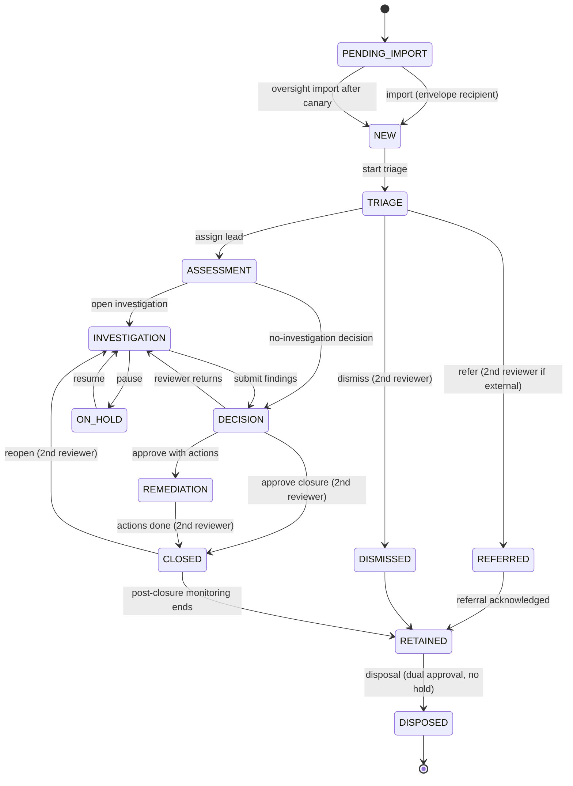

# 14 — Case Management
Status: Draft v1.0 · Edition applicability: both (CE: full workflow, SLA engine, COI routing, anti-suppression; EE adds rule designer, multi-jurisdiction calendar packs, regulator exports) · Owner: Case Workflow team

## 1. Purpose and scope

Specifies the lifecycle of a report from intake to deletion: intake, classification, triage, acknowledgement, assignment, escalation, investigation, evidence management, communication, decision, remediation, closure, retention and deletion. It defines the case state machine, the SLA engine, conflict-of-interest (COI) routing (ADR-015), anti-suppression controls, chain of custody and metrics.

**Protection statement.**
- WHAT: the report's existence, content and handling integrity; the source's identity; persons concerned.
- FROM WHOM: persons named in or implicated by a report, including executives, board members, HR, compliance, security staff and system administrators (THR-020); malicious or negligent investigators (THR-019); administrators (THR-018).
- ASSUMPTIONS (`40-SECURITY-ASSUMPTIONS.md`): ASM-043 (operator independence where the organisation is the adversary), ASM-045 (personnel vetting and separation of duties), ASM-033 (channel membership signing keys not jointly compromised), ASM-041 (clocks within tolerance), ASM-048 (audit witness honest), ASM-022 (case key availability); at least one independent body is configured and the COI map is maintained. Protections: 40 P-10, P-17, P-20, P-27.
- RESIDUAL RISK: a sufficiently senior accused who controls *all* configured independent bodies, the hosting, and the witness can still suppress a report; social pressure on investigators; COI not declared by the source or detected by triage.

## 2. Context and dependencies

| Doc | Relationship |
|---|---|
| `DECISIONS.md` ADR-005, 008, 009, 010, 013, 014, 015, 016, 017, 018, 025 | binding |
| `10-FILE-EVIDENCE-PIPELINE.md` | evidence objects, transformations, exports |
| `15-AUTHENTICATION-AUTHORIZATION.md` | roles, permissions, dual control, break-glass |
| `20-LOGGING-AUDITING.md` | CASE-class events; metrics counters |
| `35-DATA-RETENTION-DELETION.md` | retention schedules, legal hold, disposal |
| `04-CRYPTOGRAPHY.md` | case keys, Member Epoch Keys (ADR-030), re-keying |
| `25-COMPLIANCE.md` | jurisdiction packs, DSAR, statutory reporting |
| `12-FRONTEND-RECIPIENT.md`, `13-FRONTEND-ADMIN.md` | UIs |
| `11-FRONTEND-SOURCE.md` | source mailbox, COI selector, status display |

Components: C-10 Case Service (workflow, SLA engine), C-22 Authorization Engine, C-12 Case DB, C-13 Blob Store, C-14 Key Directory, C-15 Desk, C-23 Notification Service, C-24 Audit.

## 3. Data model (case-level)

Server-visible (C-12, cleartext; minimal): `case_id` (random 128-bit, display `CS-` + 10-char base32 prefix), `tenant_id`, `channel_id`, envelope recipient key IDs (ADR-030 header), `state`, `flags`, `received_day`, `import_batch`, SLA timer rows (anchor dates, due dates, status), ACL rows (user IDs, relation), COI exclusion rows (user/group IDs), approval records, legal-hold reference, retention class, `last_staff_activity_day` (date only).

Encrypted case record (case key; see `04-CRYPTOGRAPHY.md`): report text, questionnaire answers, category (fine-grained), persons concerned, detriment-risk assessment, investigation plan, notes, evidence records (10 §4), custody log (§10), decision, remediation actions, source messages.

Coarse category (`category_class`, ≤ 12 values, e.g., FINANCIAL, SAFETY, HR_CONDUCT, PRIVACY, OTHER) is server-visible only if the tenant enables SLA/route rules that need it; otherwise encrypted. Rationale: routing and SLA may depend on category (e.g., SOX §301 accounting → audit committee), but category is sensitive (THR-015).

## 4. Case state machine

### 4.1 States

| State | Meaning | ISO 37002 | Who sees content |
|---|---|---|---|
| `PENDING_IMPORT` | Envelope(s) in Intake Store/C-09 not yet imported; server knows only the channel, envelope recipient key IDs (ADR-030), received_day, batch | 8.1 | nobody (ciphertext) |
| `NEW` | Imported by an envelope recipient; case key created and wrapped to eligible members | 8.1 | envelope recipients (ERS) minus later COI exclusions |
| `TRIAGE` | Classification, scope, detriment-risk assessment, COI check | 8.2 | triage team |
| `ASSESSMENT` | Assigned case lead decides whether and how to investigate | 8.2 | case members |
| `INVESTIGATION` | Active fact-finding | 8.3 | case members |
| `ON_HOLD` | Waiting for source information or external event (SLA pause only where rule permits) | 8.3 | case members |
| `DECISION` | Findings drafted; awaiting second reviewer | 8.4 | case members + reviewer |
| `REMEDIATION` | Corrective actions tracked | 8.4 / 10 | case members |
| `CLOSED` | Closure approved, feedback given; post-closure detriment monitoring active | 8.4 | case members (read-only) |
| `REFERRED` | Transferred to another channel/independent body/external authority | 8.3 | receiving body |
| `DISMISSED` | Out of scope, spam, or manifestly irrelevant (second reviewer required) | 8.2 | case members (read-only) |
| `RETAINED` | Closed/dismissed, awaiting disposal date (may carry `LEGAL_HOLD`) | 7.5 | per retention policy |
| `DISPOSED` | Crypto-erased; tombstone only | 7.5 | nobody |

Overlay flags (not states): `LEGAL_HOLD`, `SEALED_MATTER` (e.g., qui tam seal), `IDENTITY_SEALED` (ADR-014), `COI_ALERT`, `CANARY_ESCALATED`, `SLA_BREACH`, `BREAK_GLASS_ACTIVE`, `HIGH_DETRIMENT_RISK`.

### 4.2 Transitions

| Transition | Guard | Actor | Dual control | CASE audit event |
|---|---|---|---|---|
| import | actor's Member Epoch Key is among the envelope recipients; not COI-excluded | INTAKE_TRIAGER / OVERSIGHT (canary) | no | `case.imported` |
| start triage | — | INTAKE_TRIAGER | no | `case.state_changed` |
| assign lead | assignee eligible (§7), COI attestation signed by assignee | CHANNEL_OWNER or TRIAGER | no | `case.assigned` |
| dismiss | reason code (OUT_OF_SCOPE, SPAM, DUPLICATE, MANIFESTLY_IRRELEVANT); feedback to source queued | CASE_LEAD | yes: REVIEWER ≠ proposer, not COI-excluded | `case.dismiss_requested`, `case.dismiss_approved` |
| refer | destination (channel, independent body, authority); reason | CASE_LEAD | yes if destination is external | `case.referred` |
| submit findings | decision record present | CASE_LEAD | no | `case.state_changed` |
| approve closure | feedback-to-source sent or documented exception; remediation plan or none; custody complete | REVIEWER | yes (reviewer ≠ lead; not COI-excluded; not in accused list) | `case.closure_approved` |
| reopen | reason | CASE_LEAD | yes | `case.reopened` |
| disposal | retention date reached; no `LEGAL_HOLD`; records-authority approval where configured | RETENTION job proposes; RECORDS_OFFICER + CASE_LEAD/OVERSIGHT approve | yes | `case.disposed` (see 35) |

The server enforces transitions (C-10) and the Desk enforces cryptographic prerequisites (only key holders can produce signed decision records). An invalid transition returns `409` and emits a SECURITY event `authz.denied`.

## 5. Lifecycle stages

| Stage | Key activities | Artifacts (encrypted) | Timers |
|---|---|---|---|
| Intake | Source submits (Tier W/V); optional auto-acknowledgement at intake (§6.4); optional COI checklist and eligible-recipient filtering (§8.3) | envelope, manifest | ACK timer starts at `received_day` |
| Classification | `category_class`, sub-category, jurisdiction pack, reporter relationship (EU Art 4 taxonomy), anonymous/confidential/identified mode (ADR-002) | classification record | — |
| Triage | scope check, urgency (IMMEDIATE_DANGER flag), detriment-risk assessment (ISO 37002 8.2; low/medium/high + mitigations), COI check (§8.4), duplicate linking (staff-only, never auto-correlation across sources: REQ-H-08) | triage record | TRIAGE decision timer (e.g., Alberta 10 business days) |
| Acknowledgement | reply to source via mailbox (template; never through notifications) | ACK message | ACK timer satisfied |
| Assignment | case lead + members; COI attestations; key wrapping to members | ACL + wraps | — |
| Escalation | SLA-driven or manual escalation to independent body; canary (§9.4) | escalation record | — |
| Investigation | plan, interviews (minutes per EU Art 18), evidence handling (10), requests to source | plan, notes | INVESTIGATION timer (optional) |
| Evidence management | per `10-FILE-EVIDENCE-PIPELINE.md`; custody (§10) | evidence/XF records | — |
| Communication | two-way mailbox; day-granularity dates (ADR-010); no read receipts; identity unseal notices (ADR-014, EU Art 16(3)) | messages | FEEDBACK timer |
| Decision | substantiated/partly/unsubstantiated/inconclusive; rationale | decision record | — |
| Remediation | corrective actions (ISO 37002 cl. 10 register) with owners and due dates; owners outside case see only action text approved for them (no source data) | action register | action due dates |
| Closure | feedback to source, closure approval, post-closure detriment check-ins (default at +30, +90, +180 days) | closure record | check-in timers |
| Retention | retention class by outcome; legal hold | retention record | disposal date |
| Deletion | crypto-erasure (35) | deletion receipt | — |

## 6. SLA engine

### 6.1 Timer definition (tenant policy, signed JSON; schema `candor.sla.v1`)

| Field | Type | Example |
|---|---|---|
| `timer_id` | string | `EU_ACK_INTERNAL` |
| `anchor` | event or date expression | `received_day`, `event:ack_sent`, `min(event:ack_sent, received_day+P7D)` |
| `duration` | ISO 8601 duration or `NBD` business days | `P7D`, `P3M`, `120BD` |
| `calendar` | `CALENDAR` or `BUSINESS` | `BUSINESS` |
| `holiday_calendar` | ID of signed holiday set | `CA-AB-2027` |
| `weekend` | weekday set | `[SAT,SUN]` |
| `timezone` | IANA tz of legal obligation | `Europe/Berlin` |
| `due_rule` | `START_OF_DUE_DAY` (conservative) or `END_OF_DUE_DAY` | `START_OF_DUE_DAY` |
| `satisfied_by` | event list | `[ack_sent]` |
| `reminders` | offsets before due | `[-3D, -1D]` |
| `pause_allowed` | bool + allowed reasons | `false` for EU ACK |
| `extension` | max total, justification codes, approver role, source-notice template | `{max: P3M, codes: [COMPLEXITY, ...], approver: REVIEWER, notify_source: true}` |
| `on_breach` | actions | `[flag SLA_BREACH, notify OVERSIGHT, canary]` |
| `legal_ref` | text | `EU 2019/1937 Art 9(1)(b)` |
| `advisory_only` | bool | `true` for DOJ 120-day window reminders |

### 6.2 Computation rules

1. Anchor `received_day` is the UTC date of receipt (ADR-010). Because the exact time is unknown, the engine treats the anchor as the **start** of that date in the tenant timezone, minus one day if the tenant timezone is ahead of UTC (conservative: deadlines are never later than the legal deadline computed from the true receipt time).
2. Calendar months: add months to the anchor date; if the day does not exist, clamp to the last day of the month (e.g., 31 Jan + P1M = 28/29 Feb).
3. Business days: count days that are neither in `weekend` nor in the holiday calendar; the anchor day itself is day 0.
4. Pauses (only if `pause_allowed`): stop the clock on `ON_HOLD` with reason; resumption extends due date by the paused business/calendar days; each pause and resume is audited.
5. Extensions: require justification code + free-text (encrypted), approver ≠ requester, total ≤ `extension.max`; if `notify_source`, a mailbox template is queued (EU Art 11(2)(d) external channels: 3 → 6 months "in duly justified cases").
6. Holiday calendars are signed data packages (EE packs; CE ships an importer for ICS files and a base set); a calendar change never shortens an already-running timer without an audited recompute approved by the channel owner.
7. Clock: C-10 uses the Z-CORE system clock synchronized via authenticated time (NTS) from ≥2 sources; if drift > 5 min or time jumps backward, the engine freezes breach actions, raises a SECURITY event and continues reminders only (THR-043).

### 6.3 Default timer packs

| Pack | Timer | Duration | Calendar | Notes |
|---|---|---|---|---|
| EU-INTERNAL (default for EU tenants) | ACK | 7 days from receipt | calendar | Art 9(1)(b); no pause |
| | FEEDBACK | 3 months from ACK, or from receipt+7 days if no ACK | calendar | Art 9(1)(f); extension not permitted (flag breach) |
| EU-EXTERNAL (authorities) | ACK | 7 days | calendar | Art 11(2)(b); may be disabled per reporter request or if it would jeopardise protection |
| | FEEDBACK | 3 months; extendable to 6 months with justification | calendar | Art 11(2)(d) |
| CA-AB-PIDA | ACK | 5 business days | business | B-CO-24 (statutory basis UNVERIFIED) |
| | DECISION_TO_INVESTIGATE | 10 business days | business | |
| | INVESTIGATION | 120 business days; extension by chief officer/Commissioner | business | |
| US-SOX (advisory) | Audit-committee routing | immediate | — | SOX §301 routing, not a timer |
| US-DOJ-PILOT (advisory) | 120-day internal-report window reminder | 120 days | calendar | advisory only (R6 A4) |
| GENERIC | ACK 7d, FEEDBACK 90d | calendar | CE default outside EU |
| POST-CLOSURE | detriment check-ins at 30/90/180 days | calendar | ISO 37002 8.4 |

These are defaults, not legal advice; `25-COMPLIANCE.md` owns jurisdiction content.

### 6.4 Acknowledgement mechanics

- **Auto-acknowledgement at intake (default ON):** at submission, the source client (Tier V) or C-07 (Tier W) places a static, pre-signed acknowledgement message (channel template, day-granularity date) into the source's mailbox. On import, the case records `ack_sent` with date = `received_day`. This makes acknowledgement independent of any staff member (anti-suppression) and needs no extra metadata.
- **Manual acknowledgement:** a staff reply marked as ACK.
- Acknowledgements and all source communication go only through the mailbox; replies become visible on the source's next login (ADR-010, ADR-017).

### 6.5 Reminders and notifications

All reminders use ADR-017 content-free notifications: text "Candor: secure case-management action requires attention" + instance label; no case ID, count, state or due date; hourly digest (default), jittered ±10 min. Details appear only after login in the Desk task list.

## 7. Assignment and eligibility

A staff user U is *eligible* for case C iff all hold (evaluated by C-22):
1. U is active, enrolled with a registered hardware key (see 15), and has role permitting the relation.
2. U was an envelope recipient of C, or was granted access by an existing member per policy, and U is not in the case's permanent source-derived exclusion set (§8.4).
3. U is not in C's COI exclusion set (§8) and has signed a COI attestation for C ("I have no conflict of interest with the matters and persons in this case"; attestation text encrypted in case; signing event audited).
4. Tenant/department boundary permits (15 AUTHZ ABAC).
5. Any time-bounded grant has not expired.

Case key wrapping to U happens only after (1)–(5) pass; revocation re-keys (§8.5).

## 8. Conflict-of-interest routing (ADR-015, ADR-030)

### 8.1 Concepts

- **Channel:** what the source picks (e.g., "Financial misconduct", "Report to the Audit Committee"). A channel has a set of **members**, each listed in C-14 under a **role label** (e.g., "Audit Committee Chair", "HR Investigations Lead"; personal names optional per channel policy).
- **Member Epoch Keys (ADR-030):** each member's Desk pre-publishes signed X-Wing epoch keys (7-day epoch, 14-day decrypt window, 4 epochs ahead) in C-14. The envelope content key is wrapped **individually** to each *eligible* member's current epoch key.
- **Eligible recipient set (ERS):** channel members minus (1) members whose role labels the source ticked in "Is your report about any of these people/roles?", minus (2) members excluded by the tenant COI map for the chosen category/flags. The filter runs in the Tier V client locally or in C-07 (Tier W) in RAM, **before** wrapping. Excluded members never hold any key that decrypts the envelope, even with full database access. Channel Identity Keys sign channel metadata only.
- **Recipient slots:** the envelope header carries recipient key IDs (pseudonymous, rotating per epoch), padded with dummy slots to a fixed maximum (default 16) (ADR-030), so recipients and auditors can verify the recipient set against C-14 (THR-046).
- **Fail closed:** if the ERS is empty, or lacks a role the COI map marks as "must remain" (§8.2), the source is shown "temporarily unavailable" for that selection together with the suggested alternative channel and external-reporting information (EU Art 9(1)(g)); the envelope is never encrypted to fewer or other parties than the policy requires.
- **COI map:** signed tenant policy (dual-approved, ROUTE-008) mapping *subject role* → *excluded role labels/users* → *must-remain role labels* → *suggested alternative channel*. Published in C-14 inside the channel descriptor.
- **Independent bodies:** members (or dedicated channels) whose role labels denote independence from management: OMBUDSMAN, INSPECTOR_GENERAL, ETHICS_COMMITTEE, BOARD_AUDIT_COMMITTEE, EXTERNAL_COUNSEL, THIRD_PARTY_INVESTIGATOR, CIVILIAN_OVERSIGHT, EXTERNAL_AUTHORITY_LIAISON. Recommended configuration: every general channel includes at least one independent-body member, so that excluding management still leaves an eligible recipient.

### 8.2 Default COI map template

| Report concerns (subject role) | Excluded before wrapping | Must remain (≥1 member with this label, else fail closed) | Suggested alternative channel if unavailable |
|---|---|---|---|
| Source's direct manager | the manager's label if a member; (EE) manager chain up to 2 levels via directory attribute, applied at triage (§8.4) because intake cannot know the source's manager | any non-excluded investigator | — |
| HR department / HR staff | all HR-labelled members | ETHICS_COMMITTEE or OMBUDSMAN | Ethics/Ombudsman channel; else EXTERNAL_COUNSEL |
| Compliance function / whistleblowing function staff | compliance-labelled members incl. channel owners | BOARD_AUDIT_COMMITTEE or OMBUDSMAN | Audit Committee channel |
| Corporate security / investigations unit | security-labelled members | OMBUDSMAN or EXTERNAL_COUNSEL | THIRD_PARTY_INVESTIGATOR channel |
| Senior executives (C-suite) | executive-labelled members and their staff in whistleblowing roles | BOARD_AUDIT_COMMITTEE | EXTERNAL_COUNSEL channel |
| CEO | CEO, executive-labelled members, CEO staff office | BOARD_AUDIT_COMMITTEE (independent directors only) | EXTERNAL_COUNSEL channel |
| Board members / board chair | board-labelled members except independent audit-committee members | EXTERNAL_COUNSEL | EXTERNAL_AUTHORITY_LIAISON guidance (regulator) |
| System administrators / IT | none needed for content (admins are never members: ADR-015, ROUTE-010); IT-labelled members if any | ETHICS_COMMITTEE or OMBUDSMAN | — |
| Department heads | the department-head label and department whistleblowing staff | ETHICS_COMMITTEE or INSPECTOR_GENERAL | Ombudsman channel |
| Local officials (municipal) | the official's office and council-staff labels | INSPECTOR_GENERAL or municipal ethics commissioner | EXTERNAL_AUTHORITY_LIAISON guidance |
| Elected officials | elected-office and political-staff labels | ETHICS_COMMITTEE (statutory ethics commission) or INSPECTOR_GENERAL | EXTERNAL_AUTHORITY_LIAISON guidance |
| Law enforcement / police | agency command and internal-affairs labels if implicated | CIVILIAN_OVERSIGHT or INSPECTOR_GENERAL | EXTERNAL_AUTHORITY_LIAISON guidance |
| Accounting, internal controls, auditing (category rule, SOX §301) | management-labelled members | BOARD_AUDIT_COMMITTEE | Audit Committee channel |
| Members of an independent body itself | the named labels | another independent body | EXTERNAL_COUNSEL channel |

### 8.3 Source-side COI selection

- The channel page offers the optional checklist "Is your report about any of these people/roles?" built from the channel's role labels and COI-map subject roles (default: none selected) (ADR-030).
- Tier V computes the ERS locally after verifying member epoch keys and the channel descriptor against C-14 (inclusion/consistency proofs, ASM-036); Tier W: C-07 computes it in RAM from its verified copy of the descriptor.
- Honest disclosure next to the checklist: the role labels that will be able to read the report, recovery-escrow status (ADR-013), OVERSIGHT_MODE (§9.4), and "The server cannot read your report, but it can see which recipient keys it was encrypted to."
- The source's ticked subject roles are stored inside the encrypted envelope (so the case team knows who must stay excluded) and are never sent in cleartext.

### 8.4 Triage-time COI detection

Sources may not flag COI. During triage:
1. On import, the case's permanent exclusion set is initialized from the source's ticked roles (read from inside the envelope) and the COI-map exclusions applied at intake; members so excluded can never be added to the case.
2. Triager records `persons_concerned` (encrypted) and maps them to Candor users (local directory; EE: SCIM attributes incl. `manager` chain).
3. C-22 computes additional exclusions from the COI map, named users, manager chain (EE) and self-declared recusals.
4. Excluded current members are removed immediately (§8.5); if the triager is implicated, they must recuse (attestation) and a non-excluded member or OVERSIGHT is alerted.
5. Case-key wraps (ADR-008) are created only for members authorized after import and not in the exclusion set (ADR-030).

### 8.5 Removal and re-keying

On exclusion or revocation of member X from case C:
1. Server removes X's ACL and wrapped-key rows immediately and blocks ciphertext delivery to X.
2. The next member client to open C generates a new case key K', re-encrypts the case record head and wraps K' to remaining members; new evidence and records use K'. Existing per-object DEKs are re-wrapped under K' (X may retain DEKs it already cached: residual risk, §16).
3. Event `case.member_removed` (reason COI/REVOKED) + `case.rekeyed`.
4. X's Desk receives a revocation tombstone and purges cached case material on next sync.

## 9. Anti-suppression controls

| Control | Mechanism | Threat |
|---|---|---|
| AS-1 Accused cannot see | Cryptographic COI exclusion before key wrapping (§8) | THR-020 |
| AS-2 Accused cannot close | Closure/dismissal require a second reviewer who is not proposer, not excluded, not in `persons_concerned` | THR-020 |
| AS-3 Accused cannot delete | No user-facing delete of cases; disposal only by retention engine + dual approval + no hold; evidence deletion within a case only for DERIVED objects or dual-approved Art 17 purge | THR-020; THR-037 |
| AS-4 Tamper evidence | All transitions/approvals in the hash-chained CASE audit stream with signed checkpoints and external witness (20) | THR-037; THR-018 |
| AS-5 Admin cannot suppress silently | Admins cannot alter case state (no permission); config changes affecting routing/SLA/COI are dual-approved and notify OVERSIGHT content-free | THR-018; THR-035 |
| AS-6 Canary escalation | §9.4 | THR-020 |
| AS-7 Independent visibility | OVERSIGHT metadata register: per-case pseudonymous ID, channel, state, SLA status, days since last staff activity — no content, no source data | THR-020 |
| AS-8 Auto-acknowledgement | §6.4 removes dependency on staff for first contact | THR-020 |
| AS-9 Reassignment limits | Transferring a case from an independent-body channel to a management channel, or adding members the COI map excluded for the case, requires OVERSIGHT approval | THR-020 |
| AS-10 Source-visible status | Source mailbox shows coarse status (RECEIVED, IN_REVIEW, CLOSED) and closure feedback; the source can escalate "I received no response" which creates an OVERSIGHT escalation | THR-020 |

### 9.4 Canary (dead-man) escalation

Triggers (configurable; defaults):
- C1: envelope in `PENDING_IMPORT` > 3 calendar days.
- C2: case with no staff activity (any audited case action) > 14 calendar days while in NEW..INVESTIGATION.
- C3: any SLA breach.
- C4: source-initiated "no response" escalation.
- C5: closure/dismissal approved within 24 h of import (possible rubber-stamping) — notify only.

Action: C-10 sets `CANARY_ESCALATED`, sends content-free notification to OVERSIGHT members, and adds the case to the OVERSIGHT register with trigger code.

Access by oversight: tenant chooses per channel:
- `OVERSIGHT_MODE=SILENT_MEMBER`: OVERSIGHT members are channel members (their Member Epoch Keys receive wraps unless the source excludes their role label) but do not open content unless they perform an audited "oversight import/open" action. Disclosed in the channel descriptor (THR-046 transparency).
- `OVERSIGHT_MODE=METADATA_ONLY`: OVERSIGHT sees the register only and can compel action via governance, not decrypt.

Suppression of the canary itself: OVERSIGHT Desk clients independently evaluate C1/C2 from signed register snapshots pulled at least daily, and alert locally if (a) snapshots stop arriving for > 48 h or (b) checkpoint signatures/witness cosignatures fail (20). This moves the dead-man check off infrastructure the accused could control.

Epoch-key interaction: Member Epoch private keys (ADR-008, ADR-030) are not destroyed while any envelope wrapped to that epoch key remains un-imported, unless a dual-approved "abandon envelope" decision by OVERSIGHT is recorded (see 35).

## 10. Chain of custody

### 10.1 Custody events (recorded in the encrypted per-case Custody Log, signed per entry by the actor's identity key, hash-chained per evidence object)

| Event | Fields (encrypted) |
|---|---|
| IMPORT | evid_id, sha256, blake3, received_day, import_batch, manifest_match, importer |
| ACCESS | evid_id, containment level (L0–L4), purpose code, actor, ts |
| TRANSFORM | xform_id, inputs, outputs, actor, ts |
| EXPORT | package ID, evid_ids, destination class, approvers, reason code, PSR ID, ts |
| TRANSFER | from channel/body → to channel/body, approvers, ts (referral) |
| CUSTODY_CHANGE | custodian (case lead) change, approver, ts |
| HOLD / RELEASE | legal hold reference, ts |
| DELETE | evid_id, method (crypto-erase), receipt ID, ts |

The CASE audit stream (20) records a pseudonymous counterpart of each event (no hashes, names or sizes). The custody log's head hash per case is included (HMAC under a case-derived key) in the CASE event, binding the two without revealing content.

### 10.2 Balancing custody against anonymity

| Custody need | Anonymity-preserving choice |
|---|---|
| "When was it received?" | `received_day` only (ADR-010); custody starts at import |
| "Who submitted it?" | Not recorded; source-signed manifest proves the same passphrase holder submitted all items, not who |
| "From which device/network?" | Never recorded (THR-001) |
| Integrity from source to case | Source manifest hash (10 §5.2) + STREAM AEAD |
| Court-ready custody report | Generated from Custody Log by case lead; mandatory identity-deducibility review (EU Art 16(1)) and second reviewer before release |

## 11. Communication with the source

- Two-way mailbox; message dates at day granularity; no read receipts or typing indicators (ADR-010).
- Templates: ACK, request for information, feedback (EU Art 9(1)(f)), extension notice, closure, identity-unseal notice (ADR-014, EU Art 16(3)), post-closure detriment check-in.
- Staff messages are signed by the case (channel identity) — individual staff names are not shown to sources unless configured (reduces targeting of staff).
- Oral reports and meetings (EU Art 9(2), 18(2)–(4)): transcript/minutes stored as TRANSCRIPT evidence; the source can review and confirm via mailbox; confirmation recorded.

## 12. Decision, remediation, closure

- Decision record: outcome enum, rationale, legal basis, signed by case lead; reviewer approval signed.
- Remediation: actions with owner (may be non-member; they receive only approved action text via an Export Package, ADR-018), due date, status; ISO 37002 cl. 10 corrective-action register.
- Closure checklist (all required unless reviewer records exception): feedback sent; custody log verified (`candorctl evidence verify` pass); no pending exports; retention class set; post-closure check-ins scheduled; identity seal state reviewed.

## 13. Retention and deletion (summary)

Retention class is set at closure/dismissal from outcome (see `35-DATA-RETENTION-DELETION.md` for schedules). EU Art 17 "manifestly irrelevant" data: purge action available at triage with second reviewer; content crypto-erased, audit keeps only `case.data_purged` with reason code.

## 14. Reporting and metrics

| Audience tier | Examples | Suppression rule | Time granularity |
|---|---|---|---|
| FUNCTION (whistleblowing function staff with case access) | own caseload, SLA status | none beyond access control | day |
| GOVERNANCE (management, board, oversight dashboards) | counts by category_class, outcome, SLA compliance, time-to-ack/close medians | cells with count < k suppressed, k default 10, minimum 5; complementary suppression so suppressed cells cannot be derived from totals | month |
| PUBLIC / STATUTORY (EU Art 27 stats, annual reports, PSDPA reports) | totals, outcome ratios | k default 20, minimum 10 (REQ-H-70); no cross-tab of more than 2 dimensions | month or coarser (REQ-H-74) |

Metrics are computed by C-10 from server-visible fields plus values that case leads explicitly release (e.g., substantiation outcome). Source-sensitive counters (submissions received per day) are governed by 20 (SOURCE-SENSITIVE class) and never exported below k or finer than a month for GOVERNANCE/PUBLIC.

KPIs (ISO 37002 cl. 9): volume, % acknowledged within SLA, median days to acknowledge/feedback/close, substantiation rate, retaliation/detriment reports, reopen rate, canary escalations count.

## 15. Requirements

| ID | Requirement | Evidence | Threats | Component | Verification |
|---|---|---|---|---|---|
| CASE-001 | C-10 SHALL implement the state machine of §4 and SHALL reject any transition not listed in §4.2, emitting a SECURITY `authz.denied` event. | B-CO-01 (ISO 37002 8.1–8.4) | THR-020; THR-021 | C-10 | TST: exhaustive transition matrix test (all state pairs × roles) |
| CASE-002 | Closure, dismissal, reopening and disposal SHALL require approval by a second reviewer who is not the proposer, not COI-excluded and not recorded in `persons_concerned`. | ADR-015; INC-22; B-CO-02 (Art 9(1)(c)) | THR-020; THR-019 | C-10; C-22 | TST: same-user, excluded-user and concerned-user approvals denied; valid pair succeeds |
| CASE-003 | No role SHALL have a user-facing operation to delete a case; case disposal SHALL occur only via the retention engine with dual approval and absence of legal hold. | ADR-025; INC-22 | THR-020; THR-037 | C-10 | TST: API route inventory contains no case-delete route outside retention module; disposal with hold denied |
| CASE-004 | The SLA engine SHALL support calendar and business-day durations, ISO 8601 month arithmetic with end-of-month clamping, per-tenant timezones, signed holiday calendars, weekend sets, pauses only where the timer permits, and justified extensions approved by a different user. | B-CO-02 (Art 9, 11); B-CO-24; R6 §0 item 1 | THR-043 | C-10 | TST: golden-date test vectors (EU 7d/3m, 31 Jan + P1M, Alberta 5/10/120 BD with holidays, DST transitions) |
| CASE-005 | Anchors based on `received_day` SHALL be computed conservatively so that no computed deadline is later than the legal deadline for any possible receipt time within that UTC day. | ADR-010; B-CO-02 (Art 9(1)(b)) | THR-043 | C-10 | TST: property test over all tz offsets −12..+14 |
| CASE-006 | The default EU-INTERNAL pack SHALL set ACK = 7 calendar days from receipt without pause and FEEDBACK = 3 months from acknowledgement or from receipt + 7 days if not acknowledged. | B-CO-02 (Art 9(1)(b),(f)) | — | C-10 | TST: pack conformance vectors |
| CASE-007 | The EU-EXTERNAL pack SHALL allow extending FEEDBACK from 3 to at most 6 months only with a justification code, approver and queued source notice. | B-CO-02 (Art 11(2)(d)) | — | C-10 | TST: extension beyond 6 months rejected; notice queued |
| CASE-008 | Auto-acknowledgement at intake SHALL be available (default ON) using a static pre-signed channel template placed in the source mailbox at submission, recorded as `ack_sent` on import. | B-CO-02 (Art 9(1)(b)); ADR-010 | THR-020 | C-06; C-07; C-03; C-10 | TST: submission via Tier W and Tier V shows ACK on next login; case shows ack_sent=received_day |
| CASE-009 | SLA reminders and escalations SHALL be delivered only as ADR-017 content-free notifications (fixed text + instance label, hourly digest, ±10 min jitter). | ADR-017; INC-57; INC-25 | THR-028 | C-23 | TST: notification payload equality test; timing test shows no per-event emission |
| CASE-010 | The SLA engine SHALL freeze breach actions and raise a SECURITY event when authenticated time sources disagree by > 5 min or the clock moves backward. | Design; ADR-010 | THR-043 | C-10 | TST: clock-skew injection |
| CASE-011 | Case keys SHALL be wrapped only to users eligible per §7, and a COI attestation signed by the user SHALL precede their first wrap for that case. | ADR-015; B-CO-02 (Art 9(1)(c)) | THR-020; THR-019 | C-15; C-22 | TST: wrap attempt without attestation refused by Desk and server |
| CASE-012 | Case state, flags, ACL, SLA timers and approvals stored in C-12 SHALL NOT include report content, persons concerned, fine-grained category or free text; `category_class` SHALL be server-visible only when a tenant rule requires it. | ADR-016; THR-015 | THR-015; THR-018 | C-12; C-10 | INSP: schema review; TST: DB dump canary grep |
| CASE-013 | Triage SHALL include a detriment-risk assessment (low/medium/high with mitigation plan) and set `HIGH_DETRIMENT_RISK` when high, which restricts case membership changes to CASE_LEAD + REVIEWER dual approval. | B-CO-01 (ISO 37002 8.2) | THR-019 | C-10; C-15 | TST: flag enforcement test; DEMO: triage form |
| CASE-014 | Duplicate/related-case linking SHALL be a manual staff action within the case team; the system SHALL NOT automatically correlate submissions across source accounts. | REQ-H-08; ADR-005 | THR-019 | C-10; C-15 | INSP: no correlation job; TST: two submissions with identical text are not auto-linked |
| CASE-015 | Remediation action owners outside the case SHALL receive only reviewer-approved action text via an Export Package, never case content or source data. | ADR-018 | THR-029; THR-020 | C-10; C-40 | TST: action export contains only approved fields |
| CASE-016 | Closure SHALL require: feedback sent (or reviewer exception), custody verification pass, no pending export approvals, retention class set, and post-closure detriment check-ins scheduled (default 30/90/180 days). | B-CO-01 (ISO 37002 8.4); B-CO-02 (Art 9(1)(f)) | THR-037 | C-10 | TST: closure blocked for each missing precondition |
| CASE-017 | The source mailbox SHALL show coarse status (RECEIVED, IN_REVIEW, CLOSED) and allow a "no response received" escalation that triggers canary C4. | B-CO-01 (8.4); INC-22 | THR-020 | C-06; C-10 | TST: escalation creates OVERSIGHT register entry |
| CASE-018 | Canary triggers C1–C5 of §9.4 SHALL be evaluated at least hourly by C-10 and SHALL set `CANARY_ESCALATED` and notify OVERSIGHT members content-free. | INC-22; REQ-H-69 | THR-020 | C-10; C-23 | TST: time-advanced fixtures for each trigger |
| CASE-019 | OVERSIGHT Desk clients SHALL independently evaluate canary triggers C1/C2 from signed register snapshots and SHALL alert locally when snapshots are missing > 48 h or checkpoint/witness verification fails. | INC-68; REQ-H-68 | THR-020; THR-018 | C-15; C-24 | TST: withheld snapshot and forged checkpoint produce local alerts |
| CASE-020 | Member Epoch private keys SHALL NOT be destroyed while envelopes encrypted to that epoch remain un-imported, unless OVERSIGHT records a dual-approved abandon decision. | ADR-008; INC-22 | THR-020 | C-15; C-09 | TST: destruction job skips epochs with pending envelopes; abandon requires two OVERSIGHT approvals |
| CASE-021 | The OVERSIGHT metadata register SHALL contain only case pseudonym, channel, state, flags, SLA status and days since last staff activity, and SHALL NOT contain content, persons concerned, category detail or source data. | ADR-016; ADR-015 | THR-020; THR-039 | C-10 | INSP: register schema; TST: field allow-list test |
| CASE-022 | Transfer of a case from an independent-body channel to a non-independent channel, or addition of members that the COI map excluded for the case, SHALL require OVERSIGHT approval. | ADR-015; INC-22 | THR-020 | C-10; C-22 | TST: reassignment without OVERSIGHT approval denied |
| CASE-023 | Every custody event of §10.1 SHALL be appended to the encrypted per-case Custody Log, signed by the actor and hash-chained per evidence object, and a pseudonymous counterpart SHALL be emitted to the CASE audit stream binding the custody-log head by keyed MAC. | ADR-012; ADR-016; B-CO-02 (Art 12) | THR-037; THR-038 | C-15; C-24 | TST: custody chain verification; tampered entry detected; audit event lacks hashes/names |
| CASE-024 | Custody records SHALL begin at import and SHALL NOT record submission time finer than `received_day`, source device, network or client information. | ADR-010; INC-16 | THR-011; THR-001 | C-15 | INSP: schema; TST: record grep for time/UA fields |
| CASE-025 | A court/regulator custody report SHALL require an identity-deducibility review and second-reviewer approval before release. | B-CO-02 (Art 16(1)) | THR-019; THR-041 | C-15; C-10 | TST: release blocked without both records |
| CASE-026 | Metrics for GOVERNANCE audiences SHALL suppress cells with count < k (default 10, minimum 5) with complementary suppression and month granularity; PUBLIC/STATUTORY outputs SHALL use k ≥ 20 by default (minimum 10) and no cross-tabulation beyond 2 dimensions. | REQ-H-70; REQ-H-74; INC-74 | THR-039 | C-10 | TST: differencing-attack test (totals minus visible cells) cannot recover suppressed cells; k floor not configurable below minimum |
| CASE-027 | Identity unsealing (ADR-014) SHALL be a case action requiring legal basis, dual approval by IDENTITY_CUSTODIANs, and a queued source notice with written reasons unless a recorded deferral reason applies. | ADR-014; B-CO-02 (Art 16(2)-(3)); B-CO-13 | THR-019; THR-020 | C-10; C-15 | TST: unseal without either approval or basis denied; notice queued or deferral recorded |
| CASE-028 | EU Art 17 "manifestly irrelevant" purge SHALL be available at triage with second-reviewer approval and SHALL crypto-erase the content while retaining only a reason-coded audit event. | B-CO-02 (Art 17) | THR-017 | C-10; C-15 | TST: purge leaves no content wrap; event present without content |
| CASE-029 | Oral reports and meeting minutes SHALL be stored as TRANSCRIPT evidence and the source SHALL be able to review and confirm them via the mailbox, with confirmation recorded. | B-CO-02 (Art 18(2)-(4)) | — | C-10; C-15 | DEMO: transcript review flow |
| ROUTE-001 | The envelope content key SHALL be wrapped individually to the current Member Epoch Key of each eligible member, where eligibility is computed before wrapping by removing members whose role labels the source ticked and members excluded by the tenant COI map for the chosen category. | ADR-030; ADR-015; INC-22 | THR-020 | C-03; C-07; C-14; C-15 | TST: crypto test: an excluded member's Desk with full DB access cannot decrypt the envelope; Tier V and Tier W filters produce identical ERS for the same inputs |
| ROUTE-002 | The signed channel descriptor in C-14 SHALL publish member role labels, Member Epoch Keys, the COI map and OVERSIGHT_MODE, and source clients SHALL verify it and display which role labels will be able to read the report. | ADR-030; ADR-015; REQ-H-14; INC-14 | THR-046; THR-020 | C-14; C-06; C-03 | TST: tampered descriptor rejected by Tier V and C-07; UI shows role labels |
| ROUTE-003 | The default COI routing table of §8.2 SHALL ship as a template covering direct manager, HR, compliance, corporate security, senior executives, CEO, board, system administrators, department heads, local officials, elected officials, law enforcement and accounting/audit matters. | ADR-015; INC-22; B-CO-69 (SOX §301) | THR-020 | C-10 | INSP: template content review; TST: template loads and validates |
| ROUTE-004 | If the eligible recipient set is empty or lacks a must-remain role, intake for that selection SHALL fail closed ("temporarily unavailable") with the suggested alternative channel and external-reporting information, and SHALL NOT encrypt to fewer or other parties. | ADR-030; B-CO-02 (Art 9(1)(g)) | THR-020 | C-06; C-07; C-03 | TST: empty-ERS and missing-must-remain fixtures in Tier W and Tier V show unavailable; no envelope stored |
| ROUTE-005 | Accounting, internal-control and auditing category reports SHALL be configurable to exclude management-labelled members and to require a BOARD_AUDIT_COMMITTEE member in the eligible set. | B-CO-69 (SOX §301); ADR-030 | THR-020 | C-10; C-14; C-07; C-03 | TST: category rule fixture yields ERS containing only non-management members incl. audit committee |
| ROUTE-006 | Triage-time COI detection SHALL compute exclusions from the COI map, named persons concerned, self-declared recusals and (EE) directory manager chains up to a configurable depth (default 2), and SHALL remove excluded members immediately. | ADR-015; B-CO-01 | THR-020 | C-22; C-10 | TST: fixtures for each source of exclusion |
| ROUTE-007 | Removal of a member for COI or revocation SHALL block ciphertext delivery immediately and SHALL cause re-keying of the case key on the next member client open, with re-wrapping of object DEKs. | ADR-015; ADR-008 | THR-020; THR-019 | C-10; C-15 | TST: removed member receives 403 immediately; new records unreadable with old key |
| ROUTE-008 | Changes to COI maps, channel membership and role labels, OVERSIGHT_MODE and SLA packs SHALL require dual approval and SHALL generate content-free notifications to OVERSIGHT and a CASE/SECURITY audit event. | ADR-015; ADR-030 | THR-018; THR-035; THR-046 | C-10; C-19; C-22 | TST: single-approver change rejected; OVERSIGHT notification observed |
| ROUTE-009 | OVERSIGHT_MODE SILENT_MEMBER SHALL be disclosed in the channel descriptor, and any oversight open/import of content SHALL be an audited action visible to the case team. | ADR-015; INC-14 | THR-046; THR-018 | C-14; C-10 | TST: descriptor shows mode; oversight open emits event visible in case timeline |
| ROUTE-010 | System administrators SHALL NOT be channel members by virtue of their admin role, and Desks SHALL refuse to publish Member Epoch Keys for accounts holding admin roles. | ADR-015; ADR-030 | THR-018 | C-22; C-15 | TST: policy test; epoch-key publication by admin account rejected |
| ROUTE-011 | A referral to another channel, independent body or external authority SHALL preserve ORIGINAL evidence unmodified (EU Art 12(4)) and SHALL be recorded as a TRANSFER custody event. | B-CO-02 (Art 12(4)) | THR-037 | C-10; C-15 | TST: transferred case evidence hashes equal originals |
| ROUTE-012 | Subject roles ticked by the source SHALL be carried only inside the encrypted envelope, SHALL initialize the case's permanent exclusion set on import, and members so excluded SHALL NEVER be added to the case. | ADR-030; INC-22 | THR-020 | C-15; C-22 | TST: adding a source-excluded member rejected by Desk and C-22; cleartext envelope header contains no ticked roles |
| ROUTE-013 | Envelope headers SHALL carry exactly the configured maximum number of recipient slots (default 16), filling unused slots with indistinguishable dummy wraps. | ADR-030; ADR-011 | THR-011; THR-020 | C-03; C-07; C-11 | TST: header length constant for ERS sizes 1..16; dummy wraps indistinguishable (statistical test) |
| ROUTE-014 | Member Desks SHALL pre-publish Member Epoch Keys at least 4 epochs ahead, and C-10 SHALL warn channel owners content-free when a channel's default selection would have an empty eligible set within 14 days. | ADR-030 | THR-032 | C-15; C-10; C-23 | TST: expiring-key fixture triggers warning 14 days ahead |

## 16. Residual risks and limitations

1. **Recipient-set metadata.** The envelope header lists recipient key IDs (ADR-030), and C-14 publicly maps Member Epoch Keys to role labels. Z-INTAKE and Z-CORE can therefore infer which role labels were *excluded* from a given envelope (e.g., "this report excludes the CEO and executives"), together with `received_day`. Dummy slots hide the count, not the identity of real recipients. In small organizations this can prompt retaliation hunts (THR-011, THR-020). See Open Issues for ADR revision.
2. **Cached keys.** A member removed for COI may retain case keys or DEKs cached before removal; re-keying protects only future material (THR-019).
3. **Undeclared conflicts.** COI detection depends on sources and triagers naming persons concerned and on staff honesty in attestations.
4. **Captured independent bodies.** If the accused controls the audit committee, counsel and hosting, canary escalation reaches the wrong people; external regulator reporting guidance remains the backstop (EU Art 9(1)(g)).
5. **Timing of staff actions.** Exact staff-action timestamps (permitted by ADR-010) near import can narrow the submission time to the C-09 pull window (15±10 min) when staff act immediately; see `20-LOGGING-AUDITING.md`.
6. **SLA law drift.** Jurisdiction timelines may change (EU Directive review 2026–2027, R6 A2); packs must be maintained.
7. **Small-number metrics.** Even with k-suppression, repeated reports over time may enable inference; month granularity and complementary suppression reduce but do not remove this (THR-039).

## 17. Open issues

1. OI-14-1: Whether `category_class` should ever be server-visible; alternatively evaluate category-dependent SLA/routing client-side at import (costs: server cannot enforce).
2. OI-14-2: Manager-chain COI (EE) needs a directory attribute feed; CE must rely on manual entry.
3. OI-14-3: Source-visible status values may leak case outcome to someone who seizes the source's passphrase (THR-034); decide default granularity with `05-SOURCE-OPSEC.md`.
4. OI-14-4: "At least one independent body exists and is not captured" is only partly covered by ASM-043/ASM-045; propose a dedicated assumption in `40-SECURITY-ASSUMPTIONS.md`.

### Open Issues for ADR revision

- **ADR-030 recipient key IDs in the cleartext header.** ADR-030 lists recipient key IDs in the envelope header for verifiability. Because C-14 maps those key IDs to role labels, the server learns exactly which roles were excluded, i.e., whom the report is probably about (residual risk 1). Proposed amendment: outer slots carry anonymous HPKE encapsulations without key IDs (recipients trial-decrypt at most 16 slots), and the authoritative recipient key-ID list is placed *inside* the encrypted envelope, signed by the source key, so every recipient (and auditors with case access) can still verify the recipient set against C-14 (THR-046) without exposing it to Z-INTAKE/Z-CORE. This spec conforms to ADR-030 as written until revised.
- **ADR-008 epoch-key destruction ("after window + import").** Interpreted as "after the later of the decrypt window end and import of all envelopes of that epoch"; otherwise a suppressing member could let the window lapse to destroy reports. CASE-020 codifies this; ADR text should state it explicitly.
- **ADR-010 import batch time.** Case import "records batch time"; combined with the 15±10 min pull interval this bounds submission time to a ~25 min window in low-volume instances. Proposed: case-visible field is batch *number* and `received_day` only; exact batch time kept only in C-09 operational state for ≤ 24 h.
