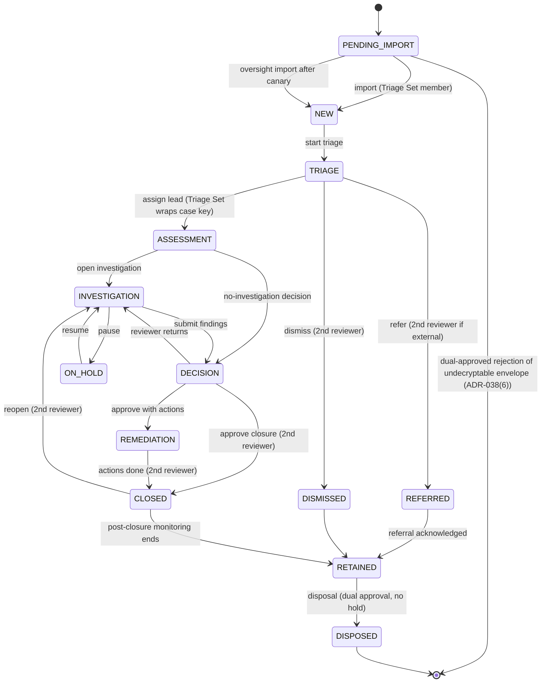

# 14 — Case Management
Status: Draft v1.2 (final consistency round: ADR-047) · Edition applicability: both (CE: full workflow, SLA engine, triage-first COI routing, anti-suppression; EE adds rule designer, multi-jurisdiction calendar packs, regulator exports) · Owner: Case Workflow team

## 1. Purpose and scope

Specifies the lifecycle of a report from intake to deletion: intake, classification, triage, acknowledgement, assignment, escalation, investigation, evidence management, communication, decision, remediation, closure, retention and deletion. It defines the case state machine, the SLA engine, triage-first conflict-of-interest (COI) routing (ADR-015, ADR-030, ADR-037), roster governance for routing (ADR-036), anti-suppression controls, chain of custody, records-custodian access (ADR-044 §5) and the case-management side of metrics (the metrics regime itself is owned by `24-LICENSING-BUSINESS-MODEL.md` §TEL, ADR-046 §5).

**Protection statement.**
- WHAT: the report's existence, content and handling integrity; the source's identity; persons concerned; the identity of persons the report concerns (COI exclusions).
- FROM WHOM: persons named in or implicated by a report, including executives, board members, HR, compliance, security staff and system administrators (THR-020); malicious or negligent investigators (THR-019); administrators and database/backup holders (THR-018, THR-015, THR-017).
- ASSUMPTIONS (`40-SECURITY-ASSUMPTIONS.md`): ASM-043 (operator independence where the organisation is the adversary), ASM-045 (personnel vetting and separation of duties), ASM-033 (channel membership signing keys not jointly compromised), ASM-041 (clocks within tolerance), ASM-048 (audit witness honest), ASM-022 (case key availability); each channel has a Triage Set of ≥ 2 independent-body members (ADR-037) whose Desks are under independent custody where the channel type is INDEPENDENT (ADR-043). Protections: 40 P-10, P-17, P-20, P-27.
- RESIDUAL RISK: a sufficiently senior accused who controls *all* configured independent bodies, the hosting and the witnesses can still suppress a report; social pressure on investigators; COI not declared by the source or detected by triage; a captured Triage Set sees every report of its channel first (§16).

## 2. Context and dependencies

| Doc | Relationship |
|---|---|
| `DECISIONS.md` ADR-005, 008, 009, 010, 013, 014, 015, 016, 017, 018, 025, 030, 033, 036, 037, 038, 043, 044, 045, 046, **047** (final round: (2) follow-up dates encrypted, (3) chaff, (5) IDENTIFIED over onion, (7) Desk case-key cache, (8) per-case metadata erasure) | binding |
| `10-FILE-EVIDENCE-PIPELINE.md` | evidence objects, transformations, exports |
| `15-AUTHENTICATION-AUTHORIZATION.md` | roles (incl. RECORDS_CUSTODIAN, Triage Set relation), dual control, break-glass, wrap-deletion cooling-off |
| `20-LOGGING-AUDITING.md` | CASE-class events (date-only import events, no COI reason codes) |
| `24-LICENSING-BUSINESS-MODEL.md` §TEL | canonical metrics regime (k, periods, suppression) |
| `35-DATA-RETENTION-DELETION.md` | retention schedules, legal hold, disposal |
| `04-CRYPTOGRAPHY.md` | case keys, Member Epoch Keys (ADR-030), anonymous slots (ADR-033(1)), `K_case_excl` derivation, re-keying |
| `09-DATABASE.md` | exact schema of the case tables, including blinded exclusion tags |
| `25-COMPLIANCE.md` | jurisdiction packs, DSAR, statutory reporting |
| `12-FRONTEND-RECIPIENT.md`, `13-FRONTEND-ADMIN.md` | UIs |
| `11-FRONTEND-SOURCE.md` | source mailbox, COI selector, status display, delayed delivery option |

Components: C-10 Case Service (workflow, SLA engine), C-22 Authorization Engine, C-12 Case DB, C-13 Blob Store, C-14 Key Directory, C-15 Desk, C-23 Notification Service, C-24 Audit.

## 3. Data model (case-level)

Server-visible (C-12, cleartext; minimal; exact schema in `09-DATABASE.md`):

| Field | Note |
|---|---|
| `case_id` | random 128-bit, display `CS-` + 10-char base32 prefix |
| `tenant_id`, `channel_id` | channel choice is inherent to routing (residual §16) |
| `state`, `flags` | §4 |
| `received_day` | UTC date recorded by the intake at arrival (ADR-010); for delayed delivery (ADR-038(4)) the release date |
| `import_slot_date` | UTC date of the fixed relay import slot of the **initial** report (ADR-038(1)); never a time of day, never a batch time. `case.received_date` shown to staff = this date |
| `last_import_month` | `YYYY-MM` of the most recent follow-up import (ADR-047(2)); the only cleartext trace of follow-ups. Follow-up import dates are stored only inside the encrypted case record |
| metadata ciphertexts | category label, case title and tenant-defined custom fields that C-10 must read for workflow, stored only as Record AEAD ciphertext under `K_meta` derived from the case's Erasure Key inside the vault (ADR-047(8); `04-CRYPTOGRAPHY.md` §9.10a); unreadable in DB and backup copies once the Erasure Key is destroyed and vault backups have aged out (≤ 14 days) |
| SLA timer rows | anchor dates, due dates, status, `timer_id` |
| ACL rows | user IDs and relation of current members |
| COI exclusion tags | exactly 8 blinded tags per case, `HMAC(K_case_excl, user_id)` with `K_case_excl = HKDF(case_key, "candor/coi-excl/v1")`, real tags padded with random tags (ADR-037(3)); no user ID, role, source enum or reason stored in cleartext |
| approval records, legal-hold reference, retention class | |

Removed from the server-visible set by this revision: envelope recipient key IDs (none exist in cleartext, ADR-033(1)); `import_batch` and any batch time (ADR-033(4), ADR-038(1)); cleartext COI exclusion rows (ADR-037(3)); `last_staff_activity_day` (the OVERSIGHT register derives "days since last staff activity" at computation time from CASE audit events and does not store it per case, RVW-B-33(b)); per-case lists of follow-up days and any cleartext follow-up import date (ADR-038(3), ADR-047(2)); cleartext category/title/custom-field columns (now `K_meta` ciphertext, ADR-047(8)).

Encrypted case record (case key; see `04-CRYPTOGRAPHY.md`): report text, questionnaire answers, category (fine-grained and `category_class` for ANONYMOUS reports), persons concerned, the source's COI ticks and their origin (source selection / COI map / triage finding), detriment-risk assessment, investigation plan, notes, evidence records (10 §4), custody log (§10), decision, remediation actions, source messages and each message's day (or ISO week, §11).

`category_class` (≤ 12 values, e.g., FINANCIAL, SAFETY, HR_CONDUCT, PRIVACY, OTHER): **never server-visible for ANONYMOUS-mode reports**; category-dependent routing is performed by the Triage Set Desk at import (§8.4). For CONFIDENTIAL/IDENTIFIED reports it is server-visible only if the tenant enables an SLA rule that needs it (ADVANCED; `timer_id` then reveals the category class). Default timer packs are category-independent (resolves OI-14-1; RVW-B-10).

## 4. Case state machine

### 4.1 States

| State | Meaning | ISO 37002 | Who sees content |
|---|---|---|---|
| `PENDING_IMPORT` | Envelope(s) pulled by C-09 at a fixed import slot but not yet imported by a Triage Set Desk; server knows only the channel, `received_day` and `import_slot_date` (no recipient identities: anonymous slots, ADR-033(1)). Chaff envelopes (ADR-047(3)) are listed like real ones but never become cases: C-10 deletes them at their hold slot using the core-held Chaff Disposition Key, without a distinguishing event (`04-CRYPTOGRAPHY.md` §12.7; `09-DATABASE.md` DB-059), and they are not counted anywhere | 8.1 | nobody (ciphertext) |
| `NEW` | Imported by a Triage Set member; case key created and wrapped to the eligible Triage Set members only | 8.1 | eligible Triage Set |
| `TRIAGE` | Classification, scope, detriment-risk assessment, COI check, decision on further investigators | 8.2 | Triage Set |
| `ASSESSMENT` | Assigned case lead decides whether and how to investigate | 8.2 | case members |
| `INVESTIGATION` | Active fact-finding | 8.3 | case members |
| `ON_HOLD` | Waiting for source information or external event (SLA pause only where rule permits) | 8.3 | case members |
| `DECISION` | Findings drafted; awaiting second reviewer | 8.4 | case members + reviewer |
| `REMEDIATION` | Corrective actions tracked | 8.4 / 10 | case members |
| `CLOSED` | Closure approved, feedback given; post-closure detriment monitoring active | 8.4 | case members (read-only) |
| `REFERRED` | Transferred to another channel/independent body/external authority | 8.3 | receiving body |
| `DISMISSED` | Out of scope, spam, or manifestly irrelevant (second reviewer required) | 8.2 | case members (read-only) |
| `RETAINED` | Closed/dismissed, awaiting disposal date (may carry `LEGAL_HOLD`) | 7.5 | per retention policy |
| `DISPOSED` | Crypto-erased; tombstone only | 7.5 | nobody |

Overlay flags (not states): `LEGAL_HOLD`, `SEALED_MATTER` (e.g., qui tam seal), `IDENTITY_SEALED` (ADR-014), `COI_ALERT`, `CANARY_ESCALATED`, `SLA_BREACH`, `BREAK_GLASS_ACTIVE`, `HIGH_DETRIMENT_RISK`, `RESTRICTED_OVERSIGHT` (§9.5), `HOLDER_SUSPENDED` (§8.5), `EK_MISSING` (§9.6, ADR-047(7)).

### 4.2 Transitions

| Transition | Guard | Actor | Dual control | CASE audit event |
|---|---|---|---|---|
| import | actor is a current Triage Set member of the channel and their Desk opens one of the 16 anonymous slots by trial decryption; actor's tag not in the case's blinded exclusion set | INTAKE_TRIAGER (Triage Set) / OVERSIGHT (canary) | no | `case.imported` (date only, 20 §5.2) |
| reject undecryptable envelope | pending ≥ 14 days, no Triage Set Desk can open it (ADR-038(6)) | OVERSIGHT | yes (DC-12) | `case.envelope_rejected` |
| start triage | — | INTAKE_TRIAGER | no | `case.state_changed` |
| assign lead | assignee eligible (§7), COI attestation signed by assignee; wrap created by a Triage Set Desk | Triage Set member | no | `case.assigned` |
| dismiss | reason code (OUT_OF_SCOPE, SPAM, DUPLICATE, MANIFESTLY_IRRELEVANT); feedback to source queued | CASE_LEAD | yes: REVIEWER ≠ proposer, not COI-excluded | `case.dismiss_requested`, `case.dismiss_approved` |
| refer | destination (channel, independent body, authority); reason | CASE_LEAD | yes if destination is external | `case.referred` |
| submit findings | decision record present | CASE_LEAD | no | `case.state_changed` |
| approve closure | feedback-to-source sent or documented exception; remediation plan or none; custody complete | REVIEWER | yes (reviewer ≠ lead; not COI-excluded; not in accused list) | `case.closure_approved` |
| reopen | reason | CASE_LEAD | yes | `case.reopened` |
| disposal | retention date reached; no `LEGAL_HOLD`; records-authority approval where configured | RETENTION job proposes; RECORDS_OFFICER + CASE_LEAD/OVERSIGHT approve | yes | `case.disposed` (see 35) |

The server enforces transitions (C-10) and the Desk enforces cryptographic prerequisites (only key holders can produce signed decision records). An invalid transition returns `409` and emits a SECURITY event `authz.denied`.

## 5. Lifecycle stages

| Stage | Key activities | Artifacts (encrypted) | Timers |
|---|---|---|---|
| Intake | Source submits (Tier W/V); auto-acknowledgement at intake (§6.4); optional COI checklist (§8.3); optional delayed delivery 1–3 days (ADR-038(4)); envelope wrapped only to the eligible Triage Set (§8) | envelope, manifest | ACK timer anchored per §6.2 |
| Relay import | C-09 pulls at fixed slots (default 4×/day; HIGH/GOV 1×/day, ADR-038(1)); Triage Set Desks import at their next session | — | — |
| Classification | `category_class`, sub-category, jurisdiction pack, reporter relationship (EU Art 4 taxonomy), mode (ADR-002) — performed in the Triage Set Desk | classification record | — |
| Triage | scope check, urgency (IMMEDIATE_DANGER flag), detriment-risk assessment (ISO 37002 8.2), COI check (§8.4) incl. reporting-line check with HR data held outside Candor, duplicate linking (staff-only, never auto-correlation across sources: REQ-H-08), decision on further investigators | triage record | TRIAGE decision timer (e.g., Alberta 10 business days) |
| Acknowledgement | auto-ACK (default) or reply via mailbox (template; never through notifications) | ACK message | ACK timer satisfied |
| Assignment | case lead + members; COI attestations; Triage Set wraps the case key to members | ACL + wraps | — |
| Escalation | SLA-driven or manual escalation to independent body; canary (§9.4) | escalation record | — |
| Investigation | plan, interviews (minutes per EU Art 18), evidence handling (10), requests to source | plan, notes | INVESTIGATION timer (optional) |
| Evidence management | per `10-FILE-EVIDENCE-PIPELINE.md`; custody (§10) | evidence/XF records | — |
| Communication | two-way mailbox; staff-visible dates at day granularity (ISO week in HIGH profile) (ADR-038(3)); no read receipts; identity unseal notices (ADR-014, EU Art 16(3)) | messages | FEEDBACK timer |
| Decision | substantiated/partly/unsubstantiated/inconclusive; rationale | decision record | — |
| Remediation | corrective actions (ISO 37002 cl. 10 register) with owners and due dates; owners outside case see only action text approved for them | action register | action due dates |
| Closure | feedback to source, closure approval, post-closure detriment check-ins (default at +30, +90, +180 days) | closure record | check-in timers |
| Retention | retention class by outcome; legal hold | retention record | disposal date |
| Deletion | crypto-erasure (35) | deletion receipt | — |

## 6. SLA engine

### 6.1 Timer definition (tenant policy, signed JSON; schema `candor.sla.v1`)

| Field | Type | Example |
|---|---|---|
| `timer_id` | string | `EU_ACK_INTERNAL` |
| `anchor` | event or date expression | `received_day`, `event:ack_sent`, `min(event:ack_sent, received_day+P7D)` |
| `duration` | ISO 8601 duration or `NBD` business days | `P7D`, `P3M`, `120BD` |
| `calendar` | `CALENDAR` or `BUSINESS` | `BUSINESS` |
| `holiday_calendar` | ID of signed holiday set | `CA-AB-2027` |
| `weekend` | weekday set | `[SAT,SUN]` |
| `timezone` | IANA tz of legal obligation | `Europe/Berlin` |
| `due_rule` | `START_OF_DUE_DAY` (conservative) or `END_OF_DUE_DAY` | `START_OF_DUE_DAY` |
| `satisfied_by` | event list | `[ack_sent]` |
| `reminders` | offsets before due | `[-3D, -1D]` |
| `pause_allowed` | bool + allowed reasons | `false` for EU ACK |
| `extension` | max total, justification codes, approver role, source-notice template | `{max: P3M, codes: [COMPLEXITY, ...], approver: REVIEWER, notify_source: true}` |
| `on_breach` | actions | `[flag SLA_BREACH, notify OVERSIGHT, canary]` |
| `legal_ref` | text | `EU 2019/1937 Art 9(1)(b)` |
| `advisory_only` | bool | `true` for DOJ 120-day window reminders |

### 6.2 Computation rules

1. Anchor `received_day` is the UTC date of receipt at the intake (ADR-010). Because the exact time is unknown, the engine treats the anchor as the **start** of that date in the tenant timezone, minus one day if the tenant timezone is ahead of UTC (conservative).
2. **Delayed delivery (ADR-038(4)).** On channels that offer delayed delivery, the intake records `received_day` = release date so that the delay hides the submission day. Because the true submission may be up to `max_delivery_delay` (default 3 days) earlier, the engine subtracts `max_delivery_delay` from every `received_day`-based anchor on those channels, for **all** cases of the channel (not only delayed ones, so no per-case "delayed" flag exists server-side).
3. Import schedule does not move anchors: `received_day` is set by the intake at arrival, not at the import slot.
4. Calendar months: add months to the anchor date; if the day does not exist, clamp to the last day of the month (e.g., 31 Jan + P1M = 28/29 Feb).
5. Business days: count days that are neither in `weekend` nor in the holiday calendar; the anchor day itself is day 0.
6. Pauses (only if `pause_allowed`): stop the clock on `ON_HOLD` with reason; resumption extends due date by the paused days; each pause and resume is audited.
7. Extensions: require justification code + free-text (encrypted), approver ≠ requester, total ≤ `extension.max`; if `notify_source`, a mailbox template is queued (EU Art 11(2)(d)).
8. Holiday calendars are signed data packages; a calendar change never shortens an already-running timer without an audited recompute approved by the channel owner.
9. Clock: C-10 uses the Z-CORE system clock synchronized via authenticated time (NTS) from ≥ 2 sources; if drift > 5 min or time jumps backward, the engine freezes breach actions, raises a SECURITY event and continues reminders only (THR-043).

### 6.3 Default timer packs

| Pack | Timer | Duration | Calendar | Notes |
|---|---|---|---|---|
| EU-INTERNAL (default for EU tenants) | ACK | 7 days from receipt | calendar | Art 9(1)(b); no pause; satisfied by auto-ACK at submission |
| | FEEDBACK | 3 months from ACK, or from receipt+7 days if no ACK | calendar | Art 9(1)(f); extension not permitted (flag breach) |
| EU-EXTERNAL (authorities) | ACK | 7 days | calendar | Art 11(2)(b); may be disabled per reporter request or if it would jeopardise protection |
| | FEEDBACK | 3 months; extendable to 6 months with justification | calendar | Art 11(2)(d) |
| CA-AB-PIDA | ACK | 5 business days | business | B-CO-24 (statutory basis UNVERIFIED) |
| | DECISION_TO_INVESTIGATE | 10 business days | business | |
| | INVESTIGATION | 120 business days; extension by chief officer/Commissioner | business | |
| US-SOX (advisory) | Audit-committee routing | immediate | — | SOX §301 routing is by channel/Triage Set, not a timer |
| US-DOJ-PILOT (advisory) | 120-day internal-report window reminder | 120 days | calendar | advisory only (R6 A4) |
| GENERIC | ACK 7d, FEEDBACK 90d | calendar | CE default outside EU |
| POST-CLOSURE | detriment check-ins at 30/90/180 days | calendar | ISO 37002 8.4 |

These are defaults, not legal advice; `25-COMPLIANCE.md` owns jurisdiction content.

### 6.4 Acknowledgement mechanics

- **Auto-acknowledgement at intake (default ON):** at submission, the source client (Tier V) or C-07 (Tier W) places a static, pre-signed acknowledgement message (channel template, day-granularity date) into the source's mailbox. On import, the case records `ack_sent` with date = `received_day`. This makes acknowledgement independent of any staff member and of the import schedule (anti-suppression) and needs no extra metadata.
- **Manual acknowledgement:** a staff reply marked as ACK.
- Auto-ACK cannot be disabled for a pack whose ACK duration is ≤ 7 days on a channel that uses a 1×/day import slot or offers delayed delivery (CASE-030).
- Acknowledgements and all source communication go only through the mailbox; replies become visible on the source's next login (ADR-010, ADR-017).

### 6.5 Reminders and notifications (constant schedule, ADR-038(2))

- Staff notifications are **constant-schedule**: one content-free daily digest ("Candor: please check your task list" + instance label) is sent at a fixed tenant-local time every day to every subscribed staff member holding any Candor role, whether or not anything is pending. No count, case ID, state, channel, due date or event-driven message exists. Alternative: notifications disabled, Desk task list only (pull); this is the **default for HIGH/GOV profiles**.
- The addressee set is the constant subscription list; it does not depend on which channel received a submission. Triage Set membership is not derivable from it (non-triage members receive the same digest).
- Details (pending imports for Triage Set members, reminders, escalations) appear only after login in the Desk task list. Non-triage members never see pending-import items (ADR-037(2)).
- Event-driven or hourly notifications are not supported (RVW-A-19, RVW-B-05, RVW-C-02).

### 6.6 SLA feasibility with the fixed import schedule

| Latency component | Standard profile | HIGH/GOV profile |
|---|---|---|
| Source-chosen delayed delivery (optional) | 0–3 days (hidden by §6.2 rule 2) | 0–3 days |
| Relay import slot wait | ≤ 6 h (4 fixed slots/day) | ≤ 24 h (1 fixed slot/day) |
| Triage Set Desk import (member session) | ≤ 1 business day expected; canary C1 at 3 days | same |
| Worst case from submission to case in `NEW` | ≈ 4 days + staff absence | ≈ 5 days + staff absence |

- **EU 7-day ACK (Art 9(1)(b))** is met independently of all rows above because auto-ACK is placed at submission (§6.4); the case's `ack_sent` date equals `received_day` (conservatively adjusted, §6.2).
- **EU 3-month FEEDBACK (Art 9(1)(f))**: anchored at ACK; worst-case import latency consumes ≤ 5 of ≈ 90 days. The engine additionally shifts anchors by `max_delivery_delay` so the computed due date is never later than the legal one.
- **Business-day timers** (e.g., Alberta 5 BD ACK) are also satisfied by auto-ACK; DECISION_TO_INVESTIGATE (10 BD) is reduced in practice by ≤ 2 BD of import latency; C-10 validates each pack at load and rejects a pack whose staff-dependent first obligation is shorter than worst-case import latency + 2 business days (CASE-030).

## 7. Assignment and eligibility

A staff user U is *eligible* for case C iff all hold (evaluated by C-22, cryptographically enforced by Desks):
1. U is active (not suspended), enrolled with ≥ 2 registered hardware authenticators (15), and has a role permitting the relation.
2. U is a current eligible Triage Set member for C's channel, or was granted access by a Triage Set member's wrap (§8.4), and U's blinded tag is not in C's exclusion tag set (§3).
3. U has signed a COI attestation for C ("I have no conflict of interest with the matters and persons in this case"; attestation text encrypted in case; signing event audited).
4. Tenant/department boundary permits (15 AUTHZ ABAC).
5. Any time-bounded grant has not expired.
6. For channels of type INDEPENDENT, a Triage Set member's current device has independent-custody status (ADR-043, 15).

Case key wrapping to U happens only after (1)–(6) pass. Each case SHALL have ≥ `min_recipients` = 2 key holders once past `NEW` (ADR-044(2)); a removal that would leave fewer than 2 holders is blocked until a replacement wrap exists (§8.5). Revocation re-keys (§8.5).

## 8. Conflict-of-interest routing (ADR-015, ADR-030, ADR-036, ADR-037)

### 8.1 Concepts

- **Channel:** what the source picks (e.g., "Financial misconduct", "Report to the Audit Committee"). A channel has **members**, each listed in C-14 under an OVERSIGHT-certified **role label** (ADR-036(3)). Personal names SHALL NOT be published for channels accepting ANONYMOUS reports (RVW-B-32); elsewhere names are optional per channel policy.
- **Channel type:** `INDEPENDENT` (IG, audit committee, ombudsman, external counsel, ethics) or `STANDARD`. INDEPENDENT channels require independent-custody devices for their Triage Set (ADR-043).
- **Triage Set (ADR-037(1)):** ≥ 2 members holding independent-body role labels (OMBUDSMAN, INSPECTOR_GENERAL, ETHICS_COMMITTEE, BOARD_AUDIT_COMMITTEE, EXTERNAL_COUNSEL, THIRD_PARTY_INVESTIGATOR, CIVILIAN_OVERSIGHT, EXTERNAL_AUTHORITY_LIAISON), or the channel owner + OVERSIGHT where no independent body exists. Only Triage Set members publish Member Epoch Keys (MEKs) for the channel. The Channel Identity Key is held only by the Triage Set and OVERSIGHT (ADR-036(1)).
- **Member Epoch Keys (ADR-030):** each Triage Set member's Desk pre-publishes signed X-Wing epoch keys (7-day epoch, 14-day decrypt window, 4 epochs ahead) in C-14, at the channel's fixed weekly publication slot (ADR-036(7)).
- **Eligible Triage Set (ETS):** Triage Set members minus members whose role labels the source ticked in the COI checklist, minus members excluded by the tenant COI map for flags the source set. The filter runs in the Tier V client or in C-07 (Tier W) in RAM, **before** wrapping. The envelope content key is wrapped **only** to ETS members' current MEKs. Excluded members and all non-triage members hold no key that decrypts the envelope, even with full database access.
- **Recipient slots (ADR-033(1)):** the cleartext envelope header carries exactly 16 fixed-size anonymous HPKE slots (real + dummy, randomly ordered) and **no recipient key IDs**. The authoritative recipient list (key IDs + directory tree head) is inside the AEAD-protected payload, signed by the Tier V client or the sealer, and is verified by the importing Desk against C-14.
- **Fail closed:** if the ETS is empty, the source is shown the channel's declared **independent alternative channel** (`independent_route`: a channel whose Triage Set cannot be fully excluded by the same ticks; listed first on `11` S04b-X) and external-reporting information (EU Art 9(1)(g)); the envelope is never encrypted to fewer or other parties than the policy requires (ROUTE-004, ROUTE-021). The same `independent_route` is named in the follow-up fail-closed text (§8.6) and in COI-exhaustion handling at triage: if the Triage Set finds that every member able to investigate is conflicted, it routes the case to `independent_route` (re-wrap by a Triage Set Desk, §4.2 route transition) and the `intake.coi_exhausted` counter is incremented (ROUTE-021; released only under 24 §TEL).
- **Chaff and trial decryption (ADR-047(3)):** the Intake Sealer writes format-identical undecryptable chaff envelopes at a constant Poisson rate into the same store. A Triage Set member's Desk therefore routinely fails to open pending envelopes, so a failed trial decryption does not tell a member that they were excluded; Desks neither list nor count envelopes they cannot open (`12` RUI-075). Chaff is deleted by C-10 at its hold slot (before any 14-day DC-12 eligibility) and never enters DC-12 rejection, SLA timers, metrics or the OVERSIGHT register.
- **Channel population (RVW-B-10):** every channel declares a `population_estimate` (people who could plausibly use it). Channels with an estimate < 50 are shown in admin, SOC and metrics views only inside a declared channel group (24 TEL-016). For ANONYMOUS-mode channels, `routing_visible` questionnaire fields are prohibited unless the field is an enumeration in which every value has a declared population ≥ 50 (21 ENT-007); such values are stored only inside the encrypted case record.
- **EE rule sets (21 ENT-003):** EE routing rule sets are signed declarative data evaluated by the AGPL rule evaluator in the Triage Set member's Desk at import (together with `routing_visible` values and category rules, ROUTE-022), after COI exclusions; the server never evaluates rules over report content.
- **Wider access after triage (ADR-037(2)):** only a Triage Set member's Desk wraps the case key to further investigators, after its COI assessment. Non-triage members never list, receive notifications for, or trial-decrypt intake envelopes, and channel dashboards for non-triage roles show no intake counts.
- **COI map:** signed tenant policy (ROUTE-008, ROUTE-019) mapping *subject role* → *excluded role labels* → *suggested alternative channel*. Published in C-14 inside the channel descriptor. Loosening changes are time-locked (§8.8).

### 8.2 Default COI map template

With triage-first routing, the COI map determines (a) which Triage Set members are removed at intake when the source ticks a subject, and (b) which members the Triage Set must not wrap the case key to later.

| Report concerns (subject role) | Excluded before wrapping (intake) / never wrapped to (triage) | Must remain in ETS (else fail closed to alternative) | Suggested alternative channel if unavailable |
|---|---|---|---|
| A manager in my reporting line | none at intake (not resolvable without HR data); Triage Set checks the reporting line using HR data held outside Candor or by the triage member, and never wraps to that line (ADR-037(2)) | any Triage Set member | — |
| HR department / HR staff | all HR-labelled members | ETHICS_COMMITTEE or OMBUDSMAN | Ethics/Ombudsman channel; else EXTERNAL_COUNSEL |
| Compliance function / whistleblowing function staff | compliance-labelled members incl. channel owners | BOARD_AUDIT_COMMITTEE or OMBUDSMAN | Audit Committee channel |
| Corporate security / investigations unit | security-labelled members | OMBUDSMAN or EXTERNAL_COUNSEL | THIRD_PARTY_INVESTIGATOR channel |
| Senior executives (C-suite) | executive-labelled members and their staff in whistleblowing roles | BOARD_AUDIT_COMMITTEE | EXTERNAL_COUNSEL channel |
| CEO | CEO, executive-labelled members, CEO staff office | BOARD_AUDIT_COMMITTEE (independent directors only) | EXTERNAL_COUNSEL channel |
| Board members / board chair | board-labelled members except independent audit-committee members | EXTERNAL_COUNSEL | EXTERNAL_AUTHORITY_LIAISON guidance (regulator) |
| System administrators / IT | none needed for content (admins are never members: ADR-015, ROUTE-010); IT-labelled members if any | ETHICS_COMMITTEE or OMBUDSMAN | — |
| OVERSIGHT or AUDITOR role holders | the named holders; case gets `RESTRICTED_OVERSIGHT` (§9.5) | another independent body | EXTERNAL_COUNSEL channel |
| Department heads | the department-head label and department whistleblowing staff | ETHICS_COMMITTEE or INSPECTOR_GENERAL | Ombudsman channel |
| Local officials (municipal) | the official's office and council-staff labels | INSPECTOR_GENERAL or municipal ethics commissioner | EXTERNAL_AUTHORITY_LIAISON guidance |
| Elected officials | elected-office and political-staff labels | ETHICS_COMMITTEE or INSPECTOR_GENERAL | EXTERNAL_AUTHORITY_LIAISON guidance |
| Law enforcement / police | agency command and internal-affairs labels if implicated | CIVILIAN_OVERSIGHT or INSPECTOR_GENERAL | EXTERNAL_AUTHORITY_LIAISON guidance |
| Accounting, internal controls, auditing (category rule, SOX §301) | management-labelled members | BOARD_AUDIT_COMMITTEE | Audit Committee channel |
| Members of an independent body itself | the named labels | another independent body | EXTERNAL_COUNSEL channel |

The relational subject "Source's direct manager" of the round-1 template is **removed** (RVW-B-03): ticking it identified the source's team.

### 8.3 Source-side COI selection

- The channel page offers the optional checklist "Is your report about any of these people/roles?" built from the channel's role labels and COI-map subject roles (default: none selected) (ADR-030).
- Mandatory copy next to the checklist (ADR-037(4), RVW-B-03): "Your answers are encrypted and seen only by the independent triage team, who use them to keep the people involved away from your report. They may still suggest what your report is about." plus "Your report is first read by: {triage role labels}." The copy SHALL NOT claim that the server can see recipients (it cannot: anonymous slots).
- Honest disclosure also shows recovery-escrow status (ADR-013/ADR-044(3)), OVERSIGHT_MODE (§9.4), break-glass statement (15 §5.6) and "Separation of duties: reduced" where small-organisation mode applies (ADR-045); these statements are generated from the signed channel descriptor (ROUTE-002).
- Tier V computes the ETS locally after verifying MEKs and the descriptor against C-14; Tier W: C-07 computes it in RAM from its verified copy of the descriptor (subject to the snapshot high-water mark, ADR-036(6)).
- The source's ticks are stored only inside the encrypted envelope and never sent in cleartext.

### 8.4 Triage-time COI detection (Triage Set Desk)

1. On import, the Triage Set Desk reads the source's ticks and the COI-map exclusions from inside the envelope, computes `HMAC(K_case_excl, user_id)` for every excluded user, and stores the tags padded to 8 (ADR-037(3)). Members so excluded can never be added (ROUTE-012).
2. The Triage Set records `persons_concerned` (encrypted) and checks reporting-line conflicts using HR data held outside Candor or by the triage member (ADR-037(2)). Candor does **not** ingest SCIM `manager` chains for automatic exclusion (15).
3. Additional exclusions (named persons, self-declared recusals) are added as blinded tags by the Triage Set Desk; C-22 checks candidate grantees blindly: the granting Desk supplies the candidate's tag, C-22 tests set membership (ADR-037(3)).
4. Every member Desk verifies on each sync that no wrap exists for a user whose tag is in the set and raises a SECURITY alert (`case.coi_wrap_violation`, no identity) otherwise.
5. If a current case member is found to be conflicted, the Triage Set suspends them (§8.5).
6. Only after (1)–(5) does a Triage Set Desk wrap the case key (ADR-008) to further investigators (§7).

### 8.5 Suspension, removal and re-keying (ADR-044(1))

On exclusion or revocation of member X from case C:
1. **Immediate suspension:** C-22 blocks all ciphertext and metadata delivery for C to X, and flags the case `HOLDER_SUSPENDED` (no identity in the flag). X's wrap rows are kept.
2. **Re-key:** the next member Desk to open C generates K', re-encrypts the case record head and wraps K' to remaining members; new evidence and records use K'. Existing per-object DEKs are re-wrapped under K' (X may retain DEKs it already cached: residual §16).
3. **Wrap deletion** (irreversible) requires dual control (DC-15, 15), a 7-day cooling-off and a content-free OVERSIGHT notice, except for source-requested erasure and retention-expiry disposal (35). SCIM/HR/IdP-driven changes can only suspend (15 AUTH-012).
4. A removal that would leave fewer than 2 key holders is blocked until a replacement wrap exists.
5. Events: `case.member_removed` with `reason_code=REMOVED` for every cause (COI, revocation and request are not distinguished, ADR-037(3)); `case.rekeyed`.
6. X's Desk receives a revocation tombstone and purges its case-key cache entry (ADR-047(7)) and cached case material on next sync.

### 8.6 Follow-up sealing rule (ADR-036(4))

- A source follow-up is sealed only to members who were in the ETS of the original report **and** are still Triage Set members. The original ETS (key IDs + roster tree head) is carried inside the source's encrypted state (Tier V: local; Tier W: encrypted account preferences) and re-derived per follow-up.
- Members added to the channel after the original report never receive follow-up envelope wraps. They obtain access only through a case-key wrap by a Triage Set member (audited `case.member_added`).
- If no original ETS member remains, the follow-up fails closed with the message "The people who received your first report are no longer available. Send a new report or use {independent alternative channel}." (RVW-A-06 residual).
- The importing Desk verifies that a follow-up's inner recipient list ⊆ original ETS ∩ current Triage Set and raises a SECURITY alert otherwise.

### 8.7 Records custodian and Desk-local search (ADR-044(5))

- Records/FOIA/ATIP/GDPR/eDiscovery/breach-scoping searches are performed **in the Desk of an authorized member** over a local encrypted index of cases that member can decrypt. There is no server-side global search, and no role grants tenant-wide read (15 AUTHZ-006).
- A **RECORDS_CUSTODIAN** (15) receives explicit, audited, time-bounded (≤ 30 days, renewable with a new grant) case-key wraps from a Triage Set member, per case or per explicitly listed case set. Each grant emits `case.member_added` (relation `records_custodian`) and is visible in the case timeline.
- A search request is recorded as a signed query descriptor (terms and persons) in the custodian's Desk; results per case are hit/no-hit attestations signed by the custodian's Desk; the completeness record (cases × responses) is an encrypted artifact, not a server table.
- Records custodians are subject to COI tags like any member; if a custodian is excluded, another custodian or OVERSIGHT performs the search.
- Honest limit: search completeness depends on the custodian holding grants for every relevant case; cases whose key holders are all lost cannot be searched (records-law consequence documented in 35 §13).

### 8.8 Roster and COI-policy governance (ADR-036)

| Change | Effect timing | Approval |
|---|---|---|
| Add a member / Triage Set member; change a role label; loosen the COI map (remove an exclusion) | Time-locked **72 h** (GOV/HIGH: **7 days**) after log inclusion; not used for sealing before | dual approval, ≥ 1 approver from an independent role; the second approver verifies `person_ref` out of band (15 DC-08) |
| Remove a member; tighten the COI map | Immediate | dual approval |
| Any of the above | content-free notification to all current members and OVERSIGHT; published only at the channel's fixed weekly directory slot (ADR-036(7)) | — |

## 9. Anti-suppression controls

| Control | Mechanism | Threat |
|---|---|---|
| AS-1 Accused cannot see | Triage-first cryptographic exclusion before wrapping (§8); non-triage members never trial-decrypt | THR-020 |
| AS-2 Accused cannot close | Closure/dismissal require a second reviewer who is not proposer, not excluded, not in `persons_concerned` | THR-020 |
| AS-3 Accused cannot delete | No user-facing delete of cases; disposal only by retention engine + dual approval + no hold; evidence deletion within a case only for DERIVED objects or dual-approved Art 17 purge | THR-020; THR-037 |
| AS-4 Tamper evidence | All transitions/approvals in the hash-chained CASE audit stream with signed checkpoints and external witnesses (20) | THR-037; THR-018 |
| AS-5 Admin cannot suppress silently | Admins cannot alter case state; routing/SLA/COI changes are dual-approved, time-locked where loosening, and notify OVERSIGHT content-free | THR-018; THR-035 |
| AS-6 Canary escalation | §9.4 | THR-020 |
| AS-7 Independent visibility | OVERSIGHT metadata register (§9.5) | THR-020 |
| AS-8 Auto-acknowledgement | §6.4 removes dependency on staff for first contact | THR-020 |
| AS-9 Reassignment limits | Transferring a case from an independent-body channel to a management channel, or adding members excluded for the case, requires OVERSIGHT approval | THR-020 |
| AS-10 Source-visible status | Source mailbox shows coarse status (RECEIVED, IN_REVIEW, CLOSED) and closure feedback; the source can escalate "I received no response" (C4) | THR-020 |
| AS-11 Suppression by key loss | Suspend-only automation, 7-day cooling-off for wrap deletion, ≥ 2 key holders, ≥ 2 authenticators per member (ADR-044) | THR-020; THR-042 |
| AS-12 Roster capture | Time-locked roster additions and COI loosening with independent approver (§8.8) | THR-046; THR-020 |

### 9.4 Canary (dead-man) escalation

Triggers (configurable; defaults):
- C1: envelope in `PENDING_IMPORT` > 3 calendar days after its import slot.
- C2: case with no staff activity (any audited case action) > 14 calendar days while in NEW..INVESTIGATION.
- C3: any SLA breach.
- C4: source-initiated "no response" escalation; the intake releases it to Z-CORE at a uniformly random time within 72 h of the request (RVW-B-26), and it is evaluated at day granularity.
- C5: closure/dismissal approved within 24 h of import (possible rubber-stamping) — notify only.

Action: C-10 sets `CANARY_ESCALATED`, adds the case to the OVERSIGHT register with trigger code, and OVERSIGHT members see it in their Desk task list (they receive only the constant-schedule digest, §6.5). C1 escalations are rate-limited to one per channel per 7 days (ADR-038(6)).

Access by oversight: tenant chooses per channel:
- `OVERSIGHT_MODE=SILENT_MEMBER`: OVERSIGHT members are Triage Set members (their MEKs receive wraps unless the source excludes their role label) but do not open content unless they perform an audited "oversight import/open" action. Disclosed in the channel descriptor (THR-046).
- `OVERSIGHT_MODE=METADATA_ONLY`: OVERSIGHT sees the register only and can compel action via governance, not decrypt.

Suppression of the canary itself: OVERSIGHT Desk clients independently evaluate C1/C2 from signed register snapshots pulled at least daily, and alert locally if (a) snapshots stop arriving for > 48 h or (b) checkpoint signatures/witness cosignatures fail (20).

Epoch-key interaction (ADR-033(2), ADR-038(6)): Member Epoch private keys are not destroyed while any envelope sealed under that epoch remains un-imported. An envelope that no Triage Set Desk can open is, after 14 days pending and a dual-approved OVERSIGHT rejection (DC-12), deleted so the epoch keys can retire.

### 9.5 OVERSIGHT register and restricted oversight

- Register row: case pseudonym, channel, state, flags, SLA status, days since last staff activity (computed at render time from CASE events; not stored).
- If the Triage Set excludes an OVERSIGHT or AUDITOR role holder (COI template row), it sets `RESTRICTED_OVERSIGHT` on the case (no identity). For flagged cases, register rows show only pseudonym and SLA status, and CASE-event reads require a DC-10 dual approval by two OVERSIGHT/AUDITOR holders. The flag reveals that *some* oversight holder is excluded, not which; tenants SHALL have ≥ 2 OVERSIGHT holders (ADR-045 small-organisation mode requires ≥ 1 external) (RVW-B-25, partial).
- Signed daily register snapshots (CASE-019) omit channel and state for flagged cases.

### 9.6 Key-holder continuity

- C-10 warns the Triage Set content-free when all key holders of a case share the same `site` attribute (`case.key_holder_site_diversity`, RVW-C-19) or when a case has fewer than 2 unsuspended key holders.
- Channel epoch-key runway alerts (fewer than 2 eligible Triage Set MEKs valid for the next 14 days) go to the channel owner **and** OVERSIGHT (RVW-C-18).
- **Desk case-key cache and vault loss (ADR-047(7)):** each key holder's Desk keeps a hardware-sealed cache of the case keys it is authorized for (`04-CRYPTOGRAPHY.md` §9.10) and applies the signed erasure log on every sync (erased cases purged locally). After an Erasure Key Vault restore or loss, C-10 flags affected cases `ek_missing` (overlay flag, no content) and creates a fresh Erasure Key; any current holder's Desk re-creates the wraps and metadata ciphertexts from its cache with a second holder or OVERSIGHT approving (`12` §4.3 R16), emitting `case.rewrapped_after_vault_loss` (content-free). A case with no remaining cached holder is treated as lost (records-law note in 35).

## 10. Chain of custody

### 10.1 Custody events (recorded in the encrypted per-case Custody Log, signed per entry by the actor's identity key, hash-chained per evidence object)

| Event | Fields (encrypted) |
|---|---|
| IMPORT | evid_id, sha256, blake3, received_day, import_slot_date, manifest_match, importer |
| ACCESS | evid_id, containment level (L0–L4), purpose code, actor, ts |
| TRANSFORM | xform_id, inputs, outputs, actor, ts, converter release digest (ADR-042) |
| EXPORT | package ID, evid_ids, destination class, approvers, reason code, PSR ID, ts |
| TRANSFER | from channel/body → to channel/body, approvers, ts (referral) |
| CUSTODY_CHANGE | custodian (case lead) change, approver, ts |
| HOLD / RELEASE | legal hold reference, ts |
| DELETE | evid_id, method (crypto-erase), receipt ID, ts |

Staff-action `ts` inside the encrypted custody log may be exact (ADR-046(11)); IMPORT carries dates only. The CASE audit stream (20) records a pseudonymous counterpart of each event (no hashes, names or sizes). The custody log's head hash per case is included (HMAC under a case-derived key) in the CASE event, binding the two without revealing content.

### 10.2 Balancing custody against anonymity

| Custody need | Anonymity-preserving choice |
|---|---|
| "When was it received?" | `received_day` only (ADR-010); custody starts at import |
| "Who submitted it?" | Not recorded; source-signed manifest proves the same passphrase holder submitted all items, not who |
| "From which device/network?" | Never recorded (THR-001) |
| Integrity from source to case | Source manifest hash (10 §5.2) + STREAM AEAD |
| Court-ready custody report | Generated from Custody Log by case lead; mandatory identity-deducibility review (EU Art 16(1)) and second reviewer before release |

## 11. Communication with the source

- Two-way mailbox; staff-visible message dates at day granularity, or ISO week for HIGH-profile channels (ADR-038(3)); dates are stored only inside the encrypted case record; no read receipts or typing indicators (ADR-010).
- Templates: ACK, request for information, feedback (EU Art 9(1)(f)), extension notice, closure, identity-unseal notice (ADR-014, EU Art 16(3)), post-closure detriment check-in.
- Staff messages are signed by the case (channel identity) — individual staff names are not shown to sources unless configured.
- Oral reports and meetings (EU Art 9(2), 18(2)–(4)): transcript/minutes stored as TRANSCRIPT evidence; the source can review and confirm via mailbox; confirmation recorded.
- **Self-identification in a message (RVW-B-15):** when a member records that a source message contains identifying self-disclosure, the Desk immediately seals the passage to the Identity Custodians (ADR-014), replaces it in the case copy with "[identity sealed]", re-encrypts, excludes it from export templates, and sets the mode label to "CONFIDENTIAL (identity seen by case team)" if any member already opened the message. The mailbox notice tells the source which role labels have seen it.
- **IDENTIFIED mode, including over the onion (ADR-047(5)):** the identity block goes to the Sealed Identity Store (ADR-014) exactly as for CONFIDENTIAL. Because the source chose to be named to the handlers, the case lead requests release through the normal unseal flow (`12` R11) with the legal basis `SOURCE_CONSENT_IDENTIFIED` pre-filled and no source-notice deferral; the two-custodian approval of ADR-014 still applies, and the case header shows the IDENTIFIED mode badge.
- **Mailbox-closed signal (RVW-B-26):** a source's mailbox deletion reaches the case only as "mailbox closed during ISO week W", released by the intake after a uniformly random 3–21 day delay (35 §9).
- **Intermediary mode (optional, RVW-B-23):** for channels flagged HIGH, the tenant MAY require that non-triage investigators work from a Triage-Set-written **Case Brief** (paraphrased, encrypted) instead of the source's raw text and files, which stay with the Triage Set.

## 12. Decision, remediation, closure

- Decision record: outcome enum, rationale, legal basis, signed by case lead; reviewer approval signed.
- Remediation: actions with owner (may be non-member; they receive only approved action text via an Export Package, ADR-018), due date, status; ISO 37002 cl. 10 corrective-action register.
- Closure checklist (all required unless reviewer records exception): feedback sent; custody log verified (`candorctl evidence verify` pass); no pending exports; retention class set; post-closure check-ins scheduled; identity seal state reviewed.

## 13. Retention and deletion (summary)

Retention class is set at closure/dismissal from outcome (see `35-DATA-RETENTION-DELETION.md` for schedules). EU Art 17 "manifestly irrelevant" data: purge action available at triage with second reviewer; content crypto-erased via Erasure Key destruction (35), audit keeps only `case.data_purged` with reason code.

## 14. Reporting and metrics

The metrics regime (k, periods, suppression, magnitude statistics, per-channel rules, audiences) is defined **only** in `24-LICENSING-BUSINESS-MODEL.md` §TEL (ADR-046 §5). This document owns only the report catalog content:

| Catalog report | Audience class (24 §TEL) | Dimensions (≤ 2) |
|---|---|---|
| Own caseload and SLA status | M0 (cases the viewer can open) | state, SLA status |
| Program report | M2 | channel group, outcome, SLA met/not met, coarse category (CONFIDENTIAL/IDENTIFIED only) |
| Statutory/public report (EU Art 27, PSDPA) | M3 | channel type, outcome |
| KPIs (ISO 37002 cl. 9): volume, % acknowledged within SLA, median days to acknowledge/feedback/close, substantiation rate, reopen rate, canary escalations | M2 | subject to 24 §TEL magnitude rules (no median/ratio for n < k) |

Metrics are computed by C-10 from server-visible fields plus values that case leads explicitly release (e.g., substantiation outcome). Non-triage roles see no intake counts (ADR-037(2)); channel members see M0 only (no counts of cases they cannot open, RVW-B-04).

## 15. Requirements

| ID | Requirement | Evidence | Threats | Component | Verification |
|---|---|---|---|---|---|
| CASE-001 | C-10 SHALL implement the state machine of §4 and SHALL reject any transition not listed in §4.2, emitting a SECURITY `authz.denied` event. | B-CO-01 (ISO 37002 8.1–8.4) | THR-020; THR-021 | C-10 | TST: exhaustive transition matrix test (all state pairs × roles) |
| CASE-002 | Closure, dismissal, reopening and disposal SHALL require approval by a second reviewer who is not the proposer, not COI-excluded and not recorded in `persons_concerned`. | ADR-015; INC-22; B-CO-02 (Art 9(1)(c)) | THR-020; THR-019 | C-10; C-22 | TST: same-user, excluded-user and concerned-user approvals denied; valid pair succeeds |
| CASE-003 | No role SHALL have a user-facing operation to delete a case; case disposal SHALL occur only via the retention engine with dual approval and absence of legal hold. | ADR-025; INC-22 | THR-020; THR-037 | C-10 | TST: API route inventory contains no case-delete route outside retention module; disposal with hold denied |
| CASE-004 | The SLA engine SHALL support calendar and business-day durations, ISO 8601 month arithmetic with end-of-month clamping, per-tenant timezones, signed holiday calendars, weekend sets, pauses only where the timer permits, and justified extensions approved by a different user. | B-CO-02 (Art 9, 11); B-CO-24; R6 §0 item 1 | THR-043 | C-10 | TST: golden-date test vectors (EU 7d/3m, 31 Jan + P1M, Alberta 5/10/120 BD with holidays, DST transitions) |
| CASE-005 | Anchors based on `received_day` SHALL be computed conservatively so that no computed deadline is later than the legal deadline for any possible receipt time within that UTC day (and, on channels offering delayed delivery, within `max_delivery_delay` before it, CASE-031). | ADR-010; ADR-038; B-CO-02 (Art 9(1)(b)) | THR-043 | C-10 | TST: property test over all tz offsets −12..+14 and delays 0..3 days |
| CASE-006 | The default EU-INTERNAL pack SHALL set ACK = 7 calendar days from receipt without pause and FEEDBACK = 3 months from acknowledgement or from receipt + 7 days if not acknowledged. | B-CO-02 (Art 9(1)(b),(f)) | — | C-10 | TST: pack conformance vectors |
| CASE-007 | The EU-EXTERNAL pack SHALL allow extending FEEDBACK from 3 to at most 6 months only with a justification code, approver and queued source notice. | B-CO-02 (Art 11(2)(d)) | — | C-10 | TST: extension beyond 6 months rejected; notice queued |
| CASE-008 | Auto-acknowledgement at intake SHALL be available (default ON) using a static pre-signed channel template placed in the source mailbox at submission, recorded as `ack_sent` on import. | B-CO-02 (Art 9(1)(b)); ADR-010 | THR-020 | C-06; C-07; C-03; C-10 | TST: submission via Tier W and Tier V shows ACK on next login; case shows ack_sent=received_day |
| CASE-009 | (amended ADR-038(2)) SLA reminders, escalations and all other staff notifications SHALL be delivered only as a constant-schedule content-free daily digest sent at a fixed tenant-local time to the full subscription list whether or not anything is pending, or not at all (Desk task list only; default for HIGH/GOV); event-driven, hourly or per-channel notifications SHALL NOT exist. | ADR-017; ADR-038; INC-57; INC-25; RVW-A-19; RVW-B-05; RVW-C-02 | THR-028; THR-011 | C-23 | TST: send times and addressee set identical over 30 days with and without submissions (χ² over 1,000 randomized submissions across channels); payload equality test |
| CASE-010 | The SLA engine SHALL freeze breach actions and raise a SECURITY event when authenticated time sources disagree by > 5 min or the clock moves backward. | Design; ADR-010 | THR-043 | C-10 | TST: clock-skew injection |
| CASE-011 | Case keys SHALL be wrapped only to users eligible per §7, and a COI attestation signed by the user SHALL precede their first wrap for that case. | ADR-015; B-CO-02 (Art 9(1)(c)) | THR-020; THR-019 | C-15; C-22 | TST: wrap attempt without attestation refused by Desk and server |
| CASE-012 | (amended ADR-037, ADR-038) Case state, flags, ACL, SLA timers, approvals and exclusion tags stored in C-12 SHALL NOT include report content, persons concerned, fine-grained category, free text, recipient key IDs, cleartext COI exclusion identities, follow-up day lists or times of day; `category_class` SHALL never be server-visible for ANONYMOUS reports and otherwise only when a tenant SLA rule requires it. | ADR-016; ADR-033(1); ADR-037; ADR-038; RVW-B-01; RVW-B-10; RVW-B-30 | THR-015; THR-018; THR-020 | C-12; C-10 | INSP: schema review against §3; TST: DB dump canary grep for synthetic excluded user IDs, key IDs and follow-up dates |
| CASE-013 | Triage SHALL include a detriment-risk assessment (low/medium/high with mitigation plan) and set `HIGH_DETRIMENT_RISK` when high, which restricts case membership changes to CASE_LEAD + REVIEWER dual approval. | B-CO-01 (ISO 37002 8.2) | THR-019 | C-10; C-15 | TST: flag enforcement test; DEMO: triage form |
| CASE-014 | Duplicate/related-case linking SHALL be a manual staff action within the case team; the system SHALL NOT automatically correlate submissions across source accounts. | REQ-H-08; ADR-005 | THR-019 | C-10; C-15 | INSP: no correlation job; TST: two submissions with identical text are not auto-linked |
| CASE-015 | Remediation action owners outside the case SHALL receive only reviewer-approved action text via an Export Package, never case content or source data. | ADR-018 | THR-029; THR-020 | C-10; C-40 | TST: action export contains only approved fields |
| CASE-016 | Closure SHALL require: feedback sent (or reviewer exception), custody verification pass, no pending export approvals, retention class set, and post-closure detriment check-ins scheduled (default 30/90/180 days). | B-CO-01 (ISO 37002 8.4); B-CO-02 (Art 9(1)(f)) | THR-037 | C-10 | TST: closure blocked for each missing precondition |
| CASE-017 | (amended RVW-B-26) The source mailbox SHALL show coarse status (RECEIVED, IN_REVIEW, CLOSED) and allow a "no response received" escalation that triggers canary C4, released to Z-CORE at a uniformly random time within 72 h of the request. | B-CO-01 (8.4); INC-22; RVW-B-26 | THR-020; THR-011 | C-06; C-10 | TST: escalation creates OVERSIGHT register entry; release-delay distribution test |
| CASE-018 | (amended) Canary triggers C1–C5 of §9.4 SHALL be evaluated at least daily by C-10 and SHALL set `CANARY_ESCALATED`, place the case in the OVERSIGHT register and task list, and rate-limit C1 escalations to one per channel per 7 days. | INC-22; REQ-H-69; ADR-038(6) | THR-020; THR-033 | C-10; C-23 | TST: time-advanced fixtures for each trigger; C1 flood produces one escalation per 7 days |
| CASE-019 | OVERSIGHT Desk clients SHALL independently evaluate canary triggers C1/C2 from signed register snapshots and SHALL alert locally when snapshots are missing > 48 h or checkpoint/witness verification fails. | INC-68; REQ-H-68 | THR-020; THR-018 | C-15; C-24 | TST: withheld snapshot and forged checkpoint produce local alerts |
| CASE-020 | (amended ADR-038(6)) Member Epoch private keys SHALL NOT be destroyed while envelopes sealed under that epoch remain un-imported, unless OVERSIGHT records a dual-approved rejection (DC-12) of an envelope that has been pending ≥ 14 days and that no Triage Set Desk can open, after which the envelope is deleted. | ADR-008; ADR-033(2); ADR-038(6); INC-22; RVW-A-20 | THR-020; THR-013 | C-15; C-09 | TST: destruction job skips epochs with pending envelopes; rejection before 14 days or with one approver denied |
| CASE-021 | (amended) The OVERSIGHT register SHALL contain only case pseudonym, channel, state, flags, SLA status and days since last staff activity computed at render time, SHALL omit channel and state for `RESTRICTED_OVERSIGHT` cases, and SHALL NOT contain content, persons concerned, category detail or source data. | ADR-016; ADR-015; RVW-B-25; RVW-B-33 | THR-020; THR-039 | C-10 | INSP: register schema; TST: field allow-list test; restricted-case rendering test |
| CASE-022 | Transfer of a case from an independent-body channel to a non-independent channel, or addition of members that the COI map excluded for the case, SHALL require OVERSIGHT approval. | ADR-015; INC-22 | THR-020 | C-10; C-22 | TST: reassignment without OVERSIGHT approval denied |
| CASE-023 | Every custody event of §10.1 SHALL be appended to the encrypted per-case Custody Log, signed by the actor and hash-chained per evidence object, and a pseudonymous counterpart SHALL be emitted to the CASE audit stream binding the custody-log head by keyed MAC. | ADR-012; ADR-016; B-CO-02 (Art 12) | THR-037; THR-038 | C-15; C-24 | TST: custody chain verification; tampered entry detected; audit event lacks hashes/names |
| CASE-024 | Custody records SHALL begin at import and SHALL NOT record submission time finer than `received_day`, source device, network or client information. | ADR-010; INC-16 | THR-011; THR-001 | C-15 | INSP: schema; TST: record grep for time/UA fields |
| CASE-025 | A court/regulator custody report SHALL require an identity-deducibility review and second-reviewer approval before release. | B-CO-02 (Art 16(1)) | THR-019; THR-041 | C-15; C-10 | TST: release blocked without both records |
| CASE-026 | (amended ADR-046(5)) Metrics produced from case data SHALL be generated only from the signed report catalog of §14 and SHALL apply the regime of `24-LICENSING-BUSINESS-MODEL.md` §TEL without local parameters (no k, period or suppression values are defined in this document). | ADR-046; REQ-H-70; REQ-H-74; INC-74; RVW-B-07; RVW-B-08 | THR-039 | C-10 | TST: `stats-inference` suite (24) run against the §14 catalog; INSP: spec-constant lint finds no k/period literal in 14 |
| CASE-027 | Identity unsealing (ADR-014) SHALL be a case action requiring legal basis, dual approval by IDENTITY_CUSTODIANs, and a queued source notice with written reasons unless a recorded deferral reason applies. | ADR-014; B-CO-02 (Art 16(2)-(3)); B-CO-13 | THR-019; THR-020 | C-10; C-15 | TST: unseal without either approval or basis denied; notice queued or deferral recorded |
| CASE-028 | EU Art 17 "manifestly irrelevant" purge SHALL be available at triage with second-reviewer approval and SHALL crypto-erase the content (Erasure Key destruction, 35) while retaining only a reason-coded audit event. | B-CO-02 (Art 17); ADR-033(3) | THR-017 | C-10; C-15 | TST: purge leaves no content wrap; event present without content |
| CASE-029 | Oral reports and meeting minutes SHALL be stored as TRANSCRIPT evidence and the source SHALL be able to review and confirm them via the mailbox, with confirmation recorded. | B-CO-02 (Art 18(2)-(4)) | — | C-10; C-15 | DEMO: transcript review flow |
| CASE-030 | C-10 SHALL reject at load any timer pack whose staff-dependent first obligation is shorter than the channel's worst-case import latency (import slot interval + `max_delivery_delay`) plus 2 business days, and SHALL NOT allow auto-acknowledgement to be disabled for packs with ACK ≤ 7 days on channels with a 1×/day import slot or delayed delivery. | ADR-038; B-CO-02 (Art 9(1)(b)); RVW-C-18 | THR-020; THR-043 | C-10 | TST: pack-load fixtures (EU-INTERNAL with auto-ACK off + HIGH schedule rejected; Alberta 10 BD accepted) |
| CASE-031 | On channels offering delayed delivery, C-10 SHALL subtract `max_delivery_delay` (default 3 days) from every `received_day`-based anchor for all cases of the channel, and no server-visible per-case indicator of delayed delivery SHALL exist. | ADR-038(4); ADR-010 | THR-011; THR-043 | C-10; C-12 | TST: anchor vectors with delay on/off; INSP: schema has no delay flag |
| CASE-032 | Case records, `case.imported` events and follow-up records SHALL carry only `received_day` and `import_slot_date` (dates), follow-up message days SHALL be stored only inside the encrypted case record, and Desks SHALL display source-message dates at day granularity (ISO week for HIGH-profile channels). | ADR-038(1),(3); ADR-033(4); RVW-A-09; RVW-B-06; RVW-B-11 | THR-011 | C-10; C-12; C-15 | TST: DB and audit dump after 30 synthetic follow-ups contains no follow-up dates or times of day; Desk rendering test (HIGH → ISO week) |
| CASE-033 | Suspension SHALL be the only automatic effect of exclusion, revocation, SCIM/HR/IdP change, device inactivity or dormancy; deletion of a member's case-key wraps SHALL require DC-15 dual control, a 7-day cooling-off and a content-free OVERSIGHT notice (except source-requested erasure and retention-expiry disposal), and SHALL be blocked while it would leave a case with fewer than 2 key holders. | ADR-044(1),(2); RVW-C-03 | THR-020; THR-042 | C-10; C-22 | TST: SCIM deactivation leaves wraps intact; deletion before 7 days or with one approver denied; last-two-holders deletion blocked |
| CASE-034 | Records, FOIA/ATIP, DSAR, eDiscovery and breach-scoping searches SHALL be performed only in the Desk of an authorized member over cases it can decrypt; RECORDS_CUSTODIAN access SHALL be granted only by a Triage Set member's explicit, audited case-key wrap with expiry ≤ 30 days; no server-side global search SHALL exist. | ADR-044(5); RVW-C-14 | THR-019; THR-018 | C-15; C-10; C-22 | TST: custodian without grant sees nothing; grant expiry re-keys; INSP: no server search route in registry |
| CASE-035 | The mailbox-closed signal SHALL reach Z-CORE only as an ISO week after a uniformly random 3–21 day delay, and the Desk SHALL show it at week granularity. | RVW-B-26; ADR-010 | THR-011; THR-019 | C-08; C-09; C-10; C-15 | TST: delay distribution and granularity test |
| CASE-036 | When the Triage Set excludes an OVERSIGHT or AUDITOR holder, the case SHALL be flagged `RESTRICTED_OVERSIGHT` (no identity), register rows SHALL be reduced per CASE-021, and CASE-event reads for the case SHALL require DC-10 dual approval. | RVW-B-25; ADR-037(3) | THR-020 | C-10; C-22; C-24 | TST: single-holder read of restricted case denied; register rendering reduced |
| CASE-037 | When a member marks a source message as containing self-identification, the Desk SHALL immediately seal the passage to the Identity Custodians, replace it with "[identity sealed]" in the case copy, exclude it from export templates, and set the mode label "CONFIDENTIAL (identity seen by case team)" if it was already opened. | RVW-B-15; ADR-014 | THR-019; THR-040 | C-15 | TST: marked passage absent from case copy and exports; label set |
| CASE-038 | C-10 SHALL warn the Triage Set content-free when all unsuspended key holders of a case share one `site` attribute or fewer than 2 remain, and SHALL send channel runway warnings (< 2 eligible Triage Set MEKs for the next 14 days) to the channel owner and OVERSIGHT. | RVW-C-19; RVW-C-18; ADR-044(2) | THR-042; THR-032 | C-10; C-23 | TST: fixtures for co-located holders and runway |
| CASE-039 | Tenants MAY enable intermediary mode per channel, in which non-triage investigators receive only an encrypted Triage-Set-written Case Brief and not the source's raw text or files. | RVW-B-23 | THR-010; THR-019 | C-15; C-10 | TST: investigator wrap in intermediary mode excludes raw objects; DEMO |
| ROUTE-001 | (amended ADR-037) The envelope content key SHALL be wrapped individually only to the current Member Epoch Keys of the eligible Triage Set members, where eligibility is computed before wrapping by removing members whose role labels the source ticked and members excluded by the tenant COI map for flags the source set. | ADR-030; ADR-037; ADR-015; INC-22; RVW-B-02 | THR-020 | C-03; C-07; C-14; C-15 | TST: an excluded member's and a non-triage member's Desk with full DB access cannot decrypt the envelope; Tier V and Tier W filters produce identical ETS |
| ROUTE-002 | (amended) The signed channel descriptor in C-14 SHALL publish OVERSIGHT-certified member role labels (no personal names on ANONYMOUS channels), Triage Set MEKs, the COI map, channel type, OVERSIGHT_MODE, the independent alternative channel and the escrow, break-glass and separation-of-duties statements, and source clients SHALL verify it and display which role labels read the report first. | ADR-030; ADR-036(3); ADR-037; ADR-045; REQ-H-14; INC-14; RVW-B-14; RVW-B-32 | THR-046; THR-020; THR-040 | C-14; C-06; C-03 | TST: tampered descriptor rejected by Tier V and C-07; UI shows triage role labels and statements; names absent on ANONYMOUS channels |
| ROUTE-003 | (amended RVW-B-03) The default COI routing table of §8.2 SHALL ship as a template covering reporting-line managers (resolved only by the Triage Set), HR, compliance, corporate security, senior executives, CEO, board, system administrators, OVERSIGHT/AUDITOR holders, department heads, local officials, elected officials, law enforcement and accounting/audit matters, and SHALL NOT contain the relational subject "Source's direct manager". | ADR-015; ADR-037(2); INC-22; B-CO-69 (SOX §301); RVW-B-03 | THR-020; THR-010 | C-10 | INSP: template content review; TST: template loads and validates |
| ROUTE-004 | If the eligible Triage Set is empty, intake for that selection SHALL fail closed with the channel's independent alternative channel and external-reporting information, and SHALL NOT encrypt to fewer or other parties. | ADR-030; ADR-037(1); B-CO-02 (Art 9(1)(g)) | THR-020 | C-06; C-07; C-03 | TST: empty-ETS fixtures in Tier W and Tier V show the alternative; no envelope stored |
| ROUTE-005 | Accounting, internal-control and auditing category reports SHALL be configurable to exclude management-labelled members and to require a BOARD_AUDIT_COMMITTEE member in the eligible Triage Set. | B-CO-69 (SOX §301); ADR-030 | THR-020 | C-10; C-14; C-07; C-03 | TST: category rule fixture yields ETS containing only non-management members incl. audit committee |
| ROUTE-006 | (amended ADR-037) Triage-time COI detection SHALL be performed by the Triage Set Desk from the COI map, named persons concerned, self-declared recusals and reporting-line checks using HR data held outside Candor, SHALL record exclusions only as blinded tags, and SHALL suspend conflicted current members immediately; C-22 SHALL NOT compute exclusions from SCIM `manager` chains. | ADR-015; ADR-037; B-CO-01; RVW-B-01; RVW-B-03 | THR-020; THR-010 | C-15; C-22; C-10 | TST: fixtures for each exclusion source; no SCIM-driven exclusion path |
| ROUTE-007 | (amended ADR-044(1)) Removal of a member SHALL block ciphertext delivery immediately and SHALL cause re-keying of the case key on the next member client open, with re-wrapping of object DEKs; wrap-row deletion SHALL follow CASE-033. | ADR-015; ADR-008; ADR-044 | THR-020; THR-019 | C-10; C-15 | TST: removed member receives 403 immediately; new records unreadable with old key; old wrap rows retained until DC-15 |
| ROUTE-008 | (amended ADR-036(2)) Changes to COI maps, channel membership, Triage Set, role labels, OVERSIGHT_MODE and SLA packs SHALL require dual approval with ≥ 1 approver from an independent role and SHALL generate content-free notifications to all current members and OVERSIGHT and a SECURITY audit event. | ADR-015; ADR-030; ADR-036; RVW-A-05; RVW-C-05 | THR-018; THR-035; THR-046 | C-10; C-19; C-22 | TST: single-approver and management-only approver pairs rejected; notifications observed |
| ROUTE-009 | OVERSIGHT_MODE SILENT_MEMBER SHALL be disclosed in the channel descriptor, and any oversight open/import of content SHALL be an audited action visible to the case team. | ADR-015; INC-14 | THR-046; THR-018 | C-14; C-10 | TST: descriptor shows mode; oversight open emits event visible in case timeline |
| ROUTE-010 | System administrators SHALL NOT be channel members by virtue of their admin role, and Desks SHALL refuse to publish Member Epoch Keys for accounts holding admin roles. | ADR-015; ADR-030 | THR-018 | C-22; C-15 | TST: policy test; epoch-key publication by admin account rejected |
| ROUTE-011 | A referral to another channel, independent body or external authority SHALL preserve ORIGINAL evidence unmodified (EU Art 12(4)) and SHALL be recorded as a TRANSFER custody event. | B-CO-02 (Art 12(4)) | THR-037 | C-10; C-15 | TST: transferred case evidence hashes equal originals |
| ROUTE-012 | Subject roles ticked by the source SHALL be carried only inside the encrypted envelope, SHALL initialize the case's permanent blinded exclusion tag set on import, and members so excluded SHALL NEVER be added to the case. | ADR-030; ADR-037(3); INC-22 | THR-020 | C-15; C-22 | TST: adding a source-excluded member rejected by Desk and by C-22 blind check; cleartext envelope header contains no ticked roles |
| ROUTE-013 | (amended ADR-033(1)) Envelope headers SHALL carry exactly 16 fixed-size anonymous recipient slots, real and dummy randomly ordered, with no recipient key IDs in cleartext; the recipient list SHALL be inside the AEAD payload and verified by the importing Desk against C-14. | ADR-030; ADR-033(1); ADR-011; RVW-B-30 | THR-011; THR-020; THR-046 | C-03; C-07; C-11; C-15 | TST: header length constant for ETS sizes 1..16; dummy slots indistinguishable (statistical test); header grep for key IDs = 0 |
| ROUTE-014 | (amended) Triage Set Desks SHALL pre-publish Member Epoch Keys at least 4 epochs ahead at the channel's weekly publication slot, and C-10 SHALL warn per CASE-038 when fewer than 2 eligible Triage Set MEKs will be valid within 14 days. | ADR-030; ADR-036(7) | THR-032 | C-15; C-10; C-23 | TST: expiring-key fixture triggers warning 14 days ahead to owner and OVERSIGHT |
| ROUTE-015 | Each channel SHALL define a Triage Set of ≥ 2 members holding independent-body role labels (or channel owner + OVERSIGHT where none exist); only Triage Set members SHALL publish MEKs for the channel, and the Channel Identity Key SHALL be held only by the Triage Set and OVERSIGHT. | ADR-037(1); ADR-036(1); RVW-B-02; RVW-A-05 | THR-020; THR-046 | C-14; C-15; C-22 | TST: channel activation with < 2 triage members rejected; MEK publication by non-triage member rejected; CIK wrap list = Triage Set ∪ OVERSIGHT |
| ROUTE-016 | Non-triage members SHALL NOT list, receive notifications about, fetch slot blocks of, or trial-decrypt intake envelopes, and SHALL see no intake counts for the channel. | ADR-037(2); RVW-B-04; RVW-A-18 | THR-020 | C-10; C-15; C-22 | TST: non-triage Desk API calls for pending envelopes return 403; dashboards show no intake counts |
| ROUTE-017 | COI exclusions SHALL be stored only as exactly 8 blinded tags per case (`HMAC(K_case_excl, user_id)`, random padding), C-22 SHALL check candidate grantees by blind membership test, and every member Desk SHALL verify on sync that no wrap exists for an excluded user and raise `case.coi_wrap_violation` otherwise. | ADR-037(3); RVW-B-01 | THR-020; THR-015; THR-038 | C-12; C-15; C-22 | TST: DB dump contains no cleartext excluded IDs and always 8 tags; planted wrap for excluded user raises alert |
| ROUTE-018 | Follow-up messages SHALL be sealed only to members in the original report's eligible Triage Set who are still Triage Set members; later members SHALL obtain access only through an audited case-key wrap by the Triage Set, and importing Desks SHALL reject follow-ups whose inner recipient list is not a subset of that intersection. | ADR-036(4); RVW-A-06 | THR-020; THR-046 | C-03; C-07; C-15 | TST: member added after the original report holds no follow-up slot; follow-up with superset recipient list raises alert |
| ROUTE-019 | Roster additions, Triage Set additions, role-label changes and COI-map loosening SHALL take effect for sealing only after a 72 h time lock (GOV/HIGH: 7 days) from log inclusion; removals and tightening SHALL take effect immediately. | ADR-036(2); RVW-A-05; RVW-C-05 | THR-046; THR-020 | C-14; C-07; C-03; C-10 | TST: sealer ignores a pending addition until lock expiry; removal effective at next snapshot |
| ROUTE-020 | Channel directory publications (MEKs, roster and label changes) SHALL be batched to a fixed weekly publication slot and SHALL carry day-only dates. | ADR-036(7); RVW-A-29; RVW-B-32 | THR-011; THR-020 | C-14; C-15 | TST: directory append times fall only in weekly slot; entry dates have no time component |
| ROUTE-021 | Each channel SHALL declare an independent alternative channel whose Triage Set cannot be fully excluded by the same COI ticks, shown to the source when the ETS is empty; C-10 SHALL maintain an `intake.coi_exhausted` counter released only under 24 §TEL. | ADR-037(1); RVW-C-18 | THR-020; THR-032 | C-10; C-14; C-06; C-03 | TST: channel activation without alternative rejected; exhausted-selection fixture shows alternative |
| ROUTE-022 | Category-dependent routing for ANONYMOUS reports SHALL be evaluated in the Triage Set Desk at import, never by server-side rules over a cleartext category. | RVW-B-10; ADR-037(2) | THR-015; THR-039 | C-15; C-10 | TST: server rule engine rejects category rules on ANONYMOUS channels |
| CASE-040 | Follow-up import dates SHALL be stored only inside the encrypted case record; the cleartext case row SHALL carry only `import_slot_date` of the initial report and `last_import_month`. | ADR-047(2); RVW-B-11 | THR-011; THR-015 | C-10; C-12 | TST (30 AT-081): DB/backup dump after 5 follow-ups on different days shows only month granularity |
| CASE-041 | Category label, case title and custom fields that C-10 must read SHALL be stored only as `K_meta` ciphertext derived from the case Erasure Key (ADR-047(8)); after Erasure Key destruction they SHALL be unreadable in DB and backup copies within the ≤ 14-day vault-backup bound. | ADR-047(8); RVW-B-21; ADR-033(3) | THR-017; THR-015 | C-10; C-12 | TST: erase case → DB and restored backup show ciphertext only; after 14 days no vault backup can open it |
| CASE-042 | Chaff envelopes SHALL never become cases, SHALL be excluded from DC-12 rejection, SLA timers, metrics and registers, and Desks SHALL treat unopenable pending envelopes as normal (no list, count or alert). | ADR-047(3); RVW-B-04; RVW-A-18 | THR-020; THR-110 | C-10; C-15 | TST: chaff fixture → no case, no counter change; excluded member's Desk state identical to non-excluded |
| CASE-043 | After an Erasure Key Vault restore or loss, affected cases SHALL be flagged `EK_MISSING` and restored only by dual-approved Desk re-wrap from a holder's cached case key with key confirmation; cases without any cached holder SHALL be reported as lost. | ADR-047(7); ADR-044(4); RVW-C-07 | THR-042 | C-10; C-15 | DEMO: vault-loss drill (19) restores all cases with a cached holder; audit shows content-free events |
| CASE-044 | Each channel SHALL declare `population_estimate`; channels < 50 SHALL appear only in channel groups in admin, SOC and metrics views, and ANONYMOUS-mode channels SHALL NOT use `routing_visible` fields except enumerations whose every value has population ≥ 50. | RVW-B-10; 21 ENT-007; 24 TEL-016 | THR-039; THR-015 | C-10; C-19 | TST: channel config with population 20 → absent as own dimension; non-compliant `routing_visible` field rejected |

## 16. Residual risks and limitations

1. **Channel choice and case ACL.** Channel choice and the case ACL (user IDs of current members) remain server-visible for the case lifetime; an ACL that lacks a known channel member hints at an exclusion *after* triage (RVW-A-18). Blinded tags remove explicit exclusion identities but not this inference.
2. **Captured Triage Set.** Every report of a channel is read first by its Triage Set; if all Triage Set members are captured or coerced, triage-first routing gives them early access (RVW-B-02 residual). Mitigations: independent-body labels, independent-custody devices (ADR-043), time-locked roster changes, OVERSIGHT.
3. **Cached keys.** A member suspended for COI may retain case keys or DEKs cached before suspension; re-keying protects only future material (THR-019).
4. **Undeclared conflicts.** COI detection depends on sources and the Triage Set naming persons concerned, on HR data quality held outside Candor, and on staff honesty in attestations.
5. **Captured independent bodies.** If the accused controls the audit committee, counsel and hosting, canary escalation reaches the wrong people; external regulator reporting guidance remains the backstop (EU Art 9(1)(g)).
6. **Staff reaction timing.** Staff-action timestamps are exact in the CASE stream (ADR-046(11)). Because relay imports occur at fixed slots (ADR-038(1)), a staff member acting right after import reveals the slot, not the submission time; day-level correlation remains for single-report days on quiet instances.
7. **SLA law drift.** Jurisdiction timelines may change (EU Directive review 2026–2027, R6 A2); packs must be maintained.
8. **Small-number metrics.** Residuals of the metrics regime are documented in 24 §TEL.
9. **Restricted oversight.** `RESTRICTED_OVERSIGHT` reveals that an oversight holder is excluded; with exactly 2 holders, the other holder can infer which one.
10. **Records search completeness** depends on custodians holding grants for all relevant cases; cases whose holders are all lost cannot be searched or produced.
11. **Import latency.** Triage-first routing and fixed import slots delay first human contact by up to ≈ 5 days (§6.6); legal ACK is met by auto-ACK, not by a human.

## 17. Open issues

1. OI-14-1: Resolved by this revision (RVW-B-10): `category_class` is never server-visible for ANONYMOUS reports (§3, ROUTE-022).
2. OI-14-2: Resolved by ADR-037(2): no automated manager-chain COI; reporting-line checks by the Triage Set using HR data held outside Candor.
3. OI-14-3: Source-visible status values may leak case outcome to someone who seizes the source's passphrase (THR-034); decide default granularity with `05-SOURCE-OPSEC.md`.
4. OI-14-4: "At least one independent body exists and is not captured" is only partly covered by ASM-043/ASM-045; propose a dedicated assumption in `40-SECURITY-ASSUMPTIONS.md` covering the Triage Set.
5. OI-14-5: Resolved by ADR-047(3): chaff envelopes adopted (§8.1); failed trial decryption is normal for Triage Set members. The post-import ACL inference (§16 item 1) remains.

### Open Issues for ADR revision

- **ADR-030 recipient key IDs in the cleartext header.** Resolved by ADR-033(1) (anonymous slots); text updated (§3, §8.1, ROUTE-013).
- **ADR-008 epoch-key destruction ("after window + import").** Resolved by ADR-033(2) and ADR-038(6) (CASE-020).
- **ADR-010 import batch time.** Resolved by ADR-033(4) and ADR-038(1) (fixed import slots, date-only import events; CASE-032).
