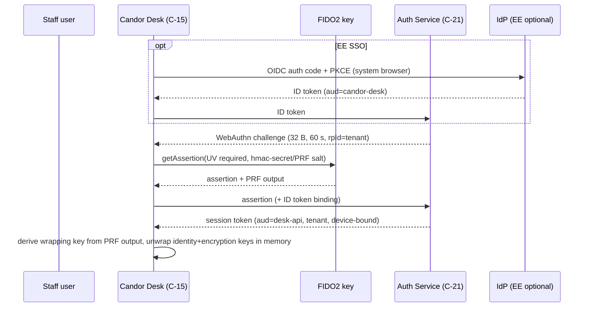

# 15 — Authentication and Authorization
Status: Draft v1.0 · Edition applicability: both (CE: source passphrase, WebAuthn/FIDO2, TOTP fallback, full authorization engine; EE: OIDC/SAML first factor, SCIM, PIV/CAC (GOV), policy designer) · Owner: Identity & Access team

## 1. Purpose and scope

Specifies how sources and staff authenticate, how sessions are managed, and how every access decision is made. Covers source authentication (ADR-005), staff authentication (WebAuthn/FIDO2 by default, passkeys, TOTP fallback, OIDC/SAML, PIV/CAC), sessions and step-up, the authorization model (RBAC + ABAC + case ACL + COI + time-bounded grants + break-glass; ADR-015), separation of system administration from case access, dual control, the policy decision point, IDOR prevention and the test strategy.

**Protection statement.**
- WHAT: case content, source identity, keys, and the integrity of administrative configuration.
- FROM WHOM: credential thieves and phishers (THR-022), malicious/curious administrators (THR-018), investigators exceeding need-to-know (THR-019), accused insiders (THR-020), attackers exploiting authorization bugs (THR-021), a compromised IdP (EE).
- ASSUMPTIONS (`40-SECURITY-ASSUMPTIONS.md`): ASM-028 (hardware authenticators non-exportable), ASM-019 (recipient workstation integrity while unlocked), ASM-036 (honest monitor; clients check log proofs), ASM-033 (membership signing keys), ASM-044 (administrators trusted for availability, not confidentiality), ASM-045 (separation of duties; at least two honest approvers), ASM-031 (identity custodians do not collude), ASM-010 (source passphrase confidential). Protections: 40 P-09, P-10, P-11, P-12, P-24, P-25.
- RESIDUAL RISK: a compromised recipient endpoint with unlocked keys exposes that user's cases; coercion of two approvers defeats dual control; server-side authorization bugs can still expose metadata even though content needs keys.

Two enforcement layers apply to every content access: (1) **server authorization** (C-22) decides whether ciphertext and metadata are delivered; (2) **cryptographic authorization**: content can be decrypted only by holders of case-key wraps (ADR-007/008). Both must pass. Layer 2 is why administrators have zero content capability.

## 2. Context and dependencies

| Doc | Relationship |
|---|---|
| `DECISIONS.md` ADR-005, 007, 013, 014, 015, 021, 029 | binding |
| `04-CRYPTOGRAPHY.md` | key derivation, hmac-secret/PRF wrapping, case-key wrapping |
| `14-CASE-MANAGEMENT.md` | routing groups, COI routing, case transitions, eligibility |
| `10-FILE-EVIDENCE-PIPELINE.md` | original export dual control |
| `20-LOGGING-AUDITING.md` | SECURITY events for authn/authz |
| `21-ENTERPRISE.md` | tenants, SSO/SCIM connector |
| `22-GOVERNMENT.md` | PIV/CAC profile |
| `32-OPERATIONS.md` | configuration classes (DANGEROUS etc.), HUM controls |
| `08-API.md` | route registry, audiences |

Components: C-21 Authentication Service, C-22 Authorization Engine, C-10 Case Service, C-15 Candor Desk, C-19 Admin Console, C-14 Key Directory, C-06/C-07 source web/sealer, C-03 Source App, C-29 HSM/TPM.

## 3. Source authentication (anonymous mode)

| Aspect | Specification |
|---|---|
| Credential | Source Passphrase: 10 words from EFF large list (~129 bits), generated by C-03 (Tier V) or C-07 (Tier W) via OS CSPRNG, shown once (ADR-005) |
| Derivation | Argon2id(passphrase, per-deployment salt; m=256 MiB, t=3, p=1) → seed → HKDF labels: `candor/source/lookup`, `candor/source/auth`, `candor/source/xwing`, `candor/source/ed25519` (details: `04-CRYPTOGRAPHY.md`) |
| Server storage | `lookup_id` (256-bit, HKDF output), source public keys, auth verifier (Ed25519 public key); never the passphrase or seed |
| Tier V login | client derives keys locally; challenge-response: server nonce (32 bytes, single use, 60 s) signed with source auth key |
| Tier W login | C-07 derives keys in RAM from the submitted passphrase, verifies, decrypts replies for rendering, zeroizes (ADR-005) |
| Forbidden | email, phone, SMS, recovery questions, IdP/SSO of any kind, social login, device fingerprinting, "remember me", persistent cookies |
| Recovery | none; lost passphrase = new submission (honest UI text) |
| Throttling | per-Tor-circuit and global in-memory rate limits (ADR-026): default 10 login attempts per circuit per 10 min, global Argon2 concurrency ≤ 4 (Tier W) with queue; no per-account lockout (would enable targeted denial of a source's access) |
| Session (Tier W) | `__Host-candor_src` cookie, `Secure; HttpOnly; SameSite=Strict; Path=/`, no `Expires` (session cookie), audience `source-web` (ADR-029), 256-bit random ID; idle timeout 15 min, absolute 60 min; server-side session state in C-07 memory only (lost on restart, acceptable) |
| Session (Tier V) | per-request signed nonce; no bearer token stored on device |
| Logout | server deletes session synchronously; `Clear-Site-Data: "cache", "cookies", "storage"` (B-SD-02 practice) |
| Confidential/Identified modes | same passphrase mechanism; identity details go to the Sealed Identity Store (ADR-014), never used as credentials |

## 4. Staff authentication

### 4.1 Authenticator policy

| Method | Status | NIST SP 800-63-4 level (B-CO-41) | Allowed for login | Allowed for key unlock (wrapping key) | Config class |
|---|---|---|---|---|---|
| Hardware FIDO2 security key (device-bound, attested, UV via PIN or biometric) | **Default, required** for all staff roles | AAL3 (phishing-resistant, non-exportable) | yes | yes via `hmac-secret` / WebAuthn PRF | default |
| PIV/CAC smart card (GOV) | supported (GOV/EE) | AAL3 | yes (PIV auth key 9A challenge-response) | yes (key management key 9D ECDH-derived wrap) | default in GOV profile |
| Platform authenticator, device-bound (TPM/Secure Enclave, non-syncing) | allowed | AAL2 (AAL3 only if hardware attested non-exportable per policy) | yes | yes via TPM-sealed wrap (ADR-007) | WEAKENING (documented) |
| Synced passkeys (cloud-syncable credentials) | disabled by default; may be enabled only for roles without case-content or admin permissions (METRICS_VIEWER, AUDITOR-metadata) | AAL2 max | yes (limited roles) | **never** (PRF secret would be replicated to the passkey provider) | WEAKENING |
| TOTP (RFC 6238) + local passphrase | CE fallback only when no FIDO2 hardware is available; persistent warning banner; not for SYS_ADMIN, USER_ADMIN, IDENTITY_CUSTODIAN, RECOVERY_TRUSTEE, BREAK_GLASS approvers | AAL2 (not phishing-resistant) | yes | key unlock via software passphrase (Argon2id m=256 MiB) with warning (ADR-007) | DANGEROUS (dual approval, banner, expires after 90 days unless renewed) |
| OIDC / SAML IdP (EE) | first factor only | contributes; overall AAL determined by local step | first factor | never | EE feature |
| OPAQUE password (RFC 9807) | optional additional knowledge factor | — | as additional factor | no | optional |
| SMS / email OTP / push-approve | **forbidden** | — | no | no | not configurable |

Rationale: SecureDrop's TOTP/HOTP journalist 2FA and GlobaLeaks' TOTP-only 2FA are phishable (B-SD-02; B-GL-04); Hush Line OTP reuse (B-GL-39); SP 800-63-4 requires AAL2 verifiers to offer a phishing-resistant option and AAL3 to use non-exportable keys (B-CO-41).

### 4.2 Enrollment

1. USER_ADMIN creates a pending account (or EE SCIM provisions one) → state `PENDING_ENROLLMENT` with no permissions.
2. Enrollment ceremony at the Desk: user registers ≥ 2 FIDO2 authenticators (primary + backup), attestation verified against the tenant's AAGUID allow-list (default: FIPS/Level-2+ certified models list maintained by the tenant); generates identity (Ed25519) and encryption (X-Wing) keys; private keys wrapped under hmac-secret/PRF-derived keys of each registered authenticator.
3. A second USER_ADMIN (≠ creator) approves after out-of-band identity verification (in person or video with ID check, recorded as a HUM control in `32-OPERATIONS.md`); approval signs the user's key bundle into C-14 (transparency-logged; THR-046).
4. Role assignment is a separate dual-approved operation (§7).

### 4.3 Login and key unlock flow (Desk)

- The WebAuthn assertion is verified by C-21 directly against its own credential store — never delegated to the IdP.
- The PRF/hmac-secret output never leaves the Desk; the server never learns wrapping keys.
- The Desk locks (zeroizes unwrapped keys) after 10 min idle (configurable 5–30), on OS lock, on suspend, and on session end.

### 4.4 OIDC/SAML (EE): first factor only

| Rule | Detail |
|---|---|
| Role of IdP | Asserts organizational identity and account liveness. It cannot by itself create a session, unlock keys or grant roles. |
| Mandatory local step | Every login requires a WebAuthn assertion from a Candor-registered authenticator (§4.3) |
| Protocols | OIDC Authorization Code + PKCE with `aud` pinned; SAML 2.0 signed assertions, `InResponseTo` enforced, max clock skew 3 min, assertion replay cache 10 min |
| SCIM (EE) | May create `PENDING_ENROLLMENT` accounts and deactivate accounts; may NOT assign roles, add to routing groups, or enroll authenticators. Deactivation takes effect immediately (fail-safe). Reactivation requires USER_ADMIN dual approval. |
| Attribute use | `department`, `manager` (for COI, 14 §8.4), `employment_status`; attributes are advisory inputs to ABAC, changes audited |

IdP compromise analysis:

| IdP attacker capability | Effect on Candor | Why |
|---|---|---|
| Forge/obtain ID tokens for any user | cannot log in | local WebAuthn assertion required |
| Create users via SCIM | inert `PENDING_ENROLLMENT` accounts | enrollment needs in-person dual approval and C-14 logging |
| Change `manager`/`department` attributes | could alter COI exclusions or ABAC scope | attribute changes affecting existing case memberships are not auto-applied to *add* access; they may only *remove* access automatically; additions require human approval |
| Deactivate users | denial of service (users locked out) | accepted fail-safe; OVERSIGHT notified content-free; reactivation by dual approval |
| Phish a user's IdP password | no access without hardware key | — |

### 4.5 PIV/CAC (GOV)

- Desk accesses the card via PKCS#11; login = challenge signed by PIV Authentication key (slot 9A) with certificate path validation to the agency trust anchor, OCSP/CRL checking (cached ≤ 24 h, fail-closed configurable), FIPS 201-3 conformance (B-CO-49).
- Key unlock: wrapping key = HKDF(ECDH(ephemeral, 9D key management key) ‖ local salt); X-Wing private key remains software-held but wrapped (PIV cannot hold X-Wing; see `04-CRYPTOGRAPHY.md`).
- PIN entry via card reader or OS dialog; PIN never touches the server.

### 4.6 Sessions (staff)

| Parameter | Recipient roles | Admin roles (SYS_ADMIN, USER_ADMIN, SECURITY_OFFICER) |
|---|---|---|
| Token | 256-bit random opaque reference; server-side state in C-12 | same |
| Audience | `desk-api` | `admin-api` (ADR-029) |
| Binding | device key (Ed25519, generated per Desk install, TPM-sealed where available); every request signed (method, path, body hash, timestamp, nonce) — DPoP-style | same |
| Idle timeout | 15 min | 10 min |
| Absolute lifetime | 8 h | 2 h |
| Concurrent sessions | max 2 devices | 1 |
| Revocation | synchronous on logout, role change, authenticator removal, deactivation, COI exclusion of all cases (no), password/PIN change; checked on every request (no stateless JWT) | same |
| Cross-audience replay | rejected (B-SD-20 CVE-2026-50000 lesson) | same |

### 4.7 Step-up re-authentication

A fresh WebAuthn assertion with UV, whose challenge = SHA-256(canonical operation descriptor) ("transaction confirmation"), is required within 60 s before:

| Operation class | Examples |
|---|---|
| Content export | any export; ORIGINAL export (both approvers) |
| Key operations | add case member (key wrap), rotate keys, enroll/remove authenticator, recovery quorum actions |
| Identity | identity unseal request/approval (ADR-014) |
| Governance | approve closure/dismissal/disposal, legal hold set/release, COI map, channel membership/role-label changes, SLA pack changes |
| Admin | any DANGEROUS config change, role assignment, break-glass request/approval, user deactivation/reactivation |
| Audit | audit export |

The server verifies that the signed operation descriptor matches the operation executed (prevents a compromised UI from substituting a different operation after approval).

## 5. Authorization model

### 5.1 Roles (RBAC)

| Role | Purpose | Case content | Notes |
|---|---|---|---|
| INTAKE_TRIAGER | import, triage | yes (cases whose envelope was wrapped to their Member Epoch Key) | channel member with published Member Epoch Keys (ADR-030) |
| INVESTIGATOR | investigate assigned cases | yes (ACL) | |
| CASE_LEAD | owns case workflow | yes (ACL) | relation on case, derived from INVESTIGATOR |
| REVIEWER | second reviewer for closure/dismissal/export/PSR | yes (only when reviewing, via temporary wrap) | |
| CHANNEL_OWNER | manage channel, assign, configure membership, role labels and COI map (dual approved) | only if also an eligible channel member | whistleblowing function lead |
| IDENTITY_CUSTODIAN | hold Sealed Identity Store keys (ADR-014) | identity only, not case content | ≥ 2 required |
| LEGAL_COUNSEL | legal holds, legal basis records | per ACL | may be external |
| OVERSIGHT | independent body: register, canary, break-glass review | metadata; content only as SILENT_MEMBER by audited action | 14 §9.4 |
| RECORDS_OFFICER | disposition approvals (records law) | no | 35 |
| AUDITOR | read CASE/SECURITY audit streams | no | |
| METRICS_VIEWER | k-suppressed reports | no | |
| SECURITY_OFFICER | SECURITY/SYSTEM events, SIEM export config (EE) | no | |
| SYS_ADMIN | infrastructure, updates, backups, health | **no, cryptographically** | |
| USER_ADMIN | create/deactivate accounts, enrollment approvals | no | ≠ SYS_ADMIN holder in CE-HARDENED+ |
| TENANT_ADMIN (EE) | tenant configuration within tenant | no | |
| RECOVERY_TRUSTEE | Recovery Quorum share holder (ADR-013) | only with k-of-n | offline |

Role constraints (static separation of duties): SYS_ADMIN ∩ {INTAKE_TRIAGER, INVESTIGATOR, CASE_LEAD, REVIEWER, IDENTITY_CUSTODIAN} = ∅ for the same account; a person needing both uses two accounts with separate authenticators (both audited, linked by `person_ref` for COI). USER_ADMIN and SYS_ADMIN must be held by different persons in CE-HARDENED and above; CE-SINGLE may combine with a warning.

### 5.2 Permissions matrix (abbreviated; full matrix is machine-readable `authz/matrix.yaml`, the source of truth for tests)

Legend: Y = allowed; A = allowed with relation on the object (member/lead); D = dual control; S = step-up; — = never.

| Permission | TRIAGER | INVEST. | LEAD | REVIEWER | CH_OWNER | ID_CUST | COUNSEL | OVERSIGHT | RECORDS | AUDITOR | METRICS | SEC_OFF | SYS_ADM | USER_ADM |
|---|---|---|---|---|---|---|---|---|---|---|---|---|---|---|
| case.import | A | — | — | — | A | — | — | A (canary) | — | — | — | — | — | — |
| case.read_content | A | A | A | A (review) | A | — | A | A (audited) | — | — | — | — | — | — |
| case.transition | A | — | A | A (approve) | — | — | — | — | — | — | — | — | — | — |
| case.close/dismiss approve | — | — | — | A D S | — | — | — | — | — | — | — | — | — | — |
| case.member_add | — | — | A S | — | A S | — | — | — | — | — | — | — | — | — |
| evidence.open L1/L2 | A | A | A | A | A | — | A | A | — | — | — | — | — | — |
| evidence.export_rendition | — | A S | A S | — | — | — | A S | — | — | — | — | — | — | — |
| evidence.export_original | — | A D S | A D S | — | — | — | A D S | — | — | — | — | — | — | — |
| identity.unseal | — | — | request | — | — | A D S | request | — | — | — | — | — | — | — |
| legal_hold.set/release | — | — | request | — | — | — | Y D S | — | — | — | — | — | — | — |
| disposal.approve | — | — | A | — | — | — | — | Y | Y D S | — | — | — | — | — |
| oversight.register.read | — | — | — | — | — | — | — | Y | — | — | — | — | — | — |
| audit.read CASE | — | — | own cases | — | — | — | — | Y | — | Y | — | — | — | — |
| audit.read SECURITY/SYSTEM | — | — | — | — | — | — | — | — | — | Y | — | Y | Y (SYSTEM) | — |
| audit.export | — | — | — | — | — | — | — | Y D S | — | Y D S | — | Y D S | — | — |
| metrics.read (k-suppressed) | — | — | — | — | Y | — | — | Y | — | — | Y | — | — | — |
| channel membership/role labels/COI config | — | — | — | — | Y D S | — | — | approve | — | — | — | — | — | — |
| user.create/deactivate | — | — | — | — | — | — | — | — | — | — | — | — | — | Y |
| user.enroll_approve | — | — | — | — | — | — | — | — | — | — | — | — | — | Y D S |
| role.assign | — | — | — | — | — | — | — | — | — | — | — | — | — | Y D S |
| system.config (SAFE) | — | — | — | — | — | — | — | — | — | — | — | — | Y S | — |
| system.config (DANGEROUS) | — | — | — | — | — | — | — | notified | — | — | — | Y approve | Y D S | — |
| system.update/backup/restore | — | — | — | — | — | — | — | — | — | — | — | — | Y S | — |
| break_glass.request | — | — | — | — | Y S | — | Y S | Y S | — | — | — | — | — | — |
| break_glass.approve | — | — | — | — | Y D S | — | Y D S | Y D S | — | — | — | — | — | — |

### 5.3 ABAC attributes

| Subject attributes | Object attributes | Environment |
|---|---|---|
| `tenant_id`, `department`, `roles[]`, `channel_memberships[]` (with role labels), `person_ref`, `authn_level` (AAL2/AAL3), `authenticator_class`, `employment_status`, `grant_expiry[]` | `tenant_id`, `channel_id`, `rg_id`, `department_scope`, `case_state`, `flags` (LEGAL_HOLD, SEALED_MATTER, HIGH_DETRIMENT_RISK, BREAK_GLASS_ACTIVE), `coi_exclusions[]`, `acl[]`, `evidence_role`, `min_containment` | request audience, device binding valid, time (trusted), dual-approval token presence, step-up freshness |

Rules of thumb: tenant equality is mandatory for every decision (plus PostgreSQL RLS, ADR-021); department scope restricts CHANNEL_OWNER and TRIAGER to their departments' channels; `SEALED_MATTER` restricts membership changes to COUNSEL + LEAD dual approval; `authn_level=AAL3` required for any content permission unless tenant explicitly downgrades (DANGEROUS).

### 5.4 Case ACLs, need-to-know, COI exclusion

- ACL relations: `member`, `lead`, `reviewer(temp)`, `counsel`, `oversight(silent)`. Membership requires eligibility (14 §7).
- Need-to-know: no role grants "all cases"; there is no global read (contrast SecureDrop's flat authorization, B-SD-20).
- COI exclusions are evaluated **before** ACL: an excluded subject is denied even if an ACL row exists (deny overrides).
- Intake-time COI exclusion is cryptographic (ADR-030): the envelope content key is wrapped only to eligible members' Member Epoch Keys, so a source-excluded or COI-map-excluded member holds no decrypting key; import is permitted only to envelope recipients; the source-derived exclusions form a permanent per-case deny list (see `14-CASE-MANAGEMENT.md` §8). Server-side COI checks after import are the second layer for exclusions discovered at triage.
- Evaluation order: (1) authentication/audience/tenant → (2) explicit deny (COI, deactivated, expired grant) → (3) role permission → (4) relation (case ACL, or envelope recipient for import) → (5) attribute conditions → (6) dual-control/step-up tokens. Default deny.

### 5.5 Temporary access and expiry

| Grant type | Max duration | Renewal | Notes |
|---|---|---|---|
| Reviewer temporary membership | 7 days | by lead | case key wrap removed on expiry + re-key on next open |
| Consultant / external investigator membership | 90 days | dual approval | |
| Counsel membership | 180 days | by lead | |
| Break-glass | 4 h | new request | §5.6 |
| Role assignment | 365 days | re-certification by USER_ADMIN + CHANNEL_OWNER | quarterly access review report |
| Dormant account | auto-suspend after 60 days without login | dual approval to reactivate | |

### 5.6 Break-glass (emergency access)

Use: imminent danger to life/safety or legal deadline when all eligible case members are unavailable.

1. Requester (CHANNEL_OWNER, COUNSEL or OVERSIGHT) files request: case ID, reason code (IMMINENT_DANGER, LEGAL_DEADLINE, MEMBER_INCAPACITATED), free text (encrypted), requested duration ≤ 4 h.
2. Two approvers from {CHANNEL_OWNER, COUNSEL, OVERSIGHT}, both ≠ requester, not COI-excluded, at least one from OVERSIGHT or COUNSEL, each with step-up.
3. Cryptographic path: approval does not grant keys by itself. Keys come from (a) any available case member's Desk wrapping to the requester (preferred), or (b) the Recovery Quorum (ADR-013) if enabled, k-of-n trustees.
4. `BREAK_GLASS_ACTIVE` flag; all actions tagged; automatic expiry; wrap removed and case re-keyed after expiry.
5. Mandatory post-hoc review by OVERSIGHT within 7 days; result recorded; case team notified in case timeline.

### 5.7 Separation: SYSTEM ADMINISTRATION vs CASE ACCESS (cryptographically enforced)

| Mechanism | Effect |
|---|---|
| Admins hold no case-key wraps and publish no Member Epoch Keys (ADR-030; Desks refuse to publish them for admin-role accounts) | Even with full DB and blob access, admins read only ciphertext (ADR-015) |
| Only an existing key holder's Desk can create a new wrap | Admin cannot grant themselves access by editing ACL rows; server ACL without wrap yields nothing |
| Recipient public keys are signed into C-14 under USER_ADMIN dual approval and transparency-logged; Desks verify grantee keys against C-14 before wrapping | Admin cannot substitute a key or insert a hidden recipient without detection (THR-046) |
| Admin API audience separate (`admin-api`), route registry deny-by-default | Admin tokens cannot call case routes (ADR-029) |
| Admin account ≠ case account (§5.1) | Person-level separation |
| Admin actions audited in SECURITY stream visible to AUDITOR/OVERSIGHT | Accountability |

Residual: an admin controls availability (can delete ciphertext, stop services, alter unsigned metadata) and can attempt to serve malicious updates (mitigated by ADR-022) or tamper with Desk distribution (Desk is signed/reproducible).

### 5.8 Dual-control operations (normative list)

| # | Operation | Approver constraints |
|---|---|---|
| DC-01 | Export ORIGINAL evidence | 2 distinct case members with permission; neither COI-excluded |
| DC-02 | Case closure / dismissal / reopen | reviewer ≠ proposer (14) |
| DC-03 | Case disposal | RECORDS_OFFICER or OVERSIGHT + CASE_LEAD |
| DC-04 | Identity unseal (ADR-014) | 2 IDENTITY_CUSTODIANs |
| DC-05 | Legal hold set / release | COUNSEL + LEAD or OVERSIGHT |
| DC-06 | Break-glass | per §5.6 |
| DC-07 | User enrollment approval, role assignment, reactivation | 2 USER_ADMINs |
| DC-08 | COI map, channel membership and role labels, OVERSIGHT_MODE, SLA pack changes | CHANNEL_OWNER + OVERSIGHT |
| DC-09 | DANGEROUS configuration (e.g., TOTP fallback, synced passkeys for limited roles, diagnostic logging, recovery quorum enablement) | SYS_ADMIN + SECURITY_OFFICER (+ OVERSIGHT notified) |
| DC-10 | Audit export | 2 of {AUDITOR, OVERSIGHT, SECURITY_OFFICER} |
| DC-11 | Recovery Quorum use | k-of-n RECOVERY_TRUSTEEs (ADR-013) |
| DC-12 | Abandon un-imported envelope | 2 OVERSIGHT |
| DC-13 | Sandbox image age waiver (10) | SYS_ADMIN + SECURITY_OFFICER |
| DC-14 | Tenant creation/deletion (EE) | 2 platform operators + customer TENANT_ADMIN confirmation |

Dual-control implementation: an `Approval` object = {operation descriptor hash, proposer, approvers[], each with WebAuthn transaction-confirmation assertion, expiry 24 h}. C-22 checks distinct `person_ref` (not just distinct accounts), role constraints and COI. Approvals are single-use.

### 5.9 Policy language and decision point

| Element | Design |
|---|---|
| PDP | C-22, a pure function `decide(principal, action, resource, context) -> Decision{allow, reasons[], obligations[]}` in Rust, no I/O |
| Policy language | Cedar policies (Rust implementation, Apache-2.0) embedded in C-22; policies versioned, signed by CHANNEL_OWNER/SECURITY_OFFICER dual approval for tenant-custom rules; built-in baseline policies compiled in and not overridable (Knowledge (unverified): Cedar's analyzability/verification properties) |
| PIP | C-10 loads attributes from C-12 inside the same DB transaction as the data access (no TOCTOU) |
| PEP | every route handler, declared in the route registry with `action` and `resource extractor`; CI fails if a route lacks a declaration (ADR-029) |
| Obligations | `require_step_up`, `require_dual_control(DC-xx)`, `audit(event_type)`, `watermark_view` (optional) |
| Caching | no decision caching for content actions; attribute cache ≤ 5 s for metadata listing only |
| Explainability | denial reasons returned to Desk as codes (no data leakage), full reasons in SECURITY audit |
| Baseline invariants (non-overridable) | tenant isolation; COI deny-overrides; admin ∉ case content; dual control list §5.8; no global read |

### 5.10 IDOR and object-level authorization

1. All externally visible object IDs are 128-bit random (no sequential IDs).
2. Data-access layer exposes only functions taking an `Authorized<T>` capability produced by the PEP after a PDP allow; constructing `Authorized<T>` outside the authz module is impossible (Rust visibility + sealed trait). CI lint forbids raw SQL on case tables outside the repository module.
3. Every query includes `tenant_id` and relies additionally on PostgreSQL RLS keyed by a per-transaction `SET LOCAL candor.tenant` (ADR-021).
4. List endpoints filter by relation in SQL (never fetch-then-filter in memory).
5. Mass assignment: request DTOs are explicit allow-lists; server-controlled fields (owner, state, receipt verifier, ACL) are never bindable (GlobaLeaks CVE-2026-45020 lesson, B-GL-37).
6. Responses return only fields authorized for the caller (REQ-H-09).

## 6. Test strategy

| Layer | Method |
|---|---|
| Policy unit | Generate tests from `authz/matrix.yaml`: every role × permission × relation (member/non-member/excluded) × tenant (same/other) → expected decision; ≥ 100% matrix coverage |
| Property-based | Random principals/resources: invariants (no cross-tenant allow; excluded never allowed; SYS_ADMIN never content; dual-control ops never allowed with one person) |
| Differential | Cedar policy vs an independent reference model (e.g., Python/Datalog) on 10^6 random requests; any divergence fails CI |
| Route coverage | Route registry test: every route has declaration; unauthenticated/cross-audience calls → 401/403 |
| IDOR suite | Two tenants, two cases per tenant, users in each role; attempt every route with every foreign ID (ST (29) IDOR category) |
| Session | Cross-audience replay matrix (API token → admin, admin → desk, after logout, after deactivation, across ≥ 4 workers) all 401 (B-SD-20) |
| Crypto enforcement | Admin with DB superuser + blob access attempts to read content: only ciphertext; insert ACL row for self: Desk shows no content |
| Dual control | Same person via two accounts (shared `person_ref`) rejected |
| Step-up | Operation substitution after approval rejected (descriptor mismatch) |
| IdP compromise simulation (EE) | Forged ID tokens, SCIM role-assignment attempts, attribute manipulation |
| Pen-test / audit | Scope in `37-SECURITY-AUDIT-PLAN.md` |

## 7. Requirements

| ID | Requirement | Evidence | Threats | Component | Verification |
|---|---|---|---|---|---|
| AUTH-001 | Source authentication SHALL use only the ADR-005 Source Passphrase; the system SHALL NOT offer or accept email, phone, SMS, recovery questions, SSO/IdP or social login for sources in any mode. | ADR-005; REQ-H-05; INC-05 | THR-034; THR-001 | C-06; C-07; C-03 | TST: source routes reject extra identity fields; INSP: route inventory shows no IdP integration on source audiences |
| AUTH-002 | The server SHALL store for sources only `lookup_id`, public keys and an auth verifier derived from the seed, never the passphrase or seed. | ADR-005; B-SD-16 | THR-015; THR-034 | C-08; C-07 | TST: DB schema test; memory zeroization test in C-07 (test build) |
| AUTH-003 | Source login throttling SHALL be per-circuit and global, in memory only, and SHALL NOT lock out individual source accounts. | ADR-026 | THR-032; THR-034 | C-06; C-07 | TST: 11th attempt per circuit in 10 min throttled; other circuits unaffected; no account lock state persisted |
| AUTH-004 | Tier W source sessions SHALL use a `__Host-` session cookie with Secure, HttpOnly, SameSite=Strict, no Expires, audience `source-web`, idle timeout 15 min and absolute 60 min, and logout SHALL delete server state synchronously and send Clear-Site-Data. | ADR-029; B-SD-02 | THR-006; THR-048 | C-06; C-07 | TST: header assertions; post-logout replay → 401 |
| AUTH-005 | Staff accounts SHALL by default require a device-bound FIDO2 hardware authenticator with user verification, verified by C-21 against its own credential store, for every login. | B-CO-41 (SP 800-63-4 AAL3); INC-56 | THR-022 | C-21; C-15 | TST: login without assertion fails; assertion without UV fails |
| AUTH-006 | Staff enrollment SHALL register at least two authenticators at enrollment, and attestation SHALL be checked against a tenant AAGUID allow-list. | B-CO-41 | THR-022 | C-21 | TST: single-authenticator enrollment blocked; non-listed AAGUID rejected |
| AUTH-007 | Private-key unwrapping on the Desk SHALL use hmac-secret/PRF, PIV key management, or TPM-sealed keys; synced passkeys SHALL NOT be usable for key unwrapping. | ADR-007; B-CO-41 | THR-013; THR-022 | C-15 | TST: synced-credential flag prevents key-unlock path; INSP: unlock code review |
| AUTH-008 | Synced passkeys SHALL be disabled by default and, when enabled (WEAKENING config), limited to roles without case-content, identity, admin or approval permissions. | B-CO-41 | THR-022 | C-21; C-22 | TST: synced credential login for INVESTIGATOR denied; for METRICS_VIEWER allowed only when enabled |
| AUTH-009 | TOTP SHALL be available only in CE as a DANGEROUS configuration with dual approval, a persistent warning banner, 90-day expiry unless renewed, per-code single use, per-account throttling, and SHALL NOT be permitted for SYS_ADMIN, USER_ADMIN, IDENTITY_CUSTODIAN, RECOVERY_TRUSTEE or break-glass approvers. | B-SD-02; B-GL-39 (CVE-2024-38523); B-GL-04 | THR-022; THR-035 | C-21; C-19 | TST: code reuse rejected; excluded roles cannot use TOTP; banner snapshot; expiry test |
| AUTH-010 | SMS, email OTP and push-approval authenticators SHALL NOT be implemented. | INC-57; INC-25 | THR-022; THR-028 | C-21 | INSP: code/dependency review |
| AUTH-011 | In EE, OIDC/SAML SHALL be usable only as a first factor; every staff login SHALL additionally require a Candor-registered WebAuthn or PIV assertion; IdP assertions SHALL NOT unlock keys, assign roles or enroll authenticators. | ADR-007; ADR-020 | THR-022; THR-018 | C-21 | TST: forged/valid ID token without local assertion → denied; SCIM role-assign endpoint absent |
| AUTH-012 | SCIM provisioning SHALL create only `PENDING_ENROLLMENT` accounts and deactivate accounts; attribute changes SHALL only remove access automatically, never add it. | ADR-015 | THR-018; THR-020 | C-21; C-22 | TST: SCIM attribute change that would widen scope produces pending approval, not access |
| AUTH-013 | SAML assertions SHALL be signed, `InResponseTo`-bound, replay-cached for 10 min, and accepted within 3 min clock skew; OIDC SHALL use Authorization Code + PKCE with pinned audience. | Knowledge (unverified): SAML/OIDC best practice | THR-022 | C-21 | TST: replay, unsigned, wrong-audience and skewed assertions rejected |
| AUTH-014 | GOV profile SHALL support PIV/CAC login via slot 9A challenge-response with certificate path validation and revocation checking, and key unwrapping via slot 9D derived wrapping. | B-CO-49 (FIPS 201-3); B-CO-41 | THR-022 | C-21; C-15 | TST: PIV test cards with valid, revoked and expired certificates |
| AUTH-015 | Staff enrollment SHALL require approval by a second USER_ADMIN after out-of-band identity verification, and SHALL publish the user's key bundle to C-14. | ADR-007; INC-14 | THR-046; THR-018 | C-21; C-14 | TST: self-approval rejected; key bundle appears in transparency log |
| AUTH-016 | Staff session tokens SHALL be opaque, server-side, audience-bound (`desk-api` or `admin-api`), tenant-bound and device-key-bound with per-request signatures, and SHALL be checked for revocation on every request. | ADR-029; B-SD-20 (CVE-2026-50000) | THR-022; THR-021 | C-21; C-10 | TST: cross-audience replay matrix across ≥ 4 workers; unsigned request rejected; revoked token rejected on next request |
| AUTH-017 | Staff session limits SHALL be: recipients idle 15 min / absolute 8 h / ≤ 2 devices; admins idle 10 min / absolute 2 h / 1 device; Desk SHALL zeroize unwrapped keys after 10 min idle (configurable 5–30), on OS lock and on suspend. | B-SD-02 | THR-022; THR-031 | C-21; C-15 | TST: timer tests; memory inspection after lock (test build) |
| AUTH-018 | Operations listed in §4.7 SHALL require a WebAuthn transaction-confirmation assertion over the SHA-256 of the canonical operation descriptor within 60 s, and the server SHALL verify the executed operation matches the descriptor. | B-SD-13 (SEC-01-010); B-GL-04 | THR-022; THR-018 | C-21; C-22 | TST: stale assertion, mismatched descriptor, and replayed assertion rejected |
| AUTH-019 | Dormant staff accounts SHALL auto-suspend after 60 days without login; reactivation SHALL require dual approval. | B-CO-49 (ISO 27001 A.5.18) | THR-022 | C-21 | TST: time-advanced suspension |
| AUTH-020 | All authentication events (success, failure, step-up, enrollment, deactivation) SHALL emit SECURITY-class events without source-identifying fields. | ADR-016 | THR-038 | C-21; C-24 | TST: event schema tests |
| AUTHZ-001 | Every request SHALL be authorized by C-22 with default deny, in the order of §5.4, with COI and explicit denies overriding all allows. | ADR-015; ADR-029 | THR-021; THR-020 | C-22 | TST: generated matrix tests; property test "excluded never allowed" |
| AUTHZ-002 | Content access SHALL require both a server authorization allow and possession of a case-key wrap; no server component SHALL be able to decrypt case content. | ADR-007; ADR-015; REQ-H-68 | THR-018; THR-014 | C-22; C-15; C-12 | TST: DB-superuser + blob-access admin test reads only ciphertext |
| AUTHZ-003 | SYS_ADMIN and USER_ADMIN roles SHALL have no case-content, case-transition, identity or export permission, and SHALL never receive case-key or epoch-key wraps. | ADR-015; INC-68 | THR-018 | C-22; C-15 | TST: matrix tests; Desk refuses to wrap to accounts holding admin roles |
| AUTHZ-004 | The same account SHALL NOT hold SYS_ADMIN together with any case-content role; in CE-HARDENED and above USER_ADMIN and SYS_ADMIN SHALL be held by different persons (`person_ref`). | ADR-015 | THR-018 | C-22; C-21 | TST: role-assignment conflicts rejected |
| AUTHZ-005 | New case-key wraps SHALL be creatable only by an existing key holder's Desk, which SHALL verify the grantee's key bundle against C-14 before wrapping. | ADR-007; INC-14 | THR-046; THR-018 | C-15; C-14 | TST: ACL row inserted by admin yields no content; substituted key detected |
| AUTHZ-006 | No role or policy SHALL grant read access to all cases of a tenant (no global read). | B-SD-20; R1 §5 item 2 | THR-019 | C-22 | TST: property test over policies; INSP: baseline invariant |
| AUTHZ-007 | Tenant isolation SHALL be enforced both by C-22 (tenant equality) and PostgreSQL RLS with per-transaction tenant setting, and cross-tenant access attempts SHALL be denied and audited. | ADR-021; B-GL-37 (CVE-2026-46648) | THR-021; THR-045 | C-22; C-12 | TST: IDOR suite with two tenants; RLS bypass attempt via direct SQL role fails |
| AUTHZ-008 | Department and channel scoping (ABAC) SHALL restrict CHANNEL_OWNER and INTAKE_TRIAGER to their configured departments' channels. | ADR-015 | THR-019 | C-22 | TST: cross-department access denied |
| AUTHZ-009 | Temporary grants SHALL carry expiry per §5.5, and on expiry the wrap SHALL be removed and the case re-keyed on next member open. | ADR-015 | THR-019 | C-22; C-15 | TST: expiry fixtures; post-expiry access 403 |
| AUTHZ-010 | Break-glass SHALL require two approvers distinct from the requester (at least one OVERSIGHT or COUNSEL), step-up by all, reason code, ≤ 4 h duration, key provision by a member Desk or Recovery Quorum only, automatic expiry, and OVERSIGHT review within 7 days. | ADR-015; ADR-013 | THR-018; THR-020 | C-22; C-10 | TST: each constraint violated once → denied; review task created |
| AUTHZ-011 | Dual-control operations of §5.8 SHALL be enforced by C-22 using single-use Approval objects requiring distinct `person_ref` values and per-approver transaction confirmations. | ADR-012; ADR-013; ADR-014; REQ-H-16 | THR-018; THR-019; THR-041 | C-22 | TST: same person with two accounts rejected; replayed approval rejected |
| AUTHZ-012 | The route registry SHALL be deny-by-default with an explicit `action` and resource extractor per route, and CI SHALL fail on any undeclared route. | ADR-029; B-GL-37 (CVE-2026-46647) | THR-021 | C-10; C-31 | TST: CI job `route-authz-coverage` |
| AUTHZ-013 | Object access SHALL be possible only through `Authorized<T>` capabilities produced by the PEP; raw queries on case tables outside the repository module SHALL be rejected by CI lint. | ADR-029 | THR-021 | C-10 | TST: lint rule; compile-fail tests |
| AUTHZ-014 | Externally visible identifiers SHALL be 128-bit random values and list endpoints SHALL filter by relation in SQL. | REQ-H-09 | THR-021 | C-10; C-12 | TST: IDOR enumeration test; query plan inspection |
| AUTHZ-015 | Request DTOs SHALL be explicit allow-lists; server-controlled fields SHALL NOT be bindable from requests. | B-GL-37 (CVE-2026-45020) | THR-021 | C-10 | TST: mass-assignment fuzz adds unknown/forbidden fields → rejected |
| AUTHZ-016 | API responses SHALL include only fields authorized for the caller's role and relation. | REQ-H-09 | THR-021; THR-019 | C-10 | TST: response-schema per role tests |
| AUTHZ-017 | Tenant-custom Cedar policies SHALL be signed under dual approval, SHALL NOT override baseline invariants of §5.9, and SHALL be validated against the matrix and property tests before activation. | ADR-015 | THR-035; THR-021 | C-22 | TST: policy attempting global read or admin content access rejected at load |
| AUTHZ-018 | The PDP SHALL be a side-effect-free function and SHALL be differentially tested against an independent reference model on ≥ 10^6 random requests per release. | Design | THR-021 | C-22 | TST: CI differential job |
| AUTHZ-019 | Every authorization denial for content, admin or approval actions SHALL be audited in the SECURITY stream with reason codes; denials SHALL return only codes to clients. | ADR-016 | THR-021; THR-038 | C-22; C-24 | TST: denial event emitted; response contains no object data |
| AUTHZ-020 | Role assignments SHALL expire after 365 days unless re-certified, and a quarterly access-review report SHALL be generated for USER_ADMIN and OVERSIGHT. | B-CO-49 (ISO 27001 A.5.18); B-CO-40 (AC-2) | THR-019 | C-22; C-10 | TST: expiry fixture; DEMO: report |
| AUTHZ-021 | Attribute data used for decisions SHALL be read in the same database transaction as the protected data. | Design | THR-021 | C-10; C-22 | INSP: code review; TST: concurrent revoke-during-read test |
| AUTHZ-022 | Content permissions SHALL require `authn_level=AAL3` unless a tenant enables a DANGEROUS downgrade with dual approval. | B-CO-41 | THR-022 | C-22 | TST: AAL2 session denied content by default |
| AUTHZ-023 | C-22 SHALL permit `case.import` only to users whose Member Epoch Key appears in the envelope recipient set, and both C-22 and the Desk SHALL refuse any case-key wrap or ACL grant to a member in the case's permanent source-derived exclusion set. | ADR-030; ADR-015; INC-22 | THR-020 | C-22; C-15 | TST: non-recipient import denied; wrap/ACL grant to source-excluded member rejected at both layers |

## 8. Residual risks and limitations

1. **Endpoint compromise.** A compromised Desk host with an unlocked session exposes all of that user's cases (keys in memory) (THR-013). Hardware keys prevent credential replay elsewhere but not same-host malware.
2. **Coercion/collusion.** Dual control fails if two approvers collude or are coerced; COI rules reduce but do not eliminate collusion inside independent bodies.
3. **Metadata authorization bugs.** Server-side bugs can leak metadata (envelope recipient key IDs, states, dates) even though content needs keys.
4. **Availability power of admins.** Admins can destroy ciphertext or deny service; backups and oversight monitoring mitigate (19, 20).
5. **TOTP fallback.** Where enabled, phishing of staff remains practical; key unlock falls back to a software passphrase.
6. **IdP attributes.** Manipulated `manager` attributes may cause wrongful removal from cases (DoS), by design never wrongful addition.
7. **Source passphrase compromise.** Anyone with the passphrase can read replies and impersonate the source (THR-034); no recovery or revocation by identity is possible by design.

## 9. Open issues

1. OI-15-1: Authenticator AAGUID allow-list maintenance and FIPS 140-3 certified authenticator catalog for GOV (with `22-GOVERNMENT.md`).
2. OI-15-2: Desk on shared/virtual desktops (VDI) cannot bind hardware keys reliably; decide whether to forbid.
3. OI-15-3: OPAQUE as additional factor: value vs complexity; default off.
4. OI-15-4: Cedar dependency must pass `28-SUPPLY-CHAIN.md` vetting (cargo-vet); fallback is a hand-written Rust policy evaluator.
5. OI-15-5: Configuration classes (SAFE/WEAKENING/DANGEROUS) are defined by `32-OPERATIONS.md` (CFG-); this document assumes those names.

### Open Issues for ADR revision

- **ADR-007 software-passphrase fallback.** Conforms; recommend ADR text states that the fallback is a DANGEROUS config requiring dual approval and expiring after 90 days (AUTH-009), to prevent permanent weak deployments.
- **ADR-015 break-glass.** ADR states break-glass requires dual authorization but ADR-015 also says admins hold no keys; break-glass can only obtain keys from a member Desk or the Recovery Quorum. If neither is available (quorum disabled, all members lost), break-glass cannot recover content by design. The ADR should state this explicitly so organizations choose ADR-013 knowingly.
