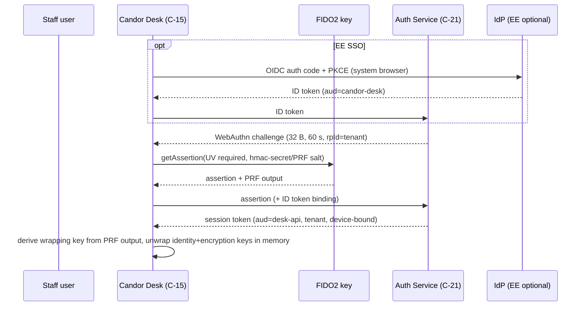

# 15 — Authentication and Authorization
Status: Draft v1.1 (round-2 revision: ADR-036, 037, 043, 044, 045, 046) · Edition applicability: both (CE: source passphrase, WebAuthn/FIDO2, TOTP fallback, full authorization engine; EE: OIDC/SAML first factor, SCIM, PIV/CAC (GOV), policy designer) · Owner: Identity & Access team

## 1. Purpose and scope

Specifies how sources and staff authenticate, how sessions are managed, and how every access decision is made. Covers source authentication (ADR-005), staff authentication (WebAuthn/FIDO2 by default, passkeys, TOTP fallback, OIDC/SAML, PIV/CAC), sessions and step-up, the authorization model (RBAC + ABAC + case ACL + COI + time-bounded grants + break-glass; ADR-015), separation of system administration from case access, dual control, the policy decision point, IDOR prevention and the test strategy. Round 2 adds: suspend-only automation and wrap-deletion cooling-off (ADR-044(1)), ≥ 2 authenticators per member (ADR-044(2)), independent break-glass approval and organisation-as-adversary controls including Fleet Manager limits and small-organisation mode (ADR-045), time-locked roster changes (ADR-036(2)), independent-custody devices (ADR-043), the Triage Set relation (ADR-037) and the RECORDS_CUSTODIAN role (ADR-044(5)).

**Protection statement.**
- WHAT: case content, source identity, keys, and the integrity of administrative configuration.
- FROM WHOM: credential thieves and phishers (THR-022), malicious/curious administrators (THR-018), investigators exceeding need-to-know (THR-019), accused insiders (THR-020), attackers exploiting authorization bugs (THR-021), a compromised IdP (EE).
- ASSUMPTIONS (`40-SECURITY-ASSUMPTIONS.md`): ASM-028 (hardware authenticators non-exportable), ASM-019 (recipient workstation integrity while unlocked), ASM-036 (honest monitor; clients check log proofs), ASM-033 (membership signing keys), ASM-044 (administrators trusted for availability, not confidentiality), ASM-045 (separation of duties; at least two honest approvers), ASM-031 (identity custodians do not collude), ASM-010 (source passphrase confidential). Protections: 40 P-09, P-10, P-11, P-12, P-24, P-25.
- RESIDUAL RISK: a compromised recipient endpoint with unlocked keys exposes that user's cases; coercion of two approvers defeats dual control; server-side authorization bugs can still expose metadata even though content needs keys.

Two enforcement layers apply to every content access: (1) **server authorization** (C-22) decides whether ciphertext and metadata are delivered; (2) **cryptographic authorization**: content can be decrypted only by holders of case-key wraps (ADR-007/008). Both must pass. Layer 2 is why administrators have zero content capability.

## 2. Context and dependencies

| Doc | Relationship |
|---|---|
| `DECISIONS.md` ADR-005, 007, 013, 014, 015, 021, 029, 034, 036, 037, 043, 044, 045, 046 | binding |
| `04-CRYPTOGRAPHY.md` | key derivation, hmac-secret/PRF wrapping, case-key wrapping |
| `14-CASE-MANAGEMENT.md` | routing groups, COI routing, case transitions, eligibility |
| `10-FILE-EVIDENCE-PIPELINE.md` | original export dual control |
| `20-LOGGING-AUDITING.md` | SECURITY events for authn/authz |
| `21-ENTERPRISE.md` | tenants, SSO/SCIM connector |
| `22-GOVERNMENT.md` | PIV/CAC profile |
| `32-OPERATIONS.md` | configuration classes (DANGEROUS etc.), HUM controls |
| `08-API.md` | route registry, audiences |

Components: C-21 Authentication Service, C-22 Authorization Engine, C-10 Case Service, C-15 Candor Desk, C-19 Admin Console, C-14 Key Directory, C-06/C-07 source web/sealer, C-03 Source App, C-29 HSM/TPM.

## 3. Source authentication (anonymous mode)

| Aspect | Specification |
|---|---|
| Credential | Source Passphrase: 10 words from EFF large list (~129 bits), generated by C-03 (Tier V) or C-07 (Tier W) via OS CSPRNG, shown once (ADR-005) |
| Derivation | Argon2id(passphrase, per-deployment salt; m=64 MiB, t=3, p=1; FIPS profile: PBKDF2-HMAC-SHA-512, 210,000 iterations) (ADR-046(7)) → seed → HKDF labels: `candor/source/lookup`, `candor/source/auth`, `candor/source/xwing`, `candor/source/ed25519` (details: `04-CRYPTOGRAPHY.md`) |
| Server storage | `lookup_id` (256-bit, HKDF output), source public keys, auth verifier (Ed25519 public key); never the passphrase or seed |
| Tier V login | client derives keys locally; challenge-response: server nonce (32 bytes, single use, 60 s) signed with source auth key |
| Tier W login | C-07 derives keys in RAM from the submitted passphrase, verifies, decrypts replies for rendering, zeroizes (ADR-005) |
| Forbidden | email, phone, SMS, recovery questions, IdP/SSO of any kind, social login, device fingerprinting, "remember me", persistent cookies |
| Recovery | none; lost passphrase = new submission (honest UI text) |
| Rotation | sources may rotate their passphrase from the inbox (ADR-046(7)); the new public keys reach the case in an authenticated source message |
| Throttling | per-Tor-circuit and global in-memory rate limits (ADR-026): default 10 login attempts per circuit per 10 min, global Argon2 concurrency semaphore default 4 (Tier W) plus PoW (ADR-046(7)); no per-account lockout (would enable targeted denial of a source's access) |
| Session (Tier W) | `__Host-cs` cookie (name per `08-API.md`), `Secure; HttpOnly; SameSite=Strict; Path=/`, no `Expires` (session cookie), audience `source-web` (ADR-029), 256-bit random value; single timer set idle 20 min, absolute 2 h (ADR-034); session and draft state in C-07 mlocked RAM only (lost on restart, stated in the UI) |
| Session (Tier V) | per-request signed nonce; no bearer token stored on device |
| Logout | server deletes session synchronously; `Clear-Site-Data: "cache", "cookies", "storage"` (B-SD-02 practice) |
| Confidential/Identified modes | same passphrase mechanism; identity details go to the Sealed Identity Store (ADR-014), never used as credentials |

## 4. Staff authentication

### 4.1 Authenticator policy

| Method | Status | NIST SP 800-63-4 level (B-CO-41) | Allowed for login | Allowed for key unlock (wrapping key) | Config class |
|---|---|---|---|---|---|
| Hardware FIDO2 security key (device-bound, attested, UV via PIN or biometric) | **Default, required** for all staff roles | AAL3 (phishing-resistant, non-exportable) | yes | yes via `hmac-secret` / WebAuthn PRF | SAFE (default) |
| PIV/CAC smart card (GOV) | supported (GOV/EE) | AAL3 | yes (PIV auth key 9A challenge-response) | yes (key management key 9D ECDH-derived wrap) | SAFE (default in GOV profile) |
| Platform authenticator, device-bound (TPM/Secure Enclave, non-syncing) | allowed | AAL2 (AAL3 only if hardware attested non-exportable per policy) | yes | yes via TPM-sealed wrap (ADR-007) | ADVANCED (documented) |
| Synced passkeys (cloud-syncable credentials) | disabled by default; may be enabled only for roles without case-content or admin permissions (METRICS_VIEWER, AUDITOR-metadata) | AAL2 max | yes (limited roles) | **never** (PRF secret would be replicated to the passkey provider) | DANGEROUS (ADR-046(6): former WEAKENING) |
| TOTP (RFC 6238) + local passphrase | CE fallback only when no FIDO2 hardware is available; persistent warning banner; not for SYS_ADMIN, USER_ADMIN, IDENTITY_CUSTODIAN, RECOVERY_TRUSTEE, BREAK_GLASS approvers | AAL2 (not phishing-resistant) | yes | key unlock via software passphrase (Argon2id m=256 MiB) with warning (ADR-007) | DANGEROUS (dual approval, banner, expires after 90 days unless renewed) |
| OIDC / SAML IdP (EE) | first factor only | contributes; overall AAL determined by local step | first factor | never | EE feature |
| OPAQUE password (RFC 9807) | optional additional knowledge factor | — | as additional factor | no | optional |
| SMS / email OTP / push-approve | **forbidden** | — | no | no | not configurable |

Config classes follow ADR-046(6): SAFE / ADVANCED / DANGEROUS only.

Rationale: SecureDrop's TOTP/HOTP journalist 2FA and GlobaLeaks' TOTP-only 2FA are phishable (B-SD-02; B-GL-04); Hush Line OTP reuse (B-GL-39); SP 800-63-4 requires AAL2 verifiers to offer a phishing-resistant option and AAL3 to use non-exportable keys (B-CO-41).

### 4.2 Enrollment

1. USER_ADMIN creates a pending account (or EE SCIM provisions one) → state `PENDING_ENROLLMENT` with no permissions.
2. Enrollment ceremony at the Desk: user registers ≥ 2 FIDO2 authenticators (primary + stored backup, ADR-044(2)), attestation verified against the tenant's AAGUID allow-list (default: FIPS/Level-2+ certified models list maintained by the tenant) and **recorded** (AAGUID, and certificate serial where attestation exposes it); generates identity (Ed25519) and encryption (X-Wing) keys; private keys wrapped under hmac-secret/PRF-derived keys of each registered authenticator. The backup authenticator is stored physically apart from the primary (HUM control in `32-OPERATIONS.md`).
3. A second approver (≠ creator) approves after out-of-band identity verification (in person or video with ID check, recorded as a HUM control); approval signs the user's key bundle into C-14 (transparency-logged; THR-046). For accounts that will join an INDEPENDENT channel or a Triage Set, the second approver SHALL hold an independent role (OVERSIGHT or external party) and verifies `person_ref` out of band (ADR-036(2), RVW-C-05). `person_ref` is bound to the recorded attestation data: two accounts presenting the same authenticator serial share one `person_ref` (RVW-C-09).
4. Role assignment is a separate dual-approved operation (§7).
5. A member SHALL keep ≥ 2 registered authenticators at all times; removing an authenticator that would leave fewer than 2 is refused until a replacement is enrolled (except removal of a lost/compromised one, which sets the account to `NEEDS_AUTHENTICATOR` with a banner and OVERSIGHT notice).

### 4.3 Login and key unlock flow (Desk)

- The WebAuthn assertion is verified by C-21 directly against its own credential store — never delegated to the IdP.
- The PRF/hmac-secret output never leaves the Desk; the server never learns wrapping keys.
- The Desk locks (zeroizes unwrapped keys) after 10 min idle (configurable 5–30), on OS lock, on suspend, and on session end.

### 4.4 OIDC/SAML (EE): first factor only

| Rule | Detail |
|---|---|
| Role of IdP | Asserts organizational identity and account liveness. It cannot by itself create a session, unlock keys or grant roles. |
| Mandatory local step | Every login requires a WebAuthn assertion from a Candor-registered authenticator (§4.3) |
| Protocols | OIDC Authorization Code + PKCE with `aud` pinned; SAML 2.0 signed assertions, `InResponseTo` enforced, max clock skew 3 min, assertion replay cache 10 min |
| SCIM (EE) | May create `PENDING_ENROLLMENT` accounts and **suspend** accounts; may NOT assign roles, add to routing groups or Triage Sets, enroll authenticators, delete accounts or delete key wraps. Suspension (SCIM `active=false`, HR termination, IdP disable) takes effect immediately: sessions revoked, no ciphertext delivery, **keys and wraps intact** (ADR-044(1)). Deletion of the account's case-key wraps follows DC-15 (7-day cooling-off, OVERSIGHT notice). Reactivation requires USER_ADMIN dual approval. |
| Attribute use | `department`, `employment_status` only; attributes are advisory inputs to ABAC scoping, changes audited, and never returned to Desk case views (RVW-B-23). The `manager` attribute is **not ingested**: reporting-line COI checks are done by the Triage Set with HR data held outside Candor (ADR-037(2), RVW-B-03). |
| IdP as observer | The IdP (and any SIEM fed by it) records staff login times, IPs and devices; this is a staff-reaction timing channel (RVW-C-02) disclosed in the source-facing "what this protects" text (03). For INDEPENDENT channels a dedicated IdP or no IdP (local WebAuthn only) is RECOMMENDED. |

IdP compromise analysis:

| IdP attacker capability | Effect on Candor | Why |
|---|---|---|
| Forge/obtain ID tokens for any user | cannot log in | local WebAuthn assertion required |
| Create users via SCIM | inert `PENDING_ENROLLMENT` accounts | enrollment needs in-person dual approval and C-14 logging |
| Change `department` attributes | could narrow ABAC scope | attribute changes never add access; narrowing only **suspends** delivery; no wrap is deleted automatically (ADR-044(1)) |
| Deactivate users | temporary denial of service (users suspended); cannot destroy case access | suspension only; keys and wraps intact; OVERSIGHT notified content-free; wrap deletion needs DC-15 with 7-day cooling-off; reactivation by dual approval (RVW-C-03) |
| Phish a user's IdP password | no access without hardware key | — |

### 4.5 PIV/CAC (GOV)

- Desk accesses the card via PKCS#11; login = challenge signed by PIV Authentication key (slot 9A) with certificate path validation to the agency trust anchor, OCSP/CRL checking (cached ≤ 24 h, fail-closed configurable), FIPS 201-3 conformance (B-CO-49).
- Key unlock: wrapping key = HKDF(ECDH(ephemeral, 9D key management key) ‖ local salt); X-Wing private key remains software-held but wrapped (PIV cannot hold X-Wing; see `04-CRYPTOGRAPHY.md`).
- PIN entry via card reader or OS dialog; PIN never touches the server.

### 4.6 Sessions (staff)

| Parameter | Recipient roles | Admin roles (SYS_ADMIN, USER_ADMIN, SECURITY_OFFICER) |
|---|---|---|
| Token | 256-bit random opaque reference; server-side state in C-12 | same |
| Audience | `desk-api` | `admin-api` (ADR-029) |
| Binding | device key (Ed25519, generated per Desk install, TPM-sealed where available); every request signed (method, path, body hash, timestamp, nonce) — DPoP-style | same |
| Idle timeout | 15 min | 10 min |
| Absolute lifetime | 8 h | 2 h |
| Concurrent sessions | max 2 devices | 1 |
| Revocation | synchronous on logout, role change, authenticator removal, deactivation, COI exclusion of all cases (no), password/PIN change; checked on every request (no stateless JWT) | same |
| Cross-audience replay | rejected (B-SD-20 CVE-2026-50000 lesson) | same |

### 4.7 Step-up re-authentication

A fresh WebAuthn assertion with UV, whose challenge = SHA-256(canonical operation descriptor) ("transaction confirmation"), is required within 60 s before:

| Operation class | Examples |
|---|---|
| Content export | any export; ORIGINAL export (both approvers) |
| Key operations | add case member (key wrap), rotate keys, enroll/remove authenticator, recovery quorum actions |
| Identity | identity unseal request/approval (ADR-014) |
| Governance | approve closure/dismissal/disposal, legal hold set/release, COI map, channel membership/role-label changes, SLA pack changes |
| Admin | any DANGEROUS config change, role assignment, break-glass request/approval, user deactivation/reactivation |
| Audit | audit export |

The server verifies that the signed operation descriptor matches the operation executed (prevents a compromised UI from substituting a different operation after approval).

**Accessibility accommodation (RVW-C-16).** A per-user, audited accommodation (approved by USER_ADMIN + OVERSIGHT) MAY extend the step-up window to 180 s and allow PIV + PIN via reader or a device-bound platform authenticator with UV (ADVANCED class) as the step-up authenticator. The accommodation never allows synced passkeys for key unlock.

## 5. Authorization model

### 5.1 Roles (RBAC)

| Role | Purpose | Case content | Notes |
|---|---|---|---|
| INTAKE_TRIAGER | Triage Set member (ADR-037): import, triage, wrap case key to further investigators | yes (cases whose envelope slots they open) | only Triage Set members publish Member Epoch Keys and hold the Channel Identity Key (ADR-036(1)); on INDEPENDENT channels requires an independent-custody device (ADR-043) |
| INVESTIGATOR | investigate assigned cases | yes (ACL) | |
| CASE_LEAD | owns case workflow | yes (ACL) | relation on case, derived from INVESTIGATOR |
| REVIEWER | second reviewer for closure/dismissal/export/PSR | yes (only when reviewing, via temporary wrap) | |
| CHANNEL_OWNER | manage channel, assign, configure membership, role labels and COI map (dual approved) | only if also an eligible channel member | whistleblowing function lead |
| IDENTITY_CUSTODIAN | hold Sealed Identity Store keys (ADR-014) | identity only, not case content | ≥ 2 required |
| LEGAL_COUNSEL | legal holds, legal basis records | per ACL | tagged `internal` or `external`; only `external` counts as an independent role (ADR-045, RVW-C-10) |
| OVERSIGHT | independent body: register, canary, break-glass review | metadata; content only as SILENT_MEMBER by audited action | 14 §9.4 |
| RECORDS_OFFICER | disposition approvals (records law) | no | 35 |
| RECORDS_CUSTODIAN | records/FOIA/ATIP/GDPR/eDiscovery search in own Desk (ADR-044(5)) | only cases explicitly wrapped by a Triage Set member, time-bounded (§5.5) | 14 §8.7; no server-side search |
| AUDITOR | read CASE/SECURITY audit streams | no | |
| METRICS_VIEWER | k-suppressed reports | no | |
| SECURITY_OFFICER | SECURITY/SYSTEM events, SIEM export config (EE) | no | |
| SYS_ADMIN | infrastructure, updates, backups, health | **no, cryptographically** | |
| USER_ADMIN | create/deactivate accounts, enrollment approvals | no | ≠ SYS_ADMIN holder in CE-HARDENED+ |
| TENANT_ADMIN (EE) | tenant configuration within tenant | no | |
| RECOVERY_TRUSTEE | Recovery Quorum share holder (ADR-013; GOV default enabled, ADR-044(3)) | only with k-of-n | offline; from independent roles in GOV |
| `fleet` (non-human principal, EE) | C-34 Fleet Manager actions (ADR-045) | **no** | §5.12: explicit action allow-list; cannot disable intake, lower security floors, change routing, rosters, COI, break-glass or retention/logging except tightening |

**Independent roles** (used by ADR-036(2), ADR-044(1), ADR-045 approver constraints): OVERSIGHT, external LEGAL_COUNSEL, and holders of independent-body role labels (14 §8.1) who are outside the organisation's legal/management chain, as declared in the signed tenant governance record and certified by OVERSIGHT.

Role constraints (static separation of duties): SYS_ADMIN ∩ {INTAKE_TRIAGER, INVESTIGATOR, CASE_LEAD, REVIEWER, IDENTITY_CUSTODIAN, RECORDS_CUSTODIAN} = ∅ for the same account; a person needing both uses two accounts with separate authenticators (both audited, linked by `person_ref` for COI). USER_ADMIN and SYS_ADMIN must be held by different persons in CE-HARDENED and above; CE-SINGLE may combine with a warning.

### 5.2 Permissions matrix (abbreviated; full matrix is machine-readable `authz/matrix.yaml`, the source of truth for tests)

Legend: Y = allowed; A = allowed with relation on the object (member/lead); D = dual control; S = step-up; — = never.

| Permission | TRIAGER | INVEST. | LEAD | REVIEWER | CH_OWNER | ID_CUST | COUNSEL | OVERSIGHT | RECORDS | AUDITOR | METRICS | SEC_OFF | SYS_ADM | USER_ADM |
|---|---|---|---|---|---|---|---|---|---|---|---|---|---|---|
| case.import | A (Triage Set only) | — | — | — | — | — | — | A (canary; SILENT_MEMBER) | — | — | — | — | — | — |
| case.read_content | A | A | A | A (review) | A | — | A | A (audited) | — | — | — | — | — | — |
| case.transition | A | — | A | A (approve) | — | — | — | — | — | — | — | — | — | — |
| case.close/dismiss approve | — | — | — | A D S | — | — | — | — | — | — | — | — | — | — |
| case.member_add | — | — | A S | — | A S | — | — | — | — | — | — | — | — | — |
| evidence.open L1/L2 | A | A | A | A | A | — | A | A | — | — | — | — | — | — |
| evidence.export_rendition | — | A S | A S | — | — | — | A S | — | — | — | — | — | — | — |
| evidence.export_original | — | A D S | A D S | — | — | — | A D S | — | — | — | — | — | — | — |
| identity.unseal | — | — | request | — | — | A D S | request | — | — | — | — | — | — | — |
| legal_hold.set/release | — | — | request | — | — | — | Y D S | — | — | — | — | — | — | — |
| disposal.approve | — | — | A | — | — | — | — | Y | Y D S | — | — | — | — | — |
| oversight.register.read | — | — | — | — | — | — | — | Y | — | — | — | — | — | — |
| audit.read CASE | — | — | own cases | — | — | — | — | Y | — | Y | — | — | — | — |
| audit.read SECURITY/SYSTEM | — | — | — | — | — | — | — | — | — | Y | — | Y | Y (SYSTEM) | — |
| audit.export | — | — | — | — | — | — | — | Y D S | — | Y D S | — | Y D S | — | — |
| metrics.read (k-suppressed) | — | — | — | — | Y | — | — | Y | — | — | Y | — | — | — |
| channel membership/role labels/COI config | — | — | — | — | Y D S | — | — | approve | — | — | — | — | — | — |
| user.create/deactivate | — | — | — | — | — | — | — | — | — | — | — | — | — | Y |
| user.enroll_approve | — | — | — | — | — | — | — | — | — | — | — | — | — | Y D S |
| role.assign | — | — | — | — | — | — | — | — | — | — | — | — | — | Y D S |
| system.config (SAFE) | — | — | — | — | — | — | — | — | — | — | — | — | Y S | — |
| system.config (DANGEROUS) | — | — | — | — | — | — | — | notified | — | — | — | Y approve | Y D S | — |
| system.update/backup/restore | — | — | — | — | — | — | — | — | — | — | — | — | Y S | — |
| break_glass.request | — | — | — | — | Y S | — | Y S | Y S | — | — | — | — | — | — |
| break_glass.approve | — | — | — | — | Y D S | — | Y D S | Y D S | — | — | — | — | — | — |
| case.wrap_delete (DC-15) | — | — | A D S | — | A D S | — | — | Y D S (notified, 7-day cooling-off) | — | — | — | — | — | — |

RECORDS_CUSTODIAN has only `case.read_content` (A, via explicit grant) and `records.search_local` (Desk-local); it has no transition, export-original, identity or approval permission. The `fleet` principal has no permission in this matrix; its actions are listed in §5.12. Break-glass approval additionally requires one approver from an independent role (§5.6).

### 5.3 ABAC attributes

| Subject attributes | Object attributes | Environment |
|---|---|---|
| `tenant_id`, `department`, `roles[]`, `channel_memberships[]` (with role labels and Triage Set flag), `person_ref`, `authn_level` (AAL2/AAL3), `authenticator_class`, `authenticator_count`, `device_custody` (INDEPENDENT/ORG/UNKNOWN), `account_state` (ACTIVE/SUSPENDED/NEEDS_AUTHENTICATOR), `employment_status`, `grant_expiry[]` | `tenant_id`, `channel_id`, `rg_id`, `department_scope`, `case_state`, `flags` (LEGAL_HOLD, SEALED_MATTER, HIGH_DETRIMENT_RISK, BREAK_GLASS_ACTIVE, RESTRICTED_OVERSIGHT, HOLDER_SUSPENDED), `coi_excl_tags[8]` (blinded, ADR-037(3)), `acl[]`, `channel_type` (INDEPENDENT/STANDARD), `triage_set[]`, `evidence_role`, `min_containment` | request audience, device binding valid, time (trusted), dual-approval token presence, step-up freshness |

Rules of thumb: tenant equality is mandatory for every decision (plus PostgreSQL RLS, ADR-021); department scope restricts CHANNEL_OWNER and TRIAGER to their departments' channels; `SEALED_MATTER` restricts membership changes to COUNSEL + LEAD dual approval; `authn_level=AAL3` required for any content permission unless tenant explicitly downgrades (DANGEROUS).

### 5.4 Case ACLs, need-to-know, COI exclusion

- ACL relations: `member`, `lead`, `reviewer(temp)`, `counsel`, `oversight(silent)`. Membership requires eligibility (14 §7).
- Need-to-know: no role grants "all cases"; there is no global read (contrast SecureDrop's flat authorization, B-SD-20).
- COI exclusions are evaluated **before** ACL: an excluded subject is denied even if an ACL row exists (deny overrides).
- Intake-time COI exclusion is cryptographic (ADR-030, ADR-037): the envelope content key is wrapped only to eligible Triage Set members' Member Epoch Keys, so a source-excluded, COI-map-excluded or non-triage member holds no decrypting key; import is permitted only to Triage Set members (C-22 cannot know which slot a Desk opened; the Desk proves possession by producing the signed import record). Exclusions are stored only as blinded tags `HMAC(K_case_excl, user_id)` padded to 8 (ADR-037(3)); C-22 evaluates the explicit-deny step by a blind membership test on the tag supplied by the granting or requesting Desk, and denial reason codes do not distinguish COI from other relations (`NO_RELATION`). See `14-CASE-MANAGEMENT.md` §8.
- Evaluation order: (1) authentication/audience/tenant → (2) explicit deny (COI, deactivated, expired grant) → (3) role permission → (4) relation (case ACL, or envelope recipient for import) → (5) attribute conditions → (6) dual-control/step-up tokens. Default deny.

### 5.5 Temporary access and expiry

| Grant type | Max duration | Renewal | Notes |
|---|---|---|---|
| Reviewer temporary membership | 7 days | by lead | case key wrap removed on expiry + re-key on next open |
| Consultant / external investigator membership | 90 days | dual approval | |
| Counsel membership | 180 days | by lead | |
| Break-glass | 4 h | new request | §5.6 |
| RECORDS_CUSTODIAN case grant | 30 days | new grant by a Triage Set member | ADR-044(5); wrap removed and case re-keyed on expiry |
| Role assignment | 365 days | re-certification by USER_ADMIN + CHANNEL_OWNER | quarterly access review report |
| Dormant account | auto-suspend after 60 days without login (suspension only; keys and wraps intact, ADR-044(1)) | dual approval to reactivate | |

Expiry of a *temporary* grant (reviewer, consultant, counsel, custodian, break-glass) removes the wrap as part of the grant's own terms; this is not an automated removal of standing access and is not subject to the DC-15 cooling-off.

### 5.6 Break-glass (emergency access)

Use: imminent danger to life/safety or legal deadline when all eligible case members are unavailable.

1. Requester (CHANNEL_OWNER, COUNSEL or OVERSIGHT) files request: case ID, reason code (IMMINENT_DANGER, LEGAL_DEADLINE, MEMBER_INCAPACITATED), free text (encrypted), requested duration ≤ 4 h.
2. Two approvers from {CHANNEL_OWNER, COUNSEL, OVERSIGHT}, both ≠ requester (distinct `person_ref`), not COI-excluded, each with step-up, and **at least one from an independent role outside the legal/management chain** (OVERSIGHT or `external` COUNSEL; ADR-045). Internal counsel never satisfies the independence condition (RVW-C-10).
3. Timing: `IMMINENT_DANGER` may execute immediately after approval (post-hoc review below); `LEGAL_DEADLINE` and `MEMBER_INCAPACITATED` execute no earlier than 24 h after the independent approval, during which the case team is notified in the case timeline.
4. Cryptographic path: approval does not grant keys by itself. Keys come from (a) any available case member's Desk wrapping to the requester (preferred), or (b) the Recovery Quorum (ADR-013) if enabled, k-of-n trustees. The member Desk asked to wrap is shown the full approval set and may **refuse**; a refusal is recorded as `breakglass.wrap_refused` visible to OVERSIGHT (RVW-C-10).
5. `BREAK_GLASS_ACTIVE` flag; all actions tagged; automatic expiry; wrap removed and case re-keyed after expiry.
6. Mandatory post-hoc review by OVERSIGHT within 7 days; result recorded; case team notified in case timeline.
7. If neither a member Desk nor an enabled Recovery Quorum can provide keys, break-glass cannot recover content by design; the Admin UI states this when ADR-013 is disabled.

**Platform break-glass admin set (for `31-INCIDENT-RESPONSE.md` PB-06, RVW-C-22).** Emergency *platform* actions (restore, isolate, restart intake) are performed by SYS_ADMIN + SECURITY_OFFICER under DC-09 with an additional OVERSIGHT approval when the incident may involve management; this set has no content capability and is not a separate role.

### 5.7 Separation: SYSTEM ADMINISTRATION vs CASE ACCESS (cryptographically enforced)

| Mechanism | Effect |
|---|---|
| Admins hold no case-key wraps and publish no Member Epoch Keys (ADR-030; Desks refuse to publish them for admin-role accounts) | Even with full DB and blob access, admins read only ciphertext (ADR-015) |
| Only an existing key holder's Desk can create a new wrap | Admin cannot grant themselves access by editing ACL rows; server ACL without wrap yields nothing |
| Recipient public keys are signed into C-14 under USER_ADMIN dual approval and transparency-logged; Desks verify grantee keys against C-14 before wrapping | Admin cannot substitute a key or insert a hidden recipient without detection (THR-046) |
| Admin API audience separate (`admin-api`), route registry deny-by-default | Admin tokens cannot call case routes (ADR-029) |
| Admin account ≠ case account (§5.1) | Person-level separation |
| Admin actions audited in SECURITY stream visible to AUDITOR/OVERSIGHT | Accountability |

Residual: an admin controls availability (can delete ciphertext, stop services, alter unsigned metadata) and can attempt to serve malicious updates (mitigated by ADR-022) or tamper with Desk distribution (Desk is signed/reproducible).

### 5.8 Dual-control operations (normative list)

| # | Operation | Approver constraints |
|---|---|---|
| DC-01 | Export ORIGINAL evidence | 2 distinct case members with permission; neither COI-excluded |
| DC-02 | Case closure / dismissal / reopen | reviewer ≠ proposer (14) |
| DC-03 | Case disposal | RECORDS_OFFICER or OVERSIGHT + CASE_LEAD |
| DC-04 | Identity unseal (ADR-014) | 2 IDENTITY_CUSTODIANs |
| DC-05 | Legal hold set / release | COUNSEL + LEAD or OVERSIGHT |
| DC-06 | Break-glass | per §5.6 |
| DC-07 | User enrollment approval, role assignment, reactivation | 2 USER_ADMINs; for accounts joining an INDEPENDENT channel or Triage Set, the second approver holds an independent role and verifies `person_ref` out of band (ADR-036(2)) |
| DC-08 | COI map, channel membership, Triage Set and role labels, OVERSIGHT_MODE, SLA pack changes | CHANNEL_OWNER + ≥ 1 approver from an independent role (OVERSIGHT certifies role labels, ADR-036(3)); additions, label changes and COI loosening are time-locked 72 h (GOV/HIGH: 7 days) and notified content-free to all current members and OVERSIGHT; removals and tightening immediate (ADR-036(2)) |
| DC-09 | DANGEROUS configuration (e.g., TOTP fallback, synced passkeys for limited roles, diagnostic logging, recovery quorum enablement) | SYS_ADMIN + SECURITY_OFFICER (+ OVERSIGHT notified) |
| DC-10 | Audit export | 2 of {AUDITOR, OVERSIGHT, SECURITY_OFFICER} |
| DC-11 | Recovery Quorum use | k-of-n RECOVERY_TRUSTEEs (ADR-013) |
| DC-12 | Abandon un-imported envelope | 2 OVERSIGHT |
| DC-13 | Sandbox image age waiver (10) | SYS_ADMIN + SECURITY_OFFICER |
| DC-14 | Tenant creation/deletion (EE) | 2 platform operators + customer TENANT_ADMIN confirmation |
| DC-15 | Deletion of a member's case-key wraps (after suspension) | CASE_LEAD or CHANNEL_OWNER + OVERSIGHT; executes ≥ 7 days after approval with content-free OVERSIGHT notice; blocked if < 2 key holders would remain; not required for source-requested erasure, retention-expiry disposal or expiry of a temporary grant (ADR-044(1)) |
| DC-16 | Enable an INDEPENDENT channel whose Triage Set lacks independent-custody devices (DANGEROUS) | SECURITY_OFFICER + OVERSIGHT; disclosed in the channel descriptor (ADR-043) |
| DC-17 | Fleet availability-affecting action (update scheduling that restarts intake, internal certificate rotation) | customer OVERSIGHT or designated independent role (ADR-045) |

Dual-control implementation: an `Approval` object = {operation descriptor hash, proposer, approvers[], each with WebAuthn transaction-confirmation assertion, expiry 24 h}. C-22 checks distinct `person_ref` (not just distinct accounts), role constraints and COI. Approvals are single-use.

### 5.9 Policy language and decision point

| Element | Design |
|---|---|
| PDP | C-22, a pure function `decide(principal, action, resource, context) -> Decision{allow, reasons[], obligations[]}` in Rust, no I/O |
| Policy language | Cedar policies (Rust implementation, Apache-2.0) embedded in C-22; policies versioned, signed by CHANNEL_OWNER/SECURITY_OFFICER dual approval for tenant-custom rules; built-in baseline policies compiled in and not overridable (Knowledge (unverified): Cedar's analyzability/verification properties) |
| PIP | C-10 loads attributes from C-12 inside the same DB transaction as the data access (no TOCTOU) |
| PEP | every route handler, declared in the route registry with `action` and `resource extractor`; CI fails if a route lacks a declaration (ADR-029) |
| Obligations | `require_step_up`, `require_dual_control(DC-xx)`, `audit(event_type)`, `watermark_view` (optional) |
| Caching | no decision caching for content actions; attribute cache ≤ 5 s for metadata listing only |
| Explainability | denial reasons returned to Desk as codes (no data leakage), full reasons in SECURITY audit |
| Baseline invariants (non-overridable) | tenant isolation; COI deny-overrides; admin ∉ case content; dual control list §5.8; no global read; suspend-only automation (no automated wrap deletion); `fleet` principal allow-list (§5.12) |

### 5.10 IDOR and object-level authorization

1. All externally visible object IDs are 128-bit random (no sequential IDs).
2. Data-access layer exposes only functions taking an `Authorized<T>` capability produced by the PEP after a PDP allow; constructing `Authorized<T>` outside the authz module is impossible (Rust visibility + sealed trait). CI lint forbids raw SQL on case tables outside the repository module.
3. Every query includes `tenant_id` and relies additionally on PostgreSQL RLS keyed by a per-transaction `SET LOCAL candor.tenant` (ADR-021).
4. List endpoints filter by relation in SQL (never fetch-then-filter in memory).
5. Mass assignment: request DTOs are explicit allow-lists; server-controlled fields (owner, state, receipt verifier, ACL) are never bindable (GlobaLeaks CVE-2026-45020 lesson, B-GL-37).
6. Responses return only fields authorized for the caller (REQ-H-09).

### 5.11 Independent-custody devices (ADR-043)

| Aspect | Rule |
|---|---|
| Applies to | Triage Set members of channels of type INDEPENDENT (IG, audit committee, ombudsman, external counsel, ethics) |
| Device requirement | Desk device not enrolled in the organisation's MDM/EDR/DLP/VDI; no VDI or remote-desktop session (resolves OI-15-2 for these members) |
| Recorded evidence | per device: custody attestation signed by the member and an independent-role approver (who administers the device), authenticator attestation data (§4.2), Desk-reported release digest (non-authoritative: detects accidental divergence only, not a modified build) |
| Enforcement | C-22 treats a Triage Set member without a current `INDEPENDENT` custody record as ineligible for MEK publication on that channel unless DC-16 is in force; Admin UI shows custody status per member |
| Honest limit | An organisation that controls a member's endpoint can defeat Desk protections; custody records are attestations, not technical proof |

### 5.12 Organisation-as-adversary controls (ADR-045)

| Control | Rule |
|---|---|
| Fleet principal (EE) | C-34 authenticates as principal `fleet`, tenant-scoped. Allowed actions: report health, schedule updates at or above the signed security floor, tighten logging and retention settings, trigger self-tests. Forbidden: disabling intake, lowering security floors, holding an instance below the floor, changing routing, rosters, Triage Sets, COI maps, break-glass, audit export, users, roles or keys. Availability-affecting actions require DC-17. |
| Small-organisation mode | Mandatory when fewer than 4 distinct `person_ref` values hold roles. Requires ≥ 1 external party (e.g., external counsel or board member) as OVERSIGHT; displays "Reduced separation of duties" in the Admin Console, Desk and published operator statement/landing page (RVW-C-09). |
| `person_ref` binding | bound at enrollment to recorded authenticator attestation data and an enrollment record co-signed by the second approver; accounts sharing an authenticator serial share `person_ref` (RVW-C-09). |
| Break-glass | independent approver (§5.6). |
| Key-access continuity | suspend-only automation, DC-15 cooling-off, ≥ 2 authenticators, ≥ 2 key holders per case (ADR-044). |

## 6. Test strategy

| Layer | Method |
|---|---|
| Policy unit | Generate tests from `authz/matrix.yaml`: every role × permission × relation (member/non-member/excluded) × tenant (same/other) → expected decision; ≥ 100% matrix coverage |
| Property-based | Random principals/resources: invariants (no cross-tenant allow; excluded never allowed; SYS_ADMIN never content; dual-control ops never allowed with one person) |
| Differential | Cedar policy vs an independent reference model (e.g., Python/Datalog) on 10^6 random requests; any divergence fails CI |
| Route coverage | Route registry test: every route has declaration; unauthenticated/cross-audience calls → 401/403 |
| IDOR suite | Two tenants, two cases per tenant, users in each role; attempt every route with every foreign ID (ST (29) IDOR category) |
| Session | Cross-audience replay matrix (API token → admin, admin → desk, after logout, after deactivation, across ≥ 4 workers) all 401 (B-SD-20) |
| Crypto enforcement | Admin with DB superuser + blob access attempts to read content: only ciphertext; insert ACL row for self: Desk shows no content |
| Dual control | Same person via two accounts (shared `person_ref`) rejected |
| Step-up | Operation substitution after approval rejected (descriptor mismatch) |
| IdP compromise simulation (EE) | Forged ID tokens, SCIM role-assignment attempts, attribute manipulation |
| Pen-test / audit | Scope in `37-SECURITY-AUDIT-PLAN.md` |

## 7. Requirements

| ID | Requirement | Evidence | Threats | Component | Verification |
|---|---|---|---|---|---|
| AUTH-001 | Source authentication SHALL use only the ADR-005 Source Passphrase; the system SHALL NOT offer or accept email, phone, SMS, recovery questions, SSO/IdP or social login for sources in any mode. | ADR-005; REQ-H-05; INC-05 | THR-034; THR-001 | C-06; C-07; C-03 | TST: source routes reject extra identity fields; INSP: route inventory shows no IdP integration on source audiences |
| AUTH-002 | The server SHALL store for sources only `lookup_id`, public keys and an auth verifier derived from the seed, never the passphrase or seed. | ADR-005; B-SD-16 | THR-015; THR-034 | C-08; C-07 | TST: DB schema test; memory zeroization test in C-07 (test build) |
| AUTH-003 | Source login throttling SHALL be per-circuit and global, in memory only, and SHALL NOT lock out individual source accounts. | ADR-026 | THR-032; THR-034 | C-06; C-07 | TST: 11th attempt per circuit in 10 min throttled; other circuits unaffected; no account lock state persisted |
| AUTH-004 | (amended ADR-034) Tier W source sessions SHALL use the `__Host-cs` session cookie with Secure, HttpOnly, SameSite=Strict, no Expires, audience `source-web`, idle timeout 20 min and absolute 2 h, with session state only in C-07 RAM, and logout SHALL delete server state synchronously and send Clear-Site-Data. | ADR-029; B-SD-02 | THR-006; THR-048 | C-06; C-07 | TST: header assertions; post-logout replay → 401 |
| AUTH-005 | Staff accounts SHALL by default require a device-bound FIDO2 hardware authenticator with user verification, verified by C-21 against its own credential store, for every login. | B-CO-41 (SP 800-63-4 AAL3); INC-56 | THR-022 | C-21; C-15 | TST: login without assertion fails; assertion without UV fails |
| AUTH-006 | (amended ADR-044(2)) Staff enrollment SHALL register at least two hardware authenticators (primary + stored backup), attestation SHALL be checked against a tenant AAGUID allow-list and recorded, and removal leaving fewer than two SHALL be refused except for a lost/compromised authenticator, which sets `NEEDS_AUTHENTICATOR` and notifies OVERSIGHT. | B-CO-41; ADR-044(2); RVW-C-03 | THR-022; THR-020 | C-21 | TST: single-authenticator enrollment blocked; non-listed AAGUID rejected; removal of second-last authenticator refused |
| AUTH-007 | Private-key unwrapping on the Desk SHALL use hmac-secret/PRF, PIV key management, or TPM-sealed keys; synced passkeys SHALL NOT be usable for key unwrapping. | ADR-007; B-CO-41 | THR-013; THR-022 | C-15 | TST: synced-credential flag prevents key-unlock path; INSP: unlock code review |
| AUTH-008 | Synced passkeys SHALL be disabled by default and, when enabled (DANGEROUS config, ADR-046(6)), limited to roles without case-content, identity, admin or approval permissions. | B-CO-41 | THR-022 | C-21; C-22 | TST: synced credential login for INVESTIGATOR denied; for METRICS_VIEWER allowed only when enabled |
| AUTH-009 | TOTP SHALL be available only in CE as a DANGEROUS configuration with dual approval, a persistent warning banner, 90-day expiry unless renewed, per-code single use, per-account throttling, and SHALL NOT be permitted for SYS_ADMIN, USER_ADMIN, IDENTITY_CUSTODIAN, RECOVERY_TRUSTEE or break-glass approvers. | B-SD-02; B-GL-39 (CVE-2024-38523); B-GL-04 | THR-022; THR-035 | C-21; C-19 | TST: code reuse rejected; excluded roles cannot use TOTP; banner snapshot; expiry test |
| AUTH-010 | SMS, email OTP and push-approval authenticators SHALL NOT be implemented. | INC-57; INC-25 | THR-022; THR-028 | C-21 | INSP: code/dependency review |
| AUTH-011 | In EE, OIDC/SAML SHALL be usable only as a first factor; every staff login SHALL additionally require a Candor-registered WebAuthn or PIV assertion; IdP assertions SHALL NOT unlock keys, assign roles or enroll authenticators. | ADR-007; ADR-020 | THR-022; THR-018 | C-21 | TST: forged/valid ID token without local assertion → denied; SCIM role-assign endpoint absent |
| AUTH-012 | (amended ADR-044(1)) SCIM, HR and IdP changes SHALL only create `PENDING_ENROLLMENT` accounts or **suspend** server-side authorization (sessions revoked, delivery blocked, keys and wraps intact); they SHALL never add access, delete accounts or delete key wraps; SCIM `manager` SHALL NOT be ingested. | ADR-015; ADR-037(2); ADR-044(1); RVW-C-03; RVW-B-03 | THR-018; THR-020; THR-042 | C-21; C-22 | TST: SCIM deactivation leaves all wraps; attribute change that would widen scope produces pending approval; `manager` attribute rejected by schema |
| AUTH-013 | SAML assertions SHALL be signed, `InResponseTo`-bound, replay-cached for 10 min, and accepted within 3 min clock skew; OIDC SHALL use Authorization Code + PKCE with pinned audience. | Knowledge (unverified): SAML/OIDC best practice | THR-022 | C-21 | TST: replay, unsigned, wrong-audience and skewed assertions rejected |
| AUTH-014 | GOV profile SHALL support PIV/CAC login via slot 9A challenge-response with certificate path validation and revocation checking, and key unwrapping via slot 9D derived wrapping. | B-CO-49 (FIPS 201-3); B-CO-41 | THR-022 | C-21; C-15 | TST: PIV test cards with valid, revoked and expired certificates |
| AUTH-015 | (amended ADR-036(2)) Staff enrollment SHALL require approval by a second approver after out-of-band identity verification and SHALL publish the user's key bundle to C-14; for accounts joining an INDEPENDENT channel or a Triage Set, the second approver SHALL hold an independent role and SHALL verify `person_ref` out of band. | ADR-007; ADR-036(2); INC-14; RVW-C-05 | THR-046; THR-018 | C-21; C-14 | TST: self-approval rejected; management-only approval for Triage Set account rejected; key bundle appears in transparency log |
| AUTH-016 | Staff session tokens SHALL be opaque, server-side, audience-bound (`desk-api` or `admin-api`), tenant-bound and device-key-bound with per-request signatures, and SHALL be checked for revocation on every request. | ADR-029; B-SD-20 (CVE-2026-50000) | THR-022; THR-021 | C-21; C-10 | TST: cross-audience replay matrix across ≥ 4 workers; unsigned request rejected; revoked token rejected on next request |
| AUTH-017 | Staff session limits SHALL be: recipients idle 15 min / absolute 8 h / ≤ 2 devices; admins idle 10 min / absolute 2 h / 1 device; Desk SHALL zeroize unwrapped keys after 10 min idle (configurable 5–30), on OS lock and on suspend. | B-SD-02 | THR-022; THR-031 | C-21; C-15 | TST: timer tests; memory inspection after lock (test build) |
| AUTH-018 | Operations listed in §4.7 SHALL require a WebAuthn transaction-confirmation assertion over the SHA-256 of the canonical operation descriptor within 60 s, and the server SHALL verify the executed operation matches the descriptor. | B-SD-13 (SEC-01-010); B-GL-04 | THR-022; THR-018 | C-21; C-22 | TST: stale assertion, mismatched descriptor, and replayed assertion rejected |
| AUTH-019 | (amended ADR-044(1)) Dormant staff accounts SHALL auto-suspend (keys and wraps intact) after 60 days without login; reactivation SHALL require dual approval. | B-CO-49 (ISO 27001 A.5.18) | THR-022 | C-21 | TST: time-advanced suspension |
| AUTH-020 | All authentication events (success, failure, step-up, enrollment, deactivation) SHALL emit SECURITY-class events without source-identifying fields. | ADR-016 | THR-038 | C-21; C-24 | TST: event schema tests |
| AUTHZ-001 | Every request SHALL be authorized by C-22 with default deny, in the order of §5.4, with COI and explicit denies overriding all allows. | ADR-015; ADR-029 | THR-021; THR-020 | C-22 | TST: generated matrix tests; property test "excluded never allowed" |
| AUTHZ-002 | Content access SHALL require both a server authorization allow and possession of a case-key wrap; no server component SHALL be able to decrypt case content. | ADR-007; ADR-015; REQ-H-68 | THR-018; THR-014 | C-22; C-15; C-12 | TST: DB-superuser + blob-access admin test reads only ciphertext |
| AUTHZ-003 | SYS_ADMIN and USER_ADMIN roles SHALL have no case-content, case-transition, identity or export permission, and SHALL never receive case-key or epoch-key wraps. | ADR-015; INC-68 | THR-018 | C-22; C-15 | TST: matrix tests; Desk refuses to wrap to accounts holding admin roles |
| AUTHZ-004 | The same account SHALL NOT hold SYS_ADMIN together with any case-content role; in CE-HARDENED and above USER_ADMIN and SYS_ADMIN SHALL be held by different persons (`person_ref`). | ADR-015 | THR-018 | C-22; C-21 | TST: role-assignment conflicts rejected |
| AUTHZ-005 | New case-key wraps SHALL be creatable only by an existing key holder's Desk, which SHALL verify the grantee's key bundle against C-14 before wrapping. | ADR-007; INC-14 | THR-046; THR-018 | C-15; C-14 | TST: ACL row inserted by admin yields no content; substituted key detected |
| AUTHZ-006 | No role or policy SHALL grant read access to all cases of a tenant (no global read). | B-SD-20; R1 §5 item 2 | THR-019 | C-22 | TST: property test over policies; INSP: baseline invariant |
| AUTHZ-007 | Tenant isolation SHALL be enforced both by C-22 (tenant equality) and PostgreSQL RLS with per-transaction tenant setting, and cross-tenant access attempts SHALL be denied and audited. | ADR-021; B-GL-37 (CVE-2026-46648) | THR-021; THR-045 | C-22; C-12 | TST: IDOR suite with two tenants; RLS bypass attempt via direct SQL role fails |
| AUTHZ-008 | Department and channel scoping (ABAC) SHALL restrict CHANNEL_OWNER and INTAKE_TRIAGER to their configured departments' channels. | ADR-015 | THR-019 | C-22 | TST: cross-department access denied |
| AUTHZ-009 | Temporary grants SHALL carry expiry per §5.5, and on expiry the wrap SHALL be removed and the case re-keyed on next member open. | ADR-015 | THR-019 | C-22; C-15 | TST: expiry fixtures; post-expiry access 403 |
| AUTHZ-010 | (amended ADR-045) Break-glass SHALL require two approvers distinct from the requester (distinct `person_ref`), at least one from an independent role outside the legal/management chain (OVERSIGHT or external counsel), step-up by all, reason code, a 24 h delay for non-IMMINENT_DANGER reasons, ≤ 4 h duration, key provision by a member Desk (which may refuse, recorded) or Recovery Quorum only, automatic expiry, and OVERSIGHT review within 7 days. | ADR-015; ADR-013; ADR-045; RVW-C-10 | THR-018; THR-020 | C-22; C-10 | TST: each constraint violated once → denied (incl. two internal-counsel approvers); LEGAL_DEADLINE executes only after 24 h; refusal event recorded; review task created |
| AUTHZ-011 | Dual-control operations of §5.8 SHALL be enforced by C-22 using single-use Approval objects requiring distinct `person_ref` values and per-approver transaction confirmations. | ADR-012; ADR-013; ADR-014; REQ-H-16 | THR-018; THR-019; THR-041 | C-22 | TST: same person with two accounts rejected; replayed approval rejected |
| AUTHZ-012 | The route registry SHALL be deny-by-default with an explicit `action` and resource extractor per route, and CI SHALL fail on any undeclared route. | ADR-029; B-GL-37 (CVE-2026-46647) | THR-021 | C-10; C-31 | TST: CI job `route-authz-coverage` |
| AUTHZ-013 | Object access SHALL be possible only through `Authorized<T>` capabilities produced by the PEP; raw queries on case tables outside the repository module SHALL be rejected by CI lint. | ADR-029 | THR-021 | C-10 | TST: lint rule; compile-fail tests |
| AUTHZ-014 | Externally visible identifiers SHALL be 128-bit random values and list endpoints SHALL filter by relation in SQL. | REQ-H-09 | THR-021 | C-10; C-12 | TST: IDOR enumeration test; query plan inspection |
| AUTHZ-015 | Request DTOs SHALL be explicit allow-lists; server-controlled fields SHALL NOT be bindable from requests. | B-GL-37 (CVE-2026-45020) | THR-021 | C-10 | TST: mass-assignment fuzz adds unknown/forbidden fields → rejected |
| AUTHZ-016 | API responses SHALL include only fields authorized for the caller's role and relation. | REQ-H-09 | THR-021; THR-019 | C-10 | TST: response-schema per role tests |
| AUTHZ-017 | Tenant-custom Cedar policies SHALL be signed under dual approval, SHALL NOT override baseline invariants of §5.9, and SHALL be validated against the matrix and property tests before activation. | ADR-015 | THR-035; THR-021 | C-22 | TST: policy attempting global read or admin content access rejected at load |
| AUTHZ-018 | The PDP SHALL be a side-effect-free function and SHALL be differentially tested against an independent reference model on ≥ 10^6 random requests per release. | Design | THR-021 | C-22 | TST: CI differential job |
| AUTHZ-019 | Every authorization denial for content, admin or approval actions SHALL be audited in the SECURITY stream with reason codes; denials SHALL return only codes to clients. | ADR-016 | THR-021; THR-038 | C-22; C-24 | TST: denial event emitted; response contains no object data |
| AUTHZ-020 | Role assignments SHALL expire after 365 days unless re-certified, and a quarterly access-review report SHALL be generated for USER_ADMIN and OVERSIGHT. | B-CO-49 (ISO 27001 A.5.18); B-CO-40 (AC-2) | THR-019 | C-22; C-10 | TST: expiry fixture; DEMO: report |
| AUTHZ-021 | Attribute data used for decisions SHALL be read in the same database transaction as the protected data. | Design | THR-021 | C-10; C-22 | INSP: code review; TST: concurrent revoke-during-read test |
| AUTHZ-022 | Content permissions SHALL require `authn_level=AAL3` unless a tenant enables a DANGEROUS downgrade with dual approval. | B-CO-41 | THR-022 | C-22 | TST: AAL2 session denied content by default |
| AUTHZ-023 | (amended ADR-037) C-22 SHALL permit `case.import` only to current Triage Set members of the channel, and both C-22 (blind tag membership test) and the Desk SHALL refuse any case-key wrap or ACL grant to a member whose blinded tag is in the case's exclusion set; denial codes SHALL NOT distinguish COI from other relations. | ADR-030; ADR-037; ADR-015; INC-22; RVW-B-01 | THR-020; THR-038 | C-22; C-15 | TST: non-triage import denied; wrap/ACL grant to excluded member rejected at both layers; denial code `NO_RELATION` |
| AUTH-021 | Triage Set members of INDEPENDENT channels SHALL use Desk devices with a current independent-custody record (not enrolled in the organisation's MDM/EDR/DLP/VDI, no VDI/remote-desktop session), with authenticator attestation recorded and the Desk-reported release digest logged; enabling such a channel without it SHALL be DANGEROUS (DC-16) and disclosed in the channel descriptor. | ADR-043; RVW-C-01; RVW-A-24 | THR-018; THR-020; THR-013 | C-15; C-21; C-22; C-14 | TST: MEK publication from device without custody record refused; VDI session detection blocks unlock; DEMO: custody enrollment |
| AUTH-022 | A per-user audited accessibility accommodation approved by USER_ADMIN + OVERSIGHT MAY extend step-up windows to 180 s and allow PIV + PIN via reader or a device-bound platform authenticator; it SHALL NOT permit synced passkeys for key unlock. | RVW-C-16; B-CO-41 | THR-022 | C-21; C-15 | TST: accommodation flag extends window; synced credential still refused for unlock |
| AUTHZ-024 | Deletion of any member's case-key wraps other than on source-requested erasure, retention-expiry disposal or expiry of a temporary grant SHALL require DC-15 (dual approval incl. OVERSIGHT, 7-day cooling-off, content-free OVERSIGHT notice) and SHALL be refused if fewer than 2 key holders would remain. | ADR-044(1),(2); RVW-C-03 | THR-020; THR-042 | C-22; C-10; C-12 | TST: early execution, single approval and last-two-holders deletion each rejected; notice emitted |
| AUTHZ-025 | Roster, Triage Set and role-label additions and COI-map loosening SHALL require DC-08 with ≥ 1 independent-role approver and SHALL be time-locked 72 h (GOV/HIGH: 7 days) with content-free notification to all current members and OVERSIGHT; removals and tightening SHALL take effect immediately. | ADR-036(2); RVW-A-05; RVW-C-05 | THR-046; THR-020 | C-22; C-14; C-19 | TST: addition active only after lock; management-only approver pair rejected |
| AUTHZ-026 | The `fleet` principal SHALL be limited to the §5.12 allow-list; any attempt to disable intake, lower or hold below the security floor, or change routing, rosters, COI, break-glass, users, roles or keys SHALL be denied and audited, and availability-affecting fleet actions SHALL require DC-17. | ADR-045; ADR-040; RVW-C-13; RVW-A-13 | THR-025; THR-027; THR-032 | C-22; C-34 | TST: generated matrix over fleet actions; each forbidden action denied |
| AUTHZ-027 | When fewer than 4 distinct `person_ref` values hold roles, the tenant SHALL be in small-organisation mode, SHALL have ≥ 1 external OVERSIGHT holder before intake opens, and SHALL display "Reduced separation of duties" in Admin Console, Desk and the published operator statement. | ADR-045; RVW-C-09 | THR-018; THR-020 | C-22; C-19; C-14 | TST: intake refuses to open without external OVERSIGHT in small mode; banner snapshot |
| AUTHZ-028 | `person_ref` SHALL be bound to recorded authenticator attestation data and a co-signed enrollment record, and accounts presenting the same authenticator serial SHALL share one `person_ref` for all distinctness checks. | RVW-C-09; ADR-045 | THR-018 | C-21; C-22 | TST: second account with same authenticator serial fails dual-control distinctness |
| AUTHZ-029 | RECORDS_CUSTODIAN access SHALL exist only through explicit, audited case-key wraps by a Triage Set member with ≤ 30-day expiry, SHALL be subject to COI tags, and SHALL confer no transition, original-export, identity or approval permission. | ADR-044(5); RVW-C-14 | THR-019; THR-021 | C-22; C-15 | TST: custodian without grant denied; expired grant denied and re-keyed; forbidden permissions denied |
| AUTHZ-030 | SCIM/IdP attributes (`department`, `employment_status`) SHALL be readable only by C-22 for scoping and SHALL NOT be returned in any Desk case view or export. | RVW-B-23; ADR-037(2) | THR-019; THR-010 | C-22; C-10 | TST: response-schema tests show no directory attributes on case routes |

## 8. Residual risks and limitations

1. **Endpoint compromise.** A compromised Desk host with an unlocked session exposes all of that user's cases (keys in memory) (THR-013). Hardware keys prevent credential replay elsewhere but not same-host malware.
2. **Coercion/collusion.** Dual control fails if two approvers collude or are coerced; COI rules reduce but do not eliminate collusion inside independent bodies.
3. **Metadata authorization bugs.** Server-side bugs can leak metadata (case ACLs, states, dates) even though content needs keys; recipient key IDs no longer exist in cleartext (ADR-033(1)).
4. **Availability power of admins.** Admins can destroy ciphertext or deny service; backups and oversight monitoring mitigate (19, 20).
5. **TOTP fallback.** Where enabled, phishing of staff remains practical; key unlock falls back to a software passphrase.
6. **IdP attributes and suspension DoS.** A compromised IdP/SCIM can suspend members (temporary DoS) but cannot delete wraps; permanent loss still results if the organisation physically destroys every holder's devices and both authenticators of every holder (RVW-C-03 residual).
7. **Source passphrase compromise.** Anyone with the passphrase can read replies and impersonate the source (THR-034); no recovery or revocation by identity is possible by design.
8. **Independent custody is attested, not proven.** An organisation that controls a member's endpoint can defeat Desk protections (ADR-043); the Desk-reported release digest is produced by the binary being checked.
9. **Authenticator validation scope.** WebAuthn PRF/hmac-secret use for key wrapping lies outside most authenticators' FIPS 140-3 validated security policy (RVW-C-15); OI-15-1 remains open.
10. **Independent-role declarations.** Which roles count as independent is declared in the tenant governance record; a captured OVERSIGHT or external counsel defeats ADR-045 controls.
11. **Staff login timing.** Staff authentication times reach the IdP and (as day-granular exports) the SIEM; staff reactions to reports remain observable to the organisation's IT at network level.

## 9. Open issues

1. OI-15-1: Authenticator AAGUID allow-list maintenance and FIPS 140-3 certified authenticator catalog for GOV (with `22-GOVERNMENT.md`).
2. OI-15-2: Partly resolved by ADR-043: VDI is forbidden for Triage Set members of INDEPENDENT channels (AUTH-021). For other roles VDI remains ADVANCED pending hardware-key binding tests (accessibility, RVW-C-16).
3. OI-15-3: OPAQUE as additional factor: value vs complexity; default off.
4. OI-15-4: Cedar dependency must pass `28-SUPPLY-CHAIN.md` vetting (cargo-vet); fallback is a hand-written Rust policy evaluator.
5. OI-15-5: Resolved by ADR-046(6): configuration classes are SAFE / ADVANCED / DANGEROUS only.

### Open Issues for ADR revision

- **ADR-007 software-passphrase fallback.** Conforms; recommend ADR text states that the fallback is a DANGEROUS config requiring dual approval and expiring after 90 days (AUTH-009), to prevent permanent weak deployments.
- **ADR-015 break-glass.** Resolved in this document (§5.6 item 7) and by ADR-045 (independent approver) and ADR-044(3) (GOV default Recovery Quorum); no ADR change pending.
