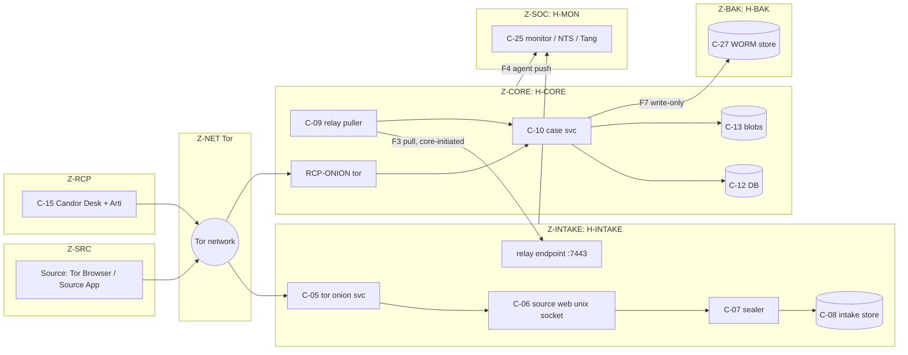

# 17 — Infrastructure, Host Hardening, Physical Security and Seizure Analysis

Status: Draft v1.1 (revision round 2: ADR-034..046) · Edition applicability: both (CE and EE; GOV-specific items marked) · Owner: Infrastructure & Platform Security team

## 1. Purpose and scope

This document specifies the infrastructure that Candor components run on:
- the network design and segmentation of zones Z-INTAKE, Z-CORE, Z-SOC, Z-BAK and Z-ADM;
- the host hardening baseline, with Debian 13 as the reference OS (ADR-019);
- physical security of servers, workstations, HSMs and air-gapped equipment;
- metadata analysis for third-party hosting and cloud providers;
- a **seizure analysis** per asset: exactly what an adversary obtains when it seizes a source device, recipient device, admin device, application server, database, backup or HSM.

Out of scope, and covered elsewhere:
- Tor daemon/onion configuration details: `16-TOR-I2P.md`.
- Deployment profiles and installers: `18-DEPLOYMENT.md`.
- Backup format and DR: `19-BACKUPS-DR.md`.
- Log schema: `20-LOGGING-AUDITING.md`.
- Incident playbooks: `31-INCIDENT-RESPONSE.md`.

Every protection statement below names what is protected, from whom, under which assumptions (`40-SECURITY-ASSUMPTIONS.md`, ASM-*), and the residual risk. Nothing here makes Candor "unseizable". The design goal is that seizing any **single** asset yields a bounded, documented set of data, and that no server-side asset yields report plaintext at rest (ADR-007, ADR-008).

## 2. Context and dependencies

| Dependency | Used for |
|---|---|
| `DECISIONS.md` ADR-001, 007, 008, 009, 010, 016, 019, 024, 025, 028 | Binding: onion-only intake, endpoint-held keys, epoch keys, intake/core pull separation, timing minimization, Debian reference, profiles, crypto-erasure, secret manifest |
| `DECISIONS.md` ADR-034, 035, 036, 038, 040, 043, 044, 045, 046 (revision round 2; supersede earlier text) | Tier W drafts only in sealer RAM; intake integrity evidence (watchers, operator statement, optional confidential VM, independent approval of IR captures); intake time not from Z-CORE; fixed import slots; Platform Manifest and security floors; independent-custody recipient devices; Erasure Key Vault DR and backup exclusion; small-organisation mode; no intake DB replication, no HSM fallback, per-zone update paths, config labels |
| `04-CRYPTOGRAPHY.md` | Key hierarchy, which keys exist, wrapping |
| `06-SYSTEM-ARCHITECTURE.md` | Component-to-process mapping |
| `09-DATABASE.md` | Exact server-readable columns (used in §8.5) |
| `16-TOR-I2P.md` | torrc, PoW, vanguards, restricted-discovery onions |
| `18-DEPLOYMENT.md` | Per-profile host counts, installer that applies this baseline |
| `19-BACKUPS-DR.md` | Backup sets referenced by §8.6 |
| `20-LOGGING-AUDITING.md` | Log classes and prohibited fields |
| `32-OPERATIONS.md` | Self-test checks that verify this baseline at runtime |
| `34-PERFORMANCE-SCALABILITY.md` | Sizing and failure behavior |

Research basis:
- SecureDrop runs an Application + Monitor server pair behind a hardware firewall, deployed with Ansible. Its servers have **no FDE** because they boot unattended (7ASecurity SEC-01-017, still open) [B-SD-04, B-SD-13].
- SecureDrop's Focal→Noble migration was phased [B-SD-02, B-SD-03].
- SecureDrop's Ansible copied onion client-auth keys to the Monitor server [B-SD-22].
- GlobaLeaks produces unencrypted backups and runs AppArmor + iptables [B-GL-04, B-GL-11].
- CoverDrop's core is pull-only and never listens [B-GL-22, B-GL-30].
- Silk Road's server IP leaked [INC-33]; OnionScan found misconfigurations [INC-34].
- Cloud and support incidents: LastPass [INC-55], Storm-0558 [INC-58], cloud storage exposures [INC-59].

## 3. Host roles and zone mapping

| Host role | Zone | Components | Holds secrets (see §4.9 and ADR-028) |
|---|---|---|---|
| H-INTAKE (`intake-gw` in `06-SYSTEM-ARCHITECTURE.md` §4.2) | Z-INTAKE | C-05, C-06, C-07, C-08 | Source onion service key; Intake Routing Key (TPM-sealed where available, `06-SYSTEM-ARCHITECTURE.md` §8); SSH-onion key (remote sites only); relay mTLS server key; per-deployment Argon2 salt; C-25 agent mTLS client key |
| H-INTAKE-B (EE-HA/GOV-ONPREM only) | Z-INTAKE | Passive twin of H-INTAKE (active/passive, **shared-nothing**: no database replication, ADR-046(1); `21-ENTERPRISE.md` §5.2) | **Same** source onion key as H-INTAKE (≤ 2 hosts, ADR-032); its own Intake Routing Key copy restored from BS-SECRETS; heartbeat/fencing credential |
| H-CORE (`core`) | Z-CORE | C-09, C-10, C-12, C-13, C-14, C-21, C-22, C-23, C-24; core tor instance for RCP-ONION (or a Z-CORE edge host, `16-TOR-I2P.md` NET-015) | Erasure Key Vault (ADR-033(3); host-local file on a dedicated LUKS volume `/var/lib/candor/ekv`, never a DB schema, ADR-046/RVW-C-08; its volume key sealed to the **physical** TPM or an HSM in HIGH/GOV, never a vTPM, ADR-044(4)); relay mTLS client key; RCP-ONION (staff) onion key; RCP-LAN server certificate key; audit checkpoint key (or HSM handle); DB credentials; backup-agent signing key |
| H-MON (`monitor`) | Z-SOC | C-25 collector; health-probe tor client (`16-TOR-I2P.md`); optional Tang server (§6.3); NTP server. C-26 (EE) runs elsewhere (§4.3.2). **No mail daemon, no IP forwarding, no default route** (§4.3.1) | Collector mTLS server key; alert transport credentials (used only through tor); Tang keys |
| H-BAK | Z-BAK | C-27 backup store | WORM store credentials (store side); **no backup decryption keys** |
| H-HV (CE-SINGLE only) | infra (C-39) | KVM/libvirt hypervisor hosting H-INTAKE, H-CORE and H-MON as VMs | Hypervisor SSH-onion key only |
| H-HSM | Z-CORE/Z-ADM | C-29 | Non-exportable keys (§6.5) |
| WS-RCP | Z-RCP | C-15, C-16, C-17 | Staff identity/encryption keys (hardware-wrapped), case keys in use |
| WS-VIEW | Z-VIEW | C-18 | AIRGAP-RCP: staff keys (hardware-wrapped) |
| WS-SYNC (AIRGAP-RCP; "transfer Desk" in `06-SYSTEM-ARCHITECTURE.md` §8.3) | Z-RCP | Candor Desk in sync-only mode | RCP-ONION client credential or RCP-LAN certificate; **no private decryption keys** |
| WS-ADM | Z-ADM | C-19, C-20 | FIDO2 SSH credentials (on token); admin-onion client-auth keys (hardware-sealed) |

## 4. Network design and segmentation

### 4.1 Segments

The default addresses are an installer-editable example plan.

| Segment | Purpose | Example addressing | Attached hosts | Routed to Internet? |
|---|---|---|---|---|
| N-INTAKE-EXT | H-INTAKE uplink. Used only by the tor process | DHCP/static public or NAT | H-INTAKE, H-INTAKE-B | Yes, egress only, tor UID only |
| N-RELAY | Private point-to-point link: C-09 (core) → C-08 relay export endpoint (intake, TCP 7443) | 10.20.0.0/29 (intake .2, intake-B .4, core .3) | H-INTAKE(-B), H-CORE | No |
| N-INTAKE-HB (EE-HA/GOV) | Intake A ↔ B fencing heartbeat only (fixed 10 s cadence, fixed size). **No database replication** on any profile (ADR-046(1); this segment was N-INTAKE-REPL in v1.0) | 10.21.0.0/30, direct cable | H-INTAKE, H-INTAKE-B | No |
| N-CORE | Core internal: services ↔ PostgreSQL ↔ blob store | 10.40.0.0/24 | H-CORE (and cluster nodes in EE-HA) | No |
| N-CORE-EGRESS | H-CORE uplink for tor (RCP-ONION), the egress-restricted HTTPS update mirror (ADR-046(3)) and, optionally, the SMTP relay and SIEM | NAT | H-CORE | Yes, allow-listed per UID and destination |
| N-MGMT | Agents push self-test results to H-MON; time distribution; Tang; SSH from the admin workstation jump | 10.30.0.0/28 (mon .5, admin jump .9) | H-MON, H-INTAKE, H-CORE, H-BAK, WS-ADM (jump port) | No. No host on N-MGMT forwards packets; H-MON has no default route (§4.3.1) |
| N-BAK | Backup push, core → store, write-only | 10.50.0.0/29 | H-CORE, H-BAK | No |
| N-OOB | BMC/IPMI/iDRAC/iLO | 10.90.0.0/28 | BMCs only, plus one jump port in a locked rack | **Never**. Physically separate switch or unplugged |
| N-RCP (RCP-LAN profiles) | Dedicated recipient VLAN or WireGuard: Desk API TCP 8443 mTLS; Admin API TCP 9443 mTLS on N-MGMT (`06-SYSTEM-ARCHITECTURE.md` §4.2) | customer | WS-RCP, WS-ADM → H-CORE | No |

### 4.2 Allowed-flow matrix

Only the flows below are allowed; everything else is denied. `→` means the connection is initiated by the left side.

| # | From → To | Proto/port | Purpose | Notes |
|---|---|---|---|---|
| F1 | Tor network → C-05 (via tor's own outbound circuits) | tor | Source access | No listener on any IP. Onion traffic arrives over tor's outbound OR connections |
| F2 | C-05 tor → Tor relays | TCP any ORPort | Circuit building | Only `debian-tor` UID, only on N-INTAKE-EXT |
| F3 | C-09 (H-CORE) → H-INTAKE:7443 | TCP, mTLS 1.3, pinned certificate | Pull sealed batches; push sealed replies and key-directory snapshots | ADR-009. No flow from intake to core, ever |
| F4 | C-25 agent on H-INTAKE/H-CORE/H-BAK → H-MON:8514 | TCP, mTLS 1.3 | Push self-test results (allow-listed schema, `32-OPERATIONS.md` §6; `06-SYSTEM-ARCHITECTURE.md` §8.5) | Z-INTAKE → Z-SOC is permitted (ADR-009 forbids only Z-INTAKE → Z-CORE) |
| F4b | H-MON tor client → source onion `/.well-known/candor/health` | tor | External availability probe (`16-TOR-I2P.md`) | Fixed-size static response |
| F5 | H-INTAKE/H-CORE/H-BAK → H-MON:123 (+ NTS-KE 4460 where supported) | NTP/NTS | Time discipline (rate/offset) | Only to H-MON; H-MON itself uses pinned NTS servers via host routes, or GPS/PTP. On H-INTAKE this source is **cross-checked** against an independent floor (§4.5, ADR-036(6)); it is never the only time input and never Z-CORE |
| F6 | H-INTAKE/H-CORE → H-MON:7500 (Tang) | HTTP (Tang/JOSE; McCallum-Relyea exchange, key material not exposed) | Network-bound disk unlock at boot | Only when NBDE is enabled (§6.3) |
| F7 | H-CORE → H-BAK:443 (or :22 SFTP append-only) | HTTPS S3-API with Object Lock | Backup upload | Credentials can PUT but not DELETE or overwrite (`19-BACKUPS-DR.md`) |
| F8 | H-CORE tor → Tor relays | TCP any ORPort | RCP-ONION and admin onion (restricted discovery) | `debian-tor` UID only |
| F8b | H-CORE `candor-update` → egress-restricted HTTPS update mirror:443 | HTTPS (TLS 1.3, pinned mirror certificate or enterprise mirror CA) | Candor TUF metadata/targets and Platform Manifest packages for Z-CORE (ADR-046(3), ADR-040) | Destination allow-listed by address; the mirror is the project mirror, an enterprise mirror or a GOV cross-domain import point. TUF verification is independent of the transport (33) |
| F9 | H-CORE C-23 → customer SMTP relay:587 | TCP STARTTLS, certificate pinned | Content-free notifications (ADR-017) | Optional. Alternatively over tor |
| F10 | H-MON → alert sink (SMTP over tor / Matrix webhook over tor) | tor | Content-free alerts | Alerts never include source data (`32-OPERATIONS.md`) |
| F11 | H-CORE C-26 → customer SIEM (EE) | TLS syslog/HTTPS | Scrubbed SECURITY/SYSTEM events (ADR-016, ADR-018) | Never from H-INTAKE |
| F12 | WS-ADM (jump port on N-MGMT) → H-*:22 | SSH (FIDO2 `sk-` keys) on the management interface only | Host administration (`06-SYSTEM-ARCHITECTURE.md` §8.4) | Remote sites: SSH over a restricted-discovery onion to loopback sshd instead |
| F13 | WS-RCP (Candor Desk) → H-CORE | RCP-ONION: tor to the client-auth onion; RCP-LAN: TCP 8443 mTLS on N-RCP | desk-api | Per-profile default in §4.6 |
| F13b | WS-ADM → H-CORE | Separate admin onion, or TCP 9443 mTLS on N-MGMT | admin-api | — |
| F14 | H-INTAKE update tor client (`_tor-candor-update` UID) → Candor project onion mirror | tor | Candor TUF targets and the Platform Manifest package set (OS, tor, PostgreSQL) from the pinned snapshot mirror (ADR-040, ADR-046(3)); Roughtime queries (§4.5) | Separate client-only tor instance, started by the update/time timer only; never the source onion instance; see §4.3 and §4.5 |
| F15 | H-HV (CE-SINGLE) → Tor relays | tor | Hypervisor updates and SSH onion | Hypervisor has **no IP** on br-relay or br-intake |
| F16 | H-INTAKE ↔ H-INTAKE-B (EE-HA/GOV) | Fencing heartbeat only (fixed size, 10 s) | Liveness for active/passive failover (`21-ENTERPRISE.md` §5.2) | N-INTAKE-HB only. **No database replication, no WAL shipping, no file sync** (ADR-046(1)). Envelopes pending on a failed node are recovered when its disk is recovered |



### 4.3 Z-INTAKE egress: default deny, tor only

H-INTAKE SHALL NOT be able to open any connection to the Internet except through the tor process. This gives:
- no DNS leaks (INC-34, SecureDrop's accepted "DNS correlation" risk [B-SD-04]);
- no clearnet callbacks through exploited parsers;
- no direct connection that reveals the server IP (INC-33).

Reference ruleset, installed as `/etc/nftables.d/10-candor-intake.nft` and generated by the installer with the site's interface names and addresses:

```
#!/usr/sbin/nft -f
flush ruleset
table inet candor_intake {
  set mon_hosts   { type ipv4_addr; elements = { 10.30.0.5 } }
  set admin_jump  { type ipv4_addr; elements = { 10.30.0.9 } }
  set core_relay  { type ipv4_addr; elements = { 10.20.0.3 } }

  chain input {
    type filter hook input priority 0; policy drop;
    iif "lo" accept
    ct state established,related accept
    ct state invalid drop
    iifname "relay0" ip saddr @core_relay tcp dport 7443 ct state new accept   # F3 core-initiated pull
    iifname "mgmt0"  ip saddr @admin_jump tcp dport 22   ct state new accept   # F12 SSH from admin jump (omit at remote sites: SSH onion)
    # No HTTP on any NIC: the source web listens only on a unix socket reached via tor
    counter comment "input-dropped"
  }

  chain output {
    type filter hook output priority 0; policy drop;
    oif "lo" accept
    ct state established,related accept
    ip daddr 169.254.0.0/16 counter drop comment "no cloud metadata service"
    ip6 daddr fe80::/10 udp dport 547 drop
    oifname "ext0" meta skuid "debian-tor" meta l4proto tcp ct state new accept   # F2: source onion tor instance only
    oifname "ext0" meta skuid "_tor-candor-update" meta l4proto tcp ct state new accept   # F14: client-only update/time tor instance
    oifname "mgmt0" meta skuid "candor-health" ip daddr @mon_hosts tcp dport 8514 accept  # F4 agent push
    oifname "mgmt0" meta skuid "_chrony" ip daddr @mon_hosts udp dport 123 accept  # F5 NTP
    oifname "mgmt0" meta skuid "_chrony" ip daddr @mon_hosts tcp dport 4460 accept # F5 NTS-KE
    oifname "mgmt0" ip daddr @mon_hosts tcp dport 7500 meta skuid 0 accept         # F6 Tang (initramfs/clevis only)
    counter comment "output-dropped"
  }

  chain forward { type filter hook forward priority 0; policy drop; }
}
```

#### 4.3.1 Normative H-INTAKE egress matrix (resolves RVW-A-23)

This matrix is the single normative list of flows that H-INTAKE may **initiate**. `16-TOR-I2P.md` §14.2 and `06-SYSTEM-ARCHITECTURE.md` §8.5 reference it; where they differ, this table and the ruleset above prevail (cross-document request recorded in `process/DISP-G6.md`). Everything not listed is dropped and counted (INFRA-027).

| # | Initiating UID on H-INTAKE | Interface → destination | Proto/port | Purpose | Constraint on the destination |
|---|---|---|---|---|---|
| E1 | `debian-tor` (source onion instance, C-05) | ext0 → Tor relays | TCP | Circuits for the source onion service | — |
| E2 | `_tor-candor-update` (client-only tor instance, `SocksPort unix:` only, started by `candor-update.timer` and `candor-roughtime.timer`) | ext0 → Tor relays | TCP | Updates from the project onion mirror (F14, ADR-046(3)); Roughtime queries over tor (§4.5) | The instance never hosts an onion service and never shares a data directory with E1 |
| E3 | `candor-health` (C-25 agent) | mgmt0 → H-MON collector 10.30.0.5 | TCP 8514 mTLS | Self-test push (F4; ARCH-014 push-only) | H-MON SHALL satisfy §4.3.2 (no forwarding, no default route, no mail daemon) |
| E4 | `_chrony` | mgmt0 → H-MON | UDP 123, TCP 4460 | Time discipline (F5) | As E3 |
| E5 | root in initramfs only (clevis) | mgmt0 → H-MON / off-site Tang | TCP 7500 | Boot-time Tang unlock (F6) | Rule loaded only in the initramfs ruleset; absent after switch-root |
| — | Every other UID, including `candor-web`, `candor-sealer`, `candor-istore`, `postgres` | any | any | — | **Dropped.** C-06/C-07 additionally run with `PrivateNetwork=yes` |

No flow from H-INTAKE may terminate on a host that has a route to the Internet other than through tor. The verification is INFRA-031 (TST `intake-no-clearnet-path`).

#### 4.3.2 Constraints on H-MON as a flow destination (RVW-A-23)

Because E3/E4 give H-INTAKE a network path to H-MON, H-MON is constrained so that the path cannot be chained to the clearnet:
- `net.ipv4.ip_forward=0`, `net.ipv6.conf.all.forwarding=0`; the nftables `forward` chain drops everything.
- H-MON has **no default route**. Its only non-tor egress is chrony (UID `_chrony`) to ≤ 4 pinned NTS server addresses via explicit host routes on a separate uplink interface (or no clearnet at all with a GPS/PTP source, GOV default).
- Alerts (F10) and the external onion probe (F4b) leave only through H-MON's own tor client UID. **No MTA** (`exim4`, `postfix`) is installed on H-MON; SMTP alerts are submitted over tor by the alert sender.
- The collector (`candor-monitor` UID) and Tang (`_tang` UID) have no egress at all.
- A mail relay or SIEM forwarder with clearnet egress SHALL NOT run on H-MON. C-26 (EE) runs on H-CORE (flow F11) or on a separate Z-SOC host that has no interface on N-MGMT; it never shares a host with the collector that H-INTAKE can reach.

Operational rules:
- IPv6 is handled by the same `inet` table. With no IPv6 uplink, `net.ipv6.conf.all.disable_ipv6=1`.
- `output-dropped` counter increments are reported by the self-test as a **boolean** "egress violations observed since last check: yes/no". Destination addresses are never exported, because they could include attacker-induced callbacks to identifying hosts.
- UDP egress from tor is not needed (tor uses TCP) and is denied.

### 4.4 Z-CORE egress

H-CORE egress SHALL be allow-listed to F7, F8, F8b, F9 (if enabled) and F11 (EE), plus F4/F5/F6 on N-MGMT. The same nftables pattern applies, with a UID match per service: `debian-tor`, `candor-update` for F8b (destination set = configured mirror addresses only), `candor-notify` for F9, `candor-siem` for F11, `candor-backup` for F7. H-CORE SHALL have no inbound listener on N-CORE-EGRESS.

### 4.5 DNS, time and update paths

| Function | H-INTAKE | H-CORE | Rationale |
|---|---|---|---|
| DNS | **None.** `/etc/resolv.conf` → `nameserver 127.0.0.1` with no resolver running; `systemd-resolved` masked | Only if F8b/F9/F11 use hostnames: a local stub restricted to allow-listed names; otherwise none | INC-33, INC-34, B-SD-04 DNS correlation |
| Time discipline | chrony → H-MON (NTS); `maxchange 60 0 0`; alarm if offset > 5 s | Same | Tor and epoch keys need a sane clock. Public NTP would be clearnet egress |
| Independent time floor (ADR-036(6), RVW-A-04) | (1) The signed Tor consensus `valid-after` held by the source tor instance is a **floor**: local time earlier than `valid-after` − 5 min is a FAIL. (2) Roughtime: every 6 h ± 30 min the update tor client (E2) queries ≥ 2 Roughtime servers from ≥ 2 operators over tor (TCP transport; Knowledge (unverified): public Roughtime deployments and TCP support vary, the server list ships in the Platform Manifest and is updated through TUF). Two agreeing responses bound the clock; skew > 30 min → FAIL (INFRA-007, `34-PERFORMANCE-SCALABILITY.md` F10). (3) A monotonic high-water mark of accepted time and of the key-directory snapshot is persisted; any backwards step > 5 min is a FAIL | Consensus floor via the RCP-ONION tor instance; Roughtime optional | Removes the v1.0 design in which Z-CORE (C-09) supplied the intake clock (`16-TOR-I2P.md` §14.2 chrony SOCK refclock, withdrawn by ADR-036(6)): a party controlling Z-CORE can no longer freeze the intake's view of time |
| OS, tor and PostgreSQL packages (ADR-040, RVW-A-12) | Only from the **Platform Manifest** of the installed Candor release: a TUF-signed list of package names, versions and SHA-256 hashes drawn from a pinned, snapshot-based mirror; tor packages from the Tor Project repository pinned by signing key and version. Fetched over tor from the project onion mirror (E2) into the local verified repository `/var/lib/candor/repo`. Direct `apt` sources to Debian or Tor Project mirrors are **disabled** on the host; `unattended-upgrades` consumes only the local verified repository | Same package policy; fetched via the egress-restricted HTTPS mirror (F8b) | One supply chain for all code on trust-path hosts; a compromised upstream archive key alone cannot push a package to an intake. Debian/Tor signing remain trusted roots, now with snapshot pinning, delay and logging (33, 28) |
| Candor updates (ADR-046(3)) | TUF client `candor-update` over the update tor client (E2) to the Candor project onion mirror (C-33) → local verified repo → apt. Never pushed from Z-CORE | TUF client via the egress-restricted HTTPS mirror (F8b) | ADR-022, ADR-046(3). See `18-DEPLOYMENT.md` §11 |
| Security floor (ADR-040) | Trust-path units refuse to start when the installed version is below the signed `min_secure_version` in TUF targets metadata; the self-test reports `update.security_floor` (`32-OPERATIONS.md` §5.2) | Same | Fleet Manager and ring policies cannot hold an instance below the floor (ADR-045) |

### 4.6 Staff access paths

The path names and per-profile defaults follow `06-SYSTEM-ARCHITECTURE.md` §8.3.

| Path | Default in | Description | Metadata created |
|---|---|---|---|
| RCP-ONION | CE-SINGLE, CE-HARDENED, MANAGED (and allowed everywhere) | The Desk API and, separately, the Admin API are served on restricted-discovery (client-auth) v3 onions by a core tor instance on H-CORE or on a Z-CORE edge host (`16-TOR-I2P.md` NET-015). One client-auth key per Desk device, wrapped by the staff hardware key (ADR-007) | H-CORE learns no staff IP. The staff's local network sees Tor use |
| RCP-LAN | EE-ONPREM, EE-HA, GOV-ONPREM, PRIVATE-CLOUD | TCP 8443 mTLS on a dedicated recipient VLAN or WireGuard (N-RCP), with per-device client certificates | Core and the corporate network team learn staff internal IPs and connection times. This is acceptable because staff identities are known to the organization. However, a network team that is itself a report subject (THR-020) can see **which staff work on Candor and when**. The VLAN therefore SHOULD be isolated from the general network-monitoring stack, and flow logging SHOULD be aggregate-only |

Staff access SHALL NOT be exposed on N-INTAKE-EXT or through H-INTAKE in any profile.

Additional rules (revision round 2):
- **INDEPENDENT channels** (ADR-043: IG, audit committee, ombudsman, external counsel, ethics) are the case where the network team may itself be a report subject (RVW-C-20). Devices of their members SHALL use RCP-ONION in every profile. RCP-LAN for these devices is permitted only over a dedicated WireGuard tunnel terminated on H-CORE with constant-rate keepalive padding (one flow, fixed 25 s keepalive, so the network team sees one long-lived tunnel rather than per-request flows): CFG ADVANCED. Plain RCP-LAN for them is DANGEROUS (`32-OPERATIONS.md` §7 `rcp.path.independent`).
- **FIPS-mandated deployments** (RVW-C-15): RCP-LAN uses TLS 1.3 with CANDOR-FIPS-1 suites only. Where RCP-ONION is used, the Desk API runs an inner mTLS 1.3 session with CANDOR-FIPS-1 suites inside the onion stream (the onion layer is then an anonymity overlay outside the cryptographic boundary, documented for the SSP in `25-COMPLIANCE.md`).
- **Staff reaction timing** (RVW-C-02, ADR-038(2)): notifications are constant-schedule daily digests, and relay imports run at fixed slots (ADR-038(1)), so staff logins over either path follow a slot rather than an arrival. Staff who act immediately after the daily digest still reveal the digest time, which is fixed and hence uninformative; staff who act on a delayed-delivery release reveal only the release day.

### 4.7 Administrative access

- SSH listens only on the N-MGMT interface address, reachable only from the admin workstation jump port (`06-SYSTEM-ARCHITECTURE.md` §8.4).
- Remote or colocated sites without an on-site management network instead bind sshd to `127.0.0.1:22` and publish it as a restricted-discovery onion (the SecureDrop pattern [B-SD-04]).
- Authentication uses only `sk-ssh-ed25519@openssh.com` keys, which need a FIDO2 touch plus PIN (`verify-required`). This addresses SecureDrop's missing SSH MFA (SEC-01-011) [B-SD-13].
- `AllowUsers candor-admin`. `PermitRootLogin no`. `sudo` requires a second FIDO2 assertion via `pam_u2f` (`cue`, `pinverification=1`).
- EE MAY use short-lived SSH certificates (TTL 8 h) issued by an offline or HSM-backed SSH CA. The CA is configured for two-person issuance for H-INTAKE (HUM controls in `32-OPERATIONS.md`).

### 4.8 Out-of-band management (BMC)

BMCs are high-risk: they give remote console, virtual media and firmware access.
- BMCs SHALL be disabled in firmware where the platform allows it.
- Otherwise they SHALL sit on N-OOB, which is never routed and is physically disconnected when not in use.
- Default BMC credentials SHALL be replaced during the installer's hardware checklist.
- BMC virtual media and serial-over-LAN SHALL be disabled on H-INTAKE.
- Chassis-intrusion sensors SHALL be enabled wherever present (§6.4).

### 4.9 Secret placement (ADR-028)

Section 3 is the normative summary. The machine-readable manifest format lives in `18-DEPLOYMENT.md` §12. After every deploy and daily, the self-test scans each host for secret-bearing material:
- PEM and OpenSSH private keys;
- `hs_ed25519_secret_key` and `*.auth_private`;
- age/HPKE identity files and OpenPGP secret packets;
- JWK/JOSE private keys and PKCS#12.

The scan asserts that the set found equals the manifest for that role and feature-flag combination. This is the class fix for B-SD-22.

### 4.10 Uplink independence

H-INTAKE's Internet uplink SHOULD NOT traverse network equipment operated or monitored by parties that may be subjects of reports: the corporate IT or SOC of the organization receiving reports, or the parent group.

Reason: the uplink operator sees the timing and volume of all Tor traffic of the intake host. Combined with network observation of an employee using Tor, that enables timing correlation (THR-002, THR-003, THR-020) [B-AN-01, B-AN-05].

Preferred placements:
1. an independent colocation facility or ISP line;
2. a dedicated DSL/fibre line terminating directly on H-INTAKE's firewall;
3. a documented acceptance of the risk (CFG: ADVANCED).

For tenants classified high-risk (ADR-021; `21-ENTERPRISE.md` §6.3), for GOV inspector-general/internal-affairs deployments, and for any deployment hosting an INDEPENDENT channel (ADR-043), a non-independent uplink is **DANGEROUS** (DC-09 plus OVERSIGHT approval) and is disclosed to sources in the configuration digest ("The intake server's Internet line is operated by the organisation") (RVW-C-20).

## 5. Host hardening baseline (Debian 13 reference)

### 5.1 OS baseline

| Area | Setting (all Candor hosts unless noted) |
|---|---|
| Distribution | Debian 13 "trixie", minimal install (`--no-install-recommends`). The only non-Debian packages are signed Candor .debs and the Tor Project `tor` package pinned by key and version; every installed package is listed in the release's Platform Manifest (ADR-040, §4.5). Upgrade path to the next Debian stable is tested per `18-DEPLOYMENT.md` §9.4 (a lesson from SecureDrop's phased Noble migration [B-SD-02, B-SD-03]) |
| Kernel | Debian stable kernel. Lockdown `integrity` (`lockdown=integrity`). `module.sig_enforce=1`. `slab_nomerge init_on_alloc=1 init_on_free=1 page_alloc.shuffle=1 randomize_kstack_offset=on vsyscall=none debugfs=off oops=panic`. `kernel.modules_disabled=1` after boot on H-INTAKE (all needed modules listed in `/etc/modules-load.d/candor.conf`) |
| sysctl | `kernel.kptr_restrict=2`, `kernel.dmesg_restrict=1`, `kernel.unprivileged_bpf_disabled=1`, `net.core.bpf_jit_harden=2`, `kernel.yama.ptrace_scope=3` (H-INTAKE) / `2` (others), `kernel.kexec_load_disabled=1`, `fs.suid_dumpable=0`, `kernel.core_pattern=\|/bin/false`, `vm.swappiness=0`, `net.ipv4.conf.all.rp_filter=1`, `net.ipv4.conf.all.accept_redirects=0`, `net.ipv4.conf.all.send_redirects=0`, `net.ipv4.tcp_timestamps=0` (H-INTAKE: reduces clock-skew fingerprinting of the host; B-AN note, Knowledge (unverified)), `kernel.unprivileged_userns_clone=0` on hosts without rootless containers |
| Swap | **Disabled** on H-INTAKE and H-CORE (`swapoff -a`, no swap partition). If the operator insists, swap only as dm-crypt with a random key per boot (CFG ADVANCED) |
| Hibernation/suspend | Masked (`systemctl mask sleep.target suspend.target hibernate.target hybrid-sleep.target`) |
| Core dumps | `systemd-coredump` not installed. `LimitCORE=0` for all units. `ulimit -c 0`. Trust-path processes additionally call `prctl(PR_SET_DUMPABLE,0)` (INC-58) |
| Filesystems | `/tmp`, `/var/tmp`, `/dev/shm` are tmpfs with `nodev,nosuid,noexec`. `/var/lib/candor` is on a separate LUKS2 volume mounted `nodev,nosuid,noexec`. `/boot` holds only the distribution-signed kernel and the locally generated initrd from the Platform Manifest (or the site-signed UKI with the ADVANCED option, §6.2) |
| Services | Only: `tor`, `candor-*` units, `chrony`, `nftables`, `sshd` (loopback), `apparmor`, `auditd` (restricted rules §5.5), `unattended-upgrades` (consuming only the local verified repository, §4.5). Removed or masked: `avahi`, `cups`, `bluetooth`, `ModemManager`, `wpa_supplicant`, `rpcbind`, `exim4`/`postfix` (except H-MON), `systemd-resolved` (H-INTAKE) |
| Toolchain | No compilers, interpreters beyond what packages require, `gdb`, `strace` or `tcpdump` on H-INTAKE. The installer removes `gcc*`, `make`, `python3-dev`, `tcpdump`, `gdb`. IR tooling is brought on signed read-only media (`31-INCIDENT-RESPONSE.md`) |
| Accounts | No interactive account except `candor-admin`. Service accounts have `nologin` shells. `pam_faillock` deny=5, unlock 900 s |
| Package integrity | The self-test compares the installed package set (name, version, `.deb` SHA-256 recorded at install) with the Platform Manifest of the running release; any extra, missing or differing package is a FAIL (`32-OPERATIONS.md` §5.2 `integrity.platform_manifest`). `debsums` baseline and dm-verity-style package verification by the self-test. AIDE is **not** used on data paths, because it would record change times of intake data (timing metadata). It covers `/usr`, `/etc`, `/boot` only |
| Microcode/firmware | `intel-microcode`/`amd64-microcode` installed. `fwupd` disabled on H-INTAKE (it has no network path); firmware is updated manually from signed media, recorded in the maintenance log |

### 5.2 AppArmor

AppArmor is enforced (not complain mode) on every Candor service. Profiles ship in the .deb and are tested in CI. GlobaLeaks also confines with AppArmor [B-GL-04].

| Profile | Allowed (summary) | Denied (notable) |
|---|---|---|
| `candor-source-web` (C-06) | read `/usr/lib/candor/source-web/**`; unix socket `/run/candor/source-web.sock` (listen); unix socket to sealer; read-only config | all network except the unix sockets; any write outside `/run/candor/source-web/`; `ptrace`; `exec` of anything |
| `candor-sealer` (C-07) | unix socket from source-web; write ciphertext to `/var/lib/candor/intake/blobs/**` via `candor-safefs`; `ipc_lock` capability (mlock) | network; any read of blobs; exec; `/proc/*/mem` |
| `candor-intake-store` (PostgreSQL on intake) | Debian postgres profile tightened: data dir only; unix socket only (`listen_addresses=''`) | TCP listen |
| `candor-relay-endpoint` | TCP listen 7443 on `relay0`; read the ciphertext spool; delete acknowledged items | exec; write outside spool |
| `tor` (C-05) | Debian tor profile + HiddenServiceDir; `HiddenServicePort` to unix sockets only | reading `/var/lib/candor` |
| `candor-case` (C-10) and siblings on H-CORE | per-service data dirs; DB socket | exec; cross-service dirs |

### 5.3 systemd sandboxing (all `candor-*` units)

```
[Service]
User=candor-<svc>
DynamicUser=no
NoNewPrivileges=yes
ProtectSystem=strict
ProtectHome=yes
PrivateTmp=yes
PrivateDevices=yes
ProtectKernelTunables=yes
ProtectKernelModules=yes
ProtectKernelLogs=yes
ProtectControlGroups=yes
ProtectClock=yes
ProtectHostname=yes
ProtectProc=invisible
ProcSubset=pid
RestrictNamespaces=yes
RestrictRealtime=yes
RestrictSUIDSGID=yes
LockPersonality=yes
MemoryDenyWriteExecute=yes
SystemCallArchitectures=native
SystemCallFilter=@system-service
SystemCallFilter=~@privileged @resources @mount @debug @cpu-emulation @obsolete
CapabilityBoundingSet=
AmbientCapabilities=
UMask=0077
LimitCORE=0
IPAddressDeny=any            # overridden per unit: relay endpoint allows 10.20.0.3; others none
RestrictAddressFamilies=AF_UNIX   # source-web, sealer; relay endpoint adds AF_INET
ReadWritePaths=/var/lib/candor/<svc> /run/candor/<svc>
```

The sealer (C-07) additionally gets `CapabilityBoundingSet=CAP_IPC_LOCK`, `AmbientCapabilities=CAP_IPC_LOCK`, `LimitMEMLOCK=infinity` and `MemoryMax=`, sized per `34-PERFORMANCE-SCALABILITY.md`. `systemd-analyze security candor-sealer.service` SHALL score ≤ 1.5 ("OK"). CI runs it for every unit and fails above the per-unit budget.

### 5.4 Process memory protections

Trust-path processes (C-06, C-07, C-09, C-10, C-21, C-24) SHALL:
- `mlock` pages holding keys or plaintext;
- zeroize buffers on drop (`zeroize` crate);
- disable core dumps (§5.1);
- use the hardened allocator configuration defined in `07-BACKEND.md`.

Tier W session state (ADR-034): drafts (text and identity block) exist only in C-07 RAM (mlocked). Attachment parts uploaded during a Tier W session are padded to ADR-011 buckets (ADR-038(5)), encrypted under a per-session key held only in sealer RAM, and written to a dedicated tmpfs `/run/candor/sealer/staging` (`size=` per `34-PERFORMANCE-SCALABILITY.md` §8.2, `noswap` where the kernel supports it; swap is disabled anyway, INFRA-013). Session expiry (20 min idle, 2 h absolute) or a sealer restart zeroizes the key, which makes the staged parts undecryptable, and the files are unlinked. No draft or staging data reaches persistent storage.

This limits persistence of plaintext and keys to RAM for the duration defined in `03-PRIVACY-ANONYMITY.md` / `04-CRYPTOGRAPHY.md`. It is designed against disk forensics and crash-dump exfiltration (INC-58). It does **not** protect against live memory capture by root or a hypervisor (§7, §8.4).

### 5.5 Host logging

| Host | journald | auditd | Web/tor logs |
|---|---|---|---|
| H-INTAKE | `Storage=volatile`, `RuntimeMaxUse=64M`, `MaxRetentionSec=24h` (aligned with `16-TOR-I2P.md` NET-008; v1.0 said 7 days, RVW-A-23), `ForwardToSyslog=no`. rsyslog not installed | Rules only for `/etc`, `/usr`, `/boot`, `execve` by uid≠service accounts, and module loads. **No** rules on `/var/lib/candor/intake` (their timestamps would be submission timing) | Tor `Log warn syslog` → journald (NET-008). `SafeLogging 1`. No `HiddenServiceExportCircuitID`. No access logs (ADR-016, B-SD-21) |
| H-CORE | persistent, 30 days, forwarded as SYSTEM class per `20-LOGGING-AUDITING.md` | Same exclusions for blob/DB paths | RCP-ONION tor: `SafeLogging 1` |
| H-MON | persistent, 90 days | standard | n/a |

### 5.6 Integrity and attestation

- Measured boot (§6.2). H-MON verifies TPM2 PCR quotes from H-INTAKE and H-CORE every 15 min, using `tpm2_quote` via the self-test agent, against golden values recorded at install and re-recorded automatically after each Platform-Manifest-verified update (§6.2).
- A mismatch raises SECURITY alert `host.attestation_mismatch` (`32-OPERATIONS.md`) and triggers IR playbook PB-02 (`31-INCIDENT-RESPONSE.md`).
- Package file integrity: daily `debsums -c`, the signed Candor file manifest, and the Platform Manifest comparison (§5.1).
- **Honest scope (RVW-A-01).** H-MON, the golden values and the verification are operated by the deploying organisation. INFRA-018 therefore detects accidental drift and tampering by an administrator who does not also control H-MON (HUM-006). It provides **no** evidence against a compelled or colluding operator, and it does not detect a memory-only implant installed via a runtime exploit. Controls that do not depend on the operator are:
  - **External Watchers** (ADR-035(1)): C-06 serves the Sealer's signed **running manifest** (release digest of the running C-06/C-07 binaries, static asset digests, CSP header digest) at a fixed static route; ≥ 2 independent watcher organisations fetch it and the static assets over Tor and compare them with the transparency log. H-INTAKE contributes only by serving these byte-exact static responses (INFRA-041).
  - **Operator Statement** (ADR-035(2)): renewed every 30 days by a k-of-n quorum including ≥ 1 independent role (`32-OPERATIONS.md` §9).
  - **Confidential-VM profile** (ADR-035(3), optional, HIGH/GOV/MANAGED): §5.9.
  None of these is a guarantee; the Tier W statement (ADR-035(5)) remains the primary honesty control.

### 5.7 Hypervisor (CE-SINGLE, and any VM-based Z-INTAKE)

- KVM/libvirt on Debian 13. Each VM uses a separate LUKS volume.
- Bridges: `br-ext` (intake/core uplinks), `br-relay` (L2 only; the host has **no IP**), `br-mgmt`.
- VM hardening: `<memoryBacking><nosharepages/></memoryBacking>` (no KSM); `<memballoon model='none'/>`; no shared folders (virtiofs/9p disabled); no clipboard or spice agents; `seclabel` sVirt AppArmor per VM; `on_crash=destroy` (no crash dumps); `libvirt` `dump_image_format` unset; snapshots **disabled** for the intake VM (`32-OPERATIONS.md` CFG).
- The hypervisor is a peer of H-INTAKE in trust. Compromise of H-HV equals compromise of every VM, and CE-SINGLE users are told so (`18-DEPLOYMENT.md`).
- CE-SINGLE default isolation is **separate VMs**; container-only separation of Z-INTAKE and Z-CORE on one kernel is ADVANCED (ADR-046(6)).
- Snapshots, image-level backups and memory dumps are also **disabled for the core VM's Erasure Key Vault volume** (`/var/lib/candor/ekv`, a separate virtual disk) and for its vTPM state (ADR-044(4), RVW-C-06). Where Z-CORE runs on enterprise virtualization that Candor cannot inspect (EE-ONPREM, PRIVATE-CLOUD, MANAGED), exclusion is established by the signed attestation of INFRA-037.

### 5.8 Assured monitoring profile (RVW-C-12)

Enterprise and public-sector policies (e.g., SP 800-53 SI-3, SI-4, RA-5, AU-6) often require EDR, an authenticated vulnerability scanner and a log forwarder on every server. On H-INTAKE such agents would see Tier W plaintext in RAM or forward source timing, so they stay forbidden. Candor instead provides an alternative implementation that an accreditor can map:

| Control need | Candor alternative on H-INTAKE | On H-CORE |
|---|---|---|
| Malware / integrity (SI-3, SI-7) | Measured boot + attestation (§5.6), `debsums`, the Platform Manifest comparison, Candor file manifest, canary files | Same; a third-party EDR MAY run on H-CORE only as CFG DANGEROUS with memory-scan cloud upload and sample upload disabled for Candor paths |
| Vulnerability inventory (RA-5) | `candorctl inventory --json`: installed packages and versions from the Platform Manifest, delivered through the self-test channel; the organisation's scanner consumes this file instead of logging in | Same, or authenticated scanning via a dedicated read-only account (ADVANCED) |
| System monitoring (SI-4, AU-6) | C-25 self-test results and SECURITY/SYSTEM events (allow-listed, `20-LOGGING-AUDITING.md`) | C-26 SIEM export (EE) |
| Log forwarding (AU-4/AU-9) | None from H-INTAKE (FIXED). Evidence is the C-25 record | C-26 allow-list |

The mapping is published for the SSP as a control-tailoring annex (`25-COMPLIANCE.md`, cross-document request). Knobs the guest cannot observe (switch port mirroring or NetFlow on the intake port, storage-array LUN snapshots, BMC serial-console logging, hypervisor snapshots of Z-CORE) are covered by customer attestations (`32-OPERATIONS.md` CFG-008), not by detection.


### 5.9 Confidential-VM profile for the Sealer (optional; ADR-035(3))

| Item | Specification |
|---|---|
| Scope | C-07 (and SHOULD C-06) run in an AMD SEV-SNP or Intel TDX guest on H-INTAKE (or on a PRIVATE-CLOUD/MANAGED confidential instance). tor (C-05) and C-08 remain outside |
| Measurement | The guest image (kernel, initrd, cmdline, sealer binary) is reproducibly built and published as a TUF target; its launch measurement is logged in the transparency log |
| Key binding | K35 (sealer signing key, `04-CRYPTOGRAPHY.md`) is generated inside the guest; the attestation report binds its public key to the measurement |
| Verification | Candor Desk (at import) and External Watchers verify the attestation report against the logged measurement; the verification result is never shown to sources as a guarantee |
| Honest limit | TEEs have a published record of side-channel and firmware breaks and depend on the CPU vendor (recorded as an assumption in `40-SECURITY-ASSUMPTIONS.md`). A hypervisor-level adversary still observes traffic volume and timing |
| CFG | `intake.sealer_confidential_vm`: off (SAFE DEFAULT for CE); on (recommended for HIGH/GOV/MANAGED high-risk tenants) |

## 6. Physical security

### 6.1 Physical threat scenarios

| # | Scenario | Target | Primary control | Residual |
|---|---|---|---|---|
| P1 | Server theft or seizure while powered off | H-INTAKE, H-CORE disks | FDE (LUKS2, argon2id) with unlock per §6.3; content is E2EE anyway (ADR-008) | With TPM-only unlock, whole-machine theft boots to a locked console; the disk key is in TPM-sealed state (§8.4) |
| P2 | Seizure while running (live) | RAM: Tier W plaintext in flight, onion key, session-derived source keys | Minimize RAM residency (§5.4); chassis intrusion → shutdown (§6.4) | Cold-boot/DMA attacks on a running server remain possible (THR-031) |
| P3 | Evil maid on a server (boot-chain modification, hardware implant) | Future plaintext (Tier W), keys | Secure Boot with distribution-signed boot chain (org keys optional for HIGH/GOV), TPM-sealed FDE bound to PCR 7 plus PIN or Tang, remote attestation of PCR 4/9 (§5.6, §6.2), tamper seals | Hardware implants below firmware (e.g., a malicious BMC or NIC) may not change PCRs |
| P4 | Recipient laptop theft | Cached case data | FDE + TPM+PIN; Candor Desk store wrapped by hardware key (ADR-007); token carried separately | Theft of laptop **and** token **and** PIN (or coercion) = that user's ACL (§8.2) |
| P5 | Evil maid on a recipient or admin workstation | Keystrokes, PIN, future plaintext | Secure Boot, TPM+PIN, firmware password, tamper-evident seals on chassis screws and ports, photographic seal log, travel policy | Sophisticated hardware keyloggers |
| P6 | Backup media theft | Backup sets | Encryption to offline recipients (`19-BACKUPS-DR.md`); locked, logged transport | Metadata: set count and padded size |
| P7 | HSM theft or seizure | Non-exportable keys | FIPS 140-3 L3 tamper response; PIN/quorum-activated; §6.5 | Attacks on the HSM's own implementation |
| P8 | Insider with rack access | USB/DMA/console | Locked rack, two-person access log, USB ports disabled (`usbguard` default-block), IOMMU enabled (`intel_iommu=on iommu=force`), Thunderbolt disabled in firmware | Insider with time and tools |
| P9 | TPM bus sniffing (discrete TPM, LPC/SPI) | TPM-only-sealed LUKS key | Prefer firmware TPM or TPM with parameter encryption (`tpm2-tss` sessions); require PIN or Tang in addition | Knowledge (unverified): public demonstrations exist against TPM-only BitLocker; the same class applies to TPM-only LUKS |

### 6.2 Secure Boot and measured boot

v1.0 required site-signed UKIs with the signing key on a hardware token in Z-ADM. That made every Debian kernel or initrd security update depend on a human signing ceremony, contradicting unattended security updates (RVW-C-17). ADR-040 resolves this:

- UEFI Secure Boot enabled with the **distribution-signed** shim and kernels (Debian shim with the Microsoft UEFI CA; Debian-signed kernels). No per-kernel offline signing ceremony is required. HIGH/GOV MAY additionally replace the platform keys with an org-owned PK/KEK/db (option ROMs checked first) and MAY sign site UKIs with a site MOK held on a hardware token: CFG ADVANCED (`boot.site_signed_uki`), with the stated operational cost (one signing action per kernel/initrd update).
- Kernels and initrds come only from the Platform Manifest (§4.5). The initrd is regenerated on the host by the package hooks; its hash is recorded by the self-test after each verified update.
- LUKS unseal policy (systemd-cryptenroll): bound to **PCR 7** (Secure Boot state and the certificates that authorised the boot chain) plus a TPM PIN (U3) or Tang (U4). PCR 7 survives distribution kernel updates, so unattended security updates keep unsealing working, while a boot chain not signed by the enrolled authorities fails to unseal.
- Attestation (§5.6) additionally compares PCR 4 (boot loader and kernel image) and PCR 9 (initrd and command line as measured by the kernel EFI stub; Knowledge (unverified): measurement coverage depends on kernel version and boot path) against golden values. Golden values are **re-recorded automatically** by the post-update self-test step only when the update was a Platform-Manifest-verified package installation; any change of PCR 4/9 without a matching verified update raises `host.attestation_mismatch`.
- Firmware setup password set; boot order locked; USB/network boot disabled.
- Residual: Secure Boot trusts firmware vendors, the Microsoft UEFI CA and the Debian signing keys; revocation (SBAT/dbx) must be applied through updates. With PCR 7 binding alone, an attacker with physical access could boot another distribution-signed kernel with a modified initrd; this is why U3/U4 add a PIN or Tang, and why attestation checks PCR 4/9. The site-signed UKI option closes this gap at the cost of a signing action per update.

### 6.3 FDE unlock modes (tradeoffs)

| Mode | Unattended reboot | Whole-machine theft (powered off) | Disk-only theft | Evil-maid boot modification | Notes / default |
|---|---|---|---|---|---|
| U1 Passphrase at console | No | Protected | Protected | Protected only if boot chain verified | Needs a person on site. Classic SecureDrop objection [B-SD-13 SEC-01-017] |
| U2 TPM2-only (PCR 7) | Yes | **Weak**: the machine boots to the OS; data is exposed to any OS-level or TPM-bus attack | Protected | Detected (unseal fails) | CFG ADVANCED. Offered only where U4 is impossible |
| U3 TPM2 + PIN | No (PIN each boot) | Protected (PIN rate-limited by TPM dictionary-attack lockout) | Protected | Detected | **Default** for H-INTAKE/H-CORE in CE-SINGLE when the installer confirms that "a person can enter a PIN after every reboot"; default for all workstations |
| U4 TPM2 **AND** Tang (Clevis SSS t=2) | Yes, while inside the site network with Tang reachable | Protected if the Tang server is **not** seized together with the machine (Tang in a different room/building, or ≥2 Tang servers t=1 at separate sites) | Protected | Detected (TPM half fails) | **Default** for CE-HARDENED, EE-ONPREM, EE-HA, PRIVATE-CLOUD (Tang in the customer's second site) |
| U5 Tang-only (NBDE) | Yes | Weak if Tang is seized too | Protected | **Not** detected | DANGEROUS (no boot-chain binding) |
| U6 Remote unlock via initramfs SSH (dropbear) over onion | No (remote human) | Protected | Protected | Partially (the initramfs is measured into PCR 9 and checked by attestation; signed only with the ADVANCED site-signed UKI option) | ADVANCED. Useful for colocation without Tang. The initramfs must include tor, which adds complexity |
| U7 Smartcard/HSM-held key + PIN at boot | No | Protected | Protected | Detected | GOV-ONPREM default (or U3) |

Tang servers run on H-MON (CE-HARDENED) **plus** one off-site Tang (EE). Tang keys are rotated yearly (`tangd-rotate-keys`), and the clevis bindings are regenerated in the same maintenance window (`32-OPERATIONS.md` calendar).

### 6.4 Tamper evidence and intrusion response

- Serialized tamper-evident seals on chassis screws, drive bays, unused ports and HSM enclosures. Photographed at install and at each quarterly inspection. Photos are stored in the maintenance log (Z-ADM) and compared by a second person.
- Chassis intrusion sensor, where present: the event is read via `ipmitool sel` / `/sys/class/hwmon/*/intrusion0_alarm` by the self-test. For H-INTAKE the default action on intrusion while running is **immediate power-off** (`intake.physical.intrusion_action = poweroff`). Rationale: a powered-off FDE disk is safer than a running host, at the cost of availability (fail closed; `34-PERFORMANCE-SCALABILITY.md`).
- Rack: locked, two-person access for H-INTAKE/H-CORE in EE/GOV, with a paper or electronic access log that is not integrated with any system storing report data.
- Workstations: seals on the laptop bottom panel and ports; a travel policy (never checked luggage; seal inspection after any unattended period).

### 6.5 HSMs (C-29)

| Key | Location (EE/GOV) | CE alternative | Why not content keys |
|---|---|---|---|
| Audit checkpoint signing key (C-24) | Online HSM in Z-CORE, non-exportable, Ed25519 (or ECDSA P-384 in FIPS) | TPM2-resident key (`tpm2_createprimary` + child key), or a soft key in the LUKS volume | Integrity only |
| Key Directory log operator signing key (C-14) | Online HSM | TPM2 | Integrity. Clients also require Channel Identity Key signatures (ADR-008) |
| Backup set KEK (wraps per-set DEKs, `19-BACKUPS-DR.md`) | **Offline** HSM or offline quorum tokens in Z-ADM; the online side holds only the public key | Offline Shamir 2-of-3 on tokens | Outer layer only. Inner content is already E2EE |
| DB/volume TDE keys (optional) | Online HSM via PKCS#11 | LUKS + TPM | Media protection only (ADR-008) |
| Internal mTLS CA (relay, monitor) | Offline HSM or token | Offline token | Integrity/auth |
| Org roster root key (04-CRYPTOGRAPHY) | Offline HSM in Z-ADM, used in ceremonies | Hardware token | Signs rosters and channel policies; holds no decryption capability |
| SSH CA (EE) | Online HSM with two-person issuance policy for H-INTAKE principals | n/a | Access control |
| Erasure Key Vault volume key (VMK, ADR-033(3)) | HSM partition, or the **physical** TPM of the core host (HIGH/GOV: never a vTPM, ADR-044(4)) | TPM2 of H-CORE (CE-SINGLE: swtpm vTPM sealed by the host TPM, documented as weaker) | Protects erasure keys, which unlock only member-key wraps (layered construction, `19-BACKUPS-DR.md` §8); an escrow copy of the VMK is in BS-SECRETS (`19-BACKUPS-DR.md` §3) |

Rules:
- Recipient private keys, case keys, member epoch private keys (ADR-030) and Recovery Quorum shares SHALL NOT be placed in a shared server-side HSM (ADR-007, ADR-013).
- HSM partitions per tenant (EE multi-tenant).
- HSM admin (SO) and crypto-user roles are held by different people.
- M-of-N activation (e.g., 2-of-3) for the SO role.
- GOV requires FIPS 140-3 Level 3 validated modules [B-CR-11, B-CR-30].
- **No fallback signing keys** (ADR-046(2)). If the HSM (pair) is unavailable, keys that normally live in it are not replaced by software or TPM keys: audit checkpoints queue and key-directory publication pauses (`34-PERFORMANCE-SCALABILITY.md` F5c, FAIL-013). `21-ENTERPRISE.md` HA-013 is superseded on this point. Profiles whose primary key location is a TPM (CE) use it as the primary, not as a fallback.

### 6.6 Air-gapped equipment (C-18, offline HSM, ceremonies)

- Hardware: a dedicated laptop with wireless, Bluetooth, camera and microphone removed or disabled in firmware (physically removed for GOV), no internal battery access, FDE with U3, BIOS password.
- Transfers use one-way media, a fresh write-once or dedicated USB per direction ("IN" red, "OUT" green), formatted by the transfer tool. Files are named by the `candor-safefs` content-address (ADR-027).
- Media is never moved from a networked machine to the air-gapped station without going through the Candor transfer tool, which accepts only signed Candor transfer bundles.
- Ceremony room: no personal phones (lockers outside), two people present, video of the ceremony table only (never of screens showing secrets), ceremony script signed off by both, artifacts sealed in tamper-evident bags with serials recorded.
- The air-gapped station is stored in a safe, with a sealed bag and a logged serial.

**Ceremony burden (RVW-C-17).** v1.0 summed to many separate token sets per person (K01 shares, K15 key-admin tokens, IRK, IRK-S, IEK, optional Recovery Quorum). To keep ceremonies realistic for small operators:
- Each custodian carries one **custodian pack**: a single FIDO2/PIV token holding the person's separate shares/keys for each scheme it participates in (distinct slots, distinct PINs where the token supports it), plus a sealed paper backup. The k-of-n thresholds of each scheme are unchanged; the pack only reduces the number of physical objects. A person SHALL NOT hold k shares of any one scheme (BAK-022).
- Ceremonies are batched into one yearly scheduled session per site (key epochs, Tang rotation, IRK attestation), plus event-driven ceremonies only after a custodian change or compromise.
- Kernel updates need no ceremony (§6.2).
- The per-profile operational load is budgeted in `18-DEPLOYMENT.md` §4.9.

### 6.7 Media sanitization and decommissioning

- Primary method: cryptographic erasure — destroy the LUKS header and keyslots (`cryptsetup luksErase` + header overwrite) and destroy the TPM/Tang bindings, per NIST SP 800-88r2 [B-CR-33] and ADR-025.
- Then: for SSDs, the NVMe Format with Secure Erase / Sanitize crypto-erase command. For HDDs, one overwrite pass.
- For H-INTAKE, H-CORE, H-BAK media and HSMs (HSM zeroize command): physical destruction (shred/disintegrate) by a certified vendor under two-person witness. Certificates are kept.
- RMA of storage devices from Z-INTAKE/Z-CORE/Z-BAK is **prohibited**. Failed drives are destroyed on site.

## 7. Hosting-provider metadata analysis (PRIVATE-CLOUD, MANAGED, colocation)

A provider that hosts Candor infrastructure is a potential observer and a compellable party (THR-026, THR-030). The table lists what each provider-side vantage point can learn **despite** Candor's E2EE design, and the mitigations.

| Observer / mechanism | What it can see or obtain | Z-INTAKE exposure | Z-CORE exposure | Mitigation | Residual |
|---|---|---|---|---|---|
| Hypervisor (provider operator, compromised hypervisor, co-resident escape) | Full guest RAM and CPU state, disk I/O, network packets pre-encryption at VM boundary | Tier W plaintext in C-07 RAM; source passphrases during Tier W login; derived source keys; onion service private key; relay keys | Staff session tokens; DB page cache (encrypted fields stay encrypted); no content keys | Tier V clients (no plaintext on server); dedicated/sole-tenant hosts; the confidential-VM Sealer profile (§5.9, ADR-035(3)) with attestation verified by Desk and External Watchers (Knowledge (unverified): confidential-computing guarantees depend on firmware/microcode; side-channel attacks published) | A compelled or malicious provider with hypervisor control can read Tier W plaintext in transit through RAM. Stated to operators and, via the Tier W honesty statement (ADR-004), to sources |
| Live migration | Memory copied across hosts and networks | Same as hypervisor, at more locations | Same | Sole-tenant hosts with migration disabled where the provider allows it; otherwise accept | Copies in provider migration buffers |
| VM snapshots / disk images / backups taken by the provider | Point-in-time disk (and RAM, for memory snapshots) | FDE protects disk snapshots **only if** the unlock key is not also available to the provider (TPM-only in a vTPM **is** provider-accessible). RAM snapshots expose as the hypervisor row | Same, **plus the Erasure Key Vault volume and vTPM state**: an image-level copy retained longer than 14 days defeats the deletion bound of ADR-033(3) (RVW-C-06) | FDE with U4 (Tang in the customer's own site) or U6. Disable provider-level snapshot/backup features on intake VMs; organization policy denies `CreateSnapshot` on intake disks | The provider can snapshot anyway under compulsion |
| Enterprise backup, SAN and hypervisor teams of the customer itself (EE-ONPREM, GOV; not a provider but the same mechanism) | Nightly image-level backups (Veeam/Commvault-class), LUN snapshots, vTPM files, with retention set by corporate policy (often years) | Tier W RAM only for memory snapshots; intake store metadata | Case DB metadata, Erasure-Key-encrypted wraps and, unless excluded, the **Erasure Key Vault** → deleted cases stay recoverable for the image retention by anyone who later holds a former member's keys | Vault on a separate volume excluded from image backups and snapshots, VMK on physical TPM/HSM for HIGH/GOV, signed attestation by the virtualization and backup owners (INFRA-037); source-facing deletion statement made conditional on the attestation (`35-DATA-RETENTION-DELETION.md`) | Attestations are only as honest as the teams that sign them, which may report to the accused. Undetectable from inside the guest |
| Storage replicas / distributed block storage | Multiple physical copies of disk blocks; deletion not physical (ADR-025) | FDE ciphertext only | FDE ciphertext only | FDE inside the guest (not provider-managed encryption); crypto-erasure | Ciphertext blocks persist beyond deletion |
| Cloud control-plane / audit logs (CloudTrail-class) | Who created, started or stopped VMs, key usage, API calls, timestamps, principal identities | Instance lifecycle; reveals intake existence to provider staff | Admin API activity patterns | Minimal cloud API use after deployment; separate cloud account/project for Candor; restrict log readers | Provider always has these logs |
| VPC flow logs / provider netflow | 5-tuples, byte counts, timestamps of every flow | **All Tor OR connections of H-INTAKE with byte counts and timing.** Upload volume per time slice correlates with submission sizes and times (THR-003, THR-011, THR-047) | RCP-ONION Tor flows | Disable customer flow logs for the intake subnet (CFG default); padding (ADR-011); PoW; the provider-internal netflow cannot be disabled by the customer; consider off-cloud intake | A provider-level observer plus a source-side ISP observer can attempt end-to-end correlation. This is the strongest argument for self-hosted Z-INTAKE for high-risk tenants |
| Instance metadata service (IMDS) | Instance credentials, user-data (bootstrap secrets) | SSRF or exploit → IAM credentials | Same | Egress drop to 169.254.0.0/16 (§4.3); IMDSv2 with hop limit 1; no secrets in user-data (installer verifies); no IAM role attached to intake VMs | Provider root |
| Load balancer / CDN / WAF logs | Client IPs, paths, timing, TLS termination = plaintext | **Forbidden** in front of Z-INTAKE (REQ-H-54, INC-54). Onion traffic does not use an LB | A staff-facing LB (RCP-LAN) logs staff IPs unless configured as L4 passthrough with logging off (`21-ENTERPRISE.md` HA-004) | No LB/CDN/WAF on the source path; RCP-ONION in PRIVATE-CLOUD where staff-IP exposure to the provider matters | n/a |
| Cloud KMS / cloud HSM | Key-use events (decrypt/unwrap), timing, and the provider's technical ability to use keys under compulsion | If KMS unwraps the intake volume key, the provider controls the disk | DB TDE keys | Do **not** use provider KMS for anything protecting source-relevant material; use in-guest LUKS + Tang/customer HSM. Provider KMS MAY be used only for non-sensitive infrastructure (e.g., Terraform state encryption) | KMS decrypt events reveal activity timing |
| Provider support / admin staff | Console access, disk attach, "break glass" | As hypervisor | As hypervisor | Contractual controls, customer lockbox features (Knowledge (unverified)), confidential VMs, alerting on console access events | Policy-based only |
| Serial console / VNC logs | Boot and console output | Boot messages | Same | `quiet`, no secrets on console, console logging disabled on the provider side where possible | — |
| Object storage (S3-class) for blobs/backups | Object sizes, counts, PUT timing, access logs | n/a (intake uses local disk) | Blob PUT timing ≈ import batch timing (ADR-010 batch granularity); backups | Blobs only as padded ciphertext (ADR-011); batch uploads; Object Lock for backups; no public ACLs; short-lived scoped credentials (INC-59, REQ-H-59) | Provider sees sizes and timing at batch granularity |
| DNS resolver logs | Names resolved | None (no DNS on intake) | Allow-listed names only | §4.5 | — |
| Billing / usage metering | Egress bytes per hour per instance | Intake traffic volume trends | — | None effective | Coarse volume visible |
| Jurisdiction | Provider subject to local compulsion and foreign-reach laws (e.g., US CLOUD Act; Knowledge (unverified)), gag orders (INC-07) | All the above can be compelled covertly | Same | Choose provider jurisdiction with counsel (`25-COMPLIANCE.md`); dedicated hosts; customer-held keys; key directory transparency so covert key substitution is detectable (ADR-022, THR-046) | Covert compelled hypervisor access to Tier W cannot be excluded |

Conclusion (binding for `18-DEPLOYMENT.md`):
- For high-risk tenants (ADR-021), Z-INTAKE SHOULD NOT run on shared-tenancy public cloud.
- Where it does (PRIVATE-CLOUD), the profile requires: sole-tenant or confidential VMs; no provider KMS; in-guest FDE with U4 (Tang held by the customer); disabled flow logs; and a source-facing disclosure in the Tier W honesty text that the hosting provider is an additional party able to observe live submissions.
- In every profile where Z-CORE runs on virtualization or storage that Candor cannot inspect, the Erasure Key Vault exclusion attestation (INFRA-037) is required before go-live.

## 8. Seizure analysis

### 8.1 Method and states

Each asset is analysed in four states. "Available" means obtainable by the adversary with that access plus commodity forensics.
- **S-OFF**: powered off, disks encrypted, credentials not available.
- **S-UNLOCKED**: the disk decryption key is obtained, for example by TPM-only boot, a weak passphrase or a coerced PIN, but there is no user or application credential.
- **S-LIVE**: running, captured with RAM (cold boot, DMA, hypervisor snapshot, root shell).
- **S-CONTROLLED**: the adversary keeps operating the asset against users (Freedom Hosting/Playpen class, INC-27, INC-28).

Assumptions: cryptographic primitives hold (`04-CRYPTOGRAPHY.md`); the source passphrase is generated with about 129 bits (ADR-005); hardware keys resist extraction (ASM-*, `40-SECURITY-ASSUMPTIONS.md`).

### 8.2 SOURCE DEVICE seized (C-01/C-02/C-03)

| State | Available to adversary | Not available | Notes / mitigation |
|---|---|---|---|
| S-OFF, Tails (amnesic, no persistent storage) | Existence of a Tails USB. Nothing from Candor | Onion address, passphrase, content | `05-SOURCE-OPSEC.md` recommends Tails |
| S-OFF/S-UNLOCKED, regular OS + Tor Browser | Tor Browser installation and last-run times (filesystem MAC times, Windows Prefetch/Jump Lists/SRUM, macOS KnowledgeC, Android per-app data-usage stats with dates and **byte counts that may match the upload size**); the **original documents** the source uploaded and their access times; OS swap/hibernation/pagefile fragments (may contain the passphrase or onion address); keyboard/IME learned-word dictionaries (mobile keyboards may learn passphrase words); clipboard history; screenshots; cloud-synced folders; a written-down passphrase | Server-side content without the passphrase; other sources | THR-048. Candor sends no-store, uses no downloads in the source flow, and sets `Clear-Site-Data` on logout (B-SD-02). Guidance: Tails, never employer devices (REQ-H-23, REQ-H-31) |
| S-OFF/S-UNLOCKED, Candor Source App (Tier V) | App installation evidence (package lists, app-store purchase history **linked to the store account**); the app's local state as specified in `11-FRONTEND-SOURCE.md` (MUST contain no passphrase and no message history; any pinned key-directory cache MAY reveal **which organization** the source contacted, a significant disclosure) | Passphrase, messages (not stored) | Open issue §11-2: organization-neutral pin cache |
| + passphrase (found or coerced) | Ability to log in over Tor as the source. See everything the source UI displays for that account (`11-FRONTEND-SOURCE.md`): recipients' replies, day-granular dates (ADR-010), report status as exposed to the source. Ability to **send messages impersonating the source** and to read future replies | Other sources' data; recipient identities beyond what the UI shows; IPs (never exist) | THR-034. Residual: recipients cannot cryptographically distinguish the adversary from the source. Recipient guidance: treat unexpected requests to "confirm identity" as a possible compromise (`32-OPERATIONS.md` §3.2) |
| S-LIVE (device running with session open) | As above plus the open session, page contents on screen, and in-memory Tor Browser state | — | Guidance: close Tor Browser immediately after use |

### 8.3 RECIPIENT DEVICE seized (WS-RCP: C-15, C-16, C-17)

| State | Available | Not available | Notes |
|---|---|---|---|
| S-OFF, FDE (U3), hardware key absent | Nothing beyond hardware identifiers | Everything | — |
| S-UNLOCKED (disk key obtained, e.g., coerced PIN), hardware key absent | OS artifacts: exported Export Packages, printed-file spool remnants, downloads, recent-file lists (THR-041); Candor Desk encrypted store (opaque); Desk config (staff onion hostname, user ID); client-auth key **wrapped** (unusable without the token) | Case content, case keys, staff private keys (wrapped by FIDO2 PRF/PIV/TPM, ADR-007) | Desk SHALL store all case data encrypted; no plaintext working files outside disposable C-17 |
| S-LIVE (session unlocked, token inserted) | **All case content within the user's ACL** (Desk can fetch and decrypt it); case keys in RAM; **the user's own member epoch private keys** within the 14-day window (ADR-030) → envelopes that were wrapped to this member and not yet imported; staff signing key usage (sign replies and actions as the user); any decrypted viewer content open at that moment | Cases outside the ACL; envelopes from which this member was COI-excluded (ADR-030: no wrapping to the member exists); Sealed Identity Store unless the user is an Identity Custodian (ADR-014); epoch keys already destroyed; other members' keys; source network identity (never exists) | Blast radius bounded by ACL + cryptographic COI exclusion (ADR-015, ADR-030). Revocation (`15-AUTHENTICATION-AUTHORIZATION.md`) stops server fetches; already-cached data remains |
| S-COERCED (device + token + PIN) | Same as S-LIVE, **plus continued remote access** until the account is revoked | Same | IR playbook "Recipient credential stolen" (`31-INCIDENT-RESPONSE.md`) |
| C-17 viewer VM after close | Nothing, if the host has no swap or has encrypted ephemeral swap and the VM is disposable | — | ADR-012 |
| S-ORG-MANAGED (the organisation administers the device through MDM/EDR/DLP/VDI; not a seizure but an equivalent capability, RVW-C-01) | Everything in S-LIVE whenever the Desk is unlocked: EDR live response can dump Desk and webview memory; MDM can replace the Desk binary; insider-risk tools can record the screen; VDI hypervisor admins see all memory | Cases outside the member's ACL; envelopes the member was excluded from | ADR-043: Triage Set members of INDEPENDENT channels SHALL use independent-custody devices (not enrolled in the organisation's MDM/EDR/DLP/VDI; hardware authenticator attestation recorded). Desk's self-check detects only accidental divergence. Honest residual: an organisation that controls a member's endpoint can defeat Desk protections (`32-OPERATIONS.md` §4.1) |

### 8.4 ADMIN DEVICE seized (WS-ADM: C-19, C-20)

| State | Available | Not available | Notes |
|---|---|---|---|
| S-OFF / S-UNLOCKED, token absent | `candorctl` inventory (host roles, staff/admin onion hostnames, internal addressing): reveals the infrastructure layout. Secret Placement Manifests (list secret *names*, not values). Installer answer files (must contain no secrets; verified by the config checker). Admin-onion client-auth keys **only if** not hardware-sealed (the default is sealed) | SSH access (sk-keys need FIDO2 + PIN); any case content (admins have no case keys, ADR-015); Infrastructure Recovery Key shares (never stored on WS-ADM, `19-BACKUPS-DR.md`) | — |
| S-COERCED (device + token + PIN) | **Root on servers**, which enables: (a) modifying intake to capture **future** Tier W plaintext and passphrases (THR-014); (b) copying the onion private key (THR-044); (c) copying the intake store and case DB ciphertext + metadata (§8.5); (d) changing configuration, including DANGEROUS settings, by bypassing the admin API; (e) suppressing or delaying relay pulls (THR-020) | Stored case content (no case keys on servers); pushing signed updates (TUF threshold, ADR-022); silently adding a recipient that clients will accept (key directory + Channel Identity Key signatures, THR-046); decrypting backups (offline recipients) | Detection: attestation (§5.6), config drift, key-directory monitors. EE: two-person SSH certificate issuance for H-INTAKE reduces single-admin risk (`32-OPERATIONS.md` HUM) |

### 8.5 APPLICATION SERVER seized

**Intake host (H-INTAKE)**

| State | Available | Not available |
|---|---|---|
| S-OFF, U3/U4 with Tang not reachable | Nothing (LUKS2 argon2id) | Everything |
| S-OFF, U2 (TPM-only) whole machine | Equivalent to S-UNLOCKED once any OS-level or TPM-bus attack succeeds (§6.1 P9) | — |
| S-UNLOCKED | **Onion service private key** → impersonation of the source portal (THR-044); the Intake Store (§8.6); the **Intake Routing Key** (if not TPM-sealed or if the TPM is also defeated) → combined with the routing ciphertexts in C-12, it links cases to intake source mailboxes (still no identity); relay mTLS server key; SSH-onion key; the per-deployment Argon2 salt; source-web code and config | Report plaintext (sealed to member epoch keys); Tier W drafts and staged attachment parts (RAM/tmpfs only, ADR-034; lost at power-off); recipient keys; source IPs (never recorded); exact submission times (ADR-010: only `received_epoch_day`; imports occur at fixed slots, ADR-038(1)); delayed-delivery envelopes are present as ciphertext with a release day (ADR-038(4)) |
| S-LIVE | Everything in S-UNLOCKED plus: **Tier W plaintext of submissions in flight** and of open Tier W drafts at capture time (drafts live only in sealer RAM for ≤ 2 h, ADR-034); **passphrases and derived source keys of Tier W logins in progress** (ADR-005 Tier W login) → decrypt that source's replies; in-memory rate-limiter circuit identifiers (ephemeral Tor circuit IDs, not IPs); session tokens | Plaintext of past submissions already sealed; Tier V submissions (encrypted client-side) |
| S-CONTROLLED | Serve modified Tier W pages to future visitors (THR-007, THR-008, INC-28); harvest future Tier W submissions and passphrases; link logins of the same source over time. Tier V clients detect code/key changes (ADR-004) | Past content |

**Core host (H-CORE)**

| State | Available | Not available |
|---|---|---|
| S-UNLOCKED | Case DB (§8.6); case blob store (padded ciphertext); key directory (public); audit logs (staff identities and **exact timestamps of staff actions**, ADR-010); relay mTLS client key (→ can pull from intake: ciphertext only); RCP-ONION key and client-auth public keys, or the RCP-LAN server key; notification config (staff notification addresses); SSO/SCIM config (EE); backup-agent signing key (can forge new backup sets, but cannot delete WORM sets) | Case plaintext; case keys (wrapped to member X-Wing keys only); epoch private keys; backup decryption keys |
| S-LIVE | Additionally: staff session tokens (audience-bound, ADR-029); DB TDE key if used; no plaintext content (Desk decrypts locally, ADR-007) | Same as above |
| S-CONTROLLED | Serve malicious metadata or files to Desks (mitigated by the malicious-server harness, ADR-027); withhold or delay submissions (THR-020); attempt key substitution (THR-046; detected by client verification and transparency monitors) | Content (unless a Desk is exploited) |

### 8.6 DATABASE seized (dump or disk of C-08 or C-12)

| Store | Server-readable data (exact columns per `09-DATABASE.md`) | What it reveals | Not revealed |
|---|---|---|---|
| C-08 Intake Store | Source accounts: random account ID, auth verifier (Argon2id-derived), source public keys, `created_epoch_day`. Pending sealed envelopes (padded ciphertext, `received_epoch_day`, batch number). Reply ciphertexts of the last 30 days, published as fixed-size fetch-all pages (ADR-039; no per-mailbox access time, count or history). Tier V upload sessions within one Source App session (random ID, chunk bitmap, expiry ≤ 24 h, ADR-046(4); `34-PERFORMANCE-SCALABILITY.md` §5). Tombstones of source-deleted mailboxes (`19-BACKUPS-DR.md` §11) | Number of source accounts; submissions per day; padded-size distribution; reply volume per page; for Tier W, whatever server-side reply lookup association `09-DATABASE.md` retains; upload-in-progress existence | Plaintext; identities; IPs; exact times. Offline guessing of verifiers is infeasible at about 129 bits of passphrase entropy (assumption, ADR-005) |
| C-12 Case DB | Fields classified server-readable in `09-DATABASE.md` (case state, channel, assignee staff IDs, per-case ACL, COI exclusions only as blinded tags `HMAC(K_case_excl, user_id)` padded to 8 per case (ADR-037(3)), SLA dates, received day, padded evidence sizes, wrapped case keys, staff directory) | Case volume and workflow; which staff handle which case; SLA timelines. COI exclusion identities are not readable without the case key (ADR-037(3)); audit reason codes do not distinguish COI removals | Case plaintext, evidence content and hashes (ADR-012: hashes inside the encrypted record), source identity, Sealed Identity Store (encrypted to custodians). Envelope recipient sets: not visible (ADR-033(1): anonymous slots) |
| C-24 audit store | SECURITY and CASE events (pseudonymous case IDs, staff IDs, exact timestamps only for staff actions in the tables enumerated by `09-DATABASE.md`, ADR-046(11)) | Staff activity patterns; first-open time of a case ≥ the fixed import slot (ADR-038(1)), which carries no arrival information beyond the slot | Source actions (never emitted, ADR-016) |

### 8.7 BACKUP seized (C-27 store, offline media)

| State | Available | Not available |
|---|---|---|
| Without backup decryption keys | Number of backup sets, their creation dates (fixed schedule), padded segment counts. Total size in geometric buckets (`19-BACKUPS-DR.md`) → a coarse volume trend | Any row or blob |
| With the backup KEK (offline quorum/HSM compromised) | For each retained set: the §8.6 data as of that snapshot, **including rows since deleted from production** (source accounts, metadata of deleted cases) until set expiry (THR-017; default ≤ 35 days, `19-BACKUPS-DR.md`). Case content stays unreadable without member private keys. For deleted cases, it stays unreadable even **with** a former member's keys once the Erasure Key backups (≤ 14 days) have expired (ADR-025, ADR-033(3)), **provided** no infrastructure-level copy of the vault exists (INFRA-037; §7) | Case plaintext (still wrapped to member keys); source IPs |
| BS-SECRETS set (separate custody) with its key | Onion service private key, mTLS CA material, Tang backups → impersonation and infrastructure access | Content |

### 8.8 HSM seized (C-29)

| State | Available | Not available |
|---|---|---|
| Without SO/user credentials or quorum | Nothing, assuming the FIPS 140-3 L3 tamper response and PIN lockout hold [B-CR-11] | Key material |
| With user credentials (coerced operator) | **Use** (not export) of the resident keys: sign audit checkpoints (forge future audit history; past checkpoints anchored externally stay verifiable, `20-LOGGING-AUDITING.md`); sign key-directory log entries (THR-046, but clients also require Channel Identity Key signatures); unwrap DB TDE keys; if the backup KEK is in this HSM, decrypt backup outer layers (§8.7) | Case content, recipient keys, epoch keys, Recovery Quorum shares (never in a shared HSM, §6.5) |

### 8.9 Combined seizures (summary)

| Seized together | Worst-case yield |
|---|---|
| H-INTAKE + H-CORE (S-UNLOCKED) | All server metadata (§8.5–8.6) plus onion impersonation. **No report plaintext.** |
| H-INTAKE (S-LIVE) | Plus Tier W in-flight plaintext and in-progress Tier W login keys |
| H-CORE + one WS-RCP (S-COERCED) | That recipient's ACL cases (content), plus server metadata |
| All servers + backups + backup KEK | Historical server metadata within backup retention; no plaintext |
| Anything + k Recovery Quorum shares (if enabled, ADR-013) | All cases wrapped to the quorum |
| One source device + passphrase | That source's conversation as displayed to the source; impersonation of that source |

## 9. Requirements

| ID | Requirement | Evidence | Threats | Component | Verification |
|---|---|---|---|---|---|
| INFRA-001 | Z-INTAKE hosts SHALL have a default-deny egress policy in which only the tor UIDs of §4.3.1 (source onion instance E1, client-only update/time instance E2) may open Internet connections, plus the N-MGMT flows E3–E5 of §4.3.1. | REQ-H-33 (INC-33); B-SD-04; ADR-001 | THR-001, THR-016, THR-030 | C-05, C-06, C-07 | TST: `infra-egress-deny` runs `curl`, `nc` and DNS lookups as root and each service UID and expects all to fail, while `tor` builds circuits; INSP: nftables ruleset diff against §4.3 |
| INFRA-002 | No service on H-INTAKE SHALL listen on any IP address except the relay export endpoint (TCP 7443) on N-RELAY and sshd on N-MGMT (or on loopback behind an SSH onion at remote sites). The source web SHALL listen only on a unix socket. | REQ-H-33; INC-34 | THR-001 | C-05, C-06 | TST: `ss -ltnpx` snapshot compared with the listener inventory; external port scan of all H-INTAKE uplink addresses shows no open ports |
| INFRA-003 | H-INTAKE SHALL NOT run a DNS resolver or have a reachable resolver configured. | INC-34; B-SD-04 | THR-001, THR-016 | C-05 | TST: `getent hosts example.org` fails; packet capture on ext0 during a 24 h soak shows only TCP from the tor UID |
| INFRA-004 | No network connection SHALL be initiable from Z-INTAKE to Z-CORE. The relay SHALL be reachable only from the configured C-09 address with a pinned mTLS 1.3 client certificate. | ADR-009; B-GL-30 | THR-014, THR-015 | C-08, C-09 | TST: `infra-no-intake-to-core` opens connections from an H-INTAKE root shell to every H-CORE port and expects all to be dropped; INSP: firewall rules |
| INFRA-005 | Hosts SHALL be segmented into the segments of §4.1. N-RELAY, N-MGMT, N-BAK, N-CORE and N-OOB SHALL NOT be routed to the Internet. | ADR-009; B-SD-04 | THR-014, THR-030 | C-39 | INSP: network diagram and switch config review; TST: traceroute/egress probes from each segment |
| INFRA-006 | Cloud instance-metadata addresses (169.254.0.0/16) SHALL be unreachable from all Candor hosts, and no bootstrap secret SHALL be placed in cloud user-data. | INC-59; Knowledge (unverified) IMDS SSRF class | THR-030 | C-05, C-10 | TST: `curl 169.254.169.254` fails from each UID; config checker scans the user-data |
| INFRA-007 | Hosts SHALL discipline time only from the H-MON NTS source (or an equivalent internal source), never from Z-CORE. H-INTAKE SHALL additionally enforce the independent floor of §4.5 (Tor consensus `valid-after`, Roughtime, monotonic high-water mark) and FAIL on skew > 30 min; WARN at > 5 s NTP offset. | ADR-001; ADR-036(6); B-AN-26; RVW-A-04 | THR-043 | C-25, C-05 | TST: fake-clock test with ±1 h skew expects FAIL and intake closed per the FAIL table |
| INFRA-008 | (Amended ADR-046(3), ADR-040.) H-INTAKE SHALL fetch Candor TUF metadata/targets and Platform Manifest packages only over tor from the project onion mirror (E2). H-CORE SHALL fetch them only from an egress-restricted HTTPS mirror (F8b). Both SHALL verify TUF before anything reaches the local repository; updates SHALL NOT be pushed from Z-CORE to Z-INTAKE. | ADR-022; ADR-040; ADR-046(3); B-SD-02; RVW-C-08 | THR-025, THR-001 | C-05, C-33 | TST: intake update in a netns with clearnet blocked succeeds; core update with only the mirror address allow-listed succeeds; a relay-pushed bundle is rejected by the intake; INSP: no apt source other than the local verified repo |
| INFRA-009 | Staff access (desk-api, admin-api) SHALL use RCP-ONION or RCP-LAN with the per-profile defaults of §4.6, and RCP-ONION (or the padded WireGuard variant) for members of INDEPENDENT channels. Staff access SHALL never traverse Z-INTAKE. In RCP-LAN, the recipient VLAN SHALL be excluded from per-flow logging by general network monitoring. FIPS-mandated deployments SHALL use CANDOR-FIPS-1 TLS on RCP-LAN and an inner FIPS mTLS session on RCP-ONION. | ADR-007; B-SD-04; B-AN-44 | THR-022, THR-018, THR-020 | C-10, C-15, C-19 | TST: on an RCP-ONION install, desk-api is unreachable on any IP and the descriptor is undecryptable without client auth; INSP: RCP-LAN flow-logging configuration |
| INFRA-010 | SSH SHALL listen only on the N-MGMT interface (or on loopback behind a restricted-discovery onion at remote sites), SHALL accept only FIDO2 `sk-` keys with `verify-required`, and SHALL disallow root login. | B-SD-13 (SEC-01-011) | THR-022, THR-018 | C-19, C-20 | TST: `sshd -T` assertions; a login attempt with a non-sk key fails; SSH is unreachable from N-INTAKE-EXT |
| INFRA-011 | BMCs SHALL be disabled or confined to an unrouted N-OOB with default credentials replaced. Virtual media and SOL SHALL be disabled on H-INTAKE. | Knowledge (unverified) BMC attack class | THR-031, THR-014 | C-39 | INSP: installer hardware checklist record; DEMO: BMC unreachable from any production segment |
| INFRA-012 | Hosts SHALL apply the §5.1 kernel, sysctl, swap, hibernation, core-dump and filesystem baseline. The config checker SHALL fail on deviation. | INC-58 (REQ-H-58); B-GL-04 | THR-014, THR-016 | C-05..C-13 | TST: `candorctl check --host` asserts each key; induced deviation fails the check |
| INFRA-013 | Swap SHALL be disabled on H-INTAKE and H-CORE. If enabled (ADVANCED), it SHALL be dm-crypt with a per-boot random key. | REQ-H-58; B-CR-33 | THR-014, THR-015 | C-07 | TST: `swapon --show` is empty; with ADVANCED set, `cryptsetup status` shows a plain random-key mapping |
| INFRA-014 | Every Candor service SHALL run under an enforced AppArmor profile and the §5.3 systemd sandbox. `systemd-analyze security` exposure SHALL be ≤ 1.5 for C-06/C-07 and ≤ 2.5 for the others. | B-GL-04 | THR-014 | C-06, C-07, C-10 | TST: CI `unit-hardening-score`; `aa-status` shows enforce mode; negative test: C-07 cannot open a TCP socket or exec |
| INFRA-015 | Trust-path processes SHALL disable core dumps (`RLIMIT_CORE=0`, `PR_SET_DUMPABLE=0`) and mlock key/plaintext pages. | INC-58 (REQ-H-58) | THR-014, THR-016 | C-06, C-07, C-10, C-11 | TST: SIGSEGV injection produces no core file anywhere; `/proc/<pid>/status` shows VmLck > 0 |
| INFRA-016 | H-INTAKE SHALL keep journald volatile with ≤ 24 h retention (amended from 7 days to match `16-TOR-I2P.md` NET-008, RVW-A-23) and SHALL NOT enable web or tor access/circuit logging. auditd rules SHALL NOT watch intake data paths. | ADR-016; REQ-H-60; B-SD-21 | THR-016, THR-011 | C-05, C-06 | TST: canary submission, then grep of all persistent storage and journald for canary strings, times and circuit IDs → zero hits |
| INFRA-017 | Compilers, debuggers and packet-capture tools SHALL NOT be installed on H-INTAKE. | Knowledge (unverified) post-exploitation hardening | THR-014 | C-05 | TST: `dpkg -l` compared against the deny-list in the config checker |
| INFRA-018 | H-MON SHALL verify TPM2 PCR quotes from H-INTAKE and H-CORE at least every 15 min against golden values updated only after Platform-Manifest-verified updates, and SHALL raise `host.attestation_mismatch` on deviation. Documentation SHALL state that this control is operator-internal and gives no evidence against a compelled or colluding operator (§5.6). | B-SD-04 (monitor server role); RVW-A-01 | THR-014, THR-031 | C-25, C-29 | TST: modify the UKI cmdline in a test VM → alert within 15 min |
| INFRA-019 | Integrity monitoring SHALL cover `/usr`, `/etc`, `/boot` and SHALL NOT record change timestamps of intake or case data paths. | ADR-010 | THR-011, THR-014 | C-25 | INSP: AIDE/debsums config; TST: data-path writes produce no integrity-DB changes |
| INFRA-020 | The self-test SHALL verify after every deploy and daily that the secret-bearing files on each host exactly match that role's Secret Placement Manifest. Any mismatch SHALL fail the deploy or raise an alert. | ADR-028; B-SD-22 | THR-013, THR-044 | C-25 | TST: `secret-placement` matrix across all feature-flag combinations; planting an onion key on H-MON is detected |
| INFRA-021 | For VM-based deployments, the intake VM SHALL have KSM, ballooning, shared folders, guest agents and hypervisor snapshots disabled, and `on_crash=destroy`. The core VM's Erasure Key Vault disk and vTPM state SHALL be excluded from snapshots and image backups (checked on libvirt; attested elsewhere, INFRA-037). | Knowledge (unverified) VM memory-sharing side channels | THR-030, THR-045 | C-39 | TST: `virsh dumpxml` assertions in the config checker |
| INFRA-022 | Deployments on third-party hosting SHALL NOT place any key that protects source-relevant data (onion key, LUKS keys for Z-INTAKE/Z-CORE, backup KEK) in a provider-operated KMS/HSM. | INC-55; INC-59; ADR-024 | THR-030, THR-026 | C-29, C-39 | INSP: deployment review checklist; TST: the config checker flags KMS key references in the intake/core volume config |
| INFRA-023 | PRIVATE-CLOUD Z-INTAKE SHALL run on sole-tenant or confidential VMs with provider snapshots disabled by policy and customer flow logs disabled for the intake subnet. The Tier W disclosure SHALL name the hosting provider as a party that could observe live submissions. | ADR-004; ADR-024 | THR-030, THR-045 | C-05, C-06 | INSP: IaC plan review; DEMO: source-facing disclosure text present |
| INFRA-024 | No load balancer, CDN, WAF or TLS-terminating proxy SHALL be placed on the source path. | REQ-H-54 (INC-54); B-GL-31 | THR-001, THR-016 | C-05 | INSP: architecture review; TST: the intake host has no public listener (INFRA-002) |
| INFRA-025 | H-INTAKE's uplink SHOULD be independent of networks operated by potential report subjects. The chosen placement SHALL be recorded, and non-independent uplinks SHALL be an ADVANCED setting with a recorded risk acceptance; for high-risk tenants, GOV-IG/IA deployments and deployments hosting INDEPENDENT channels they SHALL be DANGEROUS (DC-09 + OVERSIGHT approval) and disclosed to sources (§4.10). | B-AN-01; B-AN-05; INC-35; RVW-C-20; ADR-043 | THR-002, THR-003, THR-020 | C-05 | INSP: deployment record contains the uplink attestation |
| INFRA-026 | Host egress from H-CORE SHALL be restricted per service UID to flows F7–F11. | ADR-018; INC-60 | THR-029, THR-016 | C-10, C-23, C-26 | TST: each UID attempts egress to a non-allow-listed destination → dropped |
| INFRA-027 | The self-test SHALL report egress-policy violations as a boolean without destination details. | ADR-016 | THR-016 | C-25 | TST: induced violation → report contains only `egress_violation=true` |
| INFRA-028 | USB devices on servers SHALL be default-blocked (`usbguard`), IOMMU SHALL be enforced, and Thunderbolt/FireWire DMA SHALL be disabled in firmware. | Knowledge (unverified) DMA attack class | THR-031 | C-39 | TST: inserting a USB mass-storage device is blocked; INSP: firmware settings checklist |
| INFRA-029 | TCP timestamps SHALL be disabled on H-INTAKE. | Knowledge (unverified) clock-skew fingerprinting | THR-005 | C-05 | TST: sysctl assertion |
| INFRA-030 | H-INTAKE and H-CORE SHALL NOT host any non-Candor service. | REQ-H-34 | THR-014, THR-045 | C-05, C-10 | TST: config checker compares the package and unit allow-list |
| INFRA-031 | H-INTAKE SHALL initiate only the flows E1–E5 of §4.3.1. No packet originating on H-INTAKE SHALL reach any host that has a route to the Internet other than through tor. | RVW-A-23; ADR-001; ADR-009; INC-33 | THR-001, THR-104, THR-016 | C-05, C-25 | TST: `intake-no-clearnet-path` sends probes from every UID on H-INTAKE (including root with the ruleset loaded) to Internet test addresses via each N-MGMT neighbour as gateway → all dropped; INSP: ruleset diff against §4.3 |
| INFRA-032 | H-MON SHALL have IP forwarding disabled, no default route, no MTA, and non-tor egress only to ≤ 4 pinned NTS server addresses via host routes (none with GPS/PTP). The collector and Tang UIDs SHALL have no egress. | RVW-A-23 | THR-001, THR-104 | C-25 | TST: `ip route` has no default; `sysctl` forwarding = 0; `dpkg -l` shows no MTA; egress attempt as `candor-monitor` dropped |
| INFRA-033 | H-INTAKE SHALL derive a time floor independent of Z-CORE and H-MON from the signed Tor consensus `valid-after` and ≥ 2 Roughtime servers of ≥ 2 operators queried over tor, SHALL persist a monotonic time and directory-snapshot high-water mark, and SHALL fail closed on skew > 30 min or a backwards step > 5 min. | ADR-036(6); RVW-A-04 | THR-043, THR-102, THR-132 | C-05, C-07, C-25 | TST: H-MON serving time −2 h → intake FAIL; Roughtime responses disagreeing → WARN and no clock step; rollback of the snapshot high-water mark rejected |
| INFRA-034 | OS, tor and PostgreSQL packages on H-INTAKE and H-CORE SHALL be installed only from the Platform Manifest of the installed release via the local verified repository; direct upstream apt sources SHALL be disabled; the self-test SHALL FAIL on any installed package that differs from the manifest. | ADR-040; RVW-A-12 | THR-024, THR-025 | C-05, C-33, C-25 | TST: add an upstream apt source → checker FAIL; install an off-manifest package → `integrity.platform_manifest` FAIL; manifest with a bad TUF signature rejected |
| INFRA-035 | EE-HA/GOV intake hosts SHALL be shared-nothing: no database replication, WAL shipping or file synchronisation between H-INTAKE and H-INTAKE-B; N-INTAKE-HB SHALL carry only the fixed-size heartbeat. | ADR-046(1); RVW-C-08 | THR-011, THR-003 | C-08, C-39 | TST: `pg_params` on both hosts shows `wal_level=minimal`, `max_wal_senders=0`, `archive_mode=off`, `track_commit_timestamp=off`; packet capture on N-INTAKE-HB shows only fixed-size heartbeats |
| INFRA-036 | Trust-path units on every host SHALL refuse to start when the installed version is below the signed security floor (`min_secure_version`) in current TUF metadata. | ADR-040; RVW-A-13 | THR-025, THR-137 | C-05, C-06, C-07, C-10, C-33 | TST: install a version below the floor in the lab → units refuse to start and the self-test reports FAIL |
| INFRA-037 | The Erasure Key Vault SHALL reside on a dedicated volume (host-local file, never a DB schema) that is excluded from hypervisor snapshots, SAN/LUN snapshots and image-level backups. Where Z-CORE runs on infrastructure Candor cannot inspect, go-live SHALL require a signed attestation of the exclusion by the virtualization and backup owners, re-signed yearly, recorded in the configuration digest; without it the configuration checker SHALL report DANGEROUS and the source-facing deletion statement SHALL state that the 14-day bound does not hold. HIGH/GOV SHALL seal the vault volume key to a physical TPM or HSM, never a vTPM. | ADR-044(4); RVW-C-06; RVW-C-08 | THR-017, THR-015, THR-130 | C-12, C-27, C-39 | TST: checker rule `ekv.backup_exclusion_attested`; libvirt snapshot of the EKV disk refused; INSP: attestation record; DEMO: restore-probe (a canary vault key written at install is not restorable from the enterprise backup) |
| INFRA-038 | H-INTAKE SHALL NOT run third-party EDR, vulnerability-scanner or log-forwarding agents (FIXED). Candor SHALL provide the §5.8 alternatives (package inventory export, integrity and attestation evidence) and a control-tailoring mapping for accreditation. | RVW-C-12; ADR-016 | THR-016, THR-014 | C-05, C-25, C-19 | TST: `candorctl inventory --json` output matches the Platform Manifest; checker deny-list for agent packages; INSP: control-tailoring annex present |
| INFRA-039 | Tier W drafts and staged attachment parts SHALL exist only in sealer RAM and the sealer staging tmpfs, encrypted under a per-session key held only in sealer RAM, and SHALL be zeroized/unlinked at session expiry or sealer restart. | ADR-034; RVW-A-02; RVW-B-12 | THR-015, THR-011, THR-048 | C-07 | TST: canary draft + attachment, then power-cycle → no canary on any persistent volume; staging files undecryptable after key zeroization |
| INFRA-040 | Where the confidential-VM Sealer profile (§5.9) is enabled, the guest measurement SHALL be reproducibly built and transparency-logged, K35 SHALL be generated inside the guest and bound to the measurement in the attestation report, and the report SHALL be verifiable by Desk and External Watchers. It SHALL NOT be presented to sources as a guarantee. | ADR-035(3); RVW-A-01 | THR-007, THR-014, THR-030, THR-135 | C-07, C-15 | TST: modified guest image → Desk import verification fails; INSP: source-facing text review |
| INFRA-041 | C-06 SHALL serve the Sealer's signed running manifest and all static source-UI assets byte-exact to their released digests at fixed routes, so that External Watchers can compare them with the transparency log; the self-test SHALL verify running = installed = released digests. | ADR-035(1); RVW-A-01; RVW-A-13 | THR-007, THR-025, THR-135 | C-06, C-07, C-25 | TST: watcher client in the lab fetches over Tor and compares digests; modified static asset → mismatch reported |
| PHYS-001 | All server and workstation storage holding Candor data SHALL be encrypted with LUKS2 (argon2id KDF) or an equivalent platform FDE. | B-SD-13 (SEC-01-017); R1 do-not-copy #10 | THR-031, THR-015 | C-39, C-16, C-20 | TST: `cryptsetup luksDump` assertions; install aborts if the target is unencrypted |
| PHYS-002 | FDE unlock SHALL use one of the modes U1, U3, U4, U6 or U7 by default per §6.3. U2 SHALL be ADVANCED and U5 DANGEROUS. | B-SD-13 | THR-031 | C-39 | TST: config checker reads clevis/cryptenroll bindings and classifies them; INSP |
| PHYS-003 | (Amended ADR-040.) TPM-bound unlock SHALL bind to PCR 7 (plus the signed PCR 11 policy only when the ADVANCED site-signed UKI option is used), so that a boot chain not authorised by the enrolled Secure Boot authorities fails to unseal, while distribution kernel updates unseal unattended. | ADR-040; RVW-C-17; Knowledge (unverified) systemd-cryptenroll PCR policies | THR-031, THR-014 | C-39, C-29 | TST: boot an unsigned kernel → unseal fails and falls back to the recovery path; install a Platform-Manifest kernel update → unattended unseal succeeds and attestation golden values are re-recorded |
| PHYS-004 | (Amended ADR-040.) UEFI Secure Boot SHALL be enabled on all servers and workstations using the distribution-signed shim and kernels; no per-kernel signing ceremony SHALL be required in any default profile. Where the ADVANCED site-signed UKI option is used, its signing key SHALL NOT be stored on the servers. | ADR-040; RVW-C-17 | THR-031, THR-014 | C-39 | TST: `mokutil --sb-state`, `bootctl status`; INSP: key custody record for the ADVANCED option |
| PHYS-005 | Tang servers used for U4 SHALL be placed so that seizing the protected server's room does not also yield a quorum of Tang servers. | Knowledge (unverified) Tang/NBDE placement practice | THR-031 | C-25 | INSP: site plan; DEMO: unplug the off-site link → reboot stays locked |
| PHYS-006 | Tamper-evident seals SHALL be applied, serial-logged and photographed at install and verified quarterly by two people. Discrepancies SHALL trigger the physical-seizure IR playbook. | Knowledge (unverified) evil-maid practice | THR-031 | C-39, C-16, C-20, C-29 | DEMO: quarterly inspection record; INSP |
| PHYS-007 | Where chassis-intrusion sensors exist, H-INTAKE SHALL power off on intrusion while running (configurable), and all hosts SHALL raise a SECURITY alert. | Knowledge (unverified) chassis-intrusion response practice | THR-031 | C-25, C-05 | TST: simulated intrusion event → power-off in the test rig; alert emitted |
| PHYS-008 | HSMs used for Candor keys in GOV-ONPREM SHALL be FIPS 140-3 Level 3 validated, with M-of-N SO activation and role separation between SO and crypto users. | B-CR-11; B-CR-30; R5 A.9 | THR-013, THR-018 | C-29 | INSP: certificate and HSM policy export; AUD |
| PHYS-009 | Recipient private keys, case keys, member epoch private keys and Recovery Quorum shares SHALL NOT be stored in a shared server-side HSM. | ADR-007; ADR-013; ADR-030 | THR-013, THR-018 | C-29 | INSP: HSM object inventory; TST: PKCS#11 object listing in CI deployment test |
| PHYS-010 | Air-gapped equipment SHALL have radios, cameras and microphones disabled (physically removed for GOV), and SHALL accept data only as signed Candor transfer bundles via the transfer tool. | B-SD-04 (SVS lesson); R1 do-not-copy #3 | THR-023, THR-013 | C-18 | TST: transfer tool rejects an unsigned bundle; INSP: hardware checklist |
| PHYS-011 | Key ceremonies SHALL be two-person, scripted, recorded in a signed ceremony log, with no personal electronic devices present. | R5 A.9; B-GL-22 | THR-018, THR-013 | C-28, C-29, C-32 | DEMO: ceremony rehearsal; INSP: log |
| PHYS-012 | Decommissioned storage from Z-INTAKE/Z-CORE/Z-BAK SHALL be crypto-erased and physically destroyed on site under two-person witness. RMA SHALL be prohibited. | B-CR-33; ADR-025 | THR-015, THR-017 | C-39, C-27 | INSP: destruction certificates |
| PHYS-013 | Server racks for H-INTAKE/H-CORE in EE and GOV SHALL be locked with two-person access logging kept outside Candor systems. | Knowledge (unverified) | THR-031, THR-018 | C-39 | INSP: access log sample audit |
| PHYS-014 | Recipient and admin workstations SHALL use FDE with TPM+PIN (U3) and a firmware password, and SHALL keep hardware keys physically separate from the device when unattended. | ADR-007 | THR-031, THR-022 | C-16, C-20 | INSP: device enrollment checklist; DEMO |
| PHYS-015 | The source guidance SHALL describe device-seizure exposure per §8.2, including OS usage artifacts, keyboard learning and retained original documents. | INC-23 (REQ-H-23); INC-16 | THR-048, THR-034 | C-06 | INSP: `05-SOURCE-OPSEC.md` cross-check |
| PHYS-016 | The seizure analysis (§8) SHALL be re-validated at every release that changes stored fields, key placement or deployment topology, and published with the release. | REQ-H-06 | THR-026, THR-031 | C-08, C-12 | INSP: release checklist item; AUD |

## 10. Residual risks and limitations

1. **Live compromise of H-INTAKE** (root, hypervisor or physical RAM capture) exposes Tier W plaintext and passphrases in flight. This is stated by ADR-004. Only Tier V removes it.
2. **Provider-level network observation.** In any hosted profile, the provider sees intake traffic timing and volume and cannot be prevented from doing so. Combined with source-side observation, correlation (THR-003) is possible. Onion services do not defend against an adversary watching both ends [B-AN-01, B-AN-05].
3. **U4/Tang only protects against seizure of the room, not of the site.** An adversary that seizes both the server and the Tang server gets unattended boot.
4. **Secure Boot and measured boot** trust firmware and do not detect runtime memory-only implants or malicious BMC/NIC firmware.
5. **Coerced credentials** (recipient PIN + token) cannot be distinguished from legitimate use. The damage is bounded by ACL only.
6. **Source-device residue** is outside platform control. Guidance reduces it but cannot enforce anything.
7. **Server-readable workflow metadata** (C-12), including COI exclusions, reveals organizational facts about reports.
8. **Confidential computing** is not a guarantee (Knowledge (unverified): published side-channel and firmware attacks).
9. **Egress default-deny can be undone by root** on the host. Detection relies on attestation and monitoring from H-MON, which is itself compromisable.
10. **Operator-internal attestation** (INFRA-018) gives no evidence against a compelled or colluding operator. External Watchers (ADR-035(1)) detect only untargeted modification of static assets and the running manifest; a selector-targeted modification of Tier W handling is not detected by any specified control. The optional confidential-VM Sealer raises the cost but relies on TEE vendors with a record of side-channel breaks.
11. **Infrastructure-level copies of the Erasure Key Vault** (hypervisor, SAN, enterprise backup) are invisible to the guest. INFRA-037 relies on signed attestations by teams that may report to the accused; if an attestation is false, deleted cases remain recoverable for the image retention.
12. **Independent time** depends on Tor directory authorities and on public Roughtime operators; an adversary controlling both could skew the floor. Time can still be held back within the 30-min tolerance.
13. **Distribution-signed boot** (ADR-040) trusts the Microsoft UEFI CA and Debian signing keys; with PCR 7 binding, a different signed kernel plus modified initrd is detected by attestation (PCR 4/9) rather than prevented, unless the ADVANCED site-signed UKI option is used.
14. **Endpoint custody** (§8.3 S-ORG-MANAGED): an organisation that administers a member's device can defeat Desk protections; ADR-043 makes independent custody mandatory for INDEPENDENT channels but cannot verify it technically beyond authenticator attestation and self-reports.

## 11. Open issues

1. **RCP-LAN observer risk.** Partially resolved: INDEPENDENT channels use RCP-ONION or the padded WireGuard variant (§4.6, INFRA-009, `18-DEPLOYMENT.md` DEP-032). For other EE channels RCP-LAN remains the default; `21-ENTERPRISE.md` may still decide a stricter default for high-risk tenants.
2. **Source App pin cache.** An organization-neutral key-directory cache is needed so that a seized source device does not reveal the target organization. Owner: `11-FRONTEND-SOURCE.md` / `04-CRYPTOGRAPHY.md`.
3. **COI exclusion metadata.** Resolved by ADR-037(3): exclusions are blinded tags and audit reason codes do not distinguish COI removals (§8.6).
4. **Arti onion-service hosting.** No HSM or keystore integration for onion keys exists today. Revisit when Arti onion services are production-grade [B-AN-47].
5. **Source-side duress / compromise signal.** There is no mechanism for a source to signal that its passphrase is compromised (see §8.2). ADR-046(7) now allows sources to rotate their passphrase from the inbox, which covers the non-duress case. Candidate for `05-SOURCE-OPSEC.md` / `11-FRONTEND-SOURCE.md`.
6. **Roughtime availability over tor.** The number of independent public Roughtime operators reachable over TCP is small (Knowledge (unverified)). If fewer than 2 are available, the floor degrades to the Tor consensus only; the Platform Manifest carries the current server list.
7. **Restore-probe for backup exclusion** (INFRA-037 DEMO) depends on the customer's backup product exposing a restore-test interface; a product-neutral procedure is needed (`19-BACKUPS-DR.md`).

### Open Issues for ADR revision

- **ADR-024 (CE-SINGLE "VMs/containers").** Resolved by ADR-046(6): VM separation is the CE-SINGLE default; container-only separation is ADVANCED.
