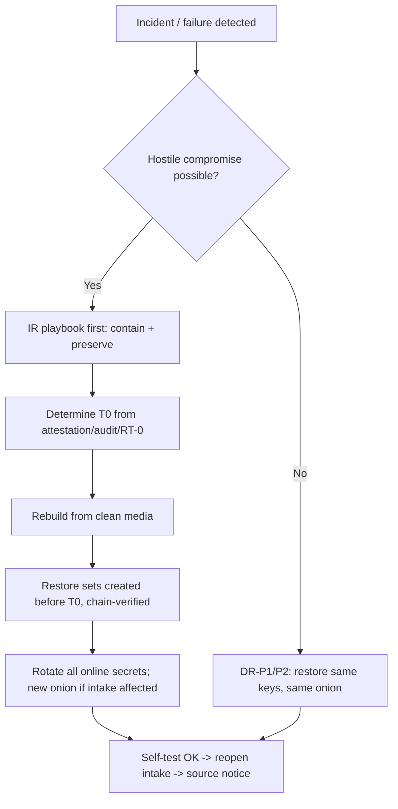

# 19 — Backups and Disaster Recovery

Status: Draft v1.0 · Edition applicability: both (geographic WORM and online restore-test options EE) · Owner: Platform Engineering (Backup/DR) with Security Team

## 1. Purpose and scope

This document specifies:
- what Candor backs up, and what it deliberately does not;
- how backups are encrypted, signed, padded, stored immutably, rotated offline and replicated geographically;
- how keys are separated;
- how source metadata is kept out of backups;
- restoration testing;
- retention and destruction;
- ransomware resilience;
- disaster-recovery procedures, with RPO/RTO per deployment profile.

Operator command syntax is in `18-DEPLOYMENT.md` §13. Deletion semantics are in ADR-025 and `35-DATA-RETENTION-DELETION.md`.

Core principle, from the LastPass lesson (INC-55): **backups are production**. A backup holds the same sensitive material as production and needs production-grade controls. Design target: a stolen backup set, **even together with its decryption key**, yields no report plaintext. Report content is already end-to-end encrypted to recipient keys (ADR-007, ADR-008), and backups add an outer encryption layer whose key is held offline.

## 2. Context and dependencies

| Source | Use |
|---|---|
| ADR-008, 010, 011, 013, 016, 025, 028 | Key hierarchy (no server master key), timing minimization, padding, no escrow default, audit classes, crypto-erasure, secret manifest |
| `17-INFRASTRUCTURE.md` §3, §4 (F7), §8.7 | Host roles; write-only backup flow; backup seizure analysis |
| `18-DEPLOYMENT.md` §4, §13, §15 | Per-profile backup topology; commands; secret placement |
| `20-LOGGING-AUDITING.md` | Audit checkpoints anchoring backup manifests |
| `31-INCIDENT-RESPONSE.md` | Ransomware and backup-theft playbooks |
| `35-DATA-RETENTION-DELETION.md` | Legal hold; retention schedules |

Research:
- GlobaLeaks `gl-admin backup` writes an **unencrypted** tar.gz containing the onion key, TLS keys and escrow material [B-GL-11]. Its do-not-copy #7 is "unencrypted backups containing onion and TLS keys" [B-GL-11].
- SecureDrop backups contain onion keys and the DB and are "highly sensitive". Its restore checksum bug was fixed in 2.15.1 [B-SD-02].
- CoverDrop uses forward-secure, padded vault backups with Shamir social recovery and an offline backup key [B-GL-29].
- R2 proposes R-BKP-01: backups encrypted to offline k-of-n keys, restores tested quarterly [B-GL-29].
- REQ-H-55 (INC-55): backups hold only E2EE data, re-encrypted under m-of-n custody keys, with no unencrypted source metadata.
- REQ-H-59 (INC-59): scoped, short-lived storage credentials; no public ACLs.
- NIST SP 800-88r2 defines cryptographic erase [B-CR-33]. R5 A.9 recommends key-wrapped backups only [B-CR-33].

## 3. Backup sets

| Set | Contents | Produced on | Transport to store | Encrypted to | Schedule |
|---|---|---|---|---|---|
| BS-CORE | Logical dump of C-12 (`pg_dump -Fc`, all tables incl. wrapped case keys), C-13 blob store (ciphertext objects), C-14 key directory + transparency log, C-24 audit store | H-CORE | F7 → H-BAK (write-only) | BK-DATA public key | Nightly full (02:15 local ± 30 min jitter) |
| BS-CORE-WAL | PostgreSQL WAL segments bundled into fixed 15-min bundles (§5.3) | H-CORE | F7 | BK-DATA | Every 15 min (EE, CE-HARDENED) |
| BS-INTAKE | Logical dump of C-08: source accounts (public keys, verifiers), pending replies, not-yet-pulled envelopes (ciphertext), upload-session records | H-INTAKE, encrypted **on intake** | **Pulled** by C-09 over F3 (intake never initiates, ADR-009), then forwarded by H-CORE over F7 | BK-DATA public key (only the public key is present on H-INTAKE) | Nightly |
| BS-SECRETS | Onion service keys (source, staff, SSH-onions, EE-HA master), Argon2 deployment salt, Tang key backup, internal CA **public** material, HSM backup blobs where the vendor supports wrapped export | Each host (per manifest entries with `backup_set: BS-SECRETS`) | Offline media only (never to the online store) | BK-SECRETS public key | At install and after every rotation of an included secret |
| BS-CONFIG | `candor-site.toml`, effective non-secret config, manifests, install record, golden PCR values | WS-ADM | Online store + offline | BK-DATA | On change |
| BS-ANCHOR | Signed audit checkpoints and backup-manifest chain heads | H-CORE | Online store + offline + optional external witness | Not encrypted (signed; contains hashes only) | Daily |

**Not backed up**, by design:
- Recipient/staff private keys: no escrow; ADR-007, ADR-013. The optional Recovery Quorum is the only recovery path, and it is not a backup.
- Channel epoch private keys: destroyed on schedule (ADR-008). Backing them up would defeat forward secrecy.
- Candor Desk local caches.
- C-17 viewer state.
- journald/system logs (retention per `20-LOGGING-AUDITING.md`).
- Tor state other than keys.
- Swap (none).
- Hypervisor snapshots (forbidden for Z-INTAKE; `17-INFRASTRUCTURE.md` INFRA-021).

## 4. Keys and key separation

| Key | Type | Private part held by | Public part held by | Purpose | Rotation |
|---|---|---|---|---|---|
| BK-DATA | HPKE X-Wing (CANDOR-STD-1) or MLKEM1024-P384 hybrid (CANDOR-FIPS-1), ADR-006 | Offline only: Infrastructure Recovery Key (IRK) Shamir k-of-n shares (default 2-of-3 CE, 3-of-5 EE) on hardware tokens or paper; GOV: offline HSM | H-CORE, H-INTAKE (public) | Wraps per-set DEKs of BS-CORE, BS-CORE-WAL, BS-INTAKE, BS-CONFIG | Yearly ("backup key epoch"); also after any suspected share compromise |
| BK-SECRETS | Same suite, **distinct keypair** | Offline IRK-S shares, whose custodian set SHOULD differ from BK-DATA's by at least one person | Each host (public) | Wraps BS-SECRETS DEKs | On any custodian change; yearly |
| Per-set DEK | 256-bit random (OS CSPRNG) | Exists only in RAM during set creation and restore | — | STREAM encryption of segments | Per set |
| Backup-agent signing key | Ed25519 (FIPS: ECDSA P-384) | H-CORE (TPM/HSM if available) | H-MON, restore tool (pinned in BS-CONFIG / install record) | Signs set manifests | Yearly or on compromise |
| Intake backup signing key | Ed25519 | H-INTAKE | H-CORE, restore tool | Signs BS-INTAKE manifests | Yearly |
| WORM store credentials: agent | Access key scoped to `PutObject` with bucket-default retention; no `Delete*`, no `PutObjectRetention`, no `PutBucket*`; validity ≤ 24 h, renewed by H-BAK token service (REQ-H-59) | H-CORE `candor-backup` UID | — | Upload | Daily |
| WORM store credentials: verifier | Read-only `GetObject`/`ListBucket` | H-MON | — | Verification | Daily |
| WORM store root | Full admin | Sealed envelope in two-person safe; break-glass only | — | Store administration | On use |

Separation invariants:
1. No online host holds any backup **decryption** key.
2. The backup agent can create but cannot delete, overwrite or shorten the retention of sets.
3. The verifier can read but not write.
4. BK-DATA ≠ BK-SECRETS. Compromise of the data key does not yield onion keys, and the reverse.
5. No backup key is a case key, a recipient key or a Recovery Quorum key. Backups add no content-decryption capability (ADR-008 "no master key" holds).
6. IRK shares are never stored on WS-ADM or any online host (`18-DEPLOYMENT.md` §15 `forbidden_everywhere`).

## 5. Format and metadata protection

### 5.1 Set format `candor-backup/1`

```
set/
  <set_id>/                      # set_id = 128-bit random, base32; no dates or hostnames in names
    header.bin                   # version, suite id, HPKE enc + wrapped DEK (per recipient key), header HMAC (key commitment)
    manifest.enc                 # STREAM-encrypted canonical JSON manifest (see below)
    manifest.sig                 # Ed25519 over (set_id || hash(header) || hash(manifest.enc) || prev_manifest_hash)
    seg/000000 … seg/NNNNNN      # exactly 64 MiB each; STREAM (64 KiB chunks) AEAD with DEK-derived per-segment keys
```

Manifest plaintext fields (encrypted, so visible only after decryption):
- `set_type`
- `created_epoch_day`
- `producer_role`
- `schema_version`
- `prev_manifest_hash`
- `segments[]` (index, BLAKE3 of ciphertext, SHA-256 of ciphertext)
- `logical_items` (table name → row count, blob count; **no** per-row data)
- `padding_segments` (which segments are chaff)
- `pg_version`
- `candor_version`

Suite and chunking follow ADR-006 (age-style STREAM, 64 KiB chunks, header HMAC key commitment). Segment keys: `HKDF(DEK, info="candor-backup/1 seg" || set_id || index)`.

### 5.2 Size padding

The total segment count is padded to the next value of a geometric series, ratio 1.25, minimum 4 segments (256 MiB), consistent with ADR-011. Chaff segments are random bytes of equal length, indistinguishable without the DEK.

Consequence: an observer of the store learns only the size bucket per set. With ratio 1.25 the bucket reveals growth within about 25%.

### 5.3 WAL bundles

- PostgreSQL: `archive_mode=on`, `archive_timeout=900`, `wal_compression=off` (compression would make sizes activity-dependent), `archive_command='candor-backup wal-stage %p'`.
- Every 15 min (fixed, clock-aligned) the agent emits one bundle containing all staged segments, padded to the next geometric bucket (ratio 1.25, minimum 1 segment of 64 MiB). If no segment was staged, it still emits the minimum bundle.
- Rationale: fixed cadence plus padding hides activity bursts (THR-011) at the cost of storage (about 6 GiB/day minimum; 34 sizing).

### 5.4 Source-metadata protection rules

| Risk | Rule |
|---|---|
| Backup object timestamps reveal activity | Sets are produced on a fixed schedule with jitter independent of activity. WAL bundles are fixed-cadence (§5.3) |
| Sizes reveal submissions | Padding (§5.2, §5.3) |
| Names reveal content | Random `set_id`, numeric segment names, no hostnames, case IDs or dates in object keys |
| Store access logs | Object-store server access logs disabled, or retained ≤ 7 days, readable only by the security team (REQ-H-60) |
| Backups add new metadata | Backup tooling SHALL NOT add fields beyond §5.1. Row-level data is copied as-is from stores already minimized by ADR-010 (day granularity) |
| Deleted data persists | Retention ≤ 35 days default (§8). Deleted cases stay unreadable because key wrappings are destroyed (ADR-025) |
| Intake data in backups | BS-INTAKE retention 14 days (shorter than BS-CORE), because source-account records exist only to preserve source login ability |
| Pending-reply presence in BS-INTAKE reveals "which sources were answered" | Accepted. Retention bounded to 14 days, encrypted to BK-DATA |
| Restore tests leak data | Restores run in an isolated, network-less sandbox that is crypto-erased afterwards (§7) |

## 6. Storage tiers, immutability and geography

| Tier | Medium | Immutability | Location | Profiles |
|---|---|---|---|---|
| T1 online WORM | S3-compatible store with Object Lock **compliance mode** on H-BAK (e.g., on-prem object store), or an append-only REST backup server | Compliance-mode retention = retention period (§8); agent cannot delete | Same site, separate host (Z-BAK) | CE-HARDENED and above. CE-SINGLE uses T2 only |
| T2 offline | ≥ 2 encrypted external disks (LUKS2 + set-level encryption), rotated weekly; one always off-site | Physically offline (air gap); write-protect switch where available | Primary site + off-site (≥ 10 km, different building owner) | All profiles |
| T3 geographic | Second WORM store | Compliance mode | Second site ≥ 50 km away, same legal jurisdiction unless counsel approves (`25-COMPLIANCE.md`) | EE-ONPREM (recommended), EE-HA, GOV, PRIVATE-CLOUD (second region, separate account), MANAGED |

Rule: at least 3 copies, on 2 media types, 1 off-site, 1 offline or immutable, and 0 verification errors ("3-2-1-1-0").

Transport of offline media: sealed tamper-evident bag with a logged serial, two-person handover, and no checked luggage (`17-INFRASTRUCTURE.md` §6).

## 7. Restoration testing

| Test | Frequency | Who | Decrypts? | Checks |
|---|---|---|---|---|
| RT-0 structural verification | Daily (H-MON) | automatic | No | Every expected set exists; manifest signatures valid; `prev_manifest_hash` chain unbroken; segment hashes match (from signed header-level hash list); Object Lock retention present and ≥ policy; no unexpected objects (injection) |
| RT-1 sandbox restore | Quarterly (all profiles); monthly (EE-HA, GOV) | 2 admins + IRK custodians (k) | Yes (outer layer only) | Restore BS-CORE + latest WAL + BS-INTAKE into an isolated network-less sandbox VM (`candorctl dr drill`); `pg_amcheck`; row and blob counts match the manifest; every blob referenced by C-12 exists and its ciphertext hash matches; audit hash-chain and key-directory log verify; measured RPO (latest restorable point) and RTO (elapsed time) recorded |
| RT-2 end-to-end canary decrypt | Quarterly with RT-1 | 1 recipient (canary channel member) | Canary only | A **synthetic canary case** created at install on a dedicated canary channel (no real data) is opened in Candor Desk against the sandbox. This proves case-key unwrapping and blob decryption work after restore, **without anyone decrypting real reports** |
| RT-3 secrets restore | Yearly, and after each BS-SECRETS change | 2 admins + IRK-S custodians | BS-SECRETS | Restore onion keys on a sandbox intake with tor in a netns **without** Internet (so the restored service is never published); verify the derived onion address equals the production address |
| RT-4 full DR exercise | Yearly (EE-HA, GOV: twice yearly) | Ops + security + management | Yes | Execute DR-P3 (site loss) on spare hardware; measure RTO against §10 |

After each RT-1/RT-3, the sandbox is crypto-erased (LUKS erase) and destruction is recorded. Results are recorded as signed SYSTEM audit events: pass/fail, RPO/RTO, and **no row data**.

Optional (EE, ADVANCED): `backup.online_restore_test_key`. Sets are additionally wrapped to a restore-test key held only on an isolated restore host in Z-BAK, which enables automated monthly RT-1. The consequence is that compromise of that host yields server metadata equivalent to a DB seizure (`17-INFRASTRUCTURE.md` §8.6).

## 8. Retention and destruction

| Set | T1 retention (Object Lock) | T2 offline | T3 | Notes |
|---|---|---|---|---|
| BS-CORE nightly | 35 days (dailies 14 + weeklies 3) | Latest weekly on each of 2 disks | 35 days | EE MAY configure monthly sets retained ≤ 12 months (ADVANCED: extends THR-017 exposure) |
| BS-CORE-WAL | 14 days | — | 14 days | Enables point-in-time recovery within 14 days |
| BS-INTAKE | 14 days | Latest weekly | 14 days | Source-account data minimized |
| BS-SECRETS | n/a (not online) | Current + previous generation | Offline copy at second site | Previous generation destroyed 30 days after rotation |
| BS-CONFIG | 90 days | Latest | 90 days | No sensitive data |
| BS-ANCHOR | 7 years (or as audit policy requires) | Yes | Yes | Hashes and signatures only |

Legal hold (`35-DATA-RETENTION-DELETION.md`): a hold on a case SHALL be implemented in production (the case key is retained). It SHALL NOT be implemented by extending backup retention, because extending retention would retain every other deleted item too.

Deletion propagation (ADR-025):
- Deleting a case destroys all wrappings of its case key in production. Backup copies of the same wrapped keys remain decryptable **only** by the case members' private keys (and the Quorum, if enabled). So:
  - (a) after member key rotation or revocation, old wrappings in backups are useless to anyone who lacks the old member keys;
  - (b) residual exposure lasts until set expiry (≤ 35 days) for anyone holding a former member's device and credentials. This is documented in `35-DATA-RETENTION-DELETION.md`.
- Backup key epochs: BK-DATA is rotated yearly. When the last set encrypted under BK-DATA(n) expires, the BK-DATA(n) IRK shares are destroyed under two-person witness. Any lost or stray copy of those sets then becomes permanently undecryptable (crypto-erasure of backups).

Destruction:
- T1 objects are deleted by lifecycle rules after lock expiry.
- T2 disks are overwritten on rotation reuse and crypto-erased + physically destroyed at end of life (`17-INFRASTRUCTURE.md` §6.7).
- IRK paper shares are cross-cut shredded and tokens zeroized.
- Destruction is recorded in the maintenance log.

## 9. Ransomware resilience

| Control | Specification |
|---|---|
| Segmented producers | Each zone produces its own sets. H-INTAKE never talks to the store (its sets are pulled by C-09). Compromise of one zone's producer cannot read or alter another zone's sets |
| Limited service credentials | Agent: put-only, ≤ 24 h validity, cannot delete, overwrite or change retention. Verifier: read-only. Root: offline break-glass (§4) |
| Immutability | Compliance-mode Object Lock (cannot be shortened even by the store admin before expiry) + offline T2 |
| Cryptographically protected sets | Signed manifests with a hash chain anchored daily in BS-ANCHOR and the audit log. Restore refuses sets whose signature, chain or anchor does not verify, and refuses sets created after a declared compromise time unless explicitly overridden with dual approval |
| Detection | RT-0 anomalies (a missing set, a size bucket jump ≥ 2 buckets day over day, chain breaks, PUT failures); DB integrity failures; attestation mismatch (`17-INFRASTRUCTURE.md` §5.6); canary files in `/var/lib/candor` whose modification or encryption triggers a SECURITY alert |
| Decoupled admin domains | The WORM store is administered by credentials not usable from WS-ADM's everyday session (separate hardware key, safe) |
| No backup decryption online | An attacker cannot "hold backups hostage" by encrypting them (immutable). Attacker **exfiltration** of backups yields outer ciphertext only |
| Recovery path | DR-P4 (§10) |

Content-level resilience: ransomware on a recipient workstation cannot destroy server-held ciphertext. Ransomware on H-CORE can destroy production but not T1/T2. Loss of the **last** recipient devices for a case is not recoverable from backups without the Recovery Quorum (ADR-013). This is warned at case creation (≥ 2 members).

## 10. RPO/RTO per profile

RPO = maximum data loss; RTO = time to restore service. "Intake" = sources can reach the onion and submit. "Core" = recipients can work.

| Profile | Intake RPO | Intake RTO | Core RPO | Core RTO | Secrets RPO | Notes |
|---|---|---|---|---|---|---|
| CE-SINGLE | 24 h (source accounts); ≤ 25 min for unpulled envelopes | 72 h (replacement hardware + restore) | 24 h | 72 h | 0 (BS-SECRETS at each change) | No WAL; T2 only |
| CE-HARDENED | 24 h / ≤ 25 min | 8 h (cold spare) | 15 min (WAL) | 24 h | 0 | |
| EE-ONPREM | 24 h / ≤ 25 min | 4 h (cold spare) | 15 min | 4 h (VM HA restart: minutes) | 0 | |
| EE-HA | ≈ 0 (sync standby) | ≤ 15 min (automatic; descriptor refresh) | ≈ 0 in-site; 15 min cross-site | ≤ 1 h | 0 | |
| GOV-ONPREM | per base (EE-ONPREM / EE-HA) | 8 h (default policy) | 15 min | 8 h | 0 | Offline media in second accredited facility |
| AIRGAP-RCP | inherits | inherits | inherits | WS-VIEW replacement 24 h (spare + key re-provision) | — | Weekly sync constraint (DEP-030) |
| PRIVATE-CLOUD | 24 h / ≤ 25 min | 4 h (warm standby VM) | 15 min | 4 h | 0 | |
| MANAGED | contract (default as EE-ONPREM) | 4 h | 15 min | 4 h | 0 | Vendor SLA |

Unpulled-envelope RPO equals the maximum relay pull interval (15 ± 10 min, ADR-009). Envelopes on a destroyed intake host that were not yet pulled are lost. Sources are informed through the source security notice (`31-INCIDENT-RESPONSE.md`) that submissions made in the affected window may need to be re-sent.

## 11. Disaster-recovery procedures

Each procedure is executed with the commands in `18-DEPLOYMENT.md` §13 and logged as SECURITY audit events.

| ID | Scenario | Procedure (summary) | Source-facing effect |
|---|---|---|---|
| DR-P1 | H-INTAKE hardware failure (no compromise) | 1. Confirm no compromise indicators (attestation history, seals). 2. Prepare the spare (`18-DEPLOYMENT.md` §7.3). 3. `restore secrets` (BS-SECRETS, IRK-S quorum) → same onion address. 4. `restore data` BS-INTAKE latest. 5. Re-pair relay. 6. C-09 re-pushes all undelivered replies (core is the source of truth for replies). 7. Self-test, then open intake | Onion unreachable during downtime (no alternative path, ADR-002). Accounts created after the last BS-INTAKE are lost (notice advises re-registration) |
| DR-P2 | H-CORE failure | Restore BS-CORE latest + WAL to point-in-time on spare hardware; restore the key directory and audit; re-pair relay and monitor; staff Desks resync | Intake keeps accepting (the intake queue buffers; `34-PERFORMANCE-SCALABILITY.md` sizes ≥ 7 days) |
| DR-P3 | Site loss (fire, flood, seizure of the whole site) | 1. Invoke the physical-seizure IR playbook if seizure is possible (`31-INCIDENT-RESPONSE.md`): **rotate onion keys** instead of restoring them. 2. Provision a new site from T2/T3. 3. Restore BS-CORE (+WAL from T3). 4. Restore BS-INTAKE. 5. BS-SECRETS: restore (non-hostile loss) or generate new keys (hostile) | New onion address in the hostile case, published per IR notice procedure |
| DR-P4 | Ransomware / destructive attack on H-CORE or H-INTAKE | 1. Isolate (pull the uplinks). 2. Preserve evidence (`31-INCIDENT-RESPONSE.md`). 3. Determine the compromise start time T0 from attestation, audit and RT-0 history. 4. Rebuild hosts from clean media (never restore binaries or config from the compromised host). 5. Restore the latest set whose manifest chain verifies **and** whose creation predates T0 (dual approval to use later sets). 6. Rotate all online secrets (relay, monitor, agent, staff-onion, SSH-onion); rotate the source onion key if the intake was compromised. 7. Replay WAL up to T0 only | Possible data loss since T0. Security notice |
| DR-P5 | Loss of the source onion key without a usable BS-SECRETS | Generate a new onion; publish it via C-37, the key directory (signed by Channel Identity Keys), and the Source App pinned directory; old-address notice where possible | Sources must find the new address; see the IR "onion key compromise" notification procedure |
| DR-P6 | Loss of all member devices for a case or channel | Without Recovery Quorum: the case content is unrecoverable (by design); the case metadata remains. With Quorum: a k-of-n ceremony (ADR-013) re-wraps the case key to new members | None directly. Recipients may ask the source (via reply) to re-send |
| DR-P7 | HSM failure or loss | Restore from the HSM vendor's wrapped backup (M-of-N) to a replacement. If unavailable: generate new audit, directory and SSH-CA keys; publish key-rotation records in the key directory; re-anchor audit | None |
| DR-P8 | Backup store compromise (read) | Treat as "backup theft" (`31-INCIDENT-RESPONSE.md`). Outer encryption holds unless IRK shares are also compromised. Rotate BK-DATA early; shorten retention of affected sets where possible (not possible under compliance lock; document) | Metadata exposure assessment |
| DR-P9 | IRK share loss or suspected disclosure | If remaining shares ≥ k: immediately generate new BK keys and a new IRK split; re-encrypt nothing (old sets expire); destroy old shares after the last old set expires. If < k shares remain: **old sets are unrecoverable**; take a fresh full backup under the new key at once | None |



## 12. Requirements

| ID | Requirement | Evidence | Threats | Component | Verification |
|---|---|---|---|---|---|
| BAK-001 | Every backup set SHALL be encrypted before leaving its producing host with a fresh 256-bit DEK wrapped via HPKE to an offline backup public key (BK-DATA or BK-SECRETS). | INC-55 (REQ-H-55); B-GL-11; B-GL-29 | THR-015, THR-017, THR-013 | C-27, C-11 | TST: `backup-encrypted-at-source` inspects bytes leaving the host (entropy + no plaintext canaries); KAT for the header format |
| BAK-002 | No online host SHALL hold a backup decryption key. BK private keys SHALL exist only as offline IRK shares (k-of-n) or in an offline HSM. | INC-55; R5 A.9 | THR-013, THR-042 | C-27, C-28, C-29 | TST: secret-placement scan (DEP-023) for BK private material; INSP: ceremony log |
| BAK-003 | BK-DATA and BK-SECRETS SHALL be distinct keypairs with separately generated share sets. | Design (key separation); B-GL-11 | THR-044, THR-013 | C-27 | INSP: ceremony record; TST: header recipient IDs differ between set types |
| BAK-004 | Onion keys and other BS-SECRETS contents SHALL NOT be written to online backup storage. | B-GL-11; B-SD-02 | THR-044 | C-27 | TST: RT-0 scan of the store for BS-SECRETS set headers → none; manifest check |
| BAK-005 | Backup credentials used by producers SHALL be put-only, SHALL be unable to delete objects or alter retention, and SHALL expire within 24 h. | INC-59 (REQ-H-59); INC-55 | THR-042, THR-017 | C-27 | TST: agent credential attempts DELETE, PutObjectRetention and bucket-policy changes → all denied; expiry test |
| BAK-006 | T1 storage SHALL use compliance-mode immutability for the full retention period. | Knowledge (unverified) ransomware practice; INC-55 | THR-042 | C-27 | TST: attempt to delete or shorten the lock with store-admin credentials before expiry → denied |
| BAK-007 | At least one current copy of BS-CORE and BS-INTAKE SHALL be offline (T2), and one T2 medium SHALL be off-site. | R2 R-BKP-01 | THR-042, THR-031 | C-27 | INSP: rotation log; DEMO: quarterly offline restore (RT-1 from T2 at least yearly) |
| BAK-008 | Z-INTAKE SHALL NOT connect to backup storage. BS-INTAKE SHALL be retrieved by C-09 over the core-initiated relay. | ADR-009 | THR-014, THR-042 | C-08, C-09 | TST: INFRA-001/004 egress tests; backup flow trace |
| BAK-009 | Set manifests SHALL be signed and hash-chained, and chain heads SHALL be anchored daily in BS-ANCHOR and the audit log. Restore SHALL refuse unverifiable sets. | B-SD-02 (restore checksum bug); ADR-016 | THR-037, THR-042 | C-27, C-24 | TST: tampered segment, reordered set or broken chain → restore refused |
| BAK-010 | Backup object names SHALL contain no dates, hostnames, case IDs or other descriptive data. | ADR-010 | THR-011, THR-016 | C-27 | TST: object-key regex audit in RT-0 |
| BAK-011 | Backup sets SHALL be padded to geometric size buckets (ratio 1.25, minimum 256 MiB) with indistinguishable chaff segments. WAL SHALL be archived in fixed 15-min bundles with compression disabled and padding. | ADR-011; B-GL-29 | THR-011, THR-039 | C-27 | TST: synthetic activity profiles (idle vs burst) yield identical bundle counts per interval and bucketed sizes |
| BAK-012 | Backup scheduling SHALL be fixed with activity-independent jitter. No backup SHALL be triggered by submission or case events. | ADR-010 | THR-011 | C-27 | INSP: code review; TST: event-trigger absence test |
| BAK-013 | Object-store access logs for backup buckets SHALL be disabled or retained ≤ 7 days with security-team-only access. | REQ-H-60 | THR-016 | C-27 | INSP: store configuration; TST: config checker rule |
| BAK-014 | Backups SHALL NOT include recipient private keys, channel epoch private keys, Candor Desk caches, or hypervisor snapshots of Candor VMs. | ADR-007; ADR-008 | THR-013, THR-017 | C-27 | TST: backup content inventory versus deny-list |
| BAK-015 | Structural verification (RT-0) SHALL run daily from H-MON with read-only credentials and alert on missing sets, chain breaks, retention anomalies or unexpected objects. | R2 R-BKP-01; B-SD-02 | THR-042, THR-037 | C-25, C-27 | TST: inject a missing set and a rogue object → alerts |
| BAK-016 | A sandbox restore (RT-1) SHALL be performed at least quarterly (monthly for EE-HA and GOV) in a network-less sandbox, with measured RPO/RTO recorded as signed SYSTEM events. The sandbox SHALL be crypto-erased afterwards. | R2 R-BKP-01 | THR-042, THR-017 | C-27, C-25 | DEMO: drill record; TST: `dr-drill` job in the reference lab |
| BAK-017 | Restore tests SHALL use a synthetic canary case to verify end-to-end decryptability. No real case content SHALL be decrypted for testing. | ADR-015; REQ-H-68 | THR-018 | C-15, C-27 | INSP: drill procedure; TST: canary case present at install |
| BAK-018 | BS-SECRETS restore tests SHALL run the restored onion service only in a network namespace without Internet access. | Design; THR-044 | THR-044 | C-05 | TST: RT-3 script asserts netns isolation before starting tor |
| BAK-019 | Default retention SHALL be ≤ 35 days for BS-CORE and ≤ 14 days for BS-CORE-WAL and BS-INTAKE. Longer retention SHALL be an ADVANCED setting. | ADR-025; INC-55 | THR-017 | C-27 | TST: config checker; lifecycle-rule inspection |
| BAK-020 | Legal hold SHALL NOT be implemented by extending backup retention. | ADR-025 | THR-017 | C-27, C-10 | INSP: `35-DATA-RETENTION-DELETION.md` cross-check; TST: hold does not alter lifecycle rules |
| BAK-021 | BK-DATA SHALL be rotated at least yearly. The IRK shares of a retired BK SHALL be destroyed when its last set expires, and the destruction SHALL be recorded. | B-CR-33; ADR-025 | THR-017, THR-013 | C-27, C-28 | INSP: key-epoch register; DEMO: destruction witness record |
| BAK-022 | IRK custodians for BK-SECRETS SHOULD differ from BK-DATA custodians by at least one person. No single person SHALL hold k shares of either. | B-GL-29; REQ-H-68 | THR-018, THR-013 | C-28 | INSP: custodian register |
| BAK-023 | Geographic copies (T3) SHALL remain within the legal jurisdiction chosen for the deployment unless counsel approval is recorded. | R6 (B-CO-09 GDPR Ch. V) | THR-026 | C-27 | INSP: deployment record |
| BAK-024 | Offline media SHALL be LUKS2-encrypted in addition to set encryption, transported sealed under two-person handover, and destroyed per `17-INFRASTRUCTURE.md` §6.7. | B-CR-33 | THR-031, THR-017 | C-27 | INSP: media log |
| BAK-025 | Canary files in Candor data paths SHALL raise a SECURITY alert on modification. Backup size jumps of ≥ 2 buckets day over day SHALL raise an alert. | Knowledge (unverified) ransomware detection practice | THR-042 | C-25 | TST: modify the canary → alert; synthetic size jump → alert |
| BAK-026 | The WORM store root credentials SHALL be kept offline in a two-person safe and SHALL NOT be usable from WS-ADM's routine session. | INC-55 | THR-042, THR-018 | C-27 | INSP: safe log; TST: routine admin session has no store-admin permission |
| BAK-027 | Restore tooling SHALL verify the producer's signing key against the value pinned in BS-CONFIG / the install record, not against a key found in the set. | B-SD-02 | THR-037, THR-042 | C-27 | TST: set signed with an unpinned key → refused |
| DR-001 | Each profile SHALL meet the RPO/RTO of §10, demonstrated at least yearly by RT-4. | R2 R-BKP-01 | THR-042, THR-032 | C-27, C-25 | DEMO: RT-4 record with measured values |
| DR-002 | DR-P1..DR-P9 SHALL be maintained as tested runbooks with `candorctl` commands, exercised at least yearly (DR-P1, P2, P4 at least twice yearly in EE-HA/GOV). | B-SD-08 (operational burden) | THR-042 | C-19 | DEMO: exercise records; TST: runbook command blocks executed in the lab (DEP-036) |
| DR-003 | When hostile compromise is possible, recovery SHALL rebuild hosts from clean media and SHALL NOT restore binaries, configuration or secrets from the compromised host. | INC-38; INC-41 | THR-014, THR-042 | C-19 | INSP: DR-P4 checklist; DEMO |
| DR-004 | After hostile compromise of Z-INTAKE, recovery SHALL generate a new source onion key rather than restore the old one, and SHALL follow the onion-rotation notice procedure. | INC-28; B-AN-47 | THR-044 | C-05, C-14 | DEMO: IR exercise; TST: `restore secrets --hostile` refuses the onion key restore |
| DR-005 | Restores after compromise SHALL use only sets created before the determined compromise time T0, unless dual approval is recorded. | Design | THR-042, THR-037 | C-27 | TST: attempt to restore a post-T0 set without co-sign → refused |
| DR-006 | After restoring Z-INTAKE, C-09 SHALL re-push all replies not confirmed as delivered, and SHALL resynchronize key-directory snapshots. | ADR-009 | — | C-09 | TST: DR-P1 lab test verifies reply availability |
| DR-007 | The intake queue on H-INTAKE SHALL be sized to hold ≥ 7 days of peak submissions so that Z-CORE outages do not stop intake. | ADR-009 | THR-032 | C-08 | TST: capacity test per `34-PERFORMANCE-SCALABILITY.md` |
| DR-008 | Loss of all member devices for a case without Recovery Quorum SHALL be treated as permanent content loss. The UI SHALL warn at case creation when fewer than 2 members hold keys. | ADR-013 | THR-042 | C-15, C-10 | TST: UI test; INSP |
| DR-009 | DR procedures SHALL NOT contact sources through any identity channel. Source-facing effects SHALL be communicated only via source security notices (`31-INCIDENT-RESPONSE.md`). | ADR-002; ADR-017 | THR-028, THR-040 | C-06 | INSP: runbook review |
| DR-010 | An IRK share loss that leaves fewer than k shares SHALL trigger immediate creation of a new BK and a fresh full backup. | B-GL-29 | THR-042 | C-27, C-28 | DEMO: tabletop exercise |

## 13. Residual risks and limitations

1. With k IRK shares and a backup set, an adversary obtains historical server metadata (not content) within retention. Custodian compromise or coercion is the main risk.
2. Retention (≤ 35 days) delays the effect of deletion on backup copies (THR-017). Compliance-mode locks cannot be shortened even when deletion is urgent.
3. Padding hides activity only to within about 25% (ratio 1.25) and costs storage. Bucket size still reveals long-term growth.
4. Unpulled envelopes (≤ 25 min) and intake data since the last nightly BS-INTAKE are lost on intake destruction.
5. Content recovery depends on recipient devices (no escrow default). This is a deliberate availability tradeoff (ADR-013).
6. RT-2 proves decryptability only for the canary case, not for every real case key wrapping.
7. Backup-agent key compromise lets an attacker add forged sets. Pinned keys, chain anchoring and T0 selection mitigate this, but operator judgment is required.

## 14. Open issues

1. Confirm the object-store product selection for on-prem Object Lock compliance mode in CE-HARDENED (the licensing and maintenance of candidates is not evaluated here).
2. `09-DATABASE.md` should confirm that logical dumps contain no fields beyond the ADR-010 minimization (e.g., PostgreSQL internal timestamps such as `pg_xact_commit_timestamp` MUST be disabled: `track_commit_timestamp=off`).
3. Whether BS-INTAKE should exclude not-yet-pulled envelopes: including them preserves submissions; excluding them reduces backup-resident ciphertext. The current choice is to include.
4. The exact interaction between legal hold and member key rotation in backups needs alignment with `35-DATA-RETENTION-DELETION.md`.
