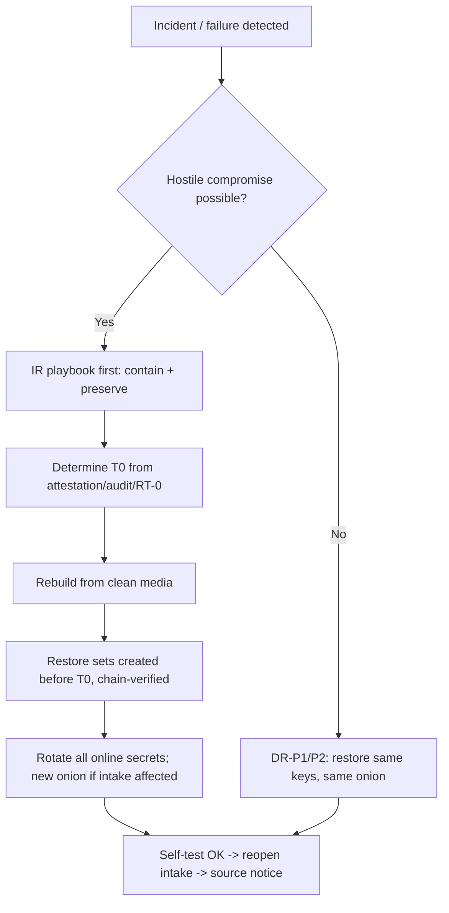

# 19 — Backups and Disaster Recovery

Status: Draft v1.1 (revision round 2: ADR-034..046) · Edition applicability: both (geographic WORM and online restore-test options EE) · Owner: Platform Engineering (Backup/DR) with Security Team

## 1. Purpose and scope

This document specifies:
- what Candor backs up, and what it deliberately does not;
- how backups are encrypted, signed, padded, stored immutably, rotated offline and replicated geographically;
- how keys are separated;
- how source metadata is kept out of backups;
- restoration testing;
- retention and destruction;
- ransomware resilience;
- disaster-recovery procedures, with RPO/RTO per deployment profile.

Operator command syntax is in `18-DEPLOYMENT.md` §13. Deletion semantics are in ADR-025 and `35-DATA-RETENTION-DELETION.md`.

Core principle, from the LastPass lesson (INC-55): **backups are production**. A backup holds the same sensitive material as production and needs production-grade controls. Design target: a stolen backup set, **even together with its decryption key**, yields no report plaintext. Report content is already end-to-end encrypted to recipient keys (ADR-007, ADR-008), and backups add an outer encryption layer whose key is held offline.

## 2. Context and dependencies

| Source | Use |
|---|---|
| ADR-008, 010, 011, 013, 016, 025, 028 | Key hierarchy (no server master key), timing minimization, padding, no escrow default, audit classes, crypto-erasure, secret manifest |
| ADR-033(3), 034, 038, 039, 044, 046 (revision round 2) | Erasure Key Vault; Tier W drafts never on disk; fixed import slots and delayed delivery; fetch-all reply pages; vault DR replication, erasure log on restore, infrastructure-backup exclusion, GOV Recovery Quorum default, `min_recipients` 2; no intake replication, no HSM fallback |
| `17-INFRASTRUCTURE.md` §3, §4 (F7), §8.7 | Host roles; write-only backup flow; backup seizure analysis |
| `18-DEPLOYMENT.md` §4, §13, §15 | Per-profile backup topology; commands; secret placement |
| `20-LOGGING-AUDITING.md` | Audit checkpoints anchoring backup manifests |
| `31-INCIDENT-RESPONSE.md` | Ransomware and backup-theft playbooks |
| `35-DATA-RETENTION-DELETION.md` | Legal hold; retention schedules |

Research:
- GlobaLeaks `gl-admin backup` writes an **unencrypted** tar.gz containing the onion key, TLS keys and escrow material [B-GL-11]. Its do-not-copy #7 is "unencrypted backups containing onion and TLS keys" [B-GL-11].
- SecureDrop backups contain onion keys and the DB and are "highly sensitive". Its restore checksum bug was fixed in 2.15.1 [B-SD-02].
- CoverDrop uses forward-secure, padded vault backups with Shamir social recovery and an offline backup key [B-GL-29].
- R2 proposes R-BKP-01: backups encrypted to offline k-of-n keys, restores tested quarterly [B-GL-29].
- REQ-H-55 (INC-55): backups hold only E2EE data, re-encrypted under m-of-n custody keys, with no unencrypted source metadata.
- REQ-H-59 (INC-59): scoped, short-lived storage credentials; no public ACLs.
- NIST SP 800-88r2 defines cryptographic erase [B-CR-33]. R5 A.9 recommends key-wrapped backups only [B-CR-33].

## 3. Backup sets

| Set | Contents | Produced on | Transport to store | Encrypted to | Schedule |
|---|---|---|---|---|---|
| BS-CORE | Logical dump of C-12 (`pg_dump -Fc`, all tables incl. Erasure-Key-encrypted member wraps and the production erasure log, **excluding the Erasure Key Vault**, ADR-033(3)), C-13 blob store (ciphertext objects), C-14 key directory + transparency log, C-24 audit store | H-CORE | F7 → H-BAK (write-only) | BK-DATA public key | Nightly full (02:15 local ± 30 min jitter) |
| BS-CORE-WAL | PostgreSQL WAL segments bundled into fixed 15-min bundles (§5.3) | H-CORE | F7 | BK-DATA | Every 15 min (EE, CE-HARDENED) |
| BS-INTAKE | Logical dump of C-08, minimized (RVW-B-22, RVW-A-03): source account records (lookup tag, auth verifier, public keys; no activity history, ADR-039), not-yet-imported envelopes including delayed-delivery envelopes with their release day (ciphertext, ADR-038(4)), and the mailbox **tombstone list** (§11, RVW-A-28). **Excluded:** reply ciphertexts (Z-CORE is the source of truth and C-09 republishes the 30-day reply pages, ADR-039), Tier V upload sessions, and Tier W drafts/staging (never on disk, ADR-034) | H-INTAKE, encrypted **on intake** | **Pulled** by C-09 over F3 (intake never initiates, ADR-009), then forwarded by H-CORE over F7 | BK-DATA public key (only the public key is present on H-INTAKE) | Nightly |
| BS-ERASURE | The Erasure Key Vault (per-case Erasure Keys; host-local file on a dedicated volume of H-CORE, never a DB schema, so it is never in Patroni replicas or WAL archives; RVW-C-08) | H-CORE | F7 (T1/T3) and a dedicated T2 partition (§8) | BK-DATA | Nightly, in the same run as BS-CORE (so every BS-CORE has a matching vault set) |
| BS-SECRETS | Onion service keys (source, offline standby onion key, RCP-ONION onions, SSH-onions), Intake Routing Key, Argon2 deployment salt, Tang key backup, internal CA **public** material, HSM backup blobs where the vendor supports wrapped export, and an **escrow copy of the Erasure Key Vault volume key (VMK)** exported from the TPM/HSM re-encrypted to BK-SECRETS, so that the vault is restorable on replacement hardware (RVW-C-07). Vault exports (`EXPORT_BACKUP`) are Erasure Keys re-encrypted to BK-DATA, never records sealed under a TPM that may be lost | Each host (per manifest entries with `backup_set: BS-SECRETS`) | Offline media only (never to the online store) | BK-SECRETS public key | At install and after every rotation of an included secret |
| BS-CONFIG | `candor-site.toml`, effective non-secret config, manifests, install record, golden PCR values | WS-ADM | Online store + offline | BK-DATA | On change |
| BS-ANCHOR | Signed audit checkpoints and backup-manifest chain heads | H-CORE | Online store + offline + optional external witness | Not encrypted (signed; contains hashes only) | Daily |
| BS-ERASELOG | The signed, append-only **erasure log** (ADR-044(4)): one entry per crypto-erased case `{SHA-256(case_id), erasure_epoch_day, reason_class ∈ {retention, source_request, disposition, other}, audit-key signature}`; hash-chained | H-CORE | F7 (T1/T3) and T2 | BK-DATA | Daily at a fixed time, independent of erasure events; retention = longest BS-CORE retention + 7 days, entries older than the oldest retained BS-CORE set pruned |

**Not backed up**, by design:
- Recipient/staff private keys: no escrow; ADR-007, ADR-013. The optional Recovery Quorum is the only recovery path, and it is not a backup.
- Member epoch private keys (ADR-030): held only on member devices and destroyed on schedule (ADR-008). Backing them up would defeat forward secrecy.
- Candor Desk local caches.
- C-17 viewer state.
- journald/system logs (retention per `20-LOGGING-AUDITING.md`).
- Tor state other than keys.
- Swap (none).
- Hypervisor snapshots and image-level/SAN copies: forbidden for Z-INTAKE and for the core Erasure Key Vault volume and vTPM state (`17-INFRASTRUCTURE.md` INFRA-021, INFRA-037). An enterprise image backup of Z-CORE that includes the vault is not a Candor backup and defeats the 14-day deletion bound (RVW-C-06).
- Tier W drafts and staged attachment parts (sealer RAM/tmpfs only, ADR-034).
- Reply ciphertexts on the intake (re-published from Z-CORE after restore).

## 4. Keys and key separation

| Key | Type | Private part held by | Public part held by | Purpose | Rotation |
|---|---|---|---|---|---|
| BK-DATA | HPKE X-Wing (CANDOR-STD-1) or MLKEM1024-P384 hybrid (CANDOR-FIPS-1), ADR-006 | Offline only: Infrastructure Recovery Key (IRK) Shamir k-of-n shares (default 2-of-3 CE, 3-of-5 EE) on hardware tokens or paper; GOV: offline HSM | H-CORE, H-INTAKE (public) | Wraps per-set DEKs of BS-CORE, BS-CORE-WAL, BS-INTAKE, BS-ERASURE, BS-ERASELOG, BS-CONFIG | Yearly ("backup key epoch"); also after any suspected share compromise |
| BK-SECRETS | Same suite, **distinct keypair** | Offline IRK-S shares, whose custodian set SHOULD differ from BK-DATA's by at least one person | Each host (public) | Wraps BS-SECRETS DEKs | On any custodian change; yearly |
| Per-set DEK | 256-bit random (OS CSPRNG) | Exists only in RAM during set creation and restore | — | STREAM encryption of segments | Per set |
| Backup-agent signing key | Ed25519 (FIPS: ECDSA P-384) | H-CORE (TPM/HSM if available) | H-MON, restore tool (pinned in BS-CONFIG / install record) | Signs set manifests | Yearly or on compromise |
| Intake backup signing key | Ed25519 | H-INTAKE | H-CORE, restore tool | Signs BS-INTAKE manifests | Yearly |
| WORM store credentials: agent | Access key scoped to `PutObject` with bucket-default retention; no `Delete*`, no `PutObjectRetention`, no `PutBucket*`; validity ≤ 24 h, renewed by H-BAK token service (REQ-H-59) | H-CORE `candor-backup` UID | — | Upload | Daily |
| WORM store credentials: verifier | Read-only `GetObject`/`ListBucket` | H-MON | — | Verification | Daily |
| WORM store root | Full admin | Sealed envelope in two-person safe; break-glass only | — | Store administration | On use |

Separation invariants:
1. No online host holds any backup **decryption** key.
2. The backup agent can create but cannot delete, overwrite or shorten the retention of sets.
3. The verifier can read but not write.
4. BK-DATA ≠ BK-SECRETS. Compromise of the data key does not yield onion keys, and the reverse.
5. No backup key is a case key, a recipient key or a Recovery Quorum key. Backups add no content-decryption capability (ADR-008 "no master key" holds).
6. IRK shares are never stored on WS-ADM or any online host (`18-DEPLOYMENT.md` §15 `forbidden_everywhere`).

## 5. Format and metadata protection

### 5.1 Set format `candor-backup/1`

```
set/
  <set_id>/                      # set_id = 128-bit random, base32; no dates or hostnames in names
    header.bin                   # version, suite id, HPKE enc + wrapped DEK (per recipient key), header HMAC (key commitment)
    manifest.enc                 # STREAM-encrypted canonical JSON manifest (see below)
    manifest.sig                 # Ed25519 over (set_id || hash(header) || hash(manifest.enc) || prev_manifest_hash)
    seg/000000 … seg/NNNNNN      # exactly 64 MiB each; STREAM (64 KiB chunks) AEAD with DEK-derived per-segment keys
```

Manifest plaintext fields (encrypted, so visible only after decryption):
- `set_type`
- `created_epoch_day`
- `producer_role`
- `schema_version`
- `prev_manifest_hash`
- `segments[]` (index, BLAKE3 of ciphertext, SHA-256 of ciphertext)
- `logical_items` (table name → row count, blob count; **no** per-row data)
- `padding_segments` (which segments are chaff)
- `pg_version`
- `candor_version`

Suite and chunking follow ADR-006 (age-style STREAM, 64 KiB chunks, header HMAC key commitment). Segment keys: `HKDF(DEK, info="candor-backup/1 seg" || set_id || index)`.

### 5.2 Size padding

The total segment count is padded to the next value of a geometric series, ratio 1.25, minimum 4 segments (256 MiB), consistent with ADR-011. Chaff segments are random bytes of equal length, indistinguishable without the DEK.

Consequence: an observer of the store learns only the size bucket per set. With ratio 1.25 the bucket reveals growth within about 25%.

### 5.3 WAL bundles

- PostgreSQL: `archive_mode=on`, `archive_timeout=900`, `wal_compression=off` (compression would make sizes activity-dependent), `archive_command='candor-backup wal-stage %p'`.
- Every 15 min (fixed, clock-aligned) the agent emits one bundle containing all staged segments, padded to the next geometric bucket (ratio 1.25, minimum 1 segment of 64 MiB). If no segment was staged, it still emits the minimum bundle.
- Rationale: fixed cadence plus padding hides activity bursts (THR-011) at the cost of storage (about 6 GiB/day minimum; 34 sizing).
- **Commit times in WAL** (RVW-A-09, ADR-038(1)). Relay imports run only at fixed import slots (default 4×/day at fixed times; HIGH/GOV 1×/day), never event-driven. WAL commit records of `import_envelope` inserts therefore carry the slot time, not an arrival-derived time; blob object metadata (`Last-Modified`, mtime) is normalized to the slot time (`09-DATABASE.md`); `track_commit_timestamp=off`. Backups thus reveal at most which slot an envelope was imported in. v1.0's ±25 min bound (15 ± 10 min pulls) no longer applies.

### 5.4 Source-metadata protection rules

| Risk | Rule |
|---|---|
| Backup object timestamps reveal activity | Sets are produced on a fixed schedule with jitter independent of activity. WAL bundles are fixed-cadence (§5.3) |
| Sizes reveal submissions | Padding (§5.2, §5.3) |
| Names reveal content | Random `set_id`, numeric segment names, no hostnames, case IDs or dates in object keys |
| Store access logs | Object-store server access logs disabled, or retained ≤ 7 days, readable only by the security team (REQ-H-60) |
| Backups add new metadata | Backup tooling SHALL NOT add fields beyond §5.1. Row-level data is copied as-is from stores already minimized by ADR-010 (day granularity) |
| Deleted data persists | Retention ≤ 35 days default (§8). Deleted case **content** becomes unreadable in **all** backups once its Erasure Key is destroyed and the last BS-ERASURE set containing it expires (≤ 14 days, ADR-033(3)), provided no infrastructure-level copy of the vault exists (INFRA-037). Deleted case **metadata** (server-readable workflow rows, blinded COI tags, audit events) persists in BS-CORE until the set expires (≤ 35 days default; up to 12 months only with ADVANCED monthly sets) (RVW-B-21) |
| Intake data in backups | BS-INTAKE retention 14 days (shorter than BS-CORE), because source-account records exist only to preserve source login ability. Reply ciphertexts, upload sessions and drafts are excluded (§3) |
| Pending-reply presence in BS-INTAKE reveals "which sources were answered" | Resolved: replies are no longer in BS-INTAKE (RVW-A-03, RVW-B-22) |
| Source deletions undone by restore (RVW-A-28) | Tombstone list in BS-INTAKE and production, applied after every restore (§11) |
| Erasures undone by restore (ADR-044(4)) | BS-ERASELOG applied before any restored core serves (§11) |
| Restore tests leak data | Restores run in an isolated, network-less sandbox that is crypto-erased afterwards (§7) |

## 6. Storage tiers, immutability and geography

| Tier | Medium | Immutability | Location | Profiles |
|---|---|---|---|---|
| T1 online WORM | S3-compatible store with Object Lock **compliance mode** on H-BAK (e.g., on-prem object store), or an append-only REST backup server | Compliance-mode retention = retention period (§8); agent cannot delete | Same site, separate host (Z-BAK) | CE-HARDENED and above. CE-SINGLE uses T2 only |
| T2 offline | ≥ 2 encrypted external disks (LUKS2 + set-level encryption), rotated weekly; one always off-site | Physically offline (air gap); write-protect switch where available | Primary site + off-site (≥ 10 km, different building owner) | All profiles |
| T3 geographic | Second WORM store | Compliance mode | Second site ≥ 50 km away, same legal jurisdiction unless counsel approves (`25-COMPLIANCE.md`) | EE-ONPREM (recommended), EE-HA, GOV, PRIVATE-CLOUD (second region, separate account), MANAGED |

Rule: at least 3 copies, on 2 media types, 1 off-site, 1 offline or immutable, and 0 verification errors ("3-2-1-1-0").

Transport of offline media: sealed tamper-evident bag with a logged serial, two-person handover, and no checked luggage (`17-INFRASTRUCTURE.md` §6).

### 6.1 Erasure Key Vault replication to the DR site (ADR-044(4); RVW-C-07)

The vault is a hard dependency for **all** case access (member wraps are encrypted under Erasure Keys), so its DR must match the core's, not only its deletion role.

| Profile | Vault copies | Vault RPO | Deletion propagation |
|---|---|---|---|
| EE-HA, GOV on HA | Live replica on the standby core host (synchronous) and on the DR-site core host: vault deltas are encrypted to the DR host's vault key and shipped over the existing encrypted core replication tunnel inside the fixed-cadence padded 15-min bundles (`34-PERFORMANCE-SCALABILITY.md` O7). Never to object storage | ≤ 15 min (equal to core cross-site RPO) | An erasure is applied on the primary and replicated as an erasure record; the DR replica destroys the key on receipt. A replica is not a backup: no replica history is kept |
| EE-ONPREM, CE-HARDENED, PRIVATE-CLOUD, MANAGED | Production + nightly BS-ERASURE (T1, T2, T3 where present) | 24 h | Via BS-ERASURE expiry (≤ 14 days) and the erasure log |
| CE-SINGLE | Production + nightly BS-ERASURE on T2 | 24 h | As above |

Cases created or re-wrapped between the last vault copy and a core loss need their member wraps re-created from members' Desks (Open issue 6); the RPO table (§10) states the vault RPO separately.

## 7. Restoration testing

| Test | Frequency | Who | Decrypts? | Checks |
|---|---|---|---|---|
| RT-0 structural verification | Daily (H-MON) | automatic | No | Every expected set exists; manifest signatures valid; `prev_manifest_hash` chain unbroken; segment hashes match (from signed header-level hash list); Object Lock retention present and ≥ policy; no unexpected objects (injection) |
| RT-1 sandbox restore | Quarterly (all profiles); monthly (EE-HA, GOV) | 2 admins + IRK custodians (k) | Yes (outer layer only) | Restore BS-CORE + the matching BS-ERASURE + latest WAL + BS-INTAKE (with tombstones) + the newest BS-ERASELOG into an isolated network-less sandbox VM (`candorctl dr drill`); verify that erased cases stay unreadable; `pg_amcheck`; row and blob counts match the manifest; every blob referenced by C-12 exists and its ciphertext hash matches; audit hash-chain and key-directory log verify; measured RPO (latest restorable point) and RTO (elapsed time) recorded |
| RT-2 end-to-end canary decrypt | Quarterly with RT-1 | 1 recipient (canary channel member) | Canary only | A **synthetic canary case** created at install on a dedicated canary channel (no real data) is opened in Candor Desk against the sandbox. This proves case-key unwrapping and blob decryption work after restore, **without anyone decrypting real reports** |
| RT-3 secrets restore | Yearly, and after each BS-SECRETS change | 2 admins + IRK-S custodians | BS-SECRETS | Restore onion keys on a sandbox intake with tor in a netns **without** Internet (so the restored service is never published); verify the derived onion address equals the production address |
| RT-4 full DR exercise | Yearly (EE-HA, GOV: twice yearly) | Ops + security + management | Yes | Execute DR-P3 (site loss) on spare hardware; measure RTO against §10, **including the time to assemble k custodians at the DR site** (§11.1) |
| RT-5 vault-loss drill (RVW-C-07) | Yearly | 2 admins + IRK custodians + canary recipient | Yes | Restore BS-CORE with a vault set ≥ 15 days older than it (or none) in the sandbox; verify that the canary case is recovered by the Desk re-wrap path and that cases erased in the erasure log stay unreadable |
| RT-6 quorum reachability (RVW-C-19) | Quarterly | SECURITY_OFFICER | No | Each IRK/IRK-S custodian and deputy confirms possession and states the time needed to reach the DR site; the elapsed time to reach k is recorded as a SYSTEM event and compared with the DR RTO |
| RT-7 backup-exclusion probe (RVW-C-06) | Yearly, where INFRA-037 attestation applies | Backup owner + SECURITY_OFFICER | No | A canary vault file written at install with a known random key is searched for in the enterprise backup/snapshot catalogue and a restore is attempted through the backup owner's restore-test interface; finding it is a DANGEROUS finding and invalidates the attestation |

After each RT-1/RT-3, the sandbox is crypto-erased (LUKS erase) and destruction is recorded. Results are recorded as signed SYSTEM audit events: pass/fail, RPO/RTO, and **no row data**.

Optional (EE, ADVANCED): `backup.online_restore_test_key`. Sets are additionally wrapped to a restore-test key held only on an isolated restore host in Z-BAK, which enables automated monthly RT-1. The consequence is that compromise of that host yields server metadata equivalent to a DB seizure (`17-INFRASTRUCTURE.md` §8.6).

## 8. Retention and destruction

| Set | T1 retention (Object Lock) | T2 offline | T3 | Notes |
|---|---|---|---|---|
| BS-CORE nightly | 35 days (dailies 14 + weeklies 3) | Latest weekly on each of 2 disks | 35 days | EE MAY configure monthly sets retained ≤ 12 months (ADVANCED, consequence text: "server-readable metadata of disposed cases, including audit events, persists for the retention of monthly sets"; extends THR-017 exposure). `35-DATA-RETENTION-DELETION.md` D-15 is to be aligned with this row (cross-document request) |
| BS-CORE-WAL | 14 days | — | 14 days | Enables point-in-time recovery within 14 days |
| BS-INTAKE | 14 days | Latest weekly | 14 days | Source-account data minimized |
| BS-ERASELOG | Longest BS-CORE retention + 7 days | Latest on each disk | Same | Needed to re-apply erasures after restoring any retained BS-CORE set |
| BS-ERASURE | 14 days (Object Lock 14 days, then deleted) | Written to a dedicated fixed-size partition that is **overwritten in place** at each weekly rotation, so no T2 copy is older than 14 days | 14 days | ADR-033(3) upper bound of "delete" for backups. A lost T2 disk (theft) can hold a vault copy past 14 days, which is handled as PB-13 |
| BS-SECRETS | n/a (not online) | Current + previous generation | Offline copy at second site | Previous generation destroyed 30 days after rotation |
| BS-CONFIG | 90 days | Latest | 90 days | No sensitive data |
| BS-ANCHOR | 7 years (or as audit policy requires) | Yes | Yes | Hashes and signatures only |

Legal hold (`35-DATA-RETENTION-DELETION.md`): a hold on a case SHALL be implemented in production (the case key is retained). It SHALL NOT be implemented by extending backup retention, because extending retention would retain every other deleted item too.

Urgent purges under compliance-mode locks (RVW-B-21(d)): an urgent purge (e.g., an Art 17 "manifestly irrelevant" purge or accidentally captured identity data, `14-CASE-MANAGEMENT.md` CASE-028) is implemented by destroying the case's Erasure Key and recording it in the erasure log. Content in locked sets becomes unreadable after ≤ 14 days; **metadata in locked sets remains until their expiry** (≤ 35 days default) and this is stated in the purge confirmation.

Deletion propagation (ADR-025, ADR-033(3)):
- Member-key wraps of every case key are stored in C-12 encrypted under that case's **Erasure Key**. The Erasure Key is kept in the Erasure Key Vault, which is excluded from BS-CORE and backed up only in BS-ERASURE (≤ 14 days).
- Deleting a case destroys its Erasure Key and all its wrappings in production. Old BS-CORE sets still contain the Erasure-Key-encrypted wraps, but once the last BS-ERASURE set holding that Erasure Key expires (≤ 14 days), no copy of the case key is recoverable by anyone, including holders of former member devices.
- Until then, residual exposure (≤ 14 days) exists only for an adversary holding **all of**: the backup KEK (IRK quorum), a BS-CORE set, a BS-ERASURE set, and a former member's device and credentials. This is documented in `35-DATA-RETENTION-DELETION.md`.
- Every erasure is appended to the signed erasure log (BS-ERASELOG). Any restore of BS-CORE applies the newest verifiable erasure log **before** any service serves data, destroying vault keys (and wrap rows) of every listed case, so a restore cannot resurrect an erased case (ADR-044(4)).
- The 14-day bound holds only if no infrastructure-level copy of the vault exists (hypervisor, SAN, enterprise backup). Where Z-CORE runs on infrastructure Candor cannot inspect, this is established only by signed attestation (`17-INFRASTRUCTURE.md` INFRA-037), and the source-facing deletion statement is conditional on it (`35-DATA-RETENTION-DELETION.md`).
- The Erasure Key never decrypts content by itself. It only unlocks member-key wraps, which still require a member's private key (ADR-008 "no server master key" holds). See Open issue 5.
- Backup key epochs: BK-DATA is rotated yearly. When the last set encrypted under BK-DATA(n) expires, the BK-DATA(n) IRK shares are destroyed under two-person witness. Any lost or stray copy of those sets then becomes permanently undecryptable (crypto-erasure of backups).

Destruction:
- T1 objects are deleted by lifecycle rules after lock expiry.
- T2 disks are overwritten on rotation reuse and crypto-erased + physically destroyed at end of life (`17-INFRASTRUCTURE.md` §6.7).
- IRK paper shares are cross-cut shredded and tokens zeroized.
- Destruction is recorded in the maintenance log.

## 9. Ransomware resilience

| Control | Specification |
|---|---|
| Segmented producers | Each zone produces its own sets. H-INTAKE never talks to the store (its sets are pulled by C-09). Compromise of one zone's producer cannot read or alter another zone's sets |
| Limited service credentials | Agent: put-only, ≤ 24 h validity, cannot delete, overwrite or change retention. Verifier: read-only. Root: offline break-glass (§4) |
| Immutability | Compliance-mode Object Lock (cannot be shortened even by the store admin before expiry) + offline T2 |
| Cryptographically protected sets | Signed manifests with a hash chain anchored daily in BS-ANCHOR and the audit log. Restore refuses sets whose signature, chain or anchor does not verify, and refuses sets created after a declared compromise time unless explicitly overridden with dual approval |
| Detection | RT-0 anomalies (a missing set, a size bucket jump ≥ 2 buckets day over day, chain breaks, PUT failures); DB integrity failures; attestation mismatch (`17-INFRASTRUCTURE.md` §5.6); canary files in `/var/lib/candor` whose modification or encryption triggers a SECURITY alert |
| Decoupled admin domains | The WORM store is administered by credentials not usable from WS-ADM's everyday session (separate hardware key, safe) |
| No backup decryption online | An attacker cannot "hold backups hostage" by encrypting them (immutable). Attacker **exfiltration** of backups yields outer ciphertext only |
| Long dwell times (RVW-C-07) | Ransomware dwell can exceed the 14-day vault retention. DR-P4 therefore does not require the vault set to predate T0 (vault contents are keys, not code; their integrity is checked by AEAD against the restored DB rows) |
| Recovery path | DR-P4 (§11) |

Content-level resilience: ransomware on a recipient workstation cannot destroy server-held ciphertext. Ransomware on H-CORE can destroy production but not T1/T2. Loss of the **last** recipient devices for a case is not recoverable from backups without the Recovery Quorum (ADR-013). ADR-044 reduces the likelihood: `min_recipients` default 2, ≥ 2 hardware authenticators per member (primary + stored backup), HR/IdP changes only suspend (never delete wraps), GOV Recovery Quorum on by default, and key-holder geographic diversity (§11.1).

## 10. RPO/RTO per profile

RPO = maximum data loss; RTO = time to restore service. "Intake" = sources can reach the onion and submit. "Core" = recipients can work.

| Profile | Intake RPO | Intake RTO | Core RPO | Vault RPO (§6.1) | Core RTO | Secrets RPO | Notes |
|---|---|---|---|---|---|---|---|
| CE-SINGLE | 24 h (source accounts); ≤ one import-slot interval (default 6 h) for not-yet-imported envelopes | 72 h (replacement hardware + restore) | 24 h | 24 h | 72 h | 0 (BS-SECRETS at each change) | No WAL; T2 only |
| CE-HARDENED | 24 h / ≤ slot interval | 8 h (cold spare) | 15 min (WAL) | 24 h | 24 h | 0 | |
| EE-ONPREM | 24 h / ≤ slot interval | 4 h (cold spare) | 15 min | 24 h | 4 h (VM HA restart: minutes) | 0 | |
| EE-HA | Host failure: 0 for data on a recoverable disk (unavailable until recovered); host destroyed: 24 h accounts / ≤ slot interval envelopes (no intake replication, ADR-046(1)) | ≤ 10 min (automatic; descriptor refresh; single value across 18, 19, 21) | ≈ 0 in-site; 15 min cross-site | ≤ 15 min (live replica) | ≤ 1 h | 0 | |
| GOV-ONPREM | per base (EE-ONPREM / EE-HA) | 8 h (default policy) | 15 min | per base | 8 h | 0 | Offline media in second accredited facility |
| AIRGAP-RCP | inherits | inherits | inherits | inherits | WS-VIEW replacement 24 h (spare + key re-provision) | — | Weekly sync constraint (DEP-030) |
| PRIVATE-CLOUD | 24 h / ≤ slot interval | 4 h (warm standby VM) | 15 min | 24 h | 4 h | 0 | |
| MANAGED | contract (default as EE-ONPREM) | 4 h | 15 min | per base | 4 h | 0 | Vendor SLA |

Not-yet-imported envelopes wait on the intake until the next fixed import slot (ADR-038(1): default 4×/day, HIGH/GOV 1×/day; delayed-delivery envelopes until their release day, ADR-038(4)). v1.0's "≤ 25 min" unpulled-envelope RPO no longer applies. Envelopes on a destroyed intake host that were neither imported nor contained in the last BS-INTAKE are lost. Sources are informed through the source security notice (`31-INCIDENT-RESPONSE.md`) that submissions made in the affected window may need to be re-sent.

**Source-account RPO (RVW-C-18).** Accounts created after the last BS-INTAKE are lost when an intake host is destroyed; the affected sources cannot receive feedback until they re-register, and the organisation cannot tell them why except through an SSN-GLOBAL notice. An hourly BS-INTAKE or an intake replica (reviewer proposal) is **rejected**: ADR-046(1) forbids intake replication, and more frequent intake backups multiply backup-resident source-account records (RVW-B-22). The residual is documented; `11-FRONTEND-SOURCE.md` should tell new sources that, if their mailbox is gone after an outage notice, they may submit again with a new passphrase and mention the earlier report (cross-document request).

## 11. Disaster-recovery procedures

Each procedure is executed with the commands in `18-DEPLOYMENT.md` §13 and logged as SECURITY audit events.

| ID | Scenario | Procedure (summary) | Source-facing effect |
|---|---|---|---|
| DR-P1 | H-INTAKE hardware failure (no compromise) | 1. Confirm no compromise indicators (attestation history, seals). 2. Prepare the spare (`18-DEPLOYMENT.md` §7.3). 3. `restore secrets` (BS-SECRETS, IRK-S quorum) → same onion address. 4. `restore data` BS-INTAKE latest **with its tombstone list**; the intake deletes every restored account whose tombstone exists (RVW-A-28). 5. Re-pair relay. 6. C-09 re-publishes the 30-day reply pages (ADR-039); the intake drops replies whose Tier W lookup association points to a tombstoned mailbox. 7. `platform verify`, self-test, then open intake. EE-HA: if the failed host's disk is recoverable, C-09 pulls its remaining envelopes and account records after repair (ADR-046(1)) | Onion unreachable during downtime (no alternative path, ADR-002). Accounts created after the last BS-INTAKE are lost (SSN-GLOBAL advises re-registration). Deletions made after the last BS-INTAKE are **not** re-applied (residual) |
| DR-P2 | H-CORE failure | Restore the VMK escrow from BS-SECRETS (IRK-S quorum), BS-CORE latest + WAL to point-in-time, and the paired BS-ERASURE (EE-HA: promote the standby/DR vault replica instead, §6.1); **apply the newest BS-ERASELOG before any service starts** (ADR-044(4)); `ekv verify --report-missing` lists cases whose Erasure Keys are missing, and their member wraps are re-created from members' Desks (Open issue 6); restore the key directory and audit; re-pair relay and monitor; staff Desks resync | Intake keeps accepting (the intake queue buffers; `34-PERFORMANCE-SCALABILITY.md` sizes ≥ 7 days) |
| DR-P3 | Site loss (fire, flood, seizure of the whole site) | 1. Invoke the physical-seizure IR playbook if seizure is possible (`31-INCIDENT-RESPONSE.md`): **rotate onion keys** instead of restoring them. 2. Assemble k custodians at the DR site (deputies per §11.1). 3. Provision a new site from T2/T3 (EE-HA: promote the DR core and vault replica). 4. Restore BS-CORE (+WAL from T3), BS-ERASURE, then apply BS-ERASELOG. 5. Restore BS-INTAKE with tombstones. 6. BS-SECRETS: restore (non-hostile loss) or generate new keys (hostile). 7. Recipients whose devices were on the lost site recover via their stored backup authenticator (ADR-044(2)) or via key holders outside the site (§11.1) | New onion address in the hostile case, published per IR notice procedure |
| DR-P4 | Ransomware / destructive attack on H-CORE or H-INTAKE | 1. Isolate (pull the uplinks). 2. Preserve evidence (`31-INCIDENT-RESPONSE.md`). 3. Determine the compromise start time T0 from attestation, audit and RT-0 history. 4. Rebuild hosts from clean media and the Platform Manifest (never restore binaries or config from the compromised host). 5. Restore the latest BS-CORE/BS-INTAKE whose manifest chain verifies **and** whose creation predates T0 (dual approval to use later sets). 6. **Vault:** restore the BS-ERASURE paired with that BS-CORE; if T0 predates the oldest retained BS-ERASURE (dwell > 14 days, RVW-C-07), restore the **latest** verifiable BS-ERASURE with dual approval (vault contents are keys, not code; AEAD against the restored DB rows detects tampering) and re-wrap missing cases from Desks. 7. Apply BS-ERASELOG. 8. Rotate all online secrets (relay, monitor, agent, RCP-ONION or RCP-LAN, SSH-onion); rotate the source onion key if the intake was compromised. 9. Replay WAL up to T0 only | Possible data loss since T0. Security notice |
| DR-P5 | Loss of the source onion key without a usable BS-SECRETS | Generate a new onion; publish it via C-37, the key directory (signed by Channel Identity Keys), and the Source App pinned directory; old-address notice where possible | Sources must find the new address; see the IR "onion key compromise" notification procedure |
| DR-P6 | Loss of all member devices for a case or channel | First: each member's stored backup authenticator (ADR-044(2)) and any key holder outside the affected site (§11.1). Without Recovery Quorum and without any surviving holder: the case content is unrecoverable (by design); the case metadata remains. With Quorum (GOV default, ADR-044(3)): a k-of-n ceremony (ADR-013) re-wraps the case key to new members. If the loss looks engineered (mass reimaging, SCIM deactivations, HR attribute changes), run PB-15 (`31-INCIDENT-RESPONSE.md`) | None directly. Recipients may ask the source (via reply) to re-send |
| DR-P7 | HSM failure or loss | While unavailable: no signing with fallback keys (ADR-046(2)); audit checkpoints queue, directory publication pauses (`34-PERFORMANCE-SCALABILITY.md` F5c). Restore from the HSM vendor's wrapped backup (M-of-N) to a replacement. If unavailable: generate new audit, directory and SSH-CA keys; publish key-rotation records in the key directory; re-anchor audit | None |
| DR-P8 | Backup store compromise (read) | Treat as "backup theft" (`31-INCIDENT-RESPONSE.md`). Outer encryption holds unless IRK shares are also compromised. Rotate BK-DATA early; shorten retention of affected sets where possible (not possible under compliance lock; document) | Metadata exposure assessment |
| DR-P9 | IRK share loss or suspected disclosure | If remaining shares ≥ k: immediately generate new BK keys and a new IRK split; re-encrypt nothing (old sets expire); destroy old shares after the last old set expires. If < k shares remain: **old sets are unrecoverable**; take a fresh full backup under the new key at once | None |
| DR-P10 | Loss or corruption of the Erasure Key Vault only (RVW-C-07) | Stop serving Erasure-Key-encrypted wraps (F5d). Restore from the DR replica (EE-HA) or the latest verifiable BS-ERASURE using the VMK escrow; apply BS-ERASELOG; `ekv verify --report-missing`; Desk re-wrap for missing cases. Never store wraps without the Erasure Key layer | None; Desk case opening pauses meanwhile |



### 11.1 Key-holder continuity (RVW-C-19)

Server DR is useless if the people and devices that hold keys are lost with the servers, or cannot be assembled within the RTO.

| Rule | Specification |
|---|---|
| Custodian dispersion | For IRK, IRK-S, IEK and (if enabled) the Recovery Quorum, at most k−1 shares of any scheme are stored at the primary site; at least one share-holder per scheme lives or works ≥ 50 km from the primary site (EE-HA/GOV) or in a different building (CE/EE) |
| Deputies | Every custodian names a deputy who holds a sealed instruction (not a share) and can retrieve the custodian's sealed paper backup from a two-person safe if the custodian is unreachable |
| Case key holders | Each case SHOULD have at least one key holder whose device is normally kept outside the primary site; `14-CASE-MANAGEMENT.md` owns the `case.key_holder_site_diversity` WARN (cross-document request) |
| Backup authenticators | Each member's second hardware authenticator (ADR-044(2)) is stored away from the primary device and away from the server room |
| Reachability drill | RT-6 quarterly; RT-4 measures the time to assemble k custodians at the DR site. If it exceeds the profile's RTO, the RTO in §10 is restated or custodians are re-dispersed |
| Coercion trade-off | Dispersion multiplies the number of people who can be coerced; no single person holds k shares (BAK-022) |

## 12. Requirements

| ID | Requirement | Evidence | Threats | Component | Verification |
|---|---|---|---|---|---|
| BAK-001 | Every backup set SHALL be encrypted before leaving its producing host with a fresh 256-bit DEK wrapped via HPKE to an offline backup public key (BK-DATA or BK-SECRETS). | INC-55 (REQ-H-55); B-GL-11; B-GL-29 | THR-015, THR-017, THR-013 | C-27, C-11 | TST: `backup-encrypted-at-source` inspects bytes leaving the host (entropy + no plaintext canaries); KAT for the header format |
| BAK-002 | No online host SHALL hold a backup decryption key. BK private keys SHALL exist only as offline IRK shares (k-of-n) or in an offline HSM. | INC-55; R5 A.9 | THR-013, THR-042 | C-27, C-28, C-29 | TST: secret-placement scan (DEP-023) for BK private material; INSP: ceremony log |
| BAK-003 | BK-DATA and BK-SECRETS SHALL be distinct keypairs with separately generated share sets. | Design (key separation); B-GL-11 | THR-044, THR-013 | C-27 | INSP: ceremony record; TST: header recipient IDs differ between set types |
| BAK-004 | Onion keys and other BS-SECRETS contents SHALL NOT be written to online backup storage. | B-GL-11; B-SD-02 | THR-044 | C-27 | TST: RT-0 scan of the store for BS-SECRETS set headers → none; manifest check |
| BAK-005 | Backup credentials used by producers SHALL be put-only, SHALL be unable to delete objects or alter retention, and SHALL expire within 24 h. | INC-59 (REQ-H-59); INC-55 | THR-042, THR-017 | C-27 | TST: agent credential attempts DELETE, PutObjectRetention and bucket-policy changes → all denied; expiry test |
| BAK-006 | T1 storage SHALL use compliance-mode immutability for the full retention period. | Knowledge (unverified) ransomware practice; INC-55 | THR-042 | C-27 | TST: attempt to delete or shorten the lock with store-admin credentials before expiry → denied |
| BAK-007 | At least one current copy of BS-CORE and BS-INTAKE SHALL be offline (T2), and one T2 medium SHALL be off-site. | R2 R-BKP-01 | THR-042, THR-031 | C-27 | INSP: rotation log; DEMO: quarterly offline restore (RT-1 from T2 at least yearly) |
| BAK-008 | Z-INTAKE SHALL NOT connect to backup storage. BS-INTAKE SHALL be retrieved by C-09 over the core-initiated relay. | ADR-009 | THR-014, THR-042 | C-08, C-09 | TST: INFRA-001/004 egress tests; backup flow trace |
| BAK-009 | Set manifests SHALL be signed and hash-chained, and chain heads SHALL be anchored daily in BS-ANCHOR and the audit log. Restore SHALL refuse unverifiable sets. | B-SD-02 (restore checksum bug); ADR-016 | THR-037, THR-042 | C-27, C-24 | TST: tampered segment, reordered set or broken chain → restore refused |
| BAK-010 | Backup object names SHALL contain no dates, hostnames, case IDs or other descriptive data. | ADR-010 | THR-011, THR-016 | C-27 | TST: object-key regex audit in RT-0 |
| BAK-011 | Backup sets SHALL be padded to geometric size buckets (ratio 1.25, minimum 256 MiB) with indistinguishable chaff segments. WAL SHALL be archived in fixed 15-min bundles with compression disabled and padding. | ADR-011; B-GL-29 | THR-011, THR-039 | C-27 | TST: synthetic activity profiles (idle vs burst) yield identical bundle counts per interval and bucketed sizes |
| BAK-012 | Backup scheduling SHALL be fixed with activity-independent jitter. No backup SHALL be triggered by submission or case events. | ADR-010 | THR-011 | C-27 | INSP: code review; TST: event-trigger absence test |
| BAK-013 | Object-store access logs for backup buckets SHALL be disabled or retained ≤ 7 days with security-team-only access. | REQ-H-60 | THR-016 | C-27 | INSP: store configuration; TST: config checker rule |
| BAK-014 | Backups SHALL NOT include recipient private keys, member epoch private keys, Candor Desk caches, Tier W drafts or staging data, or hypervisor snapshots of Candor VMs; infrastructure-level copies of the Erasure Key Vault volume or vTPM state SHALL NOT exist (`17-INFRASTRUCTURE.md` INFRA-037). | ADR-007; ADR-008; ADR-030; ADR-034; ADR-044(4); RVW-C-06 | THR-013, THR-017, THR-130 | C-27 | TST: backup content inventory versus deny-list |
| BAK-015 | Structural verification (RT-0) SHALL run daily from H-MON with read-only credentials and alert on missing sets, chain breaks, retention anomalies or unexpected objects. | R2 R-BKP-01; B-SD-02 | THR-042, THR-037 | C-25, C-27 | TST: inject a missing set and a rogue object → alerts |
| BAK-016 | A sandbox restore (RT-1) SHALL be performed at least quarterly (monthly for EE-HA and GOV) in a network-less sandbox, with measured RPO/RTO recorded as signed SYSTEM events. The sandbox SHALL be crypto-erased afterwards. | R2 R-BKP-01 | THR-042, THR-017 | C-27, C-25 | DEMO: drill record; TST: `dr-drill` job in the reference lab |
| BAK-017 | Restore tests SHALL use a synthetic canary case to verify end-to-end decryptability. No real case content SHALL be decrypted for testing. | ADR-015; REQ-H-68 | THR-018 | C-15, C-27 | INSP: drill procedure; TST: canary case present at install |
| BAK-018 | BS-SECRETS restore tests SHALL run the restored onion service only in a network namespace without Internet access. | Design; THR-044 | THR-044 | C-05 | TST: RT-3 script asserts netns isolation before starting tor |
| BAK-019 | Default retention SHALL be ≤ 35 days for BS-CORE and ≤ 14 days for BS-CORE-WAL and BS-INTAKE. Longer retention SHALL be an ADVANCED setting. | ADR-025; INC-55 | THR-017 | C-27 | TST: config checker; lifecycle-rule inspection |
| BAK-020 | Legal hold SHALL NOT be implemented by extending backup retention. | ADR-025 | THR-017 | C-27, C-10 | INSP: `35-DATA-RETENTION-DELETION.md` cross-check; TST: hold does not alter lifecycle rules |
| BAK-021 | BK-DATA SHALL be rotated at least yearly. The IRK shares of a retired BK SHALL be destroyed when its last set expires, and the destruction SHALL be recorded. | B-CR-33; ADR-025 | THR-017, THR-013 | C-27, C-28 | INSP: key-epoch register; DEMO: destruction witness record |
| BAK-022 | IRK custodians for BK-SECRETS SHOULD differ from BK-DATA custodians by at least one person. No single person SHALL hold k shares of either. | B-GL-29; REQ-H-68 | THR-018, THR-013 | C-28 | INSP: custodian register |
| BAK-023 | Geographic copies (T3) SHALL remain within the legal jurisdiction chosen for the deployment unless counsel approval is recorded. | R6 (B-CO-09 GDPR Ch. V) | THR-026 | C-27 | INSP: deployment record |
| BAK-024 | Offline media SHALL be LUKS2-encrypted in addition to set encryption, transported sealed under two-person handover, and destroyed per `17-INFRASTRUCTURE.md` §6.7. | B-CR-33 | THR-031, THR-017 | C-27 | INSP: media log |
| BAK-025 | Canary files in Candor data paths SHALL raise a SECURITY alert on modification. Backup size jumps of ≥ 2 buckets day over day SHALL raise an alert. | Knowledge (unverified) ransomware detection practice | THR-042 | C-25 | TST: modify the canary → alert; synthetic size jump → alert |
| BAK-026 | The WORM store root credentials SHALL be kept offline in a two-person safe and SHALL NOT be usable from WS-ADM's routine session. | INC-55 | THR-042, THR-018 | C-27 | INSP: safe log; TST: routine admin session has no store-admin permission |
| BAK-027 | Restore tooling SHALL verify the producer's signing key against the value pinned in BS-CONFIG / the install record, not against a key found in the set. | B-SD-02 | THR-037, THR-042 | C-27 | TST: set signed with an unpinned key → refused |
| BAK-028 | The Erasure Key Vault SHALL be a host-local file on a dedicated volume (never a DB schema), SHALL be excluded from BS-CORE and BS-CORE-WAL, and SHALL be backed up only as BS-ERASURE in the same run as BS-CORE, with ≤ 14-day retention on every tier. | ADR-033; ADR-025; ADR-044(4); RVW-C-08 | THR-017 | C-12, C-27 | TST: BS-CORE content inventory contains no vault schema; lifecycle and T2 overwrite tests |
| BAK-029 | T2 media SHALL hold BS-ERASURE only in a dedicated fixed-size partition that is overwritten in place at each rotation. | ADR-033; B-CR-33 | THR-017, THR-031 | C-27 | TST: rotation tool overwrites the partition (read-back verification); INSP: rotation log |
| BAK-030 | Restore SHALL pair each BS-CORE set with the BS-ERASURE set from the same run, and SHALL report cases whose Erasure Keys are missing. | ADR-033 | THR-042 | C-27 | TST: restore with a mismatched vault set reports affected cases; RT-1 checks pairing |
| BAK-031 | BS-INTAKE SHALL contain only source account records, not-yet-imported (including delayed-delivery) envelopes and the tombstone list; it SHALL NOT contain reply ciphertexts, upload sessions, drafts or staging data. | RVW-B-22; RVW-A-03; ADR-034; ADR-039 | THR-017, THR-015, THR-121 | C-08, C-27 | TST: BS-INTAKE content inventory against the allow-list in the restore sandbox |
| BAK-032 | The intake SHALL keep an append-only tombstone list of source-deleted mailboxes (hashed lookup tags only) included in BS-INTAKE; every intake restore SHALL apply it before the intake opens; tombstones SHALL expire with the backup window. | RVW-A-28; ADR-025 | THR-017 | C-08, C-27 | TST: delete a mailbox, restore a BS-INTAKE containing the tombstone → account absent; tombstone age ≤ 14 days |
| BAK-033 | Every crypto-erasure of a case SHALL be appended to the signed, hash-chained erasure log, which SHALL be backed up daily as BS-ERASELOG with retention ≥ the longest BS-CORE retention + 7 days. A restored core SHALL apply the newest verifiable erasure log before serving any request and SHALL refuse to start if none can be verified. | ADR-044(4) | THR-017, THR-130 | C-12, C-24, C-27 | TST: erase a case, restore an older BS-CORE and BS-ERASURE → case unreadable after restore; restore without a verifiable erasure log → start refused |
| BAK-034 | BS-SECRETS SHALL contain an escrow copy of the Erasure Key Vault volume key re-encrypted to BK-SECRETS; vault exports SHALL be Erasure Keys re-encrypted to BK-DATA, never TPM-sealed records. | RVW-C-07 | THR-042, THR-117 | C-12, C-27, C-28 | TST: RT-5 restores the vault on replacement hardware with a different TPM |
| BAK-035 | In EE-HA and GOV-on-HA, the Erasure Key Vault SHALL be replicated to the standby and DR-site core hosts within the core cross-site RPO (≤ 15 min), inside the padded fixed-cadence replication bundles, never to object storage; erasures SHALL propagate to replicas. | ADR-044(4); RVW-C-07 | THR-042, THR-017 | C-12 | TST: erase on primary → key absent on DR replica within 15 min; site-failover test opens the canary case |
| DR-011 | Custodians and case key holders SHALL be dispersed per §11.1, with deputies, and RT-6 quorum-reachability drills SHALL run quarterly with the time to reach k recorded as a SYSTEM event. | RVW-C-19 | THR-042, THR-032 | C-28, C-25 | DEMO: RT-6 records; INSP: custodian register shows dispersion |
| DR-012 | DR-P4 SHALL permit, with dual approval, restoring the latest verifiable BS-ERASURE when T0 predates the oldest retained vault set; RT-5 SHALL exercise this path yearly. | RVW-C-07 | THR-042 | C-12, C-27 | DEMO: RT-5 record; TST: restore tool accepts a post-T0 vault set only with co-sign |
| DR-013 | Where the INFRA-037 attestation applies, RT-7 SHALL be run yearly and a positive finding SHALL invalidate the attestation and raise a DANGEROUS configuration state. | RVW-C-06; ADR-044(4) | THR-130 | C-25, C-27 | DEMO: RT-7 record; TST: checker state after an invalidated attestation |
| DR-001 | Each profile SHALL meet the RPO/RTO of §10 (intake RTO for EE-HA ≤ 10 min, the same value as `18-DEPLOYMENT.md` and `21-ENTERPRISE.md`), demonstrated at least yearly by RT-4. | R2 R-BKP-01 | THR-042, THR-032 | C-27, C-25 | DEMO: RT-4 record with measured values |
| DR-002 | DR-P1..DR-P9 SHALL be maintained as tested runbooks with `candorctl` commands, exercised at least yearly (DR-P1, P2, P4 at least twice yearly in EE-HA/GOV). | B-SD-08 (operational burden) | THR-042 | C-19 | DEMO: exercise records; TST: runbook command blocks executed in the lab (DEP-036) |
| DR-003 | When hostile compromise is possible, recovery SHALL rebuild hosts from clean media and SHALL NOT restore binaries, configuration or secrets from the compromised host. | INC-38; INC-41 | THR-014, THR-042 | C-19 | INSP: DR-P4 checklist; DEMO |
| DR-004 | After hostile compromise of Z-INTAKE, recovery SHALL generate a new source onion key rather than restore the old one, and SHALL follow the onion-rotation notice procedure. | INC-28; B-AN-47 | THR-044 | C-05, C-14 | DEMO: IR exercise; TST: `restore secrets --hostile` refuses the onion key restore |
| DR-005 | Restores after compromise SHALL use only sets created before the determined compromise time T0, unless dual approval is recorded. | Design | THR-042, THR-037 | C-27 | TST: attempt to restore a post-T0 set without co-sign → refused |
| DR-006 | After restoring Z-INTAKE, C-09 SHALL re-publish the 30-day reply pages (ADR-039) and SHALL resynchronize key-directory snapshots; the intake SHALL drop replies whose Tier W lookup association points to a tombstoned mailbox. | ADR-009; ADR-039; RVW-A-28 | THR-017 | C-09, C-08 | TST: DR-P1 lab test verifies reply availability and that a reply to a deleted mailbox is not restored |
| DR-007 | The intake queue on H-INTAKE SHALL be sized to hold ≥ 7 days of peak submissions plus the maximum delayed-delivery backlog (3 days, ADR-038(4)) so that Z-CORE outages do not stop intake. | ADR-009; ADR-038 | THR-032 | C-08 | TST: capacity test per `34-PERFORMANCE-SCALABILITY.md` |
| DR-008 | Loss of all member devices for a case without Recovery Quorum and without any surviving backup authenticator or off-site key holder SHALL be treated as permanent content loss. The UI SHALL warn at case creation when fewer than 2 members hold keys (`min_recipients` default 2, ADR-044(2)). | ADR-013; ADR-044 | THR-042, THR-117, THR-128 | C-15, C-10 | TST: UI test; INSP |
| DR-009 | DR procedures SHALL NOT contact sources through any identity channel. Source-facing effects SHALL be communicated only via source security notices (`31-INCIDENT-RESPONSE.md`). | ADR-002; ADR-017 | THR-028, THR-040 | C-06 | INSP: runbook review |
| DR-010 | An IRK share loss that leaves fewer than k shares SHALL trigger immediate creation of a new BK and a fresh full backup. | B-GL-29 | THR-042 | C-27, C-28 | DEMO: tabletop exercise |

## 13. Residual risks and limitations

1. With k IRK shares and a backup set, an adversary obtains historical server metadata (not content) within retention. Custodian compromise or coercion is the main risk.
2. Retention (≤ 35 days) keeps deleted **metadata** in backups (THR-017), including blinded COI tags and audit events of disposed cases; ADVANCED monthly sets extend this to 12 months. Deleted **content** becomes unrecoverable after ≤ 14 days (Erasure Keys). Compliance-mode locks cannot be shortened even when deletion is urgent; urgent purges act on content only (RVW-B-21, partially fixed).
3. Padding hides activity only to within about 25% (ratio 1.25) and costs storage. Bucket size still reveals long-term growth.
4. Not-yet-imported envelopes (≤ one import-slot interval, longer for delayed delivery) and intake accounts since the last nightly BS-INTAKE are lost on intake destruction. EE-HA's shared-nothing intake does not change this for a destroyed host (ADR-046(1)).
5. Content recovery depends on recipient devices (no escrow default outside GOV). This is a deliberate availability tradeoff (ADR-013), reduced by backup authenticators and `min_recipients` 2 (ADR-044).
6. RT-2 proves decryptability only for the canary case, not for every real case key wrapping.
7. Backup-agent key compromise lets an attacker add forged sets. Pinned keys, chain anchoring and T0 selection mitigate this, but operator judgment is required.
8. The 14-day deletion bound depends on the absence of infrastructure-level copies of the vault; where Z-CORE runs on enterprise or provider infrastructure, this rests on signed attestations (INFRA-037) and a yearly probe (RT-7), not on detection.
9. Source deletions made after the last BS-INTAKE are not re-applied after an intake restore; Tier V dead-drop pages of a deleted mailbox re-appear after restore until their 30-day window ends (still decryptable only with that source's keys).
10. The erasure log reveals pseudonymous hashes and days of erasures to anyone holding BK-DATA shares and a BS-ERASELOG set.
11. Restoring a vault set newer than T0 (DR-012) trusts that the attacker did not substitute Erasure Keys; AEAD checks against DB rows detect substitution but not deletion by the attacker, which then requires Desk re-wraps.

## 14. Open issues

1. Confirm the object-store product selection for on-prem Object Lock compliance mode in CE-HARDENED (the licensing and maintenance of candidates is not evaluated here).
2. `09-DATABASE.md` should confirm that logical dumps contain no fields beyond the ADR-010 minimization (`track_commit_timestamp=off` is now also required by ADR-046(1) for the intake).
3. Whether BS-INTAKE should exclude not-yet-imported envelopes: **decided** to include them (with delayed-delivery envelopes), because fixed import slots and delayed delivery lengthen their residence on the intake (ADR-038).
4. The exact interaction between legal hold and member key rotation in backups needs alignment with `35-DATA-RETENTION-DELETION.md`.
5. ADR-033(3) says the case key is "additionally wrapped" under the Erasure Key. This document assumes a **layered** construction (member wraps encrypted under the Erasure Key), so that the Erasure Key alone never yields a case key (RVW-B-21(c)). ADR-044 did not reword ADR-033(3); `04-CRYPTOGRAPHY.md` must confirm the layered construction.
6. Cases whose Erasure Keys are missing after a restore need their wraps re-created by members' Desks, which cache the case keys. `04-CRYPTOGRAPHY.md` / `12-FRONTEND-RECIPIENT.md` must specify this re-wrap path (RVW-C-07 fix 1); until then DR-P2/P4/P10 depend on an unspecified procedure.
7. Core-mediated re-provisioning of intake accounts instead of BS-INTAKE (RVW-B-22 proposal) would remove backup-resident account records and the EE-HA account gap; it needs an ADR (cross-document request).
