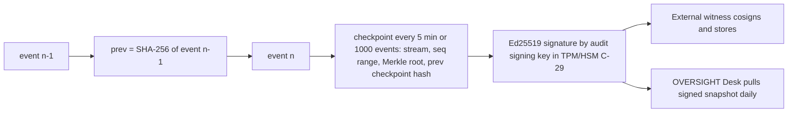

# 20 — Logging and Auditing
Status: Draft v1.0 · Edition applicability: both (CE: full audit architecture, local witness option; EE: SIEM export gateway C-26, WORM export, managed witness) · Owner: Audit & Observability team

## 1. Purpose and scope

Defines the privacy-preserving audit and logging architecture (ADR-016): event classes, the complete event schema catalog, prohibited fields, the typed logging API, configuration of tor, web server, journald and kernel logging, integrity (hash chains, signed checkpoints, external witness), access control, retention, export control, SIEM allow-list (C-26), investigator-activity auditing without source metadata, and safeguards against enabling dangerous logging.

**Protection statement.**
- WHAT: source anonymity and report confidentiality against leakage through logs, metrics, traces and crash data; integrity of the record of staff actions.
- FROM WHOM: anyone who later obtains logs (hosting provider, SIEM operators, vendor support, attackers, legal compulsion — THR-016, THR-026, THR-030); insiders who would alter logs to hide misuse (THR-018, THR-037).
- ASSUMPTIONS: the typed logging API is the only log path in trust-path code (enforced by CI); the external witness is operated independently of the instance operator; host OS log configuration is applied by the installer and verified by C-25 (to be registered in `40-SECURITY-ASSUMPTIONS.md`).
- RESIDUAL RISK: third-party components (kernel, tor, PostgreSQL) may emit unexpected messages; exact timestamps of staff actions can correlate with submission windows; a compromised host can log anything in real time regardless of configuration.

Guiding rule: **log staff actions richly, source activity never.** Accountability applies to people with power over reports (INC-22, INC-68); sources get none of it (REQ-H-60).

## 2. Context and dependencies

| Doc | Relationship |
|---|---|
| `DECISIONS.md` ADR-009, 010, 016, 017, 018, 023, 028 | binding |
| `03-PRIVACY-ANONYMITY.md` | metadata inventory; compelled-disclosure inventory |
| `14-CASE-MANAGEMENT.md` | case events, custody binding, metrics k-thresholds |
| `15-AUTHENTICATION-AUTHORIZATION.md` | who may read/export audit; dual control |
| `16-TOR-I2P.md` | tor configuration (this doc specifies only logging directives) |
| `17-INFRASTRUCTURE.md` | host hardening; journald/kernel baseline |
| `21-ENTERPRISE.md` | SIEM integration packaging |
| `32-OPERATIONS.md` | CFG classes, diagnostic procedures |
| `35-DATA-RETENTION-DELETION.md` | retention of audit streams, case tombstones |

Components: C-24 Audit Log Service, C-26 SIEM export gateway, C-25 Health/Self-test Agent, C-05/C-06/C-07/C-08 (Z-INTAKE), C-10, C-21, C-22, C-15 (Desk-originated events), C-19.

## 3. Event classes

| Class | Content | Producers | Stored in | Readers | Default retention |
|---|---|---|---|---|---|
| SECURITY | authentication, authorization denials, admin/config changes, key directory changes, enrollment, dual-control approvals, break-glass, integrity alarms | C-21, C-22, C-19, C-14, C-25, C-10 | C-24 stream `sec` | SECURITY_OFFICER, AUDITOR, OVERSIGHT (read), SYS_ADMIN (own actions) | 400 days |
| CASE | staff actions on cases/evidence using pseudonymous case IDs | C-10, C-15 (signed by staff key), C-22 | C-24 stream `case` | AUDITOR, OVERSIGHT; CASE_LEAD for own cases | case lifetime + 1 year, then tombstone (35) |
| SYSTEM | health, capacity, job outcomes, update status | C-25, all services (typed) | C-24 stream `sys` | SYS_ADMIN, SECURITY_OFFICER | 30 days |
| SOURCE-SENSITIVE | never emitted as events; only aggregate counters released under k-threshold and coarse time | C-08/C-09 counters | C-24 counters table | METRICS_VIEWER, OVERSIGHT via k-suppressed reports | 13 months of monthly counters |

Z-INTAKE hosts (C-05..C-08) emit **only** SYSTEM events and SECURITY events about administrative access to those hosts; they emit no CASE events and no per-request events of any kind.

## 4. Common event envelope

All events are canonical CBOR (deterministic encoding, RFC 8949 §4.2), signed per checkpoint (§8), schema-versioned.

| Field | Type | Notes |
|---|---|---|
| `v` | u8 | envelope version |
| `stream` | enum sec/case/sys | |
| `seq` | u64 | monotonic per stream, no gaps |
| `type` | enum (catalog §5) | |
| `ts` | UTC timestamp | SECURITY/CASE: millisecond; SYSTEM: second; Z-INTAKE SYSTEM events: truncated to the hour (§6.2) |
| `tenant` | tenant ID | |
| `host_role` | enum (intake, core, monitor, desk) | not hostname/IP |
| `actor` | staff user ID or `system:<service>` | never a source identifier |
| `actor_person` | `person_ref` | for dual-control/COI accountability |
| `session` | truncated SHA-256 (64-bit) of session ID with per-day salt | correlates one session's actions within a day only |
| `device` | Desk device key ID (staff) | not OS/UA |
| `outcome` | enum ok/denied/error | |
| `reason` | enum code | never free text |
| `payload` | type-specific map (§5), allow-listed | |
| `prev` | 32 bytes | SHA-256 of previous event encoding (hash chain) |

`ts` may be exact for staff actions (ADR-010). No event carries `received_day` or `import_batch` except `case.imported` (see §5.2 note).

## 5. Event schema catalog

Payload fields not listed are forbidden. Types: `CaseRef` (pseudonymous case ID), `EvidRef` (`evid_id`), `UserRef`, `RoleEnum`, `Level` (L0–L4), `Code` (enumerated).

### 5.1 SECURITY events

| Type | Payload fields |
|---|---|
| `auth.login_succeeded` | method (FIDO2/PIV/TOTP/SSO+FIDO2), aal, authenticator_aaguid_class (certified/uncertified), audience |
| `auth.login_failed` | method, failure_code (BAD_ASSERTION, UV_MISSING, UNKNOWN_CREDENTIAL, SUSPENDED, IDP_REJECTED), audience |
| `auth.stepup_succeeded` / `auth.stepup_failed` | operation_class, descriptor_hash_prefix (8 bytes) |
| `auth.logout` / `auth.session_expired` / `auth.session_revoked` | reason_code |
| `auth.authenticator_enrolled` / `auth.authenticator_removed` | aaguid_class, count_after |
| `auth.totp_fallback_used` | — |
| `user.created` / `user.deactivated` / `user.reactivated` / `user.suspended_dormant` | target UserRef, source (MANUAL/SCIM) |
| `user.enrollment_approved` | target UserRef, approver UserRef |
| `role.assigned` / `role.revoked` / `role.expired` | target UserRef, role |
| `authz.denied` | action, resource_kind, reason_code (NO_RELATION, COI_EXCLUDED, TENANT_MISMATCH, STEP_UP_REQUIRED, DUAL_CONTROL_REQUIRED, STATE_INVALID) — resource ID only if the actor already has metadata access to it |
| `approval.created` / `approval.granted` / `approval.consumed` / `approval.expired` | dc_code (DC-01..DC-14), approver UserRef |
| `breakglass.requested` / `breakglass.approved` / `breakglass.expired` / `breakglass.reviewed` | CaseRef, reason_code, duration_min, review_outcome |
| `cfg.changed` | key, class (SAFE/WEAKENING/DANGEROUS), old_value_hash, new_value (only for enumerated/boolean keys; else hash) |
| `cfg.dangerous_enabled` / `cfg.dangerous_disabled` / `cfg.dangerous_expired` | key, expiry |
| `keydir.entry_published` | entry_kind (USER_KEY, RG_EPOCH_KEY, CHANNEL_DESCRIPTOR, RELEASE), entry_hash |
| `keydir.consistency_failure` | observer, detail_code |
| `audit.checkpoint_signed` | stream, seq_range, root |
| `audit.witness_cosigned` / `audit.witness_failed` | witness_id, checkpoint_seq |
| `audit.verification_failed` | stream, seq, failure_code |
| `audit.exported` | stream, seq_range, destination_class, approvers |
| `secret.placement_violation` | host_role, secret_kind (ADR-028) |
| `selftest.logging_violation` | host_role, check_code (e.g., TOR_LOG_ENABLED, ACCESS_LOG_PRESENT, JOURNAL_PERSISTENT) |
| `update.applied` / `update.rejected` | component, version, reason_code |
| `backup.completed` / `backup.restore_performed` | backup_id, scope |
| `tenant.created` / `tenant.deleted` (EE) | tenant |

### 5.2 CASE events

| Type | Payload fields |
|---|---|
| `case.imported` | CaseRef, rg_id, received_day (date), import_batch_bucket (batch number rounded down to multiple of 10) |
| `case.state_changed` | CaseRef, from_state, to_state |
| `case.assigned` / `case.member_added` / `case.member_removed` | CaseRef, target UserRef, relation, reason_code (COI/REVOKED/EXPIRED/REQUESTED) |
| `case.rekeyed` | CaseRef, key_generation |
| `case.coi_attested` | CaseRef, attester UserRef |
| `case.coi_exclusion_applied` | CaseRef, `excluded_count` (identities of excluded users are not logged: naming them would reveal who is concerned by the report) |
| `case.sla_reminder` / `case.sla_breached` / `case.sla_extended` / `case.sla_paused` / `case.sla_resumed` | CaseRef, timer_id, due_date |
| `case.canary_escalated` | CaseRef or pending-envelope bucket, trigger_code (C1–C5) |
| `case.dismiss_requested` / `case.dismiss_approved` / `case.closure_approved` / `case.reopened` / `case.referred` | CaseRef, reason_code, approver |
| `case.message_sent` | CaseRef, template_code (ACK/RFI/FEEDBACK/EXTENSION/CLOSURE/UNSEAL_NOTICE/CUSTOM) — no content, no length |
| `case.message_read` | CaseRef (staff reading source messages; source reads are NOT logged) |
| `case.opened` | CaseRef (staff opened case view) |
| `evidence.imported` | CaseRef, EvidRef, manifest_match |
| `evidence.opened` | CaseRef, EvidRef, level (L0–L4) |
| `evidence.transformed` | CaseRef, xform_id, operation, input count, output count |
| `evidence.exported` | CaseRef, package_id, evid count, destination_class, original (bool), approvers, psr_id |
| `evidence.deleted` | CaseRef, EvidRef, method |
| `custody.head` | CaseRef, custody_mac (HMAC-SHA-256 under case-derived key of the custody-log head; 14 §10) |
| `identity.unseal_requested` / `identity.unseal_approved` / `identity.unseal_denied` | CaseRef, legal_basis_code, approvers, notice_state (QUEUED/DEFERRED) |
| `legalhold.set` / `legalhold.released` | CaseRef, hold_ref |
| `case.disposed` | CaseRef, receipt_id |
| `case.data_purged` | CaseRef, reason_code (EU_ART17_IRRELEVANT) |
| `oversight.opened` | CaseRef, mode |
| `rg.config_changed` / `coi_map.changed` / `sla_pack.changed` | channel_id, rg_id, approvers, policy_hash |

`case.imported` note: `received_day` is already server-known (ADR-010); `import_batch_bucket` coarsens the batch number so the audit stream does not reproduce the C-09 pull timeline.

### 5.3 SYSTEM events

| Type | Payload fields |
|---|---|
| `sys.service_started` / `sys.service_stopped` / `sys.service_crashed` | service, version, exit_code (no core dump, no backtrace content) |
| `sys.health` | service, status, check_code |
| `sys.capacity` | resource (disk/mem/queue), percent_bucket (10% steps) |
| `sys.relay_pull` | outcome, batch_count_bucket (0, 1–9, 10–99, ≥100) — Z-CORE side only |
| `sys.tor_status` | bootstrap_percent, onion_published (bool), pow_enabled (bool) |
| `sys.job` | job_kind (RETENTION, EPOCH_ROTATE, CHECKPOINT, BACKUP), outcome |
| `sys.clock` | drift_ms_bucket, source_count |
| `sys.sandbox_image` | image_name, age_days (Desk-reported, optional) |

### 5.4 SOURCE-SENSITIVE counters (not events)

| Counter | Granularity stored | Release rule |
|---|---|---|
| `submissions_received` per channel | per `received_day` in C-08 ephemeral state; aggregated to month in C-24 | monthly, k ≥ 10 (GOVERNANCE) / k ≥ 20 (PUBLIC); per-day values never leave C-08 and are deleted after monthly aggregation |
| `source_logins` | month total per instance | k ≥ 20; never per channel |
| `replies_delivered` | month total | k ≥ 20 |
| `pow_difficulty_level` | daily max | SYSTEM class (not source-linked) |

## 6. Prohibited fields and data

### 6.1 Prohibited in every log, event, metric, trace, error message and crash artifact (all zones)

| # | Prohibited datum |
|---|---|
| P-01 | Any IP address or port of clients, Tor relays (incl. guard/vanguard relays), rendezvous points |
| P-02 | User-Agent, Accept-Language, other client HTTP headers, header ordering, TLS/HTTP fingerprints |
| P-03 | Exact time of any source action (upload, login, reply read), or any time finer than `received_day` associated with source activity |
| P-04 | Tor circuit IDs, stream IDs, rendezvous cookies, introduction-point details, onion service client auth data, PoW nonces/effort per request |
| P-05 | Request/response bodies, form fields, query strings, URL paths containing identifiers, cookies, session IDs (except the salted truncated staff session hash in §4) |
| P-06 | Source passphrases, codenames, lookup IDs, source public keys, source account IDs |
| P-07 | Filenames, declared MIME types, file sizes (exact or padded), counts of attachments per submission, content hashes |
| P-08 | Report content, message content, message lengths, questionnaire answers, categories finer than `category_class` |
| P-09 | Identity data from the Sealed Identity Store |
| P-10 | Key material, wraps, PRF outputs, tokens, nonces, approval descriptors (only 8-byte prefix permitted in `auth.stepup_*`) |
| P-11 | Envelope IDs, blob refs, batch contents, and any mapping from envelope to case |
| P-12 | Free-text strings in trust-path code logs (only enumerated codes) |
| P-13 | Stack traces or panic messages containing variable values in trust-path processes |
| P-14 | Hostnames and onion addresses, including the instance's own onion address (health events use the boolean `onion_published`) |
| P-15 | Staff workstation IP addresses and OS/UA strings (staff identity is by UserRef and device key; network metadata about staff is not needed and can reveal location patterns of investigators) |

### 6.2 Zone-specific rules

| Zone | Rule |
|---|---|
| Z-INTAKE | No per-request logs of any level; SYSTEM events with `ts` truncated to the hour and batched; journald volatile; max retention 48 h on host; logs never shipped off-host except SYSTEM events pulled by C-09 as part of sealed batch (optional) |
| Z-CORE | SECURITY/CASE/SYSTEM via typed API only; PostgreSQL `log_statement = none`, `log_min_error_statement = panic`, `log_connections = off`, `log_disconnections = off`, `log_line_prefix` without client host, no `auto_explain`, `log_min_duration_statement = -1` |
| Z-RCP (Desk) | Desk emits CASE/SECURITY events to C-10 over its API; local Desk logs are SYSTEM-class only, in memory ring buffer (1 MiB), written to disk only when the user exports a diagnostic bundle, which is scrubbed (REQ-H-56) |
| Z-VIEW | C-17 VMs emit no logs outside the fixed result schema (10 §12 H6) |
| Z-SOC | Receives only C-26 allow-listed events |

## 7. Typed logging API

- Crate `candor-audit` exposes `emit(event: AuditEvent)` where `AuditEvent` is a Rust enum with one variant per catalog type; each field has a newtype (`CaseRef`, `EvidRef`, `UserRef`, `Code<T>`, `DayDate`, `HourTs`). There is no variant taking `String` or `&str` except closed enums.
- Newtypes for sensitive data (`SourcePassphrase`, `LookupId`, `Filename`, `IpAddr` wrappers, `RequestBody`) do not implement `Debug`, `Display` or `Serialize` (compile-time prevention); `zeroize` on drop.
- Schema registry `audit/schema.yaml` is the source of truth; a build script generates the enum and a CI check compares generated code with the registry; any new field requires review label `audit-schema` and approval by two code owners (see `27-SECURE-DEVELOPMENT.md`).
- `tracing`/`log` usage: in trust-path crates, `clippy::disallowed_macros` bans `println!`, `eprintln!`, `dbg!`, `log::*!`, `tracing::*!` except through `candor-audit::diag!` which accepts only static strings and enumerated codes; release builds compile with `release_max_level_warn` for third-party crates and a global subscriber that drops all events not originating from `candor-audit`.
- Panics: `panic = "abort"` in release for trust-path binaries; custom panic hook prints only `panic: <crate>:<line>` code to stderr; `RLIMIT_CORE=0`, `prctl(PR_SET_DUMPABLE, 0)` (REQ-H-58).
- HTTP framework: no access-log middleware is linked in C-06/C-07; axum/tower `TraceLayer` banned in Z-INTAKE crates by `cargo-deny` feature bans / lint.
- Error responses to sources: generic codes only; no error IDs that map to server-side logs of source requests.

## 8. Integrity: hash chain, checkpoints, witness

| Element | Specification |
|---|---|
| Chain | `prev` = SHA-256(canonical CBOR of previous event) per stream; `seq` gapless |
| Batching | Merkle tree (RFC 6962-style hashing, SHA-256) over events in a checkpoint interval |
| Checkpoint | every 5 min or 1,000 events, whichever first; contains stream, first/last seq, Merkle root, previous checkpoint hash, time |
| Signing key | Ed25519 audit key per instance, non-exportable in TPM 2.0 (CE) or HSM (EE, C-29); public key in C-14 |
| Witness | at least one external witness cosigns each checkpoint within 1 h: options (a) OVERSIGHT-operated witness service (CE package `candor-witness`), (b) a Sigsum-style witness network, (c) EE managed witness. Witness stores checkpoints (not events) |
| Verification | `candorctl audit verify` recomputes chain and Merkle roots, validates signatures and witness cosignatures; C-25 runs it hourly on the last 24 h, daily full |
| Alarm | verification failure → `audit.verification_failed` (SECURITY) + content-free notification to OVERSIGHT + SECURITY_OFFICER |
| Truncation defence | witness holds latest checkpoint; rollback detected when instance presents older head |

## 9. Access controls on logs

- C-24 storage: PostgreSQL schema `audit` owned by the C-24 service role; append-only via `INSERT`-only grants and triggers rejecting `UPDATE`/`DELETE` except the retention job role, which may delete only whole checkpoint intervals older than retention after writing a retention tombstone event.
- Reads via C-10 API with C-22 decisions (15 §5.2 `audit.read *`); raw DB access for SYS_ADMIN is to encrypted-at-rest storage only (Z-CORE disk); SYS_ADMIN DB role has no `SELECT` on `audit.case`.
- CASE stream: CASE_LEAD sees events for own cases; AUDITOR/OVERSIGHT see all CASE events of tenant.
- Every audit read of CASE stream by AUDITOR/OVERSIGHT is itself a SECURITY event `audit.read` (payload: stream, filter_kind, result_count_bucket).

## 10. Auditing investigator activity without source-identifying metadata

| Question an auditor needs answered | Available from | Source-safe because |
|---|---|---|
| Who opened which case/evidence, when, at which containment level | `case.opened`, `evidence.opened` | pseudonymous CaseRef/EvidRef; no content, names, hashes |
| Who exported what, with whose approval | `evidence.exported`, `approval.*` | counts and destination classes only |
| Were COI rules followed | `case.coi_attested`, `case.coi_exclusion_applied`, `case.member_*` | no persons-concerned identities |
| Was anyone's identity unsealed and why | `identity.unseal_*` | legal basis codes; no identity |
| Did someone read many cases unusually (LOVEINT-style) | anomaly rules over `case.opened` rates per user (e.g., > 3× 30-day median or > 20 distinct cases/day) → alert to OVERSIGHT (REQ-H-69) | operates on staff events only |
| Was a report suppressed | SLA/canary events, state changes, witness-checked continuity | no content |

Not available by design: which source, when a source logged in, what they uploaded.

## 11. Host and daemon logging configuration

### 11.1 tor (C-05)

| Directive | Value | Reason |
|---|---|---|
| `Log` | `notice stderr` → captured by journald (volatile) | minimal operational visibility |
| `SafeLogging` | `1` | scrub addresses (default, pinned explicitly) |
| `LogTimeGranularity` | `3600000` (1 h) | coarsen timestamps (Knowledge (unverified): directive semantics in ms) |
| `LogMessageDomains` | `0` | |
| `TruncateLogFile` | n/a (no file logging) | |
| `HiddenServiceStatistics` | `0` | no statistics |
| `ControlPort` | Unix socket only, cookie auth, never used for event logging (`SETEVENTS` of CIRC/STREAM forbidden in our controller) | circuit events are P-04 |
| `DisableDebuggerAttachment` | `1` | |
| Arti (future) | equivalent: `logging.console = "notice"`, `logging.log_sensitive_information = false`, no file sinks | |

Self-test check (C-25): tor config parsed; any `Log ... file`, `debug`/`info` level, or `SafeLogging 0` → `selftest.logging_violation` + deployment marked non-compliant (and published status per §13).

### 11.2 Web server (C-06) and any reverse proxy

- C-06 is a Rust axum service with no access-log layer; listens on Unix socket from tor (REQ-H-33).
- If a static-file server or proxy (e.g., nginx) is used in any profile: `access_log off;` `error_log /dev/null crit;` `log_not_found off;` `server_tokens off;` (B-SD-21: SecureDrop Apache `ErrorLog /dev/null`, `LogLevel crit`, no CustomLog). Self-test greps active config.
- Error pages contain no hostnames/IPs/versions (REQ-H-34).

### 11.3 journald / syslog

| Host | Setting |
|---|---|
| Z-INTAKE | `Storage=volatile`, `RuntimeMaxUse=64M`, `MaxRetentionSec=2day`, `ForwardToSyslog=no`, `ForwardToWall=no`, `Audit=no`; rsyslog not installed |
| Z-CORE | `Storage=persistent` on encrypted volume, `MaxRetentionSec=30day`, `SystemMaxUse=1G`, `ForwardToSyslog=no`; application events go through C-24 not journald |
| Desk (C-16) | Desk writes no journald entries except start/stop codes |

### 11.4 Kernel and system

| Item | Setting (Z-INTAKE mandatory; Z-CORE recommended) |
|---|---|
| Netfilter logging | no `LOG`/`NFLOG` targets in nftables rulesets (would record relay/guard IPs: P-01); self-test checks ruleset |
| `kernel.printk` | `3 3 3 3` |
| `kernel.dmesg_restrict` | `1` |
| Core dumps | `kernel.core_pattern=|/bin/false`, `fs.suid_dumpable=0`, systemd-coredump masked, `LimitCORE=0` in all units (REQ-H-58) |
| auditd | installed on Z-CORE for SECURITY (admin logins, sudo, key file access); on Z-INTAKE only rules for admin SSH/sudo and file integrity of config; **no** `execve` argument capture for tor/C-06/C-07 users; logs volatile ≤ 48 h |
| Swap | disabled on Z-INTAKE hosts |
| Crash reporters (apport, abrt, kdump) | removed |
| Process accounting (`acct`) | not installed |
| SSH (admin, onion-only) | `LogLevel INFO` for accountability of admin logins (peer address is loopback via tor, so no network identity is recorded); on Z-INTAKE retained ≤ 48 h in volatile journald |

## 12. Retention

| Stream | Default | Min / Max configurable | Deletion method |
|---|---|---|---|
| SECURITY | 400 days | 90 days / 7 years | delete whole checkpoint intervals; retention tombstone event keeps chain continuity (tombstone includes last deleted checkpoint root) |
| CASE | case lifetime + 1 year | case lifetime / case lifetime + 10 years | per-case redaction: at case disposal, CASE events are replaced by a single `case.disposed` tombstone retaining only CaseRef, disposal date and count of removed events; chain continuity preserved via checkpoint roots (35) |
| SYSTEM | 30 days | 7 / 90 days | interval deletion |
| Z-INTAKE host logs | 48 h | 0 / 7 days (REQ-H-60 ceiling) | volatile storage |
| Witness checkpoints | 7 years | — | witness policy |
| SOURCE-SENSITIVE monthly counters | 13 months | 13 / 60 months | row deletion |

Legal hold (35) can extend CASE retention for held cases.

## 13. Export control and SIEM allow-list (C-26, EE)

- Only SECURITY and SYSTEM events may be exported; CASE events never leave C-24 except through audit export (dual control DC-10) to an encrypted file for an auditor.
- C-26 applies an allow-list per event type (below); it drops all other fields and events, re-serializes to the SIEM format (JSON/CEF/Syslog RFC 5424 over mTLS), and signs batches.

| Event type | Exported fields |
|---|---|
| `auth.login_succeeded` / `auth.login_failed` | ts, tenant, actor (enterprise username mapping optional, configurable), method, aal, outcome, failure_code |
| `auth.stepup_failed` | ts, actor, operation_class |
| `user.*`, `role.*` | ts, actor, target, role |
| `authz.denied` | ts, actor, action, reason_code (no resource ID) |
| `cfg.changed`, `cfg.dangerous_*` | ts, actor, key, class |
| `audit.verification_failed`, `audit.witness_failed` | ts, stream, failure_code |
| `selftest.logging_violation`, `secret.placement_violation` | ts, host_role, check_code |
| `update.*`, `backup.*` | ts, component/backup_id, outcome |
| `sys.service_*`, `sys.health`, `sys.capacity`, `sys.clock` | ts, service, status, bucketed values |
| `breakglass.*` | ts, reason_code, duration (no CaseRef) |

- Export rate limiting / batching: batches every 5 min, jittered; Z-INTAKE-derived SYSTEM events hourly.
- Changing C-26 destinations with the allow-list unchanged is a SAFE configuration (step-up required); any allow-list extension is DANGEROUS (dual control DC-09) and requires a schema review record.

## 14. Preventing accidental dangerous logging

| Safeguard | Detail |
|---|---|
| Compile-time | Typed API, disallowed macros, no access-log crates in Z-INTAKE builds (§7) |
| No runtime debug level in trust path | release builds cannot raise trust-path verbosity; `RUST_LOG` ignored by trust-path binaries |
| Diagnostic mode (DANGEROUS) | Only mode that increases SYSTEM detail (e.g., per-service timing histograms, still no P-01..P-15 fields); requires DC-09 dual approval; max duration 4 h, auto-expires; cannot be enabled on Z-INTAKE unless additionally approved by OVERSIGHT |
| Banner | while any DANGEROUS config is active: red banner in Admin Console and all Desks; C-25 includes `dangerous_config_active=true` in the signed instance status published via C-14; Tier V clients display a warning to sources before submission; Tier W landing page shows a notice |
| Self-test | C-25 hourly: tor config, web/proxy config, journald config, nftables LOG rules, coredump settings, presence of unexpected log files under `/var/log` on Z-INTAKE (allow-list of paths), process list for known loggers (tcpdump, strace) → violation events |
| Installer | installer writes configs and verifies them; failure = deployment failure (ADR-028 pattern) |
| Support bundles | `candorctl support-bundle` includes only SYSTEM events and config hashes, runs a canary scrubber, and shows the bundle to the admin before export (REQ-H-56) |

## 15. Requirements

| ID | Requirement | Evidence | Threats | Component | Verification |
|---|---|---|---|---|---|
| LOG-001 | Trust-path code SHALL emit logs only through the `candor-audit` typed API with one enum variant per catalog event and no free-text string fields. | ADR-016; INC-60 | THR-016; THR-038 | C-24; all trust-path | TST: `clippy::disallowed_macros` CI job; compile-fail tests for string payloads |
| LOG-002 | Sensitive newtypes (passphrases, lookup IDs, filenames, IP wrappers, request bodies, keys) SHALL NOT implement Debug, Display or Serialize. | INC-60; INC-58 | THR-016 | C-11; C-06; C-07 | TST: compile-fail tests; INSP: trait audit |
| LOG-003 | No log, event, metric, trace, error message or crash artifact SHALL contain any prohibited datum P-01..P-15. | ADR-016; REQ-H-60; INC-03; INC-60 | THR-001; THR-011; THR-016; THR-038 | all | TST: canary run (canary IP-like headers, UA, filenames, passphrase, content, hashes submitted via every endpoint in Tier W and Tier V) then grep of all sinks (journald, C-24, SIEM output, backups, support bundle) = 0 hits; AT (30): logging canary suite |
| LOG-004 | Z-INTAKE components SHALL NOT produce per-request log records at any level, and their SYSTEM events SHALL have timestamps truncated to the hour. | ADR-010; B-SD-21 | THR-001; THR-011 | C-05; C-06; C-07; C-08 | TST: 1,000 requests produce 0 journald lines from C-06/C-07; timestamp truncation assertion |
| LOG-005 | tor SHALL be configured with `SafeLogging 1`, notice level to stderr only, `LogTimeGranularity` 1 h, `HiddenServiceStatistics 0`, and no controller subscription to circuit or stream events. | ADR-016; INC-34 | THR-001; THR-005 | C-05 | TST: C-25 config check; INSP: controller code has no SETEVENTS CIRC/STREAM |
| LOG-006 | Any web server or proxy in Z-INTAKE SHALL have access logging disabled and error logging to /dev/null at critical level, and error pages SHALL contain no hostnames, IPs or versions. | B-SD-21; REQ-H-34 | THR-001; THR-016 | C-06 | TST: self-test config grep; HTTP error page snapshot |
| LOG-007 | Z-INTAKE journald SHALL use volatile storage with ≤ 48 h retention and no forwarding; nftables rulesets SHALL contain no LOG/NFLOG targets; core dumps and crash reporters SHALL be disabled. | REQ-H-58; REQ-H-60 | THR-016; THR-031 | C-05; C-06; C-07; C-08 | TST: C-25 checks; SIGSEGV test produces no core |
| LOG-008 | PostgreSQL SHALL be configured with statement, connection and duration logging disabled on all instances holding case or intake data. | INC-60 | THR-016 | C-08; C-12 | TST: config check; query with canary literal absent from PG logs |
| LOG-009 | Desk local logs SHALL be kept in a 1 MiB memory ring buffer and written to disk only in a user-initiated diagnostic bundle that is scrubbed of tokens, content and identifiers. | REQ-H-56; INC-56 | THR-016; THR-027 | C-15 | TST: canary tokens in Desk session absent from bundle; filesystem audit shows no log files |
| LOG-010 | C-17 viewer VMs SHALL NOT send logs to any shared logging service. | B-SD-34 (CVE-2025-24889) | THR-023 | C-17 | INSP: VM image has no log shipper; TST: vsock protocol accepts only result schema |
| LOG-011 | SOURCE-SENSITIVE data SHALL be recorded only as counters; per-day values SHALL remain in C-08 ephemeral state and be deleted after monthly aggregation; released counters SHALL obey the k-thresholds of `14-CASE-MANAGEMENT.md` §14. | ADR-016; REQ-H-74; INC-74 | THR-039; THR-011 | C-08; C-24 | TST: daily counter absent after aggregation; release below k suppressed |
| LOG-012 | Staff-session correlation in events SHALL use only a 64-bit truncated SHA-256 of the session ID with a per-day salt, and staff network addresses and UA strings SHALL NOT be logged. | ADR-016 | THR-038 | C-21; C-24 | TST: schema test; cross-day correlation impossible (salts rotate) |
| LOG-013 | `case.imported` events SHALL carry only `received_day` and a batch number coarsened to multiples of 10, and no event SHALL map envelopes to cases. | ADR-010 | THR-011 | C-10; C-24 | TST: schema test |
| LOG-014 | The audit schema registry SHALL be the single source of truth; adding or changing a field SHALL require the `audit-schema` review label and two code-owner approvals. | ADR-016 | THR-016; THR-024 | C-24; C-30 | INSP: branch protection config; TST: CI registry/code drift check |
| LOG-015 | Trust-path release binaries SHALL abort on panic without printing variable values and SHALL run with core dumps disabled and non-dumpable process flag. | REQ-H-58; INC-58 | THR-016; THR-013 | C-06; C-07; C-10; C-11 | TST: induced panic output inspection; `/proc/<pid>/status` dumpable=0 |
| LOG-016 | Diagnostic mode SHALL be the only way to increase logging detail, SHALL be a DANGEROUS configuration requiring dual approval, SHALL expire within 4 h, SHALL require OVERSIGHT approval on Z-INTAKE, and SHALL still exclude P-01..P-15. | ADR-016; THR-035 | THR-035; THR-016 | C-19; C-25 | TST: enable without second approver fails; auto-expiry; canary test during diagnostic mode = 0 hits |
| LOG-017 | While any DANGEROUS configuration is active, Admin Console and Desk SHALL show a banner, the signed instance status in C-14 SHALL indicate it, and Tier V clients and the Tier W landing page SHALL warn sources before submission. | ADR-016; ADR-002 | THR-035; THR-040 | C-19; C-15; C-14; C-03; C-06 | TST: UI snapshots; status flag verification in Tier V |
| LOG-018 | C-25 SHALL hourly verify logging configuration (tor, web/proxy, journald, nftables, coredump, unexpected log files, known capture tools) and SHALL raise `selftest.logging_violation` on any deviation. | ADR-028; INC-34 | THR-035; THR-016 | C-25 | TST: inject each violation; event within 1 h |
| LOG-019 | Support bundles SHALL contain only SYSTEM events and configuration hashes, SHALL pass a canary scrubber, and SHALL be shown to the administrator before export. | REQ-H-56; INC-56 | THR-027; THR-016 | C-19; C-36 | TST: canary bundle test |
| AUD-001 | C-24 SHALL maintain separate SECURITY, CASE and SYSTEM streams, each hash-chained with gapless sequence numbers. | ADR-016 | THR-037; THR-018 | C-24 | TST: chain verification; deletion of a middle event detected |
| AUD-002 | C-24 SHALL produce a Merkle checkpoint every 5 min or 1,000 events, signed with a non-exportable Ed25519 key in TPM or HSM whose public key is published in C-14. | ADR-016; REQ-H-68 | THR-037; THR-018 | C-24; C-29; C-14 | TST: checkpoint cadence; key non-exportability test via TPM/HSM policy |
| AUD-003 | At least one external witness independent of the instance operator SHALL cosign each checkpoint within 1 h; missing cosignature SHALL raise `audit.witness_failed`. | ADR-016; INC-68; INC-22 | THR-037; THR-018 | C-24 | TST: witness offline simulation; rollback attempt detected by witness |
| AUD-004 | `candorctl audit verify` SHALL validate chains, Merkle roots, signatures and witness cosignatures; C-25 SHALL run it hourly for 24 h and daily for full history, and failures SHALL notify OVERSIGHT and SECURITY_OFFICER content-free. | ADR-016; ADR-017 | THR-037 | C-24; C-25; C-23 | TST: tamper fixtures (modified payload, reordered, truncated, forged signature) all detected |
| AUD-005 | Audit storage SHALL be append-only for the service role; only the retention job role SHALL delete, only whole checkpoint intervals beyond retention, and only after writing a retention tombstone. | ADR-016; ADR-025 | THR-037; THR-018 | C-24; C-12 | TST: UPDATE/DELETE as service role fails; retention tombstone present |
| AUD-006 | CASE events SHALL be readable only by AUDITOR and OVERSIGHT (all tenant cases) and CASE_LEAD (own cases); SYS_ADMIN SHALL have no read access to the CASE stream; every AUDITOR/OVERSIGHT read SHALL be logged. | ADR-015; INC-22 | THR-018; THR-020 | C-24; C-22 | TST: role access tests; audit.read events present |
| AUD-007 | Each staff action on a case or evidence (open, import, transform, export, delete, message send/read, membership change, approval, unseal) SHALL produce a CASE event per the §5.2 catalog. | ADR-016; REQ-H-22 | THR-019; THR-037 | C-10; C-15; C-24 | TST: action-to-event coverage test across Desk flows |
| AUD-008 | Anomaly detection over staff CASE events SHALL alert OVERSIGHT when a user opens > 3× their 30-day median of distinct cases per day or > 20 distinct cases per day (configurable). | REQ-H-69; INC-68; INC-69 | THR-019 | C-10; C-23 | TST: synthetic access burst triggers alert within 15 min |
| AUD-009 | Audit export SHALL require dual approval (DC-10), SHALL produce an encrypted, signed file including checkpoint proofs, and SHALL be logged. | ADR-018 | THR-029; THR-016 | C-24; C-22 | TST: single-approver export denied; export verifies offline |
| AUD-010 | C-26 SHALL export only SECURITY and SYSTEM events, only fields in the §13 allow-list, and SHALL drop all other events and fields; extending the allow-list SHALL be a DANGEROUS configuration. | ADR-016; ADR-018; B-GL-04 | THR-016; THR-029 | C-26 | TST: full-catalog replay through C-26; output fields ⊆ allow-list; CASE events count = 0 |
| AUD-011 | Retention defaults SHALL be SECURITY 400 days, CASE case lifetime + 1 year, SYSTEM 30 days, Z-INTAKE host logs 48 h (max 7 days), with configuration bounds per §12. | REQ-H-60; B-CO-12 | THR-016; THR-017 | C-24 | TST: retention job fixtures; bounds enforced |
| AUD-012 | At case disposal, CASE events for the case SHALL be replaced by a tombstone retaining only CaseRef, disposal date and removed-event count, preserving chain verifiability through checkpoint roots. | ADR-025 | THR-017; THR-037 | C-24 | TST: post-disposal verify passes; case events absent |
| AUD-013 | Audit events originating from Desk actions SHALL be signed by the staff member's Desk identity key and C-24 SHALL reject unsigned or mis-signed Desk events. | ADR-007 | THR-037; THR-018 | C-15; C-24 | TST: forged event rejected |
| AUD-014 | The OVERSIGHT Desk SHALL retrieve signed checkpoint snapshots at least daily and verify them independently of the instance. | INC-22; REQ-H-68 | THR-018; THR-020 | C-15; C-24 | TST: see CASE-019; stale snapshot alert |
| AUD-015 | The audit clock SHALL be synchronized via authenticated time from ≥ 2 sources; drift > 5 min SHALL be recorded as `sys.clock` and flagged in checkpoints. | Design | THR-043 | C-24; C-25 | TST: drift injection |

## 16. Residual risks and limitations

1. **Live host compromise.** An attacker controlling a Z-INTAKE host at runtime can capture anything (tcpdump, memory); configuration-based no-logging protects only against after-the-fact log collection and compulsion to produce existing records (THR-014).
2. **Staff timestamps.** Exact staff-action timestamps (ADR-010) near `case.imported` can narrow submission time in quiet instances; batching at C-09 and staff workflow delays are the only mitigation.
3. **Third-party emitters.** Kernel, firmware, hypervisor and cloud-provider logs (THR-030) are outside our control on PRIVATE-CLOUD/MANAGED profiles.
4. **Audit as a target.** CASE audit reveals investigation patterns (which cases are active, who works them); compulsion of the audit stream exposes investigator behaviour, not sources.
5. **Witness collusion.** If the witness is operated by the same party as the instance, rollback detection fails.
6. **Counter inference.** Monthly counters with k ≥ 10 can still reveal "at least N reports this month" in small tenants.

## 17. Open issues

1. OI-20-1: Choose witness protocol (Sigsum witness API vs a Candor-specific cosigning service) with `28-SUPPLY-CHAIN.md` (which uses Sigsum/Rekor for releases).
2. OI-20-2: Tor `LogTimeGranularity` semantics and Arti equivalents need confirmation against current tor/Arti manuals (currently Knowledge (unverified)).
3. OI-20-3: Whether SIEM should receive enterprise usernames or only pseudonymous UserRefs; privacy of investigators vs SOC usability.
4. OI-20-4: Assumption IDs (typed-API exclusivity, witness independence, installer verification) to be registered in `40-SECURITY-ASSUMPTIONS.md`.

### Open Issues for ADR revision

- **ADR-010 exact staff timestamps vs import.** See `14-CASE-MANAGEMENT.md` Open Issues: recommend that ADR-010 explicitly exempt import-related events from exact timestamps (coarsen `case.imported.ts` to the hour) because import is the staff action most correlated with submission time.
