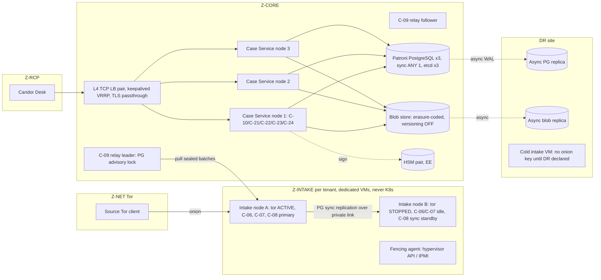

# 21 — Enterprise Edition: Features, High Availability, Multi-Tenancy, Integrations, Fleet
Status: Draft v1.0 · Edition applicability: EE (with CE boundary decisions) · Owner: Enterprise Platform team

## 1. Purpose and scope

This document specifies the Enterprise/Government Edition (EE) feature set. For each commercial feature it records **why the feature belongs in EE**, **whether it adds privacy risk**, and **how that risk is mitigated**. It also specifies:
- high-availability (HA) architecture, with every new metadata observer listed;
- multi-tenancy (divisions, subsidiaries, agencies) and the rules for when a dedicated instance is required (ADR-021);
- design for large organizations;
- safe integration patterns (ADR-018);
- the Enterprise Fleet Manager (C-34), which holds no onion-address database.

Out of scope:
- government-specific profiles (see `22-GOVERNMENT.md`);
- CE feature definition (see `23-COMMUNITY-EDITION.md`);
- licensing of each component (see `24-LICENSING-BUSINESS-MODEL.md`);
- control mappings (see `25-COMPLIANCE.md`).

Nothing in EE changes the anonymity, cryptography or logging-suppression properties defined for CE (DECISIONS §2, ADR-020). EE adds scale, organizational complexity, integrations, assurance evidence and vendor services.

## 2. Context and dependencies

| Topic | Document |
|---|---|
| Binding decisions | `DECISIONS.md` (ADR-008, -009, -013, -015, -016, -017, -018, -020, -021, -022, -023, -024, -028, -029) |
| Threat catalogue | `02-THREAT-MODEL.md` |
| Metadata minimization | `03-PRIVACY-ANONYMITY.md` |
| Key hierarchy | `04-CRYPTOGRAPHY.md` |
| Zones and hosts | `06-SYSTEM-ARCHITECTURE.md` |
| RLS and schema | `09-DATABASE.md` |
| Evidence objects | `10-FILE-EVIDENCE-PIPELINE.md` |
| Routing, COI and workflow | `14-CASE-MANAGEMENT.md` |
| SSO, PIV and roles | `15-AUTHENTICATION-AUTHORIZATION.md` |
| Onion services | `16-TOR-I2P.md` |
| Hosts, HSM and physical | `17-INFRASTRUCTURE.md` |
| Profiles | `18-DEPLOYMENT.md` |
| Backups and DR | `19-BACKUPS-DR.md` |
| Audit classes and SIEM allow-list | `20-LOGGING-AUDITING.md` |
| Government profile | `22-GOVERNMENT.md` |
| CE and parity | `23-COMMUNITY-EDITION.md` |
| License per component; telemetry | `24-LICENSING-BUSINESS-MODEL.md` |
| Compliance packs | `25-COMPLIANCE.md` |
| Dangerous configuration classes (CFG) | `32-OPERATIONS.md` |
| Updates | `33-RELEASE-UPDATE-SECURITY.md` |
| Sizing | `34-PERFORMANCE-SCALABILITY.md` |
| Retention and legal hold | `35-DATA-RETENTION-DELETION.md` |
| Disclosure and LTS governance | `36-OPEN-SOURCE-GOVERNANCE.md` |
| Assumptions | `40-SECURITY-ASSUMPTIONS.md` (ASM-*) |

## 3. Edition boundary rule (the "Charter test")

Each capability is placed by applying these tests in order. The first test that matches decides.

| # | Test | Result |
|---|---|---|
| T1 | Does the code sit in the Trust Path (DECISIONS §2: source-facing, plaintext, keys, build/sign/update, anonymity logging suppression)? | AGPL, in CE code. An EE *entitlement* may add only support, certification or packaging around it. |
| T2 | Would a single-organization CE deployment, used as intended, be **less safe for a source** without it? This covers source identification, content exposure, accused-person access, evidence loss and retaliation. | **CE feature.** It may have EE scale extensions. |
| T3 | Is it only needed because of organizational scale or complexity (many tenants, many instances, hierarchy, third-party systems)? | EE feature allowed. |
| T4 | Is it vendor labor, assurance or accountability (support, SLAs, certifications, hosting, LTS backports)? | EE service. |

**License classes** used below:
- **A**: AGPL, Trust Path or protection code, shipped in CE.
- **S**: EE commercial module. Source-available to customers and auditors. Runs only in Z-CORE, Z-ADM or Z-VENDOR. Never holds private keys. Never sees plaintext except through Export Packages (ADR-020).
- **V**: vendor service under contract (no code).
- **D**: data or content pack (see `25-COMPLIANCE.md` §8).

## 4. EE feature catalogue: rationale, privacy risk and mitigation

Column "CE baseline" is what CE ships for the same need (see `23-COMMUNITY-EDITION.md`). "Adds privacy risk?" answers whether *enabling* the EE feature creates new observers or data flows beyond CE.

### 4.1 Services and assurance

| # | Feature | Class | Why it belongs in EE | CE baseline | Adds privacy risk? | Mitigation |
|---|---|---|---|---|---|---|
| E01 | **Enterprise support** (named engineers, 24×7 P1) | V | Vendor labor (T4). It does not change protection. | Public docs, community forum, public advisories | **Yes.** Support staff become observers of deployment metadata. Support bundles can carry secrets (INC-56). Social engineering against support is a risk (INC-26). | Support bundles are generated only by `candorctl support-bundle`, scrubbed on-device with the allow-list from `20-LOGGING-AUDITING.md`, and previewed by the admin before upload (ENT-020). Vendor staff never hold Desk accounts or case keys (ENT-021). Support cannot reset, reveal or recover source access because none exists (ADR-005). Support tickets never contain onion addresses unless the customer pastes one; the ticket system auto-redacts `*.onion` (ENT-022). |
| E02 | **Contractual SLAs** (response, fix, availability) | V | Vendor accountability (T4). | Best-effort public security SLAs (`36-OPEN-SOURCE-GOVERNANCE.md`) | **Yes, indirect.** Availability SLAs create pressure for monitoring that measures intake usage. | Availability is measured with synthetic probes: the vendor's or customer's own Tor client fetches the landing page from outside. It is never measured from source-traffic logs (ENT-023). Security-fix SLAs apply equally to CE fixes. EE never gets a fix first (ENT-030). |
| E03 | **Professional deployment** (vendor engineers install or harden) | V | Vendor labor (T4). | Installer and SMB wizard (`23-COMMUNITY-EDITION.md`) | **Yes.** Vendor engineers become insiders with physical or console access (THR-027, THR-018). | Key ceremonies are performed by customer staff only. The engineer never touches tokens, onion keys or Recovery Quorum shares (ENT-024). The post-install Secret Placement Manifest verification report is signed by the customer admin (ADR-028). Engineer console sessions are recorded in the SECURITY audit class. |
| E04 | **Premium support** (TAM, quarterly architecture review, tabletop exercises) | V | Vendor labor (T4). | — | Same as E01. Architecture reviews expose topology. | Reviews use customer-redacted diagrams. No case metadata is discussed. The NDA includes a duty to resist compelled disclosure and to notify the customer where lawful. |
| E05 | **Managed hosting** (profile MANAGED, ADR-024) | V | Vendor operation (T4). | Self-host | **Yes, material.** The vendor and its hosting provider observe ciphertext, coarse intake metadata (`received_epoch_day`, sizes after padding), staff login metadata and the onion key custody. The vendor is compellable (THR-026, THR-027, THR-030). | One dedicated intake gateway and onion key per customer; no shared Z-INTAKE (ADR-021). Vendor cannot decrypt content: recipient keys stay on Desk (ADR-007). The vendor publishes a **compelled-disclosure inventory** listing exactly what it could produce (ENT-025, INC-01..07 lessons, REQ-H-06). Production access requires two vendor staff and is logged to a customer-visible stream (ENT-026). Hosting jurisdiction is chosen per customer and stated to sources on the landing page. Note: managed hosting can *reduce* risk where the reported-on organization would otherwise run the infrastructure (INC-22, REQ-H-22). |
| E06 | **Dedicated advisories** (customer-specific impact analysis, account-managed notification) | V | Vendor labor (T4). | Public advisories (GHSA, CVE, CSAF) | **Trust risk if misused.** Paying customers learning of flaws before CE users would breach the Charter. | Pre-notification lists are **criteria-based, never payment-based**. EE customers receive nothing earlier than the public advisory, except through the same criteria-based embargo list open to CE operators (`36-OPEN-SOURCE-GOVERNANCE.md`). "Dedicated" means configuration-specific impact analysis delivered *after* publication (ENT-030). |
| E07 | **Long-term support (LTS)** branches | V (labor) + A (code) | Backport labor (T4). | CE support window: current minor + previous minor for 90 days | **Trust risk.** A closed LTS branch would be un-auditable. | LTS source for trust-path code is published on release day. LTS binaries are reproducibly built and logged in the public transparency log. Anyone can rebuild them (ENT-031; lesson B-CO-64). LTS cadence: one LTS every 24 months, supported 60 months. |
| E08 | **FIPS-capable deployments** (CANDOR-FIPS-1 build profile, ADR-006) | A (code) + V (validated-module tracking, evidence) | The FIPS suite is Trust Path, so it is AGPL and anyone can build it. EE sells CMVP certificate tracking, security-policy conformance evidence, the approved-mode configuration guide and support (T4). | FIPS profile builds possible but unsupported | **No new observer.** Risk: FIPS mode replaces X-Wing with MLKEM1024-P384 and XChaCha with AES-256-GCM, which has nonce limits. The Tor transport is **not** FIPS-validated (Knowledge (unverified)). | Nonce management per `04-CRYPTOGRAPHY.md`. The limitation is documented in the GOV profile (`22-GOVERNMENT.md` §8): the content-confidentiality claim rests on HPKE, and the Tor layer is an anonymity layer. Module version pinned (B-CR-11, B-CR-12). |

### 4.2 Scale and availability

| # | Feature | Class | Why it belongs in EE | CE baseline | Adds privacy risk? | Mitigation |
|---|---|---|---|---|---|---|
| E09 | **High availability** (redundant app servers, DB replication, storage redundancy, failover) | S (orchestration) + A (the services themselves) | Availability for large organizations and 24×7 regulators (T3). Loss of availability does not reduce confidentiality for a CE source. The anonymous path fails closed to an outage page (ADR-002). | Single node, documented restore (RTO hours) | **Yes.** Replicas, load balancers, consensus stores and DR sites are new copies and new observers. See §5.4. | Every new element is listed in the §5.4 observer table with its data scope. No L7 proxy on the source path. Replica deletion lag is bounded (HA-006). Secret placement covers every node (HA-009). |
| E10 | **Clustering** (Patroni/etcd, K8s operator for Z-CORE) | S | T3. | — | **Yes.** The K8s control plane (etcd) stores Secrets, and API-server audit logs can capture request bodies. | Z-INTAKE is never on K8s (ADR-024). API-server audit policy is `Metadata` level only for Candor namespaces. Secrets are encrypted with a KMS provider backed by the HSM. The service mesh has access logs off (HA-012). |
| E11 | **Large-scale multi-tenancy** (shared instance for many subsidiaries or departments) | S (tenant admin) + A (RLS, per-tenant keys) | T3: CE is single-tenant by decision (ADR-021). | Single tenant, multiple channels | **Yes.** Co-residency (THR-045) and cross-tenant bugs (B-GL-37: CVE-2026-46648). | §6: per-tenant intake processes and DBs, RLS in core, dedicated-instance triggers. |
| E12 | **Fleet administration** (C-34) | S | T3: many instances. | `candorctl` per instance | **Yes.** A central inventory of whistleblowing instances is a high-value target and compellable (THR-026). | §9: opaque IDs, no onion addresses, pull-only, no case data, cannot push code or dangerous configuration. |
| E13 | **DR automation** (scripted site failover, restore drills) | S | T3/T4. CE has manual DR runbooks. | Manual restore and quarterly drill checklist | **Yes.** The DR site is another physical location and staff set (THR-031). Automation holds credentials. | DR restore needs the backup k-of-n quorum (INC-55). Automation credentials cannot unseal backups alone (HA-015). DR site is listed in §5.4. |

### 4.3 Organization and workflow

| # | Feature | Class | Why it belongs in EE | CE baseline | Adds privacy risk? | Mitigation |
|---|---|---|---|---|---|---|
| E14 | **Organization hierarchy** (group → tenant → division → channel) | S | T3. | Flat: organization → channels | **Yes.** Hierarchies invite "group sees all" inheritance. That is harmful when group executives are the accused (INC-22). | No downward inheritance of case access (TEN-006). Group-level views are k-thresholded aggregates only (ENT-012). |
| E15 | **Advanced workflow** (designer: custom states, tasks, forms, approvals) | S | T3: complex organizations. | Fixed ISO 37002 lifecycle (receive → assess → address → conclude) with SLA engine, tasks and templates | **Yes.** (a) Custom intake forms can ask identifying questions such as employee ID or department. (b) Workflow actions could emit content to notifications or integrations. | Form lint blocks identifying field types in ANONYMOUS channels (ENT-005). The workflow action allow-list excludes content egress (ENT-006). Designer changes are dual-approved and versioned. |
| E16 | **Configurable routing** (advanced rule engine) | S | T3: multi-attribute routing across subsidiaries, countries and languages. | **CE includes basic COI routing** (ADR-015; T2): channel → queue; routing to independent bodies (audit committee, ombudsman, external counsel); source-flagged "concerns: [roles]" exclusions; category rules such as SOX accounting → audit committee (B-CO-69); break-glass. | **Yes.** Complex rules can route a report to the accused. Routing attributes are metadata. | COI exclusions are evaluated **after** every rule and cannot be overridden (ENT-003). Rule simulation harness (ENT-004). Rule changes need dual approval. Routing attributes are limited to server-visible fields declared per channel (ENT-007). |
| E17 | **Advanced retention** (schedule import: NARA, LAC, state; multi-jurisdiction; disposition review; certificates) | S + D | T3/T4: records-law complexity. | **CE: per-channel retention, crypto-erasure (ADR-025), basic legal hold** | **Yes.** Longer retention increases compellable data. | Every retention period above 365 days needs a recorded legal basis. The Sealed Identity Store has its own shorter schedule (ENT-009). The source landing page shows the maximum retention (ENT-010). |
| E18 | **Legal holds (advanced)**: matter-level holds across cases and tenants, custodian notices, hold reports, eDiscovery export | S | T3. | **CE: per-case legal hold and sealed-matter flag** (blocks disposition, restricts circulation; R6 WB-36). Basic hold protects evidence and so stays in CE (T2). | **Yes.** Holds block deletion (THR-017). Hold reports enumerate cases. | Holds need dual approval, a reason code and a 90-day review reminder. Hold reports use pseudonymous case IDs. Holds never extend the Sealed Identity Store unless identity is itself named in the hold order (ENT-011). |
| E19 | **Advanced evidence management**: court-ready bundles, signed chain-of-custody reports, bulk review, local OCR and transcription at scale | S (bundle tooling) + A (anything that parses evidence runs in C-17) | T3/T4. | **CE: immutable original + sanitized derivative, hashes, custody records** (ADR-012) | **Yes.** External timestamping reveals timing. Bulk tools tempt server-side parsing. | Parsing only in C-17 (ADR-012). RFC 3161 timestamps are applied to a daily Merkle root, not per item, using the customer's own TSA (ENT-013). |
| E20 | **Advanced reporting** (regulator statistics such as EU Art 27 and PSDPA annual; board dashboards; cross-tenant aggregates) | S | T3/T4. | Basic KPIs with k-threshold (R6 WB-24) | **Yes.** Small cells and differencing (THR-039, INC-74). | k ≥ 20 by default, month granularity, complementary suppression, fixed report catalogue with no ad-hoc queries (ENT-012; `24-LICENSING-BUSINESS-MODEL.md` §9). |
| E21 | **Audit exports** (scheduled signed exports, WORM targets, auditor portal, OSCAL evidence) | S | T3/T4. | Local hash-chained audit log, CLI verify and manual export | **Yes.** CASE-class events show staff activity timing on cases (THR-038). | Default export covers SECURITY and SYSTEM only. CASE export is a dangerous configuration (dual approval), at day granularity, with per-export pseudonym salts (ENT-014). |
| E22 | **Policy management** (central signed policy bundles across tenants and instances) | S | T3. | Local configuration | **Yes.** Central policy could weaken many instances at once (THR-035). | Bundles can only *tighten* a security floor. Any change touching a CFG-dangerous option is refused remotely and must be approved locally (ENT-008, ENT-038). |
| E23 | **Compliance packs** (jurisdiction SLA clocks, calendars, notices, templates, exemption tags) | D + S (auto-fill) | T4: legal-review labor. | Pack format and loader (A); generic EU, SOX and PSDPA starter packs | **Low.** A pack is data but could embed a hostile configuration. | Pack schema allow-list. Packs cannot alter anonymity or logging configuration. Packs are signed (see `25-COMPLIANCE.md` §8). |

### 4.4 Keys and identity

| # | Feature | Class | Why it belongs in EE | CE baseline | Adds privacy risk? | Mitigation |
|---|---|---|---|---|---|---|
| E24 | **HSM** (network HSM for server-side keys) | A (integration code) + V (certified models, HA HSM, support) | Integration code is Trust Path and ships AGPL in CE (T1). EE sells certified configurations and support (T4). | TPM 2.0 sealing or software sealing (C-29) | **Low–medium.** The HSM appliance logs key-use times. A cloud HSM makes the provider an observer. | The HSM never holds content, case or recipient keys (ADR-007/008). HSM logs join the SECURITY class. Cloud HSM is allowed only in PRIVATE-CLOUD, with the observer documented. The server-side key inventory is in §5.3. |
| E25 | **PKCS#11** | A | T1. Same as E24. | Available | No new observer. | Library allow-list. Module path pinned by hash. |
| E26 | **Enterprise SSO** (OIDC/SAML, SCIM) | S (C-21 bridge) | T3: large staff directories. CE local WebAuthn accounts are phishing-resistant, so CE staff authentication is not weaker (B-CO-41). | Local WebAuthn/FIDO2 accounts | **Yes.** (a) The IdP becomes an observer of staff login times. (b) IdP compromise (THR-022) could create accounts. (c) SCIM can mass-add users. | SSO **never** grants key access. Case keys stay wrapped to Desk device keys. Adding a member to a case or channel needs an existing member's signed key-directory attestation (ENT-015). SCIM can create only *inactive* accounts and can only disable or remove; it cannot grant roles above `recipient-candidate` (ENT-016). Local WebAuthn step-up is required for key operations. |
| E27 | **PIV/CAC** | A (smart-card key wrapping on Desk, ADR-007) + S (federated PIV policy, FPKI path-validation configuration) | Smart-card wrapping is Trust Path, so it is in CE. Federal PKI integration is government-scale (T3/T4). | PIV/smart card as a Desk wrapping key | **Low.** OCSP requests leak staff login timing to the CA's responder. | Local CRL cache or OCSP stapling. No per-login OCSP to external responders by default (ENT-017). |
| E28 | **SIEM integration** (C-26 exporter: CEF, ECS, OCSF; Splunk and Sentinel apps) | S (transport and format) + A (**the scrubbing allow-list**) | Connectors to commercial SIEMs (T3). **Scrubbing is Trust Path (DECISIONS §2(e)) and runs in AGPL code before any EE module sees an event.** | Local scrubbed JSONL export of SECURITY and SYSTEM events | **Yes.** The SOC may report to the accused (INC-22). The SIEM is a long-retention copy (INC-60). | Exporter consumes only the already-scrubbed stream. CASE and SOURCE-SENSITIVE classes are never exported by default (ADR-016). Per-deployment canary test (ENT-018). |
| E29 | **Records-management integration** (C-40) | S | T3. | Manual Export Package | **Yes.** The records system (THR-029) retains long and is broadly searchable. | Export Package only (ADR-018). Sealed Identity Store is never exported. Archival format PDF/A plus JSON metadata with redaction applied (ENT-019). |

**Deliberately in CE (not EE)**, because T2 applies:
- basic COI routing and source-flagged exclusions;
- basic legal hold and sealed-matter flag;
- break-glass with dual authorization;
- Sealed Identity Store and unseal workflow (ADR-014);
- Recovery Quorum (ADR-013);
- retaliation and detriment check-ins (R6 WB-23);
- DSAR restriction workflow (R6 WB-15);
- the key-availability warning (a case with fewer than 2 active key holders);
- the scrubbing allow-list;
- the PKCS#11 and TPM integration code;
- FIPS profile source;
- WebAuthn;
- signed automatic updates;
- the security health dashboard.

## 5. High-availability architecture (profile EE-HA)

### 5.1 Topology



### 5.2 Components and parameters

| Layer | Design | Concrete parameters |
|---|---|---|
| Onion service availability | **Active/standby** per onion service. Only one Tor instance publishes descriptors at a time. Promotion follows successful fencing (STONITH) of the old active. Active/active through descriptor aggregation (e.g., Onionbalance, Knowledge (unverified)) is **not** in v1; it is listed in §13. | Health probe every 10 s. 3 consecutive failures lead to fencing and then promotion. Target intake RTO ≤ 10 min, including descriptor re-publication. Clients holding a cached old descriptor may fail until they refetch. This is documented. |
| Intake Store (C-08) | PostgreSQL streaming replication A→B, synchronous (`synchronous_commit=on`), on a dedicated private link inside Z-INTAKE. **No WAL archiving on intake.** | `archive_mode=off`; `wal_keep_size=256MB`; `max_wal_size=1GB`; `checkpoint_timeout=5min`. RPO for accepted submissions = 0. |
| Intake Relay (C-09) | ≥2 instances. Exactly one leader, elected with a PostgreSQL advisory lock in the core DB. The randomized pull schedule (ADR-009, 15±10 min) is preserved across leader change: the new leader draws a fresh random delay. | Lease 30 s. Pull batches are acknowledged idempotently by `batch_no`, so a duplicate pull is a no-op. |
| Case Service tier | ≥3 stateless nodes behind an **L4** load balancer in TLS passthrough. TLS terminates on the Case Service node, so the LB never sees API bodies. | HAProxy `mode tcp`, `option dontlog-normal`, logs limited to SYSTEM-class counters. |
| Case DB (C-12) | Patroni 3-node cluster, etcd 3 nodes (Z-CORE only), `synchronous_standby_names='ANY 1 (*)'`. | Failover ≤ 30 s. RPO 0 in-site. |
| Blob store (C-13) | S3-compatible on-prem with erasure coding. Object versioning **disabled**. Object lock only on the backup bucket. Ciphertext only. | EC 4+2 minimum. Lifecycle removes incomplete multipart uploads after 24 h. |
| Audit (C-24) | Single logical writer sequence in the DB. Checkpoints signed with a key held in the HSM (EE) or TPM-sealed on each node (fallback: each node has its own signing key, all published in C-14). | Checkpoint every 15 min. |
| Key Directory (C-14) | Single writer through the DB. Read replicas serve Desk. The signed snapshot is pushed to intake by C-09. | — |
| DR | Warm standby site. Async WAL replication and async blob replication. The DR intake VM holds **no** onion key until DR is declared. The onion key is then restored from backup under k-of-n (see `19-BACKUPS-DR.md`). | Site RPO ≤ 15 min. Site RTO ≤ 4 h. The onion address is preserved. |
| Upgrades | Rolling. DB migrations use expand/contract across two releases. Intake is upgraded by promoting B, then upgrading A and switching back. The same public TUF targets apply (ADR-022). | Maximum intake unavailability during upgrade ≤ 10 min. |

### 5.3 Key availability in HA

Content keys are never server-side (ADR-007/008). HA therefore replicates **no content-decrypting key**. Server-held secrets and where they live:

| Secret | Hosts permitted (Secret Placement Manifest, ADR-028) | HA treatment |
|---|---|---|
| Onion service private key (per tenant) | Intake A, Intake B (sealed to each TPM). DR intake only after declaration. | Two copies in-site. Loss of both means restore from k-of-n backup. |
| Intake at-rest volume keys | Each intake node (TPM) | Per-node. |
| Internal mTLS keys (core↔relay↔intake) | Each node, its own key | Short-lived (30 days), issued by the internal CA. CA key in the HSM. |
| Audit checkpoint signing key | HSM (EE), or per-node TPM | See §5.2. |
| Key-directory log signing key | HSM | Operations continue while the HSM pair is degraded. Signing pauses if both HSMs fail; the key directory stays readable. |
| Backup encryption | Public key only on servers. The private key is k-of-n offline. | — |
| Channel epoch private keys | Stored as ciphertext wrapped to members | Unaffected by HA. |

Availability of case access depends on Desk devices. Every case keeps ≥2 active key holders (ADR-013). The CE key-availability warning applies.

### 5.4 New metadata observers introduced by HA (complete list)

| # | Element | New observer? | Sees | Must never see | Persistence | Mitigation | Threats |
|---|---|---|---|---|---|---|---|
| O1 | Intake standby node B | Yes, a second copy of Z-INTAKE state | Sealed envelopes, `received_epoch_day`, batch numbers, source public keys | Plaintext (the sealer is idle; Tier W plaintext exists only on the active node) | Until pulled and deleted plus WAL recycling | Same hardening as A. Short WAL. Encrypted volume. | THR-015, THR-017, THR-031 |
| O2 | Intake replication link | Yes | Encrypted replication traffic, volume and timing of submissions | — | None | Dedicated link. mTLS. Constant-rate padding optional (HIGH profile). | THR-011 |
| O3 | Fencing agent (hypervisor API or IPMI credentials) | Yes | Node power state | Data | Hypervisor logs | Scoped credential. SECURITY-class audit. | THR-018 |
| O4 | L4 load balancer | Yes | Staff source IPs, connection timing (Desk) | API bodies (TLS passthrough). Any source traffic (it is not on the source path). | Logs off except counters | `dontlog-normal`. No L7. | THR-016 |
| O5 | Patroni and etcd | Yes | Cluster membership and leader state | Rows | etcd WAL | etcd holds no application data. Peer TLS. | THR-015 |
| O6 | DB replicas (in-site) | Yes, a copy | Same as the primary: pseudonymous case metadata, ciphertext | — | Deleted-row remnants until vacuum/WAL recycle | `autovacuum` tuned. Crypto-erasure makes remnants undecryptable (ADR-025). | THR-017 |
| O7 | Blob store nodes | Yes | Ciphertext shards, object sizes (padded, ADR-011), write times | Plaintext | Until delete plus EC rebalance | Versioning off. Padding. | THR-015, THR-011 |
| O8 | DR site (infrastructure and staff) | Yes, new physical location and people | Everything O6/O7 sees, delayed | Onion key before declaration | Continuous | Same physical controls (`17-INFRASTRUCTURE.md`). DR staff hold no Desk roles by default. | THR-031, THR-018 |
| O9 | HSM appliances | Yes | Key-use events and timing (checkpoint signing) | Content keys | HSM audit log | Logs into the SECURITY class. No vendor cloud telemetry from the HSM. | THR-013 |
| O10 | K8s control plane (EE-HA core only) | Yes | Pod specs, Secrets (KMS-encrypted), API request metadata | Request bodies of Candor APIs | etcd, audit logs | Audit policy `Metadata`. KMS encryption. No Z-INTAKE workloads. | THR-016, THR-015 |
| O11 | Service mesh or sidecars (if used) | Yes | Service-to-service call metadata | Bodies | Access logs | Access logs disabled. mTLS only. | THR-016 |
| O12 | HA monitoring (C-25 probes) | Yes | Health status, synthetic onion probe latency | Real source requests | 30 days | Synthetic probes only (ENT-023). | THR-016 |
| O13 | DR automation runner | Yes | Orchestration credentials | Backup plaintext | Runner logs | Cannot unseal backups without quorum (HA-015). | THR-013 |

## 6. Multi-tenancy

### 6.1 Model

- **Group**: an optional EE administrative umbrella.
- **Tenant**: a legal entity, subsidiary, agency or municipality. It is the isolation unit.
- **Division / Department**: an attribute within a tenant, used for routing and ABAC.
- **Channel**: an intake channel with its own Channel Identity Key and epoch keys (ADR-008).
- **Case**.

Rules:
- Case access **never inherits downward or upward** across tenants.
- Group-level roles receive only k-thresholded aggregates.

### 6.2 Isolation guarantees (shared EE instance, low/moderate risk only)

| Layer | Guarantee | Mechanism |
|---|---|---|
| Onion service | One onion service per tenant; no shared address | Separate `HiddenServiceDir` and key per tenant |
| Source web and sealer (C-06, C-07) | **Separate process instances per tenant**: distinct uid, cgroup, memory lock and systemd unit. Rationale: Tier W plaintext exists here, and shared HTTP stacks have leaked cross-request (B-GL-40, CVE-2024-41671). | systemd template `candor-intake@<tenant>` |
| Intake Store (C-08) | **Separate database per tenant** on intake | One PG database per tenant; one role per database |
| Case DB (C-12) | Shared cluster, PostgreSQL RLS with mandatory `SET LOCAL app.tenant_id`. Queries without a tenant context fail closed. No `BYPASSRLS` for application roles. | Connection wrapper plus a CI test (B-GL-37: CVE-2026-46648) |
| Blob store | Per-tenant bucket and per-tenant credential | Bucket policy |
| Keys | Per-tenant channel keys, per-tenant key-directory namespace, per-tenant Recovery Quorum (if any) | C-14 namespaces |
| Admins | Tenant admins are scoped to one tenant. Group admins have no tenant configuration rights except through signed policy bundles that only tighten (E22). | AUTHZ (ADR-029 audience plus tenant binding) |
| Audit | Per-tenant CASE streams. The SECURITY stream records tenant ID. | C-24 |
| Rate limits and PoW | Per-tenant intake limits, so one tenant's flood does not starve another. Shared host capacity remains a co-residency risk. | Per-tenant cgroup quotas |
| Relay batches | Per-tenant pulls and batches, so batch size does not reveal cross-tenant activity | C-09 |
| Bulk operations | Cross-tenant writes only through the separately audited `candorctl root-maint` with dual approval | CI bans multi-tenant UPDATE outside it |

Hard cap: **50 tenants per shared instance**. Beyond that, add instances (bounded blast radius).

### 6.3 When a dedicated instance is required (ADR-021)

A **Tenant Risk Classification** is completed at onboarding and reviewed yearly. **Any** "yes" below requires a dedicated instance: separate intake hosts, core DB, admins and HSM partition.

| # | Trigger |
|---|---|
| D1 | The tenant is a government Inspector General, ethics office, ombudsman, regulator external channel, law-enforcement internal affairs or civilian police oversight, or is intelligence-adjacent. |
| D2 | The operator of the shared instance, or the group, is a plausible subject of reports to this tenant. Example: parent-company executives are within the tenant's scope. |
| D3 | The tenant's data is CJI, CUI, Protected B or equivalent, or is subject to a specific accreditation. |
| D4 | Residency or jurisdiction differs from the other tenants on the instance. |
| D5 | The tenant requires an administrator team that does not report to group IT. |
| D6 | The tenant's threat assessment includes a state-level adversary, or an adversary able to compel the group. |
| D7 | The tenant receives reports from the public at large that could concern other tenants. |

Examples:
- **Shared is OK:** departments of one company; EU Art 8(6) resource sharing among 50–249-worker affiliates; a municipal consortium with each municipality as its own tenant (R6 B-CO-02 Art 8(9)), provided D2 does not apply.
- **Dedicated is required:** a municipal IG; an audit-committee channel where group management is in scope (D2); police IA (D1, D3).

## 7. Large-organization design

| Need | Design |
|---|---|
| Tens of thousands of employees | Report volume is small relative to headcount. The load driver is staff count (hundreds of handlers) and evidence size. Sizing is in `34-PERFORMANCE-SCALABILITY.md`. |
| International | One instance per residency region (EU, CA, US, other) where law requires it. Staff carry a `staff_region` attribute. A case grant across regions requires a recorded transfer basis (GDPR Ch. V; Law 25 PIA, B-CO-27) and dual approval, because Desk decryption abroad is a transfer (ENT-027). |
| Subsidiaries | Tenants (§6). A group ombudsman channel is hosted in a tenant with D2 isolation where needed. |
| External counsel and investigators | Guest recipients with their own Desk and keys. Enrollment by out-of-band fingerprint verification. Time-bounded grants (default 90 days, maximum 365). No admin roles. Subject to COI (ENT-028). |
| Multilingual | Source UI languages per channel (`26-ACCESSIBILITY.md`). A translator is a case role with scoped grants. **No cloud machine translation.** Optional local MT runs on Desk or in C-17 (ENT-029). |
| Complex routing | EE rule engine (E16) with the COI invariant. Escalation chains. Delegation with expiry. Audit-committee bypass for accounting categories. |
| Many independent bodies | Channels routing to ombudsman, audit committee, board chair and external counsel. Each can have its own Recovery Quorum. |

## 8. Safe integration patterns (ADR-018)

General rule: integrations receive **(a)** scrubbed SECURITY or SYSTEM events through C-26, **(b)** content-free notifications (ADR-017), **(c)** inbound directory data subject to approval, or **(d)** human-created Export Packages. There is no other flow.

| System | Direction | Allowed payload | Forbidden | Specific risk and mitigation |
|---|---|---|---|---|
| SIEM | Candor → SIEM | SECURITY and SYSTEM allow-list events (auth failures, config changes, self-test results) | CASE and SOURCE-SENSITIVE classes; case IDs; channel names if configured as sensitive | SOC may report to the accused. A default-off CASE export requires dual approval (ENT-014, ENT-018). |
| SOAR | SOAR → Candor (inbound actions) | Allow-listed defensive actions: disable staff account, revoke sessions, force re-enrollment, trigger self-test | Any read of case data. Enabling or disabling anonymity-affecting configuration. Adding members. | A compromised SOAR could lock out staff: availability only. Actions are rate-limited and SECURITY-audited (ENT-032). |
| HR (HRIS) | HR → Candor only | Org-chart data for COI maps (reporting lines, roles) and departure events | Candor → HR anything except an Export Package | An accused HR admin could edit reporting lines to evade COI. COI-map diffs require dual approval, and changes affecting open cases alert the case owner (ENT-033). |
| Case management / GRC | Candor → external | Export Package; opaque external reference token (random, per export) | Automatic sync | THR-029 |
| Legal (matter management, eDiscovery) | Candor → legal | Export Package with hash manifest; legal-hold status | Sealed identity | ENT-011, ENT-019 |
| Records management | Candor → records | PDF/A plus JSON metadata Export Package, declared record | Sealed identity; originals without dual approval | ENT-019 |
| SSO (OIDC/SAML) and SCIM | IdP → Candor | Authentication assertion; account lifecycle | Any key grant | ENT-015, ENT-016 |
| Ticketing | Candor → ticket | Content-free ticket: "Candor: secure case-management action requires attention" plus instance label | Case ID, count, category, time of submission | Same as ADR-017 digest timing |
| **Microsoft Entra ID** | IdP | OIDC with Conditional Access. Candor requires local WebAuthn step-up for key operations. | Entra group membership granting case access | Entra sign-in logs record staff Candor logins (IP, time). Staff-activity observer is documented; retention follows customer policy. |
| **Microsoft Purview** (DLP, eDiscovery, sensitivity labels) | Label metadata on Export Packages only | Apply a sensitivity label to Export Package files | Purview scanning of Desk data directories, C-17 or Candor servers | Desk data directories and C-17 are excluded from indexing and scanning (ENT-034). |
| **Microsoft Defender / any EDR** on recipient workstations | — | — | **Automatic sample submission** of files from Desk directories or C-17. Source attachments would be uploaded to the EDR vendor cloud. | Deployment check verifies sample submission is disabled or the paths are excluded (ENT-034; Knowledge (unverified) re product setting names). |
| **Microsoft Teams** notifications | Candor → Teams webhook | ADR-017 fixed text, hourly digest | Any case data, adaptive cards with fields | Teams and Graph observe digest timing only (ENT-035). |
| M365 AI assistants / Copilot indexing | — | — | Indexing of Export Packages stored in SharePoint or OneDrive | Guidance: store Export Packages in labelled, excluded libraries. Customer responsibility. |
| Government identity (PIV/CAC, FPKI; GC credentials) | IdP or direct certificate | Staff authentication only | **Source authentication of any kind** (ADR-005) | `22-GOVERNMENT.md` §6 |

## 9. Enterprise Fleet Manager (C-34)

### 9.1 Design goals

C-34 manages N instances for one customer, or for the vendor in MANAGED mode. Constraints:
- no database of onion addresses;
- no content;
- no keys;
- no ability to deliver code or targeted builds (ADR-022);
- no ability to enable dangerous configuration.

### 9.2 Data model (complete)

| Field | Type | Notes |
|---|---|---|
| `instance_id` | 128-bit random, generated at enrollment | Opaque. Not derived from any address or key. |
| `display_label` | string ≤ 64, customer-chosen | Guidance: do not use onion address or site name if sensitive. The UI lint warns if it matches `[a-z2-7]{56}` or `.onion`. |
| `profile` | enum (ADR-024) | |
| `release_version`, `release_channel` | string, enum | Must be a published TUF target |
| `update_window` | cron-like | |
| `health` | map of self-test ID → pass/fail/unknown | From C-25; no free text |
| `onion_key_changed_unexpectedly` | bool | Computed locally. Neither address nor key is sent. |
| `onion_key_age_bucket` | enum {<90d, 90–365d, >365d} | |
| `cert_expiry_bucket` | enum | Internal mTLS |
| `policy_bundle_version` | int | |
| `license_entitlements` | list | Offline license file (C-35) |
| `last_checkin_day` | date | Day granularity |

**Never stored:**
- onion addresses or keys;
- hostnames or IPs of Z-INTAKE;
- tenant or channel names (unless the customer puts them in `display_label`, which is warned);
- case counts at finer than the TEL rules (`24-LICENSING-BUSINESS-MODEL.md`);
- user lists;
- audit CASE events.

### 9.3 Communication and commands

```mermaid
sequenceDiagram
  participant A as Instance agent (Z-ADM, C-19 host)
  participant F as Fleet Manager (C-34)
  participant T as Public TUF repo (C-32/C-33)
  A->>F: mTLS pull (every 60±30 min): report fields §9.2
  F-->>A: signed command set + policy bundle
  A->>A: verify signature, allow-list, CFG class check
  alt command = schedule_update(version)
    A->>T: fetch TUF metadata; verify version is a public target
    A->>A: apply in window (same artifact for everyone)
  else command touches CFG-dangerous option
    A->>A: REFUSE; queue for local dual approval
  end
```

Agent placement:
- The agent runs in Z-ADM (or Z-CORE), **never in Z-INTAKE**.
- Z-INTAKE has no route to C-34.

Command allow-list:
- `schedule_update`
- `run_selftest`
- `rotate_internal_certs`
- `apply_policy_bundle` (tighten-only)
- `request_support_bundle` (requires local admin approval and preview)
- `set_update_window`

Fleet Manager compromise impact:
- It can delay updates (the instance alerts if the update lag exceeds 30 days).
- It can mislabel health.
- It **cannot** read cases, add members, change routing, enable clearnet, enable logging or escrow, or deliver code.

## 10. Requirements

| ID | Requirement | Evidence | Threats | Component | Verification |
|---|---|---|---|---|---|
| ENT-001 | Every EE feature SHALL be assigned a license class (A/S/V/D) using the Charter test (§3). Any capability failing T1 or T2 SHALL ship in CE. | ADR-020; B-CO-60; B-CO-61 | THR-024 | C-30 | INSP: edition-boundary review each release; AUD: charter audit (`37-SECURITY-AUDIT-PLAN.md`) |
| ENT-002 | EE modules (class S) SHALL NOT link into Trust Path binaries. They SHALL interact only through documented, versioned APIs, SHALL hold no private keys, and SHALL receive plaintext only via Export Packages. | ADR-020; B-CO-64 | THR-029, THR-018 | C-26, C-34, C-40 | TST: dependency-graph check `ee-boundary` fails if a Trust Path crate depends on an EE crate; INSP |
| ENT-003 | The routing engine SHALL evaluate COI exclusions (source-flagged and COI map) after all routing rules. No rule, workflow or policy SHALL be able to add an excluded principal to a case before key wrapping. | ADR-015; INC-22; B-GL-37 | THR-020, THR-019 | C-22, C-10 | TST: property test generates random rule sets and asserts excluded principals never receive wrapped keys; ST: rule-injection attempt |
| ENT-004 | The rule engine SHALL provide a simulation mode. It shows, for a synthetic report with given attributes, the resulting recipient set and exclusions, before a rule set is activated. Activation SHALL require dual approval. | ADR-015 | THR-020 | C-10 | TST: `routing-sim` fixtures; DEMO |
| ENT-005 | The workflow and form designer SHALL reject, in ANONYMOUS-mode channels, field types `email`, `phone`, `employee_id`, `name`, `badge_number`, and any field marked `identifying`. It SHALL warn on free-text labels matching an identifying-question lexicon (localized). | ADR-002; ADR-005; REQ-H-05 | THR-040, THR-009 | C-10, C-06 | TST: lint unit tests for 20 lexicon locales; INSP |
| ENT-006 | Workflow actions SHALL come from an allow-list excluding outbound content: no webhook with case fields, no email containing case data, no integration push. Only ADR-017 notifications and human Export Packages egress. | ADR-017; ADR-018 | THR-028, THR-029 | C-10, C-23 | TST: action registry test; ST: attempt to register custom egress action |
| ENT-007 | Server-visible routing attributes SHALL be limited to channel, tenant, and fields a channel explicitly declares `routing_visible`. Each such field SHALL be shown to the source as "visible to the routing system". | ADR-015; ADR-010 | THR-011, THR-015 | C-06, C-10 | TST: schema test; DEMO: source UI shows label |
| ENT-008 | Central policy bundles SHALL only tighten settings relative to the instance's current values. Any change to a CFG-dangerous option SHALL be refused remotely and queued for local dual approval. | B-GL-37 (CVE-2026-46647); ADR-022 | THR-035, THR-025 | C-34, C-19 | TST: bundle fuzzing with loosening diffs, all refused; ST |
| ENT-009 | Sealed Identity Store retention SHALL be configured separately from case retention. It SHALL NOT exceed case retention, and SHALL default to deletion at case closure plus 30 days unless a legal basis is recorded. | ADR-014; B-CO-02 (Art 16, 17); B-CO-12 | THR-017, THR-026 | C-10, C-12 | TST: retention engine tests; INSP |
| ENT-010 | The source landing page SHALL display the maximum retention applicable to the channel. It SHALL update within 24 h of any schedule change. | B-CO-02 (Art 18); ADR-025 | THR-040 | C-06 | TST: render test on schedule change |
| ENT-011 | Advanced legal holds SHALL require dual approval and a reason code, and SHALL generate a review reminder every 90 days. Holds SHALL NOT extend Sealed Identity Store retention unless the hold explicitly names identity data. | B-CO-15; B-CO-69; ADR-025 | THR-017 | C-10 | TST: hold workflow tests; INSP |
| ENT-012 | All EE aggregate reports SHALL apply k ≥ 20 cell suppression with complementary suppression, month granularity, and a fixed report catalogue with no ad-hoc queries. Lowering k SHALL be a CFG-dangerous change. | INC-74; INC-70; ADR-016 | THR-039 | C-10 | TST: differencing-attack test suite (`24-LICENSING-BUSINESS-MODEL.md` §9.4); AUD |
| ENT-013 | Evidence timestamping SHALL timestamp a daily Merkle root of evidence hashes via the customer-designated TSA. It SHALL NOT timestamp per evidence item. | ADR-010; ADR-012 | THR-011, THR-037 | C-10 | TST: TSA request count ≤ 1/day/tenant; INSP |
| ENT-014 | Audit exports SHALL default to SECURITY and SYSTEM classes. CASE-class export SHALL be CFG-dangerous, day-granular and pseudonymized with a per-export random salt. SOURCE-SENSITIVE SHALL never be exported. | ADR-016; INC-60 | THR-038, THR-016 | C-24, C-26 | TST: export schema tests; ST: canary grep across export targets |
| ENT-015 | No IdP assertion, SCIM operation or group mapping SHALL grant case or channel key access. Membership additions SHALL require a key-directory attestation signed by an existing channel or case member's Desk key. | ADR-007; ADR-015; INC-14 | THR-022, THR-046 | C-21, C-14, C-15 | ST: forged-IdP scenario; TST: attestation verification |
| ENT-016 | SCIM SHALL be limited to create-inactive, update display attributes, disable and delete. It SHALL NOT assign roles above `recipient-candidate`. | B-CO-41; ADR-029 | THR-022, THR-018 | C-21 | TST: SCIM conformance suite with forbidden operations |
| ENT-017 | PIV/CAC certificate validation SHALL use locally cached CRLs or stapled OCSP. It SHALL NOT make per-login OCSP queries to external responders unless configured with a warning. | B-CO-49 (FIPS 201-3) | THR-016 | C-21 | TST: network capture during login shows no external OCSP |
| ENT-018 | Each SIEM export target SHALL pass a canary test at enablement and monthly. Synthetic canary content, codenames and onion-client circuit IDs are injected upstream, and zero SHALL appear at the target. | INC-60; ADR-016 | THR-016 | C-26, C-24 | TST: `siem-canary` job; ST |
| ENT-019 | Records and legal Export Packages SHALL contain PDF/A plus JSON metadata, a SHA-256 manifest, and applied redactions. They SHALL NEVER include Sealed Identity Store contents. Including originals SHALL require dual approval. | ADR-012; ADR-014; B-CO-69 | THR-029, THR-041 | C-40, C-15 | TST: export builder tests; ST: attempt to include identity |
| ENT-020 | Support bundles SHALL be generated on-device, scrubbed via the logging allow-list, shown to the admin for preview, and uploaded only on explicit confirmation. Canary tokens planted in inputs SHALL be absent from output. | INC-56; REQ-H-56 | THR-027, THR-016 | C-19, C-36 | TST: canary scrub test; DEMO |
| ENT-021 | Vendor personnel SHALL NOT hold Desk accounts, case keys, Recovery Quorum shares or onion keys of any customer, including MANAGED customers. | ADR-007; INC-68 | THR-027 | C-36, C-15 | AUD: vendor access review; INSP |
| ENT-022 | The vendor ticketing system SHALL automatically redact strings matching v3 onion addresses and passphrase-wordlist sequences of ≥ 6 words from tickets and attachments before storage. | INC-56 | THR-027 | C-36 | TST: redaction unit tests |
| ENT-023 | Availability monitoring for SLAs SHALL use synthetic Tor probes only. It SHALL NOT derive metrics from source requests. | ADR-016; ADR-023 | THR-016, THR-036 | C-25 | INSP; TST: no metric labels derived from C-06 request handling |
| ENT-024 | Key ceremonies (Channel Identity, Recovery Quorum, onion key generation) SHALL be performed by customer personnel. Vendor engineers SHALL be excluded from the room or session during key handling. | ADR-013; INC-02 | THR-027, THR-013 | C-28, C-05 | INSP: ceremony script and attendance record |
| ENT-025 | For MANAGED, the vendor SHALL publish a compelled-disclosure inventory per region, listing every datum it could produce. It SHALL be reviewed every 6 months. | REQ-H-06; INC-03; INC-05 | THR-026 | C-36 | AUD; INSP: inventory vs data-model diff |
| ENT-026 | MANAGED production access SHALL require two vendor staff (two-person rule). Each session SHALL be recorded in a customer-visible SECURITY stream within 15 min. | INC-68; INC-69 | THR-027, THR-018 | C-24, C-36 | TST: access broker test; AUD |
| ENT-027 | Case grants to staff whose `staff_region` differs from the tenant residency region SHALL require a recorded transfer basis and dual approval. | B-CO-09; B-CO-27 | THR-029 | C-22 | TST: ABAC policy tests |
| ENT-028 | Guest (external) recipients SHALL enroll via out-of-band key fingerprint verification. They SHALL receive time-bounded grants (default 90 days, maximum 365), SHALL hold no admin roles, and SHALL be subject to COI. | ADR-015 | THR-019, THR-046 | C-21, C-14 | TST: grant expiry; ST |
| ENT-029 | Translation of case content SHALL NOT use cloud services. Optional machine translation SHALL run locally on Desk or C-17 with no network access. | ADR-018; INC-72 | THR-029 | C-15, C-17 | ST: network isolation of MT process |
| ENT-030 | Security fixes to shared code SHALL be released to CE and EE simultaneously. Embargo pre-notification lists SHALL be criteria-based and SHALL NOT be conditioned on payment. | ADR-020 | THR-025 | C-32 | AUD: release timestamps; INSP: list criteria |
| ENT-031 | LTS trust-path source SHALL be published on the day of each LTS release. LTS binaries SHALL be reproducible by ≥2 independent builders and logged in the public transparency log. | B-CO-64; REQ-H-14; ADR-022 | THR-024, THR-025 | C-31, C-32 | TST: independent rebuild; AUD |
| ENT-032 | SOAR inbound actions SHALL be limited to: disable account, revoke sessions, force re-enrollment, run self-test. They SHALL be rate-limited to 10 per hour per tenant and SECURITY-audited. | ADR-018; ADR-029 | THR-018, THR-021 | C-10, C-21 | TST: action allow-list; ST |
| ENT-033 | HR-imported changes to COI maps SHALL be staged as diffs requiring dual approval. Any change affecting principals on open cases SHALL notify the case owners. | INC-22; ADR-015 | THR-020 | C-22, C-40 | TST: import staging; ST: HR admin self-removal from COI scenario |
| ENT-034 | EE deployment checks SHALL verify on recipient workstations that EDR automatic sample submission and DLP or eDiscovery indexing exclude Desk data directories and C-17. A failure SHALL block Desk enrollment unless the admin overrides with a recorded risk acceptance. | INC-72; INC-56; Knowledge (unverified) | THR-029, THR-041 | C-15, C-16 | TST: `desk-preflight` checks; INSP |
| ENT-035 | Teams, Slack and webhook notifications SHALL carry only the ADR-017 fixed text and instance label, in hourly digests. Adaptive cards or rich payloads SHALL NOT be supported. | ADR-017; INC-57 | THR-028 | C-23 | TST: payload golden test |
| HA-001 | Each onion service SHALL be published by exactly one Tor instance at a time. Promotion of a standby SHALL require successful fencing of the prior active. | B-AN-26; Knowledge (unverified) | THR-044, THR-032 | C-05 | TST: split-brain chaos test; DEMO |
| HA-002 | Intake Store replication SHALL be synchronous. It SHALL be confined to Z-INTAKE on a dedicated link with mTLS. WAL archiving SHALL be disabled on intake. | ADR-009; ADR-025 | THR-015, THR-017 | C-08 | INSP: config; TST |
| HA-003 | No load balancer, reverse proxy or WAF SHALL sit in the source request path between Tor and C-06. | INC-54; REQ-H-54 | THR-001, THR-016 | C-05, C-06 | INSP; ST |
| HA-004 | Staff-facing load balancing SHALL be L4 TLS passthrough, with connection logging disabled except aggregate counters. | INC-60 | THR-016 | C-10 | INSP: HAProxy config test |
| HA-005 | Only one C-09 relay leader SHALL pull at a time, via a lease ≤ 30 s. Pull timing after leader change SHALL use a freshly drawn random delay per ADR-009. | ADR-009 | THR-011 | C-09 | TST: leader-election and timing distribution test |
| HA-006 | Deleted data in replicas SHALL be bounded. Intake `wal_keep_size` ≤ 256 MB. Blob versioning SHALL be off. Replica lag alarms SHALL fire at > 60 s in-site. | ADR-025 | THR-017 | C-08, C-12, C-13 | TST: config conformance |
| HA-007 | Case DB HA SHALL provide RPO = 0 in-site (sync ANY 1) and failover ≤ 30 s. The DR site SHALL provide RPO ≤ 15 min and RTO ≤ 4 h. | Design | THR-042 | C-12 | DEMO: quarterly failover drill |
| HA-008 | The DR intake SHALL hold no onion private key until DR is declared by dual approval. The key SHALL be restored from k-of-n backup. | ADR-013; INC-55 | THR-044, THR-031 | C-05, C-27 | DEMO: DR drill; INSP |
| HA-009 | The Secret Placement Manifest SHALL enumerate every HA node, including standby and DR. Post-deploy verification SHALL run on all nodes. | ADR-028; B-SD-22 | THR-013 | C-25 | TST: manifest verifier on HA topology |
| HA-010 | Rolling upgrades SHALL use only publicly published TUF targets identical for all customers. Schema migrations SHALL be expand/contract across two releases. | ADR-022 | THR-025 | C-33, C-10 | TST: upgrade matrix N-1→N |
| HA-011 | Z-INTAKE workloads SHALL NOT run on Kubernetes or share hosts with Z-CORE in EE-HA. | ADR-024 | THR-045, THR-030 | C-05..C-08 | INSP |
| HA-012 | In EE-HA on Kubernetes: API-server audit level SHALL be `Metadata` for Candor namespaces. Secrets SHALL be encrypted at rest via an HSM-backed KMS. Mesh access logs SHALL be disabled. | INC-60; INC-58 | THR-016, THR-015 | C-10, C-29 | TST: cluster conformance check |
| HA-013 | Audit checkpoint signing SHALL continue during single-HSM failure. With both HSMs down, per-node TPM keys published in C-14 SHALL be used. | ADR-016 | THR-037 | C-24, C-29 | TST: HSM failure drill |
| HA-014 | Intake unavailability during planned upgrades SHALL NOT exceed 10 min per onion service. The source UI SHALL show the outage page with no alternate anonymous path. | ADR-002 | THR-040, THR-032 | C-05, C-06 | DEMO; TST |
| HA-015 | DR automation credentials SHALL NOT be sufficient to decrypt backups. Restore SHALL require the k-of-n backup quorum. | INC-55; REQ-H-55 | THR-013 | C-27 | ST: restore attempt without quorum fails |
| HA-016 | Every HA element in §5.4 SHALL have its observer scope documented in the deployment's generated data-flow report. `candorctl observers` SHALL list them. | ADR-016 | THR-035 | C-19 | TST: report includes all deployed roles |
| TEN-001 | Each tenant SHALL have its own onion service, C-06 and C-07 process instances (distinct uid and cgroup), and its own intake database. | B-GL-37 (CVE-2026-46648); B-GL-40 | THR-045, THR-021 | C-05..C-08 | TST: two-tenant isolation harness; ST |
| TEN-002 | Case DB access SHALL require `SET LOCAL app.tenant_id`. Queries without it SHALL fail. Application roles SHALL lack `BYPASSRLS`. | B-GL-37 (CVE-2026-46648) | THR-021 | C-12 | TST: raw SQL without context errors; CI byte-identical tenant-B snapshot test |
| TEN-003 | Cross-tenant writes SHALL be possible only via `candorctl root-maint` with dual approval and SECURITY audit. CI SHALL reject multi-tenant UPDATE/DELETE elsewhere. | B-GL-37 | THR-021 | C-10, C-19 | TST: static analysis rule |
| TEN-004 | Each tenant SHALL have separate channel keys, key-directory namespace, blob bucket and credentials, and CASE audit stream. | ADR-021 | THR-045 | C-13, C-14, C-24 | TST |
| TEN-005 | A Tenant Risk Classification (§6.3 D1–D7) SHALL be completed before onboarding and yearly. Any positive trigger SHALL block placement on a shared instance. | ADR-021; INC-22 | THR-020, THR-045 | C-34, C-19 | INSP; TST: onboarding workflow blocks on trigger |
| TEN-006 | Case access SHALL NOT inherit across tenant or group hierarchy levels. Group roles SHALL receive only k-thresholded aggregates. | INC-22 | THR-020, THR-039 | C-22 | TST: hierarchy policy tests |
| TEN-007 | A shared instance SHALL host at most 50 tenants. | Design | THR-045 | C-19 | TST: enforced limit |
| TEN-008 | Per-tenant intake rate limits, PoW parameters and cgroup CPU/memory quotas SHALL prevent one tenant consuming > 50% of shared intake host capacity. | ADR-026 | THR-032, THR-045 | C-05, C-06 | TST: flood test on tenant A while measuring tenant B latency |
| TEN-009 | C-09 SHALL pull and batch per tenant. Batch sizes SHALL NOT combine tenants. | ADR-009 | THR-011, THR-045 | C-09 | TST |
| TEN-010 | Tenant admins SHALL be scoped to one tenant via tenant-bound tokens (ADR-029). Group admins SHALL NOT modify tenant configuration except via tighten-only policy bundles. | ADR-029; B-GL-37 (CVE-2026-46647) | THR-021, THR-035 | C-21, C-22 | TST: route × role × tenant matrix |
| TEN-011 | Referral of a case between tenants SHALL occur only by Export Package re-imported by a member of the receiving tenant. No shared-key referral SHALL exist. | ADR-018 | THR-021, THR-029 | C-10 | TST |
| TEN-012 | Each tenant's source landing page SHALL state whether the instance is shared with other entities and name the operator. | B-CO-02 (Art 8(6)); ADR-002 | THR-040 | C-06 | TST: template render |
| ENT-036 | C-34 SHALL store only the fields in §9.2. It SHALL NOT store onion addresses, onion keys, intake hostnames or IPs, user lists or case data. | ADR-022; C-34 note | THR-026, THR-027 | C-34 | TST: schema test; AUD: DB dump inspection |
| ENT-037 | The fleet agent SHALL run in Z-ADM or Z-CORE. Z-INTAKE SHALL have no network route to C-34. | ADR-009 | THR-001, THR-027 | C-34, C-05 | ST: reachability test from intake |
| ENT-038 | Fleet commands SHALL be limited to the §9.3 allow-list, signed by the fleet key, and verified by the agent. Code delivery SHALL be possible only via public TUF targets. | ADR-022; INC-49 | THR-025 | C-34 | TST: forged/unknown command rejection; ST |
| ENT-039 | The fleet UI SHALL warn when `display_label` contains a v3 onion address pattern or `.onion`. | ADR-022 | THR-026 | C-34 | TST |
| ENT-040 | The instance SHALL alert locally if update lag exceeds 30 days, regardless of fleet instructions. | INC-49 | THR-025 | C-25 | TST |

Note: Fleet Manager requirements are ENT-036..ENT-040 (placed after TEN rows for readability).

## 11. Residual risks and limitations

- **Onion failover is not seamless.** Sources with cached descriptors may see failures for several minutes. Active/active is deferred.
- **Intake HA doubles the intake attack surface.** A compromise of the standby yields the same ciphertext as the active. It yields no Tier W plaintext unless the standby is promoted during the compromise.
- **WAL and replica remnants** mean physical deletion lags logical deletion. Crypto-erasure (ADR-025) is the actual protection, and it relies on keys not being in replicas, which holds under ADR-007/008.
- **Shared-instance tenants share hardware.** Side channels (cache timing, resource contention) are not fully excluded, so high-risk tenants must be dedicated (§6.3).
- **IdP observers.** Enterprise SSO gives the IdP operator (often the organization being reported on) visibility into when compliance staff use Candor. Timing correlation with events is possible. It is documented but not eliminated.
- **Managed hosting** makes the vendor a compellable observer of coarse metadata. Legal jurisdiction choice matters and is not a technical control.
- **Microsoft and EDR settings** evolve. ENT-034 relies on product-specific checks that need maintenance (Knowledge (unverified)).
- **Group aggregates** at k ≥ 20 can still leak in small organizations over long periods (differencing). See `24-LICENSING-BUSINESS-MODEL.md` §9.4.
- **COI accuracy** depends on correct HR data and on sources flagging roles. Neither is guaranteed.

## 12. Open issues

1. Active/active onion availability (descriptor aggregation) needs an evaluation against `16-TOR-I2P.md` and an ADR if adopted.
2. Constant-rate padding on the intake replication link: the cost/benefit is unquantified.
3. Product-specific EDR and DLP preflight checks need a maintained catalogue per vendor.

## 13. Open Issues for ADR revision

- **ADR-008 vs ADR-015 (COI before key wrapping).** Intake encrypts to a *channel* epoch key held by all channel members. A source-flagged exclusion of a role *within* a channel therefore cannot be cryptographically enforced by "exclusion before key wrapping": the excluded member already holds the epoch private key. Enforcement is by policy (the Desk refuses to import or decrypt) until re-wrap into the case key. Proposal: **per-role-group epoch keys within a channel.** Intake encrypts the envelope to the epoch keys of the role groups not excluded by the source flag, and the routing header lists group IDs only. An alternative is guidance that high-sensitivity COI targets (executives, audit committee members) be placed in separate channels. This needs a new ADR, because it changes `04-CRYPTOGRAPHY.md` and `14-CASE-MANAGEMENT.md`.
- **ADR-024 / HA of the onion key.** HA requires the onion private key on two intake hosts, which increases the THR-044 exposure. The ADR should state this explicitly as accepted for EE-HA.
