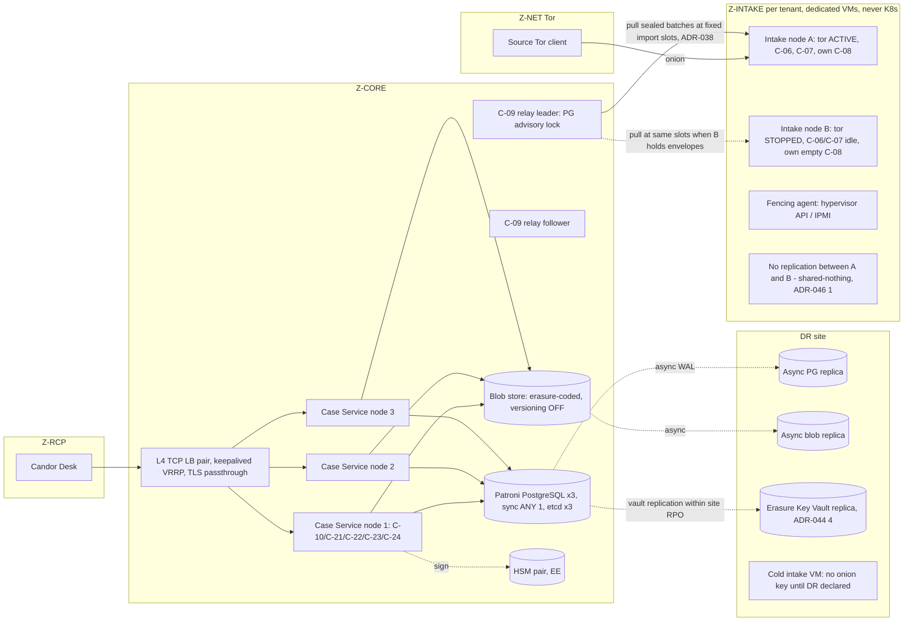

# 21 — Enterprise Edition: Features, High Availability, Multi-Tenancy, Integrations, Fleet
Status: Draft v1.2 (final consistency pass: ADR-047, cross-document requests) · previously v1.1 (revision round 2: ADR-034..046) · Edition applicability: EE (with CE boundary decisions) · Owner: Enterprise Platform team

## 1. Purpose and scope

This document specifies the Enterprise/Government Edition (EE) feature set. For each commercial feature it records **why the feature belongs in EE**, **whether it adds privacy risk**, and **how that risk is mitigated**. It also specifies:
- high-availability (HA) architecture, with every new metadata observer listed;
- multi-tenancy (divisions, subsidiaries, agencies) and the rules for when a dedicated instance is required (ADR-021);
- design for large organizations;
- safe integration patterns (ADR-018), including the enterprise integrations that can defeat source anonymity (§8.1);
- the Enterprise Fleet Manager (C-34), which holds no onion-address database.

Out of scope:
- government-specific profiles (see `22-GOVERNMENT.md`);
- CE feature definition (see `23-COMMUNITY-EDITION.md`);
- licensing of each component (see `24-LICENSING-BUSINESS-MODEL.md`);
- control mappings (see `25-COMPLIANCE.md`).

Nothing in EE changes the anonymity, cryptography or logging-suppression properties defined for CE (DECISIONS §2, ADR-020). EE adds scale, organizational complexity, integrations, assurance evidence and vendor services.

## 2. Context and dependencies

| Topic | Document |
|---|---|
| Binding decisions | `DECISIONS.md` (ADR-008, -009, -013, -015, -016, -017, -018, -020, -021, -022, -023, -024, -028, -029, -030, -032, -033; revision ADRs -034..-046, which supersede earlier text; ADR-047 final-round decisions: MANAGED customer-held audit export key (ENT-043), IDENTIFIED over onion and identity retention (ENT-009), per-locale wordlists (ENT-022), freshness bounds (ENT-041), intake deletion list across failover (HA-020)) |
| Threat catalogue | `02-THREAT-MODEL.md` |
| Metadata minimization | `03-PRIVACY-ANONYMITY.md` |
| Key hierarchy | `04-CRYPTOGRAPHY.md` |
| Zones and hosts | `06-SYSTEM-ARCHITECTURE.md` |
| RLS and schema | `09-DATABASE.md` |
| Evidence objects | `10-FILE-EVIDENCE-PIPELINE.md` |
| Routing, COI and workflow | `14-CASE-MANAGEMENT.md` |
| SSO, PIV and roles | `15-AUTHENTICATION-AUTHORIZATION.md` |
| Onion services | `16-TOR-I2P.md` |
| Hosts, HSM and physical | `17-INFRASTRUCTURE.md` |
| Profiles | `18-DEPLOYMENT.md` |
| Backups and DR | `19-BACKUPS-DR.md` |
| Audit classes and SIEM allow-list | `20-LOGGING-AUDITING.md` |
| Government profile | `22-GOVERNMENT.md` |
| CE and parity | `23-COMMUNITY-EDITION.md` |
| License per component; telemetry | `24-LICENSING-BUSINESS-MODEL.md` |
| Compliance packs | `25-COMPLIANCE.md` |
| Dangerous configuration classes (CFG) | `32-OPERATIONS.md` |
| Updates | `33-RELEASE-UPDATE-SECURITY.md` |
| Sizing | `34-PERFORMANCE-SCALABILITY.md` |
| Retention and legal hold | `35-DATA-RETENTION-DELETION.md` |
| Disclosure and LTS governance | `36-OPEN-SOURCE-GOVERNANCE.md` |
| Assumptions | `40-SECURITY-ASSUMPTIONS.md` (ASM-*) |

## 3. Edition boundary rule (the "Charter test")

Each capability is placed by applying these tests in order. The first test that matches decides.

| # | Test | Result |
|---|---|---|
| T1 | Does the code sit in the Trust Path (DECISIONS §2: source-facing, plaintext, keys, build/sign/update, anonymity logging suppression)? | AGPL, in CE code. An EE *entitlement* may add only support, certification or packaging around it. |
| T2 | Would a single-organization CE deployment, used as intended, be **less safe for a source** without it? This covers source identification, content exposure, accused-person access, evidence loss and retaliation. | **CE feature.** It may have EE scale extensions. |
| T3 | Is it only needed because of organizational scale or complexity (many tenants, many instances, hierarchy, third-party systems)? | EE feature allowed. |
| T4 | Is it vendor labor, assurance or accountability (support, SLAs, certifications, hosting, LTS backports)? | EE service. |

**License classes** used below:
- **A**: AGPL, Trust Path or protection code, shipped in CE.
- **S**: EE commercial module. Source-available to customers and auditors. Runs only in Z-CORE, Z-ADM or Z-VENDOR. Never holds private keys. Never sees plaintext except through Export Packages (ADR-020).
- **V**: vendor service under contract (no code).
- **D**: data or content pack (see `25-COMPLIANCE.md` §8).

## 4. EE feature catalogue: rationale, privacy risk and mitigation

Column "CE baseline" is what CE ships for the same need (see `23-COMMUNITY-EDITION.md`). "Adds privacy risk?" answers whether *enabling* the EE feature creates new observers or data flows beyond CE.

### 4.1 Services and assurance

| # | Feature | Class | Why it belongs in EE | CE baseline | Adds privacy risk? | Mitigation |
|---|---|---|---|---|---|---|
| E01 | **Enterprise support** (named engineers, 24×7 P1) | V | Vendor labor (T4). It does not change protection. | Public docs, community forum, public advisories | **Yes.** Support staff become observers of deployment metadata. Support bundles can carry secrets (INC-56). Social engineering against support is a risk (INC-26). | Support bundles are generated only by `candorctl support-bundle`, scrubbed on-device with the allow-list from `20-LOGGING-AUDITING.md`, limited to the content rules of `32-OPERATIONS.md` §8 (configuration as `{key, class, value_hash}` except enumerated/boolean values; no channel names, role labels, COI maps or calendars; SYSTEM events truncated to the hour; no `sys.relay_*` events; no staff pseudonyms), and previewed by the admin before upload (ENT-020; RVW-B-18). On INDEPENDENT channels (ADR-043) Desk diagnostic bundles are encrypted only to the vendor key or an OVERSIGHT-designated key, never to a corporate helpdesk (ENT-048). Vendor staff never hold Desk accounts or case keys (ENT-021). Support cannot reset, reveal or recover source access because none exists (ADR-005). Support tickets never contain onion addresses unless the customer pastes one; the ticket system auto-redacts `*.onion` (ENT-022). |
| E02 | **Contractual SLAs** (response, fix, availability) | V | Vendor accountability (T4). | Best-effort public security SLAs (`36-OPEN-SOURCE-GOVERNANCE.md`) | **Yes, indirect.** Availability SLAs create pressure for monitoring that measures intake usage. | Availability is measured with synthetic probes: the vendor's or customer's own Tor client fetches the landing page from outside. It is never measured from source-traffic logs (ENT-023). Security-fix SLAs apply equally to CE fixes. EE never gets a fix first (ENT-030). |
| E03 | **Professional deployment** (vendor engineers install or harden) | V | Vendor labor (T4). | Installer and SMB wizard (`23-COMMUNITY-EDITION.md`) | **Yes.** Vendor engineers become insiders with physical or console access (THR-027, THR-018). | Key ceremonies are performed by customer staff only. The engineer never touches tokens, onion keys or Recovery Quorum shares (ENT-024). The post-install Secret Placement Manifest verification report is signed by the customer admin (ADR-028). Engineer console sessions are recorded in the SECURITY audit class. |
| E04 | **Premium support** (TAM, quarterly architecture review, tabletop exercises) | V | Vendor labor (T4). | — | Same as E01. Architecture reviews expose topology. | Reviews use customer-redacted diagrams. No case metadata is discussed. The NDA includes a duty to resist compelled disclosure and to notify the customer where lawful. |
| E05 | **Managed hosting** (profile MANAGED, ADR-024) | V | Vendor operation (T4). | Self-host | **Yes, material.** The vendor and its hosting provider observe ciphertext, coarse intake metadata (`received_epoch_day`, sizes after padding), staff login metadata and the onion key custody. The vendor is compellable (THR-026, THR-027, THR-030). | One dedicated intake gateway and onion key per customer; no shared Z-INTAKE (ADR-021). Vendor cannot decrypt content: recipient keys stay on Desk (ADR-007). The vendor publishes a **compelled-disclosure inventory** listing exactly what it could produce (ENT-025, INC-01..07 lessons, REQ-H-06). Production access requires two vendor staff and is logged to a customer-visible stream (ENT-026). Hosting jurisdiction is chosen per customer and stated to sources on the landing page. The inventory also lists **live capabilities** (Tier W plaintext and passphrase capture, onion-service impersonation, hypervisor snapshots of the sealer) and every server-visible datum generated from the `09-DATABASE.md` column classification (ENT-025; RVW-C-21, RVW-B-19). The vendor publishes a per-jurisdiction transparency report, and each MANAGED instance publishes the ADR-035(2) Operator Statement with ≥ 1 customer-side independent signer (ENT-042). The access log is anchored to a customer-controlled witness (ENT-026). For tenants with any D1–D7 trigger (§6.3), MANAGED SHALL either run the Sealer in a confidential VM whose attestation the customer's own Desk verifies (ADR-035(3)) or disable Tier W by default (ENT-041). CASE-class audit and backup KEKs are customer-held (ENT-043). Note: managed hosting can *reduce* risk where the reported-on organization would otherwise run the infrastructure (INC-22, REQ-H-22). |
| E06 | **Dedicated advisories** (customer-specific impact analysis, account-managed notification) | V | Vendor labor (T4). | Public advisories (GHSA, CVE, CSAF) | **Trust risk if misused.** Paying customers learning of flaws before CE users would breach the Charter. | Pre-notification lists are **criteria-based, never payment-based**. EE customers receive nothing earlier than the public advisory, except through the same criteria-based embargo list open to CE operators (`36-OPEN-SOURCE-GOVERNANCE.md`). "Dedicated" means configuration-specific impact analysis delivered *after* publication (ENT-030). |
| E07 | **Long-term support (LTS)** branches | V (labor) + A (code) | Backport labor (T4). | CE support window: current minor + previous minor for 90 days | **Trust risk.** A closed LTS branch would be un-auditable. | LTS source for trust-path code is published on release day. LTS binaries are reproducibly built and logged in the public transparency log. Anyone can rebuild them (ENT-031; lesson B-CO-64). LTS cadence: one LTS every 24 months, supported 60 months. |
| E08 | **FIPS-capable deployments** (CANDOR-FIPS-1 build profile, ADR-006) | A (code) + V (validated-module tracking, evidence) | The FIPS suite is Trust Path, so it is AGPL and anyone can build it. EE sells CMVP certificate tracking, security-policy conformance evidence, the approved-mode configuration guide and support (T4). | FIPS profile builds possible but unsupported | **No new observer.** Risk: FIPS mode replaces X-Wing with MLKEM1024-P384 and XChaCha with AES-256-GCM, which has nonce limits. The Tor transport is **not** FIPS-validated (Knowledge (unverified)). | Nonce management per `04-CRYPTOGRAPHY.md`. The limitation is documented in the GOV profile (`22-GOVERNMENT.md` §8): the content-confidentiality claim rests on HPKE, and the Tor layer is an anonymity layer. Module version pinned (B-CR-11, B-CR-12). |

### 4.2 Scale and availability

| # | Feature | Class | Why it belongs in EE | CE baseline | Adds privacy risk? | Mitigation |
|---|---|---|---|---|---|---|
| E09 | **High availability** (redundant app servers, DB replication, storage redundancy, failover) | S (orchestration) + A (the services themselves) | Availability for large organizations and 24×7 regulators (T3). Loss of availability does not reduce confidentiality for a CE source. The anonymous path fails closed to an outage page (ADR-002). | Single node, documented restore (RTO hours) | **Yes.** Replicas, load balancers, consensus stores and DR sites are new copies and new observers. See §5.4. | Every new element is listed in the §5.4 observer table with its data scope. No L7 proxy on the source path. The intake has **no replication** in any profile (ADR-046(1)); replica deletion lag in Z-CORE is bounded (HA-006). Secret placement covers every node (HA-009). |
| E10 | **Clustering** (Patroni/etcd, K8s operator for Z-CORE) | S | T3. | — | **Yes.** The K8s control plane (etcd) stores Secrets, and API-server audit logs can capture request bodies. | Z-INTAKE is never on K8s (ADR-024). API-server audit policy is `Metadata` level only for Candor namespaces. Secrets are encrypted with a KMS provider backed by the HSM. The service mesh has access logs off (HA-012). |
| E11 | **Large-scale multi-tenancy** (shared instance for many subsidiaries or departments) | S (tenant admin) + A (RLS, per-tenant keys) | T3: CE is single-tenant by decision (ADR-021). | Single tenant, multiple channels | **Yes.** Co-residency (THR-045) and cross-tenant bugs (B-GL-37: CVE-2026-46648). | §6: per-tenant intake processes and DBs, RLS in core, dedicated-instance triggers. |
| E12 | **Fleet administration** (C-34) | S | T3: many instances. | `candorctl` per instance | **Yes.** A central inventory of whistleblowing instances is a high-value target and compellable (THR-026). | §9: opaque IDs, no onion addresses, pull-only over Tor or customer-hosted, no case data, cannot push code, and can set only an explicit allow-list of keys (ENT-008). It cannot disable intake, lower security floors or change routing (ADR-045, ADR-040). The fleet signing key is customer-held (ENT-044). |
| E13 | **DR automation** (scripted site failover, restore drills) | S | T3/T4. CE has manual DR runbooks. | Manual restore and quarterly drill checklist | **Yes.** The DR site is another physical location and staff set (THR-031). Automation holds credentials. | DR restore needs the backup k-of-n quorum (INC-55). Automation credentials cannot unseal backups alone (HA-015). DR site is listed in §5.4. |

### 4.3 Organization and workflow

| # | Feature | Class | Why it belongs in EE | CE baseline | Adds privacy risk? | Mitigation |
|---|---|---|---|---|---|---|
| E14 | **Organization hierarchy** (group → tenant → division → channel) | S | T3. | Flat: organization → channels | **Yes.** Hierarchies invite "group sees all" inheritance. That is harmful when group executives are the accused (INC-22). | No downward inheritance of case access (TEN-006). Group-level views are aggregates under the single metrics regime of `24-LICENSING-BUSINESS-MODEL.md` §TEL only (ENT-012; ADR-046(5)). |
| E15 | **Advanced workflow** (designer: custom states, tasks, forms, approvals) | S | T3: complex organizations. | Fixed ISO 37002 lifecycle (receive → assess → address → conclude) with SLA engine, tasks and templates | **Yes.** (a) Custom intake forms can ask identifying questions such as employee ID or department. (b) Workflow actions could emit content to notifications or integrations. | Form lint blocks identifying field types in ANONYMOUS channels (ENT-005). The workflow action allow-list excludes content egress (ENT-006). Designer changes are dual-approved and versioned. |
| E16 | **Configurable routing** (advanced rule engine) | S | T3: multi-attribute routing across subsidiaries, countries and languages. | **CE includes basic COI routing** (ADR-015; T2): channel → queue; routing to independent bodies (audit committee, ombudsman, external counsel); source-flagged "concerns: [roles]" exclusions; category rules such as SOX accounting → audit committee (B-CO-69); break-glass. | **Yes.** Complex rules can route a report to the accused. Routing attributes are metadata. | COI exclusions are evaluated **after** every rule and cannot be overridden (ENT-003). Rule simulation harness (ENT-004). Rule changes need dual approval. Routing attributes are limited to server-visible fields declared per channel (ENT-007). Under triage-first routing (ADR-037) the intake wraps envelopes only to the channel's Triage Set; EE rule sets are authored in the designer (class S) but **evaluated by the AGPL rule evaluator inside the Triage Set members' Desks** when they wrap the Case Key onward, so content-derived routing attributes never become server-visible (ENT-003, ENT-007; RVW-B-10). |
| E17 | **Advanced retention** (schedule import: NARA, LAC, state; multi-jurisdiction; disposition review; certificates) | S + D | T3/T4: records-law complexity. | **CE: per-channel retention, crypto-erasure (ADR-025), basic legal hold** | **Yes.** Longer retention increases compellable data. | Every retention period above 365 days needs a recorded legal basis. The Sealed Identity Store has its own shorter schedule (ENT-009). The source landing page shows the maximum retention (ENT-010). |
| E18 | **Legal holds (advanced)**: matter-level holds across cases and tenants, custodian notices, hold reports, eDiscovery export | S | T3. | **CE: per-case legal hold and sealed-matter flag** (blocks disposition, restricts circulation; R6 WB-36). Basic hold protects evidence and so stays in CE (T2). | **Yes.** Holds block deletion (THR-017). Hold reports enumerate cases. | Holds need dual approval, a reason code and a 90-day review reminder. Hold reports use pseudonymous case IDs. Holds never extend the Sealed Identity Store and never block source-initiated deletion unless the hold order names them (ENT-011). Litigation Export Packages need OVERSIGHT co-approval and a non-management redaction reviewer, and record the destination system (ENT-019; RVW-C-10). eDiscovery and records searches run only in the Desk of an authorized member or a Records Custodian holding time-bounded grants from the Triage Set; there is no server-side cross-case search (ENT-045; ADR-044(5)). |
| E19 | **Advanced evidence management**: court-ready bundles, signed chain-of-custody reports, bulk review, local OCR and transcription at scale | S (bundle tooling) + A (anything that parses evidence runs in C-17) | T3/T4. | **CE: immutable original + sanitized derivative, hashes, custody records** (ADR-012) | **Yes.** External timestamping reveals timing. Bulk tools tempt server-side parsing. | Parsing only in C-17 (ADR-012). RFC 3161 timestamps are applied to a daily Merkle root, not per item, using the customer's own TSA (ENT-013). |
| E20 | **Advanced reporting** (regulator statistics such as EU Art 27 and PSDPA annual; board dashboards; cross-tenant aggregates) | S | T3/T4. | Basic KPIs with k-threshold (R6 WB-24) | **Yes.** Small cells and differencing (THR-039, INC-74). | The single metrics regime of `24-LICENSING-BUSINESS-MODEL.md` §TEL (ADR-046(5): k = 10, ≥ 1 calendar month, complementary suppression, no magnitude statistics for cells < k, no per-channel metrics for channels with < 3 cases/month), plus a fixed report catalogue with no ad-hoc queries (ENT-012). |
| E21 | **Audit exports** (scheduled signed exports, WORM targets, auditor portal, OSCAL evidence) | S | T3/T4. | Local hash-chained audit log, CLI verify and manual export | **Yes.** CASE-class events show staff activity timing on cases (THR-038). | Default export covers SECURITY and SYSTEM only. CASE export is a dangerous configuration (dual approval), at day granularity, with per-export pseudonym salts (ENT-014). |
| E22 | **Policy management** (central signed policy bundles across tenants and instances) | S | T3. | Local configuration | **Yes.** Central policy could weaken many instances at once (THR-035). | Bundles may set only the explicit fleet-settable key allow-list (§9.3); logging and log-retention keys are tighten-only; every other key, and every availability-affecting action, is local-only and needs the customer's independent role (ENT-008, ENT-038; ADR-045; RVW-C-13). |
| E23 | **Compliance packs** (jurisdiction SLA clocks, calendars, notices, templates, exemption tags) | D + S (auto-fill) | T4: legal-review labor. | Pack format and loader (A); generic EU, SOX and PSDPA starter packs | **Low.** A pack is data but could embed a hostile configuration. | Pack schema allow-list. Packs cannot alter anonymity or logging configuration. Packs are signed (see `25-COMPLIANCE.md` §8). |

### 4.4 Keys and identity

| # | Feature | Class | Why it belongs in EE | CE baseline | Adds privacy risk? | Mitigation |
|---|---|---|---|---|---|---|
| E24 | **HSM** (network HSM for server-side keys) | A (integration code) + V (certified models, HA HSM, support) | Integration code is Trust Path and ships AGPL in CE (T1). EE sells certified configurations and support (T4). | TPM 2.0 sealing or software sealing (C-29) | **Low–medium.** The HSM appliance logs key-use times. A cloud HSM makes the provider an observer. | The HSM never holds content, case or recipient keys (ADR-007/008). HSM logs join the SECURITY class. Cloud HSM is allowed only in PRIVATE-CLOUD, with the observer documented. The server-side key inventory is in §5.3. |
| E25 | **PKCS#11** | A | T1. Same as E24. | Available | No new observer. | Library allow-list. Module path pinned by hash. |
| E26 | **Enterprise SSO** (OIDC/SAML, SCIM) | S (C-21 bridge) | T3: large staff directories. CE local WebAuthn accounts are phishing-resistant, so CE staff authentication is not weaker (B-CO-41). | Local WebAuthn/FIDO2 accounts | **Yes.** (a) The IdP becomes an observer of staff login times. (b) IdP compromise (THR-022) could create accounts. (c) SCIM can mass-add users. | SSO **never** grants key access. Case keys stay wrapped to Desk device keys. Adding a member to a case or channel needs an existing member's signed key-directory attestation (ENT-015). SCIM can create only *inactive* accounts and can only disable or remove; it cannot grant roles above `recipient-candidate` (ENT-016). Local WebAuthn step-up is required for key operations. SCIM, HR and IdP signals can only **suspend** server-side authorization; they never delete key wraps (ADR-044(1)). The IdP is documented as a staff-timing observer, and INDEPENDENT channels SHOULD use a dedicated IdP or local WebAuthn only (ENT-046; RVW-C-02). |
| E27 | **PIV/CAC** | A (smart-card key wrapping on Desk, ADR-007) + S (federated PIV policy, FPKI path-validation configuration) | Smart-card wrapping is Trust Path, so it is in CE. Federal PKI integration is government-scale (T3/T4). | PIV/smart card as a Desk wrapping key | **Low.** OCSP requests leak staff login timing to the CA's responder. | Local CRL cache or OCSP stapling. No per-login OCSP to external responders by default (ENT-017). |
| E28 | **SIEM integration** (C-26 exporter: CEF, ECS, OCSF; Splunk and Sentinel apps) | S (transport and format) + A (**the scrubbing allow-list**) | Connectors to commercial SIEMs (T3). **Scrubbing is Trust Path (DECISIONS §2(e)) and runs in AGPL code before any EE module sees an event.** | Local scrubbed JSONL export of SECURITY and SYSTEM events | **Yes.** The SOC may report to the accused (INC-22). The SIEM is a long-retention copy (INC-60). | Exporter consumes only the already-scrubbed stream. CASE and SOURCE-SENSITIVE classes are never exported by default (ADR-016). Per-deployment canary test (ENT-018). Staff authentication events leave only in the coarsened form of `20-LOGGING-AUDITING.md` §13 (day-granular by default, pseudonymous `person_ref`, daily batch; no `operation_class`; break-glass as daily count) (ENT-047; RVW-B-31, RVW-C-02). |
| E29 | **Records-management integration** (C-40) | S | T3. | Manual Export Package | **Yes.** The records system (THR-029) retains long and is broadly searchable. | Export Package only (ADR-018). Sealed Identity Store is never exported. Archival format PDF/A plus JSON metadata with redaction applied (ENT-019). |

**Deliberately in CE (not EE)**, because T2 applies:
- basic COI routing and source-flagged exclusions;
- basic legal hold and sealed-matter flag;
- break-glass with dual authorization;
- Sealed Identity Store and unseal workflow (ADR-014);
- Recovery Quorum (ADR-013);
- retaliation and detriment check-ins (R6 WB-23);
- DSAR restriction workflow (R6 WB-15);
- the key-availability warning (a case with fewer than 2 active key holders), `min_recipients` = 2 and ≥ 2 authenticators per member (ADR-044(2));
- triage-first routing and blinded COI tags (ADR-037);
- External Watcher support (published static-asset digests, Sealer running manifest), the Operator Statement and Key Directory witness cosigning (ADR-035, ADR-036);
- the confidential-VM Sealer option (ADR-035(3));
- constant-schedule notifications and fixed-slot imports (ADR-038);
- fetch-all reply retrieval for Tier V (ADR-039);
- Desk custody preflight and independent-custody enforcement (ADR-043);
- key-continuity rules (suspend-only automation, cooling-off before wrap deletion; ADR-044(1));
- the scrubbing allow-list;
- the PKCS#11 and TPM integration code;
- FIPS profile source;
- WebAuthn;
- signed automatic updates;
- the security health dashboard.

## 5. High-availability architecture (profile EE-HA)

### 5.1 Topology



### 5.2 Components and parameters

| Layer | Design | Concrete parameters |
|---|---|---|
| Onion service availability | **Active/passive** per onion service on two shared-nothing intake hosts holding the same onion key (ADR-032). Only one Tor instance publishes descriptors at a time. Promotion follows successful fencing (STONITH) of the old active. Active/active through descriptor aggregation (e.g., Onionbalance, Knowledge (unverified)) is **not** in v1; it is listed in §12. | Health probe every 10 s. 3 consecutive failures lead to fencing and then promotion. Target intake RTO ≤ 10 min, including descriptor re-publication. Clients holding a cached old descriptor may fail until they refetch. This is documented. |
| Intake Store (C-08) | **No replication** between intake nodes (ADR-046(1)). Each node has its own PostgreSQL with `wal_level=minimal`, `max_wal_senders=0`, `archive_mode=off`, `track_commit_timestamp=off` (per `09-DATABASE.md`). The source is shown "received" only after the local fsync on the active node. Envelopes pending on a failed node are recovered when its disk is recovered (node repaired, or disk attached read-only to a recovery host inside Z-INTAKE and pulled by C-09). | Intake RPO for accepted-but-unpulled envelopes = the failed node's disk; if that disk is destroyed, envelopes accepted since the last import slot are lost and the Tier V client / Tier W inbox shows them as not delivered at the source's next login. **Source-account gap after unplanned failover** (RVW-C-08): accounts created on the failed node since the passive was last seeded from BS-INTAKE cannot log in on the new active until the failed disk is recovered (source UI: "your mailbox is temporarily unavailable; do not create a new one unless advised", `18-DEPLOYMENT.md` §4.4); if the disk is destroyed they are lost. **Deletions:** before the passive opens, C-09 pushes the newest Z-CORE replica of the signed intake deletion list (ADR-047(9)) so that mailboxes deleted on the failed node are not served by the new active (HA-020). |
| Intake Relay (C-09) | ≥2 instances. Exactly one leader, elected with a PostgreSQL advisory lock in the core DB. Pulls and imports run only at the **fixed import slots** of ADR-038(1) (default 4×/day at fixed times; HIGH/GOV 1×/day), never event-driven. A new leader waits for the next slot; it does not pull outside a slot. Each slot pulls from every intake node that holds envelopes (active and, after a failback, the former active). | Lease 30 s. Pull batches are acknowledged idempotently by `batch_no`, so a duplicate pull is a no-op. |
| Case Service tier | ≥3 stateless nodes behind an **L4** load balancer in TLS passthrough. TLS terminates on the Case Service node, so the LB never sees API bodies. | HAProxy `mode tcp`, `option dontlog-normal`, logs limited to SYSTEM-class counters. |
| Case DB (C-12) | Patroni 3-node cluster, etcd 3 nodes (Z-CORE only), `synchronous_standby_names='ANY 1 (*)'`. | Failover ≤ 30 s. RPO 0 in-site. |
| Blob store (C-13) | S3-compatible on-prem with erasure coding. Object versioning **disabled**. Object lock only on the backup bucket. Ciphertext only. | EC 4+2 minimum. Lifecycle removes incomplete multipart uploads after 24 h. |
| Audit (C-24) | Single logical writer sequence in the DB. Checkpoints signed with a key held in the HSM pair (EE-HA). If both HSMs are unavailable, events continue to be hash-chained but checkpoint **signing pauses** until an HSM returns; **no fallback signing key** is used (ADR-046(2); FAIL-013 in `34-PERFORMANCE-SCALABILITY.md`). Deployments without an HSM use a TPM-resident key as their only (primary) key. | Checkpoint every 15 min while an HSM is available. |
| Key Directory (C-14) | Single writer through the DB. Read replicas serve Desk. The signed snapshot is pushed to intake by C-09. | — |
| DR | Warm standby site. Async WAL replication and async blob replication of Z-CORE. The **Erasure Key Vault is replicated to the DR site** (EE: into the DR HSM partition) within the site RPO; vault backups are retained ≤ 14 days; any restore applies the signed erasure log before serving (ADR-044(4)). The DR intake VM holds **no** onion key until DR is declared. The onion key is then restored from backup under k-of-n (see `19-BACKUPS-DR.md`). | Site RPO ≤ 15 min for case data **and** case-key access (vault included). Site RTO ≤ 4 h **including** assembly of the backup and HSM quorums; the quarterly drill measures quorum-assembly time (HA-019). The onion address is preserved. |
| Upgrades | Rolling. DB migrations use expand/contract across two releases. Intake is upgraded by promoting B, then upgrading A and switching back. The same public TUF targets apply (ADR-022). | Maximum intake unavailability during upgrade ≤ 10 min. |

### 5.3 Key availability in HA

Content keys are never server-side (ADR-007/008). HA therefore replicates **no content-decrypting key**. Server-held secrets and where they live:

| Secret | Hosts permitted (Secret Placement Manifest, ADR-028) | HA treatment |
|---|---|---|
| Onion service private key (per tenant) | Intake A, Intake B (sealed to each TPM; ADR-032 accepts the doubled THR-044 exposure). DR intake only after declaration. | Two copies in-site. Loss of both means restore from k-of-n backup. |
| Intake at-rest volume keys | Each intake node (TPM) | Per-node. |
| Internal mTLS keys (core↔relay↔intake) | Each node, its own key | Short-lived (30 days), issued by the internal CA. CA key in the HSM. |
| Audit checkpoint signing key | HSM pair (EE-HA); TPM-resident primary key only where no HSM is deployed | No fallback key (ADR-046(2)). See §5.2. |
| Key-directory log signing key | HSM | Operations continue while the HSM pair is degraded. Signing pauses if both HSMs fail; the key directory stays readable. Directory publications occur only in the weekly publication slot (ADR-036(7)). |
| Erasure Key Vault (per-case Erasure Keys, ADR-033(3)) | Core vault volume on the primary site; DR HSM partition (EE) or DR vault host | Replicated within site RPO; excluded from hypervisor/SAN/image-level backups; HIGH/GOV on a physical-host TPM or HSM, never a vTPM (ADR-044(4); HA-017, HA-018). |
| Backup encryption | Public key only on servers. The private key is k-of-n offline. | — |
| Channel epoch private keys | Stored as ciphertext wrapped to members | Unaffected by HA. |

Availability of case access depends on Desk devices and the vault. Every case keeps ≥ 2 active key holders (`min_recipients` = 2, ADR-044(2)), each member enrols ≥ 2 hardware authenticators, and ≥ 1 holder of each case SHOULD be located outside the primary site (HA-019). The CE key-availability warning applies. Wrap deletion requires dual control, a 7-day cooling-off and OVERSIGHT notice (ADR-044(1)).

### 5.4 New metadata observers introduced by HA (complete list)

| # | Element | New observer? | Sees | Must never see | Persistence | Mitigation | Threats |
|---|---|---|---|---|---|---|---|
| O1 | Intake standby node B | Yes, a second intake host holding the onion key (ADR-032) | While passive: nothing source-derived (no replication). After promotion: what node A would see | Plaintext while passive (the sealer is idle) | Only envelopes it accepted while active, until pulled | Same hardening as A. Encrypted volume. No replication (ADR-046(1)). | THR-015, THR-017, THR-031, THR-044 |
| O2 | Intake replication link | **Removed** (ADR-046(1)): no intake replication link exists | — | — | — | Health/fencing heartbeats only; they carry no submission-driven traffic. | — |
| O3 | Fencing agent (hypervisor API or IPMI credentials) | Yes | Node power state | Data | Hypervisor logs | Scoped credential. SECURITY-class audit. | THR-018 |
| O4 | L4 load balancer | Yes | Staff source IPs, connection timing (Desk) | API bodies (TLS passthrough). Any source traffic (it is not on the source path). | Logs off except counters | `dontlog-normal`. No L7. | THR-016 |
| O5 | Patroni and etcd | Yes | Cluster membership and leader state | Rows | etcd WAL | etcd holds no application data. Peer TLS. | THR-015 |
| O6 | DB replicas (in-site) | Yes, a copy | Same as the primary: pseudonymous case metadata, ciphertext | — | Deleted-row remnants until vacuum/WAL recycle | `autovacuum` tuned. Crypto-erasure makes remnants undecryptable (ADR-025). | THR-017 |
| O7 | Blob store nodes | Yes | Ciphertext shards, object sizes (padded, ADR-011), write times equal to the import slot time (ADR-038(1)); S3 `Last-Modified` therefore reveals only the slot | Plaintext | Until delete plus EC rebalance | Versioning off. Padding. Objects written only by the slot-based import. | THR-015, THR-011 |
| O8 | DR site (infrastructure and staff) | Yes, new physical location and people | Everything O6/O7 sees, delayed; the replicated Erasure Key Vault | Onion key before declaration | Continuous; vault copies bound by the erasure log | Same physical controls (`17-INFRASTRUCTURE.md`). DR staff hold no Desk roles by default. Vault replica excluded from DR-site image backups (HA-018). | THR-031, THR-018, THR-017 |
| O9 | HSM appliances | Yes | Key-use events and timing (checkpoint signing) | Content keys | HSM audit log | Logs into the SECURITY class. No vendor cloud telemetry from the HSM. | THR-013 |
| O10 | K8s control plane (EE-HA core only) | Yes | Pod specs, Secrets (KMS-encrypted), API request metadata | Request bodies of Candor APIs | etcd, audit logs | Audit policy `Metadata`. KMS encryption. No Z-INTAKE workloads. | THR-016, THR-015 |
| O11 | Service mesh or sidecars (if used) | Yes | Service-to-service call metadata | Bodies | Access logs | Access logs disabled. mTLS only. | THR-016 |
| O12 | HA monitoring (C-25 probes) | Yes | Health status, synthetic onion probe latency | Real source requests | 30 days | Synthetic probes only (ENT-023). | THR-016 |
| O13 | DR automation runner | Yes | Orchestration credentials | Backup plaintext | Runner logs | Cannot unseal backups without quorum (HA-015). | THR-013 |
| O14 | Enterprise hypervisor, SAN and image-level backup systems hosting Z-CORE VMs | Yes, invisible to the guest | Whole-VM images incl. DB files, vault volume and vTPM state unless excluded | Vault volume and vTPM state (MUST be excluded) | Customer backup retention (often years) | Signed exclusion attestation by the virtualization/backup owner; config-checker prompt; restore-probe canary; documentation states that the 14-day deletion bound fails without it (HA-018; ADR-044(4); RVW-C-06). | THR-017, THR-030 |

## 6. Multi-tenancy

### 6.1 Model

- **Group**: an optional EE administrative umbrella.
- **Tenant**: a legal entity, subsidiary, agency or municipality. It is the isolation unit.
- **Division / Department**: an attribute within a tenant, used for routing and ABAC.
- **Channel**: an intake channel with its own Channel Identity Key and epoch keys (ADR-008).
- **Case**.

Rules:
- Case access **never inherits downward or upward** across tenants.
- Group-level roles receive only aggregates under the `24-LICENSING-BUSINESS-MODEL.md` §TEL regime (ADR-046(5)).

### 6.2 Isolation guarantees (shared EE instance, low/moderate risk only)

| Layer | Guarantee | Mechanism |
|---|---|---|
| Onion service | One onion service per tenant; no shared address | Separate `HiddenServiceDir` and key per tenant |
| Source web and sealer (C-06, C-07) | **Separate process instances per tenant**: distinct uid, cgroup, memory lock and systemd unit. Rationale: Tier W plaintext exists here, and shared HTTP stacks have leaked cross-request (B-GL-40, CVE-2024-41671). | systemd template `candor-intake@<tenant>` |
| Intake Store (C-08) | **Separate database per tenant** on intake | One PG database per tenant; one role per database |
| Case DB (C-12) | Shared cluster, PostgreSQL RLS with mandatory `SET LOCAL app.tenant_id`. Queries without a tenant context fail closed. No `BYPASSRLS` for application roles. | Connection wrapper plus a CI test (B-GL-37: CVE-2026-46648) |
| Blob store | Per-tenant bucket and per-tenant credential | Bucket policy |
| Keys | Per-tenant channel keys, per-tenant key-directory namespace, per-tenant Recovery Quorum (if any) | C-14 namespaces |
| Admins | Tenant admins are scoped to one tenant. Group admins have no tenant configuration rights except through signed policy bundles that only tighten (E22). | AUTHZ (ADR-029 audience plus tenant binding) |
| Audit | Per-tenant CASE streams. The SECURITY stream records tenant ID. | C-24 |
| Rate limits and PoW | Per-tenant intake limits, so one tenant's flood does not starve another. Shared host capacity remains a co-residency risk. | Per-tenant cgroup quotas |
| Relay batches | Per-tenant pulls and batches, so batch size does not reveal cross-tenant activity | C-09 |
| Bulk operations | Cross-tenant writes only through the separately audited `candorctl root-maint` with dual approval | CI bans multi-tenant UPDATE outside it |

Hard cap: **50 tenants per shared instance**. Beyond that, add instances (bounded blast radius).

### 6.3 When a dedicated instance is required (ADR-021)

A **Tenant Risk Classification** is completed at onboarding and reviewed yearly. **Any** "yes" below requires a dedicated instance: separate intake hosts, core DB, admins and HSM partition.

Who classifies (RVW-C-23): the classification SHALL be signed by the **tenant's own OVERSIGHT** (e.g., audit-committee chair or ombudsperson), not by the group operator. D2 defaults to "yes" for any audit-committee, board, ethics or INDEPENDENT-type channel (ADR-043) and can be set to "no" only with a written reason signed by that OVERSIGHT. The tenant landing page shows the classification result and "operated by <group>" (TEN-005, TEN-012).

| # | Trigger |
|---|---|
| D1 | The tenant is a government Inspector General, ethics office, ombudsman, regulator external channel, law-enforcement internal affairs or civilian police oversight, or is intelligence-adjacent. |
| D2 | The operator of the shared instance, or the group, is a plausible subject of reports to this tenant. Example: parent-company executives are within the tenant's scope. |
| D3 | The tenant's data is CJI, CUI, Protected B or equivalent, or is subject to a specific accreditation. |
| D4 | Residency or jurisdiction differs from the other tenants on the instance. |
| D5 | The tenant requires an administrator team that does not report to group IT. |
| D6 | The tenant's threat assessment includes a state-level adversary, or an adversary able to compel the group. |
| D7 | The tenant receives reports from the public at large that could concern other tenants. |

Examples:
- **Shared is OK:** departments of one company; EU Art 8(6) resource sharing among 50–249-worker affiliates; a municipal consortium with each municipality as its own tenant (R6 B-CO-02 Art 8(9)), provided D2 does not apply.
- **Dedicated is required:** a municipal IG; an audit-committee channel where group management is in scope (D2); police IA (D1, D3).

## 7. Large-organization design

| Need | Design |
|---|---|
| Tens of thousands of employees | Report volume is small relative to headcount. The load driver is staff count (hundreds of handlers) and evidence size. Sizing is in `34-PERFORMANCE-SCALABILITY.md`. |
| International | One instance per residency region (EU, CA, US, other) where law requires it. Staff carry a `staff_region` attribute. A case grant across regions requires a recorded transfer basis (GDPR Ch. V; Law 25 PIA, B-CO-27) and dual approval, because Desk decryption abroad is a transfer (ENT-027). |
| Subsidiaries | Tenants (§6). A group ombudsman channel is hosted in a tenant with D2 isolation where needed. |
| External counsel and investigators | Guest recipients with their own Desk and keys. Enrollment by out-of-band fingerprint verification by the second approver; roster additions are time-locked 72 h (GOV/HIGH 7 days) and need ≥ 1 independent-role approver (ADR-036(2)). Time-bounded grants (default 90 days, maximum 365). No admin roles. Subject to COI (ENT-028). |
| Multilingual | Source UI languages per channel (`26-ACCESSIBILITY.md`). A translator is a case role with scoped grants. **No cloud machine translation.** Optional local MT runs on Desk or in C-17 (ENT-029). |
| Complex routing | EE rule engine (E16) with the COI invariant. Escalation chains. Delegation with expiry. Audit-committee bypass for accounting categories. |
| Many independent bodies | Channels routing to ombudsman, audit committee, board chair and external counsel. Each can have its own Recovery Quorum. |

## 8. Safe integration patterns (ADR-018)

General rule: integrations receive **(a)** scrubbed SECURITY or SYSTEM events through C-26, **(b)** content-free notifications (ADR-017), **(c)** inbound directory data subject to approval, or **(d)** human-created Export Packages. There is no other flow.

| System | Direction | Allowed payload | Forbidden | Specific risk and mitigation |
|---|---|---|---|---|
| SIEM | Candor → SIEM | SECURITY and SYSTEM allow-list events (auth failures, config changes, self-test results) in the coarsened form of `20-LOGGING-AUDITING.md` §13 | CASE and SOURCE-SENSITIVE classes; case IDs; channel names if configured as sensitive; exact staff-login times by default; `operation_class`; break-glass detail; Z-INTAKE-derived capacity data | SOC may report to the accused, and staff reaction times are a proxy for submission times (RVW-B-31). A default-off CASE export requires dual approval (ENT-014, ENT-018, ENT-047). |
| SOAR | SOAR → Candor (inbound actions) | Allow-listed defensive actions: suspend staff account, revoke sessions, force re-enrollment (= rotate authenticators, keep keystore and key wraps), trigger self-test | Any read of case data. Enabling or disabling anonymity-affecting configuration. Adding members. Deleting accounts or key wraps. | A compromised SOAR could lock out staff: availability only, and no key material is lost (ADR-044(1)). Actions are rate-limited and SECURITY-audited (ENT-032). |
| HR (HRIS) | HR → Candor only | Org-chart data for COI maps (reporting lines, roles) and departure events | Candor → HR anything except an Export Package | An accused HR admin could edit reporting lines to evade COI, or trigger exclusions to delete keys (suppression, RVW-C-03). HR changes can only **suspend** server-side access; COI loosening is time-locked (ADR-036(2)); wrap deletion needs dual control, 7-day cooling-off and OVERSIGHT notice (ADR-044(1)); per-case COI state stays blinded (ADR-037(3)) (ENT-033). |
| Case management / GRC | Candor → external | Export Package; opaque external reference token (random, per export) | Automatic sync | THR-029 |
| Legal (matter management, eDiscovery) | Candor → legal | Export Package with hash manifest; legal-hold status; content-free hit/no-hit attestations from Desk-local searches | Sealed identity; server-side cross-case search; eDiscovery crawlers against Candor servers or Desk data directories | In-house legal may represent the accused organisation (RVW-C-10): OVERSIGHT co-approval, non-management redaction reviewer, destination recorded (ENT-011, ENT-019, ENT-045). |
| Records management | Candor → records | PDF/A plus JSON metadata Export Package, declared record | Sealed identity; originals without dual approval | Records searches run in the Records Custodian's Desk under Triage-Set grants (ADR-044(5); ENT-019, ENT-045). |
| SSO (OIDC/SAML) and SCIM | IdP → Candor | Authentication assertion; account lifecycle | Any key grant | ENT-015, ENT-016 |
| Ticketing | Candor → ticket | Content-free ticket on the same **constant schedule** as notifications (ADR-038(2)): one fixed-text ticket per day at a fixed time, whether or not anything is pending | Case ID, count, category, time of submission; event-driven tickets | Same as ENT-035 |
| **Microsoft Entra ID** | IdP | OIDC with Conditional Access. Candor requires local WebAuthn step-up for key operations. | Entra group membership granting case access; SCIM deletion of key-holding accounts | Entra sign-in logs record staff Candor logins (IP, time): the IdP is a staff-reaction timing observer (RVW-C-02). Disclosed in the deployment data-flow report and to sources via `03-PRIVACY-ANONYMITY.md` "what this protects"; INDEPENDENT channels SHOULD use a dedicated IdP or local WebAuthn only (ENT-046). |
| **Microsoft Purview** (DLP, eDiscovery, sensitivity labels, Insider Risk) | Label metadata on Export Packages only | Apply a sensitivity label to Export Package files | Purview scanning or eDiscovery collection of Desk data directories, C-17 or Candor servers; endpoint-DLP "collect original file as evidence"; Insider Risk forensic screen capture on Desk devices | Checked daily by `desk-preflight` (ENT-034). Blocking on INDEPENDENT channels (ADR-043). |
| **Microsoft Defender / any EDR**, MDM (Intune, SCCM, Jamf), VDI on recipient workstations | — | Vendor-signed Desk package deployed unchanged | **Automatic sample submission** of files from Desk directories or C-17; live-response / remote-shell / memory collection while Desk is unlocked; repackaged or wrapped Desk installers; VDI/RDP sessions for Triage Set members of INDEPENDENT channels | Daily `desk-preflight` (ENT-034); independent-custody devices for INDEPENDENT channels (ADR-043; ENT-049); Desk self-verifies its binary against the transparency log and reports its release digest (non-authoritative) (Knowledge (unverified) re product setting names). |
| **Microsoft Teams** / Slack / Matrix / email notifications | Candor → transport | ADR-017 fixed text on the **constant schedule** of ADR-038(2): one digest per subscribed member per day at a fixed local time, sent whether or not anything is pending; or notifications disabled (HIGH default) | Any case data; adaptive cards with fields; event-driven or hourly digests; per-channel addressee sets | The transport operator (and mail journaling, e.g., Exchange/Proofpoint journals retained for years) sees an identical daily message to a constant addressee set, so presence and time carry no submission signal (ENT-035; RVW-A-19, RVW-B-05, RVW-C-02). |
| M365 AI assistants / Copilot / Recall, OneDrive Known Folder Move, cloud clipboard | — | — | Indexing or sync of Desk data directories and Export Packages; screen capture of Desk windows | Desk defaults Export Package output to a Desk-managed encrypted folder excluded from sync clients; `desk-preflight` detects KFM/sync roots, Recall, cloud clipboard and crash upload (ENT-034; RVW-C-11). Crash reporting of Desk processes is disabled per `12-FRONTEND-RECIPIENT.md` (cross-document request). |
| Government identity (PIV/CAC, FPKI; GC credentials) | IdP or direct certificate | Staff authentication only | **Source authentication of any kind** (ADR-005) | `22-GOVERNMENT.md` §6 |

### 8.1 Enterprise integrations that can destroy anonymity (consolidated)

These integrations do not touch Candor servers, yet each one can turn a staff-side reaction or an enterprise copy into a source-identifying signal or a copy of content. Each row states the protection, from whom, the assumption and the honest residual.

| # | Integration | Failure mode | Control (requirement) | Assumption / residual |
|---|---|---|---|---|
| X1 | IdP (Entra, Okta, agency IdP) login logs | Staff logins cluster after an import → hour-level "a report arrived" signal to the IdP operator (RVW-C-02) | Fixed import slots (ADR-038(1)) mean logins follow slots, not submissions; INDEPENDENT channels SHOULD use a dedicated IdP or local WebAuthn (ENT-046); IdP disclosed as observer | Humans still react to urgent reports; day-level correlation remains (ASM on staff behaviour in `40-SECURITY-ASSUMPTIONS.md`). |
| X2 | Mail journaling / Teams audit / mail-provider logs | Event-driven digests expose arrival hour and channel via the addressee set (RVW-A-19, RVW-B-05) | Constant-schedule daily digest to a constant addressee set, or notifications off (ENT-035; ADR-038(2)) | Journal retention is outside Candor's control; it now contains only uninformative daily messages. |
| X3 | EDR / MDM / DLP / insider-risk / VDI on Desk devices | Memory dump, screen capture, sample upload, repackaged Desk (RVW-C-01, RVW-A-24, RVW-C-11) | Daily `desk-preflight` (ENT-034); independent-custody devices mandatory for Triage Set members of INDEPENDENT channels (ADR-043; ENT-049); custody status shown to admins and OVERSIGHT | An organisation that controls a member's endpoint can defeat Desk protections; the spec cannot prevent this technically (ADR-043 residual). Detection of stealthy agents is best-effort. |
| X4 | Hypervisor, SAN and image-level backups of Z-CORE | Vault volume and vTPM copied for years → the 14-day deletion bound fails invisibly (RVW-C-06) | Vault volume excluded; signed exclusion attestation; restore-probe canary; HIGH/GOV vault on physical TPM/HSM (HA-018; ADR-044(4)) | Attestations are only as honest as the virtualization team. Without exclusion, "deleted" cases remain decryptable by holders of former member keys for the backup lifetime; this is stated to operators and sources. |
| X5 | eDiscovery / records / FOIA tooling | Server-side crawlers or bulk exports to legal systems controlled by the accused (RVW-C-10, RVW-C-14) | No server-side search; Desk-local search by Records Custodian under Triage-Set grants; OVERSIGHT co-approval for litigation exports (ENT-019, ENT-045; ADR-044(5)) | Lawful court orders can still compel production. |
| X6 | SIEM / SOC | Staff-reaction timing, break-glass reasons, capacity bands (RVW-B-31) | Coarsened export (ENT-047); CASE export DANGEROUS (ENT-014) | Network-level observation of Desk connections remains (X8). |
| X7 | HR / SCIM / SOAR | Attribute changes delete keys (suppression) or re-roster channels (RVW-C-03, RVW-C-05) | Suspend-only automation; time-locked roster changes; cooling-off before wrap deletion (ENT-015, ENT-016, ENT-032, ENT-033; ADR-036, ADR-044(1)) | An organisation that physically destroys all devices, including spares, still wins; OVERSIGHT is notified. |
| X8 | Enterprise network (NOC) | NOC sees intake Tor flows and staff Desk flows (two-ended position, RVW-C-20) | Independent intake uplink and RCP-ONION or a dedicated tunnel for INDEPENDENT channels are specified in `17-INFRASTRUCTURE.md`/`18-DEPLOYMENT.md` (cross-document request) | Sources using corporate networks remain exposed (guidance only). |
| X9 | Fleet Manager and vendor mirrors | Mass suppression via "tighter" settings; egress-IP and Desk-start observation (RVW-C-13, RVW-B-20) | Fleet allow-list, customer-held fleet key, Tor transport (ENT-008, ENT-044); update paths per ADR-046(3) | Vendor compulsion to withhold updates remains; the security floor and local lag alert mitigate (ENT-040). |
| X10 | M365 sync, Recall, cloud clipboard, crash upload | Decrypted content leaves the endpoint to cloud services (RVW-C-11) | `desk-preflight` catalogue (ENT-034); Desk-managed export folder | Vendor products change faster than the catalogue. |

## 9. Enterprise Fleet Manager (C-34)

### 9.1 Design goals

C-34 manages N instances for one customer, or for the vendor in MANAGED mode. Constraints:
- no database of onion addresses;
- no content;
- no keys;
- no ability to deliver code or targeted builds (ADR-022);
- no ability to enable dangerous configuration.

### 9.2 Data model (complete)

| Field | Type | Notes |
|---|---|---|
| `instance_id` | 128-bit random, generated at enrollment | Opaque. Not derived from any address or key. |
| `display_label` | string ≤ 64, customer-chosen | Guidance: do not use onion address or site name if sensitive. The UI lint warns if it matches `[a-z2-7]{56}` or `.onion`. |
| `profile` | enum (ADR-024) | |
| `release_version`, `release_channel` | string, enum | Must be a published TUF target |
| `update_window` | cron-like | |
| `health` | map of self-test ID → pass/fail/unknown | From C-25; no free text |
| `onion_key_changed_unexpectedly` | bool | Computed locally. Neither address nor key is sent. |
| `onion_key_age_bucket` | enum {<90d, 90–365d, >365d} | |
| `cert_expiry_bucket` | enum | Internal mTLS |
| `policy_bundle_version` | int | |
| `license_entitlements` | list | Offline license file (C-35) |
| `last_checkin_day` | date | Day granularity |
| `security_floor_ok` | bool | Computed locally: installed trust-path versions ≥ signed security floor (ADR-040) |
| `ring` | string ≤ 32 | Rollout ring; ring assignments and ring version policies are logged in the vendor's public fleet-policy transparency log (ENT-044) |

**Never stored:**
- onion addresses or keys;
- hostnames or IPs of Z-INTAKE;
- tenant or channel names (unless the customer puts them in `display_label`, which is warned);
- case counts at finer than the TEL rules (`24-LICENSING-BUSINESS-MODEL.md`);
- user lists;
- audit CASE events.

### 9.3 Communication and commands

```mermaid
sequenceDiagram
  participant A as Instance agent (Z-ADM, C-19 host)
  participant F as Fleet Manager (C-34)
  participant T as Public TUF repo (C-32/C-33)
  A->>F: mTLS pull over Tor to the fleet onion endpoint, or to a customer-hosted C-34 (every 60±30 min): report fields §9.2
  F-->>A: signed command set + policy bundle
  A->>A: verify signature, allow-list, CFG class check
  alt command = schedule_update(version)
    A->>T: fetch TUF metadata; verify version is a public target
    A->>A: apply in window (same artifact for everyone); a release raising the security floor is never deferrable by fleet policy
  else command sets a key outside the fleet-settable allow-list, or affects availability
    A->>A: REFUSE; queue for local approval incl. the customer's independent role
  end
```

Agent placement:
- The agent runs in Z-ADM (or Z-CORE), **never in Z-INTAKE**.
- Z-INTAKE has no route to C-34.

Command allow-list:
- `schedule_update` (only public TUF targets; cannot defer a release that raises the security floor beyond the window defined in `33-RELEASE-UPDATE-SECURITY.md`);
- `run_selftest`;
- `apply_policy_bundle` restricted to the **fleet-settable key allow-list**: `update.window`, `selftest.schedule`, `telemetry.enabled=false`, and tighten-only changes to SYSTEM/SECURITY log verbosity and log retention;
- `request_support_bundle` (requires local admin approval and preview);
- `set_update_window`.

Removed from the allow-list (RVW-C-13): `rotate_internal_certs` (internal certificates rotate locally via the internal CA, outside import slots). Every other configuration key is **local-only**. In particular the fleet cannot set `intake.min_recipients`, break-glass, case or backup retention, routing, channel state, notification mode, or anything that can disable intake or lower a security floor (ADR-045, ADR-040).

Fleet signing key custody: the key that signs command sets and policy bundles is **customer-held** on a hardware token (K15-class, see `04-CRYPTOGRAPHY.md`), even when the Fleet Manager service is vendor-hosted; the vendor can relay but not author commands (ENT-044).

Transport: the agent reaches C-34 over Tor (vendor fleet onion service) or a customer-hosted C-34; direct clearnet mTLS to a vendor-hosted C-34 is ADVANCED and not permitted in GOV-ONPREM or for tenants with a D1–D7 trigger (RVW-B-20).

Fleet Manager compromise impact:
- It can delay non-floor updates within the window (the instance alerts if the update lag exceeds 30 days, and trust-path components refuse to start below the signed security floor, ADR-040).
- It can mislabel health.
- It **cannot** read cases, add members, change routing, disable or throttle intake, enable clearnet, enable logging or escrow, shorten retention, lower a floor, or deliver code.

## 10. Requirements

| ID | Requirement | Evidence | Threats | Component | Verification |
|---|---|---|---|---|---|
| ENT-001 | Every EE feature SHALL be assigned a license class (A/S/V/D) using the Charter test (§3). Any capability failing T1 or T2 SHALL ship in CE. | ADR-020; B-CO-60; B-CO-61 | THR-024 | C-30 | INSP: edition-boundary review each release; AUD: charter audit (`37-SECURITY-AUDIT-PLAN.md`) |
| ENT-002 | EE modules (class S) SHALL NOT link into Trust Path binaries. They SHALL interact only through documented, versioned APIs, SHALL hold no private keys, and SHALL receive plaintext only via Export Packages. | ADR-020; B-CO-64 | THR-029, THR-018 | C-26, C-34, C-40 | TST: dependency-graph check `ee-boundary` fails if a Trust Path crate depends on an EE crate; INSP |
| ENT-003 | COI exclusions (source-flagged and COI map) SHALL be applied after all routing rules and SHALL NOT be overridable by any rule, workflow or policy. Under triage-first routing (ADR-037) intake wraps only to eligible Triage Set members; EE rule sets SHALL be exported as signed declarative data and evaluated by the AGPL rule evaluator in the Triage Set member's Desk when the Case Key is wrapped onward; the Desk SHALL refuse to wrap to any user whose blinded COI tag matches (ADR-037(3)). | ADR-015; ADR-037; INC-22; B-GL-37; RVW-B-10 | THR-020, THR-019 | C-22, C-10, C-15 | TST: property test generates random rule sets and asserts excluded principals never receive wrapped keys; TST: Desk evaluator refuses wrap on blinded-tag match; ST: rule-injection attempt |
| ENT-004 | The rule engine SHALL provide a simulation mode. It shows, for a synthetic report with given attributes, the resulting recipient set and exclusions, before a rule set is activated. Activation SHALL require dual approval. | ADR-015 | THR-020 | C-10 | TST: `routing-sim` fixtures; DEMO |
| ENT-005 | The workflow and form designer SHALL reject, in ANONYMOUS-mode channels, field types `email`, `phone`, `employee_id`, `name`, `badge_number`, and any field marked `identifying`. It SHALL warn on free-text labels matching an identifying-question lexicon (localized). | ADR-002; ADR-005; REQ-H-05 | THR-040, THR-009 | C-10, C-06 | TST: lint unit tests for 20 lexicon locales; INSP |
| ENT-006 | Workflow actions SHALL come from an allow-list excluding outbound content: no webhook with case fields, no email containing case data, no integration push. Only ADR-017 notifications and human Export Packages egress. | ADR-017; ADR-018 | THR-028, THR-029 | C-10, C-23 | TST: action registry test; ST: attempt to register custom egress action |
| ENT-007 | Server-visible routing attributes SHALL be limited to channel and tenant. A channel MAY declare a questionnaire field `routing_visible` only if the channel is not ANONYMOUS-mode, or the field is an enumeration in which every value has a declared population ≥ 50; the value SHALL be stored only inside the encrypted case record and evaluated by the Triage Set Desk (ENT-003), never server-side. Each such field SHALL be shown to the source as "used to route your report". | ADR-015; ADR-010; ADR-037; RVW-B-10 | THR-011, THR-015, THR-039 | C-06, C-10, C-15 | TST: schema test rejects non-enumerated or small-population `routing_visible` fields in ANONYMOUS channels; TST: DB scan shows no routing field values outside `ct` columns; DEMO: source UI shows label |
| ENT-008 | Fleet policy bundles SHALL be able to set only the fleet-settable key allow-list of §9.3 (`update.window`, `selftest.schedule`, `telemetry.enabled=false`, tighten-only SYSTEM/SECURITY log verbosity and log retention). Any other key, and any availability-affecting action (disabling or throttling intake, `intake.min_recipients`, break-glass, case/backup retention, routing, notification mode, security floors), SHALL be refused remotely and queued for local approval that includes the customer's independent role. | ADR-045; ADR-040; B-GL-37 (CVE-2026-46647); ADR-022; RVW-C-13 | THR-035, THR-025, THR-032, THR-020 | C-34, C-19 | TST: bundle fuzzing with every non-allow-listed key and every loosening/availability diff, all refused; ST: mass-suppression attempt via fleet |
| ENT-009 | (amended r3, aligned with `35-DATA-RETENTION-DELETION.md` D-09) Sealed Identity Store retention SHALL be configured separately from case retention and SHALL be the shorter of case retention and the configured identity retention, defaulting to case closure plus 30 days unless a legal basis is recorded; expiry SHALL crypto-erase the identity DEK. This SHALL apply equally to identities given in CONFIDENTIAL mode, by voluntary disclosure, and in IDENTIFIED mode over the onion service (ADR-047(5)). Legal holds SHALL NOT extend it (ENT-011). | ADR-014; ADR-047(5); B-CO-02 (Art 16, 17); B-CO-12; RVW-B-33(c) | THR-017, THR-026 | C-10, C-12 | TST: retention engine tests incl. IDENTIFIED-over-onion case; TST: hold does not extend identity expiry; INSP: 35 D-09 cross-check |
| ENT-010 | The source landing page SHALL display the maximum retention applicable to the channel. It SHALL update within 24 h of any schedule change. | B-CO-02 (Art 18); ADR-025 | THR-040 | C-06 | TST: render test on schedule change |
| ENT-011 | Advanced legal holds SHALL require dual approval with ≥ 1 approver from an independent role outside the legal/management chain (ADR-045) and a reason code, and SHALL generate a review reminder every 90 days. Holds SHALL NOT extend Sealed Identity Store retention and SHALL NOT block source-initiated mailbox deletion unless the hold order explicitly names that data. | B-CO-15; B-CO-69; ADR-025; ADR-045; RVW-C-10 | THR-017, THR-020 | C-10 | TST: hold workflow tests incl. tenant-wide hold vs source deletion; ST: legal-only approver set rejected; INSP |
| ENT-012 | All EE aggregate reports SHALL apply the single metrics regime of `24-LICENSING-BUSINESS-MODEL.md` §TEL (ADR-046(5)) without restating its parameters, and SHALL use a fixed report catalogue with no ad-hoc queries. EE code SHALL read k, periods and suppression rules from the shared constants registry, not from local literals. | ADR-046(5); INC-74; INC-70; ADR-016; RVW-B-07; RVW-B-08 | THR-039 | C-10 | TST: differencing-attack test suite (`24-LICENSING-BUSINESS-MODEL.md` §9.4); TST: spec-constant lint (`27-SECURE-DEVELOPMENT.md` SG-25); AUD |
| ENT-013 | Evidence timestamping SHALL timestamp a daily Merkle root of evidence hashes via the customer-designated TSA. It SHALL NOT timestamp per evidence item. | ADR-010; ADR-012 | THR-011, THR-037 | C-10 | TST: TSA request count ≤ 1/day/tenant; INSP |
| ENT-014 | Audit exports SHALL default to SECURITY and SYSTEM classes. CASE-class export SHALL be CFG-dangerous, day-granular and pseudonymized with a per-export random salt. SOURCE-SENSITIVE SHALL never be exported. | ADR-016; INC-60 | THR-038, THR-016 | C-24, C-26 | TST: export schema tests; ST: canary grep across export targets |
| ENT-015 | No IdP assertion, SCIM operation or group mapping SHALL grant case or channel key access. Roster additions SHALL require a Key Directory entry approved by two approvers with ≥ 1 from an independent role, the enrolee's `person_ref` verified out of band by the second approver, and a 72 h time-lock (GOV/HIGH: 7 days) with content-free notice to all current members and OVERSIGHT (ADR-036(2)). | ADR-007; ADR-015; ADR-036; INC-14; RVW-C-05 | THR-022, THR-046, THR-020 | C-21, C-14, C-15 | ST: forged-IdP scenario; TST: attestation verification; TST: roster addition before time-lock expiry not used for wrapping |
| ENT-016 | SCIM SHALL be limited to create-inactive, update display attributes and **suspend**. It SHALL NOT assign roles above `recipient-candidate`, SHALL NOT delete accounts that hold key wraps, and SHALL NOT cause wrap deletion; deletion of a member's wraps SHALL require dual control, a 7-day cooling-off and OVERSIGHT notice (ADR-044(1)). | B-CO-41; ADR-029; ADR-044(1); RVW-C-03 | THR-022, THR-018, THR-020 | C-21, C-22 | TST: SCIM conformance suite with forbidden operations; ST: SCIM mass deactivation leaves all wraps intact |
| ENT-017 | PIV/CAC certificate validation SHALL use locally cached CRLs or stapled OCSP. It SHALL NOT make per-login OCSP queries to external responders unless configured with a warning. | B-CO-49 (FIPS 201-3) | THR-016 | C-21 | TST: network capture during login shows no external OCSP |
| ENT-018 | Each SIEM export target SHALL pass a canary test at enablement and monthly. Synthetic canary content, codenames and onion-client circuit IDs are injected upstream, and zero SHALL appear at the target. | INC-60; ADR-016 | THR-016 | C-26, C-24 | TST: `siem-canary` job; ST |
| ENT-019 | Records and legal Export Packages SHALL contain PDF/A plus JSON metadata, a SHA-256 manifest, and applied redactions, and SHALL record the destination system. They SHALL NEVER include Sealed Identity Store contents. Including originals SHALL require dual approval. Export Packages for litigation or eDiscovery SHALL additionally require OVERSIGHT co-approval and a redaction review by a reviewer outside the management/legal chain. | ADR-012; ADR-014; ADR-045; B-CO-69; RVW-C-10 | THR-029, THR-041, THR-020 | C-40, C-15 | TST: export builder tests; ST: attempt to include identity; ST: litigation export approved only by COUNSEL roles is rejected |
| ENT-020 | Support bundles SHALL be generated on-device, scrubbed via the logging allow-list, restricted to the `32-OPERATIONS.md` §8 content rules (config as `{key, class, value_hash}` except enumerated/boolean values; no channel names, role labels, COI or calendar content; SYSTEM events truncated to the hour; no `sys.relay_*`; no staff pseudonyms), shown to the admin for preview, and uploaded only on explicit confirmation. Canary tokens and seeded config strings planted in inputs SHALL be absent from output. | INC-56; REQ-H-56; RVW-B-18 | THR-027, THR-016 | C-19, C-36 | TST: canary and seeded-config scrub test; DEMO |
| ENT-021 | Vendor personnel SHALL NOT hold Desk accounts, case keys, Recovery Quorum shares or onion keys of any customer, including MANAGED customers. | ADR-007; INC-68 | THR-027 | C-36, C-15 | AUD: vendor access review; INSP |
| ENT-022 | The vendor ticketing system SHALL automatically redact strings matching v3 onion addresses and sequences of ≥ 6 words from **any** shipped passphrase wordlist (all locales, ADR-047(6); matched after NFKC/lowercase normalization) from tickets and attachments before storage. | INC-56; ADR-047(6) | THR-027 | C-36 | TST: redaction unit tests per shipped locale wordlist |
| ENT-023 | Availability monitoring for SLAs SHALL use synthetic Tor probes only. It SHALL NOT derive metrics from source requests. | ADR-016; ADR-023 | THR-016, THR-036 | C-25 | INSP; TST: no metric labels derived from C-06 request handling |
| ENT-024 | Key ceremonies (Channel Identity, Recovery Quorum, onion key generation) SHALL be performed by customer personnel. Vendor engineers SHALL be excluded from the room or session during key handling. | ADR-013; INC-02 | THR-027, THR-013 | C-28, C-05 | INSP: ceremony script and attendance record |
| ENT-025 | For MANAGED, the vendor SHALL publish a compelled-disclosure inventory per region listing every datum it could produce, generated from the `09-DATABASE.md` column classification, **and every live capability** (Tier W plaintext/passphrase capture, onion-service impersonation, hypervisor snapshots, instrumentation of intake memory). It SHALL be reviewed every 6 months. | REQ-H-06; INC-03; INC-05; RVW-C-21; RVW-B-19 | THR-026, THR-027 | C-36 | AUD; TST: inventory generator diff vs 09 classification; INSP |
| ENT-026 | MANAGED production access SHALL require two vendor staff (two-person rule). Each session SHALL be recorded in a customer-visible SECURITY stream within 15 min, and that stream's checkpoints SHALL be cosigned by a customer-controlled witness. | INC-68; INC-69; ADR-036(5); RVW-C-21 | THR-027, THR-018 | C-24, C-36 | TST: access broker test; TST: checkpoint without customer witness cosignature flagged; AUD |
| ENT-027 | Case grants to staff whose `staff_region` differs from the tenant residency region SHALL require a recorded transfer basis and dual approval. | B-CO-09; B-CO-27 | THR-029 | C-22 | TST: ABAC policy tests |
| ENT-028 | Guest (external) recipients SHALL enroll via out-of-band key fingerprint verification. They SHALL receive time-bounded grants (default 90 days, maximum 365), SHALL hold no admin roles, and SHALL be subject to COI. | ADR-015 | THR-019, THR-046 | C-21, C-14 | TST: grant expiry; ST |
| ENT-029 | Translation of case content SHALL NOT use cloud services. Optional machine translation SHALL run locally on Desk or C-17 with no network access. | ADR-018; INC-72 | THR-029 | C-15, C-17 | ST: network isolation of MT process |
| ENT-030 | Security fixes to shared code SHALL be released to CE and EE simultaneously. Embargo pre-notification lists SHALL be criteria-based and SHALL NOT be conditioned on payment. | ADR-020 | THR-025 | C-32 | AUD: release timestamps; INSP: list criteria |
| ENT-031 | LTS trust-path source SHALL be published on the day of each LTS release. LTS binaries SHALL be reproducible by ≥2 independent builders and logged in the public transparency log. | B-CO-64; REQ-H-14; ADR-022 | THR-024, THR-025 | C-31, C-32 | TST: independent rebuild; AUD |
| ENT-032 | SOAR inbound actions SHALL be limited to: suspend account, revoke sessions, force re-enrollment (defined as rotating authenticators while keeping the keystore and all key wraps), run self-test. They SHALL be rate-limited to 10 per hour per tenant and SECURITY-audited, and SHALL NOT delete accounts or key wraps. | ADR-018; ADR-029; ADR-044(1); RVW-C-03 | THR-018, THR-021, THR-020 | C-10, C-21 | TST: action allow-list; ST: re-enrollment preserves wraps |
| ENT-033 | HR-imported changes to COI maps SHALL be staged as diffs. Loosening diffs SHALL be time-locked (72 h; GOV/HIGH 7 days), require dual approval with ≥ 1 independent-role approver and be notified content-free to OVERSIGHT (ADR-036(2)); tightening diffs take effect immediately but SHALL only suspend server-side access and SHALL NOT delete wraps (ADR-044(1)). Notices SHALL NOT reveal per-case COI associations (ADR-037(3)). | INC-22; ADR-015; ADR-036; ADR-037; ADR-044; RVW-C-03 | THR-020 | C-22, C-40 | TST: import staging and time-lock; ST: HR admin self-removal from COI scenario; ST: manager-chain edit leaves wraps intact |
| ENT-034 | Desk SHALL run a `desk-preflight` check at enrolment, at each unlock and at least daily, using a signed, TUF-distributed product catalogue. It SHALL detect: EDR automatic sample submission and live-response/remote-shell/memory-collection capability; DLP, eDiscovery or Insider-Risk indexing, evidence collection or screen capture of Desk data or windows; screen-recording and remote-assist tools; VDI/RDP sessions; non-vendor-signed modules loaded into the Desk or webview process; OneDrive KFM and other sync roots over Desk directories; cloud clipboard; OS recall/screenshot features; OS/webview crash upload. Results SHALL be shown to the user and in the Admin UI. A failure SHALL block Desk enrolment and unlock; on non-INDEPENDENT channels an admin MAY override with a recorded risk acceptance; on INDEPENDENT channels the override SHALL require OVERSIGHT approval. | ADR-043; ADR-042; INC-72; INC-56; RVW-C-01; RVW-C-11; RVW-A-24; Knowledge (unverified) re product behaviour | THR-029, THR-041, THR-016, THR-018 | C-15, C-16 | TST: `desk-preflight` fixtures per catalogue entry (positive/negative); ST: EDR live-response simulation on unlocked Desk; INSP: catalogue review quarterly |
| ENT-035 | Teams, Slack, Matrix, email and ticket notifications SHALL carry only the ADR-017 fixed text and instance label, and SHALL be sent on the ADR-038(2) constant schedule: one digest per subscribed member per day at a fixed local time, whether or not anything is pending, to an addressee set that does not depend on which channel received a submission; or notifications disabled (HIGH default). Event-driven, hourly or per-channel-roster notifications and adaptive cards or rich payloads SHALL NOT be supported. | ADR-017; ADR-038(2); INC-57; RVW-A-19; RVW-B-05; RVW-C-02 | THR-028, THR-011 | C-23 | TST: payload golden test; TST: send times and addressee sets over 1,000 randomized submissions are identical to a no-submission baseline (AT test in 30) |
| HA-001 | Each onion service SHALL be published by exactly one Tor instance at a time. Promotion of a standby SHALL require successful fencing of the prior active. | B-AN-26; Knowledge (unverified) | THR-044, THR-032 | C-05 | TST: split-brain chaos test; DEMO |
| HA-002 | Intake Store data SHALL NOT be replicated in any profile (ADR-046(1)). EE-HA intake SHALL be active/passive on shared-nothing hosts with `wal_level=minimal`, `max_wal_senders=0`, no WAL archiving and `track_commit_timestamp=off`; the source SHALL be shown "received" only after local fsync; envelopes on a failed node SHALL be recovered from its disk. | ADR-046(1); ADR-009; ADR-025; RVW-C-08 | THR-015, THR-017 | C-08 | INSP: config; TST: `pg_params` health check passes on both EE-HA intake nodes; DEMO: node-loss drill recovers pending envelopes from disk |
| HA-003 | No load balancer, reverse proxy or WAF SHALL sit in the source request path between Tor and C-06. | INC-54; REQ-H-54 | THR-001, THR-016 | C-05, C-06 | INSP; ST |
| HA-004 | Staff-facing load balancing SHALL be L4 TLS passthrough, with connection logging disabled except aggregate counters. | INC-60 | THR-016 | C-10 | INSP: HAProxy config test |
| HA-005 | Only one C-09 relay leader SHALL pull at a time, via a lease ≤ 30 s. Pulls and imports SHALL occur only at the fixed ADR-038(1) import slots; a leader change SHALL NOT cause an out-of-slot pull. | ADR-009; ADR-038(1); RVW-A-09 | THR-011 | C-09 | TST: leader-election test asserts all pull/commit times equal slot times |
| HA-006 | Deleted data in Z-CORE replicas SHALL be bounded: blob versioning SHALL be off, objects SHALL be written only by the slot-based import (so `Last-Modified` equals the slot time), and replica lag alarms SHALL fire at > 60 s in-site. Intake has no replicas (HA-002). | ADR-025; ADR-038(1); RVW-A-09 | THR-017, THR-011 | C-12, C-13 | TST: config conformance; TST: object metadata times ∈ slot set |
| HA-007 | Case DB HA SHALL provide RPO = 0 in-site (sync ANY 1) and failover ≤ 30 s. The DR site SHALL provide RPO ≤ 15 min and RTO ≤ 4 h for case data and case-key access, where RTO includes vault availability and assembly of the required quorums. | Design; ADR-044(4); RVW-C-07; RVW-C-19 | THR-042 | C-12, C-27 | DEMO: quarterly failover drill including a vault-loss scenario and timed quorum assembly |
| HA-008 | The DR intake SHALL hold no onion private key until DR is declared by dual approval. The key SHALL be restored from k-of-n backup. | ADR-013; INC-55 | THR-044, THR-031 | C-05, C-27 | DEMO: DR drill; INSP |
| HA-009 | The Secret Placement Manifest SHALL enumerate every HA node, including standby and DR. Post-deploy verification SHALL run on all nodes. | ADR-028; B-SD-22 | THR-013 | C-25 | TST: manifest verifier on HA topology |
| HA-010 | Rolling upgrades SHALL use only publicly published TUF targets identical for all customers. Schema migrations SHALL be expand/contract across two releases. | ADR-022 | THR-025 | C-33, C-10 | TST: upgrade matrix N-1→N |
| HA-011 | Z-INTAKE workloads SHALL NOT run on Kubernetes or share hosts with Z-CORE in EE-HA. | ADR-024 | THR-045, THR-030 | C-05..C-08 | INSP |
| HA-012 | In EE-HA on Kubernetes: API-server audit level SHALL be `Metadata` for Candor namespaces. Secrets SHALL be encrypted at rest via an HSM-backed KMS. Mesh access logs SHALL be disabled. | INC-60; INC-58 | THR-016, THR-015 | C-10, C-29 | TST: cluster conformance check |
| HA-013 | Audit checkpoint signing SHALL continue during single-HSM failure. With both HSMs down, signing SHALL pause (events remain hash-chained and are checkpointed on HSM recovery) and SHALL NOT use any fallback key (ADR-046(2); FAIL-013 prevails). | ADR-016; ADR-046(2); RVW-C-08 | THR-037 | C-24, C-29 | TST: HSM failure drill asserts no checkpoint signed by a non-HSM key |
| HA-014 | Intake unavailability during planned upgrades SHALL NOT exceed 10 min per onion service. The source UI SHALL show the outage page with no alternate anonymous path. | ADR-002 | THR-040, THR-032 | C-05, C-06 | DEMO; TST |
| HA-015 | DR automation credentials SHALL NOT be sufficient to decrypt backups. Restore SHALL require the k-of-n backup quorum. | INC-55; REQ-H-55 | THR-013 | C-27 | ST: restore attempt without quorum fails |
| HA-016 | Every HA element in §5.4 SHALL have its observer scope documented in the deployment's generated data-flow report. `candorctl observers` SHALL list them. | ADR-016 | THR-035 | C-19 | TST: report includes all deployed roles |
| HA-017 | The Erasure Key Vault SHALL be replicated to the DR site (EE: DR HSM partition) within the site RPO; vault backups SHALL be retained ≤ 14 days; any vault or core restore SHALL apply the signed erasure log before serving. | ADR-044(4); ADR-033(3); RVW-C-07 | THR-042, THR-017 | C-12, C-27, C-29 | TST: DR restore applies erasure log (erased case unreadable); DEMO: site-loss drill with vault |
| HA-018 | Hypervisor, SAN-snapshot and image-level backups of core hosts SHALL exclude the vault volume and vTPM state. The config checker SHALL require a signed exclusion attestation by the virtualization/backup owner and SHALL run a restore-probe canary; documentation and the source-facing deletion statement SHALL say that without it the 14-day deletion bound does not hold. HIGH/GOV: the vault SHALL be on a physical-host TPM or HSM, never a vTPM. | ADR-044(4); RVW-C-06 | THR-017, THR-030 | C-12, C-25, C-39 | TST: checker fails without attestation; DEMO: restore-probe canary not restorable; INSP |
| HA-019 | EE-HA SHALL record the site of each case-key holder and custodian; the checker SHALL warn when all key holders of a case, or k custodians of a quorum, share the primary site; a quarterly quorum-reachability drill SHALL measure time to assemble each quorum and record it as a SYSTEM event. | RVW-C-19; ADR-044(2) | THR-042, THR-031 | C-19, C-25 | TST: site-diversity warning; DEMO: quarterly drill record |
| HA-020 | In EE-HA, a newly active intake node (failover or switchover) SHALL NOT serve sources until it has applied the newest Z-CORE replica of the signed intake deletion list pushed by C-09 (ADR-047(9)); accounts and replies on the list SHALL be deleted first. | ADR-047(9); RVW-A-28; ADR-046(1) | THR-017, THR-034 | C-08, C-09 | TST: delete a mailbox on A, fail over to B → mailbox absent on B before first source request |
| TEN-001 | Each tenant SHALL have its own onion service, C-06 and C-07 process instances (distinct uid and cgroup), and its own intake database. | B-GL-37 (CVE-2026-46648); B-GL-40 | THR-045, THR-021 | C-05..C-08 | TST: two-tenant isolation harness; ST |
| TEN-002 | Case DB access SHALL require `SET LOCAL app.tenant_id`. Queries without it SHALL fail. Application roles SHALL lack `BYPASSRLS`. | B-GL-37 (CVE-2026-46648) | THR-021 | C-12 | TST: raw SQL without context errors; CI byte-identical tenant-B snapshot test |
| TEN-003 | Cross-tenant writes SHALL be possible only via `candorctl root-maint` with dual approval and SECURITY audit. CI SHALL reject multi-tenant UPDATE/DELETE elsewhere. | B-GL-37 | THR-021 | C-10, C-19 | TST: static analysis rule |
| TEN-004 | Each tenant SHALL have separate channel keys, key-directory namespace, blob bucket and credentials, and CASE audit stream. | ADR-021 | THR-045 | C-13, C-14, C-24 | TST |
| TEN-005 | A Tenant Risk Classification (§6.3 D1–D7) SHALL be completed before onboarding and yearly, and SHALL be signed by the tenant's own OVERSIGHT, not by the group operator. D2 SHALL default to "yes" for audit-committee, board, ethics and INDEPENDENT-type channels. Any positive trigger SHALL block placement on a shared instance. | ADR-021; ADR-043; INC-22; RVW-C-23 | THR-020, THR-045 | C-34, C-19 | TST: onboarding workflow blocks on trigger and on a classification not signed by a tenant OVERSIGHT key; INSP |
| TEN-006 | Case access SHALL NOT inherit across tenant or group hierarchy levels. Group roles SHALL receive only aggregates under the `24-LICENSING-BUSINESS-MODEL.md` §TEL regime. | INC-22; ADR-046(5) | THR-020, THR-039 | C-22 | TST: hierarchy policy tests |
| TEN-007 | A shared instance SHALL host at most 50 tenants. | Design | THR-045 | C-19 | TST: enforced limit |
| TEN-008 | Per-tenant intake rate limits, PoW parameters and cgroup CPU/memory quotas SHALL prevent one tenant consuming > 50% of shared intake host capacity. | ADR-026 | THR-032, THR-045 | C-05, C-06 | TST: flood test on tenant A while measuring tenant B latency |
| TEN-009 | C-09 SHALL pull and batch per tenant. Batch sizes SHALL NOT combine tenants. | ADR-009 | THR-011, THR-045 | C-09 | TST |
| TEN-010 | Tenant admins SHALL be scoped to one tenant via tenant-bound tokens (ADR-029). Group admins SHALL NOT modify tenant configuration except via tighten-only policy bundles. | ADR-029; B-GL-37 (CVE-2026-46647) | THR-021, THR-035 | C-21, C-22 | TST: route × role × tenant matrix |
| TEN-011 | Referral of a case between tenants SHALL occur only by Export Package re-imported by a member of the receiving tenant. No shared-key referral SHALL exist. | ADR-018 | THR-021, THR-029 | C-10 | TST |
| TEN-012 | Each tenant's source landing page SHALL state whether the instance is shared with other entities, name the operator ("operated by <group>") and show the Tenant Risk Classification result. | B-CO-02 (Art 8(6)); ADR-002; RVW-C-23 | THR-040 | C-06 | TST: template render |
| ENT-036 | C-34 SHALL store only the fields in §9.2. It SHALL NOT store onion addresses, onion keys, intake hostnames or IPs, user lists or case data. | ADR-022; C-34 note | THR-026, THR-027 | C-34 | TST: schema test; AUD: DB dump inspection |
| ENT-037 | The fleet agent SHALL run in Z-ADM or Z-CORE. Z-INTAKE SHALL have no network route to C-34. | ADR-009 | THR-001, THR-027 | C-34, C-05 | ST: reachability test from intake |
| ENT-038 | Fleet commands SHALL be limited to the §9.3 allow-list, signed by the fleet key, and verified by the agent. Code delivery SHALL be possible only via public TUF targets. | ADR-022; INC-49 | THR-025 | C-34 | TST: forged/unknown command rejection; ST |
| ENT-039 | The fleet UI SHALL warn when `display_label` contains a v3 onion address pattern or `.onion`. | ADR-022 | THR-026 | C-34 | TST |
| ENT-040 | The instance SHALL alert locally if update lag exceeds 30 days, regardless of fleet instructions, and trust-path components SHALL refuse to start below the signed security floor (ADR-040); fleet ring policy SHALL NOT hold an instance below the floor. | INC-49; ADR-040; RVW-A-13 | THR-025 | C-25, C-34 | TST: lag alert; TST: below-floor start refused; ST: fleet ring pinned below floor |
| ENT-041 | For MANAGED tenants with any D1–D7 trigger, the Sealer SHALL run in a confidential VM (ADR-035(3)) whose attestation (refreshed at least every 24 h, ADR-047(4)) is verified by the customer's own Desk against the logged release before import and by the customer-held verifier (`17-INFRASTRUCTURE.md` INFRA-046), or Tier W SHALL be disabled by default (enabling it ADVANCED, with the honesty text of ADR-035(5)). | ADR-035(3); ADR-004; RVW-C-21; RVW-A-01 | THR-007, THR-014, THR-026, THR-027 | C-07, C-15, C-36 | TST: Desk rejects Tier W envelopes whose sealer attestation is absent or unlogged; INSP: MANAGED onboarding record |
| ENT-042 | Each MANAGED vendor SHALL publish a per-jurisdiction transparency report at least every 6 months, and each MANAGED instance SHALL publish the ADR-035(2) Operator Statement every 30 days signed by a quorum that includes ≥ 1 customer-side independent role; non-renewal SHALL raise the source-facing warning. | ADR-035(2); RVW-B-19; RVW-A-01 | THR-026, THR-027 | C-14, C-36 | INSP: published reports; TST: expired statement shows banner |
| ENT-043 | (amended ADR-047(10)) In MANAGED, CASE-class audit events and **every audit export** (all classes, including SIEM batches and support-requested audit extracts) SHALL be encrypted to a customer-held audit export key whose private part the vendor never holds (hash chain computed over ciphertext; witness customer-side), and backup KEKs and quorum shares SHALL be held only by customer custodians. | RVW-B-19; ADR-016; ADR-021; ADR-047(10) | THR-027, THR-026, THR-038 | C-24, C-27, C-36 | TST: vendor-side store contains no plaintext CASE events; AUD: custodian roster |
| ENT-044 | The fleet command/policy signing key SHALL be customer-held on a hardware token even when C-34 is vendor-hosted. The fleet agent SHALL reach C-34 only over Tor or a customer-hosted C-34 (clearnet mTLS to a vendor host is ADVANCED and prohibited in GOV-ONPREM and D1–D7 tenants). Ring assignments and ring version policies SHALL be logged in a public fleet-policy transparency log, and a release raising the security floor SHALL NOT be deferrable by fleet policy. | ADR-040; ADR-045; ADR-022; RVW-C-13; RVW-A-13; RVW-B-20 | THR-025, THR-027, THR-036 | C-34 | TST: agent rejects vendor-signed command; ST: egress capture shows no clearnet fleet traffic in GOV; TST: floor release installs despite ring hold |
| ENT-045 | Records, FOIA/ATIP, DSAR and eDiscovery searches SHALL run only in the Desk of an authorized member or of a Records Custodian holding explicit, audited, time-bounded case grants from the Triage Set, over a local index of cases that Desk can decrypt. There SHALL be no server-side cross-case search. The Desk SHALL produce a content-free completeness report (cases in scope × cases searched) and CASE-audit each search. | ADR-044(5); RVW-C-14; RVW-C-10 | THR-018, THR-029, THR-021 | C-15, C-22 | TST: no server search endpoint in route registry; TST: grant expiry; DEMO: FOIA drill with completeness report |
| ENT-046 | The deployment data-flow report SHALL list the IdP as a staff-activity timing observer, and INDEPENDENT channels SHOULD use an IdP not administered by the organisation (or local WebAuthn only); where they do not, the deployment record SHALL say so. | ADR-043; RVW-C-02; GOV-006 pattern | THR-011, THR-020, THR-022 | C-21, C-19 | INSP: data-flow report; TST: report lists IdP observer when SSO enabled |
| ENT-047 | C-26 SHALL export staff authentication events only in the coarsened form of `20-LOGGING-AUDITING.md` §13 (default: day-granular timestamps, pseudonymous `person_ref`, daily batch); mapping to enterprise usernames SHALL be DANGEROUS; `operation_class` of step-up failures and break-glass detail SHALL NOT be exported (break-glass as a daily count only); Z-INTAKE-derived capacity data SHALL NOT be exported. | ADR-016; ADR-046(6); RVW-B-31; RVW-C-02 | THR-038, THR-011, THR-020 | C-26, C-24 | TST: export schema golden test; TST: staff-reaction correlation test (30) |
| ENT-048 | On INDEPENDENT channels, Desk diagnostic bundles SHALL be encrypted only to the vendor support key or an OVERSIGHT-designated key, never to an organisation helpdesk key. | RVW-C-13; ADR-043 | THR-027, THR-018 | C-15, C-36 | TST: bundle recipient check per channel type |
| ENT-049 | Triage Set members of INDEPENDENT channels SHALL use independent-custody Desk devices (not enrolled in the organisation's MDM/EDR/DLP/VDI; hardware authenticator attestation recorded). Enterprise distribution SHALL deploy only the vendor-signed Desk package unchanged; Desk SHALL verify its own binary against the transparency log and report its release digest (non-authoritative). The Admin UI and OVERSIGHT SHALL see custody status; enabling an INDEPENDENT channel without it SHALL be DANGEROUS. | ADR-043; RVW-C-01; RVW-A-24 | THR-018, THR-020, THR-041 | C-15, C-16, C-19 | TST: custody flag gates channel activation; TST: repackaged installer detected by digest mismatch; AUD: custody attestation sample |
| ENT-050 | After EE licence expiry, class S safety-relevant automation (HA fencing and failover, SSO bridge login, SIEM export) SHALL keep full function; only configuration changes to class S modules SHALL be frozen. | RVW-C-24; BIZ-007 (24) | THR-032, THR-042 | C-34, C-21, C-26 | TST: expired licence + node failure drill; TST: SSO login after expiry |
| ENT-051 | The `desk-preflight` product catalogue (ENT-034) SHALL be owned by the Candor project security team under `36-OPEN-SOURCE-GOVERNANCE.md`, published as a signed TUF target with a public changelog, reviewed at least quarterly, and updated within 7 days of a confirmed detection gap in a listed product; customers MAY add local entries but SHALL NOT remove project entries on INDEPENDENT channels. | RVW-C-11; ADR-043; OI-12-6 | THR-041, THR-018 | C-15, C-32 | INSP: quarterly review record and changelog; TST: Desk rejects an unsigned or stale (> 120 days) catalogue with a WARN |
| ENT-052 | For tenants with a D1 or D2 trigger and for INDEPENDENT channels, the Clearnet Information Site (C-37) SHALL be hosted outside the organisation's and the group's web stack per `17-INFRASTRUCTURE.md` §4.11 (INFRA-042), and its hosting SHALL be part of the Tenant Risk Classification record. | RVW-C-20; RVW-A-23; ADR-041 | THR-020, THR-036 | C-37 | INSP: TEN-005 record; TST: `c37-check` |

Note: Fleet Manager requirements are ENT-036..ENT-040 and ENT-044 (placed after TEN rows for readability). ENT-041..ENT-050 are revision-round-2 additions.

## 11. Residual risks and limitations

- **Onion failover is not seamless.** Sources with cached descriptors may see failures for several minutes. Active/active is deferred.
- **Intake HA doubles onion-key exposure** (ADR-032) but, with no replication (ADR-046(1)), the passive node holds no source data. The cost is availability: envelopes accepted on a node whose disk is destroyed before the next import slot are lost, and the source learns this only at the next login.
- **WAL and replica remnants** in Z-CORE mean physical deletion lags logical deletion. Crypto-erasure (ADR-025) is the actual protection; it relies on the Erasure Key Vault not being copied by infrastructure backups (HA-018). If the virtualization/backup owner does not honour the exclusion, the 14-day deletion bound does not hold and Candor cannot detect it from inside the guest; the attestation is only as honest as that team.
- **Enterprise endpoints.** An organisation that controls a member's endpoint (MDM, EDR, VDI) can defeat Desk protections. ENT-034/ENT-049 detect common tooling and make independent custody mandatory for INDEPENDENT channels, but detection of stealthy or kernel-level agents is best-effort and the product catalogue lags vendor changes.
- **Staff-reaction timing.** Constant-schedule notifications (ENT-035), fixed import slots and SIEM coarsening remove hour-level event signals from Candor-controlled channels. Staff still log in and act after imports; the IdP, network and endpoint logs of the organisation can show day-level activity (ENT-046 is a SHOULD, not a guarantee).
- **Shared-instance tenants share hardware.** Side channels (cache timing, resource contention) are not fully excluded, so high-risk tenants must be dedicated (§6.3).
- **IdP observers.** Enterprise SSO gives the IdP operator (often the organization being reported on) visibility into when compliance staff use Candor. With fixed import slots the signal is bounded to the slot/day, not the submission hour. It is documented but not eliminated.
- **Managed hosting** makes the vendor a compellable observer of all server-visible metadata of all its customers (one legal order can cover many). Without the confidential-VM option (ENT-041) a compelled vendor can capture Tier W plaintext live; TEEs reduce but do not eliminate this (side channels, TEE vendor trust). Legal jurisdiction choice matters and is not a technical control.
- **Fleet Manager** can no longer suppress intake or lower floors, but a compelled vendor can still withhold non-floor updates within the window; the local lag alert and security floor bound this.
- **Microsoft and EDR settings** evolve. ENT-034 relies on product-specific checks that need maintenance (Knowledge (unverified)).
- **Group aggregates** under the 24 §TEL regime can still leak in small organizations over long periods (differencing). See `24-LICENSING-BUSINESS-MODEL.md` §9.4.
- **Captured oversight.** Controls that rely on the tenant's OVERSIGHT or an independent role (TEN-005, ENT-011, ENT-019, ENT-033) fail if that body is itself captured.
- **COI accuracy** depends on correct HR data and on sources flagging roles. Neither is guaranteed.

## 12. Open issues

1. Active/active onion availability (descriptor aggregation) needs an evaluation against `16-TOR-I2P.md` and an ADR if adopted.
2. Resolved by ADR-046(1): there is no intake replication link, so link padding is moot.
3. **Closed (r3):** the `desk-preflight` catalogue is owned by the project security team with quarterly review and a public changelog (ENT-051), answering `12-FRONTEND-RECIPIENT.md` OI-12-6.
4. Customer-side verification of MANAGED confidential-VM attestation (ENT-041) uses the `SEALER_ATTESTATION` entry of `04-CRYPTOGRAPHY.md` (K35 row) with the 24 h freshness bound of ADR-047(4); confirm the byte format when 04 is final.

## 13. Open Issues for ADR revision

- **Resolved by ADR-030, ADR-033(1) and ADR-037.** ~~ADR-008 vs ADR-015 (COI before key wrapping).~~ Original text retained for history: Intake encrypts to a *channel* epoch key held by all channel members. A source-flagged exclusion of a role *within* a channel therefore cannot be cryptographically enforced by "exclusion before key wrapping": the excluded member already holds the epoch private key. Enforcement is by policy (the Desk refuses to import or decrypt) until re-wrap into the case key. Proposal: **per-role-group epoch keys within a channel.** Intake encrypts the envelope to the epoch keys of the role groups not excluded by the source flag, and the routing header lists group IDs only. An alternative is guidance that high-sensitivity COI targets (executives, audit committee members) be placed in separate channels. This needs a new ADR, because it changes `04-CRYPTOGRAPHY.md` and `14-CASE-MANAGEMENT.md`.
- **Resolved by ADR-032 (and ADR-046(1)).** ~~ADR-024 / HA of the onion key.~~ HA requires the onion private key on two intake hosts, which increases the THR-044 exposure. The ADR should state this explicitly as accepted for EE-HA.
