# 26 — Accessibility and Internationalization Specification
Status: Draft v1.1 (revision round 2: ADR-034..ADR-046) · Edition applicability: both (conformance target identical; EE adds third-party audit and formal ACR) · Owner: Accessibility & Localization team (with Source Safety content owners and Security Architecture)

## 1. Purpose and scope

This document defines the accessibility (A11Y) and internationalization/localization (I18N) requirements for every Candor user interface:
- Source web UI (C-06), Clearnet Information Site (C-37), Confidential Clearnet Intake (C-38);
- Source App (C-03);
- Candor Desk: recipient (C-15), admin (C-19) and SecOps modes;
- Enterprise Management UI (C-34);
- exported documents;
- product documentation.

It covers:
- the conformance target and the legal mapping;
- COGA patterns;
- keyboard, screen-reader, visual, language, RTL, cognitive and motion requirements;
- the prohibition of third-party accessibility overlays and services;
- the localization pipeline (self-hosted Weblate, security-critical translation review, pseudo-localization);
- the test plan, including testing with assistive-technology (AT) users.

**Why this is a security topic.** A source who cannot complete the anonymous flow will fall back to email, phone or a work device. A recipient who finds the evidence viewer unusable will forward originals (`01-PRODUCT-REQUIREMENTS.md` principle P8). Accessibility failures therefore directly raise THR-040, THR-041 and THR-048. Security-critical strings that are mistranslated can cause mode confusion (THR-040) or unsafe behavior. The requirements here support protections P-01, P-19 and P-23 (source), P-15 (recipient containment usability) and ASM-009 ("source follows core guidance"), which depends on guidance being perceivable and understandable (`40-SECURITY-ASSUMPTIONS.md`).

## 2. Context and dependencies

| Document | Relationship |
|---|---|
| `11-FRONTEND-SOURCE.md` | Source UI page contract (no-JS, size classes, sessions) within which A11Y must be achieved |
| `12-FRONTEND-RECIPIENT.md`, `13-FRONTEND-ADMIN.md` | Desk/Admin/SOC/EM UI accessibility summaries reference this document |
| `05-SOURCE-OPSEC.md` | Guidance content, readability targets, comprehension studies (§9) |
| `25-COMPLIANCE.md` | ACR/VPAT deliverables (COMP-020), regime mapping |
| `01-PRODUCT-REQUIREMENTS.md` | PRD-048 (≥ 10 locales incl. RTL at 1.0; language in URL path), PRD-051 (WCAG 2.2 AA + EN 301 549), §7.7 (EN/FR staff parity) |
| `27-SECURE-DEVELOPMENT.md`, `28-SUPPLY-CHAIN.md` | CI gates; Weblate as a supply-chain input |
| `DECISIONS.md` | ADR-003 (no fingerprinting), ADR-004 (no-JS Tier W), ADR-005 (EFF wordlist), ADR-010 (day dates), ADR-023 (no telemetry), ADR-026 (no CAPTCHA); revision ADRs: ADR-034 (RAM-only Tier W drafts, 20 min idle / 2 h absolute, passphrase confirmation), ADR-038 §3 (day/ISO-week dates for staff), ADR-042 (OCR text layer produced inside the sandbox for accessibility of the pixel viewer; RVW-C-16) |
| `10-FILE-EVIDENCE-PIPELINE.md` | OCR text layer and accessible text rendition of sanitized copies (§5.3, FILE-039) |
| `15-AUTHENTICATION-AUTHORIZATION.md` | Staff authentication accommodations (§4.7) |

## 3. Conformance target and legal mapping

### 3.1 Target
- **WCAG 2.2 Level AA** (W3C Recommendation; ISO/IEC 40500:2025) for all surfaces [B-CO-28]. Conforming to 2.2 AA also meets WCAG 2.0 AA and 2.1 AA.
- **Adopted AAA criteria:**
  - 2.2.5 Re-authenticating (no data loss);
  - 2.2.6 Timeouts (users informed of data-loss timing);
  - 3.1.5 Reading Level (grade-8 target for source content, `05` §9);
  - 2.3.3 Animation from Interactions (no motion);
  - 2.4.13 Focus Appearance (3 px outline) where the platform permits.
- **WCAG 3:** monitored only (Working Draft 2026-03; Recommendation not before 2028) [B-CO-29].

### 3.2 Regime mapping

| Regime | Referenced standard | Candor surfaces in scope | How met | Deliverable |
|---|---|---|---|---|
| EN 301 549 v4.1.1 (published 2026-09-02; aligns with WCAG 2.2) [B-CO-34] | Cl. 9 Web; Cl. 10 Non-web documents; Cl. 11 Software (incl. 11.5 AT interoperability, 11.8 authoring tools); Cl. 12 Documentation & support | Cl. 9: C-06, C-37, C-38, C-34. Cl. 11: C-03, C-15, C-19. Cl. 10: export packages, generated reports, docs PDFs. Cl. 12: user and admin docs, support | WCAG 2.2 AA; platform AT APIs for Desk/App; authoring-tool rules for the questionnaire builder (A11Y-022) | ACR (VPAT 2.x INT edition) |
| EU Web Accessibility Directive (EU) 2016/2102 (public-sector bodies) (Knowledge (unverified); R6 §C) | EN 301 549 | Public-sector tenants' source-facing pages | As above + accessibility statement with feedback mechanism | Accessibility statement template |
| European Accessibility Act (Dir. 2019/882), applies from 2025-06-28 [B-CO-34] | EN 301 549 | Applicability to whistleblowing channels is **UNVERIFIED** (R6 open item 6) | Build to v4.1.1 regardless | Legal note in ACR |
| US Section 508 (2017 refresh) [B-CO-32] | WCAG 2.0 A/AA via E205.4 (web), E207.2 (software) + Ch. 5 (502 AT interoperability, 503 applications, 504 authoring tools); Ch. 6 (602 docs) | All staff and source surfaces for federal buyers | WCAG 2.2 AA ⊇ 2.0 AA; 502/503 via platform APIs; 504 via builder rules | ACR (VPAT 2.x 508 edition) |
| ADA Title II web rule (28 CFR 35 Subpart H) [B-CO-30, B-CO-31, B-CO-33] | WCAG 2.1 AA | State and local government tenants' source-facing web content and staff tools | WCAG 2.2 AA ⊇ 2.1 AA. Compliance dates per the 2026-04-20 interim final rule: **2027-04-26** (≥ 50k population) and **2028-04-26** (smaller entities) | ACR; conformance evidence |
| Accessible Canada Act / CAN/ASC-EN 301 549:2024 [B-CO-35] | EN 301 549 | Federal buyers | As EN 301 549 | ACR (INT) |
| Ontario AODA (O. Reg. 191/11 s.14) [B-CO-37] | WCAG 2.0 AA | Ontario tenants | ⊇ | ACR |
| Official Languages Act / Charter of the French Language (Canada/Québec) [R6 WB-31] | — | Staff UI and source UI | EN/FR parity (I18N-008) | i18n completeness report |

### 3.3 Surface constraints

| Surface | Technology | Constraint affecting A11Y | Mitigation |
|---|---|---|---|
| C-06 Tier W | Server-rendered HTML + inline CSS, **no JS**, fixed size classes, Tor Browser (Firefox ESR base) | No live regions or dynamic announcements, no client validation, no timers except CSS. Safest may disable SVG and some fonts (Knowledge (unverified)) | Native HTML semantics; page-level feedback via `<h1>`, error summary with `autofocus`; text-only meaning; system fonts; icons decorative only |
| C-37 | Static HTML (clearnet) | Same no-tracking rules | As C-06 |
| C-03 Source App | Native UI (platform toolkit) | Must expose platform AT APIs; screen-capture exclusion must not block AT | Test with each platform's screen reader. Capture-exclusion flags do not affect accessibility APIs (verify per platform) |
| C-15/C-19 Desk | Tauri 2 webview (WebView2 / WKWebView / WebKitGTK) | AT support varies by webview; screen-capture exclusion must not block screen magnifiers (Knowledge (unverified): some magnifiers use capture APIs) | Per-platform AT matrix. A policy option to disable capture exclusion for users of magnification software, as a per-user ADVANCED exception with audit |
| C-15 CL-2 pixel viewer | Evidence is displayed as raw pixel frames from the C-17 sandbox; host AT cannot read pixels (RVW-C-16) | **Accessible text view** of the OCR text layer and accessible text rendition produced inside the sandbox (ADR-042; `10` FILE-039; `12` R06, RUI-062): native headings, lists, tables, page markers; bidirectional link between text and page region. Remaining gap: layout-only meaning, handwriting, images without text, OCR errors — declared as partial conformance in the ACR |
| C-15 CL-3 original viewer | Original rendered inside a disposable VM; host AT cannot reach in-VM applications | Users of AT use the CL-2 text view; where the original's own structure is needed, a sighted colleague or an L3 station with local AT is the documented accommodation. Declared in the ACR |
| C-34 EM UI | Server-rendered web app | — | Standard WCAG 2.2 AA |
| Exports | Rasterized PDF/A-2b + OCR layer (`12` R08) | Rasterization removes structure | OCR text layer, plus a UTF-8 plain-text companion file of verified-redacted text, plus reading-order metadata. Documented as partial conformance for Cl. 10 |

## 4. WCAG 2.2 implementation notes under Candor constraints

| SC | Candor rule | Surfaces |
|---|---|---|
| 1.1.1 Non-text Content | Icons and glyphs are decorative (`aria-hidden="true"`, empty `alt`). Every meaning is also in text (mode banners, containment levels, SLA states). | all |
| 1.3.1 Info & Relationships | Native elements; `fieldset`/`legend` for groups; `<dl>` for status; tables with `<th scope>` and `<caption>`. | all |
| 1.3.2 Meaningful Sequence | DOM order = reading order = visual order; no CSS reordering of interactive elements. | all |
| 1.3.5 Identify Input Purpose | `autocomplete` personal-data tokens are used **only** on the identity-disclosure page (S05b). Anonymous fields use none, to avoid prompting autofill of identity. | C-06, C-03 |
| 1.4.1 Use of Color | Mode banners, containment levels, SLA overdue and self-test states use text + pattern/shape. | all |
| 1.4.3 / 1.4.6 Contrast | Text ≥ 4.5:1 (target ≥ 7:1 for source UI body text). Large text ≥ 3:1. | all |
| 1.4.4 Resize Text | Legible at 200 % text-only zoom without loss. | all |
| 1.4.10 Reflow | No 2-D scrolling at 320 CSS px (400 % of 1280). Exceptions: onion address `<code>` wraps (`overflow-wrap:anywhere`); Desk data grids switch to a stacked list layout. | all |
| 1.4.11 Non-text Contrast | Borders of inputs, focus indicators, banner borders ≥ 3:1. | all |
| 1.4.12 Text Spacing | No clipping with line-height 1.5, paragraph spacing 2×, letter 0.12em, word 0.16em. No fixed-height text containers. | all |
| 1.4.13 Content on Hover/Focus | Source UI: no tooltips. Desk: tooltips dismissible (Esc), hoverable, persistent. | C-15, C-19, C-34 |
| 2.1.1 / 2.1.2 / 2.1.4 Keyboard | Full keyboard operation. No traps (including CL-3 viewer). Single-key shortcuts off by default and remappable (`12` §9). | all |
| 2.2.1 Timing Adjustable | **Accessibility decision AD-01 (ADR-034; RVW-A-02 item 4):** Tier W sessions (drafting and signed in) have an idle limit of 20 min and an absolute limit of 2 h, held only in server RAM. The idle limit conforms via **Extend**: a CSS-revealed warning 5 min before with a single-action "Stay" button usable an unlimited number of times within the absolute limit. The absolute 2 h limit is claimed under the **Essential exception** (a security time limit whose extension would defeat the protection of keeping drafts and derived keys in intake RAM only); it is warned 10 min in advance and stated in static text on every page. The v1.0 "20-hour exception" (24 h server-side drafts) is withdrawn. Desk auto-lock: 60 s warning with "Stay unlocked" (aria-live assertive); lock never loses work. | C-06, C-15, C-19 |
| 2.2.2 Pause, Stop, Hide | No moving, blinking or auto-updating content in the source UI. Desk status updates are polite and non-moving. | all |
| 2.2.5 Re-authenticating (AAA, adopted) | Draft-preserving re-authentication: Desk fully (`12` RUI-053). Tier W: text posted after expiry is kept in RAM for 20 min and restored after login (`11` §5.6); unsent drafts are lost at the 2 h absolute limit or on browser close — documented partial conformance for this AAA criterion (AD-01). | C-06, C-15 |
| 2.2.6 Timeouts (AAA, adopted) | Every Tier W page states: "For your safety, this session ends after 20 minutes without activity, and always after 2 hours. Anything not sent is then lost." | C-06 |
| 2.3.1 / 2.3.3 | No flashing. No animation beyond ≤ 150 ms opacity fades in Desk, disabled under `prefers-reduced-motion`. | all |
| 2.4.1 Bypass Blocks | Skip link; landmarks; Desk F6 region cycling. | all |
| 2.4.2 Page Titled | Unique titles "{Mode} · {Step} · {Org} …" (source). Desk window title is fixed for privacy (`12` RUI-006). In-app view titles are announced via a heading and a live region on view change. | all |
| 2.4.3 Focus Order; 2.4.7 Focus Visible; 2.4.11 Focus Not Obscured (Min) | 3 px outline ≥ 3:1. No sticky or fixed headers or footers in the source UI. Desk sticky elements reserve space so focus is never hidden. | all |
| 2.4.6 Headings & Labels | One `<h1>` per page. Descriptive labels. "Edit" links include the question text. | all |
| 2.5.3 Label in Name | Visible label text is at the start of each accessible name (speech input). | all |
| 2.5.7 Dragging Movements | Redaction box drawing has keyboard and coordinate alternatives (`12` R07). No other drag-only interactions. | C-15 |
| 2.5.8 Target Size (Min) | ≥ 24×24 CSS px everywhere. Source UI primary controls ≥ 44×44. | all |
| 3.1.1 / 3.1.2 Language of Page/Parts | `<html lang>` per locale. The passphrase is `lang="en"`. User-generated content has no `lang` (unknown) but gets `dir="auto"`. | all |
| 3.2.3 / 3.2.4 Consistent Navigation / Identification | Same footer order; same labels for the same functions across pages and locales. | all |
| 3.2.6 Consistent Help | Help, Safety guide and "How this site protects you" links are in the same place on every source page. Desk Guide in the same nav position. | C-06, C-15 |
| 3.3.1 / 3.3.3 Error Identification / Suggestion | Error summary + inline messages that say how to fix the error. | all |
| 3.3.4 Error Prevention | S08 Review before submit; S13 and admin DANGEROUS confirmations; export wizard review. | C-06, C-15, C-19 |
| 3.3.7 Redundant Entry | Draft retains all answers. Review reuses answers. Recipients never re-enter case data. | all |
| 3.3.8 Accessible Authentication (Min) | Source passphrase: paste allowed, one-field or 10-box layout, no transcription tests, no CAPTCHA (ADR-026). Staff: WebAuthn hardware keys and PIN (no cognitive test). | C-06, C-03, C-15 |
| 4.1.2 Name, Role, Value | Native controls. ARIA only where native is impossible (Desk grids), following the ARIA Authoring Practices patterns. | all |
| 4.1.3 Status Messages | Tier W: results are new pages with `<h1>` stating the outcome; the error summary receives focus. Desk/App: `role="status"`/`aria-live`. | all |

## 5. Cognitive accessibility (COGA)

Sources are often frightened, rushed and interrupted, and some read in a second language. COGA objectives [B-CO-36] are applied as follows:

| COGA objective | Candor application |
|---|---|
| Help users understand what things are and how to use them | Consistent, familiar controls. Buttons say what they do ("Send anonymously"). No icon-only controls. |
| Help users find what they need | One task per page. Step indicator. Help in a consistent place. Safety guide grouped A–I with plain headings. |
| Use clear and understandable content | Grade-8 English master (FK ≤ 8.0). CEFR B1 target for other languages. Short sentences. Active voice. No jargon without explanation: glossary `
` "What does this mean?" for Tor, bridge, metadata, passphrase, encryption. Examples of identifying details (GC-30). |
| Help users avoid mistakes and correct them | Review before sending. Edit links per section. Non-blocking identity-hint notices. Errors that say how to fix. Undo where possible (discard draft before submit; remove identity before submit). |
| Help users focus | No ads, animations, pop-ups or social proof. Warnings only at relevant moments (JIT; `05` §7). |
| Ensure processes do not rely on memory | The passphrase is the unavoidable exception (ADR-005). Mitigations: shown as a numbered list and a one-line copy field; "spell out each word"; 10-box login; paste allowed in login and in the 3-word confirmation (S10c, WCAG 3.3.8: copying from where the source saved it is permitted; the confirmation is a check of the saved record, not a memory test); storage guidance offering paper or a password manager, not only memorization; no time pressure beyond the session limits. Report answers persist in the RAM draft for the session. |
| Provide help and support | Help linked on every page. Guidance cards. The team can be asked questions through the mailbox after submission. |
| Support adaptation and personalization | Works with browser zoom, text spacing, forced colors, reader views and user stylesheets. No CSS that blocks user overrides (`!important` avoided on text properties). |
| Stress and interruption | Drafts survive interruptions of up to 20 min (with unlimited "Stay" within 2 h) in the same browser window; the limits are stated up front and before each step that can take long (files). Calm tone. "You don't have to answer everything". Only one required question. Passphrase confirmation (S10c) never blocks permanently: "Get a new passphrase" is always available. |

## 6. Keyboard-only use

- Every function on every surface is reachable and operable by keyboard alone, with a visible focus indicator and a logical order.
- Source UI: Tab/Shift+Tab, Enter/Space, arrow keys within radio groups, native `
` toggles with Enter/Space. There are no custom widgets.
- Desk: shortcuts per `12` §9; command palette; F6 region cycling; grids with arrow keys; `Esc` closes dialogs; focus returns to the invoker.
- No keyboard trap in any embedded viewer (CL-2/CL-3). Viewer windows are standard OS windows or webview panes with `Esc`/`Ctrl+W` handling.

## 7. Screen readers and assistive technology matrix

| AT | Platform / host | Surfaces | Priority | Cadence |
|---|---|---|---|---|
| NVDA (current) | Windows + Tor Browser | Source Tier W, C-37 | P1 | Every release |
| JAWS (current) | Windows + Tor Browser / Firefox ESR | Source Tier W | P2 | Every minor release |
| VoiceOver | macOS + Tor Browser | Source Tier W | P1 | Every release |
| Orca | Tails (bundled Tor Browser) and Debian + Tor Browser | Source Tier W | P1 | Every release (SOPS-036) |
| TalkBack | Android + Tor Browser for Android | Source Tier W | P1 | Every release |
| VoiceOver | iOS + Onion Browser | Source Tier W | P2 (weaker platform, GC-06) | Every minor release |
| NVDA, JAWS | Windows + Candor Desk (WebView2) | C-15, C-19 | P1 / P2 | Every release / minor |
| VoiceOver | macOS + Candor Desk (WKWebView) | C-15, C-19 | P1 | Every release |
| Orca | Linux + Candor Desk (WebKitGTK), Qubes deployments | C-15, C-19 | P1 | Every release |
| Platform readers | Source App on Windows, macOS, Linux, Android | C-03 | P1 | Every release |
| Magnifiers (Windows Magnifier, ZoomText, macOS Zoom) | All desktop | all | P2 | Every minor release |
| Speech input (Windows Voice Access / Dragon, macOS Voice Control) | All desktop | all | P2 | Every minor release |
| Switch access | Android / macOS | Source Tier W | P3 | Every major release |

**Tor Browser caveat:**
- Knowledge (unverified): Tor Browser has at times shipped with platform accessibility services disabled by default on some OSes for security reasons, and its fingerprinting protections (letterboxing, spoofed media queries such as `prefers-color-scheme`, font allow-lists) affect presentation.
- Each release's AT test run records the Tor Browser version and any setting a user must change, and the results are **published per release** on C-37 and in the ACR (RVW-C-16 item 4).
- If a setting change is required, `05` guidance adds a card explaining it. The UI never requires lowering the security level (SOPS-035).

## 8. Visual design requirements

- **Contrast:** themes are defined by design tokens with CI-checked contrast ratios (A11Y-005).
- **Zoom and reflow:** 400 % reflow at 1280 px (320 CSS px), also verified *inside Tor Browser letterboxing* margins.
- **Text spacing:** WCAG 1.4.12 overrides do not clip text.
- **Forced colors:** `@media (forced-colors: active)` keeps borders, focus and banner patterns using system colors. No meaning is lost.
- **Color scheme:** the source UI renders correctly in light and dark schemes whether or not `prefers-color-scheme` is honoured or spoofed. The default is a light high-contrast palette.
- **Fonts:** system fonts only. Each locale's script is verified to render in Tor Browser at Safest with its bundled fonts (Knowledge (unverified): Tor Browser restricts system fonts for fingerprinting). Tofu or fallback failures are release blockers for that locale.
- **Targets:** ≥ 24×24 CSS px; source primary ≥ 44×44 CSS px; ≥ 8 px spacing between adjacent targets.
- **Focus:** 3 px solid outline, offset 2 px, ≥ 3:1 against both the element and the background.

## 9. Language and RTL

- `<html lang dir>` is set per locale. Locale is carried in the source URL path and never negotiated from `Accept-Language` (ADR-003; SUI-041).
- **RTL:**
  - Layout uses CSS logical properties; directional glyphs (arrows) are mirrored; progress lists run right-to-left.
  - Numerals follow locale conventions via ICU4X, except the passphrase, onion address and hashes, which are always LTR in `<bdi dir="ltr">`.
  - User content uses `dir="auto"`.
  - Mixed-direction strings use Fluent placeables wrapped in Unicode isolates (FSI/PDI).
- **Dates:** UTC calendar day, formatted per locale (ADR-010), always labelled "(UTC)" in source UI. No times on source surfaces.
- **Plurals and grammatical variants:** via Fluent selectors, never string concatenation.

## 10. Motion, sound and sensory

- The source UI has no animation, audio, video, auto-playing media or vibration.
- The Desk honours `prefers-reduced-motion` (animations off) and uses no sound by default. Optional notification sounds are off by default and never the sole cue.
- No content relies on sensory characteristics ("the button on the right").

## 11. No third-party accessibility overlays or services

Prohibited on every surface:
- accessibility overlay widgets and toolbars;
- remote text-to-speech, captioning, translation or "reading assistance" services;
- remote accessibility monitoring or scanning agents in production;
- any script or resource from a third party that claims to improve accessibility.

Reasons:
1. Any third-party script on a sensitive page is a full-content wiretap (INC-53; INC-46; THR-036).
2. Overlays add JavaScript, which Tier W forbids (ADR-004).
3. Overlays do not deliver conformance and can interfere with users' own AT (Knowledge (unverified): widely reported by disability organizations).

Users' **own** assistive technology is fully supported. CI accessibility scanners run locally or in CI only and never against production.

## 12. Localization pipeline (I18N)

### 12.1 Architecture
- **Catalogs:** Project Fluent (`.ftl`) per component and locale, in the source repository. Keys: `sops.*` (guidance), `sui.*` (source UI), `rui.*` (Desk), `aui.*`/`socui.*`/`emui.*` (admin), `docs.*`.
- **Formatting:** ICU4X (CLDR data vendored and pinned) for dates, numbers, plurals and collation. No runtime download of locale data.
- **Locale selection:**
  - source web: URL path prefix;
  - Source App and Desk: OS locale by default, user-selectable;
  - no locale telemetry (ADR-023; PRD prohibited metrics).
- **1.0 locale set** (proposal pending `01-PRODUCT-REQUIREMENTS.md` OI-05): source UI ≥ 10 locales including ≥ 1 RTL (PRD-048), for example en, fr, es, de, pt-BR, ar, fa, ru, uk, zh-Hans. Staff UIs: en and fr parity (Canada).

### 12.2 String classes

| Class | Examples | Review requirement |
|---|---|---|
| **Tier-0 critical** (`sec:critical tier0`) | Mode banners (`sui.mode.*`), S05b disclosure and confirmation, CONFIDENTIAL consequence text, S04b concerns explanation and the ADR-037 §4 statement, Tier W honesty statements (ADR-004; ADR-035 §5 sentence), warning banners WB-1..WB-3 (`11` §5.2.1), the S03 "Checking these values does not protect…" sentence (ADR-036), S10/S10c passphrase texts, S11r rotation text, S13 consequences, CLEARNET "NOT ANONYMOUS", Desk SI-02/SI-03/SI-04 warnings, "Rendering — not evidence" label, E5 beacon/canary warning | Translator + 2 independent native reviewers + back-translation checked by the content owner; **locale disabled on the affected surface if any Tier-0 string is missing or stale** |
| **Critical** (`sec:critical`) | GC-01..GC-38 guidance, S07 warnings, identity-hint notices, RO-01..RO-15 | Translator + 1 independent native reviewer + back-translation spot check (≥ 20 % of strings per release, 100 % for new cards); stale strings fall back per-string to the default language with the notice "This part is not yet available in {language}" |
| **Legal** (`legal`) | Jurisdiction packs (`25`), rights text, anti-gag text | Translator + qualified legal reviewer for the jurisdiction |
| **Standard** (`ui`) | Labels, navigation, admin UI | Translator + reviewer (can be the same team) |

### 12.3 Self-hosted Weblate workflow

```mermaid
flowchart LR
  DEV["Developer adds/changes EN string + class annotation"] --> PR["PR: string lint, class check"]
  PR --> MAIN[main branch]
  MAIN -->|push .ftl templates| WL["Self-hosted Weblate (translation host, separate from builders/signers)"]
  WL --> TR[Translators] --> RV["Reviewers / back-translation per class"]
  RV -->|approved strings only| WLPR["Weblate opens PR"]
  WLPR --> CHK["CI: Fluent syntax, placeholder parity, no URLs/HTML added, pseudo-loc, a11y, readability"]
  CHK --> MR["Maintainer review + signed merge"]
  MR --> REL["Release manifest: per-locale Tier-0 / critical approval state"]
```

- **Hosting:**
  - Weblate is self-hosted by the project on infrastructure separate from CI builders, signing keys and production (`28-SUPPLY-CHAIN.md`).
  - Weblate accounts use 2FA.
  - Translator and reviewer identities are recorded for critical-class approvals.
- **No third-party machine-translation services** are enabled in Weblate. A self-hosted MT engine MAY provide suggestions for `ui` class only, and never for `sec:critical`, Tier-0 or `legal`.
- **Weblate cannot push to release branches.** Its output is a PR subject to the same review and CI as code.
- **Translation security lint** (CI) rejects translations that:
  - add URLs, email addresses, onion addresses, phone numbers or HTML not present in the source string;
  - drop or add placeables;
  - exceed a length ratio (> 2.5× the source), which may indicate injected instructions;
  - contain instructions contradicting a Tier-0 meaning, flagged by back-translation review.
- **Change propagation:** when an English source string changes, all translations of it become "needs editing". Tier-0 staleness disables the locale on the affected surface until it is re-approved (I18N-005).

### 12.4 Pseudo-localization
- **en-XA:** accented characters, +40 % length expansion, bracket delimiters `⟦…⟧` to reveal truncation and concatenation.
- **ar-XB:** RTL pseudo-locale with mirrored layout and bidi controls around placeables.
- **en-XL:** a long-word locale (compound words up to 30 characters) to test wrapping in narrow layouts.
- All e2e and visual-regression suites run in en-XA and ar-XB on every PR touching UI. Hard-coded strings, concatenation and clipped text fail CI.

### 12.5 Customer content
- Channel names, descriptions, questionnaire text, templates and acknowledgment texts are customer-authored per locale.
- The builder (`13` §4.3) requires a translation for every enabled locale before a channel is shown in that locale. Otherwise the channel shows its default-language content with a notice. For Tier-0 equivalents (none customer-authored), no fallback is needed.

### 12.6 Readability per language
- English: Flesch-Kincaid ≤ 8.0 (normal) / ≤ 10.0 (high-risk) in CI (`05` SOPS-003).
- Other languages: CEFR B1 target, checked by the native reviewer using the plain-language checklist (short sentences, common words, active voice). An automated formula is used where a validated one exists for the language (e.g., Kandel-Moles for French, Knowledge (unverified)).
- Comprehension studies (`05` §9) include ≥ 2 non-English locales per major release.

### 12.7 Passphrase wordlist
ADR-005 fixes the EFF large English wordlist for all locales. The UI treats the passphrase as English text (`lang="en"`, LTR) and provides a spelled-out view. The accessibility and memorability impact for non-English speakers is an open ADR issue (§16).

## 13. Testing plan

### 13.1 Automated (every PR; release-blocking)
| Test | Tooling (self-hosted/local) | Gate |
|---|---|---|
| Rule-based a11y scan of every source screen and state (errors, each mode, each size class) in **no-JS** Firefox ESR matching the current Tor Browser base, in en, en-XA and ar-XB | axe-core run locally via headless browser automation | 0 serious or critical violations |
| HTML conformance | Nu HTML checker (self-hosted) | 0 errors |
| Contrast of design tokens and themes (light, dark, forced-colors emulation) | Token contrast script | All pairs meet §8 |
| Keyboard traversal | Scripted Tab-order walk per screen, compared to expected order | Match |
| Reflow and text spacing | Screenshots at 320 px and with 1.4.12 overrides; clipping detector | No clipping or horizontal scroll |
| Readability | `sops-readability` (`05`) | Thresholds |
| Desk UI | axe on the bundled UI in each webview engine; accessibility-tree snapshot tests via platform APIs (UIA, AX, AT-SPI) for key screens | 0 serious/critical; snapshots match |
| i18n lint | Fluent syntax, placeholder parity, hard-coded string detector, translation security lint | Pass |

### 13.2 Manual expert review (every minor release)
- A full WCAG 2.2 AA checklist on all screens and states, by trained reviewers not on the feature team.
- Findings are tracked with SC references. Open AA failures at release = 0 (PRD SM-08).
- The ACR is updated (`25` COMP-020).

### 13.3 AT matrix testing (per §7 cadence)
Scripted task walkthroughs per AT and platform:
- **Source:** new report (anonymous, no files); new report with files and S07; identity disclosure and reversal; save passphrase and complete the 3-word confirmation (S10/S10c) including "Get a new passphrase"; session-timeout warnings (idle "Stay" and absolute notice); return login (both layouts); change passphrase (S11r); reply with delayed delivery; close mailbox; discard draft; leave.
- **Desk:** triage; open case; read conversation; send reply with side-channel warning; view sanitized copy and **read a scanned multi-page attachment through the CL-2 accessible text view**, including jumping between text and page region; open original (CL-3); redact via keyboard; export wizard including the beacon warning; SLA dashboard; lock/unlock.
- **Admin:** approve enrollment; propose DANGEROUS change; run ceremony step; verify audit.

Results record the AT version, browser or webview version, Tor Browser version and settings, pass/fail per step, and workarounds.

### 13.4 Testing with assistive-technology users (every major release, and before 1.0)

| Group | Minimum participants | Focus |
|---|---|---|
| Blind screen-reader users (≥ 2 different screen readers) | 5 | Source flow at Safest; passphrase handling; Desk triage and evidence (recipient professionals where recruitable, else representative tasks) |
| Low-vision / magnification users | 5 | Reflow, zoom in Tor Browser letterboxing, contrast, focus visibility |
| Motor impairments: keyboard-only, switch, speech input | 5 | Target sizes, keyboard completeness, label-in-name, redaction without drag |
| Cognitive and learning disabilities (incl. dyslexia, ADHD, acquired brain injury) and low-literacy users | 5 | Plain language, memory load of passphrase, comprehension of K1–K8, mode understanding |
| Non-native readers (2 locales incl. 1 RTL) | 5 per locale | Translation clarity of Tier-0 and critical strings |

- **Success criteria:**
  - task completion ≥ 90 % per group;
  - **zero critical safety errors**: mode misidentification, believing an identified report is anonymous, passphrase not retained or stored unsafely because of UI confusion, or opening an original outside the viewer;
  - K1–K8 comprehension ≥ 80 % (`05` §9).
- **Ethics and privacy:**
  - Participants are paid and recruited via disability organizations. Informed consent is obtained.
  - Only synthetic scenarios are used; participants never submit real reports, and test instances are isolated.
  - Recordings are screen and audio only, with no face video. They are stored encrypted and deleted after 90 days.
  - Participant identities are not linked to results in reports.
  - No test uses production onion services.
- **Stress-context session:** at least one session per group uses a time-boxed, interruption-inserted scenario. This validates draft preservation and calm copy.

### 13.5 Third-party audit and public statements
- EE: independent accessibility audit annually and at each major release. Publishes an ACR in VPAT 2.x INT and 508 editions (`25` COMP-020).
- CE: self-assessed ACR per minor release.
- An accessibility statement (conformance status, known limitations, feedback contact) is published on C-37 and in Desk Help. The feedback contact explicitly says "Do not include details of any report", and the source UI collects no accessibility feedback data (ADR-023).

## 14. Requirements

| ID | Requirement | Evidence | Threats | Component | Verification |
|---|---|---|---|---|---|
| A11Y-001 | All Candor user interfaces (C-03, C-06, C-15, C-19, C-34, C-37, C-38) SHALL conform to WCAG 2.2 Level AA. | B-CO-28; PRD-051 | THR-040 | C-06, C-03, C-15, C-19, C-34, C-37, C-38 | TST: §13.1 gates; INSP: §13.2 expert review; AUD: third-party audit (EE) |
| A11Y-002 | The product SHALL additionally meet WCAG 2.2.5, 2.2.6, 2.3.3 and 3.1.5 (AAA) as adopted in §3.1, and 2.4.13 where the platform permits. | B-CO-28; R6 §C | THR-040 | C-06, C-15 | TST; INSP |
| A11Y-003 | Each release SHALL publish ACRs mapping to EN 301 549 v4.1.1 (clauses 9, 10, 11, 12), Section 508 (E205.4, E207.2, 502, 503, 504, 602) and WCAG 2.1 AA for ADA Title II, with the 2027-04-26 / 2028-04-26 applicability noted for Title II tenants. | B-CO-30, B-CO-32, B-CO-34, B-CO-35 | — | all UI | INSP: ACR present in release artifacts; AUD (EE) |
| A11Y-004 | The Tier W source UI SHALL achieve A11Y-001 without JavaScript, using native HTML semantics, with outcome announcement via page `<h1>` and error-summary focus (`autofocus`). | ADR-004; REQ-H-27; B-SD-02 (SecureDrop a11y work) | THR-008, THR-040 | C-06 | TST: axe in no-JS Firefox ESR; DEMO: NVDA/Orca walkthrough |
| A11Y-005 | Theme tokens SHALL meet text contrast ≥ 4.5:1 (source body text target ≥ 7:1) and non-text ≥ 3:1 in light, dark and forced-colors modes, verified in CI. | WCAG 1.4.3, 1.4.11; B-CO-28 | — | all UI | TST: token contrast script |
| A11Y-006 | Every UI SHALL reflow without two-dimensional scrolling at 320 CSS px, including inside Tor Browser letterboxing, except for the specified wrapping `<code>` elements. | WCAG 1.4.10; B-CO-28 | — | C-06, C-15, C-19, C-34 | TST: screenshot tests |
| A11Y-007 | No meaning SHALL be conveyed by color alone. Mode banners, containment levels, SLA states and self-test states SHALL include text and a non-color cue. | WCAG 1.4.1; ADR-002 | THR-040, THR-041 | all UI | TST: grayscale screenshot review; INSP |
| A11Y-008 | All functionality SHALL be keyboard-operable without traps. Single-key shortcuts SHALL be off by default and remappable. | WCAG 2.1.1, 2.1.2, 2.1.4; B-CO-28 | — | all UI | TST: keyboard traversal; DEMO |
| A11Y-009 | Focus indicators SHALL be ≥ 3 px, ≥ 3:1 contrast, never removed, and never obscured by sticky or fixed content. | WCAG 2.4.7, 2.4.11, 2.4.13; B-CO-28 | — | all UI | TST; INSP |
| A11Y-010 | Target sizes SHALL be ≥ 24×24 CSS px on all surfaces, and ≥ 44×44 for source UI primary controls. | WCAG 2.5.8; B-CO-28 | — | all UI | TST: layout audit script |
| A11Y-011 | Time limits SHALL follow accessibility decision AD-01: Tier W idle limit (20 min) warned 5 min in advance with a single-action, unlimited "Stay" within the 2 h absolute limit; the absolute limit warned 10 min in advance and stated in static text on every page (Essential exception, ADR-034); text posted after expiry kept in RAM for 20 min and restored after login. Desk lock SHALL warn 60 s in advance and preserve work. The v1.0 "drafts persist ≥ 20 h" rule is withdrawn (amended, ADR-034). | WCAG 2.2.1, 2.2.5, 2.2.6; ADR-034; RVW-A-02; B-CO-28 | THR-032, THR-015 | C-06, C-15, C-19 | TST: `11` SUI-011/SUI-012/SUI-061; `12` RUI-053; DEMO: NVDA/Orca walkthrough of both warnings |
| A11Y-012 | Source and staff authentication SHALL not require cognitive function tests. The source passphrase field SHALL allow paste and offer a one-field and a 10-box layout. There SHALL be no CAPTCHA on any surface. | WCAG 3.3.8; ADR-026; R6 §C | THR-034 | C-06, C-03, C-15, C-21 | TST; INSP |
| A11Y-013 | Identity-purpose `autocomplete` tokens SHALL be used only on identity-disclosure fields and SHALL NOT appear on anonymous-mode fields. | WCAG 1.3.5; REQ-H-05; B-CO-28; INC-05 | THR-040 | C-06, C-03 | TST: template lint |
| A11Y-014 | Help, Safety guide and "How this site protects you" SHALL appear in the same relative location and order on every source page. | WCAG 3.2.6; COGA; B-CO-28; B-CO-36 | THR-040 | C-06 | TST: DOM position check |
| A11Y-015 | Data entered earlier SHALL NOT be requested again in the same process (drafts, review reuse). | WCAG 3.3.7; B-CO-28 | — | C-06, C-15 | TST |
| A11Y-016 | Source-facing English content SHALL meet the `05` readability thresholds. Other locales SHALL be reviewed against a CEFR B1 plain-language checklist. | WCAG 3.1.5; B-CO-36; REQ-H-16b | THR-040 | C-06, C-03 | TST: readability CI; INSP: reviewer checklist sign-off |
| A11Y-017 | The UIs SHALL apply the §5 COGA mapping, including glossary disclosures for technical terms, one task per page, and a single required question in the default questionnaire. | B-CO-36 | THR-040 | C-06, C-03 | INSP: COGA checklist per release; DEMO: §13.4 cognitive group |
| A11Y-018 | The source UI SHALL contain no animation, audio, video or auto-updating content. The Desk SHALL honour `prefers-reduced-motion` and SHALL never use sound as the sole cue. | WCAG 2.2.2, 2.3.3; B-CO-28 | — | C-06, C-15 | TST: CSS lint; INSP |
| A11Y-019 | No surface SHALL include third-party accessibility overlays, widgets, remote TTS, captioning, translation or monitoring services. | INC-46, INC-53; ADR-023; ADR-004 | THR-036 | all UI | TST: origin crawler (`11` SUI-006); dependency allow-list |
| A11Y-020 | AT compatibility SHALL be tested per the §7 matrix and cadence. Results SHALL record AT, browser/webview and Tor Browser versions and any required settings. | B-SD-02 (Orca fixes); R6 §C | THR-040 | all UI | DEMO: AT test reports archived per release |
| A11Y-021 | If any AT requires a Tor Browser setting change, `05` guidance SHALL document it. No guidance SHALL require lowering the Tor Browser security level. | SOPS-035; REQ-H-27; INC-27 | THR-008 | C-06 | INSP |
| A11Y-022 | The questionnaire builder SHALL meet authoring-tool requirements (Section 508 §504 / EN 301 549 11.8): it SHALL require labels and help text, prevent inaccessible field constructions, and preview accessible output. | B-CO-32, B-CO-34 | — | C-19 | TST: builder rejects unlabeled fields; INSP |
| A11Y-023 | Export packages SHALL include an OCR text layer (produced inside the C-17 sandbox, ADR-042) and a UTF-8 plain-text companion of verified-redacted text. The ACR SHALL document partial Clause 10 conformance for rasterized outputs (amended). | ADR-012; REQ-H-18; B-CO-34 | THR-029 | C-15, C-17 | TST: export contains text companion; redaction verifier also runs on the companion |
| A11Y-024 | The redaction workspace SHALL provide non-drag alternatives and a tabular redaction list editable without the canvas. | WCAG 2.5.7; `12` RUI-023; B-CO-28 | — | C-15 | TST; DEMO |
| A11Y-025 | Screen-capture exclusion (Desk, App) SHALL be verified not to break screen readers. Where it breaks magnifiers, a per-user audited exception SHALL be available. | `12` RUI-038; WCAG 1.4.4; B-CO-28 | THR-041 | C-15, C-03 | DEMO: magnifier test per OS; INSP: exception audit event |
| A11Y-026 | User testing with AT users (§13.4) SHALL be conducted before 1.0 and each major release, meeting the success criteria including zero critical safety errors. | REQ-H-16b; R6 §C; INC-16; B-CO-36 | THR-040, THR-041 | C-06, C-15 | DEMO: study report with metrics |
| A11Y-027 | User testing SHALL use only synthetic scenarios on isolated instances, with no face video, encrypted storage and deletion of recordings after 90 days. | GDPR-by-design [B-CO-09] | THR-016 | — | INSP: study protocol review |
| A11Y-028 | An accessibility statement SHALL be published on C-37 and in Desk Help. Its feedback route SHALL warn against including report details, and the source UI SHALL NOT collect accessibility feedback data. | R6 §C (EU WAD, Knowledge (unverified)); ADR-023 | THR-036 | C-37, C-15 | INSP |
| A11Y-029 | The Desk SHALL expose all controls through platform accessibility APIs (UIA, AX, AT-SPI), verified by accessibility-tree snapshot tests for key screens. | Section 508 §502 [B-CO-32]; EN 301 549 11.5 | — | C-15, C-19, C-03 | TST: a11y-tree snapshots |
| A11Y-030 | Status messages in the Desk and Source App SHALL use `role="status"`/`aria-live="polite"`, and `assertive` only for lock-imminent and verification failures. | WCAG 4.1.3; B-CO-28 | — | C-15, C-03 | TST |
| A11Y-031 | Accessibility conformance SHALL be a release gate: 0 known WCAG 2.2 AA failures at release on source surfaces. For staff surfaces, any exception SHALL be documented in the ACR with a fix date ≤ 90 days. | PRD SM-08; COMP-020; B-CO-28; B-CO-34 | THR-040 | all UI | INSP: release checklist |
| A11Y-032 | The Desk CL-2 viewer SHALL provide an accessible text view of every sanitized copy, built from the OCR text layer and accessible text rendition produced inside the sandbox, exposing headings, lists, tables and page markers through platform accessibility APIs, with bidirectional navigation between text and page region. | ADR-042; RVW-C-16; Section 508 §502 [B-CO-32]; EN 301 549 11.5 [B-CO-34] | THR-041 | C-15, C-17 | TST: a11y-tree snapshot (UIA/AX/AT-SPI) of the text view for a 5-page scanned fixture; DEMO: NVDA, JAWS, VoiceOver and Orca users read and navigate it (§13.3) |
| A11Y-033 | The ACR (Section 508 and EN 301 549 editions) SHALL declare partial conformance for (a) rasterized evidence where OCR cannot represent meaning (images, handwriting, layout-only meaning), (b) CL-3 originals, and (c) WCAG 2.2.5 for Tier W drafts at the absolute limit, each with the accommodation offered. | RVW-C-16; ADR-042; ADR-034; B-CO-32; B-CO-34 | THR-040 | all UI | INSP: ACR contains the three declarations |
| A11Y-034 | The accessibility decision AD-01 (Tier W time limits) SHALL be recorded in the ACR and in the accessibility statement, and SHALL be re-reviewed whenever ADR-034 timers change. | ADR-034; WCAG 2.2.1; RVW-A-02 | THR-040 | C-06 | INSP: ACR/statement text present |
| A11Y-035 | The passphrase confirmation (S10c) and rotation (S11r) screens SHALL allow paste, label each input with its word position, never echo the passphrase in errors, and always offer "Get a new passphrase". | WCAG 3.3.8; ADR-034; ADR-046 §7 | THR-034 | C-06, C-03 | TST: a11y assertions; DEMO: cognitive-group session (§13.4) |
| A11Y-036 | Staff step-up authentication SHALL support a per-user, audited accommodation (PIV + PIN via reader, or a platform authenticator with user verification) with assertion windows of up to 180 s, as specified in `15-AUTHENTICATION-AUTHORIZATION.md` §4.7. | RVW-C-16 item 2; WCAG 2.2.1; Section 508 §502 | THR-022 | C-15, C-19, C-21 | TST: accommodation profile allows 180 s window and is audited; INSP: `15` cross-reference |
| A11Y-037 | Tor Browser + AT test results (per §7 matrix) SHALL be published with each release on C-37 and in the ACR. | RVW-C-16 item 4; B-SD-02 | THR-040 | C-37 | INSP: release artefact present |
| A11Y-038 | The "Rendering — not evidence" label, warning banners WB-1..WB-3 and the Desk custody/managed-endpoint banners SHALL be exposed as text in the accessibility tree (not only visually) and SHALL not be conveyed by colour alone. | ADR-042; ADR-035; ADR-043; WCAG 1.4.1, 1.3.1 | THR-040, THR-041 | C-06, C-15 | TST: a11y-tree assertions; grayscale screenshot review |
| I18N-001 | All user-facing strings SHALL be externalized in Fluent catalogs with namespaced keys and class annotations (`tier0`, `sec:critical`, `legal`, `ui`). Hard-coded strings SHALL fail CI. | B-SD-02 (Weblate) | THR-040 | all UI | TST: hard-coded string detector |
| I18N-002 | The translation platform SHALL be a self-hosted Weblate instance on infrastructure separate from builders, signing keys and production. It SHALL require 2FA, and SHALL NOT be able to push to release branches. | INC-37, INC-41; B-SD-02 | THR-024 | C-30 | INSP: infra review; TST: Weblate credentials lack push rights to protected branches |
| I18N-003 | No third-party machine-translation service SHALL be connected. Self-hosted MT MAY suggest only `ui`-class strings. | INC-53; ADR-023 | THR-036, THR-040 | C-30 | INSP: Weblate config audit |
| I18N-004 | Tier-0 strings SHALL require a translator, 2 independent native reviewers and a back-translation checked by the content owner. `sec:critical` strings SHALL require a translator, 1 independent native reviewer and back-translation spot checks (≥ 20 % per release, 100 % for new cards). `legal` strings SHALL require a qualified legal reviewer. | `05` SOPS-039; INC-21 | THR-040 | C-06, C-15 | INSP: Weblate review records in the release manifest |
| I18N-005 | A locale SHALL be enabled on a surface only if 100 % of that surface's Tier-0 strings are approved and current, and ≥ 95 % of all its strings are translated. Stale `sec:critical` strings SHALL fall back per-string to the default language with a notice. | SOPS-039; B-SD-02 | THR-040 | C-06, C-03, C-15 | TST: locale gate test with a stale Tier-0 fixture → locale disabled |
| I18N-006 | CI SHALL run a translation security lint that rejects added URLs, email/onion/phone patterns, HTML, placeable changes and length ratio > 2.5× relative to the source string. | INC-36 (no external links); REQ-H-36 | THR-040, THR-008 | C-30, C-31 | TST: lint fixtures |
| I18N-007 | Pseudo-locales en-XA, ar-XB and en-XL SHALL be built and exercised by e2e and visual tests on every UI-affecting PR. | Design | — | all UI | TST: CI job `pseudo-loc` |
| I18N-008 | The source UI SHALL ship with ≥ 10 locales including ≥ 1 RTL at 1.0. Staff UIs SHALL provide EN/FR parity at 1.0. | PRD-048; R6 WB-31; Design | — | C-06, C-15, C-19 | INSP: release locale report |
| I18N-009 | Locale formatting SHALL use pinned, vendored CLDR data via ICU4X, with no runtime download. Source dates SHALL be UTC day with "(UTC)". | ADR-010; ADR-023 | THR-011, THR-036 | C-06, C-15 | TST: network sandbox; render tests |
| I18N-010 | RTL locales SHALL use logical CSS properties, mirrored directional glyphs, and bidi isolation for placeables. The passphrase, onion address and hashes SHALL render LTR in isolates. | WCAG 1.3.2; `11` SUI-042; B-CO-28 | — | C-06, C-03, C-15 | TST: ar-XB visual regression |
| I18N-011 | Source locale SHALL be selected only by URL path or explicit user choice, never by `Accept-Language`. No locale usage SHALL be logged or counted. | ADR-003; PRD prohibited metrics | THR-006, THR-036 | C-06 | TST: response invariance; log grep |
| I18N-012 | Each supported locale's script SHALL render in the current Tor Browser at Safest with its bundled fonts. Missing glyphs SHALL block that locale's release. | Knowledge (unverified) Tor Browser font restrictions | THR-040 | C-06 | TST: glyph-coverage screenshot test per locale |
| I18N-013 | Customer-authored channel content SHALL require translation for each enabled locale, or SHALL display default-language content with a notice. | R6 WB-31; Design | — | C-19, C-06 | TST |
| I18N-014 | Comprehension studies (`05` §9) SHALL include ≥ 2 non-English locales, including 1 RTL locale, per major release. | REQ-H-16b; INC-16 | THR-040 | C-06 | DEMO: study report |
| I18N-015 | Plurals, gender and grammatical variants SHALL use Fluent selectors. String concatenation for sentences SHALL be prohibited. | Design | — | all UI | TST: lint |
| I18N-016 | Translator and reviewer identities for Tier-0 and `sec:critical` approvals SHALL be recorded in the release manifest, and changes to approved strings SHALL be attributable. | INC-40 (contributor changes) | THR-024 | C-30 | INSP |

## 15. Residual risks and limitations

1. **The no-JS Tier W UI cannot provide live announcements.** Screen-reader users get outcomes on page loads, and CSS-revealed timeout warnings may not be announced (`11` §15).
1a. **Tier W drafts are lost** at the 2 h absolute limit, after 20 min idle, on browser close or server restart (ADR-034). Users who need more time (e.g., with cognitive or motor disabilities) may lose work; the limits are stated in advance and Tier V has no such limit (AD-01).
2. **Tor Browser's anti-fingerprinting** (letterboxing, spoofed media queries, font restrictions) and possible accessibility defaults can degrade AT and visual adaptation. Candor cannot change them.
3. **The 10-word English passphrase** is a memory and language burden for some users with cognitive disabilities and for non-English speakers.
4. **Rasterized exports and the pixel viewer** have limited structural accessibility. OCR text layers, accessible text renditions and text companions mitigate this; OCR errors and layout-only meaning remain (partial conformance, A11Y-033).
5. **WebKitGTK/Orca accessibility for the Linux Desk** may lag other platforms (Knowledge (unverified)).
6. **Back-translation and reviewer processes** reduce but cannot eliminate subtle mistranslations of safety guidance.
7. **User testing with real whistleblowers is not possible.** Synthetic scenarios may not capture real stress.

## 16. Open issues

- **OI-26-1:** Confirm the 1.0 locale list with `01-PRODUCT-REQUIREMENTS.md` OI-05.
- **OI-26-2:** Validate language-specific readability formulas (French, Spanish, German) or rely on reviewer checklists only.
- **OI-26-3:** Determine current Tor Browser behavior regarding platform accessibility services, per OS, and add a guidance card if needed.
- **OI-26-4:** Define an accessible alternative for oral reporting (EU Directive Art 9(2)) for sources who cannot write easily. Candidates: staff-assisted intake (`14`) or Tier V voice capture with local transcription and review. Tier W cannot capture audio without JS.
- **OI-26-5:** VDI as an accessibility accommodation for staff conflicts with ADR-043/`12` managed-endpoint rules for INDEPENDENT channels; the accommodation must use an independent-custody device with local AT (RVW-C-16; `15` OI-15-2).
- **OI-26-6:** Localized passphrase wordlists remain open (see below; RVW-C-16 item 3). ADR-046 §7 did not change ADR-005's English list.

### Open Issues for ADR revision
- **ADR-005 (EFF English wordlist for all locales):** This is a COGA and I18N burden: non-English sources must store and type 10 English words. Proposal: allow **per-locale curated wordlists** of ≥ 7,776 entries. Each list would be normalized (NFC, case-folded, diacritic-insensitive matching), screened for offensive and confusable words (as SecureDrop does per language, B-SD-17), and kept at ≥ 129 bits by using 10 words from lists ≥ 7,776. The passphrase would carry a list identifier (1 extra word or a fixed prefix) so login can detect the list. This spec conforms to ADR-005 until the ADR is revised. Status after revision round 2: **not resolved** by ADR-034..046 (ADR-046 §7 addressed KDF parameters and rotation only).
