# 27 — Secure Development Lifecycle (SDL)
Status: Draft v1.2 (final consistency pass: ADR-047, DISP-G8 request) · previously v1.1 (revision round 2: ADR-034..046) · Edition applicability: both (CE and EE; EE commercial modules covered at reduced tier, never in the trust path) · Owner: Security Engineering (Product Security WG)

## 1. Purpose and scope

This document defines how Candor software is specified, designed, written, reviewed, verified and released so that the security and anonymity properties claimed elsewhere hold in the shipped code. It covers:

- the SDL phases and artefacts, mapped task by task to **NIST SSDF SP 800-218 v1.1** (with a watch on the **v1.2 / SP 800-218 Rev. 1 initial public draft**, 17 Dec 2025);
- verification targets under **OWASP ASVS 5.0.0** (L3 for trust-path components, L2 for the rest), a yearly **OWASP SAMM v2** self-assessment, and the **CISA Secure by Design** pledge goals;
- the memory-safety policy, feature-level threat modelling, code review rules (two-person review on the trust path, specialist crypto review), and coding standards (Rust `unsafe` policy, no panics on hostile input, zeroization, constant-time code);
- the mandatory **security release gates** (§13), each with pass criteria, including the spec-constant consistency lint and inferential anonymity tests added in revision round 2 (SG-25, SG-26).

The document does **not** cover supply-chain integrity controls (dependencies, builds, signing, CI hardening), which are in `28-SUPPLY-CHAIN.md`, or the test catalogues, which are in `29-SECURITY-TESTING.md` (ST-) and `30-ANONYMITY-TESTING.md` (AT-). Audits are in `37-SECURITY-AUDIT-PLAN.md`.

Honest-language note: following the SDL reduces the rate and severity of defects and makes regressions detectable. It does not prove that Candor is free of vulnerabilities. Residual risks are listed in §15.

## 2. Context and dependencies

| Depends on / feeds | Relationship |
|---|---|
| `DECISIONS.md` | Trust Path definition (§2), component IDs, threat IDs, ADR-016 (typed logging), ADR-019 (Rust, cargo-vet/deny), ADR-020 (open-core boundary), ADR-027 (safe-path API + malicious-server harness), ADR-028 (secret placement), ADR-029 (deny-by-default routes) |
| `02-THREAT-MODEL.md` | Master threat model; feature threat models (§10) extend it and may add THR-100+ through 02 only |
| `04-CRYPTOGRAPHY.md` | Algorithms and protocol constants that crypto review (§11.3) checks against |
| `15-AUTHENTICATION-AUTHORIZATION.md`, `08-API.md` | Route registry and authorization declarations checked by SDL lints |
| `20-LOGGING-AUDITING.md` | Typed event schema that the logging lint enforces |
| `28-SUPPLY-CHAIN.md` | Source/branch protection, signed commits, dependency policy, build/release integrity (the SDL relies on these controls being in place) |
| `29-SECURITY-TESTING.md`, `30-ANONYMITY-TESTING.md` | Test IDs referenced by the gates |
| `33-RELEASE-UPDATE-SECURITY.md` | Release process that consumes the gate results |
| `36-OPEN-SOURCE-GOVERNANCE.md` | Maintainer roles, contributor model (DCO), who may become a reviewer |
| `37-SECURITY-AUDIT-PLAN.md` | External audits that feed findings back into §12 and the gates |
| `40-SECURITY-ASSUMPTIONS.md` | ASM-* assumptions on developer endpoints and reviewer honesty |
| `39-REQUIREMENTS-TRACEABILITY.md` | Owns the machine-readable **constants registry** (`tools/constants.json`) and the superseded-phrase list consumed by SG-25 |
| `03-PRIVACY-ANONYMITY.md` §10 | Single-source compelled-disclosure inventory from which SG-11 drill oracles are generated |
| `DECISIONS.md` ADR-035, ADR-040, ADR-046 | Watcher digests (SG-28), Platform Manifest and security floor (SG-27), consistency resolutions (SG-25) |

Research basis: R5 §C (SSDF, ASVS, SAMM, Scorecard, S2C2F, CISA Secure by Design, CRA) [B-CR-47..B-CR-51]; R1 audit lessons (fixes must cover bug classes, not single instances) [B-SD-28, B-SD-33..B-SD-36]; R2 lessons (mature projects still ship authorization, tenant and mass-assignment bugs) [B-GL-19, B-GL-37, B-GL-39]; R3 INC-50/51 (review of crypto and RNG code).

## 3. SDL overview

```mermaid
flowchart LR
  A[Feature request / change] --> B[Classify: tier T0/T1/T2 §4]
  B --> C[Security requirements + ASVS mapping §6]
  C --> D[Feature threat model §10]
  D --> E[Design review; crypto review if T0 §11.3]
  E --> F[Implement per coding standards §12]
  F --> G[PR: automated gates in CI - ST lints, SAST, tests]
  G --> H[Human review §11 - 2-person on trust path]
  H --> I[Merge to protected branch - signed, see 28]
  I --> J[Nightly/weekly: fuzzing, canary, harness - 29/30]
  J --> K[Release security gates SG-01..SG-29 §13]
  K --> L[Threshold-signed release - 28/33]
  L --> M[Operate: VDP, bounty, advisories - 37]
  M --> N[Root-cause analysis -> regression rule §14]
  N --> C
```

### 3.1 Roles

| Role | Responsibility | Minimum staffing |
|---|---|---|
| Security Lead | Owns this SDL, gate sign-off, exception register | 1 named person + 1 deputy |
| Crypto Reviewer | Reviews every T0 change; maintains the protocol spec conformance checklist | ≥2 people on the roster; ≥1 must be independent of the author's team |
| Trust-Path Maintainer | CODEOWNER for T1 paths; second reviewer | ≥3 people, so that two can review any change without the author |
| Anonymity Reviewer | Reviews changes touching logging, timestamps, identifiers, padding, notifications, telemetry | ≥2 people |
| Release Manager | Runs the gate checklist; cannot also approve the security gate for the same release | 1 per release |
| Security Champion (per team) | First-line triage and SDL coaching | 1 per development team |

Separation of duties: nobody may approve their own change or sign off a gate on a release that contains their own T0 change.

## 4. Code classification (tiers)

Every path in every repository is classified in the machine-readable file `security/classification.toml`. CI rejects any file that is not classified (ST-004 family lint, see SDL-004).

| Tier | Definition | Components (from DECISIONS §4) | Review | ASVS target |
|---|---|---|---|---|
| **T0 — Crypto & key core** | Primitive wrappers, protocol state machines, key generation/wrapping/storage/destruction, RNG access, Intake Sealer internals, update-verification code, release-signing tools, `candor-safefs` | C-11; key parts of C-03, C-07, C-15, C-28, C-29 integration; verification parts of C-32 tooling | Author + 2 approvers, ≥1 from the Crypto Reviewer roster | L3 + crypto review + formal model where applicable |
| **T1 — Trust path (other)** | Everything else in the DECISIONS §2 Trust Path: source-facing request handling, plaintext handling, logging suppression, authorization, audit log, key directory, notification templates, build/update scripts | C-03, C-05 config, C-06, C-07, C-08, C-09, C-10, C-12 schema/migrations, C-13 access layer, C-14, C-15, C-17, C-19, C-21, C-22, C-23, C-24, C-25 self-test, C-27 agent, C-31/C-32/C-33 build/release code | Author + 2 approvers, ≥1 CODEOWNER; Anonymity Reviewer when §11.4 triggers | L3 |
| **T2 — Non-trust-path** | Docs site, EE commercial modules (C-26 exporter, C-34, C-35, C-36 tooling, C-40), developer tooling that never ships | C-26, C-34, C-35, C-36, C-37 static site generator, C-40 | Author + 1 approver | L2 |

A T2 module that starts to handle plaintext, keys or source-facing requests is reclassified as T1 or T0 before merge. This enforces ADR-020: EE modules that need trust-path access are a design violation, not a review exception.

## 5. NIST SSDF SP 800-218 v1.1 mapping (practice by practice)

SSDF v1.1 groups practices as PO (Prepare the Organization), PS (Protect the Software), PW (Produce Well-Secured Software) and RV (Respond to Vulnerabilities) [B-CR-47]. **v1.2 watch:** SP 800-218 Rev. 1 IPD (17 Dec 2025) adds practice **PO.6** and expanded examples. Its final status and the exact wording of PO.6 are UNVERIFIED (R5). SDL-056 requires re-mapping within 90 days of the final publication. Federal attestation (CISA Common Form) is no longer mandated after OMB M-26-05 [B-CR-48]. Candor keeps the mapping anyway, because procurement teams and the EU CRA technical file use it.

| SSDF task | Candor implementation | Evidence artefact | SDL / other IDs |
|---|---|---|---|
| **PO.1.1** Identify security requirements for development infrastructure/processes | This document plus `28-SUPPLY-CHAIN.md` | Versioned docs; SAMM record | SDL-001 |
| **PO.1.2** Identify security requirements for the software | Requirement tables in specs 01–40 (ASVS-mapped, §6); feature threat models | `39-REQUIREMENTS-TRACEABILITY.md` | SDL-010, SDL-011 |
| **PO.1.3** Communicate requirements to third parties | `SECURITY-REQUIREMENTS-FOR-SUPPLIERS.md` attached to EE module contracts and auditor SOWs; cargo-vet criteria published | Contract annex | SDL-005 |
| **PO.2.1** Define roles and responsibilities | §3.1 roles; CODEOWNERS | `CODEOWNERS`, roster | SDL-002 |
| **PO.2.2** Role-based training | Annual secure-coding training; Rust unsafe/crypto module for T0 reviewers; anonymity-leak training (canary results) for all | Training records | SDL-006 |
| **PO.2.3** Management commitment | Security Lead has release veto (SG gates), written into governance (36) | Governance charter | SDL-003 |
| **PO.3.1** Specify toolchains | Pinned Rust toolchain (`rust-toolchain.toml`, exact version), pinned Node, pinned linters | Toolchain manifest | SDL-040; SCM (28) |
| **PO.3.2** Follow recommended practices for deploying toolchains | Toolchains fetched through the internal mirror and hash-verified (28) | Mirror logs | 28 |
| **PO.3.3** Configure tools to generate artefacts | CI emits SARIF (SAST), SBOM, provenance, test reports and gate evidence bundle per release | `gate-evidence/<version>/` | SDL-046 |
| **PO.4.1** Define criteria for software security checks | Gates SG-01..SG-29 (§13) with numeric pass criteria | This document | SDL-046 |
| **PO.4.2** Implement processes to gather/safeguard information for criteria | Gate evidence bundle signed and archived with the release | Signed bundle | SDL-047 |
| **PO.5.1** Separate and protect development environments | Release-signing and build infra reachable only from managed hardware-key workstations (28) | Access policy | 28 (INC-41) |
| **PO.5.2** Secure and harden development endpoints | Managed dev endpoints for maintainers with merge rights: FDE, auto-update, hardware keys, no personal-profile sync | MDM compliance report | SDL-007 |
| **PS.1.1** Store code under least privilege, protect from tampering | Protected branches, signed commits, 2-person review (28) | Forge settings export | 28 |
| **PS.2.1** Make software integrity verification information available | Threshold signatures, TUF metadata, transparency log, SBOM, provenance (28, 33) | Release page | 28 |
| **PS.3.1** Archive each release | Immutable release archive: source tarball generated from signed tag, artefacts, SBOM, provenance, gate evidence; retained ≥10 years | Archive index | SDL-048 |
| **PS.3.2** Collect and share provenance data | SLSA provenance + SBOM per artefact (28) | in-toto attestations | 28 |
| **PW.1.1** Use risk modelling (threat modelling) | Feature threat models (§10), master model (02) | `threat-model/features/*.md` | SDL-010..SDL-013 |
| **PW.1.2** Track and maintain security requirements and design decisions | ADRs in DECISIONS.md; requirement tables; traceability | 39 | SDL-011 |
| **PW.1.3** Use standardized security features | Only `candor-core` for crypto, only `candor-safefs` for filesystem, only typed logging API, only route registry for endpoints | Lints ST-004..ST-008, ST-013 | SDL-030..SDL-036 |
| **PW.2.1** Review the design against requirements and risks | Design review (§10.3); crypto design review for T0 | Review record in PR | SDL-012 |
| **PW.4.1** Acquire well-secured components | Dependency policy (28): cargo-vet, cargo-deny, allow-listed mirror | `supply-chain/audits.toml` | 28 |
| **PW.4.2** Create and maintain well-secured in-house components | `candor-core`, `candor-safefs`, `candor-log`, `candor-time` shared crates with T0/T1 owners | Crate ownership | SDL-030 |
| **PW.4.4** Verify acquired components remain secure | Daily advisory scan against SBOM (ST-010); maintainer-change alerts (28) | CI job history | 28 |
| **PW.5.1** Follow secure coding practices | §12 coding standards, enforced by lints | Lint configs | SDL-020..SDL-036 |
| **PW.6.1** Use compiler/build features that improve security | Release profile: `overflow-checks = true`, `-D warnings`, PIE/full RELRO/stack protector for any C code; `panic = "abort"` only in C-07 sealer (fail closed, no core dump) | `Cargo.toml` profiles checked by ST-007 | SDL-024, SDL-041 |
| **PW.6.2** Determine which compiler/build features to use | Hardening flags list reviewed every Rust edition/major toolchain bump | Toolchain review record | SDL-041 |
| **PW.7.1** Decide whether to do code review/analysis | Always, tiered (§11) | Branch protection | SDL-014 |
| **PW.7.2** Perform code review/analysis | Human review + SAST (Semgrep, CodeQL, clippy) + custom rules | SARIF archive | SDL-014..SDL-018 |
| **PW.8.1** Decide whether to test executable code | Always (29, 30) | Gating matrix (29 §4) | SDL-046 |
| **PW.8.2** Scope, design and perform testing | ST/AT catalogues; fuzzing; malicious-server harness; pentest | Test reports | SDL-046 |
| **PW.9.1** Define a secure baseline | Secure defaults in 32 (CFG classification); anonymity-reducing options off by default | Config schema | SDL-042 |
| **PW.9.2** Implement default settings | Installer writes secure defaults; config checker rejects DANGEROUS options without dual approval | ST-120 | SDL-042 |
| **RV.1.1** Gather information about vulnerabilities | VDP, bug bounty, advisory feeds, SBOM matching, audit programme (37) | Intake queue | SDL-049; SAP (37) |
| **RV.1.2** Review/analyse code to find vulnerabilities | Recurring audits + LLM-assisted source sweeps (37) | Audit reports | SAP (37) |
| **RV.1.3** Have a vulnerability disclosure policy | `SECURITY.md`, `security.txt`, onion reporting channel (37) | Published policy | SAP (37) |
| **RV.2.1** Analyse each vulnerability | Triage with CVSS 4.0 + Candor anonymity-impact rating (37) | Triage record | SDL-049 |
| **RV.2.2** Plan and implement risk responses | Fix SLAs (§14) | Ticket history | SDL-050 |
| **RV.3.1** Analyse root causes | Mandatory root-cause analysis for High/Critical and every anonymity leak | RCA doc | SDL-051 |
| **RV.3.2** Analyse root causes over time for patterns | Quarterly bug-class review; new lint/test per recurring class | Quarterly report | SDL-052 |
| **RV.3.3** Review software for similar vulnerabilities | Variant analysis (Semgrep/CodeQL query across all repos) before closing a finding | Query in `security/variants/` | SDL-053 |
| **RV.3.4** Review and update SDL | This document reviewed after every Critical, every audit, and yearly | Change log | SDL-054 |
| **PO.6 (v1.2 IPD)** | Placeholder: content UNVERIFIED; mapped once final | — | SDL-056 |

**SP 800-218A** (generative-AI profile) applies only if ML triage of submissions is ever introduced. None is planned for v1 (see 03/14). SDL-019 governs AI coding assistants used *by developers*.

## 6. OWASP ASVS 5.0.0 verification targets

ASVS 5.0.0 (30 May 2025) has 17 chapters, about 350 requirements, and levels L1–L3 [B-CR-49]. The chapter titles below come from knowledge (unverified against the published text, because the host was not fetched). They MUST be checked against the official release when `security/asvs-map.csv` is created (SDL-008).

**Targets:** **L3** for every T0/T1 component: source web (C-06/C-07), Source App (C-03), Desk and its local webview (C-15/C-19), desk-api and admin-api (C-10/C-21/C-22), relay (C-09), key directory (C-14), notification service (C-23) and audit log service (C-24). **L2** for T2 components (EE modules, C-37 static site tooling).

| ASVS 5.0 chapter (knowledge, unverified titles) | Applicability | Level (trust path / other) | How verified |
|---|---|---|---|
| V1 Encoding and Sanitization | Source UI templates, Desk rendering, CSV/PDF exports | L3 / L2 | ST-072 XSS corpus, ST-073 injection suite; template auto-escape lint; INSP |
| V2 Validation and Business Logic | Submission flow, case workflow, SLA engine, quotas | L3 / L2 | ST-064 mass-assignment, ST-079 limits, business-logic abuse cases in feature threat models; pentest |
| V3 Web Frontend Security | Source web (no-JS, CSP, cookies), Desk webview (Tauri isolation, CSP), C-37 | L3 / L2 | ST-074 header golden test, AT-051/AT-053 fingerprinting and storage tests |
| V4 API and Web Service | desk-api, admin-api, source-app API, relay protocol | L3 / L2 | ST-060 authz matrix, ST-055 stateful API fuzzing, ST-075 HTTP conformance |
| V5 File Handling | Upload intake (opaque ciphertext), C-17 viewer, exports, `candor-safefs` | L3 | ST-080..ST-087, ST-090 malicious-server harness |
| V6 Authentication | Staff WebAuthn/PIV, source passphrase auth (ADR-005) | L3 | ST-067 authn attacks, ST-065 token audience matrix; crypto review of source auth verifier |
| V7 Session Management | Source web session, desk sessions | L3 | ST-066 session lifecycle; AT-051 cookie test |
| V8 Authorization | Policy engine C-22, route registry (ADR-029), RLS | L3 | ST-060..ST-063, ST-068..ST-070, ST-077, mutation testing ST-015 |
| V9 Self-contained Tokens | Audience-bound tokens (ADR-029) | L3 | ST-065 |
| V10 OAuth and OIDC | EE OIDC/SAML bridge (C-21), never on source path | L3 (C-21) / L2 | ST-067 OIDC cases; pentest |
| V11 Cryptography | C-11 and all callers | L3 + crypto review | ST-020..ST-034; crypto audit (37) |
| V12 Secure Communication | Onion transport, mTLS between zones, relay | L3 | ST-122/ST-123 network tests; INSP of TLS/mTLS config |
| V13 Configuration | Secure defaults, secret placement, config checker, build hardening | L3 | ST-120, ST-121, ST-122; SG-17 |
| V14 Data Protection | Minimization, padding, retention, no plaintext on disk | L3 | AT-001..AT-019 canary suite, AT-044..AT-046, ST-083 |
| V15 Secure Coding and Architecture | Memory safety, dependency hygiene, unsafe policy | L3 | ST-007, ST-008, cargo-vet (28), SG-05 |
| V16 Security Logging and Error Handling | Typed logging (ADR-016), no stack traces to clients | L3 | ST-006 lint, AT-003..AT-018, AT-018 error-path canaries |
| V17 WebRTC | Not used anywhere in Candor | N/A (recorded as N/A with rationale) | INSP: dependency scan confirms no WebRTC stack |

Rules: every ASVS requirement at the target level is recorded in `security/asvs-map.csv` as `PASS / N/A (rationale) / GAP (ticket)`. A GAP on an L3 requirement in a trust-path component blocks release (SG-04) unless an exception is approved (§13.2).

Mobile Source App (C-03): the OWASP MASVS equivalent is applied in addition (Knowledge (unverified): MASVS v2 categories STORAGE, CRYPTO, AUTH, NETWORK, PLATFORM, CODE, RESILIENCE, PRIVACY). The PRIVACY category is mandatory.

## 7. OWASP SAMM v2 self-assessment

SAMM v2 has 5 business functions and 15 security practices (Knowledge (unverified); R5 §C recommends a yearly self-assessment). The assessment is yearly and after any organizational change of the maintainer body. The external supply-chain review (37) may re-score it.

| Function | Practice | Target at 1.0 GA | Target GA+24 months |
|---|---|---|---|
| Governance | Strategy & Metrics | 2 | 3 |
| Governance | Policy & Compliance | 2 | 3 |
| Governance | Education & Guidance | 2 | 2 |
| Design | Threat Assessment | 3 | 3 |
| Design | Security Requirements | 3 | 3 |
| Design | Security Architecture | 3 | 3 |
| Implementation | Secure Build | 3 | 3 |
| Implementation | Secure Deployment | 2 | 3 |
| Implementation | Defect Management | 2 | 3 |
| Verification | Architecture Assessment | 2 | 3 |
| Verification | Requirements-driven Testing | 3 | 3 |
| Verification | Security Testing | 3 | 3 |
| Operations | Incident Management | 2 | 3 |
| Operations | Environment Management | 2 | 3 |
| Operations | Operational Management | 2 | 2 |

Scores are published in the yearly transparency report, together with the evidence list.

## 8. CISA Secure by Design alignment

The Secure by Design principles (2023) and the pledge goals (May 2024) are summarized in R5 §C. The goal wording below is Knowledge (unverified).

| Pledge goal / principle | Candor commitment | Where enforced |
|---|---|---|
| MFA by default | Staff authentication is WebAuthn/PIV only (no password-only mode); sources use a 129-bit generated passphrase (ADR-005), not MFA, by design | 15; ST-067 |
| No default passwords | Installer generates all secrets; no shipped credentials; the config checker rejects known placeholder values | ST-120 |
| Reduce entire vulnerability classes | Rust memory safety (§9); `candor-safefs` (ADR-027); route registry (ADR-029); typed logging (ADR-016); sqlx compile-checked queries; tenant-context wrapper | §12 lints |
| Security patches | TUF auto-update channel (33); fix SLAs (§14) | SDL-050 |
| Vulnerability disclosure policy | Published VDP + safe harbor (37) | SAP (37) |
| CVEs with CWE | Every fixed vulnerability in a released version gets a CVE with CWE, including self-found ones | SAP (37) |
| Evidence of intrusions | Hash-chained audit log (C-24) available to operators (source-sensitive events excluded, ADR-016) | 20 |
| Radical transparency | Public audits, public threat model, public SAMM scores, public gate evidence summary per release | SDL-047, SAP (37) |
| Lead from the top | Security Lead release veto | SDL-003 |

## 9. Memory safety policy

1. **Language.** All new trust-path code (T0/T1) is written in Rust (ADR-019). New C/C++ code in the trust path is prohibited.
2. **Unavoidable memory-unsafe components.** These are inventoried in `security/memory-unsafe-inventory.md` with an owner, isolation measure and exit plan:

| Component | Where | Isolation | Exit plan |
|---|---|---|---|
| C-tor daemon | C-05 | Separate user, systemd sandboxing (`ProtectSystem=strict`, `MemoryDenyWriteExecute`, seccomp allow-list), no access to C-08 data | Arti onion services once production-ready (ADR-001) |
| PostgreSQL | C-08, C-12 | Separate host/VM, stores only ciphertext and minimal records | None (accepted; hardened config per 09) |
| Linux kernel, glibc, systemd | all hosts | Hardened Debian baseline (17) | None (accepted) |
| AWS-LC (C/asm) in CANDOR-FIPS-1 | C-11 FIPS build | FIPS-validated module; used only through `aws-lc-rs` behind `candor-core` | Track validated Rust-native modules |
| Document parsers (LibreOffice, Ghostscript, poppler, image libs) | C-17 only | Disposable network-less microVM/DispVM (ADR-012) | None (containment is the control) |
| WebView engine (WebKitGTK / WebView2 / WKWebView) | C-15 Desk UI | Tauri isolation pattern, no remote content, strict CSP, minimal IPC allow-list | None (accepted; tracked) |

3. **Rust `unsafe`.** See §12.1.
4. **FFI boundaries** are T0: each needs a safety wrapper crate with fuzz targets on the boundary.

## 10. Threat modelling per feature

### 10.1 Triggers (a feature threat model is REQUIRED when any is true)
- It touches a T0/T1 path.
- It adds or changes a data field stored or transmitted about sources, reports, recipients or staff.
- It adds a network listener, an outbound connection, a new host role, or a new secret.
- It adds a config option (any CFG class, see 32).
- It changes logging, metrics, notifications, timestamps, identifiers, padding or export.
- It changes any schedule or cadence (relay import slots, notification schedule, Key Directory publication slot, fleet check-in, backup cadence, update checks) or any staff-side event that is exported (SIEM, IdP-visible logins, support bundles, telemetry, fleet fields), because staff reactions are a proxy for source actions (RVW-B-31, RVW-C-02).
- It introduces or changes a spec constant (k, windows, timers, retention, sizes) registered in `tools/constants.json`.
- It adds a dependency with network, filesystem or parsing capability in T0/T1.

### 10.2 Template (`threat-model/features/<feature-id>.md`)
Mandatory sections:
1. Data-flow diagram (Mermaid) with zones.
2. **STRIDE** per element.
3. **LINDDUN** (privacy: Linkability, Identifiability, Non-repudiation, Detectability, Disclosure, Unawareness, Non-compliance) per data flow (Knowledge (unverified) taxonomy).
4. Mapping to THR-001..THR-048 (new threats are proposed to 02).
5. "What does this feature add to the compromise-drill answers?": for each drill AT-020..AT-032 in 30, the new data an adversary would learn. Answering "nothing" requires justification.
5a. **Inferential analysis** (RVW-B-29): for every new time-bearing, count-bearing or membership-bearing value, state whether it enables (i) timing correlation with submissions (including staff-reaction proxies), (ii) intersection over multiple source visits, (iii) differencing across windows, bucket boundaries or regime switches, (iv) inference of COI exclusions by excluded members. Name the 30 test that covers each "yes".
6. New canary markers and sinks to add to AT-001.
7. Abuse cases, including a malicious insider (THR-018/019/020) and a malicious server against clients (ADR-027).
8. Tests added (ST/AT IDs).
9. Residual risks, in honest language.

### 10.3 Review
The Security Lead or delegate plus an Anonymity Reviewer (if §11.4 triggers) approve the model **before** implementation PRs merge. The PR template links the model. CI (ST-004 family lint `tm-link`) fails a T0/T1 PR whose description lacks a `Threat-Model:` link or an explicit `Threat-Model: N/A (reason)` that a reviewer has acknowledged.

### 10.4 Versioning
The master threat model (02) is versioned with every minor release. A release whose feature models were not merged into 02 fails SG-01. This prevents a stale threat model, a failure noted in R1 (§5, do-not-copy #13).

## 11. Code review rules

### 11.1 Review matrix

| Change type | Approvals (excluding author) | Required reviewer roles | Additional |
|---|---|---|---|
| T0 code | 2 | ≥1 Crypto Reviewer; ≥1 reviewer from a different team or organization than the author | Crypto checklist (§11.3); diff ≤ 400 changed lines unless split is impossible (Security Lead waiver) |
| T1 code | 2 | ≥1 CODEOWNER (Trust-Path Maintainer) | Anonymity Reviewer if §11.4 triggers |
| T2 code | 1 | CODEOWNER | — |
| Lockfile / dependency change | 2 on T0/T1 lockfiles | ≥1 reviewer checks cargo-vet/npm review record (28) | — |
| CI/workflow/build scripts | 2 | ≥1 Release/Supply-chain owner | zizmor clean (28) |
| `security/classification.toml`, CODEOWNERS, branch-protection-as-code | 2 | Security Lead | Cannot be merged by author's admin override |
| Config defaults / CFG classification | 2 | Anonymity Reviewer + Trust-Path Maintainer | Config checker test updated |

- Approvals are dismissed on any new push (stale-review dismissal).
- Administrators cannot bypass branch protection (28).
- Emergency fixes follow the same rule. The embargoed-fix process (37) uses a private fork with the same review requirements. Emergency releases pass every non-waivable gate, keep the ADR-040 minimum 2-hour cooling period with ≥ 2 signers from ≥ 2 organisations, and publish the source diff and gate evidence at signing time so External Watchers and monitors can review before instances apply them (RVW-A-16).

### 11.2 Review checklist (T0/T1, excerpt; full list in `security/review-checklist.md`)
- Hostile input: every externally influenced length, count, index and name is bounded and validated before use or allocation.
- No path construction from external data, except through `candor-safefs`.
- No new route without an authorization declaration.
- No new log/metric/trace field without schema entry and anonymity classification.
- No exact timestamp on a source-linked record (ADR-010).
- Errors do not echo input.
- Secrets are wrapped in zeroizing types and never implement `Debug`, `Display` or `Serialize`.
- Crypto calls go only through `candor-core`.
- Tests added for the positive path, the negative path and the hostile-input path.

### 11.3 Crypto review
Triggers: any change under `crates/candor-core/`, protocol constants, labels and `info` strings, key lifecycles, RNG use, padding sizes, a crypto-crate dependency bump (RustCrypto, `aws-lc-rs`, `ml-kem`, `x-wing`, `hpke`, `argon2`, `zeroize`, `subtle`), or the key-directory/transparency-log verification code.

Checklist, which the reviewer signs in the PR:
1. Conforms to `04-CRYPTOGRAPHY.md` suite definitions (CANDOR-STD-1 / CANDOR-FIPS-1).
2. Domain separation: unique HKDF `info` and HPKE `info` labels, and context binding (ADR-006; R5 A.2).
3. Key commitment present where multi-recipient or key-rotation is involved (R5 A.3).
4. Nonce uniqueness argument written down.
5. No secret-dependent branching or indexing (§12.4).
6. Zeroization on every exit path.
7. KAT/Wycheproof/property tests added or updated (ST-020..ST-025).
8. Formal model (Tamarin/ProVerif) updated if the protocol message flow changed (ST-030), per ADR-006 and REQ-H-63.
9. Downgrade and version negotiation cannot select weaker suites.

A downstream patch to a vendored crypto dependency is prohibited unless an upstream maintainer has reviewed it (INC-51 lesson).

### 11.4 Anonymity review triggers
Changes to: logging/metrics/tracing schema; timestamps; ID generation (e.g. a switch from random UUIDv4 to time-ordered IDs); padding; notification templates or scheduling; import-slot, directory-publication or other schedules; telemetry; fleet report fields; SIEM export schema; source UI resources (fonts, scripts, images, links); HTTP headers and cookies; error pages; backup manifests; support-bundle contents; aggregate/statistics definitions; COI or roster data handling. The reviewer must update or confirm the AT- canary sink list **and** the inferential analysis (§10.2 item 5a).

### 11.5 AI-assisted development
- Code produced with AI assistants is reviewed as if the committer wrote it. The committer is accountable.
- AI tools MUST NOT be given production data, real submissions, secrets, signing material or access to release infrastructure.
- PR metadata records `AI-Assisted: yes/no`. T0 changes that are AI-assisted additionally require the Crypto Reviewer to re-derive the security argument independently.
- LLM-assisted **auditing** is encouraged (37). The GlobaLeaks 2026 LLM-adversary audit is reported to have found many authorization and logic bugs [B-GL-19] (count UNVERIFIED).

## 12. Coding standards

### 12.1 Rust `unsafe` policy
- Every T0/T1 crate root declares `#![forbid(unsafe_code)]`, except the crates in `security/unsafe-allowlist.toml`. Initial allowlist: `candor-memlock` (mlock/madvise/prctl), `candor-core` FFI shim for the FIPS backend, and platform keystore bindings in C-15/C-03.
- Each `unsafe` block carries a `// SAFETY:` comment stating the invariants (clippy `undocumented_unsafe_blocks` = deny). It must be covered by tests that run under **Miri** where Miri supports the operations, plus ASan/UBSan fuzzing where it does not.
- Changes to allowlisted crates are T0 (§11.1).
- `cargo geiger` output is part of the gate evidence. An increase in `unsafe` expression count in T0/T1 crates (including dependencies) requires Security Lead approval.

### 12.2 No panics on hostile input
- Clippy lints at `deny` in T0/T1: `unwrap_used`, `expect_used`, `panic`, `todo`, `unimplemented`, `indexing_slicing`, `arithmetic_side_effects`, `unreachable` (outside tests), `string_slice`, `cast_possible_truncation`.
- Release profile: `overflow-checks = true`.
- All parsers return `Result`. Fuzz targets (ST-040..ST-054) treat any panic, abort, OOM (>2 GiB RSS) or timeout (>10 s per input) as a failure.
- Allocation from untrusted lengths is only allowed after a check against named constants in `candor-limits` (for example `MAX_TEXT_MESSAGE = 64 KiB` per ADR-011, `MAX_HEADER = 2 MiB`, `MAX_RECIPIENTS = 1024`; the last two follow age v1.3.2 hardening [B-CR-14]).
- Server processes: panics are caught per request (`tower` catch-panic layer) in C-06/C-10 and produce a fixed, content-free 500 page. C-07 Sealer uses `panic = "abort"` with core dumps disabled (REQ-H-58), so that no partially sealed plaintext survives in a recovered state.

### 12.3 Secrets and zeroization
- Secret material types (`SecretKey`, `SharedSecret`, `Passphrase`, `Seed`, `CaseKey`, `EpochPrivateKey`, plaintext buffers in C-07) wrap `zeroize::Zeroizing` / `secrecy::SecretBox`. They do **not** implement `Clone`, `Debug`, `Display`, `Serialize` or `PartialEq`. Equality uses `subtle::ConstantTimeEq`.
- Long-lived key memory is `mlock`ed and `MADV_DONTDUMP`. The process sets `prctl(PR_SET_DUMPABLE, 0)` and `RLIMIT_CORE=0` (REQ-H-58 / INC-58).
- No secret is passed via environment variables, command-line arguments or temporary files.
- ST-027 verifies zeroization by scanning process memory after drop in a test build.

### 12.4 Constant-time
- Comparisons of MACs, tokens, verifiers and passphrase-derived values use `subtle`.
- No secret-dependent branches, table lookups or early returns in T0 code. Word-list lookup for passphrase *generation* is exempt, because the index is not secret after display. Passphrase *verification* operates on the derived seed, never by word-by-word comparison.
- Authentication responses for "unknown source account" and "wrong passphrase" are indistinguishable in content, size class and timing (±5 ms at p99 under lab conditions). Tested in AT-042.
- ST-026 runs dudect-style statistical timing tests on primitive wrappers and on the source-auth verifier.

### 12.5 Other mandatory rules

| Area | Rule | Enforcement |
|---|---|---|
| Randomness | Only `candor_core::rng` (OS `getrandom`); no other RNG crates or seeded PRNGs in non-test code (INC-50/51) | ST-013 lint |
| Filesystem | Only `candor-safefs` (openat2 `RESOLVE_BENEATH` + `RESOLVE_NO_SYMLINKS`, content-addressed names) for any externally influenced name; `std::fs` with dynamic paths, `Path::join` on external input, `tar::Archive::unpack`, `zip::ZipArchive::extract` banned (ADR-027) | ST-005 lint |
| Logging | Only the typed `candor-log` event API; `println!`, `eprintln!`, `log::*!`/`tracing::*!` with free-form fields banned in T0/T1 (ADR-016) | ST-006 lint |
| HTTP routes | Registered only through the route registry with `authz = …` and `audience = …` declarations (ADR-029) | ST-004 lint |
| HTTP clients | `candor-http` wrapper: redirects disabled, proxy-from-env disabled, cookie store disabled, pinned endpoint; lesson from CVE-2026-49996 [B-SD-36] | ST-008 Semgrep rule; ST-092 |
| SQL | `sqlx::query!` compile-time checked macros only; no string-built SQL; every connection acquired through the tenant-context wrapper that runs `SET LOCAL app.tenant_id` (R2 CVE-2026-46648 [CVE record unconfirmed]) | ST-008; ST-063 |
| Deserialization | `#[serde(deny_unknown_fields)]` on all external DTOs; one DTO per role per mutation (no generic "set attribute"); lesson from CVE-2026-45020 [CVE record unconfirmed] [B-GL-37] | ST-064 |
| Identity | IPC/RPC peer identity from transport only (SO_PEERCRED, mTLS SAN, vsock CID), never from message fields (CVE-2025-24889 [B-SD-34]) | ST-097 |
| Time | Only `candor-time`; source-linked records use `EpochDay`; `SystemTime::now()` banned in C-06/C-07/C-08 outside `candor-time` (ADR-010) | ST-008; AT-040 |
| Identifiers | Random 128-bit IDs (UUIDv4) for all stored objects; time-ordered IDs (UUIDv7, ULID, snowflake) banned in source-linked tables | ST-008; AT-041 |
| Errors | Error types carry codes, not input values; user-facing errors are fixed strings | ST-006; AT-018 |
| Templates (source UI) | Auto-escaping templating only (askama), no `|safe` / raw filters; no inline script; no third-party URLs (REQ-H-46, CVE-2024-38521 [B-GL-39]) | ST-008; ST-072; AT-052 |
| Desk UI (TypeScript) | `strict` TS; no `innerHTML`, `dangerouslySetInnerHTML`, `eval`, `new Function`; Trusted Types enforced; Tauri isolation pattern; IPC command allow-list; no remote URLs in the webview | ESLint security rules; ST-072 |
| Shell / installer / Ansible | `shellcheck` clean; `set -euo pipefail`; no directory copies of secret stores; explicit file lists (ADR-028, GHSA-rqwh [B-SD-22]) | ST-121 |
| Feature flags | Security-relevant defaults are compiled in; an absent config key yields the most restrictive behaviour | ST-120 |

## 13. Mandatory security release gates

Every release candidate of any trust-path artefact passes all applicable gates. Release tooling (33) refuses to start the signing ceremony unless the signed gate-evidence bundle shows PASS for each gate. "Patch" = x.y.Z, "minor" = x.Y.0, "major" = X.0.0.

### 13.1 Gate table

| Gate | Name | Pass criteria | Applies to | Evidence |
|---|---|---|---|---|
| SG-01 | Threat model current | All merged feature models since last release merged into 02; 02 version bumped; no open "model needed" labels on merged PRs | minor, major | 02 changelog |
| SG-02 | Review compliance | 100% of commits in range have required approvals per §11.1 (verified from forge API, not self-reported); 100% signed commits | all | `review-audit.json` |
| SG-03 | SAST clean | 0 open High/Critical findings (Semgrep, CodeQL, clippy deny set) in T0/T1; Medium findings triaged | all | SARIF |
| SG-04 | ASVS conformance | 0 GAP at L3 in T0/T1 components, 0 GAP at L2 in T2, except approved exceptions | minor, major | `asvs-map.csv` |
| SG-05 | Dependency hygiene | `cargo vet` passes (all crates audited or exempted with expiry); `cargo deny check` passes; no known-exploited or High/Critical advisory in SBOM without a VEX `not_affected` statement reviewed by Security Lead; npm policy (28) passes | all | 28 outputs |
| SG-06 | Crypto correctness | ST-020..ST-029, ST-031, ST-033, ST-034 = 100% pass; ST-030 formal models re-verified if protocol files changed | all | test report |
| SG-07 | Fuzzing | Every target ST-040..ST-054 and the Desk rendering target ST-160 ran ≥ 24 CPU-hours (patch) / ≥ 72 CPU-hours (minor/major) on the release commit or a commit with no changes to the target's reachable code; 0 unresolved crashes; coverage not decreased > 2 percentage points vs previous release | all | fuzz dashboard export |
| SG-08 | Authorization & tenancy | ST-060..ST-070, ST-077, ST-078 = 100% pass; route registry has 0 routes without declarations | all | test report |
| SG-09 | Malicious-server harness | ST-090..ST-097 = 100% pass on all client builds (C-15 Linux/macOS/Windows, C-03, C-17 bridge) | all | harness report |
| SG-10 | Anonymity canary | AT-001..AT-019: 0 hits in any sink (any hit = release blocker, see 30) | all | canary report |
| SG-11 | Compromise-drill and leakage regression | AT-020..AT-032 and AT-084 answers ⊆ expected answers **generated** from the single-source compelled-disclosure inventory in 03 §10 (itself generated from 09 column classifications), never hand-written in 30; any SS-class column absent from the inventory fails; any new datum requires an approved update to 03's inventory (RVW-B-29); the revision leakage tests AT-069, AT-076..AT-079, AT-086 and the ADR-047 leakage tests AT-087..AT-094 pass | minor, major | drill report; oracle-generation log |
| SG-12 | Timing/size/fingerprint | AT-040..AT-058 pass | all | test report |
| SG-13 | Reproducibility | ≥2 independent builders produce bit-identical artefacts; diffoscope report empty (28) | all | builder attestations |
| SG-14 | Provenance & SBOM | SLSA Build L3 provenance and CycloneDX + SPDX SBOM for every artefact, signed, logged (28) | all | attestations |
| SG-15 | Secret scanning | 0 verified secrets in repo history delta, build logs, artefacts, container layers (ST-009) | all | scanner output |
| SG-16 | Secret placement | ST-121 passes on every deployment profile × feature-flag combination in the matrix (ADR-028) | all | scanner output |
| SG-17 | Config safety | ST-120 passes; all DANGEROUS options off by default; config-checker rules cover every new option | all | test report |
| SG-18 | Resilience | ST-102..ST-111 pass | minor, major | test report |
| SG-19 | Upgrade & rollback | ST-107 and ST-130 pass from each supported prior version (N-2 minors) | all | test report |
| SG-20 | Backup/restore | ST-108 passes (restore readable with keys; deleted cases stay unreadable) | minor, major | drill report |
| SG-21 | Audit regression mapping | Every closed audit/bounty/pentest finding maps to ≥1 test or static rule (ST-012; R1 R-AUDIT-1 [B-SD-28]) | all | mapping report |
| SG-22 | Pentest | For major: independent pentest completed on the RC with 0 open Critical/High and all Medium either fixed or accepted with Security Lead + one external reviewer sign-off; for minor with new attack surface: scoped pentest (37) | minor (conditional), major | report |
| SG-23 | Advisory readiness | For releases fixing vulnerabilities: advisories, CVE IDs and CE/EE simultaneous publication scheduled (37) | as applicable | advisory drafts |
| SG-24 | Usability-security | For releases changing source flow, mode display or recipient export flow: AT-060, AT-092 (mode banner incl. IDENTIFIED over onion) and the relevant AT-070..AT-075 study thresholds met | conditional | study report |
| SG-25 | Spec-constant consistency lint | Every constant registered in `tools/constants.json` (k-thresholds, metric periods, timers, time-locks, epoch/decrypt windows, import slots, retention bounds, size classes, chunk sizes, KDF parameters, CFG labels) is declared once with its owning document; CI finds **0** divergent literals across `specs/*.md`, code defaults, config schemas, installer profiles and test oracles; **0** occurrences of superseded phrases listed per ADR amendment (e.g., cleartext recipient key IDs, "WEAKENING", intake replication); CFG keys, DB parameters and flow tables cross-checked (RVW-B-07, RVW-B-30, RVW-C-08; ADR-046). Implemented by 29 ST-167 and 30 AT-083 against the registry owned by `39-REQUIREMENTS-TRACEABILITY.md` §Constants (ADR-047(11)); ST-167 also runs as a **blocking PR check on every change under `specs/`**, config schemas, `candor-limits` and test fixtures | all (and every PR touching those paths) | `spec-lint` report |
| SG-26 | Inferential anonymity tests | The 30 inferential suite passes: timing-correlation audit over **all** persisted/exported time-bearing values (DB, WAL, blob metadata, audit, notifications, SIEM, support bundles, telemetry, fleet) with no predictor beating the day-granular (HIGH: week-granular) baseline by the 30-defined margin; visit-day intersection; excluded-member (COI) inference; notification addressee/send-time independence; staff-reaction correlation; differencing across windows and regime switches (RVW-B-29, RVW-B-04, RVW-B-05, RVW-B-09, RVW-C-02). Test IDs: AT-080..AT-083, AT-085 and AT-087 (chaff), with AT-081/AT-082 evaluated under ADR-047(2)/(3) | minor, major; patch if §11.4 triggered | inferential test report |
| SG-27 | Platform Manifest and security floor | TUF-signed Platform Manifest (package names, versions, hashes from the pinned snapshot mirror) produced for the release and verified by the self-test on every profile in the matrix; security-floor metadata raised for every release fixing a trust-path vulnerability; below-floor start refused (ADR-040) | all | manifest; floor metadata; test report |
| SG-28 | Watcher reference set | Signed digests of all static source-UI assets, templates and CSP headers, and the Sealer running-manifest value, are published with the release and logged; a reference External Watcher fetch against a staging onion matches them (ADR-035(1)) | all | digest list; watcher run log |
| SG-29 | Revision-control enforcement | 29 §14A tests ST-143..ST-166 and ST-168..ST-178 (ADR-034..ADR-047 controls: Tier W state, routing/COI/directory governance, platform evidence, erasure/backup boundaries, Desk rendering and custody, continuity, chaff, freshness bounds, Source App vault, metadata erasure, deletion list, Desk re-wrap, MANAGED audit key, wordlists, IDENTIFIED over onion) = 100 % pass on the profiles where each applies | all | test report |

### 13.2 Exceptions
- An exception is only possible for SG-03, SG-04, SG-05, SG-07 coverage, SG-18 and SG-22 Medium items. It needs: a written risk statement in honest language, compensating controls, an expiry of ≤ 90 days, and approval by Security Lead **plus** one Trust-Path Maintainer who is not the Release Manager.
- Gates SG-02, SG-06, SG-09, SG-10, SG-11 (new datum), SG-13, SG-15, SG-16, SG-25, SG-26 (any regression versus the previous release), SG-27, SG-28 and SG-29 are **non-waivable**. An SG-26 failure against a newly introduced threshold (not a regression) may be excepted under the rules above only with additional sign-off by an Anonymity Reviewer and publication of the measured leakage in the release notes.
- Exceptions are listed in the public release notes (title and expiry, without exploit detail until fixed).

## 14. Vulnerability response inside the SDL

| Severity (CVSS 4.0 + anonymity modifier, 37) | Fix available | Notes |
|---|---|---|
| Critical, or any actively exploited trust-path issue, or any confirmed source-deanonymization path | ≤ 72 h for mitigation guidance, ≤ 7 days for fixed release | tor advisories ≤ 72 h (REQ-H-29) |
| High | ≤ 30 days | network-facing dependency High ≤ 72 h triage + ≤ 14 days (R2 Twisted lesson [B-GL-40]) |
| Medium | ≤ 90 days | |
| Low | next minor | |

Every fix PR includes a regression test (SDL-051) and a variant analysis (SDL-053).

## 15. Requirements

| ID | Requirement | Evidence | Threats | Component | Verification |
|---|---|---|---|---|---|
| SDL-001 | The project SHALL maintain this SDL as a versioned document, reviewed at least every 12 months and after every Critical vulnerability or external audit. | B-CR-47 | THR-024 | C-30 | INSP: document change log; AUD: supply-chain review (37) |
| SDL-002 | The project SHALL maintain named rosters for Security Lead, Crypto Reviewer (≥2), Trust-Path Maintainer (≥3) and Anonymity Reviewer (≥2), and SHALL encode ownership in CODEOWNERS for every T0/T1 path. | B-CR-47; B-CR-46 | THR-024 | C-30 | TST: CI job `codeowners-coverage` fails if any T0/T1 path lacks an owner; INSP: roster |
| SDL-003 | The Security Lead SHALL hold a release veto; a release SHALL NOT be signed while any non-waived gate in §13 is failing. | B-CR-47 | THR-024; THR-025 | C-32 | TST: signing tool refuses without PASS bundle (ST-130 family negative test); INSP |
| SDL-004 | Every file in every Candor repository SHALL be classified T0/T1/T2 in `security/classification.toml`; CI SHALL fail on unclassified paths and on T2 code that imports T0/T1-only crates in a way that makes it handle plaintext or keys. | DECISIONS §2; ADR-020 | THR-024; THR-027 | C-30; C-31 | TST: ST-004 (`classification-lint`) |
| SDL-005 | Security requirements (this SDL tier rules, cargo-vet criteria, ASVS level) SHALL be contractually imposed on EE module developers, contractors and auditors with code access. | B-CR-47 | THR-024; THR-027 | C-30 | INSP: contract annex review |
| SDL-006 | All contributors with merge rights SHALL complete secure-coding training yearly; Crypto Reviewers and T0 maintainers SHALL additionally complete Rust unsafe/constant-time training; completion SHALL be a precondition for CODEOWNER status. | B-CR-47 | THR-024 | C-30 | INSP: training records vs CODEOWNERS |
| SDL-007 | Maintainers with merge rights on T0/T1 SHALL use managed endpoints with full-disk encryption, automatic OS updates, hardware-key (FIDO2) authentication to the forge and no personal browser-profile sync. | INC-41; INC-56 | THR-024; THR-022 | C-30 | INSP: MDM compliance report quarterly; AUD: supply-chain review |
| SDL-008 | The project SHALL maintain `security/asvs-map.csv` recording PASS / N/A (rationale) / GAP (ticket) for every ASVS 5.0.0 requirement at L3 for T0/T1 components and L2 for T2 components, and SHALL verify chapter titles and IDs against the official ASVS 5.0.0 release. | B-CR-49 | THR-021; THR-023 | C-06; C-10; C-15; C-03 | TST: `asvs-map-lint` (no blank rows); AUD: pentest verifies sample (37) |
| SDL-009 | The Source App (C-03) SHALL additionally be verified against OWASP MASVS including its PRIVACY category. | Knowledge (unverified) | THR-006; THR-036; THR-048 | C-03 | AUD: mobile pentest (37); INSP |
| SDL-010 | A feature threat model per §10.2 SHALL be written and approved before merge for every change meeting a §10.1 trigger. | B-CR-47; B-SD-04 | THR-016; THR-021; THR-024 (plus per-feature threats) | C-30 | TST: `tm-link` PR check; INSP: sample audit of 10% of T1 PRs quarterly |
| SDL-011 | Every feature threat model SHALL state the incremental answer to each compromise drill AT-020..AT-032 and SHALL add canary markers/sinks to AT-001 where new data flows exist. | INC-60; B-SD-22 | THR-016; THR-015; THR-014 | C-30 | INSP: threat-model review; AT-001 sink-list diff |
| SDL-012 | T0 designs SHALL undergo crypto design review before implementation, and any change to protocol message flow SHALL update the Tamarin/ProVerif model before merge. | ADR-006; INC-62; INC-63; INC-66; B-CR-25 | THR-012 | C-11 | TST: ST-030; AUD: crypto review (37) |
| SDL-013 | The master threat model in 02 SHALL be re-versioned at every minor and major release incorporating merged feature models. | B-SD-04 | THR-001; THR-015; THR-016; THR-021; THR-024 | C-30 | INSP: SG-01 |
| SDL-014 | T0 changes SHALL require two approvals excluding the author, including one Crypto Reviewer and one reviewer from a different team or organization than the author. | INC-50; INC-51; B-CR-46 | THR-012; THR-024 | C-11; C-30 | TST: branch-protection-as-code check `bp-verify`; SG-02 forge-API audit |
| SDL-015 | T1 changes SHALL require two approvals excluding the author, including one CODEOWNER; T2 changes SHALL require one approval. Stale approvals SHALL be dismissed on new commits and administrators SHALL NOT bypass. | B-CR-46; INC-37 | THR-024 | C-30 | TST: `bp-verify`; SG-02 |
| SDL-016 | Changes meeting §11.4 triggers SHALL require approval by an Anonymity Reviewer. | INC-60; ADR-016 | THR-016; THR-011; THR-038 | C-30 | TST: path-based required-reviewer rule; SG-02 |
| SDL-017 | The crypto review checklist (§11.3) SHALL be completed and signed in the PR for every crypto-review trigger, including crypto-crate dependency bumps. | INC-51; REQ-H-63 | THR-012 | C-11 | TST: PR check requires checklist block with reviewer signature; INSP |
| SDL-018 | Downstream patches to third-party cryptographic code SHALL NOT ship unless reviewed by the upstream project or by two Crypto Reviewers with a written justification. | INC-51 | THR-012; THR-024 | C-11 | INSP: `cargo vet` patch records; AUD: crypto review |
| SDL-019 | AI-assisted changes SHALL be labelled; AI tools SHALL have no access to production data, submissions, secrets or signing infrastructure; AI-assisted T0 changes SHALL receive an independent re-derivation of the security argument by the Crypto Reviewer. | B-GL-19 | THR-024; THR-015 | C-30 | INSP: PR label audit; INSP: tool access configuration |
| SDL-020 | T0/T1 crates SHALL declare `#![forbid(unsafe_code)]` unless listed in `security/unsafe-allowlist.toml`; every `unsafe` block SHALL have a SAFETY comment and Miri or sanitizer-backed tests. | ADR-019; INC-54 | THR-012; THR-014 | C-11; C-06; C-07; C-15 | TST: ST-007 (clippy `undocumented_unsafe_blocks`, allowlist check, Miri job) |
| SDL-021 | Any increase in `unsafe` usage (own code or dependencies, per cargo-geiger) in T0/T1 SHALL require Security Lead approval. | ADR-019 | THR-024; THR-012 | C-31 | TST: ST-007 geiger diff |
| SDL-022 | T0/T1 code SHALL NOT panic on any externally influenced input; the clippy deny set in §12.2 SHALL be enforced and fuzz targets SHALL treat panic/abort/OOM (>2 GiB)/timeout (>10 s) as failures. | B-SD-28; B-OS-04 | THR-032; THR-023 | C-06; C-07; C-09; C-10; C-15; C-03 | TST: ST-007; ST-040..ST-054 |
| SDL-023 | Allocation sizes derived from external input SHALL be checked against named constants in `candor-limits` before allocation. | B-CR-14; B-CR-52 | THR-032; THR-023 | C-06; C-07; C-09; C-15; C-17 | TST: ST-091; ST-101; fuzz OOM detector |
| SDL-024 | Release builds SHALL enable `overflow-checks`; C-07 SHALL use `panic = "abort"` with core dumps disabled. | REQ-H-58; INC-58 | THR-014; THR-016 | C-07 | TST: ST-007 profile check; ST-110 |
| SDL-025 | Secret-bearing types SHALL zeroize on drop and SHALL NOT implement Clone, Debug, Display, Serialize or PartialEq; secrets SHALL NOT be passed via env vars, argv or temp files. | REQ-H-58; INC-60 | THR-013; THR-016 | C-11; C-07; C-15; C-03 | TST: ST-027; Semgrep rule `secret-traits`; AT-011 |
| SDL-026 | Key memory SHALL be mlocked and excluded from dumps; key-handling processes SHALL set PR_SET_DUMPABLE=0 and RLIMIT_CORE=0. | REQ-H-58; INC-58 | THR-013; THR-016 | C-07; C-10; C-15; C-03 | TST: ST-110 |
| SDL-027 | Comparisons of secrets SHALL be constant-time; T0 code SHALL have no secret-dependent branches or memory indices; source-auth failure modes SHALL be indistinguishable in content, size class and timing. | INC-64; REQ-H-64 | THR-012; THR-034 | C-11; C-07 | TST: ST-026 (dudect); AT-042 |
| SDL-028 | Randomness SHALL come only from `candor_core::rng` backed by OS getrandom; no other RNG SHALL appear in non-test code. | INC-50; INC-51 | THR-012 | C-11 | TST: ST-013 lint; ST-028 fail-closed self-test |
| SDL-029 | Key generation SHALL run startup KATs and weak-key blocklist checks and SHALL fail closed on failure. | INC-51; INC-61; REQ-H-51 | THR-012 | C-11 | TST: ST-028 |
| SDL-030 | Filesystem access with externally influenced names SHALL go only through `candor-safefs`; direct path joins and archive extraction APIs SHALL be banned by lint in all repos. | ADR-027; B-SD-28; B-SD-33; B-SD-35; B-OS-03 | THR-023; THR-014 | C-15; C-17; C-03; C-19 | TST: ST-005; ST-080; ST-081; ST-090 |
| SDL-031 | Logging, metrics and tracing in T0/T1 SHALL use only the typed `candor-log` API with schema-registered fields; free-text logging SHALL be banned by lint. | ADR-016; INC-60 | THR-016; THR-038 | C-06; C-07; C-08; C-09; C-10; C-24 | TST: ST-006; AT-003..AT-018 |
| SDL-032 | Every HTTP route SHALL be registered with explicit audience and authorization declarations; the build SHALL fail on undeclared routes. | ADR-029; B-GL-37; B-SD-20 | THR-021 | C-06; C-10; C-21; C-22 | TST: ST-004; ST-060 |
| SDL-033 | Outbound HTTP clients in T0/T1 SHALL use `candor-http` with redirects, env-proxy and cookie store disabled and pinned endpoints. | B-SD-36 | THR-001; THR-021 | C-15; C-09; C-23; C-26 | TST: ST-092; ST-076 |
| SDL-034 | Database access SHALL use compile-time-checked queries through a tenant-context wrapper; queries without tenant context SHALL fail closed. | B-GL-37; ADR-021 | THR-021; THR-045 | C-10; C-12 | TST: ST-062; ST-063 |
| SDL-035 | External DTOs SHALL deny unknown fields and SHALL be defined per role per mutation; generic attribute setters SHALL NOT exist. | B-GL-37 | THR-021; THR-018; THR-019 | C-10; C-06 | TST: ST-064 |
| SDL-036 | Source-linked records SHALL use day-granularity time types and random (non-time-ordered) identifiers; banned time/ID APIs SHALL be enforced by lint. | ADR-010 | THR-011; THR-015 | C-06; C-07; C-08; C-09; C-12 | TST: ST-008 rule set `anon-time`; AT-040; AT-041 |
| SDL-037 | Peer identity for IPC/RPC SHALL be derived only from the transport, never from message content. | B-SD-34 | THR-023; THR-014 | C-15; C-17; C-24; C-09 | TST: ST-097 |
| SDL-038 | Source UI templates SHALL auto-escape with no raw-HTML path, no inline script and no third-party URLs; Desk UI SHALL enforce Trusted Types and ban raw HTML sinks. | B-GL-39; INC-46; REQ-H-46 | THR-008; THR-023; THR-036 | C-06; C-15 | TST: ST-008; ST-072; AT-052 |
| SDL-039 | Installer, packaging and configuration-management code SHALL use explicit file lists (no directory copies of secret stores) and SHALL be shellcheck/ansible-lint clean. | B-SD-22; ADR-028 | THR-013; THR-035 | C-05; C-25; C-31 | TST: ST-121; lint job |
| SDL-040 | Toolchains (rustc, cargo, Node, linters, fuzzers) SHALL be pinned to exact versions and fetched through the verified mirror (see 28). | B-CR-47; INC-39 | THR-024 | C-31 | TST: toolchain-pin check; INSP |
| SDL-041 | Compiler hardening flags SHALL be defined in version control and reviewed at each toolchain bump. | B-CR-47 | THR-024; THR-014 | C-31 | INSP: toolchain review record; TST: ST-007 profile check |
| SDL-042 | Security- and anonymity-relevant settings SHALL default to the most restrictive value when absent; DANGEROUS options SHALL be off by default and enforced by the config checker. | B-GL-05; B-GL-37; ADR-013 | THR-035 | C-05; C-06; C-10; C-19 | TST: ST-120 |
| SDL-043 | The memory-unsafe component inventory (§9) SHALL be maintained with isolation measures and exit plans and reviewed every 6 months. | ADR-019; INC-54 | THR-014; THR-023 | C-05; C-08; C-12; C-17; C-15 | INSP: inventory review record |
| SDL-044 | New trust-path code SHALL be written in Rust; new C/C++ code SHALL NOT be added to the trust path. | ADR-019 | THR-014; THR-023 | C-11; C-06; C-07; C-10; C-15 | TST: language-policy lint (file extensions in T0/T1 paths) |
| SDL-045 | FFI boundaries SHALL be classified T0 and SHALL have dedicated fuzz targets. | ADR-019 | THR-012; THR-014 | C-11 | TST: ST-040 family coverage of FFI shims; INSP |
| SDL-046 | Releases SHALL pass gates SG-01..SG-29 (as applicable) with the numeric criteria in §13.1, evaluated by automation where possible. | B-CR-47; B-CR-46; ADR-040; ADR-046 | THR-024; THR-025 | C-31; C-32 | TST: release pipeline `gate-evaluator`; INSP: gate evidence bundle |
| SDL-047 | A signed gate-evidence bundle SHALL be archived with every release, and a public summary (gate status, exceptions with expiry) SHALL be published with release notes. | B-CR-47; B-CO-54 | THR-024; THR-025 | C-32 | INSP: release page; TST: bundle signature verification |
| SDL-048 | Every release SHALL be archived immutably (source from signed tag, artefacts, SBOM, provenance, gate evidence) for ≥10 years. | B-CR-47; B-CR-50 | THR-037; THR-024 | C-32; C-33 | INSP: archive index audit |
| SDL-049 | Vulnerability reports from all channels SHALL be triaged with CVSS 4.0 plus the Candor anonymity-impact rating defined in 37. | B-CR-47; B-SD-41 | THR-001; THR-015; THR-016; THR-021; THR-024 | C-30 | INSP: triage records; AUD (37) |
| SDL-050 | Fix SLAs in §14 SHALL be met; tor security advisories SHALL be assessed and shipped ≤72 h when applicable. | REQ-H-29; B-GL-40 | THR-005; THR-024 | C-05; C-32 | INSP: SLA dashboard; DEMO: quarterly report |
| SDL-051 | Every fixed vulnerability and every anonymity leak SHALL receive a root-cause analysis and a regression test or static rule before the ticket closes. | B-SD-28; B-SD-35 | THR-001; THR-015; THR-016; THR-021; THR-024 | C-30 | TST: ST-012 mapping check |
| SDL-052 | Bug classes SHALL be reviewed quarterly; any class seen twice within 24 months SHALL receive a structural control (API, type, lint) rather than per-instance fixes. | B-SD-28; B-SD-33; B-SD-35 | THR-023; THR-021 | C-30 | INSP: quarterly bug-class report |
| SDL-053 | Before closing a finding, a variant analysis query SHALL be run across all Candor repositories and stored in `security/variants/`. | B-SD-35; B-GL-37 | THR-021; THR-023 | C-30 | INSP: presence of query per closed finding |
| SDL-054 | The SDL SHALL be updated after every Critical finding and every external audit with lessons learned. | B-SD-28 | THR-024 | C-30 | INSP: change log |
| SDL-055 | A yearly OWASP SAMM v2 self-assessment SHALL be performed and published with evidence, meeting the §7 targets at 1.0 GA. | R5 §C (B-CR-47) | THR-024 | C-30 | INSP: published SAMM report; AUD: supply-chain review re-scores |
| SDL-056 | Within 90 days of final publication of SSDF v1.2 (SP 800-218 Rev. 1), the §5 mapping SHALL be updated including practice PO.6. | B-CR-47 | THR-024 | C-30 | INSP: mapping version |
| SDL-057 | The CRA technical-file elements (SBOM, vulnerability handling process, support period, secure-by-default configuration) SHALL be produced from SDL artefacts for each release. | B-CR-50; B-CR-51 | THR-024 | C-32 | INSP: technical file per release; AUD (37) |
| SDL-058 | The project SHALL maintain a machine-readable constants registry (`tools/constants.json`, owned via 39) in which every normative parameter is declared once with its owning document; specs SHALL reference constants rather than restate divergent values; CI (`spec-lint`, SG-25) SHALL fail on any divergent literal in specs, code defaults, config schemas, installer profiles or test oracles, and on unreconciled CFG keys, DB parameters or flow tables. | RVW-B-07; RVW-B-08; RVW-B-29; RVW-C-08; ADR-046 | THR-035, THR-039, THR-011 | C-30, C-31 | TST: `spec-lint` with seeded divergent-literal fixtures; INSP: registry ownership review each minor |
| SDL-059 | For every ADR that amends or supersedes earlier text, a superseded-phrase entry SHALL be added to the lint list; SG-25 SHALL fail on any occurrence outside history/strike-through sections. | RVW-B-30; ADR-033(1); ADR-046(10) | THR-020, THR-046, THR-035 | C-30 | TST: `spec-lint` superseded-phrase fixtures |
| SDL-060 | Releases SHALL pass the inferential anonymity suite of 30 (SG-26); every feature threat model meeting §10.1 SHALL include the §10.2 item 5a inferential analysis naming the covering test. | RVW-B-29; RVW-B-04; RVW-B-05; RVW-C-02; ADR-038 | THR-011, THR-038, THR-039, THR-020 | C-30, C-31 | TST: SG-26 gate; INSP: threat-model sample audit |
| SDL-061 | Compromise-drill expected answers SHALL be generated from the 03 §10 inventory and 09 column classifications; hand-edited oracles SHALL fail CI. | RVW-B-29 | THR-015, THR-016, THR-038 | C-30 | TST: oracle-generation check (SG-11) |
| SDL-062 | Each release SHALL publish the Platform Manifest, updated security-floor metadata and the External Watcher reference digest set (SG-27, SG-28); emergency releases SHALL additionally publish the source diff and gate evidence at signing and observe the ADR-040 minimum 2-hour cooling period with ≥ 2 signers from ≥ 2 organisations. | ADR-035(1); ADR-040; RVW-A-01; RVW-A-12; RVW-A-16 | THR-007, THR-024, THR-025 | C-31, C-32 | TST: release pipeline refuses to sign without artefacts; INSP: emergency release record |
| SDL-063 | Every ST- and AT- test ID in 29 and 30 SHALL be mapped to at least one release gate of §13.1 in the same change that adds it (ST-143..ST-178 and AT-069..AT-094 via SG-07, SG-11, SG-24, SG-26 and SG-29), and ST-167 SHALL run as a blocking check on every pull request that touches `specs/`, configuration schemas, `candor-limits` or test fixtures. | RVW-B-29; ADR-047(11); B-CR-47 | THR-024, THR-035 | C-30, C-31 | TST: `gate-map` CI job fails on any unmapped test ID; TST: branch-protection-as-code lists `spec-constants` as required for those paths |

## 16. Residual risks and limitations

- **Reviewer collusion or a long-con maintainer** (INC-37 pattern). Two-person review raises the cost but does not stop two colluding or socially engineered reviewers. Mitigations: cross-organization reviewer for T0, reproducible builds (28), public review and independent audits (37). The residual is real, especially for subtle crypto bugs.
- **Compiler/toolchain compromise** (Thompson-style). Reproducibility across builders using the same rustc binary does not detect a backdoored rustc. Mitigation: builders fetch toolchains through independent paths and verify against the upstream-published hashes (28). Diverse double-compiling is not planned for v1.
- **Constant-time in Rust is best-effort.** The compiler may introduce branches. dudect-style testing is statistical and platform-specific.
- **Memory-unsafe dependencies remain** (§9): C-tor, PostgreSQL, the kernel, document parsers and webview engines. Their compromise is contained by architecture, not by the SDL.
- **ASVS/SAMM/SSDF conformance is self-assessed** except where audits sample it. Where it is not externally verified, conformance is an assertion, not proof.
- **ASVS chapter titles, SAMM structure and CISA pledge wording in this document come from knowledge and are unverified.** They need to be verified before external claims are made.
- Gate thresholds (for example fuzzing CPU-hours) are engineering judgements, not evidence-derived optima.
- **Inferential tests are model-based** (SG-26). They detect leaks the adversary model anticipates; unknown inference paths and richer side knowledge (HR data, content) remain. Passing SG-26 is evidence of absence of the modelled leaks only.
- **The constants lint (SG-25) checks textual consistency**, not correctness of the chosen values; a wrong value declared once propagates everywhere.

## 17. Open issues

1. Confirm ASVS 5.0.0 chapter numbering and titles, and create `asvs-map.csv` (SDL-008).
2. Track SSDF v1.2 final and PO.6 content (SDL-056).
3. Decide whether T0 cross-organization review can be staffed at launch. Candidates: a partner NGO security team, or paid independent reviewers under a retainer.
4. Evaluate Kani/Creusot/hax-based verification of `candor-safefs` path invariants and of padding functions (feeds 37 formal verification scope).
5. Decide whether diverse double-compiling of rustc is worth the cost after 1.0.

### Open Issues for ADR revision
- None. This document conforms to DECISIONS.md. Note for ADR-019: the memory-unsafe inventory (§9) shows that CANDOR-FIPS-1 pulls C/asm (AWS-LC) into C-11. This is consistent with ADR-006/019, but an ADR note stating that the FIPS profile is an accepted memory-safety exception would make the trade-off explicit.
