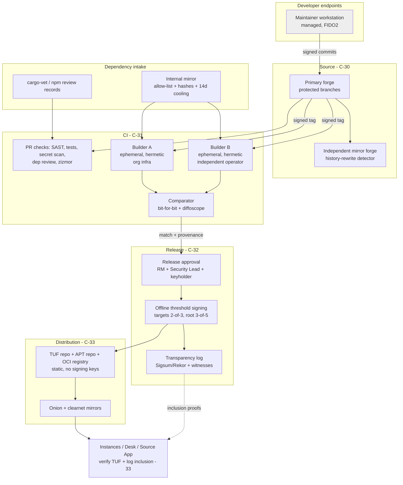

# 28 — Software Supply-Chain Security
Status: Draft v1.0 · Edition applicability: both (identical trust-path artefacts for CE and EE, ADR-022) · Owner: Release & Supply-Chain Engineering

## 1. Purpose and scope

This document specifies the controls that protect Candor from a compromised dependency, developer, repository, CI system, builder, signing key or distribution server. It covers the path from a developer's keystroke to a verified package on an instance:

- source integrity (signed commits/tags, protected branches, mandatory review, SLSA v1.2 Source track);
- dependency intake (pinning, hashes, lockfiles, cargo-vet/cargo-deny, the npm policy for the Candor Desk UI, vendoring, internal mirrors, dependency review);
- in-pipeline security checks (SAST, DAST, fuzzing, secret scanning), which are specified as tests in `29-SECURITY-TESTING.md`;
- build integrity (SLSA v1.2 Build L3, in-toto provenance, reproducible builds with ≥2 independent builders and diffoscope, isolated ephemeral builders, GitHub Actions hardening);
- release integrity (offline threshold signing, multi-person approval, SBOM, transparency logging, package repository hardening, no "latest" downloads);
- an incident→requirement table covering every supply-chain incident in R3 (INC-37..INC-52) plus the R1/R2 cases.

Client-side update verification (TUF client behaviour, rollback/freeze handling, update UX) is owned by `33-RELEASE-UPDATE-SECURITY.md`. This document owns the **producing** side and the repository side.

Honest language: these controls are designed to make a supply-chain compromise of a released Candor artefact require the simultaneous compromise of several independent parties, and to make it detectable when it happens. They do not make it impossible (§14).

## 2. Context and dependencies

| Document | Relationship |
|---|---|
| `DECISIONS.md` | ADR-019 (stack, cargo-vet/deny, pinned lockfiles), ADR-020 (open-core, simultaneous fixes), ADR-022 (TUF, threshold 3-of-5 root / 2-of-3 targets, ≥2 builders, transparency log, no per-customer builds), ADR-006 (release roots Ed25519 + ML-DSA-65), ADR-004 (Tier V client integrity, WEBCAT) |
| `27-SECURE-DEVELOPMENT.md` | Tiers T0/T1/T2, review rules, gates SG-02/SG-05/SG-13/SG-14/SG-15 |
| `29-SECURITY-TESTING.md` | ST-008/009/010/011/040–056/130–135 test definitions |
| `33-RELEASE-UPDATE-SECURITY.md` | Update client, release channels, rollout |
| `17-INFRASTRUCTURE.md`, `18-DEPLOYMENT.md` | Instance-side package installation and image digests |
| `36-OPEN-SOURCE-GOVERNANCE.md` | Maintainer admission and removal, keyholder selection |
| `37-SECURITY-AUDIT-PLAN.md` | Supply-chain review and reproducible-build verification audits |
| `31-INCIDENT-RESPONSE.md` | Key compromise, malicious release, and dependency incident playbooks |

Research: R5 §B.2, §B.3, §C [B-CR-42..B-CR-48, B-CR-27]; R3 §5 INC-37..INC-52 (REQ-H-37..REQ-H-52) [B-INC-65..B-INC-82]; R1 SecureDrop build-twice + diffoscope, cargo-vet, zizmor, guarddog, signed apt [B-SD-26, B-SD-27, B-SD-02]; R2 GlobaLeaks install.sh weaknesses (placeholder checksum, TOFU key fetch, global APT trust, `:latest`) [B-GL-05, B-GL-41] and the Twisted dependency CVE [B-GL-40].

## 3. Supply-chain architecture

Trust statement: an attacker who compromises **one** of {one maintainer account, the primary forge, Builder A, Builder B, one release keyholder, the distribution server, one mirror} cannot get a malicious trust-path artefact accepted by an instance without that becoming detectable. The protecting controls are two-person review plus independent mirror, builder agreement, threshold signing, and transparency logging. What remains is a collusion or multi-compromise attack, discussed in §14.

## 4. Source integrity (SLSA v1.2 Source track)

SLSA v1.2 (Nov 2025) introduced the Source track: L1 version control, L2 immutable history + source provenance, L3 enforced technical controls, L4 mandatory two-party review [B-CR-46].

**Target:** Source **L4** for all repositories containing T0/T1 code, and L3 for T2.

| Control | Specification |
|---|---|
| Signed commits | All commits to protected branches signed with hardware-backed keys (SSH `sk-ssh-ed25519@openssh.com` on FIDO2 tokens, or OpenPGP on smartcard). Signing keys registered in `security/allowed_signers` (itself T0-reviewed). Unsigned or unknown-key commits are rejected by the forge and by the CI `commit-sig-verify` job. |
| Signed tags | Release tags are annotated and signed by the Release Manager; builders refuse untagged or unsigned-tag builds for release. |
| Protected branches | `main` and `release/*`: no force-push, no deletion, linear history, required status checks (27 §13 PR subset), required reviews per 27 §11.1, stale-review dismissal, admins included (no bypass), required signed commits, merge queue. |
| Branch-protection-as-code | Forge settings exported nightly and compared with `security/forge-policy.yaml`; drift = alert to Security Lead + blocking release gate SG-02. |
| Mandatory review | Two-party review per 27 §11.1 (satisfies Source L4). Review evidence is taken from the forge API, not from commit trailers. |
| Source provenance | For each release tag, a Source provenance attestation (SLSA Source VSA format; exact predicate type to be fixed when tooling stabilises, see Open issues) states commit, reviewers and branch-protection policy hash; signed by the CI identity and logged. |
| Independent mirror | Every push to `main`/`release/*` is mirrored within 5 minutes to an independently administered forge (different provider and administrators). A mirror job compares ref histories; any non-fast-forward change or missing commit on the primary raises a Critical alert (detects history rewriting after a forge compromise). |
| Access | Write access only for maintainers listed in 36; 2FA with phishing-resistant keys enforced at the organization level; quarterly access review; automated revocation within 1 h of an HR/governance removal event (REQ-H-47 / INC-47). |
| Release tarballs | Source tarballs are generated **deterministically from the signed tag** (`git archive` + fixed mtime) by both builders and compared; no hand-made tarballs exist (INC-37). |

## 5. Dependency intake

### 5.1 General policy
1. **Minimize.** A new direct dependency in T0/T1 requires a written justification (function, alternatives, maintainer health, unsafe count, transitive fan-out) and 2 approvals (27 §11.1). A dependency budget per crate is tracked and increases need Security Lead approval.
2. **Pin exactly.** Every dependency (Rust, npm, Debian packages, OCI base images, CI actions, toolchains, test tools) is pinned to an exact version **and** a cryptographic hash.
3. **One source.** All fetches go through the internal mirror (§5.5). Builders have no other egress during the fetch phase and none during the build phase.
4. **Cooling-off period.** A newly published upstream version is not eligible for adoption until **14 days** after publication, unless it fixes a vulnerability affecting Candor. Security-driven fast-track adoption requires a diff review of the new version. Rationale: the ua-parser-js malicious window was about 4 hours (INC-42), and Shai-Hulud (INC-45) and Ledger Connect Kit (INC-47) were also caught within days.
5. **Human diff review** of every new dependency and every version bump for T0/T1 (INC-40, REQ-H-40), recorded as a cargo-vet audit or an npm review record.
6. **Maintainer-change monitoring.** A daily job compares owners/publishers of every pinned crate/npm package with the last snapshot. A change triggers re-review before the next bump and an advisory to the Security Lead (INC-40, INC-37).
7. **Privileged-daemon dependency manifests.** For C-tor, the web front (if any), PostgreSQL and OpenSSH on appliance images, a reviewed list of transitive shared-library dependencies is stored. Any change fails the image build (REQ-H-37 / INC-37).

### 5.2 Rust (all trust-path code)

| Control | Setting |
|---|---|
| Lockfile | `Cargo.lock` committed for every workspace; builds use `--locked --offline` in the build phase. |
| Vendoring | Release builds use `cargo vendor` output from the fetch phase, verified against `Cargo.lock` checksums; the vendored tree hash is part of provenance. |
| cargo-vet | `supply-chain/config.toml`, `audits.toml`, `imports.lock` committed (the CoverDrop and SecureDrop pattern [B-CR-27, B-SD-26]). Criteria: `safe-to-deploy` for everything shipped in T0/T1; custom criterion **`candor-crypto-reviewed`** (implements a primitive correctly, constant-time where claimed, no unsafe beyond documented) required for crates in the crypto set (`chacha20poly1305`, `aes-gcm`, `hkdf`, `sha2`, `sha3`, `x25519-dalek`, `ed25519-dalek`, `ml-kem`, `ml-dsa`, `x-wing`/`hpke` implementation, `argon2`, `aws-lc-rs`, `zeroize`, `subtle`, `rand_core`, `getrandom`). Imported audit sets only from organizations listed in `supply-chain/trusted-importers.toml`, approved by the Security Lead; imports are re-reviewed yearly. `exemptions` entries carry an expiry ≤ 180 days. |
| cargo-deny | `deny.toml`: `advisories` (RustSec DB mirrored; `vulnerability = deny`, `unmaintained = warn` → deny for T0), `bans` (duplicate crypto crates denied; `openssl`/`openssl-sys` denied except in `candor-fips` feature; any crate with a build script that performs network I/O denied), `sources` (only the internal crates mirror; `git` sources denied), `licenses` (AGPL-compatible allow-list per 36). |
| Build scripts & proc-macros | Inventoried; new `build.rs` or proc-macro dependencies in T0/T1 require explicit approval and a sandboxed build (no network, read-only source). |
| Toolchain | `rust-toolchain.toml` pins an exact version; the toolchain archive hash is verified against the upstream-signed manifest via the mirror. |
| Publishing | If `candor-core` is published to crates.io, publishing uses **trusted publishing (OIDC) from the release workflow only**; no long-lived crates.io token exists on any developer machine (INC-45, REQ-H-45). |

### 5.3 npm policy for the Candor Desk UI (C-15) and any web tooling
The Desk UI is bundled static content inside the Tauri app (ADR-007, ADR-019). No npm code runs on servers or in the source path.

| Control | Setting |
|---|---|
| Package manager | npm ≥ 10 with `package-lock.json` lockfileVersion 3; every entry has `resolved` pointing to the internal mirror and an `integrity` SHA-512. CI fails if any entry lacks `integrity` or resolves elsewhere. |
| Install | `npm ci --ignore-scripts --no-audit --no-fund --offline` from a verified offline cache in the build phase. `.npmrc`: `ignore-scripts=true`, `engine-strict=true`, `save-exact=true`, `registry=<internal mirror>`. Packages that genuinely need a lifecycle script (for example native addons) are **prohibited** in the Desk UI; exceptions require Security Lead approval and run in a separate no-network sandbox with output hashed (INC-42, REQ-H-42). |
| Scope | Runtime dependencies allow-list ≤ 40 direct packages; dev dependencies listed separately and never bundled. The bundle analyzer output (module list) is compared with the allow-list in CI. |
| Review | Every lockfile diff in the Desk UI requires a review record in `supply-chain/npm-reviews.toml` (package, version, reviewer, diff summary). The CI job `npm-review-check` blocks unreviewed changes (INC-40, REQ-H-40). |
| Vendoring | The verified offline cache (tarballs + integrity) is stored in a separate `candor-vendor` repository with signed commits; builders fetch it by commit hash. |
| Typosquatting | The mirror serves only allow-listed names; adding a name requires approval (INC-43, REQ-H-43). |
| Runtime loading | The bundled app loads **no** remote script, style, font or image; CSP `default-src 'self'`; Tauri `dangerousRemoteDomainIpcAccess` absent; no CDN (INC-46, INC-47, REQ-H-46). |
| Malware heuristics | guarddog-style heuristic scan of new/updated packages (as SecureDrop does [B-SD-02]) → SARIF; findings block until reviewed. |

### 5.4 OS packages and container bases
- Debian base: packages resolved from `snapshot.debian.org` at a pinned timestamp through the mirror. The package set and hashes are recorded in `images/<profile>/packages.lock`. Base OCI images are referenced **by digest only**.
- Appliance/VM images are built from these locks. The image manifest (package list + hashes) is part of the SBOM.
- Security updates to the base are adopted through the same review, without a cooling-off period for DSA-announced fixes.

### 5.5 Internal mirrors (S2C2F-style)
Target S2C2F **Level 3** for all ecosystems, and **Level 4 (rebuild from source)** for the crypto set and for C-tor [R5 §C].

| Mirror | Contents | Policy |
|---|---|---|
| crates mirror | Allow-listed crates at pinned versions | Name + version + checksum allow-list; 14-day cooling; RustSec scan on ingest |
| npm mirror | Allow-listed packages | Same; tarball integrity recomputed and compared with the registry value |
| Debian snapshot proxy | Pinned snapshots | Release-file signature checked against the Debian archive keys; hashes recorded |
| OCI mirror | Base images by digest | Signature verification (cosign/Notation where upstream signs) on ingest |
| Toolchain/tool mirror | rustc, cargo-fuzz, diffoscope, linters, SBOM tools | Upstream signature/hash verification on ingest |
| CI actions mirror | Forked copies of third-party Actions at reviewed SHAs | Only mirrored actions may run (§7) |

Mirrors are write-protected: ingestion runs as a separate service identity with 2-person-approved allow-list changes. Two builders use **two separate mirror instances**, operated by the respective builder operators and populated independently from upstream. A dependency tampered at one mirror therefore causes a build mismatch.

### 5.6 Dependency review in PRs
The dependency-review action (mirrored, SHA-pinned) runs on every PR that changes a manifest or lockfile. It posts new/removed packages, licenses, advisories, OpenSSF Scorecard of the upstream repository, install-script presence and `unsafe` delta (cargo-geiger). Blocking conditions:

- a known advisory;
- a disallowed license;
- a Scorecard below 5.0 for a new T0/T1 dependency without approval;
- an install script (npm);
- a git source.

## 6. In-pipeline security checks

| Check | Tool(s) (pinned) | When | Blocking | Test ID (29) |
|---|---|---|---|---|
| SAST (generic) | Semgrep (custom Candor rules + community rules), CodeQL (Rust, JS/TS) | every PR | High/Critical in T0/T1 | ST-008 |
| Rust lints | clippy deny set (27 §12), cargo-geiger | every PR | yes | ST-007 |
| Architectural lints | route registry, safefs, typed logging, RNG, time/ID | every PR | yes | ST-004, ST-005, ST-006, ST-013 |
| Secret scanning | gitleaks + trufflehog (verified-secret mode) on diff, full history weekly, build logs, artefacts and image layers | every PR / weekly / release | yes | ST-009 |
| Dependency vulnerabilities | cargo-audit, osv-scanner against SBOM | every PR + daily on released SBOMs | High/Critical without VEX | ST-010 |
| License/ban policy | cargo-deny, license checker for npm | every PR | yes | ST-011 |
| DAST | OWASP ZAP (authenticated scans of desk-api/admin-api in lab; unauthenticated source-web scan via Tor in lab), plus the Candor authz matrix | nightly on `main`, release candidate | High on RC | ST-055, ST-060, ST-074 |
| Fuzzing | cargo-fuzz (libFuzzer) with ASan/UBSan where applicable; ClusterFuzzLite in CI; OSS-Fuzz once accepted | PR smoke (5 min/target changed), nightly (4 h/target), release (§27 SG-07) | crashes | ST-040..ST-056 |
| CI config lint | zizmor (as SecureDrop uses [B-SD-02]), actionlint, SHA-pin check | every PR touching `.github/` | yes | ST-133 |
| Malicious-package heuristics | guarddog on new/updated npm packages and Python dev tools | PR changing lockfiles | until reviewed | ST-134 |
| OpenSSF Scorecard | Scorecard on Candor repos | weekly | score < 8.0 or any regression = release gate SG-05 failure until explained | ST-133 |

## 7. CI hardening (GitHub Actions or equivalent)

The primary forge may be GitHub. The same rules apply if a self-hosted forge (Forgejo/GitLab) is used; this spec uses GitHub Actions syntax.

| Rule | Specification | Incident |
|---|---|---|
| Pin by SHA | Every `uses:` references a full 40-hex commit SHA of a **mirrored** fork (`candor-actions/<name>@<sha>`) with a trailing `# vX.Y.Z` comment; tags/branches rejected by ST-133. Docker actions pinned by digest. | INC-44 (REQ-H-44) |
| No remote script execution | No `curl … \| sh`, `wget … \| bash`, `npx <pkg>@latest`, `pip install` without hashes, or unpinned downloads anywhere in CI; lint enforced. External tools come from the tool mirror with hash verification. | INC-39 (REQ-H-39) |
| Least-privilege tokens | Workflow-level `permissions: {}`; jobs request only what they need (`contents: read` typical). `id-token: write` only in provenance/signing-prep jobs. `packages: write` only in the publish job, which runs in a protected environment. | INC-44; INC-45 |
| `pull_request_target` | **Prohibited** in all Candor repos, as are `workflow_run` triggers that check out or execute PR-controlled code with elevated tokens. Fork PRs run on `pull_request` with read-only token and no secrets. | Knowledge (unverified): documented Actions injection class |
| Script injection | No `${{ github.event.* }}` interpolation into `run:` blocks; values passed via `env:` and quoted. zizmor enforces. | Knowledge (unverified) |
| OIDC instead of secrets | Cloud/registry access uses short-lived OIDC tokens bound to repo + workflow + ref + environment; no long-lived secrets in CI variables except the ones enumerated in `security/ci-secrets.md` (target: zero). | INC-39 (REQ-H-39) |
| Environments | `release` environment requires approval by 2 of {Release Manager, Security Lead, Trust-Path Maintainer} and is restricted to signed `v*` tags. | INC-38 |
| Runners | Release builds run only on **ephemeral** runners: a fresh VM per job, destroyed after, no persistent cache across jobs. Self-hosted runners are never attached to public-PR workflows. | INC-38; INC-41 |
| Egress control | Runners run an egress allow-list (mirror hosts, forge API, transparency log, OIDC issuer only); unexpected egress fails the job and alerts. | INC-39; INC-45 |
| Cache isolation | Build caches are keyed per workflow + ref; release jobs use **no** caches written by PR jobs (cache-poisoning defence). | Knowledge (unverified) |
| Logs | Logs private for release workflows; secret masking verified by a canary secret test (ST-009 checks that the canary never appears unmasked). | INC-44 |
| Artefact passing | Artefacts passed between jobs are hashed at production and verified at consumption. | INC-38 |
| CI cannot sign releases | CI holds no release-signing keys (§9). CI's OIDC identity may sign **provenance** and **SBOM attestations** only (Sigstore keyless), which are evidence, not release authorization. | INC-38; INC-48 |

## 8. Build integrity

### 8.1 SLSA v1.2 Build L3
- **Hosted, isolated, ephemeral** build platform. Each build runs in a fresh VM with no access to secrets other than the provenance-signing identity, which is inaccessible to user-defined build steps (SLSA L3 non-forgeable provenance) [B-CR-46].
- **Two phases.** A *fetch* phase has network access only to the mirror. It verifies every input hash (lockfiles, vendor tree, toolchain, base images) and writes a read-only input bundle. A *build* phase has **no network** and consumes only the input bundle. This makes the build hermetic.
- **Provenance** is an in-toto attestation with the SLSA provenance predicate (v1) [B-CR-45]. It records the source repo, commit, signed-tag ID, builder identity, build type, the full resolved-dependency list (with digests: vendor tree, toolchain, base image, mirror snapshot IDs) and the build parameters. Provenance is signed (Sigstore keyless with the builder's OIDC identity, or a builder-held key in an HSM for Builder B) and logged in the transparency log.

### 8.2 Reproducible builds with ≥2 independent builders
| Aspect | Specification |
|---|---|
| Builders | **Builder A**: project CI on the primary forge (ephemeral runners). **Builder B**: an independently operated build service. Its administrators, hosting provider, identity provider and mirror instance must all differ from Builder A's, and no person may have administrative access to both. Builder B may be operated by a partner organization under agreement. **Optional community rebuilders**: anyone may rebuild and publish attestations (37 reproducible-build verification). |
| Determinism | `SOURCE_DATE_EPOCH` = tag commit time; fixed locale/TZ/umask; `--remap-path-prefix`; `-C codegen-units=1` for release crates where needed; sorted archive members; stripped build IDs replaced by deterministic ones; `dpkg` built with `reproducible` settings; OCI images built with deterministic layering (e.g. `buildkit` `SOURCE_DATE_EPOCH`, rewrite-timestamp). |
| Comparison | A comparator job fetches both builders' outputs and provenance and compares SHA-256 of every artefact. **Mismatch = release blocked**, and diffoscope runs automatically to publish a diff report (build-twice + diffoscope, as SecureDrop CI does [B-SD-26]). |
| Scope (must be reproducible) | `.deb` packages for all trust-path services; OCI images for Z-CORE (EE); appliance image contents (package set + config files; the filesystem image itself where the tool supports it); Candor Desk binaries for Linux (AppImage/.deb) and the unsigned payloads for macOS/Windows; Source App Android APK (compared excluding the APK signature block, i.e. apksigcopier-style verification); the optional WEBCAT-signed JS/WASM bundle for Tier V web; `candorctl`; TUF metadata tooling. |
| Known non-reproducible | macOS notarization/codesign and Windows Authenticode signatures are applied **after** comparison to a reproducible unsigned payload; the signature-stripped payload is compared and published. iOS builds (if ever shipped) are not reproducible and are documented as such (residual risk). |
| Gate | 27 SG-13: no signature without match. |
| Unreproducible trust-path package | Blocks release. The SecureDrop situation, where `securedrop-app-code` was not reproducible (a FIXME in its CI [B-SD-26]), is explicitly not accepted for Candor trust-path code. |

### 8.3 Build infrastructure access
- Build and release infrastructure is reachable only from dedicated, managed release workstations authenticated with hardware keys and device attestation. Personal devices are technically barred (INC-41, REQ-H-41).
- Builder operators' own dependencies (OS, container runtime) are patched on a published schedule and inventoried.
- No monitoring/management agent with broad network privileges runs on builders other than the operator's minimal hardening stack (REQ-H-38).

## 9. Release signing, approval and publication

### 9.1 Key architecture (producer side; client verification in 33)
| Role (TUF) | Keys | Threshold | Storage | Expiry of metadata |
|---|---|---|---|---|
| root | 5 keyholders, each a hybrid Ed25519 + ML-DSA-65 pair (ADR-006) | 3-of-5 (ADR-022) | Offline hardware tokens/HSM in ≥3 jurisdictions; no two keyholders from the same employer where feasible | 365 days |
| targets | 3 keyholders (hybrid) | 2-of-3 (ADR-022) | Offline hardware tokens; used in signing ceremonies only | 90 days |
| snapshot | 1 online key (Ed25519) in HSM on the repository signer host (not the distribution server) | 1 | HSM | 7 days |
| timestamp | 1 online key (Ed25519) in HSM | 1 | HSM | 1 day |
| delegated `channel/*` roles (stable, lts, beta) | as targets | 2-of-3 | offline | 90 days |

- Online keys (snapshot/timestamp) cannot authorize new targets. They only prevent freeze and mix-and-match attacks.
- The APT repository `InRelease` and the OCI signatures are *transport conveniences*. The authoritative check is the TUF targets metadata verified by `candor-updater` (33) before any package is installed by hash. This avoids relying on APT's single-key model and on the `trusted.gpg.d` global trust mistake (GlobaLeaks install.sh [B-GL-41]).

### 9.2 Signing ceremony (targets)
1. **Preconditions** (automated check, signed gate bundle): 27 gates pass; builder A/B match; provenance valid for both builders; SBOMs present; release tag signed; Source VSA present.
2. **Approval:** the Release Manager, the Security Lead and one targets keyholder who is not the Release Manager approve in the release tracker. For trust-path **major/minor** releases, a **72-hour cooling window** runs between public announcement of the candidate hashes (transparency log + signed announcement) and signing, during which any keyholder or maintainer may veto. **Emergency security releases** may skip the cooling window with 3 approvals, and a post-hoc review is published within 14 days.
3. **Signing:** each of ≥2 targets keyholders independently downloads both builders' artefacts, verifies them locally with the published `candor-verify` tool (hashes match, provenance, SBOM), and signs the targets metadata on an offline machine. Signatures are collected; nobody holds more than one key.
4. **Logging:** signed targets metadata and artefact hashes are submitted to the transparency log (Sigsum with witness cosigning, or Rekor v2 [B-CR-42]). Clients require inclusion proofs (33).
5. **Out-of-band publication:** release hashes are published on ≥2 independent channels: the transparency log, a signed announcement on the project site **and** its onion mirror, and the independent forge mirror (INC-48, INC-52, REQ-H-48).
6. **Ceremony records:** the video-less written log (who, what hashes, which keys) is signed and archived. Root ceremonies follow the same process with 3-of-5 and an external witness (37 supply-chain review).

### 9.3 SBOM
- Each artefact ships **CycloneDX 1.6 JSON** (including a **CBOM** crypto-asset section listing algorithms, key sizes and libraries, which supports PQC inventory [R5 §C]) **and SPDX 3.0** [B-CR-47; R5 §C].
- SBOMs are generated by both builders and compared (content-equivalent after normalization). They are signed as in-toto attestations, logged, and published beside the artefact and in the TUF targets (custom metadata).
- Completeness: the SBOM must list 100% of crates in `Cargo.lock` that end up in the binary (checked with `cargo auditable` data embedded in binaries), all npm packages in the Desk bundle, and all Debian packages in images.
- **VEX:** exploitability statements (CycloneDX VEX / OpenVEX) are published for known CVEs in dependencies that do not affect Candor, with justification; reviewed by the Security Lead.
- The EU CRA technical file uses these SBOMs (27 SDL-057; [B-CR-50]).

### 9.4 Package repository hardening (C-33)
| Control | Specification | Incident |
|---|---|---|
| No signing keys on distribution | Distribution servers host only static signed files; they cannot create valid metadata. Their compromise yields DoS or freeze (bounded by timestamp expiry), not malicious installs. | INC-49 (REQ-H-49); INC-52 |
| Static hosting | No server-side code on repo hosts; read-only deploys from the release pipeline; separate admin credentials per mirror | INC-52 |
| Onion + clearnet | Repositories reachable via onion service and clearnet; instances in HIGH profile use onion only | ADR-001 |
| No "latest" | No URL, tag or doc refers to a floating version (`latest`, `stable` symlinks, `:latest` image tags). Every download URL includes the version and the docs show the expected SHA-256 **and** how to verify the signature with a fingerprint published out of band. OCI references in docs and Helm/compose files use `@sha256:` digests. | INC-47; B-GL-05 (Docker `:latest`) |
| Installer | No `curl \| bash` installers. The bootstrap is a signed `.deb` (`candor-archive-keyring` + `candor-updater`) whose SHA-256 and signing-key fingerprint are published on ≥2 channels; APT source uses `signed-by=/usr/share/keyrings/candor.gpg` and the keyring is **never** placed in `/etc/apt/trusted.gpg.d/`. The installer verifies TUF root v1 fingerprint against the value typed by the admin. | B-GL-41; INC-52 |
| Checksums | No placeholder checksums in docs. A doc-lint job fails on all-zero/`<hash>` placeholders and verifies every hash in docs against the release manifest. | B-GL-05 |
| Update privacy | Repositories keep no access logs (or logs with IP truncated to /16 and retained ≤ 7 days on clearnet mirrors; none on onion). Update clients send no instance identifiers (ADR-022). | ADR-022; INC-60 |
| Same bits for all | No per-customer builds of trust-path code; the repository serves identical targets to every client. Transparency-log monitors check that each published target hash appears exactly once per version (ADR-022). | INC-14 |

## 10. Developer, maintainer and publishing account security

| Control | Specification | Incident |
|---|---|---|
| Phishing-resistant MFA | FIDO2 required for forge, mirror admin, registry, cloud, and CI settings | INC-42; INC-45; INC-47 |
| No long-lived publish tokens | Registry publishing only via OIDC trusted publishing from the release workflow; token scanners check developer dotfiles on managed endpoints | INC-45 (REQ-H-45) |
| Offboarding | Automatic revocation of forge, mirror, registry, builder and keyholder roles within 1 hour of a removal event; quarterly reconciliation of all publisher/admin lists | INC-47 (REQ-H-47) |
| Maintainer admission | New maintainers with T0/T1 merge rights need a ≥6-month contribution history, sponsorship by 2 existing maintainers, and, for T0, an identity verified by 2 maintainers (pseudonymous contributors are welcome for review, but T0 merge rights require verified identity). Per 36. | INC-37; INC-40 |
| Keyholder independence | TUF root/targets keyholders span ≥2 organizations; keyholder rotation on departure with a root ceremony within 30 days | INC-38; INC-48 |

## 11. Incident → requirement table

| Incident | What failed (1 line) | Candor control(s) | SCM requirement(s) | Test/verification |
|---|---|---|---|---|
| INC-37 xz-utils (2024) [B-INC-65, B-INC-66] | Social-engineered maintainer; backdoor only in release tarball/build scripts; transitive dep of sshd | Build from signed VCS tags only; deterministic tarballs; ≥2 builders; privileged-daemon dependency manifests; maintainer admission rules; cooling-off | SCM-012, SCM-016, SCM-021, SCM-031, SCM-037, SCM-059 | ST-131; manifest-diff CI job |
| INC-38 SolarWinds (2020) [B-INC-67] | Build system compromised; signing certified the build, not the source | SLSA Build L3; independent Builder B; comparison before signing; CI cannot sign | SCM-030, SCM-031, SCM-032, SCM-035, SCM-041 | ST-131; SG-13 |
| INC-39 Codecov (2021) [B-INC-68] | `curl \| bash` uploader modified; CI env secrets exfiltrated | No remote script execution; tool mirror with hashes; OIDC short-lived creds; runner egress allow-list | SCM-008, SCM-024, SCM-025, SCM-027 | ST-133; egress alerts |
| INC-40 event-stream (2018) [B-INC-69] | Maintainer handoff; targeted malicious dependency | Human diff review of every bump; maintainer-change alerts; minimal deps | SCM-009, SCM-011, SCM-020 | `npm-review-check`, `cargo vet` in CI |
| INC-41 3CX (2023) [B-INC-70] | Employee personal device → build env → signed trojan | Release/build infra only from managed hardware-key workstations; ephemeral builders; independent builder | SCM-027, SCM-031, SCM-034 | Access review; device-attestation rejection test |
| INC-42 ua-parser-js (2021) [B-INC-71] | Hijacked npm account; install scripts ran | `--ignore-scripts`; lockfile integrity; 14-day cooling; phishing-resistant MFA | SCM-007, SCM-012, SCM-013, SCM-014 | ST-134 (malicious postinstall canary package does not execute) |
| INC-43 typosquatting [B-INC-72] | Look-alike package names | Mirror allow-list of names + hashes | SCM-017 | ST-135 |
| INC-44 tj-actions (2025) [B-INC-73] | Mutable tags repointed; secrets printed to logs | SHA pinning of mirrored actions; least-privilege tokens; private logs; masking canary | SCM-022, SCM-023, SCM-028 | ST-133; ST-009 log canary |
| INC-45 Shai-Hulud (2025) [B-INC-74] | Worm harvested tokens and republished packages | No long-lived publish tokens; OIDC trusted publishing; no install scripts; cooling-off; egress allow-list | SCM-058, SCM-013, SCM-012, SCM-027 | Registry settings audit; publish-from-laptop negative test |
| INC-46 polyfill.io (2024) [B-INC-75] | Third-party CDN script changed hands | No third-party runtime origins in any UI; everything bundled and hashed | SCM-015 | AT-052; CSP test ST-074 |
| INC-47 Ledger Connect Kit (2023) [B-INC-76] | Ex-employee publish access; dependents loaded "latest" from CDN | Offboarding ≤1 h; no "latest"; pinned digests | SCM-060, SCM-051 | Offboarding drill; doc-lint |
| INC-48 CCleaner (2017) [B-INC-77] | Signed backdoored release from compromised build/distribution | Builder agreement before signing; hashes published on ≥2 independent channels; transparency log | SCM-031, SCM-046, SCM-048 | Release checklist verification; log monitor |
| INC-49 NotPetya / M.E.Doc (2017) [B-INC-78] | Update server compromised; no update signing | Distribution servers hold no keys; TUF threshold metadata; clients reject unsigned/unlogged | SCM-049, SCM-040 | ST-130 (swap update-server contents → rejected) |
| INC-50 Juniper Dual_EC (2015) [B-INC-79] | Unauthorized code change to RNG constant | Signed commits; 2-person T0 review; independent mirror detects history rewrite; single RNG API | SCM-001, SCM-003, SCM-006 | `commit-sig-verify`; mirror comparator; ST-013 |
| INC-51 Debian OpenSSL (2008) [B-INC-80] | Downstream patch to crypto without expert review | No downstream crypto patches without upstream/2 crypto reviewers (27 SDL-018); cargo-vet `candor-crypto-reviewed` | SCM-010 | cargo-vet criteria check; ST-028 |
| INC-52 Linux Mint ISO (2016) [B-INC-81, B-INC-82] | Artefact and MD5 on same compromised server | Signatures with fingerprint published out of band; no same-origin hash reliance | SCM-046, SCM-052 | ST-132 (swap artefact + hash → detected) |
| INC-14 Anom (2018–21) [B-INC-26] | Operator-controlled client with hidden recipient | Same artefact for all customers; transparency monitoring of per-version uniqueness | SCM-050 | Log monitor check; ST-093 (29) |
| SecureDrop app-code not reproducible [B-SD-26] | Partial reproducibility | Every trust-path package reproducible | SCM-032 | ST-131 |
| GlobaLeaks install.sh [B-GL-05, B-GL-41] | Placeholder checksum; TOFU key over TLS; global APT trust; `:latest` | Signed bootstrap .deb; `signed-by`; doc-lint for placeholders; digest pins | SCM-051, SCM-052, SCM-053 | Doc-lint; installer test |
| Twisted CVE-2024-41671 [B-GL-40] | Niche embedded HTTP stack; slow dependency patching | SBOM CVE matching; 72 h triage for network-facing deps (27 §14) | SCM-043, SCM-044 | ST-010 |

## 12. Supply-chain monitoring

| Monitor | Frequency | Alert |
|---|---|---|
| Transparency-log monitor (own + ≥1 independent third party encouraged) | continuous | Any Candor-signed entry not matching a release in the release tracker; any version with >1 target hash |
| Forge mirror comparator | every push + hourly | History divergence |
| Branch-protection drift | nightly | Any drift |
| Maintainer/owner change on pinned deps | daily | Any change |
| SBOM advisory match (released versions) | daily | New High/Critical → triage within 24 h |
| Scorecard | weekly | Regression |
| Keyholder roster vs governance roster | monthly | Mismatch |
| Community rebuilder attestations | per release | Missing or mismatching attestations published on release page |

## 13. Requirements

| ID | Requirement | Evidence | Threats | Component | Verification |
|---|---|---|---|---|---|
| SCM-001 | All commits to protected branches of Candor repositories SHALL be signed with hardware-backed keys listed in `security/allowed_signers`; unsigned or unknown-key commits SHALL be rejected. | INC-50 (REQ-H-50); B-CR-46 | THR-024 | C-30 | TST: `commit-sig-verify` CI job + forge rule; SG-02 |
| SCM-002 | Release tags SHALL be annotated and signed; release builds SHALL refuse unsigned tags. | B-SD-02; B-CR-46 | THR-024; THR-025 | C-30; C-31 | TST: builder negative test with unsigned tag |
| SCM-003 | Protected branches SHALL forbid force-push and deletion, require linear history, required checks and reviews per 27 §11.1 with stale-review dismissal, and SHALL apply to administrators. | B-CR-46; INC-50 | THR-024 | C-30 | TST: `bp-verify` against `security/forge-policy.yaml` nightly |
| SCM-004 | Repositories containing T0/T1 code SHALL meet SLSA v1.2 Source L4 (two-party review) and T2 repositories Source L3. | B-CR-46 | THR-024 | C-30 | AUD: supply-chain review (37); TST: Source VSA generation per release |
| SCM-005 | A Source provenance attestation (commit, reviewers, policy hash) SHALL be produced, signed and logged for each release tag. | B-CR-46 | THR-024 | C-30; C-32 | TST: release pipeline verifies VSA presence and signature |
| SCM-006 | Protected branches SHALL be mirrored within 5 minutes to an independently administered forge, and a comparator SHALL alert on any history divergence. | INC-50; INC-38 | THR-024 | C-30 | TST: mirror comparator self-test with injected rewrite in lab; INSP |
| SCM-007 | Forge write/admin access SHALL require phishing-resistant MFA and SHALL be reviewed quarterly. | INC-42; INC-47 | THR-024 | C-30 | INSP: quarterly access review record |
| SCM-008 | Every dependency (crates, npm, Debian packages, OCI images, CI actions, toolchains, test tools) SHALL be pinned by exact version and cryptographic hash. | INC-39; INC-44; REQ-H-37 | THR-024 | C-31 | TST: `pin-check` job across manifests; ST-133 |
| SCM-009 | Every new dependency and every version bump in T0/T1 SHALL have a recorded human diff review (cargo-vet audit or npm review record) before merge. | INC-40 (REQ-H-40); B-CR-27; B-SD-26 | THR-024 | C-31 | TST: `cargo vet --locked`; `npm-review-check` |
| SCM-010 | Crates in the crypto set SHALL meet the custom cargo-vet criterion `candor-crypto-reviewed`; downstream patches to crypto crates SHALL follow 27 SDL-018. | INC-51; B-CR-27 | THR-012; THR-024 | C-11 | TST: `cargo vet` criteria check; INSP |
| SCM-011 | A new direct T0/T1 dependency SHALL require written justification and two approvals; per-crate dependency budgets SHALL be tracked. | INC-37; INC-40 | THR-024 | C-30 | INSP: PR template; TST: budget check job |
| SCM-012 | Upstream versions SHALL NOT be adopted until 14 days after publication, except for security fixes relevant to Candor, which require a diff review. | INC-42; INC-45; INC-47 | THR-024 | C-31 | TST: mirror ingestion rejects versions younger than 14 days without `security-fasttrack` approval |
| SCM-013 | npm installs SHALL run with lifecycle scripts disabled (`--ignore-scripts`), from a lockfile with SHA-512 integrity for every entry, resolving only via the internal mirror. | INC-42 (REQ-H-42); INC-45 | THR-024 | C-15; C-31 | TST: ST-134; lockfile integrity lint |
| SCM-014 | The Desk UI SHALL NOT depend on packages requiring install scripts or native addons, except with Security Lead approval and sandboxed execution. | INC-42 | THR-024 | C-15 | TST: lockfile `hasInstallScript` check |
| SCM-015 | No Candor UI (source web, Desk, Admin, C-37) SHALL load scripts, styles, fonts or images from third-party origins at runtime. | INC-46 (REQ-H-46); INC-53 | THR-036; THR-024; THR-007 | C-06; C-15; C-19; C-37 | TST: ST-074 CSP golden test; AT-052 |
| SCM-016 | Release builds SHALL consume vendored, checksum-verified dependency trees and SHALL be built from signed VCS tags, never from externally supplied tarballs. | INC-37 (REQ-H-37) | THR-024 | C-31 | TST: provenance lists vendor-tree hash; builder rejects non-tag inputs |
| SCM-017 | Dependency resolution SHALL use internal mirrors serving only allow-listed package names and hashes; adding a name SHALL require approval. | INC-43 (REQ-H-43) | THR-024 | C-31; C-33 | TST: ST-135 |
| SCM-018 | Builders A and B SHALL use separately operated mirror instances populated independently from upstream. | INC-38; INC-41 | THR-024 | C-31 | INSP: operator/admin lists; TST: injected tampering at one mirror → build mismatch (lab) |
| SCM-019 | cargo-deny SHALL enforce advisories, bans (git sources, duplicate crypto crates, openssl outside FIPS feature, network-performing build scripts) and license policy. | ADR-019 | THR-024 | C-31 | TST: ST-011 |
| SCM-020 | Maintainer/owner changes of pinned dependencies SHALL be detected daily and SHALL trigger re-review before the next update. | INC-40; INC-37 | THR-024 | C-31 | TST: daily monitor job with lab fixture |
| SCM-021 | Privileged daemons in appliance images (C-tor, PostgreSQL, OpenSSH) SHALL have reviewed transitive shared-library manifests; changes SHALL fail the image build. | INC-37 (REQ-H-37) | THR-024 | C-05; C-08; C-12 | TST: manifest-diff CI job with injected library |
| SCM-022 | CI SHALL reference third-party actions only by full commit SHA of mirrored forks; tag or branch references SHALL fail CI. | INC-44 (REQ-H-44) | THR-024 | C-31 | TST: ST-133 |
| SCM-023 | Workflow tokens SHALL default to no permissions, with per-job minimal grants; `id-token: write` only in attestation jobs. | INC-44; INC-45 | THR-024 | C-31 | TST: ST-133 (zizmor/actionlint policy) |
| SCM-024 | CI SHALL NOT fetch and execute unpinned remote code (`curl \| sh`, unpinned downloads, `@latest` package runners). | INC-39 (REQ-H-39) | THR-024 | C-31 | TST: ST-133 lint |
| SCM-025 | CI access to clouds and registries SHALL use short-lived OIDC credentials scoped to repo, workflow, ref and environment; the long-lived CI secret inventory SHALL be documented with target zero. | INC-39 (REQ-H-39) | THR-024 | C-31 | INSP: `security/ci-secrets.md`; TST: ST-009 on CI config |
| SCM-026 | `pull_request_target` and privileged `workflow_run` execution of PR-controlled code SHALL be prohibited; fork PRs SHALL run without secrets. | Knowledge (unverified); INC-44 | THR-024 | C-31 | TST: ST-133 |
| SCM-027 | Release and build runners SHALL be ephemeral (fresh VM per job) with an egress allow-list; unexpected egress SHALL fail the job. | INC-38; INC-39; INC-45 | THR-024 | C-31 | TST: egress canary job (attempt to reach non-allowed host fails); INSP |
| SCM-028 | Release workflow logs SHALL be private and secret masking SHALL be verified with a canary secret each release. | INC-44 | THR-024 | C-31 | TST: ST-009 masking canary |
| SCM-029 | Release jobs SHALL NOT use caches written by PR workflows; artefacts passed between jobs SHALL be hash-verified. | INC-38 | THR-024 | C-31 | TST: ST-133 cache-key policy check |
| SCM-030 | Every release artefact SHALL be built on a SLSA v1.2 Build L3 platform (isolated, ephemeral, non-forgeable provenance) in a hermetic two-phase (fetch/no-network build) process. | INC-38 (REQ-H-38); B-CR-46 | THR-024; THR-025 | C-31 | AUD: supply-chain review; TST: build phase network-deny test |
| SCM-031 | At least two independent builders (different administrators, hosting, identity provider and mirror; no shared admin) SHALL build every release artefact, and signing SHALL be refused unless outputs are bit-identical. | INC-38; INC-48; ADR-022; B-SD-26 | THR-024; THR-025 | C-31; C-32 | TST: ST-131; SG-13 |
| SCM-032 | All trust-path packages, the Desk payloads, the Source App APK payload and the Tier V web bundle SHALL be reproducible; a non-reproducible trust-path artefact SHALL block release. | B-SD-26; B-CR-43; B-CR-44 | THR-024; THR-007 | C-31; C-03; C-15; C-06 | TST: ST-131 |
| SCM-033 | On any builder mismatch, diffoscope SHALL run automatically and its report SHALL be published with the incident record. | B-SD-26 | THR-024 | C-31 | TST: comparator lab test with injected byte |
| SCM-034 | Build and release infrastructure SHALL be administrable only from managed, hardware-key-authenticated, device-attested release workstations. | INC-41 (REQ-H-41) | THR-024 | C-31; C-32 | TST: access attempt from unmanaged device rejected (quarterly); INSP |
| SCM-035 | Each artefact SHALL have an in-toto SLSA provenance attestation recording source, tag, builder, build type and all resolved input digests, signed and logged. | B-CR-45; B-CR-46 | THR-024 | C-31 | TST: `candor-verify provenance` in release pipeline; SG-14 |
| SCM-036 | Builder B provenance SHALL be signed with a key or identity not controlled by Builder A's operators. | INC-38 | THR-024 | C-31 | INSP: key custody records; AUD |
| SCM-037 | Source tarballs SHALL be generated deterministically from the signed tag by both builders and compared. | INC-37 | THR-024 | C-31 | TST: ST-131 includes tarball |
| SCM-038 | Candor SHALL publish rebuild instructions and tooling enabling third parties to reproduce every release. | B-CR-43; B-CR-44 | THR-024 | C-31 | DEMO: independent rebuild in reproducible-build audit (37) |
| SCM-039 | Build hosts SHALL NOT run third-party management or monitoring agents with broad network privileges beyond the documented hardening stack. | INC-38 (REQ-H-38) | THR-024 | C-31 | INSP: host inventory audit |
| SCM-040 | Release metadata SHALL follow TUF with offline root 3-of-5 and targets 2-of-3 hybrid (Ed25519 + ML-DSA-65) keys, online snapshot/timestamp keys in HSMs, and expiries root 365 d, targets 90 d, snapshot 7 d, timestamp 1 d. | ADR-022; ADR-006; B-CR-45 | THR-025; THR-024 | C-32 | TST: ST-130 metadata conformance; AUD: ceremony audit |
| SCM-041 | CI SHALL hold no release-signing keys; CI identities MAY sign provenance and SBOM attestations only. | INC-38; INC-48 | THR-024; THR-025 | C-31; C-32 | INSP: key inventory; TST: CI secret inventory scan |
| SCM-042 | Release keyholders SHALL span ≥2 organizations and ≥3 jurisdictions for root; no person SHALL hold more than one key in a role; keyholder departure SHALL trigger rotation within 30 days. | ADR-022; B-CR-40 | THR-024; THR-026 | C-32 | INSP: keyholder roster; AUD: ceremony audit |
| SCM-043 | Each artefact SHALL ship CycloneDX 1.6 (with CBOM) and SPDX 3.0 SBOMs generated by both builders, signed, logged and verified complete against embedded `cargo auditable` data. | R5 §C; B-GL-40 | THR-024 | C-31; C-32 | TST: SBOM completeness job; SG-14 |
| SCM-044 | Released SBOMs SHALL be matched daily against advisory databases; new High/Critical matches SHALL be triaged within 24 h and either fixed or covered by a reviewed VEX statement. | B-GL-40; B-CR-50 | THR-024 | C-32 | TST: ST-010 daily job; INSP: VEX records |
| SCM-045 | Releases SHALL be approved by the Release Manager, the Security Lead and one targets keyholder; trust-path major/minor releases SHALL observe a 72-hour public cooling window before signing, except emergency releases with 3 approvals and post-hoc review within 14 days. | R5 B.3 row 2; INC-48 | THR-025; THR-024 | C-32 | INSP: release tracker records; TST: signing tool enforces approvals |
| SCM-046 | Release hashes SHALL be published on ≥2 independent channels (transparency log, signed announcement on site and onion mirror, independent forge mirror). | INC-48 (REQ-H-48); INC-52 | THR-025 | C-32; C-33; C-37 | TST: release checklist automation verifies presence on each channel |
| SCM-047 | Each targets keyholder SHALL independently verify both builders' artefacts, provenance and SBOM with `candor-verify` on an offline machine before signing. | INC-38; INC-48 | THR-024; THR-025 | C-32 | INSP: ceremony log; AUD |
| SCM-048 | Signed metadata and artefact hashes SHALL be logged in a witness-cosigned transparency log, and a monitor SHALL alert on any entry not matching the release tracker. | B-CR-42; R5 B.2; ADR-022 | THR-025; THR-007 | C-32; C-14 | TST: monitor lab test with rogue entry |
| SCM-049 | Distribution servers and mirrors SHALL hold no signing keys and SHALL serve only static files deployed read-only by the release pipeline. | INC-49 (REQ-H-49); INC-52 | THR-025 | C-33 | TST: ST-130 (replaced repo content rejected); INSP |
| SCM-050 | The repository SHALL serve identical trust-path artefacts to all clients; monitors SHALL verify at most one target hash per version and channel. | ADR-022; INC-14 | THR-025; THR-046 | C-32; C-33 | TST: log monitor uniqueness check |
| SCM-051 | No download URL, documentation example, image reference or installer SHALL use floating versions ("latest", mutable tags); OCI references SHALL use digests. | INC-47; B-GL-05 | THR-024; THR-025 | C-33; C-37 | TST: doc-lint and manifest-lint |
| SCM-052 | Installation SHALL NOT use `curl \| bash`; the bootstrap SHALL be a signed package with fingerprint published out of band; the APT keyring SHALL be scoped via `signed-by` and never placed in `trusted.gpg.d`. | B-GL-41; INC-52 (REQ-H-52) | THR-024; THR-025 | C-33; C-19 | TST: installer integration test; ST-132 |
| SCM-053 | Documentation SHALL contain no placeholder checksums; a doc-lint job SHALL verify every published hash against the release manifest. | B-GL-05 | THR-025 | C-37 | TST: doc-lint |
| SCM-054 | Package repositories SHALL keep no access logs on onion endpoints and, on clearnet mirrors, at most /16-truncated IPs retained ≤7 days; update requests SHALL carry no instance identifiers. | ADR-022; INC-60 | THR-036; THR-001 | C-33 | TST: AT-063 capture of update requests; INSP: mirror config |
| SCM-055 | Secret scanning SHALL run on every PR diff, weekly on full history, and on build logs, artefacts and image layers of every release. | INC-44; INC-58 | THR-024; THR-013 | C-30; C-31 | TST: ST-009; SG-15 |
| SCM-056 | SAST, DAST, fuzzing and dependency review SHALL run at the frequencies and with the blocking rules in §6. | B-CR-47; R5 §C | THR-024; THR-021; THR-023 | C-31 | TST: 29 CI gating matrix; INSP |
| SCM-057 | OpenSSF Scorecard SHALL run weekly; overall score SHALL be ≥8.0 and any check regression SHALL be explained before the next release. | R5 §C | THR-024 | C-30 | TST: Scorecard job; SG-05 |
| SCM-058 | Publishing to any package registry SHALL use OIDC trusted publishing from the release workflow only; no long-lived publish token SHALL exist on developer machines. | INC-45 (REQ-H-45) | THR-024 | C-31; C-33 | TST: negative publish test from developer machine; INSP: registry settings |
| SCM-059 | Maintainers with T0/T1 merge rights SHALL meet admission rules (≥6 months history, 2 sponsors; verified identity for T0) defined with 36. | INC-37; INC-40 | THR-024 | C-30 | INSP: admission records |
| SCM-060 | All forge, mirror, registry, builder and keyholder access SHALL be revoked within 1 hour of a removal event, and publisher lists SHALL be reconciled quarterly. | INC-47 (REQ-H-47) | THR-024 | C-30; C-31; C-32; C-33 | DEMO: offboarding drill each quarter |
| SCM-061 | The internal mirrors SHALL meet S2C2F Level 3 for all ecosystems and Level 4 (rebuild from source) for the crypto set and C-tor. | R5 §C | THR-024 | C-31 | AUD: supply-chain review; INSP |
| SCM-062 | Transitive dependency counts and `unsafe` totals SHALL be reported per release and increases in T0/T1 SHALL require Security Lead approval. | INC-37; ADR-019 | THR-024 | C-31 | TST: geiger/count diff job |
| SCM-063 | Branch protection, forge settings and CI policies SHALL be defined as code and compared nightly with the live configuration; drift SHALL alert and block release. | INC-44; B-CR-46 | THR-024 | C-30; C-31 | TST: `bp-verify` drift test |
| SCM-064 | Toolchains used by Builder A and Builder B SHALL be obtained via independent download paths and verified against upstream-signed manifests. | Knowledge (unverified): trusting-trust class | THR-024 | C-31 | INSP: builder configuration; AUD |

## 14. Residual risks and limitations

- **Upstream compromise at the source** (a malicious commit in a dependency that passes review). Reproducible builds faithfully reproduce the backdoor. cargo-vet/npm reviews are diff reviews by humans and can miss obfuscated code (INC-37 was found by performance anomaly, not review). The 14-day cooling window only helps if someone else detects the problem first.
- **Colluding or coerced parties.** Two colluding reviewers plus two targets keyholders plus a compromise of both builders' inputs could ship a malicious release. The transparency log makes it *visible*, not impossible. Legal compulsion of keyholders (THR-026) is mitigated by multi-jurisdiction custody (SCM-042), not eliminated.
- **Toolchain trust.** rustc/LLVM, Debian, and the Linux kernel are trusted roots. Both builders use the same upstream toolchain binaries (from independent paths), so a backdoored upstream toolchain is not detected (SCM-064 only defends against path tampering).
- **macOS/Windows/iOS signing.** Platform signatures are applied after comparison. Apple/Microsoft infrastructure and our platform code-signing certificates are trusted third parties outside the threshold scheme.
- **Forge provider.** If GitHub (or another hosted forge) is compromised or compelled, the independent mirror detects history rewrites but not a malicious change that goes through normal review UI manipulation (for example forged approvals in the forge database). Mitigation is partial: review evidence is cross-checked with signed commits, and Source VSAs are logged.
- **Community rebuilders are optional.** If none participate, the two-builder guarantee rests on the two contracted operators.
- **Some control values** (14-day cooling, Scorecard 8.0) are engineering judgements.

## 15. Open issues

1. Final SLSA Source-track attestation predicate (VSA/source provenance) format and tooling maturity (2026). Fix a predicate type in 33.
2. Selection and contract for the Builder B operator. Candidates: a partner NGO, or a separate legal entity with distinct administrators.
3. Sigsum vs Rekor v2 as the primary transparency log, and the witness set (coordinate with C-14 key transparency in 04/33).
4. Whether apksigcopier-style APK reproducibility is sufficient for Play-distributed builds. F-Droid reproducible builds are the preferred distribution.
5. Whether ML-DSA-65 signing is supported by available hardware tokens for keyholders. Fallback: software ML-DSA on the offline ceremony machine, with Ed25519 on hardware tokens.
6. OSS-Fuzz acceptance for `candor-core` (affects ST-056 scale).

### Open Issues for ADR revision
- None blocking. Note for ADR-022: this document adds online snapshot/timestamp keys (standard TUF) and metadata expiries. ADR-022 fixes only the root/targets thresholds. It does not conflict, but the expiries should be referenced from ADR-022 so that 33 and 28 cannot diverge.
