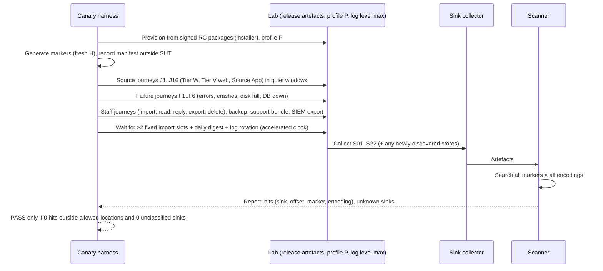

# 30 — Anonymity and Metadata-Leak Testing
Status: Draft v1.2 (final consistency pass: ADR-047) · previously v1.1 (revision round 2: ADR-034..046, REVIEW-A/B/C) · Edition applicability: both (EE-only sinks such as SIEM export and Fleet Manager tested in EE matrix) · Owner: Security Engineering — Anonymity Verification (with UX Research for §10)

## 1. Purpose and scope

Conventional security tests check that attackers cannot get in. This document checks what Candor itself **writes down, emits or reveals** about sources, and what an adversary who compromises or seizes a component would **learn**. It specifies:

1. **Instrumented canary tests** (AT-001..AT-019). Unique marker values (network identity, User-Agent, filename, file content, message text, passphrase, exact action times, sizes, circuit/stream IDs) are injected through full source journeys. Then **every** sink is scanned: application logs, reverse-proxy/web-server logs (which must not exist on the path), tor logs, journald, kernel logs, all database tables including WAL, metrics, tracing, SIEM, APM, crash dumps, backup contents and metadata, support bundles, the notification outbox and audit logs. **Any hit is a security regression and a release blocker.**
2. **Compromise drills** (AT-020..AT-032, AT-084). "Compromise the DB, the log server, the application servers, the SIEM; seize backups; steal an admin credential; steal a recipient device; ship a malicious update": each has a procedure and an expected, minimized answer to "what is learned?".
3. **Timing and size leak tests** (AT-040..AT-048): timestamp granularity, ordering, response timing, padding.
4. **Fingerprinting and third-party request tests** for the source UI (AT-050..AT-058): no JavaScript, storage or cookies beyond the session, and no external requests (network capture during the full source flow).
5. **Mode-confusion, notification content, telemetry-off and aggregate k-threshold tests** (AT-060..AT-068).
6. A **usability-security study programme** (AT-070..AT-075) with nontechnical whistleblowers, investigators, HR, compliance staff, journalists, administrators and users of assistive technology.
7. **Inferential tests** (AT-080..AT-083, AT-085; §9A). Literal-marker canaries cannot detect leaks that carry no marker (bucket transitions, event timestamps, per-channel counts, exclusion rows keyed by user ID). These tests measure information flow: timing correlation, visit-day intersection, exclusion inference, small-cell/differencing across every aggregate surface, and consistency of the anonymity parameters across specs and fixtures (RVW-B-29).
8. **Revision-control leakage tests** (AT-069, AT-076..AT-079, AT-084, AT-086; §9B and §6) for the controls of ADR-034..ADR-039 and ADR-036(7): RAM-only drafts, fixed-schedule import, fetch-all reply retrieval, joint uniqueness of cleartext fields, blinded COI, triage-first routing and directory publication cadence. Enforcement of the same controls is tested in 29 §14A.
9. **Final-round leakage tests** (AT-087..AT-094; §9C) for ADR-047: chaff envelopes, encrypted follow-up dates (AT-081 updated), per-case metadata erasure, Source App vault, intake deletion list after DR, IDENTIFIED-over-onion mode banner, freshness fail-closed and passphrase-confirmation loss.

Requirements on the programme itself use **ANT-** IDs (§12).

Honest language: these tests show that the tested markers did not reach the scanned sinks under the tested journeys and configurations. They cannot prove that no metadata leaks exist. Unscanned sinks, untested journeys and side channels remain. The compromise drills describe what Candor's design is *intended* to limit an adversary to. They are validated against a lab system, not every real deployment.

## 2. Context and dependencies

| Document | Relationship |
|---|---|
| `DECISIONS.md` | ADR-001/002/003 (onion only, modes, no fingerprinting), ADR-004 (Tier W/V), ADR-005 (passphrase), ADR-007/008 (key custody, epochs), ADR-009 (intake/core), ADR-010 (timing), ADR-011 (padding), ADR-014 (sealed identity), ADR-016 (audit classes, typed logging), ADR-017 (content-free notifications), ADR-022/023 (updates, telemetry), ADR-025 (deletion), ADR-028 (secret placement), ADR-030/033 (member epoch keys, anonymous slots, Erasure Key Vault), **ADR-034..ADR-046** (binding revision ADRs; they supersede earlier text, including ADR-009's 15±10 min pull timing for import, ADR-010's import-time handling and ADR-017's hourly digest) |
| `03-PRIVACY-ANONYMITY.md` | Owns the **compelled/compromise disclosure inventory** (the expected answers are generated from its machine-readable form, ANT-034) and the prohibited-field list |
| `24-LICENSING-BUSINESS-MODEL.md` §TEL | **Single source of truth for the metrics regime** (ADR-046(5): k = 10, monthly minimum period, complementary suppression, magnitude rules, per-channel floor, SOC daily health bands). AT-065/066/085 reference it and do not restate it |
| `09-DATABASE.md` | Column classifications (SS/WF/SEC) and the enumerated tables permitted to hold exact staff timestamps (ADR-046(11)); drill oracles are generated from them |
| `39-REQUIREMENTS-TRACEABILITY.md` | Constants registry used by AT-083 / 29 ST-167 |
| `20-LOGGING-AUDITING.md` | Typed event schema; sink inventory must match it |
| `11-FRONTEND-SOURCE.md` | Source UI cookie/session/padding behaviour under test (SUI-); canonical owner of page size classes and the session cookie |
| `16-TOR-I2P.md` | tor configuration under test (NET-) |
| `19-BACKUPS-DR.md` | Backup contents and metadata |
| `24-LICENSING-BUSINESS-MODEL.md` | Telemetry schema (TEL-) |
| `26-ACCESSIBILITY.md` | Accessibility targets used in §10 |
| `27-SECURE-DEVELOPMENT.md` | Gates SG-10, SG-11, SG-12, SG-24 |
| `29-SECURITY-TESTING.md` | Shared lab (E2 candor-lab with chutney Tor, E4 live-Tor staging, E5 profile matrix) |
| `40-SECURITY-ASSUMPTIONS.md` | ASM-* assumptions (e.g., Tor anonymity, endpoint integrity) that bound what these tests can claim |

Research basis: R3 INC-60 (Facebook plaintext logs), INC-56 (Okta HAR), INC-58 (crash dump key), INC-53 (Meta Pixel), INC-34 (onion misconfiguration), INC-33 (Silk Road IP leak), INC-16 (Reality Winner timing/audit), INC-55 (LastPass backups), INC-57 (push metadata), INC-74 (Strava aggregates) and REQ-H-06/10/25/27/33/34/55/56/60/70/74 [B-INC-29..B-INC-32, B-INC-60, B-INC-61, B-INC-83..B-INC-93, B-INC-111]; R4 application-layer attacks, fingerprinting, timing correlation [B-AN-01..B-AN-05, B-AN-14..B-AN-22]; R1 logging practice and SEC-01-016 logging tension, GHSA-rqwh secret placement [B-SD-13, B-SD-21, B-SD-22]; R2 GlobaLeaks logs staff IPs by default; Hush Line PRIVACY.md "no IP in database" [B-GL-04, B-GL-34]; R6 accessibility and COGA [B-CO-28, B-CO-36].

## 3. Principles

1. **Any hit is a blocker.** A canary marker found in any sink outside its documented allowed location is a SEV-1 anonymity regression. Gate SG-10 is non-waivable (27 §13.2).
2. **Test the release artefacts** (signed candidate packages), installed by the real installer in each deployment profile, not developer builds.
3. **Test the worst permitted configuration.** Every canary run is repeated at the most verbose logging and diagnostics settings the configuration schema permits without a DANGEROUS flag, and separately with each DANGEROUS diagnostic flag. For DANGEROUS flags, the expected result may differ, but the difference must match the flag's documented warning text.
4. **Scan everything, including what "should not exist".** The sink inventory (§4.3) is enumerated by crawling the hosts, not only from the design. Any new file, table or stream discovered on a host that is not in the inventory fails the run until classified (ANT-004).
5. **Expected answers are documentation, generated not hand-written.** Compromise-drill answers must be a subset of the published disclosure inventory in 03. The expected-answer files are generated from the machine-readable 03 §10 inventory, which is itself checked against the 09 column classifications; any SS-class column absent from the inventory fails the build (ANT-034; RVW-B-29). Hand-written notes in §6.3 are explanatory; the generated oracle is authoritative, and over-broad expectations ("union of …", "upper bound …") are not permitted as oracle entries. If a drill finds more, either the product is fixed or 03 and the source-facing guidance are updated (ANT-011) before release.
6. **Absence of markers is not absence of information.** Marker scans are complemented by inferential tests (§9A) that measure what can be predicted about submission time, visit days, exclusion status or single submissions from the data an adversary holds.

## 4. Canary methodology

### 4.1 Markers

Each run generates fresh random markers (128-bit hex `H`). The harness records all markers in a run manifest held **outside** the system under test.

| Marker | Value / construction | Injection point | Allowed location(s) on platform |
|---|---|---|---|
| M-IP4 / M-IP6 | Unique per run: `198.51.100.x` / `2001:db8:<H[0:4]>::<H[4:8]>` (documentation ranges) assigned to the source client's network namespace; traffic enters the platform only via chutney Tor (E2) or real Tor (E4) | Client network identity | **None** (the platform must never see it) |
| M-IP-HDR | The same IP strings injected in `X-Forwarded-For`, `Forwarded`, `X-Real-IP`, `True-Client-IP`, `CF-Connecting-IP`, `Via`, `Client-IP` request headers (header-smuggling attempt) | HTTP headers | **None** |
| M-UA | `Mozilla/5.0 (Windows NT 10.0; rv:140.0) Gecko/20100101 Firefox/140.0 CndrCnry-H` (test profile override) | User-Agent header | **None** |
| M-LANG | `Accept-Language: x-cndr-H` | Header | **None** |
| M-FNAME | `cnry-H-Quarterly report ü.pdf` | Upload filename (multipart `filename`), Source App file picker | Only inside encrypted envelope (never plaintext on any server; in C-15 only in encrypted local store and in C-17 disposable VM) |
| M-FCONTENT | File containing `CNRYFILE-H` repeated, a JPEG with EXIF `Artist=cnry-H`, GPS `12.3456789,-65.4321098`, a DOCX with `dc:creator=cnry-H` | Attachments | Same as M-FNAME |
| M-MSG | Message text `cnry-msg-H` plus questionnaire answers `cnry-form-H` | Text fields | Encrypted only |
| M-PASS | The generated source passphrase (captured by harness from the page/app), its Argon2id seed, derived auth key and public keys (computed by harness) | Tier W generation, login | Passphrase and seed: **none**. Source public keys and auth verifier: only the designated C-08 columns and sealed relay batches |
| M-SESSION | Session cookie value | Source web session | Nowhere persistent (memory only) |
| M-CIRC | tor circuit IDs and stream IDs observed for the harness's connections (read from the lab tor control port at C-05) | Tor transport | Nowhere persistent (in-memory rate limiter only, ADR-026) |
| M-TIME | Exact UTC time T of each source action (submit, upload, login, read reply, send reply, delete), performed inside a **quiet window** of ±10 min with no other scripted activity | Source actions | Only `received_epoch_day` (date), batch number and the fixed import slot time (ADR-038(1)); no time value anywhere in the platform that is finer than day granularity and not equal to a registered slot time (checked for **all** time-bearing values, not only those within ±600 s of T; see AT-040, AT-077, AT-080) |
| M-SIZE | Unique content sizes (for example text 3,217 bytes; file 1,337,421 bytes) | Sizes | No exact plaintext size anywhere; only padded bucket sizes (ADR-011) |
| M-TZ | Browser/app time zone and locale set to rare values (`Pacific/Chatham`, `kl-GL`) | Client environment | **None** |

### 4.2 Encodings and transformations searched
For every marker, the scanner searches:

- plain text (case-sensitive and case-insensitive);
- URL/percent encoding, HTML entities, JSON-escaped and quoted-printable forms;
- base64 (standard and URL-safe, all 3 alignments) and hex (lower/upper);
- UTF-16LE/BE;
- IPs as integers and reverse-DNS form, plus /24 and /48 prefixes ("198.51.100.");
- unkeyed digests (SHA-256, SHA-1, MD5, BLAKE3) of each marker and of lowercase forms;
- Unix epoch seconds/milliseconds/microseconds/nanoseconds, ISO-8601 and PostgreSQL text forms for M-TIME;
- decimal and hex forms for M-SIZE.

Compressed containers are decompressed before scanning: gzip, zstd, lz4, xz, zip, tar and journald compressed fields. PostgreSQL TOAST is covered by the logical dump. Keyed hashes (HMACs) cannot be detected by scanning. Code paths that compute keyed hashes of source attributes are prohibited by 20/03 and checked by INSP of the typed-log schema.

### 4.3 Sink inventory (scanned in every canary run)

| # | Sink | Host / zone | Collection method | Expected |
|---|---|---|---|---|
| S01 | Application logs (C-06, C-07, C-09, C-10, C-21, C-23, C-24 local buffers) | Z-INTAKE, Z-CORE | journald export + any files under `/var/log`, `/var/lib/candor/*/log` | 0 hits |
| S02 | Reverse-proxy / web-server access and error logs | Z-INTAKE | Assert **no** access-log configuration and no such files exist on the source path (tor → C-06 directly over Unix socket); scan error logs if any | Files absent; 0 hits |
| S03 | tor daemon logs | C-05 | tor log files + journald; config asserts `SafeLogging 1`, `Log notice` | 0 hits |
| S04 | journald (all units) | all hosts | `journalctl -o export` full, including compressed fields | 0 hits |
| S05 | Kernel logs / audit | all hosts | `dmesg`, `/var/log/kern.log`, auditd logs, conntrack table dump | 0 hits |
| S06 | Intake DB (C-08) | Z-INTAKE | `pg_dump` (all schemas incl. catalog stats) **and** raw scan of PGDATA incl. `pg_wal/`, `pg_xact/`, temp files, `pg_stat_statements` view, `pg_stat_activity` snapshots, PostgreSQL server logs | Hits only in allowed columns (M-PASS public values) |
| S07 | Case DB (C-12) | Z-CORE | Same as S06 | 0 hits (source public keys may appear only in designated reply-routing columns if 09 defines them) |
| S08 | Blob stores (C-08 blob dir, C-13) | both | Raw scan of files; verify files are ciphertext (entropy ≥ 7.9 bits/byte, format header); filesystem metadata listing (names, mtimes) | 0 plaintext hits; names random; mtimes normalized per AT-040 |
| S09 | Metrics (Prometheus/OpenMetrics endpoints, TSDB on C-25) | Z-SOC | Scrape all endpoints; scan TSDB blocks; label cardinality report | 0 hits; no per-source labels |
| S10 | Tracing / APM (if any exporter configured) | all | OTLP collector in lab captures all spans/attributes | 0 hits; no spans on the source path carrying request attributes |
| S11 | SIEM export (C-26, EE) | Z-SOC → lab SIEM | Capture every exported event at the lab SIEM | 0 hits |
| S12 | Crash dumps / panic output | all | Force panics/crashes (AT-011); check `systemd-coredump`, `/var/crash`, `/var/lib/apport`, stderr captured in journald | No dumps exist; 0 hits |
| S13 | Backup contents and metadata (C-27) | Z-BAK | Scan backup archives (decrypting with backup keys available to the lab operator) **and** unencrypted backup metadata (manifests, file names, catalog DB, object-store keys, timestamps) | 0 hits; metadata contains no source-linked times finer than day |
| S14 | Support bundles | Z-ADM (generated by `candorctl support-bundle`) and Desk diagnostics | Generate bundles at max verbosity; scan | 0 hits (REQ-H-56) |
| S15 | Notification outbox (C-23) and delivered notifications | Z-CORE; lab mailpit / Matrix / webhook sinks | Scan outbox table, queue, SMTP transcripts, delivered bodies and headers | 0 hits; content = fixed template (AT-062) |
| S16 | Audit log (C-24) all classes + checkpoints + external witness anchors | Z-CORE | Export and scan all streams | 0 hits; no SOURCE-SENSITIVE events |
| S17 | Filesystem sweep | all hosts incl. `/tmp`, `/var/tmp`, `/dev/shm`, home dirs, package caches | Full-disk file scan + raw block-device scan of intake hosts | 0 hits |
| S18 | Swap / hibernation | all | Assert no swap and no hibernation image configured | Absent |
| S19 | Recipient side (C-15 local logs, OS logs, thumbnail caches, recent-files lists, clipboard history, C-17 VM after destruction) | Z-RCP, Z-VIEW | Scan Desk data dir (only encrypted store may contain markers, and it must be ciphertext), OS logs/caches, verify C-17 VM image destroyed | 0 plaintext hits outside encrypted store |
| S20 | Update requests and telemetry (if enabled) | all → lab mirror | Capture update client requests | 0 hits; no instance identifier (ADR-022) |
| S21 | Host-level tooling (C-25 monitor agent, hardening agents, IDS such as OSSEC/Wazuh if used) | all | Scan agent state/queues/alerts | 0 hits |
| S22 | HTTP responses (reflection) | Z-INTAKE | Capture all responses to the harness | Markers appear only where the source themselves submitted them in their own session view (for example their own message when viewing it) and never in error pages |
| S23 | Tier W tmpfs staging area and sealer RAM residue after session end (ADR-034) | Z-INTAKE | Listing + content scan of the staging mount after every journey and after sealer restart; heap scan per 29 ST-027 | Empty after session end; 0 hits |
| S24 | Public Key Directory entries, witness cosignatures, OPERATOR_STATEMENT and INCIDENT_NOTICE entries, watcher publications | C-14 / public | Fetch all published entries over Tor | 0 hits; publication times only at the weekly slot (AT-086) |
| S25 | Fleet Manager and vendor support stores (EE); MANAGED operator views | Z-VENDOR | Dump lab vendor stores | 0 hits; content per AT-032 |

### 4.4 Procedure

Source journeys:
- **J1** first submission (text only);
- **J2** submission with 3 attachments (M-FCONTENT);
- **J3** return login + read reply;
- **J4** send follow-up message;
- **J5** failed login (wrong passphrase);
- **J6** unknown account login;
- **J7** abandoned submission (form partly filled, session expires);
- **J8** source-initiated deletion (if offered);
- **J9** oversized upload rejected;
- **J10** draft (text + identity block + 2 staged attachments) left idle until the 20-min expiry;
- **J11** draft interrupted by sealer crash (`kill -9`), then restart;
- **J12** draft interrupted by intake VM power-off;
- **J13** Tier V fetch-all reply retrieval (mailboxes with 0, 1 and many replies);
- **J14** submission with COI ticks (one triage role, one non-triage role) and a follow-up;
- **J15** submission with delayed delivery (ADR-038(4));
- **J16** passphrase confirmation failure and dropped confirmation response (ADR-034).

Failure journeys:
- **F1** C-07 crash during seal;
- **F2** DB unavailable;
- **F3** disk full on intake;
- **F4** malformed multipart;
- **F5** relay pull failure;
- **F6** notification delivery failure.

Profiles: CE-SINGLE, CE-HARDENED and EE-ONPREM nightly; all 8 profiles (ADR-024) at RC.

### 4.5 Hit handling
- The run fails; SEV-1 ticket; `main` is marked not releasable.
- Root-cause analysis within 5 business days (27 SDL-051). The fix includes a regression test and a structural control where possible (27 SDL-052), for example a new typed-log lint.
- An allow-list entry is possible **only** for the allowed locations in §4.1. The entry must identify table/column or file path and prove that the content there is ciphertext or a permitted public value. It needs two approvals (Anonymity Reviewer + Security Lead).

## 5. Canary test catalogue (AT-001..AT-019)

| ID | Name | What it proves | Method | Frequency | Gating? |
|---|---|---|---|---|---|
| AT-001 | Canary full-flow Tier W | No marker from J1–J16 reaches any sink S01–S22 outside allowed locations (Tier W no-JS web) | §4.4 with headless Tor Browser at Safest over chutney | Nightly (3 profiles), RC (8 profiles) | Yes (release blocker) |
| AT-002 | Canary full-flow Tier V (web bundle + Source App) | Same for Tier V clients; additionally server never receives plaintext markers (only ciphertext) | §4.4 with WEBCAT-verified bundle (when available) and C-03 | Nightly, RC | Yes |
| AT-003 | App-log sink | S01 = 0 hits at max permitted log level | Subset scan | Nightly, RC | Yes |
| AT-004 | No access logs on source path | S02 files absent; web/access logging disabled in shipped config; C-06 peer address is always Unix socket/loopback | Config + filesystem assertions; C-06 debug endpoint absent | PR (config), nightly, RC | Yes |
| AT-005 | tor logs | `SafeLogging 1`, level ≤ notice; no marker or circuit/stream IDs in logs | Config + scan | Nightly, RC | Yes |
| AT-006 | journald/kernel/conntrack | S04/S05 = 0 hits; conntrack on intake shows no marker IP (only tor ↔ relays) | Scan + `conntrack -L` snapshots during journeys | Nightly, RC | Yes |
| AT-007 | Databases incl. WAL | S06/S07 = 0 hits outside allowed columns; `pg_stat_statements` disabled or parameters normalized; `log_statement=none`, `log_min_error_statement=panic`, `log_connections=off` on intake DB | Logical + raw scans | Nightly, RC | Yes |
| AT-008 | Metrics | S09 = 0 hits; no metric label derived from request attributes; source-related counters only as defined in 20 | Scrape + TSDB scan | Nightly, RC | Yes |
| AT-009 | Tracing/APM | S10 = 0 hits; source-path spans (if any) carry no attributes | OTLP capture | Nightly, RC | Yes |
| AT-010 | SIEM export | S11 = 0 hits; only allow-listed event types exported (ADR-016/018) | Lab SIEM capture | Nightly (EE), RC | Yes |
| AT-011 | Crash dumps | Induced crashes of C-06/C-07/C-09/C-10/C-15 produce no dumps and panic messages carry no markers | Signal/panic injection + S12 | Nightly, RC | Yes |
| AT-012 | Backups & backup metadata | S13 = 0 hits; backup manifests, filenames and catalogs contain no source-linked exact times, sizes or names | Backup run after journeys; scan | Nightly, RC | Yes |
| AT-013 | Support bundles | S14 = 0 hits at max verbosity for server and Desk bundles (REQ-H-56); **semantic checks** (RVW-B-18): no `sys.relay_*` events, no time value finer than the hour, no staff pseudonyms, and no configuration string from a seeded config (channel names, role labels, COI map entries, calendars, time zones) — configuration appears only as `{key, class, value_hash}` except enumerated/boolean values (per 32) | Generate + marker scan + semantic scan against the seeded config and SYSTEM event list | Nightly, RC | Yes |
| AT-014 | Notification outbox & deliveries | S15 = 0 hits; queue rows contain no case/source references | Outbox + mailpit/Matrix capture | Nightly, RC | Yes |
| AT-015 | Audit log | S16 = 0 hits; no SOURCE-SENSITIVE class events emitted; CASE events use pseudonymous case IDs | Export + scan | Nightly, RC | Yes |
| AT-016 | Filesystem & raw-disk sweep | S17/S18 = 0 hits; no swap/hibernation; raw block scan of intake shows no plaintext markers | Full scans | Nightly (file), RC (raw block) | Yes |
| AT-017 | Response reflection | Error pages and all responses never reflect markers except the source's own content in their own authenticated view | S22 capture | Nightly, RC | Yes |
| AT-018 | Failure-path canaries | F1–F6 journeys produce 0 hits in all sinks (errors never echo input; no debug dumps on failure) | §4.4 failure journeys | Nightly, RC | Yes |
| AT-019 | Recipient-side sinks | S19: Desk, OS logs, thumbnails, recent files, clipboard history, C-17 residue contain no plaintext markers outside the encrypted store; C-17 VM destroyed | Desk automation on Linux/Windows/macOS + scan | Nightly (Linux), RC (all OS) | Yes |

## 6. Compromise drills (AT-020..AT-032, AT-084)

### 6.1 Drill method
1. **Seed history.** Deploy the RC on candor-lab and run `candor-synth` history: 200 synthetic sources over 90 simulated days (70% Tier W, 30% Tier V), submissions at Poisson times, 400 messages (incl. follow-ups from 40 sources with 1–10 follow-ups each), 300 attachments, 150 replies, 20 deletions, 3 channels each with a Triage Set of 2 and 3 non-triage members, 12 staff users, 10 COI cases (source-ticked and triage-applied exclusions, including an excluded non-triage member and an excluded triage member), 5 delayed-delivery submissions, 1 CONFIDENTIAL report with sealed identity (ADR-014), 2 disposed cases whose Erasure Keys were destroyed, and one directory time-locked roster addition. All canary markers from §4.1 are embedded per source. The harness keeps the ground truth (who is excluded, true submission times, visit days) outside the SUT for AT-080..AT-084.
2. **Grant capability.** Give the "adversary" exactly the stated capability (for example a root shell on host X, or a copy of backup set Y) and the **adversary toolkit**: scripts that dump DBs, grep for markers, attempt key use, replay credentials, and query all reachable APIs.
3. **Record the Learned Inventory.** Record everything learnable as a structured `learned.json` (data category, example, scope such as "all sources"/"sources active during window", precision).
4. **Compare.** Compare with the generated expected-answer oracle (§3 principle 5; ANT-034) **and** with the 03 disclosure inventory. PASS if learned ⊆ expected. Anything extra fails SG-11. The explanatory text below must match the generated oracle; a mismatch is a documentation defect that blocks release.
5. **Report.** A report for each release is published in summary form (ANT-012).

### 6.2 Drill catalogue

| ID | Name | What it proves | Method | Frequency | Gating? |
|---|---|---|---|---|---|
| AT-020 | Compromise Intake DB (C-08 snapshot incl. WAL + blob dir) | Seizure/theft of intake storage yields only the minimized set below | §6.1 with DB + blob copy | RC; nightly automated subset | Yes (SG-11) |
| AT-021 | Compromise Case DB + blob store (C-12, C-13) | Theft of core storage yields no content or source identity | §6.1 | RC; nightly subset | Yes |
| AT-022 | Compromise log server (C-24 store + host log aggregation) | Logs cannot identify sources | §6.1 with full log store | RC | Yes |
| AT-023 | Compromise SIEM (EE C-26 destination) | SIEM cannot identify whistleblowers | §6.1 with lab SIEM contents after 90 simulated days | RC (EE) | Yes |
| AT-024 | Compromise intake application server (root on Z-INTAKE: C-05..C-08) | Which historical reports are readable; what live compromise exposes | §6.1 + live attacker window of 24 h during which scripted sources act | RC | Yes |
| AT-025 | Compromise core application server (root on Z-CORE app host: C-09, C-10, C-14, C-21..C-24) | No content decryption; tampering detected | §6.1 + key-substitution and withholding attempts | RC | Yes |
| AT-026 | Seize backups (C-27 full set incl. offsite copy) | Backups yield no content, no keys, no source-linked metadata beyond the inventory; deleted cases unreadable | §6.1 with backup set, without recipient devices/quorum | RC | Yes |
| AT-027 | Steal admin credential (admin FIDO2 key + PIN, or admin workstation session) | Admin compromise yields no case content and cannot silently degrade anonymity | §6.1 via Admin Console/`candorctl` | RC | Yes |
| AT-028 | Steal recipient device (a) powered off/locked, no token; (b) with hardware token but no PIN; (c) unlocked with token + PIN | Exposure is bounded by device state and that member's ACL | §6.1 against Desk data dir and running session | RC | Yes |
| AT-029 | Malicious update ((a) one targets key compromised; (b) distribution server compromised; (c) targets threshold compromised; (d) targeted per-instance update) | Only (c) installs, and it is publicly logged and identical for all; (a)(b)(d) rejected | Rogue TUF repo (29 E3) + transparency monitor | RC | Yes |
| AT-030 | Compromise monitor host (C-25) | Monitor holds no secrets outside its manifest and cannot reach content | §6.1 + ST-121 manifest check | RC | Yes |
| AT-031 | Hosting provider / hypervisor snapshot (disk + RAM snapshot of intake VM; PRIVATE-CLOUD/MANAGED) | Exposure is equal to AT-024 for the snapshot instant | Take VM memory snapshot during a Tier W submission; analyse | RC | Yes |
| AT-032 | Compelled or compromised vendor (EE Fleet Manager C-34, support C-36, licensing C-35; MANAGED operator) | Vendor-side systems hold no onion addresses in cleartext, no content, no keys, no source metadata; in MANAGED the vendor's learned set equals the documented union below and nothing more | §6.1 on vendor-side lab stores; MANAGED lab with two customers | RC (EE) | Yes |
| AT-084 | Blinded-COI drill: exclusion identity not learnable | For every COI case, the identity of the excluded member(s) cannot be learned from the case DB (incl. WAL), log server, SIEM, backups (all retained sets), support bundles, vendor/MANAGED stores or AUDITOR/OVERSIGHT views (TM-019 THR-133; LOG-020 COI identity sink) | §6.1; adversary ranks channel members per COI case as "excluded"; see §6.3 | RC; nightly automated subset (DB + logs) | Yes (SG-11) |

### 6.3 Expected (minimized) answers

Revised for ADR-033..ADR-046 (round 2) and ADR-047 (r3: chaff, encrypted follow-up dates, metadata erasure, deletion list, MANAGED audit key). Superseded expectations removed: cleartext recipient/epoch key IDs (RVW-B-30), "upper bound" import timing (RVW-B-06), SIEM submission counters (RVW-B-07), "union … as of each backup time" (RVW-B-21), read-triggered reply deletion (RVW-B-11).

**AT-020: Compromise Intake DB.** *What is learned?*
- Sealed envelopes (ciphertext), padded to ADR-011 buckets (bucket size only). The cleartext header holds exactly 16 fixed-size anonymous HPKE slots and **no recipient key IDs** (ADR-033(1)); no `tier` column (ADR-039); exactly one IDENTITY object per initial envelope, dummy when anonymous, same padded size (AT-079).
- `received_epoch_day` (UTC date) and monotonic batch number per envelope (ADR-010). Within-day **insertion order** may be inferable from heap order, inode ctime and local WAL LSNs (residual, §13); the intake DB has no replication or WAL archiving and `track_commit_timestamp=off` (ADR-046(1)).
- Source public keys and auth verifiers for accounts on this intake. These cannot be inverted to passphrases (≈129-bit entropy, ADR-005; KDF per ADR-046(7)). Messages sealed under the **same** source key are linkable to each other (one passphrase per report by default).
- Reply ciphertexts of the last 30 days in fixed-size fetch-all pages (ADR-039). Any stored reply↔account association is limited to what 09 classifies; the oracle expects none beyond it.
- Per account: only current-day quota counters (reset daily) and the 09-defined coarse activity field; **no** per-mailbox access time, access count, login history or own-message history (ADR-038(3), ADR-039). Header digests exist for ≤ 24 h (dedup only).
- Envelopes held for delayed delivery, with their release date (reveals that the source chose delayed delivery, not when they submitted beyond the day).
- **Chaff envelopes** (ADR-047(3)) in identical format, written at a constant Poisson rate per channel. Counts of envelopes per day per channel therefore reflect the chaff schedule plus real submissions; the adversary cannot tell which envelopes are real, and disk order/time reveals the chaff schedule rather than submission times (AT-087).
- The signed intake deletion list: keyed hashes of deleted mailboxes and reply references (ADR-047(9)); reveals the number of deletions within its retention, not which account was deleted.
- Envelopes already transferred to Z-CORE at an import slot and acknowledged are absent (intake retention per 07/09). A seizure therefore sees the pending window (≤ one slot interval, plus delayed-delivery holds) and the 30-day reply set.
- No draft data: drafts and staged attachments are RAM/tmpfs-only (ADR-034; AT-076).
- *Not learned:* content, filenames, sizes beyond bucket, IPs, User-Agents, exact times, circuit IDs, identity, excluded members, which mailbox was checked when, links between different passphrases.
- *Fail criteria:* any recipient key ID in cleartext; any `tier` value; any per-mailbox access record; any draft, passphrase or staged-file residue; any field or byte pattern distinguishing chaff from real envelopes (AT-087).

**AT-021: Compromise Case DB + blob store.**
- Pseudonymous case IDs, workflow states, channel, assignment (staff user IDs), SLA fields. Exact timestamps exist only in the SECURITY/SYSTEM tables enumerated in 09 and in staff-action audit events (ADR-046(11)); no source-originated row carries a time finer than a day or the import slot.
- Case `received_date` (UTC day) and `last_import_month` only (ADR-047(2)). Follow-up import dates exist **only inside the encrypted case record** (under the case key); no cleartext per-follow-up date, slot or sequence exists in any row, index, WAL record or audit event (supersedes the round-2 expectation of cleartext follow-up slot dates, RVW-B-11). AT-081 view (ii) is evaluated on this basis.
- Category, title and custom-field values: stored only under the case's Erasure-Key-derived metadata key (ADR-047(8)); **learned** by a thief who also holds the Erasure Key Vault and its master key (K33), **not learned** from C-12/C-13 alone.
- The Z-CORE replica of the intake deletion list: an opaque intake-signed, fixed-size blob; no mapping to cases.
- Import timing: WAL commit times, blob mtimes/ctime, S3-compatible `Last-Modified`, and job/notification rows all equal the fixed import slot time (ADR-038(1); AT-077). They reveal only that an envelope arrived after the previous slot (default: 4 slots/day, i.e., within the preceding ≤ 6 h; HIGH/GOV: 1 slot/day). No "import ≈ submission ± 25 min" bound exists any more.
- COI exclusions only as 8 blinded tags per case (`HMAC(K_case_excl, user_id)`), indistinguishable from random without the case key (ADR-037(3)); no reason code distinguishes COI removals.
- Wrapped case keys, useless without member devices or quorum shares (ADR-007/008/013); member-key wraps are stored encrypted under the per-case Erasure Key (ADR-033(3), layered); ciphertext evidence objects with padded sizes.
- Structural metadata classified as plaintext in 09 and listed in the 03 inventory.
- *Not learned:* content, sealed identity (ADR-014), IPs, UA, exact submission times, identity of excluded members, recipient key IDs, per-source activity days (follow-up dates are encrypted), chaff envelopes (discarded at import, AT-088).
- *Fail criteria:* any column or field containing recipient key IDs (RVW-B-30); any row or event associating a user identity with a COI exclusion; any source-derived time finer than the slot; any cleartext follow-up date or month finer than `last_import_month`; any cleartext category/title/custom-field value; any SS-class column absent from the 03 inventory.

**AT-022: Compromise log server.**
- SECURITY events (staff logins, admin actions, config changes), SYSTEM health events, and CASE events with pseudonymous case IDs and exact **staff-action** times.
- Events whose timing is caused by a source action (import, relay transfer, source-initiated escalation) carry the date or the fixed slot time only (ADR-038(1)); relay events carry no per-transfer arrival counts beyond what 20 permits.
- *Not learned:* any source-linked field (IP, UA, filename, passphrase, exact submission time); exclusion identity (reason codes do not distinguish COI, ADR-037(3)). Tor/web access logs do not exist.
- *Fail criteria:* any `COI_EXCLUDED`-type reason code, any user↔exclusion association, any source-derived time finer than the slot.

**AT-023: Compromise SIEM.** *Can whistleblowers be identified?*
- Expected answer: **not from SIEM data alone.** The SIEM receives only allow-listed, scrubbed SECURITY/SYSTEM events (ADR-016/018; 20 §13). **No submission counters are exported**; the SOC sees only global daily health bands (ADR-046(5); 24 §TEL).
- The SIEM learns staff authentication/working patterns at the precision 20 §13 allows. Staff reacting to the daily digest (which is sent every day regardless of activity, ADR-038(2)) is a residual: a burst of logins by a channel's triage members can hint that a report arrived (RVW-B-31). AT-080 measures this residual under a staff-reaction model and reports it; it is gating only for values Candor itself generates.
- *Fail criteria:* any per-submission or per-channel count; any sub-day source-derived time; any COI-distinguishing reason code; any user↔exclusion association; any source attribute.

**AT-024: Compromise intake application server (root, live).** *Which historical reports are readable?*
- **Historical submissions sealed before the compromise: none readable.** Epoch private keys are never on Z-INTAKE (ADR-008). Envelopes on disk are ciphertext.
- **Tier W submissions and drafts during the compromise window: readable** (live plaintext and drafts in C-07 RAM; ADR-004, ADR-034), including the COI ticks of those sources.
- **Tier W sources who log in during the window:** the attacker captures the passphrase and derives source keys. That exposes those sources' reply threads still on the intake (30-day window) and any older replies the attacker kept, links their reports, and allows impersonation afterwards (ADR-035(5) source-facing text states this).
- **Tier V sources:** no plaintext. Reply retrieval is fetch-all (ADR-039), so the attacker cannot tell which mailbox was checked; it can attempt to serve altered code, which the WEBCAT-enforced bundle and the Source App must reject (29 ST-093/094; THR-007).
- **Live metadata:** session timing, User-Agent (Tor Browser uniform) and circuit IDs, but **not source IP** (onion service).
- **Onion service key:** stolen (THR-044), allowing impersonation. Recovery follows 31.
- **Detection signals (not prevention):** external watchers detect modified static assets/CSP/running manifest (29 ST-155); the operator statement banner appears if a quorum refuses to renew (ST-154); in the optional Confidential-VM profile, attestation fails for an unlogged sealer (ST-156). A root attacker who leaves served assets and the reported manifest unchanged, outside a TEE, is not detected by these signals.
- *Fail criteria:* any envelope sealed before the window decryptable; any IP learnable; any stored UA/time data from before the window; any Tier V mailbox identifiable from retrieval.

**AT-025: Compromise core application server (root, live).**
- Everything in AT-021, plus live staff session metadata. No content decryption: recipient private keys live only on endpoints (ADR-007).
- The attacker can withhold or delay envelopes (escalation per ADR-033(2) and ADR-038(6) makes indefinite suppression visible), alter workflow data (detectable via audit hash chain and checkpoints, 20), and attempt directory manipulation: a hidden recipient requires a roster addition that is time-locked 72 h (GOV/HIGH 7 days), notified to all members and OVERSIGHT and needing an independent approver (ADR-036(2)); a directory rollback/freeze is rejected by the intake high-water mark and independent time floor (ADR-036(6)); checkpoints without ≥ 2 witness cosignatures are rejected in EE/GOV/MANAGED.
- COI exclusion identities are not learnable without a case key; a live Z-CORE attacker who also controls a member Desk can compute tags for that member's cases (residual, RVW-B-01).
- *Fail criteria:* any content decryptable; any silent key substitution; any roster change effective before its time-lock; any exclusion identity learned without a Desk.

**AT-026: Seize backups.**
- **Core backups (BS-CORE):** the AT-021 metadata as it stood at each backup time, restricted to the AT-021 list above (no COI identities, slot dates only, no recipient key IDs). Server-visible **workflow** metadata of cases disposed after a backup was taken remains in that backup until its retention expires (per 19; residual RVW-B-21). Category, title and custom fields of erased cases are unreadable once the matching vault backups have expired (≤ 14 days; ADR-047(8); AT-089).
- **Erasure Key Vault:** excluded from routine backups; its own backups are retained ≤ 14 days (ADR-033(3), ADR-044(4)). Cases whose Erasure Key was destroyed are unreadable from every backup, with all member devices, once the last vault backup holding that key has expired (≤ 14 days). The drill includes an infrastructure-level (hypervisor/SAN) image of a core host in a profile whose backup-exclusion attestation is recorded; the vault volume must be absent from it (29 ST-159).
- **Intake (BS-INTAKE):** only `source_account`, `deletion_tombstone` and `intake_meta` (19 §3): no envelopes (real or chaff) and no replies; a subset of the AT-020 answer; no replicas exist (ADR-046(1)). A restore applies the deletion list before serving (AT-091).
- **Catalog metadata:** backup set times (the backup schedule), set sizes; nothing per source.
- No case keys (wrapped only to members/quorum), no epoch private keys, no recipient private keys. The onion service private key is present only encrypted to the offline recovery key, if 19 includes it.
- *Fail criteria:* key material usable without member devices; any source-linked time finer than the slot, exact size or name in any content or catalog; any COI association; the vault volume in an infrastructure image; an erased case readable after the vault-backup window.

**AT-027: Steal admin credential.**
- System configuration, staff directory, SECURITY/SYSTEM audit events, and health data.
- **No case content:** admins hold no case keys (ADR-015). No COI exclusion identities (blinded, ADR-037(3)).
- DANGEROUS changes stay **pending** until a second admin approves (29 ST-078). Roster additions, role-label changes and COI loosening additionally need an independent-role approver and a 72 h / 7-day time-lock with notification to all members and OVERSIGHT (ADR-036(2)). Break-glass needs an independent-role approver outside the legal/management chain (ADR-045). Changes visible to sources (for example escrow ENABLED) are published in the key directory at the weekly publication slot.
- An admin cannot suppress the operator-statement warning (it is driven by the absence of a valid quorum-signed statement, ADR-035(2)).
- *Fail criteria:* any content access; any DANGEROUS change applied by one credential; any roster change applied before its time-lock or without an independent approver; any silent recipient addition.

**AT-028: Steal recipient device.**
- (a) Powered off / locked, no token: encrypted Desk store only; no case keys usable (hardware-bound wrapping, ADR-007). CE software-passphrase fallback: offline guessing of that passphrase is possible (warned configuration; drill reports guessing cost per 04 parameters).
- (b) Token but no PIN: the token's PIN retry limit applies; nothing else learned.
- (c) Unlocked with token + PIN: that member's currently authorized cases (ACL-bounded), not other cases, not sealed identities unless the member is an Identity Custodian. For a triage member, also the intake envelopes wrapped to them and the COI ticks of those reports.
- Revocation per 15/04 removes the device's future access. Content already decrypted on the device is exposed (residual).
- *Fail criteria:* access beyond the member's ACL; keys usable in state (a) with hardware binding.

**AT-029: Malicious update.**
- (a) One targets key: rejected (threshold 2-of-3).
- (b) Distribution server or package mirror: rejected, including a swapped OS/tor/PostgreSQL package that is not in the TUF-signed Platform Manifest (ADR-040). The effect is only DoS or freeze, bounded by timestamp expiry (1 day); Fleet Manager cannot hold an instance below the security floor.
- (c) Threshold compromised together with both builders or reviewed source: accepted, but **logged in the public transparency log, identical for all instances**, and visible to monitors and external watchers. Normal releases keep the 72-h cooling window (28 SCM-045); emergency releases need ≥ 2 h cooling and ≥ 2 signers from ≥ 2 organisations (ADR-040).
- (d) Per-instance targeted update: impossible without a second target hash for the same version, which monitors flag (SCM-050). Clients refuse artefacts without inclusion proofs.
- *Fail criteria:* (a), (b) or (d) installs; (c) installs without a log entry or without meeting the emergency signer/cooling rule.

**AT-030: Compromise monitor host.** Secrets on C-25 match its manifest (no onion client-auth keys, no DB credentials beyond read-only health, per ADR-028). There is no path to content, and logs contain no source data (AT-003..AT-016).

**AT-031: Hosting-provider snapshot.** Same as AT-024 at the snapshot instant: in-flight Tier W plaintext, Tier W drafts and passphrases of sources active at that instant may be in RAM. Historical envelopes cannot be decrypted. PRIVATE-CLOUD/MANAGED carry this provider-observer risk (ADR-024). In the optional Confidential-VM profile (ADR-035(3)) the drill additionally records whether the snapshot tooling can read sealer memory; a TEE is defense in depth with known side-channel history, so the expected answer is unchanged for planning purposes.

**AT-032: Compelled/compromised vendor.**
- EE Fleet Manager stores opaque instance IDs and health aggregates only; it holds no onion addresses in cleartext, no content, no keys and no source metadata, and it cannot disable intake, lower security floors or change routing (ADR-045). Support systems receive only bundles passing AT-013 semantic checks. The licensing service is offline-file based (C-35).
- **MANAGED:** the vendor operates Z-INTAKE, Z-CORE and backups, so for every hosted customer it can learn the union of the AT-020, AT-021, AT-022, AT-026 answers and the live exposure of AT-024/AT-031 (RVW-B-19). One legal order to the vendor covers all its customers. This is listed in 03 and disclosed to MANAGED customers; the drill fails if the vendor learns anything beyond that union (for example COI identities or notification addressee lists beyond the constant subscriber set). Audit exports and CASE-class events are encrypted to the customer-held audit export key (ADR-047(10), `21-ENTERPRISE.md` ENT-043), so their **contents** are not in the vendor's union; their sizes and times are.

**AT-084: Blinded-COI drill.** *Can the adversary learn who a report is about?*
- Adversaries, each separately: case DB incl. WAL; log server; SIEM; every retained backup set; support bundles; MANAGED vendor stores; an AUDITOR/OVERSIGHT role's views; a SYS_ADMIN.
- Task: for each of the 10 seeded COI cases, rank the channel's members by likelihood of being excluded.
- Expected answer: **not learnable.** Top-1 accuracy is not better than the baseline computed from published information only (channel roster sizes and role labels), plus 5 percentage points, over ≥ 200 randomized seeded runs; no row, event, export or catalog entry associates a user identity with a COI exclusion; the tag set per case always has exactly 8 entries.
- Out of scope of this drill (tested elsewhere): inference by the excluded member (AT-082), and case members who legitimately know who is concerned.

## 7. Timing and size leak tests (AT-040..AT-048)

| ID | Name | What it proves | Method | Frequency | Gating? |
|---|---|---|---|---|---|
| AT-040 | Timestamp granularity | All source-linked columns in C-08/C-12 are `date`/epoch-day typed; exact-time columns exist only in the SECURITY/SYSTEM tables enumerated in 09 (schema lint, ADR-046(11)); `track_commit_timestamp = off` on intake and core; intake `wal_level=minimal`, no archiving, no replication slots (ADR-046(1)); blob mtimes normalized to the import slot time and `noatime` (ADR-038(1)); **every** time-bearing value in every sink (not only values within ±600 s of M-TIME) is either day-granular or a registered slot time; core WAL segments (`pg_waldump` commit records), filesystem ctime/btime and S3-compatible `Last-Modified`/version metadata are included (RVW-A-09, RVW-B-29(b)) | Schema introspection; PG settings check; `stat`/object HEAD on blobs; WAL decode; full time-value census (shared collector with AT-077/AT-080) | PR (schema), nightly, RC | Yes |
| AT-041 | Identifier and ordering leaks | Object IDs are random (UUIDv4, no time component); no sequence-based IDs on source-linked tables exposed to staff or APIs; batch numbers are the only ordering exposed; document the residual of physical row order/ctime | ID entropy test; schema lint; API response inspection | PR (schema), RC | Yes |
| AT-042 | Response-equivalence timing | Wrong passphrase vs unknown account vs locked: identical status, body size class and timing distribution (KS-test p > 0.01 over 10,000 samples; median difference < 5 ms); submission acceptance latency independent of content beyond bucket | Lab timing harness at C-06 (loopback) and over chutney | Weekly, RC | Yes |
| AT-043 | Constant-schedule notifications (REVISED, ADR-038(2)) | Staff notifications are a content-free daily digest sent at the fixed configured time to **every** subscribed member whether or not anything is pending; no event-driven email exists; with notifications disabled (HIGH default) nothing is sent; the addressee set, send times, message sizes and header set are statistically independent of whether, when and to which channel submissions arrived (χ² and KS tests, p > 0.01, over 1,000 randomized submissions across channels and 60 simulated days incl. zero-activity days); non-triage members' deliveries are identical on report and no-report days (RVW-B-05, RVW-A-19, RVW-C-02) | Accelerated clock; SMTP/Matrix/webhook capture at mailpit and lab relays incl. envelope-level metadata | Weekly, RC | Yes |
| AT-044 | Message padding | All message ciphertexts at rest and in transit are 4 KiB-bucketed (max 64 KiB); replies from staff padded identically | Size census of stored envelopes vs plaintext sizes | Nightly, RC | Yes |
| AT-045 | Attachment padding | Stored attachment sizes fall only on the geometric bucket series (ratio 1.25, min 256 KiB); chunk counts do not reveal exact size | Census over synthetic sizes 1 B..2 GiB | Nightly, RC | Yes |
| AT-046 | Source web response size classes | Source web responses fall in the size classes owned by 11 §5.4 (values read from the ST-167 registry) per page type; the onion-side transfer size (cells) for "has reply" vs "no reply" is indistinguishable; one CSP string and one cookie definition across all pages (RVW-A-21) | HTTP-layer size census; tor cell counting at client in chutney | Weekly, RC | Yes |
| AT-047 | No last-seen / read receipts / presence | Source login, reply reading (Tier W lookup and Tier V fetch-all) and draft activity change **no** persistent state: DB diff before/after is empty; the former "reply deletion at a batch-aligned time" exception is removed — reply retention is by age (30-day fetch-all window, ADR-039), never by read (RVW-B-11) | DB diff harness on C-08 and C-12 | Nightly, RC | Yes |
| AT-048 | Import schedule conformance (REVISED, ADR-038(1); formerly relay pull randomization) | Envelope transfer from Z-INTAKE and import into Z-CORE happen only at the fixed configured slots (default 4×/day; HIGH/GOV 1×/day), independent of queue length and arrival times (no "import sooner when busy"); no event-driven import path exists; delayed-delivery envelopes are released only on their release date's slot (ADR-038(4)) | 14-day accelerated trace with bursty arrivals; slot-membership check of every transfer/import; code-path inspection for event triggers | Weekly, RC | Yes |

## 8. Fingerprinting and third-party request tests (AT-050..AT-058)

| ID | Name | What it proves | Method | Frequency | Gating? |
|---|---|---|---|---|---|
| AT-050 | Safest-mode completeness | Every Tier W source journey (J1–J12, J14–J16) completes in Tor Browser at "Safest" (JS disabled) (ADR-003/004; REQ-H-27) | tbselenium automation at Safest | PR (source UI), nightly, RC | Yes |
| AT-051 | Cookies and storage | At most one cookie — the session cookie whose name and attributes are owned by 11 (read from the ST-167 registry) — with `HttpOnly; Secure; SameSite=Strict; Path=/`, no `Expires`/`Max-Age`; none before the first state-changing form; session idle/absolute expiry 20 min / 2 h (ADR-034); no localStorage/sessionStorage/IndexedDB/Cache API/Service Worker registration/`window.name` use; no HSTS/ETag/Last-Modified-based identifiers | Browser storage inspection after each journey; header inspection | PR (source UI), nightly, RC | Yes |
| AT-052 | No external requests (network capture) | During all source journeys, every Tor stream opened by the client targets **only** the Candor onion address; zero DNS lookups; zero requests to any other origin (fonts, images, CSS, scripts, OCSP, favicons); same for C-03 (INC-46, INC-53) | tor control-port `STREAM` event log at the client + browser request log + packet capture on client netns | PR (source UI), nightly, RC | Yes |
| AT-053 | No fingerprinting surfaces | Tier W pages contain zero `<script>`; CSP `script-src 'none'` (Tier W) / hash-pinned bundle (Tier V); no web fonts; no canvas/WebGL/Audio usage in Tier V bundle; static resource URLs identical across sessions (no per-user unique URLs); no server-side UA branching (ADR-003) | HTML/CSP inspection; two-session URL-set diff; bundle static analysis | PR (source UI), RC | Yes |
| AT-054 | Caching and headers | `Cache-Control: no-store` on all dynamic pages; `Referrer-Policy: no-referrer`; no `Server`/version headers; no `Onion-Location` loops; identical header set for all users | Header golden test (shared with ST-074) | Nightly, RC | Yes |
| AT-055 | Source device residue | Journeys create no downloads and no files in the TB profile beyond TB defaults; the passphrase page offers no download/print; the Source App leaves only documented state (none by default) after exit (REQ-H-23; THR-048) | Profile-dir diff; app data-dir diff | Nightly, RC | Yes |
| AT-056 | Clearnet information site (C-37) | No analytics/trackers/third-party origins; no cookies; the Tor-exit check is in-memory with no logging; no submission form for anonymous mode (ADR-002/003; REQ-H-53/54) | Crawler + capture; config inspection | Nightly, RC | Yes |
| AT-057 | Source App network and platform leaks | C-03 contacts only Tor (embedded Arti) and the TUF update endpoint via Tor; no push SDK/entitlements, no analytics, no crash reporter, no clipboard reads, screenshots disabled on sensitive screens, no OS backup of app data (REQ-H-57) | Emulator/device capture; static checks (ST-014) | Nightly, RC | Yes |
| AT-058 | Onion service configuration audit | No `HiddenServiceNonAnonymousMode`, no mod_status-like endpoints, no hostnames/IPs in errors or headers; `HiddenServicePoWDefensesEnabled 1`; vanguards per profile; backend bound to Unix socket (INC-33, INC-34; REQ-H-33/34) | Config audit + probing over Tor | Nightly, RC | Yes |

## 9. Mode confusion, notifications, telemetry and aggregates (AT-060..AT-068)

| ID | Name | What it proves | Method | Frequency | Gating? |
|---|---|---|---|---|---|
| AT-060 | Mode-confusion usability test | Participants correctly identify their mode (ANONYMOUS / CONFIDENTIAL / IDENTIFIED) and what it means: ≥95% correct mode identification; ≤5% (target 0) of CONFIDENTIAL-condition participants believe they are anonymous (THR-040). The ≤5% claim is supported only with n ≥ 59 and 0 failures (95% one-sided bound) or a pre-registered sequential test; smaller rounds report the upper confidence bound instead of claiming the target (RVW-B-28) | Moderated study per §10 (short protocol n ≥ 20 for defect discovery; confirmatory protocol per §10.3 power rule) | Each change to mode UI; each major | Yes (SG-24) |
| AT-061 | Mode labelling automation | Every C-38 page shows "NOT ANONYMOUS" in the fixed banner position; anonymous-mode pages request no identity fields; voluntary identity disclosure shows the conversion warning before submit (ADR-002/014) | Crawler with DOM assertions in all locales | PR (source UI), nightly | Yes |
| AT-062 | Notification content | Every notification (email, Matrix, webhook) body and subject equal the fixed template byte-for-byte except the instance label; headers carry no case ID, count, channel or time of submission; Message-ID/boundary values random (ADR-017; REQ-H-25) (BE-058; `21-ENTERPRISE.md` ENT-035: addressee set and send time independent of which channel received a submission) | mailpit/Matrix/webhook capture; template diff | Nightly, RC | Yes |
| AT-063 | Telemetry-off verification | On a default install of every profile, 72 h of full egress capture from all hosts shows only: tor network traffic, configured NTP, and (if auto-update enabled) update fetches via the configured path; zero other destinations; zero DNS lookups except configured NTP/update names (ADR-023) | Egress capture at lab gateway; DNS log | RC (72 h), nightly (6 h) | Yes |
| AT-064 | Telemetry-on schema conformance | When telemetry is enabled, every payload validates strictly against the TEL schema (24), is viewable locally before sending, and contains no identifiers, onion addresses or source-linked counts below threshold | Capture + schema validation | Nightly (EE), RC | Yes |
| AT-065 | Aggregate k-threshold | Every dashboard, statistic, export, transparency report, admin view, SOC view, SYSTEM stream, telemetry payload and Fleet health record conforms to the 24 §TEL regime (ADR-046(5)): k = 10 with complementary suppression, minimum period one calendar month, no medians/ratios/percentiles for cells < k, no per-channel metrics for channels with < 3 cases/month, SOC sees only global daily health bands; no configuration can lower k below 10 (REQ-H-70/74; INC-74; RVW-B-07, RVW-B-08) | Generated datasets with small cells; inspection of every aggregate surface enumerated from the 24 §TEL catalogue and a crawl of UIs/APIs | Nightly, RC | Yes |
| AT-066 | Differencing attacks on aggregates | Overlapping/complementary queries (different filters, time windows), before/after one submission, rolling vs tumbling displays, daily-refreshed cumulative figures, regime/threshold switches and telemetry bucket flips cannot reveal a suppressed cell or a single submission's existence, day or attributes; magnitude statistics are included (RVW-B-08, RVW-B-09); the inferential extension across all surfaces and viewer knowledge is AT-085 | Automated differencing attack script over all aggregate surfaces | Weekly, RC | Yes |
| AT-067 | Audit records not source-identifying | CASE/SECURITY audit events contain no field enabling identification of a source (no source key fingerprint, no exact submission time, no file names) (THR-038) | Schema review + canary scan of S16 | Nightly, RC | Yes |
| AT-068 | Sealed identity isolation | Identity voluntarily disclosed in CONFIDENTIAL mode never appears in case views, exports, search indexes, notifications or logs; unsealing requires dual approval and records legal basis (ADR-014) | Canary identity + full sink scan; unseal scenario | Nightly, RC | Yes |

## 9A. Inferential anonymity tests (AT-080..AT-083, AT-085)

These tests answer "what can be **predicted** about a source from what an adversary holds", not "did a marker leak". They use the §6.1 seeded history (ground truth kept outside the SUT), extended where stated. Statistical parameters (thresholds, margins, population sizes) are registered constants (ST-167) so that they cannot drift between this document and the harness. A failure is an SG-11 release blocker unless the failing value is one Candor does not generate (for example staff reaction timing), in which case it is reported as a residual and must appear in 03 and source guidance (ANT-011).

| ID | Name | What it proves | Method | Frequency | Gating? |
|---|---|---|---|---|---|
| AT-080 | Timing-correlation audit | No persisted or exported time-bearing value, alone or jointly, predicts submission or follow-up time better than the published granularity allows (day, or the import slot where the slot is documented) (RVW-B-06, RVW-B-29, RVW-A-09) (TM-019 THR-129; LOG-021; the staff-reaction scenario covers `21-ENTERPRISE.md` ENT-047 SIEM coarsening) | `candor-synth` with Poisson submission times over 90 simulated days on quiet (3 reports/month) and busy (100/month) instances; collect **every** time-bearing value: DB columns, WAL commit records/LSN progression, CASE/SECURITY/SYSTEM `ts`, notification send times, SIEM, support bundles, telemetry, Fleet records, directory publications, backup catalogs, blob mtime/ctime/btime and object `Last-Modified`; per field and jointly, fit the best predictor (gradient-boosted regression and nearest-event heuristics) of true submission time; baseline = predictor using only published granularity. **Fail** if any Candor-generated field or joint set reduces RMSE by ≥ 10 % vs baseline or yields > 0.05 bits mutual information beyond baseline. A staff-reaction model (triage members log in U(0, 4 h) after the daily digest on report days) is run as a separate, reported, non-gating scenario (RVW-B-31 residual) | Weekly, RC | Yes |
| AT-081 | Visit-day intersection | An employer that holds per-employee Tor-usage logs cannot shrink a multi-visit source's candidate set below the target by intersecting candidate sets across the source's visit days (RVW-B-11, RVW-B-29; TM-019 THR-134; ADR-047(2)) | Synthetic population of 5,000 employees; Tor-usage models: (M1) stable user group of 2 % using Tor on 60 % of days, (M2) 5 % independent daily usage, (M3) mixture; a source with 1 initial report + k follow-ups (k = 1..10); adversary views: (i) Desk views of case members (day in standard, ISO week in HIGH), (ii) case DB and backups (r3: `last_import_month` only; follow-up dates encrypted, ADR-047(2)), (iii) SOC/SIEM views; compute anonymity set = ∩ of employees who used Tor on each day consistent with each view. **Fail** if the median set < 50 after 5 follow-ups with default settings under **any** of M1–M3 for views (ii) and (iii), or for view (i) in HIGH profile. Results for all models, views, delayed-delivery on/off and ISO-week display are published in the drill report. Updated expectation (r3): view (ii) now carries at most one month value per case, so it is expected to pass under M2 as well; view (i) in standard profile is an insider view (case members already hold content) and is reported, not gated | Weekly, RC | Yes (per stated scope) |
| AT-082 | Exclusion inference | An excluded member cannot tell that a report concerns them (RVW-B-04; TM-019 THR-133; API-034 non-triage listing) | 180 simulated days; on random days a report excludes member X. Adversary = X with a modified Desk and every view legitimately available to X: notification deliveries, dashboards, task lists, directory, colleagues' visible workload (SLA reminders on shared cases), own trial-decrypt results. Classifier predicts report-excluding-X days. **Pass for non-triage X:** accuracy ≤ chance + 5 pp over ≥ 1,000 days (triage-first routing means X sees no intake envelopes, counts or notifications, ADR-037(2)). **Excluded triage member (r3, ADR-047(3)):** triage members routinely fail to decrypt chaff envelopes (default mean 1 per 2 h per channel), so a failed trial decryption is not a signal by itself; **pass:** accuracy ≤ chance + 5 pp at the default chaff rate, using X's per-slot count of undecryptable envelopes and every other view (notifications, dashboards and task lists identical to no-report days); results at chaff means of 1 h, 2 h and 6 h and with chaff disabled (round-2 residual) are published | Weekly, RC | Yes |
| AT-083 | Anonymity-parameter consistency | The anonymity-relevant constants (k and metric periods, import slots, digest schedule, timers, padding buckets and page size classes, slot counts, COI tag padding, retention windows, reply window, display granularity) are identical across specs, configuration defaults, code and the fixtures of every AT- test; no AT- fixture contains a literal for a registered constant (RVW-B-07, RVW-B-29(f)) | Runs 29 ST-167 with the anonymity subset as a hard gate; fixture linter rejects literals in `tests/anonymity/**` for registered names | PR (specs/fixtures/config), nightly, RC | Yes |
| AT-085 | Small-cell and differencing inference across all surfaces | No single submission's existence, day or attributes can be recovered from any combination of aggregate surfaces by an adversary with viewer knowledge (RVW-B-07, RVW-B-08, RVW-B-09, RVW-B-29(d)) | Attack library over every surface of AT-065 incl. SOC views, SYSTEM streams, telemetry, Fleet health and support bundles: (a) small cells; (b) complementary/overlapping filters; (c) temporal differencing (before/after one submission, rolling vs tumbling, cumulative intra-period figures, regime switches with hysteresis, telemetry bucket flips); (d) viewer-knowledge subtraction (viewer removes the cases they can open, M0, from any count they see); (e) magnitude statistics (medians, ratios, percentiles) near k; (f) channels below the per-channel floor. **Fail** if any attack recovers a single submission's existence/day/attribute with success > chance + 5 pp, or any output violates the 24 §TEL regime | Weekly, RC | Yes |

## 9B. Revision-control leakage tests (AT-069, AT-076..AT-079, AT-086)

| ID | Name | What it proves | Method | Frequency | Gating? |
|---|---|---|---|---|---|
| AT-069 | Unticked accused member never decrypts (triage-first) | A synthetic report concerning a **non-triage** channel member X, where the source did not tick X's role, is not decryptable by X at any point (envelope, follow-ups, case), and after triage applies the COI exclusion X never receives a Case Key wrap (RVW-B-02; ADR-037; API-034) | Seeded case; X's modified Desk polls desk-api and trial-decrypts every object it can obtain throughout intake, triage and investigation; key-wrap inspection. Reported (non-gating) variant: X is a triage member — then X can read the envelope; this is the documented "captured Triage Set" residual | Nightly, RC | Yes |
| AT-076 | Draft and passphrase residue | After journeys J7, J10–J12 and J16, nothing on Z-INTAKE persistent storage or in any backup reveals that a draft existed or what it contained: C-08 DB diff (incl. WAL and catalog statistics) is empty for draft-only activity; no draft ciphertext, identity ciphertext, staged file, file name, timer row or session handle exists on disk or in tmpfs after cleanup; the passphrase and its seed appear nowhere (M-PASS) (RVW-A-02, RVW-B-12, RVW-B-13; ADR-034; BE-055; SUI-061: includes the abandon and error flows) | Raw imaging of intake disks (heap files, WAL, blob dir, filesystem journal), tmpfs listing (S23), DB diff; marker scan | Nightly, RC | Yes |
| AT-077 | Fixed-schedule import residue | Core WAL commit records, blob mtime/ctime/btime and object `Last-Modified`, job and notification-queue rows, import audit events and backup catalogs reveal only the import slot (and the day), never arrival time; the intake DB keeps no replicated or archived WAL and has `track_commit_timestamp=off` (RVW-A-09, RVW-B-06; ADR-038(1), ADR-046(1); TM-015; DB-042; BE-057) | Submissions at Poisson times across 14 simulated days; time-value census (shared with AT-080) asserting membership in the registered slot set; `pg_waldump` on core segments incl. those inside backups; intake PG settings and replication-slot check. Intake-side within-day insertion order is measured and reported as the documented residual | Nightly (census subset), RC | Yes |
| AT-078 | Fetch-all reply retrieval indistinguishability | The intake cannot tell which mailbox a Tier V client checked, or whether it had replies (RVW-A-10; ADR-039; API-040) | ≥ 1,000 retrievals by Tier V clients with mailboxes holding 0, 1 and many replies; lab instrumentation at C-06 records full request/response bytes, timings and service-side cell counts; DB diff; classifier to identify mailbox or "has reply". **Pass:** accuracy ≤ chance + 5 pp; DB diff empty; header digests purged ≤ 24 h. Tier W: the documented residual (server-side lookup after passphrase derivation) is confirmed to leave no persisted trace (DB diff empty) | Weekly, RC | Yes |
| AT-079 | Joint uniqueness of cleartext fields | The tuple of all cleartext fields per envelope (intake) and per import/case row (core) contains only the fields on the 09 allow-list; `tier` is absent; every initial envelope carries exactly one IDENTITY object of identical padded size (dummy when anonymous); over the seeded history, equivalence classes of the full tuple are reported and no class of size 1 arises from any field outside the documented residual (received day, channel, size bucket) (RVW-A-26) | Schema extraction + census over the §6.1 history; class-size distribution report | Nightly, RC | Yes |
| AT-086 | Directory publication cadence | Epoch-key and roster publications appear only at the fixed weekly publication slot; the timing of staff activity, key rotation or roster changes cannot be inferred from the public Key Directory at finer than the week (RVW-A-29; ADR-036(7)) | 8-week accelerated trace with random staff activity; publication-time census from S24 | Weekly, RC | Yes |

## 9C. Final-round leakage tests (ADR-047) (AT-087..AT-094)

Enforcement of the same controls is tested in 29 (ST-168..ST-178); these tests measure what an adversary can **infer**.

| ID | Name | What it proves | Method | Frequency | Gating? |
|---|---|---|---|---|---|
| AT-087 | Chaff indistinguishability and rate independence (ADR-047(3)) | An adversary holding a series of intake DB/disk snapshots, raw heap/WAL/inode data and the relay's per-slot pull volumes cannot (a) tell real from chaff envelopes, (b) predict real submission times from envelope write times or disk order better than the published granularity, or (c) distinguish a busy channel from a quiet one from write-time processes | `candor-synth` 90 simulated days, quiet (3/month) and busy (100/month) channels; features: size bucket, write time, inter-arrival gaps, heap position, inode ctime, WAL LSN step, relay pull counts; gradient-boosted and nearest-event classifiers. **Pass:** (a) accuracy ≤ chance + 5 pp; (b) RMSE reduction < 10 % vs day baseline; (c) two-sample KS test on write-time processes does not reject at α = 0.01 once real envelopes replace chaff slots; the confirmation-path adjustment (immediate write) is measured separately and reported | Weekly, RC | Yes |
| AT-088 | Chaff discard leaves no core-side signal | After import no core store, backup, audit stream, counter, SIEM export, support bundle or telemetry value reflects chaff (so chaff cannot be used to back out real counts either); the only core-visible count is real imports, subject to the 24 §TEL regime | Seeded history with chaff; census of every sink of §4.3 before/after slots; comparison against a no-chaff control run: core-side outputs byte-identical except real-envelope effects | Nightly (census subset), RC | Yes |
| AT-089 | Per-case metadata erasure in seized backups (ADR-047(8)) | An adversary with all retained BS-CORE sets, BK-DATA and **vault backups older than 14 days** learns no category, title or custom-field value of any case erased before those vault backups; the remaining learned set for disposed cases equals the workflow rows listed in the 03 inventory | Extends AT-026: seed 20 erased cases with canary field values; attempt recovery with every key the drill adversary holds; marker scan of decrypted outputs | RC | Yes |
| AT-090 | Seized Source App device (ADR-047(1)) | A forensic examiner holding a device with the Source App installed (no passphrase) cannot tell which organisation(s) the source contacted, whether the app was ever used, or how many reports were made; the only learned datum is the app's presence (and store-account records where applicable) | Devices in three states (installed-unused, one organisation, three organisations); blinded examiners and automated classifier over full images; **Pass:** accuracy ≤ chance + 5 pp for "used vs unused" and "which organisation" (among 10 candidate organisations) | Per release of C-03; RC | Yes |
| AT-091 | Deleted mailbox after DR (ADR-047(9)) | After an intake DR (DR-P1) or EE-HA failover, a deleted mailbox cannot be logged into, its replies are not served, and neither the restored intake nor the Z-CORE replica links a deletion to a case or reveals deletion time finer than the import slot | Lab: delete mailboxes before and after the last BS-INTAKE; destroy and restore intake; attempt login with the deleted passphrase; inspect the Z-CORE replica (size constant, no case linkage); compare with `routing_ct` rows | Weekly (DR lab), RC | Yes |
| AT-092 | IDENTIFIED-over-onion mode banner (ADR-047(5)) | Every source page and locale shows the IDENTIFIED banner (fixed position, text generated from the 03 §7 source, ANON-027) as soon as the source chooses to identify over the onion service, and the ANONYMOUS banner again if the source switches back before sending; no page shows ANONYMOUS wording while an identity block is held; Desk and Source App show the same mode | Crawler over all pages × locales × mode transitions (Tier W no-JS and Source App); string diff against the 03 §7 source; study item added to AT-060 (≥ 95 % correct mode identification after switching) | PR (source UI/locale changes), nightly, RC; AT-060 per trigger | Yes |
| AT-093 | Stale-directory fail-closed indistinguishability (ADR-047(4)) | When sealing is refused because the Key Directory snapshot is older than 7 days (or attestation evidence is stale), the source-facing "channel temporarily unavailable" response is identical in text, size class and timing to other unavailability causes, offers no weaker alternative path, and reveals no roster or staff-activity information | Trigger each unavailability cause; response byte/size-class/timing comparison (≤ 5 % timing difference); UI copy check | Nightly, RC | Yes |
| AT-094 | Passphrase-confirmation loss (S10/S10c, SUI-063) | If the S10 response is lost or the S10c words do not match, no account, envelope, draft or quota row persists and nothing on Z-INTAKE (disk, backups, deletion list) reveals the abandoned attempt; a retried submission is not linkable to the lost one; response sizes stay within the SUI-005 classes | Scripted journeys with dropped S10 responses and wrong words; DB/disk diff; size-class census; linkage classifier over retry pairs | Nightly, RC | Yes |

## 10. Usability-security study programme (AT-070..AT-075)

### 10.1 Rationale
Most deanonymizations in R3 were human and process failures (INC-16, INC-21, INC-31, INC-32). A secure design that users misunderstand fails in practice. The studies measure whether real user groups can use Candor safely.

### 10.2 Ethics and data protection
- Approval by an independent ethics board (IRB or equivalent) before each round.
- Informed consent, and the right to withdraw at any time.
- Only **synthetic misconduct scenarios**. Participants are told never to use real information.
- Lab devices only. Participants never install Candor on their own devices for the study.
- Pseudonymous participant IDs. No video of faces. Screen recordings of lab devices are allowed. Audio recordings are deleted after coding (≤ 30 days).
- Study data retained ≤ 12 months, then deleted. Study data never enters any Candor instance.
- Participants who disclose a real whistleblowing need are given the neutral resources list prepared in advance (05); they are not recruited further.

### 10.3 Participant groups and sample sizes (per round)

| Group | Profile | n (min) | Scenario |
|---|---|---|---|
| G1 Nontechnical whistleblower proxies | Employees without IT roles; mixed age (18–70), ≥30% aged 50+, ≥2 languages (from 26 I18N priorities) | 24 | Report a synthetic fraud anonymously from a "home" laptop; return after 7 and 30 days to read a reply |
| G1b Phone-only sources | As G1, owning only a phone (Android Tor Browser; iOS Onion Browser) | 12 | G1 scenario on the phone, incl. passphrase handling and a Tor bootstrap failure (RVW-B-28) |
| G1c Work-device-only sources | As G1, with only a (simulated) managed work laptop and restrictive network | 12 | G1 scenario starting from the intranet "Speak Up" link; task "Tor fails to connect"; measures unsafe fallback (RVW-B-17, RVW-B-28) |
| G2 Investigators / compliance officers | Corporate compliance, internal audit, IG investigators | 12 | Triage, investigate, reply, request identity unsealing (ADR-014), export for legal |
| G3 HR case handlers | HR business partners | 8 | Handle a harassment case with COI exclusion |
| G4 Journalists | Newsroom staff receiving tips | 8 | Receive, verify, open evidence in viewer, prepare publication copy |
| G5 Administrators | IT admins | 8 | Install CE-HARDENED, respond to config-checker warnings, run backup/restore, handle a DANGEROUS change request |
| G6 Users of assistive technology | Screen reader users (NVDA, JAWS, VoiceOver, Orca; ≥4), keyboard-only/motor (≥3), low vision/400% zoom (≥3), cognitive/learning disabilities (≥2) | 12 | G1 source scenario (and G2 tasks for ≥4 staff participants) |

Sample-size rule (RVW-B-28): the n above supports defect discovery. A round that is used to **claim** a proportion threshold (for example "≤ 5 % false-anonymous" or "≤ 10 % SCE") SHALL either have n large enough that the one-sided 95 % upper confidence bound meets the threshold (e.g., n ≥ 59 with 0 failures for ≤ 5 %; n ≥ 29 with 0 failures for ≤ 10 %), or use a pre-registered sequential test; otherwise the report states the upper bound and makes no threshold claim, and SG-24 treats the metric as not demonstrated.

### 10.4 Metrics, definitions and pass thresholds

| Metric | Definition | Groups | Pass threshold (per round) |
|---|---|---|---|
| Submission completion | % completing a submission unassisted within 30 min, given Tor Browser pre-installed; reported separately including Tor Browser installation from scratch | G1, G6 | ≥ 90% (pre-installed); ≥ 75% (from scratch); G6 within 10 pp of G1 |
| Security-critical errors (SCE) | % participants committing ≥1 SCE. Source SCEs: entering real name/identifying details in anonymous mode without intent; using the simulated work network/device despite warning; storing passphrase in cloud notes/email/work device; uploading a file after ignoring a metadata warning for a file seeded with identifying metadata; copying the onion address from an untrusted source; opening the clearnet information site (C-37) or the intranet link from the simulated work network/device; choosing an unsafe fallback (plain browser, email, identifying phone call) after a Tor failure. Staff SCEs: opening an original outside the viewer; exporting originals without dual approval path; forwarding content to an external channel; sharing credentials; approving a DANGEROUS change without reading the warning | all | Sources ≤ 10%; staff ≤ 5%; **0** SCEs caused by a UI defect (each SCE root-caused as UI vs user) |
| Credential recovery success | % returning participants who log in successfully at T+7 d and T+30 d using the storage method they chose; storage method recorded and unsafe storage reported separately per method (cloud notes, email, work device, photo, password manager with cloud sync) | G1, G1b, G6 | ≥ 90% at 7 d; ≥ 85% at 30 d (RVW-B-27); unsafe storage methods ≤ 10% in total and reported per method |
| Unsafe fallback after failure | % participants who, after a scripted Tor bootstrap failure or on a work-only device, submit via a non-anonymous path without recognising that it is not anonymous (choosing a clearly labelled CONFIDENTIAL alternative knowingly is not counted) | G1b, G1c | ≤ 10% (subject to the sample-size rule) |
| Misunderstanding of anonymity | 10-item knowledge questionnaire, for example: "the organization can see my IP address" (false, anonymous mode); "my employer's network can see that I used Tor" (true); "document metadata can identify me" (true); "confidential mode is anonymous" (false); "recipients will see the exact time I submitted" (false; date only, or week in HIGH); "if I lose my passphrase, support can reset it" (false); "the organization's staff can read what I write in confidential mode" (true); "someone outside the listed team can ever open my report" (depends — shown on the channel page: oversight, break-glass, escrow; RVW-B-14); "the people handling my report see which boxes I ticked about who it concerns" (true; ADR-037(4), RVW-B-03); "if the intake server is compromised while I use the website version, what I type can be captured" (true; ADR-035(5)); "an out-of-date operator statement warning is something I should take seriously" (true; ADR-035(2)). The questionnaire has 15 items | G1, G1b, G1c, G6; staff variant for G2–G4 | ≥ 80% of participants score ≥ 12/15; no single item < 70% correct |
| Mode identification | Same as AT-060 | G1, G6 | ≥ 95% correct; ≤ 5% false-anonymous |
| Unsafe file handling | Source: % uploading files with seeded identifying metadata without using the offered stripping or acknowledging; staff: % of evidence-handling tasks with an unsafe action | G1, G2, G4 | Sources ≤ 15%; staff ≤ 5% of tasks |
| Perceived usability | SUS (Knowledge (unverified) instrument) | all | Mean ≥ 70 |
| Accessibility blockers | WCAG 2.2 AA failures that block task completion (B-CO-28) | G6 | 0 blockers |
| Admin misconfiguration | % G5 participants leaving a DANGEROUS option enabled unintentionally or failing restore | G5 | ≤ 10% and 0 silent failures |

### 10.5 Tests

| ID | Name | What it proves | Method | Frequency | Gating? |
|---|---|---|---|---|---|
| AT-070 | Whistleblower (nontechnical) study | G1, G1b and G1c thresholds met for completion, SCE (incl. work-network first contact and unsafe fallback), misunderstanding, unsafe files; COI checklist comprehension (ADR-037(4)) | Moderated in-person/lab-remote sessions, think-aloud, questionnaire; tasks include the S10/S10c passphrase confirmation (26 §13.3) and switching to IDENTIFIED mode | Before 1.0 GA; each major; any change to source flow (short round n≥12) | Yes (SG-24 when triggered) |
| AT-071 | Investigator / HR / compliance study | G2/G3 SCE and misunderstanding thresholds met; COI and unsealing flows understood | Task-based sessions | Before 1.0; each major; changes to case/export flows | Yes (conditional) |
| AT-072 | Journalist study | G4 evidence-handling SCE thresholds met | Task-based sessions with viewer | Before 1.0; each major | Yes (conditional) |
| AT-073 | Administrator study | G5 misconfiguration thresholds met; config-checker warnings understood | Install/operate tasks | Before 1.0; each major; installer changes | Yes (conditional) |
| AT-074 | Assistive-technology study | G6 parity and zero blockers | Sessions with participants' own AT configurations on lab machines; tasks include the Desk CL-2 accessible text view (A11Y-032) and the S10/S10c passphrase confirmation (26 §13.3) | Before 1.0; each major; UI framework changes | Yes (conditional) |
| AT-075 | Credential recovery longitudinal | Recovery success at 7 d (≥ 90%) and 30 d (≥ 85%), unsafe storage per method (RVW-B-27) | Follow-up sessions | Each G1/G6 round | Yes (conditional) |

Outputs: a published summary report (anonymized, aggregate only, respecting k ≥ 10 per reported cell, the same k as 24 §TEL), a UI-defect list feeding 11/12/13, and updated guidance text (05).

## 11. Frequency and gating summary

| Group | PR | Nightly | Weekly | RC / Release | Per major / trigger |
|---|---|---|---|---|---|
| Canary AT-001..AT-019 | config/log-schema changes run AT-004/AT-007 subset | B (3 profiles) | — | B (8 profiles, max verbosity + DANGEROUS diagnostics) | — |
| Drills AT-020..AT-032, AT-084 | — | automated subsets of AT-020/021/084 | — | B (SG-11) | full manual review each major |
| Timing/size AT-040..AT-048 | schema tests | B | B (statistical) | B | — |
| Fingerprinting AT-050..AT-058 | B (source UI changes) | B | — | B | — |
| Mode/notification/telemetry/aggregates AT-060..AT-068 | AT-061 | B | AT-043, AT-066 | B (AT-063 72 h) | AT-060 per trigger |
| Inferential AT-080..AT-083, AT-085 | AT-083 | — | B (AT-080..AT-082, AT-085) | B (SG-11) | full report each major |
| Revision leakage AT-069, AT-076..AT-079, AT-084, AT-086 | — | B (AT-069, AT-076, AT-077 subset, AT-079, AT-084 subset) | B (AT-078, AT-086) | B (SG-11) | — |
| Final-round leakage AT-087..AT-094 (ADR-047) | AT-092 (source UI/locale changes) | B (AT-088 subset, AT-092, AT-093, AT-094) | B (AT-087, AT-091) | B (SG-11; AT-089, AT-090) | AT-090 per C-03 release |
| Studies AT-070..AT-075 | — | — | — | SG-24 when triggered | before 1.0 and each major |

B = runs and blocks.

## 12. Requirements

| ID | Requirement | Evidence | Threats | Component | Verification |
|---|---|---|---|---|---|
| ANT-001 | Every release candidate SHALL pass the canary suite AT-001..AT-019 with zero marker hits outside allowed locations; any hit SHALL block release and SHALL NOT be waivable. | INC-60 (REQ-H-60); ADR-016 | THR-016; THR-001; THR-011; THR-038 | C-06; C-07; C-08; C-09; C-10; C-12; C-23; C-24; C-25; C-26; C-27 | AT-001..AT-019; SG-10 |
| ANT-002 | Canary markers SHALL include network identity (addresses and forwarding headers), User-Agent, Accept-Language, filename, file content incl. EXIF/Office metadata, message and form text, passphrase and derived secrets, session and circuit identifiers, exact action times, exact sizes and client time zone/locale. | INC-03; INC-60; INC-20; ADR-010 | THR-001; THR-006; THR-009; THR-011 | C-06; C-07 | INSP: harness marker manifest; AT-001 |
| ANT-003 | The scanner SHALL search each marker in the encodings and transformations of §4.2, including decompressed containers and unkeyed digests. | INC-60; INC-56 | THR-016 | C-25 | TST: scanner self-test with seeded encodings (must detect 100%) |
| ANT-004 | Each canary run SHALL crawl all hosts for data stores and log streams, and SHALL fail on any store or stream not classified in the sink inventory. | INC-58; B-SD-22 | THR-016; THR-035 | C-05; C-06; C-07; C-08; C-10; C-12; C-24; C-25; C-27 | AT-016; TST: planted unknown log file detected |
| ANT-005 | Canary runs SHALL use signed release-candidate artefacts installed by the real installer and SHALL run at the most verbose non-DANGEROUS settings and separately with each DANGEROUS diagnostic flag. | B-GL-39; B-GL-04 | THR-035; THR-016 | C-19; C-25 | INSP: run manifest; AT-001 |
| ANT-006 | The source path SHALL have no access logs; C-06 SHALL receive connections only over a Unix socket or loopback from tor, verified in each run. | INC-33; INC-34; REQ-H-33 | THR-001 | C-05; C-06 | AT-004; AT-058 |
| ANT-007 | Failure paths (crash, DB outage, disk full, malformed input, relay and notification failures) SHALL be included in canary runs. | INC-58; INC-60 | THR-016 | C-06; C-07; C-09; C-23 | AT-018; AT-011 |
| ANT-008 | Recipient-side sinks (Desk data, OS logs, thumbnails, recent-files, clipboard history, viewer residue) SHALL be scanned on Linux each night and on all supported OSs per release. | INC-16; REQ-H-16 | THR-041; THR-016 | C-15; C-16; C-17 | AT-019 |
| ANT-009 | Compromise drills AT-020..AT-032 and AT-084 SHALL be executed for every release candidate against a seeded 90-day synthetic history, producing a machine-readable learned inventory. | REQ-H-06; INC-55 | THR-014; THR-015; THR-016; THR-017; THR-018; THR-025; THR-027; THR-030; THR-031; THR-034 | C-08; C-12; C-13; C-24; C-26; C-27; C-15; C-19; C-32; C-34 | AT-020..AT-032; AT-084; SG-11 |
| ANT-010 | A release SHALL NOT ship if any drill's learned inventory exceeds the expected answers in §6.3 or the disclosure inventory in 03. | REQ-H-06; REQ-H-12 | THR-015; THR-026 | C-08; C-12 | AT-020..AT-032; INSP: inventory diff |
| ANT-011 | Any approved expansion of learned data SHALL be reflected in 03's disclosure inventory and in source-facing guidance before release. | REQ-H-12; INC-03 | THR-040; THR-026 | C-06; C-37 | INSP: guidance diff review |
| ANT-012 | A summary of drill results (per drill: PASS/FAIL and learned categories) SHALL be published with each major and minor release. | REQ-H-06; B-CO-54 | THR-026 | C-37 | INSP: release page |
| ANT-013 | The intake-server compromise drill SHALL explicitly verify that envelopes sealed before the compromise window are not decryptable with anything present on Z-INTAKE. | ADR-008; INC-02 | THR-014 | C-05; C-06; C-07; C-08 | AT-024 |
| ANT-014 | The backup-seizure drill SHALL verify absence of usable key material and of source-linked exact times, sizes or names in backup catalogs, and SHALL verify crypto-erased cases remain unreadable. | INC-55 (REQ-H-55); ADR-025 | THR-017; THR-031 | C-27 | AT-026; AT-012 |
| ANT-015 | The malicious-update drill SHALL verify rejection of single-key, distribution-server and targeted updates, and logging of threshold-signed updates. | INC-49; INC-14; ADR-022 | THR-025; THR-046 | C-32; C-33 | AT-029; ST-130 |
| ANT-016 | Source-linked timestamps SHALL be verified to be day-granular (or equal to a registered import slot time) in all stores, including WAL, filesystem ctime and object-store metadata, with `track_commit_timestamp` off and blob mtimes normalized to the slot (amended per ADR-038(1)). | ADR-010; ADR-038; INC-16; RVW-A-09 | THR-011 | C-08; C-12; C-13 | AT-040; AT-077 |
| ANT-017 | Authentication failure modes on the source path SHALL be verified indistinguishable in status, size class and timing. | ADR-005 | THR-034; THR-011 | C-06; C-07 | AT-042 |
| ANT-018 | Notifications SHALL be verified to follow the constant schedule (one daily digest at a fixed time to every subscriber regardless of activity, or none), with addressee set and send times statistically independent of whether, when and where submissions arrived, and notification content SHALL match the fixed template (amended per ADR-038(2)). | ADR-017; ADR-038; INC-57; REQ-H-25; RVW-B-05 | THR-028; THR-011; THR-020 | C-23 | AT-043; AT-062 |
| ANT-019 | Message and attachment padding and source web response size classes SHALL be verified by census tests each release. | ADR-011; B-AN-14 | THR-004; THR-011 | C-06; C-07; C-11 | AT-044; AT-045; AT-046 |
| ANT-020 | Source logins, reply retrieval and draft activity SHALL be verified to change no persistent state (amended: the former reply-deletion exception is removed, RVW-B-11). | ADR-010; ADR-039; RVW-B-11 | THR-011 | C-06; C-08 | AT-047 |
| ANT-021 | Every source journey SHALL be verified to complete in Tor Browser at Safest (no JavaScript). | REQ-H-27; ADR-003 | THR-008; THR-006 | C-06 | AT-050 |
| ANT-022 | Source UI SHALL be verified to set at most the single session cookie with the attributes in AT-051 and to use no web storage, service workers or cache-based identifiers. | REQ-H-27; B-AN-14 | THR-006 | C-06 | AT-051; AT-053 |
| ANT-023 | Network capture during full source flows SHALL show connections only to the Candor onion service and zero DNS lookups, for web and Source App clients. | INC-46; INC-53 (REQ-H-46, REQ-H-53) | THR-036; THR-001 | C-02; C-03; C-06 | AT-052; AT-057 |
| ANT-024 | Default installs SHALL be verified to emit no telemetry over a 72-hour capture per release, and enabled telemetry SHALL be verified against the TEL schema. | ADR-023; INC-53 | THR-036 | C-25; C-35 | AT-063; AT-064 |
| ANT-025 | All aggregate outputs on every surface (dashboards, admin and SOC views, SYSTEM streams, telemetry, Fleet, support bundles, published statistics) SHALL be verified against the 24 §TEL regime and against differencing and magnitude attacks each release (amended per ADR-046(5)). | REQ-H-70; REQ-H-74; INC-74; ADR-046; RVW-B-07; RVW-B-08; RVW-B-09 | THR-039 | C-10; C-19; C-25; C-26; C-34 | AT-065; AT-066; AT-085 |
| ANT-026 | Mode labelling SHALL be verified automatically on every page and locale, and mode comprehension SHALL be verified by user study with ≥95% correct identification. | ADR-002; INC-03 | THR-040 | C-06; C-38 | AT-061; AT-060 |
| ANT-027 | The usability-security study programme in §10 SHALL run before 1.0 GA and for each major release, with the listed groups, ethics safeguards and pass thresholds; failed thresholds SHALL block release when the corresponding flows changed. | INC-16; INC-21; INC-31; INC-32 | THR-040; THR-041; THR-034; THR-048 | C-06; C-15; C-19 | AT-070..AT-075; SG-24 |
| ANT-028 | Study rounds SHALL include users of assistive technology and SHALL achieve zero WCAG 2.2 AA completion blockers and completion within 10 percentage points of non-AT participants. | B-CO-28; B-CO-36 | THR-040; THR-034 | C-06; C-15 | AT-074 |
| ANT-029 | Study data SHALL use synthetic scenarios only, pseudonymous IDs, no face video, deletion of audio within 30 days and of all study data within 12 months. | B-CO-09 | THR-015 | C-30 | INSP: ethics approval and data-deletion records |
| ANT-030 | Sealed identity data SHALL be verified absent from all case views, exports, indexes, notifications and logs in every release. | ADR-014 | THR-018; THR-019; THR-020 | C-10; C-12; C-15 | AT-068 |
| ANT-031 | The Source App SHALL be verified to use no push services, analytics or crash reporters and to leave no undocumented on-device state. | INC-57 (REQ-H-57); REQ-H-23 | THR-028; THR-036; THR-048 | C-03 | AT-057; AT-055 |
| ANT-032 | New data flows introduced by features SHALL add markers and sinks to the canary harness in the same PR (via the feature threat model, 27 §10.2). | INC-60 | THR-016 | C-30 | INSP: PR review; TST: sink-list lint compares 20 schema to harness inventory |
| ANT-033 | Inferential tests (timing correlation AT-080, visit-day intersection AT-081, exclusion inference AT-082, all-surface small-cell/differencing AT-085) SHALL run on every release candidate against the seeded history and SHALL block release on failure of any Candor-generated signal; non-gating residual scenarios SHALL be published in the drill report and reflected in 03. | RVW-B-29; RVW-B-04; RVW-B-06; RVW-B-11; INC-16 | THR-011; THR-020; THR-039; THR-002 | C-08; C-10; C-12; C-23; C-24; C-26 | AT-080; AT-081; AT-082; AT-085; SG-11 |
| ANT-034 | Compromise-drill expected answers SHALL be generated from the machine-readable 03 disclosure inventory, and the inventory SHALL be checked against the 09 column classifications so that any SS-class column absent from the inventory fails the build; hand-written oracle entries that are broader than the inventory SHALL NOT be accepted. | RVW-B-29; REQ-H-06 | THR-015; THR-038 | C-12; C-08 | TST: `drill-oracle-gen` job; INSP: oracle diff review |
| ANT-035 | The leakage aspects of ADR-034..ADR-039 controls (RAM-only drafts, fixed-schedule import, fetch-all reply retrieval, cleartext-field allow-list, triage-first routing, blinded COI, weekly directory publication) SHALL be verified on every release candidate. | ADR-034; ADR-036; ADR-037; ADR-038; ADR-039; RVW-A-02; RVW-A-09; RVW-A-10; RVW-A-26; RVW-B-01; RVW-B-02 | THR-011; THR-015; THR-020; THR-038 | C-06; C-07; C-08; C-09; C-12; C-13; C-14 | AT-069; AT-076; AT-077; AT-078; AT-079; AT-084; AT-086 |
| ANT-036 | The anonymity-relevant constants used by specs, configuration, code and AT- test fixtures SHALL be verified identical on every change, and AT- fixtures SHALL load registered parameters from the registry rather than literals. | RVW-B-07; RVW-B-29 | THR-011; THR-039 | C-30; C-31 | AT-083; TST: 29 ST-167 |
| ANT-037 | Usability studies SHALL include phone-only and work-device-only source personas and a Tor-failure task, SHALL measure unsafe fallback, and SHALL claim a proportion threshold only when the sample size or a pre-registered sequential test supports it at 95 % confidence. | RVW-B-28; RVW-B-17; INC-16 | THR-002; THR-040; THR-048 | C-02; C-03; C-06; C-37 | AT-070; AT-060; INSP: study protocol and power analysis |
| ANT-038 | Source-facing honesty statements added by ADR-035(5), ADR-037(4) and RVW-B-14 (intake compromise, COI tick visibility, who can open a report) SHALL be covered by comprehension items in every source study round. | ADR-035; ADR-037; RVW-B-14; RVW-B-03 | THR-040 | C-06; C-03 | AT-070; AT-074 |
| ANT-039 | The inference aspects of ADR-047 SHALL be verified on every release candidate: chaff indistinguishability, rate independence and discard (AT-087, AT-088), per-case metadata erasure in backups (AT-089), seized Source App devices (AT-090), deleted mailboxes after DR (AT-091), IDENTIFIED-over-onion mode display (AT-092), stale-directory fail-closed behaviour (AT-093) and passphrase-confirmation loss (AT-094); AT-081 and AT-082 SHALL be evaluated with follow-up dates encrypted and chaff enabled at defaults. | ADR-047; RVW-B-04; RVW-B-11; RVW-B-21; RVW-A-28; SUI-063 | THR-020, THR-011, THR-017, THR-048, THR-040, THR-034 | C-03; C-06; C-07; C-08; C-09; C-12; C-27 | AT-081; AT-082; AT-087; AT-088; AT-089; AT-090; AT-091; AT-092; AT-093; AT-094 |
| ANT-040 | The drill oracle generator SHALL consume the 03 §10 machine-readable inventory (PRIV-018), and AT-060/AT-061 fixtures SHALL load mode and honesty strings from the single 03 §7 source (ANON-027); the inferential suite SHALL cover THR-129, THR-133 and THR-134 (TM-019). | PRIV-018; ANON-027; TM-019; RVW-B-29 | THR-040, THR-026, THR-011 | C-30 | TST: `drill-oracle-gen`; AT-061; AT-080; AT-081; AT-082 |

## 13. Residual risks and limitations

- **Keyed or derived leaks** (HMACs, embeddings, aggregates of source attributes) cannot be found by marker scanning. They are addressed by schema review (20), typed-log lints (27) and, since round 2, by the inferential tests of §9A. Inferential tests are only as good as their adversary models (Tor-usage models, staff-reaction models); unknown correlations remain.
- **Intake physical ordering.** Row order in heap files, local WAL LSNs, inode numbers and filesystem ctime on C-08 may reveal intra-day order and approximate arrival time to an adversary with raw intake disk access. ADR-046(1) removes replication/archiving, and ADR-038 moves *core* timing to fixed slots, but intake writes still happen at submission time (the source sees "received" only after local fsync). Measured and reported by AT-077; not eliminated.
- **Import slot granularity.** Fixed-schedule import (ADR-038) reduces core-side timing to the slot. With the default 4 slots/day, a slot still says "arrived in the preceding ≤ 6 h" — finer than a day. HIGH/GOV (1 slot/day) closes this to the day.
- **Follow-up visit days.** Since ADR-047(2) follow-up dates are only inside the encrypted case record; the server keeps `last_import_month`. Case members' Desks still show day (or ISO week in HIGH), and intake-side and relay timing (§13 intake ordering; chaff-masked) remain. AT-081 measures the remaining views. Network observation of the source's own Tor use (THR-002) remains regardless.
- **Excluded triage members.** Chaff envelopes (ADR-047(3)) make failed trial decryptions routine, so an excluded triage member's view is statistically masked, not eliminated: over long periods, an excess of undecryptable envelopes above the chaff rate is a weak signal (AT-082 measures it). Real envelopes that replace chaff slots wait ≤ 2 h, and the confirmation-path adjustment is measured in AT-087.
- **Staff reaction timing.** The daily digest is constant, but staff logging in after it on report days is visible to IT/SIEM (RVW-B-31). Candor does not generate this signal and AT-080 reports it without gating.
- **Tier W live compromise** exposes drafts, submissions and the passphrases of sources who log in during the window, and therefore those sources' replies still on the intake (AT-024). This follows from ADR-004/005/034 and is disclosed (ADR-035(5)). Watchers, the operator statement and the optional TEE are detection or defense-in-depth signals, not prevention.
- **Backups keep workflow metadata of disposed cases** until BS-CORE retention expiry (RVW-B-21); content and category/title/custom fields (ADR-047(8)) are bounded by the Erasure Key Vault window. The vault bound itself depends on an attestation that infrastructure backups exclude it (ADR-044(4)); the drill can check a lab image, not the customer's hypervisor.
- **MANAGED** gives the vendor, for all hosted customers, the union of the server-side drill answers (AT-032). One legal order covers many organisations.
- **Network-level adversaries** (THR-002/003/004) are out of scope for server-side sinks. AT-046 checks only application-layer size classes. Traffic correlation between the source's link and the onion service cannot be prevented by Candor (R4).
- **Lab vs real Tor.** chutney does not reproduce guard selection, the real anonymity set, or the timing of the real network.
- **Studies** use proxies for real whistleblowers, who are under stress and at higher risk. Thresholds are design targets, not guarantees; claims are limited by the sample-size rule in §10.3.
- **Operator-added infrastructure** (their own reverse proxies, EDR agents, backup software, hypervisor logging, port mirroring) is outside what Candor ships. The config checker, customer attestations and 32 guidance address it, but the canary suite cannot scan unknown third-party systems at customer sites.

## 14. Open issues

1. Resolved in part by ADR-038 (core-side slot timing) and ADR-046(1) (no intake replication/archiving). Intake-side within-day ordering remains open: decide whether C-08 should hold new envelopes in encrypted tmpfs staging and commit them only at fixed slots (RVW-A-09 item 2), which conflicts with ADR-046(1)'s "received only after local fsync"; needs a new ADR if adopted.
2. Resolved by ADR-046(5): k and the aggregate regime come from 24 §TEL; AT-065/066/085 fixtures read them via the registry.
3. Resolved: 11 owns the page size classes and the session cookie; ADR-034 fixes timers. AT-046/AT-051 read values from the registry.
4. Define a customer-runnable "canary self-check" mode (limited to Candor-shipped sinks) so that operators can re-run AT-001 against their own deployment, including their own added agents. The mode must itself generate no persistent records.
5. Recruitment channels for G1/G1b/G1c/G6 in multiple jurisdictions, and budget for confirmatory sample sizes (coordinate with 26 and 38).
6. Tor-usage population models for AT-081 need calibration data (published enterprise Tor-usage rates are scarce; Knowledge (unverified)). Until calibrated, results are reported for all three models.
7. **Closed (ADR-047(2)):** follow-up dates are encrypted; AT-081 view (ii) is now gated under all models.
8. The chaff discard mechanism at import is owned by 04/07; AT-088 tests the observable outcome.

### Open Issues for ADR revision
- **ADR-010 (intake ordering):** partially resolved by ADR-038/ADR-046(1); the intake-side residual in §13 remains and is documented as accepted until a slot-write ADR is adopted (open issue 1).
- **ADR-005/ADR-004 (Tier W reply exposure honesty):** Resolved by ADR-035(5) (mandatory source-facing statement).
- **ADR-037 (excluded triage members):** resolved in part by ADR-047(3) (chaff); AT-082 now gates the excluded-triage-member case at the default chaff rate.
