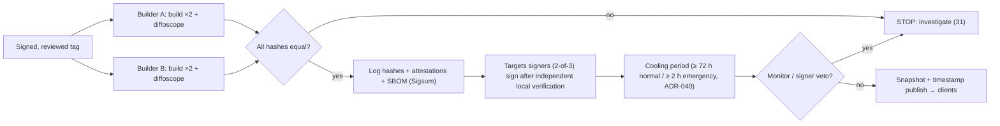

# 33 — Release and Update Security
Status: Draft v1.1 (round-2 revision: ADR-034..046) · Edition applicability: both (one release process, identical trust-path artifacts for CE and EE) · Owner: Release Engineering & Supply Chain team

## 1. Purpose and scope

Specifies how Candor artifacts are built, signed, published, logged and updated so that a compromised or compelled developer, build system, signing key, mirror, vendor or update server cannot silently deliver malicious or targeted code to instances, recipients or sources (THR-024, THR-025, THR-007, THR-026, THR-027). Covers: signed releases; TUF roles, thresholds and expiry (ADR-022); reproducible artifacts with ≥ 2 independent builders; transparency-log publication and monitoring; rollback and freeze protection; release channels; the emergency update procedure; key rotation; signing-key compromise and malicious-release response; update-client behaviour (no instance identity or onion leakage; enterprise mirrors); Candor Source App and Candor Desk update rules; WEBCAT manifest signing for the web bundle; operator verification steps with commands.

Out of scope (referenced): source-repository controls, CI hardening, dependency vetting and SBOM tooling details (28-SUPPLY-CHAIN.md, 27-SECURE-DEVELOPMENT.md); deployment mechanics (18-DEPLOYMENT.md); incident handling beyond release-specific steps (31-INCIDENT-RESPONSE.md).

**Protection statement.** The release process is designed so that instances and clients install only artifacts that (a) were built bit-identically by at least two independently operated builders from a public, reviewed source tag, (b) were signed by a threshold of independently held release keys, and (c) are publicly logged in an append-only, witness-cosigned transparency log — protecting against a single compromised builder, signer, mirror or update server and against per-customer or per-user targeted releases, under the assumptions RA-1..RA-5 (§3.2). It does not prevent a malicious change that passes code review and is built reproducibly (xz-class, INC-37); that is addressed by 27/28 and by public auditability, with residual risk stated in §20.

## 2. Context and dependencies

| Document | Relationship |
|---|---|
| DECISIONS.md | ADR-004 (Tier V client integrity), ADR-006 (Ed25519 + ML-DSA-65 release roots), ADR-019 (packaging), ADR-020/031 (licensing; trust path), ADR-022 (TUF, thresholds, transparency, no targeted updates), ADR-023 (no telemetry), ADR-024 (profiles). Round 2: ADR-035(1) (External Watchers, running manifest), ADR-036(5) (Source App witness key set and tree-head pin), ADR-040 (Platform Manifest, security floors, emergency ≥ 2 h cooling, ≥ 2 organisations/jurisdictions for signers and builders), ADR-041 (Source App distribution), ADR-042 (Desk platform tiers), ADR-043 (Desk self-verification), ADR-045 (Fleet Manager cannot lower floors), ADR-046(3) (update paths per zone) |
| 04-CRYPTOGRAPHY.md | K26 release keys, K27 WEBCAT keys (§19); CLIENT_RELEASE directory entries (§14.2); server-delivered-code analysis (§24) |
| 16-TOR-I2P.md | Intake hosts have no clearnet egress; Source App uses Arti for updates |
| 18-DEPLOYMENT.md | Installation, maintenance windows, rollback of deployments |
| 20-LOGGING-AUDITING.md | Update events in SYSTEM audit class |
| 21-ENTERPRISE.md | Fleet Manager (C-34), enterprise mirrors |
| 27-SECURE-DEVELOPMENT.md, 28-SUPPLY-CHAIN.md | Source review (SLSA Source L4), dependency control, SBOM |
| 29-SECURITY-TESTING.md | Update-client malicious-repository tests |
| 31-INCIDENT-RESPONSE.md | Incident runbooks invoked by §13–14 |
| 36-OPEN-SOURCE-GOVERNANCE.md | Signer selection, maintainer governance |

## 3. Threats, evidence and assumptions

### 3.1 Threats addressed
| Threat | Historical evidence | Primary controls |
|---|---|---|
| Build-system compromise (SUNBURST class) | INC-38 SolarWinds, INC-41 3CX, INC-48 CCleaner | ≥ 2 independent reproducible builders; SLSA Build L3 provenance (§5) |
| Update-server/distribution compromise | INC-49 NotPetya (M.E.Doc), INC-52 Linux Mint | TUF with offline keys; update server holds no signing key (§6) |
| Signing-key theft or compelled signing | INC-58 Storm-0558, INC-01/INC-02 compelled providers | Threshold hybrid keys in hardware; holders of every role in ≥ 2 organisations and ≥ 2 jurisdictions (root ≥ 3), so no single jurisdiction can meet a threshold (§6; ADR-040) |
| Targeted malicious update to one customer/user | INC-14 Anom, INC-01 Hushmail | Identical artifacts for all; transparency log; no per-instance metadata (§7, §15) |
| Dependency/maintainer compromise | INC-37 xz, INC-40 event-stream, INC-42 ua-parser-js | 28 (cargo-vet, review); reproducibility makes backdoors attributable to source |
| CI secret/tool compromise | INC-39 Codecov, INC-44 tj-actions | 28; builders hold no signing keys |
| Rollback / freeze / mix-and-match | TUF threat model (B-CR-45) | TUF versioning and expiry; signed security floor (§8) |
| Third-party platform packages bypassing release controls (RVW-A-12) | INC-37 xz (sshd dependency) | Platform Manifest (§4.1), snapshot mirror, verification of all installed packages (§18.5) |
| Selective withholding / divergent running state (RVW-A-13) | INC-14 Anom | Security floors Fleet cannot override (§8.1, §14.1); External Watchers and running manifest (§7.1) |
| Web code substitution to sources | INC-01, INC-27, INC-28 | No JS without WEBCAT; WEBCAT threshold manifests (§16) |

### 3.2 Assumptions (to be registered as ASM-* in 40)
| Label | Assumption |
|---|---|
| RA-1 | At most `threshold − 1` holders of any TUF role are compromised or coerced simultaneously. |
| RA-2 | At least one of the ≥ 2 builders is not compromised at the time of a release. |
| RA-3 | At least one configured log witness and one independent monitor are honest and online within the cooling period. |
| RA-4 | Ed25519 or ML-DSA-65 is unforgeable (hybrid signatures). |
| RA-5 | Source code tags are reviewed per 27/28 (SLSA Source L4 two-party review). |

## 4. Artifact inventory

| Artifact | Formats | Delegated TUF role | Platform signature (in addition to TUF) |
|---|---|---|---|
| Server packages (intake: C-05..C-08; core: C-09..C-14, C-21..C-25; `candorctl`) | Debian .deb (primary), APT repository metadata | `server` | OpenPGP-signed APT `InRelease` (offline key) for manual installs |
| Candor Desk (C-15, admin mode C-19) | Linux .deb/AppImage (Tier 1, incl. Qubes templates), Windows MSI and macOS .dmg (Tier 2) per ADR-042 | `desk` | Authenticode (Windows), Developer ID + notarization (macOS) |
| Candor Source App (C-03) | Linux AppImage (incl. Tails), Windows, macOS, Android APK — primary distribution from the project onion service and ≥ 2 independent mirrors (§15.3, ADR-041); optional F-Droid; optional generic Google Play / Apple App Store listings (iOS: App Store only, labelled "higher trace") | `source-app` | APK v2/v3 signature; Apple App Store signature |
| Source web bundle (optional Tier V-web, C-06) | WEBCAT manifest + static files | `web-bundle` | WEBCAT threshold signatures (§16) |
| OCI images (EE-HA / PRIVATE-CLOUD Z-CORE only) | OCI | `oci` | cosign signature |
| Appliance VM image | qcow2/OVA | `appliance` | — |
| **Platform Manifest** (ADR-040; replaces v1.0 "platform pins"): per profile and host role, exact versions and hashes of OS, kernel, tor, vanguards and PostgreSQL packages, Debian snapshot ID, Tor Project key, viewer image digests, pinned Roughtime keys, vanguards maintenance-gate result, and signed **security floors** per product (§4.1) | JSON policy | `platform` | — |
| EE commercial modules (non-trust-path, ADR-020) | .deb / OCI | `ee-modules` (separate delegation; cannot sign trust-path targets) | as above |
| SBOM (CycloneDX 1.6 with CBOM), SLSA provenance, in-toto attestations, reproducibility reports | JSON | same role as the artifact | — |

No per-customer or per-instance build of any trust-path artifact exists (ADR-022). Tenant-specific configuration is data (signed by the tenant's own keys, 04), never code. Tenant branding in the Source App (name, icon) is runtime data from the signed onion address statement, never a build variant or a tenant-specific store listing (RVW-A-14).

### 4.1 Platform Manifest and security floors (ADR-040; RVW-A-12, RVW-A-13)
- The Platform Manifest (format owned here; production and derivation in 28 §5.4) is a `platform` target of every release; the self-test (C-25, `candorctl verify-installed`) verifies **every installed package** on Z-INTAKE and Z-CORE — not only trust-path files — against it daily and before and after each update, and alerts on any unlisted package, version or hash.
- **Security floor:** for each trust-path product the manifest carries `{min_secure_version, effective_day}`. `effective_day` = publication day + 7 days for normal security releases, + 2 days for emergency releases of actively exploited issues. Trust-path components (C-05..C-10, C-12..C-14, C-21..C-25, C-15, C-03) **refuse to start** below the floor after `effective_day`; a running Z-INTAKE below the floor after `effective_day` stops accepting submissions and shows the outage page (ADR-002; 04 §12.6), and Desk blocks case access. Before `effective_day` admins see a countdown and security releases auto-install (§14).
- **No override below the floor:** Fleet Manager ring policies, maintenance windows and local admin settings cannot defer an instance past `effective_day` or lower a floor (ADR-040, ADR-045); only a newer signed manifest can change a floor.

## 5. Build: reproducibility and independent builders

### 5.1 Builders
- **Builder A:** project CI on dedicated, hardened, ephemeral build workers (C-31), network egress limited to a pinned internal mirror (28).
- **Builder B:** operated by a different organisation, **in a different jurisdiction from Builder A** (ADR-040; RVW-A-16), on different infrastructure (different cloud/hosting provider or on-premises, different administrators, different CI software), selected per 36; for EE/GOV customers an additional **customer rebuilder** may join as Builder C.
- Neither builder holds signing keys; both produce signed **rebuild attestations** (in-toto link/SLSA provenance) with their own builder keys (Ed25519, hardware-backed).

### 5.2 Reproducibility requirements
- Hermetic builds from a signed git tag (`git tag -s`, two-party reviewed), pinned toolchains (`rust-toolchain.toml` with component hashes; Debian snapshot archive timestamp for build dependencies), vendored and hash-locked dependencies (`Cargo.lock`, `cargo vendor` with checksums), `SOURCE_DATE_EPOCH` from the tag commit time, fixed locale/timezone/umask, path remapping (`--remap-path-prefix`), no network during build.
- Each builder builds twice (different build paths and times) and runs diffoscope; any difference fails the build (B-SD-26 pattern).
- Platform signatures that cannot be reproduced (Authenticode, Apple notarization, App Store re-signing) are applied **after** hash agreement on the unsigned payload; verification compares the payload with the platform signature stripped (`osslsigncode remove-signature`, `codesign --remove-signature`; Knowledge (unverified) exact tool flags). iOS App Store binaries cannot be verified by users (residual, §20).
- Reproducibility status is published per artifact; an artifact that is not reproducible SHALL NOT be released on any channel.

### 5.3 Release gating

Each targets signer, before signing, independently verifies on their own workstation: tag signature, both rebuild attestations, hash equality, SBOM diff vs previous release (new dependencies flagged), and the transparency-log inclusion of the release bundle.

## 6. Signing: TUF roles, thresholds, expiry (ADR-022)

### 6.1 Roles
| Role | Keys (n) | Threshold | Key storage | Metadata expiry | Signs |
|---|---|---|---|---|---|
| root | 5 | 3 | Offline hardware tokens/HSM; holders in ≥ 2 organisations and ≥ 3 jurisdictions, no organisation or jurisdiction holding ≥ 3 keys; no holder has > 1 root key (reconciles v1.0 REL-007 with 28 SCM-042) | 365 days (re-signed at ≥ 60 days before expiry) | Role keys and thresholds |
| targets (top-level) | 3 | 2 | Offline hardware tokens (FIDO2/PIV-class, PIN + touch) on dedicated signing workstations (air-gapped for root; offline for targets); holders in ≥ 2 organisations and ≥ 2 jurisdictions, no organisation or jurisdiction holding 2 keys (ADR-040) | 90 days | Delegations to product roles |
| delegated product roles (`server`, `desk`, `source-app`, `web-bundle`, `oci`, `appliance`, `platform`) | 3 | 2 | Same holders as targets or product-specific holders with the same organisation/jurisdiction spread; hardware tokens | 90 days | Artifact hashes, lengths, custom metadata (version, channel, security floor, log proofs); `platform`: the Platform Manifest (§4.1) |
| `ee-modules` | 3 | 2 | Vendor commercial team tokens | 90 days | Only paths under `ee-modules/**`; terminating delegation; cannot sign trust-path paths |
| snapshot | 1 | 1 | Online HSM on the repository publisher (separate from update mirrors) | 7 days | Versions of all targets metadata |
| timestamp | 1 | 1 | Online HSM on the repository publisher | 1 day (re-signed every 6 h) | Latest snapshot |

- **Hybrid signatures:** every root, targets and delegated-role key is a pair Ed25519 + ML-DSA-65 (ADR-006); a signer counts toward a threshold only if **both** signatures verify. Snapshot/timestamp keys are Ed25519 (online, short expiry; PQ forgery of them yields at most freeze/mix-and-match within their expiry, not arbitrary code). Custom TUF key type `candor-ed25519-mldsa65` (Open Issue OI-1).
- The repository publisher (holding snapshot/timestamp) and the update mirrors (C-33) are separate systems; compromising mirrors or the publisher cannot produce valid targets (INC-49 lesson).
- Root metadata version 1 (`root.json`) is embedded in every client build and published out of band (§18.1).

### 6.2 Other release signing keys
| Key | Holder | Storage | Purpose | Rotation |
|---|---|---|---|---|
| APT archive key (OpenPGP, Ed25519) | Release signers (2-person procedure) | Offline token | `InRelease` for manual apt installs; keyring package also a TUF target | 2 years; new key cross-signed |
| Authenticode certificate | Vendor legal entity | HSM (CA/B requirement) | Windows installer | Per certificate lifetime |
| Apple Developer ID | Vendor legal entity | Apple-managed + HSM | macOS notarized builds | Per Apple policy |
| Android APK signing key (v3 rotation lineage) | Release signers | Offline HSM | APK signature | Lineage rotation |
| cosign key (OCI) | Release signers | Hardware token | OCI signatures | 1 year |
| WEBCAT signer keys (Sigsum keys) | 3 release signers | Hardware tokens | Web bundle manifest (§16) | 2 years |
| Builder attestation keys | Builder A/B operators | Builder HSM/TPM | Rebuild attestations | 1 year |
| Log submitter key | Release engineering | Hardware token | Sigsum submissions | 1 year |

Platform signatures are never sufficient alone: clients and operators verify TUF and log proofs regardless of OS signature status.

## 7. Transparency log publication and monitoring

- **What is logged:** for every release on every channel — SHA-256 and SHA-512 of each artifact, targets/delegated metadata versions and hashes, root metadata versions, SBOM and provenance hashes, rebuild attestation hashes, WEBCAT manifest hashes, security-hold/revocation notices.
- **Log:** Sigsum (witness-cosigned, minimal) as primary; Rekor v2 (tile-based) as secondary mirror (B-CR-42; ADR-022). Log proofs (inclusion proof + cosigned tree head) are embedded in the TUF custom metadata of each target so offline clients can verify without contacting the log.
- **Client rule:** an artifact is installable only if its hash appears in valid TUF targets metadata **and** its log inclusion proof verifies against a tree head cosigned by ≥ `w` witnesses from the client's pinned witness policy (default `w = 2` of ≥ 3).
- **Monitors:** (1) project monitor; (2) ≥ 2 independent monitors (e.g., a civil-society organisation and an academic group, per 36) that (a) watch the log for Candor entries, (b) check each entry corresponds to a public signed tag and a published release note, (c) independently rebuild and compare hashes within the cooling period, (d) publish results and raise a veto (§9.3) on mismatch. Monitor tooling is open source and runnable by any customer.
- **Anti-split-view:** witnesses cosign only consistent tree heads; monitors compare tree heads with each other daily; clients reject tree heads without sufficient cosignatures (INC-14 targeted-delivery class).

### 7.1 External Watchers and running manifest (ADR-035(1); RVW-A-01, RVW-A-13)
- Each release publishes the digests of all static source-UI assets, templates and the CSP header string (28 SCM-070), logged with the release.
- Every intake serves a K35-signed **running manifest** (04 §9.14) naming its release, the hashes of installed trust-path packages and the Platform Manifest hash, re-signed daily.
- ≥ 2 independent watcher organisations (EE/GOV/MANAGED: ≥ 1 outside the operator's jurisdiction) fetch served assets, CSP headers and the running manifest over Tor as ordinary visitors (16 §15.1) and compare them with this log: a served asset not in the release, a running manifest naming a release below the security floor or not in the log, or a manifest older than 48 h is published as a mismatch and reported to the tenant's OVERSIGHT. Watcher tooling is open source (same repository as monitor tooling, §7).
- Honest limit: the running manifest is self-reported; outside the Confidential-VM profile a root-level attacker can forge it. Watchers detect non-selective divergence and stale or withheld updates, not a targeted, session-specific modification.

## 8. Rollback, freeze and mix-and-match protection

| Attack | Protection |
|---|---|
| Rollback to older signed version | TUF version monotonicity for all metadata; clients persist last trusted metadata; artifact version must be ≥ installed version unless an operator-initiated, dual-approved downgrade to a version ≥ the **security floor** is performed |
| Install or continued operation of a vulnerable version | Signed security floor `{min_secure_version, effective_day}` per product in the Platform Manifest (§4.1); installers refuse lower versions; components refuse to start below the floor after `effective_day`; Fleet Manager and local policy cannot defer past it (ADR-040, ADR-045) |
| Freeze (serving stale but valid metadata) | Timestamp expiry 1 day; clients alert when metadata cannot be refreshed for > 36 h; Desk and Source App policies §17; server instances raise a SYSTEM alert and show "update status unknown" in admin console |
| Mix-and-match of artifacts from different releases | Snapshot metadata binds all targets metadata versions |
| Endless-data / slow retrieval | TUF length limits; per-file size caps; download timeouts |
| Key-compromise-driven rollback | Root rotation invalidates old role keys; clients follow root chain version by version |
| Air-gapped instances (AIRGAP-RCP, GOV) | Offline update bundle = TUF repository subset + artifacts + log proofs; accepted if targets metadata unexpired, versions monotonic and bundle `created` ≤ 30 days old; timestamp expiry checked against bundle creation, not wall clock (explicit, logged relaxation) |

## 9. Release channels

### 9.1 Channels
| Channel | Content | Cadence | Support | Audience |
|---|---|---|---|---|
| `stable` | Feature + security releases (SemVer minor/patch) | Minor every 6–8 weeks; patches as needed | Latest minor only | CE default, EE optional |
| `lts` | Security and critical fixes backported to an LTS line | LTS line annually; patches as needed | 24 months per LTS line | EE/GOV default |
| `emergency` | Out-of-band security fix for actively exploited or critical issues, published to the affected stable and LTS lines | As needed | — | All |
| `preview` | Release candidates for testing | Before each minor | None; never on production profiles (installer refuses on production profile flag) | Testers |

Channels are expressed as custom metadata on targets (`channels: ["stable", "lts-2026"]`); the same artifact hash may be on several channels. Security fixes to shared code are released to CE and EE simultaneously (ADR-020).

### 9.2 Version policy
SemVer; each product declares `min_secure_version`; minor releases may include format version N+1 only if N−1 compatibility is kept (04 §13.9).

### 9.3 Cooling period and veto
Normal releases: ≥ 72 h between log publication of the release bundle and the timestamp role making it available. Emergency releases: ≥ 2 h, never less (ADR-040). During cooling, any targets signer, builder operator or registered monitor may file a **veto** (signed statement to the release list citing a mismatch or concern); a veto holds the release until resolved by a root-holder quorum decision (3-of-5), recorded publicly.

## 10. Emergency update procedure

| Step | Action | Target time (from decision) |
|---|---|---|
| E1 | Security lead declares emergency (actively exploited or CVSS ≥ 9 in trust path, or anonymity-affecting critical) per 31; embargo coordination | T0 |
| E2 | Fix developed on private branch; two-party review (never waived) | T0 + ≤ 24 h |
| E3 | Tag signed; both builders build and attest; hashes must match (never waived) | T0 + ≤ 30 h |
| E4 | Release bundle logged; targets signers (2-of-3, never reduced) sign | T0 + ≤ 32 h |
| E5 | Cooling period shortened to 0–24 h; notification sent to all root holders and monitors at log publication | T0 + ≤ 32–56 h |
| E6 | Timestamp published; clients auto-install on `emergency` flag (servers: outside maintenance windows allowed; Desk: forced before use; Source App: floor raised) | immediately after E5 |
| E7 | `min_secure_version` raised; advisory published (CVE, CWE, affected versions, IOCs, mitigations); CRA Art. 14 reporting where applicable (actively exploited vulnerabilities: early warning within 24 h, per B-CR-50/B-CR-51) | with E6 |
| E8 | Post-incident review within 14 days | — |

What is never relaxed in an emergency: reproducible build agreement across two builders, targets threshold, log inclusion, two-party code review.

## 11. Key rotation

| Key | Scheduled | Procedure |
|---|---|---|
| root (3-of-5) | Annual ceremony; holder change | New `root.json` version N+1 signed by threshold of old root keys AND threshold of new keys; clients walk the chain; ceremony transcript logged |
| targets / delegated roles | Every 2 years; holder change; token loss | New keys listed by root (targets) or targets (delegations); old keys removed |
| snapshot / timestamp | Quarterly; publisher host change | Root lists new keys |
| APT archive key | 2 years | New key cross-signed; keyring package update via TUF |
| WEBCAT signers | 2 years; holder change | New manifest policy (signers, threshold) signed by current threshold; logged |
| Builder attestation keys | 1 year | Published in the builder's own attestation policy file (TUF target) |
Holder departure triggers rotation of every role that holder held within 30 days (REQ-H-47 lesson, INC-44).

## 12. Signing-key compromise response

| Compromised | Immediate impact | Response |
|---|---|---|
| Timestamp or snapshot key | Freeze or mix-and-match within expiry; cannot introduce new artifacts | Root holders rotate key (fast path: 3-of-5 root signing, target ≤ 48 h); publisher host rebuilt |
| One targets/delegated key (below threshold) | None alone | Revoke and replace via root/targets; review all signatures made by the key; notify monitors |
| Targets/delegated **threshold** (≥ 2 of 3) | Attacker can sign artifacts, but they must still be logged and, to be accepted silently, reproducible by monitors; rebuild mismatch triggers veto | Root ceremony removes keys and re-delegates; security hold (§13.2); audit all releases signed during exposure; public advisory |
| Root keys below threshold (1–2 of 5) | None alone | Rotate affected root keys at next ceremony (≤ 30 days) |
| Root threshold (≥ 3 of 5) | Full compromise of trust chain | **Re-bootstrap:** new root published via signed announcements from remaining uncompromised holders on ≥ 3 independent channels (project site, second domain, monitors, mailing list), new client builds with the new embedded root; server operators must manually pin the new root after out-of-band fingerprint verification; instances refuse automatic updates until then |
| APT archive key | Malicious packages for manual APT users only (TUF users unaffected) | New key; advisory; `candorctl` checks APT sources and warns |
| WEBCAT signer threshold | Malicious web bundle to Tier V-web sources on enrolled onions | Tenants disable JS bundle (CSP `script-src 'none'`, 04 CRYPTO-024) immediately via config; new signer policy; advisory |
| Builder attestation key | Forged "reproduced" claims | Other builder mismatch or monitors detect; key revoked |

## 13. Malicious-release response

### 13.1 Detection sources
Builder hash mismatch; monitor rebuild mismatch or veto; unexpected log entry (no matching tag or release note); customer or researcher report; instance self-test detecting unknown binaries (C-25 compares installed file hashes with the TUF-listed package manifests).

### 13.2 Actions
1. **Security hold:** timestamp metadata carries `security_hold: {products, versions, reason_id}`; clients stop installing affected versions immediately and show an admin alert. (Clients never auto-uninstall; rollback is operator-driven, §8.)
2. Publish new targets metadata that removes the malicious targets and raises `min_secure_version` above them, with a clean fixed release when available.
3. Publish advisory with hashes, affected window, IOCs and instance-side checks; notify EE customers through the support channel and CE via mailing list, website and log.
4. Instance-side checklist (18/31): verify installed hashes against the clean manifest (`candorctl verify-installed`); if the malicious version ran on Z-INTAKE: treat as intake compromise (Tier W plaintext exposure window; rotate onion key per 16 §10; rotate K31/K35/K28); if on Z-CORE: rotate service credentials, internal CA leaves, K02/K24 if accessible; if on Desk: treat as endpoint compromise (revoke user keys and MEKs, rotate case keys per 04 §25.6); if on Source App: publish source-facing advisory on the info site.
5. Root-cause and key-compromise analysis (§12); rotate keys as needed.
6. Regulatory reporting (CRA Art. 14 where applicable, B-CR-50).

## 14. Update-client behaviour (servers: `candor-updater`)

- Implemented in Rust as part of the trust path; TUF client library behind an internal interface (Open Issue OI-1: hybrid key type support).
- **No instance identity:** requests carry no instance ID, tenant name, onion address, license ID, cookie or authentication header; fixed `User-Agent: candor-updater/<major>`; all instances fetch identical metadata files (full `targets` and delegated metadata for all products, not only installed ones, so file requests do not reveal installed components); artifact downloads by content hash path.
- **Schedule:** randomized check interval (uniform 2–6 h) to avoid fleet-wide timing correlation; no push channel.
- **Network paths:** Z-CORE hosts: HTTPS to vendor mirrors or the enterprise mirror (C-33). Z-INTAKE hosts: never direct clearnet (16 §14); updates are either pushed as verified bundles by C-09 from Z-CORE (default) or fetched through a dedicated tor client instance from the vendor's onion mirror. In both cases the intake host verifies TUF + log proofs itself.
- **No targeting by construction:** there is no server-side logic that selects artifacts per requester; staged rollout is **client-side** — each instance draws a local random rollout delay (0–72 h for non-emergency minor releases) from a locally generated seed; the server serves the same metadata to all.
- **Install policy:** security patch releases auto-install within the configured maintenance window; minor releases require admin approval (dual approval in GOV profile) unless configured otherwise; pre-install self-test and post-install health check with automatic rollback to the previous installed version (≥ security floor) on failure.
- **Integrity at rest:** downloaded artifacts verified before unpacking; packages installed via `apt install ./<verified>.deb` from a local verified repository, never from a remote APT source when TUF is in use.
- **No telemetry:** update checks send nothing beyond the file requests (ADR-023).

### 14.1 Enterprise mirrors (C-33) and Fleet Manager (C-34)
- Mirrors are content-addressed caches of the vendor TUF repository and artifacts; they cannot sign anything, and clients verify end-to-end.
- Mirrors SHALL NOT store onion addresses, tenant names, instance labels or per-request identifiers; access logs, if enabled, are limited to date, path and status (no client IP retention beyond 24 h) and are excluded from SIEM export of source-sensitive classes.
- Fleet Manager distributes **policy** (approved version per ring, maintenance windows) keyed by opaque instance IDs (ADR-022), never artifacts or metadata; instances still verify TUF. Fleet Manager never receives onion addresses in cleartext (C-34 definition).

## 15. Candor Desk and Candor Source App update rules

### 15.1 Candor Desk (C-15) — forced pre-flight update
- On every start and every 24 h while running, Desk refreshes TUF metadata (via Z-CORE's mirror endpoint or the vendor mirror) before unlocking the keystore for case access — the SecureDrop Workstation pre-flight updater pattern (B-SD-05).
- If a newer release with `security: true` or a raised `min_secure_version` exists, Desk installs it before opening any case (hard block; admin mode can install but not open cases).
- If metadata cannot be refreshed: up to 72 h grace with a banner; after 7 days, case access is blocked (freeze protection) unless an AIRGAP-RCP offline bundle ≤ 30 days old has been applied; overrides require dual approval and are audited.
- Desk refuses to run past the embedded end-of-life date of its version line (REQ-H-35 pattern, INC-35).
- Desk's self-update verifies TUF + log proofs itself; the OS platform signature is checked additionally.

### 15.2 Candor Source App (C-03)
- On each start, before any submission or login, the app fetches TUF metadata from the **vendor onion mirror via embedded Arti** — identical requests for every user, never an organisation-specific endpoint (16 NET-040).
- If installed version < `min_secure_version`: the app refuses to submit or log in and shows update instructions (desktop: in-app TUF update over Arti; Android: F-Droid/direct APK update verified by TUF hash; iOS: App Store update).
- If metadata cannot be fetched for > 30 days or metadata has expired: the app refuses to submit (it may still display guidance); embedded end-of-life date enforced.
- The app embeds a KD checkpoint and `root.json` at build time (04 VR-3); updates can raise, never lower, embedded trust anchors.
- Desktop in-app updates leave no persistent update logs; downloaded installers are deleted after install (THR-048).
- Mobile store distribution: the Android build is reproducible and verifiable against the F-Droid/direct APK; the iOS App Store binary is re-signed by Apple and not user-verifiable (residual §20).

## 16. WEBCAT manifest signing for the source web bundle

- The optional Tier V-web bundle (HTML/CSS/JS/WASM for C-06; 04 §24) is released as a WEBCAT manifest listing every file path and hash plus the CSP (B-CR-40).
- **Signers:** 3 release signers' Sigsum keys; `threshold: 2`. Manifest signatures and the manifest hash are logged (Sigsum). The bundle is identical for all tenants; tenant data is served as JSON by C-06, never as code.
- **Enrollment:** each tenant that enables the JS bundle enrolls its onion origin in the WEBCAT enrollment system with a policy that names the Candor signers and threshold (B-CR-37, B-CR-38). Enrollment publishes the onion address in the enrollment list (it is already public). Disabling JS requires un-enrollment or a bundle policy that serves no scripts; C-06 then sets CSP `script-src 'none'`.
- **Versioning and rollback:** manifests carry a monotonic version; WEBCAT's manifest versioning prevents rollback (R5 §B.3 row 8 — B-CR-40); the bundle's release is also a `web-bundle` TUF target so servers only deploy logged bundles.
- **Deployment attestation:** the tenant records the accepted bundle in a CLIENT_RELEASE directory entry (04 §14.2); Desks and C-25 compare the served bundle with it (04 VR-10).
- **Status gate:** WEBCAT is alpha and not yet integrated in Tor Browser (B-CR-37); the JS bundle ships disabled by feature flag until Tor Browser enforces WEBCAT for onion origins (04 OI-10).

## 17. SBOM, provenance and attestations
Each release includes: CycloneDX 1.6 SBOM with CBOM section (cryptographic assets, useful for PQC inventory; B-CR-47 context in R5 §C), SLSA provenance from each builder (Build L3 target; B-CR-46), in-toto layout for the release pipeline, reproducibility report (diffoscope summary), dependency-diff report vs previous release. All are signed by the product role and logged.

## 18. Operator verification steps

Commands below use `candorctl` subcommands defined by this document plus standard tools. Syntax of third-party tools is Knowledge (unverified) and must be re-checked against the tool versions pinned in the release notes.

### 18.1 Bootstrap trust (first install)
1. Obtain the root fingerprint from ≥ 2 independent channels (project website over HTTPS, signed announcement on the mailing list, printed in the release notes, published by monitors). Compare:
   ```
   sha256sum root.json            # must equal the published root.json v1 hash on all channels
   ```
2. Verify the bootstrap bundle (contains `candorctl`, `root.json`, witness policy):
   ```
   gpg --show-keys --with-fingerprint candor-archive-keyring.asc   # compare fingerprint out of band (INC-52 lesson)
   gpg --verify candor-bootstrap-1.4.2.tar.zst.asc candor-bootstrap-1.4.2.tar.zst
   ```
3. Install the APT keyring restricted to Candor sources only (never into `/etc/apt/trusted.gpg.d/`, cf. R2 §1.9 GlobaLeaks install script):
   ```
   sudo install -m 0644 candor-archive-keyring.gpg /usr/share/keyrings/candor-archive-keyring.gpg
   echo "deb [signed-by=/usr/share/keyrings/candor-archive-keyring.gpg] https://apt.candor.example stable main" | sudo tee /etc/apt/sources.list.d/candor.list
   ```
4. From then on use TUF verification:
   ```
   sudo candorctl tuf init --root ./root.json --witness-policy ./witness-policy
   sudo candorctl tuf status          # prints root/targets/snapshot/timestamp versions, expiries, thresholds, channel
   ```

### 18.2 Verify a release artifact
```
candorctl verify-release --product server --version 1.4.2 --artifact candor-core_1.4.2_amd64.deb
#  checks: TUF targets (hybrid threshold), length/hash, channel, security floor, Sigsum inclusion proof + cosignatures,
#  both rebuild attestations present and matching
sha256sum candor-core_1.4.2_amd64.deb      # equals the hash printed by verify-release and in the release notes
sigsum-verify -k release-submitter.pub -p witness-policy candor-core_1.4.2_amd64.deb.proof < candor-core_1.4.2_amd64.deb
```
OCI (EE): `cosign verify --key candor-cosign.pub registry.candor.example/candor/core@sha256:<digest>` and `candorctl verify-release --product oci --digest sha256:<digest>`.

### 18.3 Reproduce a release independently
```
git clone https://forge.candor.example/candor/candor.git && cd candor
git verify-tag v1.4.2
./build/reproduce.sh v1.4.2                 # hermetic container build, pinned toolchain; outputs ./out/*
sha256sum out/candor-core_1.4.2_amd64.deb   # must equal the TUF target hash
diffoscope out/candor-core_1.4.2_amd64.deb candor-core_1.4.2_amd64.deb   # on mismatch, file a veto/report
```

### 18.4 Verify client applications
- Linux Desk/Source App: `candorctl verify-release --product desk --artifact Candor-Desk-1.4.2.AppImage`.
- Windows: `Get-AuthenticodeSignature .\CandorDesk-1.4.2.msi` (status Valid, expected publisher) and `candorctl verify-release` from an admin workstation.
- macOS: `codesign --verify --deep --strict --verbose=2 "Candor Desk.app"` and `spctl -a -vv "Candor Desk.app"`, plus `candorctl verify-release` on the unsigned payload hash.
- Android: `apksigner verify --print-certs CandorSource-1.4.2.apk` (expected certificate digest from TUF custom metadata) and hash comparison with the reproducible build.

### 18.5 Verify installed state and platform pins
```
sudo candorctl verify-installed            # all installed trust-path files match TUF-listed package manifests
sudo candorctl platform-pins check         # tor/vanguards/viewer image versions ≥ floors in platform-pins
sudo candorctl update log --since 30d      # local update history (SYSTEM audit class, date-granular)
```

## 19. Requirements

### 19.1 Release (REL-)
| ID | Requirement | Evidence | Threats | Component | Verification |
|---|---|---|---|---|---|
| REL-001 | Every trust-path artifact SHALL be built from a signed, two-party-reviewed git tag. | B-CR-46; INC-37; INC-50 | THR-024 | C-30, C-31 | INSP: tag signature + review record check in release checklist |
| REL-002 | Every artifact SHALL be built by ≥ 2 independently operated builders (different organisation, infrastructure and CI software) and SHALL be released only if all builder outputs are bit-identical. | ADR-022; INC-38; INC-41; B-CR-43 | THR-024; THR-025 | C-31 | TST: release pipeline gate; AUD: builder independence review |
| REL-003 | Builds SHALL be hermetic and reproducible (pinned toolchains, vendored hash-locked dependencies, `SOURCE_DATE_EPOCH`, no network) and each builder SHALL build twice and diff with diffoscope. | B-SD-26; B-CR-44; INC-37 | THR-024 | C-31 | TST: CI job `repro-twice`; published reproducibility report |
| REL-004 | Builders SHALL NOT hold any release signing key; they SHALL emit signed rebuild attestations with hardware-backed builder keys. | INC-39; INC-44; INC-58 | THR-024 | C-31, C-32 | INSP: Secret Placement Manifest of builders |
| REL-005 | Releases SHALL be delivered via TUF with the roles, thresholds, storage and expiries of §6.1 (root 3-of-5 offline 365 d; targets and delegated roles 2-of-3 offline 90 d; snapshot 7 d; timestamp 1 d online HSM). | ADR-022; B-CR-45 | THR-025 | C-32 | TST: metadata validator in CI; INSP: key ceremony records |
| REL-006 | Root, targets and delegated-role keys SHALL be Ed25519 + ML-DSA-65 pairs; a signer SHALL count toward a threshold only if both signatures verify. | ADR-006; B-CR-10 | THR-025; THR-012 | C-32 | TST: client rejects single-algorithm signature |
| REL-007 | Root key holders SHALL be spread over ≥ 2 organisations and ≥ 2 jurisdictions with no holder holding more than one root key. | INC-02; ADR-022 | THR-026; THR-025 | C-32 | INSP: holder register (36) |
| REL-008 | The repository publisher (snapshot/timestamp HSM) and update mirrors SHALL be separate systems, and neither SHALL hold root, targets or delegated keys. | INC-49; INC-52 | THR-025 | C-32, C-33 | INSP: architecture review; AUD |
| REL-009 | The `ee-modules` role SHALL be a terminating delegation limited to `ee-modules/**` and SHALL NOT be able to sign trust-path targets. | ADR-020 | THR-025; THR-027 | C-32 | TST: client rejects trust-path path signed by ee-modules |
| REL-010 | No per-customer, per-instance or per-user build or metadata of any trust-path artifact SHALL exist; all clients SHALL receive identical metadata and artifacts. | ADR-022; INC-14; INC-01 | THR-025; THR-007 | C-32, C-33 | AUD: repository content review; TST: two instances fetch byte-identical metadata |
| REL-011 | Every release (artifact hashes, TUF metadata versions, SBOM, provenance, attestations, WEBCAT manifests, holds) SHALL be logged in Sigsum (primary) with witness cosignatures, mirrored to Rekor, and the inclusion proof embedded in TUF custom metadata. | ADR-022; B-CR-42; INC-48 | THR-025 | C-32 | TST: release gate checks proof; INSP |
| REL-012 | At least 2 independent monitors plus the project monitor SHALL watch the log, rebuild releases and publish results; monitor tooling SHALL be open source. | B-CR-42; B-CR-45 | THR-025 | C-32 | DEMO: monitor report per release; INSP: monitor agreements |
| REL-013 | Normal releases SHALL observe a ≥ 72 h cooling period between log publication and timestamp availability during which any signer, builder or monitor can veto; vetoes SHALL be resolved by a 3-of-5 root-holder decision recorded publicly. | B-CR-45 | THR-025; THR-024 | C-32 | INSP: release timeline records |
| REL-014 | Each targets signer SHALL independently verify tag signature, rebuild attestations, hash equality, SBOM diff and log inclusion on their own workstation before signing. | INC-38; INC-41 | THR-024 | C-32 | INSP: signer checklist records |
| REL-015 | Release channels SHALL be `stable`, `lts` (24-month support), `emergency` and `preview` as in §9.1; `preview` SHALL be refused on production profiles. | ADR-020 | THR-025 | C-32, C-33 | TST: installer refuses preview on production profile |
| REL-016 | Security fixes to shared code SHALL be released to CE and EE simultaneously. | ADR-020 | THR-025 | C-32 | INSP: release notes comparison |
| REL-017 | Emergency releases SHALL follow §10 and SHALL NOT relax two-builder reproducibility, targets threshold, log inclusion or two-party review. | INC-37; INC-44 | THR-024; THR-025 | C-31, C-32 | DEMO: annual emergency-release drill |
| REL-018 | Each product SHALL publish `min_secure_version`; installers and updaters SHALL refuse versions below it. | B-CR-45 | THR-025 | C-32, C-15, C-03 | TST: floor enforcement tests |
| REL-019 | Root keys SHALL be rotated in an annual ceremony with chained root metadata; any role holder's departure SHALL trigger rotation of the roles they held within 30 days. | INC-44; INC-47 | THR-024 | C-32 | INSP: ceremony transcripts; holder register |
| REL-020 | Signing-key compromise SHALL be handled per §12, including re-bootstrap via ≥ 3 independent channels for root threshold compromise. | INC-58; INC-48 | THR-025 | C-32 | DEMO: tabletop exercise annually (31) |
| REL-021 | Malicious-release response SHALL follow §13, including a `security_hold` in timestamp metadata honoured by all clients. | INC-38; INC-41; INC-49 | THR-025 | C-32, C-15, C-03 | TST: hold flag stops installation in update client tests |
| REL-022 | Advisories SHALL include CVE, CWE, affected versions, hashes and IOCs, and CRA Art. 14 reporting SHALL be performed where applicable. | B-CR-50; B-CR-51 | THR-025 | C-32 | INSP: advisory template; DEMO |
| REL-023 | The web bundle SHALL be released as a WEBCAT manifest covering every HTML/CSS/JS/WASM file and the CSP, signed by 2-of-3 release signer Sigsum keys and logged; the bundle SHALL be identical for all tenants. | ADR-004; B-CR-37; B-CR-40 | THR-007 | C-32, C-06 | TST: WEBCAT verifier in CI; INSP |
| REL-024 | The JS/WASM bundle SHALL remain disabled by default until Tor Browser enforces WEBCAT for onion origins; tenants SHALL be able to disable it immediately (CSP `script-src 'none'`). | ADR-004; B-CR-38 | THR-007; THR-008 | C-06 | TST: default config serves no scripts |
| REL-025 | Each release SHALL include a CycloneDX 1.6 SBOM with CBOM, SLSA provenance from each builder, an in-toto layout and a reproducibility report, all signed and logged. | B-CR-46; B-CR-47 | THR-024 | C-31, C-32 | TST: release gate checks presence and signatures |
| REL-026 | Platform signatures (Authenticode, Apple, APK) SHALL be applied only after hash agreement on the unsigned payload, and verification SHALL compare the stripped payload. | B-CR-41 | THR-024 | C-31, C-32 | TST: stripped-payload comparison job |
| REL-027 | Publication pages SHALL give signature-verification instructions with fingerprints published out of band and SHALL NOT rely on same-origin hashes. | INC-52; B-GL-05 | THR-025 | C-37, C-32 | INSP: documentation review |
| REL-028 | The APT keyring SHALL be installed only under `/usr/share/keyrings/` and referenced with `signed-by`; installation instructions SHALL NOT place keys in `trusted.gpg.d`. | B-GL-41 | THR-025 | C-33 | INSP; TST: `candorctl` warns on global keys |
| REL-029 | Operator verification commands of §18 SHALL be documented, tested in CI against each release, and runnable without vendor infrastructure other than public mirrors. | INC-52 | THR-025 | C-32 | TST: CI job `verify-docs-commands` |
| REL-030 | A release SHALL NOT be published on any channel if any artifact is not reproducible. | INC-38 | THR-024 | C-31 | TST: release gate |

### 19.2 Update clients (UPD-)
| ID | Requirement | Evidence | Threats | Component | Verification |
|---|---|---|---|---|---|
| UPD-001 | Update clients SHALL install an artifact only if it is listed in valid TUF metadata (hybrid thresholds met) and its log inclusion proof verifies against a tree head cosigned by ≥ 2 witnesses of the pinned witness policy. | ADR-022; B-CR-42; B-CR-45 | THR-025 | C-32, C-15, C-03, C-05, C-10 | TST: malicious-repository test suite (29-SECURITY-TESTING.md) |
| UPD-002 | Update clients SHALL enforce TUF version monotonicity, expiry, snapshot binding and length limits, and SHALL persist last trusted metadata. | B-CR-45 | THR-025 | C-15, C-03, C-05, C-10 | TST: rollback, freeze, mix-and-match and endless-data tests |
| UPD-003 | Update requests SHALL carry no instance ID, tenant name, onion address, license ID, cookie or auth header, use a fixed User-Agent, and fetch the complete metadata set regardless of installed products. | ADR-022; ADR-023 | THR-027; THR-036 | C-05, C-10, C-15 | TST: traffic capture of update checks |
| UPD-004 | Server update checks SHALL occur at uniformly random 2–6 h intervals, and staged rollout SHALL be decided client-side by a locally random delay, never by server-side selection. | ADR-022; INC-14 | THR-025; THR-011 | C-10, C-05 | INSP: code review; TST: identical metadata for all requesters |
| UPD-005 | Intake hosts SHALL receive updates only as verified bundles pushed by C-09 or via a dedicated tor client to the vendor onion mirror, never via direct clearnet, and SHALL verify TUF and log proofs themselves. | ADR-009; INC-33 | THR-001; THR-025 | C-05, C-09 | TST: egress test during update; bundle tamper test |
| UPD-006 | Security patch releases SHALL auto-install within the maintenance window; minor releases SHALL require admin approval (dual approval in GOV); failed post-install health checks SHALL roll back to the previous version ≥ security floor. | B-SD-02 | THR-025; THR-042 | C-10, C-05, C-19 | TST: forced-failure rollback test |
| UPD-007 | Clients SHALL alert when metadata cannot be refreshed for > 36 h and servers SHALL display "update status unknown" in the admin console. | B-CR-45 | THR-025 | C-10, C-25 | TST: freeze simulation |
| UPD-008 | Operator-initiated downgrades SHALL require dual approval and SHALL NOT go below `min_secure_version`. | B-CR-45 | THR-025 | C-19, C-10 | TST |
| UPD-009 | Air-gapped instances SHALL accept offline bundles only if targets metadata is unexpired, versions are monotonic and the bundle is ≤ 30 days old; the relaxation SHALL be logged. | B-CR-45 | THR-025 | C-15, C-10 | TST: stale-bundle rejection |
| UPD-010 | Clients SHALL honour `security_hold` by stopping installation of the listed versions and alerting admins. | INC-38 | THR-025 | C-15, C-03, C-10, C-05 | TST |
| UPD-011 | Enterprise mirrors SHALL be content-addressed caches that cannot sign, SHALL NOT store onion addresses, tenant names, instance labels or per-request identifiers, and SHALL retain client IPs ≤ 24 h if logging at all. | ADR-022; INC-59 | THR-027; THR-016 | C-33 | INSP: mirror config; TST: log content scan |
| UPD-012 | Fleet Manager SHALL distribute only version policy keyed by opaque instance IDs, never artifacts, metadata or onion addresses in cleartext. | ADR-022; ADR-020 | THR-027 | C-34 | INSP; TST: Fleet Manager data inventory |
| UPD-013 | Candor Desk SHALL refresh TUF metadata at every start and every 24 h, and SHALL install any security release or floor increase before opening cases. | B-SD-05; INC-35 | THR-025; THR-013 | C-15 | TST: outdated Desk blocked from case access |
| UPD-014 | Candor Desk SHALL block case access when metadata could not be refreshed for > 7 days, except with an applied offline bundle ≤ 30 days old or a dual-approved, audited override. | B-CR-45 | THR-025 | C-15 | TST: freeze simulation |
| UPD-015 | Candor Desk and the Source App SHALL refuse to run past the embedded end-of-life date of their version line. | INC-35 | THR-025; THR-005 | C-15, C-03 | TST: clock-forward test |
| UPD-016 | The Source App SHALL check for updates over embedded Arti against the vendor onion mirror with identical requests for every user and SHALL NOT contact organisation-specific endpoints for updates. | ADR-022; ADR-023 | THR-002; THR-036 | C-03 | TST: traffic capture |
| UPD-017 | The Source App SHALL refuse to submit or log in when its version is below `min_secure_version` or when metadata could not be refreshed for > 30 days. | INC-35; B-SD-05 | THR-025; THR-007 | C-03 | TST |
| UPD-018 | The Source App SHALL embed `root.json` and a key-directory checkpoint at build time; updates SHALL NOT lower embedded trust anchors. | B-CR-45; INC-67 | THR-046; THR-025 | C-03 | TST: anchor-downgrade rejection |
| UPD-019 | Desktop Source App updates SHALL delete downloaded installers after installation and keep no update logs. | INC-35 | THR-048 | C-03 | TST: filesystem residue scan |
| UPD-020 | Downloaded artifacts SHALL be verified before unpacking and installed from a local verified repository; remote APT sources SHALL NOT be used when TUF is in use. | B-GL-41 | THR-025 | C-10, C-05 | TST: tampered-artifact test |
| UPD-021 | C-25 SHALL verify installed trust-path file hashes against TUF-listed package manifests daily and alert on mismatch. | INC-38 | THR-025; THR-024 | C-25 | TST: planted-binary test |
| UPD-022 | Update checks SHALL send no telemetry beyond the file requests. | ADR-023 | THR-036 | C-10, C-15, C-03 | TST: traffic capture |
| UPD-023 | C-25 SHALL check that tor, vanguards and viewer image versions meet the `platform-pins` floors and alert otherwise. | INC-29 | THR-005; THR-023 | C-25 | TST |

## 20. Residual risks and limitations (honest)
1. **Reviewed-but-malicious source changes** (xz-class, INC-37) are reproduced faithfully by honest builders; defences are review, dependency vetting and public audit (27/28), not the release pipeline.
2. **Threshold collusion or coercion** of 2 targets signers plus control of distribution can publish a malicious release; it is detectable (log, monitors, rebuilds) but may reach auto-updating instances before a veto if cooling is bypassed in an emergency.
3. **iOS Source App** binaries are re-signed by Apple and cannot be verified by users against reproducible builds.
4. **Platform signing dependencies** (Authenticode, Apple) introduce third parties that can revoke or refuse signing (availability risk).
5. **Freeze protection vs availability:** blocking Desk after 7 days without metadata may hamper work in outages; overrides exist but are auditable, not preventable.
6. **WEBCAT** is alpha; the web bundle path is unavailable until Tor Browser integration exists.
7. **Update timing** (randomized) still reveals to network observers that a host runs Candor if the update endpoint is Candor-specific; intake hosts avoid this by pushed bundles.
8. **Monitor diversity** depends on external organisations' continued participation.

## 21. Open issues
| # | Issue | Proposed resolution |
|---|---|---|
| OI-1 | Hybrid (Ed25519 + ML-DSA-65) TUF key type is not standard in TUF libraries (Knowledge (unverified) for python-tuf / Rust TUF clients). | Implement custom key type in the Rust client; contribute upstream; interim: require both signatures in a wrapper envelope verified before TUF processing. |
| OI-2 | Selection and funding of Builder B and independent monitors. | 36-OPEN-SOURCE-GOVERNANCE. |
| OI-3 | CRA role (steward vs manufacturer) affects reporting duties (B-CR-50). | Legal review (25). |
| OI-4 | WEBCAT/Tor Browser integration timeline (B-CR-38). | Track; revisit REL-024. |
| OI-5 | Sigsum witness policy for release logs (which witnesses, threshold 2-of-3) needs named operators. | 36. |
| OI-6 | Consistency of the Source App's update source (vendor onion mirror) with organisations that forbid vendor contact (GOV): mirror operated by the organisation would reveal to that organisation which sources update — unacceptable; decide whether GOV builds embed only vendor mirrors. | ADR proposal: source-facing update endpoints are always vendor/public, never organisation-operated. |
