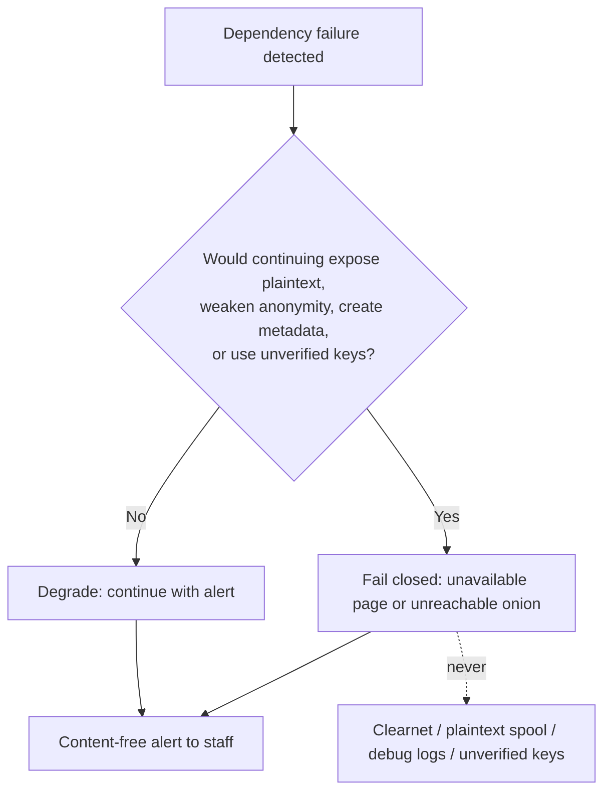

# 34 — Performance, Scalability, High Availability and Safe Failure Behavior

Status: Draft v1.0 · Edition applicability: both (HA sections EE) · Owner: Platform Engineering / Performance

## 1. Purpose and scope

This document specifies:
- the load model: concurrent sources, organizations with tens of thousands of employees, international use;
- capacity targets and sizing per deployment profile;
- very large uploads and per-profile limits;
- behavior over high-latency Tor;
- interrupted and resumable uploads, with their correlation metadata (THR-047) and the chosen design;
- high availability **without adding unacknowledged metadata observers**, listing every observer HA introduces;
- the **safe-failure behavior** for every dependency failure: fail closed where privacy is at stake, and never reroute to clearnet (ADR-002).

Out of scope, and covered elsewhere:
- Rate limits: `07-BACKEND.md` §limits.
- API shapes: `08-API.md`.
- The HA module design: `21-ENTERPRISE.md` §5.
- Sanitizer resource limits: `10-FILE-EVIDENCE-PIPELINE.md` §10.

## 2. Context and dependencies

| Source | Use |
|---|---|
| ADR-001, 002, 009, 010, 011, 024, 026, 030, 032 | Onion-only; no fallback; pull relay (15 ± 10 min); timing; padding; profiles; abuse resistance; per-member epoch keys (fail closed when no eligible keys); onion key on ≤ 2 hosts |
| `07-BACKEND.md` | Enforced limits (sessions, sealer, request sizes, pending uploads) |
| `08-API.md` §5.1 | Resumable upload protocol (capability `U`, 4 MiB chunks, ≤ 1024 chunks) |
| `16-TOR-I2P.md` | PoW parameters, vanguards, bridges |
| `17-INFRASTRUCTURE.md` / `18-DEPLOYMENT.md` | Host roles, profiles, hardware minima |
| `19-BACKUPS-DR.md` | Backup volumes and RPO/RTO |
| `21-ENTERPRISE.md` §5 | HA components (active/passive intake, Patroni, L4 LB) |
| `32-OPERATIONS.md` §5 | Self-test checks that trigger failure behaviors |

Research basis:
- Tor onion services under DDoS and the 0.4.8 PoW defense [B-AN-26, B-AN-27, B-AN-28].
- Guard discovery and correlation, which make HA placement and extra observers relevant [B-AN-01, B-AN-05, B-AN-11].
- OnionShare's upload-naming DoS under parallel Tor uploads (OTF-012, CVE-2022-21689) [B-OS-04].
- The OnionShare parse-before-policy file writes [B-OS-02].
- SecureDrop's 500 MB upload limit [B-SD-21] and SecureDrop Protocol scalability limits (per-request challenge computation over Tor) [B-SD-11].
- CoverDrop is small-message only, with hours of latency [B-GL-23].

## 3. Load model

### 3.1 Design populations

| Parameter | CE design point | EE design point | Basis |
|---|---|---|---|
| Organization size | ≤ 10,000 employees | 10,000 – 250,000 employees, ≥ 20 countries | Product scope (`01-PRODUCT-REQUIREMENTS.md`) |
| Reports per year (all Candor channels) | ≤ 300 | ≤ 5,000 | Knowledge (unverified): industry benchmarks report roughly 1–2 reports per 100 employees per year across all channels; Candor is one of several channels |
| Normal daily new reports | ≤ 5 | ≤ 50 | derived |
| **Crisis burst** (public scandal, company-wide call for reports) | 100 new reports in 24 h | 1,000 new reports in 24 h | 20× normal peak; design assumption |
| Concurrent source sessions (burst) | 50 | 500 | Burst ÷ session length (median 15 min; Tier W with files up to 3 h) |
| Returning-source logins per day (burst) | 200 | 3,000 | Sources check replies |
| Abuse / flood attempts | 10,000 requests/h | 100,000 requests/h + onion-level DoS | THR-032/033; PoW absorbs introduction floods [B-AN-26] |
| Recipients (concurrent Desk sessions) | 10 | 300 | EE multi-channel |
| Attachment mix | 80% text-only envelopes; 18% ≤ 50 MiB; 2% > 50 MiB | same | design assumption |
| Mean padded envelope size | 12 MiB | 12 MiB | derived from the mix with ADR-011 buckets |

### 3.2 International considerations

| Aspect | Effect | Design response |
|---|---|---|
| Sources in censored regions | Tor needs bridges/pluggable transports; latency 2–5× higher | Source guidance for bridges (`05-SOURCE-OPSEC.md`, `16-TOR-I2P.md`); timeouts in §6 assume the P10 bandwidth |
| Low-bandwidth mobile links | Large pages are slow | Source web pages ≤ 64 KiB each (padded to fixed size classes, ADR-011); no web fonts or JS required |
| Time zones | Local "day" differs from UTC | All stored dates are UTC epoch days (ADR-010); source-facing dates shown as UTC dates with a label; SLA engine uses jurisdiction calendars (`25-COMPLIANCE.md`) |
| Languages | Many locales | Localized static pages from memory, identical sizes within each size class (per-locale padding) |
| Jurisdictions of hosting | Legal exposure | `17-INFRASTRUCTURE.md` §7; not a performance item |

## 4. Upload limits per profile

Hard ceilings come from `07-BACKEND.md` and `08-API.md`:
- Tier W envelope ≤ 2 GiB padded; Tier W file per request ≤ `intake.max_file_bytes` (hard maximum 2 GiB).
- Tier V envelope ≤ 4 GiB padded (1,024 chunks × 4 MiB).
- ≤ 20 files per envelope (maximum 32).

Profile defaults are set so that intake storage holds ≥ 7 days of crisis-burst backlog (DR-007).

| Profile | Tier W max file (default / max) | Tier W envelope (padded) | Tier V envelope (padded) | Global pending-upload bytes cap (Tier V) | Max concurrent Tier W uploads |
|---|---|---|---|---|---|
| CE-SINGLE | 256 MiB / 512 MiB | 1 GiB | 2 GiB | 32 GiB | 8 |
| CE-HARDENED | 512 MiB / 2 GiB | 2 GiB | 4 GiB | 64 GiB | 16 |
| EE-ONPREM | 512 MiB / 2 GiB | 2 GiB | 4 GiB | 256 GiB | 32 |
| EE-HA | 512 MiB / 2 GiB | 2 GiB | 4 GiB | 512 GiB | 32 per active intake |
| GOV-ONPREM | 512 MiB / 2 GiB | 2 GiB | 4 GiB | 256 GiB | 32 |
| AIRGAP-RCP | inherits the server profile; transfer media ≥ 2× the largest envelope | — | — | — | — |
| PRIVATE-CLOUD | 512 MiB / 2 GiB | 2 GiB | 4 GiB | 256 GiB | 32 |
| MANAGED | 512 MiB / 2 GiB (contract may lower) | 2 GiB | 4 GiB | per customer, 128 GiB default | 16 per customer |

Larger material (above 4 GiB):
- The Source App splits it into several envelopes within the same mailbox thread, and the UI states that these envelopes are linkable to each other (they are in the same account anyway).
- Tier W sources are told to use the Source App for more than 512 MiB.
- `10-FILE-EVIDENCE-PIPELINE.md` lists a 16 GiB per-attachment hard ceiling. That is not reachable under the 1,024 × 4 MiB chunk cap of `08-API.md`; see Open issues.

Upload time over Tor, using planning figures (Knowledge (unverified): onion-service single-circuit throughput commonly ranges from about 100 KiB/s to 1 MiB/s):

| Size | P50 (300 KiB/s) | P10 (80 KiB/s) |
|---|---|---|
| 10 MiB | 34 s | 2 min 8 s |
| 256 MiB | 15 min | 55 min |
| 512 MiB | 29 min | 1 h 49 min |
| 2 GiB | 1 h 57 min | 7 h 17 min |
| 4 GiB | 3 h 53 min | 14 h 34 min |

Consequence: Tier W uploads above about 512 MiB have a high interruption probability at P10. This is why the resumable path (§5) exists only in Tier V, and why Tier W defaults stay at ≤ 512 MiB.

## 5. Interrupted and resumable uploads (THR-047)

### 5.1 Options considered

| Option | Resume? | Correlation metadata created | Decision |
|---|---|---|---|
| A. Single request, no resume | No | None beyond the request | **Tier W** (browsers cannot resume multipart POSTs without JS; ADR-004 forbids required JS) |
| B. Session-bound resumable upload (tied to the source login session) | Yes | Links every reconnection to the **account** from the first byte; the server sees reconnect times per account | Rejected |
| C. Capability-bound chunked upload, account-unlinked until commit (`08-API.md` §5.1) | Yes | Links the reconnections of **one upload** to each other (inherent), and nothing else; commit links it to the envelope and account at the same moment the envelope is linked anyway | **Tier V (chosen)** |
| D. Independent per-chunk anonymous uploads reassembled by the recipient | Partly | Server-side reassembly needs a join key (≈ C); recipient-side reassembly multiplies envelopes and loses integrity grouping | Rejected (complexity, no gain over C) |

### 5.2 Chosen design (summary; normative protocol in `08-API.md` §5.1)

- The client generates a 256-bit `U` per upload. `upload_id = SHA-256("candor-upload-id" ‖ U)`, and `K_U` is derived by HKDF.
- Chunks are 4 MiB ciphertext (64 × 64 KiB STREAM chunks). Chunk count is ≤ 1,024 and is derived from the padded bucket size (ADR-011), so the chunk count reveals only the bucket.
- There is no session token. Every chunk request is MAC'd under `K_U`. The Source App uses a **fresh Tor circuit per upload session** (SOCKS isolation) and may resume on any later circuit.
- Server state per upload: `upload_id`, `K_U`, the chunk bitmap, `created_epoch_day`, the padded-bucket ID. **No timestamps per chunk, no circuit identifiers, no counts of resumptions.**
- Expiry: 3 epoch days (`intake.upload_session_ttl` = 72 h, CFG SAFE DEFAULT, `32-OPERATIONS.md` §7). On expiry or commit, chunks and `K_U` are deleted (crypto-garbage: chunks are ciphertext under a key held only by the client).
- The Source App stores `U` only inside its encrypted vault until commit (`11-FRONTEND-SOURCE.md`).
- Rate limits: SA-09 at 600 requests/h/circuit, and the global pending cap in §4.

### 5.3 Residual correlation (THR-047)

| Observer | Can learn | Mitigation | Residual |
|---|---|---|---|
| Intake server (honest-but-curious) | That the requests of one upload belong together; the bucket size; the creation day | No per-chunk times; no circuit IDs persisted (`16-TOR-I2P.md` NET-013) | A **live-compromised** intake can record resumption times and see that one client reconnected at t1, t2, … |
| Network observer on the source side (employer, ISP) | A Tor user transferred a large volume over hours, with reconnections | Guidance: use non-employer networks; bridges | Volume and timing correlation with arrival at the intake host (THR-003), if the adversary also observes the intake uplink |
| Intake uplink observer (provider, `17-INFRASTRUCTURE.md` §7) | Long high-volume inbound Tor flows | Uplink independence (INFRA-025) | Correlation with the source side remains possible for a two-ended observer |

Honest statement shown in the Source App before large uploads:

> "Large files take a long time over Tor. While uploading, anyone watching your network can see that you are sending a lot of data over Tor. If the upload is interrupted, the app can continue later; the service can tell that the parts belong to one upload, but not who you are."

## 6. High-latency Tor: timeouts and UX

| Parameter | Value | Rationale |
|---|---|---|
| Web idle read timeout (Tier W, per request) | 120 s without a received byte | Tolerates circuit stalls |
| Minimum average upload rate (Tier W) | 8 KiB/s over any 120 s window, else abort (slow-loris defense) | Below the P10 figure with margin |
| Maximum Tier W request duration | 8 h | 2 GiB at the minimum rate would exceed this; the default 512 MiB fits |
| Page response size classes | 16 KiB, 32 KiB, 64 KiB (ADR-011) | Website-fingerprinting uniformity [B-AN-15, B-AN-16] |
| Tier V chunk request timeout | 300 s per 4 MiB chunk (≥ 14 KiB/s) | Then retry on a new circuit |
| Source App retry policy | Exponential backoff 5 s → 5 min, max 20 retries per chunk, then pause and ask the user | Avoid hammering during DoS |
| PoW client effort | Per `16-TOR-I2P.md`; UI shows "The service is busy; your computer is doing extra work to get through. This can take a few minutes." | THR-032 |
| Login (Argon2id m = 256 MiB, t = 3) | Target ≤ 2 s server time at CE hardware; queue ≤ 30 s (`07-BACKEND.md`) | ADR-005 |
| Recipient Desk sync over RCP-ONION | Batch fetch with 30 s per-request timeout and resumable blob downloads (Desk ↔ core, staff side: no THR-047 issue) | — |

## 7. High availability without unacknowledged metadata observers

HA adds copies, links and control planes. Each is a potential observer or seizure target. EE-HA (and GOV-ONPREM on HA) SHALL deploy only the HA elements below, each with its mitigation, and SHALL document the residual in the deployment record.

| # | HA element (from `21-ENTERPRISE.md` §5.2, `18-DEPLOYMENT.md` §4.4) | New observer / exposure | What it can see | Mitigation | Residual |
|---|---|---|---|---|---|
| O1 | Second intake host H-INTAKE-B (passive) | A second copy of the **onion key** (ADR-032) and of the intake store; when active, the same Tier W RAM exposure | Everything H-INTAKE has (`17-INFRASTRUCTURE.md` §8.5) | Same hardening, FDE (U4), attestation, manifest; tor stopped while passive; same rack room | THR-044 exposure doubled (ADR-032) |
| O2 | Intake replication link N-INTAKE-REPL (sync PostgreSQL) | Anyone who can tap the link: switch/hypervisor admins | **Commit timing at sub-second resolution** (≈ submission and login-state timing) and write volumes | Direct cable (no switch) between the two intake hosts; TLS; no replication over shared networks; intake WAL archiving off (`21-ENTERPRISE.md`) | Physical access to the cable equals intake-host access |
| O3 | Fencing device (switched PDU / BMC) | Power-control plane | Failover events only | N-OOB unrouted (INFRA-011) | BMC attack surface |
| O4 | Health heartbeat A↔B | — | Liveness only | Fixed 10 s cadence, fixed size | None |
| O5 | DR-site intake VM (no key until declared) | DR-site uplink provider after promotion | Intake traffic after DR | Key restored only on DR declaration (IRK quorum); same uplink-independence rules | Second-site observer during DR |
| O6 | Case DB replicas (Patroni, 3 nodes) + DCS (etcd) | More disks with C-12 metadata; the etcd cluster state | C-12 server-readable metadata | FDE per node; dedicated nodes; etcd holds no case data (only leader keys); in-zone replication | More seizure targets |
| O7 | Async WAL / blob replication to the DR site | **WAN link observer** | Replication volume and timing ≈ staff activity and import batches (batch timing already coarse, ADR-009) | Encrypted tunnel; ship WAL as fixed-cadence padded 15-min bundles (same format as BS-CORE-WAL, `19-BACKUPS-DR.md` §5.3) rather than streaming | Coarse volume per 15 min, bucketed |
| O8 | Blob store erasure-coded nodes (4+2) | More disks with ciphertext shards | Object sizes (padded) and write timing (batch) | Ciphertext only; padding; FDE; versioning off | Media sanitization burden |
| O9 | L4 load balancer for the Desk API | LB operators | Staff source IPs and connection times | TLS passthrough; `dontlog-normal`; SYSTEM counters only (`21-ENTERPRISE.md` HA-004); RCP-ONION avoids it | Connection metadata visible in RAM on the LB |
| O10 | Kubernetes control plane (Z-CORE only) | Cluster admins; API audit logs; etcd Secrets; kubelet/containerd logs; CNI flow logs | Workload metadata; secrets if etcd is unencrypted; container stdout | DEP-003: dedicated cluster, etcd encryption via the customer HSM, audit without bodies, container log driver limits, no mesh access logs, NetworkPolicy default-deny | cluster-admin = root on Z-CORE workloads (no content keys exist there) |
| O11 | HA orchestration module (EE, ADR-020) | Privileged operator process | Cluster state | Runs in Z-CORE/Z-ADM only; never on Z-INTAKE data paths except promote/fence actions; no content APIs | Privileged code in the availability path |
| O12 | Monitoring of HA (metrics exporters) | Metrics store and its readers | Must not include request rates on intake | Same privacy rules as the self-test (`32-OPERATIONS.md` §5.1); **no per-request metrics exporters on Z-INTAKE** | None if enforced |
| O13 | Relay leader election (lease in the core DB) | — | Leader changes | Fresh random delay on leader change (`21-ENTERPRISE.md` HA-005) | None |
| O14 | Second H-MON | Duplicated self-test results | Same privacy-safe results | Same schema | None |
| O15 | HSM pair (cloned keys) | A second HSM with the same keys | Same as one HSM | Wrapped cloning under M-of-N; same physical controls | Two seizure targets |

**Prohibited HA mechanisms** (they introduce observers that cannot be accepted):
- anycast/CDN/WAF in front of the source path (REQ-H-54);
- clearnet health endpoints on intake;
- cross-site synchronous replication of the intake store (it would put a WAN observer on sub-second commit timing);
- active/active onion descriptor aggregation until reviewed (ADR-032, `16-TOR-I2P.md`);
- per-request tracing or APM agents on Z-INTAKE;
- managed-database services for the intake store.

## 8. Capacity targets and sizing

### 8.1 Throughput and concurrency targets (must pass the load test in §8.3)

| Metric | CE-SINGLE | CE-HARDENED | EE-ONPREM / GOV / PRIVATE-CLOUD | EE-HA (active intake) |
|---|---|---|---|---|
| Concurrent source web sessions | 100 | 500 | 2,000 | 2,000 |
| Concurrent Tier W uploads | 8 | 16 | 32 | 32 |
| Concurrent Tier V upload chunk streams | 32 | 128 | 512 | 512 |
| Sealer sessions (`07-BACKEND.md`) | 16 | 64 | 64 | 64 |
| Argon2id logins/min sustained | 60 | 240 | 240 | 240 |
| New envelopes/day sustained (crisis burst) | 100 | 500 | 1,000 | 1,000 |
| Page P95 server time (excluding Tor) | ≤ 300 ms | ≤ 200 ms | ≤ 200 ms | ≤ 200 ms |
| Sealer throughput (Tier W streaming) | ≥ 50 MiB/s | ≥ 200 MiB/s | ≥ 200 MiB/s | ≥ 200 MiB/s |
| Relay batch import (core) | 500 objects / 2 GiB per pull (`07-BACKEND.md`) | same | same | same |
| Concurrent Desk sessions | 10 | 30 | 300 | 300 |
| Desk case list P95 | ≤ 1 s | ≤ 1 s | ≤ 1.5 s | ≤ 1.5 s |

### 8.2 Sizing formulas

| Resource | Formula | Example (EE crisis) |
|---|---|---|
| Intake spool (DR-007, 7-day backlog) | `7 × burst_envelopes_per_day × mean_padded_size + pending_upload_cap` | 7 × 1,000 × 12 MiB + 256 GiB ≈ 338 GiB → provision 500 GiB |
| Intake RAM | `4 GiB base + 4 × 256 MiB (Argon2id) + sealer sessions × 16 MiB + web sessions × 64 KiB` | 4 + 1 + 1 + 0.13 ≈ 6.2 GiB → 8 GiB |
| Core blob store / year | `reports_per_year × mean_padded × (1 + derivative_factor 1.5)` | 5,000 × 12 MiB × 2.5 ≈ 147 GiB/yr |
| Case DB / year | `reports_per_year × 2 MiB` (records, messages, audit) | ≈ 10 GiB/yr |
| Backups (T1, 35 days) | `nightly_full × 35 (padded) + 96 WAL bundles/day × 64 MiB × 14` | e.g., 160 GiB × 1.25 × 35 + 84 GiB ≈ 7 TiB (dedup-free by design) → EE provisions ≥ 10 TiB |
| CE-SINGLE backups (T2 disks) | `nightly_full × 7 (weekly rotation) × 1.25` | ≤ 2 TB disk each |

The backup sizes are large because padding and immutability defeat dedup. This is a deliberate tradeoff (`19-BACKUPS-DR.md` §5). EE MAY use incremental blob sets (new blobs only, padded) to cut T1 size by about 80% (ADVANCED; slightly more volume information per set).

### 8.3 Load-test scenarios (reference lab, CI nightly on EE-HA topology)

| ID | Scenario | Pass criteria |
|---|---|---|
| LT-1 | Crisis burst: 1,000 envelopes in 24 h compressed into 2 h, mix per §3.1, over a Tor test network (chutney/shadow; Knowledge (unverified) tooling) | No 5xx except padded `busy` pages; sealer queue wait P95 ≤ 30 s |
| LT-2 | 1,000 parallel anonymous uploads while a legitimate uploader completes 100 MiB (R1 R-DOS-1 [B-OS-04]) | The legitimate upload completes; no name collisions |
| LT-3 | Introduction flood with PoW on | Legitimate client with effort connects within 5 min |
| LT-4 | Relay outage 7 days at burst rate | Intake keeps accepting until 80% of capacity, then closes per the FAIL table; no data loss |
| LT-5 | Tier V 4 GiB upload with 5 forced interruptions | Completes; server state holds no per-chunk times (DB inspection) |
| LT-6 | Failover during burst (EE-HA) | Intake RTO ≤ 10 min; no accepted envelope lost (RPO 0) |

## 9. Safe failure behavior

Principles:
1. **Fail closed** whenever continuing would expose plaintext, weaken anonymity, create metadata or use unverified keys.
2. **Never** fall back to clearnet, plaintext spooling, unverified keys, debug logging or any less-protective mode (ADR-002; `06-SYSTEM-ARCHITECTURE.md` P10).
3. The source sees either a working service, a fixed-size static "temporarily unavailable" page served from memory by C-06, or an unreachable onion. The page contains no alternative contact channel unless it is one of the organization's pre-published secure channels, and never an identity channel.
4. Staff see content-free alerts (`32-OPERATIONS.md` §6).

"Unavailable page" text: "This service is temporarily unavailable. Nothing you entered was stored. Please try again later. Do not switch to channels you are not sure are safe."

| ID | Condition | Detection | Privacy-sensitive? | Behavior | Source sees | Staff sees | Forbidden fallback | Recovery |
|---|---|---|---|---|---|---|---|---|
| F1 | **Tor unavailable** on intake (daemon down, bootstrap < 100%, uplink down, consensus invalid) | `tor.daemon`, `tor.onion_published`, `tor.onion_reachable` | Yes | Onion unreachable. C-06 keeps running but receives nothing. After 30 min, SYSTEM alert. Relay pulls continue (core still gets queued envelopes) | Unreachable onion (Tor Browser error) | FAIL alert | Any clearnet listener, reverse proxy, "temporary" HTTPS form, email address as substitute | Restart tor; if the onion key is suspect → PB-10 |
| F2 | **I2P unavailable** | n/a | — | **Not applicable**: I2P is not shipped (ADR-001). No behavior is defined, and no code path exists | — | — | — | — |
| F3 | **Encryption service unavailable**: C-07 sealer down, `crypto.selftest` FAIL, or CSPRNG failure | Process supervision, `crypto.selftest` | Yes | Tier W submission and login routes return the unavailable page **before** reading the request body. Tier V uploads still accepted (client-encrypted), but commits needing C-07 are refused. The service is stopped on crypto self-test failure | Unavailable page (Tier W); Source App "try later" | FAIL alert | Storing plaintext "until the sealer is back"; server-side encryption in a different process; weaker suite | Restart; on KAT failure → IR PB-02 |
| F4 | **DB unavailable**: intake store (C-08) | Connection failure | Yes | All dynamic routes return the unavailable page; static pages from memory; no request data written anywhere | Unavailable page | FAIL alert | Spooling to files or journald; in-memory queue beyond the in-flight request | Restart or DB failover (EE-HA) |
| F4b | DB unavailable: case DB (C-12) | Connection failure | No (source side), Yes (staff data) | Intake unaffected (buffers per DR-007). Relay pause. Desk read-only from local cache with a banner; no local plaintext spill beyond the normal Desk store | Normal | Desk banner | Desks writing actions locally unencrypted | Restore per DR-P2 |
| F5 | **Key service unavailable**: key directory unreachable, no valid signed directory snapshot on intake, or **no eligible member epoch keys** for a channel (ADR-030, ARCH-037) | `keys.epoch_runway`, `keys.availability` | Yes | The affected channel's intake shows "temporarily unavailable" (fail closed). Other channels continue. Tier V clients refuse to encrypt to unverified or expired keys | Unavailable page for that channel | WARN at 7 days, FAIL at 0 | Encrypting to fewer, other or unverified recipients; reusing expired epoch keys; server-side key escrow | Members open their Desk to publish keys; directory resync |
| F5b | Intake Routing Key unsealable (TPM failure) | `keys.availability` | Yes | Replies cannot be routed: reply delivery pauses; intake of new envelopes continues | Replies appear later | FAIL alert | Storing routing data in cleartext | Restore from BS-SECRETS |
| F5c | HSM unavailable (EE/GOV) | `keys.availability` | No (integrity keys) | Audit checkpoints queue locally (hash chain continues; signing deferred ≤ 24 h, then FAIL); key-directory publication pauses; intake continues with the last valid snapshot until it expires | Normal | WARN → FAIL | Signing with a software fallback key | DR-P7 |
| F5d | Erasure Key Vault unavailable or corrupt (ADR-033(3)) | `keys.availability` | Yes (content access) | Core serves Erasure-Key-encrypted wraps only after a vault integrity check. On failure, Desk case opening pauses with a banner; intake continues. **No** re-wrapping of case keys without the Erasure Key layer | Normal | FAIL alert; Desk banner | Storing member wraps without the Erasure Key layer "temporarily" | Restore BS-ERASURE (`19-BACKUPS-DR.md` DR-P2) |
| F6 | **Storage full** (intake spool ≥ 95% or pending-upload cap reached) | `intake.queue_capacity`, `storage.disk_free` | Yes (risk of partial writes) | New submissions and uploads rejected with the unavailable page before reading bodies. Login and reply reading continue. Oldest **committed** envelopes are never dropped | Unavailable page for new submissions | FAIL alert | Deleting unpulled envelopes; writing elsewhere (tmpfs, other disks); disabling padding to save space | Fix the relay; add capacity |
| F7 | **Disk nearly full** (80–95%) | `storage.disk_free` bands | Partly | New Tier V uploads larger than the remaining headroom are refused. Tier W max file temporarily halved. Alert | Size-limit message | WARN | Turning off journald limits or retention rules to make space | Capacity or relay fix |
| F8 | **Attachment scanner / viewer crashed** (C-17 microVM/DispVM failure, sanitizer crash) | Desk viewer supervisor | Yes (hostile file) | The object is marked `VIEW_FAILED`. **No fallback to opening in the host OS**; retry in a fresh disposable; option to route to the air-gapped station (C-18). Crash details stay local (no automatic crash reports, REQ-H-58) | — | "Could not open safely" dialog | Opening with the system viewer; uploading to online sandboxes (IR-010) | Update the viewer image; C-18 |
| F9 | **Backup failed** | `backup.status`, RT-0 | No (availability) | Intake and core continue. Alert after 2 missed nightly sets. Retry with the same padding. No reduced-encryption retry | Normal | WARN → FAIL | Unencrypted or unpadded backup "just this once"; granting the agent delete rights to free space | Fix the store; RT-0 |
| F10 | **Clock wrong** (NTP offset > 30 s WARN; Tor-consensus skew > 30 min FAIL) | `clock.offset`, INFRA-007 | Yes (epoch keys, TLS, audit) | At FAIL: intake refuses new envelopes (epoch-key validity cannot be judged), and audit checkpoints pause. At WARN: continue with alert | Unavailable page at FAIL | Alert | Accepting envelopes with epoch keys outside their validity window; trusting a clock from the request | Fix the time source (H-MON) |
| F11 | **Update failed** (install error or post-upgrade self-test fail) | `candorctl upgrade`, `update.status` | Depends | Automatic rollback to N-1 (DEP-018) unless the version is revoked; then intake stays closed until a fixed version is installed | Unavailable page during the window | FAIL alert | Running a half-upgraded intake; disabling signature checks to "force" an install; fetching updates over clearnet | Roll forward or back per `18-DEPLOYMENT.md` §12 |
| F12 | Relay link down (core cannot pull) | `relay.lag` | No | Intake keeps accepting up to capacity (F6 threshold) | Normal | WARN > 2 h | Intake pushing to core (ADR-009) | Fix the link |
| F13 | Secret-manifest violation, attestation mismatch, egress violation, logging violation, config checker exit ≥ 20 | Self-test | Yes | Intake stopped (fail closed) for H-INTAKE findings; alert for others; IR per `31-INCIDENT-RESPONSE.md` | Unreachable onion or unavailable page | FAIL alert | Continuing "until investigated" | IR |
| F14 | DoS / introduction flood | PoW effort rising, `tor.onion_reachable` latency bucket | Partly | PoW scales effort; rate limits; static busy page | "Busy, extra work" UI | WARN | Disabling PoW; CAPTCHA from third parties (ADR-026); clearnet mirror | Standby onion only if the address itself is targeted (`16-TOR-I2P.md`) |
| F15 | RCP path down (staff cannot reach core) | Desk | No | Desk offline mode with local cache; no alternative path | — | Desk banner | Browser access; emailing reports | Restore the path |
| F16 | Monitor (H-MON) down | Missing heartbeats at the secondary monitor or on the admin console | No | Services continue; attestation checks pause (alert on recovery); Tang unavailable → no **unattended** reboot (U4) | Normal | WARN | Removing Tang binding to allow reboot | Restore H-MON |

## 10. Requirements

| ID | Requirement | Evidence | Threats | Component | Verification |
|---|---|---|---|---|---|
| PERF-001 | Each profile SHALL meet the §8.1 targets in the §8.3 load tests on reference hardware (`18-DEPLOYMENT.md` §4). | B-OS-04 (R1 R-DOS-1) | THR-032 | C-06, C-07, C-08 | TST: nightly LT-1..LT-6 on the reference lab |
| PERF-002 | Upload limits SHALL default to the §4 profile values and SHALL NOT exceed the hard ceilings of `07-BACKEND.md` / `08-API.md`. | B-SD-21; ADR-011 | THR-032, THR-033 | C-06, C-08 | TST: over-limit requests rejected before any byte is persisted (fanotify) |
| PERF-003 | Size limits SHALL be enforced before any request body byte is persisted or forwarded to the sealer. | B-OS-02 (CVE-2026-54707) | THR-032, THR-014 | C-06 | TST: crafted oversize multipart; zero filesystem writes |
| PERF-004 | Tier W uploads SHALL be single-request with no server-side resume state. | ADR-004; THR-047 | THR-047 | C-06 | INSP: route inventory; TST: interrupted Tier W upload leaves no state |
| PERF-005 | Tier V resumable uploads SHALL follow the capability design of `08-API.md` §5.1. Server state SHALL be limited to `upload_id`, `K_U`, chunk bitmap, bucket and `created_epoch_day`, with no per-chunk time, circuit identifier or resumption counter. | THR-047; ADR-010 | THR-047, THR-011 | C-06, C-08 | TST: LT-5 followed by DB and filesystem inspection |
| PERF-006 | Upload state SHALL expire after `intake.upload_session_ttl` (default 72 h). Chunks and `K_U` SHALL be deleted at commit or expiry. | THR-047 | THR-047, THR-017 | C-08 | TST: time-travel expiry test |
| PERF-007 | The Source App SHALL use a fresh Tor circuit per upload session and SHALL show the honest large-upload statement of §5.3 before uploads above 100 MiB. | B-AN-01 | THR-002, THR-047 | C-03 | TST: SOCKS isolation token test; UI snapshot |
| PERF-008 | A global pending-upload byte cap per profile (§4) SHALL be enforced. When it is reached, new uploads SHALL receive a padded busy response. | B-OS-04 | THR-032 | C-08 | TST: cap reached → busy; legitimate in-progress uploads continue |
| PERF-009 | Web and chunk timeouts SHALL follow §6, including the minimum-rate slow-loris abort. | Knowledge (unverified) slow-loris class | THR-032 | C-06 | TST: slow client dropped at the threshold; P10-rate client succeeds |
| PERF-010 | Source-facing responses SHALL use the fixed size classes of §6 for every locale. | ADR-011; B-AN-16 | THR-004 | C-06 | TST: response-size histogram per locale |
| PERF-011 | Intake storage SHALL be provisioned for ≥ 7 days of crisis-burst backlog plus the pending-upload cap (§8.2). The installer SHALL refuse smaller volumes for the chosen profile. | DR-007 (19) | THR-032 | C-08, C-19 | TST: installer sizing check |
| PERF-012 | EE-HA SHALL deploy only the HA elements O1–O15 of §7 with their mitigations, and SHALL record the residuals in the deployment record. | ADR-032; ADR-024 | THR-030, THR-044, THR-016 | C-05, C-12, C-39 | INSP: deployment record; TST: config checker HA rules |
| PERF-013 | Intake replication (O2) SHALL use a direct link between the two intake hosts, and SHALL NOT traverse shared switches, WAN or other sites. | ADR-010 | THR-011, THR-003 | C-08 | INSP: cabling record; TST: replication peer is link-local on a dedicated interface |
| PERF-014 | Cross-site replication of core data (O7) SHALL ship padded fixed-cadence WAL bundles over an encrypted tunnel, not an unpadded stream. | ADR-011 | THR-011 | C-12, C-27 | TST: identical bundle cadence and bucket sizes for idle vs burst workloads |
| PERF-015 | No per-request metrics, tracing or APM agent SHALL run on Z-INTAKE hosts. | INC-60; ADR-016 | THR-016, THR-011 | C-05, C-06, C-25 | TST: package/process deny-list in the self-test |
| PERF-016 | The prohibited HA mechanisms listed in §7 SHALL be rejected by the configuration checker. | REQ-H-54; ADR-032 | THR-001, THR-016 | C-19 | TST: checker rules for each prohibited mechanism |
| PERF-017 | Argon2id login processing SHALL be bounded by the concurrency and queue limits of `07-BACKEND.md`, and SHALL degrade to a padded busy page rather than lowering KDF parameters. | ADR-005; ADR-026 | THR-032, THR-034 | C-07 | TST: overload → busy page; KDF parameters unchanged |
| FAIL-001 | No failure condition SHALL cause any source-facing service to fall back to clearnet, a non-onion transport, plaintext storage, weaker cryptography, unverified or expired keys, or debug logging. | ADR-002 | THR-001, THR-014, THR-035 | C-05, C-06, C-07 | TST: fault-injection matrix F1–F16 asserts no forbidden fallback (packet capture, filesystem scan, key-usage log) |
| FAIL-002 | On Tor unavailability (F1), the service SHALL remain onion-only. No component SHALL open a clearnet listener or publish an alternative submission path automatically. | ADR-001; INC-33 | THR-001 | C-05, C-06 | TST: kill tor → no listener changes (`ss` diff); C-37 unchanged |
| FAIL-003 | On sealer or crypto self-test failure (F3), Tier W submission and login routes SHALL refuse requests before reading their bodies. | ADR-004; B-OS-02 | THR-014 | C-06, C-07 | TST: stop the sealer, send a submission → body not read (socket-level check), unavailable page |
| FAIL-004 | On intake DB failure (F4), no request data SHALL be written to any file, log or alternative store. | ADR-016 | THR-016, THR-014 | C-06, C-08 | TST: DB down + submission → zero writes (fanotify), no journald entries containing request data |
| FAIL-005 | When a channel has fewer than `min_recipients` eligible member epoch keys valid today (F5), intake for that channel SHALL fail closed. Clients SHALL NOT encrypt to fewer, other, unverified or expired keys. | ADR-030; ARCH-037 | THR-046, THR-013 | C-06, C-07, C-03, C-14 | TST: expire all member keys → channel closed; Source App refuses stale keys |
| FAIL-006 | On storage exhaustion (F6), new submissions SHALL be refused before bodies are read, and no committed or unpulled envelope SHALL be deleted to free space. | DR-007 | THR-032, THR-042 | C-08 | TST: fill the disk → refusal; envelope count unchanged |
| FAIL-007 | Viewer or sanitizer failure (F8) SHALL NOT offer opening the original in the host OS by default. Crash data SHALL stay local. | ADR-012; REQ-H-58 | THR-023, THR-016 | C-15, C-17 | TST: crash the viewer → dialog offers only retry/C-18; no outbound crash report |
| FAIL-008 | Backup failure (F9) SHALL NOT trigger any retry with reduced encryption, padding or credentials. | INC-55 | THR-017, THR-042 | C-27 | TST: store failure → retries identical in format |
| FAIL-009 | On Tor-consensus clock skew > 30 min (F10), intake SHALL refuse new envelopes and audit checkpointing SHALL pause until time is corrected. | ADR-008; THR-043 | THR-043 | C-06, C-24, C-25 | TST: fake clock → refusal |
| FAIL-010 | On a failed update (F11), the system SHALL roll back automatically unless the version is revoked. It SHALL NOT disable signature verification or fetch updates over clearnet. | ADR-022; INC-49 | THR-025 | C-19, C-33 | TST: broken update → rollback; signature-bypass flag absent |
| FAIL-011 | The unavailable page SHALL be served by C-06 from memory, at a fixed size, with no request logging, and SHALL NOT list identity-based contact channels. | ADR-002; ADR-017 | THR-040, THR-028 | C-06 | TST: page served with the DB and sealer down; size constant; content review |
| FAIL-012 | Privacy-critical self-test failures on H-INTAKE (F13) SHALL stop intake within 5 min of detection. | ADR-028; B-SD-22 | THR-035, THR-014 | C-25, C-06 | TST: inject each violation → intake stopped within 5 min |
| FAIL-013 | HSM unavailability (F5c) SHALL NOT cause signing with software fallback keys. Deferred audit checkpoints SHALL be signed on recovery, or FAIL after 24 h. | ADR-016 | THR-037 | C-24, C-29 | TST: HSM offline → no software signature; recovery signs the backlog |
| FAIL-014 | The fault-injection matrix F1–F16 SHALL run in CI on the reference lab for every release. | ADR-002 | THR-035 | C-31 | TST: CI job `fail-matrix` required for release |

## 11. Residual risks and limitations

1. Large uploads over Tor last hours. Network observers see long high-volume Tor sessions, and resumption links the parts of one upload. This is inherent (THR-047), and source guidance plus the honest UI statement are the mitigations.
2. Crisis bursts can exceed intake capacity. Fail-closed "busy" pages cost availability at the moment sources most want to report.
3. Tor throughput figures are planning assumptions (Knowledge (unverified)) and vary by region and network load.
4. HA adds a second onion-key host and other observers (§7). Availability is bought with exposure.
5. Padding and immutability make backups large (§8.2), which may push small operators to shorten retention or skip offline copies.
6. A two-ended network adversary can correlate upload timing and volume regardless of server behavior (THR-003).

## 12. Open issues

1. **Chunk design inconsistency among sibling documents.** `08-API.md` §5.1 and `07-BACKEND.md` specify 4 MiB chunks, capability-bound cross-session resume and a 3-day TTL (adopted here). `03-PRIVACY-ANONYMITY.md` R-03/META-020 specify 1 MiB chunks and a 24 h TTL. `11-FRONTEND-SOURCE.md` SUI-047 specifies 64 KiB upload chunks with no cross-session resume. These must be reconciled. This document recommends the `08-API.md` design.
2. **Attachment ceiling mismatch.** `10-FILE-EVIDENCE-PIPELINE.md` §10 gives a 16 GiB hard ceiling per attachment, but `08-API.md` caps uploads at 1,024 × 4 MiB = 4 GiB. Either raise the chunk cap (4,096) or lower the ceiling.
3. Tor performance planning numbers should be replaced with measurements from the reference lab and from the live Tor network (`30-ANONYMITY-TESTING.md`).
4. Evaluate whether incremental padded blob backup sets (ADVANCED in §8.2) should become the EE default.
