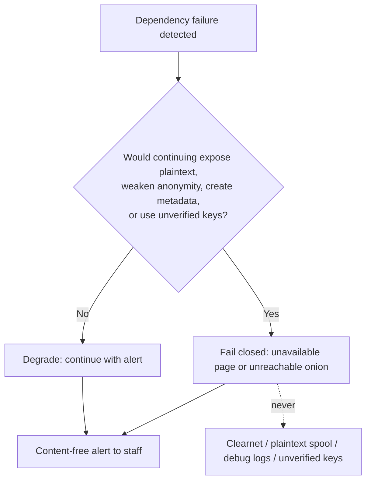

# 34 — Performance, Scalability, High Availability and Safe Failure Behavior

Status: Draft v1.1 (revision round 2: ADR-034..046) · Edition applicability: both (HA sections EE) · Owner: Platform Engineering / Performance

## 1. Purpose and scope

This document specifies:
- the load model: concurrent sources, organizations with tens of thousands of employees, international use;
- capacity targets and sizing per deployment profile;
- very large uploads and per-profile limits;
- behavior over high-latency Tor;
- interrupted and resumable uploads, with their correlation metadata (THR-047) and the chosen design;
- high availability **without adding unacknowledged metadata observers**, listing every observer HA introduces;
- the **safe-failure behavior** for every dependency failure: fail closed where privacy is at stake, and never reroute to clearnet (ADR-002).

Out of scope, and covered elsewhere:
- Rate limits: `07-BACKEND.md` §limits.
- API shapes: `08-API.md`.
- The HA module design: `21-ENTERPRISE.md` §5.
- Sanitizer resource limits: `10-FILE-EVIDENCE-PIPELINE.md` §10.

## 2. Context and dependencies

| Source | Use |
|---|---|
| ADR-001, 002, 009, 010, 011, 024, 026, 030, 032 | Onion-only; no fallback; core-initiated pull relay; timing; padding; profiles; abuse resistance; per-member epoch keys (fail closed when no eligible keys); onion key on ≤ 2 hosts |
| ADR-034, 036(6), 037, 038, 039, 040, 044(4), 046 (revision round 2) | Tier W drafts and staging in sealer RAM/tmpfs; independent intake time; Triage Set routing; fixed import slots (default 4×/day), delayed delivery, padded Tier W staging; fetch-all reply pages; security floors; vault DR replication; no intake replication, no HSM fallback, canonical upload protocol (08), Argon2id m = 64 MiB with a concurrency semaphore |
| `07-BACKEND.md` | Enforced limits (sessions, sealer, request sizes, pending uploads) |
| `08-API.md` §5.1 | **Canonical** resumable upload protocol (ADR-046(4)): per-upload tokens, 8 MiB chunks, no cross-session resume, ≤ 24 h resume within one Source App session (Tier V only), no resume for Tier W |
| `16-TOR-I2P.md` | PoW parameters, vanguards, bridges |
| `17-INFRASTRUCTURE.md` / `18-DEPLOYMENT.md` | Host roles, profiles, hardware minima |
| `19-BACKUPS-DR.md` | Backup volumes and RPO/RTO |
| `21-ENTERPRISE.md` §5 | HA components (active/passive intake, Patroni, L4 LB) |
| `32-OPERATIONS.md` §5 | Self-test checks that trigger failure behaviors |

Research basis:
- Tor onion services under DDoS and the 0.4.8 PoW defense [B-AN-26, B-AN-27, B-AN-28].
- Guard discovery and correlation, which make HA placement and extra observers relevant [B-AN-01, B-AN-05, B-AN-11].
- OnionShare's upload-naming DoS under parallel Tor uploads (OTF-012, CVE-2022-21689) [B-OS-04].
- The OnionShare parse-before-policy file writes [B-OS-02].
- SecureDrop's 500 MB upload limit [B-SD-21] and SecureDrop Protocol scalability limits (per-request challenge computation over Tor) [B-SD-11].
- CoverDrop is small-message only, with hours of latency [B-GL-23].

## 3. Load model

### 3.1 Design populations

| Parameter | CE design point | EE design point | Basis |
|---|---|---|---|
| Organization size | ≤ 10,000 employees | 10,000 – 250,000 employees, ≥ 20 countries | Product scope (`01-PRODUCT-REQUIREMENTS.md`) |
| Reports per year (all Candor channels) | ≤ 300 | ≤ 5,000 | Knowledge (unverified): industry benchmarks report roughly 1–2 reports per 100 employees per year across all channels; Candor is one of several channels |
| Normal daily new reports | ≤ 5 | ≤ 50 | derived |
| **Crisis burst** (public scandal, company-wide call for reports) | 100 new reports in 24 h | 1,000 new reports in 24 h | 20× normal peak; design assumption |
| Concurrent source sessions (burst) | 50 | 500 | Burst ÷ session length (median 15 min; Tier W sessions ≤ 2 h absolute, ADR-034) |
| Returning-source logins per day (burst) | 200 | 3,000 | Sources check replies (Tier W server-side login) |
| Tier V reply-page fetches per day (burst) | 200 full-set downloads | 3,000 full-set downloads | ADR-039 fetch-all: each check downloads all reply pages of the last 30 days; at ≤ 50 replies/day (CE) or ≤ 500/day (EE) in fixed-size pages this is ≤ 64 MiB (CE) / ≤ 512 MiB (EE) per full fetch (planning figure; page size per `08-API.md`) |
| Abuse / flood attempts | 10,000 requests/h | 100,000 requests/h + onion-level DoS | THR-032/033; PoW absorbs introduction floods [B-AN-26] |
| Recipients (concurrent Desk sessions) | 10 | 300 | EE multi-channel |
| Attachment mix | 80% text-only envelopes; 18% ≤ 50 MiB; 2% > 50 MiB | same | design assumption |
| Mean padded envelope size | 12 MiB | 12 MiB | derived from the mix with ADR-011 buckets |

### 3.2 International considerations

| Aspect | Effect | Design response |
|---|---|---|
| Sources in censored regions | Tor needs bridges/pluggable transports; latency 2–5× higher | Source guidance for bridges (`05-SOURCE-OPSEC.md`, `16-TOR-I2P.md`); timeouts in §6 assume the P10 bandwidth |
| Low-bandwidth mobile links | Large pages are slow | Source web pages padded to the fixed size classes of `11-FRONTEND-SOURCE.md` (canonical owner of page size classes); no web fonts or JS required |
| Time zones | Local "day" differs from UTC | All stored dates are UTC epoch days (ADR-010); source-facing dates shown as UTC dates with a label; SLA engine uses jurisdiction calendars (`25-COMPLIANCE.md`) |
| Languages | Many locales | Localized static pages from memory, identical sizes within each size class (per-locale padding) |
| Jurisdictions of hosting | Legal exposure | `17-INFRASTRUCTURE.md` §7; not a performance item |

## 4. Upload limits per profile

Hard ceilings (ADR-046(4); `08-API.md` is canonical, `07-BACKEND.md` enforces):
- Per-file cap **4 GiB** in standard profiles; **16 GiB** only in EE profiles (EE-ONPREM, EE-HA, GOV-ONPREM, PRIVATE-CLOUD, MANAGED), with the `08-API.md` chunk count raised accordingly (8 MiB chunks: ≤ 512 chunks for 4 GiB, ≤ 2,048 for 16 GiB).
- Tier W file per request ≤ `intake.max_file_bytes` (hard maximum 2 GiB and ≤ half of the Tier W staging cap below). Tier W parts are padded to ADR-011 buckets **before** staging (ADR-038(5)) and staged only in the sealer tmpfs (ADR-034), so staging capacity is **RAM**.
- ≤ 20 files per envelope (maximum 32).

Profile defaults are set so that intake storage holds ≥ 7 days of crisis-burst backlog plus 3 days of delayed-delivery backlog (DR-007).

| Profile | Tier W max file (default / max) | Tier W staging cap (tmpfs, RAM) | Tier V per-file cap | Global pending-upload bytes cap (Tier V) | Max concurrent Tier W uploads |
|---|---|---|---|---|---|
| CE-SINGLE | 256 MiB / 512 MiB | 4 GiB | 4 GiB | 32 GiB | 8 |
| CE-HARDENED | 512 MiB / 2 GiB | 8 GiB | 4 GiB | 64 GiB | 16 |
| EE-ONPREM | 512 MiB / 2 GiB | 16 GiB | 16 GiB | 256 GiB | 32 |
| EE-HA | 512 MiB / 2 GiB | 16 GiB per intake host | 16 GiB | 512 GiB | 32 per active intake |
| GOV-ONPREM | 512 MiB / 2 GiB | 16 GiB | 16 GiB | 256 GiB | 32 |
| AIRGAP-RCP | inherits the server profile; transfer media ≥ 2× the largest envelope | — | — | — | — |
| PRIVATE-CLOUD | 512 MiB / 2 GiB | 16 GiB | 16 GiB | 256 GiB | 32 |
| MANAGED | 512 MiB / 2 GiB (contract may lower) | 8 GiB per customer | 16 GiB | per customer, 128 GiB default | 16 per customer |

When the Tier W staging cap is reached, new Tier W uploads receive the padded busy page before any body byte is read (F19); staged parts are never spilled to disk.

Larger material:
- The Source App splits it into several envelopes within the same mailbox thread, and the UI states that these envelopes are linkable to each other (they are in the same account anyway).
- Tier W sources are told to use the Source App for more than 512 MiB.
- v1.0 Open issue 2 (16 GiB ceiling in 10 vs 4 GiB in 08) is resolved by ADR-046(4) as above.

Upload time over Tor, using planning figures (Knowledge (unverified): onion-service single-circuit throughput commonly ranges from about 100 KiB/s to 1 MiB/s):

| Size | P50 (300 KiB/s) | P10 (80 KiB/s) |
|---|---|---|
| 10 MiB | 34 s | 2 min 8 s |
| 256 MiB | 15 min | 55 min |
| 512 MiB | 29 min | 1 h 49 min |
| 2 GiB | 1 h 57 min | 7 h 17 min |
| 4 GiB | 3 h 53 min | 14 h 34 min |

Consequence: Tier W uploads above about 512 MiB have a high interruption probability at P10. This is why the resumable path (§5) exists only in Tier V, and why Tier W defaults stay at ≤ 512 MiB.

## 5. Interrupted and resumable uploads (THR-047)

### 5.1 Options considered

| Option | Resume? | Correlation metadata created | Decision |
|---|---|---|---|
| A. Single request, no resume | No | None beyond the request | **Tier W** (browsers cannot resume multipart POSTs without JS; ADR-004 forbids required JS) |
| B. Session-bound resumable upload (tied to the source login session) | Yes | Links every reconnection to the **account** from the first byte; the server sees reconnect times per account | Rejected |
| C. Capability-bound chunked upload (per-upload token), account-unlinked until commit, resumable **only within one Source App session** for ≤ 24 h (`08-API.md` §5.1, ADR-046(4)) | Yes, within the session | Links the reconnections of **one upload** within one session to each other (inherent), and nothing else; commit links it to the envelope and account at the same moment the envelope is linked anyway | **Tier V (chosen)**. v1.0's cross-session resume with a 72 h TTL is withdrawn |
| D. Independent per-chunk anonymous uploads reassembled by the recipient | Partly | Server-side reassembly needs a join key (≈ C); recipient-side reassembly multiplies envelopes and loses integrity grouping | Rejected (complexity, no gain over C) |

### 5.2 Chosen design (summary; normative protocol in `08-API.md` §5.1, canonical per ADR-046(4))

- The client generates a per-upload secret and registers a per-upload token; every chunk request is authenticated by that token (MAC over upload ID, chunk index and chunk digest). There is no account or login-session token on chunk requests.
- Chunks are **8 MiB** ciphertext. Chunk count is derived from the padded bucket size (ADR-011), so it reveals only the bucket: ≤ 512 chunks for the 4 GiB standard cap, ≤ 2,048 for the 16 GiB EE cap.
- **No cross-session resume.** The Source App keeps the upload secret only in RAM for the current unlocked app session; closing or locking the app abandons the upload. Within the session, it may resume on a fresh Tor circuit (SOCKS isolation) for up to **24 h** (`intake.upload_session_ttl`, `32-OPERATIONS.md` §7).
- Server state per upload: upload ID, token verifier, chunk bitmap, `created_epoch_day`, padded-bucket ID. **No timestamps per chunk, no circuit identifiers, no counts of resumptions.**
- On commit, abandonment signal or expiry (24 h), chunks and the token verifier are deleted (crypto-garbage: chunks are ciphertext under a key held only by the client).
- Tier W has **no** resume: a Tier W part is a single request; its padded ciphertext lives in the sealer staging tmpfs until Submit or session expiry (ADR-034).
- Rate limits: per `08-API.md` (per-circuit chunk rate) and the global pending cap in §4.

### 5.3 Residual correlation (THR-047)

| Observer | Can learn | Mitigation | Residual |
|---|---|---|---|
| Intake server (honest-but-curious) | That the requests of one upload belong together; the bucket size; the creation day | No per-chunk times; no circuit IDs persisted (`16-TOR-I2P.md` NET-013) | A **live-compromised** intake can record resumption times and see that one client reconnected at t1, t2, … |
| Network observer on the source side (employer, ISP) | A Tor user transferred a large volume over hours, with reconnections | Guidance: use non-employer networks; bridges | Volume and timing correlation with arrival at the intake host (THR-003), if the adversary also observes the intake uplink |
| Intake uplink observer (provider, `17-INFRASTRUCTURE.md` §7) | Long high-volume inbound Tor flows | Uplink independence (INFRA-025) | Correlation with the source side remains possible for a two-ended observer |

Honest statement shown in the Source App before large uploads:

> "Large files take a long time over Tor. While uploading, anyone watching your network can see that you are sending a lot of data over Tor. If the upload is interrupted, the app can continue as long as you keep it open, for up to 24 hours; the service can tell that the parts belong to one upload, but not who you are."

## 6. High-latency Tor: timeouts and UX

| Parameter | Value | Rationale |
|---|---|---|
| Web idle read timeout (Tier W, per request) | 120 s without a received byte | Tolerates circuit stalls |
| Minimum average upload rate (Tier W) | 8 KiB/s over any 120 s window, else abort (slow-loris defense) | Below the P10 figure with margin |
| Maximum Tier W request duration | The remaining Tier W session time (≤ 2 h absolute, ADR-034) | At P10 (80 KiB/s) about 512 MiB fits into 2 h; a 2 GiB Tier W file needs ≥ ~300 KiB/s. The UI tells Tier W sources to use the Source App above 256 MiB on slow connections |
| Page response size classes | As defined by `11-FRONTEND-SOURCE.md` (canonical owner; RVW-A-21) | Website-fingerprinting uniformity [B-AN-15, B-AN-16] |
| Tier V chunk request timeout | 600 s per 8 MiB chunk (≥ 14 KiB/s) | Then retry on a new circuit within the same app session |
| Source App retry policy | Exponential backoff 5 s → 5 min, max 20 retries per chunk, then pause and ask the user | Avoid hammering during DoS |
| PoW client effort | Per `16-TOR-I2P.md`; UI shows "The service is busy; your computer is doing extra work to get through. This can take a few minutes." | THR-032 |
| Login (Argon2id m = 64 MiB, t = 3, p = 1; FIPS: PBKDF2-HMAC-SHA-512, 210,000 iterations) | Concurrency semaphore default **4** derivations (ADR-046(7)), queue ≤ 32, queue wait ≤ 30 s, then the padded busy page; plus PoW. Target ≤ 1 s server time per derivation at CE hardware | ADR-005, ADR-046(7). Security rests on ≈ 129-bit passphrase entropy; stretching is defence in depth |
| Busy-page behaviour (RVW-A-27) | Global limits are sized so that the semaphore and account-creation caps saturate only at ≥ 10× the design peak of §3.1; when busy, the response is the fixed-size busy page, and single probes are not a reliable saturation oracle because a uniformly random 0–2 s delay is added to every login response and the busy decision is made after the delay | Queue and rate-limit states are also not exposed in any response or dashboard beyond a coarse daily health band (ADR-038(5)) |
| Recipient Desk sync over RCP-ONION | Batch fetch with 30 s per-request timeout and resumable blob downloads (Desk ↔ core, staff side: no THR-047 issue) | — |
| Tier W session timers | 20 min idle, 2 h absolute; expiry zeroizes the draft and the staging key (ADR-034) | Single timer set across 03/07/11 |

## 7. High availability without unacknowledged metadata observers

HA adds copies, links and control planes. Each is a potential observer or seizure target. EE-HA (and GOV-ONPREM on HA) SHALL deploy only the HA elements below, each with its mitigation, and SHALL document the residual in the deployment record.

| # | HA element (from `21-ENTERPRISE.md` §5.2, `18-DEPLOYMENT.md` §4.4) | New observer / exposure | What it can see | Mitigation | Residual |
|---|---|---|---|---|---|
| O1 | Second intake host H-INTAKE-B (passive) | A second copy of the **onion key** (ADR-032) and, after each planned switchover, of the intake store as it was at that moment; when active, the same Tier W RAM exposure | Everything H-INTAKE has (`17-INFRASTRUCTURE.md` §8.5) | Same hardening, FDE (U4), attestation, manifest; tor stopped while passive; shared-nothing (no replication, ADR-046(1)); same rack room | THR-044 exposure doubled (ADR-032) |
| O2 | WITHDRAWN (ADR-046(1)): the v1.0 intake replication link N-INTAKE-REPL no longer exists. N-INTAKE-HB carries only the O4 heartbeat. Planned-switchover store transfer goes through the core-initiated relay once per switchover (`18-DEPLOYMENT.md` §4.4) | Relay-link observer during a switchover | One encrypted store export per switchover, at an operator-chosen time aligned with an import slot | Relay mTLS; export padded to the ADR-011 bucket | Negligible |
| O3 | Fencing device (switched PDU / BMC) | Power-control plane | Failover events only | N-OOB unrouted (INFRA-011) | BMC attack surface |
| O4 | Health heartbeat A↔B | — | Liveness only | Fixed 10 s cadence, fixed size | None |
| O5 | DR-site intake VM (no key until declared) | DR-site uplink provider after promotion | Intake traffic after DR | Key restored only on DR declaration (IRK quorum); same uplink-independence rules; intake data comes from BS-INTAKE, never replication | Second-site observer during DR |
| O6 | Case DB replicas (Patroni, 3 nodes) + DCS (etcd) | More disks with C-12 metadata; the etcd cluster state | C-12 server-readable metadata | FDE per node; dedicated nodes; etcd holds no case data (only leader keys); in-zone replication | More seizure targets |
| O7 | Async WAL / blob replication **and Erasure Key Vault replica** to the DR site (ADR-044(4)) | **WAN link observer**; a second vault copy at the DR site | Replication volume and timing ≈ staff activity and import slots (fixed, ADR-038(1)) | Encrypted tunnel; ship WAL and vault deltas as fixed-cadence padded 15-min bundles (same format as BS-CORE-WAL, `19-BACKUPS-DR.md` §5.3, §6.1) rather than streaming; erasures propagate to the replica | Coarse volume per 15 min, bucketed; the DR vault is one more seizure target |
| O8 | Blob store erasure-coded nodes (4+2) | More disks with ciphertext shards | Object sizes (padded) and write timing (batch) | Ciphertext only; padding; FDE; versioning off | Media sanitization burden |
| O9 | L4 load balancer for the Desk API | LB operators | Staff source IPs and connection times | TLS passthrough; `dontlog-normal`; SYSTEM counters only (`21-ENTERPRISE.md` HA-004); RCP-ONION avoids it | Connection metadata visible in RAM on the LB |
| O10 | Kubernetes control plane (Z-CORE only) | Cluster admins; API audit logs; etcd Secrets; kubelet/containerd logs; CNI flow logs | Workload metadata; secrets if etcd is unencrypted; container stdout | DEP-003: dedicated cluster, etcd encryption via the customer HSM, audit without bodies, container log driver limits, no mesh access logs, NetworkPolicy default-deny | cluster-admin = root on Z-CORE workloads (no content keys exist there) |
| O11 | HA orchestration module (EE, ADR-020) | Privileged operator process | Cluster state | Runs in Z-CORE/Z-ADM only; never on Z-INTAKE data paths except promote/fence actions; no content APIs | Privileged code in the availability path |
| O12 | Monitoring of HA (metrics exporters) | Metrics store and its readers | Must not include request rates on intake | Same privacy rules as the self-test (`32-OPERATIONS.md` §5.1); **no per-request metrics exporters on Z-INTAKE** | None if enforced |
| O13 | Relay leader election (lease in the core DB) | — | Leader changes | Fresh random delay on leader change (`21-ENTERPRISE.md` HA-005) | None |
| O14 | Second H-MON | Duplicated self-test results | Same privacy-safe results | Same schema | None |
| O15 | HSM pair (cloned keys) | A second HSM with the same keys | Same as one HSM | Wrapped cloning under M-of-N; same physical controls; if both are unavailable, signing pauses: **no TPM or software fallback keys** (ADR-046(2); `21-ENTERPRISE.md` HA-013 superseded) | Two seizure targets |

**Prohibited HA mechanisms** (they introduce observers that cannot be accepted):
- anycast/CDN/WAF in front of the source path (REQ-H-54);
- clearnet health endpoints on intake;
- **any** replication of the intake store, synchronous or asynchronous, same-site or cross-site (ADR-046(1); `wal_level=minimal`, `max_wal_senders=0`, no archiving, `track_commit_timestamp=off` on every intake);
- active/active onion descriptor aggregation until reviewed (ADR-032, `16-TOR-I2P.md`);
- per-request tracing or APM agents on Z-INTAKE;
- managed-database services for the intake store.

## 8. Capacity targets and sizing

### 8.1 Throughput and concurrency targets (must pass the load test in §8.3)

| Metric | CE-SINGLE | CE-HARDENED | EE-ONPREM / GOV / PRIVATE-CLOUD | EE-HA (active intake) |
|---|---|---|---|---|
| Concurrent source web sessions | 100 | 500 | 2,000 | 2,000 |
| Concurrent Tier W uploads | 8 | 16 | 32 | 32 |
| Concurrent Tier V upload chunk streams | 32 | 128 | 512 | 512 |
| Sealer sessions (`07-BACKEND.md`) | 16 | 64 | 64 | 64 |
| Argon2id logins/min sustained | 60 | 240 | 240 | 240 |
| New envelopes/day sustained (crisis burst) | 100 | 500 | 1,000 | 1,000 |
| Page P95 server time (excluding Tor) | ≤ 300 ms | ≤ 200 ms | ≤ 200 ms | ≤ 200 ms |
| Sealer throughput (Tier W streaming) | ≥ 50 MiB/s | ≥ 200 MiB/s | ≥ 200 MiB/s | ≥ 200 MiB/s |
| Relay import per fixed slot (core; ADR-038(1)) | All pending envelopes whose release day has come, in successive batches of ≤ 500 objects / 2 GiB (`07-BACKEND.md`), completed within 60 min of the slot start; ≥ 2,000 objects / 16 GiB per slot | same | same | same |
| Concurrent Desk sessions | 10 | 30 | 300 | 300 |
| Desk case list P95 | ≤ 1 s | ≤ 1 s | ≤ 1.5 s | ≤ 1.5 s |

### 8.2 Sizing formulas

| Resource | Formula | Example (EE crisis) |
|---|---|---|
| Intake spool (DR-007, 7-day backlog + 3-day delayed delivery) | `(7 + 3) × burst_envelopes_per_day × mean_padded_size + pending_upload_cap` | 10 × 1,000 × 12 MiB + 256 GiB ≈ 373 GiB → provision 500 GiB |
| Reply pages (ADR-039) | `30 days × replies_per_day × padded_reply_size`, served from disk as fixed-size pages | EE: 30 × 500 × 64 KiB ≈ 1 GiB |
| Intake RAM | `4 GiB base + semaphore (4) × 64 MiB (Argon2id) + sealer sessions × 16 MiB (drafts and session state, ADR-034) + Tier W staging cap (§4) + web sessions × 64 KiB` | EE: 4 + 0.25 + 1 + 16 + 0.13 ≈ 21.4 GiB → 32 GiB. CE-SINGLE intake VM: 4 + 0.25 + 0.25 + 4 ≈ 8.5 GiB → 10 GiB (`18-DEPLOYMENT.md` §4.1 VM sizes to be read with this) |
| Core blob store / year | `reports_per_year × mean_padded × (1 + derivative_factor 1.5)` | 5,000 × 12 MiB × 2.5 ≈ 147 GiB/yr |
| Case DB / year | `reports_per_year × 2 MiB` (records, messages, audit) | ≈ 10 GiB/yr |
| Backups (T1, 35 days) | `nightly_full × 35 (padded) + 96 WAL bundles/day × 64 MiB × 14` | e.g., 160 GiB × 1.25 × 35 + 84 GiB ≈ 7 TiB (dedup-free by design) → EE provisions ≥ 10 TiB |
| CE-SINGLE backups (T2 disks) | `nightly_full × 7 (weekly rotation) × 1.25` | ≤ 2 TB disk each |

The backup sizes are large because padding and immutability defeat dedup. This is a deliberate tradeoff (`19-BACKUPS-DR.md` §5). EE MAY use incremental blob sets (new blobs only, padded) to cut T1 size by about 80% (ADVANCED; slightly more volume information per set).

### 8.3 Load-test scenarios (reference lab, CI nightly on EE-HA topology)

| ID | Scenario | Pass criteria |
|---|---|---|
| LT-1 | Crisis burst: 1,000 envelopes in 24 h compressed into 2 h, mix per §3.1, over a Tor test network (chutney/shadow; Knowledge (unverified) tooling) | No 5xx except padded `busy` pages; sealer queue wait P95 ≤ 30 s |
| LT-2 | 1,000 parallel anonymous uploads while a legitimate uploader completes 100 MiB (R1 R-DOS-1 [B-OS-04]) | The legitimate upload completes; no name collisions |
| LT-3 | Introduction flood with PoW on | Legitimate client with effort connects within 5 min |
| LT-4 | Relay outage 7 days at burst rate | Intake keeps accepting until 80% of capacity, then closes per the FAIL table; no data loss |
| LT-5 | Tier V 4 GiB upload with 5 forced interruptions within one app session; then one interruption with an app restart | Completes within the session; after the app restart the upload is not resumable and its server state expires ≤ 24 h; server state holds no per-chunk times (DB inspection) |
| LT-6 | Failover during burst (EE-HA) | Intake RTO ≤ 10 min; after repair of the failed host, C-09 recovers every envelope it had fsynced (no loss for recoverable disks); no intake-to-intake traffic other than the heartbeat |
| LT-7 | Probe for activity oracle (RVW-A-27): an observer sends 1 login/10 s while a legitimate load at the design peak runs | Busy page never returned below 10× design peak; response-time distribution with and without load not distinguishable by a KS test at α = 0.01 over 1,000 probes |
| LT-8 | Tier W staging exhaustion: parallel Tier W uploads until the staging cap is reached | Further Tier W uploads get the busy page before any body byte is read; no staging byte on persistent storage (fanotify) |

## 9. Safe failure behavior

Principles:
1. **Fail closed** whenever continuing would expose plaintext, weaken anonymity, create metadata or use unverified keys.
2. **Never** fall back to clearnet, plaintext spooling, unverified keys, debug logging or any less-protective mode (ADR-002; `06-SYSTEM-ARCHITECTURE.md` P10).
3. The source sees either a working service, a fixed-size static "temporarily unavailable" page served from memory by C-06, or an unreachable onion. The page contains no alternative contact channel unless it is one of the organization's pre-published secure channels, and never an identity channel.
4. Staff see content-free alerts (`32-OPERATIONS.md` §6).

"Unavailable page" text: "This service is temporarily unavailable. Nothing you entered was stored. Please try again later. Do not switch to channels you are not sure are safe."

| ID | Condition | Detection | Privacy-sensitive? | Behavior | Source sees | Staff sees | Forbidden fallback | Recovery |
|---|---|---|---|---|---|---|---|---|
| F1 | **Tor unavailable** on intake (daemon down, bootstrap < 100%, uplink down, consensus invalid) | `tor.daemon`, `tor.onion_published`, `tor.onion_reachable` | Yes | Onion unreachable. C-06 keeps running but receives nothing. After 30 min, SYSTEM alert. Scheduled imports continue (core still gets queued envelopes at the next slot) | Unreachable onion (Tor Browser error) | FAIL alert | Any clearnet listener, reverse proxy, "temporary" HTTPS form, email address as substitute | Restart tor; if the onion key is suspect → PB-10 |
| F2 | **I2P unavailable** | n/a | — | **Not applicable**: I2P is not shipped (ADR-001). No behavior is defined, and no code path exists | — | — | — | — |
| F3 | **Encryption service unavailable**: C-07 sealer down, `crypto.selftest` FAIL, or CSPRNG failure | Process supervision, `crypto.selftest` | Yes | Tier W submission and login routes return the unavailable page **before** reading the request body. Tier V uploads still accepted (client-encrypted), but commits needing C-07 are refused. The service is stopped on crypto self-test failure. A sealer restart **loses open Tier W drafts and staged parts** (their key existed only in sealer RAM, ADR-034); returning Tier W sources see "Your unsent draft was lost because the service restarted. Nothing was stored." | Unavailable page (Tier W); Source App "try later" | FAIL alert | Storing plaintext "until the sealer is back"; persisting drafts to disk to survive restarts; server-side encryption in a different process; weaker suite | Restart; on KAT failure → IR PB-02 |
| F4 | **DB unavailable**: intake store (C-08) | Connection failure | Yes | All dynamic routes return the unavailable page; static pages from memory; no request data written anywhere | Unavailable page | FAIL alert | Spooling to files or journald; in-memory queue beyond the in-flight request | Restart or DB failover (EE-HA) |
| F4b | DB unavailable: case DB (C-12) | Connection failure | No (source side), Yes (staff data) | Intake unaffected (buffers per DR-007). Relay pause. Desk read-only from local cache with a banner; no local plaintext spill beyond the normal Desk store | Normal | Desk banner | Desks writing actions locally unencrypted | Restore per DR-P2 |
| F5 | **Key service unavailable**: key directory unreachable, no valid signed directory snapshot on intake, snapshot older than the high-water mark (rollback, ADR-036(6)), or **fewer than `min_recipients` eligible Triage Set member epoch keys** for a channel, including after the source's COI ticks (ADR-030, ADR-037(1), ARCH-037) | `keys.epoch_runway`, `keys.availability` | Yes | The affected channel's intake fails closed. Other channels continue. **COI exhaustion** (the source's ticks exclude every eligible triage member, RVW-C-18): the source sees a specific message, "Your selection excludes everyone who receives reports on this channel. Please use {independent channel}", naming the channel's pre-configured independent route; no draft content is kept. A content-free, k-thresholded monthly counter of such events is kept for OVERSIGHT per `24-LICENSING-BUSINESS-MODEL.md` §TEL. Tier V clients refuse to encrypt to unverified or expired keys | Unavailable page, or the COI-exhaustion message with the independent route | WARN at 14 days to Channel Owner and OVERSIGHT, FAIL at 0 | Encrypting to fewer, other or unverified recipients; reusing expired epoch keys; server-side key escrow; routing to non-triage members | Members open their Desk to publish keys; directory resync; OVERSIGHT adds an external triage member |
| F5b | Intake Routing Key unsealable (TPM failure) | `keys.availability` | Yes | Replies cannot be routed: reply delivery pauses; intake of new envelopes continues | Replies appear later | FAIL alert | Storing routing data in cleartext | Restore from BS-SECRETS |
| F5c | HSM unavailable (EE/GOV), including both HSMs of an HA pair | `keys.availability` | No (integrity keys) | Audit checkpoints queue locally (hash chain continues; signing deferred ≤ 24 h, then FAIL); key-directory publication pauses; intake continues with the last valid snapshot until it expires. **No fallback signing keys** of any kind, including TPM-resident keys (ADR-046(2); FAIL-013 prevails over `21-ENTERPRISE.md` HA-013) | Normal | WARN → FAIL | Signing with a software or TPM fallback key | DR-P7 |
| F5d | Erasure Key Vault unavailable or corrupt (ADR-033(3)) | `keys.availability` | Yes (content access) | Core serves Erasure-Key-encrypted wraps only after a vault integrity check. On failure, Desk case opening pauses with a banner; intake continues. **No** re-wrapping of case keys without the Erasure Key layer | Normal | FAIL alert; Desk banner | Storing member wraps without the Erasure Key layer "temporarily"; restoring a vault without applying the erasure log | EE-HA: promote the DR/standby vault replica (ADR-044(4)); otherwise restore BS-ERASURE and apply BS-ERASELOG; Desk re-wrap for missing cases (`19-BACKUPS-DR.md` DR-P10) |
| F6 | **Storage full** (intake spool ≥ 95% or pending-upload cap reached) | `intake.queue_capacity`, `storage.disk_free` | Yes (risk of partial writes) | New submissions and uploads rejected with the unavailable page before reading bodies. Login and reply reading continue. Oldest **committed** envelopes are never dropped | Unavailable page for new submissions | FAIL alert | Deleting unpulled envelopes; writing elsewhere (tmpfs, other disks); disabling padding to save space | Fix the relay; add capacity |
| F7 | **Disk nearly full** (80–95%) | `storage.disk_free` bands | Partly | New Tier V uploads larger than the remaining headroom are refused. Tier W max file temporarily halved. Alert | Size-limit message | WARN | Turning off journald limits or retention rules to make space | Capacity or relay fix |
| F8 | **Attachment scanner / viewer crashed** (C-17 microVM/DispVM failure, sanitizer crash), or the **Desk main process or webview crashed** (RVW-C-11) | Desk viewer supervisor; Desk watchdog | Yes (hostile file; decrypted DOM in memory) | The object is marked `VIEW_FAILED`. **No fallback to opening in the host OS**; retry in a fresh disposable; option to route to the air-gapped station (C-18). Crash details stay local: OS and webview crash reporting are disabled for all Desk processes (WER/Crashpad/ReportCrash exclusions per `12-FRONTEND-RECIPIENT.md`), and no minidump leaves the host (REQ-H-58) | — | "Could not open safely" dialog | Opening with the system viewer; uploading to online sandboxes (IR-010) | Update the viewer image; C-18 |
| F9 | **Backup failed** | `backup.status`, RT-0 | No (availability) | Intake and core continue. Alert after 2 missed nightly sets. Retry with the same padding. No reduced-encryption retry | Normal | WARN → FAIL | Unencrypted or unpadded backup "just this once"; granting the agent delete rights to free space | Fix the store; RT-0 |
| F10 | **Clock wrong** (NTP offset > 30 s WARN; skew > 30 min against the independent floor of Tor consensus and Roughtime, or a backwards step > 5 min, FAIL; ADR-036(6)) | `clock.offset`, `clock.independent_floor`, INFRA-007, INFRA-033 | Yes (epoch keys, TLS, audit) | At FAIL: intake refuses new envelopes (epoch-key validity cannot be judged), and audit checkpoints pause. At WARN: continue with alert | Unavailable page at FAIL | Alert | Accepting envelopes with epoch keys outside their validity window; trusting a clock from the request or from Z-CORE | Fix the time source (H-MON); investigate a hostile time source |
| F11 | **Update failed** (install error or post-upgrade self-test fail) | `candorctl upgrade`, `update.status` | Depends | Automatic rollback to N-1 (DEP-018) unless the version is revoked; then intake stays closed until a fixed version is installed | Unavailable page during the window | FAIL alert | Running a half-upgraded intake; disabling signature checks to "force" an install; fetching updates over clearnet | Roll forward or back per `18-DEPLOYMENT.md` §12 |
| F12 | Relay link down (core cannot pull at a scheduled import slot) | `relay.lag` | No | Intake keeps accepting up to capacity (F6 threshold). The missed slot is **not** made up by an unscheduled pull; the backlog is imported at the next slot (ADR-038(1)) | Normal | WARN at 1 missed slot, FAIL at ≥ 2 | Intake pushing to core (ADR-009); ad-hoc pulls outside slots | Fix the link |
| F13 | Secret-manifest violation, attestation mismatch, egress violation, logging violation, Platform Manifest or running-manifest mismatch, config checker exit ≥ 20 | Self-test | Yes | Intake stopped (fail closed) for H-INTAKE findings; alert for others; IR per `31-INCIDENT-RESPONSE.md` | Unreachable onion or unavailable page | FAIL alert | Continuing "until investigated" | IR |
| F14 | DoS / introduction flood | PoW effort rising, `tor.onion_reachable` latency bucket | Partly | PoW scales effort; rate limits; static busy page | "Busy, extra work" UI | WARN | Disabling PoW; CAPTCHA from third parties (ADR-026); clearnet mirror | Standby onion only if the address itself is targeted (`16-TOR-I2P.md`) |
| F15 | RCP path down (staff cannot reach core) | Desk | No | Desk offline mode with local cache; no alternative path | — | Desk banner | Browser access; emailing reports | Restore the path |
| F16 | Monitor (H-MON) down | Missing heartbeats at the secondary monitor or on the admin console | No | Services continue; attestation checks pause (alert on recovery); Tang unavailable → no **unattended** reboot (U4); H-INTAKE keeps its independent time floor (F10) | Normal | WARN | Removing Tang binding to allow reboot; taking time from Z-CORE | Restore H-MON |
| F17 | **Below security floor** (installed trust-path version < signed `min_secure_version`, ADR-040) | `update.security_floor` | Yes | Affected trust-path units refuse to start; intake closed until an allowed version is installed. Neither local policy nor the Fleet Manager can defer this (ADR-045) | Unreachable onion or unavailable page | FAIL alert | Starting the old version "until the window"; disabling the floor check | Install the current release (`18-DEPLOYMENT.md` §11) |
| F18 | **EE licence expired** (RVW-C-24) | Licence module | No | Safety-relevant automation keeps full function: HA fencing and failover, SSO bridge login, SIEM export, Fleet check-in within its allow-list. Only configuration changes of EE modules are frozen (`24-LICENSING-BUSINESS-MODEL.md`) | Normal | Admin banner | Stopping fencing/failover (split-brain risk) or locking staff out | Renew; nothing else required |
| F19 | **Tier W staging full** (sealer tmpfs at the §4 cap) | Sealer | Yes | New Tier W uploads get the padded busy page before any body byte is read; open sessions continue | Busy page | WARN | Spilling staged parts to disk; raising the cap beyond RAM; accepting unpadded parts | Wait for sessions to submit or expire; resize RAM |
| F20 | **Argon2id semaphore saturated** | Sealer | Partly | Queue ≤ 32, wait ≤ 30 s, then the padded busy page (with the §6 randomization); KDF parameters unchanged | Busy page | WARN if saturation occurs below 10× design peak (sizing error) | Lowering Argon2id parameters; per-account lockout | PoW scales; add CPU/RAM |

## 10. Requirements

| ID | Requirement | Evidence | Threats | Component | Verification |
|---|---|---|---|---|---|
| PERF-001 | Each profile SHALL meet the §8.1 targets in the §8.3 load tests on reference hardware (`18-DEPLOYMENT.md` §4). | B-OS-04 (R1 R-DOS-1) | THR-032 | C-06, C-07, C-08 | TST: nightly LT-1..LT-6 on the reference lab |
| PERF-002 | Upload limits SHALL default to the §4 profile values and SHALL NOT exceed the hard ceilings of `07-BACKEND.md` / `08-API.md`. | B-SD-21; ADR-011 | THR-032, THR-033 | C-06, C-08 | TST: over-limit requests rejected before any byte is persisted (fanotify) |
| PERF-003 | Size limits SHALL be enforced before any request body byte is persisted or forwarded to the sealer. | B-OS-02 (CVE-2026-54707) | THR-032, THR-014 | C-06 | TST: crafted oversize multipart; zero filesystem writes |
| PERF-004 | Tier W uploads SHALL be single-request with no server-side resume state. | ADR-004; THR-047 | THR-047 | C-06 | INSP: route inventory; TST: interrupted Tier W upload leaves no state |
| PERF-005 | Tier V resumable uploads SHALL follow the canonical protocol of `08-API.md` §5.1 (per-upload tokens, 8 MiB chunks, resume only within one Source App session, ADR-046(4)). Server state SHALL be limited to upload ID, token verifier, chunk bitmap, bucket and `created_epoch_day`, with no per-chunk time, circuit identifier or resumption counter. | THR-047; ADR-010; ADR-046(4) | THR-047, THR-011 | C-06, C-08 | TST: LT-5 followed by DB and filesystem inspection |
| PERF-006 | Upload state SHALL expire after `intake.upload_session_ttl` (default and maximum 24 h, ADR-046(4)). Chunks and the token verifier SHALL be deleted at commit, abandonment or expiry. | THR-047; ADR-046(4) | THR-047, THR-017 | C-08 | TST: time-travel expiry test |
| PERF-007 | The Source App SHALL use a fresh Tor circuit per upload session, SHALL keep the per-upload secret only in RAM for the current app session (no cross-session resume), and SHALL show the honest large-upload statement of §5.3 before uploads above 100 MiB. | B-AN-01 | THR-002, THR-047 | C-03 | TST: SOCKS isolation token test; UI snapshot |
| PERF-008 | A global pending-upload byte cap per profile (§4) SHALL be enforced. When it is reached, new uploads SHALL receive a padded busy response. | B-OS-04 | THR-032 | C-08 | TST: cap reached → busy; legitimate in-progress uploads continue |
| PERF-009 | Web and chunk timeouts SHALL follow §6, including the minimum-rate slow-loris abort. | Knowledge (unverified) slow-loris class | THR-032 | C-06 | TST: slow client dropped at the threshold; P10-rate client succeeds |
| PERF-010 | Source-facing responses SHALL use the fixed size classes of §6 for every locale. | ADR-011; B-AN-16 | THR-004 | C-06 | TST: response-size histogram per locale |
| PERF-011 | Intake storage SHALL be provisioned for ≥ 7 days of crisis-burst backlog plus 3 days of delayed-delivery backlog plus the pending-upload cap, and intake RAM for the Tier W staging cap (§8.2). The installer SHALL refuse smaller volumes or RAM for the chosen profile. | DR-007 (19); ADR-034; ADR-038 | THR-032 | C-08, C-19 | TST: installer sizing check |
| PERF-012 | EE-HA SHALL deploy only the HA elements O1 and O3–O15 of §7 (O2 withdrawn) with their mitigations, and SHALL record the residuals in the deployment record. | ADR-032; ADR-024 | THR-030, THR-044, THR-016 | C-05, C-12, C-39 | INSP: deployment record; TST: config checker HA rules |
| PERF-013 | WITHDRAWN (ADR-046(1)): Intake replication (O2) SHALL use a direct link between the two intake hosts, and SHALL NOT traverse shared switches, WAN or other sites. Superseded by PERF-020 (no intake replication at all). | ADR-010; ADR-046(1) | THR-011, THR-003 | C-08 | INSP: superseded by PERF-020 verification |
| PERF-014 | Cross-site replication of core data (O7) SHALL ship padded fixed-cadence WAL bundles over an encrypted tunnel, not an unpadded stream. | ADR-011 | THR-011 | C-12, C-27 | TST: identical bundle cadence and bucket sizes for idle vs burst workloads |
| PERF-015 | No per-request metrics, tracing or APM agent SHALL run on Z-INTAKE hosts. | INC-60; ADR-016 | THR-016, THR-011 | C-05, C-06, C-25 | TST: package/process deny-list in the self-test |
| PERF-016 | The prohibited HA mechanisms listed in §7 SHALL be rejected by the configuration checker. | REQ-H-54; ADR-032 | THR-001, THR-016 | C-19 | TST: checker rules for each prohibited mechanism |
| PERF-017 | Tier W Argon2id login processing (m = 64 MiB, t = 3, p = 1) SHALL be bounded by a concurrency semaphore (default 4), a queue ≤ 32 and a 30 s wait, plus PoW, and SHALL degrade to a padded busy page rather than lowering KDF parameters. | ADR-005; ADR-026; ADR-046(7); RVW-A-27 | THR-032, THR-034, THR-100 | C-07 | TST: overload → busy page; KDF parameters unchanged; semaphore value from config |
| FAIL-001 | No failure condition SHALL cause any source-facing service to fall back to clearnet, a non-onion transport, plaintext storage, weaker cryptography, unverified or expired keys, or debug logging. | ADR-002 | THR-001, THR-014, THR-035 | C-05, C-06, C-07 | TST: fault-injection matrix F1–F20 asserts no forbidden fallback (packet capture, filesystem scan, key-usage log) |
| FAIL-002 | On Tor unavailability (F1), the service SHALL remain onion-only. No component SHALL open a clearnet listener or publish an alternative submission path automatically. | ADR-001; INC-33 | THR-001 | C-05, C-06 | TST: kill tor → no listener changes (`ss` diff); C-37 unchanged |
| FAIL-003 | On sealer or crypto self-test failure (F3), Tier W submission and login routes SHALL refuse requests before reading their bodies. | ADR-004; B-OS-02 | THR-014 | C-06, C-07 | TST: stop the sealer, send a submission → body not read (socket-level check), unavailable page |
| FAIL-004 | On intake DB failure (F4), no request data SHALL be written to any file, log or alternative store. | ADR-016 | THR-016, THR-014 | C-06, C-08 | TST: DB down + submission → zero writes (fanotify), no journald entries containing request data |
| FAIL-005 | When a channel has fewer than `min_recipients` (default 2) eligible Triage Set member epoch keys valid today, including after the source's COI ticks (F5), intake for that channel SHALL fail closed and SHALL direct the source to the channel's independent route with the COI-exhaustion message. Clients SHALL NOT encrypt to fewer, other, unverified or expired keys. | ADR-030; ADR-037(1); ADR-044(2); ARCH-037; RVW-C-18 | THR-046, THR-013 | C-06, C-07, C-03, C-14 | TST: expire all member keys → channel closed; Source App refuses stale keys |
| FAIL-006 | On storage exhaustion (F6), new submissions SHALL be refused before bodies are read, and no committed or unpulled envelope SHALL be deleted to free space. | DR-007 | THR-032, THR-042 | C-08 | TST: fill the disk → refusal; envelope count unchanged |
| FAIL-007 | Viewer, sanitizer, Desk main-process or webview failure (F8) SHALL NOT offer opening the original in the host OS by default. Crash data SHALL stay local; OS and webview crash reporting SHALL be disabled for Desk processes. | ADR-012; REQ-H-58; RVW-C-11 | THR-023, THR-016, THR-109 | C-15, C-17 | TST: crash the viewer and the Desk webview with canary content → dialog offers only retry/C-18; no outbound crash report or minidump leaves the host |
| FAIL-008 | Backup failure (F9) SHALL NOT trigger any retry with reduced encryption, padding or credentials. | INC-55 | THR-017, THR-042 | C-27 | TST: store failure → retries identical in format |
| FAIL-009 | On clock skew > 30 min against the independent floor (Tor consensus, Roughtime) or a backwards step > 5 min (F10), intake SHALL refuse new envelopes and audit checkpointing SHALL pause until time is corrected. | ADR-008; ADR-036(6); THR-043 | THR-043, THR-132 | C-06, C-24, C-25 | TST: fake clock → refusal |
| FAIL-010 | On a failed update (F11), the system SHALL roll back automatically unless the version is revoked. It SHALL NOT disable signature verification or fetch updates over clearnet. | ADR-022; INC-49 | THR-025 | C-19, C-33 | TST: broken update → rollback; signature-bypass flag absent |
| FAIL-011 | The unavailable page SHALL be served by C-06 from memory, at a fixed size, with no request logging, and SHALL NOT list identity-based contact channels. | ADR-002; ADR-017 | THR-040, THR-028 | C-06 | TST: page served with the DB and sealer down; size constant; content review |
| FAIL-012 | Privacy-critical self-test failures on H-INTAKE (F13) SHALL stop intake within 5 min of detection. | ADR-028; B-SD-22 | THR-035, THR-014 | C-25, C-06 | TST: inject each violation → intake stopped within 5 min |
| FAIL-013 | HSM unavailability (F5c) SHALL NOT cause signing with software or TPM fallback keys (this requirement prevails over `21-ENTERPRISE.md` HA-013, ADR-046(2)). Deferred audit checkpoints SHALL be signed on recovery, or FAIL after 24 h. | ADR-016; ADR-046(2); RVW-C-08 | THR-037 | C-24, C-29 | TST: HSM offline → no software signature; recovery signs the backlog |
| FAIL-014 | The fault-injection matrix F1–F20 SHALL run in CI on the reference lab for every release. | ADR-002 | THR-035 | C-31 | TST: CI job `fail-matrix` required for release |
| PERF-018 | Tier W attachment parts SHALL be padded to ADR-011 buckets before staging and staged only in the sealer tmpfs under the per-profile staging cap of §4; reaching the cap SHALL yield the busy page before any body byte is read. | ADR-034; ADR-038(5); RVW-A-22 | THR-011, THR-003, THR-032 | C-06, C-07 | TST: LT-8; staged object sizes are bucket sizes only |
| PERF-019 | Global Argon2id and account-creation limits SHALL be sized to saturate only at ≥ 10× the §3.1 design peak, login responses SHALL carry a uniformly random 0–2 s delay before the busy decision, and queue/limit states SHALL NOT be exposed beyond a coarse daily health band. | RVW-A-27; ADR-038(5); ADR-046(7) | THR-011, THR-032 | C-06, C-07 | TST: LT-7 |
| PERF-020 | No intake store replication of any kind (synchronous or asynchronous, same-site or cross-site) SHALL exist in any profile; every intake SHALL run `wal_level=minimal`, `max_wal_senders=0`, no WAL archiving and `track_commit_timestamp=off`. | ADR-046(1); RVW-C-08 | THR-011, THR-003, THR-015 | C-08 | TST: `pg_params` health check on every intake; checker rejects replication settings |
| PERF-021 | The Erasure Key Vault replica to the DR site (EE-HA) SHALL travel only inside the padded fixed-cadence 15-min replication bundles (O7) and SHALL apply erasures on receipt. | ADR-044(4); RVW-C-07 | THR-011, THR-017 | C-12 | TST: identical bundle cadence and sizes for idle vs burst; erasure visible on the replica within 15 min |
| PERF-022 | Relay imports SHALL run only at the fixed import slots (ADR-038(1)); a missed slot SHALL NOT be compensated by an unscheduled pull. | ADR-038(1); RVW-A-09; RVW-B-06 | THR-011 | C-09 | TST: link outage across a slot → next import at the following slot only; import commit times equal slot times |
| FAIL-015 | Trust-path units SHALL refuse to start below the signed security floor (F17); no local or Fleet policy SHALL override this. | ADR-040; ADR-045 | THR-025, THR-137 | C-05, C-06, C-07, C-10, C-33 | TST: install a below-floor version → units do not start; Fleet policy attempting deferral rejected |
| FAIL-016 | EE licence expiry (F18) SHALL NOT stop HA fencing/failover, SSO bridge login or SIEM export; only EE configuration changes SHALL be frozen. | RVW-C-24 | THR-032, THR-042 | C-35, C-39 | TST: expired licence + node failure → failover completes; staff log in via SSO |
| FAIL-017 | A sealer restart or Tier W session expiry SHALL zeroize drafts and staging keys, SHALL NOT persist any draft to disk, and returning sources SHALL be told that the unsent draft was lost. | ADR-034; RVW-A-02 | THR-015, THR-048 | C-07, C-06 | TST: restart the sealer during a draft → no canary on disk; message shown on next page load |

## 11. Residual risks and limitations

1. Large uploads over Tor last hours. Network observers see long high-volume Tor sessions, and resumption links the parts of one upload. This is inherent (THR-047), and source guidance plus the honest UI statement are the mitigations.
2. Crisis bursts can exceed intake capacity. Fail-closed "busy" pages cost availability at the moment sources most want to report.
3. Tor throughput figures are planning assumptions (Knowledge (unverified)) and vary by region and network load.
4. HA adds a second onion-key host and other observers (§7). Availability is bought with exposure. Because intake hosts are shared-nothing (ADR-046(1)), an unplanned failover makes envelopes and accounts on the failed host unavailable until its disk is recovered; a destroyed host loses them back to the last BS-INTAKE.
5. Padding and immutability make backups large (§8.2), which may push small operators to shorten retention or skip offline copies.
6. A two-ended network adversary can correlate upload timing and volume regardless of server behavior (THR-003). Padding Tier W parts before staging hides exact sizes only from post-hoc inspection of intake storage; a live uplink observer still sees each upload's volume and time (RVW-A-22, partially fixed).
7. Tier W staging in RAM makes the staging cap a hard capacity limit; crisis bursts with large Tier W files hit busy pages earlier than in v1.0.
8. Fixed import slots delay staff access to new reports by up to one slot interval (6 h default, 24 h HIGH/GOV) plus any source-chosen delay; this is the price of removing arrival-derived timestamps.
9. Fetch-all reply pages cost Tier V sources bandwidth that grows with total reply volume; very large EE instances may need page compaction (`08-API.md`).
10. Busy-page randomization makes single probes unreliable, but repeated probing over long periods can still estimate saturation periods (RVW-A-27 residual); Tor-level PoW effort is inherently public.

## 12. Open issues

1. **Chunk design inconsistency among sibling documents.** Resolved by ADR-046(4): `08-API.md` §5.1 is canonical (per-upload tokens, 8 MiB chunks, no cross-session resume, ≤ 24 h within one session in Tier V, no resume in Tier W). This document now follows it.
2. **Attachment ceiling mismatch.** Resolved by ADR-046(4): 4 GiB per file in standard profiles; 16 GiB only in EE profiles with the `08-API.md` chunk count raised to 2,048.
3. Tor performance planning numbers should be replaced with measurements from the reference lab and from the live Tor network (`30-ANONYMITY-TESTING.md`).
4. Evaluate whether incremental padded blob backup sets (ADVANCED in §8.2) should become the EE default.
5. Reply-page size and compaction for fetch-all retrieval (ADR-039) at EE scale need measurement; the planning figure in §3.1 is an estimate.
