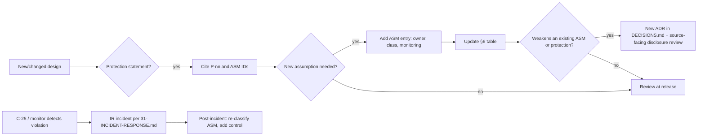

# 40 — Security Assumptions Register
Status: Draft v1.0 · Edition applicability: both (CE / EE; edition-specific notes inline) · Owner: Security Architecture

## 1. Purpose and scope

Every Candor protection holds only under stated assumptions (DECISIONS.md §0). This document:
1. Enumerates every security assumption as `ASM-001..ASM-048`, each with statement, dependent protections, consequence of violation, how it is monitored or verified, owner, verifiability class and related threats.
2. Defines the protection catalogue `P-01..P-30` and the table **Protection → assumptions required** (§6), which other specifications cite when they state "protects X from Y under assumptions A".
3. Specifies requirements (`ASM-101..ASM-124`) that make assumptions monitored, disclosed and change-controlled.

Out of scope: threat enumeration (`02-THREAT-MODEL.md`), control design (owning documents). This document states what must be true, not how each control works.

## 2. Context and dependencies

- Binding: `DECISIONS.md` (ADR-001..029, THR-001..048, C-01..C-40).
- Evidence: `00-RESEARCH.md` (findings F-nnn, incidents INC-nn).
- Consumers: all specs that make protection statements; in particular `02-THREAT-MODEL.md`, `03-PRIVACY-ANONYMITY.md`, `04-CRYPTOGRAPHY.md`, `05-SOURCE-OPSEC.md`, `06-SYSTEM-ARCHITECTURE.md`, `10-FILE-EVIDENCE-PIPELINE.md`, `16-TOR-I2P.md`, `17-INFRASTRUCTURE.md`, `20-LOGGING-AUDITING.md`, `28-SUPPLY-CHAIN.md`, `31-INCIDENT-RESPONSE.md`, `33-RELEASE-UPDATE-SECURITY.md`, `37-SECURITY-AUDIT-PLAN.md`, `11-FRONTEND-SOURCE.md` (source-facing disclosure).
- Self-test agent C-25 implements the automated checks in §8.

## 3. Conventions

| Item | Rule |
|---|---|
| Assumption IDs | `ASM-001..ASM-099` (this revision uses ASM-001..ASM-048). Never reused; retired entries marked RETIRED. |
| Requirement IDs | `ASM-101..ASM-199` (requirements *about* assumptions), in the DECISIONS.md §1 table format (§9). |
| Protection IDs | `P-01..P-99` (local to this document; cited by other specs as "40 P-nn"). |
| Verifiability class | **C** = continuously monitored by automation (C-25/C-15/C-03); **P** = periodically verified (drill, audit, review; interval stated); **A** = verifiable only by independent audit/analysis; **N** = not verifiable by Candor — documented residual, disclosed to affected party. |
| Owner roles | SA = Security Architecture; NET = Network/Anonymity team (16); CRY = Cryptography team (04); PLT = Platform/Backend (07); INF = Infrastructure/Ops (17, 32); REL = Release Engineering (28, 33); RCP = Recipient Client team (12); EVD = Evidence Pipeline (10); SUX = Source UX & OPSEC (05, 11); SOC = Security Operations (20, 31); GOV = Governance/Legal (25, 36); OPR = deploying organisation's operator (customer); SRC = the source (guidance only). |
| "Violated" | The assumption is false for a relevant party at a relevant time. Consequences are stated for the worst credible case. |

## 4. Assumption register

### 4.1 Network and anonymity (Z-NET)

**ASM-001 — No end-to-end observation of a given source circuit.**
- Statement: For a given submission or login session, no single adversary (or colluding set) simultaneously observes or controls both the source's link to its Tor guard (or bridge) and the path between the Candor onion service and its guard/vanguards, with timing precision sufficient for correlation.
- Protections: P-02, P-28.
- If violated: The adversary can link the source's IP address to "visited this Candor instance at time T" (not content). Repeated sessions raise confidence. Content remains protected (P-04/P-05/P-06).
- Monitoring / verification: Not observable by Candor. Service side uses full vanguards (ADR-001) to lengthen time-to-guard-discovery; timing minimisation (ADR-010) reduces value of partial observation. Evidence: F-051, F-066; B-AN-02, B-AN-04, B-AN-05; INC-29, INC-35.
- Owner: NET · Class: N (residual disclosed to sources, ASM-112) · Threats: THR-003, THR-005.

**ASM-002 — Tor implementation and onion-service protocol correct and patched.**
- Statement: C-tor ≥0.4.8 (later Arti) on C-05 and the source's Tor client implement v3 onion services, PoW (Equi-X) and vanguards as specified; security fixes are available and applied on C-05 within 72 h of a Tor security advisory.
- Protections: P-01, P-02, P-21, P-22, P-28.
- If violated: Protocol bugs may reveal service location, enable tagging (RELAY_EARLY class) or denial of service.
- Monitoring / verification: C-25 daily version/advisory check (ASM-106); advisory drill measuring time-to-patch (PERIODIC, quarterly). Evidence: INC-29; F-056, F-058; B-AN-23, B-AN-26.
- Owner: NET (CE: OPR applies updates) · Class: C (version) / P (drill) · Threats: THR-005, THR-032.

**ASM-003 — Tor relay population not dominated by an adversary.**
- Statement: Malicious relays remain a minority of guard/middle capacity and large Sybil groups (KAX17 class) are removed by the Tor Project's bad-relay process within months; vanguards (full on service, lite on clients) bound guard-discovery exposure.
- Protections: P-02, P-28.
- If violated: Probability of guard discovery against C-05 and of predecessor attacks against repeat visitors rises; service location may be found, enabling seizure or compelled hosting-level logging.
- Monitoring / verification: Not controllable; NET tracks Tor Project advisories and bad-relay reports; standby onion address (F-062). Evidence: INC-30; B-AN-24; F-059.
- Owner: NET · Class: N · Threats: THR-005.

**ASM-004 — Source uses a proxy-enforcing, fingerprint-uniform Tor client.**
- Statement: The source accesses Candor with a current Tor Browser (preferably "Safest", preferably on Tails) or the Candor Source App (C-03, embedded Arti), which route all traffic through Tor and do not expose stable fingerprints or active content exploits.
- Protections: P-01, P-02, P-23.
- If violated: A non-Tor-Browser client over Tor may be fingerprinted (THR-006); a browser exploit (NIT class) can bypass Tor and reveal the real IP (INC-27, INC-28, INC-36).
- Monitoring / verification: Candor cannot verify the client without fingerprinting (ADR-003). Mitigated by full no-JS operation (ADR-003/004), strict CSP, no active content; C-03 enforces its own end-of-support date (ASM-119). Evidence: F-064, F-124.
- Owner: SUX (guidance), SRC · Class: N · Threats: THR-006, THR-008.

**ASM-005 — No global passive adversary focused on the specific source.**
- Statement: The source's adversary is not a global/multi-AS passive observer conducting long-term traffic analysis targeted at that source.
- Protections: P-02.
- If violated: Low-latency anonymity (Tor or I2P) does not protect network identity; only cover-traffic/mixnet transports would (ADR-001 Transport Adapter).
- Monitoring / verification: Explicit non-goal; disclosed. Evidence: B-AN-01; R4 §2.1; F-048.
- Owner: SA · Class: N · Threats: THR-003.

**ASM-006 — Source obtains the genuine onion address.**
- Statement: The onion address reaches the source through at least one authentic channel: C-37 over HTTPS with HSTS and Onion-Location, a signed address statement verifiable against the organisation's published key, or an independent directory.
- Protections: P-01, P-22.
- If violated: A phishing onion (THR-044) can capture submissions and credentials and serve exploits.
- Monitoring / verification: C-25 checks C-37 serves the expected onion address and Onion-Location header (hourly); ADR-028 manifest check on onion key; external monitor (EE) fetches C-37 via Tor and clearnet and compares. Evidence: R4 §7.1; INC-52.
- Owner: INF, OPR · Class: C (own site) / N (source's path) · Threats: THR-044.

**ASM-007 — Source's observable anonymity set is larger than one.**
- Statement: In the network context observable by the source's most likely adversary (employer, ISP, household), the source is not the only Tor user in the relevant time window, or Tor use is concealed via bridges.
- Protections: P-02, P-19.
- If violated: Tor use alone identifies the source without any attack on Tor (Eldo Kim, INC-31).
- Monitoring / verification: Not observable; guidance (05) and bridge recommendations. Evidence: F-070; B-AN-30, B-AN-31.
- Owner: SUX, SRC · Class: N · Threats: THR-002.

### 4.2 Source side (Z-SRC)

**ASM-008 — Source device not compromised.**
- Statement: The source's device and OS (C-01) are not running adversary-controlled software (malware, employer EDR/MDM with screen/keyboard capture, remote administration) during Candor use.
- Protections: P-01, P-02, P-03, P-04, P-23.
- If violated: The adversary sees everything the source sees and types: content, passphrase, network identity. No Candor control compensates.
- Monitoring / verification: Not observable. Guidance: personal device, not employer-managed; Tails for high risk (05). Evidence: INC-16, INC-23; R4 §1 adversary A.
- Owner: SUX, SRC · Class: N · Threats: THR-002, THR-048.

**ASM-009 — Source follows core OPSEC guidance.**
- Statement: The source does not use the reported-on organisation's network or devices, does not print documents, keeps return visits few and from varied networks, and does not discuss the disclosure through identifiable channels.
- Protections: P-02, P-03, P-19, P-23.
- If violated: Timing intersection, printer MICs, side-channel disclosures and device evidence identify the source (INC-16, INC-21, INC-31).
- Monitoring / verification: Not observable; comprehension testing of guidance (DEMO, ≥80% comprehension target from REQ-H-16b). Evidence: F-066, F-070, F-071.
- Owner: SUX, SRC · Class: N · Threats: THR-002, THR-010, THR-011.

**ASM-010 — Source passphrase confidential and uncoerced.**
- Statement: The Source Passphrase (ADR-005, ≈129 bits) is known only to the source, is not stored in identifiable places, and the source is not coerced into revealing it.
- Protections: P-03, P-04 (replies), P-05 (replies).
- If violated: Holder can read replies and impersonate the source in that thread (THR-034); other threads with other passphrases remain unlinked.
- Monitoring / verification: Not observable; entropy verified by unit test (CSPRNG-generated, 10 EFF words). Evidence: INC-05, INC-32; F-020, F-023.
- Owner: SUX, SRC · Class: N (secrecy) / C (generation) · Threats: THR-034.

**ASM-011 — Content is not itself uniquely identifying beyond what the source accepts.**
- Statement: Submitted documents and prose do not contain content-level identifiers the platform cannot remove (canary-trap wording, per-recipient watermarks, unique access patterns, distinctive writing style), or the source accepts that residual.
- Protections: P-03, P-16.
- If violated: The recipient organisation or an adversary with the published material identifies the source regardless of network and metadata protection.
- Monitoring / verification: Not verifiable; mitigated by warnings, pixel-CDR, paraphrase-by-default publication (10, 12). Evidence: F-072, F-076, F-078; INC-73.
- Owner: SUX, EVD · Class: N · Threats: THR-010.

**ASM-012 — Tier V client is authentic.**
- Statement: When the source uses Tier V (ADR-004), the Candor Source App was obtained and verified against the threshold-signed release in the transparency log, or the Tor Browser WEBCAT enforcement for the Candor bundle is active and correct.
- Protections: P-04, P-12, P-14.
- If violated: A malicious client can exfiltrate plaintext before encryption, i.e., Tier V degrades to below Tier W.
- Monitoring / verification: C-03 verifies its own update chain (TUF + log inclusion); install-time verification guidance; WEBCAT enforcement is outside Candor control. Evidence: F-001, F-002; B-SD-12, B-CR-37.
- Owner: REL, SUX · Class: C (updates) / N (first install) · Threats: THR-007, THR-025.

### 4.3 Platform hosts and isolation (Z-INTAKE, Z-CORE, infra)

**ASM-013 — Intake not under live adversary control during a Tier W session.**
- Statement: During a Tier W submission or login, C-06/C-07 and their host are not under live adversary control.
- Protections: P-05.
- If violated: Plaintext of Tier W submissions and replies rendered during the compromise window are exposed (ADR-004 honest statement). Earlier sealed submissions, whose content keys are sealed to epoch keys held only by recipients, remain protected.
- Monitoring / verification: Deployment attestation (ASM-116), host integrity monitoring (17), no-inbound segmentation (ASM-016). Cannot prove absence of compromise. Evidence: F-004, F-005; INC-27, INC-28.
- Owner: INF, PLT · Class: P/A · Threats: THR-014.

**ASM-014 — Process isolation of the Intake Sealer.**
- Statement: The kernel enforces C-07's isolation: separate UID and namespaces, memory locked (`mlock`), swap disabled or ephemerally encrypted, core dumps disabled (`RLIMIT_CORE=0`, `PR_SET_DUMPABLE=0`), ptrace restricted; the kernel itself is not compromised.
- Protections: P-05, P-06, P-07.
- If violated: Plaintext or derived keys may persist in swap/core files or be read by another process on the host.
- Monitoring / verification: C-25 checks swap state, `core_pattern`, `ptrace_scope`, process dumpable flag every 10 min (ASM-118); crash test in CI (SIGSEGV produces no core). Evidence: INC-58; F-101.
- Owner: PLT, INF · Class: C · Threats: THR-014, THR-016.

**ASM-015 — Hypervisor / VM / sandbox isolation holds.**
- Statement: Hypervisor and sandbox boundaries used by Candor (CE-SINGLE intake vs core VMs; C-17 disposable microVM/DispVM/gVisor; EE tenant separation where VM-based) are not escaped or bypassed via side channels by the adversary.
- Protections: P-05, P-09, P-15, P-21, P-25.
- If violated: CE-SINGLE: intake compromise reaches core components; viewer compromise reaches recipient keys; tenants co-resident leak.
- Monitoring / verification: Patch currency of hypervisor (C-25); independent audit of isolation configuration (37); CE-SINGLE documented as reduced isolation (ADR-009). Evidence: B-SD-05; TOB-SDW-019 [B-SD-28].
- Owner: INF, EVD · Class: C (patch level) / A · Threats: THR-014, THR-023, THR-045.

**ASM-016 — Network segmentation and onion-only exposure enforced.**
- Statement: No connection can be initiated from Z-INTAKE to Z-CORE; intake hosts have no public listener other than Tor; outbound traffic from C-05..C-08 goes only via tor; C-06 binds only loopback/Unix socket.
- Protections: P-01, P-05, P-09, P-28.
- If violated: Intake compromise pivots to core (ADR-009 assumption broken); server location leaks (INC-33, INC-34).
- Monitoring / verification: C-25 active probes (ASM-119): Z-INTAKE→Z-CORE connect must fail; direct clearnet egress must fail; `ss -ltnp` shows only loopback listeners; weekly external OnionScan-class scan. Evidence: F-061; INC-33, INC-34.
- Owner: INF · Class: C · Threats: THR-014, THR-031, THR-035.

**ASM-017 — Hosting provider does not covertly inspect memory or alter images.**
- Statement: In PRIVATE-CLOUD and MANAGED profiles, the infrastructure provider does not snapshot VM memory, inject code into images, or record hypervisor-level network metadata beyond what the profile documents; in on-prem profiles, physical access to C-39 is controlled.
- Protections: P-05, P-06 (metadata), P-28.
- If violated: Tier W plaintext and intake metadata observable by provider; server location known to provider (inherent in hosting).
- Monitoring / verification: Not verifiable by Candor in cloud profiles; disclosed per profile (18). On-prem: tamper-evident seals and access logs (PHYS in 17). Evidence: F-045; INC-54, INC-59.
- Owner: OPR, INF · Class: N (cloud) / P (on-prem) · Threats: THR-030, THR-031.

**ASM-018 — Storage-layer access controls enforce configuration.**
- Statement: PostgreSQL roles and RLS, filesystem permissions and object-store policies enforce configured access (defence in depth; content confidentiality does not depend on this).
- Protections: P-25 (tenant isolation, EE), P-06 (metadata only).
- If violated: Cross-tenant or unauthorised reads of *metadata and ciphertext*; content remains encrypted to member keys.
- Monitoring / verification: Two-tenant isolation harness in CI (INC-113); raw SQL without tenant context fails. Evidence: F-034.
- Owner: PLT · Class: C (CI) · Threats: THR-021, THR-045.

### 4.4 Recipient endpoints and evidence handling (Z-RCP, Z-VIEW)

**ASM-019 — Recipient workstation integrity while unlocked.**
- Statement: C-15/C-16 are not controlled by an adversary (malware or local insider with OS-level access) while Candor Desk is unlocked.
- Protections: P-08, P-10, P-11, P-15, P-24.
- If violated: Adversary obtains that member's unwrapped case keys and plaintext for cases that member can access (bounded by ACL, ADR-008).
- Monitoring / verification: Desk startup posture checks (OS patch level, disk encryption, screen lock) reported to SECURITY log; hardware-bound unlock limits offline theft; cannot detect a competent live compromise. Evidence: F-094; INC-41.
- Owner: RCP, OPR · Class: P · Threats: THR-013, THR-019, THR-022.

**ASM-020 — Evidence containment holds.**
- Statement: Every decryption-for-viewing of an attachment happens in a fresh C-17 sandbox with no network route, no key material, no persistent writable storage, and the sandbox boundary is not escaped by the file.
- Protections: P-15, P-16.
- If violated: A weaponised document compromises the recipient endpoint (ASM-019 then fails) or exfiltrates content.
- Monitoring / verification: Sandbox probe at Desk startup and daily (ASM-117); weaponised-corpus test in CI (INC-111). Evidence: F-079, F-082; B-CR-44.
- Owner: EVD · Class: C · Threats: THR-023.

**ASM-021 — Recipients follow handling procedures for non-enforceable actions.**
- Statement: Recipients do not photograph screens, retype originals into external systems, or share material outside the Export Package flow (ADR-018).
- Protections: P-16 (published copies), P-11.
- If violated: Original material or identifying detail leaves the controlled environment (INC-16, INC-24).
- Monitoring / verification: Training records (32), dual-approval export logs, periodic review by oversight role. Evidence: F-084.
- Owner: OPR · Class: P · Threats: THR-041.

**ASM-022 — Case key availability.**
- Statement: For every active case at least one authorised member retains a working device and unlock factor (default: keys wrapped to ≥2 members; no escrow, ADR-013).
- Protections: availability of P-04..P-07 protected data.
- If violated: Case content becomes permanently inaccessible (by design, not a confidentiality failure).
- Monitoring / verification: C-10 warns when a case has <2 members with active keys (ASM-122). Evidence: F-036, F-037.
- Owner: OPR, PLT · Class: C · Threats: THR-042.

### 4.5 Cryptography and randomness

**ASM-023 — CSPRNG output unpredictable.**
- Statement: OS `getrandom()` on every key- or secret-generating host and device (C-03, C-06/C-07, C-15, C-19, C-29 hosts) returns unpredictable output after initial seeding, including on VMs instantiated from images or snapshots.
- Protections: P-03, P-04, P-05, P-07, P-08, P-30.
- If violated: Keys and passphrases become guessable (Debian OpenSSL: ~32,768 keys), breaking all dependent confidentiality.
- Monitoring / verification: Startup KATs and entropy-initialisation check; VM-generation-ID change triggers reseed and refusal to reuse pre-generated keys; weak-key blocklist on generated keys (ASM-104, ASM-105). Evidence: INC-50, INC-51, INC-61; F-118.
- Owner: CRY · Class: C · Threats: THR-012.

**ASM-024 — Cryptographic hardness assumptions.**
- Statement: For confidentiality, at least one component of each hybrid KEM holds (X25519 CDH **or** ML-KEM-768; FIPS profile P-384 **or** ML-KEM-1024); ChaCha20-Poly1305, XChaCha20-Poly1305 and AES-256-GCM are secure AEADs within their usage limits; HKDF/HMAC-SHA-256/384 and SHA3 behave as PRFs; Ed25519 (and ML-DSA-65 for release roots, dual-signed) is existentially unforgeable; Argon2id is memory-hard as analysed.
- Protections: P-04..P-08, P-11, P-12, P-13, P-17, P-18.
- If violated: Depending on primitive: content decryption (KEM/AEAD), forgery of keys, releases or log entries (signatures).
- Monitoring / verification: CRY tracks cryptanalysis and NIST/CFRG status (review each release); crypto agility via suite IDs (04). Evidence: F-010, F-011; B-CR-01, B-CR-05, B-CR-06.
- Owner: CRY · Class: A · Threats: THR-012.

**ASM-025 — Cryptographic implementations correct.**
- Statement: candor-core (C-11) and its underlying libraries (RustCrypto, aws-lc-rs) implement primitives correctly, reject malformed inputs, release no plaintext before authentication, and are constant-time where secrets are processed.
- Protections: P-04..P-08, P-12.
- If violated: Oracle, malleability or timing attacks (INC-62..67) may expose content or keys.
- Monitoring / verification: KAT vectors in CI, differential tests between backends, fuzzing, dudect-style timing tests, independent crypto audit before 1.0 (37). Evidence: F-119; INC-64, INC-65, INC-66.
- Owner: CRY · Class: C (tests) / A · Threats: THR-012.

**ASM-026 — Protocol composition secure as modelled.**
- Statement: The Candor protocols (intake sealing, epoch keys, case-key rewrap, replies, key directory) are secure in the formal model (Tamarin/ProVerif, ADR-006) and the implementation conforms to the model.
- Protections: P-04, P-05, P-07, P-12.
- If violated: Design-level flaws (KCI, replay, key confusion) survive into production.
- Monitoring / verification: Model re-run in CI; conformance tests derived from model traces (ASM-123); external review. Evidence: F-008, F-009, F-016; INC-63.
- Owner: CRY · Class: C (model CI) / A · Threats: THR-012.

**ASM-027 — Key erasure is effective.**
- Statement: When an epoch private key, case key wrapping or object key is destroyed, no recoverable copy remains: private key material is never written to swap, core dumps, logs, backups or VM snapshots, and all wrappings are enumerated and destroyed.
- Protections: P-07, P-18.
- If violated: Forward secrecy of intake and crypto-erasure deletion fail silently.
- Monitoring / verification: Key-inventory reconciliation after destruction (signed deletion receipt, 35); backup-content inventory test (restore without member keys yields nothing, INC-55); swap/core checks (ASM-118). Evidence: F-096, F-097; B-CR-33.
- Owner: CRY, INF · Class: C/P · Threats: THR-013, THR-017.

### 4.6 Keys, hardware and custody

**ASM-028 — Hardware authenticators keep keys non-exportable and correct.**
- Statement: FIDO2 authenticators (`hmac-secret`/PRF), PIV smartcards and TPMs used to wrap staff keys do not export private material, have no known key-generation flaw (ROCA class), and firmware is not adversary-controlled.
- Protections: P-08, P-24.
- If violated: Offline theft of a recipient device yields keys without the hardware factor; phishing-resistant authentication degrades.
- Monitoring / verification: AAGUID/attestation allow-list and vulnerable-firmware deny-list checked at enrolment (ASM-114); ROCA detector for RSA keys. Evidence: INC-61; F-027.
- Owner: RCP, CRY · Class: C (enrolment) / N (firmware) · Threats: THR-013, THR-022.

**ASM-029 — HSM integrity.**
- Statement: HSM/PKCS#11/TPM devices (C-29) holding release keys, org roots, audit-checkpoint keys or EE KEKs enforce non-exportability, perform operations correctly and keep accurate audit logs.
- Protections: P-13, P-17, P-18, P-26.
- If violated: Signing keys can be exfiltrated (release forgery bounded by threshold, ASM-035) or KEK destruction may be ineffective.
- Monitoring / verification: FIPS 140-3 L3 validation for EE (ASM-115); key ceremony records with attestation; HSM audit-log export. Evidence: INC-58; B-CR-11.
- Owner: REL, INF · Class: A/P · Threats: THR-013, THR-024.

**ASM-030 — Recovery Quorum shareholders do not collude (if enabled).**
- Statement: With the optional Organisation Recovery Quorum (ADR-013, default 3-of-5), fewer than k shareholders are compromised, coerced or colluding, and shares are stored offline in separate custody.
- Protections: P-26, P-06 (for cases wrapped to the quorum).
- If violated: k shares reconstruct the quorum key, exposing every case wrapped to it.
- Monitoring / verification: Annual shareholder attestation and share inventory (ASM-121); quorum enablement is visible to sources in C-14. Evidence: F-036, F-037.
- Owner: OPR, GOV · Class: P · Threats: THR-018, THR-020.

**ASM-031 — Identity Custodians do not collude.**
- Statement: Unsealing the Sealed Identity Store (ADR-014) requires dual approval by at least two independent Identity Custodians who do not collude and are not the accused.
- Protections: P-11.
- If violated: Source identity disclosed without legal basis or notice.
- Monitoring / verification: Unseal events are high-severity CASE/SECURITY audit events visible to an independent oversight role; periodic review. Evidence: F-039, F-040; INC-22.
- Owner: OPR, GOV · Class: P · Threats: THR-019, THR-020.

**ASM-032 — Onion service key custody.**
- Statement: The onion service private key of C-05 exists only on the intake host and its offline backup; it is not exfiltrated.
- Protections: P-22.
- If violated: Adversary can impersonate the service to sources (phishing, THR-044), though without recipient keys it cannot decrypt past submissions.
- Monitoring / verification: Secret Placement Manifest check after every deploy (ADR-028, ASM-107); standby address rotation procedure (16). Evidence: INC-106; F-092.
- Owner: INF · Class: C · Threats: THR-044.

**ASM-033 — Channel membership signing keys not jointly compromised.**
- Statement: Changes to channel membership and to published recipient/channel keys in C-14 are signed by the Channel Identity Key or existing members, and the adversary does not control enough member signing capability to authorise a hidden member.
- Protections: P-07, P-10, P-12.
- If violated: A hidden recipient (Anom class, THR-046) can be added and receive future submissions.
- Monitoring / verification: Clients verify signatures and show membership changes; key directory is transparency-logged (ASM-036, ASM-111). Evidence: INC-14, INC-62, INC-67; F-120.
- Owner: CRY, RCP · Class: C · Threats: THR-046.

### 4.7 Supply chain and release (Z-SUPPLY)

**ASM-034 — Reproducible builders are independent.**
- Statement: The ≥2 builders (C-31) whose bit-identical outputs gate signing (ADR-022) are operated with no shared credentials, administrators, cloud accounts or base-image sources, so that a single compromise cannot produce matching malicious outputs.
- Protections: P-13, P-09 (admins cannot deploy modified code undetected).
- If violated: A SolarWinds-class build compromise produces signed malicious releases.
- Monitoring / verification: Builder identity and independence attestation recorded in provenance per release (ASM-108); third-party rebuilders encouraged. Evidence: INC-38, INC-48; F-105.
- Owner: REL · Class: P (per release) · Threats: THR-024, THR-025.

**ASM-035 — Fewer than threshold release signers compromised or coerced.**
- Statement: For each TUF role, fewer than k signers (targets 2-of-3, root 3-of-5) are simultaneously compromised or coerced; equivalently at least n−k+1 signers are honest and in control of their keys. Signers are distributed across ≥2 organisations and ≥2 legal jurisdictions.
- Protections: P-13, P-14.
- If violated: A malicious release can be validly signed; detection then relies on ASM-036 and reproducibility.
- Monitoring / verification: Published signer inventory (affiliation, jurisdiction); hardware-bound signing keys; signing ceremonies logged (ASM-109). Evidence: INC-15; F-107.
- Owner: REL, GOV · Class: P · Threats: THR-024, THR-025, THR-026.

**ASM-036 — At least one honest monitor; clients check log proofs.**
- Statement: At least one independent, honest monitor checks the release and key-directory transparency logs for consistency and unexpected entries; witnesses cosign checkpoints; clients (C-03, C-15, update agents) refuse artifacts and keys without valid inclusion proofs and cosigned checkpoints.
- Protections: P-12, P-13, P-14, P-09.
- If violated: Split views or targeted entries go undetected; targeted updates or key substitution become possible.
- Monitoring / verification: Vendor-run monitor + ≥1 independent monitor; witness cosignature quorum enforced in clients (ASM-110, ASM-111). Evidence: F-108; B-CR-42; INC-67.
- Owner: REL, SOC · Class: C · Threats: THR-025, THR-046.

**ASM-037 — At least one honest competent reviewer per trust-path change.**
- Statement: Every trust-path change passes mandatory two-party review (SLSA Source L4) and at least one reviewer is honest and competent to detect a malicious change.
- Protections: P-13.
- If violated: A malicious commit (Juniper class) is released with valid provenance and reproducible builds.
- Monitoring / verification: Branch protection audit, signed commits, review records in provenance (28). Evidence: INC-50; F-114.
- Owner: REL · Class: P · Threats: THR-024.

**ASM-038 — Toolchain not backdoored identically across builders.**
- Statement: Compilers, linkers and base images used by independent builders do not contain a self-propagating backdoor that yields identical malicious outputs on all builders.
- Protections: P-13.
- If violated: Reproducibility checks pass on malicious binaries.
- Monitoring / verification: Pinned, hash-verified toolchains; toolchain diversity or bootstrapped builds where feasible (28); independent rebuilds. Evidence: INC-37; F-106.
- Owner: REL · Class: A · Threats: THR-024.

**ASM-039 — Vetted dependencies contain no undetected malicious code.**
- Statement: Dependencies admitted via cargo-vet/allow-listed mirror do not contain malicious code that review failed to detect.
- Protections: P-13 (defence in depth).
- If violated: Targeted payloads (event-stream class) can ship in signed releases.
- Monitoring / verification: cargo-vet audits, lockfile hash pinning, maintainer-change alerts, SBOM CVE gating (28). Evidence: INC-40, INC-42, INC-43; F-109, F-113.
- Owner: REL · Class: P · Threats: THR-024.

**ASM-040 — Browser-side code-integrity enforcement correct (Tier V web).**
- Statement: Where Tier V uses the web bundle, WEBCAT (or later WAICT) enforcement in Tor Browser correctly blocks unsigned/unlogged code.
- Protections: P-14, P-04 (web Tier V).
- If violated: Server-delivered code attacks (Hushmail class) succeed against web Tier V sources.
- Monitoring / verification: Outside Candor control; web Tier V enabled only when enforcement is available in Tor Browser (ADR-004). Evidence: F-002; B-CR-37, B-CR-39.
- Owner: REL, SUX · Class: N · Threats: THR-007.

### 4.8 Time

**ASM-041 — Clocks within tolerance.**
- Statement: Server clocks (Z-INTAKE, Z-CORE, Z-SUPPLY) are within ±5 minutes of UTC using authenticated time (NTS or ≥3 independent sources with sanity checks); client clocks are within ±24 h for TUF metadata expiry.
- Protections: P-07 (epoch schedule), P-13 (TUF expiry/freeze), P-17 (log timestamps), P-19 (day boundaries), P-24 (TOTP where used), P-27 (SLA clocks).
- If violated: Epoch keys used past their window or destroyed early; stale metadata accepted or valid updates rejected; SLA deadlines miscomputed (THR-043).
- Monitoring / verification: C-25 clock-offset check every 10 min (ASM-103). Evidence: THR-043.
- Owner: INF · Class: C · Threats: THR-043.

### 4.9 Organisational, legal and human

**ASM-042 — Legal compulsion is bounded.**
- Statement: Using Tor and operating Candor are lawful in the deployment jurisdiction; lawful orders against the operator or vendor can compel disclosure of data they hold and may compel logging going forward, but cannot compel ≥k release signers across ≥2 jurisdictions simultaneously while also suppressing transparency-log publication.
- Protections: P-13, P-29, P-01 (what can be produced), P-06.
- If violated: A compelled, logged-but-malicious release, or a jurisdiction criminalising Tor use, exposes sources; compelled logging of Tier W plaintext at intake is possible (INC-03, INC-04).
- Monitoring / verification: Compelled-disclosure inventory (REQ-H-06), optional quorum-signed transparency statement (ASM-120), legal review per jurisdiction (25). Evidence: INC-01..07, INC-12; F-130.
- Owner: GOV · Class: P · Threats: THR-026.

**ASM-043 — Operator independence where the organisation is the adversary.**
- Statement: For deployments where the reported-on organisation (or its senior staff) is a plausible adversary, either the operator is independent of that organisation or the organisation's administrators hold no case keys and cannot deploy modified trust-path code undetected.
- Protections: P-09, P-10, P-11.
- If violated: The organisation can modify intake code (Tier W plaintext) or surveil access patterns (INC-22).
- Monitoring / verification: Deployment attestation vs transparency log reported to Desk (ASM-116); deployment profile guidance (18, 21). Evidence: F-038; INC-22.
- Owner: OPR, GOV · Class: C (attestation) / P · Threats: THR-020, THR-018.

**ASM-044 — Administrators trusted for availability, not confidentiality.**
- Statement: System administrators may delete data or deny service, but hold no case keys (ADR-015) and cannot alter trust-path code undetected (ASM-036, ASM-116).
- Protections: P-09.
- If violated (an admin also obtains member unlock factors or deploys modified code undetected): content exposure.
- Monitoring / verification: Separation-of-duties checks (a user cannot hold admin and case-member roles in HIGH profile); SECURITY audit class. Evidence: INC-68, INC-70.
- Owner: OPR, PLT · Class: C (role checks) · Threats: THR-018.

**ASM-045 — Personnel vetting and separation of duties.**
- Statement: Privileged staff (release signers, HSM custodians, Identity Custodians, quorum shareholders, vendor support) are vetted proportionate to the threat, and no single person holds more than one of: admin role, case membership in a sensitive channel, release-signing key, custodian share.
- Protections: P-09, P-10, P-11, P-13, P-26.
- If violated: Insider collusion thresholds collapse to one person.
- Monitoring / verification: Role-conflict checks in C-22; quarterly access reviews; HR-driven revocation (INC-47). Evidence: INC-69; F-038.
- Owner: GOV, OPR · Class: P · Threats: THR-018, THR-027.

**ASM-046 — Notification channels observed only as coarse timing.**
- Statement: Third parties carrying staff notifications (email, Teams, Matrix) learn only that an hourly digest was sent to a staff address; this coarse timing does not identify sources.
- Protections: P-20, P-19.
- If violated: Very low-volume instances could leak "a submission arrived today" to email providers or the reported-on organisation's mail system.
- Monitoring / verification: Notification timing test (fixed cadence regardless of submissions); configuration option to disable notifications. Evidence: INC-25, INC-57; F-068.
- Owner: PLT · Class: C (test) · Threats: THR-028.

**ASM-047 — Backup operators do not hold member unlock factors.**
- Statement: Backups (C-27) contain only ciphertext and keys wrapped to member/quorum keys; persons with backup access do not also hold member devices + unlock factors or ≥k quorum shares.
- Protections: P-06, P-18.
- If violated: Backups become decryptable and outlive crypto-erasure.
- Monitoring / verification: Backup-content inventory test (restore without member keys yields nothing, INC-55); role-conflict checks (ASM-045). Evidence: F-095.
- Owner: INF, OPR · Class: P · Threats: THR-017.

**ASM-048 — Audit-log anchor/witness honest.**
- Statement: When audit checkpoints are anchored to an external witness (ADR-016), the witness does not collude with an insider to rewrite history; checkpoint signing keys (C-24) are not compromised.
- Protections: P-17.
- If violated: Log truncation or rewriting after the last honestly witnessed checkpoint goes undetected.
- Monitoring / verification: Periodic verification of hash chain against witnessed checkpoints (daily, C-25). Evidence: INC-68; REQ-H-68.
- Owner: SOC · Class: C · Threats: THR-037, THR-038.

## 5. Protection catalogue

Each protection states WHAT is protected and FROM WHOM (DECISIONS.md §0).

| ID | Protection | What | From whom |
|---|---|---|---|
| P-01 | Source IP hidden from platform | Source network address | Operator, hosting provider, compelled operator, platform logs |
| P-02 | Source network identity hidden from network observers | Link "IP ↔ Candor visit" | ISP, employer network, relay operators, national LE (not GPA) |
| P-03 | Unlinkability of separate submissions | Link between threads with different passphrases | Operator, recipients, DB thief |
| P-04 | Tier V content confidentiality | Submission/reply plaintext | Live-compromised or compelled server, DB thief |
| P-05 | Tier W content confidentiality | Submission plaintext outside compromise windows | Server compromised before/after a submission, DB thief |
| P-06 | Content at rest | Stored envelopes, case data, blobs | DB/storage/backup thief, hosting provider |
| P-07 | Intake forward secrecy | Envelopes older than epoch window + import | Later theft of channel identity key or intake host |
| P-08 | Recipient private keys | Staff X-Wing/Ed25519 private keys | Device thief, server operator |
| P-09 | Admin has no content access | Case content | System administrators, vendor staff |
| P-10 | COI exclusion | Case content | Staff named in the report / COI map |
| P-11 | Sealed identity | Confidential-mode identity data | Case handlers, admins, single custodian |
| P-12 | No hidden recipients / key substitution | Set of keys content is encrypted to | Malicious server, compelled operator |
| P-13 | Release/update integrity and non-targeting | Trust-path code on instances and clients | Build/CI compromise, compelled vendor, update server compromise |
| P-14 | Web client code integrity (Tier V web) | JS/WASM bundle | Compelled/compromised server |
| P-15 | Evidence containment | Recipient endpoint and keys | Weaponised attachments |
| P-16 | Metadata removal on working copies | Embedded metadata (EXIF, Office, PDF) | Recipients, later publication audiences |
| P-17 | Audit tamper evidence | Integrity of SECURITY/CASE audit history | Insider rewriting logs |
| P-18 | Deletion by crypto-erasure | Deleted case content incl. in backups | Later compromise of storage/backups |
| P-19 | Timing minimisation | Exact submission/login times | Recipients, DB thief, reported-on organisation |
| P-20 | Content-free notifications | Case existence details | Email/chat providers, organisation mail admins |
| P-21 | Intake availability under DoS | Reachability | DoS attacker |
| P-22 | Onion service authenticity | Service identity | Phishing/impersonation |
| P-23 | Minimal source-device residue | Forensic traces | Device seizure |
| P-24 | Phishing-resistant staff authentication | Staff sessions | Phishers, credential thieves |
| P-25 | Tenant isolation (EE) | Tenant data and metadata | Other tenants, tenant admins |
| P-26 | Recovery Quorum safety | Quorum key | Fewer-than-k shareholders |
| P-27 | Correct compliance clocks | SLA deadlines | Clock manipulation, misconfiguration |
| P-28 | Service location hiddenness | Physical/network location of C-05 | Network adversaries, scanners |
| P-29 | Legal-process transparency | Knowledge of compelled requests | Secret orders (signalling only) |
| P-30 | Weak-key / RNG failure detection | Key quality | Faulty RNG, flawed keygen |

## 6. Protection → assumptions required

"Residual if an assumption fails" is what remains protected; other specs must quote this when stating protections.

| Protection | Assumptions required | Most critical | Residual protection if critical assumption fails |
|---|---|---|---|
| P-01 Source IP hidden from platform | ASM-002, ASM-004, ASM-006, ASM-008, ASM-016 | ASM-004 / ASM-008 | None for that source (exploit or compromised device reveals IP) |
| P-02 Network identity vs observers | ASM-001, ASM-002, ASM-003, ASM-004, ASM-005, ASM-007, ASM-009 | ASM-001, ASM-007 | Content still confidential (P-04..P-06); adversary learns "visited" only |
| P-03 Unlinkability across submissions | ASM-009, ASM-010, ASM-011, ASM-023 | ASM-011 | Network and server identifiers still unlinked; content may link |
| P-04 Tier V content confidentiality | ASM-008, ASM-012, ASM-023, ASM-024, ASM-025, ASM-026, ASM-033, ASM-036 | ASM-012 | Falls to Tier W level or none if client malicious |
| P-05 Tier W content confidentiality | ASM-013, ASM-014, ASM-015, ASM-016, ASM-017, ASM-023, ASM-024, ASM-025, ASM-026, ASM-027 | ASM-013 | Submissions outside the compromise window stay sealed |
| P-06 Content at rest | ASM-018 (metadata only), ASM-024, ASM-025, ASM-027, ASM-028, ASM-030 (if quorum enabled), ASM-047 | ASM-024 | None for affected primitive; hybrid KEM requires both components to fail |
| P-07 Intake forward secrecy | ASM-014, ASM-023, ASM-026, ASM-027, ASM-033, ASM-041 | ASM-027 | Envelopes decryptable by holder of undeleted epoch key |
| P-08 Recipient private keys | ASM-019, ASM-023, ASM-025, ASM-028 | ASM-019 | Other members' keys unaffected; exposure bounded by that member's ACL |
| P-09 Admin has no content access | ASM-015, ASM-016, ASM-034, ASM-035, ASM-036, ASM-043, ASM-044, ASM-045 | ASM-036, ASM-043 | Admin still lacks keys for past content; future Tier W plaintext at risk |
| P-10 COI exclusion | ASM-019, ASM-033, ASM-045 | ASM-033 | Excluded user still lacks keys unless membership forged |
| P-11 Sealed identity | ASM-019, ASM-021, ASM-024, ASM-031, ASM-043, ASM-045 | ASM-031 | Unseal is audited and visible to oversight |
| P-12 No hidden recipients | ASM-012, ASM-024, ASM-025, ASM-026, ASM-033, ASM-036 | ASM-036 | Clients still display recipient list (manual detection) |
| P-13 Release/update integrity | ASM-029, ASM-034, ASM-035, ASM-036, ASM-037, ASM-038, ASM-039, ASM-041, ASM-042 | ASM-035 + ASM-036 | Reproducibility still detects single-builder compromise; log still makes malicious release public |
| P-14 Web client code integrity | ASM-035, ASM-036, ASM-040 | ASM-040 | Tier W properties only |
| P-15 Evidence containment | ASM-015, ASM-019, ASM-020 | ASM-020 | Keys not present in sandbox; endpoint compromise bounded to viewer session if ASM-015 holds |
| P-16 Metadata removal | ASM-011, ASM-020, ASM-021 | ASM-011 | Embedded metadata removed; content-level marks remain |
| P-17 Audit tamper evidence | ASM-024, ASM-029, ASM-041, ASM-048 | ASM-048 | Tampering detectable up to last honest checkpoint |
| P-18 Crypto-erasure deletion | ASM-027, ASM-029, ASM-030, ASM-047 | ASM-027 | None for copies that retained keys |
| P-19 Timing minimisation | ASM-007, ASM-009, ASM-041, ASM-046 | ASM-009 | Stored timing coarse regardless; source behaviour may still correlate |
| P-20 Content-free notifications | ASM-046 | ASM-046 | Notifications contain no case data in any case |
| P-21 DoS resistance | ASM-002, ASM-015 | ASM-002 | Standby onion; no unsafe fallback (ADR-002) |
| P-22 Onion authenticity | ASM-006, ASM-032 | ASM-006 | Phishing onion cannot decrypt past submissions |
| P-23 Source-device residue | ASM-004, ASM-008, ASM-009 | ASM-008 | None if device compromised |
| P-24 Phishing-resistant staff auth | ASM-019, ASM-028, ASM-041 | ASM-028 | Server-side session binding still limits token replay |
| P-25 Tenant isolation (EE) | ASM-015, ASM-018, ASM-024 | ASM-018 | Content encrypted to per-tenant channel keys |
| P-26 Recovery Quorum safety | ASM-029, ASM-030, ASM-045 | ASM-030 | Quorum enablement visible to sources |
| P-27 Compliance clocks | ASM-041 | ASM-041 | Audit trail shows timestamps for correction |
| P-28 Service location hiddenness | ASM-002, ASM-003, ASM-016, ASM-017 | ASM-003 | Content confidentiality unaffected; seizure risk |
| P-29 Legal-process transparency | ASM-035, ASM-042 | ASM-042 | Signalling only; protection is cryptographic |
| P-30 Weak-key/RNG detection | ASM-023, ASM-025 | ASM-023 | Blocklists catch known-weak classes only |

## 7. Assumption lifecycle and change control

- Review cadence: every minor release and at least every 6 months; after any SECURITY incident touching an assumption.
- Class-N assumptions that affect sources are disclosed in plain language (ASM-112).
- Class-C assumptions map to automated checks (§8) whose failures open incidents automatically.

## 8. Automated assumption checks (C-25 unless stated)

| Check ID (local) | Assumption | Check | Interval | Failure action |
|---|---|---|---|---|
| K-01 | ASM-041 | Clock offset vs ≥3 authenticated sources; fail if >5 min or sources disagree >1 s | 10 min | SECURITY alert; C-10 suspends epoch-key publication and SLA recalculation |
| K-02 | ASM-023 | `getrandom` initialised; KAT of candor-core DRBG wrappers; VM generation ID unchanged since key pre-generation | Process start; VM-gen-ID change | Refuse key generation; alert |
| K-03 | ASM-023, ASM-028 | Weak-key blocklist (Debian, ROCA) on generated/imported public keys | Key creation/import | Reject key |
| K-04 | ASM-002 | tor version ≥ policy minimum; open Tor advisory age <72 h; `HiddenServicePoWDefensesEnabled 1`; vanguards active; single-hop off | Daily | Alert; after 72 h, degrade status shown to staff |
| K-05 | ASM-032, ASM-014 | Secret Placement Manifest scan (ADR-028) | After deploy; daily | Deployment failure; alert |
| K-06 | ASM-014, ASM-027 | Swap off or ephemeral-key encrypted; `core_pattern` disabled; `ptrace_scope` ≥2 on C-07 hosts; C-07 non-dumpable | 10 min | Alert; C-07 refuses to start if unmet |
| K-07 | ASM-016 | Z-INTAKE→Z-CORE connect attempt fails; direct clearnet egress fails; listeners loopback-only | 1 h | Alert (critical) |
| K-08 | ASM-006 | C-37 serves expected onion + Onion-Location | 1 h | Alert |
| K-09 | ASM-036, ASM-043, ASM-044 | Running trust-path binary hashes ∈ transparency log for current release; report signed to Desk | 1 h | Desk banner "unexpected deployment"; SECURITY incident |
| K-10 | ASM-020 (C-15) | Sandbox probe: no route, no key mount, fresh disk | Desk start; daily | Viewing disabled until pass |
| K-11 | ASM-036, ASM-033 (C-15, C-03) | Log inclusion + consistency proofs; witness cosignature quorum; checkpoint gossip | Every sync | Refuse keys/updates; alert |
| K-12 | ASM-048 | Audit hash chain vs witnessed checkpoints | Daily | SECURITY incident |
| K-13 | ASM-022 (C-10) | Cases with <2 active-key members | Daily | Warning to channel owners |

## 9. Requirements

| ID | Requirement | Evidence | Threats | Component | Verification |
|---|---|---|---|---|---|
| ASM-101 | Every assumption in this register SHALL record owner, verifiability class (C/P/A/N), dependent protections and monitoring method; the register SHALL be reviewed at every minor release and at least every 6 months, with review sign-off recorded. | F-100; ADR-016 | THR-035 | C-30 | INSP: release checklist item "ASM register reviewed" with reviewer names; AUD: annual register review |
| ASM-102 | Every protection statement in `specs/` SHALL cite at least one P-nn or ASM-nnn ID from this document; CI SHALL fail when a spec cites a non-existent ASM or P ID. | DECISIONS §0 | THR-040 | C-31 | TST: CI job `asm-ref-check` parses specs for "protects"/"designed to" statements and validates ASM/P references |
| ASM-103 | C-25 SHALL measure clock offset against ≥3 independent authenticated time sources every 10 minutes and SHALL raise a SECURITY alert and suspend epoch-key publication when offset exceeds 5 minutes or sources disagree by more than 1 second. | THR-043 | THR-043 | C-25 | TST: fault-injection test skews host clock by 6 min and asserts alert + publication suspended (K-01) |
| ASM-104 | Every Candor process that generates keys or secrets SHALL, before first use, verify that the OS CSPRNG is initialised (blocking `getrandom` without `GRND_NONBLOCK` success), run KATs for candor-core primitives, and SHALL regenerate any pre-generated key material after a VM generation-ID change. | INC-51; INC-50; F-118 | THR-012 | C-11 | TST: test build with injected deterministic RNG fails closed at startup; VM-gen-ID change test discards pre-generated epoch keys |
| ASM-105 | Every generated or imported public key SHALL be checked against weak-key blocklists (Debian CVE-2008-0166 set, ROCA fingerprint for RSA) and rejected on match. | INC-51; INC-61 | THR-012, THR-013 | C-11 | TST: blocklisted test keys rejected in unit test `weak-key-reject` |
| ASM-106 | C-25 SHALL check daily that the tor version meets the policy minimum, that no applicable Tor security advisory is older than 72 hours unpatched, and that PoW defence and vanguards are enabled and single-hop mode is off; failures SHALL alert staff and be shown in the admin console. | INC-29; F-056; F-058 | THR-005, THR-032 | C-25, C-05 | TST: fixture torrc with PoW disabled and outdated version triggers K-04 alert; INSP: quarterly advisory drill |
| ASM-107 | The Secret Placement Manifest check (ADR-028) SHALL run after every deployment and daily, and SHALL cover the onion service key, TLS keys, database credentials and signing keys for every feature-flag combination. | INC-106; F-092 | THR-013, THR-044 | C-25 | TST: deploy test matrix over feature flags asserts found key files equal manifest |
| ASM-108 | Each release's provenance SHALL record the identity, operator organisation, cloud account and base-image digest of each reproducible builder; release SHALL be blocked if two builders share an operator credential or cloud account. | INC-38; INC-48; F-105 | THR-024 | C-31, C-32 | TST: release pipeline rejects provenance with duplicate operator/account; AUD: supply-chain audit (37) |
| ASM-109 | The release signer inventory (key IDs, affiliation, jurisdiction) SHALL be published; no single organisation SHALL hold ≥ threshold keys for any TUF role; signers SHALL span ≥2 legal jurisdictions. | INC-15; F-107 | THR-024, THR-026 | C-32 | INSP: signer inventory review at each root rotation; TST: TUF metadata lint checks threshold vs affiliation map |
| ASM-110 | Before 1.0, at least one transparency-log monitor operated independently of the vendor SHALL be in operation, and clients SHALL require cosignatures from ≥2 witnesses on log checkpoints. | F-108; B-CR-42 | THR-025, THR-046 | C-32, C-14 | DEMO: independent monitor detects injected test entry; TST: client rejects checkpoint with one witness cosignature |
| ASM-111 | Candor Desk (C-15) and the Source App (C-03) SHALL verify inclusion and consistency proofs for every key-directory and release entry they use, and C-15 SHALL gossip checkpoints between instances' members; a detected fork SHALL block encryption to affected keys and raise a SECURITY alert. | INC-67; INC-62; F-120 | THR-046 | C-15, C-03, C-14 | TST: malicious-server harness presents equivocating key directory to two clients; fork detected and encryption blocked |
| ASM-112 | The source interface SHALL provide a plain-language, no-JS page "What protects you and what does not" listing, at minimum, the source-facing consequences of ASM-001, ASM-004, ASM-005, ASM-006, ASM-007, ASM-008, ASM-009, ASM-010, ASM-011 and ASM-013 (Tier W), without the words prohibited by DECISIONS §0. | F-047; INC-31; ADR-002 | THR-040 | C-06 | DEMO: usability test comprehension ≥80% on 5 key residual risks; INSP: copy review against this register |
| ASM-113 | A failed Class-C assumption check (§8) SHALL automatically open an incident in the IR workflow with severity per `31-INCIDENT-RESPONSE.md`; K-07, K-09 and K-12 failures SHALL be classified at the highest severity. | ADR-016 | THR-014, THR-025 | C-25, C-24 | TST: injected K-07 failure creates incident record with highest severity |
| ASM-114 | Staff hardware authenticator enrolment SHALL verify attestation against an AAGUID/model allow-list and a vulnerable-firmware deny-list, and SHALL reject authenticators without attestation in HIGH and GOV profiles. | INC-61; F-027; B-CO-41 | THR-013, THR-022 | C-21, C-15 | TST: enrolment with deny-listed AAGUID rejected; INSP: allow-list review each release |
| ASM-115 | EE deployments using HSMs for org roots, release keys or KEKs SHALL use FIPS 140-3 Level 3 validated modules, and key ceremonies SHALL record the module's non-exportability attestation. | B-CR-11; INC-58 | THR-013, THR-024 | C-29 | INSP: ceremony record review; AUD: EE HSM configuration audit |
| ASM-116 | C-25 SHALL report hourly a signed statement of running trust-path binary hashes, and C-15 SHALL display a blocking warning to staff when any hash is absent from the transparency log for the current release. | INC-28; F-107 | THR-007, THR-018, THR-025 | C-25, C-15 | TST: deploy locally built unlogged binary to staging; Desk warning within 60 min |
| ASM-117 | C-17 SHALL pass a containment probe (no network route, no key-material mount, fresh writable disk) at Desk start and daily; attachment viewing SHALL be disabled until the probe passes. | INC-111; F-082 | THR-023 | C-17, C-15 | TST: probe with networked sandbox configuration fails and disables viewing |
| ASM-118 | C-07 SHALL refuse to start unless swap is disabled or encrypted with an ephemeral key, core dumps are disabled, `kernel.yama.ptrace_scope` ≥ 2 and its own dumpable flag is cleared; C-25 SHALL re-verify every 10 minutes. | INC-58; F-101 | THR-014, THR-016 | C-07, C-25 | TST: start C-07 on host with swap enabled → refuses; SIGSEGV test produces no core file |
| ASM-119 | C-03 SHALL enforce a published end-of-support date and SHALL refuse submissions after it, displaying an update prompt; the embedded Tor implementation SHALL be updated within 72 hours of a Tor security advisory affecting clients. | INC-35; F-060 | THR-005, THR-025 | C-03 | TST: client with expired support date blocks submission; INSP: advisory response log |
| ASM-120 | If the operator enables a legal-process transparency statement, it SHALL be signed quarterly by a quorum of keys held in ≥2 jurisdictions, and C-15 and C-06 SHALL display a warning when the statement is more than 14 days overdue. | INC-07; F-130 | THR-026 | C-06, C-15 | TST: overdue statement fixture triggers warning on source page and in Desk |
| ASM-121 | When the Recovery Quorum is enabled, each shareholder SHALL attest annually to continued custody, and the share inventory SHALL be reconciled; missing attestation SHALL be reported to the oversight role. | F-036; F-037 | THR-018, THR-020 | C-28 | DEMO: annual attestation exercise; INSP: inventory reconciliation record |
| ASM-122 | C-10 SHALL warn channel owners daily of cases with fewer than two members holding active keys and SHALL NOT allow removal of the last key holder without explicit acknowledgement of permanent loss. | ADR-013; F-037 | THR-042 | C-10 | TST: removing second-to-last member triggers warning; last-member removal requires acknowledgement |
| ASM-123 | CI SHALL re-run the formal protocol models (Tamarin/ProVerif) on every change to protocol code or spec, and SHALL run conformance tests that replay model-derived message traces against candor-core. | INC-63; F-008 | THR-012 | C-11, C-31 | TST: CI jobs `proto-model` and `proto-conformance` required for merge |
| ASM-124 | The independent security audit programme SHALL include, at least annually, a review of this register: whether each Class-C check is effective, whether Class-N residuals are correctly disclosed, and whether new assumptions are implied by changes. | B-SD-13; F-087 | THR-035 | C-30 | AUD: annual audit scope item in `37-SECURITY-AUDIT-PLAN.md` |

## 10. Residual risks and limitations

- **Class-N assumptions are the dominant residual risks for sources**: ASM-001, ASM-003, ASM-004, ASM-005, ASM-007, ASM-008, ASM-009, ASM-010, ASM-011, ASM-040. Candor can reduce exposure (no-JS UI, timing minimisation, guidance) but cannot verify them; research shows source behaviour and content-level identifiers defeat network anonymity more often than network attacks do (00-RESEARCH F-066..F-072).
- **Tier W** protection depends on ASM-013 (no live intake compromise). A compelled or compromised operator can capture plaintext of Tier W submissions made while it controls intake; detection relies on ASM-036/ASM-116 and is after the fact.
- **CE-SINGLE** relies on ASM-015 (VM isolation on one host) for the intake/core split; this is weaker than separate hosts.
- **Monitoring is not prevention**: K-09 and the transparency log make malicious deployments detectable, not impossible; a short-lived malicious deployment may capture Tier W submissions before detection.
- **Collusion thresholds** (ASM-030, ASM-031, ASM-035, ASM-045) depend on organisational practice that Candor can check only through attestations and role-conflict rules.
- **Time**: authenticated time sources can themselves be attacked; K-01 detects disagreement but not a coordinated shift of all sources.
- **Toolchain trust** (ASM-038) is only partially addressed by reproducibility.

## 11. Open issues

1. Define the exact HIGH-profile role-conflict matrix (ASM-045) in `15-AUTHENTICATION-AUTHORIZATION.md` and `32-OPERATIONS.md`.
2. Choose witness operators and the independent monitor (ASM-110) — organisational, not technical; needs `36-OPEN-SOURCE-GOVERNANCE.md`.
3. Decide authenticated time mechanism (NTS vs roughtime vs multi-source NTP) in `17-INFRASTRUCTURE.md`; K-01 thresholds may need tuning for air-gapped profiles (AIRGAP-RCP, GOV-ONPREM).
4. ASM-104 VM generation-ID handling depends on hypervisor support (vmgenid); document fallback for platforms without it.
5. The source-facing disclosure page (ASM-112) must be co-designed with `26-ACCESSIBILITY.md` (plain language, COGA) and translated.
6. Tor Metrics figures and `vanguards` add-on status are UNVERIFIED (00-RESEARCH §12); ASM-001/ASM-003 wording may be refined when confirmed.

### Open Issues for ADR revision
- **ADR-022** fixes TUF thresholds but not signer distribution or witness requirements. ASM-035 and ASM-036 need "≥2 organisations, ≥2 jurisdictions, no organisation holds ≥ threshold keys" and "≥2 witness cosignatures; ≥1 independent monitor before 1.0". Proposed: add these to ADR-022 (implemented here as ASM-109/ASM-110 pending ADR update).
- **ADR-009** permits CE-SINGLE with VM separation. ASM-015 then carries the Z-INTAKE/Z-CORE boundary. Proposed: ADR-009 should require K-07 segmentation probes in CE-SINGLE as well and state the residual explicitly in source-facing disclosure when an instance runs CE-SINGLE (source cannot otherwise know).
- **ADR-005 / ADR-006**: Tier W server-side Argon2id at 256 MiB per login creates an intake memory-exhaustion dependency on ASM-002 (PoW) and ADR-026 rate limits; see 00-RESEARCH §13.
